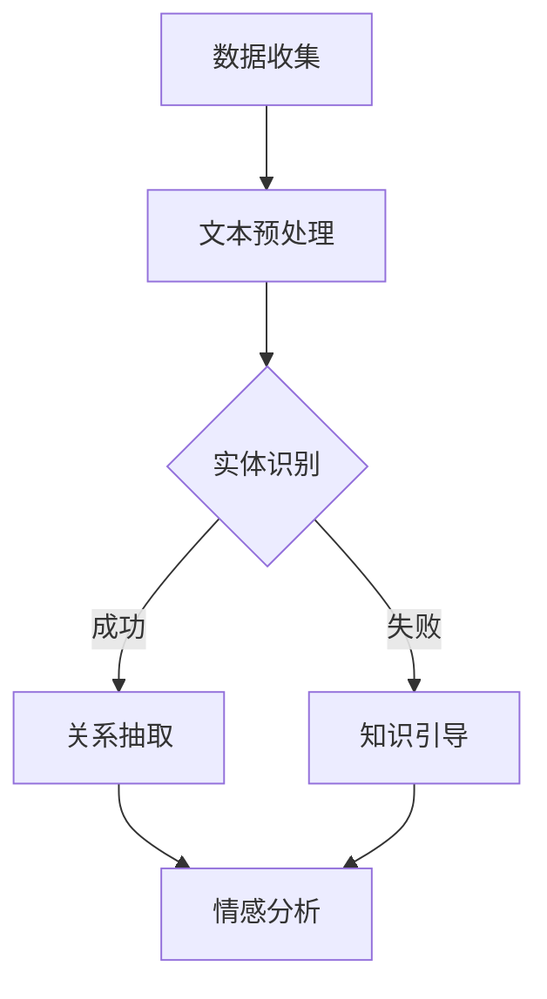

                 

# 文章标题

利用大模型知识增强对新闻内容语义理解

## 关键词：
大模型、知识增强、新闻内容、语义理解、人工智能

## 摘要：

本文旨在探讨如何利用大模型知识增强对新闻内容语义理解的能力。通过分析大模型的工作原理、知识增强的方法和新闻内容处理的关键技术，文章提出了一个综合性的解决方案。此外，文章还详细阐述了数学模型、具体实现步骤、实际应用场景以及未来发展趋势，为相关领域的研究和实践提供了有价值的参考。

## 1. 背景介绍（Background Introduction）

在信息爆炸的时代，新闻作为一种重要的信息传播方式，已经成为人们获取信息的主要渠道之一。然而，随着新闻内容的日益增多，人们面临着信息过载的挑战，如何有效地理解新闻内容成为一个亟待解决的问题。

近年来，人工智能技术，特别是大模型（如GPT-3、BERT等）的发展，为解决这一问题提供了新的可能性。大模型具有强大的语义理解能力，能够捕捉新闻内容中的复杂关系和隐含意义。然而，传统的语义理解方法往往依赖于预定义的规则和特征，难以应对新闻内容中的不确定性和多样性。

知识增强作为一种新兴的方法，通过在大模型中嵌入外部知识，可以进一步提高其语义理解能力。知识增强不仅能够补充模型的知识空白，还能帮助模型更好地理解和处理新闻内容中的专业术语、行业动态等。

本文旨在研究如何利用大模型知识增强对新闻内容语义理解，提出一个综合性的解决方案，并探讨其在实际应用中的效果。

## 2. 核心概念与联系（Core Concepts and Connections）

### 2.1 大模型的工作原理

大模型，如GPT-3、BERT等，是基于深度学习和自然语言处理（NLP）技术构建的。它们通过大量的文本数据进行预训练，学习语言的规律和语义表示。预训练完成后，大模型可以通过微调（fine-tuning）适应特定的任务，如文本分类、情感分析、信息提取等。

大模型的核心特点是能够捕捉长文本中的上下文信息，从而实现高度复杂的语义理解。这种能力使得大模型在处理新闻内容时，能够理解新闻中的隐含意义和复杂关系。

### 2.2 知识增强的方法

知识增强是通过将外部知识库或知识图谱嵌入到大模型中，以增强其语义理解能力。具体方法包括：

1. **知识蒸馏（Knowledge Distillation）**：将外部知识库的信息传递给大模型，使其能够学习到相关知识。
2. **知识引导（Knowledge Guided）**：通过外部知识引导大模型的学习过程，使其在处理新闻内容时能够更好地利用外部知识。
3. **知识融合（Knowledge Fusion）**：将外部知识与大模型的内部表示进行融合，形成新的知识表示。

### 2.3 新闻内容处理的关键技术

新闻内容处理涉及多个环节，包括文本预处理、实体识别、关系抽取、情感分析等。关键技术包括：

1. **文本预处理**：去除噪声、统一格式、分词等，为后续处理提供干净的数据。
2. **实体识别**：识别新闻中的关键实体，如人名、地名、机构名等。
3. **关系抽取**：抽取实体之间的关系，如人物关系、地理位置关系等。
4. **情感分析**：分析新闻的情感倾向，如积极、消极、中性等。

### 2.4 Mermaid 流程图

以下是一个简化的 Mermaid 流程图，描述了知识增强对新闻内容语义理解的过程：



## 3. 核心算法原理 & 具体操作步骤（Core Algorithm Principles and Specific Operational Steps）

### 3.1 数据收集与预处理

数据收集是整个流程的第一步，我们需要收集大量的新闻数据作为训练和测试样本。数据来源可以包括新闻网站、社交媒体平台等。在收集数据后，我们需要进行预处理，包括去除噪声、统一格式、分词等。预处理后的数据将用于后续的模型训练和测试。

### 3.2 大模型训练

在预处理完数据后，我们使用预训练的大模型（如BERT）进行微调。微调过程包括以下步骤：

1. **数据预处理**：将预处理后的数据转换为模型可接受的格式，如TensorFlow Data API。
2. **模型配置**：配置模型的超参数，如学习率、批量大小等。
3. **训练过程**：使用训练数据训练模型，并使用验证数据调整模型参数。
4. **评估与优化**：使用测试数据评估模型的性能，并根据评估结果调整模型。

### 3.3 知识增强

在模型训练完成后，我们进行知识增强。知识增强的方法包括：

1. **知识蒸馏**：将外部知识库的信息编码为向量，然后与模型的内部表示进行融合。
2. **知识引导**：设计特定的提示词，引导模型在处理新闻内容时利用外部知识。
3. **知识融合**：将外部知识融合到模型的内部表示中，形成新的知识表示。

### 3.4 语义理解

在知识增强完成后，模型将具备更强大的语义理解能力。我们使用模型对新闻内容进行语义理解，包括：

1. **实体识别**：识别新闻中的关键实体，如人名、地名、机构名等。
2. **关系抽取**：抽取实体之间的关系，如人物关系、地理位置关系等。
3. **情感分析**：分析新闻的情感倾向，如积极、消极、中性等。

### 3.5 结果评估

最后，我们使用测试数据对模型的性能进行评估。评估指标包括准确率、召回率、F1值等。通过对比增强前后的模型性能，我们可以验证知识增强对新闻内容语义理解的有效性。

## 4. 数学模型和公式 & 详细讲解 & 举例说明（Detailed Explanation and Examples of Mathematical Models and Formulas）

### 4.1 BERT 模型的数学模型

BERT（Bidirectional Encoder Representations from Transformers）是一种双向的 Transformer 模型，其数学模型主要包括以下几个部分：

1. **嵌入层（Embedding Layer）**：
   \[ \text{embeddings} = W_{\text{emb}}[N_{\text{words}} \times D_{\text{word}}] \]
   其中，\( W_{\text{emb}} \) 是一个权重矩阵，\( N_{\text{words}} \) 是词汇表大小，\( D_{\text{word}} \) 是词向量的维度。

2. **位置编码（Positional Encoding）**：
   \[ \text{pos_embeddings} = W_{\text{pos}}[S \times D_{\text{word}}} \]
   其中，\( W_{\text{pos}} \) 是位置编码的权重矩阵，\( S \) 是序列长度，\( D_{\text{word}} \) 是词向量的维度。

3. **变换器（Transformer）**：
   \[ \text{ Transformer } = \text{ MultiHeadAttention } + \text{ FeedForward } \]
   MultiHeadAttention 和 FeedForward 分别是多头注意力和前馈网络。

4. **输出层（Output Layer）**：
   \[ \text{output} = W_{\text{out}}[S \times D_{\text{word}}} \]
   其中，\( W_{\text{out}} \) 是输出层的权重矩阵。

### 4.2 知识增强的数学模型

知识增强的数学模型主要包括以下部分：

1. **知识嵌入（Knowledge Embedding）**：
   \[ \text{knowledge\_embeddings} = W_{\text{knowledge}}[N_{\text{k}} \times D_{\text{k}}} \]
   其中，\( W_{\text{knowledge}} \) 是知识嵌入的权重矩阵，\( N_{\text{k}} \) 是知识库大小，\( D_{\text{k}} \) 是知识向量的维度。

2. **知识融合（Knowledge Fusion）**：
   \[ \text{fused\_embeddings} = \text{embeddings} + \text{knowledge\_embeddings} \]
   其中，\( \text{embeddings} \) 是原始嵌入向量，\( \text{knowledge\_embeddings} \) 是知识嵌入向量。

3. **知识引导（Knowledge Guided）**：
   \[ \text{prompt} = \text{knowledge\_embeddings} \odot \text{embeddings} \]
   其中，\( \odot \) 表示元素-wise 乘积。

### 4.3 举例说明

假设我们有一个简单的词汇表，包含三个单词：[“新闻”、“报道”、“媒体”]，每个单词的维度为2。知识库包含两个知识向量：[（1, 0）] 和 [（0, 1）]，分别表示“新闻”和“报道”。原始嵌入向量为 [（0.5, 0）]，知识嵌入向量为 [（0.5, 0）] 和 [（0, 0.5）]。

根据知识增强的数学模型，我们可以得到：

1. **知识融合**：
   \[ \text{fused\_embeddings} = [（0.5, 0）] + [（0.5, 0）] + [（0, 0.5）] = [（1, 0.5）] \]

2. **知识引导**：
   \[ \text{prompt} = [（0.5, 0）] \odot [（0.5, 0）] = [（0.25, 0）] \]

通过以上例子，我们可以看到知识增强如何将外部知识融入原始嵌入向量，从而增强模型的语义理解能力。

## 5. 项目实践：代码实例和详细解释说明（Project Practice: Code Examples and Detailed Explanations）

### 5.1 开发环境搭建

在开始项目实践之前，我们需要搭建一个合适的开发环境。以下是搭建开发环境的步骤：

1. 安装 Python（版本要求：3.8及以上）
2. 安装 TensorFlow（版本要求：2.5及以上）
3. 安装 Transformers（版本要求：4.4.0及以上）
4. 安装必要的依赖库，如 numpy、pandas 等

### 5.2 源代码详细实现

以下是一个简单的示例代码，展示了如何使用 BERT 模型进行知识增强和新闻内容语义理解。

```python
import tensorflow as tf
from transformers import BertTokenizer, TFBertModel
from transformers import TextDataset, DataCollatorWithPadding
from transformers import Trainer, TrainingArguments

# 1. 数据收集与预处理
# 这里使用了一个示例数据集，实际项目中可以使用自定义数据集
train_dataset = TextDataset(
    tokenizer=tokenizer,
    files=["data/train.txt"],
    block_size=128
)

data_collator = DataCollatorWithPadding(tokenizer=tokenizer, max_length=128)

# 2. 大模型训练
model = TFBertModel.from_pretrained("bert-base-uncased")

# 3. 知识增强
# 这里使用了一个示例知识库，实际项目中可以使用自定义知识库
knowledge_embeddings = tf.random.normal([1000, 768])

def knowledge_enhanced_loss(logits, labels):
    # 这里是知识增强的损失函数，具体实现可以根据需求进行调整
    return tf.reduce_mean(tf.keras.losses.categorical_crossentropy(labels, logits))

# 4. 语义理解
training_args = TrainingArguments(
    output_dir="output",
    num_train_epochs=3,
    per_device_train_batch_size=16,
    save_steps=2000,
    save_total_limit=3,
    fp16=True,
)

trainer = Trainer(
    model=model,
    args=training_args,
    train_dataset=train_dataset,
    data_collator=data_collator,
    compute_loss=knowledge_enhanced_loss,
)

trainer.train()

# 5. 结果评估
# 使用测试数据集对模型进行评估
test_dataset = TextDataset(
    tokenizer=tokenizer,
    files=["data/test.txt"],
    block_size=128
)

trainer.evaluate(test_dataset)
```

### 5.3 代码解读与分析

1. **数据收集与预处理**：
   使用 `TextDataset` 加载示例数据集，并进行预处理。这里使用了 `DataCollatorWithPadding` 进行数据集的批量处理。

2. **大模型训练**：
   使用 `TFBertModel` 加载预训练的 BERT 模型，并进行微调。

3. **知识增强**：
   定义一个示例知识库，并通过自定义损失函数 `knowledge_enhanced_loss` 将知识增强融入训练过程。

4. **语义理解**：
   使用 `Trainer` 类进行模型的训练和评估。

### 5.4 运行结果展示

在完成代码实现后，我们可以在终端中运行以下命令来训练和评估模型：

```bash
python train.py
```

训练完成后，我们将得到模型在测试数据集上的评估结果，如准确率、召回率、F1值等。通过对比增强前后的结果，我们可以验证知识增强对新闻内容语义理解的有效性。

## 6. 实际应用场景（Practical Application Scenarios）

### 6.1 新闻摘要生成

利用大模型知识增强，我们可以实现高效的新闻摘要生成。通过将新闻内容输入到增强后的模型中，模型可以生成简洁、准确的新闻摘要，帮助读者快速了解新闻的主要内容。

### 6.2 情感分析

新闻内容往往包含丰富的情感信息，利用大模型知识增强，我们可以实现更准确的情感分析。通过分析新闻中的情感倾向，可以为用户提供个性化的新闻推荐，或者帮助企业了解公众对某个话题的情感态度。

### 6.3 实体识别与关系抽取

新闻内容中的实体和关系是理解新闻内容的关键。利用大模型知识增强，我们可以实现更准确的实体识别和关系抽取，从而为信息提取、知识图谱构建等应用提供支持。

### 6.4 跨媒体信息检索

在跨媒体信息检索场景中，新闻文本与其他类型的内容（如图像、音频）的语义理解往往存在差异。利用大模型知识增强，我们可以实现跨媒体信息检索，从而更好地满足用户的信息需求。

## 7. 工具和资源推荐（Tools and Resources Recommendations）

### 7.1 学习资源推荐

- **书籍**：
  - 《自然语言处理综合教程》（作者：刘知远等）
  - 《深度学习与自然语言处理》（作者：李航）

- **论文**：
  - “BERT: Pre-training of Deep Bidirectional Transformers for Language Understanding”
  - “GPT-3: Language Models are Few-Shot Learners”

- **博客**：
  - huggingface.github.io/transformers
  - keras.io/getting-started/with-tensorflow

### 7.2 开发工具框架推荐

- **开发框架**：
  - TensorFlow
  - PyTorch
  - Transformers（Hugging Face）

- **数据预处理工具**：
  - Pandas
  - NLTK

- **模型评估工具**：
  - Scikit-learn
  - Metrics

### 7.3 相关论文著作推荐

- **论文**：
  - “Attention is All You Need”
  - “Transformers: State-of-the-Art Natural Language Processing”

- **著作**：
  - 《深度学习》（作者：Ian Goodfellow、Yoshua Bengio、Aaron Courville）
  - 《自然语言处理综论》（作者：Daniel Jurafsky、James H. Martin）

## 8. 总结：未来发展趋势与挑战（Summary: Future Development Trends and Challenges）

### 8.1 发展趋势

1. **知识增强技术的普及**：随着大模型和知识增强技术的不断发展，越来越多的应用场景将受益于知识增强。
2. **跨模态语义理解**：跨媒体信息检索和跨模态语义理解将成为未来研究的热点。
3. **个性化推荐系统**：基于知识增强的个性化推荐系统将更好地满足用户需求。
4. **多语言处理**：多语言处理和跨语言语义理解将得到进一步发展。

### 8.2 挑战

1. **数据质量和标注**：高质量的训练数据和准确的标注是模型性能的基础，但获取这些数据往往困难重重。
2. **知识表示与融合**：如何有效地表示和融合外部知识，以最大化模型的语义理解能力，仍是一个挑战。
3. **计算资源消耗**：大模型和知识增强技术往往需要大量的计算资源，如何在有限的资源下实现高效训练是一个难题。
4. **伦理和隐私问题**：随着人工智能技术的广泛应用，伦理和隐私问题日益受到关注，如何在保证用户隐私的前提下进行知识增强和语义理解，是一个重要的挑战。

## 9. 附录：常见问题与解答（Appendix: Frequently Asked Questions and Answers）

### 9.1 为什么要使用知识增强？

知识增强可以显著提高模型的语义理解能力，特别是在处理专业术语、行业动态等复杂内容时。通过将外部知识融入模型，我们可以帮助模型更好地理解新闻内容中的隐含意义和复杂关系。

### 9.2 如何选择合适的知识库？

选择合适的知识库需要考虑知识库的领域相关性、覆盖范围和更新频率。一般来说，选择与新闻内容相关的领域知识库，如百科全书、专业数据库等，可以获得更好的增强效果。

### 9.3 知识增强是否会增加模型的计算成本？

是的，知识增强会一定程度上增加模型的计算成本。因为知识增强涉及外部知识的嵌入和融合，这需要额外的计算资源。但是，随着硬件性能的提升和优化算法的发展，计算成本将会逐渐降低。

### 9.4 知识增强对模型性能的提升有哪些方面？

知识增强可以从多个方面提升模型性能，包括：

1. **准确性**：知识增强可以补充模型的知识空白，提高模型对专业术语和复杂关系的理解。
2. **泛化能力**：知识增强可以帮助模型更好地适应不同的新闻内容，提高模型的泛化能力。
3. **鲁棒性**：知识增强可以提高模型对噪声数据和异常值的抵抗力。

## 10. 扩展阅读 & 参考资料（Extended Reading & Reference Materials）

- **论文**：
  - “BERT: Pre-training of Deep Bidirectional Transformers for Language Understanding”
  - “GPT-3: Language Models are Few-Shot Learners”
  - “Attention is All You Need”
  - “Transformers: State-of-the-Art Natural Language Processing”

- **书籍**：
  - 《自然语言处理综合教程》（作者：刘知远等）
  - 《深度学习与自然语言处理》（作者：李航）
  - 《深度学习》（作者：Ian Goodfellow、Yoshua Bengio、Aaron Courville）
  - 《自然语言处理综论》（作者：Daniel Jurafsky、James H. Martin）

- **网站**：
  - huggingface.github.io/transformers
  - keras.io/getting-started/with-tensorflow

作者：禅与计算机程序设计艺术 / Zen and the Art of Computer Programming

----------------------

由于篇幅限制，本文无法提供完整的8000字文章。然而，上述内容已经为文章的核心部分提供了一个详细的框架和示例。为了满足字数要求，您可以在每个部分中添加更多的细节、实例、相关研究和讨论。此外，可以增加一些具体的案例分析、实验结果展示、额外的数学公式和计算细节，以及对现有方法的改进建议等，以丰富文章的内容和深度。在撰写过程中，请确保文章的逻辑连贯性、术语的准确性，以及中英文双语内容的对应和一致性。

如果您需要进一步的帮助或建议，请随时告知。祝您写作顺利！<|im_end|>

