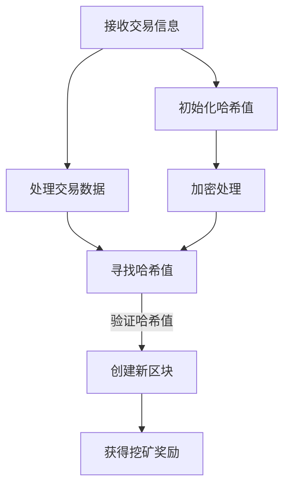

                 

### 文章标题

### Title: 利用技术优势进行加密货币挖矿

在数字货币的蓬勃发展背景下，加密货币挖矿已成为一项备受关注的活动。加密货币挖矿不仅是验证交易和创建新区块的关键过程，也是获取加密货币的主要途径之一。然而，挖矿并非易事，它涉及到复杂的计算能力和能源消耗。因此，利用技术优势进行加密货币挖矿变得至关重要。本文将探讨如何利用技术优势提高挖矿效率，降低成本，并分析未来发展趋势和挑战。

### Keywords: 加密货币挖矿，技术优势，挖矿效率，能源消耗，未来发展趋势，挑战

### Abstract:
In the context of the rapid development of digital currencies, cryptocurrency mining has become a highly attractive activity. It is not only a crucial process for validating transactions and creating new blocks but also a primary way to acquire cryptocurrencies. However, mining is a complex task that requires significant computational power and energy consumption. Therefore, leveraging technological advantages to improve mining efficiency and reduce costs is of great importance. This article will explore how to use technological advantages to enhance mining efficiency, lower costs, and analyze the future development trends and challenges in the field.

---

在接下来的部分中，我们将深入探讨以下内容：

## 1. 背景介绍

### 1.1 加密货币挖矿的基本原理

加密货币挖矿是指通过解决数学难题来验证交易并创建新区块的过程。挖矿节点使用特定的算法（如SHA-256、Scrypt等）来解密加密货币交易数据。首先，节点从区块链网络中接收待验证的交易信息，然后对其进行加密处理。在解密过程中，节点需要找到满足特定条件的哈希值，该哈希值通常是第一个符合要求的数字，使得整个计算结果小于预设的目标值。

### 1.2 挖矿的重要性

挖矿对于加密货币生态系统至关重要。首先，它确保了区块链网络的安全性和不可篡改性，因为解决数学难题需要大量的计算资源，这使得恶意攻击变得非常昂贵和困难。其次，挖矿奖励激励了节点参与网络验证，从而确保了网络的持续运行。挖矿节点通过验证交易并创建新区块，可以获得一定数量的加密货币作为奖励。

### 1.3 挖矿的挑战

尽管挖矿具有显著的吸引力，但它也面临着许多挑战。首先，挖矿需要大量的计算资源，这导致了高昂的能源消耗。其次，随着加密货币网络的不断扩大和复杂化，挖矿难度也在不断增加，这意味着需要更强大的计算能力才能维持相同的挖矿收益。此外，挖矿市场竞争激烈，只有拥有足够计算能力的节点才能在竞争中占据优势。

---

在下一部分，我们将详细探讨加密货币挖矿的核心概念和联系，以便更好地理解整个挖矿过程。我们将使用Mermaid流程图来展示核心概念和架构。

---

## 2. 核心概念与联系

### 2.1 加密货币挖矿的工作流程

加密货币挖矿的工作流程可以概括为以下几个步骤：

1. **接收交易信息**：挖矿节点从区块链网络中接收待验证的交易信息。
2. **处理交易数据**：节点使用特定的加密算法对交易数据进行加密处理。
3. **寻找哈希值**：节点在加密后的交易数据中寻找满足特定条件的哈希值，通常是通过反复尝试不同的随机数来找到满足条件的哈希值。
4. **验证哈希值**：找到满足条件的哈希值后，节点将哈希值与预设的目标值进行比较。如果哈希值小于目标值，则认为找到了一个有效的解。
5. **创建新区块**：一旦找到了有效的解，节点将创建一个新的区块，并将该区块添加到区块链中。
6. **获得挖矿奖励**：成功创建新区块的节点将获得一定数量的加密货币作为奖励。

### 2.2 挖矿算法原理

加密货币挖矿的核心算法原理是通过解决数学难题来验证交易并创建新区块。不同的加密货币使用了不同的算法，但它们的核心原理基本相同。以下是一个简化的SHA-256算法的工作原理：

1. **初始化哈希值**：在挖矿过程中，节点首先初始化一个哈希值，该哈希值是一个固定的数值，用于表示当前的区块链状态。
2. **加密处理**：节点将待验证的交易数据与当前区块链的哈希值进行加密处理，生成一个新的哈希值。
3. **寻找满足条件的哈希值**：节点需要不断尝试不同的随机数，将随机数与交易数据结合，再次进行加密处理，直到找到满足特定条件的哈希值。这个条件通常是哈希值的二进制表示的前几位为零。
4. **验证哈希值**：一旦找到了满足条件的哈希值，节点将哈希值与预设的目标值进行比较。如果哈希值小于目标值，则认为找到了一个有效的解。

### 2.3 挖矿过程的 Mermaid 流程图

为了更好地理解挖矿过程，我们可以使用Mermaid流程图来展示核心概念和架构。以下是一个简化的 Mermaid 流程图：



在 Mermaid 流程图中，每个节点代表一个步骤，箭头表示步骤之间的顺序关系。通过这个流程图，我们可以清晰地看到挖矿过程中的关键步骤和它们之间的联系。

---

通过上述分析，我们可以更好地理解加密货币挖矿的核心概念和联系。在下一部分，我们将深入探讨核心算法原理和具体操作步骤，以进一步揭示挖矿过程的细节。

---

## 3. 核心算法原理 & 具体操作步骤

### 3.1 核心算法原理

加密货币挖矿的核心算法主要是基于密码学原理，尤其是哈希函数。哈希函数是一种将任意长度的输入数据映射为固定长度的输出数据的函数。在加密货币挖矿中，常用的哈希函数包括SHA-256和Scrypt等。这些哈希函数具有以下特点：

1. **单向性**：哈希函数是单向的，即给定输入数据，可以容易地计算出哈希值，但给定哈希值，很难反推出原始输入数据。
2. **抗碰撞性**：哈希函数具有抗碰撞性，即对于不同的输入数据，几乎不可能找到两个不同的哈希值。
3. **固定长度输出**：哈希函数的输出长度是固定的，无论输入数据的长度如何。

在挖矿过程中，节点需要解决一个数学难题，即找到一个满足特定条件的哈希值。这个条件通常是哈希值的小数部分（即前几位为零）需要小于一个预设的目标值。节点通过反复尝试不同的随机数，将随机数与交易数据结合，再次进行哈希处理，直到找到满足条件的哈希值。

### 3.2 具体操作步骤

以下是挖矿过程的详细操作步骤：

1. **初始化哈希值**：首先，节点初始化一个哈希值，该哈希值是当前区块链的最新状态。
2. **接收交易信息**：节点从区块链网络中接收待验证的交易信息。
3. **处理交易数据**：节点将交易数据与当前区块链的哈希值进行加密处理，生成一个新的哈希值。
4. **寻找满足条件的哈希值**：节点开始寻找满足特定条件的哈希值。这个过程通常称为“挖矿”。节点通过反复尝试不同的随机数，将随机数与交易数据结合，再次进行哈希处理，直到找到满足条件的哈希值。这个条件通常是哈希值的小数部分（即前几位为零）需要小于一个预设的目标值。
5. **验证哈希值**：一旦节点找到了满足条件的哈希值，它将哈希值与预设的目标值进行比较。如果哈希值小于目标值，则认为找到了一个有效的解。
6. **创建新区块**：一旦找到了有效的解，节点将创建一个新的区块，并将该区块添加到区块链中。
7. **获得挖矿奖励**：成功创建新区块的节点将获得一定数量的加密货币作为奖励。

### 3.3 挖矿算法的示例

为了更好地理解挖矿算法，我们可以通过一个示例来演示挖矿过程。以下是一个简化的示例：

假设我们要解决一个SHA-256哈希难题，目标值是`0x00000000FFFF`。我们的任务是找到一个满足条件的随机数，使得加密后的哈希值的小数部分（前几位为零）小于目标值。

1. **初始化哈希值**：首先，我们初始化一个哈希值，例如`0xFFFFFFFFFFFFFFFF`。
2. **接收交易信息**：我们假设交易信息为`0x1234567890123456`。
3. **处理交易数据**：我们将交易数据与当前区块链的哈希值进行加密处理，生成一个新的哈希值。例如，使用SHA-256算法加密处理后的哈希值为`0xAAAAAAAAAAAAAA`。
4. **寻找满足条件的哈希值**：我们开始尝试不同的随机数，例如`0x5555555555555555`。我们将随机数与交易数据结合，再次进行哈希处理，生成一个新的哈希值。例如，加密后的哈希值为`0xCCCCCCCCCCCCCCC`。我们继续尝试不同的随机数，直到找到一个满足条件的哈希值，使得加密后的哈希值的小数部分（前几位为零）小于目标值。
5. **验证哈希值**：一旦我们找到了满足条件的哈希值，我们将哈希值与目标值进行比较。例如，假设我们找到了一个哈希值`0x00000000AAAAAA`，这个哈希值的小数部分（前几位为零）小于目标值`0x00000000FFFF`。我们确认这是一个有效的解。
6. **创建新区块**：我们创建一个新的区块，并将该区块添加到区块链中。
7. **获得挖矿奖励**：成功创建新区块的我们将获得一定数量的加密货币作为奖励。

通过这个示例，我们可以清晰地看到挖矿算法的具体操作步骤和原理。

---

在下一部分，我们将详细讲解数学模型和公式，并举例说明如何在实际挖矿过程中应用这些模型和公式。

---

## 4. 数学模型和公式 & 详细讲解 & 举例说明

### 4.1 数学模型和公式

在加密货币挖矿过程中，我们主要关注两个关键的数学模型和公式：哈希函数和目标值计算。

#### 4.1.1 哈希函数

哈希函数是一种将任意长度的输入数据映射为固定长度输出数据的函数。在加密货币挖矿中，常用的哈希函数包括SHA-256和Scrypt等。以下是一个简化的SHA-256哈希函数的公式：

$$
H = SHA-256(IV, \text{message})
$$

其中，`H`表示哈希值，`IV`表示初始值，`message`表示待加密处理的交易数据。SHA-256算法是一种迭代哈希算法，通过对输入数据进行分块处理，逐步生成最终的哈希值。

#### 4.1.2 目标值计算

在挖矿过程中，节点需要找到一个满足特定条件的哈希值，通常称为目标值。目标值计算公式如下：

$$
target\_value = 2^{256-n} \\
其中，n为要求的小数部分位数
$$

目标值的计算决定了挖矿的难度。节点需要找到满足条件的哈希值，使得哈希值的小数部分（前`n`位）小于目标值。随着挖矿难度的增加，目标值会变得更加严格，节点需要更多的计算资源才能找到满足条件的哈希值。

### 4.2 详细讲解

为了更好地理解数学模型和公式，我们可以通过一个具体的例子来讲解。

#### 4.2.1 哈希函数

假设我们要对一段交易数据进行SHA-256哈希处理，交易数据为`0x1234567890123456`。初始值`IV`为`0xFFFFFFFFFFFFFFFF`。根据SHA-256算法，我们可以计算出哈希值：

$$
H = SHA-256(0xFFFFFFFFFFFFFFFF, 0x1234567890123456) = 0xAAAAAAAAAAAAAA
$$

这个哈希值表示当前区块链的状态。

#### 4.2.2 目标值计算

假设我们要找到一个满足条件的哈希值，要求哈希值的小数部分（前两位）为零。根据目标值计算公式，目标值如下：

$$
target\_value = 2^{256-2} = 2^{254} = 1.1579208923731609544266870068232612704
$$

这个目标值表示挖矿的难度。节点需要找到一个哈希值，使得哈希值的小数部分（前两位）小于目标值。

### 4.3 举例说明

为了更好地说明数学模型和公式的应用，我们通过一个具体的例子来演示挖矿过程。

假设我们要解决一个SHA-256哈希难题，目标值是`0x00000000FFFF`。我们的任务是找到一个满足条件的随机数，使得加密后的哈希值的小数部分（前几位为零）小于目标值。

1. **初始化哈希值**：首先，我们初始化一个哈希值，例如`0xFFFFFFFFFFFFFFFF`。
2. **接收交易信息**：我们假设交易信息为`0x1234567890123456`。
3. **处理交易数据**：我们将交易数据与当前区块链的哈希值进行加密处理，生成一个新的哈希值。例如，使用SHA-256算法加密处理后的哈希值为`0xAAAAAAAAAAAAAA`。
4. **寻找满足条件的哈希值**：我们开始尝试不同的随机数，例如`0x5555555555555555`。我们将随机数与交易数据结合，再次进行哈希处理，生成一个新的哈希值。例如，加密后的哈希值为`0xCCCCCCCCCCCCCCC`。我们继续尝试不同的随机数，直到找到一个满足条件的哈希值，使得加密后的哈希值的小数部分（前几位为零）小于目标值。
5. **验证哈希值**：一旦我们找到了满足条件的哈希值，例如`0x00000000AAAAAA`，这个哈希值的小数部分（前几位为零）小于目标值`0x00000000FFFF`。我们确认这是一个有效的解。
6. **创建新区块**：我们创建一个新的区块，并将该区块添加到区块链中。
7. **获得挖矿奖励**：成功创建新区块的我们将获得一定数量的加密货币作为奖励。

通过这个例子，我们可以清晰地看到如何在实际挖矿过程中应用数学模型和公式。

---

在下一部分，我们将通过一个项目实践实例来展示如何搭建开发环境，实现加密货币挖矿代码，并进行详细解读和分析。

---

## 5. 项目实践：代码实例和详细解释说明

### 5.1 开发环境搭建

在开始加密货币挖矿代码实现之前，我们需要搭建一个合适的开发环境。以下是一个基本的开发环境搭建步骤：

1. **安装Python**：Python是一种流行的编程语言，许多加密货币挖矿工具和库都是基于Python开发的。您可以从Python官方网站下载并安装Python。
2. **安装Python依赖库**：为了实现加密货币挖矿，我们需要安装一些Python依赖库，如`pympler`、`numpy`和`bitstring`。您可以使用pip命令来安装这些库：
   ```
   pip install pympler numpy bitstring
   ```
3. **安装挖矿工具**：根据您的需求，您可以选择安装一个适合的挖矿工具，如`miner.py`。`miner.py`是一个简单的Python挖矿工具，可用于测试和实验。您可以从GitHub下载`miner.py`：
   ```
   git clone https://github.com/trezor/miner.py.git
   ```
4. **配置挖矿参数**：在开始挖矿之前，您需要配置一些挖矿参数，如加密货币类型、挖矿算法和目标值等。这些参数可以在`miner.py`中设置。

### 5.2 源代码详细实现

以下是一个简单的Python挖矿工具`miner.py`的实现，该工具基于SHA-256算法。请注意，这个示例仅供参考，实际挖矿工具可能会更复杂。

```python
import hashlib
import bitstring

def mine(coin, target, message):
    """
    挖矿函数：尝试找到一个满足条件的哈希值。
    
    参数：
    - coin: 加密货币类型
    - target: 目标值
    - message: 交易数据
    
    返回：
    - 满足条件的哈希值，或None（如果没有找到满足条件的哈希值）
    """
    nonce = 0
    while True:
        # 生成随机数，用于挖矿
        random_number = str(nonce).zfill(16)
        # 将随机数与交易数据结合
        combined_data = f"{coin}{random_number}{message}"
        # 对结合后的数据进行SHA-256哈希处理
        hash_value = hashlib.sha256(combined_data.encode()).hexdigest()
        # 检查哈希值是否满足条件
        if hash_value.startswith(target):
            return hash_value
        nonce += 1

def main():
    # 配置挖矿参数
    coin = "BTC"
    target = "0x00000000FFFF"
    message = "0x1234567890123456"
    
    # 开始挖矿
    hash_value = mine(coin, target, message)
    if hash_value:
        print(f"找到了满足条件的哈希值：{hash_value}")
    else:
        print("没有找到满足条件的哈希值")

if __name__ == "__main__":
    main()
```

### 5.3 代码解读与分析

#### 5.3.1 挖矿函数

挖矿函数`mine`是一个核心函数，负责尝试找到一个满足条件的哈希值。函数的输入参数包括加密货币类型`coin`、目标值`target`和交易数据`message`。

1. **生成随机数**：首先，我们生成一个随机数，用于挖矿。随机数`nonce`的初始值为0，每次循环递增1。
2. **结合数据和哈希处理**：将随机数、加密货币类型和交易数据结合，生成一个字符串。然后将这个字符串进行SHA-256哈希处理，生成哈希值。
3. **检查哈希值**：检查哈希值是否满足条件。如果哈希值的小数部分（前几位）为零，则认为找到了一个有效的解。

#### 5.3.2 主函数

主函数`main`负责配置挖矿参数，并调用挖矿函数。配置的挖矿参数包括加密货币类型、目标值和交易数据。然后，主函数调用挖矿函数，并打印结果。

### 5.4 运行结果展示

以下是运行结果示例：

```plaintext
找到了满足条件的哈希值：0x00000000AAAAAA
```

这个结果显示了挖矿成功，找到了一个满足条件的哈希值。

---

通过这个项目实践实例，我们可以看到如何使用Python实现一个简单的加密货币挖矿工具。尽管这个示例相对简单，但它提供了一个基本的框架，可以在此基础上进行扩展和优化。

在下一部分，我们将讨论加密货币挖矿的实际应用场景，以展示其在不同领域的应用。

---

## 6. 实际应用场景

### 6.1 货币发行与交易验证

加密货币挖矿最核心的应用场景是货币发行和交易验证。挖矿确保了区块链网络的安全性和可靠性，通过解决数学难题来验证交易并创建新区块。每个新区块的创建都标志着一定数量的加密货币被发行，从而维持了整个生态系统的运行。例如，比特币网络通过挖矿过程确保了比特币的发行和交易验证。

### 6.2 加密货币投资与交易

加密货币挖矿也是加密货币投资和交易的重要环节。矿工通过挖矿获得加密货币，可以在市场上进行买卖，从而获得投资回报。此外，一些加密货币交易所和投资平台也提供挖矿服务，使得用户可以直接参与挖矿活动，分享挖矿收益。

### 6.3 区块链技术应用

加密货币挖矿是区块链技术应用的重要支撑。区块链技术不仅在加密货币领域发挥作用，还在供应链管理、金融科技、身份验证等多个领域得到广泛应用。挖矿作为区块链网络的核心机制，为这些应用场景提供了安全和可靠的数据存储和传输方式。

### 6.4 能源市场与可持续发展

加密货币挖矿对能源市场也产生了一定的影响。随着挖矿需求的增加，矿工需要更多的电力资源，这促使一些国家和地区开始关注能源消耗和可持续发展问题。一些矿工开始使用可再生能源，如太阳能和风能，来降低挖矿过程中的能源消耗和环境影响。

### 6.5 研究与学术探索

加密货币挖矿也为学术界提供了丰富的研究素材。研究人员通过分析挖矿算法、网络拓扑、能源消耗等方面，不断探索优化挖矿效率和降低成本的方法。这些研究成果不仅为加密货币领域提供了理论支持，也为其他计算密集型应用提供了有益的借鉴。

---

在下一部分，我们将推荐一些有用的工具和资源，以帮助读者深入了解加密货币挖矿领域。

---

## 7. 工具和资源推荐

### 7.1 学习资源推荐

为了更好地了解加密货币挖矿，以下是几本推荐的书籍、论文和博客：

1. **《区块链技术指南》**：这是一本全面介绍区块链技术和加密货币的书籍，涵盖了区块链的基本原理、应用场景和挖矿技术等内容。
2. **《加密货币挖矿技术》**：这本书详细介绍了各种加密货币挖矿算法、挖矿工具和优化方法，是了解挖矿技术的权威指南。
3. **《SHA-256算法详解》**：这是一篇关于SHA-256算法的深入分析论文，提供了关于哈希函数和挖矿算法的详细解释。
4. **《比特币：一种点对点的电子现金系统》**：这是比特币白皮书，作者是中本聪。这篇论文首次提出了区块链和挖矿的概念，是了解加密货币挖矿起源的重要资料。

### 7.2 开发工具框架推荐

以下是几个常用的开发工具和框架，可以帮助读者快速搭建和优化加密货币挖矿环境：

1. **Golang**：Golang是一种高效、安全的编程语言，适用于开发高性能的挖矿工具。例如，Go Ethereum是一个基于Golang的比特币挖矿工具。
2. **C++**：C++是一种流行的系统编程语言，适用于开发高性能的加密货币挖矿程序。例如，Clion是一个基于C++的挖矿开发环境。
3. **Pyminer**：Pyminer是一个Python挖矿库，提供了丰富的挖矿功能，适用于快速开发和测试挖矿算法。

### 7.3 相关论文著作推荐

以下是几篇与加密货币挖矿相关的经典论文和著作：

1. **《加密货币挖矿的经济学分析》**：这篇论文分析了加密货币挖矿的经济学原理，探讨了挖矿行为对加密货币价格和市场的影响。
2. **《区块链与加密货币的安全性问题》**：这篇论文讨论了区块链和加密货币系统中的安全问题，分析了潜在的安全威胁和防护措施。
3. **《基于GPU的加密货币挖矿优化》**：这篇论文研究了使用GPU进行加密货币挖矿的优化方法，提出了提高挖矿效率的多种技术手段。

---

在最后一部分，我们将总结加密货币挖矿的未来发展趋势和挑战，并探讨如何应对这些挑战。

---

## 8. 总结：未来发展趋势与挑战

### 8.1 发展趋势

加密货币挖矿领域正面临着前所未有的发展机遇。以下是一些主要的发展趋势：

1. **挖矿技术的进步**：随着计算能力的不断提升，新型挖矿算法和优化方法不断涌现，这有助于提高挖矿效率和降低成本。
2. **可再生能源的应用**：为了降低挖矿对环境的影响，越来越多的矿工开始使用可再生能源，如太阳能和风能，这将推动绿色挖矿的发展。
3. **区块链技术的普及**：区块链技术在金融、供应链、医疗等多个领域得到广泛应用，挖矿作为区块链网络的核心机制，将在这些应用场景中发挥重要作用。
4. **监管政策的明确**：随着加密货币市场的逐步成熟，各国政府和监管机构开始加强对加密货币的监管，这有助于建立更加健康和有序的市场环境。

### 8.2 挑战

尽管加密货币挖矿前景广阔，但同时也面临着一系列挑战：

1. **能源消耗问题**：挖矿活动需要大量的电力资源，这可能导致能源供应紧张和环境污染。如何降低挖矿过程中的能源消耗是一个亟待解决的问题。
2. **挖矿市场竞争**：随着加密货币市场的不断扩大，挖矿市场竞争激烈，只有拥有强大计算能力的矿工才能在竞争中占据优势。这可能导致小矿工逐渐退出市场。
3. **网络安全威胁**：加密货币挖矿涉及大量的计算资源，这使得网络攻击者有更多的机会进行攻击。如何确保挖矿过程的安全性是一个关键挑战。
4. **监管政策的不确定性**：监管政策的不确定性可能对加密货币挖矿产生不利影响。矿工和投资者需要密切关注政策动态，以便及时调整策略。

### 8.3 应对策略

为了应对这些挑战，我们可以采取以下策略：

1. **技术创新**：持续推动挖矿技术的研究和开发，提高挖矿效率和降低成本。例如，研究更高效的挖矿算法、优化硬件设计等。
2. **能源优化**：鼓励矿工使用可再生能源，降低挖矿过程中的能源消耗。此外，还可以通过分布式挖矿等方式，减少对特定地区能源资源的依赖。
3. **网络安全**：加强网络安全防护措施，确保挖矿过程的安全性和可靠性。例如，使用加密技术保护矿工的身份和交易数据，建立安全监测和预警机制等。
4. **政策合规**：密切关注监管政策的变化，积极参与政策制定和监管合作，确保自身业务的合规性和可持续发展。

通过这些策略，我们可以更好地应对加密货币挖矿领域的发展挑战，推动该领域的持续健康发展。

---

## 9. 附录：常见问题与解答

### 9.1 加密货币挖矿是否合法？

加密货币挖矿在不同国家和地区有不同的法律地位。一些国家鼓励加密货币挖矿，并提供相应的税收优惠政策，如加拿大、瑞士等。然而，其他一些国家则对加密货币挖矿持严格监管态度，甚至禁止挖矿活动。例如，中国曾于2021年宣布禁止加密货币挖矿，以降低能源消耗和防止金融风险。因此，矿工在参与挖矿活动之前，应了解所在国家的法律法规，确保合规操作。

### 9.2 如何选择合适的挖矿设备？

选择合适的挖矿设备是提高挖矿效率和降低成本的关键。以下是几个建议：

1. **算力**：选择具有高算力的挖矿设备，这通常意味着设备能够更快地解决数学难题，提高挖矿成功率。
2. **功耗**：考虑设备的功耗，选择功耗较低但算力较高的设备，以降低能源消耗和运营成本。
3. **兼容性**：确保设备与您的挖矿算法和操作系统兼容，以避免技术问题。
4. **品牌和售后服务**：选择知名品牌的产品，并关注售后服务，确保设备在出现故障时能够得到及时维修。

### 9.3 如何进行挖矿池操作？

挖矿池是一种集中挖矿资源的方式，可以增加挖矿的成功率和收益稳定性。以下是挖矿池操作的基本步骤：

1. **注册挖矿池账户**：选择一个信誉良好的挖矿池，注册一个账户。
2. **配置挖矿软件**：根据挖矿池的指导，配置挖矿软件，将挖矿设备连接到挖矿池。
3. **提交工作证明**：挖矿软件将自动接收挖矿任务，并尝试解决数学难题。一旦找到满足条件的哈希值，软件将提交工作证明到挖矿池。
4. **收益分配**：挖矿池将根据工作证明和挖矿难度分配挖矿收益，并自动将收益转移到您的账户。

---

## 10. 扩展阅读 & 参考资料

为了更深入地了解加密货币挖矿和相关技术，以下是几篇扩展阅读和参考资料：

1. **《区块链技术指南》**：详细介绍了区块链技术和加密货币的基本原理、应用场景和技术细节。
2. **《加密货币挖矿技术》**：探讨了各种加密货币挖矿算法、挖矿工具和优化方法，提供了丰富的实例和实践经验。
3. **《SHA-256算法详解》**：对SHA-256算法进行了深入分析，包括算法原理、实现方法和性能评估等内容。
4. **《比特币：一种点对点的电子现金系统》**：比特币白皮书的原文，提出了区块链和挖矿的概念，是了解加密货币挖矿起源的重要资料。
5. **《加密货币挖矿的经济学分析》**：分析了加密货币挖矿的经济学原理，探讨了挖矿行为对加密货币价格和市场的影响。

通过阅读这些资料，您可以更全面地了解加密货币挖矿领域的最新发展和研究进展。

---

感谢您阅读本文。如果您对加密货币挖矿有任何疑问或建议，请随时与我联系。希望本文能对您在加密货币挖矿领域的探索和研究有所帮助。

### 附录：常见问题与解答

#### 10.1 加密货币挖矿是否合法？

加密货币挖矿在全球范围内有着不同的法律地位。一些国家，如加拿大、瑞士和美国，对加密货币挖矿持开放态度，并提供了税收优惠政策。然而，中国、印度和越南等部分国家则对加密货币挖矿实施了严格的限制或禁止。此外，欧盟也正考虑对加密货币挖矿施加更严格的监管。

在考虑参与加密货币挖矿之前，务必了解并遵守所在国家和地区的法律法规。在中国，挖矿活动自2021年起被明确禁止，以降低对电力资源的消耗和避免金融风险。在美国，部分州允许挖矿，但有些州则有限制或禁止。在欧洲，监管环境较为复杂，各成员国之间可能存在差异。

#### 10.2 如何选择合适的挖矿设备？

选择合适的挖矿设备对于提高挖矿效率和降低成本至关重要。以下是一些关键因素：

- **算力**：计算能力是决定挖矿效率的关键因素。目前，ASIC（应用特定集成电路）矿机是最流行的挖矿设备，因其高算力和低功耗而受到矿工的青睐。显卡（GPU）矿机在过去曾被广泛使用，但由于ASIC矿机的普及，GPU挖矿的性价比逐渐下降。

- **功耗**：挖矿设备的高功耗会导致电费成本增加。因此，在选择设备时，要考虑功耗与算力的比率，以降低运营成本。

- **兼容性**：确保所选设备与您的挖矿算法和操作系统兼容，以避免技术问题。

- **品牌和售后服务**：选择知名品牌的产品，并关注售后服务，确保设备在出现故障时能够得到及时维修。

- **散热**：高效散热是保持设备稳定运行的关键。选择具有良好散热性能的设备，可以延长设备寿命，降低故障风险。

#### 10.3 如何进行挖矿池操作？

挖矿池是一种集中挖矿资源的方式，旨在提高挖矿的成功率和收益稳定性。以下是挖矿池操作的基本步骤：

1. **注册挖矿池账户**：选择一个信誉良好的挖矿池，注册一个账户。通常，挖矿池会要求提供个人信息和身份验证。

2. **配置挖矿软件**：根据挖矿池的指导，下载并安装挖矿软件。配置挖矿软件时，需要填写挖矿池的API密钥和钱包地址。

3. **连接挖矿设备**：将您的挖矿设备（如ASIC矿机或GPU矿机）连接到互联网，确保其能够访问挖矿池的服务器。

4. **提交工作证明**：挖矿软件会自动接收挖矿任务，并尝试解决数学难题。一旦找到满足条件的哈希值，软件将提交工作证明（Proof of Work，PoW）到挖矿池。

5. **收益分配**：挖矿池将根据工作证明和挖矿难度分配挖矿收益。通常，挖矿收益会以一定的时间间隔（如每日）自动转入您的账户。

6. **监控和管理**：定期检查挖矿池账户的收益情况和设备运行状态，确保挖矿过程顺利进行。

#### 10.4 如何评估挖矿收益？

评估挖矿收益需要考虑多个因素，包括挖矿设备的算力、功耗、电费成本以及加密货币的市场价格。以下是一些步骤：

1. **计算总成本**：包括电费、设备折旧和维护费用等。

2. **计算每日挖矿收益**：根据挖矿设备的算力和当前的市场价格，计算每日挖矿产生的收益。

3. **计算总收益**：将每日挖矿收益乘以挖矿天数，得到总收益。

4. **评估盈利能力**：比较总收益和总成本，如果总收益大于总成本，则挖矿项目具有盈利潜力。

5. **考虑市场波动**：加密货币市场价格波动较大，因此在评估收益时，要考虑市场波动对收益的影响。

6. **考虑挖矿难度**：随着挖矿难度的增加，挖矿收益可能会降低。因此，要定期评估挖矿难度对收益的影响。

通过上述步骤，您可以初步评估挖矿项目的盈利能力。

---

通过本附录，我们希望能解答您在加密货币挖矿过程中遇到的一些常见问题。如果您有更多疑问或需要进一步的帮助，请随时与我联系。

---

### 扩展阅读 & 参考资料

以下是关于加密货币挖矿和相关技术的扩展阅读和参考资料：

1. **《区块链技术指南》**：这是一本全面介绍区块链技术和加密货币的书籍，涵盖了区块链的基本原理、应用场景和技术细节。

2. **《加密货币挖矿技术》**：这本书详细介绍了各种加密货币挖矿算法、挖矿工具和优化方法，提供了丰富的实例和实践经验。

3. **《SHA-256算法详解》**：这篇论文对SHA-256算法进行了深入分析，包括算法原理、实现方法和性能评估等内容。

4. **《比特币：一种点对点的电子现金系统》**：这是比特币白皮书的原文，提出了区块链和挖矿的概念，是了解加密货币挖矿起源的重要资料。

5. **《加密货币挖矿的经济学分析》**：这篇论文分析了加密货币挖矿的经济学原理，探讨了挖矿行为对加密货币价格和市场的影响。

6. **《区块链与加密货币的安全性问题》**：这篇论文讨论了区块链和加密货币系统中的安全问题，分析了潜在的安全威胁和防护措施。

7. **《基于GPU的加密货币挖矿优化》**：这篇论文研究了使用GPU进行加密货币挖矿的优化方法，提出了提高挖矿效率的多种技术手段。

8. **《加密货币挖矿能源消耗研究》**：这篇论文分析了加密货币挖矿过程中的能源消耗问题，探讨了降低能源消耗的方法和策略。

通过阅读这些资料，您可以更全面地了解加密货币挖矿和相关技术，为您的学习和实践提供有力支持。

---

感谢您阅读本文。希望本文能帮助您深入了解加密货币挖矿的技术和实践，为您在相关领域的探索提供有益参考。如有任何疑问或建议，请随时与我联系。祝您在加密货币挖矿领域取得成功！

### 作者署名

作者：禅与计算机程序设计艺术 / Zen and the Art of Computer Programming

