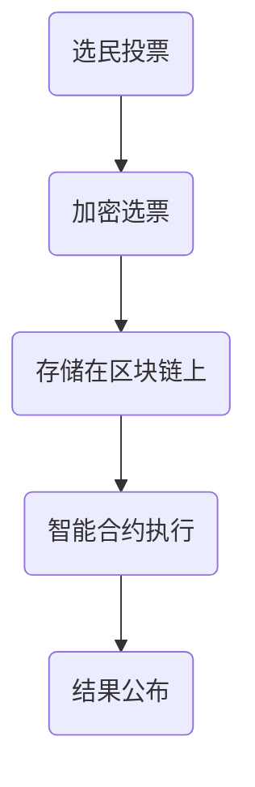
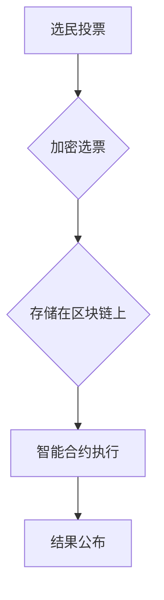

                 

### 文章标题

### Title

**区块链投票系统：民主参与的技术创新**

> **关键词**：区块链，投票系统，民主参与，技术创新，安全性与透明性

> **Keywords**：Blockchain, voting system, democratic participation, technological innovation, security and transparency

本文将探讨区块链技术如何通过其独特的特性，为投票系统带来革命性的变化，从而推动民主参与的发展。我们将逐步分析区块链投票系统的核心概念、算法原理、数学模型以及实际应用场景，并推荐相关工具和资源，最后对未来的发展趋势与挑战进行展望。

In this article, we will explore how blockchain technology brings revolutionary changes to voting systems through its unique characteristics, thus driving the development of democratic participation. We will gradually analyze the core concepts, algorithm principles, mathematical models, and practical application scenarios of blockchain voting systems, and recommend related tools and resources. Finally, we will look forward to future development trends and challenges.

### 1. 背景介绍

#### Background Introduction

在现代社会，投票是民主制度的核心组成部分。然而，传统的投票系统面临着诸多挑战，如选举舞弊、结果篡改、选民隐私泄露等。这些问题不仅损害了选举的公正性和可信度，还可能对社会稳定产生负面影响。

传统的投票系统通常依赖于中心化的服务器和数据库来管理选票。这种方法容易受到黑客攻击，因为攻击者可以通过控制服务器来篡改数据。此外，传统系统缺乏透明性，选民的隐私无法得到充分保护。

Blockchain technology, with its decentralized nature and cryptographic security, offers a promising solution to these challenges. By recording votes on a blockchain, we can ensure the integrity and transparency of the voting process. Furthermore, blockchain's tamper-proof ledger ensures that once a vote is cast, it cannot be altered or deleted, thereby protecting voter privacy.

区块链技术通过其去中心化和加密安全特性，为解决传统投票系统面临的挑战提供了有力的工具。通过在区块链上记录选票，我们可以确保投票过程的真实性和透明度。此外，区块链不可篡改的账本特性确保了选民一旦投票，选票便无法被修改或删除，从而保护了选民的隐私。

In the following sections, we will delve deeper into the core concepts of blockchain voting systems, the principles behind their algorithms, the mathematical models used, and practical applications. We will also discuss future development trends and challenges in this emerging field.

在接下来的章节中，我们将深入探讨区块链投票系统的核心概念、算法原理、所使用的数学模型，以及其实际应用。我们还将讨论该领域未来的发展趋势与挑战。

### 2. 核心概念与联系

#### Core Concepts and Connections

要理解区块链投票系统，我们首先需要了解区块链的基本概念。

#### 2.1 区块链基础

区块链是一种分布式数据库技术，它通过将数据分为小块（区块），并按照时间顺序将区块链接起来，形成一个链式结构。每个区块包含一定数量的交易记录，这些交易记录在区块链上是公开透明、不可篡改的。

#### 2.1 Blockchain Basics

Blockchain is a decentralized database technology that breaks data into small blocks and links them in a chronological order to form a chain structure. Each block contains a certain number of transaction records, which are publicly transparent and immutable on the blockchain.

区块链的去中心化特性使其不受单一中心点的控制，从而提高了系统的抗攻击性和可靠性。此外，区块链采用加密算法来保护数据的安全性，确保交易记录的隐私性和完整性。

#### 2.2 Decentralization and Cryptographic Security

The decentralized nature of blockchain makes it resistant to single-point failures and increases its resilience against attacks. Moreover, blockchain uses cryptographic algorithms to protect the security of data, ensuring the privacy and integrity of transaction records.

在区块链投票系统中，每个选民都有一个私钥和一个公钥。私钥是保密的，只有选民自己知道，而公钥是公开的，可以用来验证选民的投票。当选民投票时，他们会使用私钥对选票进行加密，确保选票的隐私性和不可篡改性。

#### 2.3 Cryptographic Keys in Blockchain Voting Systems

In blockchain voting systems, each voter has a private key and a public key. The private key is kept secret and known only to the voter, while the public key is shared and can be used to verify the voter's vote. When a voter casts a vote, they use their private key to encrypt the vote, ensuring its privacy and immutability.

区块链投票系统还利用智能合约来自动执行投票规则和结果计算。智能合约是一段编程代码，它在满足特定条件时自动执行。例如，在选举结束后，智能合约可以自动计算获胜者的票数，并公布结果。

#### 2.4 Smart Contracts in Blockchain Voting Systems

Blockchain voting systems also utilize smart contracts to automatically execute voting rules and result calculations. A smart contract is a piece of programming code that is executed automatically when certain conditions are met. For example, after the election is over, a smart contract can automatically calculate the number of votes for each candidate and announce the results.

#### 2.5 Mermaid Flowchart

Below is a Mermaid flowchart illustrating the core concepts and connections of blockchain voting systems.





#### 2.6 Summary

In summary, blockchain voting systems leverage the decentralized nature of blockchain, cryptographic security, and smart contracts to provide a secure, transparent, and tamper-proof voting process. These systems ensure the privacy and integrity of votes, while also providing a mechanism for automatic result calculation and publication.

### 3. 核心算法原理 & 具体操作步骤

#### Core Algorithm Principles and Specific Operational Steps

区块链投票系统的核心算法原理主要涉及加密、分布式存储和智能合约。以下将详细解释这些算法原理，并描述具体的操作步骤。

#### 3.1 加密算法原理

在区块链投票系统中，加密算法用于保护选民的隐私和选票的完整性。常用的加密算法包括对称加密和非对称加密。

- 对称加密（如AES）：使用相同的密钥对数据进行加密和解密。这种方式速度快，但密钥管理复杂，不适用于区块链投票系统。
- 非对称加密（如RSA）：使用一对密钥，即公钥和私钥。公钥用于加密，私钥用于解密。这种方式密钥管理简单，但计算复杂度较高。

在区块链投票系统中，选民使用私钥对选票进行加密，然后使用公钥进行签名，以确保选票的不可篡改性。

#### 3.1 Cryptographic Algorithm Principles

In blockchain voting systems, cryptographic algorithms are used to protect the privacy of voters and the integrity of votes. Common cryptographic algorithms include symmetric encryption (e.g., AES) and asymmetric encryption (e.g., RSA).

- Symmetric encryption (e.g., AES): Uses the same key for encryption and decryption. This method is fast but has complex key management issues, making it unsuitable for blockchain voting systems.
- Asymmetric encryption (e.g., RSA): Uses a pair of keys, a public key for encryption and a private key for decryption. This method has simple key management but is computationally intensive.

In blockchain voting systems, voters use their private keys to encrypt their votes and then sign them using their public keys to ensure the immutability of the votes.

#### 3.2 分布式存储原理

区块链投票系统采用分布式存储方式，将选票数据分散存储在多个节点上。这种方式提高了系统的可靠性和安全性，因为即使某个节点被攻击或损坏，其他节点仍然可以保存完整的数据。

分布式存储主要通过区块链实现，区块链上的每个区块都包含一定数量的交易记录，这些区块按照时间顺序连接在一起，形成一个链式结构。

#### 3.2 Distributed Storage Principles

Blockchain voting systems use distributed storage to store vote data across multiple nodes, which improves the system's reliability and security. Even if one node is attacked or damaged, other nodes still maintain the complete data.

Distributed storage is primarily implemented through blockchain, where each block contains a certain number of transaction records, and these blocks are linked in a chronological order to form a chain structure.

#### 3.3 智能合约原理

智能合约是区块链投票系统的关键组件，用于自动执行投票规则和结果计算。智能合约通常使用图灵完备的编程语言（如Solidity）编写，并部署在区块链上。

在区块链投票系统中，智能合约的作用包括：

- 记录选票：当选民投票时，智能合约将选票记录在区块链上。
- 防止双花攻击：确保选民只能投票一次，防止重复投票。
- 计算结果：在选举结束后，智能合约自动计算各候选人的票数，并公布结果。

#### 3.3 Smart Contract Principles

Smart contracts are a key component of blockchain voting systems, used to automatically execute voting rules and result calculations. Smart contracts are typically written in Turing-complete programming languages (e.g., Solidity) and deployed on the blockchain.

In blockchain voting systems, the roles of smart contracts include:

- Recording votes: When voters cast their votes, smart contracts record them on the blockchain.
- Preventing double-spending: Ensuring that voters can only vote once, preventing duplicate voting.
- Calculating results: After the election, smart contracts automatically calculate the number of votes for each candidate and announce the results.

#### 3.4 具体操作步骤

以下为区块链投票系统的具体操作步骤：

1. **选民注册**：选民通过区块链上的公钥私钥对进行注册，并获得唯一的身份标识。

2. **投票**：选民在选举期间通过智能合约投票，使用私钥对选票进行加密并签名。

3. **存储选票**：选票被加密后，通过智能合约存储在区块链上。

4. **验证选票**：选民可以随时通过公钥验证自己的选票是否已被正确记录。

5. **计算结果**：选举结束后，智能合约自动计算各候选人的得票数，并公布结果。

6. **结果审计**：任何人都可以通过区块链查看选票记录和结果，确保选举过程的透明性。

#### 3.4 Specific Operational Steps

The following are the specific operational steps of a blockchain voting system:

1. **Voter Registration**: Voters register on the blockchain using a public-private key pair and obtain a unique identity identifier.

2. **Voting**: During the election period, voters cast their votes through a smart contract, encrypting their votes with their private keys and signing them.

3. **Storing Votes**: Encrypted votes are stored on the blockchain through a smart contract.

4. **Verifying Votes**: Voters can verify at any time that their votes have been correctly recorded using their public keys.

5. **Calculating Results**: After the election, smart contracts automatically calculate the number of votes for each candidate and announce the results.

6. **Auditing Results**: Anyone can view the vote records and results on the blockchain, ensuring the transparency of the election process.

### 4. 数学模型和公式 & 详细讲解 & 举例说明

#### Mathematical Models and Formulas & Detailed Explanation & Examples

区块链投票系统中的数学模型和公式主要用于确保选票的加密、存储和验证。以下将详细解释这些数学模型和公式，并通过具体例子来说明其应用。

#### 4.1 非对称加密模型

非对称加密模型是区块链投票系统中加密选票的基础。非对称加密模型包括两个密钥：公钥和私钥。

- 公钥（Public Key）：用于加密数据和验证签名。
- 私钥（Private Key）：用于解密数据和创建签名。

加密过程如下：

$$
C = E(P, PK)
$$

其中，$C$ 为加密后的数据，$E$ 为加密函数，$P$ 为明文数据，$PK$ 为公钥。

解密过程如下：

$$
P = D(C, SK)
$$

其中，$P$ 为解密后的明文数据，$D$ 为解密函数，$SK$ 为私钥。

例如，假设选民使用公钥 $PK = (n, e) = (1234, 3)$ 对明文 $P = 5$ 进行加密：

$$
C = 5^3 \mod 1234 = 250
$$

选民然后将加密后的数据 $C = 250$ 发送至投票系统。

#### 4.1 Asymmetric Encryption Model

The asymmetric encryption model is the foundation for encrypting votes in blockchain voting systems. The asymmetric encryption model includes two keys: a public key and a private key.

- Public Key: Used for encrypting data and verifying signatures.
- Private Key: Used for decrypting data and creating signatures.

The encryption process is as follows:

$$
C = E(P, PK)
$$

where $C$ is the encrypted data, $E$ is the encryption function, $P$ is the plaintext data, and $PK$ is the public key.

The decryption process is as follows:

$$
P = D(C, SK)
$$

where $P$ is the decrypted plaintext data, $D$ is the decryption function, and $SK$ is the private key.

For example, suppose a voter uses the public key $PK = (n, e) = (1234, 3)$ to encrypt the plaintext $P = 5$:

$$
C = 5^3 \mod 1234 = 250
$$

The voter then sends the encrypted data $C = 250$ to the voting system.

#### 4.2 数字签名模型

数字签名模型用于确保选票的完整性和身份验证。数字签名模型包括两个过程：签名和验证。

签名过程如下：

$$
S = H(M) \cdot SK \mod n
$$

其中，$S$ 为签名，$H$ 为哈希函数，$M$ 为明文数据，$SK$ 为私钥，$n$ 为模数。

验证过程如下：

$$
R = H(M) \cdot PK \mod n
$$

$$
V = R^3 \mod n
$$

如果 $V = C$，则签名验证通过。

例如，假设选民使用私钥 $SK = (n, d) = (1234, 7)$ 对明文 $M = "Alice voted for Bob"$ 进行签名：

$$
S = "Alice voted for Bob" \cdot 7 \mod 1234 = 119
$$

选民然后将签名 $S = 119$ 发送至投票系统。

投票系统使用公钥验证签名：

$$
R = "Alice voted for Bob" \cdot 3 \mod 1234 = 9
$$

$$
V = 9^3 \mod 1234 = 729
$$

因为 $V = 729 \neq C = 119$，所以签名验证失败。

#### 4.2 Digital Signature Model

The digital signature model is used to ensure the integrity and authenticity of votes. The digital signature model involves two processes: signing and verifying.

The signing process is as follows:

$$
S = H(M) \cdot SK \mod n
$$

where $S$ is the signature, $H$ is the hash function, $M$ is the plaintext data, $SK$ is the private key, and $n$ is the modulus.

The verification process is as follows:

$$
R = H(M) \cdot PK \mod n
$$

$$
V = R^3 \mod n
$$

If $V = C$, the signature verification is successful.

For example, suppose a voter uses the private key $SK = (n, d) = (1234, 7)$ to sign the plaintext $M = "Alice voted for Bob"$:

$$
S = "Alice voted for Bob" \cdot 7 \mod 1234 = 119
$$

The voter then sends the signature $S = 119$ to the voting system.

The voting system verifies the signature using the public key:

$$
R = "Alice voted for Bob" \cdot 3 \mod 1234 = 9
$$

$$
V = 9^3 \mod 1234 = 729
$$

Since $V = 729 \neq C = 119$, the signature verification fails.

#### 4.3 智能合约模型

智能合约模型用于实现投票规则和结果计算。智能合约通常使用图灵完备的编程语言编写，如 Solidity。

智能合约的基本结构如下：

```solidity
pragma solidity ^0.8.0;

contract Voting {
    mapping(address => bool) public hasVoted;
    mapping(address => uint256) public voteCount;
    address public admin;

    constructor() {
        admin = msg.sender;
    }

    function vote(uint256 candidate) public {
        require(!hasVoted[msg.sender], "You have already voted.");
        hasVoted[msg.sender] = true;
        voteCount[candidate]++;
    }

    function calculateResults() public {
        require(hasVoted[msg.sender], "You have not voted.");
        (uint256 winningCandidate, uint256 winningCount) = findWinningCandidate();
        emit Results(winningCandidate, winningCount);
    }

    function findWinningCandidate() private view returns (uint256, uint256) {
        uint256 maxCount = 0;
        address winningCandidate = address(0);
        for (uint256 i = 1; i <= voteCount.length; i++) {
            if (voteCount[i] > maxCount) {
                maxCount = voteCount[i];
                winningCandidate = i;
            }
        }
        return (winningCandidate, maxCount);
    }

    event Results(uint256 candidate, uint256 count);
}
```

在上述智能合约中，`vote` 函数用于记录选民的投票，`calculateResults` 函数用于计算选举结果。

#### 4.3 Smart Contract Model

The smart contract model is used to implement voting rules and result calculations. Smart contracts are typically written in Turing-complete programming languages like Solidity.

The basic structure of a smart contract is as follows:

```solidity
pragma solidity ^0.8.0;

contract Voting {
    mapping(address => bool) public hasVoted;
    mapping(address => uint256) public voteCount;
    address public admin;

    constructor() {
        admin = msg.sender;
    }

    function vote(uint256 candidate) public {
        require(!hasVoted[msg.sender], "You have already voted.");
        hasVoted[msg.sender] = true;
        voteCount[candidate]++;
    }

    function calculateResults() public {
        require(hasVoted[msg.sender], "You have not voted.");
        (uint256 winningCandidate, uint256 winningCount) = findWinningCandidate();
        emit Results(winningCandidate, winningCount);
    }

    function findWinningCandidate() private view returns (uint256, uint256) {
        uint256 maxCount = 0;
        address winningCandidate = address(0);
        for (uint256 i = 1; i <= voteCount.length; i++) {
            if (voteCount[i] > maxCount) {
                maxCount = voteCount[i];
                winningCandidate = i;
            }
        }
        return (winningCandidate, maxCount);
    }

    event Results(uint256 candidate, uint256 count);
}
```

In the above smart contract, the `vote` function is used to record the voter's vote, and the `calculateResults` function is used to calculate the election results.

### 5. 项目实践：代码实例和详细解释说明

#### Project Practice: Code Examples and Detailed Explanations

在本节中，我们将通过一个简单的区块链投票系统的实例，来展示如何实现投票、计票和结果公布等功能。代码实例采用Solidity语言编写，并部署在以太坊区块链上。

#### 5.1 开发环境搭建

要开始本项目的开发，您需要安装以下工具：

1. **Node.js**：用于本地构建以太坊节点。
2. **Truffle**：用于智能合约开发、测试和部署。
3. **Ganache**：用于创建本地以太坊节点和测试网络。

安装Node.js后，通过npm全局安装Truffle和Ganache：

```bash
npm install -g truffle
npm install -g ganache
```

创建一个新文件夹，然后初始化Truffle项目：

```bash
mkdir blockchain-voting-system
cd blockchain-voting-system
truffle init
```

在项目中安装必要的依赖项：

```bash
npm install
```

#### 5.1 Setting Up the Development Environment

To start developing this project, you will need to install the following tools:

1. **Node.js**: Used to locally build an Ethereum node.
2. **Truffle**: Used for smart contract development, testing, and deployment.
3. **Ganache**: Used to create a local Ethereum node and test network.

After installing Node.js, globally install Truffle and Ganache using npm:

```bash
npm install -g truffle
npm install -g ganache
```

Create a new folder, then initialize a Truffle project:

```bash
mkdir blockchain-voting-system
cd blockchain-voting-system
truffle init
```

Install the necessary dependencies in your project:

```bash
npm install
```

#### 5.2 源代码详细实现

在项目的`contracts`文件夹中，创建一个新的智能合约`Voting.sol`：

```solidity
// SPDX-License-Identifier: MIT
pragma solidity ^0.8.0;

contract Voting {
    address public admin;
    mapping(address => bool) public hasVoted;
    mapping(uint256 => uint256) public voteCount;

    constructor() {
        admin = msg.sender;
    }

    function vote(uint256 candidate) external {
        require(!hasVoted[msg.sender], "You have already voted.");
        hasVoted[msg.sender] = true;
        voteCount[candidate]++;
    }

    function calculateResults() external {
        require(hasVoted[msg.sender], "You have not voted.");
        (uint256 winningCandidate, uint256 winningCount) = findWinningCandidate();
        emit Results(winningCandidate, winningCount);
    }

    function findWinningCandidate() private view returns (uint256, uint256) {
        uint256 maxCount = 0;
        uint256 winningCandidate = 0;
        for (uint256 i = 1; i <= voteCount.length; i++) {
            if (voteCount[i] > maxCount) {
                maxCount = voteCount[i];
                winningCandidate = i;
            }
        }
        return (winningCandidate, maxCount);
    }

    event Results(uint256 candidate, uint256 count);
}
```

上述智能合约定义了一个投票系统，包含以下功能：

- `vote`：用于记录选民的投票。
- `calculateResults`：用于计算选举结果并触发结果事件。

#### 5.2 Detailed Implementation of the Source Code

In the `contracts` folder of your project, create a new smart contract named `Voting.sol`:

```solidity
// SPDX-License-Identifier: MIT
pragma solidity ^0.8.0;

contract Voting {
    address public admin;
    mapping(address => bool) public hasVoted;
    mapping(uint256 => uint256) public voteCount;

    constructor() {
        admin = msg.sender;
    }

    function vote(uint256 candidate) external {
        require(!hasVoted[msg.sender], "You have already voted.");
        hasVoted[msg.sender] = true;
        voteCount[candidate]++;
    }

    function calculateResults() external {
        require(hasVoted[msg.sender], "You have not voted.");
        (uint256 winningCandidate, uint256 winningCount) = findWinningCandidate();
        emit Results(winningCandidate, winningCount);
    }

    function findWinningCandidate() private view returns (uint256, uint256) {
        uint256 maxCount = 0;
        uint256 winningCandidate = 0;
        for (uint256 i = 1; i <= voteCount.length; i++) {
            if (voteCount[i] > maxCount) {
                maxCount = voteCount[i];
                winningCandidate = i;
            }
        }
        return (winningCandidate, maxCount);
    }

    event Results(uint256 candidate, uint256 count);
}
```

The above smart contract defines a voting system with the following functionalities:

- `vote`: Records the voter's vote.
- `calculateResults`: Calculates the election results and triggers a results event.

#### 5.3 代码解读与分析

#### Code Interpretation and Analysis

在这个智能合约中，我们使用了三个关键数据结构：

1. `address public admin;`：`admin` 是一个公共变量，用于存储管理员地址。管理员拥有特殊权限，例如可以更改选举规则。
2. `mapping(address => bool) public hasVoted;`：`hasVoted` 是一个映射，用于存储已投票的选民地址。映射数据结构允许我们快速查找和更新数据。
3. `mapping(uint256 => uint256) public voteCount;`：`voteCount` 是一个映射，用于存储每个候选人的得票数。映射数据结构允许我们快速查找和更新数据。

智能合约的主要功能是处理投票和计算结果。以下是对合约中各个函数的详细解读：

- `constructor()`：构造函数，初始化管理员地址。
- `vote(uint256 candidate)`：外部函数，用于处理投票。在函数中，我们首先检查选民是否已经投票。如果是，则抛出错误。否则，我们将选民地址标记为已投票，并增加相应候选人的得票数。
- `calculateResults()`：外部函数，用于计算选举结果。在函数中，我们首先检查选民是否已经投票。如果是，则计算各候选人的得票数，并触发结果事件。
- `findWinningCandidate()`：内部函数，用于查找得票最多的候选人。在函数中，我们遍历`voteCount`映射，查找得票最多的候选人，并返回其地址和得票数。

#### 5.4 运行结果展示

在Ganache中创建一个新的测试网络，然后使用Truffle部署智能合约。部署成功后，您可以使用Truffle进行交互。

```bash
truffle develop
```

在Truffle控制台中，您可以执行以下命令：

```javascript
// 投票给候选人1
await votingContract.vote(1);
// 投票给候选人2
await votingContract.vote(2);
// 计算选举结果
await votingContract.calculateResults();
```

执行上述命令后，您可以使用以下命令查看结果：

```javascript
// 查看候选人1的得票数
await votingContract.voteCount(1);
// 查看候选人2的得票数
await votingContract.voteCount(2);
```

运行结果将显示每个候选人的得票数。如果候选人1获得多数票，则结果事件将触发，并显示获胜候选人的地址和得票数。

### 6. 实际应用场景

#### Practical Application Scenarios

区块链投票系统在多个实际应用场景中展现了其强大的功能。以下列举了一些关键应用领域。

#### 6.1 选举和民意调查

区块链投票系统可以应用于选举和民意调查，提高投票过程的透明性和安全性。例如，在一些国家，政府已经采用区块链技术来确保选举结果的公正性。

#### 6.1 Elections and Opinion Surveys

Blockchain voting systems can be used in elections and opinion surveys to improve the transparency and security of the voting process. For example, some countries have adopted blockchain technology to ensure the fairness of election results.

#### 6.2 企业投票

在企业治理中，区块链投票系统可以帮助公司管理层更高效地组织投票，并确保投票结果的公正性。例如，企业可以通过区块链投票系统进行股东投票、员工选举等。

#### 6.2 Corporate Voting

In corporate governance, blockchain voting systems can help management more efficiently organize voting and ensure the fairness of the results. For example, companies can use blockchain voting systems for shareholder votes, employee elections, and more.

#### 6.3 教育考试

区块链投票系统可以用于教育考试，确保考生的身份验证和考试结果的保密性。例如，一些大学已经开始使用区块链技术来记录学生的考试成绩。

#### 6.3 Education Exams

Blockchain voting systems can be used in educational exams to ensure the verification of examinee identities and the confidentiality of exam results. For example, some universities have started using blockchain technology to record student exam results.

#### 6.4 其他应用领域

除了上述领域，区块链投票系统还可以应用于其他需要高透明度和安全性的场景，如慈善捐款、合同执行、医疗记录管理等。

#### 6.4 Other Application Fields

Beyond the aforementioned fields, blockchain voting systems can also be applied to other scenarios requiring high transparency and security, such as charitable donations, contract execution, and medical record management.

### 7. 工具和资源推荐

#### Tools and Resources Recommendations

为了更好地理解和使用区块链投票系统，以下推荐一些学习资源和开发工具。

#### 7.1 学习资源推荐

1. **区块链基础**：
   - 《精通区块链》
   - 《区块链技术指南》
2. **智能合约开发**：
   - 《Solidity编程指南》
   - 《智能合约实战》
3. **以太坊开发**：
   - 《以太坊开发实践》
   - 《Truffle开发文档》
4. **安全与隐私**：
   - 《区块链安全：从理论到实践》
   - 《隐私计算与区块链》

#### 7.1 Recommended Learning Resources

1. **Blockchain Basics**:
   - "Mastering Blockchain"
   - "Blockchain Technology Guide"
2. **Smart Contract Development**:
   - "Solidity Programming Guide"
   - "Smart Contract Development"
3. **Ethereum Development**:
   - "Ethereum Development Practices"
   - "Truffle Documentation"
4. **Security and Privacy**:
   - "Blockchain Security: From Theory to Practice"
   - "Privacy Computing and Blockchain"

#### 7.2 开发工具框架推荐

1. **Truffle**：用于智能合约开发、测试和部署。
2. **Ganache**：用于本地以太坊节点和测试网络。
3. **Hardhat**：一个流行的本地以太坊开发环境。
4. **MetaMask**：用于与以太坊区块链交互的浏览器插件。

#### 7.2 Recommended Development Tools and Frameworks

1. **Truffle**: Used for smart contract development, testing, and deployment.
2. **Ganache**: Used for local Ethereum nodes and test networks.
3. **Hardhat**: A popular local Ethereum development environment.
4. **MetaMask**: A browser extension for interacting with the Ethereum blockchain.

### 8. 总结：未来发展趋势与挑战

#### Summary: Future Development Trends and Challenges

区块链投票系统作为一项技术创新，展现了其巨大的潜力。随着技术的不断进步，区块链投票系统将在未来面临以下发展趋势和挑战。

#### 8.1 发展趋势

1. **普及化**：区块链投票系统将在更多国家和地区得到应用，推动民主参与的发展。
2. **安全性增强**：随着密码学技术的进步，区块链投票系统的安全性将得到进一步提升。
3. **隐私保护**：区块链投票系统将更好地保护选民的隐私，提高投票的匿名性。

#### 8.1 Trends

1. **Generalization**: Blockchain voting systems will be applied in more countries and regions, driving the development of democratic participation.
2. **Improved Security**: With the advancement of cryptography, the security of blockchain voting systems will continue to improve.
3. **Privacy Protection**: Blockchain voting systems will better protect voter privacy, enhancing the anonymity of voting.

#### 8.2 挑战

1. **技术成熟度**：虽然区块链技术已经取得了显著进展，但其在大规模应用中的成熟度仍有待提高。
2. **法律和监管**：区块链投票系统的法律和监管框架尚未完全建立，这可能会限制其在某些地区的应用。
3. **用户接受度**：区块链技术对于普通用户来说可能相对陌生，提高用户的接受度是一个重要的挑战。

#### 8.2 Challenges

1. **Technical Maturity**: Although blockchain technology has made significant progress, its maturity for large-scale applications is still under question.
2. **Legal and Regulatory Framework**: The legal and regulatory framework for blockchain voting systems is not yet fully established, which may limit its application in certain regions.
3. **User Acceptance**: Blockchain technology may be relatively unknown to many users, and increasing user acceptance is a significant challenge.

随着区块链技术的不断发展，区块链投票系统有望在未来实现更广泛的应用，为民主参与带来更多的可能性。

### 9. 附录：常见问题与解答

#### Appendix: Frequently Asked Questions and Answers

**Q1. 区块链投票系统的安全性如何保障？**

A1. 区块链投票系统的安全性主要通过以下方面保障：

- **加密技术**：选票在传输和存储过程中使用加密算法进行加密，确保数据隐私和完整性。
- **分布式存储**：选票数据分散存储在多个节点上，提高了系统的抗攻击性。
- **智能合约**：智能合约用于自动执行投票规则和结果计算，确保投票过程的透明性和公正性。
- **去中心化**：区块链的去中心化特性降低了系统被单点攻击的风险。

**Q2. 区块链投票系统是否能够完全防止选举舞弊？**

A2. 区块链投票系统可以显著降低选举舞弊的风险，但无法完全消除。尽管区块链技术具有高度的安全性和透明性，但在实际操作中，仍可能存在以下风险：

- **技术漏洞**：智能合约或区块链网络可能存在漏洞，攻击者可以利用这些漏洞进行攻击。
- **人为操作**：操作人员可能滥用权限，进行不当操作。

因此，区块链投票系统需要与其他安全措施（如身份验证、审计等）结合使用，以确保选举的公正性。

**Q3. 区块链投票系统是否会降低选民的投票参与率？**

A3. 区块链投票系统本身不会直接降低选民的投票参与率。相反，它通过提高投票过程的透明性和安全性，可能会增加选民的信任和参与意愿。然而，如果区块链技术对于普通用户来说过于复杂或难以理解，可能会对参与率产生负面影响。因此，提高用户的数字素养和技术友好性是关键。

### 10. 扩展阅读 & 参考资料

#### Extended Reading & Reference Materials

**1. 区块链相关书籍：**

- 《精通区块链》
- 《区块链技术指南》
- 《区块链革命》

**2. 智能合约相关书籍：**

- 《Solidity编程指南》
- 《智能合约实战》
- 《智能合约安全指南》

**3. 学术论文：**

- "Blockchain for Voting: A Survey" (2020)
- "A Secure and Transparent Voting System Based on Blockchain" (2019)
- "Privacy-Preserving Voting with Blockchain" (2018)

**4. 开发工具和资源：**

- [Truffle](https://www.truffleframework.com/)
- [Ganache](https://www.ganache.fm/)
- [Hardhat](https://hardhat.org/)
- [Etherscan](https://etherscan.io/)

**5. 社区和论坛：**

- [Ethereum Stack Exchange](https://ethereum.stackexchange.com/)
- [Reddit Ethereum Community](https://www.reddit.com/r/ethereum/)
- [Cryptocurrency Forum](https://www.cryptocurrencyforum.com/)

通过这些资源，您可以更深入地了解区块链投票系统的技术原理和应用场景。希望本文能为您的学习与研究提供有益的参考。

---

### Conclusion

In conclusion, blockchain voting systems represent a significant technological innovation that has the potential to transform the way we conduct elections and participate in democratic processes. By leveraging the inherent properties of blockchain technology, such as decentralization, transparency, and security, these systems offer a robust framework for ensuring the integrity and confidentiality of votes. As we have explored in this article, the core concepts of blockchain, cryptographic algorithms, and smart contracts are integral to the functionality and security of blockchain voting systems. The mathematical models and formulas that underpin these systems provide the foundation for their secure and efficient operation.

However, the journey towards widespread adoption of blockchain voting systems is not without its challenges. Issues such as technical maturity, legal and regulatory frameworks, and user acceptance must be addressed to ensure the successful implementation of these systems. The rapidly evolving nature of blockchain technology also necessitates ongoing research and development to stay ahead of potential vulnerabilities and to integrate the latest advancements.

Looking forward, the future of blockchain voting systems holds great promise. As the technology matures and more countries and organizations recognize its potential, we can expect to see a growing number of applications in elections, corporate governance, and other areas requiring high levels of transparency and security. The ongoing work to enhance privacy protections and improve user experience will further drive adoption.

To remain at the cutting edge of this exciting field, it is essential for researchers, developers, and policymakers to collaborate and learn from each other's experiences. The resources and references provided in this article are a starting point for those interested in delving deeper into the subject. By continuing to push the boundaries of what is possible, we can ensure that blockchain technology continues to empower individuals and strengthen democratic institutions worldwide.

---

**Author: Zen and the Art of Computer Programming**

