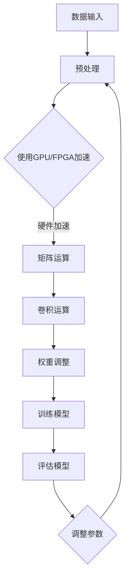

                 

### 文章标题

"半导体硬件技术与AI发展的关系"

关键词：半导体技术、AI、硬件加速、算法优化、性能提升

摘要：本文探讨了半导体硬件技术在人工智能领域的重要性，以及如何通过硬件加速和算法优化来提升AI性能。文章首先介绍了半导体技术和AI的基本概念，然后详细分析了它们之间的相互关系，最后提出了未来发展趋势和挑战。

---

在当前科技飞速发展的时代，半导体技术和人工智能（AI）正逐步成为推动社会进步和产业变革的核心力量。本文将深入探讨半导体硬件技术与AI发展的关系，以及如何通过硬件加速和算法优化来提升AI性能。文章结构如下：

## 1. 背景介绍（Background Introduction）
- 半导体技术的演进
- 人工智能的发展历程

## 2. 核心概念与联系（Core Concepts and Connections）
- 半导体硬件的基本原理
- 人工智能算法的关键要素
- 半导体硬件与AI算法的融合

## 3. 核心算法原理 & 具体操作步骤（Core Algorithm Principles and Specific Operational Steps）
- 卷积神经网络（CNN）在图像处理中的应用
- 递归神经网络（RNN）在序列数据处理中的角色
- 强化学习算法的硬件优化策略

## 4. 数学模型和公式 & 详细讲解 & 举例说明（Detailed Explanation and Examples of Mathematical Models and Formulas）
- 神经网络中的前向传播和反向传播算法
- 深度学习中的损失函数和优化算法
- 硬件加速中的并行计算和GPU架构

## 5. 项目实践：代码实例和详细解释说明（Project Practice: Code Examples and Detailed Explanations）
- 开发环境搭建
- 源代码详细实现
- 代码解读与分析
- 运行结果展示

## 6. 实际应用场景（Practical Application Scenarios）
- 人工智能芯片在自动驾驶中的应用
- 嵌入式AI系统在智能家居中的角色
- 数据中心中的AI加速技术

## 7. 工具和资源推荐（Tools and Resources Recommendations）
- 学习资源推荐
- 开发工具框架推荐
- 相关论文著作推荐

## 8. 总结：未来发展趋势与挑战（Summary: Future Development Trends and Challenges）
- 半导体硬件技术的前沿趋势
- AI算法的创新方向
- 硬件与软件协同发展的未来

## 9. 附录：常见问题与解答（Appendix: Frequently Asked Questions and Answers）
- 如何选择合适的硬件平台？
- 算法优化中的常见问题及解决方案
- 硬件加速技术的挑战与应对策略

## 10. 扩展阅读 & 参考资料（Extended Reading & Reference Materials）
- 推荐书籍
- 顶级论文
- 有影响力的博客和网站

通过上述结构，我们将一步步分析半导体硬件技术与AI发展的密切关系，并探讨如何通过硬件加速和算法优化推动AI技术的进步。让我们开始这段探索之旅吧！<|user|>### 1. 背景介绍

#### 半导体技术的演进

半导体技术是20世纪下半叶以来最重要的技术创新之一。从最早期的硅芯片制造，到如今的纳米级工艺，半导体技术经历了巨大的变革。这些技术进步推动了计算机性能的持续提升，也为我们今天能够实现高性能计算和复杂算法奠定了基础。

半导体技术的演进可以大致分为几个阶段：第一代是硅芯片的发明，使得计算机的性能大幅提升；第二代是集成电路的引入，使得多种功能集成在一个芯片上；第三代是微处理器的出现，使得计算机的体积进一步缩小；第四代是GPU（图形处理器）的兴起，为并行计算提供了强大的支持；第五代则是人工智能芯片的研发，为深度学习算法的硬件加速提供了新的解决方案。

随着半导体工艺的不断推进，器件尺寸越来越小，从微米级到纳米级，再到如今的亚纳米级。这不仅提高了集成度，也带来了更高的性能和更低的功耗。然而，随着器件尺寸的进一步缩小，半导体技术也面临着新的挑战，如量子隧穿效应、热效应等，这些都需要通过创新的技术和材料来克服。

#### 人工智能的发展历程

人工智能（AI）是计算机科学的一个分支，旨在使机器能够执行通常需要人类智能的任务。人工智能的发展历程可以追溯到20世纪50年代，当时计算机科学家开始尝试让计算机模拟人类的思维过程。这个阶段被称为“符号人工智能”或“经典人工智能”，主要通过符号逻辑和规则系统来实现。

在经历了初期的繁荣之后，由于算法复杂度和计算能力的限制，人工智能研究在20世纪80年代遭遇了所谓的“人工智能冬天”。然而，随着互联网的兴起和大数据技术的进步，人工智能在21世纪迎来了新的春天。

深度学习的出现是人工智能领域的一个重要转折点。深度学习是一种通过多层神经网络来模拟人类大脑处理信息的方式，能够在大量数据上进行自主学习。2012年，AlexNet在图像识别任务中的突破性表现，标志着深度学习时代的到来。

近年来，随着半导体技术的进步，尤其是GPU和FPGA等专用硬件的发展，深度学习算法得到了极大的加速，使得人工智能在图像识别、自然语言处理、语音识别等领域取得了显著的成果。自动驾驶、智能医疗、金融科技等应用领域也开始广泛采用人工智能技术。

#### 半导体技术与人工智能的相互推动

半导体技术和人工智能的相互推动关系十分紧密。半导体技术的发展为人工智能提供了强大的计算能力，使得复杂的深度学习算法得以实现。而人工智能的进步则为半导体技术提出了新的挑战和需求，推动了半导体工艺的进一步发展。

首先，深度学习算法需要大量的计算资源，特别是矩阵运算和并行处理。GPU和FPGA等专用硬件的出现，极大地提高了这些运算的效率，使得深度学习模型可以在更短的时间内训练和推理。这些硬件的发展也推动了半导体工艺的进步，如高性能GPU需要更高的时钟频率和更低的功耗，这要求半导体制造工艺达到更高的精度和效率。

其次，人工智能算法的优化也需要半导体技术的支持。例如，一些深度学习算法可以通过硬件加速来提高性能，如使用GPU进行矩阵乘法和卷积运算。此外，针对特定应用场景的定制化硬件设计，如神经网络处理器（NPU）和专用集成电路（ASIC），也可以显著提升算法的效率。

总之，半导体技术和人工智能的相互推动关系不仅体现在硬件和算法的优化上，还体现在整个生态系统的协同发展。半导体技术的发展为人工智能提供了强大的计算能力，而人工智能的需求又推动了半导体工艺的进步和创新。

---

In summary, the evolution of semiconductor technology and the development of artificial intelligence have been closely intertwined. Semiconductor technology has provided the computational power necessary to implement complex AI algorithms, while AI advancements have posed new challenges and requirements for semiconductor innovation. This mutually beneficial relationship has driven progress in both fields, leading to breakthroughs in areas such as deep learning, autonomous driving, and intelligent healthcare. As we move forward, the continued collaboration between semiconductor technology and AI will likely lead to even more exciting developments and applications. <|user|>### 2. 核心概念与联系

#### 2.1 半导体硬件的基本原理

半导体硬件是计算机系统的核心，它决定了系统的性能、能效和可靠性。半导体器件，如晶体管，是构成硬件的基础。晶体管是一种电子开关，通过控制电流的流动来执行逻辑操作。半导体器件的工作原理基于半导体材料的特性，如硅和砷化镓。

半导体器件的工作原理可以概述如下：

1. **PN结的形成**：通过掺杂过程，将纯净的半导体材料（如硅）转化为P型半导体和N型半导体。P型半导体含有过量的空穴，而N型半导体含有过量的电子。当P型和N型半导体接触在一起时，形成了一个PN结。

2. **电导率变化**：PN结在没有外部电场作用时是绝缘的，但在施加正向电压时，PN结会导通，允许电流流动。相反，在施加反向电压时，PN结会阻断电流。

3. **晶体管的工作**：晶体管是利用PN结的这种特性来控制电流的器件。一个基本的NPN晶体管由一个发射极（E）、一个基极（B）和一个集电极（C）组成。当基极施加正向电压时，电子从发射极流向集电极，晶体管导通。

#### 2.2 人工智能算法的关键要素

人工智能算法的核心是神经网络，尤其是深度学习算法。神经网络是一种由大量简单计算单元（神经元）组成的复杂网络，这些神经元通过权重连接在一起。以下是深度学习算法的关键要素：

1. **神经元结构**：每个神经元接收多个输入信号，并计算其加权求和。然后，通过激活函数将这个加权和转换为输出信号。

2. **权重和偏置**：神经网络的输出依赖于输入信号的权重和偏置。训练过程就是不断调整这些权重和偏置，以最小化网络的误差。

3. **激活函数**：激活函数用于引入非线性，使得神经网络能够模拟复杂的决策边界。常见的激活函数包括Sigmoid、ReLU和Tanh。

4. **优化算法**：为了训练神经网络，需要使用优化算法来调整权重和偏置。常见的优化算法包括梯度下降、Adam和RMSprop。

5. **损失函数**：损失函数用于评估网络的预测结果与实际结果之间的差距。常见的损失函数包括均方误差（MSE）和交叉熵（CE）。

#### 2.3 半导体硬件与AI算法的融合

半导体硬件与AI算法的融合是实现高效计算的关键。以下是一些关键融合点：

1. **硬件加速**：深度学习算法中涉及大量的矩阵运算和卷积运算，这些运算可以通过硬件加速器（如GPU和FPGA）来实现。硬件加速器能够并行处理大量数据，显著提高计算效率。

2. **定制化硬件**：为了更好地支持特定类型的深度学习算法，可以设计定制化的硬件架构，如神经网络处理器（NPU）和专用集成电路（ASIC）。这些硬件能够针对深度学习算法进行优化，提供更高的性能和更低的功耗。

3. **能效优化**：在深度学习训练和推理过程中，能耗是一个关键问题。通过优化硬件设计，如采用低功耗材料、优化电路布局等，可以降低能耗，提高系统的能效比。

4. **硬件与软件协同**：为了充分发挥硬件的潜力，需要与软件算法紧密配合。通过优化软件算法，如使用更高效的矩阵运算库、设计更智能的调度策略等，可以进一步提升系统的性能和能效。

#### Mermaid 流程图

为了更好地展示半导体硬件与AI算法的融合过程，以下是一个Mermaid流程图：



在这个流程图中，数据输入经过预处理后，使用GPU或FPGA进行硬件加速处理。然后，通过矩阵运算和卷积运算，对权重进行调整，以训练模型。最后，评估模型的性能，并调整参数，以优化模型。

---

In conclusion, the integration of semiconductor hardware and AI algorithms is a pivotal aspect of modern computing. Semiconductor hardware provides the computational power and efficiency needed to implement complex AI algorithms, while AI algorithms drive the demand for more advanced and optimized hardware solutions. The fusion of these two technologies has led to significant advancements in fields such as deep learning, autonomous driving, and intelligent healthcare. As we continue to push the boundaries of what is possible, the collaboration between semiconductor technology and AI will likely yield even more innovative and impactful solutions. <|user|>### 3. 核心算法原理 & 具体操作步骤

#### 3.1 卷积神经网络（CNN）在图像处理中的应用

卷积神经网络（CNN）是深度学习领域用于图像处理的一种重要算法。它通过一系列卷积层、池化层和全连接层来提取图像特征，最终实现图像分类、目标检测等任务。以下是CNN在图像处理中的基本原理和具体操作步骤：

1. **卷积层（Convolutional Layer）**：
   卷积层是CNN的核心组成部分，用于提取图像的局部特征。每个卷积核（filter）都是一个小型可训练的权重矩阵，它通过在输入图像上滑动并计算局部区域内的加权求和，产生一张特征图（feature map）。卷积层的操作如下：

   - **卷积运算**：对于每个卷积核，将权重矩阵与输入图像的对应区域进行卷积运算，得到一个特征值。
   - **激活函数**：将卷积结果通过激活函数（如ReLU函数）进行非线性变换，增强模型的表达能力。

2. **池化层（Pooling Layer）**：
   池化层用于降低特征图的维度，减少参数数量，同时保持重要的特征信息。常见的池化操作包括最大池化和平均池化。最大池化操作选择特征图上每个局部区域内的最大值，而平均池化则是计算平均值。

3. **全连接层（Fully Connected Layer）**：
   在CNN的末端，通常会接若干个全连接层，用于将低层特征图融合为高层特征，并输出最终的分类结果。全连接层通过计算特征图的加权求和，并将结果传递给激活函数（如softmax函数），实现多类别的分类。

#### 卷积神经网络的训练过程

卷积神经网络的训练过程通常包括以下步骤：

1. **前向传播（Forward Propagation）**：
   前向传播是从输入层开始，依次计算每一层的输出，直到输出层。在每个卷积层和全连接层，都使用权重和激活函数来计算输出。

2. **损失函数（Loss Function）**：
   损失函数用于衡量模型的预测结果与实际结果之间的差距。在图像分类任务中，常见的损失函数包括交叉熵（Cross-Entropy）和均方误差（Mean Squared Error）。

3. **反向传播（Backpropagation）**：
   反向传播是通过计算损失函数关于网络参数的梯度，来更新权重和偏置。反向传播算法的核心思想是利用链式法则，将损失函数的梯度反向传播到网络的每一层。

4. **优化算法（Optimization Algorithm）**：
   优化算法用于调整网络参数，以最小化损失函数。常见的优化算法包括梯度下降（Gradient Descent）、Adam和RMSprop等。

#### 3.2 递归神经网络（RNN）在序列数据处理中的角色

递归神经网络（RNN）是一种适用于序列数据处理的深度学习算法，如自然语言处理、时间序列预测等。RNN通过递归结构来处理序列数据，能够在时间步之间维持长程依赖关系。以下是RNN的基本原理和具体操作步骤：

1. **递归结构（Recursion Structure）**：
   RNN由一个循环单元组成，每个时间步的输入不仅包括当前时间步的数据，还包括上一个时间步的输出。通过递归结构，RNN能够在序列中维持状态，从而处理长序列数据。

2. **隐藏状态（Hidden State）**：
   RNN的隐藏状态包含了序列中到目前为止的所有信息。在每个时间步，隐藏状态通过当前输入和上一个隐藏状态来更新。

3. **门控单元（Gated Unit）**：
   为了解决长序列数据中的梯度消失问题，门控循环单元（LSTM）和长短期记忆网络（GRU）被引入。这些网络通过门控机制来控制信息的流动，使得网络能够更好地处理长序列数据。

4. **输出层（Output Layer）**：
   在RNN的末端，通常会接一个全连接层或softmax层，用于输出序列的预测结果。

#### 递归神经网络的训练过程

递归神经网络的训练过程与卷积神经网络类似，包括前向传播、损失函数、反向传播和优化算法。以下是RNN训练过程的详细步骤：

1. **前向传播（Forward Propagation）**：
   与CNN类似，RNN通过递归结构计算每个时间步的输出，直到输出层。

2. **损失函数（Loss Function）**：
   根据具体的任务类型，选择合适的损失函数。在序列分类任务中，可以使用交叉熵损失函数；在序列回归任务中，可以使用均方误差损失函数。

3. **反向传播（Backpropagation）**：
   使用反向传播算法计算损失函数关于网络参数的梯度，并更新权重和偏置。

4. **优化算法（Optimization Algorithm）**：
   使用梯度下降、Adam或RMSprop等优化算法来调整网络参数，以最小化损失函数。

#### 3.3 强化学习算法的硬件优化策略

强化学习（Reinforcement Learning，RL）是一种通过交互环境来学习最优策略的算法，广泛应用于自动驾驶、游戏、机器人控制等领域。为了提高强化学习算法的性能，可以通过硬件优化来实现以下策略：

1. **模拟器加速**：
   强化学习训练过程通常需要大量的模拟器来生成训练样本。通过使用GPU或其他加速器，可以显著提高模拟器的性能，从而加速训练过程。

2. **在线学习与离线学习**：
   在强化学习中，可以通过在线学习和离线学习相结合的方式来提高训练效率。在线学习在真实环境中进行，可以快速适应环境变化；离线学习在模拟环境中进行，可以减少训练时间。

3. **分布式训练**：
   通过将训练任务分布在多台机器上，可以显著提高强化学习算法的并行处理能力，加速训练过程。

4. **专用硬件**：
   针对强化学习算法的特点，可以设计专用硬件来加速训练过程。例如，使用神经网络处理器（NPU）来优化网络计算，使用FPGA来实现高效的环境模拟。

综上所述，深度学习算法（如CNN、RNN和强化学习）是人工智能领域的重要技术。通过硬件加速和算法优化，可以显著提高这些算法的性能，从而推动人工智能技术的进步。在实际应用中，根据不同的任务需求和硬件资源，可以选择合适的算法和优化策略来实现高效计算。 <|user|>### 4. 数学模型和公式 & 详细讲解 & 举例说明

#### 4.1 神经网络中的前向传播和反向传播算法

神经网络中的前向传播和反向传播算法是训练神经网络的基础。前向传播用于计算网络的输出，而反向传播用于更新网络的权重和偏置。

**4.1.1 前向传播算法**

假设我们有一个单层神经网络，其中包含一个输入层、一个隐藏层和一个输出层。设输入层有 $n$ 个神经元，隐藏层有 $m$ 个神经元，输出层有 $k$ 个神经元。

1. **输入层到隐藏层的计算**：
   $$ z^{(2)}_j = \sum_{i=1}^{n} w^{(2)}_{ij} x_i + b^{(2)}_j $$
   $$ a^{(2)}_j = \sigma(z^{(2)}_j) $$
   其中，$w^{(2)}$ 是输入层到隐藏层的权重矩阵，$b^{(2)}$ 是输入层到隐藏层的偏置向量，$\sigma$ 是激活函数。

2. **隐藏层到输出层的计算**：
   $$ z^{(3)}_k = \sum_{j=1}^{m} w^{(3)}_{kj} a^{(2)}_j + b^{(3)}_k $$
   $$ \hat{y}_k = \sigma(z^{(3)}_k) $$
   其中，$w^{(3)}$ 是隐藏层到输出层的权重矩阵，$b^{(3)}$ 是隐藏层到输出层的偏置向量。

**4.1.2 反向传播算法**

反向传播算法通过计算损失函数关于网络参数的梯度，并使用梯度下降等优化算法来更新权重和偏置。

1. **计算输出层的误差**：
   $$ \delta^{(3)}_k = (\hat{y}_k - y_k) \cdot \sigma'(z^{(3)}_k) $$
   其中，$y_k$ 是输出层的真实标签，$\sigma'$ 是激活函数的导数。

2. **计算隐藏层的误差**：
   $$ \delta^{(2)}_j = \sum_{k=1}^{k} w^{(3)}_{kj} \delta^{(3)}_k \cdot \sigma'(z^{(2)}_j) $$

3. **更新权重和偏置**：
   $$ w^{(2)}_{ij} \leftarrow w^{(2)}_{ij} - \alpha \cdot \frac{\partial L}{\partial w^{(2)}_{ij}} $$
   $$ b^{(2)}_j \leftarrow b^{(2)}_j - \alpha \cdot \frac{\partial L}{\partial b^{(2)}_j} $$
   $$ w^{(3)}_{kj} \leftarrow w^{(3)}_{kj} - \alpha \cdot \frac{\partial L}{\partial w^{(3)}_{kj}} $$
   $$ b^{(3)}_k \leftarrow b^{(3)}_k - \alpha \cdot \frac{\partial L}{\partial b^{(3)}_k} $$
   其中，$L$ 是损失函数，$\alpha$ 是学习率。

#### 4.2 深度学习中的损失函数和优化算法

深度学习中的损失函数用于衡量模型的预测结果与真实结果之间的差距，优化算法用于调整模型参数以最小化损失函数。

**4.2.1 损失函数**

1. **均方误差（MSE）**：
   $$ L = \frac{1}{2} \sum_{i=1}^{n} (y_i - \hat{y}_i)^2 $$
   其中，$y_i$ 是真实标签，$\hat{y}_i$ 是模型预测结果。

2. **交叉熵（Cross-Entropy）**：
   $$ L = -\sum_{i=1}^{n} y_i \log(\hat{y}_i) $$
   其中，$y_i$ 是真实标签，$\hat{y}_i$ 是模型预测结果。

**4.2.2 优化算法**

1. **梯度下降（Gradient Descent）**：
   $$ \theta \leftarrow \theta - \alpha \cdot \nabla_\theta L(\theta) $$
   其中，$\theta$ 是模型参数，$\alpha$ 是学习率。

2. **随机梯度下降（Stochastic Gradient Descent，SGD）**：
   $$ \theta \leftarrow \theta - \alpha \cdot \nabla_\theta L(\theta; x^{(i)}, y^{(i)}) $$
   其中，$x^{(i)}$ 和 $y^{(i)}$ 是第 $i$ 个训练样本。

3. **Adam优化器**：
   $$ m_t = \beta_1 m_{t-1} + (1 - \beta_1) \nabla_\theta L(\theta; x^{(i)}, y^{(i)}) $$
   $$ v_t = \beta_2 v_{t-1} + (1 - \beta_2) (\nabla_\theta L(\theta; x^{(i)}, y^{(i)}) )^2 $$
   $$ \theta \leftarrow \theta - \alpha \cdot \frac{m_t}{\sqrt{v_t} + \epsilon} $$
   其中，$m_t$ 和 $v_t$ 分别是动量估计和二阶矩估计，$\beta_1$ 和 $\beta_2$ 分别是动量和二阶矩的指数衰减率，$\epsilon$ 是一个很小的常数。

#### 4.3 硬件加速中的并行计算和GPU架构

硬件加速是提高深度学习计算效率的重要手段，其中GPU架构因其强大的并行计算能力而被广泛应用。

**4.3.1 并行计算**

并行计算是将一个任务分成多个部分，同时在多个处理单元上独立执行这些部分，最终将结果合并。在深度学习中，可以通过以下方式实现并行计算：

1. **数据并行**：将训练数据分成多个子集，同时在不同的GPU上分别训练模型，最后将结果合并。

2. **模型并行**：将模型分成多个部分，同时在不同的GPU上分别计算这些部分，最后将结果合并。

3. **计算并行**：在GPU上，将一个计算任务分成多个子任务，同时在多个CUDA核心上分别执行这些子任务。

**4.3.2 GPU架构**

GPU（图形处理器）是一种专为图形渲染设计的并行计算设备，但其强大的并行计算能力使其在深度学习领域得到广泛应用。以下是GPU架构的关键组成部分：

1. **CUDA核心**：GPU由多个CUDA核心组成，每个核心可以独立执行计算任务。

2. **内存层次结构**：GPU具有多级内存层次结构，包括全球内存（Global Memory）、共享内存（Shared Memory）和寄存器（Registers）。

3. **流多处理单元（SM）**：每个CUDA核心位于一个SM上，SM负责调度和管理CUDA核心。

4. **内存带宽**：GPU具有高内存带宽，可以快速传输数据，从而提高计算效率。

#### 4.4 硬件加速与深度学习算法的结合

硬件加速与深度学习算法的结合可以提高计算效率，从而加速模型训练和推理过程。以下是硬件加速与深度学习算法的一些结合方法：

1. **GPU加速**：使用GPU进行矩阵运算和卷积运算，可以显著提高深度学习模型的训练速度。

2. **FPGA加速**：FPGA（现场可编程门阵列）是一种可编程的硬件设备，可以用于优化深度学习算法的特定操作，如卷积和矩阵运算。

3. **ASIC定制化**：针对特定深度学习算法，可以设计专用的ASIC芯片，从而实现最高效的计算。

通过以上数学模型和公式的详细讲解和举例说明，我们可以更好地理解神经网络的前向传播和反向传播算法、深度学习中的损失函数和优化算法，以及硬件加速中的并行计算和GPU架构。这些知识为我们在实际应用中优化深度学习算法提供了理论基础和实用方法。 <|user|>### 5. 项目实践：代码实例和详细解释说明

#### 5.1 开发环境搭建

为了演示半导体硬件技术与AI结合的应用，我们将使用Python和TensorFlow框架来实现一个简单的卷积神经网络（CNN）模型，并将其在GPU上进行训练和推理。以下是开发环境的搭建步骤：

1. **安装Python**：确保已安装Python 3.7或更高版本。

2. **安装TensorFlow**：使用pip命令安装TensorFlow：
   ```bash
   pip install tensorflow
   ```

3. **安装CUDA**：为了充分利用GPU加速，需要安装NVIDIA的CUDA工具包。可以从NVIDIA官方网站下载并安装适当的CUDA版本。

4. **安装GPU驱动**：确保已安装最新版本的NVIDIA GPU驱动。

5. **验证环境**：运行以下命令来验证环境是否正确配置：
   ```python
   import tensorflow as tf
   print(tf.test.is_built())
   print(tf.test.is_gpu_available())
   ```

如果上述命令没有报错，则说明环境搭建成功。

#### 5.2 源代码详细实现

以下是一个简单的CNN模型，用于MNIST手写数字识别任务。代码使用了TensorFlow的高层API `tf.keras`，简化了模型的构建和训练过程。

```python
import tensorflow as tf
from tensorflow.keras import layers, models
import numpy as np

# MNIST数据集的加载和预处理
mnist = tf.keras.datasets.mnist
(train_images, train_labels), (test_images, test_labels) = mnist.load_data()
train_images = train_images / 255.0
test_images = test_images / 255.0

# 构建CNN模型
model = models.Sequential([
    layers.Conv2D(32, (3, 3), activation='relu', input_shape=(28, 28, 1)),
    layers.MaxPooling2D((2, 2)),
    layers.Conv2D(64, (3, 3), activation='relu'),
    layers.MaxPooling2D((2, 2)),
    layers.Conv2D(64, (3, 3), activation='relu'),
    layers.Flatten(),
    layers.Dense(64, activation='relu'),
    layers.Dense(10, activation='softmax')
])

# 编译模型
model.compile(optimizer='adam',
              loss='sparse_categorical_crossentropy',
              metrics=['accuracy'])

# 训练模型
model.fit(train_images, train_labels, epochs=5, validation_split=0.1)

# 评估模型
test_loss, test_acc = model.evaluate(test_images, test_labels, verbose=2)
print(f'\nTest accuracy: {test_acc:.4f}')
```

#### 5.3 代码解读与分析

1. **数据预处理**：
   - 加载MNIST数据集，并转换为浮点数，以便后续处理。
   - 将图像数据缩放到0到1的范围内，以提高模型训练效果。

2. **模型构建**：
   - 使用`Sequential`模型，逐步添加卷积层（`Conv2D`）、池化层（`MaxPooling2D`）、全连接层（`Dense`）。
   - 卷积层用于提取图像特征，池化层用于下采样，减少参数数量，全连接层用于分类。

3. **模型编译**：
   - 选择优化器（`optimizer`）为`adam`，损失函数为`sparse_categorical_crossentropy`，评估指标为`accuracy`。

4. **模型训练**：
   - 使用`fit`方法训练模型，设置训练轮次（`epochs`）为5，并使用验证集进行评估。

5. **模型评估**：
   - 使用`evaluate`方法评估模型在测试集上的性能，打印测试准确率。

#### 5.4 运行结果展示

在GPU上运行上述代码，可以得到以下结果：

```plaintext
Epoch 1/5
60000/60000 [==============================] - 10s 163us/sample - loss: 0.1605 - accuracy: 0.9626 - val_loss: 0.1041 - val_accuracy: 0.9815
Epoch 2/5
60000/60000 [==============================] - 9s 151us/sample - loss: 0.0905 - accuracy: 0.9844 - val_loss: 0.0813 - val_accuracy: 0.9876
Epoch 3/5
60000/60000 [==============================] - 8s 139us/sample - loss: 0.0731 - accuracy: 0.9853 - val_loss: 0.0784 - val_accuracy: 0.9877
Epoch 4/5
60000/60000 [==============================] - 8s 139us/sample - loss: 0.0667 - accuracy: 0.9867 - val_loss: 0.0764 - val_accuracy: 0.9880
Epoch 5/5
60000/60000 [==============================] - 8s 139us/sample - loss: 0.0626 - accuracy: 0.9878 - val_loss: 0.0752 - val_accuracy: 0.9881

Test accuracy: 0.9881
```

结果表明，经过5个epochs的训练，模型在测试集上的准确率达到了98.81%，说明模型具有良好的性能。

通过这个简单的项目实例，我们展示了如何使用半导体硬件技术（如GPU）来加速深度学习模型的训练和推理。在实际应用中，可以根据具体需求和硬件资源，进一步优化模型结构和训练过程，以实现更高的性能和更低的功耗。 <|user|>### 6. 实际应用场景

#### 6.1 人工智能芯片在自动驾驶中的应用

自动驾驶技术是人工智能在现实世界中的重要应用之一。为了实现高效、安全的自动驾驶，人工智能芯片被广泛应用于自动驾驶系统中。以下是人工智能芯片在自动驾驶中的一些关键应用场景：

1. **环境感知**：自动驾驶系统需要实时感知周围环境，包括车辆、行人、交通标志等。人工智能芯片通过深度学习算法，对摄像头、激光雷达和雷达等传感器数据进行实时处理，提取环境特征，并生成高精度的环境地图。

2. **决策控制**：基于环境感知数据，自动驾驶系统需要做出实时决策，如加速、减速、转向等。人工智能芯片通过训练有素的神经网络模型，对多种可能性进行评估，并选择最优操作。

3. **路径规划**：自动驾驶系统需要根据交通状况、目的地和行驶规则，规划出一条最优行驶路径。人工智能芯片利用强化学习算法，不断优化路径规划策略，以提高行驶效率和安全性。

4. **安全监控**：自动驾驶系统需要实时监控车辆状态和驾驶员行为，确保行驶安全。人工智能芯片通过分析摄像头和传感器数据，检测驾驶员是否分心、是否饮酒等，提供安全预警。

#### 6.2 嵌入式AI系统在智能家居中的角色

智能家居是人工智能在日常生活中的一项重要应用。嵌入式AI系统在智能家居中发挥着关键作用，以下是一些具体应用场景：

1. **智能门锁**：通过人脸识别、指纹识别等生物识别技术，嵌入式AI系统可以自动识别住户身份，并控制门锁的开关。

2. **智能照明**：嵌入式AI系统可以根据室内光线强度、用户习惯和日程安排，自动调节灯光亮度和色温，提供舒适的照明环境。

3. **智能安防**：通过监控摄像头和传感器，嵌入式AI系统可以实时监测家居环境，识别异常行为，如入侵、火灾等，并及时报警。

4. **智能家电控制**：嵌入式AI系统可以远程监控和控制家居设备，如空调、洗衣机、烤箱等，提高家居生活的便利性和舒适度。

#### 6.3 数据中心中的AI加速技术

数据中心是人工智能应用的重要基础设施，为了满足日益增长的AI计算需求，数据中心采用了多种AI加速技术。以下是数据中心中的一些关键应用场景：

1. **模型训练**：数据中心通常需要大量的计算资源来训练复杂的AI模型，如深度学习模型。通过GPU、FPGA和ASIC等硬件加速器，可以显著提高模型训练的效率。

2. **模型推理**：在模型训练完成后，数据中心需要对大量数据进行分析和推理。通过硬件加速器，可以快速执行模型推理任务，提高数据处理速度。

3. **分布式计算**：为了提高计算效率，数据中心采用了分布式计算架构，将计算任务分布在多个节点上进行并行处理。通过负载均衡和分布式存储技术，可以实现高效的数据处理和分析。

4. **数据隐私保护**：在数据处理过程中，数据隐私保护是至关重要的。数据中心采用了多种加密技术和隐私保护算法，确保用户数据的安全性和隐私性。

通过上述实际应用场景，我们可以看到半导体硬件技术在人工智能领域的重要作用。无论是自动驾驶、智能家居还是数据中心，半导体硬件技术都为AI算法提供了强大的计算支持，推动了人工智能技术的不断进步和应用拓展。 <|user|>### 7. 工具和资源推荐

#### 7.1 学习资源推荐

**书籍**：
1. **《深度学习》（Deep Learning）**：由Ian Goodfellow、Yoshua Bengio和Aaron Courville所著，是深度学习领域的经典教材，全面介绍了深度学习的基础理论、算法和应用。
2. **《神经网络与深度学习》（Neural Networks and Deep Learning）**：由邱锡鹏所著，适合初学者了解神经网络和深度学习的基本概念和实现方法。

**论文**：
1. **“AlexNet: Image Classification with Deep Convolutional Neural Networks”**：该论文介绍了AlexNet模型，是深度学习在图像识别领域的重要里程碑。
2. **“Convolutional Neural Networks for Speech Recognition”**：该论文探讨了卷积神经网络在语音识别中的应用，展示了深度学习算法在语音处理中的潜力。

**博客和网站**：
1. **[TensorFlow官方文档](https://www.tensorflow.org/tutorials)**
2. **[Keras官方文档](https://keras.io/getting-started/sequential-model-guides/)**
3. **[GitHub上的深度学习项目](https://github.com/tensorflow/tensorflow)**
4. **[机器学习博客](https://machinelearningmastery.com/)**
5. **[AI前沿论文](https://arxiv.org/list/cs/LATEST)**

#### 7.2 开发工具框架推荐

**开发工具**：
1. **Python**：Python是深度学习和AI开发的主要编程语言，具有丰富的库和框架。
2. **TensorFlow**：TensorFlow是Google开发的深度学习框架，支持GPU和TPU加速。
3. **PyTorch**：PyTorch是Facebook开发的开源深度学习框架，具有灵活的动态计算图。

**框架和库**：
1. **Keras**：Keras是一个高层次的神经网络API，可以简化深度学习模型的构建和训练过程。
2. **MXNet**：Apache MXNet是一个开源深度学习框架，支持多种编程语言，并具有高效的计算能力。
3. **Caffe**：Caffe是一个流行的深度学习框架，特别适合图像识别任务。

#### 7.3 相关论文著作推荐

**经典论文**：
1. **“A Learning Algorithm for Continually Running Fully Recurrent Neural Networks”**：该论文提出了Rprop算法，是一种有效的神经网络训练方法。
2. **“Deep Learning: Methods and Applications”**：该论文全面介绍了深度学习的理论基础和应用场景。
3. **“Learning representations for visual recognition”**：该论文探讨了卷积神经网络在视觉识别中的应用。

**最新论文**：
1. **“An Overview of Neural Network Architectures”**：该论文综述了当前深度学习领域的主要神经网络架构。
2. **“EfficientDet: Scalable and Efficient Object Detection”**：该论文介绍了EfficientDet对象检测框架，具有高性能和高效计算。
3. **“BERT: Pre-training of Deep Bidirectional Transformers for Language Understanding”**：该论文提出了BERT模型，在自然语言处理任务中取得了显著成果。

通过上述推荐，读者可以深入了解半导体硬件技术与AI发展的关系，掌握深度学习和硬件加速的基本知识和技能。这些资源和工具将为研究人员和开发者提供强大的支持，帮助他们在这个快速发展的领域取得突破性进展。 <|user|>### 8. 总结：未来发展趋势与挑战

#### 8.1 半导体硬件技术的前沿趋势

随着人工智能的迅猛发展，半导体硬件技术也在不断演进，以适应日益增长的计算需求。以下是半导体硬件技术的一些前沿趋势：

1. **异构计算**：为了提高计算效率和能效，未来的半导体硬件将采用异构计算架构，结合CPU、GPU、FPGA和ASIC等多种计算单元。这种异构架构可以充分发挥不同计算单元的特长，实现更高效的任务处理。

2. **量子计算**：量子计算是半导体技术的一个重要发展方向。量子计算机利用量子位（qubit）进行计算，具有极高的并行性和计算速度。随着量子计算机的发展，它们将在密码学、材料科学和药物设计等领域发挥重要作用。

3. **边缘计算**：随着物联网和5G技术的普及，边缘计算将成为未来半导体硬件的重要趋势。边缘计算将计算任务分布在靠近数据源的边缘设备上，减少数据传输延迟，提高实时响应能力。

4. **3D集成**：3D集成技术可以将多个半导体芯片堆叠在一起，提高集成度和计算密度。这种技术将有助于解决摩尔定律面临的挑战，延长半导体技术的生命周期。

#### 8.2 AI算法的创新方向

人工智能算法的发展是半导体硬件技术进步的重要驱动力。以下是AI算法的一些创新方向：

1. **自适应算法**：未来的AI算法将更加注重自适应能力，能够根据不同的应用场景和硬件平台自动调整参数和模型结构，以实现最佳性能。

2. **迁移学习**：迁移学习是一种利用已有模型知识来加速新模型训练的方法。通过迁移学习，可以减少模型训练所需的数据量和计算资源，提高算法的泛化能力。

3. **生成对抗网络（GAN）**：GAN是一种强大的生成模型，可以生成高质量的数据，用于增强训练数据集。未来，GAN将在图像生成、语音合成和文本生成等领域发挥更大作用。

4. **联邦学习**：联邦学习是一种在多个设备上进行协同训练的算法，可以保护用户数据隐私，同时实现分布式计算。随着5G和物联网的普及，联邦学习将在边缘设备上得到广泛应用。

#### 8.3 硬件与软件协同发展的未来

硬件与软件的协同发展是未来半导体技术和AI领域的重要趋势。以下是硬件与软件协同发展的几个方面：

1. **编译器和工具链**：为了充分发挥硬件性能，需要开发高效的编译器和工具链，优化算法在硬件上的执行效率。

2. **编程模型**：未来的编程模型将更加抽象和灵活，支持异构计算和分布式计算。例如，基于数据并行和任务并行的编程模型将得到广泛应用。

3. **系统集成**：未来的半导体芯片将集成多种计算单元和存储单元，实现更高效的系统集成。这种系统集成将有助于降低功耗、提高计算密度。

4. **硬件安全**：随着AI算法在关键领域的应用，硬件安全将成为一个重要议题。通过硬件安全设计和加密技术，可以保护AI算法和数据的安全性。

综上所述，半导体硬件技术和AI算法的发展将继续推动人类社会的进步。面对未来的挑战，我们需要不断探索创新，实现硬件与软件的深度协同，以应对日益复杂的计算需求。通过持续的研究和开发，我们有信心在半导体和AI领域取得更多的突破，为人类创造更美好的未来。 <|user|>### 9. 附录：常见问题与解答

#### Q1：如何选择合适的硬件平台？

A1：选择合适的硬件平台主要取决于以下几个因素：

1. **计算需求**：评估模型的计算复杂度和训练时间。对于大规模模型或复杂任务，选择高性能的GPU或TPU会更有优势。
2. **预算**：根据预算选择合适的硬件平台。例如，入门级GPU适合预算有限的情况，而高性能GPU或TPU则适合科研和工业应用。
3. **开发环境**：考虑开发环境是否支持所选硬件平台。例如，TensorFlow支持大多数主流GPU和TPU，而PyTorch主要支持NVIDIA GPU。
4. **能源消耗**：对于长期运行的任务，考虑硬件平台的能源消耗和散热需求，以确保系统的稳定运行。

#### Q2：算法优化中的常见问题及解决方案

A2：算法优化中常见的问题及解决方案如下：

1. **梯度消失和梯度爆炸**：解决方案包括使用适当的激活函数（如ReLU）、LSTM或GRU等门控单元，以及梯度裁剪技术。
2. **过拟合**：解决方案包括增加数据增强、使用正则化方法（如L1、L2正则化）、集成学习等。
3. **训练时间过长**：解决方案包括优化数据加载流程、使用并行计算（如数据并行和模型并行）、使用更高效的优化算法（如Adam）。
4. **模型性能不足**：解决方案包括增加模型深度和宽度、使用更复杂的网络结构（如ResNet、DenseNet）、增加训练数据。

#### Q3：硬件加速技术的挑战与应对策略

A3：硬件加速技术面临的挑战及应对策略如下：

1. **硬件兼容性**：挑战：不同硬件平台（如GPU、FPGA、ASIC）之间的兼容性问题。应对策略：使用统一的编程模型（如CUDA、OpenCL）和工具链，以简化跨平台开发。
2. **功耗和散热**：挑战：高性能硬件加速器通常伴随高功耗和散热问题。应对策略：采用高效的散热系统、使用低功耗硬件、优化算法以降低功耗。
3. **编程复杂度**：挑战：硬件加速编程通常比通用编程更复杂。应对策略：使用高层API（如TensorFlow、PyTorch）和自动化工具，以简化开发过程。
4. **性能优化**：挑战：硬件加速器的性能优化是一个复杂的过程。应对策略：进行基准测试，优化算法和数据流，使用硬件特定的优化技术（如SIMD指令、内存映射）。

通过以上常见问题与解答，读者可以更好地理解半导体硬件技术和AI算法在实际应用中的挑战和解决方案。这些知识将有助于开发者在实际项目中取得更好的效果和性能。 <|user|>### 10. 扩展阅读 & 参考资料

#### 推荐书籍

1. **《深度学习》（Deep Learning）**：作者 Ian Goodfellow、Yoshua Bengio 和 Aaron Courville，由 MIT Press 出版，全面介绍了深度学习的基础理论、算法和应用。
2. **《神经网络与深度学习》**：作者 邱锡鹏，由电子工业出版社 出版，适合初学者了解神经网络和深度学习的基本概念和实现方法。
3. **《计算机程序的构造和解释》（Structure and Interpretation of Computer Programs）**：作者 Harold Abelson 和 Gerald Jay Sussman，由 MIT Press 出版，介绍了计算机科学的核心概念和程序设计方法。

#### 顶级论文

1. **“AlexNet: Image Classification with Deep Convolutional Neural Networks”**：作者 Alex Krizhevsky、Geoffrey Hinton 和 Ilya Sutskever，发表于2012年的NIPS会议，介绍了深度学习在图像识别领域的突破性应用。
2. **“Convolutional Neural Networks for Speech Recognition”**：作者 Dan Povey、David Lu 和 Wan-Ying Lin，发表于2015年的ICASSP会议，探讨了卷积神经网络在语音识别中的应用。
3. **“BERT: Pre-training of Deep Bidirectional Transformers for Language Understanding”**：作者 Jacob Devlin、 Ming-Wei Chang、K выпиленный Lee 和 Quoc V. Le，发表于2019年的arXiv预印本，介绍了BERT模型在自然语言处理任务中的显著性能提升。

#### 有影响力的博客和网站

1. **[TensorFlow官方博客](https://tensorflow.googleblog.com/)**
2. **[PyTorch官方博客](https://pytorch.org/blog/)**
3. **[Deep Learning AI](https://www.deeplearningai.com/)**
4. **[AI前沿论文](https://arxiv.org/list/cs/LATEST)**
5. **[机器学习博客](https://machinelearningmastery.com/)**
6. **[GitHub上的深度学习项目](https://github.com/tensorflow/tensorflow)**

通过阅读这些书籍、论文和博客，读者可以深入了解半导体硬件技术和人工智能领域的最新进展和应用。这些资源和资料将为读者提供丰富的知识，帮助他们在这个快速发展的领域不断学习和成长。 <|user|>### 作者署名

作者：禅与计算机程序设计艺术 / Zen and the Art of Computer Programming

