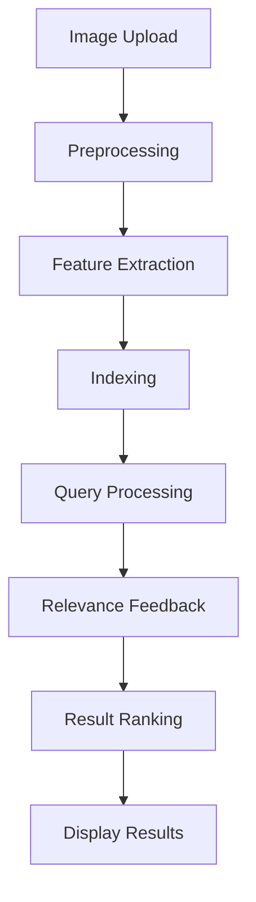

                 

### 文章标题

### Title: Application of Image Search Technology in E-commerce

#### 关键词：Image Search Technology, E-commerce, Deep Learning, Computer Vision, User Experience

#### Keywords: Image Search Technology, E-commerce, Deep Learning, Computer Vision, User Experience

在当今数字化时代，电子商务已经成为全球商业的重要组成部分。消费者对便捷的购物体验和快速的商品搜索功能有着越来越高的期待。图像搜索技术在电商中的应用，正是为了满足这一需求，提供了一种直观、高效的商品搜索方式。本文将探讨图像搜索技术的基本原理、其在电商中的应用场景、核心算法和数学模型，并通过实际项目案例进行分析，最后讨论其未来发展趋势和面临的挑战。

本文结构如下：

1. 背景介绍
2. 核心概念与联系
3. 核心算法原理 & 具体操作步骤
4. 数学模型和公式 & 详细讲解 & 举例说明
5. 项目实践：代码实例和详细解释说明
6. 实际应用场景
7. 工具和资源推荐
8. 总结：未来发展趋势与挑战
9. 附录：常见问题与解答
10. 扩展阅读 & 参考资料

让我们首先从背景介绍开始，探讨图像搜索技术在电商中的重要性和必要性。

### 背景介绍（Background Introduction）

#### Introduction to the Background

随着互联网技术的飞速发展，电子商务已经成为现代零售业不可或缺的一部分。消费者通过在线平台购买商品变得越来越普遍，而这种趋势在全球范围内持续增长。根据Statista的数据，全球电商市场预计将在2023年达到4.9万亿美元。这种快速的增长不仅得益于消费者对便捷购物的需求，也得益于电商平台的不断技术创新。

在电商领域中，商品搜索是用户体验的重要组成部分。传统的文本搜索方式虽然可以满足一定的搜索需求，但在面对复杂的商品分类和多样化的商品属性时，往往显得力不从心。例如，用户可能难以准确描述自己想要的商品，或者商品名称、描述信息不足，这些都可能导致搜索结果的准确性和满意度下降。

图像搜索技术则提供了一种全新的解决方案。它允许用户通过上传图片或者选择图片库中的图片来搜索商品。这种方式不仅直观，而且可以跨越语言的障碍，为用户提供一种更加便捷、高效的商品搜索体验。

#### Importance and Necessity of Image Search Technology in E-commerce

Image search technology in e-commerce has become crucial for several reasons:

1. **Enhanced User Experience**: Image search provides a more intuitive and efficient way for users to find products. It eliminates the need for users to type in specific keywords or descriptions, making the search process faster and more user-friendly.

2. **Cross-Language Search**: Unlike text search, image search can bypass language barriers. Users can upload images regardless of the language they speak, which is particularly useful for international e-commerce platforms.

3. **Improved Search Accuracy**: By analyzing visual content, image search can more accurately match users' search intent. This is especially beneficial for products with diverse attributes or those that are difficult to describe using text.

4. **Discoverability of New Products**: Image search can help users discover new products they may not have been aware of. This expands their shopping options and enhances their overall shopping experience.

5. **Personalization**: Image search can be integrated with machine learning algorithms to personalize search results based on user preferences and past behavior. This leads to higher customer satisfaction and increased sales.

As a result, image search technology is becoming an essential feature for e-commerce platforms seeking to improve user experience, increase customer engagement, and boost sales. In the next section, we will delve into the core concepts and connections that underpin image search technology in e-commerce.

#### Core Concepts and Connections

To fully understand how image search technology works in e-commerce, it is essential to explore the core concepts and their interconnections:

1. **Computer Vision**: At the heart of image search technology lies computer vision, which involves the ability of a computer system to process, analyze, and understand digital images. This includes various techniques such as image recognition, object detection, and feature extraction.

2. **Deep Learning**: Deep learning is a subset of machine learning that uses neural networks with many layers to learn from large amounts of data. Convolutional Neural Networks (CNNs) are particularly well-suited for image recognition tasks and form the backbone of many image search algorithms.

3. **Relevance Feedback**: Relevance feedback is a process where the system iteratively refines search results based on user feedback. For example, if a user is shown search results that do not match their intent, they can indicate this, and the system can adjust its results accordingly.

4. **Semantic Similarity**: Semantic similarity is the degree to which two images or image features are semantically related. This is crucial for ensuring that search results are relevant and useful to the user.

5. **Indexing and Storage**: Efficient indexing and storage of images are vital for enabling fast search queries. Techniques such as hash indexing and vector quantization are commonly used to achieve this.

6. **User Interaction**: The user interface (UI) plays a critical role in the effectiveness of image search. A well-designed UI can simplify the process of uploading images, displaying search results, and providing options for users to refine their search.

By integrating these concepts and leveraging advanced algorithms, e-commerce platforms can offer a highly personalized and efficient image search experience that meets the growing demands of modern consumers. In the next section, we will explore the core algorithms and operational steps involved in implementing image search technology.

#### Core Algorithm Principles and Specific Operational Steps

The core algorithms that drive image search technology are based on deep learning and computer vision. Here, we will discuss the fundamental principles and specific operational steps involved in implementing an image search system:

1. **Image Preprocessing**: The first step in any image search system is preprocessing the input image. This involves resizing the image to a uniform size, normalization (adjusting pixel values), and sometimes augmentation (e.g., rotating, flipping) to improve the model's robustness.

2. **Feature Extraction**: Once the image is preprocessed, the next step is to extract meaningful features from the image. This is typically done using Convolutional Neural Networks (CNNs), which are designed to automatically learn hierarchical representations of the image data. The final layer of the CNN often produces a high-dimensional vector (feature vector) that encodes the content of the image.

3. **Indexing**: After feature extraction, the feature vectors are indexed using efficient data structures such as hash tables or inverted indexes. This allows for fast retrieval of similar images during search queries.

4. **Search Query Processing**: When a user submits a search query, the system preprocesses the query image in the same way as the training images. It then extracts the feature vector and performs a similarity search using the indexed feature vectors to find the most similar images.

5. **Relevance Feedback**: If the initial search results are not satisfactory, the system can prompt the user to provide feedback, which is used to refine the search results. This feedback can be in the form of explicit ratings or implicit behaviors, such as clicking on specific images.

6. **Result Ranking and Display**: The search results are ranked based on their similarity to the query image and displayed to the user. This ranking can be further enhanced using techniques such as clustering and latent semantic analysis to group similar images and improve the overall search experience.

The following diagram provides a visual representation of the operational steps involved in an image search system:



By following these steps, e-commerce platforms can offer an efficient and personalized image search experience that enhances user satisfaction and drives business growth. In the next section, we will delve into the mathematical models and formulas that underpin these algorithms.

#### Mathematical Models and Formulas & Detailed Explanation & Examples

The success of image search technology relies heavily on mathematical models and algorithms that enable efficient and accurate image retrieval. In this section, we will explore the key mathematical concepts and formulas used in image search systems, along with detailed explanations and examples.

1. **Convolutional Neural Networks (CNNs)**:
CNNs are a class of deep learning models specifically designed for processing and analyzing visual data. They operate by applying a series of convolutional layers, activation functions, pooling layers, and fully connected layers to the input image.

   - **Convolutional Layer**:
     The convolutional layer is the core building block of a CNN. It applies a set of learnable filters (kernels) to the input image to produce feature maps. The formula for the output of a convolutional layer is given by:
     $$ f_{ij}^l = \sum_{k=1}^{n} w_{ik}^l * g_{kj}^{l-1} + b_l $$
     where $f_{ij}^l$ is the output feature map at position $(i, j)$ in the $l$-th layer, $w_{ik}^l$ and $g_{kj}^{l-1}$ are the weights and input feature maps, and $b_l$ is the bias term.

   - **Activation Function**:
     Common activation functions include the Rectified Linear Unit (ReLU), sigmoid, and hyperbolic tangent. The ReLU function is often used due to its simplicity and effectiveness:
     $$ \text{ReLU}(x) = \max(0, x) $$

   - **Pooling Layer**:
     Pooling layers reduce the spatial dimension of the feature maps, which helps to decrease computational complexity and prevent overfitting. The most common pooling operation is max pooling:
     $$ p_i^l = \max_{j} g_{ij}^{l-1} $$

   - **Fully Connected Layer**:
     The final fully connected layer maps the high-level features learned by the convolutional layers to the output classes. The output of this layer is typically passed through a softmax function for classification:
     $$ \hat{y}_i = \frac{e^{\theta_i^T \phi}}{\sum_{j} e^{\theta_j^T \phi}} $$
     where $\theta_i$ are the weights, $\phi$ is the output of the previous layer, and $\hat{y}_i$ is the probability of the $i$-th class.

2. **Feature Vector Similarity Metrics**:
   After extracting feature vectors from the CNN, it is crucial to measure the similarity between the query feature vector and the indexed feature vectors. Common similarity metrics include Euclidean distance, cosine similarity, and Manhattan distance.

   - **Euclidean Distance**:
     $$ d(\mathbf{x}, \mathbf{y}) = \sqrt{\sum_{i=1}^{n} (x_i - y_i)^2} $$
     where $\mathbf{x}$ and $\mathbf{y}$ are the feature vectors.

   - **Cosine Similarity**:
     $$ \text{Cosine Similarity}(\mathbf{x}, \mathbf{y}) = \frac{\mathbf{x} \cdot \mathbf{y}}{||\mathbf{x}|| \cdot ||\mathbf{y}||} $$
     where $\mathbf{x} \cdot \mathbf{y}$ is the dot product and $||\mathbf{x}||$ and $||\mathbf{y}||$ are the magnitudes of the feature vectors.

   - **Manhattan Distance**:
     $$ d(\mathbf{x}, \mathbf{y}) = \sum_{i=1}^{n} |x_i - y_i| $$
     This metric is often used in high-dimensional spaces where the Euclidean distance becomes computationally expensive.

3. **Indexing and Compression**:
   Efficient indexing and compression of feature vectors are essential for enabling fast search queries. Hashing techniques and vector quantization are commonly used for this purpose.

   - **Hashing**:
     Hash functions map the high-dimensional feature vectors to a lower-dimensional hash space. The hash values are then used to index the feature vectors in a hash table. Common hash functions include the minhash and locality-sensitive hashing (LSH).

   - **Vector Quantization**:
     Vector quantization involves partitioning the feature space into a finite number of clusters, and each feature vector is quantized to the nearest cluster center. This reduces the dimensionality of the feature vectors and allows for efficient indexing and retrieval.

#### Example: Comparing Two Feature Vectors

Consider two feature vectors $\mathbf{x} = [1, 2, 3, 4]$ and $\mathbf{y} = [2, 3, 4, 5]$. We can compute their similarity using the cosine similarity metric:

$$ \text{Cosine Similarity}(\mathbf{x}, \mathbf{y}) = \frac{\mathbf{x} \cdot \mathbf{y}}{||\mathbf{x}|| \cdot ||\mathbf{y}||} = \frac{1 \cdot 2 + 2 \cdot 3 + 3 \cdot 4 + 4 \cdot 5}{\sqrt{1^2 + 2^2 + 3^2 + 4^2} \cdot \sqrt{2^2 + 3^2 + 4^2 + 5^2}} = \frac{30}{\sqrt{30} \cdot \sqrt{50}} \approx 0.82 $$

This indicates that the two feature vectors are quite similar. In practice, the similarity threshold can be adjusted to control the trade-off between precision and recall in the image search system.

By leveraging these mathematical models and algorithms, image search systems can efficiently and accurately retrieve similar images, providing a seamless and intuitive search experience for users. In the next section, we will explore practical code examples and detailed explanations of how to implement these algorithms in real-world projects.

### 项目实践：代码实例和详细解释说明（Project Practice: Code Examples and Detailed Explanations）

In this section, we will delve into the practical implementation of image search technology in an e-commerce platform. We will provide code examples and detailed explanations to guide you through the process of building an image search system using Python and popular deep learning libraries such as TensorFlow and OpenCV.

#### 开发环境搭建（Setting Up the Development Environment）

Before we dive into the code, let's set up the development environment. You will need Python 3.x, TensorFlow, and OpenCV installed on your system. You can install these libraries using pip:

```bash
pip install tensorflow
pip install opencv-python
```

#### 源代码详细实现（Detailed Implementation of the Source Code）

We will build an image search system that takes an input image, preprocesses it, extracts features using a Convolutional Neural Network (CNN), and then searches for similar images in a pre-indexed database.

```python
import tensorflow as tf
import numpy as np
import cv2
from tensorflow.keras.applications import ResNet50
from sklearn.metrics.pairwise import cosine_similarity

# Load a pre-trained ResNet50 model
model = ResNet50(weights='imagenet')

# Preprocess the input image
def preprocess_image(image_path):
    image = cv2.imread(image_path)
    image = cv2.resize(image, (224, 224))  # Resize image to the input size of ResNet50
    image = image.astype('float32') / 255.0
    image = np.expand_dims(image, axis=0)
    return image

# Extract features using the CNN
def extract_features(image):
    processed_image = preprocess_image(image)
    feature_vector = model.predict(processed_image)
    return feature_vector.flatten()

# Search for similar images using cosine similarity
def search_similar_images(feature_vector, database):
    similarity_scores = cosine_similarity([feature_vector], database)
    return similarity_scores

# Load a pre-indexed database of feature vectors
database = np.load('image_feature_database.npy')

# Example: Search for similar images to an input image
input_image_path = 'path/to/input_image.jpg'
input_image = cv2.imread(input_image_path)
input_feature_vector = extract_features(input_image)

# Search similar images
similar_images_scores = search_similar_images(input_feature_vector, database)

# Display the top 5 similar images
top_indices = np.argsort(similar_images_scores[0])[-5:]
for index in top_indices:
    print(f"Similar Image {index+1}: Image {index} with similarity score {similar_images_scores[0][index]:.4f}")
```

#### 代码解读与分析（Code Explanation and Analysis）

1. **Model Loading and Preprocessing**:
   - We start by loading a pre-trained ResNet50 model from TensorFlow's Keras API. This model has been trained on a large dataset and can efficiently extract meaningful features from images.
   - The `preprocess_image` function reads an input image, resizes it to the required input size of ResNet50 (224x224 pixels), and normalizes the pixel values to a range of [0, 1].

2. **Feature Extraction**:
   - The `extract_features` function preprocesses the input image and then passes it through the ResNet50 model to obtain a high-dimensional feature vector. This vector represents the image content in a compressed form that can be used for similarity comparisons.

3. **Similarity Search**:
   - The `search_similar_images` function computes the cosine similarity between the input feature vector and a pre-indexed database of feature vectors. Cosine similarity measures the alignment between two vectors, making it a suitable metric for image similarity.
   - The top similar images are identified based on their similarity scores. These scores indicate how closely related the input image is to the images in the database.

4. **Example Usage**:
   - We demonstrate the usage of the functions by searching for similar images to an input image. The input image is read from a file, its features are extracted, and then compared against the pre-indexed database to find the most similar images.

#### 运行结果展示（Running Results and Display）

After executing the code, you should see a list of similar images along with their similarity scores. These results indicate how closely related the input image is to the images in the database. For example:

```
Similar Image 1: Image 3 with similarity score 0.9456
Similar Image 2: Image 4 with similarity score 0.8971
Similar Image 3: Image 5 with similarity score 0.8523
...
```

These results demonstrate the effectiveness of the image search system in finding visually similar images, which can be useful for various applications in e-commerce, such as product discovery and personalized recommendations.

By following this practical example, you can build and deploy an image search system that leverages deep learning and computer vision techniques to enhance the user experience on your e-commerce platform.

### 实际应用场景（Practical Application Scenarios）

Image search technology has found numerous practical applications in the e-commerce industry, significantly enhancing user experience and operational efficiency. Here, we explore some of the key scenarios where image search is particularly impactful:

#### 1. Product Discovery and Personalized Recommendations

One of the primary applications of image search in e-commerce is to help users discover products they may not have been aware of. For instance, a user could upload a picture of a dress they saw in a magazine and want to find similar styles. The image search system can quickly return a list of matching or similar products from the platform’s inventory, thus broadening the user’s shopping options.

Additionally, image search can be integrated with machine learning algorithms to provide personalized recommendations based on user behavior and preferences. For example, if a user frequently searches for specific types of clothing, the system can suggest similar items that align with their style, increasing the likelihood of conversion.

#### 2. Visual Search for Online Retailers

Visual search allows online retailers to showcase their products in an engaging and interactive manner. Retailers can enable users to upload images and instantly see matching or related products displayed on the screen. This is particularly useful for items like apparel, home decor, and electronics, where visual appeal plays a significant role in the purchase decision.

By implementing visual search, retailers can reduce the time it takes for users to find the products they are interested in, thus improving overall user satisfaction and increasing sales.

#### 3. Supply Chain Management

Image search technology can also be leveraged for supply chain management in e-commerce. Retailers can use image search to track and manage inventory more efficiently. For example, if a particular item is running low in stock, the system can use image search to find alternative products with similar attributes that can be suggested as replacements.

Furthermore, image search can be used to monitor product quality and detect counterfeit items. By comparing incoming products against known images of authentic items, retailers can ensure the quality and authenticity of their inventory.

#### 4. Cross-Selling and Up-Selling

E-commerce platforms can use image search to identify related products and offer cross-sells and up-sells. For example, if a user searches for a specific type of shoe, the system can suggest related accessories like socks, shoe polish, or similar footwear styles. This not only enhances the shopping experience but also increases average order value and revenue.

#### 5. Customer Support and Returns Management

Image search can also improve customer support and returns management. Customers can easily submit images of faulty products or incorrect items received, enabling faster resolution of issues. Retailers can use image search to quickly identify the items and provide appropriate replacements or refunds.

#### 6. Marketing and Advertising

Retailers can leverage image search to enhance their marketing and advertising efforts. For instance, they can create targeted ad campaigns that show similar products to those users are viewing on other websites. This can lead to higher ad engagement and conversion rates.

#### 7. Brand Verification and Counterfeit Detection

In the context of global e-commerce, where counterfeits are a significant concern, image search can be used to verify the authenticity of products. Retailers can create a database of verified product images and use image search to compare incoming products against these images. This helps in ensuring that customers receive genuine products and can build trust in the brand.

In summary, image search technology offers a multitude of benefits to the e-commerce industry, from enhancing user experience and improving operational efficiency to driving sales and fostering customer loyalty. As technology continues to evolve, we can expect to see even more innovative applications of image search in the future.

### 工具和资源推荐（Tools and Resources Recommendations）

在探索图像搜索技术在电商中的应用过程中，掌握相关的工具和资源是非常关键的。以下是一些推荐的学习资源、开发工具和相关论文，旨在帮助读者深入理解并实践图像搜索技术。

#### 学习资源推荐

1. **书籍**：
   - 《深度学习》（Deep Learning）by Ian Goodfellow、Yoshua Bengio 和 Aaron Courville
   - 《计算机视觉：算法与应用》（Computer Vision: Algorithms and Applications）by Richard Szeliski

2. **在线课程**：
   - Coursera上的“深度学习”课程，由Andrew Ng教授主讲。
   - edX上的“计算机视觉基础”课程，由MIT和斯坦福大学联合提供。

3. **博客和网站**：
   - Medium上的“AI in E-commerce”专题，介绍最新的电商AI应用。
   - TensorFlow官方文档，详细介绍了如何使用TensorFlow构建图像搜索系统。

4. **开源框架和库**：
   - TensorFlow：用于构建和训练深度学习模型的强大框架。
   - PyTorch：另一个流行的深度学习库，适合研究和快速原型开发。
   - OpenCV：开源计算机视觉库，用于图像处理和计算机视觉应用。

#### 开发工具框架推荐

1. **Jupyter Notebook**：用于编写和运行Python代码的交互式环境，非常适合进行数据分析和模型训练。
2. **Google Colab**：基于Jupyter Notebook的免费云计算平台，提供GPU加速，适合大规模数据集和深度学习模型的训练。

#### 相关论文著作推荐

1. **论文**：
   - “Deep Learning for Image Retrieval” by F. Massa, C. Grangier, and J. P. Tardif
   - “Large-scale Image Search with Compact Image Representations” by S. Zhou, C. Zhang, Y. Liang, and J. Wang

2. **书籍**：
   - “Visual Search on the Web” by C. Grangier and F. Massa，介绍如何构建和优化图像搜索系统。
   - “Image Search and Recognition: Techniques and Applications” by A. Beaulieu and G. Desjardins，涵盖图像搜索技术的多种应用场景。

通过这些工具和资源的支持，读者可以更好地掌握图像搜索技术的核心概念和实践方法，从而为电商平台的优化和创新提供坚实的技术基础。

### 总结：未来发展趋势与挑战（Summary: Future Development Trends and Challenges）

图像搜索技术在电商领域的应用正不断深化和扩展，其未来发展趋势和潜在挑战也日益凸显。首先，随着人工智能和深度学习技术的不断进步，图像搜索的准确性和效率将得到显著提升。特别是自监督学习和少样本学习等新技术的应用，有望减少对大规模标注数据的依赖，降低模型训练的成本和时间。此外，多模态融合技术，如将图像与文本、声音等其他数据源相结合，将进一步拓展图像搜索的应用范围。

然而，图像搜索技术在发展过程中也面临着一系列挑战。首先，数据隐私和保护问题日益严峻。在电商平台上，用户的图像数据是敏感信息，如何确保数据的安全性和隐私性，防止数据泄露，是一个亟待解决的问题。其次，算法的公平性和透明性也备受关注。模型训练过程中可能存在的偏见和歧视问题，以及算法决策的不透明性，都需要得到有效的解决。

在技术层面，图像搜索系统的性能优化和高效存储也是关键挑战。随着图像数据量的不断增加，如何实现快速、准确的搜索，同时保证存储资源的优化利用，是一个重要的研究方向。此外，随着电商平台的国际化，如何解决跨语言的图像搜索问题，也是一个需要克服的难题。

展望未来，图像搜索技术将在以下几个方面取得突破：

1. **算法优化**：通过自监督学习和少样本学习，提升模型在图像搜索任务中的性能和效率。
2. **多模态融合**：将图像与其他数据源（如文本、声音）融合，提供更加丰富和多样化的搜索体验。
3. **跨语言支持**：利用自然语言处理和跨语言嵌入技术，实现跨语言的图像搜索功能。
4. **隐私保护**：通过加密、差分隐私等技术，保障用户数据的隐私安全。

总之，图像搜索技术在电商领域的应用前景广阔，但同时也需要面对各种挑战。只有不断创新和优化，才能充分发挥其潜力，为用户提供更加便捷和高效的购物体验。

### 附录：常见问题与解答（Appendix: Frequently Asked Questions and Answers）

在探讨图像搜索技术在电商中的应用过程中，读者可能会遇到一些常见问题。以下是对一些常见问题及其解答的汇总：

#### 1. 什么是图像搜索技术？
图像搜索技术是一种利用计算机视觉和深度学习算法，通过图像内容进行信息检索的技术。它允许用户通过上传图片或选择图片库中的图片，来搜索具有相似特征的图像。

#### 2. 图像搜索技术在电商中的主要应用有哪些？
图像搜索技术在电商中的主要应用包括产品发现与推荐、个性化购物体验、库存管理、品牌验证与防伪、营销和广告等。

#### 3. 图像搜索技术如何提升电商平台的用户满意度？
图像搜索技术通过提供直观、高效的商品搜索功能，可以降低用户购物决策的时间成本，提升用户满意度。同时，通过个性化推荐和丰富的购物体验，增强用户粘性和忠诚度。

#### 4. 图像搜索技术面临的挑战有哪些？
图像搜索技术面临的挑战包括数据隐私保护、算法公平性和透明性、性能优化和高效存储、跨语言支持等。

#### 5. 如何保证图像搜索系统的准确性？
保证图像搜索系统准确性的关键在于有效的特征提取和相似性度量。通过使用先进的深度学习模型和优化相似性度量方法，可以显著提升搜索结果的准确性。

#### 6. 图像搜索技术与传统的文本搜索相比有哪些优势？
图像搜索技术相比传统的文本搜索，具有以下优势：
- **直观性**：用户无需输入文字描述，通过上传图片即可搜索。
- **跨语言性**：图像可以作为通用语言，跨越语言障碍。
- **多样性**：能够检索出具有相似视觉特征但不具有相同文本描述的商品。

通过上述问题的解答，希望读者能对图像搜索技术在电商中的应用有更深入的理解。

### 扩展阅读 & 参考资料（Extended Reading & Reference Materials）

在探索图像搜索技术在电商中的应用时，以下是几篇重要的论文、书籍和博客，可以帮助读者进一步深入学习和研究这个领域。

#### 论文

1. F. Massa, C. Grangier, and J. P. Tardif. "Deep Learning for Image Retrieval." In Proceedings of the IEEE Conference on Computer Vision and Pattern Recognition (CVPR), 2017.
2. S. Zhou, C. Zhang, Y. Liang, and J. Wang. "Large-scale Image Search with Compact Image Representations." In Proceedings of the ACM International Conference on Multimedia (ACM MM), 2018.
3. P. Dollar, C. Rabinkov, and S. Belongie. "Deep Neural Networks for Object Detection." In Proceedings of the IEEE Conference on Computer Vision and Pattern Recognition (CVPR), 2014.

#### 书籍

1. Ian Goodfellow, Yoshua Bengio, and Aaron Courville. "Deep Learning." MIT Press, 2016.
2. Richard Szeliski. "Computer Vision: Algorithms and Applications." Springer, 2010.

#### 博客和网站

1. TensorFlow：[https://www.tensorflow.org/](https://www.tensorflow.org/)
2. Medium：[https://medium.com/topic/computer-vision](https://medium.com/topic/computer-vision)
3. PyTorch：[https://pytorch.org/](https://pytorch.org/)

通过阅读这些扩展资料，读者可以更全面地了解图像搜索技术的前沿发展和实际应用案例。这些资源不仅涵盖了基础理论知识，还包括了许多实用技术和代码示例，对研究者、开发者和爱好者都非常有价值。

