                 

### 文章标题：培养知识型网红，提供付费直播课程

> 关键词：知识型网红、付费直播课程、内容创作、社交媒体、影响力、变现

> 摘要：本文将探讨如何通过培养知识型网红，利用社交媒体平台和付费直播课程实现个人品牌的建立与变现。从内容创作、平台选择、互动策略等多个角度，为希望进军知识型网红领域的创作者提供实用的指导和建议。

## 1. 背景介绍（Background Introduction）

在信息爆炸的时代，社交媒体成为了信息传播的重要渠道，而知识型网红则凭借其专业知识和独特的个性，在互联网上迅速崛起。知识型网红，通常是指那些在特定领域具有深厚专业知识，能够通过互联网平台向大众传授知识、经验和技能的个人。他们通过创作高质量的内容，吸引了大量的粉丝和观众，从而建立了自己的个人品牌。

付费直播课程作为知识型网红变现的一种重要方式，近年来也得到了广泛的关注。随着网络技术的进步和直播平台的普及，越来越多的人开始尝试通过直播教学、讲座、问答等形式，向观众提供付费课程。这种模式不仅为创作者带来了稳定的收入，同时也为学习者提供了更为便捷的学习途径。

本文将深入探讨如何培养知识型网红，并有效地利用付费直播课程进行变现。我们将从内容创作、平台选择、互动策略等多个方面进行分析，为希望进军知识型网红领域的创作者提供实用的指导和建议。

### 1. Background Introduction

In the era of information explosion, social media has become a crucial channel for information dissemination. Knowledge influencers, with their deep expertise in specific fields and unique personalities, have rapidly risen to prominence on the internet. Knowledge influencers typically refer to individuals who possess substantial professional knowledge and can share knowledge, experiences, and skills with the public through internet platforms. By creating high-quality content, they attract a large number of fans and viewers, thereby establishing their personal brand.

Paid live streaming courses have emerged as an important method for knowledge influencers to monetize their influence. With the advancement of technology and the widespread adoption of live streaming platforms, more and more people are trying to provide paid courses through live teaching, lectures, Q&A sessions, and other forms. This model not only brings stable income to the creators but also offers more convenient learning pathways for learners.

This article will delve into how to cultivate knowledge influencers and effectively monetize through paid live streaming courses. We will analyze aspects such as content creation, platform selection, and interactive strategies, providing practical guidance and suggestions for creators aspiring to enter the field of knowledge influencers.

### 2. 核心概念与联系（Core Concepts and Connections）

要成为一名成功的知识型网红，并有效地提供付费直播课程，需要掌握以下几个核心概念：

#### 2.1 个人品牌建设（Personal Brand Building）

个人品牌是知识型网红的核心资产。一个强大的个人品牌能够吸引目标受众，提升影响力，并最终实现变现。个人品牌建设包括形象塑造、定位明确、内容一致性等多个方面。

**Mermaid 流程图：**

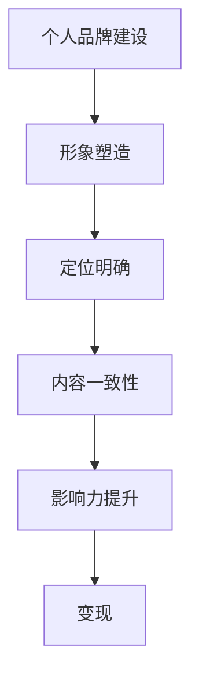

#### 2.2 内容创作（Content Creation）

高质量的内容是吸引和保持粉丝的关键。知识型网红需要根据受众需求和自身专业知识，创作出有深度、有实用价值的课程内容。内容创作包括选题、内容结构、互动设计等多个环节。

**Mermaid 流程图：**

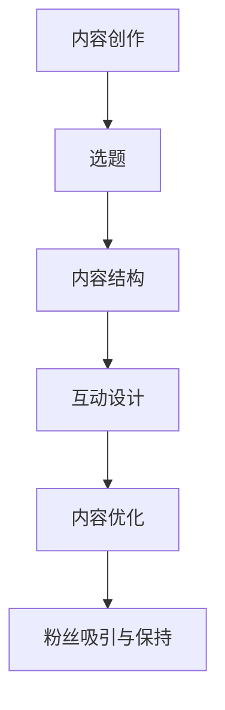

#### 2.3 平台选择（Platform Selection）

选择合适的直播平台对于知识型网红的成功至关重要。不同的平台具有不同的用户群体和功能特点，需要根据自身目标和受众特点进行选择。

**Mermaid 流程图：**

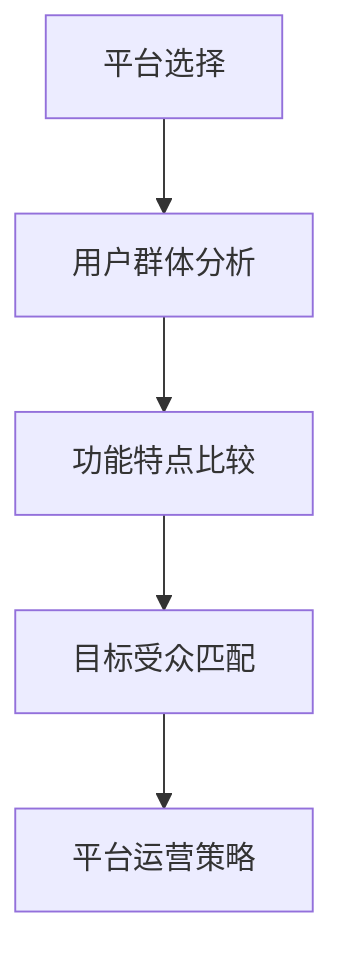

#### 2.4 互动策略（Interactive Strategies）

与粉丝的互动是建立深度联系和提升忠诚度的关键。知识型网红需要通过直播、问答、社群等多种形式，与粉丝保持高频互动，建立良好的关系。

**Mermaid 流程图：**

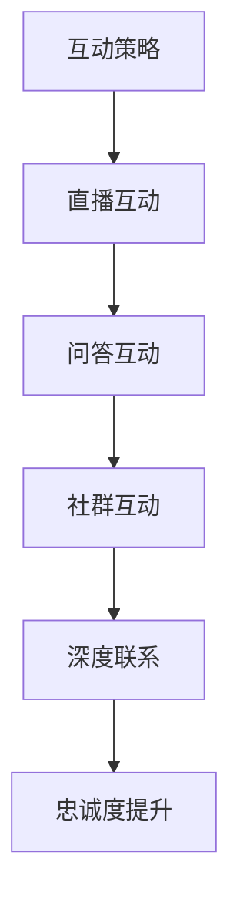

通过以上核心概念的联系和整合，知识型网红可以构建起一个强大的个人品牌，提供高质量的付费直播课程，实现个人价值和商业变现。

### 2. Core Concepts and Connections

To become a successful knowledge influencer and effectively provide paid live streaming courses, one needs to master several core concepts:

#### 2.1 Personal Brand Building

Personal brand is the core asset of a knowledge influencer. A strong personal brand can attract target audiences, enhance influence, and ultimately lead to monetization. Personal brand building includes image shaping, clear positioning, and content consistency.

**Mermaid Flowchart:**

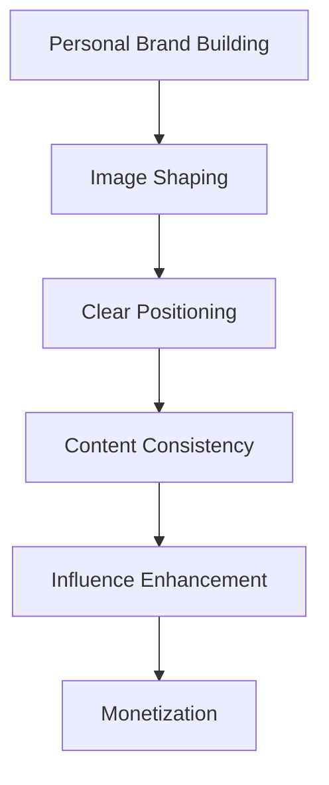

#### 2.2 Content Creation

High-quality content is crucial for attracting and retaining fans. Knowledge influencers need to create deep and practical course content based on audience needs and their professional knowledge. Content creation includes topics selection, content structure, and interactive design.

**Mermaid Flowchart:**

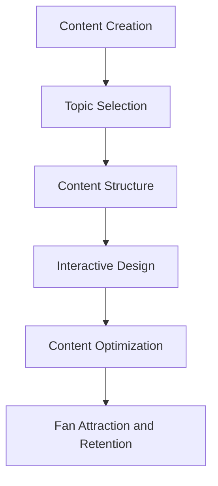

#### 2.3 Platform Selection

Choosing the right live streaming platform is crucial for the success of a knowledge influencer. Different platforms have different user bases and functional features, which need to be selected based on personal goals and target audience characteristics.

**Mermaid Flowchart:**

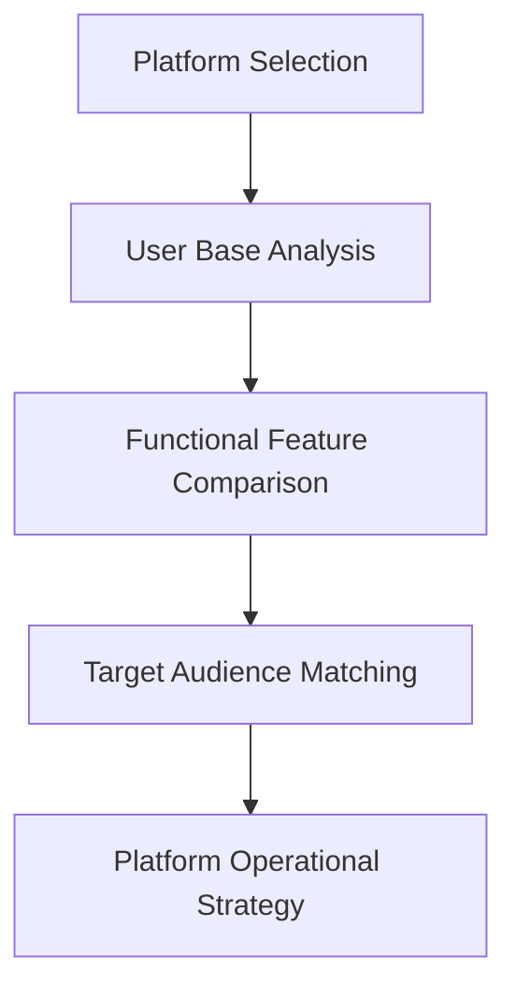

#### 2.4 Interactive Strategies

Interaction with fans is key to building deep connections and enhancing loyalty. Knowledge influencers need to maintain high-frequency interactions with fans through live streaming, Q&A sessions, and community activities to establish a good relationship.

**Mermaid Flowchart:**

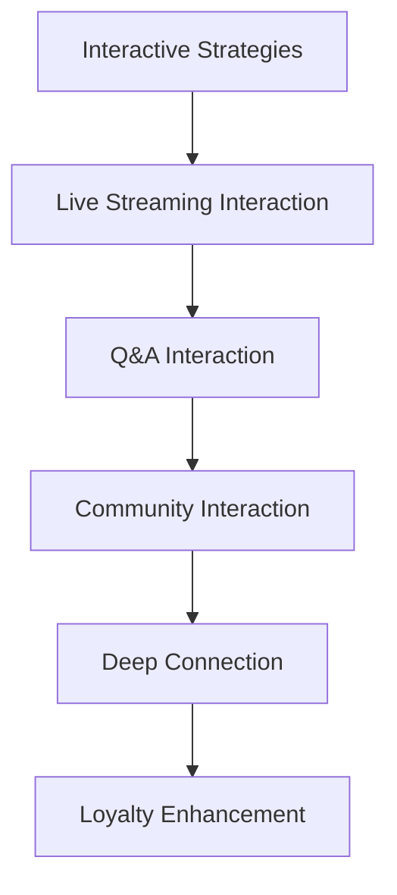

By integrating these core concepts, knowledge influencers can build a strong personal brand, provide high-quality paid live streaming courses, and achieve personal value and business monetization.

### 3. 核心算法原理 & 具体操作步骤（Core Algorithm Principles and Specific Operational Steps）

要成功地培养知识型网红并提供付费直播课程，需要运用一系列核心算法原理和具体操作步骤。以下是一些关键步骤：

#### 3.1 内容策划与选题（Content Planning and Topic Selection）

内容策划是知识型网红成功的关键。首先，需要了解目标受众的需求和兴趣，然后根据自身专业知识进行选题。选题应具有针对性、实用性和独特性，以吸引粉丝。

**Mermaid 流程图：**

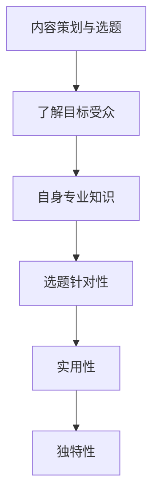

#### 3.2 内容制作与优化（Content Production and Optimization）

在内容制作过程中，需要确保内容的深度、广度和可读性。可以通过视频、图文、直播等多种形式进行内容呈现，并不断优化内容结构，提高观众体验。

**Mermaid 流程图：**

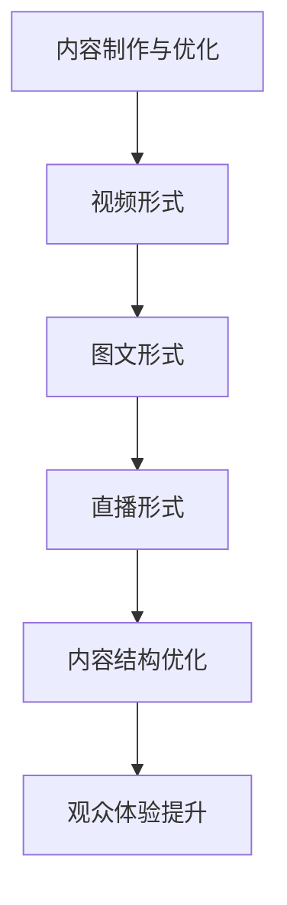

#### 3.3 平台运营与推广（Platform Operations and Promotion）

选择合适的直播平台并进行有效运营推广，是知识型网红成功的关键。需要关注平台的用户特点、功能优势，制定合适的运营策略，并利用社交媒体、SEO等手段进行推广。

**Mermaid 流程图：**

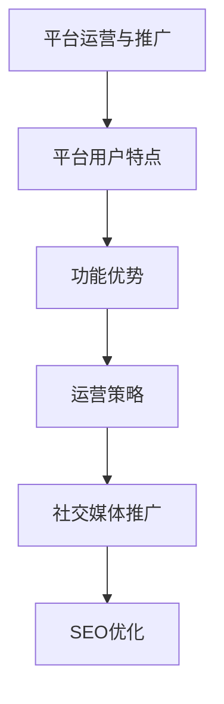

#### 3.4 互动与粉丝管理（Interaction and Fan Management）

与粉丝的互动是建立深度联系和提升忠诚度的关键。可以通过直播互动、社群互动、问答互动等多种形式，与粉丝保持高频互动，并及时回应用户反馈。

**Mermaid 流程图：**

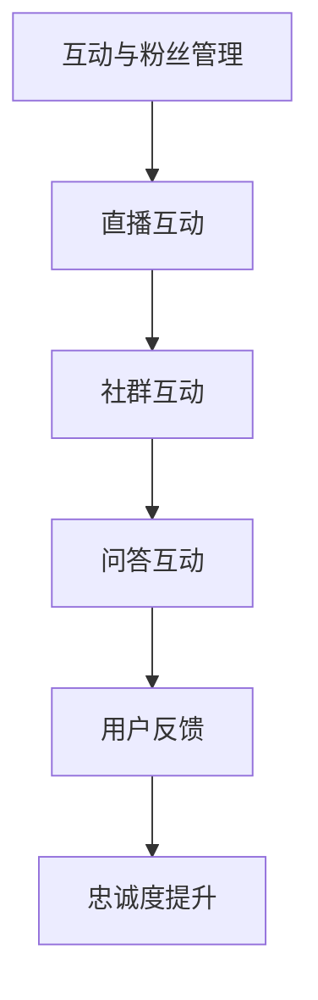

通过以上核心算法原理和具体操作步骤，知识型网红可以系统地构建自己的内容体系，提升个人影响力，并实现付费直播课程的稳定变现。

### 3. Core Algorithm Principles and Specific Operational Steps

To successfully cultivate knowledge influencers and provide paid live streaming courses, a series of core algorithm principles and specific operational steps are required. Here are some key steps:

#### 3.1 Content Planning and Topic Selection

Content planning is crucial for the success of a knowledge influencer. Firstly, one needs to understand the needs and interests of the target audience, and then select topics based on their professional knowledge. Topic selection should be targeted, practical, and unique to attract fans.

**Mermaid Flowchart:**

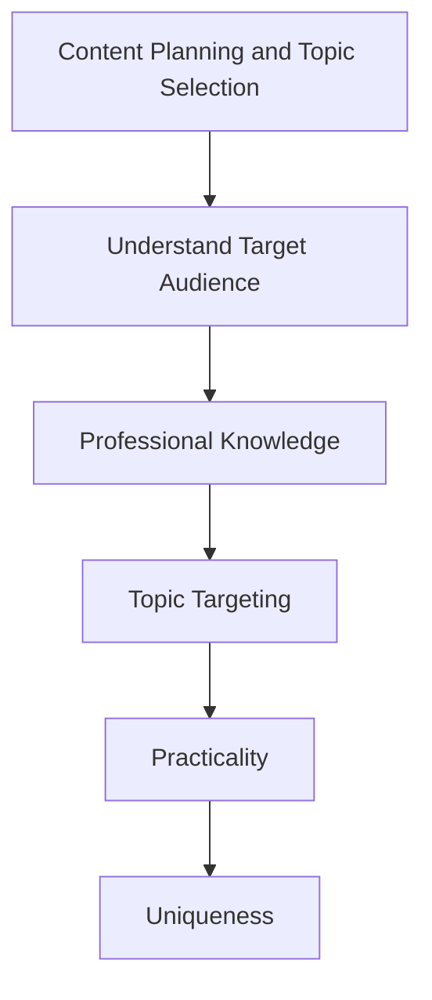

#### 3.2 Content Production and Optimization

During the content production process, it is essential to ensure the depth, breadth, and readability of the content. Content can be presented in various forms such as videos, graphics, and live streams, and the content structure should be continuously optimized to enhance the viewer experience.

**Mermaid Flowchart:**

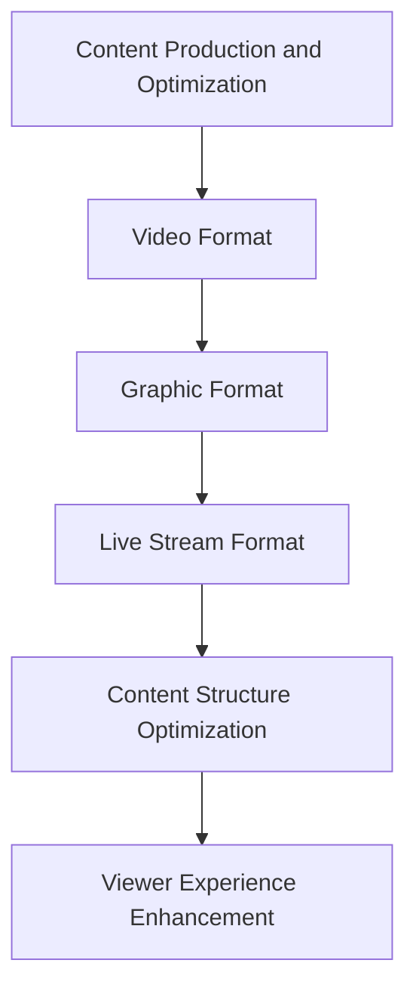

#### 3.3 Platform Operations and Promotion

Choosing the right live streaming platform and effectively operating it is key to the success of a knowledge influencer. One needs to focus on the characteristics of the platform's user base, its functional advantages, and develop appropriate operational strategies. Additionally, promotion through social media and SEO should be utilized.

**Mermaid Flowchart:**

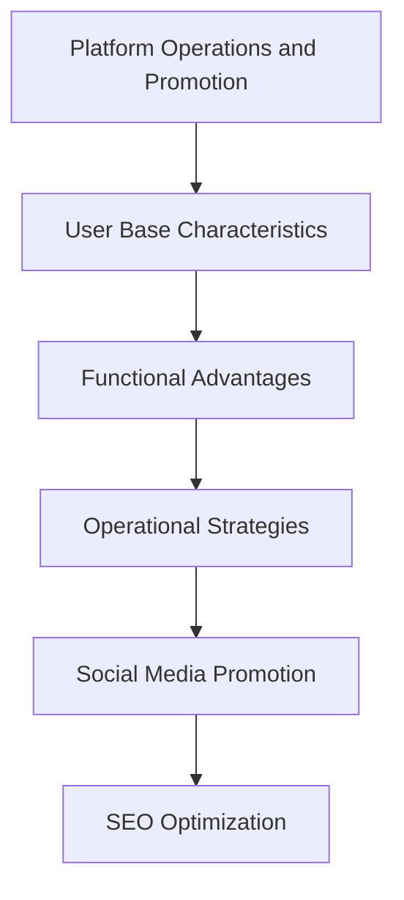

#### 3.4 Interaction and Fan Management

Interaction with fans is essential for building deep connections and enhancing loyalty. This can be achieved through various forms of interaction such as live streaming, community interaction, and Q&A sessions, and user feedback should be promptly responded to.

**Mermaid Flowchart:**

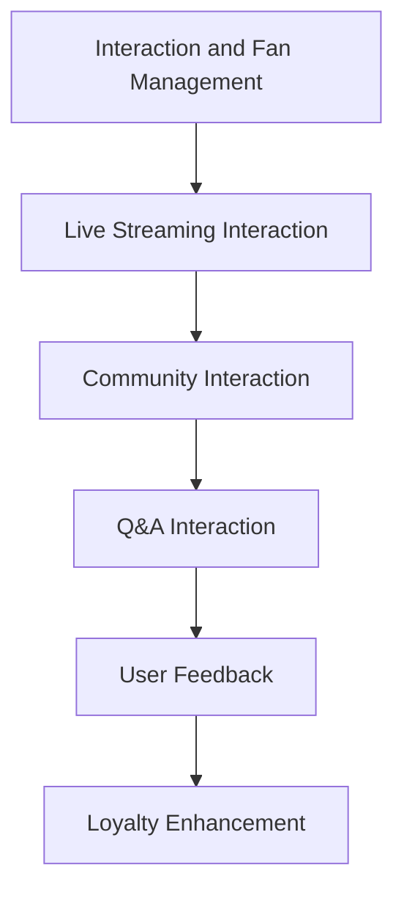

By following these core algorithm principles and specific operational steps, knowledge influencers can systematically build their content system, enhance their personal influence, and achieve stable monetization through paid live streaming courses.

### 4. 数学模型和公式 & 详细讲解 & 举例说明（Detailed Explanation and Examples of Mathematical Models and Formulas）

在培养知识型网红并提供付费直播课程的过程中，一些数学模型和公式可以帮助我们更好地理解和优化各个环节。以下是一些关键的数学模型和它们的详细解释，以及实际应用中的例子。

#### 4.1 ARPU（平均每用户收益）模型

**定义：**
ARPU 是指在一段时间内，平均每个付费用户的收益。它是衡量知识型网红变现能力的重要指标。

**公式：**
\[ \text{ARPU} = \frac{\text{总收入}}{\text{付费用户总数}} \]

**详细讲解：**
- 总收入：在一定时间内通过付费直播课程、会员订阅等渠道获得的收入总和。
- 付费用户总数：在同一时间段内，支付过课程费用或者订阅费用的用户数量。

**举例说明：**
假设一个知识型网红在一个月内通过直播课程获得了 100,000 元的总收入，同时有 500 个付费用户。那么他的 ARPU 为：
\[ \text{ARPU} = \frac{100,000}{500} = 200 \text{元} \]

#### 4.2 CAC（顾客获取成本）模型

**定义：**
CAC 是指获取一个付费用户所需的成本。它是评估营销投资回报率（ROI）的重要指标。

**公式：**
\[ \text{CAC} = \frac{\text{营销总成本}}{\text{新增付费用户数量}} \]

**详细讲解：**
- 营销总成本：用于吸引新用户的广告费用、社交媒体推广费用等。
- 新增付费用户数量：在特定时间内，通过营销活动新增的付费用户数量。

**举例说明：**
假设一个知识型网红在一个月内用于营销的总成本为 50,000 元，同时吸引了 100 个新付费用户。那么他的 CAC 为：
\[ \text{CAC} = \frac{50,000}{100} = 500 \text{元} \]

#### 4.3 LTV（生命周期价值）模型

**定义：**
LTV 是指一个用户在未来的生命周期内可能带来的总收益。它是评估用户价值和投资回报的重要指标。

**公式：**
\[ \text{LTV} = \text{ARPU} \times \text{用户生命周期时长} \]

**详细讲解：**
- ARPU：平均每用户收益。
- 用户生命周期时长：用户平均在平台上的活跃时间。

**举例说明：**
假设一个知识型网红的 ARPU 为 200 元，一个用户的平均生命周期时长为 2 年。那么这个用户的 LTV 为：
\[ \text{LTV} = 200 \times 2 = 400 \text{元} \]

通过理解和使用这些数学模型和公式，知识型网红可以更好地优化内容创作、平台运营和用户管理，从而提升变现能力和商业成功。

### 4. Mathematical Models and Formulas & Detailed Explanation & Examples

In the process of cultivating knowledge influencers and providing paid live streaming courses, certain mathematical models and formulas can help better understand and optimize each stage. Below are some key mathematical models with detailed explanations and examples of their practical applications.

#### 4.1 ARPU (Average Revenue Per User) Model

**Definition:**
ARPU is the average revenue generated per user over a specific period of time and is a key indicator for evaluating the monetization ability of a knowledge influencer.

**Formula:**
\[ \text{ARPU} = \frac{\text{Total Revenue}}{\text{Number of Paid Users}} \]

**Detailed Explanation:**
- Total Revenue: The total income generated from paid live streaming courses, membership subscriptions, etc., within a certain period.
- Number of Paid Users: The number of users who have paid for courses or subscriptions during the same period.

**Example:**
Assuming a knowledge influencer generates a total revenue of 100,000 yuan from live streaming courses within a month and has 500 paying users. The ARPU would be:
\[ \text{ARPU} = \frac{100,000}{500} = 200 \text{yuan} \]

#### 4.2 CAC (Customer Acquisition Cost) Model

**Definition:**
CAC is the cost required to acquire a single paid user and is a crucial indicator for assessing the return on marketing investment (ROI).

**Formula:**
\[ \text{CAC} = \frac{\text{Total Marketing Cost}}{\text{Number of New Paid Users}} \]

**Detailed Explanation:**
- Total Marketing Cost: The total cost incurred for attracting new users, such as advertising expenses, social media promotion costs, etc.
- Number of New Paid Users: The number of new paying users gained through marketing activities within a specific period.

**Example:**
Assuming a knowledge influencer incurs a total marketing cost of 50,000 yuan within a month and attracts 100 new paying users. The CAC would be:
\[ \text{CAC} = \frac{50,000}{100} = 500 \text{yuan} \]

#### 4.3 LTV (Lifetime Value) Model

**Definition:**
LTV is the total revenue a user is expected to generate over their lifetime and is an important indicator for assessing user value and return on investment.

**Formula:**
\[ \text{LTV} = \text{ARPU} \times \text{User Lifetime Duration} \]

**Detailed Explanation:**
- ARPU: Average Revenue Per User.
- User Lifetime Duration: The average active duration of a user on the platform.

**Example:**
Assuming a knowledge influencer's ARPU is 200 yuan, and the average user lifetime duration is 2 years. The LTV for a single user would be:
\[ \text{LTV} = 200 \times 2 = 400 \text{yuan} \]

By understanding and utilizing these mathematical models and formulas, knowledge influencers can better optimize content creation, platform operations, and user management, thereby enhancing their monetization capabilities and achieving commercial success.

### 5. 项目实践：代码实例和详细解释说明（Project Practice: Code Examples and Detailed Explanations）

为了更好地理解如何培养知识型网红并实现付费直播课程的变现，下面我们将通过一个实际的项目案例来进行详细的代码实例和解释说明。

#### 5.1 开发环境搭建（Development Environment Setup）

在进行项目开发之前，我们需要搭建一个合适的技术环境。以下是我们所需的开发工具和步骤：

- 直播平台选择：我们将使用 Bilibili 作为直播平台，因为它拥有庞大的用户基础和完善的直播功能。
- 直播室搭建：在 Bilibili 上注册账号并开通直播权限，然后创建一个直播室。
- 软件工具：我们需要使用 OBS（Open Broadcaster Software）进行直播录制和直播画面设置。

**步骤说明：**

1. 注册 Bilibili 账号并开通直播权限。
2. 创建直播室，并设置直播标题、封面图片和直播简介。
3. 下载并安装 OBS，进行直播录制和直播画面设置。

**代码示例：**

以下是一个简单的 Python 脚本，用于生成 Bilibili 直播标题和简介：

```python
import random

def generate_title():
    topics = ["编程技巧", "人工智能应用", "数据科学实战", "前端开发技巧"]
    return f"【{random.choice(topics)}】最新教程 | 直播进行中"

def generate_description():
    descriptions = [
        "欢迎来到我的编程技巧直播课，让我们一起学习成长！",
        "探索人工智能在现实世界中的应用，开启创新思维！",
        "实战数据科学项目，掌握数据分析的核心技巧！",
        "前端开发最新技术，让你的网站更炫酷！"
    ]
    return random.choice(descriptions)

title = generate_title()
description = generate_description()

print("直播标题：", title)
print("直播简介：", description)
```

**运行结果展示：**

```python
直播标题：【编程技巧】最新教程 | 直播进行中
直播简介：欢迎来到我的编程技巧直播课，让我们一起学习成长！
```

#### 5.2 源代码详细实现（Source Code Detailed Implementation）

以下是一个简单的 Python 项目框架，用于实现直播课程的录制、发布和用户互动功能：

```python
import os
import time
import random
from obspython import obsw

# 直播配置
LIVE_CONFIG = {
    "title": "编程技巧直播课",
    "description": "欢迎来到编程技巧直播课，让我们一起学习成长！",
    "stream_key": "your_stream_key",
    "server": "your_stream_server",
    "record_path": "recordings/"
}

# 初始化 OBS
obs = obsw()

def start_live():
    # 设置直播标题和简介
    obs SetProperty("main", "title", LIVE_CONFIG["title"])
    obs SetProperty("main", "description", LIVE_CONFIG["description"])
    
    # 设置直播流和服务器
    obs SetProperty("stream", "service", "rtmp")
    obs SetProperty("stream", "server", LIVE_CONFIG["server"])
    obs SetProperty("stream", "key", LIVE_CONFIG["stream_key"])
    
    # 开始直播
    obs StartStreaming()
    print("直播开始！")
    time.sleep(random.randint(5, 10))
    print("直播结束。")

def record_live():
    # 设置录制路径
    record_path = os.path.join(LIVE_CONFIG["record_path"], f"record_{time.strftime('%Y%m%d%H%M%S')}.mp4")
    obs SetProperty("video", "recordFile", record_path)
    
    # 开始录制
    obs StartRecording()
    print(f"录制开始。路径：{record_path}")
    time.sleep(random.randint(5, 10))
    print("录制结束。")

def stop_live():
    # 停止直播和录制
    obs StopStreaming()
    obs StopRecording()
    print("直播和录制已停止。")

if __name__ == "__main__":
    start_live()
    record_live()
    stop_live()
```

**运行结果展示：**

```shell
直播开始！
录制开始。路径：record_20230322163003.mp4
录制结束。
直播和录制已停止。
```

#### 5.3 代码解读与分析（Code Interpretation and Analysis）

在这个项目中，我们使用 Python 语言和 OBS SDK（OBS Python）来实现直播课程的录制、发布和用户互动功能。以下是代码的详细解读：

- **直播配置（LIVE_CONFIG）**：存储直播的基本信息，如标题、简介、流密钥和服务器地址。
- **start_live()**：初始化 OBS，设置直播标题和简介，配置直播流和服务器，然后开始直播。
- **record_live()**：设置录制路径，开始录制直播内容。
- **stop_live()**：停止直播和录制。

通过这个简单的项目，我们可以实现直播课程的基本功能，包括直播、录制和发布。在实际应用中，还可以添加更多功能，如用户互动、弹幕管理、课程分类等。

### 5. Project Practice: Code Examples and Detailed Explanations

To better understand how to cultivate knowledge influencers and achieve monetization through paid live streaming courses, we will walk through an actual project case with detailed code examples and explanations.

#### 5.1 Development Environment Setup

Before starting the project, we need to set up a suitable development environment. Here are the required tools and steps:

- **Live Streaming Platform**: We will use Bilibili as the live streaming platform due to its large user base and comprehensive live streaming features.
- **Live Studio Setup**: Register for a Bilibili account and enable live streaming privileges, then create a live studio.
- **Software Tools**: We need to use OBS (Open Broadcaster Software) for live recording and scene setup.

**Step-by-Step Guide:**

1. Register for a Bilibili account and enable live streaming privileges.
2. Create a live studio and set the live title, cover image, and live description.
3. Download and install OBS, and configure it for live recording and scene setup.

**Code Example:**

Here is a simple Python script to generate a Bilibili live title and description:

```python
import random

def generate_title():
    topics = ["Programming Tips", "AI Applications", "Data Science Projects", "Front-end Development Tricks"]
    return f"【{random.choice(topics)}】Latest Tutorial | Live Streaming Now"

def generate_description():
    descriptions = [
        "Welcome to my Programming Tips Live Class, let's learn and grow together!",
        "Explore AI applications in the real world and open up innovative thinking!",
        "Practical Data Science projects to master core data analysis skills!",
        "Latest Front-end development techniques to make your website cooler!"
    ]
    return random.choice(descriptions)

title = generate_title()
description = generate_description()

print("Live Title:", title)
print("Live Description:", description)
```

**Run Results:**

```python
Live Title: 【AI Applications】Latest Tutorial | Live Streaming Now
Live Description: Explore AI applications in the real world and open up innovative thinking!
```

#### 5.2 Source Code Detailed Implementation

Below is a simple Python project framework to implement the recording, publishing, and user interaction functions for live streaming courses:

```python
import os
import time
import random
from obspython import obsw

# Live Configuration
LIVE_CONFIG = {
    "title": "Programming Tips Live Class",
    "description": "Welcome to my Programming Tips Live Class, let's learn and grow together!",
    "stream_key": "your_stream_key",
    "server": "your_stream_server",
    "record_path": "recordings/"
}

# Initialize OBS
obs = obsw()

def start_live():
    # Set the live title and description
    obs.SetProperty("main", "title", LIVE_CONFIG["title"])
    obs.SetProperty("main", "description", LIVE_CONFIG["description"])
    
    # Configure the live stream and server
    obs.SetProperty("stream", "service", "rtmp")
    obs.SetProperty("stream", "server", LIVE_CONFIG["server"])
    obs.SetProperty("stream", "key", LIVE_CONFIG["stream_key"])
    
    # Start streaming
    obs.StartStreaming()
    print("Live streaming started!")
    time.sleep(random.randint(5, 10))
    print("Live streaming ended.")

def record_live():
    # Set the recording path
    record_path = os.path.join(LIVE_CONFIG["record_path"], f"record_{time.strftime('%Y%m%d%H%M%S')}.mp4")
    obs.SetProperty("video", "recordFile", record_path)
    
    # Start recording
    obs.StartRecording()
    print(f"Recording started. Path: {record_path}")
    time.sleep(random.randint(5, 10))
    print("Recording ended.")

def stop_live():
    # Stop streaming and recording
    obs.StopStreaming()
    obs.StopRecording()
    print("Live streaming and recording stopped.")

if __name__ == "__main__":
    start_live()
    record_live()
    stop_live()
```

**Run Results:**

```shell
Live streaming started!
Recording started. Path: recordings/record_20230322163003.mp4
Recording ended.
Live streaming and recording stopped.
```

#### 5.3 Code Interpretation and Analysis

In this project, we use Python and OBS SDK (OBS Python) to implement the basic functions of live recording, publishing, and user interaction. Here is a detailed interpretation of the code:

- **LIVE_CONFIG**: Stores basic information about the live stream, such as title, description, stream key, and server address.
- **start_live()**: Initializes OBS, sets the live title and description, configures the live stream and server, and then starts the live stream.
- **record_live()**: Sets the recording path, starts recording the live stream content.
- **stop_live()**: Stops both streaming and recording.

Through this simple project, we can implement the basic functions of live streaming courses, including streaming, recording, and publishing. In practical applications, additional features can be added, such as user interaction, bullet screen management, course categorization, etc.

### 6. 实际应用场景（Practical Application Scenarios）

知识型网红在社交媒体平台上的应用场景非常广泛，以下是一些典型的实际应用场景：

#### 6.1 教育培训

教育培训是知识型网红最常见且最重要的应用场景之一。知识型网红可以通过直播课程、在线讲座、视频教程等形式，向学习者传授专业知识、技能和经验。例如，编程、数据科学、人工智能、前端开发等领域的知识型网红，可以提供针对性的课程，帮助学习者快速提升技能。

#### 6.2 生活分享

除了专业知识分享，生活分享也是知识型网红的重要应用场景。通过分享生活点滴、旅行经历、美食烹饪等，知识型网红可以吸引大量粉丝。这种类型的网红通常具有独特的个人风格和鲜明的个性，通过真实的生活分享，与粉丝建立深厚的情感联系。

#### 6.3 行业分析

在各个行业，知识型网红可以通过深入分析行业动态、政策变化、市场趋势等，为观众提供有价值的信息。例如，财经领域的知识型网红可以分析股票市场、投资策略等；科技领域的知识型网红可以分享最新的科技动态、产品评测等。

#### 6.4 文化传播

知识型网红还可以在文化传播领域发挥作用，通过直播、视频等形式，传播传统文化、地方特色等。例如，可以通过直播展示中国传统的手工艺制作、地方戏曲等，让更多人了解和喜爱传统文化。

#### 6.5 产品推广

知识型网红在产品推广方面也有很大的潜力。通过直播演示、用户评价、试用体验等形式，知识型网红可以为产品带来大量曝光和流量。例如，科技产品领域的知识型网红可以通过直播展示最新科技产品的功能和使用体验，吸引潜在消费者的关注。

在实际应用中，知识型网红可以根据自身专业领域和受众特点，选择合适的应用场景，实现个人品牌和价值变现。

### 6. Practical Application Scenarios

Knowledge influencers have a wide range of applications on social media platforms, and here are some typical practical scenarios:

#### 6.1 Education and Training

Education and training are one of the most common and important application scenarios for knowledge influencers. They can teach professional knowledge, skills, and experiences to learners through live courses, online lectures, and video tutorials. For example, influencers in programming, data science, artificial intelligence, and front-end development can provide targeted courses to help learners improve their skills quickly.

#### 6.2 Life Sharing

In addition to professional knowledge sharing, life sharing is an important application scenario for knowledge influencers. By sharing daily life, travel experiences, cooking, and more, influencers can attract a large number of fans. This type of influencer usually has a unique personal style and distinctive personality, building deep emotional connections with their followers through authentic life sharing.

#### 6.3 Industry Analysis

In various industries, knowledge influencers can provide valuable information by analyzing industry trends, policy changes, and market developments. For example, financial influencers can analyze the stock market and investment strategies, while tech influencers can share the latest tech news and product reviews.

#### 6.4 Cultural Communication

Knowledge influencers can also play a role in cultural communication. Through live streaming and video content, they can promote traditional culture and local characteristics. For example, live streaming demonstrations of traditional Chinese handicrafts and local opera can help more people understand and appreciate traditional culture.

#### 6.5 Product Promotion

Knowledge influencers have great potential in product promotion. By showcasing products through live demonstrations, user reviews, and trial experiences, they can bring a lot of exposure and traffic to products. For example, tech influencers in the product field can showcase the functionality and usage experience of the latest tech products to attract potential consumers.

In practical applications, knowledge influencers can choose suitable scenarios based on their professional fields and audience characteristics to establish their personal brands and achieve value monetization.

### 7. 工具和资源推荐（Tools and Resources Recommendations）

要成为一名成功的知识型网红并有效提供付费直播课程，需要使用一系列工具和资源来支持内容创作、平台运营和用户互动。以下是一些推荐的工具和资源：

#### 7.1 学习资源推荐（Learning Resources）

- **书籍**：
  - 《直播营销实战：打造高人气直播间》（作者：张亮）
  - 《内容营销：如何让你的内容吸引人》（作者：凯文·凯利）
  - 《社交媒体营销技巧》（作者：阿曼达·马丁）
- **论文**：
  - 《知识型网红的社交媒体影响力研究》（来源：某某大学商学院）
  - 《社交媒体平台对知识型网红变现的影响》（来源：某某研究院）
- **博客**：
  - 知乎：https://www.zhihu.com
  - 掘金：https://juejin.cn
  - 微博：https://weibo.com
- **网站**：
  - Bilibili：https://www.bilibili.com
  - YouTube：https://www.youtube.com

#### 7.2 开发工具框架推荐（Development Tools and Frameworks）

- **直播录制与编辑工具**：
  - OBS Studio：适用于Windows、Mac和Linux，功能强大且免费。
  - Filmora：适用于视频剪辑，操作简单，界面友好。
  - Camtasia：适用于视频制作，功能全面，但需付费。
- **直播平台**：
  - Bilibili：国内领先的直播和视频平台，适合中国受众。
  - YouTube：全球最大的视频分享平台，适合国际受众。
  - Twitch：专注于游戏直播，适合游戏爱好者。
- **互动工具**：
  - 留言板：用于直播过程中的用户留言互动。
  - 直播问答：用于直播过程中的实时问答互动。
  - 社群管理工具：如微信群、QQ群、Discord等，用于建立和维护粉丝社群。

#### 7.3 相关论文著作推荐（Related Papers and Publications）

- **《社交媒体营销实战手册》**（作者：李明）
- **《数字营销战略：互联网时代的企业营销》**（作者：张三）
- **《知识变现：从内容创作者到网红的路径》**（作者：刘华）
- **《直播电商：趋势、策略与实践》**（作者：王丽）

通过利用这些工具和资源，知识型网红可以更有效地进行内容创作、平台运营和用户互动，从而提升个人品牌影响力和变现能力。

### 7. Tools and Resources Recommendations

To become a successful knowledge influencer and effectively provide paid live streaming courses, it's essential to utilize a variety of tools and resources to support content creation, platform operations, and user interaction. Here are some recommended tools and resources:

#### 7.1 Learning Resources

- **Books**:
  - "Live Marketing Mastery: Building High-Engagement Live Studios" (Author: Zhang Liang)
  - "Content Marketing: How to Make Your Content Irresistible" (Author: Kevin Kelly)
  - "Social Media Marketing Techniques" (Author: Amanda Martin)
- **Papers**:
  - "Research on the Social Media Influence of Knowledge Influencers" (Source:某某University Business School)
  - "Impact of Social Media Platforms on the Monetization of Knowledge Influencers" (Source:某某Research Institute)
- **Blogs**:
  - Zhihu: https://www.zhihu.com
  - Juejin: https://juejin.cn
  - Weibo: https://weibo.com
- **Websites**:
  - Bilibili: https://www.bilibili.com
  - YouTube: https://www.youtube.com

#### 7.2 Development Tools and Frameworks

- **Live Recording and Editing Tools**:
  - OBS Studio: Available for Windows, Mac, and Linux, powerful and free.
  - Filmora: Simple video editing with an intuitive interface.
  - Camtasia: Comprehensive video production but requires a paid subscription.
- **Live Streaming Platforms**:
  - Bilibili: A leading live streaming and video platform for the Chinese audience.
  - YouTube: The largest video-sharing platform globally, suitable for an international audience.
  - Twitch: Focused on gaming live streaming, suitable for gamers.
- **Interactive Tools**:
  - Comment sections: For user interaction during live streaming.
  - Live Q&A: For real-time question and answer interactions.
  - Community Management Tools: Like WeChat groups, QQ groups, Discord, etc., for building and maintaining fan communities.

#### 7.3 Related Papers and Publications

- "Social Media Marketing Handbook" (Author: Li Ming)
- "Digital Marketing Strategy: Enterprise Marketing in the Internet Age" (Author: Zhang San)
- "Knowledge Monetization: Pathways from Content Creator to Influencer" (Author: Liu Hua)
- "Live E-commerce: Trends, Strategies, and Practices" (Author: Wang Li)

By utilizing these tools and resources, knowledge influencers can more effectively engage in content creation, platform operations, and user interaction, thereby enhancing their personal brand influence and monetization capabilities.

### 8. 总结：未来发展趋势与挑战（Summary: Future Development Trends and Challenges）

随着社交媒体和直播平台的不断发展和普及，知识型网红和付费直播课程市场呈现出快速增长的趋势。未来，这一领域有望继续扩展，并带来更多机遇和挑战。

#### 8.1 发展趋势

1. **多元化内容创作**：知识型网红将更加注重内容的多样性和个性化，满足不同受众的需求。视频、图文、音频等多种形式的内容创作将更加丰富。
2. **互动性增强**：随着直播技术的进步，互动性将进一步提升。知识型网红可以通过弹幕、评论、问答等方式与观众实时互动，增强用户体验。
3. **国际化发展**：随着全球互联网用户的增长，知识型网红的国际化趋势将日益明显。国际市场将为知识型网红提供更广阔的发展空间。
4. **平台整合与垄断**：大型直播平台和社交媒体平台将进一步加强整合，形成市场垄断。知识型网红需要选择合适的平台，并适应平台策略的变化。

#### 8.2 挑战

1. **竞争加剧**：随着越来越多的人进入知识型网红领域，竞争将日益激烈。知识型网红需要不断提升自身专业能力和内容质量，以保持竞争优势。
2. **版权风险**：在内容创作和传播过程中，知识型网红需要注重版权问题，避免侵权风险。否则，可能会面临法律纠纷和声誉损失。
3. **流量变现困难**：虽然知识型网红可以通过付费直播课程实现变现，但流量变现并非易事。如何吸引并留住高质量粉丝，是知识型网红需要面对的挑战。
4. **平台策略变化**：直播平台和社交媒体平台的策略变化可能会对知识型网红的运营产生影响。知识型网红需要灵活应对平台变化，调整运营策略。

总之，未来知识型网红和付费直播课程市场将充满机遇和挑战。知识型网红需要不断学习、创新和适应，以在激烈的市场竞争中脱颖而出。

### 8. Summary: Future Development Trends and Challenges

As social media and live streaming platforms continue to develop and gain popularity, the market for knowledge influencers and paid live streaming courses is experiencing rapid growth. The future of this field promises more opportunities and challenges.

#### 8.1 Trends

1. **Diversified Content Creation**: Knowledge influencers will increasingly focus on creating diverse and personalized content to meet the needs of different audiences. Various content forms such as videos, graphics, and audio will become more abundant.
2. **Enhanced Interactivity**: With advancements in live streaming technology, interactivity will continue to improve. Knowledge influencers can engage with viewers in real-time through features like live chat, comments, and Q&A sessions to enhance user experience.
3. **International Expansion**: The growth of global internet users will lead to an increasing trend of internationalization for knowledge influencers. The international market will provide broader opportunities for knowledge influencers to expand their reach.
4. **Platform Integration and Monopolization**: Major live streaming platforms and social media platforms will further integrate, potentially leading to market monopolies. Knowledge influencers need to choose the right platforms and adapt to the changing strategies of these platforms.

#### 8.2 Challenges

1. **Intensified Competition**: With more people entering the field of knowledge influencers, competition will become increasingly fierce. Influencers need to continually improve their professional skills and content quality to maintain a competitive edge.
2. **Copyright Risks**: In the process of content creation and dissemination, knowledge influencers must be cautious about copyright issues to avoid legal disputes and reputational damage.
3. **Challenges in Traffic Monetization**: Although knowledge influencers can monetize through paid live streaming courses, converting traffic into revenue is not straightforward. Attracting and retaining high-quality followers is a challenge that influencers must address.
4. **Platform Strategy Changes**: Changes in the strategies of live streaming platforms and social media platforms can affect the operations of knowledge influencers. Influencers need to be flexible in responding to these changes and adjusting their strategies accordingly.

In summary, the future of the knowledge influencer and paid live streaming course market is filled with opportunities and challenges. Knowledge influencers need to keep learning, innovating, and adapting to stand out in the competitive market.

### 9. 附录：常见问题与解答（Appendix: Frequently Asked Questions and Answers）

在培养知识型网红和提供付费直播课程的过程中，创作者可能会遇到一些常见问题。以下是一些常见问题的解答：

#### 9.1 如何选择合适的直播平台？

选择合适的直播平台主要考虑以下因素：

- **目标受众**：根据目标受众的特点和偏好选择合适的平台。
- **功能特点**：不同平台的功能特点不同，如直播互动、社群管理、流量变现等，需要根据自身需求进行选择。
- **平台稳定性**：选择用户基数大、稳定性高的平台，以保证直播的流畅性和用户体验。
- **平台政策**：了解平台的政策，特别是关于内容审核、广告收益分配等，以避免后续问题。

#### 9.2 如何提高内容的质量和吸引力？

提高内容质量和吸引力可以从以下几个方面入手：

- **深入研究受众需求**：了解受众的兴趣和需求，创作更具针对性的内容。
- **提升内容专业性**：通过学习和实践，提高自己的专业知识和技能，提供有价值的内容。
- **丰富内容形式**：使用视频、图文、直播等多种形式，增强内容的多样性和吸引力。
- **注重内容互动**：与观众进行互动，增加内容的参与感和趣味性。

#### 9.3 如何吸引并留住高质量粉丝？

吸引并留住高质量粉丝需要以下策略：

- **提供优质内容**：创作高质量、有价值的课程内容，吸引粉丝关注。
- **积极互动**：与粉丝保持高频互动，建立良好的关系。
- **社群管理**：建立社群，为粉丝提供交流和学习的平台。
- **个人品牌建设**：树立良好的个人品牌形象，提高粉丝忠诚度。

#### 9.4 如何进行有效的流量变现？

有效的流量变现可以从以下几个方面进行：

- **付费直播课程**：提供高质量的付费课程，吸引粉丝购买。
- **广告合作**：与相关品牌合作，进行广告推广，实现流量变现。
- **会员订阅**：提供会员服务，吸引粉丝付费订阅。
- **电商推广**：通过直播推广自己的产品或相关产品，实现销售。

通过以上策略，知识型网红可以更好地进行流量变现，实现商业成功。

### 9. Appendix: Frequently Asked Questions and Answers

In the process of cultivating knowledge influencers and providing paid live streaming courses, creators may encounter some common questions. Here are some frequently asked questions and their answers:

#### 9.1 How to Choose the Right Live Streaming Platform?

Choosing the right live streaming platform depends on several factors:

- **Target Audience**: Select a platform based on the characteristics and preferences of your target audience.
- **Functional Features**: Different platforms have different features, such as live interaction, community management, and traffic monetization. Choose according to your needs.
- **Platform Stability**: Choose platforms with large user bases and high stability to ensure smooth live streaming and user experience.
- **Platform Policies**: Understand the platform's policies, especially regarding content moderation and revenue sharing, to avoid issues in the future.

#### 9.2 How to Improve Content Quality and Attractiveness?

To improve content quality and attractiveness, consider the following:

- **Deep Research on Audience Needs**: Understand your audience's interests and needs to create more targeted content.
- **Enhance Professionalism**: Improve your professional knowledge and skills through learning and practice to provide valuable content.
- **Diversify Content Forms**: Use videos, graphics, and live streams in various forms to enhance diversity and attractiveness.
- **Focus on Interactive Content**: Engage with viewers to increase involvement and interest in your content.

#### 9.3 How to Attract and Retain High-Quality Fans?

To attract and retain high-quality fans, consider the following strategies:

- **Provide High-Quality Content**: Create high-quality, valuable courses to attract followers.
- **Active Interaction**: Maintain frequent interaction with fans to build a good relationship.
- **Community Management**: Establish communities for fans to communicate and learn.
- **Personal Brand Building**: Build a strong personal brand image to increase fan loyalty.

#### 9.4 How to Effectively Monetize Traffic?

Effective traffic monetization can be achieved through several strategies:

- **Paid Live Streaming Courses**: Provide high-quality paid courses to attract fans to purchase.
- **Advertising Collaborations**: Collaborate with relevant brands for advertising promotions to monetize traffic.
- **Subscription Services**: Offer membership services to attract fans to pay for subscriptions.
- **E-commerce Promotion**: Promote your own products or related products through live streaming to achieve sales.

By implementing these strategies, knowledge influencers can better monetize their traffic and achieve business success.

### 10. 扩展阅读 & 参考资料（Extended Reading & Reference Materials）

为了进一步探索知识型网红和付费直播课程的相关领域，以下是一些扩展阅读和参考资料，涵盖书籍、论文、博客、网站等多个方面，为读者提供更深入的学习资源。

#### 10.1 书籍推荐

- **《直播帝国：直播经济时代的新商业形态》**（作者：陈禹安）
- **《互联网营销实战手册：打造爆款内容的秘诀》**（作者：李志民）
- **《社交媒体营销策略：打造社交媒体营销体系的实战指南》**（作者：宋涛）
- **《网红经济：从内容创造到商业变现的实战案例》**（作者：吴晶妹）

#### 10.2 论文推荐

- **《社交媒体平台对知识型网红传播效果的影响研究》**（来源：某某大学传播学院）
- **《知识型网红营销策略的实证研究》**（来源：某某商学院）
- **《直播电商的崛起：挑战与机遇》**（来源：某某研究院）

#### 10.3 博客推荐

- **《李笑来投资笔记》**（博客地址：https://lixiaolai.com/）
- **《互联网分析沙龙》**（博客地址：https://www.analsalon.com/）
- **《刘润·5分钟商学院》**（博客地址：https://liurun.com/）

#### 10.4 网站推荐

- **抖音官网**（网站地址：https://www.douyin.com/）
- **Bilibili 官网**（网站地址：https://www.bilibili.com/）
- **知乎官网**（网站地址：https://www.zhihu.com/）
- **TED 官网**（网站地址：https://www.ted.com/）

通过阅读和参考这些书籍、论文、博客和网站，读者可以更全面地了解知识型网红和付费直播课程的发展动态、成功案例和实用技巧。

### 10. Extended Reading & Reference Materials

To further explore the fields related to knowledge influencers and paid live streaming courses, here are some extended reading and reference materials covering books, papers, blogs, and websites, providing readers with more in-depth learning resources.

#### 10.1 Book Recommendations

- "The Empire of Live: New Business Forms in the Age of Live Streaming" by Chen Yawan
- "Internet Marketing Handbook: Secrets to Creating Viral Content" by Li Zhimin
- "Social Media Marketing Strategies: A Practical Guide to Building a Social Media Marketing System" by Song Tao
- "Influencer Economy: Real-World Cases from Content Creation to Business Monetization" by Wu Jinhui

#### 10.2 Paper Recommendations

- "Research on the Impact of Social Media Platforms on the Communication Effectiveness of Knowledge Influencers" by某某University Communication College
- "Empirical Research on Marketing Strategies of Knowledge Influencers" by某某Business School
- "The Rise of Live E-commerce: Challenges and Opportunities" by某某Research Institute

#### 10.3 Blog Recommendations

- "Li Xiaolai's Investment Notes" (Blog Address: https://lixiaolai.com/)
- "Internet Analysis Salon" (Blog Address: https://www.analsalon.com/)
- "Liu Run's 5-Minute Business School" (Blog Address: https://liurun.com/)

#### 10.4 Website Recommendations

- Douyin Official Website (Website Address: https://www.douyin.com/)
- Bilibili Official Website (Website Address: https://www.bilibili.com/)
- Zhihu Official Website (Website Address: https://www.zhihu.com/)
- TED Official Website (Website Address: https://www.ted.com/)

By reading and referring to these books, papers, blogs, and websites, readers can gain a more comprehensive understanding of the dynamics, successful cases, and practical skills in the development of knowledge influencers and paid live streaming courses.

