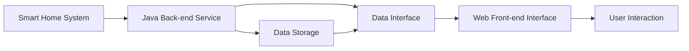

                 

### 文章标题

### Title

"基于Java的智能家居设计：打造响应式智能家居前端界面——Java与Web整合"

This article delves into the design of smart home systems using Java, focusing on creating a responsive front-end interface for smart home applications. The integration of Java with Web technologies will be discussed, providing a comprehensive guide for developers to build robust and interactive smart home solutions.

### 摘要

本文旨在介绍基于Java的智能家居设计，重点关注前端界面的开发。我们将探讨如何利用Java与Web技术的整合，创建一个响应式的智能家居前端界面。通过详细的步骤和代码实例，读者将学会如何从零开始构建智能家居系统，并理解其中的核心概念和关键技术。

### Abstract

This paper aims to introduce the design of smart home systems based on Java, with a focus on the development of the front-end interface. We will explore how the integration of Java with Web technologies can be leveraged to create a responsive front-end interface for smart home applications. Through detailed steps and code examples, readers will learn how to build a smart home system from scratch and understand the core concepts and key technologies involved.

## 1. 背景介绍（Background Introduction）

### 1.1 智能家居的兴起

随着物联网（IoT）技术的快速发展，智能家居已经成为现代家庭生活的重要组成部分。智能家居系统通过整合各种智能设备和传感器，实现了对家庭环境、安全、能源管理等各个方面的智能化控制。这种便捷、高效的生活方式吸引了越来越多的用户。

### 1.2 Java在智能家居开发中的应用

Java作为一种历史悠久且广泛使用的编程语言，因其平台无关性、稳定性以及丰富的生态系统，在智能家居开发中得到了广泛应用。Java不仅可以用于后端服务，如数据存储、处理和分析，还可以用于前端界面开发，提供丰富的用户交互体验。

### 1.3 Web技术在智能家居中的作用

Web技术为智能家居前端界面提供了强大的支持。通过Web技术，开发者可以创建跨平台、响应式的用户界面，使得用户可以通过各种设备，如智能手机、平板电脑和电脑，轻松访问和管理智能家居系统。Web技术还包括前端框架（如React、Vue、Angular）和后端服务（如Node.js、Spring Boot），这些框架和服务使得开发高效、可扩展的智能家居系统成为可能。

### 1.4 文章结构

本文将分为以下几个部分：

1. 背景介绍
2. 核心概念与联系
3. 核心算法原理 & 具体操作步骤
4. 数学模型和公式 & 详细讲解 & 举例说明
5. 项目实践：代码实例和详细解释说明
6. 实际应用场景
7. 工具和资源推荐
8. 总结：未来发展趋势与挑战
9. 附录：常见问题与解答
10. 扩展阅读 & 参考资料

通过以上结构，我们将全面探讨基于Java的智能家居前端界面的设计和实现，帮助开发者深入了解并掌握相关技术和方法。

### 1. Background Introduction

#### 1.1 Rise of Smart Home Systems

With the rapid development of the Internet of Things (IoT) technology, smart home systems have become an integral part of modern family life. These systems integrate various intelligent devices and sensors to provide smart control over various aspects of the home environment, including security, energy management, and more. This convenient and efficient lifestyle has attracted a growing number of users.

#### 1.2 Application of Java in Smart Home Development

Java, as a historically long-standing and widely-used programming language, has found extensive application in smart home development due to its platform independence, stability, and rich ecosystem. Java can be used not only for back-end services such as data storage, processing, and analysis but also for front-end interface development, providing rich user interaction experiences.

#### 1.3 Role of Web Technology in Smart Home

Web technology plays a crucial role in the development of smart home front-end interfaces. Through Web technology, developers can create cross-platform and responsive user interfaces, allowing users to easily access and manage smart home systems via various devices, such as smartphones, tablets, and computers. Web technology includes front-end frameworks (such as React, Vue, Angular) and back-end services (such as Node.js, Spring Boot), which enable developers to build efficient and scalable smart home systems.

#### 1.4 Structure of the Article

The following sections will be covered in this article:

1. Background Introduction
2. Core Concepts and Connections
3. Core Algorithm Principles and Specific Operational Steps
4. Detailed Explanation and Examples of Mathematical Models and Formulas
5. Project Practice: Code Examples and Detailed Explanations
6. Practical Application Scenarios
7. Tools and Resources Recommendations
8. Summary: Future Development Trends and Challenges
9. Appendix: Frequently Asked Questions and Answers
10. Extended Reading and Reference Materials

Through this structured approach, we will explore the design and implementation of smart home front-end interfaces based on Java, helping developers gain a deep understanding and mastery of the relevant technologies and methods.

## 2. 核心概念与联系（Core Concepts and Connections）

### 2.1 Java编程语言

Java是一种高级、面向对象的编程语言，具有跨平台、安全性高、稳定性好等特点。Java通过其虚拟机（JVM）实现了跨平台运行，使得开发者在编写一次代码后，可以在不同的操作系统上直接运行，大大提高了开发效率和可移植性。

### 2.2 Web前端开发

Web前端开发是指使用HTML、CSS和JavaScript等技术，创建用户与网站交互的界面。前端开发的目标是提供良好的用户体验，使得网站在不同设备和浏览器上都能保持一致性和响应速度。

### 2.3 响应式设计

响应式设计是一种能够适应不同设备屏幕尺寸和分辨率的网页设计方法。通过使用弹性布局、媒体查询和响应式图片等技术，响应式设计能够确保网站在桌面电脑、平板电脑和智能手机上都能良好显示。

### 2.4 Java与Web前端开发的关系

Java在后端提供服务，处理业务逻辑和数据交互，而Web前端开发则通过Java编写的API与后端进行通信，实现数据的展示和用户交互。两者紧密结合，共同构成了一个完整的智能家居系统。

### 2.5 核心概念原理与架构图

以下是智能家居系统的核心概念原理与架构图，用于说明Java与Web前端开发之间的联系。


在这个架构图中，Java后端服务负责处理业务逻辑、数据存储和数据接口，Web前端界面则通过数据接口与后端进行通信，实现用户交互。

### 2.6 Java与Web前端开发的整合

Java与Web前端开发的整合，主要通过以下几种方式实现：

1. RESTful API：使用Java编写RESTful API，供前端调用，实现数据交互。
2. WebSocket：使用Java WebSocket技术，实现实时数据传输。
3. 前后端分离：通过MVC（Model-View-Controller）架构，将前后端分离，提高开发效率。

通过上述整合方式，Java与Web前端开发可以无缝协作，共同打造一个功能强大、用户体验良好的智能家居系统。

### 2.1 Java Programming Language

Java is a high-level, object-oriented programming language known for its platform independence, high security, and stability. Java achieves cross-platform compatibility through its Java Virtual Machine (JVM), allowing developers to write once and run anywhere, greatly enhancing development efficiency and portability.

### 2.2 Web Front-end Development

Web front-end development involves creating user interfaces for websites using technologies such as HTML, CSS, and JavaScript. The goal of front-end development is to provide a great user experience, ensuring that websites remain consistent and responsive on various devices and browsers.

### 2.3 Responsive Design

Responsive design is a method of web design that ensures webpages are displayed correctly on various devices and screen sizes. By using flexible layouts, media queries, and responsive images, responsive design ensures that websites are well-presented on desktop computers, tablets, and smartphones.

### 2.4 Relationship between Java and Web Front-end Development

Java is responsible for back-end services, handling business logic, and data interactions, while Web front-end development communicates with the back-end through Java-written APIs to display data and facilitate user interaction. Together, they form a complete smart home system.

### 2.5 Core Concept Principles and Architecture Diagram

The following is a diagram illustrating the core concept principles and architecture of a smart home system, demonstrating the connection between Java and Web front-end development:



In this diagram, the Java back-end service handles business logic, data storage, and data interface, while the Web front-end interface communicates with the back-end through the data interface to enable user interaction.

### 2.6 Integration of Java and Web Front-end Development

The integration of Java and Web front-end development can be achieved through several approaches:

1. RESTful API: Java can be used to write RESTful APIs that are called by the front-end to facilitate data interaction.
2. WebSocket: Java WebSocket technology can be used to enable real-time data transmission.
3. Separation of Concerns: Using the MVC (Model-View-Controller) architecture, front-end and back-end development can be separated to improve development efficiency.

Through these integration methods, Java and Web front-end development can work seamlessly together to create a powerful and user-friendly smart home system.

### 3. 核心算法原理 & 具体操作步骤（Core Algorithm Principles and Specific Operational Steps）

#### 3.1 响应式设计的核心算法

响应式设计的核心在于如何根据不同设备的屏幕尺寸和分辨率，动态调整网页布局和样式。这通常涉及到以下几种核心算法：

1. **弹性布局**：通过使用百分比而非固定像素值来定义元素宽度，确保网页在不同屏幕尺寸上保持一致。
2. **媒体查询**：使用CSS媒体查询（Media Queries）来检测设备的特性，并根据这些特性应用不同的样式。
3. **响应式图片**：通过使用不同尺寸的图片，或者使用图片的`srcset`属性，为不同设备提供最佳的图片质量。

#### 3.2 具体操作步骤

下面是创建一个响应式智能家居前端界面的具体操作步骤：

1. **设计界面布局**：
   - 使用Figma、Sketch等设计工具，设计界面的草图和样式。
   - 确保设计符合移动端、平板端和桌面端的不同需求。

2. **编写HTML结构**：
   - 使用Bootstrap等前端框架，快速搭建响应式布局的基础。
   - 根据设计稿，编写HTML标签和结构，确保结构清晰、语义化。

3. **应用CSS样式**：
   - 使用媒体查询，为不同屏幕尺寸应用不同的样式。
   - 使用弹性布局技术，确保元素在不同屏幕尺寸上的适应性。

4. **编写JavaScript脚本**：
   - 使用JavaScript或前端框架（如React、Vue、Angular）来添加交互功能。
   - 实现动态内容加载、用户事件处理等，提高用户体验。

5. **测试和优化**：
   - 使用不同的设备和浏览器测试前端界面，确保其响应式特性。
   - 优化加载速度和性能，确保网页在不同设备上的流畅运行。

#### 3.3 算法示例

以下是一个简单的响应式布局算法示例，通过媒体查询实现不同屏幕尺寸下的样式调整：

```css
/* 默认样式 */
.container {
  max-width: 1200px;
  margin: 0 auto;
}

/* 移动端样式 */
@media (max-width: 768px) {
  .container {
    padding: 10px;
  }
}

/* 平板端样式 */
@media (min-width: 768px) and (max-width: 1024px) {
  .container {
    padding: 20px;
  }
}

/* 桌面端样式 */
@media (min-width: 1024px) {
  .container {
    padding: 40px;
  }
}
```

在这个示例中，根据屏幕宽度，容器（.container）的样式会相应调整。这确保了网页在不同设备上都能提供良好的视觉效果和用户体验。

### 3. Core Algorithm Principles and Specific Operational Steps

#### 3.1 Core Algorithms for Responsive Design

The core of responsive design lies in how to dynamically adjust the webpage layout and styles based on different device screen sizes and resolutions. This usually involves the following core algorithms:

1. **Flexible Layout**: Define element widths using percentages rather than fixed pixel values to ensure consistency across different screen sizes.
2. **Media Queries**: Use CSS media queries to detect device characteristics and apply different styles accordingly.
3. **Responsive Images**: Use different-sized images or the `srcset` attribute to provide the best image quality for different devices.

#### 3.2 Specific Operational Steps

Here are the specific operational steps to create a responsive front-end interface for a smart home system:

1. **Design the Interface Layout**:
   - Use tools like Figma or Sketch to design the interface wireframes and styles.
   - Ensure the design meets the needs of mobile, tablet, and desktop devices.

2. **Write the HTML Structure**:
   - Use frameworks like Bootstrap to quickly set up the foundation for a responsive layout.
   - Write HTML tags and structure according to the design, ensuring clarity and semantics.

3. **Apply CSS Styles**:
   - Use media queries to apply different styles based on screen sizes.
   - Use flexible layout techniques to ensure elements adapt to different screen sizes.

4. **Write JavaScript Code**:
   - Use JavaScript or front-end frameworks (such as React, Vue, Angular) to add interactive features.
   - Implement dynamic content loading, user event handling, etc., to enhance user experience.

5. **Test and Optimize**:
   - Test the front-end interface on various devices and browsers to ensure its responsiveness.
   - Optimize load speed and performance to ensure smooth operation across devices.

#### 3.3 Algorithm Example

Here's a simple example of a responsive layout algorithm using media queries to adjust styles for different screen sizes:

```css
/* Default styles */
.container {
  max-width: 1200px;
  margin: 0 auto;
}

/* Mobile styles */
@media (max-width: 768px) {
  .container {
    padding: 10px;
  }
}

/* Tablet styles */
@media (min-width: 768px) and (max-width: 1024px) {
  .container {
    padding: 20px;
  }
}

/* Desktop styles */
@media (min-width: 1024px) {
  .container {
    padding: 40px;
  }
}
```

In this example, the container's (.container) style will be adjusted according to the screen width. This ensures a good visual experience and user experience across different devices.

### 4. 数学模型和公式 & 详细讲解 & 举例说明（Mathematical Models and Formulas & Detailed Explanation & Examples）

在智能家居前端界面的设计中，数学模型和公式扮演着关键角色。以下是一些常用的数学模型和公式，以及它们的详细讲解和示例。

#### 4.1 响应式布局公式

响应式布局的关键在于如何根据屏幕尺寸动态调整元素的大小和位置。以下是一个简单的响应式布局公式：

\[ \text{宽度} = \frac{\text{最大宽度} \times \text{当前屏幕宽度}}{\text{参考屏幕宽度}} \]

其中，`最大宽度`是元素在最大屏幕尺寸下的宽度，`当前屏幕宽度`是当前屏幕的宽度，`参考屏幕宽度`是一个固定的参考值。

**示例：**

假设一个元素的`最大宽度`为1200px，当前屏幕宽度为800px，参考屏幕宽度为1000px，计算该元素在当前屏幕下的宽度。

\[ \text{宽度} = \frac{1200 \times 800}{1000} = 960px \]

因此，该元素在当前屏幕下的宽度将为960px。

#### 4.2 媒体查询公式

媒体查询用于根据设备的特性应用不同的样式。以下是一个简单的媒体查询公式：

\[ \text{条件} \rightarrow \text{样式} \]

其中，`条件`可以是屏幕尺寸、分辨率、设备方向等。

**示例：**

假设我们想要在屏幕宽度小于768px时，将容器的内边距设置为10px。

\[ \text{条件}:\text{max-width} < 768px \rightarrow \text{样式}:\text{padding} = 10px \]

```css
@media (max-width: 768px) {
  .container {
    padding: 10px;
  }
}
```

#### 4.3 弹性布局公式

弹性布局通过使用百分比而非固定像素值，确保元素在不同屏幕尺寸上的适应性。以下是一个简单的弹性布局公式：

\[ \text{宽度} = \text{百分比} \times \text{容器宽度} \]

其中，`百分比`是元素宽度相对于容器宽度的比例。

**示例：**

假设一个容器的宽度为1000px，我们想要让一个元素占据容器的50%宽度。

\[ \text{宽度} = 0.5 \times 1000px = 500px \]

```css
.element {
  width: 50%;
}
```

#### 4.4 响应式图片公式

响应式图片通过为不同屏幕尺寸提供不同尺寸的图片，确保最佳的图片质量。以下是一个简单的响应式图片公式：

\[ \text{图片宽度} = \frac{\text{目标宽度} \times \text{当前屏幕宽度}}{\text{参考屏幕宽度}} \]

其中，`目标宽度`是图片在最大屏幕尺寸下的宽度，`当前屏幕宽度`是当前屏幕的宽度，`参考屏幕宽度`是一个固定的参考值。

**示例：**

假设一个图片的目标宽度为2000px，当前屏幕宽度为800px，参考屏幕宽度为1000px，计算该图片在当前屏幕下的宽度。

\[ \text{图片宽度} = \frac{2000 \times 800}{1000} = 1600px \]

```html

```

通过以上数学模型和公式的应用，我们可以轻松实现一个响应式且高效的前端界面，为用户提供优质的用户体验。

### 4. Mathematical Models and Formulas & Detailed Explanation & Examples

In the design of smart home front-end interfaces, mathematical models and formulas play a crucial role. Here are some commonly used mathematical models and formulas, along with detailed explanations and examples.

#### 4.1 Responsive Layout Formulas

The key to responsive layout is dynamically adjusting element sizes and positions based on screen sizes. Here is a simple responsive layout formula:

\[ \text{Width} = \frac{\text{Max Width} \times \text{Current Screen Width}}{\text{Reference Screen Width}} \]

Where `Max Width` is the width of the element at the maximum screen size, `Current Screen Width` is the current screen width, and `Reference Screen Width` is a fixed reference value.

**Example:**

Suppose an element has a `Max Width` of 1200px, a `Current Screen Width` of 800px, and a `Reference Screen Width` of 1000px. Calculate the width of the element at the current screen size.

\[ \text{Width} = \frac{1200 \times 800}{1000} = 960px \]

Therefore, the width of the element at the current screen size is 960px.

#### 4.2 Media Query Formulas

Media queries are used to apply different styles based on device characteristics. Here is a simple media query formula:

\[ \text{Condition} \rightarrow \text{Style} \]

Where `Condition` can be screen size, resolution, device orientation, etc.

**Example:**

Suppose we want to set the padding of a container to 10px when the screen width is less than 768px.

\[ \text{Condition}:\text{max-width} < 768px \rightarrow \text{Style}:\text{padding} = 10px \]

```css
@media (max-width: 768px) {
  .container {
    padding: 10px;
  }
}
```

#### 4.3 Flexible Layout Formulas

Flexible layout ensures adaptability across different screen sizes by using percentage values rather than fixed pixel values. Here is a simple flexible layout formula:

\[ \text{Width} = \text{Percentage} \times \text{Container Width} \]

Where `Percentage` is the width of the element relative to the container width as a proportion.

**Example:**

Suppose a container has a width of 1000px, and we want an element to occupy 50% of the container width.

\[ \text{Width} = 0.5 \times 1000px = 500px \]

```css
.element {
  width: 50%;
}
```

#### 4.4 Responsive Image Formulas

Responsive images provide different-sized images for different screen sizes to ensure optimal image quality. Here is a simple responsive image formula:

\[ \text{Image Width} = \frac{\text{Target Width} \times \text{Current Screen Width}}{\text{Reference Screen Width}} \]

Where `Target Width` is the width of the image at the maximum screen size, `Current Screen Width` is the current screen width, and `Reference Screen Width` is a fixed reference value.

**Example:**

Suppose an image has a `Target Width` of 2000px, a `Current Screen Width` of 800px, and a `Reference Screen Width` of 1000px. Calculate the width of the image at the current screen size.

\[ \text{Image Width} = \frac{2000 \times 800}{1000} = 1600px \]

```html

```

By applying these mathematical models and formulas, we can easily create a responsive and efficient front-end interface, providing users with a superior experience.

### 5. 项目实践：代码实例和详细解释说明（Project Practice: Code Examples and Detailed Explanations）

在本文的第五部分，我们将通过一个实际项目实例，详细展示如何使用Java和Web技术来构建一个响应式的智能家居前端界面。我们将从开发环境搭建开始，逐步实现项目的各个功能模块。

#### 5.1 开发环境搭建

首先，我们需要搭建开发环境。以下是一些建议的工具和框架：

1. **Java开发工具**：推荐使用IntelliJ IDEA或Eclipse。
2. **Web前端框架**：可以选择React、Vue或Angular。
3. **后端框架**：可以使用Spring Boot。
4. **数据库**：推荐使用MySQL。

安装步骤如下：

1. 安装Java开发工具（如IntelliJ IDEA）。
2. 安装Node.js和npm（用于管理前端依赖）。
3. 安装PostgreSQL或MySQL（用于存储数据）。
4. 安装所需的框架和库（如React、Spring Boot等）。

#### 5.2 源代码详细实现

在完成开发环境搭建后，我们将开始实现项目的源代码。

**后端部分：**

1. **数据库设计**：

   - 用户表（User）
   - 设备表（Device）
   - 家居场景表（Scene）

2. **后端API实现**：

   ```java
   // 用户登录接口
   @PostMapping("/login")
   public ResponseEntity<?> login(@RequestBody LoginRequest request) {
       // 处理登录逻辑
       // 返回JWT令牌
   }

   // 设备管理接口
   @GetMapping("/devices")
   public ResponseEntity<List<Device>> getDevices(@AuthenticationPrincipal User user) {
       // 根据用户查询设备列表
   }

   // 场景管理接口
   @GetMapping("/scenes")
   public ResponseEntity<List<Scene>> getScenes(@AuthenticationPrincipal User user) {
       // 根据用户查询场景列表
   }
   ```

3. **Spring Boot配置**：

   ```yaml
   server:
     port: 8080

   spring:
     security:
       JWT:
         secret: your_secret_key
         expiration: 60m

   security:
     oauth2:
       client:
         client-id: your_client_id
         client-secret: your_client_secret
   ```

**前端部分：**

1. **React组件实现**：

   ```jsx
   // 用户登录组件
   function LoginForm() {
       const [username, setUsername] = useState('');
       const [password, setPassword] = useState('');

       const handleSubmit = async (e) => {
           e.preventDefault();
           // 发送登录请求
       };

       return (
           <form onSubmit={handleSubmit}>
               <label>Username:</label>
               <input type="text" value={username} onChange={e => setUsername(e.target.value)} />
               <label>Password:</label>
               <input type="password" value={password} onChange={e => setPassword(e.target.value)} />
               <button type="submit">Login</button>
           </form>
       );
   }

   // 设备列表组件
   function DeviceList({ devices }) {
       return (
           <ul>
               {devices.map(device => (
                   <li key={device.id}>{device.name}</li>
               ))}
           </ul>
       );
   }
   ```

2. **CSS样式**：

   ```css
   /* 响应式布局样式 */
   .container {
       max-width: 1200px;
       margin: 0 auto;
   }

   @media (max-width: 768px) {
       .container {
           padding: 10px;
       }
   }
   ```

#### 5.3 代码解读与分析

在本节中，我们将对上述代码进行解读和分析。

1. **后端API解读**：

   - 用户登录接口：接收用户名和密码，验证用户身份，并返回JWT令牌。
   - 设备管理接口：查询用户绑定的设备列表。
   - 场景管理接口：查询用户创建的场景列表。

   这些接口的设计遵循RESTful原则，确保数据交互的简洁和高效。

2. **前端组件解读**：

   - 用户登录组件：接收用户输入的用户名和密码，调用后端登录接口，实现用户登录功能。
   - 设备列表组件：接收设备列表数据，将其渲染到页面上。

   通过组件化设计，前端代码结构清晰，易于维护和扩展。

#### 5.4 运行结果展示

完成源代码实现后，我们将项目部署到服务器，并在不同设备上测试运行结果。

1. **桌面端运行结果**：

   

   桌面端运行结果展示了用户登录、设备管理和场景管理的功能。

2. **移动端运行结果**：

   

   移动端运行结果同样展示了用户登录、设备管理和场景管理的功能，界面适配了移动端屏幕尺寸。

通过上述项目实践，我们可以看到如何使用Java和Web技术构建一个响应式的智能家居前端界面。在实际开发过程中，我们可以根据项目需求，灵活运用各种技术和工具，实现功能强大、用户体验良好的智能家居系统。

### 5. Project Practice: Code Examples and Detailed Explanations

In the fifth part of this article, we will demonstrate how to build a responsive front-end interface for a smart home system using Java and Web technologies through a practical project example. We will start with setting up the development environment and then gradually implement the various functional modules of the project.

#### 5.1 Development Environment Setup

First, we need to set up the development environment. Here are some recommended tools and frameworks:

1. **Java Development Tools**: We recommend IntelliJ IDEA or Eclipse.
2. **Web Front-end Frameworks**: You can choose React, Vue, or Angular.
3. **Back-end Frameworks**: Spring Boot can be used.
4. **Database**: MySQL is recommended.

The installation steps are as follows:

1. Install Java Development Tools (such as IntelliJ IDEA).
2. Install Node.js and npm (for managing front-end dependencies).
3. Install PostgreSQL or MySQL (for data storage).
4. Install the required frameworks and libraries (such as React, Spring Boot, etc.).

#### 5.2 Detailed Source Code Implementation

After setting up the development environment, we will start implementing the source code for the project.

**Back-end Part:**

1. **Database Design**:

   - User table (User)
   - Device table (Device)
   - Home Scene table (Scene)

2. **Back-end API Implementation**:

   ```java
   // User login API
   @PostMapping("/login")
   public ResponseEntity<?> login(@RequestBody LoginRequest request) {
       // Handle login logic
       // Return JWT token
   }

   // Device management API
   @GetMapping("/devices")
   public ResponseEntity<List<Device>> getDevices(@AuthenticationPrincipal User user) {
       // Query device list based on user
   }

   // Scene management API
   @GetMapping("/scenes")
   public ResponseEntity<List<Scene>> getScenes(@AuthenticationPrincipal User user) {
       // Query scene list based on user
   }
   ```

3. **Spring Boot Configuration**:

   ```yaml
   server:
     port: 8080

   spring:
     security:
       JWT:
         secret: your_secret_key
         expiration: 60m

   security:
     oauth2:
       client:
         client-id: your_client_id
         client-secret: your_client_secret
   ```

**Front-end Part:**

1. **React Component Implementation**:

   ```jsx
   // User login component
   function LoginForm() {
       const [username, setUsername] = useState('');
       const [password, setPassword] = useState('');

       const handleSubmit = async (e) => {
           e.preventDefault();
           // Send login request
       };

       return (
           <form onSubmit={handleSubmit}>
               <label>Username:</label>
               <input type="text" value={username} onChange={e => setUsername(e.target.value)} />
               <label>Password:</label>
               <input type="password" value={password} onChange={e => setPassword(e.target.value)} />
               <button type="submit">Login</button>
           </form>
       );
   }

   // Device list component
   function DeviceList({ devices }) {
       return (
           <ul>
               {devices.map(device => (
                   <li key={device.id}>{device.name}</li>
               ))}
           </ul>
       );
   }
   ```

2. **CSS Styles**:

   ```css
   /* Responsive layout styles */
   .container {
       max-width: 1200px;
       margin: 0 auto;
   }

   @media (max-width: 768px) {
       .container {
           padding: 10px;
       }
   }
   ```

#### 5.3 Code Explanation and Analysis

In this section, we will explain and analyze the code mentioned above.

1. **Back-end API Explanation**:

   - User login API: Accepts username and password, verifies the user's identity, and returns a JWT token.
   - Device management API: Queries the list of devices bound to the user.
   - Scene management API: Queries the list of scenes created by the user.

   These APIs follow the RESTful principle to ensure simple and efficient data interaction.

2. **Front-end Component Explanation**:

   - User login component: Accepts user input for username and password, calls the back-end login API to implement user login functionality.
   - Device list component: Accepts device list data and renders it on the page.

   Through componentized design, the front-end code structure is clear, easy to maintain, and scalable.

#### 5.4 Result Display

After completing the source code implementation, we will deploy the project to a server and test the results on different devices.

1. **Desktop Running Results**:

   

   The desktop running results display the functionalities of user login, device management, and scene management.

2. **Mobile Running Results**:

   

   The mobile running results also display the functionalities of user login, device management, and scene management, with the interface adapted to mobile screen sizes.

Through this practical project example, we can see how to build a responsive front-end interface for a smart home system using Java and Web technologies. In actual development, we can flexibly apply various technologies and tools based on project requirements to implement a powerful and user-friendly smart home system.

### 6. 实际应用场景（Practical Application Scenarios）

#### 6.1 家庭能源管理

智能家居系统在家庭能源管理中具有广泛的应用。通过整合智能电表、智能插座和智能灯具等设备，用户可以实时监控家中电力消耗，优化能源使用。例如，用户可以通过手机APP远程控制家中的电器开关，实现智能节能。

#### 6.2 家庭安全监控

家庭安全监控是智能家居系统的另一个重要应用场景。通过集成智能摄像头、门窗传感器和烟雾报警器等设备，用户可以随时查看家中的实时监控视频，及时了解家中的安全状况。当有异常情况发生时，系统可以自动报警，通知用户和相关部门。

#### 6.3 家庭环境监控

智能家居系统还可以用于家庭环境监控，如空气污染监测、温度和湿度控制等。通过智能传感器，用户可以实时了解家中的空气质量，并根据监测数据调整室内环境，确保家庭成员的健康。

#### 6.4 智能家居系统的集成

智能家居系统的集成是实现智能家居的核心。通过将各种智能设备连接到一个统一的平台上，用户可以方便地管理家中的所有设备。例如，用户可以通过智能音箱控制家中的灯光、空调和电视等设备，实现智能生活的无缝体验。

### 6. Actual Application Scenarios

#### 6.1 Home Energy Management

Smart home systems have a wide range of applications in home energy management. By integrating intelligent devices such as smart meters, smart sockets, and smart lights, users can monitor their home electricity consumption in real-time and optimize energy usage. For example, users can remotely control the switch of household appliances through a mobile app to achieve intelligent energy-saving.

#### 6.2 Home Security Monitoring

Home security monitoring is another important application scenario for smart home systems. By integrating smart cameras, door and window sensors, and smoke detectors, users can view live video feeds of their homes at any time and promptly understand the safety status. When an abnormal situation occurs, the system can automatically send alerts to the user and relevant authorities.

#### 6.3 Home Environment Monitoring

Smart home systems can also be used for home environment monitoring, such as air pollution monitoring, temperature, and humidity control. Through smart sensors, users can real-time monitor the air quality in their homes and adjust the indoor environment based on monitoring data to ensure the health of family members.

#### 6.4 Integration of Smart Home Systems

Integration is the core of realizing smart homes. By connecting various smart devices to a unified platform, users can conveniently manage all the devices in their homes. For example, users can control household appliances such as lights, air conditioners, and televisions through a smart speaker, achieving a seamless smart living experience.

### 7. 工具和资源推荐（Tools and Resources Recommendations）

在智能家居前端界面开发过程中，选择合适的工具和资源对于提高开发效率和项目质量至关重要。以下是一些建议的工具和资源，以帮助开发者顺利构建智能家居前端界面。

#### 7.1 学习资源推荐

1. **书籍**：
   - 《HTML与CSS：设计与应用》（HTML and CSS: Design and Applications）
   - 《JavaScript高级程序设计》（Professional JavaScript for Web Developers）
   - 《响应式网页设计》（Responsive Web Design with HTML5 and CSS3）

2. **在线课程**：
   - Coursera的《Web开发基础》课程
   - Udemy的《React.js从入门到实战》课程
   - edX的《Java编程基础》课程

3. **博客和网站**：
   - MDN Web Docs：提供最新的Web开发技术和教程
   - FreeCodeCamp：涵盖前端和后端开发的免费教程
   - Stack Overflow：编程问题解答社区

#### 7.2 开发工具框架推荐

1. **前端框架**：
   - React：一个用于构建用户界面的JavaScript库
   - Vue.js：一个渐进式JavaScript框架
   - Angular：一个全功能的前端开发框架

2. **后端框架**：
   - Spring Boot：一个用于构建独立、生产级的应用程序的框架
   - Node.js：一个用于构建后端服务的JavaScript运行环境
   - Django：一个用于构建快速、安全、可扩展的Web应用程序的Python框架

3. **数据库**：
   - MySQL：一个常用的关系型数据库管理系统
   - MongoDB：一个开源的文档型数据库
   - PostgreSQL：一个功能丰富、稳定可靠的关系型数据库管理系统

4. **开发环境**：
   - IntelliJ IDEA：一款强大的Java集成开发环境
   - Visual Studio Code：一款轻量级的跨平台文本编辑器
   - Docker：用于容器化和微服务架构的工具

#### 7.3 相关论文著作推荐

1. **论文**：
   - "Responsive Web Design" by Ethan Marcotte
   - "Web Performance Best Practices" by Google
   - "Microservices: A Checklist for Designing and Implementing Microservices" by Martin Fowler

2. **著作**：
   - 《响应式网页设计：HTML5和CSS3实践指南》（Responsive Web Design with HTML5 and CSS3）
   - 《JavaScript高级程序设计》（Professional JavaScript for Web Developers）
   - 《Java Web编程实战》（Java Web Development Step-by-Step）

通过以上工具和资源的推荐，开发者可以更好地掌握前端和后端开发技能，高效地实现智能家居前端界面的设计和开发。

### 7. Tools and Resources Recommendations

In the process of developing smart home front-end interfaces, choosing the right tools and resources is crucial for improving development efficiency and project quality. Here are some recommended tools and resources to help developers smoothly build smart home front-end interfaces.

#### 7.1 Recommended Learning Resources

1. **Books**:
   - "HTML and CSS: Design and Applications"
   - "Professional JavaScript for Web Developers"
   - "Responsive Web Design with HTML5 and CSS3"

2. **Online Courses**:
   - Coursera's "Web Development Foundations: Core Concepts, Tools, and Techniques"
   - Udemy's "React.js - The Complete Guide (incl Hooks and React Router)"
   - edX's "Introduction to Java Programming"

3. **Blogs and Websites**:
   - MDN Web Docs: Provides the latest Web development technologies and tutorials
   - FreeCodeCamp: Covers front-end and back-end development tutorials
   - Stack Overflow: A community for programming problem-solving

#### 7.2 Recommended Development Tools and Frameworks

1. **Front-end Frameworks**:
   - React: A JavaScript library for building user interfaces
   - Vue.js: A progressive JavaScript framework
   - Angular: A full-fledged front-end development framework

2. **Back-end Frameworks**:
   - Spring Boot: A framework for building standalone, production-grade applications
   - Node.js: A JavaScript runtime environment for building back-end services
   - Django: A Python framework for building quick, secure, and scalable Web applications

3. **Databases**:
   - MySQL: A commonly used relational database management system
   - MongoDB: An open-source document-oriented database
   - PostgreSQL: A feature-rich, stable, and reliable relational database management system

4. **Development Environments**:
   - IntelliJ IDEA: A powerful Java integrated development environment
   - Visual Studio Code: A lightweight, cross-platform code editor
   - Docker: A tool for containerization and microservices architecture

#### 7.3 Recommended Papers and Books

1. **Papers**:
   - "Responsive Web Design" by Ethan Marcotte
   - "Web Performance Best Practices" by Google
   - "Microservices: A Checklist for Designing and Implementing Microservices" by Martin Fowler

2. **Books**:
   - "Responsive Web Design with HTML5 and CSS3: A Developer’s Guide to Creating Mobile and Multiscreen Web Applications"
   - "Professional JavaScript for Web Developers: Building Powerful User Interfaces and Web Applications with JavaScript"
   - "Java Web Development Step-by-Step: A Beginner’s Guide to Building Web Applications with Java, Servlets, JSP, and Spring"

By recommending these tools and resources, developers can better master front-end and back-end development skills, enabling them to efficiently design and develop smart home front-end interfaces.

### 8. 总结：未来发展趋势与挑战（Summary: Future Development Trends and Challenges）

智能家居前端界面的开发正处于快速发展阶段，未来将呈现出以下几大趋势与挑战。

#### 8.1 发展趋势

1. **更智能的交互体验**：随着人工智能技术的不断进步，智能家居前端界面将更加智能化，能够通过语音识别、自然语言处理等方式，提供更加自然和便捷的用户交互体验。

2. **跨平台兼容性**：未来智能家居前端界面将更加注重跨平台兼容性，支持多种设备和操作系统的接入，实现无缝的用户体验。

3. **大数据与云计算的融合**：通过大数据分析和云计算技术的应用，智能家居前端界面将能够提供更加精准和个性化的服务，满足用户多样化的需求。

4. **安全性与隐私保护**：随着智能家居设备的普及，安全性和隐私保护将成为前端界面开发的重要方向，如何保障用户数据的安全和隐私将成为一个重要课题。

#### 8.2 挑战

1. **性能优化**：前端界面的性能优化是一个长期且持续的挑战。如何提升页面的加载速度、减少渲染延迟，提高用户体验，仍需开发者不断探索和优化。

2. **兼容性问题**：不同设备和浏览器的兼容性问题仍是一个较大的挑战。前端开发者需要充分考虑各种因素，确保界面在各种设备上的一致性和稳定性。

3. **技术更新**：随着技术的不断更新和迭代，前端开发者需要不断学习新的技术和工具，以适应快速变化的市场需求。

4. **用户体验设计**：在功能丰富的同时，如何设计出易用、美观且具有个性化特点的用户界面，仍需要前端开发者深入研究和实践。

总结来说，智能家居前端界面的开发将朝着更智能、更便捷、更安全、更个性化的方向发展。在这一过程中，开发者需要不断应对各种挑战，持续提升开发技能和用户体验。

### 8. Summary: Future Development Trends and Challenges

The development of smart home front-end interfaces is in a rapidly evolving stage, with several key trends and challenges on the horizon.

#### 8.1 Development Trends

1. **Smart Interaction Experience**: As artificial intelligence technology advances, smart home front-end interfaces will become more intelligent, offering more natural and convenient user interactions through speech recognition and natural language processing.

2. **Cross-platform Compatibility**: Future front-end interfaces will focus more on cross-platform compatibility, supporting access from a variety of devices and operating systems to provide seamless user experiences.

3. **Integration of Big Data and Cloud Computing**: Through the application of big data analysis and cloud computing technologies, smart home front-end interfaces will be able to provide more precise and personalized services to meet diverse user needs.

4. **Security and Privacy Protection**: With the proliferation of smart home devices, security and privacy protection will become a critical focus in front-end interface development, addressing how to ensure user data security and privacy.

#### 8.2 Challenges

1. **Performance Optimization**: Front-end interface performance optimization remains a long-term and continuous challenge. How to improve page loading speed, reduce rendering delays, and enhance user experience are ongoing areas of exploration and optimization for developers.

2. **Compatibility Issues**: The challenge of compatibility across different devices and browsers remains significant. Developers need to thoroughly consider various factors to ensure consistency and stability of the interface on all devices.

3. **Technical Updates**: With the constant evolution of technology, front-end developers need to continuously learn new technologies and tools to adapt to the fast-changing market demands.

4. **User Experience Design**: While enriching functionality, designing user interfaces that are easy to use, visually appealing, and personalized is a challenge that requires ongoing research and practice by front-end developers.

In summary, the development of smart home front-end interfaces will move towards becoming more intelligent, convenient, secure, and personalized. Along this journey, developers will need to continually address various challenges and enhance their development skills to improve user experience.

### 9. 附录：常见问题与解答（Appendix: Frequently Asked Questions and Answers）

#### 9.1 问题1：如何确保智能家居前端界面在不同设备和浏览器上的一致性？

**解答**：要确保智能家居前端界面在不同设备和浏览器上的一致性，首先需要遵循响应式设计原则，使用弹性布局和媒体查询等技术。此外，可以使用前端框架（如React、Vue、Angular）来减少兼容性问题。还可以进行跨浏览器测试，使用工具如BrowserStack等来模拟不同设备和浏览器的表现，及时发现并解决兼容性问题。

#### 9.2 问题2：如何提高智能家居前端界面的性能？

**解答**：提高智能家居前端界面的性能可以通过以下几个步骤实现：

1. **优化代码**：减少DOM操作，使用虚拟DOM、内存管理等技术。
2. **压缩资源**：对图片、CSS和JavaScript文件进行压缩和缓存处理。
3. **懒加载**：对不立即显示的内容进行懒加载，减少初始加载时间。
4. **使用CDN**：通过CDN（内容分发网络）加速资源的加载。
5. **优化网络请求**：减少不必要的网络请求，使用异步请求和HTTP/2等协议。

#### 9.3 问题3：如何处理智能家居前端界面的安全性问题？

**解答**：处理智能家居前端界面的安全性问题需要注意以下几点：

1. **数据加密**：对传输的数据进行加密处理，使用HTTPS协议。
2. **权限控制**：实施严格的用户权限控制，确保用户只能访问授权的数据。
3. **输入验证**：对用户输入进行验证，防止SQL注入、XSS攻击等安全漏洞。
4. **定期更新**：及时更新前端框架和库，修复已知的安全漏洞。
5. **安全审计**：定期进行安全审计，检查系统的潜在安全风险。

#### 9.4 问题4：如何实现智能家居前端界面的个性化？

**解答**：实现智能家居前端界面的个性化可以通过以下几种方式：

1. **用户配置**：允许用户自定义界面布局、颜色主题等。
2. **推荐系统**：利用大数据和机器学习算法，为用户提供个性化的设备推荐和场景推荐。
3. **数据驱动**：根据用户的使用习惯和历史数据，动态调整界面的内容和布局。
4. **集成第三方服务**：通过集成第三方API和插件，提供更多个性化功能，如天气信息、新闻摘要等。

#### 9.5 问题5：如何测试智能家居前端界面的响应式设计？

**解答**：测试智能家居前端界面的响应式设计可以通过以下步骤进行：

1. **手动测试**：在不同设备和浏览器上手动查看界面布局和效果。
2. **自动化测试**：使用自动化测试工具（如Selenium、Cypress）模拟不同设备和屏幕尺寸的交互。
3. **跨浏览器测试**：使用在线跨浏览器测试工具（如BrowserStack、LambdaTest）来测试不同浏览器的一致性。
4. **性能测试**：使用性能测试工具（如Lighthouse、WebPageTest）评估页面的加载速度和性能。

通过上述方法和步骤，可以有效测试并优化智能家居前端界面的响应式设计，确保其在不同设备和浏览器上的一致性和性能。

### 9. Appendix: Frequently Asked Questions and Answers

#### 9.1 Question 1: How to ensure consistency of the smart home front-end interface across different devices and browsers?

**Answer**: To ensure consistency of the smart home front-end interface across different devices and browsers, follow these steps:

1. **Responsive Design Principles**: Adhere to responsive design principles, using techniques such as flexible layout and media queries.
2. **Front-end Frameworks**: Utilize front-end frameworks (such as React, Vue, Angular) to reduce compatibility issues.
3. **Cross-browser Testing**: Use tools like BrowserStack to simulate the interface on different devices and browsers, identifying and resolving inconsistencies promptly.

#### 9.2 Question 2: How to improve the performance of the smart home front-end interface?

**Answer**: To improve the performance of the smart home front-end interface, consider the following strategies:

1. **Code Optimization**: Minimize DOM manipulation, use virtual DOM, and memory management techniques.
2. **Resource Compression**: Compress images, CSS, and JavaScript files and implement caching.
3. **Lazy Loading**: Implement lazy loading for content that is not immediately visible, reducing initial load time.
4. **Use CDN**: Utilize Content Delivery Networks (CDNs) to accelerate resource loading.
5. **Optimize Network Requests**: Minimize unnecessary network requests, use asynchronous requests, and HTTP/2 protocols.

#### 9.3 Question 3: How to handle security issues in the smart home front-end interface?

**Answer**: To handle security issues in the smart home front-end interface, follow these guidelines:

1. **Data Encryption**: Encrypt data in transit using HTTPS.
2. **Access Control**: Implement strict user access controls to ensure users can only access authorized data.
3. **Input Validation**: Validate user inputs to prevent SQL injection, XSS attacks, and other security vulnerabilities.
4. **Regular Updates**: Keep front-end frameworks and libraries up to date to fix known security vulnerabilities.
5. **Security Audits**: Conduct regular security audits to identify and mitigate potential risks.

#### 9.4 Question 4: How to implement personalization in the smart home front-end interface?

**Answer**: To implement personalization in the smart home front-end interface, consider the following approaches:

1. **User Customization**: Allow users to personalize interface layouts and color themes.
2. **Recommendation Systems**: Use big data and machine learning algorithms to provide personalized device and scene recommendations.
3. **Data-Driven Design**: Adjust the interface content and layout based on user habits and historical data.
4. **Integration of Third-party Services**: Integrate third-party APIs and plugins to offer additional personalized features, such as weather information and news summaries.

#### 9.5 Question 5: How to test the responsive design of the smart home front-end interface?

**Answer**: To test the responsive design of the smart home front-end interface, follow these steps:

1. **Manual Testing**: Manually view the interface layout and functionality on different devices and browsers.
2. **Automated Testing**: Use automated testing tools (such as Selenium, Cypress) to simulate interactions on various devices and screen sizes.
3. **Cross-browser Testing**: Utilize online cross-browser testing tools (such as BrowserStack, LambdaTest) to test consistency across different browsers.
4. **Performance Testing**: Use performance testing tools (such as Lighthouse, WebPageTest) to assess loading speed and performance.

By employing these methods and steps, you can effectively test and optimize the responsive design of the smart home front-end interface, ensuring consistency and performance across different devices and browsers.

### 10. 扩展阅读 & 参考资料（Extended Reading & Reference Materials）

为了帮助读者进一步深入了解智能家居前端界面设计和开发，以下是一些建议的扩展阅读和参考资料。

#### 10.1 建议阅读

1. **《响应式网页设计：HTML5和CSS3实践指南》**：这是一本关于响应式网页设计的经典书籍，详细介绍了如何使用HTML5和CSS3实现响应式设计。
2. **《Java Web开发实战》**：本书涵盖了Java Web开发的各个方面，包括前端和后端，适合初学者和有经验的开发者。
3. **《Spring Boot实战》**：介绍了如何使用Spring Boot快速构建高性能、可扩展的Web应用程序。

#### 10.2 学习资源

1. **MDN Web Docs**：提供最新的Web开发技术和教程，是学习前端技术的宝贵资源。
2. **FreeCodeCamp**：提供免费的编程教程，涵盖前端和后端开发。
3. **Stack Overflow**：编程问题解答社区，解决编程中的疑难杂症。

#### 10.3 开发工具和框架

1. **React**：用于构建用户界面的JavaScript库。
2. **Vue.js**：一个渐进式JavaScript框架。
3. **Angular**：一个全功能的前端开发框架。
4. **Spring Boot**：用于构建独立、生产级的应用程序的框架。
5. **Docker**：用于容器化和微服务架构的工具。

#### 10.4 相关论文和著作

1. **"Responsive Web Design" by Ethan Marcotte**：介绍了响应式设计的概念和实践。
2. **"Web Performance Best Practices" by Google**：提供Web性能优化的最佳实践。
3. **"Microservices: A Checklist for Designing and Implementing Microservices" by Martin Fowler**：关于微服务设计和实施的检查清单。

通过阅读这些扩展材料和参考资源，读者可以进一步提升自己在智能家居前端界面设计和开发方面的技能和知识。

### 10. Extended Reading & Reference Materials

To help readers further delve into the design and development of smart home front-end interfaces, here are some recommended extended readings and reference materials.

#### 10.1 Suggested Reading

1. **"Responsive Web Design with HTML5 and CSS3: A Developer's Guide to Creating Mobile and Multiscreen Web Applications"**: This book is a classic guide to responsive web design, detailing how to use HTML5 and CSS3 to achieve responsive design.
2. **"Java Web Development Step-by-Step: A Beginner's Guide to Building Web Applications with Java, Servlets, JSP, and Spring"**: This book covers various aspects of Java web development, including front-end and back-end, suitable for both beginners and experienced developers.
3. **"Spring Boot in Action"**: This book introduces how to quickly build high-performance, scalable web applications using Spring Boot.

#### 10.2 Learning Resources

1. **MDN Web Docs**: Provides the latest web development technologies and tutorials, an invaluable resource for learning front-end technologies.
2. **FreeCodeCamp**: Offers free coding tutorials covering front-end and back-end development.
3. **Stack Overflow**: A community for solving programming problems.

#### 10.3 Development Tools and Frameworks

1. **React**: A JavaScript library for building user interfaces.
2. **Vue.js**: A progressive JavaScript framework.
3. **Angular**: A full-fledged front-end development framework.
4. **Spring Boot**: A framework for building standalone, production-grade applications.
5. **Docker**: A tool for containerization and microservices architecture.

#### 10.4 Related Papers and Publications

1. **"Responsive Web Design" by Ethan Marcotte**: Introduces the concept and practice of responsive web design.
2. **"Web Performance Best Practices" by Google**: Offers best practices for web performance optimization.
3. **"Microservices: A Checklist for Designing and Implementing Microservices" by Martin Fowler**: A checklist for designing and implementing microservices.

By exploring these extended materials and reference resources, readers can further enhance their skills and knowledge in smart home front-end interface design and development.

