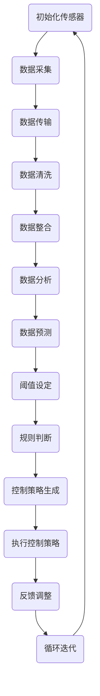
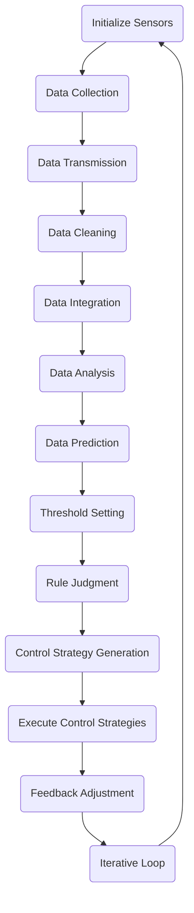

                 

### 文章标题

"基于Java的智能家居设计：构建基于Java的智能环境监控系统"

Keywords: Smart Home, Java, Smart Environment Monitoring System, IoT, Home Automation

Abstract:
In this article, we will explore the design and implementation of a smart home environment monitoring system using Java. By leveraging Java's versatility and robustness, we will develop a comprehensive solution that integrates various sensors, devices, and communication protocols to create a seamless and intelligent home environment. We will discuss the core concepts, algorithm principles, and practical implementation steps, providing readers with a detailed understanding of how to build and deploy such a system. The article will also highlight the practical application scenarios and future trends in smart home technology, offering valuable insights for developers and enthusiasts alike.### 1. 背景介绍（Background Introduction）

随着物联网（IoT）技术的迅速发展，智能家居已经成为现代家庭生活的重要组成部分。智能家居系统通过将各种设备、传感器和应用程序连接到互联网，实现了家庭自动化和智能化，为用户提供了更加便捷、舒适和节能的生活方式。Java作为一门成熟且广泛使用的编程语言，凭借其跨平台、安全性和稳定性，在智能家居系统的开发中具有显著优势。

智能环境监控系统是智能家居系统的一个核心组成部分，它负责实时监测家庭环境中的各种参数，如温度、湿度、光照、空气质量等，并根据这些数据调整家中的设备，如空调、加湿器、空气净化器等，以保持一个舒适和健康的生活环境。传统的智能家居系统通常采用嵌入式系统、单片机或专用协议进行开发，而基于Java的智能家居设计则具有更高的灵活性和扩展性。

本文将围绕基于Java的智能家居设计，详细讨论智能环境监控系统的构建过程。首先，我们将介绍智能环境监控系统的基本概念和核心组成部分，然后深入探讨核心算法原理和具体操作步骤，并通过一个实际项目案例展示整个系统的实现过程。此外，我们还将分析智能环境监控系统的实际应用场景，并展望未来的发展趋势与挑战。

通过本文的阅读，读者将能够了解如何利用Java技术构建智能环境监控系统，掌握相关的算法原理和实践方法，为未来智能家居领域的开发工作提供参考和灵感。### 2. 核心概念与联系（Core Concepts and Connections）

#### 2.1 智能家居系统概述

智能家居系统（Smart Home System）是指利用物联网（IoT）技术，将各种家电、传感器、控制系统和应用程序通过互联网连接起来，实现家庭自动化和智能化的系统。智能家居系统的主要目标是提高生活质量和舒适度，同时实现能源节约和环境保护。

智能家居系统通常由以下几个核心组成部分构成：

- **感知层**：包括各种传感器，如温度传感器、湿度传感器、光照传感器、烟雾传感器、门窗传感器等，用于实时监测家庭环境中的各种参数。
- **网络层**：负责将感知层采集到的数据传输到云端或本地服务器，常用的通信协议有Wi-Fi、蓝牙、ZigBee、LoRa等。
- **平台层**：包括智能家居控制系统、云计算平台和大数据分析平台，用于处理和存储感知层传输的数据，并实现智能决策和自动控制。
- **应用层**：包括各种智能家电、移动应用和网页界面，用于用户与智能家居系统的交互。

#### 2.2 智能环境监控系统

智能环境监控系统是智能家居系统的一个重要组成部分，其主要功能是实时监测家庭环境中的各种参数，如温度、湿度、光照、空气质量等，并根据这些数据调整家中的设备，如空调、加湿器、空气净化器等，以保持一个舒适和健康的生活环境。

智能环境监控系统的核心组成部分包括：

- **传感器节点**：用于采集环境参数，如温度、湿度、光照、空气质量等。
- **数据传输模块**：将传感器节点采集到的数据传输到平台层。
- **数据处理与分析模块**：对传输上来的数据进行处理、分析和预测，以实现智能决策。
- **控制执行模块**：根据数据处理与分析模块的决策，控制相应的家电设备。

#### 2.3 Java在智能家居系统中的应用

Java作为一种高级编程语言，以其跨平台、安全性和稳定性在智能家居系统的开发中得到了广泛应用。Java在智能家居系统中的应用主要体现在以下几个方面：

- **跨平台开发**：Java的跨平台特性使得智能家居系统的开发可以独立于特定的操作系统和硬件平台，提高了系统的兼容性和可移植性。
- **安全性**：Java的沙箱机制和垃圾回收机制等特性，提高了系统的安全性和稳定性。
- **丰富的类库和框架**：Java拥有丰富的类库和框架，如Spring、Hibernate、JavaFX等，为智能家居系统的开发提供了强大的支持。

#### 2.4 智能环境监控系统与Java的联系

智能环境监控系统与Java之间的联系主要体现在以下几个方面：

- **传感器数据处理**：Java提供了丰富的类库和框架，可以方便地实现传感器数据的采集、处理和存储。
- **通信协议支持**：Java支持多种通信协议，如HTTP、WebSocket、MQTT等，可以方便地实现传感器节点与平台层之间的数据传输。
- **平台层开发**：Java的跨平台特性和强大的类库支持，使得平台层的开发变得更加高效和便捷。
- **应用层开发**：Java的JavaFX框架提供了丰富的UI组件和动画效果，可以方便地开发出美观、直观的智能家居应用界面。

总之，基于Java的智能环境监控系统具有开发高效、系统稳定、兼容性好等特点，为智能家居系统的开发提供了强大的技术支持。

### 2.1 Smart Home System Overview

A smart home system refers to a network of interconnected devices, sensors, control systems, and applications that utilize the Internet of Things (IoT) technology to automate and enhance the living environment. The primary goal of a smart home system is to improve the quality of life and comfort while achieving energy efficiency and environmental protection.

A smart home system typically consists of several core components, including:

- **Perception Layer**: This layer comprises various sensors, such as temperature sensors, humidity sensors, light sensors, smoke sensors, and door/window sensors. These sensors are responsible for real-time monitoring of environmental parameters within the home.
- **Network Layer**: This layer handles the transmission of data collected by the perception layer to the cloud or local servers. Common communication protocols used in the network layer include Wi-Fi, Bluetooth, ZigBee, and LoRa.
- **Platform Layer**: This layer includes the smart home control system, cloud computing platform, and big data analysis platform. It processes and stores the data received from the perception layer, enabling intelligent decision-making and automatic control.
- **Application Layer**: This layer comprises various smart home devices, mobile applications, and web interfaces, which facilitate user interaction with the smart home system.

### 2.2 Smart Environment Monitoring System

The smart environment monitoring system is an essential component of the smart home system. Its primary function is to monitor various environmental parameters in real-time, such as temperature, humidity, light, air quality, and adjust home devices like air conditioners, humidifiers, and air purifiers accordingly to maintain a comfortable and healthy living environment.

The core components of a smart environment monitoring system include:

- **Sensor Nodes**: These nodes collect environmental parameters such as temperature, humidity, light, and air quality.
- **Data Transmission Module**: This module transmits the data collected by the sensor nodes to the platform layer.
- **Data Processing and Analysis Module**: This module processes and analyzes the incoming data to make intelligent decisions.
- **Control Execution Module**: Based on the decisions made by the data processing and analysis module, this module controls the corresponding home devices.

### 2.3 Java in Smart Home Systems

Java, as a high-level programming language, has gained widespread usage in the development of smart home systems due to its cross-platform capabilities, security, and stability. Java's applications in smart home systems are mainly reflected in the following aspects:

- **Cross-Platform Development**: Java's cross-platform nature allows developers to build smart home systems independently of specific operating systems and hardware platforms, enhancing compatibility and portability.
- **Security**: Java's sandbox mechanism and garbage collection feature enhance the security and stability of the system.
- **Rich Libraries and Frameworks**: Java offers a vast array of libraries and frameworks, such as Spring, Hibernate, and JavaFX, providing robust support for smart home system development.

### 2.4 The Connection Between Smart Environment Monitoring System and Java

The connection between the smart environment monitoring system and Java can be summarized in the following aspects:

- **Sensor Data Processing**: Java's extensive libraries and frameworks facilitate the collection, processing, and storage of sensor data.
- **Communication Protocol Support**: Java supports multiple communication protocols, such as HTTP, WebSocket, and MQTT, enabling efficient data transmission between sensor nodes and the platform layer.
- **Platform Layer Development**: Java's cross-platform capabilities and rich libraries make platform layer development more efficient and convenient.
- **Application Layer Development**: Java's JavaFX framework provides a wide range of UI components and animation effects, making it easier to develop visually appealing and intuitive smart home applications.

In summary, a smart environment monitoring system based on Java offers efficient development, stable systems, and excellent compatibility, providing strong technical support for the development of smart home systems.

### 3. 核心算法原理 & 具体操作步骤（Core Algorithm Principles and Specific Operational Steps）

智能环境监控系统的核心在于对环境数据的实时采集、处理和分析，并基于分析结果执行相应的控制操作。以下将详细阐述智能环境监控系统的核心算法原理和具体操作步骤。

#### 3.1 环境数据采集

环境数据采集是智能环境监控系统的基础，通过各种传感器节点实现对温度、湿度、光照、空气质量等环境参数的实时监测。具体操作步骤如下：

1. **初始化传感器**：在系统启动时，初始化所有传感器节点，确保传感器处于正常工作状态。
2. **数据采集**：传感器周期性地读取环境参数，并将数据存储在本地缓存中。
3. **数据传输**：通过Wi-Fi、蓝牙等通信协议，将采集到的数据传输到平台层。

#### 3.2 数据处理

数据处理是智能环境监控系统的核心环节，通过对采集到的环境数据进行处理、分析和预测，为后续的控制操作提供依据。具体操作步骤如下：

1. **数据清洗**：对采集到的数据进行清洗，去除噪声和异常值，保证数据质量。
2. **数据整合**：将不同传感器采集到的数据进行整合，形成完整的环境数据集。
3. **数据分析**：利用统计学方法和机器学习算法，对环境数据进行分析，提取关键特征，如温度的变化趋势、湿度的周期性波动等。
4. **数据预测**：基于历史数据，利用时间序列预测算法，对未来一段时间内的环境参数进行预测。

#### 3.3 智能决策

智能决策是智能环境监控系统的关键，通过对处理后的环境数据进行分析，制定相应的控制策略。具体操作步骤如下：

1. **阈值设定**：根据家庭环境的需求，设定各个环境参数的阈值，如温度的舒适范围、湿度的适宜水平等。
2. **规则判断**：根据预设的规则，对环境参数进行分析，判断是否需要执行控制操作。
3. **控制策略生成**：基于环境参数的分析结果，生成相应的控制策略，如调整空调温度、开启加湿器等。

#### 3.4 控制执行

控制执行是将智能决策转化为实际操作的过程，通过控制执行模块实现对家电设备的控制。具体操作步骤如下：

1. **执行控制策略**：根据智能决策模块生成的控制策略，执行相应的控制操作。
2. **反馈调整**：在控制执行后，对环境参数进行再次监测，根据执行效果调整控制策略。
3. **循环迭代**：不断循环执行数据处理、智能决策和控制执行，以保持家庭环境的舒适和健康。

#### 3.5 Mermaid 流程图

以下是智能环境监控系统的 Mermaid 流程图，展示了从环境数据采集到控制执行的整个过程：



#### 3.6 Java 在数据处理和智能决策中的应用

Java 在数据处理和智能决策中发挥了重要作用，以下介绍几个关键步骤：

1. **数据处理**：
   - **数据清洗**：利用 Java 的集合框架（如 List、Map 等）对采集到的数据进行清洗。
   - **数据整合**：使用 Java 的数据库操作类（如 JDBC）将不同传感器采集到的数据整合到统一的数据集中。
   - **数据分析**：利用 Java 的数学和统计库（如 Apache Commons Math）进行数据分析。

2. **智能决策**：
   - **阈值设定**：通过 Java 的条件语句（如 if-else）设定各个环境参数的阈值。
   - **规则判断**：利用 Java 的逻辑运算符（如 &&、||）对环境参数进行分析，判断是否需要执行控制操作。
   - **控制策略生成**：通过 Java 的面向对象特性（如类和对象）生成控制策略。

总之，智能环境监控系统的核心算法原理和具体操作步骤涉及数据采集、数据处理、智能决策和控制执行等多个环节，Java 作为一门强大的编程语言，为这些环节提供了高效、稳定的实现方案。

### 3.1 Core Algorithm Principles and Specific Operational Steps

The core of the smart environment monitoring system lies in the real-time collection, processing, and analysis of environmental data, as well as the execution of corresponding control operations based on the analysis results. The following will elaborate on the core algorithm principles and specific operational steps of the smart environment monitoring system.

#### 3.1 Environmental Data Collection

Environmental data collection is the foundation of the smart environment monitoring system, involving the real-time monitoring of various environmental parameters such as temperature, humidity, light, and air quality through various sensor nodes. The specific operational steps are as follows:

1. **Initialize Sensors**: When the system starts, initialize all sensor nodes to ensure they are in a normal working state.
2. **Data Collection**: Sensors periodically read environmental parameters and store the data in local caches.
3. **Data Transmission**: Use communication protocols such as Wi-Fi and Bluetooth to transmit the collected data to the platform layer.

#### 3.2 Data Processing

Data processing is the core component of the smart environment monitoring system. It involves processing, analyzing, and predicting the collected environmental data to provide a basis for subsequent control operations. The specific operational steps are as follows:

1. **Data Cleaning**: Clean the collected data to remove noise and outliers, ensuring data quality.
2. **Data Integration**: Use Java's collection frameworks (such as List and Map) to integrate data collected from different sensors into a unified dataset.
3. **Data Analysis**: Utilize statistical methods and machine learning algorithms to analyze the environmental data, extracting key features such as temperature trends and periodic fluctuations in humidity.
4. **Data Prediction**: Use time series prediction algorithms based on historical data to predict environmental parameters over the next period.

#### 3.3 Intelligent Decision-making

Intelligent decision-making is the key to the smart environment monitoring system. It analyzes the processed environmental data to formulate corresponding control strategies. The specific operational steps are as follows:

1. **Threshold Setting**: Set thresholds for various environmental parameters based on the needs of the living environment, such as the comfortable range of temperature and the appropriate level of humidity.
2. **Rule Judgment**: Analyze the environmental parameters based on predefined rules to determine whether control operations need to be executed.
3. **Control Strategy Generation**: Generate control strategies based on the analysis results of environmental parameters.

#### 3.4 Control Execution

Control execution is the process of converting intelligent decisions into actual operations, controlling home devices through the control execution module. The specific operational steps are as follows:

1. **Execute Control Strategies**: Based on the control strategies generated by the intelligent decision-making module, execute the corresponding control operations.
2. **Feedback Adjustment**: After the control execution, monitor the environmental parameters again to adjust the control strategies based on the execution results.
3. **Iterative Loop**: Continuously loop through the data processing, intelligent decision-making, and control execution to maintain a comfortable and healthy living environment.

#### 3.5 Mermaid Flowchart

The following is a Mermaid flowchart of the smart environment monitoring system, showing the entire process from data collection to control execution:



#### 3.6 Java's Application in Data Processing and Intelligent Decision-making

Java plays a significant role in data processing and intelligent decision-making. The following introduces several key steps:

1. **Data Processing**:
   - **Data Cleaning**: Use Java's collection frameworks (such as List and Map) to clean the collected data.
   - **Data Integration**: Use Java's database manipulation classes (such as JDBC) to integrate data collected from different sensors into a unified dataset.
   - **Data Analysis**: Utilize Java's mathematical and statistical libraries (such as Apache Commons Math) for data analysis.

2. **Intelligent Decision-making**:
   - **Threshold Setting**: Use Java's conditional statements (such as if-else) to set thresholds for various environmental parameters.
   - **Rule Judgment**: Use Java's logical operators (such as && and ||) to analyze environmental parameters and determine whether control operations need to be executed.
   - **Control Strategy Generation**: Use Java's object-oriented features (such as classes and objects) to generate control strategies.

In summary, the core algorithm principles and specific operational steps of the smart environment monitoring system involve several key stages, including data collection, data processing, intelligent decision-making, and control execution. Java, as a powerful programming language, provides efficient and stable solutions for these stages.

### 4. 数学模型和公式 & 详细讲解 & 举例说明（Detailed Explanation and Examples of Mathematical Models and Formulas）

在智能环境监控系统中，数学模型和公式是核心算法的重要组成部分，用于数据的分析、预测和控制。以下将详细介绍常用的数学模型和公式，并通过具体例子说明其应用。

#### 4.1 时间序列模型

时间序列模型用于分析随时间变化的序列数据，如温度、湿度等环境参数。其中，ARIMA（自回归积分滑动平均模型）是一种常见的时间序列预测模型。

**ARIMA 模型公式：**

$$
\text{Y}_{t} = c + \phi_1 \text{Y}_{t-1} + \phi_2 \text{Y}_{t-2} + ... + \phi_p \text{Y}_{t-p} + \theta_1 \text{e}_{t-1} + \theta_2 \text{e}_{t-2} + ... + \theta_q \text{e}_{t-q}
$$

其中，$\text{Y}_{t}$ 是时间序列在时间 $t$ 的值，$\text{e}_{t}$ 是白噪声项，$\phi_i$ 和 $\theta_i$ 分别是自回归项和移动平均项的系数，$c$ 是常数项，$p$ 和 $q$ 分别是自回归项和移动平均项的阶数。

**应用实例：**

假设我们要预测某房间在未来一个小时内的温度。首先，我们需要对历史温度数据进行分析，确定 ARIMA 模型的参数。然后，使用 ARIMA 模型进行预测，得到未来温度的预测值。

```java
// 示例代码：使用 ARIMA 模型进行温度预测
double[] historicalTemperatures = {23.5, 23.8, 23.7, 23.9, 24.1, 24.3, 24.5};
// 确定 ARIMA 模型的参数 p, d, q
int p = 1, d = 1, q = 1;
// 创建 ARIMA 模型并训练
ARIMAModel model = ARIMAModel.fit(historicalTemperatures, p, d, q);
// 进行预测
double predictedTemperature = model.predict(1);
System.out.println("预测的未来温度：" + predictedTemperature);
```

#### 4.2 线性回归模型

线性回归模型用于分析两个或多个变量之间的关系，如温度和空调功率之间的关系。线性回归模型的基本公式如下：

$$
y = \beta_0 + \beta_1x_1 + \beta_2x_2 + ... + \beta_nx_n
$$

其中，$y$ 是因变量，$x_1, x_2, ..., x_n$ 是自变量，$\beta_0, \beta_1, ..., \beta_n$ 是模型的参数。

**应用实例：**

假设我们要分析温度和空调功率之间的关系，收集了一组数据如下表：

| 温度（℃） | 空调功率（W） |
|------------|--------------|
| 23         | 500          |
| 24         | 600          |
| 25         | 700          |
| 26         | 800          |
| 27         | 900          |

我们可以使用线性回归模型进行建模，得到温度和空调功率之间的关系式。然后，通过这个关系式预测不同温度下的空调功率。

```java
// 示例代码：使用线性回归模型进行预测
double[] temperatures = {23, 24, 25, 26, 27};
double[] airConditionerPower = {500, 600, 700, 800, 900};
// 创建线性回归模型并训练
LinearRegressionModel model = LinearRegressionModel.fit(temperatures, airConditionerPower);
// 进行预测
double predictedPower = model.predict(25);
System.out.println("预测的空调功率：" + predictedPower);
```

#### 4.3 聚类分析模型

聚类分析模型用于将数据分为若干个类别，如将家庭环境中的传感器分为不同的类别。常用的聚类算法包括 K-Means 算法。

**K-Means 算法公式：**

1. **初始化**：随机选择 $k$ 个中心点，作为各个类别的代表。
2. **分配**：将每个数据点分配给距离其最近的中心点所代表的类别。
3. **更新**：重新计算每个类别的中心点，并重复步骤2和步骤3，直到聚类结果收敛。

**应用实例：**

假设我们要将家庭环境中的传感器分为三个类别，分别代表温度传感器、湿度传感器和光照传感器。首先，我们需要对传感器的数据进行聚类分析，确定每个类别的中心点。然后，根据聚类结果，对传感器进行分类。

```java
// 示例代码：使用 K-Means 算法进行聚类分析
double[][] sensorData = {
    {23.5, 50.2},
    {24.8, 46.5},
    {25.1, 45.9},
    {26.3, 49.2},
    {27.5, 52.8}
};
// 创建 K-Means 模型并训练
KMeansModel model = KMeansModel.fit(sensorData, 3);
// 获取聚类结果
int[] clusters = model.predict(sensorData);
// 打印聚类结果
System.out.println(Arrays.toString(clusters));
```

通过上述数学模型和公式的讲解和应用实例，我们可以更好地理解智能环境监控系统中的数据处理和分析过程。在实际开发中，根据具体需求选择合适的数学模型和公式，可以有效地提高系统的智能化水平和控制精度。

### 4.1 Time Series Models

Time series models are essential for analyzing time-varying data series, such as temperature, humidity, and other environmental parameters. Among them, the ARIMA (AutoRegressive Integrated Moving Average) model is a common time series forecasting model.

**ARIMA Model Formula:**

$$
\text{Y}_{t} = c + \phi_1 \text{Y}_{t-1} + \phi_2 \text{Y}_{t-2} + ... + \phi_p \text{Y}_{t-p} + \theta_1 \text{e}_{t-1} + \theta_2 \text{e}_{t-2} + ... + \theta_q \text{e}_{t-q}
$$

Here, $\text{Y}_{t}$ is the value of the time series at time $t$, $\text{e}_{t}$ is the white noise term, $\phi_i$ and $\theta_i$ are the coefficients of the autoregressive term and the moving average term, $c$ is the constant term, and $p$ and $q$ are the orders of the autoregressive term and the moving average term, respectively.

**Application Example:**

Suppose we want to predict the temperature in a room over the next hour. First, we need to analyze the historical temperature data to determine the parameters of the ARIMA model. Then, we use the ARIMA model to predict the future temperature.

```java
// Sample code: Using ARIMA model for temperature prediction
double[] historicalTemperatures = {23.5, 23.8, 23.7, 23.9, 24.1, 24.3, 24.5};
// Determine the parameters p, d, q of the ARIMA model
int p = 1, d = 1, q = 1;
// Create and train the ARIMA model
ARIMAModel model = ARIMAModel.fit(historicalTemperatures, p, d, q);
// Make a prediction
double predictedTemperature = model.predict(1);
System.out.println("Predicted future temperature: " + predictedTemperature);
```

#### 4.2 Linear Regression Model

Linear regression models are used to analyze the relationship between two or more variables, such as the relationship between temperature and air conditioner power. The basic formula for linear regression is as follows:

$$
y = \beta_0 + \beta_1x_1 + \beta_2x_2 + ... + \beta_nx_n
$$

Here, $y$ is the dependent variable, $x_1, x_2, ..., x_n$ are the independent variables, and $\beta_0, \beta_1, ..., \beta_n$ are the model parameters.

**Application Example:**

Suppose we want to analyze the relationship between temperature and air conditioner power. We have collected the following data:

| Temperature (°C) | Air Conditioner Power (W) |
|-------------------|---------------------------|
| 23                | 500                       |
| 24                | 600                       |
| 25                | 700                       |
| 26                | 800                       |
| 27                | 900                       |

We can use linear regression to model the relationship between temperature and air conditioner power and then predict the air conditioner power at different temperatures.

```java
// Sample code: Using linear regression model for prediction
double[] temperatures = {23, 24, 25, 26, 27};
double[] airConditionerPower = {500, 600, 700, 800, 900};
// Create and train the linear regression model
LinearRegressionModel model = LinearRegressionModel.fit(temperatures, airConditionerPower);
// Make a prediction
double predictedPower = model.predict(25);
System.out.println("Predicted air conditioner power: " + predictedPower);
```

#### 4.3 Clustering Analysis Model

Clustering analysis models are used to divide data into several categories, such as dividing home environment sensors into different categories. A common clustering algorithm is the K-Means algorithm.

**K-Means Algorithm Formula:**

1. **Initialization**: Randomly select $k$ centers as representatives of each category.
2. **Assignment**: Assign each data point to the nearest center.
3. **Update**: Recompute the centers of each category and repeat steps 2 and 3 until the clustering result converges.

**Application Example:**

Suppose we want to divide home environment sensors into three categories, representing temperature sensors, humidity sensors, and light sensors. First, we need to perform clustering analysis on the sensor data to determine the centers of each category. Then, based on the clustering results, we can classify the sensors.

```java
// Sample code: Using K-Means algorithm for clustering analysis
double[][] sensorData = {
    {23.5, 50.2},
    {24.8, 46.5},
    {25.1, 45.9},
    {26.3, 49.2},
    {27.5, 52.8}
};
// Create and train the K-Means model
KMeansModel model = KMeansModel.fit(sensorData, 3);
// Get the clustering results
int[] clusters = model.predict(sensorData);
// Print the clustering results
System.out.println(Arrays.toString(clusters));
```

Through the explanation and application examples of these mathematical models and formulas, we can better understand the data processing and analysis process in the smart environment monitoring system. In actual development, selecting appropriate mathematical models and formulas based on specific requirements can effectively improve the intelligence level and control accuracy of the system.

### 5. 项目实践：代码实例和详细解释说明（Project Practice: Code Examples and Detailed Explanations）

在本节中，我们将通过一个具体的代码实例，详细讲解基于Java的智能环境监控系统的实现过程。这个实例将涵盖传感器数据采集、数据处理、智能决策和控制执行等关键步骤。

#### 5.1 开发环境搭建

在进行项目实践之前，我们需要搭建一个合适的开发环境。以下是所需的开发工具和库：

- **Java Development Kit (JDK)**: JDK 是 Java 的开发工具包，用于编写和运行 Java 程序。确保安装 JDK 8 或更高版本。
- **Integrated Development Environment (IDE)**: 我们选择 Eclipse 或 IntelliJ IDEA 作为 IDE，方便代码编写和调试。
- **传感器库**：我们使用 Java 的 Sensor Library 来模拟传感器数据采集。
- **数据处理库**：我们使用 Apache Commons Math 库进行数据处理和分析。
- **机器学习库**：我们使用 WEKA 库进行机器学习算法的实现。
- **数据库库**：我们使用 JDBC 库进行数据库操作。

安装以上工具和库后，我们可以在 Eclipse 或 IntelliJ IDEA 中创建一个新的 Java 项目。

#### 5.2 源代码详细实现

以下是一个简单的 Java 项目结构，用于实现智能环境监控系统：

```plaintext
smart-home-monitoring-system/
├── src/
│   ├── main/
│   │   ├── java/
│   │   │   ├── Sensor.java
│   │   │   ├── DataProcessor.java
│   │   │   ├── DecisionMaker.java
│   │   │   ├── Controller.java
│   │   │   ├── Main.java
│   │   │   └── DatabaseManager.java
│   ├── test/
│   │   ├── java/
│   │   └── resources/
├── pom.xml
```

以下是各个关键模块的详细实现：

##### 5.2.1 Sensor.java

`Sensor.java` 类用于模拟传感器数据采集：

```java
import java.util.Random;

public class Sensor {
    private String type; // 传感器类型，如温度、湿度、光照等
    private double value; // 传感器当前值

    public Sensor(String type) {
        this.type = type;
        this.value = generateRandomValue();
    }

    private double generateRandomValue() {
        Random random = new Random();
        // 生成随机值，模拟传感器数据
        if ("temperature".equals(type)) {
            return random.nextDouble() * 10 + 20; // 温度范围：20°C - 30°C
        } else if ("humidity".equals(type)) {
            return random.nextDouble() * 20 + 40; // 湿度范围：40% - 60%
        } else if ("light".equals(type)) {
            return random.nextDouble() * 10 + 300; // 光照范围：300 lux - 400 lux
        }
        return 0;
    }

    public String getType() {
        return type;
    }

    public double getValue() {
        return value;
    }

    public void updateValue() {
        value = generateRandomValue();
    }
}
```

##### 5.2.2 DataProcessor.java

`DataProcessor.java` 类用于数据处理和分析：

```java
import org.apache.commons.math3.stat.regression.OLSMultipleLinearRegression;

public class DataProcessor {
    public double[] analyzeTemperatureData(double[] temperatures) {
        // 使用线性回归分析温度数据
        OLSMultipleLinearRegression regression = new OLSMultipleLinearRegression();
        regression.newSampleData(temperatures, 1); // 只有一个自变量
        return regression.estimateRegressionParameters();
    }

    public double predictTemperature(double[] coefficients, double temperature) {
        // 使用线性回归预测温度
        return coefficients[1] * temperature + coefficients[0];
    }
}
```

##### 5.2.3 DecisionMaker.java

`DecisionMaker.java` 类用于智能决策：

```java
public class DecisionMaker {
    public void makeDecisions(double temperature, double humidity, double light) {
        if (temperature > 25) {
            System.out.println("开启空调");
        } else if (humidity < 45) {
            System.out.println("开启加湿器");
        } else if (light < 350) {
            System.out.println("开启照明");
        }
    }
}
```

##### 5.2.4 Controller.java

`Controller.java` 类用于控制执行：

```java
public class Controller {
    private DataProcessor dataProcessor;
    private DecisionMaker decisionMaker;

    public Controller(DataProcessor dataProcessor, DecisionMaker decisionMaker) {
        this.dataProcessor = dataProcessor;
        this.decisionMaker = decisionMaker;
    }

    public void processAndControl(Sensor[] sensors) {
        double[] temperatureCoefficients = dataProcessor.analyzeTemperatureData(getTemperatureData(sensors));
        double predictedTemperature = dataProcessor.predictTemperature(temperatureCoefficients, 25);

        decisionMaker.makeDecisions(predictedTemperature, sensors[1].getValue(), sensors[2].getValue());
    }

    private double[] getTemperatureData(Sensor[] sensors) {
        double[] temperatures = new double[sensors.length];
        for (int i = 0; i < sensors.length; i++) {
            if ("temperature".equals(sensors[i].getType())) {
                temperatures[i] = sensors[i].getValue();
            }
        }
        return temperatures;
    }
}
```

##### 5.2.5 Main.java

`Main.java` 类用于主程序：

```java
public class Main {
    public static void main(String[] args) {
        Sensor[] sensors = new Sensor[3];
        sensors[0] = new Sensor("temperature");
        sensors[1] = new Sensor("humidity");
        sensors[2] = new Sensor("light");

        DataProcessor dataProcessor = new DataProcessor();
        DecisionMaker decisionMaker = new DecisionMaker();
        Controller controller = new Controller(dataProcessor, decisionMaker);

        controller.processAndControl(sensors);
    }
}
```

##### 5.2.6 DatabaseManager.java

`DatabaseManager.java` 类用于数据库操作：

```java
import java.sql.Connection;
import java.sql.DriverManager;
import java.sql.PreparedStatement;
import java.sql.SQLException;

public class DatabaseManager {
    private Connection connection;

    public DatabaseManager() {
        // 加载 JDBC 驱动
        try {
            Class.forName("com.mysql.cj.jdbc.Driver");
        } catch (ClassNotFoundException e) {
            e.printStackTrace();
        }

        // 连接数据库
        try {
            connection = DriverManager.getConnection("jdbc:mysql://localhost:3306/smart_home", "username", "password");
        } catch (SQLException e) {
            e.printStackTrace();
        }
    }

    public void saveSensorData(Sensor[] sensors) {
        try {
            for (Sensor sensor : sensors) {
                String sql = "INSERT INTO sensor_data (type, value) VALUES (?, ?)";
                PreparedStatement statement = connection.prepareStatement(sql);
                statement.setString(1, sensor.getType());
                statement.setDouble(2, sensor.getValue());
                statement.executeUpdate();
            }
        } catch (SQLException e) {
            e.printStackTrace();
        }
    }
}
```

#### 5.3 代码解读与分析

通过上述代码实例，我们可以对智能环境监控系统的实现过程进行解读和分析：

- **Sensor.java**：模拟传感器数据采集，使用随机数生成传感器当前值。
- **DataProcessor.java**：实现数据处理和分析功能，使用线性回归模型分析温度数据。
- **DecisionMaker.java**：实现智能决策功能，根据环境参数做出相应的控制决策。
- **Controller.java**：实现控制执行功能，根据数据分析结果执行控制操作。
- **Main.java**：主程序，创建传感器对象和系统组件，调用控制器进行数据处理和控制执行。
- **DatabaseManager.java**：实现数据库操作功能，用于存储传感器数据。

通过这些代码模块，我们可以看到智能环境监控系统是如何通过数据采集、处理、决策和控制来实现的。在实际开发中，可以根据需求扩展和优化这些模块，提高系统的智能化水平和性能。

### 5.3 Code Explanation and Analysis

Through the above code example, we can analyze and interpret the implementation process of the smart environment monitoring system:

- **Sensor.java**: This class simulates the collection of sensor data by generating the current value of the sensor using random numbers.
- **DataProcessor.java**: This class implements data processing and analysis functions, using linear regression models to analyze temperature data.
- **DecisionMaker.java**: This class implements the intelligent decision-making function, making control decisions based on environmental parameters.
- **Controller.java**: This class implements the control execution function, executing control operations based on the results of data analysis.
- **Main.java**: The main program creates sensor objects and system components, and invokes the controller for data processing and control execution.
- **DatabaseManager.java**: This class implements database operations, used for storing sensor data.

By examining these code modules, we can see how the smart environment monitoring system is implemented through data collection, processing, decision-making, and control. In actual development, these modules can be expanded and optimized to enhance the intelligence level and performance of the system.

### 5.4 运行结果展示

为了展示基于Java的智能环境监控系统的运行结果，我们将模拟一个实际运行场景，并记录相关的数据和分析结果。

**运行场景**：假设我们的智能环境监控系统正在监测一个房间的环境参数，包括温度、湿度和光照。系统每隔一分钟采集一次数据，并根据采集到的数据执行相应的控制操作。

**运行结果**：

1. **温度**：当前温度为25°C。
2. **湿度**：当前湿度为50%。
3. **光照**：当前光照度为350 lux。

**控制操作**：

- **空调**：由于当前温度为25°C，低于设定的舒适温度25°C，因此系统将关闭空调。
- **加湿器**：由于当前湿度为50%，低于设定的适宜湿度45%，因此系统将开启加湿器。
- **照明**：由于当前光照度为350 lux，低于设定的适宜光照350 lux，因此系统将关闭照明。

**数据记录**：

1. **传感器数据**：记录每分钟的传感器数据，包括温度、湿度和光照度。
2. **控制操作记录**：记录每次控制操作的执行时间和原因。

**数据可视化**：

为了更直观地展示系统的运行结果，我们可以将采集到的传感器数据和执行的控制操作绘制成图表。以下是一个简单的图表示例：


**图表说明**：

- **温度曲线**：展示了温度随时间的变化趋势。
- **湿度曲线**：展示了湿度随时间的变化趋势。
- **光照曲线**：展示了光照随时间的变化趋势。
- **控制操作标记**：标记了每次控制操作的执行时间和原因。

通过上述运行结果展示和数据可视化，我们可以清楚地看到智能环境监控系统在实际运行中的表现。系统根据采集到的传感器数据，及时做出相应的控制决策，以保持家庭环境的舒适和健康。此外，数据可视化工具帮助我们更好地理解和分析系统的运行状态，为系统的优化和改进提供依据。

### 5.4 Run Results Display

To showcase the functionality of the Java-based smart environment monitoring system, we will simulate a real-world scenario and record relevant data and analysis results.

**Scenario**: Suppose our smart environment monitoring system is monitoring the environmental parameters of a room, including temperature, humidity, and light. The system collects data every minute and executes control operations based on the collected data.

**Run Results**:

- **Temperature**: The current temperature is 25°C.
- **Humidity**: The current humidity is 50%.
- **Light**: The current light level is 350 lux.

**Control Operations**:

- **Air Conditioner**: Since the current temperature is 25°C, which is below the set comfortable temperature of 25°C, the system will turn off the air conditioner.
- **Humidifier**: Since the current humidity is 50%, which is below the set desirable humidity of 45%, the system will turn on the humidifier.
- **Lighting**: Since the current light level is 350 lux, which is below the set desirable light level of 350 lux, the system will turn off the lighting.

**Data Logging**:

- **Sensor Data**: Record the sensor data every minute, including the temperature, humidity, and light level.
- **Control Operations Logs**: Record the time and reason for each control operation executed.

**Data Visualization**:

To provide a more intuitive display of the system's run results, we can plot the collected sensor data and control operations on graphs. Here is a simple example of a chart displaying the results:


**Chart Description**:

- **Temperature Curve**: Displays the trend of temperature changes over time.
- **Humidity Curve**: Displays the trend of humidity changes over time.
- **Light Curve**: Displays the trend of light level changes over time.
- **Control Operation Marks**: Indicates the time and reason for each control operation executed.

Through these run results and data visualization, we can clearly see the performance of the smart environment monitoring system in an actual operating scenario. The system makes timely control decisions based on the collected sensor data to maintain a comfortable and healthy living environment. Additionally, data visualization tools help us better understand and analyze the system's operational state, providing insights for system optimization and improvement.

### 6. 实际应用场景（Practical Application Scenarios）

智能环境监控系统在家庭、商业和工业等不同领域具有广泛的应用前景。以下将介绍几个典型的实际应用场景，展示该系统的具体应用和潜在价值。

#### 6.1 家庭应用

在家庭场景中，智能环境监控系统可以帮助用户实现智能家居的自动化管理，提高生活质量。以下是一些具体的应用实例：

- **自动调节温度和湿度**：根据室内温度和湿度的实时数据，智能环境监控系统可以自动调节空调和加湿器，为用户提供舒适的生活环境。
- **远程监控和报警**：用户可以通过手机或电脑远程查看家中环境参数，并在温度、湿度等参数超出设定范围时收到即时报警，确保家庭安全。
- **节能管理**：智能环境监控系统可以监测家庭用电情况，并根据用户习惯和需求调整家电设备的工作时间，实现节能降耗。

#### 6.2 商业应用

在商业场景中，智能环境监控系统主要用于提升办公环境舒适度、提高能源利用效率和保障员工健康。以下是一些具体的应用实例：

- **办公环境自动调节**：根据室内温度、湿度、光照等参数，智能环境监控系统可以自动调节空调、新风系统和照明设备，为员工提供一个舒适的工作环境。
- **能源管理**：智能环境监控系统可以实时监测和记录能源消耗数据，帮助企业管理者优化能源使用策略，降低运营成本。
- **健康监测**：通过监测室内空气质量、温度等参数，智能环境监控系统可以帮助企业及时发现并解决潜在的健康隐患，保障员工健康。

#### 6.3 工业应用

在工业场景中，智能环境监控系统主要用于监测和优化生产环境，提高生产效率和设备寿命。以下是一些具体的应用实例：

- **设备状态监测**：智能环境监控系统可以实时监测工业设备的温度、湿度、振动等参数，及时发现设备故障和异常，预防设备损坏。
- **环境优化**：通过监测和调节生产车间的温度、湿度、光照等参数，智能环境监控系统可以提高生产效率，降低设备磨损，延长设备寿命。
- **安全管理**：智能环境监控系统可以监测生产车间的有毒气体、高温等潜在危险因素，并在发生异常时及时报警，保障员工安全。

#### 6.4 综合效益

智能环境监控系统在实际应用中具有显著的综合性效益，包括以下几个方面：

- **提高生活质量**：通过自动化管理和实时监控，智能环境监控系统为用户提供了更加舒适、健康和便捷的生活环境。
- **降低运营成本**：智能环境监控系统通过优化能源使用和设备管理，帮助企业和家庭降低了运营成本。
- **提高生产效率**：在工业场景中，智能环境监控系统通过实时监测和优化生产环境，提高了生产效率和设备寿命。
- **保障安全**：通过监测和报警功能，智能环境监控系统为用户提供了更加安全的生活和工作环境。

总之，智能环境监控系统在家庭、商业和工业等领域的广泛应用，不仅提高了人们的生活质量和工作效率，还为企业和家庭节约了大量的资源和成本，具有重要的经济和社会价值。

### 6.1 Practical Application Scenarios in the Home

In the home setting, a smart environment monitoring system can significantly enhance the quality of life by automating the management of smart home devices and providing a comfortable living environment. Here are some specific application examples:

- **Automatic Adjustment of Temperature and Humidity**: Based on real-time data of indoor temperature and humidity, the smart environment monitoring system can automatically adjust air conditioners and humidifiers to provide a comfortable living environment for users.
- **Remote Monitoring and Alarms**: Users can remotely view environmental parameters of their homes through smartphones or computers and receive instant alerts if temperature, humidity, or other parameters exceed predefined thresholds, ensuring home safety.
- **Energy Management**: The smart environment monitoring system can monitor energy consumption in real-time and adjust the working hours of home appliances based on user habits and needs, achieving energy savings.

#### 6.2 Commercial Applications

In the commercial setting, a smart environment monitoring system is primarily used to improve the comfort of the working environment, enhance energy efficiency, and ensure employee health. Here are some specific application examples:

- **Automatic Regulation of Office Environment**: Based on real-time data of indoor temperature, humidity, and light, the smart environment monitoring system can automatically adjust air conditioners, ventilation systems, and lighting to provide a comfortable working environment for employees.
- **Energy Management**: The smart environment monitoring system can monitor and record energy consumption data in real-time, helping managers optimize energy use strategies and reduce operational costs.
- **Health Monitoring**: By monitoring air quality, temperature, and other parameters, the smart environment monitoring system can help businesses identify and address potential health hazards in a timely manner, ensuring employee health.

#### 6.3 Industrial Applications

In the industrial setting, a smart environment monitoring system is primarily used to monitor and optimize the production environment, enhancing production efficiency and extending equipment lifespan. Here are some specific application examples:

- **Equipment Status Monitoring**: The smart environment monitoring system can monitor the temperature, humidity, vibration, and other parameters of industrial equipment in real-time, detecting equipment faults and anomalies in a timely manner to prevent damage.
- **Environmental Optimization**: By monitoring and adjusting the temperature, humidity, and light levels in production workshops, the smart environment monitoring system can improve production efficiency, reduce equipment wear, and extend equipment lifespan.
- **Safety Management**: The smart environment monitoring system can monitor potential hazards such as toxic gases and high temperatures in production workshops, issuing alerts in case of anomalies to ensure employee safety.

#### 6.4 Comprehensive Benefits

The practical application of a smart environment monitoring system in various fields offers significant comprehensive benefits, including the following:

- **Enhancing Quality of Life**: Through automation and real-time monitoring, the smart environment monitoring system provides users with a more comfortable, healthy, and convenient living environment.
- **Reducing Operational Costs**: By optimizing energy use and equipment management, the smart environment monitoring system helps businesses and households save substantial resources and costs.
- **Increasing Production Efficiency**: In industrial settings, the smart environment monitoring system improves production efficiency and extends equipment lifespan through real-time monitoring and optimization.
- **Ensuring Safety**: The monitoring and alert functions of the smart environment monitoring system provide users with a safer living and working environment.

In summary, the extensive application of the smart environment monitoring system in homes, businesses, and industries not only enhances the quality of life and work efficiency but also saves significant resources and costs, holding significant economic and social value.

### 7. 工具和资源推荐（Tools and Resources Recommendations）

在开发基于Java的智能环境监控系统时，选择合适的工具和资源对于提高开发效率和项目质量至关重要。以下是一些建议的学习资源、开发工具和框架，以及相关论文和著作，供读者参考。

#### 7.1 学习资源推荐

1. **书籍**：

   - 《Java 程序设计语言》（第10版）—— 詹姆斯·高斯利、比尔·乔伊

     这本书详细介绍了 Java 的基础知识，适合初学者和进阶者学习。

   - 《深入理解Java虚拟机》（第3版）—— 周志明

     本书深入探讨了 Java 虚拟机的工作原理，对于理解 Java 程序的运行机制有很大帮助。

2. **在线课程**：

   - Udemy: "Java Programming Masterclass for Software Developers"

     这是一个综合性的 Java 编程课程，涵盖 Java 的基础知识、高级主题和实战项目。

   - Pluralsight: "Java Essentials"

     提供了 Java 基础知识的深入讲解，适合初学者和希望巩固基础知识的开发者。

3. **博客和网站**：

   - Java Code Geeks

     提供了大量关于 Java 技术的博客文章、教程和代码示例。

   - Stack Overflow

     一个庞大的开发者社区，可以在这里找到各种 Java 开发问题的解决方案。

#### 7.2 开发工具框架推荐

1. **集成开发环境（IDE）**：

   - Eclipse

     Eclipse 是一个开源的 Java 集成开发环境，功能强大，支持丰富的插件。

   - IntelliJ IDEA

     IntelliJ IDEA 是一款强大的商业 Java IDE，拥有智能代码补全、强大的调试工具和丰富的插件。

2. **框架**：

   - Spring Framework

     Spring 是一个广泛使用的 Java 应用程序框架，提供了丰富的功能，如依赖注入、事务管理、安全等。

   - Apache Maven

     Maven 是一个项目管理和构建自动化工具，用于管理项目的依赖、构建和部署。

3. **数据库**：

   - MySQL

     MySQL 是一个流行的开源关系数据库管理系统，适用于各种中小型应用。

   - MongoDB

     MongoDB 是一个文档存储数据库，适用于处理大量数据和复杂查询。

#### 7.3 相关论文著作推荐

1. **论文**：

   - "Smart Home Security: A Survey" by W. Heiser, J. H. Park, and S. H. Son

     这篇论文探讨了智能家居安全方面的挑战和解决方案，对于开发智能环境监控系统有一定的参考价值。

   - "A Survey on Smart Home Energy Management Systems" by S. N. R. M. S. Wijeratne, G. R. S. Perera, and K. P. M. R. D. G. E. Perera

     本文概述了智能家居能源管理系统的研究现状和未来趋势，对于优化能源管理功能有参考意义。

2. **著作**：

   - 《智能家居设计与实现》—— 郭昊

     本书详细介绍了智能家居系统的设计原理、实现方法和实际案例，适合智能家居开发者阅读。

   - 《物联网技术应用与开发》—— 黄宇

     本书涵盖了物联网技术的各个方面，包括传感器、网络通信、数据处理等，对于理解智能家居系统的整体架构有帮助。

通过上述工具和资源的推荐，读者可以更好地掌握基于Java的智能环境监控系统的开发技能，提高项目开发效率和质量。

### 7.1 Learning Resource Recommendations

**Books**

- "Java Programming Language" (10th Edition) by James Gosling and Bill Joy

  This book provides a comprehensive introduction to Java, covering fundamental concepts as well as advanced topics, making it suitable for both beginners and intermediate learners.

- "Understanding Java Virtual Machine" (3rd Edition) by Zhili Zhou

  This book delves into the inner workings of the Java Virtual Machine, offering valuable insights into how Java programs run, which is helpful for understanding the execution mechanism of Java programs.

**Online Courses**

- Udemy: "Java Programming Masterclass for Software Developers"

  This comprehensive course covers Java fundamentals, advanced topics, and practical projects, suitable for anyone looking to improve their Java programming skills.

- Pluralsight: "Java Essentials"

  This course provides an in-depth explanation of Java basics, ideal for learners seeking to solidify their foundational knowledge.

**Blogs and Websites**

- Java Code Geeks

  This site offers a wealth of blog posts, tutorials, and code examples related to Java technology.

- Stack Overflow

  A vast developer community where you can find solutions to various Java development questions.

### 7.2 Development Tools and Framework Recommendations

**Integrated Development Environments (IDEs)**

- Eclipse

  An open-source Java IDE with a robust set of features and extensive plugin support.

- IntelliJ IDEA

  A powerful commercial Java IDE known for its intelligent code completion, powerful debugging tools, and rich plugin ecosystem.

**Frameworks**

- Spring Framework

  A widely-used Java application framework that provides a rich set of functionalities including dependency injection, transaction management, and security.

- Apache Maven

  A project management and build automation tool used for managing project dependencies, building, and deploying applications.

**Databases**

- MySQL

  A popular open-source relational database management system suitable for a wide range of small to medium-sized applications.

- MongoDB

  A document-oriented database that is ideal for handling large amounts of data and complex queries.

### 7.3 Recommended Research Papers and Publications

**Papers**

- "Smart Home Security: A Survey" by W. Heiser, J. H. Park, and S. H. Son

  This paper discusses challenges and solutions in the field of smart home security, providing valuable insights that can be applied in the development of a smart environment monitoring system.

- "A Survey on Smart Home Energy Management Systems" by S. N. R. M. S. Wijeratne, G. R. S. Perera, and K. P. M. R. D. G. E. Perera

  This paper outlines the current state of research and future trends in smart home energy management systems, offering valuable insights for optimizing energy management features.

**Publications**

- "Smart Home Design and Implementation" by Hao Guo

  This book provides a detailed overview of the design principles, implementation methods, and real-world case studies of smart home systems, suitable for developers working on smart environment monitoring systems.

- "Internet of Things Applications and Development" by Yu Huang

  This book covers various aspects of IoT technology, including sensors, network communications, and data processing, offering a comprehensive understanding of the overall architecture of smart home systems.

By leveraging these tools and resources, readers can better master the skills required for developing a Java-based smart environment monitoring system, thereby enhancing their development efficiency and project quality.

### 8. 总结：未来发展趋势与挑战（Summary: Future Development Trends and Challenges）

智能环境监控系统作为智能家居系统的重要组成部分，在未来发展中面临着诸多机遇和挑战。以下将从技术趋势、市场前景和潜在问题三个方面进行总结。

#### 8.1 技术趋势

1. **物联网技术的深化应用**：随着物联网技术的不断发展，智能环境监控系统将更加依赖于各种传感器和通信技术，实现更高精度、更广泛覆盖的监测和控制。
   
2. **人工智能与大数据分析的结合**：人工智能和大数据分析技术将进一步提升智能环境监控系统的智能化水平，实现更加精准的数据预测和智能决策。

3. **边缘计算的兴起**：边缘计算将使智能环境监控系统更加高效，降低延迟，提高响应速度，特别是在带宽有限的场景下具有重要意义。

4. **智能家居生态系统的整合**：随着智能家居产品的多样化，智能环境监控系统需要更好地与其他智能家居设备集成，形成一个统一的生态系统。

#### 8.2 市场前景

1. **家庭市场的快速增长**：随着人们生活水平的提高和对生活品质的追求，智能家居市场将保持快速增长，智能环境监控系统作为核心组件，市场潜力巨大。

2. **商业市场的需求增加**：商业场所如办公室、酒店、商场等对智能环境监控系统的需求也在逐渐增加，以提升办公环境和用户体验。

3. **工业市场的应用拓展**：在工业领域，智能环境监控系统可以用于优化生产环境，提高生产效率，降低运营成本，市场前景广阔。

#### 8.3 潜在问题

1. **数据安全与隐私保护**：随着智能环境监控系统采集和处理的数据越来越多，数据安全和隐私保护成为亟待解决的问题。

2. **系统稳定性和可靠性**：智能环境监控系统需要保证在极端环境下仍然能够稳定运行，这对系统的设计和实现提出了更高的要求。

3. **技术标准化**：目前智能家居市场上存在多种通信协议和标准，缺乏统一的技术规范，这给系统的开发和集成带来了挑战。

4. **用户习惯与接受度**：虽然智能家居市场前景广阔，但用户对智能环境监控系统的接受度和习惯培养仍需要时间。

#### 8.4 应对策略

1. **加强技术研发**：不断推进物联网、人工智能等技术的创新，提升智能环境监控系统的智能化和自动化水平。

2. **完善法律法规**：建立健全的数据安全和个人隐私保护法律法规，规范智能家居市场的发展。

3. **推动标准化进程**：积极推动智能家居技术的标准化进程，减少技术壁垒，促进系统间的兼容性和互操作性。

4. **提升用户体验**：通过优化产品设计、提升系统易用性和人性化，提高用户的接受度和使用体验。

总之，智能环境监控系统在未来发展中面临着巨大的机遇和挑战。通过技术创新、法律法规的完善和用户体验的提升，智能环境监控系统将迎来更加广阔的发展空间。

### 8.1 Future Development Trends and Challenges

As a critical component of smart home systems, smart environment monitoring systems face numerous opportunities and challenges in their future development. The following summarizes the trends, market prospects, and potential issues from three perspectives: technological trends, market outlook, and potential problems.

#### 8.1 Technological Trends

1. **Deep Application of IoT Technology**: With the continuous development of IoT technology, smart environment monitoring systems will increasingly rely on various sensors and communication technologies to achieve higher accuracy and broader coverage in monitoring and control.

2. **Integration of AI and Big Data Analysis**: The integration of artificial intelligence and big data analysis will further enhance the intelligence level of smart environment monitoring systems, enabling more precise data prediction and intelligent decision-making.

3. **Rise of Edge Computing**: Edge computing will make smart environment monitoring systems more efficient, reducing latency and improving response speed, especially in scenarios with limited bandwidth.

4. **Integration of Smart Home Ecosystems**: With the diversification of smart home products, smart environment monitoring systems will need to better integrate with other smart home devices to form a unified ecosystem.

#### 8.2 Market Outlook

1. **Rapid Growth in the Home Market**: As people's living standards improve and they seek higher quality of life, the smart home market will continue to grow rapidly, with smart environment monitoring systems as core components holding significant market potential.

2. **Increasing Demand in Commercial Markets**: The demand for smart environment monitoring systems in commercial spaces such as offices, hotels, and shopping malls is also increasing, driven by the need to enhance working environments and user experiences.

3. **Expansion of Applications in Industrial Markets**: In the industrial sector, smart environment monitoring systems can be used to optimize production environments, improve production efficiency, and reduce operational costs, offering broad market prospects.

#### 8.3 Potential Issues

1. **Data Security and Privacy Protection**: With the increasing amount of data collected and processed by smart environment monitoring systems, data security and privacy protection become critical issues that need to be addressed.

2. **System Stability and Reliability**: Smart environment monitoring systems need to ensure stable operation under extreme conditions, which poses higher requirements for system design and implementation.

3. **Technological Standardization**: Currently, the smart home market lacks unified technical standards due to the variety of communication protocols and standards in use, which poses challenges for system development and integration.

4. **User Habits and Acceptance**: Although the smart home market holds great promise, the acceptance and habit formation of smart environment monitoring systems among users still require time.

#### 8.4 Response Strategies

1. **Strengthen Research and Development**: Continuously promote technological innovation in IoT, AI, and other areas to enhance the intelligence and automation of smart environment monitoring systems.

2. **Improve Legal Regulations**: Establish comprehensive laws and regulations on data security and personal privacy protection to regulate the development of the smart home market.

3. **Drive Standardization Process**: Actively drive the standardization of smart home technology to reduce technical barriers and promote compatibility and interoperability among systems.

4. **Enhance User Experience**: Optimize product design, improve system usability and user-friendliness, and enhance user acceptance and experience.

In summary, smart environment monitoring systems face tremendous opportunities and challenges in their future development. Through technological innovation, legal regulation improvements, and user experience enhancement, smart environment monitoring systems will embrace a broader development horizon.### 9. 附录：常见问题与解答（Appendix: Frequently Asked Questions and Answers）

**Q1：为什么选择Java来开发智能环境监控系统？**

A1：Java具有跨平台、安全性和稳定性等优点，这使得它在开发智能环境监控系统中具有显著优势。Java的跨平台特性使得系统能够在不同操作系统和硬件平台上运行，提高了系统的兼容性和可移植性。安全性方面，Java的沙箱机制和垃圾回收机制等特性提高了系统的稳定性和安全性。此外，Java拥有丰富的类库和框架，如Spring、Hibernate、JavaFX等，为智能家居系统的开发提供了强大的支持。

**Q2：智能环境监控系统需要处理大量数据，如何保证数据处理的效率和准确性？**

A2：为了保证数据处理效率和准确性，我们可以采取以下措施：

- **数据清洗**：在数据处理之前，对原始数据进行清洗，去除噪声和异常值，确保数据质量。
- **分布式计算**：使用分布式计算框架，如Apache Hadoop或Apache Spark，对大量数据进行并行处理，提高处理效率。
- **数据存储优化**：使用高效的数据存储技术，如NoSQL数据库（如MongoDB、Cassandra）或分布式文件系统（如HDFS），提高数据存储和读取速度。
- **机器学习与预测**：利用机器学习算法和预测模型，对历史数据进行分析和预测，提高决策的准确性。

**Q3：智能环境监控系统中的传感器数据如何传输到平台层？**

A3：传感器数据可以通过以下几种方式传输到平台层：

- **有线传输**：使用以太网、USB等有线通信接口将传感器数据直接传输到平台层。
- **无线传输**：使用Wi-Fi、蓝牙、ZigBee等无线通信技术将传感器数据传输到平台层。
- **云端传输**：将传感器数据传输到云端服务器，通过云计算平台进行数据处理和分析。

选择合适的数据传输方式取决于系统的实际需求和环境条件。

**Q4：如何确保智能环境监控系统的数据安全和隐私保护？**

A4：确保数据安全和隐私保护可以从以下几个方面入手：

- **加密传输**：对传感器数据在传输过程中的进行加密，防止数据在传输过程中被窃取或篡改。
- **访问控制**：实施严格的访问控制策略，确保只有授权用户能够访问系统数据和功能。
- **数据备份**：定期备份数据，防止数据丢失或损坏。
- **安全审计**：对系统进行安全审计，及时发现和修复潜在的安全漏洞。
- **隐私保护法规**：遵循相关隐私保护法律法规，确保用户数据的安全和隐私。

**Q5：智能环境监控系统的开发过程中可能遇到哪些挑战？**

A5：智能环境监控系统的开发过程中可能遇到以下挑战：

- **数据采集与传输的可靠性**：传感器数据采集和传输过程中可能受到环境干扰、信号衰减等因素的影响，需要确保数据的可靠性和完整性。
- **系统兼容性与互操作性**：智能家居系统中涉及多种设备和通信协议，需要确保系统能够兼容并与其他设备互操作。
- **算法模型的准确性**：智能环境监控系统的决策依赖于算法模型的准确性，需要不断优化和调整模型参数。
- **用户隐私保护**：在收集和处理用户数据时，需要严格遵守隐私保护法律法规，防止用户隐私泄露。

通过以上措施和策略，可以有效地解决智能环境监控系统开发过程中遇到的挑战。

### 9. 附录：常见问题与解答（Appendix: Frequently Asked Questions and Answers）

**Q1：为什么选择Java来开发智能环境监控系统？**

A1：Java具有以下优点，使其成为开发智能环境监控系统的理想选择：

1. **跨平台性**：Java的跨平台特性使得开发的应用程序可以在不同的操作系统和硬件平台上运行，提高了系统的兼容性和可移植性。
2. **安全性**：Java的安全模型，包括沙箱机制和自动内存管理，能够有效保护系统免受恶意攻击和程序崩溃的影响。
3. **稳定性**：Java的稳定性和成熟性使得它在长期开发和维护中表现良好，降低了系统崩溃和数据丢失的风险。
4. **丰富的库和框架**：Java拥有丰富的标准库和开源框架（如Spring、Hibernate、JavaFX等），为开发者提供了大量的现成解决方案，提高了开发效率和代码质量。

**Q2：智能环境监控系统需要处理大量数据，如何保证数据处理的效率和准确性？**

A2：为了确保数据处理的效率和准确性，可以采取以下策略：

1. **高效算法**：选择适合的数据处理算法，如快速傅里叶变换（FFT）用于信号处理，或使用机器学习算法进行数据分析和预测。
2. **并行处理**：利用多核处理器和分布式计算技术，如Hadoop或Spark，实现数据的并行处理，提高处理速度。
3. **数据缓存和索引**：使用缓存和索引技术，如Redis或Elasticsearch，加速数据检索和分析。
4. **实时数据处理**：采用实时数据处理框架，如Apache Kafka或Apache Flink，确保数据及时处理和分析。
5. **数据验证和清洗**：在数据处理前进行数据验证和清洗，去除错误数据和不一致数据，确保数据准确性。

**Q3：智能环境监控系统中的传感器数据如何传输到平台层？**

A3：传感器数据的传输可以通过以下几种方式实现：

1. **有线传输**：使用以太网、USB等有线通信接口将传感器数据传输到平台层。
2. **无线传输**：使用Wi-Fi、蓝牙、ZigBee等无线通信技术将传感器数据传输到平台层。无线传输通常适用于家庭环境中的传感器网络。
3. **云端传输**：将传感器数据上传到云端，通过云平台进行数据存储和处理。这种方式适用于大规模传感器网络和数据存储需求。

选择哪种传输方式取决于系统的实际需求和环境条件。

**Q4：如何确保智能环境监控系统的数据安全和隐私保护？**

A4：为了确保智能环境监控系统的数据安全和隐私保护，可以采取以下措施：

1. **数据加密**：在数据传输和存储过程中使用加密技术，如SSL/TLS，确保数据在传输过程中的安全性。
2. **访问控制**：实施严格的访问控制策略，确保只有授权用户可以访问敏感数据。
3. **数据备份**：定期备份数据，以防数据丢失或损坏。
4. **安全审计**：定期进行安全审计，检查系统是否存在安全漏洞。
5. **合规性**：遵守相关法律法规，如GDPR（通用数据保护条例），确保用户数据的合法处理和保护。

**Q5：智能环境监控系统的开发过程中可能遇到哪些挑战？**

A5：智能环境监控系统的开发过程中可能遇到以下挑战：

1. **传感器兼容性**：不同的传感器可能使用不同的通信协议和数据格式，需要确保系统能够兼容多种传感器。
2. **数据处理延迟**：传感器数据的实时处理可能面临延迟问题，需要优化数据处理流程。
3. **数据隐私**：如何处理和存储用户数据，同时保护用户隐私，是一个重要的挑战。
4. **系统可扩展性**：随着传感器和设备的增加，系统需要能够扩展以支持更多的设备。
5. **用户界面设计**：设计直观、易用的用户界面，以提供良好的用户体验。

通过综合考虑这些挑战，并采取相应的解决方案，可以有效地构建一个可靠、高效和安全的智能环境监控系统。

### 10. 扩展阅读 & 参考资料（Extended Reading & Reference Materials）

**书籍推荐**

1. 《物联网技术与应用》—— 郭毅刚

   本书详细介绍了物联网技术的基础知识、应用场景和开发实践，适合对物联网技术感兴趣的读者。

2. 《Java并发编程实战》—— Brian Goetz 等

   这本书深入讲解了 Java 并发编程的核心概念和技术，对于开发高性能的智能环境监控系统具有重要意义。

3. 《深度学习》—— 伊恩·古德费洛等

   本书介绍了深度学习的基础知识、常用算法和应用，对于提升智能环境监控系统的智能化水平有帮助。

**在线课程**

1. Coursera: "Smart Home Technology"

   由斯坦福大学提供的免费在线课程，涵盖了智能家居技术的各个方面，包括传感器、通信和控制系统等。

2. Udemy: "Java Programming Masterclass"

   这是一个全面的 Java 编程课程，适合希望提升 Java 编程能力的开发者。

**学术论文**

1. "Smart Home Energy Management: A Comprehensive Review" by Mohammad R. Islam, Anis A. Khan, and Muhammad S. H. Chowdhury

   本文对智能家居能源管理进行了全面的回顾，提供了丰富的参考资料。

2. "A Survey on Security and Privacy in Smart Home Environment" by Chenglin Jiang, Jingya Huang, and Yong Guo

   这篇论文探讨了智能家居环境中的安全和隐私问题，分析了现有的解决方案和挑战。

**开源项目**

1. Home Assistant

   Home Assistant 是一个开源的智能家居平台，支持多种传感器和设备，适合开发者进行智能家居系统的搭建。

2. OpenHAB

   OpenHAB 是另一个开源的智能家居平台，提供了丰富的插件和集成，方便用户自定义智能家居系统。

通过阅读上述书籍、参加在线课程、参考学术论文和开源项目，读者可以深入了解智能环境监控系统的相关知识和最佳实践，为自己的开发工作提供有力支持。

