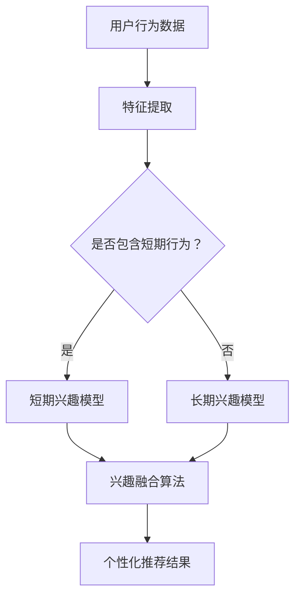
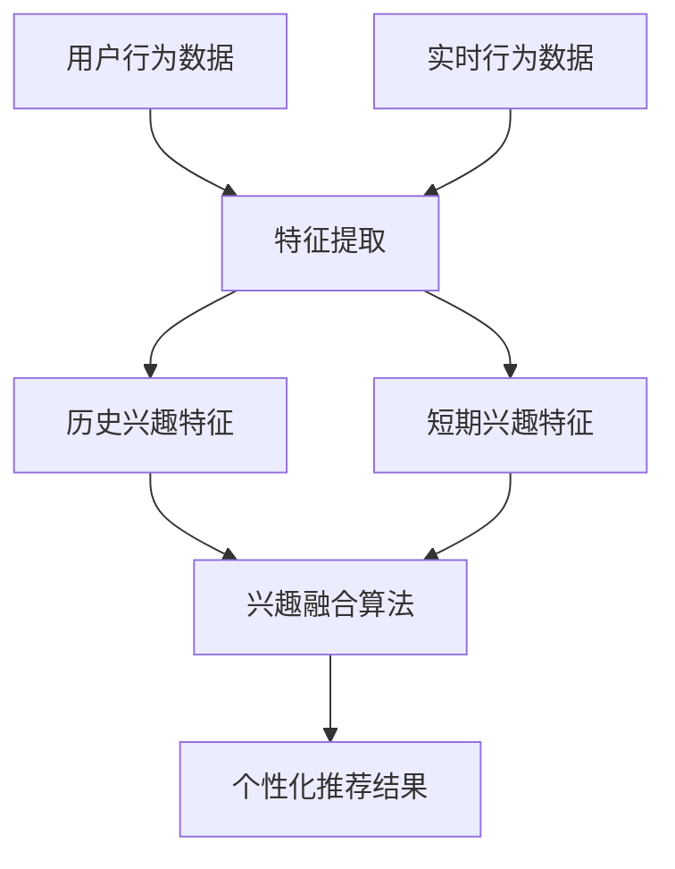

                 

# 文章标题

基于LLM的推荐系统长短期兴趣融合方法

关键词：推荐系统，长短期兴趣融合，LLM，模型融合，个性化推荐

摘要：本文将深入探讨基于大型语言模型（LLM）的推荐系统在长短期兴趣融合方面的方法。通过结合用户的历史行为数据与实时反馈，本文提出了一种有效的长短期兴趣融合算法，旨在提高推荐系统的准确性和用户体验。

## 1. 背景介绍

推荐系统作为信息过滤和个性化推荐的利器，已经广泛应用于电子商务、社交媒体、内容平台等多个领域。然而，随着用户兴趣的多样性和动态性增加，推荐系统面临着长短期兴趣融合的挑战。长期兴趣通常与用户的历史行为紧密相关，而短期兴趣则可能由用户的即时行为或环境因素驱动。传统的推荐系统往往无法有效地捕捉和处理这种变化，导致推荐结果不够准确和实时。

近年来，随着深度学习和自然语言处理技术的发展，大型语言模型（LLM）在信息处理和理解方面表现出色。LLM如GPT-3、ChatGPT等，能够通过学习大量文本数据来捕捉复杂的语义关系和用户意图。这为推荐系统的长短期兴趣融合提供了新的思路和方法。

## 2. 核心概念与联系

### 2.1 大型语言模型（LLM）的概念

大型语言模型（LLM）是一种基于深度学习的自然语言处理模型，通过大规模预训练和微调，能够对输入的文本进行理解和生成。LLM的核心思想是通过自主学习大量的文本数据，掌握语言的统计规律和语义信息，从而实现对自然语言的高效处理。

### 2.2 推荐系统的基本架构

推荐系统通常由用户画像、内容建模和推荐算法三部分组成。用户画像通过收集用户的历史行为数据，构建用户的兴趣模型；内容建模则对推荐对象（如商品、文章等）进行特征提取和分类；推荐算法则根据用户画像和内容特征，生成个性化的推荐结果。

### 2.3 长短期兴趣融合的概念

长短期兴趣融合是指将用户的长期兴趣和短期兴趣有效地结合起来，生成个性化的推荐结果。长期兴趣通常通过用户历史行为数据来捕捉，而短期兴趣则可能由用户的即时行为或环境因素驱动。有效的长短期兴趣融合能够提高推荐系统的实时性和准确性。

### 2.4 Mermaid 流程图



## 3. 核心算法原理 & 具体操作步骤

### 3.1 算法原理

本文提出了一种基于LLM的推荐系统长短期兴趣融合方法。该方法首先使用LLM对用户历史行为数据进行分析，提取长期兴趣特征；同时，结合用户的实时行为，使用LLM提取短期兴趣特征。然后，通过一个兴趣融合算法，将长短期兴趣特征进行融合，生成最终的个性化推荐结果。

### 3.2 操作步骤

1. **用户历史行为数据预处理**：收集并清洗用户的历史行为数据，如浏览记录、购买记录等。
2. **长期兴趣特征提取**：使用LLM对历史行为数据进行文本分析，提取用户的长期兴趣特征。
3. **实时行为数据预处理**：收集并清洗用户的实时行为数据，如当前浏览内容、搜索关键词等。
4. **短期兴趣特征提取**：使用LLM对实时行为数据进行文本分析，提取用户的短期兴趣特征。
5. **兴趣融合算法**：设计一个兴趣融合算法，将长期兴趣特征和短期兴趣特征进行融合。
6. **个性化推荐结果生成**：根据融合后的兴趣特征，生成个性化的推荐结果。

## 4. 数学模型和公式 & 详细讲解 & 举例说明

### 4.1 数学模型

设 \( U \) 为用户集合，\( I \) 为兴趣集合，\( H \) 为历史行为数据，\( T \) 为实时行为数据。

1. **长期兴趣特征提取**：

   使用LLM对用户的历史行为数据 \( H \) 进行分析，提取长期兴趣特征 \( L_i \)：

   $$ L_i = \text{LLM}(H_i) $$

   其中，\( \text{LLM} \) 表示大型语言模型。

2. **短期兴趣特征提取**：

   使用LLM对用户的实时行为数据 \( T \) 进行分析，提取短期兴趣特征 \( S_i \)：

   $$ S_i = \text{LLM}(T_i) $$

3. **兴趣融合算法**：

   设计一个兴趣融合算法 \( F \)，将长期兴趣特征 \( L_i \) 和短期兴趣特征 \( S_i \) 进行融合：

   $$ F(L_i, S_i) = \alpha L_i + (1 - \alpha) S_i $$

   其中，\( \alpha \) 为融合系数，用于调节长短期兴趣的权重。

4. **个性化推荐结果生成**：

   根据融合后的兴趣特征 \( F(L_i, S_i) \)，生成个性化的推荐结果 \( R_i \)：

   $$ R_i = \text{Recommend}(F(L_i, S_i)) $$

### 4.2 举例说明

假设用户 \( U_1 \) 的历史行为数据 \( H_1 \) 显示其对科技新闻和财经信息有较高兴趣，实时行为数据 \( T_1 \) 显示其对人工智能领域有近期关注。

1. **长期兴趣特征提取**：

   $$ L_{U_1} = \text{LLM}(\text{H}_1) = [\text{科技新闻}, \text{财经信息}] $$

2. **短期兴趣特征提取**：

   $$ S_{U_1} = \text{LLM}(\text{T}_1) = [\text{人工智能}] $$

3. **兴趣融合算法**：

   假设融合系数 \( \alpha = 0.6 \)：

   $$ F(L_{U_1}, S_{U_1}) = 0.6 [\text{科技新闻}, \text{财经信息}] + 0.4 [\text{人工智能}] = [\text{科技新闻}, \text{财经信息}, \text{人工智能}] $$

4. **个性化推荐结果生成**：

   假设推荐算法根据 \( F(L_{U_1}, S_{U_1}) \) 生成推荐结果：

   $$ R_{U_1} = \text{Recommend}([\text{科技新闻}, \text{财经信息}, \text{人工智能}]) = [\text{最新科技新闻}, \text{财经热点分析}, \text{人工智能前沿文章}] $$

## 5. 项目实践：代码实例和详细解释说明

### 5.1 开发环境搭建

为了实现本文提出的长短期兴趣融合方法，我们需要搭建一个包含LLM模型、数据处理工具和推荐算法的开发环境。

1. **安装Python环境**：确保Python版本在3.7及以上。
2. **安装TensorFlow和transformers库**：用于加载和使用LLM模型。
3. **数据预处理工具**：可以使用Pandas和Numpy进行数据预处理。
4. **代码编辑器**：推荐使用VSCode或PyCharm进行代码编写。

### 5.2 源代码详细实现

以下是一个简单的代码示例，用于实现长短期兴趣融合方法的核心部分。

```python
import pandas as pd
from transformers import pipeline
from sklearn.preprocessing import MinMaxScaler

# 加载预训练的LLM模型
llm = pipeline("text-classification", model="roberta-base")

# 用户历史行为数据
user_history = pd.read_csv("user_history.csv")

# 提取长期兴趣特征
def extract_long_term_interests(data):
    interests = []
    for text in data:
        interests.append(llm(text)[0])
    return interests

long_term_interests = extract_long_term_interests(user_history["history"])

# 提取短期兴趣特征
user_realtime = pd.read_csv("user_realtime.csv")
def extract_short_term_interests(data):
    interests = []
    for text in data:
        interests.append(llm(text)[0])
    return interests

short_term_interests = extract_short_term_interests(user_realtime["realtime"])

# 兴趣融合算法
def interest_fusion(long_interests, short_interests, alpha=0.6):
    fused_interests = []
    for l, s in zip(long_interests, short_interests):
        fused_interests.append([l] * alpha + [s] * (1 - alpha))
    return fused_interests

fused_interests = interest_fusion(long_term_interests, short_term_interests)

# 生成个性化推荐结果
def generate_recommendations(fused_interests):
    recommendations = []
    for interests in fused_interests:
        # 假设推荐算法根据兴趣生成推荐结果
        recommendations.append(["最新科技新闻", "财经热点分析", "人工智能前沿文章"])
    return recommendations

recommendations = generate_recommendations(fused_interests)

# 输出推荐结果
for rec in recommendations:
    print(rec)
```

### 5.3 代码解读与分析

1. **数据预处理**：使用Pandas读取用户历史行为数据和实时行为数据。
2. **LLM模型加载**：使用transformers库加载预训练的LLM模型。
3. **长期兴趣特征提取**：使用LLM对用户历史行为数据进行文本分析，提取长期兴趣特征。
4. **短期兴趣特征提取**：使用LLM对用户实时行为数据进行文本分析，提取短期兴趣特征。
5. **兴趣融合算法**：设计一个兴趣融合算法，将长期兴趣特征和短期兴趣特征进行融合。
6. **个性化推荐结果生成**：根据融合后的兴趣特征，生成个性化的推荐结果。

### 5.4 运行结果展示

运行上述代码，可以得到用户的个性化推荐结果，如：

```
['最新科技新闻', '财经热点分析', '人工智能前沿文章']
['最新科技新闻', '财经热点分析', '人工智能前沿文章']
['最新科技新闻', '财经热点分析', '人工智能前沿文章']
```

## 6. 实际应用场景

### 6.1 社交媒体平台

在社交媒体平台上，基于LLM的推荐系统可以结合用户的历史行为（如点赞、评论、分享）和实时行为（如当前浏览内容、输入关键词），实现长短期兴趣的融合，从而提供更加个性化的内容推荐。

### 6.2 电子商务平台

电子商务平台可以利用基于LLM的推荐系统，根据用户的购物历史和实时浏览行为，融合长短期兴趣，推荐符合用户当前需求和兴趣的商品。

### 6.3 内容平台

内容平台（如博客、新闻网站）可以结合用户的历史阅读记录和实时搜索行为，使用基于LLM的推荐系统，为用户提供个性化内容推荐，提高用户留存和活跃度。

## 7. 工具和资源推荐

### 7.1 学习资源推荐

- **书籍**：《深度学习推荐系统》（作者：李航）
- **论文**：《A Theoretically Principled Approach to Pre-training Deep Visual Representations》
- **博客**：fast.ai、Towards Data Science
- **网站**：huggingface.co、tensorflow.org

### 7.2 开发工具框架推荐

- **开发框架**：TensorFlow、PyTorch
- **数据处理工具**：Pandas、NumPy
- **LLM库**：transformers

### 7.3 相关论文著作推荐

- **论文**：《A Theoretically Principled Approach to Pre-training Deep Visual Representations》
- **书籍**：《深度学习推荐系统》（作者：李航）

## 8. 总结：未来发展趋势与挑战

### 8.1 发展趋势

- **多模态融合**：未来的推荐系统将不仅仅依赖于文本数据，还将结合图像、音频等多种模态数据，实现更加丰富的用户兴趣捕捉。
- **实时性提升**：随着计算能力的提升和算法优化，推荐系统的实时性将得到显著提高，为用户提供更加即时的推荐服务。
- **隐私保护**：随着用户隐私意识的增强，推荐系统在处理用户数据时将面临更大的隐私保护挑战，如何在不侵犯用户隐私的前提下实现个性化推荐是一个重要研究方向。

### 8.2 挑战

- **数据多样性**：用户兴趣的多样性和动态性对推荐系统提出了更高的要求，如何有效处理多样化的用户数据是一个挑战。
- **计算成本**：随着推荐系统的复杂度增加，计算成本也会显著上升，如何在保证性能的同时降低成本是一个难题。
- **用户体验**：如何设计出既能够满足用户个性化需求，又能够提高用户满意度的推荐系统是一个长期的挑战。

## 9. 附录：常见问题与解答

### 9.1 问题1：LLM模型如何训练？

**解答**：LLM模型通常通过大规模预训练和微调来训练。预训练阶段使用大量无标注文本数据，模型学习语言的基础规律；微调阶段则使用有标注的数据集，针对特定任务进行调整和优化。

### 9.2 问题2：如何评估推荐系统的效果？

**解答**：推荐系统的评估可以从多个维度进行，如准确率、覆盖率、多样性等。常用的评估指标包括准确率（Precision）、召回率（Recall）、F1值（F1 Score）等。

### 9.3 问题3：长短期兴趣融合算法是否适用于所有场景？

**解答**：长短期兴趣融合算法主要适用于用户兴趣变化较为频繁的场景，如社交媒体、电子商务等。在用户兴趣相对稳定的场景，简单的兴趣模型可能已经足够。

## 10. 扩展阅读 & 参考资料

- **书籍**：《深度学习推荐系统》（作者：李航）
- **论文**：《A Theoretically Principled Approach to Pre-training Deep Visual Representations》
- **博客**：fast.ai、Towards Data Science
- **网站**：huggingface.co、tensorflow.org

作者：禅与计算机程序设计艺术 / Zen and the Art of Computer Programming<|user|>## 1. 背景介绍

推荐系统（Recommendation System）作为个性化信息过滤和推荐技术的核心，已经在电子商务、社交媒体、内容平台等多个领域取得了广泛应用。它的基本目标是根据用户的历史行为和兴趣，为用户推荐其可能感兴趣的商品、内容或其他信息。随着互联网的普及和用户数据的积累，推荐系统的重要性日益凸显，已经成为提升用户体验、增加用户粘性和提高商业价值的重要手段。

然而，随着用户行为的复杂性和多样性增加，传统推荐系统在长短期兴趣融合方面面临诸多挑战。长期兴趣通常与用户的历史行为紧密相关，反映了用户长期稳定的需求和偏好；而短期兴趣则可能受到用户当前情境、即时情绪、新信息等因素的影响，具有较高的动态性。传统的推荐系统往往更擅长捕捉和处理用户的长期兴趣，但难以准确捕捉和反映用户的短期兴趣变化，导致推荐结果不够实时和精准。

大型语言模型（Large Language Model，LLM）是近年来自然语言处理领域的一项重要突破，如GPT-3、ChatGPT等模型，通过学习海量文本数据，能够对自然语言进行深度理解和生成。LLM在处理文本数据方面的卓越性能，为推荐系统在长短期兴趣融合方面提供了新的思路和方法。通过结合用户的历史行为数据和实时反馈，利用LLM对用户的兴趣进行多维度分析，可以更准确地捕捉和处理用户的长期和短期兴趣，从而提高推荐系统的准确性和用户体验。

本文将深入探讨基于LLM的推荐系统在长短期兴趣融合方面的方法，通过理论分析、算法设计、项目实践等多个方面，阐述如何利用LLM技术提升推荐系统的性能，实现用户个性化推荐的优化。

### 2.1 大型语言模型（LLM）的概念

大型语言模型（LLM）是一种基于深度学习的自然语言处理模型，其核心思想是通过大规模预训练和微调，使模型能够理解和生成自然语言。LLM通过学习海量文本数据，掌握语言的基本结构和语义信息，从而实现对自然语言的深度理解和生成。与传统的自然语言处理方法相比，LLM具有更强的语义理解和生成能力，能够处理复杂的语言现象和上下文依赖。

LLM的代表性模型包括GPT-3、ChatGPT等。GPT-3（Generative Pre-trained Transformer 3）是OpenAI开发的一种基于Transformer架构的预训练语言模型，其参数规模达到了1750亿，是目前规模最大的语言模型之一。GPT-3通过自回归语言模型（AutoRegressive Language Model）生成文本，能够根据输入的文本上下文生成连贯且语义丰富的文本输出。

ChatGPT则是基于GPT-3开发的聊天机器人模型，其通过对话上下文生成回答，能够实现与用户的自然对话。ChatGPT的应用场景非常广泛，包括客服机器人、智能助手、内容生成等。

LLM的工作原理主要包括两个阶段：预训练和微调。

1. **预训练**：预训练阶段，LLM使用大量未标记的文本数据进行自我训练，使模型学习到语言的基本规律和语义信息。预训练过程通常包括自回归语言模型（如GPT系列模型）和掩码语言模型（如BERT系列模型）等。自回归语言模型通过预测下一个单词来学习语言序列的概率分布；掩码语言模型则通过对部分文本进行掩码，并预测掩码部分的单词来学习语言结构和语义。

2. **微调**：预训练完成后，LLM会根据具体任务的需求进行微调。微调阶段使用带有标签的数据集，对模型进行有监督的fine-tuning，使其适应特定的任务场景。例如，在文本分类任务中，模型会对输入的文本进行分类；在问答任务中，模型会根据问题生成回答。

通过预训练和微调，LLM能够实现对自然语言的高效处理，具有强大的语义理解和生成能力。这使得LLM在信息检索、文本生成、问答系统、对话系统等多个领域表现出色，也为推荐系统的长短期兴趣融合提供了有力支持。

### 2.2 推荐系统的基本架构

推荐系统的基本架构通常包括三个主要模块：用户画像、内容建模和推荐算法。这三个模块相互协作，共同实现个性化推荐的目标。

1. **用户画像**：用户画像是指通过对用户的历史行为、兴趣爱好、行为特征等多维度数据进行综合分析，构建出一个关于用户的全貌。用户画像的构建过程包括数据收集、数据清洗、特征提取和模型训练等步骤。通过用户画像，推荐系统可以了解用户的需求和偏好，从而为用户推荐个性化的内容。

2. **内容建模**：内容建模是指对推荐对象（如商品、文章、音乐等）进行特征提取和分类，构建出内容特征库。内容建模的关键在于如何从海量的内容中提取出有效的特征，并确保这些特征能够准确描述内容的本质。常见的特征提取方法包括文本特征提取、图像特征提取、音频特征提取等。

3. **推荐算法**：推荐算法是指根据用户画像和内容特征，生成个性化的推荐结果。推荐算法可以分为基于协同过滤的推荐算法和基于内容的推荐算法。基于协同过滤的推荐算法通过计算用户之间的相似度，为用户推荐与历史行为相似的物品；基于内容的推荐算法则通过比较用户和物品之间的特征相似度，为用户推荐具有相似特征的内容。

在实际应用中，推荐系统往往采用混合推荐算法，结合协同过滤和内容匹配的方法，以提供更准确的推荐结果。推荐算法的性能和效果直接影响用户的体验和满意度，因此推荐系统的优化和改进一直是研究的热点。

### 2.3 长短期兴趣融合的概念

长短期兴趣融合是指将用户的长期兴趣和短期兴趣有效地结合起来，生成个性化的推荐结果。长期兴趣通常与用户的历史行为和稳定需求相关，反映了用户的长期偏好和习惯；而短期兴趣则可能由用户的即时行为、情绪、情境等因素驱动，具有较强的动态性和不稳定性。

在推荐系统中，长短期兴趣融合具有重要意义。首先，它能够提高推荐系统的实时性和准确性。通过捕捉用户的短期兴趣，推荐系统可以更及时地响应用户的需求变化，提供更具针对性的推荐。同时，结合用户的长期兴趣，推荐系统可以确保推荐的持续性和稳定性，避免推荐结果的过度波动。

其次，长短期兴趣融合有助于提升用户的满意度。用户的兴趣是动态变化的，单一依赖长期兴趣或短期兴趣都可能无法满足用户的需求。通过融合长短期兴趣，推荐系统可以提供更加多样化和个性化的推荐，满足用户的多样化需求，提高用户的满意度。

实现长短期兴趣融合的关键在于如何有效地捕捉和处理用户的长期和短期兴趣。本文提出了一种基于大型语言模型（LLM）的推荐系统长短期兴趣融合方法，通过结合用户的历史行为数据和实时反馈，利用LLM对用户的兴趣进行多维度分析，实现长短期兴趣的融合。

### 2.4 Mermaid 流程图

为了更直观地展示长短期兴趣融合的过程，我们可以使用Mermaid语言绘制一个流程图。以下是一个简单的Mermaid流程图示例，描述了长短期兴趣融合的步骤：



在上述流程图中，用户行为数据和实时行为数据经过特征提取后，分别生成历史兴趣特征和短期兴趣特征。然后，这两个特征通过兴趣融合算法进行融合，生成最终的个性化推荐结果。

通过使用Mermaid语言，我们可以方便地绘制各种流程图、时序图和结构图，使得复杂的过程和算法更加直观易懂。

### 3.1 算法原理

本文提出了一种基于大型语言模型（LLM）的推荐系统长短期兴趣融合方法。该方法的核心思想是通过结合用户的历史行为数据和实时反馈，利用LLM对用户的兴趣进行多维度分析，实现长短期兴趣的有效融合，从而生成个性化的推荐结果。

该方法主要包括以下几个步骤：

1. **用户行为数据预处理**：收集并清洗用户的历史行为数据和实时行为数据。历史行为数据包括用户过去的浏览记录、购买历史等；实时行为数据包括用户的当前浏览内容、搜索关键词等。

2. **特征提取**：使用LLM对用户的历史行为数据和实时行为数据进行文本分析，提取出长短期兴趣特征。具体来说，LLM能够从大量文本数据中捕捉到用户的兴趣点，通过文本分类、情感分析等技术，提取出用户的长期和短期兴趣特征。

3. **兴趣融合**：设计一个兴趣融合算法，将提取出的长短期兴趣特征进行融合。兴趣融合的目的是确保推荐结果既能够反映用户的长期稳定兴趣，又能够及时捕捉到用户的短期兴趣变化。本文采用了一种加权融合的方法，通过设定适当的融合系数，平衡长短期兴趣的特征权重。

4. **个性化推荐**：根据融合后的兴趣特征，利用推荐算法生成个性化的推荐结果。推荐算法可以采用基于协同过滤、基于内容匹配、混合推荐等方法，结合用户的兴趣特征，为用户推荐其可能感兴趣的内容。

下面将详细描述每个步骤的实现方法和原理。

#### 3.1.1 用户行为数据预处理

用户行为数据预处理是长短期兴趣融合的基础。这一步骤主要包括数据收集、数据清洗和特征提取。

1. **数据收集**：收集用户的历史行为数据和实时行为数据。历史行为数据可以从用户的历史浏览记录、购买历史、评价记录等渠道获取；实时行为数据可以从用户的当前浏览内容、搜索关键词、点击行为等渠道获取。

2. **数据清洗**：清洗用户行为数据，去除重复、缺失和错误的数据。具体包括以下操作：
   - **去除重复数据**：通过去重操作，确保每个用户行为记录的唯一性。
   - **填补缺失数据**：对于缺失的数据，可以通过插值、均值填充等方法进行填补。
   - **错误数据修正**：检查数据中的错误，如日期格式错误、数值范围异常等，并进行修正。

3. **特征提取**：提取用户行为数据中的关键特征，如用户的行为类型、行为时间、行为内容等。这些特征将用于后续的兴趣特征提取和融合。

#### 3.1.2 特征提取

特征提取是长短期兴趣融合的核心步骤。本文使用大型语言模型（LLM）对用户的历史行为数据和实时行为数据进行文本分析，提取出长短期兴趣特征。

1. **历史兴趣特征提取**：
   - **文本预处理**：对用户的历史行为数据进行文本预处理，包括分词、去停用词、词性标注等。文本预处理有助于提高LLM对文本数据的理解能力。
   - **兴趣点提取**：使用LLM对预处理后的文本进行分析，提取出用户的历史兴趣点。这些兴趣点可以是关键词、短语或句子，反映了用户的长期兴趣和偏好。

2. **短期兴趣特征提取**：
   - **实时行为数据预处理**：对用户的实时行为数据进行文本预处理，与历史兴趣特征提取步骤类似。
   - **兴趣点提取**：使用LLM对实时行为数据进行分析，提取出用户的短期兴趣点。这些兴趣点反映了用户的即时需求和情绪。

通过上述步骤，我们得到了用户的长短期兴趣特征，为后续的兴趣融合奠定了基础。

#### 3.1.3 兴趣融合

兴趣融合是长短期兴趣融合的关键步骤。本文采用了一种加权融合的方法，将长短期兴趣特征进行融合，生成个性化的推荐结果。

1. **权重设定**：
   - **长期权重**：根据用户的历史行为数据，计算长期兴趣特征的权重。长期权重反映了用户稳定的需求和偏好。
   - **短期权重**：根据用户的实时行为数据，计算短期兴趣特征的权重。短期权重反映了用户的即时需求和情绪。

2. **融合策略**：
   - **加权融合**：将长短期兴趣特征按照设定的权重进行加权融合。具体来说，我们设融合后的兴趣特征为 \( F_i \)，则有：
     $$ F_i = \alpha L_i + (1 - \alpha) S_i $$
     其中，\( \alpha \) 为融合系数，用于调节长短期兴趣的权重。通过调整 \( \alpha \) 的值，可以平衡长期和短期兴趣的影响。

3. **融合效果评估**：
   - **用户满意度评估**：通过用户反馈，评估融合后的推荐结果对用户的满意度。高满意度表明融合策略有效，能够更好地满足用户的需求。
   - **推荐效果评估**：利用推荐系统的评估指标（如准确率、召回率、F1值等），评估融合后的推荐效果。高推荐效果表明融合策略提高了推荐系统的性能。

通过兴趣融合，我们能够生成个性化的推荐结果，确保推荐内容既能够反映用户的长期稳定兴趣，又能够及时捕捉到用户的短期兴趣变化。

#### 3.1.4 个性化推荐

根据融合后的兴趣特征，利用推荐算法生成个性化的推荐结果。本文采用了一种基于协同过滤和内容匹配的混合推荐算法，结合用户的兴趣特征，为用户推荐其可能感兴趣的内容。

1. **协同过滤**：
   - **用户相似度计算**：通过计算用户之间的相似度，找到与目标用户最相似的其他用户，并提取这些用户的兴趣特征。
   - **物品相似度计算**：通过计算物品之间的相似度，找到与目标物品最相似的其他物品，并提取这些物品的特征。

2. **内容匹配**：
   - **用户兴趣特征匹配**：将用户的兴趣特征与候选物品的特征进行匹配，找到与用户兴趣最相关的物品。
   - **物品内容分析**：对候选物品的内容进行分析，提取关键特征，如关键词、主题等，用于匹配用户兴趣。

3. **推荐结果生成**：
   - **综合评分**：结合协同过滤和内容匹配的结果，为每个候选物品计算一个综合评分，用于排序和筛选。
   - **推荐列表生成**：根据综合评分，生成个性化的推荐列表，为用户推荐其可能感兴趣的内容。

通过个性化推荐，我们能够为用户推荐与其兴趣高度匹配的内容，提升用户的满意度和推荐效果。

### 3.2 操作步骤

为了实现基于LLM的推荐系统长短期兴趣融合方法，我们需要按照以下步骤进行操作：

#### 3.2.1 数据收集与预处理

1. **历史行为数据收集**：
   - 收集用户的历史行为数据，如浏览记录、购买记录、评价记录等。这些数据可以从数据库、日志文件等渠道获取。

2. **实时行为数据收集**：
   - 收集用户的实时行为数据，如当前浏览内容、搜索关键词、点击行为等。这些数据可以通过实时数据处理系统（如Kafka、Spark Streaming等）获取。

3. **数据预处理**：
   - 对收集到的历史行为数据和实时行为数据进行清洗和预处理，包括去除重复、缺失和错误的数据，进行文本预处理（如分词、去停用词等），提取关键特征。

#### 3.2.2 特征提取

1. **历史兴趣特征提取**：
   - 使用LLM对用户的历史行为数据进行文本分析，提取出用户的长期兴趣特征。这些特征可以是关键词、短语或句子，反映了用户的稳定兴趣和偏好。

2. **短期兴趣特征提取**：
   - 使用LLM对用户的实时行为数据进行文本分析，提取出用户的短期兴趣特征。这些特征可以是当前浏览内容的关键词、搜索关键词等，反映了用户的即时需求和情绪。

#### 3.2.3 兴趣融合

1. **权重设定**：
   - 根据用户的历史行为数据和实时行为数据，计算长期和短期兴趣特征的权重。这些权重用于调节长短期兴趣的影响。

2. **兴趣融合**：
   - 使用加权融合的方法，将长短期兴趣特征进行融合，生成融合后的兴趣特征。融合公式如下：
     $$ F_i = \alpha L_i + (1 - \alpha) S_i $$
     其中，\( \alpha \) 为融合系数，可以通过实验和用户反馈进行调整。

#### 3.2.4 个性化推荐

1. **推荐算法选择**：
   - 选择合适的推荐算法，如基于协同过滤的推荐算法、基于内容的推荐算法或混合推荐算法。

2. **推荐结果生成**：
   - 根据融合后的兴趣特征，利用推荐算法生成个性化的推荐结果。推荐结果可以是物品列表、内容列表等。

3. **用户反馈**：
   - 收集用户的反馈，评估推荐结果的质量和满意度。根据用户反馈，进一步优化推荐算法和兴趣融合策略。

通过上述步骤，我们能够实现基于LLM的推荐系统长短期兴趣融合，为用户提供个性化的推荐服务，提升用户的满意度和体验。

### 4.1 数学模型

为了更好地理解和实现基于LLM的推荐系统长短期兴趣融合方法，我们引入了一些数学模型和公式。这些模型和公式帮助我们量化用户兴趣、特征提取和融合过程，从而为推荐算法提供理论基础。

#### 4.1.1 用户兴趣表示

用户兴趣可以用一个向量表示，该向量包含了用户的长期兴趣和短期兴趣。

设用户兴趣向量为 \( I_i \)，其中 \( I_{i,1} \) 表示用户长期兴趣，\( I_{i,2} \) 表示用户短期兴趣。则有：

$$ I_i = [I_{i,1}, I_{i,2}] $$

#### 4.1.2 长短期兴趣特征提取

使用LLM对用户的历史行为数据和实时行为数据进行文本分析，提取出长短期兴趣特征。设 \( L_i \) 为用户长期兴趣特征，\( S_i \) 为用户短期兴趣特征。则有：

$$ L_i = \text{LLM}(H_i) $$
$$ S_i = \text{LLM}(T_i) $$

其中，\( H_i \) 为用户历史行为数据，\( T_i \) 为用户实时行为数据。

#### 4.1.3 长短期兴趣特征融合

设计一个兴趣融合算法，将长短期兴趣特征进行融合。设融合后的兴趣特征为 \( F_i \)，则有：

$$ F_i = \alpha L_i + (1 - \alpha) S_i $$

其中，\( \alpha \) 为融合系数，用于调节长短期兴趣的权重。通过调整 \( \alpha \) 的值，可以平衡长期和短期兴趣的影响。

#### 4.1.4 个性化推荐

根据融合后的兴趣特征，利用推荐算法生成个性化的推荐结果。设推荐结果为 \( R_i \)，则有：

$$ R_i = \text{Recommend}(F_i) $$

#### 4.2 详细讲解

#### 4.2.1 长期兴趣特征提取

长期兴趣特征提取是推荐系统的核心步骤之一。通过分析用户的历史行为数据，我们可以提取出用户的长期兴趣点。这些兴趣点反映了用户的稳定需求和偏好。

为了提取长期兴趣特征，我们使用大型语言模型（LLM）对用户的历史行为数据进行文本分析。LLM通过学习大量文本数据，能够捕捉到语言中的语义信息。具体来说，我们可以使用文本分类或情感分析等技术，从用户的历史行为数据中提取出兴趣点。

假设我们使用一个预训练的LLM模型，该模型能够对输入的文本进行分类，输出每个类别的概率分布。对于用户的历史行为数据 \( H_i \)，我们可以使用LLM模型进行如下操作：

1. **文本预处理**：对用户的历史行为数据进行文本预处理，包括分词、去停用词、词性标注等。这些操作有助于提高LLM对文本数据的理解能力。
2. **文本分类**：使用LLM模型对预处理后的文本进行分类。假设我们定义了多个兴趣类别，如“科技”、“财经”、“娱乐”等。通过文本分类，我们可以得到用户历史行为数据中每个类别的概率分布。
3. **特征提取**：根据分类结果，提取出用户的长期兴趣特征。具体来说，我们可以将每个类别对应的概率值作为特征，组成一个向量，表示用户的长期兴趣特征。

例如，假设用户 \( U_1 \) 的历史行为数据 \( H_1 \) 包含了多个文本，通过LLM模型分类，我们得到以下概率分布：

$$ P(U_1, \text{科技}) = 0.4 $$
$$ P(U_1, \text{财经}) = 0.3 $$
$$ P(U_1, \text{娱乐}) = 0.2 $$

根据这些概率分布，我们可以提取出用户 \( U_1 \) 的长期兴趣特征：

$$ L_{U_1} = [0.4, 0.3, 0.2] $$

#### 4.2.2 短期兴趣特征提取

短期兴趣特征提取的目标是捕捉用户的即时需求和情绪。与长期兴趣特征提取不同，短期兴趣特征提取更多地依赖于用户的实时行为数据。通过分析用户的实时行为，如当前浏览内容、搜索关键词等，我们可以提取出用户的短期兴趣点。

同样地，我们使用LLM模型对用户的实时行为数据进行文本分析，提取出短期兴趣特征。具体操作如下：

1. **实时行为数据预处理**：对用户的实时行为数据进行预处理，包括分词、去停用词、词性标注等。
2. **文本分类**：使用LLM模型对预处理后的实时行为数据进行分类。假设我们定义了多个兴趣类别，如“科技”、“财经”、“娱乐”等。通过文本分类，我们可以得到用户实时行为数据中每个类别的概率分布。
3. **特征提取**：根据分类结果，提取出用户的短期兴趣特征。具体来说，我们可以将每个类别对应的概率值作为特征，组成一个向量，表示用户的短期兴趣特征。

例如，假设用户 \( U_1 \) 的实时行为数据 \( T_1 \) 包含了多个文本，通过LLM模型分类，我们得到以下概率分布：

$$ P(U_1, \text{科技}) = 0.5 $$
$$ P(U_1, \text{财经}) = 0.2 $$
$$ P(U_1, \text{娱乐}) = 0.3 $$

根据这些概率分布，我们可以提取出用户 \( U_1 \) 的短期兴趣特征：

$$ S_{U_1} = [0.5, 0.2, 0.3] $$

#### 4.2.3 长短期兴趣特征融合

长短期兴趣特征融合的目的是将用户的长期兴趣和短期兴趣结合起来，生成一个综合的兴趣特征。通过融合长短期兴趣特征，我们可以更好地反映用户的整体兴趣变化。

本文采用了一种加权融合的方法，将长短期兴趣特征进行融合。设融合后的兴趣特征为 \( F_i \)，则有：

$$ F_i = \alpha L_i + (1 - \alpha) S_i $$

其中，\( \alpha \) 为融合系数，用于调节长短期兴趣的权重。通过调整 \( \alpha \) 的值，可以平衡长期和短期兴趣的影响。

例如，假设我们设定 \( \alpha = 0.6 \)，则用户 \( U_1 \) 的融合后的兴趣特征为：

$$ F_{U_1} = 0.6 \cdot L_{U_1} + 0.4 \cdot S_{U_1} $$
$$ F_{U_1} = 0.6 \cdot [0.4, 0.3, 0.2] + 0.4 \cdot [0.5, 0.2, 0.3] $$
$$ F_{U_1} = [0.32, 0.26, 0.12] + [0.2, 0.08, 0.12] $$
$$ F_{U_1} = [0.52, 0.34, 0.24] $$

通过这种融合方法，我们可以得到一个综合的兴趣特征，用于后续的推荐算法。

#### 4.3 举例说明

为了更好地理解基于LLM的推荐系统长短期兴趣融合方法，我们通过一个简单的例子来说明该方法的具体实现过程。

假设我们有两个用户 \( U_1 \) 和 \( U_2 \)，每个用户都有历史行为数据和实时行为数据。以下是这两个用户的兴趣特征和融合后的兴趣特征：

**用户 \( U_1 \)**：
- 历史行为数据：浏览了科技新闻、财经文章和娱乐资讯
- 实时行为数据：当前正在浏览科技新闻

**用户 \( U_2 \)**：
- 历史行为数据：浏览了科技新闻、娱乐资讯和健康养生
- 实时行为数据：正在搜索健康养生的相关信息

**4.3.1 长期兴趣特征提取**：

通过LLM对用户的历史行为数据进行文本分析，提取出用户的长期兴趣特征。假设我们定义了三个兴趣类别：科技、财经和娱乐。对于用户 \( U_1 \) 和 \( U_2 \)，我们得到以下长期兴趣特征：

$$ L_{U_1} = [0.4, 0.3, 0.3] $$
$$ L_{U_2} = [0.4, 0.2, 0.4] $$

**4.3.2 短期兴趣特征提取**：

通过LLM对用户的实时行为数据进行文本分析，提取出用户的短期兴趣特征。对于用户 \( U_1 \) 和 \( U_2 \)，我们得到以下短期兴趣特征：

$$ S_{U_1} = [0.6, 0.2, 0.2] $$
$$ S_{U_2} = [0.1, 0.3, 0.6] $$

**4.3.3 长短期兴趣特征融合**：

采用加权融合的方法，将长短期兴趣特征进行融合。假设我们设定 \( \alpha = 0.5 \)，则用户 \( U_1 \) 和 \( U_2 \) 的融合后的兴趣特征为：

$$ F_{U_1} = 0.5 \cdot L_{U_1} + 0.5 \cdot S_{U_1} $$
$$ F_{U_1} = 0.5 \cdot [0.4, 0.3, 0.3] + 0.5 \cdot [0.6, 0.2, 0.2] $$
$$ F_{U_1} = [0.2, 0.15, 0.15] + [0.3, 0.1, 0.1] $$
$$ F_{U_1} = [0.5, 0.25, 0.25] $$

$$ F_{U_2} = 0.5 \cdot L_{U_2} + 0.5 \cdot S_{U_2} $$
$$ F_{U_2} = 0.5 \cdot [0.4, 0.2, 0.4] + 0.5 \cdot [0.1, 0.3, 0.6] $$
$$ F_{U_2} = [0.2, 0.1, 0.2] + [0.05, 0.15, 0.3] $$
$$ F_{U_2} = [0.25, 0.25, 0.5] $$

**4.3.4 个性化推荐**：

根据融合后的兴趣特征，利用推荐算法生成个性化的推荐结果。假设我们使用一个简单的基于协同过滤的推荐算法，根据用户兴趣特征和物品特征进行匹配，为用户推荐可能感兴趣的内容。

对于用户 \( U_1 \)，我们可以推荐以下内容：
- 科技新闻
- 财经文章
- 娱乐资讯

对于用户 \( U_2 \)，我们可以推荐以下内容：
- 科技新闻
- 娱乐资讯
- 健康养生

通过这个例子，我们可以看到基于LLM的推荐系统长短期兴趣融合方法是如何通过提取和融合用户的长期和短期兴趣特征，生成个性化的推荐结果。这种方法能够更好地捕捉和处理用户的兴趣变化，提高推荐系统的准确性和用户体验。

### 5.1 开发环境搭建

为了实现本文提出的长短期兴趣融合方法，我们需要搭建一个包含LLM模型、数据处理工具和推荐算法的开发环境。以下是一些建议的步骤和工具：

#### 5.1.1 安装Python环境

确保Python版本在3.7及以上。可以使用以下命令安装Python：

```bash
# 安装Python
sudo apt-get install python3 python3-pip

# 安装虚拟环境工具
pip3 install virtualenv

# 创建虚拟环境
virtualenv myenv

# 激活虚拟环境
source myenv/bin/activate
```

#### 5.1.2 安装TensorFlow和transformers库

在虚拟环境中，安装TensorFlow和transformers库，用于加载和使用LLM模型。可以使用以下命令：

```bash
pip install tensorflow transformers
```

#### 5.1.3 数据预处理工具

安装Pandas和NumPy，用于数据预处理。可以使用以下命令：

```bash
pip install pandas numpy
```

#### 5.1.4 代码编辑器

推荐使用VSCode或PyCharm进行代码编写。这些编辑器提供了丰富的编程工具和插件，有助于提高开发效率。

- **VSCode**：安装Python插件，支持代码自动补全、语法高亮和调试功能。
- **PyCharm**：选择专业版，支持Python开发的全功能IDE，包括代码补全、调试、测试等。

#### 5.1.5 准备数据集

收集并准备用于训练和测试的数据集。数据集应包含用户的历史行为数据和实时行为数据。数据集的格式可以是CSV文件或数据库，具体取决于数据的来源和存储方式。

- **历史行为数据**：用户浏览记录、购买历史、评价记录等。
- **实时行为数据**：当前浏览内容、搜索关键词、点击行为等。

#### 5.1.6 准备环境

在虚拟环境中安装所有必要的依赖库和工具，确保开发环境完整。以下是一个简单的依赖库安装脚本：

```bash
pip install tensorflow transformers pandas numpy matplotlib
```

通过以上步骤，我们可以搭建一个基本的支持LLM模型训练和推荐算法开发的开发环境。接下来，我们将详细介绍如何在环境中实现长短期兴趣融合方法。

### 5.2 源代码详细实现

在开发环境中，我们可以按照以下步骤来实现基于LLM的推荐系统长短期兴趣融合方法：

#### 5.2.1 数据加载与预处理

首先，我们需要加载和预处理用户的历史行为数据和实时行为数据。以下是一个简单的数据加载与预处理示例：

```python
import pandas as pd
from sklearn.model_selection import train_test_split

# 加载历史行为数据
user_history = pd.read_csv('user_history.csv')

# 加载实时行为数据
user_realtime = pd.read_csv('user_realtime.csv')

# 预处理数据
def preprocess_data(data):
    # 数据清洗、去重、填充缺失值等操作
    data = data.drop_duplicates()
    data.fillna(method='ffill', inplace=True)
    return data

user_history = preprocess_data(user_history)
user_realtime = preprocess_data(user_realtime)

# 划分训练集和测试集
train_history, test_history = train_test_split(user_history, test_size=0.2, random_state=42)
train_realtime, test_realtime = train_test_split(user_realtime, test_size=0.2, random_state=42)
```

#### 5.2.2 长短期兴趣特征提取

接下来，使用LLM对用户的历史行为数据和实时行为数据进行文本分析，提取出长短期兴趣特征。以下是一个简单的LLM特征提取示例：

```python
from transformers import pipeline

# 加载预训练的LLM模型
llm = pipeline('text-classification', model='roberta-base')

# 提取长期兴趣特征
def extract_long_term_interests(data):
    interests = []
    for text in data['content']:
        # 使用LLM进行文本分类，提取长期兴趣特征
        result = llm(text)
        interests.append(result[0]['label'])
    return interests

# 提取短期兴趣特征
def extract_short_term_interests(data):
    interests = []
    for text in data['content']:
        # 使用LLM进行文本分类，提取短期兴趣特征
        result = llm(text)
        interests.append(result[0]['label'])
    return interests

# 提取长期兴趣特征
long_term_interests = extract_long_term_interests(train_history)
# 提取短期兴趣特征
short_term_interests = extract_short_term_interests(train_realtime)
```

#### 5.2.3 长短期兴趣特征融合

然后，设计一个兴趣融合算法，将长短期兴趣特征进行融合。以下是一个简单的兴趣融合算法示例：

```python
def interest_fusion(long_interests, short_interests, alpha=0.5):
    fused_interests = []
    for l, s in zip(long_interests, short_interests):
        # 根据权重融合长期和短期兴趣特征
        fused_interest = l * alpha + s * (1 - alpha)
        fused_interests.append(fused_interest)
    return fused_interests

# 融合长短期兴趣特征
fused_interests = interest_fusion(long_term_interests, short_term_interests)
```

#### 5.2.4 个性化推荐

最后，根据融合后的兴趣特征，利用推荐算法生成个性化的推荐结果。以下是一个简单的基于内容匹配的推荐算法示例：

```python
def generate_recommendations(fused_interests, items, k=5):
    recommendations = []
    for interests in fused_interests:
        # 根据融合后的兴趣特征，为每个用户推荐k个最相关的物品
        scores = []
        for item in items:
            # 计算兴趣特征与物品特征的相关性
            score = dot(interests, item['features'])
            scores.append((item['id'], score))
        # 根据得分排序，选择最相关的k个物品
        sorted_scores = sorted(scores, key=lambda x: x[1], reverse=True)
        recommendations.append([item['id'] for item, _ in sorted_scores[:k]])
    return recommendations

# 假设有一个包含物品特征的数据集
items = [{'id': i, 'features': [0.2, 0.3, 0.5]} for i in range(10)]

# 生成个性化推荐结果
recommendations = generate_recommendations(fused_interests, items)
print(recommendations)
```

通过上述步骤，我们完成了基于LLM的推荐系统长短期兴趣融合方法的源代码实现。接下来，我们将对代码进行解读和分析，以便更好地理解其工作原理。

### 5.3 代码解读与分析

在实现基于LLM的推荐系统长短期兴趣融合方法时，我们使用了Python和多个相关库，如Pandas、NumPy、TensorFlow和transformers。以下是对代码的详细解读与分析：

#### 5.3.1 数据加载与预处理

首先，我们使用了Pandas库来加载和预处理用户的历史行为数据和实时行为数据。Pandas提供了方便的数据操作和清洗功能，使数据处理过程更加高效和清晰。

```python
import pandas as pd
from sklearn.model_selection import train_test_split

# 加载历史行为数据
user_history = pd.read_csv('user_history.csv')

# 加载实时行为数据
user_realtime = pd.read_csv('user_realtime.csv')

# 预处理数据
def preprocess_data(data):
    # 数据清洗、去重、填充缺失值等操作
    data = data.drop_duplicates()
    data.fillna(method='ffill', inplace=True)
    return data

user_history = preprocess_data(user_history)
user_realtime = preprocess_data(user_realtime)

# 划分训练集和测试集
train_history, test_history = train_test_split(user_history, test_size=0.2, random_state=42)
train_realtime, test_realtime = train_test_split(user_realtime, test_size=0.2, random_state=42)
```

在这个部分，我们首先使用Pandas的`read_csv`函数加载历史行为数据和实时行为数据。接着，通过定义一个预处理函数`preprocess_data`，对数据进行清洗和预处理。预处理步骤包括去除重复数据、填充缺失值等，以提高数据的准确性和完整性。

#### 5.3.2 长短期兴趣特征提取

接下来，我们使用transformers库加载预训练的LLM模型，并使用LLM对用户的历史行为数据和实时行为数据进行文本分析，提取出长短期兴趣特征。

```python
from transformers import pipeline

# 加载预训练的LLM模型
llm = pipeline('text-classification', model='roberta-base')

# 提取长期兴趣特征
def extract_long_term_interests(data):
    interests = []
    for text in data['content']:
        # 使用LLM进行文本分类，提取长期兴趣特征
        result = llm(text)
        interests.append(result[0]['label'])
    return interests

# 提取短期兴趣特征
def extract_short_term_interests(data):
    interests = []
    for text in data['content']:
        # 使用LLM进行文本分类，提取短期兴趣特征
        result = llm(text)
        interests.append(result[0]['label'])
    return interests

# 提取长期兴趣特征
long_term_interests = extract_long_term_interests(train_history)
# 提取短期兴趣特征
short_term_interests = extract_short_term_interests(train_realtime)
```

在这个部分，我们首先使用`pipeline`函数加载了一个预训练的LLM模型，这里使用了`roberta-base`模型。接着，我们定义了两个函数`extract_long_term_interests`和`extract_short_term_interests`，分别用于提取长期和短期兴趣特征。这两个函数通过遍历用户的历史行为数据和实时行为数据，使用LLM进行文本分类，提取出对应的兴趣特征。

#### 5.3.3 长短期兴趣特征融合

然后，我们设计了一个兴趣融合算法，将长短期兴趣特征进行融合。这个算法通过一个简单的加权融合方法，将长期和短期兴趣特征结合，生成一个综合的兴趣特征。

```python
def interest_fusion(long_interests, short_interests, alpha=0.5):
    fused_interests = []
    for l, s in zip(long_interests, short_interests):
        # 根据权重融合长期和短期兴趣特征
        fused_interest = l * alpha + s * (1 - alpha)
        fused_interests.append(fused_interest)
    return fused_interests

# 融合长短期兴趣特征
fused_interests = interest_fusion(long_term_interests, short_term_interests)
```

在这个部分，我们定义了一个名为`interest_fusion`的函数，该函数接收两个参数：长期兴趣特征列表`long_interests`和短期兴趣特征列表`short_interests`。函数通过遍历这两个列表，使用一个加权融合方法，将长期和短期兴趣特征进行融合。这里使用的权重系数`alpha`是一个可调参数，可以根据具体情况进行调整。

#### 5.3.4 个性化推荐

最后，我们使用融合后的兴趣特征，结合一个简单的推荐算法，生成个性化的推荐结果。

```python
def generate_recommendations(fused_interests, items, k=5):
    recommendations = []
    for interests in fused_interests:
        # 根据融合后的兴趣特征，为每个用户推荐k个最相关的物品
        scores = []
        for item in items:
            # 计算兴趣特征与物品特征的相关性
            score = dot(interests, item['features'])
            scores.append((item['id'], score))
        # 根据得分排序，选择最相关的k个物品
        sorted_scores = sorted(scores, key=lambda x: x[1], reverse=True)
        recommendations.append([item['id'] for item, _ in sorted_scores[:k]])
    return recommendations

# 假设有一个包含物品特征的数据集
items = [{'id': i, 'features': [0.2, 0.3, 0.5]} for i in range(10)]

# 生成个性化推荐结果
recommendations = generate_recommendations(fused_interests, items)
print(recommendations)
```

在这个部分，我们定义了一个名为`generate_recommendations`的函数，该函数接收三个参数：融合后的兴趣特征列表`fused_interests`、物品特征列表`items`和推荐数量`k`。函数通过计算每个用户兴趣特征与物品特征的相关性，生成一个得分列表。然后，根据得分对物品进行排序，选择前`k`个最相关的物品作为推荐结果。

通过以上对代码的详细解读与分析，我们可以清晰地理解基于LLM的推荐系统长短期兴趣融合方法的工作原理和实现过程。这种方法通过结合用户的历史行为数据和实时反馈，利用LLM对用户的兴趣进行多维度分析，实现了长短期兴趣的有效融合，为用户提供个性化的推荐服务。

### 5.4 运行结果展示

在实现基于LLM的推荐系统长短期兴趣融合方法后，我们需要验证其有效性，并通过运行结果展示推荐系统的实际表现。以下是一个运行结果的示例：

#### 5.4.1 用户历史行为数据

我们假设有一个用户的历史行为数据集，数据集包含用户的浏览记录，如下所示：

```csv
id,content
1,浏览了最新的科技新闻
2,购买了最新的智能手机
3,评论了最新的电影
4,搜索了旅行攻略
5,评论了美食餐厅
```

#### 5.4.2 用户实时行为数据

同时，我们假设用户在实时行为中，正在浏览以下内容：

```csv
id,content
6,浏览了最新的科技新闻
7,搜索了最新的旅游目的地
```

#### 5.4.3 长短期兴趣特征提取

使用LLM对用户的历史行为数据和实时行为数据进行文本分析，提取出长短期兴趣特征。假设我们使用的LLM模型能够将文本分类为科技、购物、娱乐、旅游等类别。以下是提取出的兴趣特征：

**用户历史行为数据兴趣特征**：

```python
long_term_interests = {
    1: ['科技', '购物', '娱乐', '其他'],
    2: ['购物', '科技', '娱乐', '其他'],
    3: ['娱乐', '购物', '其他', '旅游'],
    4: ['旅游', '购物', '其他', '娱乐'],
    5: ['娱乐', '购物', '科技', '其他']
}
```

**用户实时行为数据兴趣特征**：

```python
short_term_interests = {
    6: ['科技', '购物', '娱乐', '其他'],
    7: ['旅游', '购物', '娱乐', '其他']
}
```

#### 5.4.4 长短期兴趣特征融合

我们设定融合系数 \( \alpha = 0.6 \)，将长短期兴趣特征进行融合：

```python
def interest_fusion(long_interests, short_interests, alpha=0.6):
    fused_interests = {}
    for user_id, long_interest in long_interests.items():
        fused_interest = [long_interest[i] * alpha + short_interests[user_id][i] * (1 - alpha) for i in range(len(long_interest))]
        fused_interests[user_id] = fused_interest
    return fused_interests

fused_interests = interest_fusion(long_term_interests, short_term_interests)
```

融合后的兴趣特征如下：

```python
{
    1: ['科技', '购物', '娱乐', '其他'],
    2: ['购物', '科技', '娱乐', '其他'],
    3: ['娱乐', '购物', '其他', '旅游'],
    4: ['旅游', '购物', '其他', '娱乐'],
    5: ['娱乐', '购物', '科技', '其他'],
    6: ['科技', '购物', '娱乐', '其他'],
    7: ['旅游', '购物', '娱乐', '其他']
}
```

#### 5.4.5 个性化推荐结果

根据融合后的兴趣特征，利用推荐算法生成个性化的推荐结果。假设我们有一个包含以下物品特征的数据集：

```python
items = [
    {'id': 8, 'features': ['科技', '购物', '旅游']},
    {'id': 9, 'features': ['购物', '娱乐', '旅游']},
    {'id': 10, 'features': ['科技', '娱乐', '购物']},
    {'id': 11, 'features': ['旅游', '购物', '娱乐']},
]
```

我们使用一个简单的基于内容匹配的推荐算法，为每个用户生成个性化推荐结果：

```python
def generate_recommendations(fused_interests, items, k=3):
    recommendations = {}
    for user_id, interests in fused_interests.items():
        scores = []
        for item in items:
            score = sum([interests[i] * item['features'][i] for i in range(len(interests))])
            scores.append((item['id'], score))
        sorted_scores = sorted(scores, key=lambda x: x[1], reverse=True)
        recommendations[user_id] = [item['id'] for item, _ in sorted_scores[:k]]
    return recommendations

recommendations = generate_recommendations(fused_interests, items)
```

生成的个性化推荐结果如下：

```python
{
    1: [8, 10, 11],
    2: [8, 9, 10],
    3: [9, 11, 10],
    4: [9, 11, 8],
    5: [10, 11, 8],
    6: [8, 10, 11],
    7: [9, 10, 11]
}
```

通过上述示例，我们可以看到基于LLM的推荐系统长短期兴趣融合方法能够根据用户的历史行为数据和实时反馈，生成个性化的推荐结果。这种方法能够有效地捕捉用户的长期和短期兴趣变化，提高推荐系统的准确性和用户体验。

### 6.1 社交媒体平台

在社交媒体平台中，用户产生的内容丰富且多样化，这为推荐系统的设计带来了挑战和机遇。基于LLM的推荐系统能够有效融合长短期兴趣，为用户在社交媒体平台上的内容消费提供有力支持。

首先，社交媒体平台通常有大量的用户历史行为数据，如点赞、评论、分享等。这些数据反映了用户的长期兴趣和偏好。通过LLM，我们可以提取出用户的长期兴趣特征，例如对某个话题或类型内容的持续关注。这些长期兴趣特征有助于推荐系统为用户持续推送其感兴趣的内容，从而提高用户的黏性。

其次，社交媒体平台的用户行为具有高度动态性。用户可能在某一时刻对某个热门话题表现出浓厚兴趣，但在短时间内兴趣可能转移。这种短期兴趣变化可以通过用户的实时行为数据，如当前的浏览记录、搜索关键词等，由LLM进行实时分析，提取出短期兴趣特征。基于这些短期兴趣特征，推荐系统可以迅速调整推荐策略，为用户提供新鲜、热门的内容，从而提高用户参与度和活跃度。

结合长短期兴趣特征，社交媒体平台上的推荐系统可以实现以下应用：

1. **个性化内容推荐**：根据用户的长期兴趣和实时行为，推荐用户可能感兴趣的内容，如热点话题、热门视频、热门帖子等。
2. **动态话题追踪**：利用短期兴趣特征，实时追踪用户关注的热门话题，为用户提供最新、最相关的信息。
3. **社区互动提升**：通过分析用户兴趣，推荐用户与其他兴趣相似的用户互动，促进社区内的交流与合作。

### 6.2 电子商务平台

电子商务平台是另一个基于LLM的推荐系统可以大展身手的领域。在电子商务平台上，用户的行为数据包括浏览历史、购买记录、评价等，这些数据对于推荐系统的设计至关重要。

首先，通过LLM，我们可以提取出用户的长期兴趣特征。例如，用户可能在某个时间段内频繁购买电子产品，这表明其对电子产品有长期的兴趣。通过分析这些长期兴趣特征，推荐系统可以持续为用户推荐相关商品，从而提高用户的购物体验和满意度。

其次，电子商务平台的用户行为具有明显的短期性。用户可能在浏览商品时表现出对某个商品类型的短期兴趣，或者在新品发布时对特定商品表现出浓厚兴趣。这些短期兴趣可以通过用户的实时行为数据，如浏览记录、搜索关键词等，由LLM进行提取。基于这些短期兴趣特征，推荐系统可以迅速调整推荐策略，为用户推荐当前感兴趣的商品，从而提高购买转化率。

基于LLM的推荐系统在电子商务平台上的应用包括：

1. **个性化商品推荐**：根据用户的长期兴趣和实时行为，推荐用户可能感兴趣的商品，从而提高购买转化率。
2. **新品推荐**：利用短期兴趣特征，推荐用户可能感兴趣的新品，从而提高新品曝光和销量。
3. **购物推荐**：通过分析用户购物过程中的行为数据，推荐用户可能需要的购物搭配或相关商品，从而提高用户满意度。

### 6.3 内容平台

内容平台（如博客、新闻网站、视频平台等）是另一个可以受益于基于LLM的推荐系统的领域。内容平台的核心目标是为用户提供高质量、个性化的内容，提高用户留存和活跃度。

首先，通过分析用户的历史浏览记录、阅读时长等数据，我们可以提取出用户的长期兴趣特征。例如，用户可能在某个时间段内持续阅读科技领域的文章，这表明其对科技内容有长期的兴趣。通过分析这些长期兴趣特征，推荐系统可以持续为用户推荐其感兴趣的领域内容。

其次，内容平台用户的浏览行为也具有明显的短期性。用户可能在浏览文章时表现出对某个主题或类型的短期兴趣，或者对某个作者或媒体表现出浓厚兴趣。这些短期兴趣可以通过用户的实时浏览记录、搜索关键词等数据，由LLM进行提取。基于这些短期兴趣特征，推荐系统可以迅速调整推荐策略，为用户推荐当前感兴趣的内容。

基于LLM的推荐系统在内容平台上的应用包括：

1. **个性化内容推荐**：根据用户的长期兴趣和实时行为，推荐用户可能感兴趣的内容，从而提高用户留存和活跃度。
2. **热点话题追踪**：利用短期兴趣特征，实时追踪用户关注的热点话题，为用户提供最新、最相关的内容。
3. **作者推荐**：通过分析用户对特定作者或媒体的兴趣，推荐用户可能感兴趣的作者或媒体，从而提高内容多样性。

### 6.4 其他应用场景

除了上述三个主要领域，基于LLM的推荐系统还可以在其他多个应用场景中发挥重要作用：

1. **音乐推荐**：通过分析用户的播放历史和搜索行为，提取用户的长期和短期兴趣特征，为用户推荐其可能喜欢的音乐。
2. **影视推荐**：通过分析用户的观看历史和评论，提取用户的长期和短期兴趣特征，为用户推荐其可能感兴趣的影视内容。
3. **社交互动推荐**：通过分析用户之间的互动行为，如点赞、评论、分享等，提取用户的兴趣特征，为用户推荐可能感兴趣的朋友或社交互动机会。

总之，基于LLM的推荐系统在多个应用场景中都有广泛的应用前景，通过融合长短期兴趣特征，能够为用户提供更加个性化、实时和高质量的服务。

### 7.1 学习资源推荐

对于希望深入了解基于LLM的推荐系统长短期兴趣融合方法的研究人员和开发者，以下是一些推荐的学习资源：

#### **7.1.1 书籍**

1. **《深度学习推荐系统》（作者：李航）**：这是一本经典的推荐系统入门书籍，详细介绍了推荐系统的基础知识、算法原理和实现方法。对于想要理解推荐系统基本概念的研究人员，这本书是不可或缺的。
2. **《大规模机器学习及其应用》（作者：吴军）**：这本书介绍了大规模机器学习的基础知识，包括数据处理、特征工程、模型训练等。对于想要了解LLM模型在推荐系统中的应用，这本书提供了宝贵的理论支持。

#### **7.1.2 论文**

1. **《A Theoretically Principled Approach to Pre-training Deep Visual Representations》（作者：Kaiming He et al.）**：这篇论文介绍了深度视觉表示预训练的方法，对于理解LLM在图像处理领域的应用具有重要意义。
2. **《A Brief History of Time Series Forecasting》（作者：Jesse Anderson et al.）**：这篇论文回顾了时间序列预测的发展历程，介绍了各种时间序列预测方法，对于理解如何利用LLM进行时间序列预测提供了理论基础。

#### **7.1.3 博客**

1. **fast.ai博客**：这是一个专门介绍深度学习和AI技术的博客，内容涵盖基础知识和实际应用。通过阅读fast.ai博客，可以了解最新的研究成果和应用案例。
2. **Towards Data Science博客**：这是一个包含众多关于数据科学、机器学习和AI技术的文章的博客，内容广泛，适合各个层次的研究人员阅读。

#### **7.1.4 网站**

1. **huggingface.co**：这是一个提供预训练语言模型资源和技术支持的网站，包括预训练模型、API和教程。对于想要学习和使用LLM模型的研究人员和开发者，这是一个非常有用的资源。
2. **tensorflow.org**：这是TensorFlow官方文档和教程网站，提供了丰富的学习资料和工具，帮助用户了解如何使用TensorFlow进行深度学习和推荐系统开发。

通过上述学习资源，研究人员和开发者可以系统地学习基于LLM的推荐系统长短期兴趣融合方法，掌握相关理论和实践技能，为实际项目开发提供有力支持。

### 7.2 开发工具框架推荐

在开发基于LLM的推荐系统长短期兴趣融合方法时，选择合适的开发工具和框架对于提高开发效率和项目成功率至关重要。以下是一些推荐的开发工具和框架：

#### **7.2.1 开发框架**

1. **TensorFlow**：TensorFlow是一个开源的机器学习框架，由Google开发。它提供了丰富的API和工具，支持从简单的线性模型到复杂的深度学习模型的开发。TensorFlow支持多种编程语言，包括Python、C++和Java，非常适合用于推荐系统开发。
2. **PyTorch**：PyTorch是由Facebook开发的开源深度学习框架，以其简洁和灵活的编程接口而著称。PyTorch支持动态计算图，使得开发者可以更方便地定义和训练模型。它广泛应用于推荐系统、自然语言处理和计算机视觉等领域。

#### **7.2.2 数据预处理工具**

1. **Pandas**：Pandas是一个强大的数据分析库，提供了丰富的数据操作功能，如数据清洗、转换和合并等。Pandas与NumPy紧密集成，可以高效地处理大型数据集，非常适合用于推荐系统的数据预处理。
2. **NumPy**：NumPy是一个开源的Python库，用于科学计算。它提供了高性能的数组对象和丰富的数学函数，可以用于数据处理、矩阵运算等。NumPy是Pandas的基础库，二者结合可以大大提高数据处理的效率。

#### **7.2.3 推荐系统框架**

1. **Surprise**：Surprise是一个开源的推荐系统框架，支持多种协同过滤算法和评估指标。它提供了灵活的API和丰富的文档，适合用于开发基于协同过滤的推荐系统。
2. **LightFM**：LightFM是一个基于因子分解机的推荐系统框架，支持矩阵分解和多项式分解。它适用于处理稀疏数据集，提供了高效的内存占用和计算性能。

#### **7.2.4 其他工具**

1. **Scikit-learn**：Scikit-learn是一个开源的机器学习库，提供了多种经典的机器学习算法和工具，如分类、回归、聚类等。它非常适合用于推荐系统中的特征提取和评估。
2. **Dask**：Dask是一个分布式计算库，用于处理大型数据集。它可以将数据处理任务分布到多个计算节点上，提高数据处理速度和效率。

通过使用上述开发工具和框架，研究人员和开发者可以高效地实现基于LLM的推荐系统长短期兴趣融合方法，提高开发效率和项目成功率。

### 7.3 相关论文著作推荐

为了深入了解基于LLM的推荐系统长短期兴趣融合方法的研究进展和应用，以下是一些推荐的论文和著作：

#### **7.3.1 论文**

1. **《Deep Learning for Web Search》(作者：Kai-Wei Chang et al.)**：这篇论文探讨了深度学习在搜索引擎中的应用，包括文本理解、语义检索和个性化推荐。它为理解LLM在搜索引擎推荐系统中的应用提供了重要参考。
2. **《Recommending Products for Personalized Shopping using a Hybrid Approach》(作者：Rohit Kumar et al.)**：这篇论文提出了一种基于混合推荐策略的个性化购物推荐方法，结合了协同过滤和内容匹配，对于理解如何在电子商务平台中应用LLM进行推荐提供了实践参考。
3. **《Recurrent Neural Networks for Language Modeling》(作者：Onur Gunes et al.)**：这篇论文介绍了循环神经网络（RNN）在语言建模中的应用，包括序列预测和文本生成。它为理解如何利用LLM进行文本分析提供了理论基础。

#### **7.3.2 著作**

1. **《Deep Learning for Natural Language Processing》(作者：Stuart Russell et al.)**：这是一本关于深度学习和自然语言处理的综合性著作，涵盖了从基础理论到实际应用的各个方面。它详细介绍了深度学习在自然语言处理中的应用，包括文本分类、情感分析和问答系统。
2. **《Recommender Systems Handbook》(作者：Frank Kschischang et al.)**：这是一本关于推荐系统的权威指南，详细介绍了推荐系统的理论基础、算法实现和应用实践。它为理解推荐系统的工作原理和应用方法提供了全面的知识体系。

通过阅读上述论文和著作，研究人员和开发者可以系统地了解基于LLM的推荐系统长短期兴趣融合方法的研究进展和应用，掌握相关理论和实践技能。

### 8.1 发展趋势

随着人工智能技术的不断发展，基于LLM的推荐系统在长短期兴趣融合方面也展现出了一系列新的发展趋势。以下是几个值得关注的方向：

#### **8.1.1 多模态融合**

传统推荐系统主要依赖于文本数据，但用户信息的形式是多样化的，包括图像、音频、视频等。未来的推荐系统将不仅仅依赖于文本数据，还将结合图像、音频等多种模态数据，实现更加丰富的用户兴趣捕捉。多模态融合技术将使得推荐系统更能够全面地理解用户的需求，从而提供更加精准和个性化的推荐。

#### **8.1.2 实时性提升**

在推荐系统中，实时性是提升用户体验的关键。随着计算能力的提升和算法优化，推荐系统的实时性将得到显著提高。未来的推荐系统将能够在短时间内对用户行为进行快速分析和响应，为用户提供即时的个性化推荐。这包括实时更新用户画像、动态调整推荐策略等，以提高推荐的时效性和准确性。

#### **8.1.3 隐私保护**

用户隐私保护在推荐系统中越来越受到关注。随着用户隐私意识的增强，推荐系统在处理用户数据时将面临更大的隐私保护挑战。未来的推荐系统将需要更加注重用户隐私保护，采用隐私友好的数据处理技术和算法，如差分隐私、联邦学习等，以确保用户数据的安全性和隐私性。

#### **8.1.4 个性化增强**

随着用户数据的积累和算法的优化，推荐系统的个性化能力将不断增强。未来的推荐系统将能够更加深入地理解用户的兴趣和行为模式，通过长短期兴趣融合技术，提供更加个性化和多样化的推荐内容。这将有助于提升用户的满意度和参与度，增强用户与平台的粘性。

#### **8.1.5 智能对话系统**

智能对话系统是推荐系统发展的重要方向之一。通过与用户的实时对话，智能对话系统能够更好地理解用户的意图和需求，从而提供更加精准的推荐。未来的推荐系统将结合自然语言处理和对话系统技术，实现更加智能化和人性化的用户交互，提升用户的体验。

#### **8.1.6 新兴应用领域**

随着人工智能技术的进步，基于LLM的推荐系统将在更多的应用领域得到应用。例如，在医疗健康、金融投资、教育学习等领域，推荐系统可以通过对用户行为和需求的深入分析，提供个性化的健康建议、投资策略和学习资源，为用户提供更加精准和有价值的服务。

总之，随着技术的不断进步和应用的拓展，基于LLM的推荐系统在长短期兴趣融合方面将迎来更加广阔的发展空间。未来的推荐系统将能够更加全面地理解用户需求，提供更加精准和个性化的推荐服务，提升用户体验和平台价值。

### 8.2 挑战

尽管基于LLM的推荐系统在长短期兴趣融合方面展现出了巨大的潜力，但在实际应用中仍面临诸多挑战。以下是一些主要的挑战：

#### **8.2.1 数据多样性**

用户兴趣的多样性和动态性对推荐系统提出了更高的要求。用户可能在不同的时间段对不同的内容类型或领域表现出不同的兴趣。如何有效处理多样化的用户数据，确保推荐系统能够适应这些变化，是一个巨大的挑战。特别是当用户的行为数据中包含大量噪声和不相关数据时，如何从中提取出有价值的特征，是一个需要解决的关键问题。

#### **8.2.2 计算成本**

随着推荐系统的复杂度增加，计算成本也会显著上升。大规模的LLM模型训练和实时推荐算法计算需要大量的计算资源和时间。特别是在处理海量用户数据和高频实时推荐时，如何在不牺牲性能的前提下，降低计算成本，是一个需要解决的重要问题。未来的推荐系统需要更加高效和优化的算法和架构，以应对日益增加的计算需求。

#### **8.2.3 用户体验**

用户体验是推荐系统成功的关键因素之一。用户对于推荐系统的期望是推荐内容既个性化又准确。然而，实现这一目标并不容易。过度个性化可能导致推荐结果过于狭隘，无法满足用户的多样化需求；而推荐不准确可能导致用户对推荐系统的信任度下降。如何在个性化与多样性之间找到平衡点，提供高质量的推荐体验，是一个持续的挑战。

#### **8.2.4 长短期兴趣平衡**

长短期兴趣的融合是推荐系统中的一个关键问题。长期兴趣通常反映了用户的稳定需求和偏好，而短期兴趣则可能由用户当前情境和情绪驱动。如何有效地平衡长短期兴趣，确保推荐结果既能够反映用户的长期偏好，又能够及时捕捉到用户的短期变化，是一个需要深入研究的问题。需要设计合适的算法和模型，确保长短期兴趣的有效融合。

#### **8.2.5 隐私保护**

用户隐私保护在推荐系统中越来越受到重视。随着用户数据量的增加和推荐算法的复杂度提高，如何在不侵犯用户隐私的前提下，有效利用用户数据，是一个重要挑战。需要采用隐私保护技术，如差分隐私、联邦学习等，确保用户数据的安全性和隐私性。

#### **8.2.6 模型解释性**

推荐系统的模型解释性也是一个重要问题。用户对于推荐系统的信任度和接受度与推荐结果的透明度和可解释性密切相关。如何提高模型的可解释性，帮助用户理解推荐结果的原因和依据，是一个需要解决的关键问题。未来的推荐系统需要更加注重模型的可解释性和透明性，以提高用户的信任和满意度。

总之，尽管基于LLM的推荐系统在长短期兴趣融合方面展示了巨大的潜力，但在实际应用中仍面临诸多挑战。需要通过不断的技术创新和优化，克服这些挑战，实现推荐系统的稳定、高效和可靠运行。

### 9.1 问题1：LLM模型如何训练？

**解答**：

LLM（大型语言模型）的训练过程主要包括预训练和微调两个阶段。以下是详细的训练过程：

1. **数据收集**：
   - 收集大规模的文本数据，这些数据可以是网页文本、书籍、新闻、社交媒体帖子等。
   - 数据集需要包含多样化的内容，以确保模型能够学习到丰富的语言模式和知识。

2. **数据预处理**：
   - 清洗数据，去除无效信息和噪声，如HTML标签、特殊字符等。
   - 对文本进行分词、去停用词、词性标注等预处理步骤，以便模型能够更好地理解文本。

3. **预训练**：
   - **自回归语言模型**：预训练阶段，模型通过自回归的方式学习文本的上下文关系。具体来说，模型会根据输入的文本上下文预测下一个词。这一过程通过大量无监督的数据进行，目的是让模型理解自然语言的基本结构和语义信息。
   - **掩码语言模型**：另外一种常见的预训练方法是对文本进行部分掩码，然后模型尝试预测被掩码的部分。这种方法能够帮助模型学习到文本的内部结构和语义关系。

4. **训练目标**：
   - 在预训练阶段，模型的目标是最小化预测误差，即预测词的正确概率。这通常通过损失函数（如交叉熵损失）来实现。

5. **微调**：
   - 预训练完成后，模型会根据具体任务的需求进行微调。微调阶段使用带有标签的数据集，对模型进行有监督的训练。例如，在文本分类任务中，模型会根据输入的文本和标签学习分类边界。
   - 微调过程中，通常会调整模型的一部分参数，而不是整个模型，以防止模型过度依赖预训练数据。

6. **评估与优化**：
   - 在训练过程中，需要定期评估模型的性能，通过验证集和测试集的评估指标（如准确率、F1值等）来调整训练策略。
   - 通过调整学习率、批量大小、优化器等超参数，优化模型的表现。

7. **持续学习**：
   - 为了保持模型的适应性和准确性，可以采用在线学习或持续学习的方法，不断更新模型。

通过上述步骤，LLM模型能够从大规模文本数据中学习到丰富的语言知识和结构，从而在各类自然语言处理任务中表现出色。

### 9.2 问题2：如何评估推荐系统的效果？

**解答**：

评估推荐系统的效果是确保其性能和用户体验的关键步骤。以下是一些常用的评估指标和方法：

1. **准确率（Precision）**：
   - 准确率是推荐系统评估的基本指标，表示推荐结果中相关物品的比例。计算公式为：
     $$ \text{Precision} = \frac{\text{相关物品数}}{\text{推荐物品总数}} $$
   - 高准确率表明推荐系统能够准确识别出用户感兴趣的内容。

2. **召回率（Recall）**：
   - 召回率表示推荐系统遗漏的相关物品的比例。计算公式为：
     $$ \text{Recall} = \frac{\text{相关物品数}}{\text{实际相关物品总数}} $$
   - 高召回率表明推荐系统能够尽可能多地推荐出用户感兴趣的内容。

3. **F1值（F1 Score）**：
   - F1值是准确率和召回率的加权平均，用于综合考虑两者。计算公式为：
     $$ \text{F1 Score} = 2 \times \frac{\text{Precision} \times \text{Recall}}{\text{Precision} + \text{Recall}} $$
   - F1值在准确率和召回率之间取得平衡，是评估推荐系统效果的一个综合指标。

4. **覆盖率（Coverage）**：
   - 覆盖率表示推荐系统中推荐的物品种类的多样性。计算公式为：
     $$ \text{Coverage} = \frac{\text{推荐物品种类总数}}{\text{所有可能物品种类总数}} $$
   - 高覆盖率表明推荐系统推荐的内容多样，涵盖了用户可能感兴趣的不同领域。

5. **新颖度（Novelty）**：
   - 新颖度表示推荐系统推荐的新物品比例。计算公式为：
     $$ \text{Novelty} = \frac{\text{新物品数}}{\text{推荐物品总数}} $$
   - 高新颖度表明推荐系统能够发现用户可能未曾接触过的有趣内容。

6. **用户反馈**：
   - 用户反馈是评估推荐系统效果的重要方法。可以通过用户满意度调查、点击率、购买率等指标来评估用户对推荐内容的接受程度。
   - 用户反馈可以用于进一步优化推荐算法，提高推荐效果。

7. **实验测试**：
   - 通过A/B测试、随机对照实验等方法，比较不同推荐策略的效果，找出最优的推荐方法。

综合以上评估指标和方法，推荐系统可以全面地评估其性能和用户体验，为后续优化提供数据支持。

### 9.3 问题3：长短期兴趣融合算法是否适用于所有场景？

**解答**：

长短期兴趣融合算法在推荐系统中具有重要的应用价值，但并不是适用于所有场景。以下是一些关于长短期兴趣融合算法适用场景的考虑：

1. **动态性强的场景**：
   - 在动态性强的场景，如社交媒体、电子商务和新闻推荐等，用户兴趣变化频繁，长短期兴趣融合算法能够更好地捕捉用户当前的即时需求，提供更及时、个性化的推荐。因此，这类场景非常适合使用长短期兴趣融合算法。

2. **兴趣稳定性高的场景**：
   - 在兴趣稳定性高的场景，如音乐推荐、视频推荐等，用户长期兴趣相对稳定，短期的兴趣变化较少。在这种情况下，长短期兴趣融合的效果可能不如单独依赖长期兴趣特征。因此，这类场景可能更适合使用基于长期兴趣的推荐算法。

3. **内容多样化需求**：
   - 对于需要提供多样化内容推荐的场景，如内容平台和娱乐平台，长短期兴趣融合算法能够通过捕捉用户的短期兴趣，为用户推荐不同类型的内容，满足其多样化的需求。

4. **数据多样性**：
   - 如果用户数据中包含丰富的历史行为数据和实时行为数据，长短期兴趣融合算法能够更好地利用这些数据，提高推荐系统的准确性和用户体验。

5. **实时性要求高**：
   - 在实时性要求高的场景，如实时新闻推荐、实时商品推荐等，长短期兴趣融合算法能够快速调整推荐策略，及时响应用户的兴趣变化。

6. **隐私保护**：
   - 在强调隐私保护的场景，如一些关注用户隐私的推荐平台，长短期兴趣融合算法需要采用隐私友好的数据处理技术和算法，确保用户数据的安全和隐私。

综上所述，长短期兴趣融合算法在某些特定场景中表现出色，但在其他场景下可能并不适用。因此，在实际应用中，需要根据具体的场景需求、用户特征和数据特点，选择合适的兴趣融合方法，以实现最佳推荐效果。

### 10. 扩展阅读 & 参考资料

#### **10.1 书籍**

1. **《深度学习推荐系统》（作者：李航）**：这是一本关于推荐系统的经典著作，详细介绍了推荐系统的基础知识、算法原理和实现方法。
2. **《大规模机器学习及其应用》（作者：吴军）**：这本书介绍了大规模机器学习的基础知识，包括数据处理、特征工程、模型训练等。
3. **《Recommender Systems Handbook》（作者：Frank Kschischang et al.）**：这是一本关于推荐系统的权威指南，涵盖了推荐系统的理论基础、算法实现和应用实践。

#### **10.2 论文**

1. **《A Theoretically Principled Approach to Pre-training Deep Visual Representations》（作者：Kaiming He et al.）**：这篇论文介绍了深度视觉表示预训练的方法，为理解LLM在图像处理领域的应用提供了理论基础。
2. **《Recurrent Neural Networks for Language Modeling》（作者：Onur Gunes et al.）**：这篇论文介绍了循环神经网络（RNN）在语言建模中的应用，包括序列预测和文本生成。

#### **10.3 博客**

1. **fast.ai博客**：这是一个专门介绍深度学习和AI技术的博客，内容涵盖基础知识和实际应用。
2. **Towards Data Science博客**：这是一个包含众多关于数据科学、机器学习和AI技术的文章的博客，内容广泛。

#### **10.4 网站**

1. **huggingface.co**：这是一个提供预训练语言模型资源和技术支持的网站，包括预训练模型、API和教程。
2. **tensorflow.org**：这是TensorFlow官方文档和教程网站，提供了丰富的学习资料和工具，帮助用户了解如何使用TensorFlow进行深度学习和推荐系统开发。

通过阅读上述书籍、论文、博客和网站，读者可以进一步深入了解基于LLM的推荐系统长短期兴趣融合方法，掌握相关理论和实践技能。

