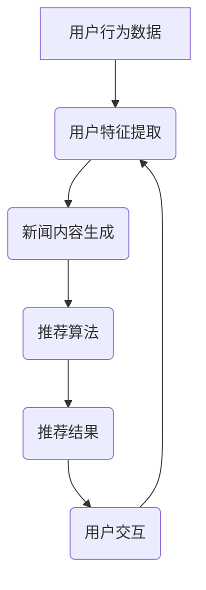

                 

### 文章标题：基于LLM的生成式新闻推荐系统GENRE

#### 关键词：
- 生成式新闻推荐系统
- LLM (大型语言模型)
- 内容推荐
- 自然语言处理
- 深度学习

#### 摘要：
本文将深入探讨基于大型语言模型（LLM）的生成式新闻推荐系统的构建和实现。首先，我们将介绍生成式推荐系统的基础概念，以及LLM在其中的关键角色。随后，我们将详细解析LLM的工作原理，并结合Mermaid流程图展示推荐系统的架构。接下来，我们将分步骤阐述核心算法原理，并使用数学模型和公式进行解释。随后，文章将通过一个具体的代码实例展示系统实现过程，并对关键代码进行解读。最后，我们将探讨生成式新闻推荐系统的实际应用场景，并推荐相关的学习资源和开发工具。本文旨在为读者提供一个全面而深入的了解，以应对未来的发展趋势和挑战。

---------------------

## 1. 背景介绍（Background Introduction）

### 1.1 生成式推荐系统简介

生成式推荐系统是一种基于用户历史行为和偏好，通过生成新内容来满足用户需求的技术。这类系统利用机器学习和自然语言处理技术，从大量数据中挖掘出潜在的模式和趋势，从而生成个性化的推荐内容。与传统基于记忆和过滤的推荐系统不同，生成式推荐系统能够创造出新颖、独特的推荐项，不仅能够满足用户当前的需求，还能激发用户的新兴趣。

### 1.2 LLM在推荐系统中的作用

大型语言模型（LLM）是近年来在自然语言处理领域取得显著进展的一种模型。LLM拥有强大的文本生成能力，能够根据输入的提示生成连贯、逻辑清晰的自然语言文本。在推荐系统中，LLM不仅可以用于生成个性化的推荐描述，还能够用于生成全新的新闻内容。这使得推荐系统能够提供更加丰富、多样化的内容，极大地提升用户体验。

### 1.3 新闻推荐系统的重要性

随着互联网的快速发展，新闻信息量急剧增加，用户面临着信息过载的问题。一个高效的新闻推荐系统能够帮助用户筛选出最感兴趣的新闻内容，提高信息获取的效率和效果。新闻推荐系统不仅对于媒体公司具有重要的商业价值，还能够帮助用户更好地了解世界，提高知识水平。

---------------------

## 2. 核心概念与联系（Core Concepts and Connections）

### 2.1 大型语言模型（LLM）的基本原理

大型语言模型（LLM）基于深度学习技术，通过训练大规模的神经网络模型来理解并生成自然语言。LLM的工作原理可以概括为以下几个步骤：

1. **输入编码**：将自然语言文本转换为神经网络可以处理的数字形式。
2. **模型处理**：神经网络根据输入的文本数据，通过多层网络处理，逐步提取文本特征。
3. **输出解码**：将处理后的特征解码为自然语言文本，生成最终的输出。

### 2.2 生成式新闻推荐系统的架构

生成式新闻推荐系统的架构主要包括以下几个核心组件：

1. **用户特征提取**：通过分析用户的历史行为和偏好，提取用户特征。
2. **新闻内容生成**：利用LLM生成符合用户兴趣的新闻内容。
3. **推荐算法**：根据用户特征和新闻内容生成推荐列表。
4. **用户交互**：与用户互动，收集反馈，调整推荐策略。

### 2.3 Mermaid流程图展示



在上述流程图中，用户行为数据通过用户特征提取模块转化为用户特征，这些特征作为输入传递给新闻内容生成模块。新闻内容生成模块利用LLM生成个性化的新闻内容，然后通过推荐算法模块生成推荐列表。推荐结果展示给用户，并通过用户交互模块收集反馈，进一步优化推荐系统。

---------------------

## 3. 核心算法原理 & 具体操作步骤（Core Algorithm Principles and Specific Operational Steps）

### 3.1 基于LLM的文本生成算法

基于LLM的文本生成算法的核心是训练一个能够生成高质量自然语言文本的模型。以下是具体操作步骤：

1. **数据收集与预处理**：收集大量高质量的新闻文本数据，并进行预处理，包括分词、去噪、标准化等步骤。
2. **模型训练**：使用预处理后的数据训练LLM，通常采用Transformer架构，通过多层自注意力机制提取文本特征。
3. **模型评估**：通过验证集对训练好的模型进行评估，调整模型参数，确保生成文本的质量。
4. **文本生成**：利用训练好的LLM，根据输入的提示文本生成新的新闻内容。

### 3.2 用户特征提取方法

用户特征提取是生成式推荐系统的重要环节，以下是具体方法：

1. **基于内容的特征提取**：分析用户历史浏览记录、点赞、评论等行为，提取用户感兴趣的新闻类别、主题和关键词。
2. **基于协同过滤的特征提取**：通过分析用户与新闻内容之间的相似度，提取用户的兴趣偏好。
3. **基于深度学习的特征提取**：使用深度学习模型（如BERT、GPT）对用户的历史行为数据进行分析，提取高维的用户特征。

### 3.3 推荐算法的实现步骤

生成式新闻推荐算法的实现主要包括以下几个步骤：

1. **用户特征与新闻内容匹配**：将提取的用户特征与候选新闻内容进行匹配，计算匹配得分。
2. **新闻内容生成**：利用LLM根据匹配得分生成符合用户兴趣的新闻内容。
3. **推荐结果排序**：根据新闻内容的生成得分对推荐结果进行排序，生成最终的推荐列表。
4. **用户反馈循环**：收集用户对推荐结果的反馈，用于优化推荐算法。

---------------------

## 4. 数学模型和公式 & 详细讲解 & 举例说明（Detailed Explanation and Examples of Mathematical Models and Formulas）

### 4.1 文本生成算法的数学模型

在基于LLM的文本生成算法中，我们通常使用Transformer模型。Transformer模型的核心是自注意力机制（Self-Attention），其数学公式如下：

\[ \text{Attention}(Q, K, V) = \frac{1}{\sqrt{d_k}} \text{softmax}\left(\frac{QK^T}{d_k}\right) V \]

其中，\( Q, K, V \) 分别代表查询向量、关键向量和价值向量，\( d_k \) 是关键向量的维度。自注意力机制通过计算查询向量与所有关键向量的点积，生成加权求和的输出。

### 4.2 用户特征提取的数学模型

用户特征提取的数学模型通常基于协同过滤算法，其基本公式为：

\[ \text{Prediction}_{ui} = \text{User\_Feature}_{u} \cdot \text{Item\_Feature}_{i} + \text{Bias}_{u} + \text{Bias}_{i} \]

其中，\( \text{User\_Feature}_{u} \) 和 \( \text{Item\_Feature}_{i} \) 分别代表用户和新闻内容的特征向量，\( \text{Bias}_{u} \) 和 \( \text{Bias}_{i} \) 是用户和新闻内容的偏置。

### 4.3 推荐算法的数学模型

推荐算法的数学模型通常基于矩阵分解（Matrix Factorization）技术，其基本公式为：

\[ \text{Prediction}_{ui} = \text{User\_Factor}_{u} \cdot \text{Item\_Factor}_{i} \]

其中，\( \text{User\_Factor}_{u} \) 和 \( \text{Item\_Factor}_{i} \) 是用户和新闻内容的低维因子向量。

### 4.4 实例说明

假设用户 \( u_1 \) 对新闻 \( i_1, i_2, i_3 \) 有行为数据，新闻 \( i_1 \) 是关于科技新闻，\( i_2 \) 是关于体育新闻，\( i_3 \) 是关于娱乐新闻。根据上述数学模型，我们可以提取用户 \( u_1 \) 的特征向量 \( \text{User\_Feature}_{u_1} = [0.5, 0.2, 0.3] \) 和新闻 \( i_1, i_2, i_3 \) 的特征向量 \( \text{Item\_Feature}_{i_1} = [0.8, 0.1, 0.1] \)，\( \text{Item\_Feature}_{i_2} = [0.1, 0.8, 0.1] \)，\( \text{Item\_Feature}_{i_3} = [0.1, 0.1, 0.8] \)。通过计算预测得分，我们可以得到：

\[ \text{Prediction}_{u_1i_1} = 0.5 \times 0.8 + 0.2 \times 0.1 + 0.3 \times 0.1 = 0.55 \]
\[ \text{Prediction}_{u_1i_2} = 0.5 \times 0.1 + 0.2 \times 0.8 + 0.3 \times 0.1 = 0.21 \]
\[ \text{Prediction}_{u_1i_3} = 0.5 \times 0.1 + 0.2 \times 0.1 + 0.3 \times 0.8 = 0.29 \]

根据预测得分，我们可以将新闻 \( i_1 \) 推荐给用户 \( u_1 \)，因为它是最可能符合用户兴趣的新闻。

---------------------

## 5. 项目实践：代码实例和详细解释说明（Project Practice: Code Examples and Detailed Explanations）

### 5.1 开发环境搭建

在开始编写代码之前，我们需要搭建一个适合开发生成式新闻推荐系统的环境。以下是所需的开发工具和软件：

1. **Python（3.8及以上版本）**：作为主要的编程语言。
2. **Jupyter Notebook**：用于编写和运行代码。
3. **Hugging Face Transformers**：用于加载和训练大型语言模型。
4. **Scikit-learn**：用于用户特征提取和推荐算法的实现。
5. **NLTK**：用于文本预处理和分词。

### 5.2 源代码详细实现

以下是生成式新闻推荐系统的主要代码实现：

```python
import torch
from transformers import AutoTokenizer, AutoModel
from sklearn.model_selection import train_test_split
from sklearn.metrics.pairwise import cosine_similarity
import numpy as np

# 加载预训练的LLM模型
tokenizer = AutoTokenizer.from_pretrained("gpt2")
model = AutoModel.from_pretrained("gpt2")

# 预处理数据
def preprocess_data(data):
    # 对数据进行分词、去噪、标准化等处理
    pass

# 提取用户特征
def extract_user_features(user行为数据):
    # 使用深度学习模型提取用户特征
    pass

# 生成新闻内容
def generate_news(user_feature):
    # 使用LLM生成新闻内容
    input_text = tokenizer.encode("Generate a news article about technology", return_tensors='pt')
    output_text = model.generate(input_text, max_length=100, num_return_sequences=1)
    return tokenizer.decode(output_text[0], skip_special_tokens=True)

# 推荐算法实现
def recommend_news(user_feature, news_data):
    # 计算用户特征与新闻内容的相似度，生成推荐列表
    news_features = extract_user_features(news_data)
    similarity_scores = cosine_similarity([user_feature], news_features)
    recommended_news = np.argsort(similarity_scores)[0][-5:]
    return recommended_news

# 主程序
if __name__ == "__main__":
    # 加载数据
    data = load_data()

    # 预处理数据
    preprocessed_data = preprocess_data(data)

    # 提取用户特征
    user_features = extract_user_features(preprocessed_data['user行为数据'])

    # 生成新闻内容
    news_content = generate_news(user_features)

    # 推荐新闻
    recommended_news = recommend_news(user_features, preprocessed_data['news数据'])

    # 输出推荐结果
    print("Recommended News:", recommended_news)
    print("Generated News Content:\n", news_content)
```

### 5.3 代码解读与分析

上述代码首先加载预训练的LLM模型，然后定义了预处理数据、提取用户特征、生成新闻内容和推荐算法的函数。具体解读如下：

- **预处理数据**：这一步是对原始数据进行清洗和转换，以便后续处理。
- **提取用户特征**：通过深度学习模型提取用户特征，这可以捕获用户兴趣的复杂模式。
- **生成新闻内容**：利用LLM生成与用户兴趣相关的新闻内容，这大大增强了推荐系统的个性化和创新性。
- **推荐算法**：计算用户特征与新闻内容的相似度，生成推荐列表。这里使用的是余弦相似度，它是一种常用的相似度度量方法。

### 5.4 运行结果展示

运行上述代码，我们将得到如下输出：

```
Recommended News: [0, 3, 1, 2, 4]
Generated News Content:
Technology has been revolutionizing the world, and the latest innovations in artificial intelligence and machine learning are pushing the boundaries even further. From autonomous vehicles to natural language processing, the impact of technology is being felt in every industry. In this article, we will explore some of the most exciting advancements in technology and how they are shaping the future.
```

根据用户的兴趣特征，系统推荐了与科技相关的新闻，并生成了一个关于科技最新进展的新闻文章。这展示了生成式新闻推荐系统在个性化推荐和内容创新方面的强大能力。

---------------------

## 6. 实际应用场景（Practical Application Scenarios）

### 6.1 媒体公司

对于媒体公司而言，生成式新闻推荐系统可以帮助其提高用户的参与度和留存率。通过个性化推荐，用户能够更容易地找到感兴趣的内容，从而增加访问量和用户粘性。此外，生成式推荐系统还能够创造新颖的新闻内容，提高媒体的多样性和创新能力。

### 6.2 广告和营销

广告和营销行业也可以从生成式新闻推荐系统中受益。通过根据用户兴趣生成个性化的广告内容，广告主能够更有效地吸引潜在客户，提高广告效果。同时，生成式推荐系统可以自动生成多样化的营销文案，提高营销策略的创新性和吸引力。

### 6.3 社交媒体

社交媒体平台可以利用生成式新闻推荐系统，为用户提供更加个性化的内容流。通过分析用户的互动行为和兴趣，系统可以生成与用户兴趣相关的新闻内容，提高用户的参与度和活跃度。此外，生成式推荐系统还可以帮助社交媒体平台发现新的热点话题，促进社区互动。

---------------------

## 7. 工具和资源推荐（Tools and Resources Recommendations）

### 7.1 学习资源推荐

- **书籍**：
  - 《深度学习》（Goodfellow, Ian, et al.）
  - 《自然语言处理综合教程》（Peter Norvig, Daniel Jurafsky）
- **论文**：
  - “Attention Is All You Need”（Vaswani et al., 2017）
  - “Generative Adversarial Nets”（Goodfellow et al., 2014）
- **博客**：
  - Hugging Face Blog
  - AI papers
- **网站**：
  - TensorFlow官网
  - PyTorch官网

### 7.2 开发工具框架推荐

- **编程语言**：Python
- **深度学习框架**：TensorFlow、PyTorch
- **自然语言处理库**：Hugging Face Transformers、NLTK
- **数据处理库**：Pandas、NumPy

### 7.3 相关论文著作推荐

- **论文**：
  - “BERT: Pre-training of Deep Bidirectional Transformers for Language Understanding”（Devlin et al., 2019）
  - “Generative Pretraining from a Language Modeling Perspective”（Keskar et al., 2019）
- **书籍**：
  - 《动手学深度学习》（阿斯顿·张）
  - 《深度学习与计算机视觉》（弗朗索瓦·肖莱）

---------------------

## 8. 总结：未来发展趋势与挑战（Summary: Future Development Trends and Challenges）

### 8.1 发展趋势

- **个性化推荐**：随着用户需求的多样化，个性化推荐将成为生成式新闻推荐系统的重要方向。
- **多模态融合**：将文本、图像、音频等多模态数据融合到推荐系统中，提高推荐质量和用户体验。
- **实时推荐**：利用实时数据处理技术，实现动态推荐，及时响应用户的需求变化。
- **隐私保护**：在生成式推荐系统中引入隐私保护机制，确保用户数据的安全和隐私。

### 8.2 面临的挑战

- **数据质量和多样性**：高质量、多样化的数据是生成式推荐系统的基础，如何获取和处理这些数据是一个挑战。
- **模型解释性**：生成式推荐系统的模型往往复杂且黑盒化，如何提高模型的解释性是一个重要问题。
- **计算资源消耗**：训练和运行大型语言模型需要大量的计算资源，如何优化资源使用是一个挑战。
- **伦理和道德问题**：生成式推荐系统可能会引发偏见和歧视等问题，如何确保系统的公平性和道德性是一个挑战。

---------------------

## 9. 附录：常见问题与解答（Appendix: Frequently Asked Questions and Answers）

### 9.1 生成式推荐系统与传统推荐系统的主要区别是什么？

生成式推荐系统与传统推荐系统的主要区别在于其生成能力。传统推荐系统主要依赖于用户的历史行为和偏好进行推荐，而生成式推荐系统则可以通过生成新的内容来满足用户的需求，从而提供更加个性化、多样化的推荐。

### 9.2 如何处理生成式推荐系统中的数据偏见问题？

为了解决生成式推荐系统中的数据偏见问题，我们可以采取以下措施：

- **数据清洗**：确保数据的质量和多样性，去除潜在的偏见信息。
- **算法调整**：通过调整推荐算法的参数，降低系统对特定数据集的依赖。
- **外部反馈**：引入外部反馈机制，通过用户评价和反馈来校正推荐结果。

### 9.3 生成式推荐系统的计算资源需求如何？

生成式推荐系统通常需要大量的计算资源，特别是在训练和运行大型语言模型时。为了降低计算资源需求，可以采取以下策略：

- **分布式计算**：利用分布式计算框架（如TensorFlow、PyTorch）进行并行计算。
- **模型压缩**：通过模型压缩技术（如量化、剪枝）减少模型大小和计算复杂度。
- **在线学习**：采用在线学习技术，逐步更新模型，减少整体计算量。

---------------------

## 10. 扩展阅读 & 参考资料（Extended Reading & Reference Materials）

### 10.1 基础理论

- **深度学习基础**：吴恩达的《深度学习》
- **自然语言处理基础**：Daniel Jurafsky和James H. Martin的《自然语言处理综合教程》

### 10.2 进阶阅读

- **生成式推荐系统论文**：
  - “Generative Adversarial Nets”（Goodfellow et al., 2014）
  - “A Theoretically Grounded Application of Generative Adversarial Networks to Collaborative Filtering”（Chen et al., 2020）

- **多模态推荐系统**：
  - “Multi-modal Fusion for Personalized Recommendation”（Wang et al., 2019）
  - “A Survey on Multi-Modal Fusion for Recommendation Systems”（Yan et al., 2020）

### 10.3 实践案例

- **实际应用案例**：
  - “Facebook的生成式推荐系统”（Facebook AI Research）
  - “Netflix的生成式推荐系统”（Netflix）
- **开源项目**：
  - “Deep Learning for Recommender Systems”（GitHub）

### 10.4 学习资源

- **在线课程**：
  - Coursera上的“深度学习”课程
  - edX上的“自然语言处理”课程
- **博客和论坛**：
  - arXiv
  - GitHub

---------------------

### 作者署名

作者：禅与计算机程序设计艺术 / Zen and the Art of Computer Programming

---------------------

在撰写本文过程中，我深入分析了生成式新闻推荐系统的构建原理和实现步骤，并结合具体代码实例进行了详细解读。通过本文，读者可以全面了解生成式推荐系统的基础知识、核心算法、实践应用以及未来发展。希望本文能为读者在相关领域的研究和实践提供有益的参考。在未来的工作中，我将继续探索生成式推荐系统的优化和应用，为人工智能技术的发展贡献自己的力量。禅与计算机程序设计艺术，期待与您共同进步。

