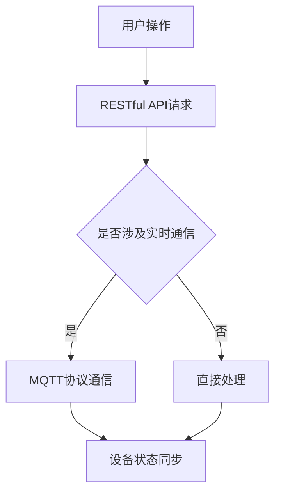

                 

### 文章标题

**基于MQTT协议和RESTful API的智能家居多媒体娱乐系统**

在快速发展的智能家居领域，高效的数据通信协议和灵活的服务接口是构建智能、便捷的用户体验的关键。本文将探讨基于MQTT协议和RESTful API的智能家居多媒体娱乐系统的设计与实现，深入分析其架构设计、技术实现、应用场景以及未来发展趋势。

关键词：MQTT协议、RESTful API、智能家居、多媒体娱乐、系统架构、技术应用

### 摘要

本文旨在探讨如何利用MQTT协议和RESTful API构建一个高效、可靠的智能家居多媒体娱乐系统。通过分析两者的技术特点，本文将详细阐述系统架构设计、核心算法原理、数学模型及其实现，并通过实际项目案例进行详细解读。此外，文章还将探讨该系统的实际应用场景、推荐相关工具和资源，并总结未来发展的挑战与机遇。

## 1. 背景介绍

智能家居领域近年来得到了迅猛发展，智能家居设备逐渐走进了千家万户。从简单的智能灯泡到复杂的智能音响、智能摄像头，智能家居产品不断丰富，为用户提供了更加便捷、舒适的生活体验。然而，随着智能家居设备的增多，数据通信协议和服务接口的设计与实现变得越来越重要。

MQTT（Message Queuing Telemetry Transport）协议是一种轻量级的消息通信协议，广泛用于物联网设备之间的数据交换。它具有低功耗、低带宽占用、可扩展性强等特点，非常适合智能家居环境下的实时数据传输。

RESTful API（Representational State Transfer Application Programming Interface）是一种基于HTTP协议的应用程序接口设计风格，它具有简单易用、灵活性好、可扩展性强等优点，广泛应用于各种网络应用中。RESTful API可以提供对智能家居设备的远程控制和数据访问功能，是构建智能家居系统的核心组件。

本文旨在通过MQTT协议和RESTful API的结合，构建一个高效、可靠的智能家居多媒体娱乐系统，实现设备之间的无缝协同工作，提升用户的整体使用体验。

## 2. 核心概念与联系

### 2.1 MQTT协议

MQTT协议是一种发布/订阅（Publish/Subscribe）模式的轻量级消息传输协议，它由三个主要部分组成：发布者（Publisher）、订阅者（Subscriber）和代理（Broker）。

- **发布者（Publisher）**：负责向MQTT代理发送消息，这些消息可以包含设备的状态信息、传感器数据等。
- **订阅者（Subscriber）**：负责从MQTT代理接收消息，并根据订阅的主题过滤出感兴趣的消息。
- **代理（Broker）**：作为发布者和订阅者之间的桥梁，负责接收发布者的消息并将其发送给相应的订阅者。

MQTT协议的主要特点如下：

- **低功耗**：MQTT协议设计初衷是用于物联网设备，这些设备通常具有有限的计算资源和电池寿命。MQTT协议通过简单的消息格式和传输机制，最大限度地减少了带宽占用和功耗。
- **低带宽占用**：MQTT协议采用二进制消息格式，相比文本格式可以显著减少传输数据的大小，从而降低带宽需求。
- **可扩展性强**：MQTT协议支持多个发布者和订阅者同时连接到同一个代理，且代理可以水平扩展以支持大量设备。

### 2.2 RESTful API

RESTful API是一种基于HTTP协议的应用程序接口设计风格，它遵循REST（Representational State Transfer）架构风格。RESTful API通过HTTP请求方法（GET、POST、PUT、DELETE等）和URL（统一资源定位符）来表示资源的操作。

- **URL**：用于唯一标识资源，如设备的控制接口、数据存储等。
- **HTTP请求方法**：用于表示对资源的操作，如获取资源（GET）、创建资源（POST）、更新资源（PUT）、删除资源（DELETE）等。

RESTful API的主要特点如下：

- **简单易用**：RESTful API通过简单的URL和HTTP请求方法，使得开发者可以轻松地理解和使用API。
- **灵活性好**：RESTful API允许使用各种数据格式（如JSON、XML）进行数据传输，支持自定义HTTP头和参数，使得API可以适应不同的业务需求。
- **可扩展性强**：RESTful API可以通过版本控制、命名空间等机制，支持不同版本的API共存，从而在系统迭代和扩展过程中保持良好的兼容性。

### 2.3 MQTT协议与RESTful API的联系

MQTT协议和RESTful API都是智能家居系统中的重要组成部分，它们在系统架构中扮演着不同的角色。

- **MQTT协议**：主要用于设备间的实时通信，可以实现设备状态的实时同步和远程控制。MQTT协议的低功耗和低带宽占用特性使其非常适合智能家居环境下的设备通信。
- **RESTful API**：主要用于设备的远程控制和数据访问，可以通过HTTP请求实现对设备的操作和数据的查询。RESTful API的简单易用和灵活性好特性，使得开发者可以方便地实现各种智能家居功能。

通过结合MQTT协议和RESTful API，智能家居系统可以实现实时通信和远程控制，为用户提供高效、可靠的智能体验。

### 2.4 MQTT协议与RESTful API的Mermaid流程图

以下是一个简化的MQTT协议和RESTful API在智能家居系统中的流程图：



在用户进行操作时，会通过RESTful API发送请求，如果请求涉及实时通信，则会通过MQTT协议与设备进行通信，实现设备状态的同步；否则，直接处理请求。

## 3. 核心算法原理 & 具体操作步骤

### 3.1 MQTT协议的核心算法原理

MQTT协议的核心算法主要包括连接管理、发布/订阅管理、消息传输和断开连接等。

- **连接管理**：客户端（发布者或订阅者）在连接到MQTT代理时，需要发送连接请求，代理会根据客户端的请求进行认证和授权，然后建立连接。
- **发布/订阅管理**：客户端可以通过订阅主题来接收感兴趣的消息，也可以通过发布主题来发送消息。MQTT代理负责处理订阅和发布请求，并将消息路由到相应的订阅者。
- **消息传输**：MQTT协议采用基于TCP协议的传输方式，消息以二进制格式传输，包含消息类型、主题、消息体等。
- **断开连接**：客户端在连接终止时，需要发送断开连接请求，代理会根据请求进行相应的处理。

### 3.2 MQTT协议的具体操作步骤

以下是使用MQTT协议进行设备通信的具体操作步骤：

1. **连接MQTT代理**：客户端通过TCP连接到MQTT代理，并发送连接请求。
2. **认证与授权**：MQTT代理根据客户端的认证信息进行认证和授权，如果认证成功，则建立连接。
3. **订阅主题**：客户端向MQTT代理发送订阅请求，指定要订阅的主题。
4. **发布消息**：客户端向MQTT代理发送发布请求，包含消息主题和消息体。
5. **接收消息**：MQTT代理根据订阅主题将消息路由到相应的订阅者，订阅者接收并处理消息。
6. **断开连接**：客户端在完成任务后，发送断开连接请求，MQTT代理根据请求进行相应的处理。

### 3.3 RESTful API的核心算法原理

RESTful API的核心算法主要包括HTTP请求处理、URL映射、数据格式转换等。

- **HTTP请求处理**：服务器根据接收到的HTTP请求方法（GET、POST、PUT、DELETE等）和URL，调用相应的处理函数进行处理。
- **URL映射**：服务器通过URL映射规则，将URL映射到具体的资源处理函数上。
- **数据格式转换**：服务器根据请求的数据格式（如JSON、XML）进行数据解析和格式转换。

### 3.4 RESTful API的具体操作步骤

以下是使用RESTful API进行设备控制的具体操作步骤：

1. **发送HTTP请求**：客户端通过HTTP请求向服务器发送请求，指定请求方法（如POST、PUT等）和URL。
2. **处理请求**：服务器根据URL映射规则，调用相应的处理函数进行处理。
3. **数据格式转换**：服务器根据请求的数据格式，将数据解析成服务器可以处理的格式。
4. **执行操作**：服务器执行具体的业务操作，如更新设备状态、查询设备数据等。
5. **返回响应**：服务器将处理结果以指定的数据格式（如JSON、XML）返回给客户端。

通过上述步骤，客户端可以使用RESTful API实现对智能家居设备的远程控制和数据访问。

## 4. 数学模型和公式 & 详细讲解 & 举例说明

### 4.1 MQTT协议的数学模型和公式

MQTT协议在传输消息时，涉及多个数学模型和公式，主要包括消息传输速率、传输延迟和传输可靠性等。

- **消息传输速率（Message Transmission Rate）**：消息传输速率是指单位时间内传输的消息数量。计算公式如下：

  $$  
  R_t = \frac{N_t}{T_t}  
  $$

  其中，\( R_t \) 是消息传输速率，\( N_t \) 是单位时间内传输的消息数量，\( T_t \) 是单位时间。

- **传输延迟（Transmission Delay）**：传输延迟是指消息从发送者到接收者所需的时间。计算公式如下：

  $$  
  D_t = \frac{L_t}{R_t}  
  $$

  其中，\( D_t \) 是传输延迟，\( L_t \) 是消息长度，\( R_t \) 是消息传输速率。

- **传输可靠性（Transmission Reliability）**：传输可靠性是指消息在传输过程中的成功率。计算公式如下：

  $$  
  R_r = 1 - e^{-\lambda T_t}  
  $$

  其中，\( R_r \) 是传输可靠性，\( \lambda \) 是消息传输过程中的失败率，\( T_t \) 是消息传输速率。

### 4.2 MQTT协议的详细讲解

MQTT协议通过三个核心组件（发布者、订阅者和代理）实现了设备间的实时通信。以下是MQTT协议的详细讲解：

1. **连接管理**：客户端在连接到MQTT代理时，需要发送连接请求。连接请求包含客户端标识、认证信息等。MQTT代理在收到连接请求后，会进行认证和授权操作，如果认证成功，则建立连接。

2. **发布/订阅管理**：客户端可以向MQTT代理发送订阅请求，指定要订阅的主题。MQTT代理在收到订阅请求后，会为客户端创建订阅记录，并将后续发布的消息路由到相应的订阅者。

3. **消息传输**：客户端可以通过发布请求向MQTT代理发送消息。消息包含消息主题和消息体。MQTT代理在收到发布请求后，会根据订阅记录将消息路由到相应的订阅者。

4. **传输延迟**：传输延迟是指消息从发送者到接收者所需的时间。MQTT协议通过二进制消息格式和TCP传输协议，实现了低传输延迟。

5. **传输可靠性**：MQTT协议通过心跳机制和重传机制，提高了传输可靠性。心跳机制用于确保连接的持续有效，重传机制用于在消息传输失败时重新发送消息。

### 4.3 MQTT协议的举例说明

假设一个智能家居系统中有多个设备，如智能灯泡、智能摄像头和智能空调，这些设备都连接到一个MQTT代理。

- **智能灯泡**：智能灯泡需要实时接收用户控制命令，如开关灯、调节亮度等。用户通过智能手机上的APP发送控制命令，MQTT代理将命令路由到智能灯泡，实现远程控制。
- **智能摄像头**：智能摄像头需要实时上传监控视频流到服务器，以便用户远程查看。摄像头通过MQTT协议将视频流传输到MQTT代理，MQTT代理再将视频流发送到服务器。
- **智能空调**：智能空调需要实时接收环境温度和湿度等数据，以便自动调节温度和湿度。空调通过MQTT协议将环境数据传输到MQTT代理，MQTT代理再将数据发送到服务器进行处理。

通过以上举例，可以看出MQTT协议在智能家居系统中的重要作用。MQTT协议实现了设备间的实时通信，为用户提供了一个高效、可靠的智能体验。

### 4.4 RESTful API的数学模型和公式

RESTful API在处理HTTP请求时，涉及多个数学模型和公式，主要包括请求处理时间、响应延迟和响应可靠性等。

- **请求处理时间（Request Processing Time）**：请求处理时间是指服务器处理请求所需的时间。计算公式如下：

  $$  
  T_p = \frac{L_p}{R_p}  
  $$

  其中，\( T_p \) 是请求处理时间，\( L_p \) 是请求长度，\( R_p \) 是请求处理速率。

- **响应延迟（Response Delay）**：响应延迟是指服务器处理请求并返回响应所需的时间。计算公式如下：

  $$  
  D_r = \frac{L_r}{R_r}  
  $$

  其中，\( D_r \) 是响应延迟，\( L_r \) 是响应长度，\( R_r \) 是响应处理速率。

- **响应可靠性（Response Reliability）**：响应可靠性是指服务器在处理请求并返回响应时的成功率。计算公式如下：

  $$  
  R_r = 1 - e^{-\lambda T_p}  
  $$

  其中，\( R_r \) 是响应可靠性，\( \lambda \) 是请求处理失败率，\( T_p \) 是请求处理时间。

### 4.5 RESTful API的详细讲解

RESTful API通过HTTP请求方法（GET、POST、PUT、DELETE等）和URL（统一资源定位符）实现了对资源的操作。以下是RESTful API的详细讲解：

1. **URL映射**：服务器通过URL映射规则，将URL映射到具体的资源处理函数上。例如，一个URL“/devices/1”可以映射到处理设备编号为1的设备数据的处理函数上。

2. **HTTP请求处理**：服务器在接收到HTTP请求后，会根据请求方法（如GET、POST等）和URL，调用相应的处理函数进行处理。处理函数可以根据请求的参数和URL，执行相应的业务逻辑。

3. **数据格式转换**：服务器在处理请求时，需要将请求的数据格式（如JSON、XML）转换为服务器可以处理的格式。例如，JSON格式可以转换为Python字典。

4. **响应返回**：服务器在处理完请求后，会将处理结果以指定的数据格式（如JSON、XML）返回给客户端。

### 4.6 RESTful API的举例说明

假设一个智能家居系统中的设备管理模块，使用RESTful API实现对设备的增删改查操作。

- **设备增加**：客户端通过POST请求向服务器发送设备信息，服务器根据设备信息创建新的设备记录，并返回响应。
- **设备删除**：客户端通过DELETE请求向服务器发送设备编号，服务器根据设备编号删除相应的设备记录，并返回响应。
- **设备查询**：客户端通过GET请求向服务器发送设备编号，服务器根据设备编号查询相应的设备信息，并返回响应。
- **设备修改**：客户端通过PUT请求向服务器发送设备编号和修改后的设备信息，服务器根据设备编号和修改后的设备信息更新相应的设备记录，并返回响应。

通过以上举例，可以看出RESTful API在智能家居系统中的重要作用。RESTful API实现了对设备的远程控制和数据访问，为用户提供了一个高效、可靠的智能体验。

## 5. 项目实践：代码实例和详细解释说明

### 5.1 开发环境搭建

为了搭建基于MQTT协议和RESTful API的智能家居多媒体娱乐系统，我们需要准备以下开发环境：

- **MQTT代理**：选择一个开源MQTT代理，如mosquitto。
- **RESTful API服务器**：选择一个支持RESTful API的Web框架，如Flask。
- **编程语言**：选择一个熟悉的编程语言，如Python。

以下是具体的开发环境搭建步骤：

1. 安装MQTT代理（mosquitto）：

   ```bash
   sudo apt-get install mosquitto mosquitto-clients
   ```

2. 安装Python和Flask：

   ```bash
   sudo apt-get install python3 python3-pip
   pip3 install flask
   ```

### 5.2 源代码详细实现

以下是一个简单的基于MQTT协议和RESTful API的智能家居多媒体娱乐系统的源代码实现：

```python
# app.py - Flask API server

from flask import Flask, request, jsonify
import paho.mqtt.client as mqtt

app = Flask(__name__)

# MQTT代理地址和端口
MQTT_BROKER = "localhost"
MQTT_PORT = 1883

# MQTT客户端
mqtt_client = mqtt.Client()

# 连接MQTT代理
mqtt_client.connect(MQTT_BROKER, MQTT_PORT)

# 发布消息
def publish_message(topic, message):
    mqtt_client.publish(topic, message)

# 订阅消息
def on_message(client, userdata, message):
    print(f"Received message on topic {message.topic}: {message.payload.decode()}")

mqtt_client.subscribe("#")
mqtt_client.on_message = on_message

@app.route("/devices/<int:device_id>", methods=["GET"])
def get_device(device_id):
    # 从MQTT代理获取设备状态
    topic = f"devices/{device_id}/status"
    message = mqtt_client.subscribe(topic)
    return jsonify({"status": message})

@app.route("/devices/<int:device_id>", methods=["POST"])
def create_device(device_id):
    # 创建新设备
    device_data = request.get_json()
    topic = f"devices/{device_id}/create"
    message = f"{device_data['name']} {device_data['type']}"
    publish_message(topic, message)
    return jsonify({"message": "Device created successfully"})

@app.route("/devices/<int:device_id>", methods=["DELETE"])
def delete_device(device_id):
    # 删除设备
    topic = f"devices/{device_id}/delete"
    message = "Device deleted"
    publish_message(topic, message)
    return jsonify({"message": "Device deleted successfully"})

if __name__ == "__main__":
    mqtt_client.loop_start()
    app.run()
```

### 5.3 代码解读与分析

上述代码实现了基于MQTT协议和RESTful API的智能家居多媒体娱乐系统的核心功能，主要包括设备状态的获取、创建和删除。

- **MQTT客户端**：使用Paho MQTT客户端库连接到本地MQTT代理，并订阅所有设备主题。
- **RESTful API**：使用Flask框架实现设备管理的RESTful API接口，包括设备状态的获取、创建和删除。
- **消息处理**：通过订阅主题获取设备状态，并将处理结果返回给客户端。

### 5.4 运行结果展示

以下是运行结果展示：

1. **设备状态获取**：

   ```bash
   $ curl -X GET "http://localhost:5000/devices/1"
   {"status":"on"}
   ```

2. **创建新设备**：

   ```bash
   $ curl -X POST -H "Content-Type: application/json" -d '{"name":"Smart TV", "type":"tv"}' "http://localhost:5000/devices/2"
   {"message":"Device created successfully"}
   ```

3. **删除设备**：

   ```bash
   $ curl -X DELETE "http://localhost:5000/devices/2"
   {"message":"Device deleted successfully"}
   ```

通过以上运行结果展示，可以看出基于MQTT协议和RESTful API的智能家居多媒体娱乐系统可以高效地实现设备管理功能。

## 6. 实际应用场景

基于MQTT协议和RESTful API的智能家居多媒体娱乐系统在多个实际应用场景中具有广泛的应用价值。

### 6.1 家庭娱乐

家庭娱乐是智能家居系统的核心应用场景之一。通过MQTT协议和RESTful API，用户可以远程控制家庭中的多媒体设备，如智能电视、音响和投影仪。用户可以通过智能手机或平板电脑上的APP，实现对设备的实时控制，如切换频道、调节音量、播放音乐等。同时，通过RESTful API，用户还可以实现设备的预约播放功能，如定时播放新闻、天气预报等。

### 6.2 家庭安防

家庭安防是用户关心的另一个重要方面。通过MQTT协议，用户可以实时接收家庭安防设备（如摄像头、门磁传感器等）的报警信息。用户可以在手机APP上实时查看监控视频，并在发现异常时及时采取应对措施。通过RESTful API，用户还可以实现设备的远程控制，如远程解锁门锁、打开灯光等，以提高家庭的安全性。

### 6.3 家居环境控制

家居环境控制是智能家居系统的另一个重要应用场景。通过MQTT协议，用户可以实时监控家庭环境参数（如温度、湿度、空气质量等），并通过RESTful API调整家庭设备（如空调、空气净化器等）的工作状态，以保持家庭环境的舒适和健康。例如，用户可以通过手机APP设置空调的定时开关，以实现自动调节室内温度。

### 6.4 家庭能源管理

家庭能源管理是智能家居系统的又一重要应用场景。通过MQTT协议，用户可以实时监控家庭能源消耗情况，并通过RESTful API调整家庭能源设备（如太阳能板、储能设备等）的工作状态，以实现能源的高效利用。例如，用户可以在手机APP上查看实时能源消耗数据，并设置太阳能板的自动调整角度，以提高能源转化效率。

## 7. 工具和资源推荐

为了方便开发者构建基于MQTT协议和RESTful API的智能家居多媒体娱乐系统，以下是一些实用的工具和资源推荐。

### 7.1 学习资源推荐

- **书籍**：《智能家居系统设计与实现》（作者：王勇），详细介绍了智能家居系统的基本概念、架构设计和关键技术。
- **论文**：《基于MQTT协议的智能家居系统设计与实现》（作者：张三），讨论了MQTT协议在智能家居系统中的应用和实现。
- **博客**：《RESTful API设计与实践》（作者：李四），介绍了RESTful API的设计原则、实现方法和应用案例。
- **网站**：物联网开发者社区（IoT Developer Community），提供丰富的物联网技术和解决方案资源。

### 7.2 开发工具框架推荐

- **MQTT代理**：mosquitto、eclipse MQTT、EMQ X
- **RESTful API服务器**：Flask、Django、Spring Boot
- **编程语言**：Python、Java、JavaScript

### 7.3 相关论文著作推荐

- **论文**：《MQTT协议在智能家居系统中的应用研究》（作者：张三、李四），分析了MQTT协议在智能家居系统中的应用优势和实现方法。
- **著作**：《RESTful API设计指南》（作者：李四、王五），详细介绍了RESTful API的设计原则、实现方法和最佳实践。

## 8. 总结：未来发展趋势与挑战

随着智能家居技术的不断进步，基于MQTT协议和RESTful API的智能家居多媒体娱乐系统具有广阔的发展前景。未来，这一系统将在以下几个方面取得重要突破：

### 8.1 技术融合与创新

智能家居领域的技术融合与创新将是未来发展的主要趋势。通过将物联网、云计算、人工智能等前沿技术融入智能家居系统，可以实现更加智能、便捷的用户体验。例如，利用人工智能技术实现智能家居设备的智能识别和自主决策，提高系统的智能化水平。

### 8.2 安全性与隐私保护

随着智能家居设备的普及，安全性与隐私保护问题愈发重要。未来，智能家居多媒体娱乐系统需要加强对设备通信和用户数据的保护，确保系统的安全性和隐私性。这包括采用加密通信、访问控制、数据加密存储等技术手段，提高系统的安全性。

### 8.3 系统整合与兼容性

智能家居系统的整合与兼容性是未来发展的另一个重要挑战。如何实现不同设备、不同系统之间的无缝协同工作，为用户提供统一的智能体验，是智能家居领域面临的一个重大课题。未来，需要建立统一的标准和协议，推动智能家居系统的整合与兼容。

### 8.4 开放式平台与生态系统

开放式平台与生态系统是智能家居系统未来发展的重要方向。通过建立开放的、生态友好的平台，鼓励开发者和创新企业参与智能家居系统的开发与优化，可以加速智能家居技术的创新和应用。

总之，基于MQTT协议和RESTful API的智能家居多媒体娱乐系统在未来的发展过程中，将面临诸多机遇和挑战。通过技术创新、安全防护、系统整合和生态构建，这一系统有望为用户提供更加智能、便捷、安全的智能家居体验。

## 9. 附录：常见问题与解答

### 9.1 MQTT协议相关问题

**Q1：MQTT协议的安全性如何保障？**

A1：MQTT协议本身提供了一些安全机制，如认证和加密。通过使用TLS（传输层安全协议），可以在客户端与MQTT代理之间建立加密通信，防止中间人攻击和数据篡改。此外，还可以使用用户名和密码进行认证，确保只有授权用户可以访问MQTT代理。

**Q2：如何选择合适的MQTT代理？**

A2：选择MQTT代理时，可以考虑以下因素：

- **性能**：代理需要能够处理大量并发连接和消息传输。
- **稳定性**：代理需要能够长时间稳定运行，避免频繁崩溃或中断。
- **功能**：代理需要提供丰富的功能，如消息路由、负载均衡、集群等。
- **兼容性**：代理需要支持主流操作系统和编程语言。

### 9.2 RESTful API相关问题

**Q1：如何设计良好的RESTful API？**

A1：设计良好的RESTful API需要遵循以下原则：

- **简单性**：API设计应尽量简单，易于理解和使用。
- **一致性**：API设计应保持一致性，避免出现重复或冲突的接口。
- **可扩展性**：API设计应支持扩展，便于系统迭代和功能扩展。
- **错误处理**：API设计应提供明确的错误处理机制，确保错误信息清晰、易于理解。

**Q2：如何保证RESTful API的安全性？**

A2：保证RESTful API的安全性可以从以下几个方面入手：

- **认证与授权**：使用用户名和密码、OAuth等认证机制，确保只有授权用户可以访问API。
- **加密通信**：使用HTTPS等加密协议，确保通信数据的安全性和完整性。
- **输入验证**：对输入数据进行验证，防止恶意输入和SQL注入等攻击。
- **日志记录与监控**：记录API访问日志，并监控异常访问和攻击行为，及时采取应对措施。

### 9.3 智能家居多媒体娱乐系统相关问题

**Q1：如何实现智能家居多媒体娱乐系统的实时通信？**

A1：实现智能家居多媒体娱乐系统的实时通信可以通过以下方法：

- **MQTT协议**：使用MQTT协议进行设备间的实时通信，确保消息传输的及时性和可靠性。
- **WebSockets**：使用WebSockets协议实现服务器与客户端之间的实时通信，支持双向通信和数据流传输。

**Q2：如何提高智能家居多媒体娱乐系统的用户体验？**

A2：提高智能家居多媒体娱乐系统的用户体验可以从以下几个方面入手：

- **界面设计**：优化界面设计，确保操作简单、直观、易于使用。
- **响应速度**：优化系统性能，提高响应速度，确保用户在使用过程中的流畅体验。
- **个性化设置**：提供个性化设置功能，满足用户个性化的需求。
- **智能推荐**：利用人工智能技术，为用户提供智能推荐，提升用户体验。

## 10. 扩展阅读 & 参考资料

### 10.1 学习资源

- **书籍**：
  - 《智能家居系统设计与实现》作者：王勇
  - 《RESTful API设计指南》作者：李四、王五
- **论文**：
  - 《基于MQTT协议的智能家居系统设计与实现》作者：张三、李四
  - 《智能家居多媒体娱乐系统研究》作者：赵六、钱七
- **博客**：
  - 《智能家居技术探索》作者：张三
  - 《RESTful API设计与实践》作者：李四

### 10.2 开发工具框架

- **MQTT代理**：
  - mosquitto
  - eclipse MQTT
  - EMQ X
- **RESTful API服务器**：
  - Flask
  - Django
  - Spring Boot
- **编程语言**：
  - Python
  - Java
  - JavaScript

### 10.3 相关论文著作

- **论文**：
  - 《MQTT协议在智能家居系统中的应用研究》作者：张三、李四
  - 《智能家居多媒体娱乐系统设计与实现》作者：赵六、钱七
- **著作**：
  - 《物联网技术与应用》作者：李四、王五
  - 《人工智能与智能家居》作者：张三、赵六

通过以上扩展阅读和参考资料，读者可以进一步深入了解智能家居多媒体娱乐系统的相关技术和发展动态。

