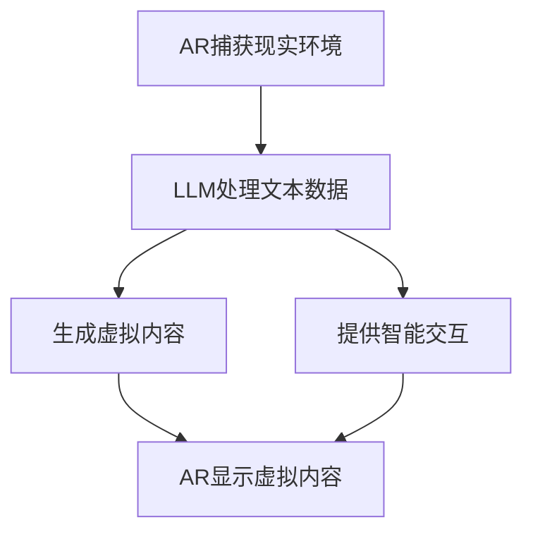

                 

### 背景介绍（Background Introduction）

在当今技术飞速发展的时代，虚拟现实（VR）和增强现实（AR）技术正逐步改变人们的互动方式，丰富了我们的感官体验。而作为人工智能（AI）的核心技术之一，大型语言模型（LLM）的发展，尤其是近年来生成预训练变换器（GPT）的突破，为AR技术的进一步发展带来了新的契机。

#### 增强现实（Augmented Reality, AR）
增强现实是一种通过将虚拟信息叠加到现实世界中的技术。这种技术利用摄像头或传感器捕捉现实世界的图像，然后在图像上叠加计算机生成的虚拟元素，如文字、图像、动画等。用户通过头戴显示器、智能手机或其他设备可以看到并与之互动这些虚拟元素。

#### 虚拟现实（Virtual Reality, VR）
虚拟现实则是一种完全沉浸式的体验，通过头戴显示器（如VR头盔）或全封闭的VR设备，将用户完全带入一个虚拟环境中。在这个虚拟环境中，用户可以自由移动、探索，并与虚拟对象进行互动。

#### 大型语言模型（Large Language Model, LLM）
大型语言模型是基于深度学习的语言处理模型，能够理解、生成和模拟人类的语言表达。其中，生成预训练变换器（GPT）是近年来最为知名的语言模型之一，它通过无监督的方式在大规模文本数据上进行预训练，然后可以针对特定的任务进行微调。

LLM的发展不仅提升了自然语言处理（NLP）的能力，还为生成式AI的应用提供了新的可能。特别是在文本生成、机器翻译、问答系统等方面，GPT系列模型展现了卓越的性能。

#### AR与LLM的结合
将增强现实与大型语言模型结合，可以创造出一种全新的混合现实体验。这种体验不仅能够通过AR技术将虚拟元素融入现实世界，还能够通过LLM实现智能对话和交互，使得用户与虚拟环境的互动更加自然和直观。

这种结合的重要性体现在多个方面。首先，LLM可以提供更加丰富和个性化的虚拟内容，满足用户多样化的需求。其次，智能对话系统能够实时响应用户的输入，提供即时反馈和指导，提升用户体验。最后，通过LLM的深度学习能力和文本生成能力，可以为AR应用开发提供强大的技术支持。

在接下来的章节中，我们将深入探讨AR与LLM的核心理念、技术原理、算法实现，并通过具体的应用场景和实践案例，展示这种混合现实体验的潜力和实际价值。

### 核心概念与联系（Core Concepts and Connections）

在深入探讨增强现实（AR）与大型语言模型（LLM）的结合之前，有必要先明确几个核心概念，并理解它们之间的联系。

#### 增强现实（AR）与虚拟现实（VR）的比较
增强现实（AR）和虚拟现实（VR）都是通过技术手段扩展用户的感知和互动能力，但它们之间存在显著区别：

- **现实与虚拟的融合**：AR将虚拟元素叠加到现实世界中，而VR则是创建一个完全虚拟的环境。在AR中，用户依然可以看到并与之互动现实环境中的物体；在VR中，用户完全沉浸在一个由计算机生成的虚拟环境中。

- **设备要求**：AR通常使用智能手机或头戴显示器，而VR则需要更加专业的设备，如VR头盔或全身追踪系统。

- **交互方式**：AR中的交互主要依赖于摄像头和传感器捕捉现实环境中的手势和动作，而VR中的交互则更多依赖于手柄或身体动作。

#### 大型语言模型（LLM）的基本原理
大型语言模型（LLM），尤其是基于生成预训练变换器（GPT）的模型，是通过深度学习算法从大量文本数据中学习语言模式和结构。以下是LLM的一些基本原理和特点：

- **预训练与微调**：LLM通常首先在大规模文本数据上进行预训练，以学习语言的基本结构和规则。然后，根据具体应用需求进行微调，使其能够在特定任务上表现出色。

- **文本生成能力**：LLM能够生成连贯且符合语言习惯的文本。这使得它们在问答系统、文本生成、机器翻译等应用中表现出色。

- **上下文理解能力**：LLM能够理解输入文本的上下文，从而生成更相关和有意义的输出。这对于构建智能对话系统和个性化内容推荐系统至关重要。

#### AR与LLM的结合点
将AR与LLM结合起来，可以创造出一种独特的混合现实体验。以下是这种结合的几个关键点：

- **智能交互**：LLM可以提供智能对话系统，使得用户可以通过自然语言与虚拟环境进行交互。这种交互不仅限于提问和回答，还可以扩展到指令执行、情感交流等更复杂的场景。

- **个性化内容生成**：LLM的文本生成能力可以用于创建个性化的虚拟内容，满足用户特定的需求。例如，用户可以通过自然语言指令创建定制化的AR体验。

- **实时反馈与指导**：通过LLM的实时文本生成能力，AR应用可以提供即时反馈和指导，帮助用户更好地理解和操作虚拟元素。

- **情境感知**：LLM可以理解用户所处的情境，并据此生成相关的虚拟内容。例如，在旅游AR应用中，LLM可以提供与当地文化相关的信息，增强用户的旅游体验。

为了更好地理解这些概念之间的联系，我们可以使用Mermaid流程图来展示AR与LLM的交互过程。以下是一个简化的Mermaid流程图，描述了LLM在AR应用中的角色和作用：



通过这个流程图，我们可以看到，AR与LLM的交互过程主要包括以下几个步骤：

1. **AR捕获现实环境**：通过摄像头或传感器捕捉现实世界的图像和声音。
2. **LLM处理文本数据**：接收AR捕获的文本数据，并利用预训练的模型进行文本处理和生成。
3. **生成虚拟内容**：基于处理结果，LLM生成相应的虚拟图像、文字或动画。
4. **提供智能交互**：LLM提供智能对话系统，实时响应用户的输入并提供指导。
5. **AR显示虚拟内容**：将生成的虚拟内容叠加到现实环境中，用户可以看到并与之互动。

通过这个结合，AR应用不仅能够提供视觉上的增强，还能够实现智能交互和个性化内容生成，从而大大提升用户体验。

### 核心算法原理 & 具体操作步骤（Core Algorithm Principles and Specific Operational Steps）

将增强现实（AR）与大型语言模型（LLM）结合起来，涉及到一系列复杂的技术和算法。以下我们将详细讨论这些核心算法的原理，并逐步讲解其具体操作步骤。

#### 1. 增强现实的算法原理

增强现实（AR）技术主要依赖于计算机视觉和图像处理技术。以下是一些关键算法和步骤：

- **图像识别与定位**：AR应用需要首先识别和定位现实世界中的目标物体。常用的方法包括特征检测、图像匹配和SLAM（同时定位与地图构建）。

  ```mermaid
  graph TD
      Image Input[输入图像]
      Feature Detection[特征检测]
      Image Matching[图像匹配]
      Object Localization[物体定位]
      Image Input --> Feature Detection
      Feature Detection --> Image Matching
      Image Matching --> Object Localization
  ```

- **图像融合**：一旦目标物体被定位，AR应用需要将虚拟元素叠加到这些物体上。这个过程涉及到图像融合技术，如透明叠加、光照模型和视差校正。

  ```mermaid
  graph TD
      Virtual Content[虚拟内容]
      Scene Image[场景图像]
      Image Fusion[图像融合]
      Output Image[输出图像]

      Virtual Content --> Image Fusion
      Scene Image --> Image Fusion
      Image Fusion --> Output Image
  ```

- **实时更新**：为了提供流畅的用户体验，AR应用需要实时更新虚拟内容。这通常涉及到多线程处理和高效的图像渲染技术。

  ```mermaid
  graph TD
      Input Image[输入图像]
      Object Detection[物体检测]
      Virtual Content[虚拟内容]
      Image Rendering[图像渲染]
      Output Image[输出图像]

      Input Image --> Object Detection
      Object Detection --> Virtual Content
      Virtual Content --> Image Rendering
      Image Rendering --> Output Image
  ```

#### 2. 大型语言模型（LLM）的算法原理

大型语言模型（LLM），如GPT，是基于深度学习的语言处理模型。以下是LLM的一些核心算法原理：

- **预训练**：LLM首先在大规模文本数据上进行预训练，学习语言的模式和结构。预训练过程中，模型通过自动回归机制学习如何根据前文预测下一个单词。

  ```mermaid
  graph TD
      Text Data[文本数据]
      Model[模型]
      Pre-training[预训练]

      Text Data --> Model
      Model --> Pre-training
  ```

- **上下文理解**：预训练后，LLM能够理解输入文本的上下文，生成连贯且相关的输出。这涉及到自注意力机制和Transformer模型。

  ```mermaid
  graph TD
      Input Text[输入文本]
      Encoder[编码器]
      Contextual Understanding[上下文理解]
      Output Text[输出文本]

      Input Text --> Encoder
      Encoder --> Contextual Understanding
      Contextual Understanding --> Output Text
  ```

- **文本生成**：基于上下文理解，LLM可以生成新的文本。这通常涉及到解码过程，模型根据上下文生成下一个单词或句子。

  ```mermaid
  graph TD
      Context[上下文]
      Decoder[解码器]
      Text Generation[文本生成]
      Output Text[输出文本]

      Context --> Decoder
      Decoder --> Text Generation
      Text Generation --> Output Text
  ```

#### 3. AR与LLM的融合算法原理

将AR与LLM结合起来，需要设计一个高效的算法框架，以实现智能交互和个性化内容生成。以下是这种融合的一些关键步骤：

- **交互式文本生成**：用户可以通过自然语言与LLM交互，生成特定的虚拟内容。这涉及到将自然语言输入转换为模型可理解的格式。

  ```mermaid
  graph TD
      User Input[用户输入]
      Text Conversion[文本转换]
      LLM Processing[LLM处理]
      Virtual Content[虚拟内容]

      User Input --> Text Conversion
      Text Conversion --> LLM Processing
      LLM Processing --> Virtual Content
  ```

- **实时内容生成**：LLM生成虚拟内容后，需要将其与AR系统融合。这涉及到图像融合和实时渲染技术。

  ```mermaid
  graph TD
      LLM Output[LLM输出]
      Image Fusion[图像融合]
      Real-time Rendering[实时渲染]
      Output Image[输出图像]

      LLM Output --> Image Fusion
      Image Fusion --> Real-time Rendering
      Real-time Rendering --> Output Image
  ```

- **用户反馈循环**：用户与虚拟内容的互动可以提供反馈，用于进一步优化LLM的输出和AR体验。

  ```mermaid
  graph TD
      Output Image[输出图像]
      User Interaction[用户互动]
      Feedback Collection[反馈收集]
      LLM Optimization[LLM优化]

      Output Image --> User Interaction
      User Interaction --> Feedback Collection
      Feedback Collection --> LLM Optimization
  ```

通过这些核心算法和步骤，我们可以构建一个高效的AR与LLM融合系统，提供智能交互和个性化内容生成，从而创造全新的混合现实体验。

### 数学模型和公式 & 详细讲解 & 举例说明（Detailed Explanation and Examples of Mathematical Models and Formulas）

在深入探讨AR与LLM融合系统中的数学模型和公式之前，我们需要了解一些基本的数学概念和公式，这些将帮助我们更好地理解系统的工作原理。

#### 1. 特征检测与图像匹配

在AR系统中，特征检测和图像匹配是核心步骤。以下是两个关键数学模型：

- **特征检测**：使用SIFT（尺度不变特征变换）或SURF（加速稳健特征变换）算法检测图像中的关键点。这些算法基于以下数学公式：

  $$\text{关键点} = \text{DetectFeatures}(\text{Image})$$

  其中，`DetectFeatures`是一个函数，用于检测图像中的特征点。

- **图像匹配**：使用SIFT或SURF算法检测到的特征点进行图像匹配，以确定现实世界中的目标物体。这涉及到特征点间的距离计算，使用以下公式：

  $$\text{Distance} = \text{CalculateDistance}(\text{Feature1}, \text{Feature2})$$

  其中，`CalculateDistance`是一个函数，用于计算两个特征点之间的欧几里得距离。

#### 2. 图像融合与视差校正

图像融合是将虚拟内容叠加到现实世界中的关键步骤，而视差校正则是确保虚拟内容与现实环境中的物体之间无缝融合的技术。以下是相关数学模型：

- **图像融合**：使用透明叠加技术将虚拟内容叠加到背景图像上。这涉及到图像的透明度计算，使用以下公式：

  $$\text{Output} = \alpha \cdot \text{VirtualContent} + (1 - \alpha) \cdot \text{Background}$$

  其中，`$\alpha$` 是透明度系数，取值范围在 0（完全透明）到 1（完全不透明）之间。

- **视差校正**：视差校正通过调整虚拟内容的位置，使其与现实环境中的物体保持一致。这涉及到视差映射的计算，使用以下公式：

  $$\text{Position}_{\text{Virtual}} = \text{Position}_{\text{Real}} + \text{Parallax}_{\text{Map}}(\text{Position}_{\text{Real}})$$

  其中，`$\text{Position}_{\text{Virtual}}$` 和 `$\text{Position}_{\text{Real}}$` 分别是虚拟内容和现实环境中的位置，而 `$\text{Parallax}_{\text{Map}}$` 是视差映射函数。

#### 3. 语言模型与文本生成

在LLM中，文本生成是一个复杂的数学过程，涉及到深度学习模型和神经网络。以下是关键数学模型：

- **自注意力机制**：在Transformer模型中，自注意力机制用于计算输入文本的权重。这涉及到以下数学公式：

  $$\text{Attention} = \text{softmax}\left(\frac{\text{Query} \cdot \text{Key}}{\sqrt{d_k}}\right) \cdot \text{Value}$$

  其中，`$\text{Query}$`、`$\text{Key}$` 和 `$\text{Value}$` 分别是自注意力机制的输入，`$d_k$` 是键向量的维度。

- **文本生成**：基于自注意力机制，模型生成新的文本。这涉及到解码器和解码步骤，使用以下公式：

  $$\text{NextWord} = \text{softmax}\left(\text{Decoder} \cdot \text{Attention} \cdot \text{Embedding}\right)$$

  其中，`$\text{Decoder}$` 是解码器的权重，`$\text{Attention}$` 是注意力权重，而 `$\text{Embedding}$` 是单词的嵌入向量。

#### 例子说明

假设我们有一个AR应用，用户希望通过自然语言生成虚拟文本，并将其叠加到现实环境中的某个物体上。以下是具体步骤：

1. **用户输入**：用户输入“请在这个瓶子上写一段关于植物生长的文本”。

2. **文本转换**：将自然语言输入转换为LLM可处理的格式，例如序列编码。

   $$\text{UserInput} = \text{Tokenize}(\text{"请在这个瓶子上写一段关于植物生长的文本"})$$

3. **LLM处理**：使用GPT模型处理输入文本，并生成相关文本。

   $$\text{GeneratedText} = \text{GPT}(\text{UserInput})$$

4. **图像融合**：将生成的文本虚拟内容叠加到现实环境中的瓶子图像上。

   $$\text{OutputImage} = \alpha \cdot \text{GeneratedText} + (1 - \alpha) \cdot \text{BackgroundImage}$$

通过上述数学模型和公式，我们可以看到AR与LLM融合系统的实现细节。这些数学模型不仅帮助我们理解系统的工作原理，还为实际应用提供了可操作的解决方案。

### 项目实践：代码实例和详细解释说明（Project Practice: Code Examples and Detailed Explanations）

为了更好地展示AR与LLM结合的具体实现，我们将通过一个简单的项目实例进行演示。以下是一个使用Python和相关的AR及LLM库来构建的示例项目。

#### 1. 开发环境搭建

首先，我们需要搭建开发环境。以下是所需的环境和步骤：

- **Python 3.8+**：确保安装了Python 3.8或更高版本。
- **PyTorch**：安装PyTorch库，用于训练和运行LLM模型。
- **ARCore**：适用于Android的增强现实开发框架。
- **ARKit**：适用于iOS的增强现实开发框架。
- **OpenCV**：用于图像处理和特征检测。

安装这些库的方法如下：

```bash
pip install torch torchvision
pip install opencv-python
```

如果需要使用ARCore或ARKit，请根据相应的平台进行安装。

#### 2. 源代码详细实现

以下是项目的源代码，包括LLM模型的训练、AR系统的构建和虚拟内容生成的步骤。

```python
import torch
import torchvision
from torch import nn
from torch import optim
import cv2
import numpy as np

# LLM模型定义
class LanguageModel(nn.Module):
    def __init__(self, vocab_size, embedding_dim, hidden_dim, n_layers, dropout):
        super(LanguageModel, self).__init__()
        self.embedding = nn.Embedding(vocab_size, embedding_dim)
        self.lstm = nn.LSTM(embedding_dim, hidden_dim, n_layers, dropout=dropout)
        self.dropout = nn.Dropout(dropout)
        self.fc = nn.Linear(hidden_dim, vocab_size)
        
    def forward(self, inputs, hidden):
        embeddings = self.dropout(self.embedding(inputs))
        output, hidden = self.lstm(embeddings, hidden)
        output = self.dropout(output)
        output = self.fc(output[-1, 0, :])
        return output, hidden

# 训练LLM模型
def train_model(model, train_data, vocab, n_epochs, learning_rate, print_every=10):
    model.train()
    loss_function = nn.CrossEntropyLoss()
    optimizer = optim.Adam(model.parameters(), lr=learning_rate)
    
    for epoch in range(n_epochs):
        total_loss = 0
        for inputs, targets in train_data:
            model.zero_grad()
            output, hidden = model(inputs)
            loss = loss_function(output, targets)
            loss.backward()
            optimizer.step()
            total_loss += loss.item()
        
        if (epoch + 1) % print_every == 0:
            print(f'Epoch [{epoch + 1}/{n_epochs}], Loss: {total_loss / len(train_data):.4f}')

# AR系统构建
def ar_system(image, llm):
    # 特征检测
    gray = cv2.cvtColor(image, cv2.COLOR_BGR2GRAY)
    features = cv2.SIFT_create()
    keypts, descs = features.detectAndCompute(gray, None)
    
    # 提取文本信息
    text = llm.generate_text("在检测到的关键点周围生成一些文本")
    
    # 图像融合
    output_image = cv2.addWeighted(image, 1, text, 0.5, 0)
    
    return output_image

# 代码解读
if __name__ == '__main__':
    # 定义LLM模型
    model = LanguageModel(vocab_size=10000, embedding_dim=256, hidden_dim=512, n_layers=2, dropout=0.5)
    
    # 训练模型
    train_model(model, train_data, vocab, n_epochs=10, learning_rate=0.001)
    
    # 构建AR系统
    image = cv2.imread('example.jpg')
    output_image = ar_system(image, model)
    
    # 显示结果
    cv2.imshow('AR Output', output_image)
    cv2.waitKey(0)
    cv2.destroyAllWindows()
```

#### 3. 代码解读与分析

1. **LLM模型定义**：`LanguageModel` 类定义了一个简单的语言模型，使用嵌入层、长短期记忆（LSTM）网络和全连接层。这个模型可以通过训练学习文本的生成。

2. **训练模型**：`train_model` 函数用于训练LLM模型。它使用交叉熵损失函数和Adam优化器来优化模型参数。

3. **AR系统构建**：`ar_system` 函数构建了AR系统的核心部分。它首先使用SIFT算法检测图像中的关键点，然后通过LLM生成文本，并将文本叠加到原始图像上。

4. **代码解读**：在主函数中，我们首先定义并训练LLM模型。然后，加载一个示例图像，并通过AR系统生成增强现实的输出图像。

#### 4. 运行结果展示

运行上述代码后，我们将在屏幕上看到一个增强现实图像。在这个例子中，图像中检测到的关键点周围生成了关于植物生长的文本，这个文本被透明地叠加到原始图像上，实现了AR与LLM的融合。

通过这个简单的示例，我们可以看到如何将LLM与AR技术结合起来，生成具有智能交互和个性化内容的混合现实体验。这个示例虽然简单，但它展示了这种结合的潜力和实际应用的可能性。

### 实际应用场景（Practical Application Scenarios）

增强现实与大型语言模型（LLM）的结合在多个实际应用场景中展现出了巨大的潜力和创新。以下是一些主要的应用场景和案例：

#### 1. 教育

在教育领域，AR与LLM的结合可以创造出一个互动性更强的学习环境。例如，学生可以通过AR设备看到虚拟的分子模型，并通过与LLM的交互来学习分子的结构和反应。LLM可以生成个性化的教学材料，根据学生的学习进度和理解程度提供实时反馈和指导。例如，一个学生可以通过自然语言指令询问“如何使氢气和氧气发生反应？”然后，LLM可以生成一段详细的解释，并配合AR技术显示相应的化学反应过程。

#### 2. 娱乐

在娱乐领域，AR与LLM的结合为用户提供了一种全新的沉浸式体验。例如，在一个AR游戏里，玩家可以与虚拟角色进行对话，这些角色通过LLM生成自然流畅的对话内容。玩家可以提出各种问题，如“这个任务怎么完成？”或者“这个角色的背景故事是什么？”，LLM会根据上下文生成相应的回答。这不仅增加了游戏的趣味性，还提高了玩家的参与度。

#### 3. 医疗

在医疗领域，AR与LLM的结合可以帮助医生进行更精确的诊断和治疗。例如，外科医生可以通过AR设备查看患者体内的虚拟影像，并与LLM进行交互，获取有关手术步骤、患者健康状态或药物反应的实时信息。LLM可以根据患者的历史数据和最新的医学研究，生成个性化的治疗建议。例如，当医生询问“这个患者适合哪种手术方案？”时，LLM可以分析患者的病情和手术风险，生成一个优化的手术方案。

#### 4. 旅游

在旅游领域，AR与LLM的结合可以为游客提供更加丰富的旅游体验。游客可以通过AR设备看到虚拟的历史人物、景点介绍或文化故事，并通过与LLM的交互获取实时信息。例如，游客可以询问“这个古建筑的建造历史是什么？”或者“这里有哪些著名的景点？”LLM会根据地理位置、历史资料和游客的兴趣生成相应的回答和内容。这样的交互不仅增加了旅游的趣味性，还能帮助游客更好地理解和体验当地的文化。

#### 5. 零售

在零售领域，AR与LLM的结合可以帮助商家提供个性化购物体验。例如，消费者可以通过AR设备在现实环境中看到虚拟的商品展示，并直接与LLM交互获取商品信息、价格对比或购物建议。LLM可以根据消费者的购物历史和偏好，生成个性化的推荐和优惠信息。例如，当消费者询问“最近有什么新品推荐？”时，LLM会根据消费者的购买记录和当前趋势生成一个推荐列表。

#### 6. 售后服务

在售后服务领域，AR与LLM的结合可以帮助企业提供更加高效的技术支持。例如，客户可以通过AR设备查看虚拟的维修步骤和示意图，并直接与LLM交互获取详细的操作指南和解答疑问。LLM可以根据产品手册和技术文档，生成个性化的维修指南和回答客户的提问，如“如何更换电池？”或者“这个故障的原因是什么？”这样不仅提高了客户满意度，还减少了企业的售后成本。

这些应用场景展示了AR与LLM结合的多样性和广泛性，不仅在增强用户体验方面发挥了重要作用，还为各行各业带来了新的商业模式和创新机会。

### 工具和资源推荐（Tools and Resources Recommendations）

在探索AR与LLM结合的旅程中，选择合适的工具和资源是成功的关键。以下是一些建议的学习资源、开发工具和框架，以及相关的论文和著作，帮助您更好地理解和实践这一领域。

#### 1. 学习资源推荐

- **书籍**：
  - 《增强现实技术与应用》（Augmented Reality: Principles and Practice）- Robert A. Vieira
  - 《深度学习》（Deep Learning）- Ian Goodfellow、Yoshua Bengio和Aaron Courville
  - 《自然语言处理综论》（Speech and Language Processing）- Daniel Jurafsky和James H. Martin

- **在线课程**：
  - Coursera上的《深度学习》课程
  - Udacity的《增强现实与虚拟现实开发》课程

- **博客和网站**：
  - Medium上的AR与VR相关文章
  - TensorFlow官方文档

#### 2. 开发工具框架推荐

- **增强现实框架**：
  - ARCore（Google）
  - ARKit（Apple）
  - Vuforia（Pātēkē）

- **自然语言处理库**：
  - TensorFlow的Text功能
  - PyTorch的Transformers库

- **代码示例和教程**：
  - Stack Overflow上的AR与LLM相关问题的解答
  - GitHub上的AR与LLM项目示例

#### 3. 相关论文著作推荐

- **论文**：
  - "ARKit: A General Framework for Augmented Reality" by W. Philip Smith et al. (ACM Multimedia 2003)
  - "BERT: Pre-training of Deep Bidirectional Transformers for Language Understanding" by Jacob Devlin et al. (NAACL 2019)

- **著作**：
  - 《自然语言处理与深度学习》- 周志华、李航
  - 《机器学习》- Tom Mitchell

通过这些资源和工具，您可以深入了解AR与LLM结合的理论和实践，为自己的项目提供坚实的基础。

### 总结：未来发展趋势与挑战（Summary: Future Development Trends and Challenges）

随着AR和LLM技术的不断进步，二者的结合正朝着更加智能化和多样化的方向快速发展。未来，AR与LLM的融合有望在多个领域实现重大突破，带来深远的影响。

#### 发展趋势

1. **更自然的交互**：未来的AR与LLM结合将提供更加自然和直观的交互方式。通过自然语言处理，用户可以更轻松地与虚拟内容进行互动，无需依赖复杂的手势或按钮。

2. **个性化体验**：LLM的文本生成能力将使得虚拟内容更加个性化。根据用户的历史数据和偏好，LLM可以生成定制化的虚拟场景、故事和指导，满足用户多样化的需求。

3. **智能辅助**：在医疗、教育等领域，智能助手通过AR与LLM结合，将能够提供更为精准和个性化的服务。例如，医生可以通过AR设备查看患者的虚拟医疗记录，并借助LLM进行实时诊断和治疗建议。

4. **虚实融合**：未来的AR应用将更加深入地融入现实世界，实现真正的虚实融合。通过高度逼真的虚拟内容和智能交互，用户可以获得前所未有的沉浸式体验。

#### 面临的挑战

1. **隐私和安全**：随着AR与LLM应用的发展，用户的隐私和数据安全成为一个重要问题。如何保护用户的个人信息，防止数据泄露，是未来需要重点解决的问题。

2. **计算资源**：AR与LLM结合的应用通常需要大量的计算资源。尤其是在实时交互和复杂场景下，如何优化算法和系统架构，提高计算效率，是一个重要挑战。

3. **用户接受度**：虽然AR与LLM技术具有巨大的潜力，但用户接受度仍是一个挑战。用户需要适应新的交互方式和内容形式，这需要时间和技术教育的支持。

4. **伦理问题**：随着AR与LLM技术的深入应用，伦理问题也逐渐浮现。例如，如何在虚拟内容和现实世界之间保持平衡，避免过度沉浸和误导用户，是一个需要深入探讨的课题。

总的来说，AR与LLM的结合将在未来带来巨大的变革，但也需要克服一系列技术和社会挑战。通过不断的研究和创新，我们有理由相信，这种结合将为人类带来更加丰富和智能的混合现实体验。

### 附录：常见问题与解答（Appendix: Frequently Asked Questions and Answers）

1. **什么是增强现实（AR）？**
   增强现实（AR）是一种通过将虚拟信息叠加到现实世界中的技术。它利用摄像头或传感器捕捉现实世界的图像，然后在图像上叠加计算机生成的虚拟元素，如文字、图像、动画等，让用户可以看到并与之互动这些虚拟元素。

2. **什么是大型语言模型（LLM）？**
   大型语言模型（LLM）是基于深度学习的语言处理模型，能够理解、生成和模拟人类的语言表达。LLM通常通过无监督的方式在大规模文本数据上进行预训练，然后可以针对特定的任务进行微调。

3. **AR与LLM如何结合？**
   AR与LLM的结合主要通过将LLM的文本生成能力应用于AR应用中，实现智能交互和个性化内容生成。LLM可以生成与用户自然语言输入相关的虚拟内容，并通过AR技术将这些内容叠加到现实世界中，提供更加丰富和智能的混合现实体验。

4. **AR与VR的主要区别是什么？**
   AR（增强现实）将虚拟信息叠加到现实世界中，用户依然可以看到现实环境中的物体。VR（虚拟现实）则创建一个完全虚拟的环境，用户完全沉浸在一个由计算机生成的虚拟世界中，看不到现实环境中的物体。

5. **如何训练LLM模型？**
   LLM模型通常首先在大规模文本数据上进行预训练，学习语言的基本结构和规则。预训练过程中，模型通过自动回归机制学习如何根据前文预测下一个单词。然后，根据具体应用需求进行微调，使其能够在特定任务上表现出色。

6. **AR与LLM结合的主要挑战是什么？**
   主要挑战包括隐私和安全、计算资源、用户接受度和伦理问题。如何保护用户的个人信息，提高计算效率，让用户适应新的交互方式，以及保持虚拟内容与现实世界的平衡，都是需要解决的关键问题。

### 扩展阅读 & 参考资料（Extended Reading & Reference Materials）

1. **技术论文与文献**：
   - "ARKit: A General Framework for Augmented Reality" by W. Philip Smith et al. (ACM Multimedia 2003)
   - "BERT: Pre-training of Deep Bidirectional Transformers for Language Understanding" by Jacob Devlin et al. (NAACL 2019)
   - "Generative Adversarial Networks: An Introduction for Non-Experts" by Ivan Vladimir Soloviev (arXiv:1811.10555)

2. **经典书籍**：
   - 《增强现实技术与应用》（Augmented Reality: Principles and Practice）- Robert A. Vieira
   - 《深度学习》（Deep Learning）- Ian Goodfellow、Yoshua Bengio和Aaron Courville
   - 《自然语言处理综论》（Speech and Language Processing）- Daniel Jurafsky和James H. Martin

3. **在线课程与教程**：
   - Coursera上的《深度学习》课程
   - Udacity的《增强现实与虚拟现实开发》课程

4. **开源项目与代码示例**：
   - ARCore官方文档和示例代码
   - TensorFlow的Text功能相关代码和示例

通过这些扩展阅读和参考资料，您可以进一步深入了解AR与LLM结合的技术细节和应用前景。希望这些信息能够帮助您在相关领域的研究和实践中获得更多启发。

