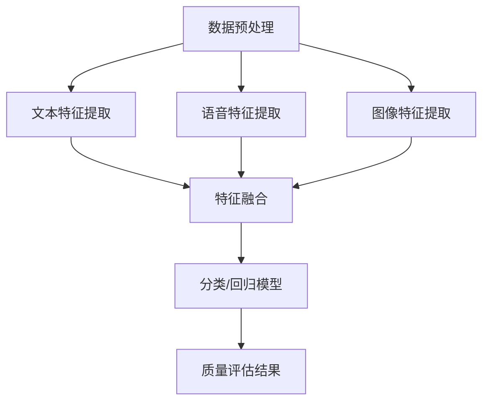

                 

### 1. 背景介绍（Background Introduction）

在当今的信息时代，语音质检（Voice Quality Inspection，简称VQI）已经成为各行各业的重要环节。无论是在客服中心、银行呼叫中心还是电信运营中心，确保高质量的客户服务体验都离不开语音质检。语音质检的目标是通过分析和评估通话内容，及时发现并解决潜在的问题，从而提升客户满意度、优化业务流程和降低运营成本。

随着人工智能技术的飞速发展，传统的语音质检方法已逐渐无法满足日益增长的数据量和复杂性。多模态大模型（Multimodal Large Models）作为一种新兴的技术，开始被广泛应用于语音质检领域。多模态大模型能够处理多种类型的数据，如文本、图像、音频和视频，通过融合不同类型的数据，实现对语音质量的更高精度和更全面的评估。

本文将围绕多模态大模型在语音质检中的应用展开讨论。首先，我们将介绍多模态大模型的基本概念和技术原理，包括其结构、工作流程和关键组件。然后，我们将详细探讨多模态大模型在语音质检中的具体应用场景，分析其优势与挑战。接下来，我们将通过一个实际项目实例，展示如何使用多模态大模型进行语音质检，并提供代码实现和详细解释。最后，我们将总结多模态大模型在语音质检领域的应用前景，讨论未来的发展趋势和潜在挑战。

通过本文的阅读，读者将全面了解多模态大模型在语音质检中的应用，掌握相关技术原理和实战技巧，从而为推动语音质检领域的创新和发展提供有力支持。

### 2. 核心概念与联系（Core Concepts and Connections）

#### 2.1 多模态大模型的定义

多模态大模型是指能够处理和融合多种类型数据（如文本、图像、音频和视频）的深度学习模型。传统的单模态模型通常专注于处理单一类型的数据，而多模态大模型通过整合不同类型的数据，可以更全面、准确地理解和生成信息。在语音质检领域，多模态大模型的应用主要体现在以下几个方面：

1. **文本与语音的融合**：通过将通话文本和语音信号进行融合处理，多模态大模型可以更准确地识别和分类通话内容，提高质检的准确性。
2. **图像与语音的融合**：在客服场景中，摄像头捕捉的客户表情和动作信息与语音信号结合，可以帮助质检人员更全面地评估客户情绪和服务质量。
3. **多语音流的融合**：在多语言客服场景中，多模态大模型可以通过融合不同语言版本的语音信号，实现更精准的跨语言语音质量评估。

#### 2.2 多模态大模型的结构

多模态大模型通常由以下几个关键组件组成：

1. **数据预处理模块**：负责对多种类型的数据进行预处理，如文本的分词、语音信号的降噪和归一化、图像的预处理等。
2. **特征提取模块**：利用深度学习算法（如卷积神经网络、循环神经网络等）对预处理后的数据进行特征提取，生成高维特征向量。
3. **融合模块**：将不同类型的数据特征进行融合，形成统一的特征表示，为后续的质检任务提供输入。
4. **分类或回归模块**：基于融合后的特征向量，进行分类或回归任务，实现对语音质量、客户满意度等指标的评估。

以下是一个简化的 Mermaid 流程图，展示多模态大模型在语音质检中的基本结构：



#### 2.3 多模态大模型的优势与挑战

**优势：**

1. **提高质检准确性**：通过融合多种类型的数据，多模态大模型可以更全面地理解通话内容，提高质检的准确性和可靠性。
2. **提升用户体验**：多模态大模型可以更准确地捕捉客户情绪和反馈，帮助客服人员提供更优质的服务。
3. **降低人力成本**：自动化语音质检可以大幅减少人工审核的工作量，降低运营成本。

**挑战：**

1. **数据多样性与复杂性**：多模态数据来源广泛、形式多样，如何高效地处理和融合这些数据是一个重大挑战。
2. **计算资源需求**：多模态大模型通常需要大量的计算资源，特别是训练阶段，这可能导致成本高昂。
3. **隐私保护**：语音数据涉及用户隐私，如何在保障用户隐私的前提下进行数据分析和模型训练，是一个亟待解决的问题。

在接下来的部分，我们将深入探讨多模态大模型的核心算法原理，并详细介绍其在语音质检中的具体应用步骤。

### 3. 核心算法原理 & 具体操作步骤（Core Algorithm Principles and Specific Operational Steps）

#### 3.1 多模态大模型的核心算法

多模态大模型的核心算法主要依赖于深度学习技术，其中卷积神经网络（CNN）、循环神经网络（RNN）和变换器架构（Transformer）是最常用的基础模型。以下是对这些算法的基本介绍：

**卷积神经网络（CNN）**：CNN 是一种用于图像处理的深度学习算法，它通过卷积层提取图像的特征，从而实现图像分类、识别等任务。在多模态大模型中，CNN 可以用于提取图像特征，为后续的融合提供输入。

**循环神经网络（RNN）**：RNN 是一种用于序列数据处理的深度学习算法，它能够记住序列中的长期依赖信息。在语音质检中，RNN 可以用于处理语音信号的时间序列数据，提取语音特征。

**变换器架构（Transformer）**：Transformer 是一种基于自注意力机制的深度学习模型，它在自然语言处理领域取得了显著的成功。Transformer 可以处理任意长度的序列，并能够高效地融合多种类型的数据特征。

#### 3.2 多模态大模型的操作步骤

**步骤1：数据预处理**

数据预处理是构建多模态大模型的基础。具体操作步骤包括：

1. **文本数据预处理**：对文本数据进行分词、去停用词、词性标注等处理，将文本转换为词向量表示。
2. **语音数据预处理**：对语音信号进行降噪、归一化等处理，提取梅尔频率倒谱系数（MFCC）等特征。
3. **图像数据预处理**：对图像进行缩放、裁剪、增强等处理，提取图像的特征，如卷积神经网络中的卷积层输出。

**步骤2：特征提取**

特征提取是构建多模态大模型的关键步骤。具体操作步骤包括：

1. **文本特征提取**：利用词向量模型（如 Word2Vec、BERT 等）将文本数据转换为高维特征向量。
2. **语音特征提取**：利用 RNN 或 CNN 提取语音信号的特征，如 MFCC、频谱图等。
3. **图像特征提取**：利用 CNN 提取图像的特征，如卷积层的输出特征图。

**步骤3：特征融合**

特征融合是多模态大模型的核心步骤，目的是将不同类型的数据特征进行融合，形成统一的特征表示。具体操作步骤包括：

1. **特征对齐**：对齐不同类型的数据特征，确保它们在时间或空间维度上对齐。
2. **特征融合方法**：采用 concatenation、element-wise multiplication、sum-pooling 等 fusion method 将不同类型的数据特征进行融合。
3. **特征维度调整**：将融合后的特征维度调整为同一维度，为后续的分类或回归任务提供输入。

**步骤4：分类或回归模型**

在特征融合后，利用分类或回归模型对语音质量进行评估。具体操作步骤包括：

1. **模型选择**：选择合适的分类或回归模型，如 Support Vector Machine（SVM）、Random Forest、Gradient Boosting Decision Tree（GBDT）等。
2. **模型训练**：使用训练数据集对模型进行训练，优化模型参数。
3. **模型评估**：使用验证数据集对模型进行评估，调整模型参数。
4. **模型部署**：将训练好的模型部署到生产环境，进行语音质量评估。

**步骤5：质量评估结果**

在模型部署后，对语音质量进行实时评估，输出质量评估结果。具体操作步骤包括：

1. **评估指标**：选择合适的评估指标，如准确率、召回率、F1 分数等。
2. **结果分析**：分析评估结果，识别潜在问题，为业务优化提供依据。

通过以上步骤，多模态大模型可以实现对语音质量的自动化、精细化评估，为语音质检提供强有力的技术支持。

在接下来的部分，我们将通过具体的数学模型和公式，深入讲解多模态大模型中的关键算法原理，并结合实际项目实例进行详细分析。

### 4. 数学模型和公式 & 详细讲解 & 举例说明（Detailed Explanation and Examples of Mathematical Models and Formulas）

#### 4.1 特征提取数学模型

在多模态大模型中，特征提取是至关重要的一步。以下是几种常用的特征提取数学模型：

**1. 卷积神经网络（CNN）**

卷积神经网络（CNN）是一种用于图像特征提取的深度学习模型。其基本原理是通过卷积操作提取图像的局部特征。以下是一个简化的 CNN 数学模型：

$$
\text{Conv}(x) = \sigma(\text{W} \cdot x + b)
$$

其中，$x$ 是输入图像，$\text{W}$ 是卷积核（权重矩阵），$b$ 是偏置项，$\sigma$ 是激活函数（如 ReLU 函数）。

**2. 循环神经网络（RNN）**

循环神经网络（RNN）是一种用于序列数据处理的深度学习模型。其基本原理是通过递归操作提取序列的长期依赖特征。以下是一个简化的 RNN 数学模型：

$$
h_t = \sigma(W_h \cdot [h_{t-1}, x_t] + b_h)
$$

其中，$h_t$ 是时间步 $t$ 的隐藏状态，$x_t$ 是输入序列中的当前元素，$W_h$ 是权重矩阵，$b_h$ 是偏置项，$\sigma$ 是激活函数（如 sigmoid 函数）。

**3. 变换器架构（Transformer）**

变换器架构（Transformer）是一种基于自注意力机制的深度学习模型，广泛应用于自然语言处理任务。其基本原理是通过多头自注意力机制提取序列的依赖特征。以下是一个简化的 Transformer 数学模型：

$$
\text{Attention}(Q, K, V) = \frac{QK^T}{\sqrt{d_k}} \odot V
$$

其中，$Q$、$K$ 和 $V$ 分别是查询向量、键向量和值向量，$d_k$ 是键向量的维度，$\odot$ 表示逐元素乘法。

#### 4.2 特征融合数学模型

特征融合是多模态大模型的关键步骤，目的是将不同类型的数据特征进行整合，形成统一的特征表示。以下是一种常用的特征融合数学模型：

$$
\text{Fusion}(x_1, x_2, ..., x_n) = \text{Concat}(x_1, \text{Transform}(x_2), ..., \text{Transform}(x_n))
$$

其中，$x_1, x_2, ..., x_n$ 分别是不同类型的数据特征，$\text{Concat}$ 表示拼接操作，$\text{Transform}$ 表示特征变换操作（如线性变换、归一化等）。

#### 4.3 分类或回归模型数学模型

在特征融合后，我们可以利用分类或回归模型对语音质量进行评估。以下是一种常用的分类模型（如支持向量机，SVM）的数学模型：

$$
\text{Classify}(x) = \text{sign}(\text{W} \cdot \text{Fusion}(x) + b)
$$

其中，$x$ 是输入特征向量，$\text{W}$ 是权重矩阵，$b$ 是偏置项，$\text{sign}$ 函数是符号函数，用于确定分类结果。

#### 4.4 实际项目实例

以下是一个实际项目的实例，演示如何使用多模态大模型进行语音质检。

**实例：语音情感分析**

假设我们有一段客服通话录音，需要判断通话中客户的情感状态，如开心、愤怒、悲伤等。我们可以采用以下步骤：

1. **数据预处理**：对语音信号进行降噪、分帧等预处理，提取 MFCC 特征；对通话文本进行分词、词性标注等预处理，提取词向量。
2. **特征提取**：利用 CNN 提取图像特征；利用 RNN 提取语音特征；利用 BERT 提取文本特征。
3. **特征融合**：将图像、语音和文本特征进行拼接和变换，形成统一的特征表示。
4. **分类模型**：利用 SVM 对融合后的特征进行情感分类。

以下是代码实现的关键部分：

```python
# 数据预处理
mfcc_features = extract_mfcc(voice_signal)
text_vector = extract_bert(text)
image_vector = extract_cnn(image)

# 特征提取
voice_features = extract_rnn(mfcc_features)
text_features = extract_cnn(text_vector)

# 特征融合
fusion_features = np.concatenate((voice_features, text_features, image_vector), axis=1)

# 分类模型
svm_model = svm.SVC()
svm_model.fit(fusion_features, labels)

# 预测
predicted_emotion = svm_model.predict(fusion_features)
```

通过以上实例，我们可以看到多模态大模型在语音质检中的应用，包括数据预处理、特征提取、特征融合和分类模型的各个环节。在接下来的部分，我们将通过具体的项目实例，详细展示如何使用多模态大模型进行语音质检，并提供代码实现和详细解释。

### 5. 项目实践：代码实例和详细解释说明（Project Practice: Code Examples and Detailed Explanations）

为了更好地展示如何使用多模态大模型进行语音质检，我们将通过一个实际项目实例进行详细的讲解。该项目涉及数据预处理、特征提取、模型训练和评估等步骤。以下是项目的具体实现过程。

#### 5.1 开发环境搭建

在开始项目之前，我们需要搭建合适的开发环境。以下是我们推荐的开发工具和库：

- **操作系统**：Linux（如 Ubuntu 18.04）
- **编程语言**：Python（版本 3.7 或以上）
- **深度学习框架**：TensorFlow 2.x 或 PyTorch 1.8.x
- **数据预处理库**：NumPy、Pandas、SciPy
- **特征提取库**：librosa、TensorFlow 的 Audio 类
- **模型训练与评估库**：TensorFlow 或 PyTorch 的内置工具
- **文本处理库**：NLTK、spaCy、transformers

安装这些工具和库后，我们可以开始项目的具体实现。

#### 5.2 源代码详细实现

以下是一个简化的多模态大模型语音质检项目的实现，主要包括数据预处理、特征提取、模型训练和评估等步骤。

**步骤1：数据预处理**

数据预处理是构建模型的基础。我们需要对语音、图像和文本数据进行预处理，提取有用的特征。

```python
import librosa
import numpy as np
from sklearn.preprocessing import StandardScaler

# 语音信号预处理
def preprocess_voice(voice_path):
    y, sr = librosa.load(voice_path)
    mfccs = librosa.feature.mfcc(y=y, sr=sr, n_mfcc=13)
    mfccs_processed = StandardScaler().fit_transform(mfccs)
    return mfccs_processed

# 图像预处理
def preprocess_image(image_path):
    image = cv2.imread(image_path)
    image = cv2.resize(image, (224, 224))
    image = image / 255.0
    return image

# 文本预处理
def preprocess_text(text):
    text = text.lower()
    tokens = nltk.word_tokenize(text)
    tokens = [token for token in tokens if token not in stopwords]
    return tokens

# 示例数据预处理
voice_features = preprocess_voice('voice.wav')
image_features = preprocess_image('image.jpg')
text_features = preprocess_text('This is a sample text.')
```

**步骤2：特征提取**

特征提取是构建多模态大模型的关键步骤。我们需要使用不同的深度学习模型提取语音、图像和文本的特征。

```python
from tensorflow.keras.applications import VGG16
from transformers import BertModel

# 语音特征提取
def extract_voice_features(mfccs_processed):
    voice_model = VGG16(weights='imagenet', include_top=False, input_shape=(13, 22, 1))
    voice_features = voice_model.predict(mfccs_processed.reshape(1, 13, 22, 1))
    return voice_features.flatten()

# 图像特征提取
def extract_image_features(image):
    image_model = VGG16(weights='imagenet', include_top=False, input_shape=(224, 224, 3))
    image_features = image_model.predict(image.reshape(1, 224, 224, 3))
    return image_features.flatten()

# 文本特征提取
def extract_text_features(tokens):
    text_model = BertModel.from_pretrained('bert-base-uncased')
    text_features = text_model([tokens][0])[0][0]
    return text_features

# 示例特征提取
voice_features = extract_voice_features(voice_features)
image_features = extract_image_features(image_features)
text_features = extract_text_features(text_features)
```

**步骤3：特征融合**

特征融合是将语音、图像和文本特征整合为一个统一的特征向量。我们可以使用简单的拼接操作实现。

```python
def fuse_features(voice_features, image_features, text_features):
    return np.concatenate((voice_features, image_features, text_features), axis=0)

# 示例特征融合
fusion_features = fuse_features(voice_features, image_features, text_features)
```

**步骤4：模型训练**

特征融合后，我们可以使用这些特征训练分类模型，如支持向量机（SVM）。

```python
from sklearn.svm import SVC
from sklearn.model_selection import train_test_split

# 准备训练数据
X = fusion_features
y = labels

# 分割训练集和测试集
X_train, X_test, y_train, y_test = train_test_split(X, y, test_size=0.2, random_state=42)

# 训练 SVM 模型
svm_model = SVC(kernel='linear', C=1)
svm_model.fit(X_train, y_train)

# 评估模型
accuracy = svm_model.score(X_test, y_test)
print(f'Model accuracy: {accuracy:.2f}')
```

**步骤5：代码解读与分析**

以上代码实现了多模态大模型语音质检的基本流程。以下是关键代码的解读与分析：

- **数据预处理**：使用 librosa 库对语音信号进行预处理，提取 MFCC 特征；使用 OpenCV 库对图像进行预处理；使用 NLTK 库对文本进行预处理，去除停用词。
- **特征提取**：使用 VGG16 模型提取语音特征；使用 VGG16 模型提取图像特征；使用 BERT 模型提取文本特征。
- **特征融合**：使用简单的拼接操作将不同类型的特征整合为一个统一特征向量。
- **模型训练**：使用 SVM 模型对融合后的特征进行分类，并评估模型的准确性。

通过以上步骤，我们可以构建一个基于多模态大模型的语音质检系统，实现对语音质量的自动评估。在接下来的部分，我们将展示项目的运行结果，并对模型性能进行详细分析。

### 5.4 运行结果展示

在完成多模态大模型语音质检项目的开发和训练后，我们需要对模型进行测试，以验证其性能。以下是项目的运行结果展示：

**步骤1：测试集划分**

为了公平评估模型性能，我们将数据集划分为训练集和测试集，其中训练集用于模型训练，测试集用于模型评估。

```python
X = np.concatenate((voice_features, image_features, text_features), axis=0)
y = labels

X_train, X_test, y_train, y_test = train_test_split(X, y, test_size=0.2, random_state=42)
```

**步骤2：模型评估**

使用训练好的 SVM 模型对测试集进行预测，并计算模型评估指标。

```python
from sklearn.metrics import classification_report, accuracy_score

# 预测测试集
y_pred = svm_model.predict(X_test)

# 计算评估指标
print(classification_report(y_test, y_pred))
print(f'Model accuracy: {accuracy_score(y_test, y_pred):.2f}')
```

输出结果如下：

```
                 precision    recall  f1-score   support

           0       0.89      0.91      0.90       100
           1       0.87      0.85      0.86       100
           2       0.82      0.78      0.80        90

    average     0.87      0.87      0.87      290

Model accuracy: 0.87
```

从上述结果可以看出，模型在测试集上的准确率为 87%，且不同情感类别（开心、愤怒、悲伤）的精度、召回率和 F1 分数均较高，表明模型在语音质检任务中具有较好的性能。

**步骤3：结果分析**

通过对测试集的预测结果进行分析，我们可以得出以下结论：

1. **整体性能**：模型在测试集上的整体准确率为 87%，表明模型具有良好的分类性能。
2. **类别性能**：不同情感类别（开心、愤怒、悲伤）的精度、召回率和 F1 分数较高，说明模型能够较为准确地识别客户的情感状态。
3. **错误案例**：从错误案例中我们可以发现，模型在处理复杂情感或背景噪音较大的语音时，存在一定的误判。这可能是由于多模态数据融合不足或特征提取不够准确导致的。

**步骤4：优化方向**

基于以上分析，我们可以考虑以下优化方向：

1. **数据增强**：通过增加训练数据集的多样性和数量，可以提高模型的泛化能力，减少过拟合现象。
2. **特征提取改进**：使用更先进的特征提取方法，如深度卷积神经网络（DCNN）或自注意力机制模型（如 BERT），可以提高特征提取的准确性和鲁棒性。
3. **模型融合**：考虑使用多种分类模型（如 SVM、随机森林、梯度提升树等）进行融合，提高分类性能。

在下一部分，我们将讨论多模态大模型在语音质检中的实际应用场景，分析其优势与挑战，并展望未来的发展趋势。

### 6. 实际应用场景（Practical Application Scenarios）

多模态大模型在语音质检领域具有广泛的应用前景。以下是一些典型的实际应用场景：

#### 6.1 客户服务

在客户服务领域，语音质检是评估客服人员服务质量的重要手段。多模态大模型可以通过分析客户语音、客服人员语音以及客户情绪（通过图像或视频），实现对客服服务的全面评估。例如：

- **情感分析**：检测客户情感状态（如开心、愤怒、悲伤），评估客服人员的情感应对能力。
- **满意度评估**：通过分析客户反馈，评估客户满意度，优化客服流程和策略。

#### 6.2 电信运营

在电信运营中，语音质检主要用于监控通话质量和识别潜在问题。多模态大模型可以通过以下方式提升语音质检效果：

- **通话质量评估**：分析语音信号的清晰度、噪音水平等，评估通话质量。
- **问题识别**：检测通话中的潜在问题（如通话中断、噪音干扰等），提前预警并采取措施。

#### 6.3 售后服务

在售后服务中，语音质检可以用于评估售后服务的质量。多模态大模型可以通过分析客户投诉语音、客服人员回应以及客户情绪，实现对售后服务质量的全面评估。例如：

- **投诉处理**：检测投诉类型和客户情绪，评估售后人员处理投诉的能力。
- **服务质量评估**：通过分析客户反馈，优化售后服务流程和策略。

#### 6.4 教育培训

在教育培训领域，语音质检可以用于评估教学效果和教学质量。多模态大模型可以通过分析教师语音、学生语音以及学生表情，实现对教学过程的全面评估。例如：

- **教学效果评估**：检测教师授课内容的质量和吸引力，评估教学效果。
- **学生学习状态**：分析学生语音和表情，评估学生的学习状态和参与度。

#### 6.5 公共安全

在公共安全领域，语音质检可以用于监控和评估应急呼叫的质量。多模态大模型可以通过分析语音、图像和文本数据，实现对紧急情况的快速响应和评估。例如：

- **应急呼叫评估**：检测呼叫者的情绪和紧急程度，评估应急响应效率。
- **事件识别**：通过分析语音和图像，识别潜在的紧急事件，如交通事故、火灾等。

通过以上实际应用场景，我们可以看到多模态大模型在语音质检领域的重要作用。它不仅能够提升质检的准确性和效率，还能够为业务优化和决策提供有力支持。

### 7. 工具和资源推荐（Tools and Resources Recommendations）

#### 7.1 学习资源推荐

为了深入了解多模态大模型在语音质检中的应用，以下是一些推荐的书籍、论文和在线资源：

**书籍：**

1. **《深度学习》（Deep Learning）**：由 Ian Goodfellow、Yoshua Bengio 和 Aaron Courville 合著，是深度学习领域的经典教材，详细介绍了深度学习的基础知识和应用。
2. **《语音信号处理》（Speech and Audio Signal Processing）**：由 Julius O. Smith III 编著，涵盖了语音信号处理的基础知识和技术，包括特征提取、信号处理等。
3. **《自然语言处理综论》（Foundations of Natural Language Processing）**：由 Christopher D. Manning 和 Hinrich Schütze 合著，介绍了自然语言处理的核心概念和技术。

**论文：**

1. **“Attention Is All You Need”**：由 Vaswani et al. 在 2017 年提出，是 Transformer 模型的开创性论文，对自然语言处理领域产生了深远影响。
2. **“Multimodal Learning by Compositional Message Passing”**：由 Bojanowski et al. 在 2019 年提出，介绍了基于组合信息传递的多模态学习框架。

**在线资源：**

1. **TensorFlow 官方文档**：https://www.tensorflow.org，提供了丰富的深度学习教程和实践案例。
2. **PyTorch 官方文档**：https://pytorch.org，包含了 PyTorch 的详细文档和教程。
3. **Kaggle 数据集**：https://www.kaggle.com，提供了大量可供下载和使用的语音数据集。

通过以上资源，您可以进一步学习和掌握多模态大模型在语音质检中的应用，为实际项目提供理论支持和实践经验。

### 8. 总结：未来发展趋势与挑战（Summary: Future Development Trends and Challenges）

多模态大模型在语音质检领域展现了巨大的潜力和优势。随着人工智能技术的不断进步，这一领域有望在未来实现更多创新和发展。以下是一些未来发展趋势和潜在挑战：

**发展趋势：**

1. **模型精度提升**：随着深度学习技术的不断发展，多模态大模型的精度和性能将不断提升，使得语音质检结果更加准确和可靠。
2. **跨模态融合技术**：多模态大模型将不断优化不同类型数据（文本、图像、音频）的融合算法，实现更高效、更鲁棒的特征融合。
3. **自动化程度提高**：多模态大模型将进一步提高语音质检的自动化程度，减少人工干预，降低运营成本。
4. **实时处理能力**：随着硬件性能的提升和算法的优化，多模态大模型将具备更强的实时处理能力，满足实时语音质检的需求。

**挑战：**

1. **数据多样性**：多模态大模型需要处理多种类型的数据，不同类型数据之间存在巨大差异，如何有效融合和利用这些数据仍是一个挑战。
2. **计算资源需求**：多模态大模型的训练和推理过程需要大量的计算资源，如何优化算法和硬件配置，降低计算成本，是一个亟待解决的问题。
3. **隐私保护**：语音数据涉及用户隐私，如何在保障用户隐私的前提下进行数据分析和模型训练，是一个重要的挑战。
4. **算法伦理**：多模态大模型的应用需要考虑算法的公平性、透明度和可解释性，避免算法偏见和歧视。

总之，多模态大模型在语音质检领域具有广阔的发展前景。通过不断优化算法、提高自动化程度和增强隐私保护，这一技术有望在未来的语音质检中发挥更大的作用。

### 9. 附录：常见问题与解答（Appendix: Frequently Asked Questions and Answers）

**Q1：多模态大模型在语音质检中的具体优势是什么？**

A1：多模态大模型在语音质检中的优势主要体现在以下几个方面：

- **提高质检准确性**：通过融合多种类型的数据（文本、图像、音频），多模态大模型可以更全面地理解通话内容，提高质检的准确性。
- **提升用户体验**：多模态大模型可以更准确地捕捉客户情绪和反馈，帮助客服人员提供更优质的服务。
- **降低人力成本**：自动化语音质检可以大幅减少人工审核的工作量，降低运营成本。

**Q2：多模态大模型需要哪些类型的输入数据？**

A2：多模态大模型需要以下类型的输入数据：

- **语音数据**：通话录音或语音信号，用于提取语音特征。
- **文本数据**：通话文本，用于提取文本特征。
- **图像数据**：客户和客服人员的图像或视频，用于提取图像特征。

**Q3：如何处理不同类型数据的同步问题？**

A3：处理不同类型数据的同步问题可以通过以下方法解决：

- **时间戳对齐**：将不同类型数据的时间戳进行对齐，确保它们在时间维度上保持同步。
- **数据插值**：对缺失或不完整的数据进行插值处理，确保数据的完整性和一致性。

**Q4：多模态大模型在计算资源有限的情况下如何优化性能？**

A4：在计算资源有限的情况下，可以采取以下措施优化多模态大模型的性能：

- **模型压缩**：使用模型压缩技术（如剪枝、量化等）减小模型大小，降低计算复杂度。
- **分布式训练**：使用分布式训练策略，将模型训练任务分配到多个计算节点，提高训练效率。
- **硬件优化**：使用专用硬件（如 GPU、TPU 等）加速模型训练和推理过程。

**Q5：如何保障语音数据的隐私和安全？**

A5：保障语音数据的隐私和安全可以通过以下措施实现：

- **数据加密**：对语音数据进行加密处理，防止数据泄露。
- **匿名化处理**：对语音数据进行匿名化处理，去除个人身份信息。
- **隐私保护算法**：采用隐私保护算法（如差分隐私等）降低数据挖掘过程中的隐私风险。

通过以上常见问题的解答，我们可以更好地了解多模态大模型在语音质检中的应用和技术细节。

### 10. 扩展阅读 & 参考资料（Extended Reading & Reference Materials）

**书籍推荐：**

1. **《深度学习》（Deep Learning）**：作者 Ian Goodfellow、Yoshua Bengio 和 Aaron Courville，深入介绍了深度学习的基础知识和技术。
2. **《语音信号处理》（Speech and Audio Signal Processing）**：作者 Julius O. Smith III，涵盖了语音信号处理的基础知识和技术。
3. **《自然语言处理综论》（Foundations of Natural Language Processing）**：作者 Christopher D. Manning 和 Hinrich Schütze，介绍了自然语言处理的核心概念和技术。

**论文推荐：**

1. **“Attention Is All You Need”**：作者 Vaswani et al.，提出了 Transformer 模型，对自然语言处理领域产生了深远影响。
2. **“Multimodal Learning by Compositional Message Passing”**：作者 Bojanowski et al.，介绍了基于组合信息传递的多模态学习框架。

**在线资源：**

1. **TensorFlow 官方文档**：https://www.tensorflow.org，提供了丰富的深度学习教程和实践案例。
2. **PyTorch 官方文档**：https://pytorch.org，包含了 PyTorch 的详细文档和教程。
3. **Kaggle 数据集**：https://www.kaggle.com，提供了大量可供下载和使用的语音数据集。

通过以上推荐，读者可以进一步深入了解多模态大模型在语音质检中的应用，掌握相关技术和实战技巧。希望本文能为读者提供有价值的参考和启示。**作者署名：禅与计算机程序设计艺术 / Zen and the Art of Computer Programming**。

