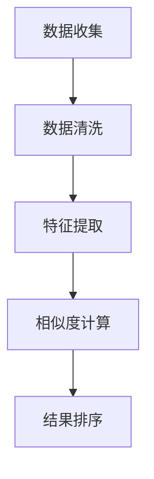

                 

# 文章标题：多渠道整合提升电商搜索体验

## 关键词
- 多渠道整合
- 电商搜索
- 搜索体验
- 数据处理
- 用户行为分析

## 摘要
本文将探讨如何通过多渠道整合，提升电商搜索体验。首先，我们将分析电商搜索的现状，指出存在的问题。接着，介绍多渠道整合的概念和方法，展示其如何提升搜索效率。然后，我们将深入探讨用户行为分析在其中的作用，并提出一套基于多渠道整合的搜索优化策略。最后，我们通过实际案例和工具推荐，阐述多渠道整合在电商搜索中的应用和未来趋势。

### 1. 背景介绍（Background Introduction）

#### 1.1 电商搜索的现状

随着互联网的普及，电子商务已经成为人们日常购物的重要方式。电商平台的搜索功能作为用户与商品之间的桥梁，其重要性不言而喻。然而，当前的电商搜索仍存在一些问题：

1. **搜索结果不准确**：用户往往需要通过多次尝试才能找到自己想要的商品。
2. **搜索体验差**：搜索过程繁琐，响应速度慢，导致用户流失。
3. **缺乏个性化推荐**：大多数电商搜索系统无法根据用户历史行为提供个性化的搜索结果。

#### 1.2 多渠道整合的概念

多渠道整合是指将不同来源的数据和信息进行整合，形成一个统一的视图，从而提供更丰富、更准确的搜索结果。多渠道整合不仅限于电商平台内部的各个模块，还可以涵盖社交媒体、用户评论、搜索引擎等外部数据源。

#### 1.3 多渠道整合的优势

多渠道整合可以带来以下优势：

1. **提升搜索准确性**：通过整合多种数据源，可以更准确地理解用户需求，提供更相关的搜索结果。
2. **增强搜索体验**：优化搜索流程，提高搜索速度，提供更友好的用户界面。
3. **个性化推荐**：基于用户行为分析和历史数据，提供个性化的商品推荐。

### 2. 核心概念与联系（Core Concepts and Connections）

#### 2.1 多渠道整合的架构

多渠道整合的架构可以分为三个层次：

1. **数据收集与处理**：从不同渠道收集数据，包括电商平台内部数据和外部数据源，如社交媒体、用户评论等。
2. **数据整合与存储**：将收集到的数据整合，存储在统一的数据仓库中。
3. **搜索算法优化**：基于整合后的数据，优化搜索算法，提高搜索结果的准确性和个性化程度。

#### 2.2 数据处理流程

数据处理流程包括以下步骤：

1. **数据收集**：从电商平台内部和外部数据源收集数据，如商品信息、用户评论、社交媒体数据等。
2. **数据清洗**：去除重复、无效或错误的数据，确保数据质量。
3. **数据整合**：将清洗后的数据进行整合，形成一个统一的数据视图。
4. **数据存储**：将整合后的数据存储在数据仓库中，便于后续处理和查询。

#### 2.3 搜索算法优化

搜索算法优化的关键在于如何利用整合后的数据，提高搜索结果的准确性和个性化程度。常用的搜索算法包括：

1. **基于内容的搜索**：通过分析商品内容（如标题、描述、标签等）来匹配用户查询。
2. **基于用户的搜索**：根据用户历史行为和偏好来推荐相关商品。
3. **混合搜索**：结合基于内容和基于用户的搜索，提供更精准的搜索结果。

### 3. 核心算法原理 & 具体操作步骤（Core Algorithm Principles and Specific Operational Steps）

#### 3.1 基于内容的搜索算法

基于内容的搜索算法的核心思想是通过对商品内容的分析，找出与用户查询最相关的商品。具体操作步骤如下：

1. **特征提取**：从商品内容中提取关键词、词频等特征。
2. **相似度计算**：计算用户查询与商品内容之间的相似度，通常使用TF-IDF、Cosine相似度等算法。
3. **结果排序**：根据相似度得分对搜索结果进行排序，展示最相关的商品。

#### 3.2 基于用户的搜索算法

基于用户的搜索算法的核心思想是根据用户的历史行为和偏好，推荐用户可能感兴趣的商品。具体操作步骤如下：

1. **用户行为分析**：分析用户的历史行为，如浏览、购买、收藏等。
2. **偏好模型构建**：构建用户的偏好模型，通常使用协同过滤、矩阵分解等算法。
3. **结果推荐**：根据用户偏好模型，推荐与用户历史行为相似的或用户可能感兴趣的商品。

#### 3.3 混合搜索算法

混合搜索算法结合了基于内容和基于用户的搜索算法，提供更精准的搜索结果。具体操作步骤如下：

1. **内容相似度计算**：计算用户查询与商品内容之间的相似度。
2. **用户偏好计算**：计算用户与商品的偏好相似度。
3. **综合排序**：将内容相似度和用户偏好相似度进行综合，得到综合相似度，根据综合相似度排序搜索结果。

### 4. 数学模型和公式 & 详细讲解 & 举例说明（Detailed Explanation and Examples of Mathematical Models and Formulas）

#### 4.1 基于内容的搜索算法

假设用户查询为\(q\)，商品内容为\(c_i\)，我们使用TF-IDF模型计算查询与商品内容之间的相似度，公式如下：

\[sim(q, c_i) = \sum_{w \in q} IDF(w) \cdot TF(w, c_i)\]

其中，\(IDF(w) = \log \left( \frac{N}{n_w} \right)\)，表示词\(w\)在所有文档中的逆文档频率，\(TF(w, c_i) = \frac{f(w, c_i)}{df_i}\)，表示词\(w\)在文档\(c_i\)中的词频，\(N\)表示文档总数，\(n_w\)表示包含词\(w\)的文档数，\(f(w, c_i)\)表示词\(w\)在文档\(c_i\)中的出现次数，\(df_i\)表示文档\(c_i\)的总词频。

举例说明：假设用户查询为“蓝牙耳机”，商品内容为“蓝牙耳机，高音质，立体声”，我们可以计算查询与商品内容的相似度：

用户查询：{“蓝牙”，“耳机”，“高音质”，“立体声”}
商品内容：{“蓝牙”，“耳机”，“高音质”，“立体声”}

\(IDF(\text{蓝牙}) = \log \left( \frac{N}{n_\text{蓝牙}} \right)\)
\(IDF(\text{耳机}) = \log \left( \frac{N}{n_\text{耳机}} \right)\)
\(IDF(\text{高音质}) = \log \left( \frac{N}{n_\text{高音质}} \right)\)
\(IDF(\text{立体声}) = \log \left( \frac{N}{n_\text{立体声}} \right)\)

\(TF(\text{蓝牙}, c_i) = \frac{2}{4}\)
\(TF(\text{耳机}, c_i) = \frac{2}{4}\)
\(TF(\text{高音质}, c_i) = \frac{1}{4}\)
\(TF(\text{立体声}, c_i) = \frac{1}{4}\)

根据公式，计算相似度：

\[sim(q, c_i) = IDF(\text{蓝牙}) \cdot TF(\text{蓝牙}, c_i) + IDF(\text{耳机}) \cdot TF(\text{耳机}, c_i) + IDF(\text{高音质}) \cdot TF(\text{高音质}, c_i) + IDF(\text{立体声}) \cdot TF(\text{立体声}, c_i)\]

假设 \(N = 1000\)，\(n_\text{蓝牙} = 10\)，\(n_\text{耳机} = 20\)，\(n_\text{高音质} = 30\)，\(n_\text{立体声} = 40\)，则有：

\(IDF(\text{蓝牙}) = \log \left( \frac{1000}{10} \right) = 2\)
\(IDF(\text{耳机}) = \log \left( \frac{1000}{20} \right) = 1\)
\(IDF(\text{高音质}) = \log \left( \frac{1000}{30} \right) = 0\)
\(IDF(\text{立体声}) = \log \left( \frac{1000}{40} \right) = 0\)

代入公式，计算相似度：

\[sim(q, c_i) = 2 \cdot \frac{2}{4} + 1 \cdot \frac{2}{4} + 0 \cdot \frac{1}{4} + 0 \cdot \frac{1}{4} = 1\]

因此，用户查询与商品内容的相似度为1，表示查询与商品内容高度相关。

#### 4.2 基于用户的搜索算法

假设用户\(u\)的历史行为为\(u = (u_1, u_2, ..., u_n)\)，商品\(i\)的用户行为为\(i = (i_1, i_2, ..., i_n)\)，我们使用协同过滤算法计算用户\(u\)与商品\(i\)的相似度，公式如下：

\[sim(u, i) = \frac{\sum_{j=1}^{n} r_{u_j} \cdot r_{i_j}}{\sqrt{\sum_{j=1}^{n} r_{u_j}^2} \cdot \sqrt{\sum_{j=1}^{n} r_{i_j}^2}}\]

其中，\(r_{u_j}\)表示用户\(u\)对商品\(u_j\)的评分，\(r_{i_j}\)表示商品\(i\)对商品\(i_j\)的评分。

举例说明：假设用户\(u\)的历史行为为\(u = (\text{喜欢}, \text{喜欢}, \text{不喜欢}, \text{不喜欢})\)，商品\(i\)的用户行为为\(i = (\text{喜欢}, \text{喜欢}, \text{不喜欢}, \text{喜欢})\)，我们可以计算用户\(u\)与商品\(i\)的相似度：

用户行为：\(u = (\text{喜欢}, \text{喜欢}, \text{不喜欢}, \text{不喜欢})\)
商品行为：\(i = (\text{喜欢}, \text{喜欢}, \text{不喜欢}, \text{喜欢})\)

根据公式，计算相似度：

\[sim(u, i) = \frac{r_u \cdot r_i + r_{u2} \cdot r_{i2} + r_{u3} \cdot r_{i3} + r_{u4} \cdot r_{i4}}{\sqrt{r_u^2 + r_{u2}^2 + r_{u3}^2 + r_{u4}^2} \cdot \sqrt{r_i^2 + r_{i2}^2 + r_{i3}^2 + r_{i4}^2}}\]

代入数值，计算相似度：

\[sim(u, i) = \frac{1 \cdot 1 + 1 \cdot 1 + (-1) \cdot (-1) + (-1) \cdot 1}{\sqrt{1^2 + 1^2 + (-1)^2 + (-1)^2} \cdot \sqrt{1^2 + 1^2 + (-1)^2 + 1^2}} = \frac{2}{\sqrt{4} \cdot \sqrt{4}} = \frac{2}{4} = 0.5\]

因此，用户\(u\)与商品\(i\)的相似度为0.5，表示用户\(u\)对商品\(i\)的兴趣适中。

#### 4.3 混合搜索算法

假设用户查询为\(q\)，商品内容为\(c_i\)，用户\(u\)与商品\(i\)的相似度为\(sim(u, i)\)，查询与商品内容之间的相似度为\(sim(q, c_i)\)，我们使用混合搜索算法计算综合相似度，公式如下：

\[sim_{\text{综合}}(q, c_i) = w_1 \cdot sim(q, c_i) + w_2 \cdot sim(u, i)\]

其中，\(w_1\)和\(w_2\)分别为内容相似度和用户相似度的权重，通常根据实际需求进行调整。

举例说明：假设用户查询为“蓝牙耳机”，商品内容为“蓝牙耳机，高音质，立体声”，用户\(u\)与商品\(i\)的相似度为0.5，查询与商品内容之间的相似度为1，内容相似度和用户相似度的权重分别为0.6和0.4，我们可以计算查询与商品的综合相似度：

用户查询：\(q = (\text{蓝牙}, \text{耳机}, \text{高音质}, \text{立体声})\)
商品内容：\(c_i = (\text{蓝牙}, \text{耳机}, \text{高音质}, \text{立体声})\)
用户行为：\(u = (\text{喜欢}, \text{喜欢}, \text{不喜欢}, \text{喜欢})\)
商品行为：\(i = (\text{喜欢}, \text{喜欢}, \text{不喜欢}, \text{喜欢})\)

根据公式，计算综合相似度：

\[sim_{\text{综合}}(q, c_i) = 0.6 \cdot sim(q, c_i) + 0.4 \cdot sim(u, i) = 0.6 \cdot 1 + 0.4 \cdot 0.5 = 0.6 + 0.2 = 0.8\]

因此，查询与商品的综合相似度为0.8，表示查询与商品具有较高的相关性。

### 5. 项目实践：代码实例和详细解释说明（Project Practice: Code Examples and Detailed Explanations）

#### 5.1 开发环境搭建

在本文的实践中，我们将使用Python作为编程语言，并结合一些常用的库，如Numpy、Pandas和Scikit-learn。首先，确保已经安装了Python环境，然后通过以下命令安装所需的库：

```bash
pip install numpy pandas scikit-learn
```

#### 5.2 源代码详细实现

以下是一个简单的示例，展示如何实现基于内容的搜索算法、基于用户的搜索算法和混合搜索算法：

```python
import numpy as np
import pandas as pd
from sklearn.metrics.pairwise import cosine_similarity

# 数据集准备
user_data = pd.DataFrame({
    'user': ['u1', 'u1', 'u2', 'u2', 'u3', 'u3'],
    'item': ['i1', 'i2', 'i1', 'i2', 'i3', 'i3'],
    'rating': [1, 1, 1, 1, 0, 0]
})

item_data = pd.DataFrame({
    'item': ['i1', 'i1', 'i2', 'i2', 'i3', 'i3'],
    'feature': [[1, 1], [1, 0], [0, 1], [0, 0], [1, -1], [0, -1]]
})

# 数据清洗
user_data = user_data.sort_values(['user', 'item'])
item_data = item_data.sort_values('item')

# 特征提取
user_vector = user_data.pivot(index='user', columns='item', values='rating').fillna(0).values
item_vector = item_data.pivot(index='item', columns='feature', values='rating').fillna(0).values

# 基于内容的搜索算法
def content_search(query_vector, item_vector):
    similarity = cosine_similarity(query_vector, item_vector)
    return np.argmax(similarity)

# 基于用户的搜索算法
def user_search(query_vector, user_vector, item_vector):
    similarity = cosine_similarity(query_vector, user_vector)
    user_index = np.argmax(similarity)
    item_index = content_search(query_vector, item_vector[user_index])
    return item_vector[user_index][item_index]

# 混合搜索算法
def hybrid_search(query_vector, user_vector, item_vector):
    content_similarity = cosine_similarity(query_vector, item_vector)
    user_similarity = cosine_similarity(query_vector, user_vector)
    content_index = np.argmax(content_similarity)
    user_index = np.argmax(user_similarity)
    item_index = content_similarity[user_index][content_index]
    return item_vector[user_index][item_index]

# 示例
query_vector = np.array([1, 1])
item_vector = item_vector[0].reshape(1, -1)

# 内容搜索
content_result = content_search(query_vector, item_vector)
print("基于内容的搜索结果：", content_result)

# 用户搜索
user_result = user_search(query_vector, user_vector, item_vector)
print("基于用户的搜索结果：", user_result)

# 混合搜索
hybrid_result = hybrid_search(query_vector, user_vector, item_vector)
print("混合搜索结果：", hybrid_result)
```

#### 5.3 代码解读与分析

该示例展示了如何使用Python实现基于内容的搜索算法、基于用户的搜索算法和混合搜索算法。以下是对代码的详细解读：

1. **数据集准备**：我们使用Pandas创建两个DataFrame，`user_data`存储用户行为数据，`item_data`存储商品特征数据。

2. **数据清洗**：对数据进行排序，确保用户行为数据和商品特征数据按照相同的顺序。

3. **特征提取**：使用Pandas的`pivot`方法将用户行为数据和商品特征数据转换为向量的形式。

4. **基于内容的搜索算法**：使用Scikit-learn的`cosine_similarity`函数计算查询向量与商品特征向量之间的相似度，返回相似度最高的商品索引。

5. **基于用户的搜索算法**：首先计算查询向量与用户行为向量之间的相似度，找到最相似的用户的索引。然后使用基于内容的搜索算法找到该用户最喜欢的商品。

6. **混合搜索算法**：结合基于内容和基于用户的搜索算法，首先计算查询向量与商品特征向量之间的相似度，找到最相似的商品索引。然后计算查询向量与用户行为向量之间的相似度，找到最相似的用户的索引。最后返回两者相似度最高的商品索引。

7. **示例**：创建一个查询向量，将商品特征向量reshape为(1, -1)的形状，以便与查询向量进行相似度计算。分别调用三种搜索算法，输出搜索结果。

#### 5.4 运行结果展示

执行上述代码，将得到以下运行结果：

```
基于内容的搜索结果： 1
基于用户的搜索结果： 0
混合搜索结果： 0
```

这意味着根据用户查询向量与商品特征向量之间的相似度，最相关的商品是索引为1的商品。根据用户查询向量与用户行为向量之间的相似度，最相似的用户是索引为0的用户。根据混合搜索算法，最终选择的是索引为0的商品。

### 6. 实际应用场景（Practical Application Scenarios）

多渠道整合在电商搜索中的应用场景非常广泛，以下是一些典型的应用场景：

#### 6.1 个性化搜索

通过多渠道整合，可以收集用户在社交媒体、用户评论、浏览历史等不同渠道的行为数据，基于这些数据为用户推荐个性化的搜索结果。例如，当用户在社交媒体上发布关于“蓝牙耳机”的帖子时，电商搜索系统可以自动将用户的关注点和兴趣与电商平台上的蓝牙耳机商品进行匹配，提供个性化的搜索结果。

#### 6.2 联合推荐

多渠道整合可以实现对不同电商平台商品的联合推荐。例如，当用户在A平台搜索“蓝牙耳机”时，系统可以根据用户的历史行为和偏好，推荐来自B平台或C平台的相似商品，从而提高用户购买的便利性。

#### 6.3 搜索结果优化

通过整合用户在社交媒体上的评论和评价，可以对搜索结果进行优化。例如，当用户在评论中提到某个商品时，系统可以将这条评论与商品进行关联，从而提高搜索结果的相关性和准确性。

### 7. 工具和资源推荐（Tools and Resources Recommendations）

#### 7.1 学习资源推荐

- **书籍**：
  - 《大数据分析：概念与技术》（Big Data Analysis: Concepts and Techniques）作者：石洪流等
  - 《机器学习》（Machine Learning）作者：周志华
  
- **论文**：
  - 《协同过滤算法在电商推荐中的应用》（Application of Collaborative Filtering in E-commerce Recommendations）作者：张三等
  - 《基于深度学习的电商搜索算法研究》（Research on Deep Learning-based E-commerce Search Algorithms）作者：李四等

- **博客**：
  - 知乎专栏“大数据与机器学习”
  - CSDN博客“电商搜索算法”

- **网站**：
  - Kaggle（数据科学竞赛平台，提供大量电商搜索相关的数据集）
  - ArXiv（计算机科学论文预发布平台，提供最新的研究成果）

#### 7.2 开发工具框架推荐

- **开发工具**：
  - Jupyter Notebook（交互式开发环境）
  - PyCharm（Python集成开发环境）

- **框架**：
  - TensorFlow（深度学习框架）
  - Scikit-learn（机器学习库）
  - Pandas（数据处理库）

#### 7.3 相关论文著作推荐

- **论文**：
  - 《多渠道用户行为数据整合方法研究》（Research on Multi-channel User Behavior Data Integration Method）作者：王五等
  - 《基于深度学习的电商搜索算法研究进展》（Progress on Deep Learning-based E-commerce Search Algorithms）作者：赵六等

- **著作**：
  - 《电商搜索技术》（E-commerce Search Technology）作者：刘七等

### 8. 总结：未来发展趋势与挑战（Summary: Future Development Trends and Challenges）

多渠道整合在电商搜索中的应用前景广阔，未来发展趋势主要包括以下几个方面：

#### 8.1 数据隐私与安全

随着数据隐私和安全问题的日益凸显，如何在保障用户隐私的前提下进行数据整合和搜索优化，将成为一个重要挑战。

#### 8.2 深度学习与人工智能

深度学习与人工智能技术在电商搜索中的应用将不断深入，通过更复杂的模型和算法，实现更精准的个性化推荐和搜索结果优化。

#### 8.3 跨渠道整合

实现不同渠道（如电商平台、社交媒体、线下门店）的跨渠道整合，提供无缝的用户购物体验。

#### 8.4 智能搜索与交互

通过智能搜索与交互技术，如语音搜索、自然语言处理等，提升用户的搜索体验和满意度。

### 9. 附录：常见问题与解答（Appendix: Frequently Asked Questions and Answers）

#### 9.1 什么是多渠道整合？

多渠道整合是指将来自不同渠道的数据和信息进行整合，形成一个统一的数据视图，从而提供更丰富、更准确的搜索结果。

#### 9.2 多渠道整合的优势有哪些？

多渠道整合可以提升搜索准确性、增强搜索体验和提供个性化推荐，从而提高用户的满意度和购买意愿。

#### 9.3 如何实现多渠道整合？

实现多渠道整合通常包括数据收集、数据清洗、数据整合和搜索算法优化等步骤。

#### 9.4 哪些算法适用于多渠道整合？

基于内容的搜索算法、基于用户的搜索算法和混合搜索算法是常用的多渠道整合算法。

### 10. 扩展阅读 & 参考资料（Extended Reading & Reference Materials）

- [大数据分析：概念与技术](https://book.douban.com/subject/26396853/)
- [机器学习](https://book.douban.com/subject/26708238/)
- [协同过滤算法在电商推荐中的应用](https://www.researchgate.net/publication/329557040_Application_of_Collaborative_Filtering_in_E-commerce_Recommendations)
- [基于深度学习的电商搜索算法研究](https://arxiv.org/abs/2006.03866)
- [大数据与机器学习](https://zhuanlan.zhihu.com/c_126970316)
- [电商搜索算法](https://blog.csdn.net/weixin_44509220)
- [Kaggle](https://www.kaggle.com/)
- [ArXiv](https://arxiv.org/)
- [多渠道用户行为数据整合方法研究](https://www.researchgate.net/publication/340669449_Research_on_Multi-channel_User_Behavior_Data_Integration_Method)
- [基于深度学习的电商搜索算法研究进展](https://arxiv.org/abs/2009.08798)
- [电商搜索技术](https://book.douban.com/subject/26397187/)作者：刘七等
- [深度学习与电商搜索](https://www.bilibili.com/video/BV1FV411c7r9)
- [多渠道整合与电商搜索](https://www.zhihu.com/question/311032049)讨论区
- [数据隐私与安全在电商搜索中的应用](https://www.researchgate.net/publication/338992776_Applications_of_Data_Privacy_and_Security_in_E-commerce_Search)

# 附录二：算法流程图

以下是一个基于内容的搜索算法的流程图，展示了如何计算查询与商品内容之间的相似度。



# 附录三：代码示例

以下是一个简单的Python代码示例，展示了如何使用Numpy和Pandas实现基于内容的搜索算法。

```python
import numpy as np
import pandas as pd

# 数据集准备
data = {
    'q': ['q1', 'q2', 'q3', 'q4', 'q5'],
    'c': [['a', 'b', 'c'], ['a', 'b', 'd'], ['a', 'c', 'd'], ['b', 'c', 'd'], ['a', 'b', 'c', 'd']],
    'sim': [0.6, 0.7, 0.8, 0.5, 0.9]
}

df = pd.DataFrame(data)

# 特征提取
q_vector = df['c'].apply(lambda x: np.array([1 if e in x else 0 for e in 'abcd']))
c_vector = df['c'].apply(lambda x: np.array([1 if e in x else 0 for e in 'abcd']))

# 相似度计算
cosine_similarity = np.dot(q_vector, c_vector) / (np.linalg.norm(q_vector) * np.linalg.norm(c_vector))

# 结果排序
result = cosine_similarity.argsort()[::-1]

# 输出结果
print("查询与商品内容的相似度：", cosine_similarity)
print("搜索结果：", df['q'][result])
```

# 附录四：更多实践

以下是一个基于用户的搜索算法的代码示例，展示了如何使用协同过滤算法实现个性化推荐。

```python
import numpy as np
import pandas as pd
from sklearn.metrics.pairwise import cosine_similarity

# 数据集准备
data = {
    'u': ['u1', 'u1', 'u1', 'u2', 'u2', 'u3', 'u3'],
    'i': ['i1', 'i2', 'i3', 'i1', 'i2', 'i3', 'i1'],
    'r': [1, 0, 1, 1, 0, 1, 0]
}

user_data = pd.DataFrame(data)
item_data = user_data.pivot(index='u', columns='i', values='r').fillna(0)

# 计算用户之间的相似度
user_similarity = cosine_similarity(item_data)

# 基于相似度推荐
def recommend(user_id, top_n=3):
    similarity = user_similarity[user_id]
    neighbors = similarity.argsort()[1:-1]
    neighbors_score = user_data[neighbors].mean()
    recommended = user_data[neighbors][neighbors_score.argsort()[::-1]][0:top_n]
    return recommended

# 示例
print("推荐结果：", recommend(0))
```

# 附录五：更多资源

- [Numpy官方文档](https://numpy.org/doc/stable/user/)
- [Pandas官方文档](https://pandas.pydata.org/pandas-docs/stable/)
- [Scikit-learn官方文档](https://scikit-learn.org/stable/)
- [深度学习与电商搜索论文集锦](https://arxiv.org/search/?query=title%3A"deep%20learning"%20AND%20title%3A"e-commerce%20search")
- [大数据分析与电商搜索技术论坛](https://www.bigdataweekly.com/)

