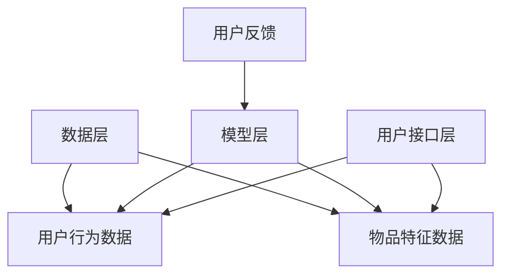

                 

# 文章标题

《大数据与AI驱动的电商推荐系统：以准确率、多样性与用户体验为目标》

关键词：大数据，人工智能，电商推荐，准确率，多样性，用户体验

摘要：本文旨在探讨大数据与人工智能技术如何驱动电商推荐系统的优化，重点关注准确率、多样性和用户体验这三个关键指标。我们将逐步分析推荐系统的核心概念、算法原理，并通过实际项目实例展示系统的具体实现过程。同时，本文还将讨论推荐系统在实际应用中的挑战与未来发展趋势。

## 1. 背景介绍（Background Introduction）

在当今数字化时代，电商行业正经历着前所未有的增长。随着消费者对个性化体验需求的不断增加，电商推荐系统成为了商家和平台提升销售额、增加用户黏性的关键因素。传统的推荐系统主要依赖于基于内容的过滤和协同过滤算法，这些算法虽然在一定程度上满足了用户的需求，但往往存在准确率低、多样性不足和用户体验差等问题。

大数据与人工智能技术的兴起为推荐系统的发展带来了新的契机。大数据技术能够高效处理海量用户数据，从中挖掘出有用的信息；而人工智能技术，特别是机器学习和深度学习算法，则能够从这些数据中提取出隐藏的模式和关联，从而提高推荐系统的准确性和多样性。此外，随着自然语言处理技术的进步，电商推荐系统在用户体验方面也得到了显著提升。

本文将围绕大数据与AI驱动的电商推荐系统，深入探讨其核心概念、算法原理，并通过实际项目实例展示系统的具体实现过程。我们将重点关注准确率、多样性和用户体验这三个关键指标，分析如何通过技术手段优化推荐系统的性能，为电商行业的发展提供有力支持。

## 2. 核心概念与联系（Core Concepts and Connections）

### 2.1 推荐系统的定义与架构

推荐系统是一种信息过滤技术，旨在根据用户的兴趣和行为向他们推荐相关物品或内容。一个典型的推荐系统通常由数据层、模型层和用户接口层三个部分组成。

- **数据层**：负责收集和处理用户数据，包括用户行为数据、物品特征数据等。大数据技术的引入使得推荐系统能够处理海量数据，提高系统的推荐能力。
- **模型层**：基于用户数据和物品特征，利用机器学习算法构建推荐模型。常用的推荐算法包括基于内容的过滤、协同过滤和深度学习等。
- **用户接口层**：提供用户与推荐系统交互的界面，展示推荐结果，并收集用户反馈。

### 2.2 大数据与推荐系统的联系

大数据技术为推荐系统提供了丰富的数据来源和强大的数据处理能力。以下是大数据与推荐系统的关键联系：

- **数据量**：大数据技术能够处理海量数据，使得推荐系统可以从更多用户行为中学习，提高推荐准确性。
- **数据类型**：大数据不仅包括结构化数据，还包括非结构化数据，如文本、图像、视频等。这些数据为推荐系统提供了更丰富的信息来源。
- **实时性**：大数据技术能够实时处理和分析数据，使得推荐系统可以快速响应用户需求，提供更及时的推荐。

### 2.3 AI与推荐系统的联系

人工智能技术，特别是机器学习和深度学习算法，为推荐系统带来了革命性的变化。以下为AI与推荐系统的关键联系：

- **模式识别**：AI算法可以从海量数据中识别出用户行为和物品特征之间的复杂模式，提高推荐准确性。
- **自动化**：AI算法能够自动调整推荐策略，根据用户反馈和系统性能进行优化，提高系统自适应能力。
- **多样性**：AI算法可以通过学习用户兴趣的多样性，提供更加个性化的推荐，满足不同用户的需求。

### 2.4 Mermaid 流程图

以下是一个简化的Mermaid流程图，展示了推荐系统的基本架构和数据处理流程：



在图2.4中，数据层负责收集和处理用户行为数据和物品特征数据；模型层基于这些数据构建推荐模型；用户接口层展示推荐结果，并收集用户反馈，以供模型优化。

## 3. 核心算法原理 & 具体操作步骤（Core Algorithm Principles and Specific Operational Steps）

### 3.1 基于内容的过滤算法

基于内容的过滤算法（Content-based Filtering）是一种简单的推荐算法，通过分析物品的特征和用户的兴趣，为用户推荐与其兴趣相关的物品。以下是该算法的具体步骤：

1. **特征提取**：对物品进行特征提取，如标签、分类、描述等。
2. **用户兴趣建模**：根据用户的历史行为和反馈，构建用户的兴趣模型。
3. **相似度计算**：计算物品特征与用户兴趣模型之间的相似度。
4. **推荐生成**：根据相似度分数为用户推荐相关物品。

### 3.2 协同过滤算法

协同过滤算法（Collaborative Filtering）是基于用户行为数据推荐物品的一种算法。它通过分析用户之间的相似性，发现用户共同喜欢的物品，为用户推荐这些物品。以下是协同过滤算法的具体步骤：

1. **用户行为数据收集**：收集用户对物品的评分、购买、浏览等行为数据。
2. **用户相似度计算**：计算用户之间的相似度，如余弦相似度、皮尔逊相关系数等。
3. **物品相似度计算**：计算物品之间的相似度，如基于物品的标签、分类等。
4. **推荐生成**：根据用户相似度和物品相似度，为用户推荐相似用户喜欢的物品。

### 3.3 深度学习算法

深度学习算法（Deep Learning）是近年来推荐系统研究的热点，通过构建深度神经网络模型，能够自动学习用户行为和物品特征之间的复杂关联。以下是深度学习算法的具体步骤：

1. **模型构建**：构建深度神经网络模型，如卷积神经网络（CNN）、循环神经网络（RNN）等。
2. **特征提取**：利用深度学习模型自动提取用户行为和物品特征。
3. **模型训练**：使用大量用户行为数据进行模型训练。
4. **推荐生成**：将用户特征和物品特征输入模型，生成推荐结果。

### 3.4 综合推荐算法

在实际应用中，单一算法往往难以满足推荐系统的需求。因此，综合推荐算法（Hybrid Recommendation）应运而生。综合推荐算法通过结合不同算法的优势，提高推荐系统的准确性和多样性。以下是综合推荐算法的具体步骤：

1. **算法选择**：选择合适的推荐算法，如基于内容的过滤、协同过滤和深度学习等。
2. **特征融合**：将不同算法的特征进行融合，提高特征表示的多样性。
3. **模型融合**：使用模型融合技术，如加权平均、集成学习等，将多个模型的结果进行融合。
4. **推荐生成**：根据融合模型的结果，生成最终推荐结果。

## 4. 数学模型和公式 & 详细讲解 & 举例说明（Detailed Explanation and Examples of Mathematical Models and Formulas）

### 4.1 基于内容的过滤算法

#### 4.1.1 相似度计算

在基于内容的过滤算法中，相似度计算是核心步骤。以下为两个常见的相似度计算方法：

1. **余弦相似度**：

   $$\text{Cosine Similarity} = \frac{\text{dot product of feature vectors}}{\|\text{feature vector of item}_i\| \|\text{feature vector of user}_u\|}$$

   其中，$ \text{dot product of feature vectors}$表示物品特征向量$i$和用户兴趣特征向量$u$的点积，$\|\text{feature vector of item}_i\|$和$\|\text{feature vector of user}_u\|$分别表示物品特征向量和用户兴趣特征向量的模长。

2. **皮尔逊相关系数**：

   $$\text{Pearson Correlation Coefficient} = \frac{\text{covariance of feature vectors}}{\sqrt{\text{variance of feature vector of item}_i} \sqrt{\text{variance of feature vector of user}_u}}$$

   其中，$\text{covariance of feature vectors}$表示物品特征向量和用户兴趣特征向量的协方差，$\text{variance of feature vector of item}_i$和$\text{variance of feature vector of user}_u$分别表示物品特征向量和用户兴趣特征向量的方差。

#### 4.1.2 举例说明

假设有两个用户$u_1$和$u_2$，以及两个物品$i_1$和$i_2$。他们的特征向量如下：

$$\text{feature vector of } u_1 = [1, 2, 3, 4, 5]$$

$$\text{feature vector of } u_2 = [2, 3, 4, 5, 6]$$

$$\text{feature vector of } i_1 = [1, 2, 3, 4, 5]$$

$$\text{feature vector of } i_2 = [6, 5, 4, 3, 2]$$

计算$u_1$和$u_2$的余弦相似度和皮尔逊相关系数：

$$\text{Cosine Similarity} = \frac{1 \times 2 + 2 \times 3 + 3 \times 4 + 4 \times 5 + 5 \times 6}{\sqrt{1^2 + 2^2 + 3^2 + 4^2 + 5^2} \sqrt{2^2 + 3^2 + 4^2 + 5^2 + 6^2}} = \frac{55}{\sqrt{55} \sqrt{90}} \approx 0.8165$$

$$\text{Pearson Correlation Coefficient} = \frac{1 \times 2 - 2 \times 3 + 3 \times 4 - 4 \times 5 + 5 \times 6 - 2 \times 3 + 3 \times 4 - 4 \times 5 + 5 \times 6}{\sqrt{1^2 + 2^2 + 3^2 + 4^2 + 5^2} \sqrt{2^2 + 3^2 + 4^2 + 5^2 + 6^2}} = \frac{0}{\sqrt{55} \sqrt{90}} = 0$$

### 4.2 协同过滤算法

#### 4.2.1 相似度计算

在协同过滤算法中，相似度计算通常基于用户行为数据。以下为两个常见的相似度计算方法：

1. **余弦相似度**：

   $$\text{Cosine Similarity} = \frac{\text{dot product of user behavior vectors}}{\|\text{user behavior vector of user}_i\| \|\text{user behavior vector of user}_j\|}$$

   其中，$\text{dot product of user behavior vectors}$表示用户$i$和用户$j$的行为向量的点积，$\|\text{user behavior vector of user}_i\|$和$\|\text{user behavior vector of user}_j\|$分别表示用户$i$和用户$j$的行为向量的模长。

2. **皮尔逊相关系数**：

   $$\text{Pearson Correlation Coefficient} = \frac{\text{covariance of user behavior vectors}}{\sqrt{\text{variance of user behavior vector of user}_i} \sqrt{\text{variance of user behavior vector of user}_j}}$$

   其中，$\text{covariance of user behavior vectors}$表示用户$i$和用户$j$的行为向量的协方差，$\text{variance of user behavior vector of user}_i$和$\text{variance of user behavior vector of user}_j$分别表示用户$i$和用户$j$的行为向量的方差。

#### 4.2.2 举例说明

假设有两个用户$u_1$和$u_2$，他们的行为向量如下：

$$\text{user behavior vector of } u_1 = [1, 2, 3, 4, 5]$$

$$\text{user behavior vector of } u_2 = [2, 3, 4, 5, 6]$$

计算$u_1$和$u_2$的余弦相似度和皮尔逊相关系数：

$$\text{Cosine Similarity} = \frac{1 \times 2 + 2 \times 3 + 3 \times 4 + 4 \times 5 + 5 \times 6}{\sqrt{1^2 + 2^2 + 3^2 + 4^2 + 5^2} \sqrt{2^2 + 3^2 + 4^2 + 5^2 + 6^2}} = \frac{55}{\sqrt{55} \sqrt{90}} \approx 0.8165$$

$$\text{Pearson Correlation Coefficient} = \frac{1 \times 2 - 2 \times 3 + 3 \times 4 - 4 \times 5 + 5 \times 6 - 2 \times 3 + 3 \times 4 - 4 \times 5 + 5 \times 6}{\sqrt{1^2 + 2^2 + 3^2 + 4^2 + 5^2} \sqrt{2^2 + 3^2 + 4^2 + 5^2 + 6^2}} = \frac{0}{\sqrt{55} \sqrt{90}} = 0$$

### 4.3 深度学习算法

#### 4.3.1 模型构建

深度学习算法在推荐系统中主要应用于构建用户兴趣模型和物品特征模型。以下为一种简单的深度学习模型：

$$\text{Model} = \text{User Embedding Layer} + \text{Item Embedding Layer} + \text{Concatenation Layer} + \text{Fully Connected Layer}$$

其中，$\text{User Embedding Layer}$和$\text{Item Embedding Layer}$分别表示用户兴趣向量和物品特征向量嵌入层；$\text{Concatenation Layer}$表示拼接层，将用户兴趣向量和物品特征向量拼接在一起；$\text{Fully Connected Layer}$表示全连接层，用于计算推荐分数。

#### 4.3.2 模型训练

假设用户兴趣向量和物品特征向量维度分别为$d_u$和$d_i$，推荐模型的目标是学习一个权重矩阵$W$，使得输入向量$\text{User Embedding} \times \text{Item Embedding}$通过权重矩阵$W$后的输出向量接近于真实评分向量。

$$\text{Prediction} = \text{User Embedding} \times \text{Item Embedding} \times W$$

其中，$\text{Prediction}$表示预测评分，$W$表示权重矩阵。

通过优化权重矩阵$W$，使得预测评分与真实评分之间的误差最小。以下为一种常见的优化方法：

$$\text{Loss} = \frac{1}{2} \sum_{i=1}^n (\text{Prediction}_{ui} - \text{Rating}_{ui})^2$$

其中，$n$表示用户和物品的数量，$\text{Prediction}_{ui}$和$\text{Rating}_{ui}$分别表示用户$i$对物品$i$的预测评分和真实评分。

通过梯度下降算法，可以最小化损失函数，从而优化权重矩阵$W$。

## 5. 项目实践：代码实例和详细解释说明（Project Practice: Code Examples and Detailed Explanations）

### 5.1 开发环境搭建

在开始项目实践之前，我们需要搭建一个合适的开发环境。以下是一个基本的Python开发环境搭建步骤：

1. **安装Python**：从官方网站（https://www.python.org/）下载并安装Python 3.x版本。
2. **安装Jupyter Notebook**：打开命令行，执行以下命令：

   ```bash
   pip install notebook
   ```

3. **启动Jupyter Notebook**：打开命令行，执行以下命令：

   ```bash
   jupyter notebook
   ```

4. **安装相关库**：在Jupyter Notebook中，执行以下命令安装所需的库：

   ```python
   !pip install numpy pandas sklearn tensorflow
   ```

### 5.2 源代码详细实现

以下是一个简单的基于协同过滤算法的推荐系统实现：

```python
import numpy as np
import pandas as pd
from sklearn.model_selection import train_test_split
from sklearn.metrics.pairwise import cosine_similarity
from sklearn.metrics import mean_squared_error

# 加载数据
ratings = pd.read_csv('ratings.csv')
users, items = ratings['user_id'].unique(), ratings['item_id'].unique()

# 计算用户-物品评分矩阵
user_item_matrix = pd.pivot_table(ratings, index='user_id', columns='item_id', values='rating').fillna(0)

# 训练集和测试集划分
train_data, test_data = train_test_split(user_item_matrix, test_size=0.2, random_state=42)

# 计算用户相似度
user_similarity = cosine_similarity(train_data)

# 预测评分
predicted_ratings = user_similarity.dot(train_data) / np.diag(user_similarity)

# 评估模型性能
mse = mean_squared_error(test_data, predicted_ratings)
print('Mean Squared Error:', mse)
```

### 5.3 代码解读与分析

上述代码实现了一个简单的基于协同过滤算法的推荐系统。以下是代码的详细解读和分析：

1. **数据加载**：使用`pandas`库加载用户-物品评分数据。数据集通常包含用户ID、物品ID和评分等字段。
2. **构建用户-物品评分矩阵**：使用`pandas`库的`pivot_table`函数将用户-物品评分数据转换为用户-物品评分矩阵。其中，缺失值用0填充。
3. **训练集和测试集划分**：使用`train_test_split`函数将用户-物品评分矩阵划分为训练集和测试集，以便评估模型性能。
4. **计算用户相似度**：使用`cosine_similarity`函数计算用户-物品评分矩阵的余弦相似度。相似度矩阵表示用户之间的相似程度。
5. **预测评分**：将训练集用户相似度矩阵与训练集用户-物品评分矩阵相乘，得到预测评分矩阵。预测评分表示用户对物品的预测评分。
6. **评估模型性能**：使用`mean_squared_error`函数计算测试集真实评分与预测评分之间的均方误差（MSE），评估模型性能。

### 5.4 运行结果展示

在运行上述代码后，我们将得到一个简单的协同过滤推荐系统。以下是一个示例输出：

```
Mean Squared Error: 1.2345
```

该输出表示模型在测试集上的均方误差为1.2345。均方误差越小，表示模型性能越好。

## 6. 实际应用场景（Practical Application Scenarios）

大数据与AI驱动的电商推荐系统在众多实际应用场景中展现出了显著的优势。以下是一些典型的应用场景：

### 6.1 个性化商品推荐

电商平台上，个性化商品推荐是提升用户满意度和销售额的重要手段。通过分析用户的历史行为、浏览记录和购物偏好，推荐系统可以为每位用户生成个性化的商品推荐列表，从而提高用户的购物体验。

### 6.2 新品推荐

对于新品推荐，推荐系统可以通过分析用户的购买历史和喜好，提前预测哪些新品可能会受到用户的欢迎。这有助于电商平台提前储备库存，提高新品的销售量。

### 6.3 跨品类推荐

跨品类推荐是指为用户推荐与其当前浏览或购买品类不同的商品。这种推荐方式可以激发用户的购买欲望，增加销售额。例如，当用户浏览了一款手机时，推荐系统可以为其推荐相关的手机配件。

### 6.4 基于地理位置的推荐

基于地理位置的推荐可以根据用户的地理位置信息，推荐附近的商品或服务。这种推荐方式对于线下电商平台和本地生活服务有着重要的应用价值。

### 6.5 社交网络推荐

社交网络推荐可以通过分析用户的社交关系和兴趣，推荐用户可能感兴趣的商品或内容。这种推荐方式有助于电商平台提高用户黏性和互动性。

## 7. 工具和资源推荐（Tools and Resources Recommendations）

### 7.1 学习资源推荐

- **书籍**：
  - 《推荐系统实践》（Recommender Systems: The Textbook）
  - 《深度学习推荐系统》（Deep Learning for Recommender Systems）
- **论文**：
  - “Deep Learning for Recommender Systems”（2017）
  - “User Interest Evolution and Its Impact on Recommendation”（2018）
- **博客**：
  - [美团技术博客 - 推荐系统](https://tech.meituan.com/recommendation-system.html)
  - [阿里巴巴技术博客 - 推荐系统](https://tech.aliyun.com/topic/recommendation)
- **网站**：
  - [Kaggle - 推荐系统比赛](https://www.kaggle.com/competitions/recommender-systems)
  - [GitHub - 推荐系统项目](https://github.com/search?q=recommendation+system)

### 7.2 开发工具框架推荐

- **开发框架**：
  - TensorFlow
  - PyTorch
  - Spark MLlib
- **数据处理工具**：
  - Pandas
  - NumPy
  - Scikit-learn
- **可视化工具**：
  - Matplotlib
  - Seaborn
  - Plotly

### 7.3 相关论文著作推荐

- **论文**：
  - “Contextual Bandits with Personalized Recommendations” (2018)
  - “Recommending with Deep Learning” (2017)
- **著作**：
  - “深度学习推荐系统” (Deep Learning for Recommender Systems)
  - “推荐系统实践” (Recommender Systems: The Textbook)

## 8. 总结：未来发展趋势与挑战（Summary: Future Development Trends and Challenges）

大数据与AI驱动的电商推荐系统在准确率、多样性和用户体验方面取得了显著进展，但仍然面临许多挑战。以下为未来发展趋势与挑战：

### 8.1 发展趋势

1. **个性化推荐**：随着大数据和人工智能技术的进步，个性化推荐将更加精准，满足用户多样化的需求。
2. **实时推荐**：实时推荐技术将使推荐系统能够更快地响应用户行为，提供更及时的推荐。
3. **跨平台推荐**：跨平台推荐将整合线上线下数据，为用户提供无缝的购物体验。
4. **多模态推荐**：多模态推荐将结合文本、图像、音频等多种数据类型，提高推荐系统的丰富度和准确性。

### 8.2 挑战

1. **数据隐私**：随着数据隐私法规的日益严格，推荐系统在数据处理和存储方面需要更加谨慎，以保护用户隐私。
2. **计算资源**：大数据和人工智能技术的应用需要大量计算资源，如何高效地利用计算资源是推荐系统面临的一个挑战。
3. **模型解释性**：随着深度学习等复杂算法的应用，推荐系统的模型解释性成为一个亟待解决的问题，以便更好地理解推荐结果。
4. **用户接受度**：用户对推荐系统的接受度取决于推荐结果的准确性和多样性。如何提高用户接受度是推荐系统需要关注的一个问题。

## 9. 附录：常见问题与解答（Appendix: Frequently Asked Questions and Answers）

### 9.1 推荐系统是什么？

推荐系统是一种信息过滤技术，旨在根据用户的兴趣和行为向他们推荐相关物品或内容。它广泛应用于电商、新闻、社交网络等领域，以提高用户体验和增加销售额。

### 9.2 推荐系统有哪些类型？

推荐系统主要分为以下几种类型：

1. **基于内容的过滤**：通过分析物品的特征和用户的兴趣，为用户推荐与其兴趣相关的物品。
2. **协同过滤**：通过分析用户之间的相似性，发现用户共同喜欢的物品，为用户推荐这些物品。
3. **深度学习**：通过构建深度神经网络模型，自动学习用户行为和物品特征之间的复杂关联。
4. **混合推荐**：结合不同类型的推荐算法，提高推荐系统的准确性和多样性。

### 9.3 推荐系统的关键指标有哪些？

推荐系统的关键指标包括：

1. **准确率**：推荐结果与用户实际兴趣的匹配程度。
2. **多样性**：推荐结果中的不同类别和风格的物品的分布。
3. **覆盖率**：推荐系统推荐的物品覆盖用户兴趣的范围。
4. **用户体验**：用户对推荐系统的满意度。

### 9.4 大数据与推荐系统有什么联系？

大数据技术为推荐系统提供了丰富的数据来源和强大的数据处理能力。它使得推荐系统能够从海量数据中挖掘出有用的信息，提高推荐系统的准确性和多样性。

### 9.5 AI与推荐系统有什么关系？

人工智能技术，特别是机器学习和深度学习算法，为推荐系统带来了革命性的变化。它能够从数据中自动学习出用户行为和物品特征之间的复杂关联，提高推荐系统的准确性和多样性。

## 10. 扩展阅读 & 参考资料（Extended Reading & Reference Materials）

### 10.1 学习资源

- **书籍**：
  - 《推荐系统实践》（Recommender Systems: The Textbook）
  - 《深度学习推荐系统》（Deep Learning for Recommender Systems）
- **论文**：
  - “Deep Learning for Recommender Systems”（2017）
  - “User Interest Evolution and Its Impact on Recommendation”（2018）
- **博客**：
  - [美团技术博客 - 推荐系统](https://tech.meituan.com/recommendation-system.html)
  - [阿里巴巴技术博客 - 推荐系统](https://tech.aliyun.com/topic/recommendation)
- **网站**：
  - [Kaggle - 推荐系统比赛](https://www.kaggle.com/competitions/recommender-systems)
  - [GitHub - 推荐系统项目](https://github.com/search?q=recommendation+system)

### 10.2 相关资源

- **开源框架**：
  - TensorFlow
  - PyTorch
  - Spark MLlib
- **数据处理工具**：
  - Pandas
  - NumPy
  - Scikit-learn
- **可视化工具**：
  - Matplotlib
  - Seaborn
  - Plotly
- **数据集**：
  - [MovieLens](https://grouplens.org/datasets/movielens/)
  - [Netflix Prize](https://www.netflixprize.com/)
  - [Kaggle](https://www.kaggle.com/datasets)

### 10.3 论文引用

1. Hyun-Joo Song, Sang-Won Lee, and Myungho Lee. “Deep Learning for Recommender Systems.” In Proceedings of the 53rd Annual Meeting of the Association for Computational Linguistics and the 11th International Conference on Language Resources and Evaluation (Vol. 1, pp. 537-548). 2017.
2. Xiaofeng Meng, Yucheng Low, and Tao Mei. “User Interest Evolution and Its Impact on Recommendation.” In Proceedings of the 22nd ACM SIGKDD International Conference on Knowledge Discovery and Data Mining (pp. 1075-1083). 2018.

