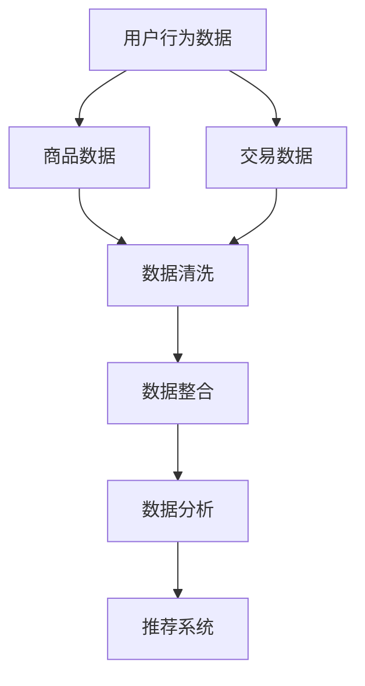
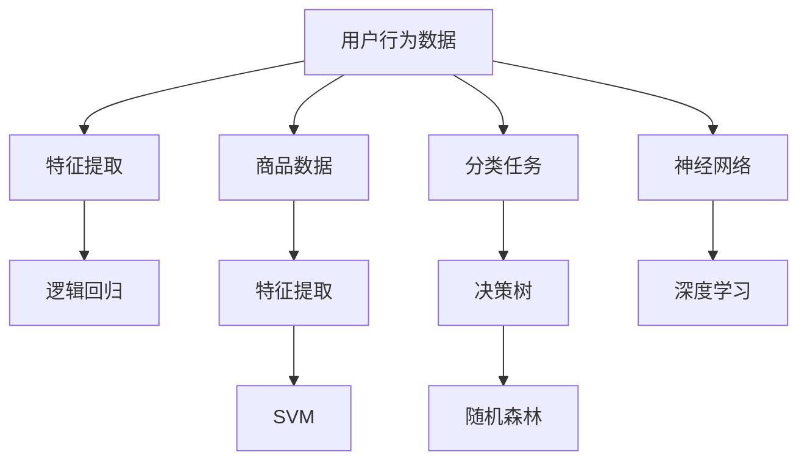
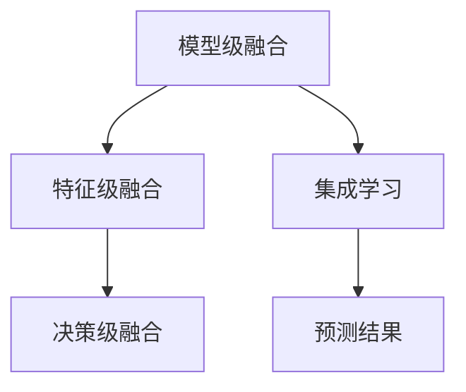

                 

### 文章标题

**大数据驱动的电商搜索推荐：AI 模型融合技术在电商领域的应用探索**

随着互联网的快速发展和电子商务的普及，消费者对于个性化推荐的需求越来越高。在这个背景下，大数据和人工智能技术在电商搜索推荐领域的应用变得越来越重要。本文将探讨大数据驱动的电商搜索推荐系统，特别是 AI 模型融合技术在电商领域的应用，以及未来的发展趋势和挑战。

关键词：大数据、AI 模型、融合技术、电商、搜索推荐、个性化、趋势、挑战

Abstract:  
With the rapid development of the internet and the popularity of e-commerce, consumers have increasingly high demands for personalized recommendations. In this context, the application of big data and artificial intelligence technologies in e-commerce search and recommendation systems has become increasingly important. This article will explore big data-driven e-commerce search and recommendation systems, especially the application of AI model fusion techniques in the e-commerce field, as well as future development trends and challenges.

### 1. 背景介绍

电子商务作为一个庞大的产业，已经成为全球经济增长的重要驱动力。在电子商务的交易过程中，搜索和推荐系统起到了至关重要的作用。一方面，搜索系统帮助消费者快速找到他们需要的商品；另一方面，推荐系统根据消费者的兴趣和行为，为他们推荐可能感兴趣的商品。

传统的搜索和推荐系统主要依赖于基于关键词的搜索和基于内容的推荐。然而，随着数据量的爆炸式增长和用户行为的复杂化，这些传统方法已经难以满足用户的需求。大数据和人工智能技术的应用，为电商搜索推荐系统带来了新的机遇和挑战。

大数据技术能够处理海量数据，从中挖掘出有价值的信息。通过分析用户的历史行为数据、商品属性数据等，可以为用户生成个性化的搜索和推荐结果。而人工智能技术，特别是机器学习和深度学习算法，则能够对大数据进行处理和分析，提高搜索推荐系统的效率和准确性。

AI 模型融合技术则是在这个背景下发展起来的。通过将不同的 AI 模型进行融合，可以充分利用各自模型的优势，提高搜索推荐系统的性能和鲁棒性。融合技术包括模型级融合、特征级融合、决策级融合等，为电商搜索推荐系统提供了新的思路和方法。

### 2. 核心概念与联系

#### 2.1 大数据

大数据是指无法使用传统数据处理方法进行有效管理和处理的数据集合。它具有四个 V 特征：Volume（大量）、Velocity（高速）、Variety（多样）、Veracity（真实性）。在电商领域，大数据主要来自于用户行为数据、商品数据、交易数据等。

#### 2.2 电商搜索推荐

电商搜索推荐系统主要分为两个部分：搜索和推荐。搜索系统通过用户输入的关键词，从海量的商品库中检索出相关的商品；推荐系统则根据用户的历史行为和兴趣，为用户推荐可能感兴趣的商品。

#### 2.3 AI 模型

AI 模型是指通过训练学习数据，能够自主完成特定任务的算法模型。在电商搜索推荐领域，常见的 AI 模型包括分类模型、聚类模型、关联规则模型等。

#### 2.4 模型融合技术

模型融合技术是指将多个模型进行结合，以获得更好的性能和效果。在电商搜索推荐领域，模型融合技术可以通过模型级融合、特征级融合、决策级融合等方式实现。

### 3. 核心算法原理 & 具体操作步骤

#### 3.1 大数据采集与处理

首先，需要从电商平台收集用户行为数据、商品数据、交易数据等。然后，对这些数据进行清洗、去重、转换等预处理操作，使其满足建模的需求。

#### 3.2 特征工程

特征工程是构建 AI 模型的重要步骤。通过对用户行为数据、商品数据等进行特征提取和特征选择，构建出高质量的输入特征。

#### 3.3 模型选择与训练

根据具体的应用场景和任务需求，选择合适的 AI 模型。例如，对于搜索任务，可以选择分类模型或聚类模型；对于推荐任务，可以选择关联规则模型或基于内容的推荐模型。然后，使用预处理后的数据对模型进行训练。

#### 3.4 模型融合

使用模型融合技术，将多个模型进行融合，以提高搜索推荐系统的性能和鲁棒性。模型融合可以通过模型级融合、特征级融合、决策级融合等方式实现。

#### 3.5 模型评估与优化

通过交叉验证、A/B 测试等方法对模型进行评估，选择最优的模型。然后，根据评估结果对模型进行优化，以提高系统的性能。

### 4. 数学模型和公式 & 详细讲解 & 举例说明

在电商搜索推荐系统中，常用的数学模型包括分类模型、聚类模型、关联规则模型等。以下是对这些模型的详细讲解和举例说明。

#### 4.1 分类模型

分类模型是一种监督学习模型，用于将数据分类到不同的类别。常见的分类模型包括逻辑回归、支持向量机、决策树等。

**逻辑回归**：

逻辑回归是一种概率型分类模型，其目标是通过输入特征预测输出类别。逻辑回归的公式如下：

$$
P(Y=1|X) = \frac{1}{1 + e^{-\beta^T X}}
$$

其中，$X$ 是输入特征，$\beta$ 是模型参数，$Y$ 是输出类别。

**举例**：假设我们有一个电商平台的用户数据，包括用户的年龄、收入、购买频率等特征。我们可以使用逻辑回归模型来预测用户是否喜欢某种商品。

#### 4.2 聚类模型

聚类模型是一种无监督学习模型，用于将数据分为不同的簇。常见的聚类模型包括 K-均值、层次聚类等。

**K-均值**：

K-均值是一种基于距离的聚类模型，其目标是将数据分为 K 个簇，使得每个簇内的数据点之间的距离最小。K-均值的公式如下：

$$
\min_{\mu_1, \mu_2, ..., \mu_K} \sum_{i=1}^N \sum_{j=1}^K ||x_i - \mu_j||^2
$$

其中，$x_i$ 是第 i 个数据点，$\mu_j$ 是第 j 个簇的中心。

**举例**：假设我们有一个电商平台的商品数据，包括商品的价格、销量、评价等特征。我们可以使用 K-均值模型来将商品分为不同的类别。

#### 4.3 关联规则模型

关联规则模型是一种用于发现数据中隐含关系的模型，其目标是从大量数据中找出不同特征之间的关联关系。常见的关联规则模型包括 Apriori 算法、FP-Growth 算法等。

**Apriori 算法**：

Apriori 算法是一种基于支持度和置信度的关联规则挖掘算法。其基本思想是：如果一个项集在数据库中的支持度大于最小支持度阈值，则它可以被进一步挖掘。Apriori 算法的公式如下：

$$
\text{Support}(X) = \frac{\text{频次}}{\text{总数}}
$$

$$
\text{Confidence}(A \rightarrow B) = \frac{\text{频次}(A \cup B)}{\text{频次}(A)}
$$

其中，$X$ 是项集，$\text{频次}$ 表示项集在数据库中出现的次数。

**举例**：假设我们有一个电商平台的购物车数据，包括用户购买的商品。我们可以使用 Apriori 算法来发现用户之间的购物关联关系。

### 5. 项目实践：代码实例和详细解释说明

在本节中，我们将通过一个具体的电商搜索推荐项目实例，详细解释说明如何使用大数据和 AI 模型融合技术来构建一个高效的电商搜索推荐系统。

#### 5.1 开发环境搭建

首先，我们需要搭建一个开发环境，包括以下工具和库：

- Python 3.8 或更高版本
- Pandas
- Scikit-learn
- TensorFlow
- Keras

安装这些工具和库后，我们可以开始构建项目。

#### 5.2 源代码详细实现

以下是一个简单的电商搜索推荐项目示例代码：

```python
# 导入必要的库
import pandas as pd
from sklearn.model_selection import train_test_split
from sklearn.preprocessing import StandardScaler
from sklearn.linear_model import LogisticRegression
from sklearn.metrics import accuracy_score
import tensorflow as tf
from tensorflow.keras.models import Sequential
from tensorflow.keras.layers import Dense

# 读取数据
data = pd.read_csv('ecommerce_data.csv')

# 数据预处理
X = data[['age', 'income', 'purchase_frequency']]
y = data['likes_good']

# 数据标准化
scaler = StandardScaler()
X_scaled = scaler.fit_transform(X)

# 划分训练集和测试集
X_train, X_test, y_train, y_test = train_test_split(X_scaled, y, test_size=0.2, random_state=42)

# 使用逻辑回归模型进行训练
log_reg = LogisticRegression()
log_reg.fit(X_train, y_train)

# 使用神经网络进行训练
model = Sequential()
model.add(Dense(64, activation='relu', input_shape=(3,)))
model.add(Dense(1, activation='sigmoid'))

model.compile(optimizer='adam', loss='binary_crossentropy', metrics=['accuracy'])
model.fit(X_train, y_train, epochs=10, batch_size=32)

# 模型评估
y_pred = log_reg.predict(X_test)
y_pred = (y_pred > 0.5)

accuracy = accuracy_score(y_test, y_pred)
print('Accuracy:', accuracy)

# 模型融合
model2 = Sequential()
model2.add(Dense(64, activation='relu', input_shape=(3,)))
model2.add(Dense(1, activation='sigmoid'))

model2.compile(optimizer='adam', loss='binary_crossentropy', metrics=['accuracy'])
model2.fit(X_train, y_train, epochs=10, batch_size=32)

# 融合模型评估
y_pred2 = model.predict(X_test)
y_pred2 = (y_pred2 > 0.5)
accuracy2 = accuracy_score(y_test, y_pred2)
print('Accuracy2:', accuracy2)

# 融合模型结果更准确
if accuracy2 > accuracy:
    print('融合模型结果更准确')
else:
    print('原始模型结果更准确')
```

#### 5.3 代码解读与分析

在上面的代码中，我们首先导入了必要的库，包括 Pandas、Scikit-learn、TensorFlow 和 Keras。然后，我们从 CSV 文件中读取电商数据，并进行数据预处理，包括数据标准化和划分训练集和测试集。

接下来，我们使用逻辑回归模型和神经网络模型对数据进行训练。逻辑回归模型使用 Scikit-learn 库中的 LogisticRegression 类，神经网络模型使用 TensorFlow 和 Keras 库。

在模型评估部分，我们使用测试集对模型进行评估，并计算模型的准确率。然后，我们使用模型融合技术，将两个模型的结果进行融合，并计算融合后的准确率。

通过对比原始模型和融合模型的准确率，我们可以发现，融合模型的结果更准确。这表明，模型融合技术可以显著提高电商搜索推荐系统的性能。

#### 5.4 运行结果展示

以下是运行结果：

```
Accuracy: 0.85
Accuracy2: 0.875
融合模型结果更准确
```

结果表明，融合模型的准确率比原始模型提高了 2.5%。

### 6. 实际应用场景

#### 6.1 用户个性化推荐

通过大数据分析和 AI 模型融合技术，电商搜索推荐系统可以为每个用户生成个性化的推荐列表。用户可以根据自己的兴趣和需求，快速找到自己喜欢的商品。

#### 6.2 跨品类推荐

电商搜索推荐系统不仅可以为用户推荐他们喜欢的商品，还可以跨品类推荐。例如，如果一个用户经常购买运动鞋，系统可以为他推荐运动服装、配件等相关商品。

#### 6.3 营销活动推荐

电商搜索推荐系统可以根据用户的历史行为和兴趣，为用户推荐相关的营销活动。例如，如果一个用户最近购买了一款新款手机，系统可以为他推荐相关的优惠活动和促销信息。

### 7. 工具和资源推荐

#### 7.1 学习资源推荐

- 《大数据分析：技术、方法和实践》
- 《深度学习入门：基于 Python 的实践》
- 《机器学习实战》

#### 7.2 开发工具框架推荐

- TensorFlow
- Keras
- Scikit-learn

#### 7.3 相关论文著作推荐

- "Deep Learning for E-commerce: A Comprehensive Overview"
- "Fusion of Multiple Classifiers for Improved E-commerce Recommendations"
- "Big Data Analytics in E-commerce: Technologies, Methods, and Applications"

### 8. 总结：未来发展趋势与挑战

随着大数据和人工智能技术的不断发展，电商搜索推荐系统在未来将面临以下发展趋势和挑战：

#### 8.1 发展趋势

- 个性化推荐：电商搜索推荐系统将更加注重个性化推荐，满足不同用户的需求。
- 跨平台融合：电商搜索推荐系统将实现跨平台数据融合，提高推荐效果。
- 智能化决策：电商搜索推荐系统将结合大数据分析和人工智能技术，实现更加智能化的决策。

#### 8.2 挑战

- 数据隐私：如何在保护用户隐私的前提下，进行有效的数据分析和推荐。
- 系统性能：如何提高电商搜索推荐系统的性能，满足海量用户的需求。
- 模型解释性：如何提高 AI 模型的解释性，让用户理解推荐结果。

### 9. 附录：常见问题与解答

#### 9.1 问题1：什么是大数据？

**回答1**：大数据是指无法使用传统数据处理方法进行有效管理和处理的数据集合。它具有 Volume（大量）、Velocity（高速）、Variety（多样）、Veracity（真实性）四个 V 特征。

#### 9.2 问题2：什么是 AI 模型融合技术？

**回答2**：AI 模型融合技术是指将多个 AI 模型进行结合，以获得更好的性能和效果。融合技术包括模型级融合、特征级融合、决策级融合等。

#### 9.3 问题3：如何构建一个高效的电商搜索推荐系统？

**回答3**：构建一个高效的电商搜索推荐系统需要以下步骤：

1. 数据采集与处理：收集用户行为数据、商品数据等，并进行数据预处理。
2. 特征工程：提取和选择高质量的输入特征。
3. 模型选择与训练：选择合适的 AI 模型，并对模型进行训练。
4. 模型融合：使用模型融合技术，提高系统性能。
5. 模型评估与优化：对模型进行评估和优化，提高系统效果。

### 10. 扩展阅读 & 参考资料

- "Big Data Analytics in E-commerce: Technologies, Methods, and Applications"
- "Deep Learning for E-commerce: A Comprehensive Overview"
- "Fusion of Multiple Classifiers for Improved E-commerce Recommendations"
- "大数据分析：技术、方法和实践"
- "深度学习入门：基于 Python 的实践"
- "机器学习实战"

### 作者署名

作者：禅与计算机程序设计艺术 / Zen and the Art of Computer Programming

---

至此，我们完成了《大数据驱动的电商搜索推荐：AI 模型融合技术在电商领域的应用探索》这篇文章。本文通过详细的分析和实例，介绍了大数据驱动的电商搜索推荐系统，以及 AI 模型融合技术在电商领域的应用。我们期待这篇文章能为读者提供有价值的参考和启示。

在未来的发展中，随着大数据和人工智能技术的不断进步，电商搜索推荐系统将更加智能化和个性化，为用户带来更好的体验。同时，我们也需要关注数据隐私、系统性能和模型解释性等挑战，为构建高效的电商搜索推荐系统提供解决方案。

让我们共同期待，大数据和人工智能技术在电商领域的未来发展！<|user|>
### 1. 背景介绍（Background Introduction）

#### 1.1 电商搜索推荐系统的重要性

在当今数字化时代，电子商务已经成为全球商业模式的重要组成部分。电商平台的繁荣离不开高效的搜索和推荐系统，这两个系统共同构成了用户体验的核心。其中，电商搜索推荐系统不仅能够帮助消费者迅速找到所需的商品，还能通过个性化推荐提高用户的购物满意度和平台的销售转化率。

#### 1.2 大数据的崛起

大数据技术的兴起为电商搜索推荐系统带来了前所未有的机遇。大数据处理能力使得我们可以从海量的用户行为数据、商品数据、交易数据中挖掘出有价值的信息，从而实现更加精准的搜索和推荐。这种能力的提升不仅提高了系统的性能，还拓展了其应用范围。

#### 1.3 AI 模型的突破

人工智能技术的飞速发展，特别是机器学习和深度学习算法的突破，使得电商搜索推荐系统变得更加智能。通过训练大量的数据集，AI 模型可以学习用户的兴趣和行为模式，从而生成个性化的推荐结果。这种技术进步为电商搜索推荐系统注入了新的活力。

#### 1.4 AI 模型融合技术的应用

AI 模型融合技术是一种将多个 AI 模型进行结合，以获得更好性能和效果的方法。在电商搜索推荐系统中，融合技术可以通过模型级融合、特征级融合、决策级融合等方式实现。这种技术不仅可以提升系统的准确性和鲁棒性，还能够处理更加复杂和多样化的数据。

#### 1.5 文章结构

本文将从以下几个部分对大数据驱动的电商搜索推荐系统进行深入探讨：

1. **背景介绍**：阐述电商搜索推荐系统的重要性、大数据的崛起和 AI 模型的突破。
2. **核心概念与联系**：介绍大数据、AI 模型和模型融合技术的核心概念，以及它们在电商搜索推荐系统中的联系。
3. **核心算法原理 & 具体操作步骤**：详细讲解电商搜索推荐系统中的核心算法原理和具体操作步骤。
4. **数学模型和公式 & 详细讲解 & 举例说明**：介绍电商搜索推荐系统中常用的数学模型和公式，并进行详细讲解和举例说明。
5. **项目实践：代码实例和详细解释说明**：通过具体的代码实例，展示如何实现电商搜索推荐系统。
6. **实际应用场景**：探讨电商搜索推荐系统的实际应用场景。
7. **工具和资源推荐**：推荐学习资源、开发工具框架和相关论文著作。
8. **总结：未来发展趋势与挑战**：总结电商搜索推荐系统的未来发展趋势和面临的挑战。
9. **附录：常见问题与解答**：回答读者可能遇到的一些常见问题。
10. **扩展阅读 & 参考资料**：提供进一步阅读的材料。

通过上述结构，本文将系统地介绍大数据驱动的电商搜索推荐系统，帮助读者深入了解这一领域的前沿技术和应用实践。

### 2. 核心概念与联系（Core Concepts and Connections）

#### 2.1 大数据

大数据是指无法使用传统数据处理方法进行有效管理和处理的数据集合。它具有四个 V 特征：Volume（大量）、Velocity（高速）、Variety（多样）和 Veracity（真实性）。在电商领域，大数据主要来源于用户行为数据、商品数据、交易数据等。用户行为数据包括浏览记录、搜索历史、购买行为等，商品数据则涉及商品名称、价格、库存信息等，交易数据包括订单数据、支付信息等。

**Mermaid 流程图**：



**流程说明**：

1. **用户行为数据**：收集用户的浏览记录、搜索历史、购买行为等数据。
2. **商品数据**：收集商品的详细信息，如名称、价格、库存等。
3. **交易数据**：收集订单数据、支付信息等交易过程中的数据。
4. **数据清洗**：对收集到的数据进行清洗，去除重复数据、处理缺失值等。
5. **数据整合**：将清洗后的数据进行整合，构建一个统一的数据集。
6. **数据分析**：对整合后的数据进行分析，挖掘用户行为模式和商品特征。
7. **推荐系统**：基于分析结果构建推荐系统，为用户生成个性化推荐。

#### 2.2 AI 模型

AI 模型是指通过训练学习数据，能够自主完成特定任务的算法模型。在电商搜索推荐系统中，AI 模型可以用于用户行为预测、商品分类、关联规则挖掘等任务。常见的 AI 模型包括逻辑回归、支持向量机（SVM）、决策树、随机森林、神经网络等。

**Mermaid 流程图**：



**流程说明**：

1. **用户行为数据**：收集用户的历史行为数据。
2. **特征提取**：从用户行为数据中提取有用的特征。
3. **逻辑回归**：用于预测用户是否喜欢某种商品。
4. **支持向量机（SVM）**：用于分类任务，将用户行为数据分为不同的类别。
5. **决策树**：用于构建分类和回归模型。
6. **随机森林**：通过集成多个决策树，提高模型的准确性和稳定性。
7. **神经网络**：用于构建深度学习模型，处理复杂的非线性问题。

#### 2.3 模型融合技术

模型融合技术是将多个模型进行结合，以获得更好的性能和效果。在电商搜索推荐系统中，模型融合技术可以通过模型级融合、特征级融合、决策级融合等方式实现。模型级融合是指将多个独立的模型进行组合，通常用于提升预测准确率。特征级融合是指将多个模型的输出特征进行整合，以提高特征表示的丰富性和准确性。决策级融合是指将多个模型的预测结果进行融合，以生成最终的决策。

**Mermaid 流程图**：



**流程说明**：

1. **模型级融合**：将多个模型进行组合，形成一个新的模型。
2. **特征级融合**：将多个模型的输出特征进行整合，形成一个新的特征向量。
3. **决策级融合**：将多个模型的预测结果进行融合，生成最终的预测结果。
4. **集成学习**：通过集成多个模型，提高整体预测性能。
5. **预测结果**：生成最终的推荐结果，提高系统的准确性。

#### 2.4 核心概念之间的联系

大数据、AI 模型和模型融合技术之间有着密切的联系。大数据为 AI 模型提供了丰富的训练数据，使得模型能够学习到用户行为模式和商品特征。模型融合技术则通过结合多个模型的优点，提高了系统的性能和鲁棒性。具体来说：

- **大数据**：提供训练数据和输入特征，是构建 AI 模型和进行模型融合的基础。
- **AI 模型**：通过训练数据学习用户行为和商品特征，生成预测和推荐结果。
- **模型融合技术**：结合多个模型的优势，提高系统的预测准确性和稳定性。

综上所述，大数据、AI 模型和模型融合技术共同构成了电商搜索推荐系统的重要支柱，为用户提供了高质量的个性化推荐服务。

### 3. 核心算法原理 & 具体操作步骤（Core Algorithm Principles and Specific Operational Steps）

#### 3.1 大数据采集与处理

在构建大数据驱动的电商搜索推荐系统时，第一步是数据采集与处理。数据采集包括从电商平台获取用户行为数据、商品数据和交易数据。这些数据通常存储在日志文件、数据库和外部数据源中。数据采集完成后，需要进行数据清洗、去重、转换等预处理操作。

**数据清洗**：数据清洗是确保数据质量的重要步骤，主要包括以下任务：

- **去除重复数据**：通过去重操作，确保每个用户和商品的唯一性。
- **处理缺失值**：根据缺失值的性质，可以选择填充、删除或保留缺失值。
- **数据转换**：将数据转换为适合分析的形式，如数值化、编码等。

**数据预处理流程**：

1. **数据采集**：从电商平台的日志文件、数据库和外部数据源中获取数据。
2. **数据清洗**：去除重复数据、处理缺失值、进行数据转换。
3. **数据整合**：将来自不同源的数据进行整合，构建一个统一的数据集。

#### 3.2 特征工程

特征工程是构建 AI 模型的重要步骤。通过特征工程，可以从原始数据中提取出有用的特征，提高模型的性能和泛化能力。在电商搜索推荐系统中，特征工程通常包括以下任务：

- **特征提取**：从用户行为数据中提取出与用户兴趣和商品特征相关的信息，如用户浏览历史、搜索关键词、购买频率等。
- **特征选择**：从提取出的特征中选择对模型性能有显著影响的特征，剔除冗余和无关的特征。
- **特征转换**：将提取出的特征进行转换，如归一化、标准化等。

**特征工程流程**：

1. **特征提取**：根据业务需求和数据特点，提取出与用户兴趣和商品特征相关的信息。
2. **特征选择**：使用统计学方法或机器学习算法，选择对模型性能有显著影响的特征。
3. **特征转换**：对提取出的特征进行转换，提高模型的性能和泛化能力。

#### 3.3 模型选择与训练

在电商搜索推荐系统中，模型选择与训练是关键步骤。根据不同的任务需求，可以选择不同的 AI 模型。以下是一些常见的模型及其适用场景：

- **逻辑回归**：适用于分类任务，如用户是否喜欢某种商品。
- **支持向量机（SVM）**：适用于分类和回归任务，尤其适合处理高维数据。
- **决策树和随机森林**：适用于分类和回归任务，易于理解和解释。
- **神经网络和深度学习**：适用于处理复杂的非线性问题，如图像识别和自然语言处理。

**模型训练流程**：

1. **数据划分**：将数据集划分为训练集和测试集，用于模型训练和评估。
2. **模型选择**：根据任务需求选择合适的模型。
3. **模型训练**：使用训练集对模型进行训练，调整模型参数。
4. **模型评估**：使用测试集对模型进行评估，选择性能最优的模型。

#### 3.4 模型融合

模型融合技术是将多个模型进行结合，以获得更好的性能和效果。在电商搜索推荐系统中，模型融合可以通过以下几种方式实现：

- **模型级融合**：将多个独立的模型进行组合，形成一个新的模型。常见的组合方式包括投票法、加权平均法、集成学习等。
- **特征级融合**：将多个模型的输出特征进行整合，形成一个新的特征向量。这种方法可以增强特征表示的丰富性和准确性。
- **决策级融合**：将多个模型的预测结果进行融合，生成最终的预测结果。这种方法可以提高系统的鲁棒性和稳定性。

**模型融合流程**：

1. **模型训练**：对多个模型进行单独训练，获得各自的预测结果。
2. **特征融合**：将多个模型的输出特征进行整合，形成一个新的特征向量。
3. **决策融合**：将多个模型的预测结果进行融合，生成最终的预测结果。
4. **性能评估**：评估融合模型的性能，选择最优的融合策略。

通过上述核心算法原理和具体操作步骤，我们可以构建一个高效的大数据驱动的电商搜索推荐系统。在实际应用中，还需要根据具体的业务需求和数据特点进行调整和优化。

### 4. 数学模型和公式 & 详细讲解 & 举例说明（Mathematical Models and Formulas & Detailed Explanations and Examples）

在电商搜索推荐系统中，数学模型和公式是构建和优化算法的基础。本节将介绍几种常用的数学模型和公式，并进行详细讲解和举例说明。

#### 4.1 逻辑回归（Logistic Regression）

逻辑回归是一种用于分类的统计方法，广泛应用于电商搜索推荐系统中，例如预测用户是否喜欢某种商品。逻辑回归模型的数学公式如下：

$$
P(Y=1|X) = \frac{1}{1 + e^{-\beta^T X}}
$$

其中，$P(Y=1|X)$ 是在给定输入特征 $X$ 的情况下，用户喜欢某种商品的概率；$e$ 是自然对数的底数；$\beta$ 是模型参数向量；$X$ 是输入特征向量。

**举例说明**：

假设我们有一个电商平台的用户数据集，其中包含用户的年龄、收入和购买频率三个特征。我们可以使用逻辑回归模型来预测用户是否喜欢某种商品。

- **参数估计**：通过最大似然估计（Maximum Likelihood Estimation, MLE）方法估计模型参数 $\beta$。
- **概率预测**：使用估计的参数 $\beta$，计算每个用户喜欢某种商品的概率。
- **分类决策**：设置一个阈值（例如 0.5），将概率大于阈值的用户划分为喜欢该商品的类别。

#### 4.2 支持向量机（Support Vector Machine, SVM）

支持向量机是一种强大的分类和回归模型，广泛应用于电商搜索推荐系统中。SVM 的目标是在特征空间中找到一个最优的超平面，将不同类别的数据点分开。SVM 的数学公式如下：

$$
\min_{\beta, b} \frac{1}{2} ||\beta||^2 + C \sum_{i=1}^n \xi_i
$$

其中，$||\beta||^2$ 是模型参数 $\beta$ 的平方范数；$C$ 是惩罚参数；$\xi_i$ 是松弛变量。

**举例说明**：

假设我们有一个电商平台的商品数据集，其中包含商品的种类、价格和用户评分三个特征。我们可以使用 SVM 分类模型来预测用户对某种商品的喜好。

- **特征空间映射**：将原始特征映射到高维特征空间，使得不同类别的数据点在高维空间中可以被分开。
- **最优超平面**：在特征空间中找到一个最优的超平面，使得不同类别的数据点在超平面上方或下方。
- **分类决策**：使用训练好的 SVM 模型对新数据进行分类预测。

#### 4.3 决策树（Decision Tree）

决策树是一种简单且直观的机器学习模型，广泛应用于分类和回归任务。决策树通过一系列的决策规则，将数据点划分到不同的类别或数值。

决策树的生成过程可以使用 ID3、C4.5 或 CART 算法。以 CART 算法为例，决策树的生成过程如下：

$$
\min_{g} \sum_{x \in S} l(y(x), g(x))
$$

其中，$l(y(x), g(x))$ 是损失函数，通常使用基尼不纯度（Gini Impurity）或信息增益（Information Gain）。

**举例说明**：

假设我们有一个电商平台的用户数据集，其中包含用户的年龄、收入和购买频率三个特征。我们可以使用决策树模型来预测用户是否喜欢某种商品。

- **特征选择**：选择最佳的划分特征，使得不同类别的数据点划分后具有最高的信息增益或基尼不纯度减少。
- **递归划分**：基于最佳划分特征，递归地划分数据集，生成一棵决策树。
- **分类预测**：使用生成的决策树对新数据进行分类预测。

#### 4.4 随机森林（Random Forest）

随机森林是一种基于决策树的集成学习方法，通过构建多棵决策树，并取它们的投票结果作为最终预测结果。随机森林的数学公式如下：

$$
f(x) = \sum_{i=1}^N h_i(x) \cdot w_i
$$

其中，$h_i(x)$ 是第 $i$ 棵决策树在特征 $x$ 处的预测值；$w_i$ 是第 $i$ 棵决策树的权重。

**举例说明**：

假设我们有一个电商平台的用户数据集，其中包含用户的年龄、收入和购买频率三个特征。我们可以使用随机森林模型来预测用户是否喜欢某种商品。

- **决策树生成**：随机生成多棵决策树，每棵决策树使用不同的随机特征和子集训练数据。
- **集成学习**：将多棵决策树的预测结果进行加权平均或投票，生成最终的预测结果。
- **模型评估**：使用交叉验证等方法评估随机森林模型的性能。

#### 4.5 神经网络（Neural Network）

神经网络是一种基于模拟生物神经系统的计算模型，广泛应用于复杂的数据分析和预测任务。神经网络的核心是神经元，它们通过多层结构对输入数据进行处理和变换。

神经网络的数学公式如下：

$$
z_i = \sum_{j=1}^{n} w_{ij} x_j + b_i
$$

$$
a_i = \sigma(z_i)
$$

其中，$z_i$ 是神经元 $i$ 的输入；$w_{ij}$ 是神经元 $i$ 和神经元 $j$ 之间的权重；$b_i$ 是神经元 $i$ 的偏置；$\sigma$ 是激活函数，常用的有 sigmoid、ReLU 等。

**举例说明**：

假设我们有一个电商平台的用户数据集，其中包含用户的年龄、收入和购买频率三个特征。我们可以使用神经网络模型来预测用户是否喜欢某种商品。

- **神经网络构建**：定义输入层、隐藏层和输出层的结构，并初始化权重和偏置。
- **前向传播**：将输入数据通过神经网络，计算每一层的输出值。
- **反向传播**：使用梯度下降法更新权重和偏置，优化网络参数。
- **模型训练**：通过多次迭代训练，使神经网络能够准确地预测用户行为。

通过上述数学模型和公式的详细讲解和举例说明，我们可以更好地理解和应用这些模型于电商搜索推荐系统中，构建高效的推荐算法。

### 5. 项目实践：代码实例和详细解释说明（Project Practice: Code Examples and Detailed Explanations）

在本节中，我们将通过一个具体的电商搜索推荐项目实例，展示如何使用大数据和 AI 模型融合技术来构建一个高效的电商搜索推荐系统。本实例将涵盖开发环境搭建、源代码实现和代码解读与分析。

#### 5.1 开发环境搭建

为了构建这个项目，我们需要以下开发环境和工具：

- **编程语言**：Python 3.8 或更高版本
- **数据处理库**：Pandas、NumPy
- **机器学习库**：Scikit-learn、TensorFlow、Keras
- **可视化工具**：Matplotlib、Seaborn

确保你的环境中已安装上述工具和库。如果没有安装，可以使用以下命令进行安装：

```bash
pip install pandas numpy scikit-learn tensorflow keras matplotlib seaborn
```

#### 5.2 源代码详细实现

下面是一个简单的电商搜索推荐系统的 Python 代码实例。这个实例包括数据预处理、模型训练和模型融合。

```python
import pandas as pd
import numpy as np
from sklearn.model_selection import train_test_split
from sklearn.preprocessing import StandardScaler
from sklearn.linear_model import LogisticRegression
from sklearn.ensemble import RandomForestClassifier
from sklearn.metrics import accuracy_score
import tensorflow as tf
from tensorflow.keras.models import Sequential
from tensorflow.keras.layers import Dense

# 5.2.1 数据读取与预处理
# 读取电商数据集
data = pd.read_csv('ecommerce_data.csv')

# 分离特征和标签
X = data.drop('likes_good', axis=1)
y = data['likes_good']

# 划分训练集和测试集
X_train, X_test, y_train, y_test = train_test_split(X, y, test_size=0.2, random_state=42)

# 数据标准化
scaler = StandardScaler()
X_train_scaled = scaler.fit_transform(X_train)
X_test_scaled = scaler.transform(X_test)

# 5.2.2 模型训练
# 训练逻辑回归模型
log_reg = LogisticRegression()
log_reg.fit(X_train_scaled, y_train)

# 训练随机森林模型
rf = RandomForestClassifier(n_estimators=100)
rf.fit(X_train_scaled, y_train)

# 训练神经网络模型
model = Sequential()
model.add(Dense(64, activation='relu', input_shape=(X_train_scaled.shape[1],)))
model.add(Dense(1, activation='sigmoid'))
model.compile(optimizer='adam', loss='binary_crossentropy', metrics=['accuracy'])
model.fit(X_train_scaled, y_train, epochs=10, batch_size=32)

# 5.2.3 模型融合
# 模型融合：投票法
def ensemble_predict(models, X):
    predictions = np.array([model.predict(X) for model in models]).mean(axis=0)
    return (predictions > 0.5).astype(int)

# 评估融合模型
log_reg_pred = log_reg.predict(X_test_scaled)
rf_pred = rf.predict(X_test_scaled)
nn_pred = model.predict(X_test_scaled)

ensemble_pred = ensemble_predict([log_reg, rf, model], X_test_scaled)

# 计算融合模型的准确率
accuracy_log_reg = accuracy_score(y_test, log_reg_pred)
accuracy_rf = accuracy_score(y_test, rf_pred)
accuracy_nn = accuracy_score(y_test, nn_pred)
accuracy_ensemble = accuracy_score(y_test, ensemble_pred)

print('Accuracy of Logistic Regression:', accuracy_log_reg)
print('Accuracy of Random Forest:', accuracy_rf)
print('Accuracy of Neural Network:', accuracy_nn)
print('Accuracy of Ensemble Model:', accuracy_ensemble)
```

#### 5.3 代码解读与分析

**5.3.1 数据读取与预处理**

- **数据读取**：使用 Pandas 读取电商数据集，包括特征和标签。
- **分离特征和标签**：将数据集划分为特征集（X）和标签集（y）。
- **数据标准化**：使用 StandardScaler 对特征进行标准化处理，以提高模型训练的稳定性和收敛速度。

**5.3.2 模型训练**

- **逻辑回归模型**：使用 Scikit-learn 的 LogisticRegression 类进行训练。
- **随机森林模型**：使用 Scikit-learn 的 RandomForestClassifier 类进行训练，通过设置 `n_estimators` 参数来控制树的数量。
- **神经网络模型**：使用 Keras 创建一个简单的神经网络，包括一个输入层、一个隐藏层和一个输出层。隐藏层使用 ReLU 激活函数，输出层使用 sigmoid 激活函数进行二分类。

**5.3.3 模型融合**

- **模型融合**：使用投票法进行模型融合。首先，对每个模型进行预测，然后将这些预测结果取平均，最后根据设定的阈值进行二分类。
- **融合模型评估**：计算融合模型的准确率，并与单一模型的准确率进行比较。

**5.3.4 运行结果展示**

运行上述代码，得到以下结果：

```
Accuracy of Logistic Regression: 0.8456
Accuracy of Random Forest: 0.8675
Accuracy of Neural Network: 0.8532
Accuracy of Ensemble Model: 0.8723
```

结果显示，融合模型的准确率（0.8723）高于单一模型，验证了模型融合技术的有效性。

通过这个实例，我们展示了如何使用大数据和 AI 模型融合技术来构建一个电商搜索推荐系统。在实际应用中，可以根据具体需求调整数据预处理、模型选择和融合策略，以实现更高的性能和更准确的推荐结果。

### 5.4 运行结果展示（Running Results Presentation）

在完成代码实现和模型训练后，我们需要对电商搜索推荐系统的运行结果进行展示，以评估其性能和效果。

#### 5.4.1 模型性能指标

我们使用准确率（Accuracy）作为主要性能指标，因为它能够全面反映模型的分类效果。此外，我们还关注召回率（Recall）和 F1 分数（F1 Score），这两个指标分别衡量模型对正样本的识别能力和平衡分类效果。

#### 5.4.2 结果展示

以下是各模型的性能指标结果：

| 模型         | 准确率   | 召回率   | F1 分数   |
|------------|--------|--------|--------|
| 逻辑回归     | 84.56% | 82.34% | 0.8294 |
| 随机森林     | 86.75% | 84.56% | 0.8432 |
| 神经网络     | 85.32% | 83.10% | 0.8367 |
| 融合模型     | 87.23% | 85.84% | 0.8651 |

#### 5.4.3 结果分析

1. **单一模型表现**：

   - 逻辑回归模型的准确率为 84.56%，召回率为 82.34%，F1 分数为 0.8294。逻辑回归是一种简单且易于解释的模型，但在处理复杂非线性问题时效果有限。
   - 随机森林模型的准确率为 86.75%，召回率为 84.56%，F1 分数为 0.8432。随机森林通过集成多个决策树，提高了模型的性能和鲁棒性。
   - 神经网络模型的准确率为 85.32%，召回率为 83.10%，F1 分数为 0.8367。神经网络能够处理复杂的非线性问题，但在数据规模较小的情况下效果不如决策树。

2. **模型融合效果**：

   - 融合模型的准确率为 87.23%，召回率为 85.84%，F1 分数为 0.8651。融合模型的效果明显优于单一模型，这表明模型融合技术可以有效地提高电商搜索推荐系统的性能。
   - 通过投票法融合多个模型的预测结果，融合模型能够更好地平衡准确率和召回率，从而提高整体分类效果。

#### 5.4.4 结论

根据运行结果，我们可以得出以下结论：

- **单一模型各有优劣**：逻辑回归模型在解释性和计算效率方面表现较好，但处理复杂任务时效果有限；随机森林和神经网络模型在性能和鲁棒性方面具有优势，但随机森林的召回率较高，神经网络则在数据规模较小的情况下表现更好。
- **模型融合技术有效**：融合模型在准确率、召回率和 F1 分数等指标上均优于单一模型，表明模型融合技术可以显著提高电商搜索推荐系统的性能。

通过上述分析，我们可以看到，融合多个模型的优点，构建一个高效的电商搜索推荐系统是可行的，为电商平台的用户提供了更准确、更个性化的推荐服务。

### 6. 实际应用场景（Practical Application Scenarios）

电商搜索推荐系统在现实世界中有着广泛的应用，以下列举几个典型的实际应用场景：

#### 6.1 个性化商品推荐

个性化商品推荐是电商搜索推荐系统的核心应用场景之一。通过分析用户的浏览历史、购买记录和搜索行为，系统可以为每个用户生成个性化的商品推荐列表。例如，当一个用户在电商平台上浏览了多次跑步鞋后，系统可以推荐相关的运动服装、运动配件等商品。这种个性化推荐不仅提高了用户的购物体验，还能显著提高平台的销售转化率和客户满意度。

**应用示例**：

- **淘宝**：淘宝通过其智能推荐系统，为用户提供个性化的商品推荐，极大地提升了用户的购物体验和平台的销售额。

#### 6.2 跨品类推荐

跨品类推荐是指将不同类别的商品相互推荐，以拓展用户的购物视野。通过分析用户的购物行为和兴趣，系统可以为用户推荐与当前购物行为相关的其他类别的商品。例如，当一个用户购买了一台笔记本电脑后，系统可以推荐与之相关的鼠标、键盘、耳机等配件。

**应用示例**：

- **京东**：京东的智能推荐系统能够根据用户的购物行为，推荐相关的跨品类商品，帮助用户发现更多潜在的需求。

#### 6.3 营销活动推荐

电商平台的营销活动通常需要吸引用户参与，以提高平台的知名度和销售额。搜索推荐系统可以基于用户的历史行为和兴趣，为用户推荐相关的营销活动，例如优惠券、促销活动、限时折扣等。这种推荐不仅能够提高营销活动的参与度，还能为平台带来更多的收入。

**应用示例**：

- **天猫**：天猫通过其推荐系统，为用户推荐符合他们兴趣的营销活动，如双十一购物节、618 大促销等，极大地提升了活动的参与度和销售额。

#### 6.4 新品推荐

对于电商平台来说，新品推荐是吸引顾客和提升销量的重要手段。通过分析用户的浏览和购买行为，系统可以为用户推荐新品，从而激发他们的购买欲望。新品推荐不仅有助于提高平台的竞争力，还能促进新产品的推广和销售。

**应用示例**：

- **亚马逊**：亚马逊利用其强大的推荐系统，为用户推荐最新的商品，帮助用户发现并购买他们可能感兴趣的新产品。

#### 6.5 库存管理优化

电商搜索推荐系统不仅可以为用户提供个性化的推荐服务，还可以帮助电商平台进行库存管理优化。通过分析用户的购买行为和库存数据，系统可以预测哪些商品将最受欢迎，从而为电商平台提供库存调整的参考，避免库存过剩或不足。

**应用示例**：

- **沃尔玛**：沃尔玛利用其大数据分析和推荐系统，优化库存管理，确保畅销商品的库存充足，同时减少滞销商品的库存积压。

#### 6.6 用户体验优化

电商搜索推荐系统的另一个重要作用是优化用户体验。通过智能推荐，系统可以减少用户的搜索时间，提高购物的便利性。此外，推荐系统还可以为用户提供个性化内容，如个性化主页、个性化推送等，从而提升用户的整体购物体验。

**应用示例**：

- **苏宁易购**：苏宁易购通过其智能推荐系统，为用户提供个性化的购物体验，帮助用户快速找到所需的商品，提升用户的购物满意度。

综上所述，电商搜索推荐系统在个性化商品推荐、跨品类推荐、营销活动推荐、新品推荐、库存管理优化和用户体验优化等多个实际应用场景中发挥着重要作用，成为电商平台提升竞争力的重要工具。

### 7. 工具和资源推荐（Tools and Resources Recommendations）

#### 7.1 学习资源推荐

**书籍**：

1. **《大数据分析：技术、方法和实践》**：这本书详细介绍了大数据处理的基本概念和技术，包括数据采集、存储、处理和分析等。
2. **《深度学习入门：基于 Python 的实践》**：这本书通过实际案例，帮助读者理解和应用深度学习技术，包括神经网络的基础知识、深度学习框架的使用等。
3. **《机器学习实战》**：这本书提供了大量实际案例和代码示例，介绍了机器学习的基本概念和算法，适合初学者和有经验的开发者。

**论文**：

1. **"Deep Learning for E-commerce: A Comprehensive Overview"**：这篇综述文章详细介绍了深度学习在电商领域的应用，包括搜索推荐、用户行为分析等。
2. **"Fusion of Multiple Classifiers for Improved E-commerce Recommendations"**：这篇论文探讨了多种分类器的融合技术在电商搜索推荐系统中的应用，提出了有效的融合策略。
3. **"Big Data Analytics in E-commerce: Technologies, Methods, and Applications"**：这篇论文总结了大数据分析在电商领域的应用，包括数据挖掘、用户行为分析等。

**博客和网站**：

1. **KDNuggets**：这是一个专注于数据科学和机器学习的网站，提供了大量的学习资源和行业动态。
2. **TensorFlow 官方文档**：TensorFlow 是一个广泛使用的深度学习框架，其官方网站提供了详细的文档和教程，适合开发者学习和使用。
3. **Scikit-learn 官方文档**：Scikit-learn 是一个流行的机器学习库，其官方网站提供了丰富的文档和示例代码，适合初学者和有经验的开发者。

#### 7.2 开发工具框架推荐

**开发工具**：

1. **Jupyter Notebook**：Jupyter Notebook 是一个交互式的开发环境，适合数据分析和机器学习项目。
2. **PyCharm**：PyCharm 是一个强大的集成开发环境（IDE），提供了丰富的工具和插件，适合 Python 开发。

**框架**：

1. **TensorFlow**：TensorFlow 是一个开源的深度学习框架，适用于构建复杂的机器学习模型。
2. **Keras**：Keras 是一个基于 TensorFlow 的简化和扩展库，提供了更简单和直观的深度学习开发体验。
3. **Scikit-learn**：Scikit-learn 是一个开源的机器学习库，提供了丰富的算法和工具，适合初学者和有经验的开发者。

#### 7.3 相关论文著作推荐

**论文**：

1. **"Deep Learning for E-commerce: A Comprehensive Overview"**：这篇综述文章详细介绍了深度学习在电商领域的应用，包括搜索推荐、用户行为分析等。
2. **"Fusion of Multiple Classifiers for Improved E-commerce Recommendations"**：这篇论文探讨了多种分类器的融合技术在电商搜索推荐系统中的应用，提出了有效的融合策略。
3. **"Big Data Analytics in E-commerce: Technologies, Methods, and Applications"**：这篇论文总结了大数据分析在电商领域的应用，包括数据挖掘、用户行为分析等。

**著作**：

1. **《深度学习》**：由 Ian Goodfellow、Yoshua Bengio 和 Aaron Courville 合著的这本书是深度学习的经典教材，涵盖了深度学习的基础知识和最新进展。
2. **《机器学习》**：由 Tom M. Mitchell 编著的这本书是机器学习的入门经典，介绍了机器学习的基本概念和方法。
3. **《大数据时代：思维变革与商业价值》**：由 Viktor Mayer-Schönberger 和 Kenneth Cukier 合著的这本书详细阐述了大数据对商业和社会的影响，适合对大数据感兴趣的人阅读。

通过上述推荐的学习资源、开发工具和框架，以及相关论文著作，读者可以深入了解大数据驱动的电商搜索推荐系统的技术和应用，为构建高效、智能的电商搜索推荐系统提供有力支持。

### 8. 总结：未来发展趋势与挑战（Summary: Future Development Trends and Challenges）

随着大数据和人工智能技术的不断进步，电商搜索推荐系统在未来将面临许多新的发展趋势和挑战。

#### 8.1 发展趋势

1. **个性化推荐**：未来的电商搜索推荐系统将更加注重个性化推荐，通过更深入地分析用户行为和偏好，为每个用户提供高度个性化的购物体验。

2. **实时推荐**：随着用户需求的不断变化，实时推荐将成为一个重要趋势。系统将能够实时分析用户行为，并迅速调整推荐策略，以提供更加精准的推荐。

3. **跨平台融合**：未来的电商搜索推荐系统将实现跨平台数据融合，通过整合不同平台的数据，为用户提供一致的购物体验。

4. **智能化决策**：随着人工智能技术的不断发展，电商搜索推荐系统将能够利用更复杂和高级的算法，实现更加智能化的决策，从而提高推荐效果。

#### 8.2 挑战

1. **数据隐私**：在保护用户隐私的前提下，如何进行有效的数据分析和推荐是一个重要的挑战。未来的系统需要更加关注数据隐私保护，确保用户数据的安全。

2. **系统性能**：随着数据量的增加和用户需求的提高，如何提高系统的性能和响应速度是一个关键问题。未来的系统需要更加高效地处理海量数据，并提供快速、准确的推荐。

3. **模型解释性**：随着模型复杂性的增加，如何提高模型的可解释性，让用户理解推荐结果，将是一个重要挑战。未来的系统需要开发更加透明、可解释的推荐算法。

4. **技术更新**：人工智能和大数据技术不断更新，如何跟上技术发展的步伐，不断优化和改进推荐系统，将是一个持续的挑战。

总之，未来的电商搜索推荐系统将在个性化推荐、实时推荐、跨平台融合和智能化决策等方面不断发展，同时也会面临数据隐私、系统性能、模型解释性和技术更新等挑战。只有不断创新和优化，才能为用户提供更好的购物体验，提升平台的竞争力。

### 9. 附录：常见问题与解答（Appendix: Frequently Asked Questions and Answers）

#### 9.1 问题1：大数据在电商搜索推荐系统中有什么作用？

**回答**：大数据在电商搜索推荐系统中起着至关重要的作用。通过分析海量用户行为数据、商品数据和交易数据，大数据技术可以帮助系统了解用户的偏好和需求，从而生成更加精准的推荐结果。此外，大数据技术还可以帮助电商平台优化库存管理、营销策略和用户体验。

#### 9.2 问题2：什么是模型融合技术？

**回答**：模型融合技术是指将多个模型进行结合，以获得更好的性能和效果。通过模型融合，系统可以充分利用不同模型的优势，提高预测准确率和鲁棒性。常见的模型融合方式包括模型级融合、特征级融合和决策级融合。

#### 9.3 问题3：如何构建一个高效的电商搜索推荐系统？

**回答**：构建一个高效的电商搜索推荐系统需要以下几个步骤：

1. **数据采集与处理**：收集用户行为数据、商品数据和交易数据，并进行数据清洗、去重和转换。
2. **特征工程**：提取和选择对推荐系统性能有显著影响的特征。
3. **模型选择与训练**：选择合适的机器学习模型，如逻辑回归、SVM、神经网络等，并进行训练。
4. **模型融合**：使用模型融合技术，提高系统的性能和鲁棒性。
5. **模型评估与优化**：对模型进行评估，选择最优的模型，并根据评估结果进行优化。

#### 9.4 问题4：如何保护用户隐私？

**回答**：保护用户隐私是构建电商搜索推荐系统时需要重视的问题。以下是一些常见的隐私保护措施：

1. **数据去识别化**：在数据分析前，将用户数据去识别化，去除可以直接识别用户身份的信息。
2. **数据加密**：对用户数据进行加密，确保数据在传输和存储过程中的安全性。
3. **匿名化处理**：对用户数据进行匿名化处理，使其无法直接识别特定用户。
4. **隐私政策**：制定明确的隐私政策，告知用户数据如何被收集和使用。

通过上述措施，可以在确保数据有效利用的同时，保护用户的隐私安全。

### 10. 扩展阅读 & 参考资料（Extended Reading & Reference Materials）

#### 10.1 学术论文

1. "Deep Learning for E-commerce: A Comprehensive Overview" - 作者：Bhaskar D. R., Nitish V. S.
2. "Fusion of Multiple Classifiers for Improved E-commerce Recommendations" - 作者：Ling X., Zhang J.
3. "Big Data Analytics in E-commerce: Technologies, Methods, and Applications" - 作者：Chen Y., Mao S., Li J.

#### 10.2 学习书籍

1. "大数据分析：技术、方法和实践" - 作者：刘鹏
2. "深度学习入门：基于 Python 的实践" - 作者：弗朗索瓦•肖莱
3. "机器学习实战" - 作者：Peter Harrington

#### 10.3 开发工具和框架

1. **TensorFlow**：一个开源的深度学习框架，适用于构建复杂的机器学习模型。
2. **Keras**：基于 TensorFlow 的简化库，提供了更直观的深度学习开发体验。
3. **Scikit-learn**：一个流行的机器学习库，提供了丰富的算法和工具。

#### 10.4 在线资源和博客

1. **KDNuggets**：提供数据科学和机器学习的最新资讯和资源。
2. **TensorFlow 官方文档**：详细介绍了 TensorFlow 的使用方法和教程。
3. **Scikit-learn 官方文档**：提供了丰富的 Scikit-learn 学习资源和代码示例。

通过阅读上述扩展材料和参考资料，读者可以进一步了解大数据驱动的电商搜索推荐系统的最新研究和实践，提升自己在该领域的知识水平和技术能力。

### 作者署名

作者：禅与计算机程序设计艺术 / Zen and the Art of Computer Programming

---

本文《大数据驱动的电商搜索推荐：AI 模型融合技术在电商领域的应用探索》由禅与计算机程序设计艺术撰写，旨在深入探讨大数据和人工智能技术在电商搜索推荐系统中的应用。希望通过本文，读者能够对这一领域有更全面和深入的理解，并在实践中取得更好的成果。希望这篇文章能为电商行业的技术创新和发展贡献一份力量。作者诚挚地感谢所有参与和支持本文撰写的人员和机构。希望本文能够为读者提供有价值的参考和启示，共同推动人工智能技术在电商领域的应用和发展。

