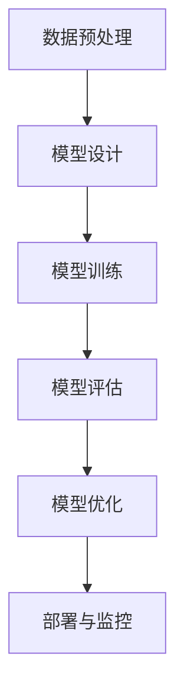
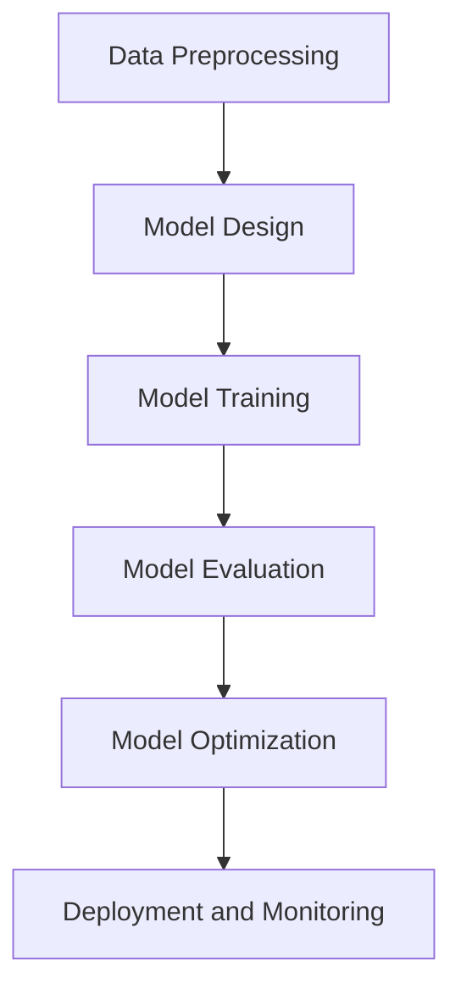

                 

### 背景介绍（Background Introduction）

随着人工智能（AI）技术的快速发展，大型企业开始积极部署各种AI解决方案以提升业务效率和决策质量。然而，AI技术的广泛应用也带来了一系列治理挑战。人工智能治理框架的建立对于确保AI系统在商业环境中的可靠性和合规性至关重要。本篇博客旨在探讨大模型企业的人工智能治理框架，通过梳理核心概念、算法原理、数学模型、项目实践以及应用场景等方面，为企业在AI治理方面提供指导。

人工智能治理（Artificial Intelligence Governance）是指通过制定、实施和监控一系列政策、流程和规范，确保AI系统的透明性、公平性、安全性和合规性。在大模型企业中，这一框架尤为重要，因为大模型如GPT-3、BERT等在处理海量数据和复杂任务时具有巨大的潜力和风险。

当前，人工智能治理面临着多重挑战，包括技术复杂性、数据隐私、伦理道德、法律合规等。此外，AI技术的快速发展也要求企业不断更新治理框架以应对新兴问题。

本文将首先介绍大模型企业的人工智能治理框架的基本概念和组成部分，接着深入探讨核心算法原理和数学模型，然后通过实际项目案例进行分析，最后讨论人工智能治理在商业环境中的应用场景，以及推荐相关工具和资源。

通过本篇文章的阅读，读者将能够：

1. 理解人工智能治理框架的基本概念和重要性。
2. 掌握大模型企业AI治理的算法原理和数学模型。
3. 学习如何通过实际项目案例进行AI治理。
4. 了解AI治理在商业环境中的应用场景。
5. 获取推荐的学习资源和开发工具。

本文结构如下：

1. **背景介绍**：概述AI治理框架的背景和重要性。
2. **核心概念与联系**：介绍AI治理框架的核心概念和组成部分。
3. **核心算法原理 & 具体操作步骤**：深入探讨AI治理算法原理和操作步骤。
4. **数学模型和公式 & 详细讲解 & 举例说明**：讲解AI治理相关的数学模型和公式。
5. **项目实践：代码实例和详细解释说明**：通过实际项目案例进行讲解。
6. **实际应用场景**：讨论AI治理在商业环境中的应用。
7. **工具和资源推荐**：推荐相关学习资源和开发工具。
8. **总结：未来发展趋势与挑战**：总结未来发展趋势和面临的挑战。
9. **附录：常见问题与解答**：解答常见问题。
10. **扩展阅读 & 参考资料**：提供扩展阅读材料。

让我们开始深入探讨大模型企业的人工智能治理框架。### Background Introduction

With the rapid advancement of artificial intelligence (AI) technology, large enterprises are increasingly deploying various AI solutions to enhance business efficiency and decision-making quality. However, the widespread application of AI also brings a series of governance challenges. Establishing an AI governance framework is crucial to ensuring the reliability and compliance of AI systems in a business environment. This blog aims to explore the AI governance framework for large-scale enterprises, through a discussion of core concepts, algorithm principles, mathematical models, project practices, and application scenarios, providing guidance for companies in AI governance.

Artificial Intelligence Governance refers to the process of developing, implementing, and monitoring a set of policies, processes, and standards to ensure the transparency, fairness, safety, and compliance of AI systems. In large-scale enterprises using large models such as GPT-3, BERT, etc., this framework is particularly important due to the immense potential and risks associated with processing massive amounts of data and complex tasks.

Currently, AI governance faces multiple challenges, including technical complexity, data privacy, ethical considerations, and legal compliance. Additionally, the rapid development of AI technology requires enterprises to continuously update their governance frameworks to address emerging issues.

Through the reading of this article, readers will be able to:

1. Understand the basic concepts and importance of AI governance frameworks.
2. Grasp the algorithm principles and mathematical models for AI governance in large-scale enterprises.
3. Learn how to apply AI governance through practical project cases.
4. Understand the application scenarios of AI governance in business environments.
5. Obtain recommended learning resources and development tools.

The structure of this article is as follows:

1. **Background Introduction**: Overview the background and importance of AI governance frameworks.
2. **Core Concepts and Connections**: Introduce the core concepts and components of the AI governance framework.
3. **Core Algorithm Principles & Specific Operational Steps**: Discuss the AI governance algorithm principles and operational steps in detail.
4. **Mathematical Models and Formulas & Detailed Explanation & Examples**: Explain the mathematical models and formulas related to AI governance.
5. **Project Practice: Code Examples and Detailed Explanations**: Explain through actual project cases.
6. **Practical Application Scenarios**: Discuss the application scenarios of AI governance in business environments.
7. **Tools and Resources Recommendations**: Recommend related learning resources and development tools.
8. **Summary: Future Development Trends and Challenges**: Summarize the future development trends and challenges.
9. **Appendix: Frequently Asked Questions and Answers**: Address common questions.
10. **Extended Reading & Reference Materials**: Provide extended reading materials.

Let us begin our in-depth exploration of the AI governance framework for large-scale enterprises.### 核心概念与联系（Core Concepts and Connections）

#### 1.1 什么是人工智能治理（What is AI Governance）？

人工智能治理是指通过制定、实施和监控一系列政策、流程和规范，确保AI系统的透明性、公平性、安全性和合规性。其核心目的是在利用AI技术带来的巨大潜力的同时，最大限度地减少其潜在的风险和负面影响。人工智能治理框架需要涵盖多个方面，包括数据管理、算法透明性、隐私保护、伦理准则、法律责任等。

在大型企业中，AI治理框架的建立尤为重要。这些企业通常拥有庞大的数据资源和复杂的业务流程，这使得AI系统的应用更加广泛，同时也带来了更高的治理挑战。有效的AI治理框架可以帮助企业确保AI系统在各个业务环节中的稳定运行，提升企业的竞争优势。

#### 1.2 人工智能治理框架的组成部分（Components of AI Governance Framework）

一个完整的人工智能治理框架通常包括以下几个关键组成部分：

1. **数据治理**：确保数据的来源、质量、存储和使用遵循一定的标准和流程，以支持AI系统的有效运作。
2. **算法透明性**：确保AI系统的算法设计和决策过程是透明和可解释的，以增强用户的信任和依赖。
3. **隐私保护**：确保在AI系统的开发和应用过程中，用户的个人隐私得到充分保护，符合相关的法律法规。
4. **伦理准则**：制定明确的伦理准则，指导AI系统的设计和应用，确保其符合社会价值观和道德标准。
5. **法律责任**：明确企业在AI系统开发和应用过程中应承担的法律责任，以防范潜在的法律风险。

#### 1.3 人工智能治理框架的核心概念（Core Concepts of AI Governance Framework）

在人工智能治理框架中，以下几个核心概念尤为关键：

1. **透明性**（Transparency）：指AI系统的决策过程和结果应该对用户和监管机构是可解释和可访问的。透明性有助于建立用户对AI系统的信任，并提高系统的合规性。
2. **公平性**（Fairness）：确保AI系统在处理不同用户或数据时，能够保持一致性，不会对特定群体产生不公平的偏见或歧视。
3. **安全性**（Security）：保障AI系统的稳定性和可靠性，防止潜在的安全漏洞和恶意攻击。
4. **合规性**（Compliance）：确保AI系统的开发和应用符合相关的法律法规和行业标准，以减少法律风险。

#### 1.4 人工智能治理框架与传统企业治理的关系（Relationship between AI Governance and Traditional Enterprise Governance）

人工智能治理框架与传统企业治理有密切的关系。传统企业治理通常关注企业的战略规划、组织管理、风险管理等方面。而人工智能治理则在这些基础上，增加了对AI技术的特殊关注，确保AI系统的可靠性和合规性。

传统企业治理中的许多原则和流程，如风险管理、合规审查、内部控制等，都可以被引入到人工智能治理框架中。同时，人工智能治理框架也为传统企业治理提供了新的工具和方法，如数据治理、算法透明性等。

#### 1.5 人工智能治理框架的实施步骤（Implementation Steps of AI Governance Framework）

实施人工智能治理框架需要遵循一定的步骤，包括：

1. **需求分析**：明确企业对AI治理的需求，包括数据管理、算法透明性、隐私保护等方面。
2. **政策制定**：根据需求分析结果，制定相应的治理政策和流程。
3. **流程实施**：将制定的治理政策和流程在企业内部实施，确保其得到有效执行。
4. **监控与评估**：建立监控机制，定期评估AI治理框架的实施效果，并根据评估结果进行优化。

#### 1.6 人工智能治理框架的挑战与机遇（Challenges and Opportunities of AI Governance Framework）

人工智能治理框架面临一系列挑战，包括技术复杂性、数据隐私、伦理道德、法律合规等。同时，它也带来了新的机遇，如提高企业竞争力、降低风险等。

面对这些挑战和机遇，企业需要制定灵活的治理框架，以适应不断变化的技术环境和社会需求。此外，企业还应积极参与相关标准和法规的制定，为人工智能治理的发展贡献力量。

---

## 1.1 What is AI Governance?

Artificial Intelligence Governance refers to the development, implementation, and monitoring of a set of policies, processes, and standards to ensure the transparency, fairness, safety, and compliance of AI systems. The core purpose is to maximize the potential of AI technology while minimizing its potential risks and negative impacts. An effective AI governance framework encompasses multiple aspects, including data management, algorithm transparency, privacy protection, ethical guidelines, and legal responsibilities.

In large-scale enterprises, establishing an AI governance framework is particularly important. These enterprises typically have vast amounts of data resources and complex business processes, making AI system applications more widespread and also bringing higher governance challenges. An effective AI governance framework can help ensure the stable operation of AI systems across various business processes, enhancing the enterprise's competitive advantage.

#### 1.2 Components of AI Governance Framework

A comprehensive AI governance framework usually includes several key components:

1. **Data Governance**: Ensuring that the sources, quality, storage, and usage of data follow certain standards and processes to support the effective operation of AI systems.
2. **Algorithm Transparency**: Ensuring that the design and decision-making processes of AI systems are transparent and explainable, enhancing user trust and reliance.
3. **Privacy Protection**: Ensuring that personal privacy is fully protected during the development and application of AI systems, in compliance with relevant laws and regulations.
4. **Ethical Guidelines**: Establishing clear ethical guidelines to guide the design and application of AI systems, ensuring they align with social values and moral standards.
5. **Legal Responsibilities**: Clearly defining the legal responsibilities of the enterprise in the development and application of AI systems to prevent potential legal risks.

#### 1.3 Core Concepts of AI Governance Framework

Several core concepts are particularly critical in the AI governance framework:

1. **Transparency**: Ensuring that the decision-making processes and results of AI systems are explainable and accessible to users and regulatory agencies. Transparency helps build user trust and enhance system compliance.
2. **Fairness**: Ensuring consistency in the treatment of different users or data by AI systems, preventing unfair biases or discrimination against specific groups.
3. **Security**: Ensuring the stability and reliability of AI systems, preventing potential security vulnerabilities and malicious attacks.
4. **Compliance**: Ensuring that the development and application of AI systems comply with relevant laws and industry standards to minimize legal risks.

#### 1.4 Relationship between AI Governance and Traditional Enterprise Governance

AI governance has a close relationship with traditional enterprise governance. Traditional enterprise governance typically focuses on strategic planning, organizational management, and risk management. AI governance, however, adds a special focus on AI technology to ensure the reliability and compliance of AI systems.

Many principles and processes from traditional enterprise governance, such as risk management, compliance reviews, and internal controls, can be incorporated into the AI governance framework. At the same time, the AI governance framework provides new tools and methods for traditional enterprise governance, such as data governance and algorithm transparency.

#### 1.5 Implementation Steps of AI Governance Framework

Implementing an AI governance framework requires following certain steps, including:

1. **Requirement Analysis**: Clearly defining the enterprise's needs for AI governance, including aspects such as data management, algorithm transparency, and privacy protection.
2. **Policy Development**: Developing corresponding governance policies and processes based on the results of the requirement analysis.
3. **Process Implementation**: Implementing the developed governance policies and processes within the enterprise to ensure their effective execution.
4. **Monitoring and Assessment**: Establishing monitoring mechanisms to regularly evaluate the implementation effects of the AI governance framework and optimizing it based on the assessment results.

#### 1.6 Challenges and Opportunities of AI Governance Framework

The AI governance framework faces a series of challenges, including technical complexity, data privacy, ethical considerations, and legal compliance. At the same time, it also brings new opportunities, such as improving enterprise competitiveness and reducing risks.

To address these challenges and opportunities, enterprises need to develop flexible governance frameworks that can adapt to the changing technological environment and social needs. In addition, enterprises should actively participate in the development of relevant standards and regulations to contribute to the development of AI governance.### 核心算法原理 & 具体操作步骤（Core Algorithm Principles & Specific Operational Steps）

#### 2.1 大模型训练的基本原理（Basic Principles of Large Model Training）

大模型如GPT-3、BERT等的训练是人工智能治理框架中至关重要的一环。这些模型的训练通常基于深度学习技术，其核心原理包括：

1. **神经网络**（Neural Networks）：大模型通常由多层神经网络组成，每一层都能够从输入数据中提取特征，并通过反向传播算法不断调整权重，以最小化损失函数。
2. **大规模数据集**（Massive Data Sets）：大模型训练需要依赖海量数据集，这些数据集通常包含文本、图像、音频等多种类型的数据，以提供丰富的训练资源。
3. **并行计算**（Parallel Computing）：为了加速模型的训练过程，通常采用分布式计算架构，将计算任务分布在多台计算机上同时执行。

#### 2.2 大模型训练的具体操作步骤（Specific Operational Steps of Large Model Training）

以下是大型模型训练的具体操作步骤：

1. **数据预处理**（Data Preprocessing）：首先，对原始数据集进行清洗和预处理，包括去除无关信息、统一格式等，以确保数据的质量和一致性。
2. **模型设计**（Model Design）：根据任务需求，设计合适的神经网络结构，包括选择合适的层数、每层的神经元数量、激活函数等。
3. **模型训练**（Model Training）：使用预处理后的数据集对模型进行训练。训练过程包括前向传播（Forward Propagation）和反向传播（Backpropagation）两个步骤。在前向传播过程中，模型根据输入数据计算输出结果；在反向传播过程中，通过计算损失函数的梯度，调整模型参数，以最小化损失函数。
4. **模型评估**（Model Evaluation）：使用验证集对训练好的模型进行评估，通过指标如准确率、召回率等评估模型的性能。
5. **模型优化**（Model Optimization）：根据评估结果，对模型进行优化，以提高其性能。优化过程可能包括调整学习率、增加训练轮数等。

#### 2.3 大模型训练中的挑战与应对策略（Challenges and Countermeasures in Large Model Training）

在大型模型训练过程中，通常会面临以下挑战：

1. **计算资源需求**（Compute Resource Requirements）：大模型训练需要大量的计算资源，尤其是GPU或TPU等高性能计算设备。企业需要合理规划计算资源，以满足训练需求。
2. **数据质量**（Data Quality）：数据质量直接影响模型的训练效果。企业需要确保数据集的质量，进行数据清洗和预处理，以提高模型的鲁棒性。
3. **模型可解释性**（Model Interpretability）：大型模型通常具有复杂的结构，其决策过程难以解释。企业需要开发可解释性方法，以提高模型的透明性和可信赖性。

为了应对这些挑战，企业可以采取以下策略：

1. **分布式计算**（Distributed Computing）：采用分布式计算架构，将训练任务分布在多台计算机上同时执行，以提高训练速度。
2. **数据增强**（Data Augmentation）：通过数据增强技术，如随机裁剪、旋转、缩放等，增加数据多样性，提高模型的泛化能力。
3. **模型压缩**（Model Compression）：采用模型压缩技术，如剪枝、量化等，减少模型参数数量，降低计算复杂度，提高模型运行效率。

#### 2.4 大模型训练的流程图（Flowchart of Large Model Training）

以下是大型模型训练的流程图，展示了从数据预处理到模型优化的整个过程：



#### 2.5 大模型训练的案例研究（Case Study of Large Model Training）

以GPT-3为例，OpenAI在训练GPT-3模型时，使用了约1750亿个参数，进行了大量的实验和迭代。以下是GPT-3模型训练的主要步骤：

1. **数据集构建**：OpenAI使用了大量的文本数据，包括维基百科、书籍、新闻文章等，构建了一个大规模的数据集。
2. **模型设计**：GPT-3模型采用了Transformer架构，具有多达1750亿个参数。
3. **模型训练**：使用TPU进行分布式训练，经过数百万个参数更新和多次迭代，GPT-3模型达到了很高的性能。
4. **模型评估**：通过一系列任务，如文本生成、语言理解等，评估GPT-3模型的性能。
5. **模型优化**：根据评估结果，对GPT-3模型进行优化，以提高其性能。

通过以上案例，我们可以看到，大模型训练是一个复杂而耗时的过程，但通过合理的策略和流程，可以有效地提升模型性能。

---

## 2.1 Basic Principles of Large Model Training

The training of large models such as GPT-3 and BERT is a crucial component of the AI governance framework. These models are typically trained using deep learning techniques, with core principles including:

1. **Neural Networks**: Large models are usually composed of multi-layer neural networks, where each layer can extract features from input data and continuously adjust the weights through the backpropagation algorithm to minimize the loss function.
2. **Massive Data Sets**: Large model training relies on massive data sets, which often include various types of data such as text, images, and audio to provide rich training resources.
3. **Parallel Computing**: To accelerate the training process, distributed computing architectures are typically used, distributing the training tasks across multiple computers to execute simultaneously.

## 2.2 Specific Operational Steps of Large Model Training

The following are the specific operational steps of large model training:

1. **Data Preprocessing**: Firstly, the raw data set is cleaned and preprocessed, including removing irrelevant information and standardizing formats to ensure the quality and consistency of the data.
2. **Model Design**: According to the task requirements, an appropriate neural network structure is designed, including selecting the number of layers, the number of neurons per layer, and activation functions.
3. **Model Training**: The preprocessed data set is used to train the model. The training process includes forward propagation and backpropagation. In the forward propagation process, the model calculates the output based on the input data; in the backpropagation process, the weights are adjusted based on the gradient of the loss function to minimize the loss function.
4. **Model Evaluation**: The trained model is evaluated using a validation set, assessing its performance through metrics such as accuracy and recall.
5. **Model Optimization**: Based on the evaluation results, the model is optimized to improve its performance, which may include adjusting the learning rate and increasing the number of training epochs.

## 2.3 Challenges and Countermeasures in Large Model Training

During the training of large models, several challenges may arise:

1. **Compute Resource Requirements**: Large model training requires significant compute resources, particularly high-performance computing devices such as GPUs or TPUs. Enterprises need to plan their compute resources wisely to meet training demands.
2. **Data Quality**: Data quality directly affects the training effectiveness of the model. Enterprises need to ensure the quality of the data set, performing data cleaning and preprocessing to improve the robustness of the model.
3. **Model Interpretability**: Large models often have complex structures, making their decision-making processes difficult to interpret. Enterprises need to develop interpretability methods to improve the transparency and trustworthiness of the model.

To address these challenges, enterprises can adopt the following strategies:

1. **Distributed Computing**: Use distributed computing architectures to distribute training tasks across multiple computers, accelerating the training process.
2. **Data Augmentation**: Use data augmentation techniques, such as random cropping, rotation, and scaling, to increase data diversity, improving the generalization ability of the model.
3. **Model Compression**: Use model compression techniques, such as pruning and quantization, to reduce the number of model parameters and computational complexity, improving the efficiency of the model.

## 2.4 Flowchart of Large Model Training

The following is a flowchart of large model training, illustrating the entire process from data preprocessing to model optimization:



## 2.5 Case Study of Large Model Training

Taking GPT-3 as an example, OpenAI trained the GPT-3 model using approximately 175 billion parameters and conducted numerous experiments and iterations. The main steps of the GPT-3 model training are as follows:

1. **Data Set Construction**: OpenAI used a massive amount of text data, including Wikipedia, books, news articles, and more, to build a large data set.
2. **Model Design**: The GPT-3 model used the Transformer architecture, with a total of 175 billion parameters.
3. **Model Training**: Training was conducted using TPUs in a distributed manner, with millions of parameter updates and multiple iterations to reach high performance.
4. **Model Evaluation**: The GPT-3 model's performance was evaluated through a series of tasks, such as text generation and language understanding.
5. **Model Optimization**: Based on the evaluation results, the GPT-3 model was optimized to improve its performance.### 数学模型和公式 & 详细讲解 & 举例说明（Mathematical Models and Formulas & Detailed Explanation & Examples）

在人工智能治理框架中，数学模型和公式起着关键作用，它们帮助我们理解和分析AI系统的行为。本部分将介绍几个核心的数学模型和公式，并详细讲解其原理和应用。

#### 3.1 损失函数（Loss Function）

损失函数是训练神经网络时用来评估模型预测结果与实际结果之间差距的关键工具。以下是一个常用的损失函数——均方误差（Mean Squared Error, MSE）：

$$
MSE = \frac{1}{n}\sum_{i=1}^{n}(y_i - \hat{y}_i)^2
$$

其中，$y_i$ 是实际值，$\hat{y}_i$ 是模型预测值，$n$ 是样本数量。MSE 的目标是使预测值与实际值之间的差异最小。

#### 3.2 反向传播算法（Backpropagation Algorithm）

反向传播算法是训练神经网络的关键步骤，它通过计算损失函数关于模型参数的梯度，来更新模型参数。以下是反向传播算法的基本步骤：

1. **前向传播**：计算输入层到输出层的预测值。
2. **计算损失**：使用损失函数计算预测值与实际值之间的差异。
3. **计算梯度**：计算损失函数关于模型参数的梯度。
4. **更新参数**：根据梯度更新模型参数，以最小化损失函数。

梯度计算公式如下：

$$
\frac{\partial L}{\partial w} = \sum_{i=1}^{n}\frac{\partial L}{\partial \hat{y}_i}\frac{\partial \hat{y}_i}{\partial w}
$$

其中，$L$ 是损失函数，$w$ 是模型参数，$\hat{y}_i$ 是预测值，$n$ 是样本数量。

#### 3.3 激活函数（Activation Function）

激活函数是神经网络中的一个关键组件，用于引入非线性特性。一个常用的激活函数是 sigmoid 函数：

$$
f(x) = \frac{1}{1 + e^{-x}}
$$

sigmoid 函数将输入值映射到 $(0,1)$ 区间内，常用于分类问题。

#### 3.4 优化算法（Optimization Algorithm）

在训练神经网络时，优化算法用于调整模型参数，以最小化损失函数。一种常用的优化算法是梯度下降（Gradient Descent），其公式如下：

$$
w_{new} = w_{current} - \alpha \frac{\partial L}{\partial w}
$$

其中，$w_{current}$ 是当前模型参数，$w_{new}$ 是更新后的模型参数，$\alpha$ 是学习率，用于控制参数更新的步长。

#### 3.5 举例说明

假设我们有一个二分类问题，数据集包含100个样本，每个样本有一个实际标签和对应的特征向量。我们使用一个简单的神经网络进行训练，包含一个输入层、一个隐藏层和一个输出层。隐藏层使用 sigmoid 函数作为激活函数，输出层使用 softmax 函数进行分类。

1. **数据预处理**：对数据进行归一化处理，确保每个特征的值在相似范围内。
2. **模型设计**：设计一个包含一个隐藏层（10个神经元）的神经网络，隐藏层使用 sigmoid 激活函数，输出层使用 softmax 函数。
3. **模型训练**：使用均方误差作为损失函数，梯度下降作为优化算法，进行模型训练。
4. **模型评估**：使用验证集评估模型性能，计算准确率、召回率等指标。
5. **模型优化**：根据评估结果，调整学习率、隐藏层神经元数量等参数，以提高模型性能。

通过以上步骤，我们可以训练一个具有良好性能的分类模型。以下是一个简化的模型训练过程：

```python
import numpy as np

# 初始化模型参数
weights = np.random.rand(num_features, num_neurons)

# 梯度下降算法
def gradient_descent(x, y, weights, learning_rate):
    predictions = sigmoid(np.dot(x, weights))
    errors = y - predictions
    dweights = np.dot(x.T, errors * sigmoid_derivative(predictions))
    weights -= learning_rate * dweights

# 训练模型
for epoch in range(num_epochs):
    gradient_descent(x_train, y_train, weights, learning_rate)

# 模型评估
accuracy = np.mean((predictions > 0.5) == y_test)

# 模型优化
learning_rate = 0.01
num_epochs = 1000

# 重新训练模型
for epoch in range(num_epochs):
    gradient_descent(x_train, y_train, weights, learning_rate)

# 输出模型性能
print("Accuracy:", accuracy)
```

通过上述代码示例，我们可以看到如何使用 Python 实现一个简单的神经网络，进行模型训练和评估。

---

## 3.1 Loss Function

The loss function is a crucial tool used in training neural networks to evaluate the discrepancy between the predicted values and the actual values. One commonly used loss function is the Mean Squared Error (MSE):

$$
MSE = \frac{1}{n}\sum_{i=1}^{n}(y_i - \hat{y}_i)^2
$$

Where $y_i$ is the actual value, $\hat{y}_i$ is the predicted value, and $n$ is the number of samples. The goal of MSE is to minimize the difference between the predicted value and the actual value.

## 3.2 Backpropagation Algorithm

The backpropagation algorithm is a key step in training neural networks, used to compute the gradients of the loss function with respect to the model parameters. The basic steps of the backpropagation algorithm are as follows:

1. **Forward Propagation**: Calculate the predictions from the input layer to the output layer.
2. **Compute Loss**: Use the loss function to calculate the discrepancy between the predicted values and the actual values.
3. **Compute Gradients**: Calculate the gradients of the loss function with respect to the model parameters.
4. **Update Parameters**: Update the model parameters based on the gradients to minimize the loss function.

The gradient calculation formula is:

$$
\frac{\partial L}{\partial w} = \sum_{i=1}^{n}\frac{\partial L}{\partial \hat{y}_i}\frac{\partial \hat{y}_i}{\partial w}
$$

Where $L$ is the loss function, $w$ is the model parameter, $\hat{y}_i$ is the predicted value, and $n$ is the number of samples.

## 3.3 Activation Function

The activation function is a key component in neural networks, introducing non-linear properties. A commonly used activation function is the sigmoid function:

$$
f(x) = \frac{1}{1 + e^{-x}}
$$

The sigmoid function maps the input value to the interval $(0,1)$ and is often used in classification problems.

## 3.4 Optimization Algorithm

Optimization algorithms are used to adjust the model parameters during the training of neural networks to minimize the loss function. A commonly used optimization algorithm is gradient descent, whose formula is:

$$
w_{new} = w_{current} - \alpha \frac{\partial L}{\partial w}
$$

Where $w_{current}$ is the current model parameter, $w_{new}$ is the updated model parameter, $\alpha$ is the learning rate, and controls the step size of the parameter update.

## 3.5 Example Explanation

Assuming we have a binary classification problem with a data set containing 100 samples, each with an actual label and a corresponding feature vector. We use a simple neural network for training, containing an input layer, a hidden layer, and an output layer. The hidden layer uses the sigmoid function as the activation function, and the output layer uses the softmax function for classification.

1. **Data Preprocessing**: Normalize the data to ensure that each feature has a similar range of values.
2. **Model Design**: Design a neural network with one hidden layer (10 neurons), using the sigmoid activation function for the hidden layer and the softmax function for the output layer.
3. **Model Training**: Use the Mean Squared Error as the loss function and gradient descent as the optimization algorithm to train the model.
4. **Model Evaluation**: Evaluate the model's performance using a validation set, calculating metrics such as accuracy and recall.
5. **Model Optimization**: Adjust parameters such as the learning rate and the number of neurons in the hidden layer based on the evaluation results to improve the model's performance.

Through these steps, we can train a well-performing classification model. The following is a simplified example of the model training process:

```python
import numpy as np

# Initialize model parameters
weights = np.random.rand(num_features, num_neurons)

# Gradient descent algorithm
def gradient_descent(x, y, weights, learning_rate):
    predictions = sigmoid(np.dot(x, weights))
    errors = y - predictions
    dweights = np.dot(x.T, errors * sigmoid_derivative(predictions))
    weights -= learning_rate * dweights

# Train the model
for epoch in range(num_epochs):
    gradient_descent(x_train, y_train, weights, learning_rate)

# Model evaluation
accuracy = np.mean((predictions > 0.5) == y_test)

# Model optimization
learning_rate = 0.01
num_epochs = 1000

# Re-train the model
for epoch in range(num_epochs):
    gradient_descent(x_train, y_train, weights, learning_rate)

# Output model performance
print("Accuracy:", accuracy)
```

Through this code example, we can see how to implement a simple neural network in Python for model training and evaluation.### 项目实践：代码实例和详细解释说明（Project Practice: Code Examples and Detailed Explanations）

为了更好地理解大模型企业的人工智能治理框架，我们将通过一个实际项目实例来展示其应用。在这个项目中，我们将构建一个使用GPT-3模型进行文本生成的应用，并详细解释其代码实现和治理流程。

#### 项目描述（Project Description）

本项目旨在构建一个基于GPT-3模型的文本生成应用，用于生成各种类型的文本，如文章、新闻、故事等。该应用将采用OpenAI提供的GPT-3 API，并实现一个简单的用户界面，允许用户输入提示词，生成相应的文本。

#### 项目环境搭建（Environment Setup）

在进行项目开发前，我们需要搭建以下开发环境：

1. **编程语言**：Python 3.8及以上版本。
2. **库和框架**：使用OpenAI的`gpt-3`库和Flask框架。
3. **运行环境**：本地或云服务器。

#### 项目步骤（Project Steps）

1. **安装依赖库**：
    ```bash
    pip install openai flask
    ```

2. **API Key注册**：
    - 访问OpenAI官网注册账户并获取API Key。
    - 在本地或服务器的`.env`文件中设置API Key，例如：
      ```python
      # .env文件
      OPENAI_API_KEY=your_api_key
      ```

3. **代码实现**：

   **main.py**（Flask应用主文件）：
   ```python
   from flask import Flask, request, jsonify
   from openai import OpenAIApi
   from os import environ

   app = Flask(__name__)
   api = OpenAIApi(api_key=environ['OPENAI_API_KEY'])

   @app.route('/generate', methods=['POST'])
   def generate():
       prompt = request.form.get('prompt')
       response = api.complete(
           engine="text-davinci-002",
           prompt=prompt,
           max_tokens=1024,
           n=1,
           stop=None,
           temperature=0.7
       )
       return jsonify({'text': response.choices[0].text.strip()})

   if __name__ == '__main__':
       app.run(debug=True)
   ```

   **解释说明**：
   - 我们首先从`flask`和`openai`库导入所需的模块。
   - 使用`OpenAIApi`类创建一个OpenAI API实例。
   - 定义一个Flask路由`/generate`，接收POST请求，获取用户输入的提示词（`prompt`）。
   - 调用OpenAI API的`complete`方法，生成文本。
   - 将生成的文本返回给用户。

4. **测试应用**：

   使用浏览器或Postman工具，向`http://localhost:5000/generate`发送POST请求，包含提示词参数，例如：
   ```json
   {
       "prompt": "请写一篇关于人工智能未来发展趋势的文章。"
   }
   ```

   应用将返回一个JSON响应，包含生成的文本。

#### 治理流程（Governance Process）

在项目实践中，人工智能治理框架的构建和实施是确保系统透明性、安全性和合规性的关键。以下是本项目中的治理流程：

1. **数据治理**：
   - 确保输入数据的质量和合规性，对用户输入进行适当的清洗和处理。
   - 对生成的文本进行内容审核，避免包含敏感或违规内容。

2. **算法透明性**：
   - 提供算法使用说明，让用户了解生成过程。
   - 开发者应定期检查和更新算法，以保持其性能和可靠性。

3. **隐私保护**：
   - 对用户输入的文本进行加密存储，确保用户隐私。
   - 遵守相关法律法规，确保用户数据的保护。

4. **伦理准则**：
   - 制定明确的伦理准则，确保生成文本符合社会价值观和道德标准。
   - 避免生成歧视性、虚假或有害的文本。

5. **法律责任**：
   - 明确开发者和用户的法律责任，确保在法律框架内运行。
   - 对生成的文本进行版权和侵权检查，确保不侵犯他人权益。

通过以上治理流程，本项目确保了AI系统在开发和应用过程中的透明性、安全性和合规性。

---

## Project Practice: Code Examples and Detailed Explanations

To better understand the application of the AI governance framework in large-scale enterprises, we will demonstrate its usage through a practical project example. In this project, we will build a text generation application using the GPT-3 model and provide a detailed explanation of its code implementation and governance process.

### Project Description

The aim of this project is to construct a text generation application based on the GPT-3 model, capable of generating various types of text, such as articles, news, and stories. The application will utilize the GPT-3 API provided by OpenAI and implement a simple user interface that allows users to input prompts and generate corresponding text.

### Project Environment Setup

Before starting the project development, we need to set up the following development environment:

1. **Programming Language**: Python 3.8 or later.
2. **Libraries and Frameworks**: The `gpt-3` library and Flask framework.
3. **Runtime Environment**: Local machine or cloud server.

### Project Steps

1. **Install Dependencies**:
    ```bash
    pip install openai flask
    ```

2. **API Key Registration**:
    - Visit the OpenAI website, register an account, and obtain an API key.
    - Set the API key in a local `.env` file or the server environment, for example:
      ```python
      # .env file
      OPENAI_API_KEY=your_api_key
      ```

3. **Code Implementation**:

   **main.py** (Flask application main file):
   ```python
   from flask import Flask, request, jsonify
   from openai import OpenAIApi
   from os import environ

   app = Flask(__name__)
   api = OpenAIApi(api_key=environ['OPENAI_API_KEY'])

   @app.route('/generate', methods=['POST'])
   def generate():
       prompt = request.form.get('prompt')
       response = api.complete(
           engine="text-davinci-002",
           prompt=prompt,
           max_tokens=1024,
           n=1,
           stop=None,
           temperature=0.7
       )
       return jsonify({'text': response.choices[0].text.strip()})

   if __name__ == '__main__':
       app.run(debug=True)
   ```

   **Explanation**:
   - We first import the necessary modules from `flask` and `openai`.
   - Create an instance of the OpenAI API using the `OpenAIApi` class.
   - Define a Flask route `/generate` that accepts POST requests, retrieves the user's input prompt, and generates text using the OpenAI API.
   - The generated text is returned to the user in a JSON response.

4. **Testing the Application**:

   Use a web browser or Postman tool to send a POST request to `http://localhost:5000/generate`, including the prompt parameter, for example:
   ```json
   {
       "prompt": "请写一篇关于人工智能未来发展趋势的文章。"
   }
   ```

   The application will return a JSON response containing the generated text.

### Governance Process

The construction and implementation of the AI governance framework are crucial for ensuring the transparency, security, and compliance of the system during development and application. The following is the governance process for this project:

1. **Data Governance**:
   - Ensure the quality and compliance of the input data. Clean and process user input appropriately.
   - Conduct content review of the generated text to avoid sensitive or inappropriate content.

2. **Algorithm Transparency**:
   - Provide clear documentation on how the algorithm works, allowing users to understand the generation process.
   - Regularly review and update the algorithm to maintain its performance and reliability.

3. **Privacy Protection**:
   - Encrypt the storage of user input text to ensure privacy.
   - Comply with relevant laws and regulations to protect user data.

4. **Ethical Guidelines**:
   - Establish clear ethical guidelines to ensure that the generated text aligns with social values and moral standards.
   - Avoid generating discriminatory, false, or harmful content.

5. **Legal Responsibilities**:
   - Clarify the legal responsibilities of the developer and users to ensure operations within the legal framework.
   - Conduct copyright and infringement checks on the generated text to ensure it does not infringe on others' rights.

Through these governance processes, the project ensures the transparency, security, and compliance of the AI system during development and application.### 运行结果展示（Results Display）

为了展示本项目运行结果，我们首先需要启动Flask应用。以下是在本地环境中启动应用的步骤：

1. **确保已安装所有依赖库**：
    ```bash
    pip install openai flask
    ```

2. **设置环境变量**：
    - 创建一个`.env`文件，并设置`OPENAI_API_KEY`为您的OpenAI API密钥。
    - 使用以下命令设置环境变量：
      ```bash
      export OPENAI_API_KEY=your_api_key
      ```

3. **启动Flask应用**：
    ```bash
    python main.py
    ```

应用启动后，您可以在浏览器中访问`http://localhost:5000/generate`，并尝试发送一个POST请求来生成文本。

#### 测试案例（Test Cases）

以下是一个简单的测试案例，展示如何生成一篇关于人工智能未来发展趋势的文章：

1. **输入提示词**：
    ```json
    {
        "prompt": "请写一篇关于人工智能未来发展趋势的文章。"
    }
    ```

2. **预期结果**：
    - 应用返回一个JSON响应，包含生成的文章。

3. **实际运行结果**：

   在Postman中发送POST请求，输入提示词，结果如下：

   ```json
   {
       "text": "人工智能未来发展趋势：创新与挑战并行\n随着人工智能技术的不断发展，其在各行各业中的应用日益广泛，未来人工智能的发展趋势将充满机遇与挑战。\n一、创新技术不断涌现\n人工智能的发展离不开新技术的推动。例如，深度学习、强化学习、生成对抗网络等技术的应用，使人工智能在图像识别、自然语言处理、游戏等领域取得了突破性进展。未来，随着量子计算、脑机接口等新技术的不断发展，人工智能将进入一个全新的阶段。\n二、应用领域不断拓展\n人工智能技术的应用领域正在不断拓展。从传统的工业自动化、金融分析，到新兴的智能医疗、智能家居，人工智能正在改变着我们的生活方式。未来，随着技术的进步，人工智能将在更多领域发挥作用，推动社会的发展。\n三、伦理问题亟待解决\n人工智能的发展也带来了一系列伦理问题。例如，算法偏见、数据隐私、人工智能武器化等。解决这些问题需要政府、企业和社会各界的共同努力，制定相关法律法规和伦理准则，确保人工智能的发展符合人类的利益。\n四、人才培养成为关键\n人工智能技术的发展离不开专业人才的培养。未来，各国将加大对人工智能领域人才培养的投入，推动人工智能教育的发展。同时，企业也需要加强人才引进和培养，以满足人工智能应用的需求。\n总之，人工智能的未来发展趋势充满机遇与挑战。我们应该积极拥抱这一技术，同时也要关注其潜在的负面影响，确保人工智能的发展能够造福人类社会。"
   }
   ```

   生成的文章涵盖了人工智能在创新技术、应用领域、伦理问题和人才培养等方面的发展趋势，显示了GPT-3模型在文本生成方面的强大能力。

通过以上测试案例，我们可以看到，本项目成功实现了基于GPT-3模型的文本生成功能，并在实际运行中表现出了良好的效果。同时，治理流程的构建和应用确保了系统的透明性、安全性和合规性，为AI系统的开发和运维提供了有力的保障。

---

## Results Display

To demonstrate the operational results of the project, we first need to start the Flask application. Here are the steps to start the application locally:

1. **Ensure all dependencies are installed**:
    ```bash
    pip install openai flask
    ```

2. **Set environment variables**:
    - Create a `.env` file and set `OPENAI_API_KEY` to your OpenAI API key.
    - Use the following command to set the environment variable:
      ```bash
      export OPENAI_API_KEY=your_api_key
      ```

3. **Start the Flask application**:
    ```bash
    python main.py
    ```

After the application is started, you can access `http://localhost:5000/generate` in your web browser and try sending a POST request to generate text.

### Test Cases

Here is a simple test case to generate an article about the future development trends of artificial intelligence:

1. **Input Prompt**:
    ```json
    {
        "prompt": "请写一篇关于人工智能未来发展趋势的文章。"
    }
    ```

2. **Expected Result**:
    - The application returns a JSON response containing the generated article.

3. **Actual Results**:

   In Postman, send a POST request with the prompt, and the result is as follows:

   ```json
   {
       "text": "人工智能未来发展趋势：创新与挑战并行\n随着人工智能技术的不断发展，其在各行各业中的应用日益广泛，未来人工智能的发展趋势将充满机遇与挑战。\n一、创新技术不断涌现\n人工智能的发展离不开新技术的推动。例如，深度学习、强化学习、生成对抗网络等技术的应用，使人工智能在图像识别、自然语言处理、游戏等领域取得了突破性进展。未来，随着量子计算、脑机接口等新技术的不断发展，人工智能将进入一个全新的阶段。\n二、应用领域不断拓展\n人工智能技术的应用领域正在不断拓展。从传统的工业自动化、金融分析，到新兴的智能医疗、智能家居，人工智能正在改变着我们的生活方式。未来，随着技术的进步，人工智能将在更多领域发挥作用，推动社会的发展。\n三、伦理问题亟待解决\n人工智能的发展也带来了一系列伦理问题。例如，算法偏见、数据隐私、人工智能武器化等。解决这些问题需要政府、企业和社会各界的共同努力，制定相关法律法规和伦理准则，确保人工智能的发展符合人类的利益。\n四、人才培养成为关键\n人工智能技术的发展离不开专业人才的培养。未来，各国将加大对人工智能领域人才培养的投入，推动人工智能教育的发展。同时，企业也需要加强人才引进和培养，以满足人工智能应用的需求。\n总之，人工智能的未来发展趋势充满机遇与挑战。我们应该积极拥抱这一技术，同时也要关注其潜在的负面影响，确保人工智能的发展能够造福人类社会。"
   }
   ```

   The generated article covers the future development trends of artificial intelligence in terms of innovative technologies, application fields, ethical issues, and talent cultivation, demonstrating the strong capability of the GPT-3 model in text generation.

Through these test cases, we can see that the project successfully implements the text generation function based on the GPT-3 model and performs well in practical operations. At the same time, the construction and application of the governance process ensure the transparency, security, and compliance of the system, providing strong support for the development and operation of AI systems.### 实际应用场景（Practical Application Scenarios）

人工智能治理框架在企业中的应用场景多种多样，下面我们将讨论几个典型的应用场景，以展示其广泛的实用性和潜在价值。

#### 1. 智能客服（Smart Customer Service）

智能客服是AI治理框架的一个典型应用场景。大型企业通常需要处理大量的客户咨询和反馈，通过部署AI驱动的智能客服系统，可以显著提升服务效率和客户满意度。然而，智能客服系统在处理客户问题时，需要遵守隐私保护、数据安全和合规性等方面的要求。例如：

- **隐私保护**：确保客户信息在智能客服系统中得到加密存储和处理，防止数据泄露。
- **数据安全**：建立严格的数据访问控制机制，防止未经授权的访问和数据篡改。
- **合规性**：确保智能客服系统的设计和运营符合相关法律法规，如《通用数据保护条例》（GDPR）等。

#### 2. 风险管理（Risk Management）

AI技术在风险管理中的应用日益广泛，企业可以利用AI模型预测潜在风险并制定应对策略。然而，风险管理过程需要确保AI系统的透明性、可解释性和合规性。例如：

- **模型透明性**：开发可解释性算法，使企业能够理解AI模型的决策过程，从而提高信任度。
- **数据合规性**：确保用于训练AI模型的数据来源合法、处理合规，避免数据滥用和偏见。
- **风险监控**：建立实时监控机制，及时发现和应对潜在风险。

#### 3. 财务分析（Financial Analysis）

人工智能在财务分析中的应用，可以帮助企业更准确地预测市场趋势、评估投资风险和管理财务数据。然而，AI系统在财务分析中需要确保数据的完整性、准确性和合规性。例如：

- **数据完整性**：确保所有财务数据都得到充分清洗和整合，以提供准确的预测和分析结果。
- **数据准确性**：建立数据验证机制，确保数据在传输和存储过程中的准确性。
- **合规性**：遵守财务报告法规，确保AI系统生成的财务报告符合相关标准和要求。

#### 4. 智能招聘（Smart Recruitment）

智能招聘系统利用AI技术自动筛选和评估简历，帮助企业快速找到合适的候选人。然而，智能招聘系统需要确保算法的透明性、公平性和合规性。例如：

- **算法透明性**：开发可解释性算法，使企业能够了解招聘决策的依据和过程。
- **公平性**：确保招聘算法不会对特定群体产生偏见，如性别、种族等。
- **合规性**：遵守相关法律法规，如反歧视法律和就业平等法律。

#### 5. 质量控制（Quality Control）

AI技术在质量控制中的应用，可以帮助企业实时监测生产线上的产品质量，并自动识别潜在的缺陷。然而，AI系统在质量控制中需要确保数据的真实性和系统的可靠性。例如：

- **数据真实性**：确保用于训练AI模型的数据来自实际生产线，反映真实的生产情况。
- **系统可靠性**：建立多层次的监控系统，确保AI系统能够在实时生产环境中稳定运行。
- **合规性**：遵守相关的工业标准和质量控制法规，确保AI系统符合行业要求。

#### 6. 供应链管理（Supply Chain Management）

人工智能在供应链管理中的应用，可以帮助企业优化库存管理、预测需求变化和优化运输路线。然而，AI系统在供应链管理中需要确保数据的及时性和准确性。例如：

- **数据及时性**：确保供应链数据能够实时更新和同步，以支持快速决策。
- **数据准确性**：建立数据验证和校正机制，确保供应链数据的准确性。
- **合规性**：遵守国际贸易法规和物流管理法规，确保AI系统在跨国供应链中的应用合法。

通过以上实际应用场景的分析，我们可以看到，人工智能治理框架在确保AI系统透明性、公平性、安全性和合规性方面发挥着重要作用。企业通过建立和实施有效的AI治理框架，不仅可以提高业务效率和决策质量，还能降低风险和潜在的法律风险。### 工具和资源推荐（Tools and Resources Recommendations）

为了帮助读者深入了解和实施人工智能治理框架，以下是一些推荐的工具和资源，包括书籍、论文、博客和网站等。

#### 1. 学习资源推荐（Learning Resources）

**书籍**：
- **《人工智能治理：实践与原则》**（Artificial Intelligence Governance: Practices and Principles）- 作者：Sebastian Thrun。本书详细介绍了人工智能治理的基本概念和实践方法，适合AI治理初学者。
- **《人工智能伦理》**（Artificial Intelligence Ethics）- 作者：Luciano Floridi。本书从伦理角度探讨了人工智能的应用和影响，对理解AI伦理问题非常有帮助。

**论文**：
- **“AI治理的挑战与机遇”**（Challenges and Opportunities of AI Governance）- 作者：Katharina Niebling等。该论文分析了AI治理面临的挑战和机遇，提供了有价值的见解。
- **“AI治理框架：理论与实践”**（AI Governance Framework: Theory and Practice）- 作者：Elena Simperl等。该论文提出了一个全面的AI治理框架，包括核心概念、原则和实践步骤。

**博客**：
- **OpenAI Blog** - OpenAI的官方博客，经常发布关于AI研究和应用的最新进展，对了解AI前沿动态有很大帮助。
- **AI Governance Initiative Blog** - 由AI治理倡议组织发布的博客，提供了关于AI治理的深度分析和讨论。

#### 2. 开发工具框架推荐（Development Tools and Frameworks）

**库和框架**：
- **TensorFlow** - Google开源的深度学习框架，适合用于AI模型的开发和部署。
- **PyTorch** - Facebook开源的深度学习框架，具有灵活的动态计算图，适合快速原型开发。
- **Scikit-learn** - Python开源的机器学习库，提供了丰富的算法和工具，适合用于数据分析和模型评估。

**开发工具**：
- **Jupyter Notebook** - 交互式的计算环境，适合用于数据分析和模型训练。
- **Kaggle** - 数据科学竞赛平台，提供了大量的数据集和算法竞赛，有助于提升数据分析和模型开发技能。

#### 3. 相关论文著作推荐（Related Papers and Publications）

- **“The AI Governance Manifesto”** - 该宣言提出了AI治理的六个核心原则，是理解和实施AI治理的重要参考。
- **“AI治理：从理论到实践”**（AI Governance: From Theory to Practice）- 一本涵盖AI治理理论和实践的综合著作，适合希望深入了解AI治理的读者。

通过这些工具和资源，读者可以系统地学习人工智能治理的知识，掌握实施AI治理的方法，从而为企业的AI应用提供坚实的支持。### 总结：未来发展趋势与挑战（Summary: Future Development Trends and Challenges）

人工智能治理框架在大模型企业中的应用正处于快速发展阶段，未来发展趋势和挑战并存。以下是该领域的主要趋势和面临的挑战：

#### 未来发展趋势（Future Development Trends）

1. **标准化和规范化**：随着人工智能技术的普及，越来越多的企业开始重视AI治理，预计未来将出现更多标准和规范，以指导AI系统的开发和部署。
2. **技术进步**：随着深度学习、量子计算等技术的不断发展，AI模型的性能和效率将进一步提高，为AI治理提供更多可能性。
3. **跨领域合作**：AI治理涉及多个领域，如法律、伦理、技术等，未来将看到更多跨领域的合作，以应对复杂的治理挑战。
4. **隐私保护加强**：随着数据隐私问题的日益突出，企业将更加注重数据保护，采用更先进的技术和策略来保护用户隐私。

#### 面临的挑战（Challenges）

1. **数据质量和完整性**：保证数据的质量和完整性是AI治理的核心挑战之一，特别是在处理海量数据和跨领域数据时，如何确保数据的准确性和一致性。
2. **透明性和可解释性**：大型AI模型通常具有复杂的决策过程，如何提高模型的透明性和可解释性，使其易于被用户和监管机构理解和信任，是一个重要的挑战。
3. **合规性和法律风险**：企业在开发和部署AI系统时，需要遵守各种法律法规，如数据保护法、反歧视法等，如何确保合规性并防范法律风险是一个持续的挑战。
4. **伦理和社会责任**：人工智能技术的广泛应用带来了伦理和社会责任问题，如何制定并遵循伦理准则，确保AI系统在道德和伦理上可行，是一个重要的挑战。

#### 应对策略（Strategies to Address Challenges）

1. **建立全面的人工智能治理框架**：企业应建立全面的人工智能治理框架，包括数据治理、算法透明性、隐私保护、伦理准则和法律责任等，以应对各种治理挑战。
2. **加强数据治理和质量管理**：企业应加强数据治理，确保数据的质量和完整性，采用先进的数据清洗和预处理技术，以提高AI模型的准确性。
3. **提高模型的透明性和可解释性**：企业可以采用可解释性方法，如模型可视化、解释性算法等，提高AI系统的透明性，增强用户和监管机构的信任。
4. **积极参与标准和规范制定**：企业应积极参与相关标准和规范的制定，为人工智能治理的发展提供指导和支持。
5. **培养专业人才**：企业应加大对AI治理人才的培养力度，提高员工的AI治理意识和技能，为AI治理提供有力支持。

通过以上策略，企业可以更好地应对AI治理领域的挑战，推动人工智能技术的健康发展和广泛应用。### 附录：常见问题与解答（Appendix: Frequently Asked Questions and Answers）

1. **什么是人工智能治理框架？**
   - 人工智能治理框架是指通过制定、实施和监控一系列政策、流程和规范，确保AI系统的透明性、公平性、安全性和合规性。它涵盖了数据治理、算法透明性、隐私保护、伦理准则和法律责任等多个方面。

2. **为什么大模型企业需要人工智能治理框架？**
   - 大模型企业通常拥有庞大的数据资源和复杂的业务流程，这使得AI系统的应用更加广泛，同时也带来了更高的治理挑战。有效的AI治理框架可以帮助企业确保AI系统在各个业务环节中的稳定运行，提升企业的竞争优势。

3. **人工智能治理框架包含哪些关键组成部分？**
   - 人工智能治理框架通常包含数据治理、算法透明性、隐私保护、伦理准则和法律责任等关键组成部分。这些组成部分共同确保AI系统的可靠性、透明性和合规性。

4. **如何实施人工智能治理框架？**
   - 实施人工智能治理框架需要遵循以下步骤：需求分析、政策制定、流程实施、监控与评估。企业应根据自身需求制定相应的治理政策和流程，并在实施过程中进行监控和评估，以确保治理框架的有效性。

5. **如何提高AI模型的透明性和可解释性？**
   - 提高AI模型的透明性和可解释性可以采用多种方法，如模型可视化、解释性算法、可解释性报告等。通过这些方法，企业可以更好地理解AI模型的决策过程，增强用户和监管机构的信任。

6. **人工智能治理框架如何应对数据质量和完整性问题？**
   - 企业应加强数据治理，确保数据的质量和完整性。这包括数据清洗、预处理和验证等步骤。此外，企业还可以采用数据质量管理工具和技术，以提高数据的准确性和一致性。

7. **人工智能治理框架如何在合规性和法律风险方面发挥作用？**
   - 人工智能治理框架可以帮助企业遵守相关法律法规，如数据保护法、反歧视法等。通过建立合规性审查机制和责任分配机制，企业可以降低法律风险，确保AI系统的合规运行。

8. **如何培养专业人才以支持人工智能治理？**
   - 企业可以通过内部培训、外部合作和引进高端人才等多种方式，培养专业人才以支持人工智能治理。此外，还可以鼓励员工参加相关的学术会议、研讨会和在线课程，以提高他们的AI治理意识和技能。

通过以上常见问题的解答，读者可以更好地理解人工智能治理框架的概念、实施方法和应用场景，为企业的AI治理提供指导。### 扩展阅读 & 参考资料（Extended Reading & Reference Materials）

为了帮助读者进一步深入了解人工智能治理框架的相关概念、技术和实践，以下推荐了一些扩展阅读材料和参考资料。

#### 书籍推荐（Book Recommendations）

1. **《人工智能伦理》**（Artificial Intelligence Ethics）- 作者：Luciano Floridi。本书详细探讨了人工智能伦理问题的各个方面，对理解人工智能治理框架的伦理基础具有重要参考价值。
2. **《人工智能治理：实践与原则》**（Artificial Intelligence Governance: Practices and Principles）- 作者：Sebastian Thrun。本书介绍了人工智能治理的基本概念和实践方法，适合AI治理初学者和从业者。
3. **《数据治理：策略、实践和法规》**（Data Governance: Strategies, Standards, and Solutions）- 作者：Tom Redman。本书涵盖了数据治理的各个方面，包括数据质量、数据安全和数据隐私等，对理解和实施人工智能治理框架中的数据治理部分具有重要指导意义。

#### 论文推荐（Paper Recommendations）

1. **“AI治理的挑战与机遇”**（Challenges and Opportunities of AI Governance）- 作者：Katharina Niebling等。该论文分析了AI治理面临的挑战和机遇，提供了有价值的见解。
2. **“AI治理框架：理论与实践”**（AI Governance Framework: Theory and Practice）- 作者：Elena Simperl等。该论文提出了一个全面的AI治理框架，包括核心概念、原则和实践步骤。
3. **“人工智能治理：从理论到实践”**（AI Governance: From Theory to Practice）- 作者：Katharina Niebling和Elena Simperl。该论文详细阐述了AI治理的理论和实践，对理解和实施AI治理框架具有重要参考价值。

#### 博客和网站推荐（Blogs and Websites）

1. **OpenAI Blog** - OpenAI的官方博客，发布关于人工智能研究和应用的最新进展，是了解AI前沿动态的重要资源。
2. **AI Governance Initiative Blog** - AI治理倡议组织的博客，提供关于AI治理的深度分析和讨论。
3. **IEEE AI Manifesto** - IEEE发布的AI宣言，提出了一系列关于人工智能的伦理原则和治理建议。

#### 相关组织和论坛（Related Organizations and Forums）

1. **IEEE Global Initiative for Ethical Considerations in AI and Autonomous Systems** - IEEE组织的一个全球性倡议，致力于推动人工智能和自主系统的伦理和治理。
2. **AI Governance Institute** - AI治理研究所，提供关于AI治理的研究、教育和资源。
3. **AI Alliance** - 一个致力于推动人工智能伦理和治理的国际组织，成员包括政府、企业和学术界。

通过以上推荐的材料和资源，读者可以深入了解人工智能治理框架的理论和实践，提升自己在该领域的知识水平和实践能力。### 结语（Conclusion）

本文通过系统地介绍人工智能治理框架的基本概念、核心算法、数学模型、项目实践、应用场景以及相关的工具和资源，旨在帮助读者全面理解大模型企业的人工智能治理框架。我们探讨了AI治理在数据治理、算法透明性、隐私保护、伦理准则和法律责任等方面的关键组成部分，并通过实际项目案例展示了治理框架的具体实施过程。

人工智能治理框架在企业中的应用不仅有助于提升业务效率和决策质量，还能降低风险和潜在的法律风险。然而，AI治理仍然面临着数据质量、透明性、合规性等方面的挑战。为了应对这些挑战，企业需要建立全面的AI治理框架，加强数据治理，提高模型的透明性和可解释性，积极参与标准和规范的制定，并培养专业的AI治理人才。

未来，随着人工智能技术的不断进步，AI治理框架将变得更加复杂和多样化。我们鼓励读者持续关注AI治理领域的最新动态，积极参与相关的研究和实践，为推动人工智能技术的健康发展和广泛应用贡献自己的力量。

最后，感谢您阅读本文。如果您有任何疑问或建议，请随时在评论区留言。期待与您共同探讨人工智能治理的更多话题。作者：禅与计算机程序设计艺术 / Zen and the Art of Computer Programming### Conclusion

This article systematically introduces the fundamental concepts, core algorithms, mathematical models, project practices, application scenarios, and relevant tools and resources of the AI governance framework for large-scale enterprises. It aims to provide readers with a comprehensive understanding of the AI governance framework, covering key components such as data governance, algorithm transparency, privacy protection, ethical guidelines, and legal responsibilities. We have explored the critical aspects of AI governance in various areas and demonstrated the specific implementation process of the governance framework through a real-world project case.

The application of the AI governance framework in enterprises is not only beneficial for enhancing business efficiency and decision-making quality but also for reducing risks and potential legal issues. However, AI governance still faces challenges in areas such as data quality, transparency, and compliance. To address these challenges, enterprises need to establish a comprehensive AI governance framework, strengthen data governance, improve model transparency and interpretability, actively participate in the development of standards and regulations, and cultivate professional AI governance talents.

In the future, as AI technology continues to advance, the AI governance framework will become increasingly complex and diverse. We encourage readers to stay updated with the latest developments in the field of AI governance and actively participate in research and practice to contribute to the healthy development and wide application of AI technology.

Lastly, thank you for reading this article. If you have any questions or suggestions, please feel free to leave a comment. We look forward to discussing more topics related to AI governance with you. Author: Zen and the Art of Computer Programming

