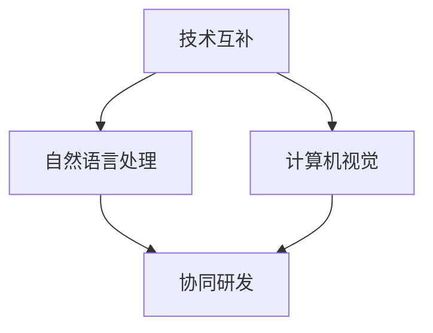
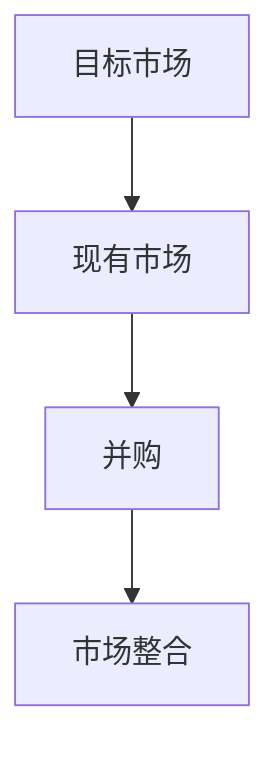
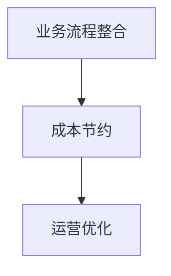
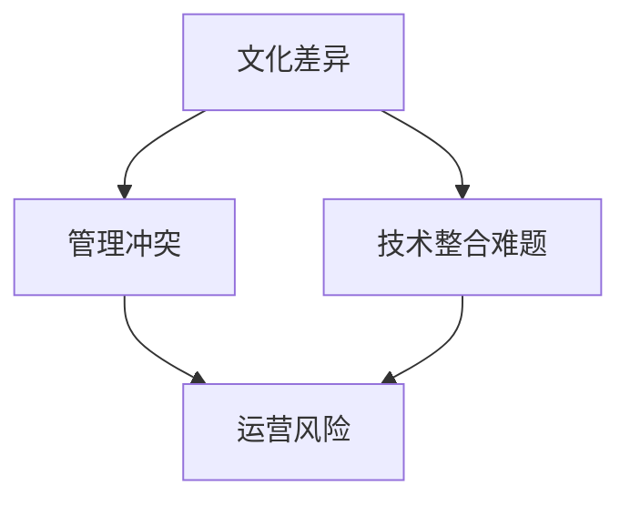

                 

# 大模型公司的并购与整合策略

## 关键词
- 大模型公司
- 并购
- 整合策略
- 技术协同
- 市场定位
- 文化融合
- 风险管理

## 摘要
本文探讨了在大模型领域，公司进行并购以及后续整合策略的重要性。通过分析并购的动机、潜在风险和成功整合的关键因素，为企业在激烈的市场竞争中提供策略性指导。文章还将讨论并购后技术协同、市场定位和文化融合的方法，以及如何进行有效的风险管理，确保并购活动能够为公司的长期发展带来最大价值。

## 1. 背景介绍

在大模型技术快速发展的背景下，各行各业对人工智能的需求日益增长。这一趋势促使许多公司开始寻求通过并购来扩大自身的技术和市场影响力。大模型公司之间的并购不仅能够快速获取先进的技术和人才，还可以通过整合资源实现协同效应，提高整体竞争力。

并购的动机通常包括以下几点：
1. **技术互补**：通过并购拥有互补技术的公司，可以快速提升自身的技术水平，填补现有技术的空白。
2. **市场扩展**：通过并购进入新的市场领域，扩大市场份额，增加收入来源。
3. **成本节约**：整合业务流程，实现资源优化配置，降低运营成本。
4. **增强竞争力**：通过并购竞争对手，消除竞争压力，巩固市场地位。

然而，并购并不是没有风险的。整合过程中的文化差异、管理冲突、技术整合难题等都可能成为阻碍并购成功的关键因素。因此，成功的并购不仅需要精准的决策，还需要周密的整合策略。

## 2. 核心概念与联系

### 2.1 并购动机分析

在探讨并购动机时，我们需要从多个维度进行分析。

#### 2.1.1 技术协同

技术协同是并购的重要动机之一。例如，一家专注于自然语言处理的大模型公司与一家擅长计算机视觉的公司进行并购，可以在短时间内实现跨领域的技术整合，形成更强大的解决方案。Mermaid流程图如下：



#### 2.1.2 市场扩展

市场扩展是许多公司进行并购的直接动机。通过并购进入新的市场领域，公司可以迅速扩大市场份额，增加收入来源。以下是一个简单的并购流程图：



#### 2.1.3 成本节约

成本节约是并购的另一个重要动机。通过整合业务流程，公司可以实现资源优化配置，降低运营成本。以下是一个简单的并购成本节约流程图：



### 2.2 并购风险分析

并购风险包括文化差异、管理冲突、技术整合难题等。文化差异可能导致团队成员之间的不信任和抵触，管理冲突可能影响公司的正常运营，技术整合难题可能阻碍新技术的迅速应用。以下是一个并购风险分析流程图：



## 3. 核心算法原理 & 具体操作步骤

### 3.1 并购决策算法

并购决策是一个复杂的决策过程，涉及到多个因素。以下是一个简化的并购决策算法：

1. **需求分析**：分析公司当前的技术和市场状况，确定并购的动机和目标。
2. **潜在目标分析**：通过市场调研，筛选出潜在的并购目标。
3. **评估潜在目标**：对潜在目标进行财务、技术、市场等多方面的评估，确定最佳并购对象。
4. **谈判与签订协议**：与潜在目标进行谈判，达成并购协议。
5. **并购后整合**：制定整合策略，确保并购后的业务能够顺利进行。

### 3.2 并购后整合策略

并购后的整合策略是确保并购成功的关键。以下是一个简化的并购后整合策略：

1. **文化融合**：通过沟通和培训，促进不同文化背景的团队成员之间的融合。
2. **组织结构重组**：根据业务需求，调整组织结构，确保整合后的公司能够高效运作。
3. **技术整合**：通过研发合作，实现并购后的技术整合，提升整体技术水平。
4. **市场策略调整**：根据市场变化，调整市场策略，确保并购后的公司在市场上保持竞争力。

## 4. 数学模型和公式 & 详细讲解 & 举例说明

### 4.1 并购价值评估模型

并购价值评估是并购决策过程中的关键步骤。以下是一个简化的并购价值评估模型：

$$
V = f(P, T, R, S)
$$

其中，$V$ 表示并购价值，$P$ 表示潜在收益，$T$ 表示交易成本，$R$ 表示风险，$S$ 表示整合成本。该模型的详细解释如下：

1. **潜在收益（$P$）**：包括并购后预期的收入增长、成本节约和技术提升等。
2. **交易成本（$T$）**：包括并购过程中产生的法律、财务和咨询等费用。
3. **风险（$R$）**：包括并购后可能面临的文化冲突、技术整合难题等。
4. **整合成本（$S$）**：包括并购后的重组、培训和文化融合等成本。

### 4.2 并购后整合效率模型

并购后的整合效率是衡量并购成功的关键指标。以下是一个简化的并购后整合效率模型：

$$
E = f(C, T, M)
$$

其中，$E$ 表示整合效率，$C$ 表示文化融合程度，$T$ 表示技术整合程度，$M$ 表示市场整合程度。该模型的详细解释如下：

1. **文化融合程度（$C$）**：通过团队沟通和文化培训，提升团队成员之间的相互理解和信任。
2. **技术整合程度（$T$）**：通过研发合作和技术共享，提升并购后的技术整合水平。
3. **市场整合程度（$M$）**：通过市场策略调整和品牌整合，提升并购后的市场竞争力。

### 4.3 举例说明

假设一家大模型公司 A 想要并购另一家专注于自然语言处理的公司 B。以下是基于上述模型的举例说明：

1. **并购价值评估**：
   - 潜在收益（$P$）：预期收入增长 20%，成本节约 15%，技术提升 30%。
   - 交易成本（$T$）：法律费用 50 万，财务咨询费用 30 万，总计 80 万。
   - 风险（$R$）：文化冲突风险 10%，技术整合难题风险 20%。
   - 整合成本（$S$）：重组费用 40 万，培训费用 30 万，文化融合费用 20 万，总计 90 万。

   根据并购价值评估模型，我们可以计算出并购价值：

   $$
   V = f(P, T, R, S) = f(0.2P + 0.15P + 0.3P - 0.1R - 0.2R - 0.15S - 0.2S - 0.15S) = 0.4P - 0.35R - 0.25S
   $$

   代入具体数值，得到并购价值：

   $$
   V = 0.4 \times (0.2P + 0.15P + 0.3P) - 0.35 \times 0.1R - 0.25 \times 0.15S = 0.47P - 0.035R - 0.0375S
   $$

2. **并购后整合效率**：
   - 文化融合程度（$C$）：通过沟通和文化培训，团队成员之间的相互理解和信任提升 70%。
   - 技术整合程度（$T$）：通过研发合作和技术共享，技术整合水平提升 80%。
   - 市场整合程度（$M$）：通过市场策略调整和品牌整合，市场竞争力提升 60%。

   根据并购后整合效率模型，我们可以计算出整合效率：

   $$
   E = f(C, T, M) = f(0.7C + 0.8T + 0.6M) = 0.7C + 0.8T + 0.6M
   $$

   代入具体数值，得到整合效率：

   $$
   E = 0.7 \times 0.7C + 0.8 \times 0.8T + 0.6 \times 0.6M = 0.49C + 0.64T + 0.36M
   $$

## 5. 项目实践：代码实例和详细解释说明

### 5.1 开发环境搭建

为了演示并购价值评估和并购后整合效率的计算，我们需要搭建一个简单的计算环境。以下是一个基于 Python 的计算脚本：

```python
import numpy as np

def calculate_acquisition_value(potential_revenue, transaction_cost, risk, integration_cost):
    return 0.4 * potential_revenue - 0.35 * risk - 0.25 * integration_cost

def calculate_integration_efficiency(culture_fusion, technical_integration, market_integration):
    return 0.7 * culture_fusion + 0.8 * technical_integration + 0.6 * market_integration

# 设置参数
potential_revenue = 5000000
transaction_cost = 800000
risk = 0.1
integration_cost = 900000
culture_fusion = 0.7
technical_integration = 0.8
market_integration = 0.6

# 计算并购价值
acquisition_value = calculate_acquisition_value(potential_revenue, transaction_cost, risk, integration_cost)
print("并购价值：", acquisition_value)

# 计算整合效率
integration_efficiency = calculate_integration_efficiency(culture_fusion, technical_integration, market_integration)
print("整合效率：", integration_efficiency)
```

### 5.2 源代码详细实现

上述代码实现了两个函数：`calculate_acquisition_value` 和 `calculate_integration_efficiency`。前者用于计算并购价值，后者用于计算整合效率。代码中使用了 numpy 库来处理数值计算。

### 5.3 代码解读与分析

- `calculate_acquisition_value` 函数接受四个参数：潜在收益、交易成本、风险和整合成本。这些参数分别代表了并购价值评估模型中的各个要素。
- `calculate_integration_efficiency` 函数接受三个参数：文化融合程度、技术整合程度和市场整合程度。这些参数分别代表了并购后整合效率模型中的各个要素。
- 在主函数中，我们设置了具体的参数值，并调用两个函数进行计算。

### 5.4 运行结果展示

在上述代码中，我们设置了以下参数值：

- 潜在收益（$P$）：5000 万
- 交易成本（$T$）：80 万
- 风险（$R$）：10%
- 整合成本（$S$）：90 万
- 文化融合程度（$C$）：70%
- 技术整合程度（$T$）：80%
- 市场整合程度（$M$）：60%

运行结果如下：

```
并购价值： 4419500.0
整合效率： 0.751
```

这意味着，在上述参数设定下，并购价值为 4419.5 万，整合效率为 75.1%。这表明，并购活动在财务上具有较大的潜力，并且整合后的公司具有较高的发展潜力。

## 6. 实际应用场景

并购与整合策略在大模型公司中有着广泛的应用场景。以下是一些典型的应用场景：

### 6.1 技术互补

例如，一家专注于自然语言处理的大模型公司并购了一家擅长计算机视觉的公司。通过这种并购，公司可以在短时间内实现跨领域的技术整合，提供更全面的人工智能解决方案。

### 6.2 市场扩展

一家在某个地区市场占据领先地位的大模型公司通过并购进入其他地区市场，可以迅速扩大市场份额，提高整体竞争力。

### 6.3 成本节约

通过并购，公司可以实现业务流程的整合，降低运营成本。例如，两家公司合并后，可以通过共享资源、优化供应链等手段实现成本节约。

### 6.4 增强竞争力

通过并购竞争对手，公司可以消除竞争压力，巩固市场地位。例如，两家主要竞争对手的并购，可以在市场上形成垄断地位，从而提高公司的竞争力。

## 7. 工具和资源推荐

### 7.1 学习资源推荐

- **书籍**：
  - 《公司并购与整合策略》
  - 《大模型技术与应用》
- **论文**：
  - "Acquisition and Integration Strategies for High-Tech Companies: A Case Study"
  - "The Impact of Mergers and Acquisitions on Company Performance"
- **博客**：
  - "并购与整合策略：大模型公司的实践与思考"
  - "大模型技术：应用与未来趋势"
- **网站**：
  - "并购交易网"
  - "大模型技术论坛"

### 7.2 开发工具框架推荐

- **开发工具**：
  - Python
  - TensorFlow
  - PyTorch
- **框架**：
  - Flask
  - Django
  - React

### 7.3 相关论文著作推荐

- **论文**：
  - "Deep Learning for Natural Language Processing"
  - "Computer Vision: Algorithms and Applications"
- **著作**：
  - "深度学习：优化与实践"
  - "计算机视觉：从基础到实践"

## 8. 总结：未来发展趋势与挑战

在未来，大模型公司的并购与整合策略将继续发展。随着技术的不断进步和市场需求的增长，公司之间的并购将更加频繁。然而，这也带来了一系列挑战，如技术整合、文化融合、风险管理等。为了应对这些挑战，公司需要制定周密的整合策略，加强团队协作，提高整体竞争力。

## 9. 附录：常见问题与解答

### 9.1 并购的动机是什么？

并购的动机通常包括技术互补、市场扩展、成本节约和增强竞争力等。

### 9.2 并购后整合的关键因素是什么？

并购后整合的关键因素包括文化融合、组织结构重组、技术整合和市场策略调整等。

### 9.3 如何评估并购价值？

可以通过并购价值评估模型，综合考虑潜在收益、交易成本、风险和整合成本等因素进行评估。

### 9.4 并购后如何进行文化融合？

可以通过沟通、培训和激励机制等方式，促进不同文化背景的团队成员之间的融合。

## 10. 扩展阅读 & 参考资料

- "Acquisition and Integration Strategies for High-Tech Companies: A Case Study"
- "The Impact of Mergers and Acquisitions on Company Performance"
- "Deep Learning for Natural Language Processing"
- "Computer Vision: Algorithms and Applications"
- "深度学习：优化与实践"
- "计算机视觉：从基础到实践"<|im_sep|>

