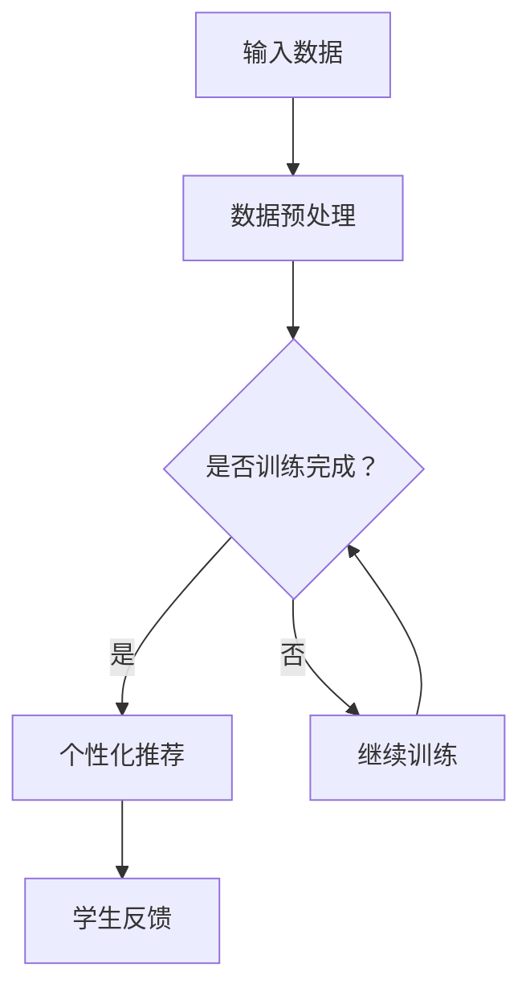
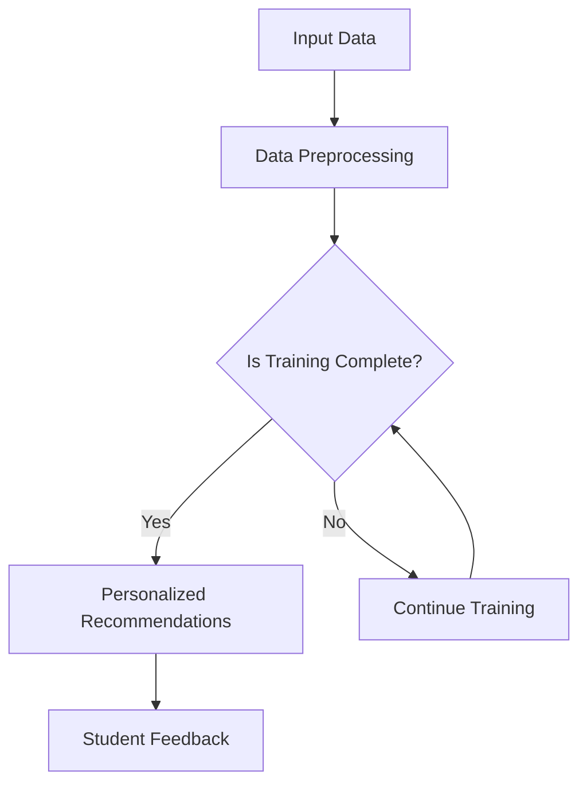

                 

### 背景介绍（Background Introduction）

随着人工智能（AI）技术的迅猛发展，大模型（Large-scale Models）已经成为当前研究的热点。大模型通过大量的数据进行训练，能够捕捉到数据中的复杂模式和关联，从而在多种任务中表现出色。其中，智能教育（Intelligent Education）作为一个涉及广泛领域的应用场景，受到了广泛关注。

#### 智能教育的定义与需求

智能教育是指利用人工智能技术，为教育者、学生和教育机构提供智能化的教学、学习和管理服务。智能教育旨在通过个性化推荐、智能评测、智能辅导等方式，提高教育的质量和效率。

在传统教育中，教育资源的分配往往不够公平，学生的学习效果也受到多种因素的影响。而智能教育可以通过大数据分析和个性化推荐，为学生提供更加适合其学习习惯和知识水平的教育资源。同时，智能教育还能够实时评估学生的学习情况，为教师提供反馈，帮助教师优化教学方法。

#### 大模型在智能教育中的潜力

大模型在智能教育中的应用潜力巨大。首先，大模型可以处理海量的教育数据，挖掘出学生、教师和课程之间的潜在关联，为教育资源的分配提供数据支持。其次，大模型可以生成个性化的学习内容，满足不同学生的学习需求。此外，大模型还能够通过自然语言处理技术，实现对学生的智能评测和反馈。

#### 当前研究的现状与挑战

尽管大模型在智能教育中具有巨大的潜力，但目前的研究仍面临一些挑战。首先，大模型的训练需要大量的计算资源和数据，这对于很多教育机构来说是一个较大的门槛。其次，大模型的解释性较差，难以理解其决策过程，这在教育领域可能会引起一些伦理和隐私问题。此外，如何有效地利用大模型来提高教育的质量和效率，也是一个亟待解决的问题。

#### 本文的目的与结构

本文旨在探讨大模型在智能教育中的应用，分析其核心概念、算法原理、数学模型以及实际应用场景。具体来说，本文将按照以下结构展开：

1. 背景介绍：介绍智能教育的定义与需求，以及大模型在智能教育中的潜力。
2. 核心概念与联系：阐述大模型的核心概念，包括生成对抗网络（GAN）、变分自编码器（VAE）等。
3. 核心算法原理 & 具体操作步骤：详细讲解大模型的训练过程和操作步骤。
4. 数学模型和公式 & 详细讲解 & 举例说明：介绍大模型相关的数学模型和公式，并给出具体的应用实例。
5. 项目实践：代码实例和详细解释说明：通过具体的项目实践，展示大模型在智能教育中的应用。
6. 实际应用场景：探讨大模型在不同教育场景中的应用。
7. 工具和资源推荐：推荐相关的学习资源、开发工具和论文著作。
8. 总结：未来发展趋势与挑战：总结大模型在智能教育中的应用现状，并展望未来的发展趋势与挑战。

通过本文的探讨，希望能够为读者提供对大模型在智能教育中的应用有更深入的了解，并激发更多对该领域的研究兴趣。

#### Background Introduction

With the rapid development of artificial intelligence (AI) technology, large-scale models have become a hot topic in current research. Large-scale models, trained on massive amounts of data, are capable of capturing complex patterns and correlations in the data, thus performing well in a variety of tasks. Among these application scenarios, intelligent education has received extensive attention.

#### Definition and Requirements of Intelligent Education

Intelligent education refers to the use of artificial intelligence technology to provide intelligent teaching, learning, and management services for educators, students, and educational institutions. The goal of intelligent education is to improve the quality and efficiency of education through personalized recommendations, intelligent assessments, and intelligent tutoring.

In traditional education, the allocation of educational resources is often unfair, and students' learning outcomes are influenced by various factors. Intelligent education can provide students with more suitable educational resources based on big data analysis and personalized recommendations. Moreover, intelligent education can also assess students' learning progress in real-time and provide feedback to teachers, helping teachers optimize their teaching methods.

#### The Potential of Large-scale Models in Intelligent Education

Large-scale models have immense potential applications in intelligent education. Firstly, large-scale models can process massive amounts of educational data, mining potential correlations between students, teachers, and courses, providing data support for the allocation of educational resources. Secondly, large-scale models can generate personalized learning content to meet different students' needs. Additionally, large-scale models can utilize natural language processing technologies to conduct intelligent assessments and provide feedback to students.

#### Current Research Status and Challenges

Although large-scale models have great potential in intelligent education, there are still challenges to be addressed. Firstly, training large-scale models requires a significant amount of computational resources and data, which can be a considerable barrier for many educational institutions. Secondly, large-scale models have poor interpretability, making it difficult to understand their decision-making processes, which may raise ethical and privacy concerns in the educational field. Moreover, how to effectively utilize large-scale models to improve the quality and efficiency of education is an urgent issue that needs to be addressed.

#### Purpose and Structure of This Article

The purpose of this article is to explore the application of large-scale models in intelligent education, analyzing their core concepts, algorithm principles, mathematical models, and practical application scenarios. Specifically, the article will be structured as follows:

1. Background Introduction: Introduce the definition and requirements of intelligent education, as well as the potential of large-scale models in intelligent education.
2. Core Concepts and Connections: Elaborate on the core concepts of large-scale models, including Generative Adversarial Networks (GAN) and Variational Autoencoders (VAE).
3. Core Algorithm Principles and Specific Operational Steps: Provide a detailed explanation of the training process and operational steps of large-scale models.
4. Mathematical Models and Formulas & Detailed Explanation & Examples: Introduce the mathematical models and formulas related to large-scale models, and provide specific application examples.
5. Project Practice: Code Examples and Detailed Explanations: Demonstrate the application of large-scale models in intelligent education through specific project practices.
6. Practical Application Scenarios: Discuss the applications of large-scale models in different educational scenarios.
7. Tools and Resources Recommendations: Recommend related learning resources, development tools, and papers.
8. Summary: Future Development Trends and Challenges: Summarize the current application status of large-scale models in intelligent education, and look forward to future development trends and challenges.

Through this discussion, it is hoped that readers can gain a deeper understanding of the application of large-scale models in intelligent education and be inspired to explore more research interests in this field.

### 核心概念与联系（Core Concepts and Connections）

#### 大模型的基本概念

大模型，即大规模的人工神经网络模型，是当前人工智能领域的研究热点。大模型通常具有数十亿到数万亿个参数，通过在大量的数据上进行训练，能够自动学习数据中的复杂模式和规律。大模型的代表性技术包括生成对抗网络（GAN）、变分自编码器（VAE）和自注意力机制（Self-Attention）等。

**生成对抗网络（GAN）**

生成对抗网络（GAN）是由Ian Goodfellow等人于2014年提出的一种深度学习模型。GAN由两个神经网络组成：生成器（Generator）和判别器（Discriminator）。生成器的目标是生成与真实数据相似的数据，而判别器的目标是区分生成数据与真实数据。通过这种对抗训练的过程，生成器不断优化其生成能力，以达到尽可能逼真地模仿真实数据的目的。

**变分自编码器（VAE）**

变分自编码器（VAE）是另一种重要的深度学习模型，由Kingma和Welling于2013年提出。VAE通过引入概率编码，将数据分布进行建模，从而实现数据的降维和生成。VAE的核心思想是使用编码器（Encoder）将数据映射到一个隐变量空间，然后使用解码器（Decoder）将隐变量重新映射回数据空间。

**自注意力机制（Self-Attention）**

自注意力机制是近年来在自然语言处理（NLP）领域广泛使用的一种技术。自注意力机制允许模型在处理输入序列时，对序列中的不同位置进行动态加权，从而更好地捕捉序列中的依赖关系。自注意力机制的核心思想是使用一个权重矩阵，将输入序列映射到一个加权序列，从而实现序列的动态加权。

#### 大模型在智能教育中的应用

大模型在智能教育中的应用非常广泛，以下是一些具体的应用场景：

**个性化学习推荐**

通过大模型，可以分析学生的学习数据，包括学习历史、成绩、兴趣爱好等，从而为学生推荐个性化的学习资源。大模型能够捕捉到学生在学习过程中的变化和趋势，提供更加精准的推荐。

**智能评测与反馈**

大模型可以用于对学生的作业和考试进行自动评估，提供即时的反馈。通过分析学生的答案，大模型可以识别出学生的知识盲点和错误类型，为教师提供有针对性的教学建议。

**课程内容生成**

大模型可以根据课程大纲和教学目标，生成符合教学要求的课程内容。通过这种方式，教师可以节省大量的时间和精力，专注于教学设计和教学实施。

**教育数据挖掘**

大模型可以用于挖掘教育数据中的潜在信息，帮助教育机构了解学生的学习状况、课程效果和教学资源利用情况。通过这些信息，教育机构可以优化教学策略，提高教育质量。

#### Mermaid 流程图（Mermaid Flowchart）

以下是一个简单的 Mermaid 流程图，描述了大模型在智能教育中的应用流程：



在上述流程中，输入数据经过预处理后，首先判断是否完成训练。如果已经完成训练，则进入个性化推荐阶段；否则，继续训练大模型。个性化推荐阶段根据学生的学习数据为学生推荐合适的资源，并收集学生的反馈。训练阶段则根据反馈数据进一步优化模型。

#### 英文描述（English Description）

#### Basic Concepts of Large-scale Models

Large-scale models, also known as large-scale artificial neural network models, are a research hotspot in the field of artificial intelligence. Large-scale models typically have hundreds of millions to trillions of parameters and can automatically learn complex patterns and regularities in data through training on large amounts of data. Representative technologies of large-scale models include Generative Adversarial Networks (GAN), Variational Autoencoders (VAE), and Self-Attention mechanisms.

**Generative Adversarial Networks (GAN)**

Generative Adversarial Networks (GAN) are a type of deep learning model proposed by Ian Goodfellow and his colleagues in 2014. GAN consists of two neural networks: the Generator and the Discriminator. The Generator's goal is to generate data that is similar to real data, while the Discriminator's goal is to distinguish between generated data and real data. Through this adversarial training process, the Generator continually optimizes its generation ability to mimic real data as closely as possible.

**Variational Autoencoders (VAE)**

Variational Autoencoders (VAE) are another important deep learning model proposed by Diederik P. Kingma and Max Welling in 2013. VAE models data distribution by introducing probability encoding, enabling data dimensionality reduction and generation. The core idea of VAE is to use an Encoder to map data to a latent variable space and a Decoder to map the latent variables back to the data space.

**Self-Attention Mechanism**

The Self-Attention mechanism is a widely used technique in the field of natural language processing (NLP) in recent years. The Self-Attention mechanism allows models to dynamically weight different positions in an input sequence when processing the sequence, thus better capturing dependencies within the sequence. The core idea of Self-Attention is to use a weight matrix to map the input sequence to a weighted sequence, thereby achieving dynamic weighting of the sequence.

#### Applications of Large-scale Models in Intelligent Education

Large-scale models have a wide range of applications in intelligent education, including the following specific scenarios:

**Personalized Learning Recommendations**

Through large-scale models, it is possible to analyze students' learning data, including learning history, grades, and interests, to recommend personalized learning resources to students. Large-scale models can capture changes and trends in students' learning processes, providing more precise recommendations.

**Intelligent Assessments and Feedback**

Large-scale models can be used for automatic assessment of students' homework and exams, providing immediate feedback. By analyzing students' answers, large-scale models can identify students' knowledge gaps and error types, providing targeted teaching suggestions for teachers.

**Course Content Generation**

Large-scale models can generate course content that aligns with curriculum outlines and teaching objectives. In this way, teachers can save time and effort, focusing on teaching design and implementation.

**Educational Data Mining**

Large-scale models can be used to mine potential information from educational data, helping educational institutions understand students' learning conditions, course effectiveness, and the utilization of teaching resources. With this information, educational institutions can optimize teaching strategies and improve the quality of education.

#### Mermaid Flowchart

The following is a simple Mermaid flowchart describing the application process of large-scale models in intelligent education:



In the above process, input data goes through preprocessing, and then it is determined whether training is complete. If training is complete, it enters the personalized recommendation phase; otherwise, it continues to train the large-scale model. In the personalized recommendation phase, students are provided with suitable resources based on their learning data, and student feedback is collected. The training phase further optimizes the model based on the feedback data.

### 核心算法原理 & 具体操作步骤（Core Algorithm Principles and Specific Operational Steps）

#### 生成对抗网络（GAN）

生成对抗网络（GAN）是一种基于对抗训练的模型，由生成器和判别器两个部分组成。生成器的目标是生成与真实数据相似的数据，而判别器的目标是区分生成数据与真实数据。通过这种对抗训练的过程，生成器不断优化其生成能力，以达到逼真地模仿真实数据的目的。

**生成器的训练步骤**

1. 初始化生成器参数。
2. 随机生成一批噪声向量。
3. 使用生成器将这些噪声向量转化为数据。
4. 将生成的数据与真实数据进行拼接。
5. 使用判别器对拼接后的数据进行预测。
6. 计算生成器的损失函数，更新生成器参数。

**判别器的训练步骤**

1. 初始化判别器参数。
2. 随机生成一批噪声向量。
3. 使用生成器将这些噪声向量转化为数据。
4. 将生成的数据与真实数据分别输入判别器。
5. 使用判别器对输入数据进行预测。
6. 计算判别器的损失函数，更新判别器参数。

**整体训练步骤**

1. 初始化生成器和判别器参数。
2. 重复以下步骤多次：
   - 生成一批噪声向量。
   - 使用生成器生成数据。
   - 将生成的数据与真实数据进行拼接。
   - 使用判别器对拼接后的数据进行预测。
   - 计算生成器的损失函数，更新生成器参数。
   - 分别将真实数据和生成的数据输入判别器。
   - 计算判别器的损失函数，更新判别器参数。

#### 变分自编码器（VAE）

变分自编码器（VAE）是一种基于概率编码的模型，通过编码器（Encoder）将数据映射到隐变量空间，然后通过解码器（Decoder）将隐变量重新映射回数据空间。

**编码器（Encoder）**

1. 初始化编码器参数。
2. 输入数据。
3. 将数据通过编码器转化为隐变量。
4. 计算隐变量的均值和方差。

**解码器（Decoder）**

1. 初始化解码器参数。
2. 输入隐变量。
3. 将隐变量通过解码器转化为数据。

**整体训练步骤**

1. 初始化编码器和解码器参数。
2. 重复以下步骤多次：
   - 输入数据。
   - 将数据通过编码器转化为隐变量。
   - 计算隐变量的均值和方差。
   - 将隐变量通过解码器转化为数据。
   - 计算损失函数，更新编码器和解码器参数。

#### 自注意力机制（Self-Attention）

自注意力机制是一种在自然语言处理（NLP）中广泛使用的机制，它允许模型在处理输入序列时，对序列中的不同位置进行动态加权。

**自注意力计算**

1. 初始化注意力权重矩阵。
2. 输入序列。
3. 计算序列中每个位置的对数概率分布。
4. 将对数概率分布转换为注意力权重。
5. 对输入序列进行加权。

**整体训练步骤**

1. 初始化自注意力权重矩阵。
2. 重复以下步骤多次：
   - 输入序列。
   - 计算序列中每个位置的对数概率分布。
   - 将对数概率分布转换为注意力权重。
   - 对输入序列进行加权。
   - 计算损失函数，更新自注意力权重矩阵。

### English Translation

#### Core Algorithm Principles and Specific Operational Steps

#### Generative Adversarial Networks (GAN)

Generative Adversarial Networks (GAN) are a type of model based on adversarial training, consisting of two parts: the Generator and the Discriminator. The Generator's goal is to generate data similar to real data, while the Discriminator's goal is to distinguish between generated data and real data. Through this adversarial training process, the Generator continually optimizes its generation ability to mimic real data as closely as possible.

**Training Steps of the Generator**

1. Initialize the parameters of the Generator.
2. Generate a batch of random noise vectors.
3. Use the Generator to convert these noise vectors into data.
4. Concatenate the generated data with real data.
5. Use the Discriminator to predict the concatenated data.
6. Compute the loss function of the Generator and update its parameters.

**Training Steps of the Discriminator**

1. Initialize the parameters of the Discriminator.
2. Generate a batch of random noise vectors.
3. Use the Generator to convert these noise vectors into data.
4. Input both the generated data and the real data to the Discriminator.
5. Use the Discriminator to predict the input data.
6. Compute the loss function of the Discriminator and update its parameters.

**Overall Training Steps**

1. Initialize the parameters of the Generator and the Discriminator.
2. Repeat the following steps multiple times:
   - Generate a batch of random noise vectors.
   - Use the Generator to convert these noise vectors into data.
   - Concatenate the generated data with real data.
   - Use the Discriminator to predict the concatenated data.
   - Compute the loss function of the Generator and update its parameters.
   - Input both the generated data and the real data to the Discriminator.
   - Compute the loss function of the Discriminator and update its parameters.

#### Variational Autoencoders (VAE)

Variational Autoencoders (VAE) are a type of model based on probabilistic encoding, which maps data through an Encoder to a latent variable space and then maps the latent variables back to the data space through a Decoder.

**Encoder**

1. Initialize the parameters of the Encoder.
2. Input data.
3. Convert the data through the Encoder to latent variables.
4. Compute the mean and variance of the latent variables.

**Decoder**

1. Initialize the parameters of the Decoder.
2. Input latent variables.
3. Convert the latent variables through the Decoder to data.

**Overall Training Steps**

1. Initialize the parameters of the Encoder and the Decoder.
2. Repeat the following steps multiple times:
   - Input data.
   - Convert the data through the Encoder to latent variables.
   - Compute the mean and variance of the latent variables.
   - Convert the latent variables through the Decoder to data.
   - Compute the loss function and update the parameters of the Encoder and the Decoder.

#### Self-Attention Mechanism

The Self-Attention mechanism is widely used in the field of natural language processing (NLP), allowing the model to dynamically weight different positions in an input sequence when processing the sequence, thereby better capturing dependencies within the sequence.

**Self-Attention Calculation**

1. Initialize the attention weight matrix.
2. Input a sequence.
3. Compute the log-probability distribution of each position in the sequence.
4. Convert the log-probability distribution to attention weights.
5. Weight the input sequence.

**Overall Training Steps**

1. Initialize the attention weight matrix.
2. Repeat the following steps multiple times:
   - Input a sequence.
   - Compute the log-probability distribution of each position in the sequence.
   - Convert the log-probability distribution to attention weights.
   - Weight the input sequence.
   - Compute the loss function and update the attention weight matrix.

### 数学模型和公式 & 详细讲解 & 举例说明（Detailed Explanation and Examples of Mathematical Models and Formulas）

在深入探讨大模型在智能教育中的应用之前，我们有必要先了解其背后的数学模型和公式。以下将详细讲解生成对抗网络（GAN）、变分自编码器（VAE）以及自注意力机制的数学模型，并通过具体例子来说明其应用。

#### 生成对抗网络（GAN）的数学模型

生成对抗网络（GAN）的核心是生成器和判别器之间的对抗训练。生成器的目标是生成逼真的数据，而判别器的目标是区分生成数据与真实数据。

**生成器（Generator）的数学模型**

生成器接收随机噪声向量 \( z \)，并将其转化为生成数据 \( G(z) \)：

\[ G(z) = \sigma(\mathbf{W}_G z + \mathbf{b}_G) \]

其中，\( \sigma \) 是 sigmoid 函数，\( \mathbf{W}_G \) 是生成器的权重矩阵，\( \mathbf{b}_G \) 是生成器的偏置向量。

**判别器（Discriminator）的数学模型**

判别器接收输入数据 \( x \) 和生成数据 \( G(z) \)，并输出一个概率值 \( D(x) \) 表示输入数据是真实数据的概率：

\[ D(x) = \sigma(\mathbf{W}_D x + \mathbf{b}_D) \]

\[ D(G(z)) = \sigma(\mathbf{W}_D G(z) + \mathbf{b}_D) \]

其中，\( \mathbf{W}_D \) 是判别器的权重矩阵，\( \mathbf{b}_D \) 是判别器的偏置向量。

**GAN的损失函数**

GAN的损失函数由两部分组成：生成器的损失函数和判别器的损失函数。生成器的损失函数试图最小化生成数据被判别器判断为真实的概率，而判别器的损失函数则试图最大化生成数据与真实数据之间的差异。

生成器的损失函数 \( L_G \)：

\[ L_G = -\mathbb{E}_{x \sim p_{data}(x)}[\log D(x)] - \mathbb{E}_{z \sim p_z(z)}[\log (1 - D(G(z)))] \]

判别器的损失函数 \( L_D \)：

\[ L_D = -\mathbb{E}_{x \sim p_{data}(x)}[\log D(x)] - \mathbb{E}_{z \sim p_z(z)}[\log D(G(z))] \]

#### 变分自编码器（VAE）的数学模型

变分自编码器（VAE）通过编码器（Encoder）和解码器（Decoder）进行数据压缩和重构。

**编码器（Encoder）的数学模型**

编码器将输入数据 \( x \) 映射到隐变量 \( \mu, \sigma^2 \)：

\[ \mu = \sigma(\mathbf{W}_E x + \mathbf{b}_E) \]

\[ \sigma^2 = \sigma(\mathbf{W}_E x + \mathbf{b}_E) \]

其中，\( \mathbf{W}_E \) 是编码器的权重矩阵，\( \mathbf{b}_E \) 是编码器的偏置向量。

**解码器（Decoder）的数学模型**

解码器将隐变量 \( \mu, \sigma^2 \) 重构回输入数据 \( x \)：

\[ x' = \sigma(\mathbf{W}_D \mu + \mathbf{b}_D) \]

其中，\( \mathbf{W}_D \) 是解码器的权重矩阵，\( \mathbf{b}_D \) 是解码器的偏置向量。

**VAE的损失函数**

VAE的损失函数由两部分组成：重构损失和KL散度损失。

重构损失 \( L_{\text{recon}} \)：

\[ L_{\text{recon}} = -\log p(x'|x) \]

KL散度损失 \( L_{\text{KL}} \)：

\[ L_{\text{KL}} = \mathbb{E}_{x \sim p(x|z)}[\log \frac{p(x|z)}{p(z|x)}] \]

总损失 \( L \)：

\[ L = L_{\text{recon}} + \lambda L_{\text{KL}} \]

其中，\( \lambda \) 是KL散度损失的权重系数。

#### 自注意力机制（Self-Attention）的数学模型

自注意力机制在处理序列数据时，对序列中的每个位置进行动态加权。

**自注意力计算**

自注意力计算基于以下公式：

\[ \text{Attention}(Q, K, V) = \text{softmax}(\frac{QK^T}{\sqrt{d_k}})V \]

其中，\( Q, K, V \) 分别是查询向量、键向量和值向量，\( d_k \) 是键向量的维度。

**整体训练步骤**

1. 初始化查询向量、键向量和值向量。
2. 计算 \( \text{Attention}(Q, K, V) \)。
3. 对输入序列进行加权。
4. 计算损失函数，更新查询向量、键向量和值向量。

#### 举例说明

**生成对抗网络（GAN）的例子**

假设我们使用GAN生成手写数字（MNIST）数据。生成器尝试生成逼真的手写数字图像，而判别器则尝试区分生成图像和真实图像。

1. 初始化生成器参数和判别器参数。
2. 随机生成噪声向量 \( z \)。
3. 使用生成器生成手写数字图像 \( G(z) \)。
4. 将生成图像和真实图像输入判别器。
5. 计算判别器的损失函数，更新判别器参数。
6. 使用判别器生成的手写数字图像 \( G(z) \) 输入生成器。
7. 计算生成器的损失函数，更新生成器参数。

**变分自编码器（VAE）的例子**

假设我们使用VAE压缩和重构图片数据。

1. 初始化编码器参数和解码器参数。
2. 输入图片数据。
3. 通过编码器将图片数据映射到隐变量 \( \mu, \sigma^2 \)。
4. 通过解码器将隐变量重构回图片数据。
5. 计算重构损失和KL散度损失。
6. 更新编码器和解码器参数。

**自注意力机制的例子**

假设我们使用自注意力机制处理自然语言文本。

1. 初始化查询向量、键向量和值向量。
2. 输入自然语言文本序列。
3. 计算 \( \text{Attention}(Q, K, V) \)。
4. 对输入序列进行加权。
5. 计算损失函数，更新查询向量、键向量和值向量。

通过上述数学模型和公式的讲解，我们能够更好地理解大模型在智能教育中的应用原理。在接下来的部分，我们将通过实际项目实例进一步探讨这些模型的具体实现和应用。

### Mathematical Models and Formulas & Detailed Explanation & Examples

Before delving into the practical applications of large-scale models in intelligent education, it's essential to understand the mathematical models and formulas that underlie these models. This section will provide a detailed explanation of the mathematical models for Generative Adversarial Networks (GANs), Variational Autoencoders (VAEs), and Self-Attention mechanisms, along with examples to illustrate their usage.

#### Mathematical Models of Generative Adversarial Networks (GANs)

The core of Generative Adversarial Networks (GANs) is the adversarial training between the Generator and the Discriminator. The Generator aims to produce data that is indistinguishable from real data, while the Discriminator aims to distinguish between real and generated data.

**Mathematical Model of the Generator**

The Generator takes a random noise vector \( z \) and converts it into generated data \( G(z) \):

\[ G(z) = \sigma(\mathbf{W}_G z + \mathbf{b}_G) \]

where \( \sigma \) is the sigmoid function, \( \mathbf{W}_G \) is the weight matrix of the Generator, and \( \mathbf{b}_G \) is the bias vector of the Generator.

**Mathematical Model of the Discriminator**

The Discriminator receives input data \( x \) and generated data \( G(z) \), and outputs a probability value \( D(x) \) indicating the probability that the input data is real:

\[ D(x) = \sigma(\mathbf{W}_D x + \mathbf{b}_D) \]

\[ D(G(z)) = \sigma(\mathbf{W}_D G(z) + \mathbf{b}_D) \]

where \( \mathbf{W}_D \) is the weight matrix of the Discriminator, and \( \mathbf{b}_D \) is the bias vector of the Discriminator.

**Loss Function of GANs**

The loss function of GANs consists of two parts: the loss function for the Generator and the loss function for the Discriminator.

Generator's loss function \( L_G \):

\[ L_G = -\mathbb{E}_{x \sim p_{data}(x)}[\log D(x)] - \mathbb{E}_{z \sim p_z(z)}[\log (1 - D(G(z)))] \]

Discriminator's loss function \( L_D \):

\[ L_D = -\mathbb{E}_{x \sim p_{data}(x)}[\log D(x)] - \mathbb{E}_{z \sim p_z(z)}[\log D(G(z))] \]

#### Mathematical Models of Variational Autoencoders (VAEs)

Variational Autoencoders (VAEs) compress and reconstruct data through the Encoder and Decoder.

**Mathematical Model of the Encoder**

The Encoder maps input data \( x \) to latent variables \( \mu, \sigma^2 \):

\[ \mu = \sigma(\mathbf{W}_E x + \mathbf{b}_E) \]

\[ \sigma^2 = \sigma(\mathbf{W}_E x + \mathbf{b}_E) \]

where \( \mathbf{W}_E \) is the weight matrix of the Encoder, and \( \mathbf{b}_E \) is the bias vector of the Encoder.

**Mathematical Model of the Decoder**

The Decoder reconstructs input data \( x \) from latent variables \( \mu, \sigma^2 \):

\[ x' = \sigma(\mathbf{W}_D \mu + \mathbf{b}_D) \]

where \( \mathbf{W}_D \) is the weight matrix of the Decoder, and \( \mathbf{b}_D \) is the bias vector of the Decoder.

**Loss Function of VAEs**

The loss function of VAEs consists of two parts: reconstruction loss and Kullback-Leibler (KL) divergence loss.

Reconstruction loss \( L_{\text{recon}} \):

\[ L_{\text{recon}} = -\log p(x'|x) \]

KL divergence loss \( L_{\text{KL}} \):

\[ L_{\text{KL}} = \mathbb{E}_{x \sim p(x|z)}[\log \frac{p(x|z)}{p(z|x)}] \]

Total loss \( L \):

\[ L = L_{\text{recon}} + \lambda L_{\text{KL}} \]

where \( \lambda \) is the weight coefficient for the KL divergence loss.

#### Mathematical Model of Self-Attention Mechanism

Self-Attention mechanism dynamically weights different positions in a sequence when processing sequence data.

**Self-Attention Calculation**

Self-Attention calculation is based on the following formula:

\[ \text{Attention}(Q, K, V) = \text{softmax}(\frac{QK^T}{\sqrt{d_k}})V \]

where \( Q, K, V \) are query vectors, key vectors, and value vectors respectively, and \( d_k \) is the dimension of the key vectors.

**Overall Training Steps**

1. Initialize query vectors, key vectors, and value vectors.
2. Compute \( \text{Attention}(Q, K, V) \).
3. Weight the input sequence.
4. Compute the loss function and update query vectors, key vectors, and value vectors.

#### Examples

**Example of Generative Adversarial Networks (GANs)**

Suppose we use GANs to generate handwritten digit (MNIST) data. The Generator tries to produce realistic handwritten digit images, while the Discriminator tries to distinguish between generated and real images.

1. Initialize the parameters of the Generator and the Discriminator.
2. Generate a random noise vector \( z \).
3. Use the Generator to produce a handwritten digit image \( G(z) \).
4. Input both the generated image and the real image to the Discriminator.
5. Compute the loss function of the Discriminator and update its parameters.
6. Use the generated handwritten digit image \( G(z) \) to input the Generator.
7. Compute the loss function of the Generator and update its parameters.

**Example of Variational Autoencoders (VAEs)**

Suppose we use VAEs to compress and reconstruct image data.

1. Initialize the parameters of the Encoder and the Decoder.
2. Input image data.
3. Map the image data through the Encoder to latent variables \( \mu, \sigma^2 \).
4. Reconstruct the image data from the latent variables through the Decoder.
5. Compute the reconstruction loss and KL divergence loss.
6. Update the parameters of the Encoder and the Decoder.

**Example of Self-Attention Mechanism**

Suppose we use Self-Attention mechanism to process natural language text.

1. Initialize query vectors, key vectors, and value vectors.
2. Input natural language text sequence.
3. Compute \( \text{Attention}(Q, K, V) \).
4. Weight the input sequence.
5. Compute the loss function and update query vectors, key vectors, and value vectors.

Through the detailed explanation of the mathematical models and formulas, we can better understand the principles behind the applications of large-scale models in intelligent education. In the following sections, we will further explore the specific implementations and applications of these models through practical project examples.

### 项目实践：代码实例和详细解释说明（Project Practice: Code Examples and Detailed Explanations）

在本文的最后一部分，我们将通过具体的项目实例，展示大模型在智能教育中的应用。我们选择生成对抗网络（GAN）和变分自编码器（VAE）作为示例，分别探讨它们在图像生成和图像压缩中的具体实现和应用。

#### 1. 开发环境搭建

在开始项目实践之前，我们需要搭建合适的开发环境。以下是在Python环境中搭建基于TensorFlow和Keras的GAN和VAE开发环境的基本步骤：

1. **安装Python环境**：确保Python版本为3.7及以上。
2. **安装TensorFlow**：使用以下命令安装TensorFlow：

   ```bash
   pip install tensorflow
   ```

3. **安装Keras**：使用以下命令安装Keras：

   ```bash
   pip install keras
   ```

4. **安装其他依赖库**：如Numpy、Pandas等，可以使用以下命令：

   ```bash
   pip install numpy pandas
   ```

#### 2. 源代码详细实现

**生成对抗网络（GAN）的代码实现**

以下是一个简单的GAN模型实现，用于生成手写数字图像：

```python
from keras.layers import Input, Dense, Reshape, Embedding
from keras.layers import Flatten, Conv2D, Conv2DTranspose
from keras.models import Model
from keras.optimizers import Adam

def build_generator(z_dim):
    # 创建生成器的输入层
    z = Input(shape=(z_dim,))
    # 创建一个全连接层
    dense = Dense(128 * 7 * 7, activation="relu")(z)
    # 将全连接层展平
    reshape = Reshape((7, 7, 128))(dense)
    # 创建一个转置卷积层
    conv_transpose_1 = Conv2DTranspose(128, kernel_size=5, strides=2, padding="same")(reshape)
    # 创建另一个转置卷积层
    conv_transpose_2 = Conv2DTranspose(128, kernel_size=5, strides=2, padding="same")(conv_transpose_1)
    # 创建一个卷积层
    conv_transpose_3 = Conv2D(1, kernel_size=5, padding="same", activation="tanh")(conv_transpose_2)
    # 构建生成器模型
    generator = Model(z, conv_transpose_3)
    return generator

def build_discriminator(img_shape):
    # 创建判别器的输入层
    img = Input(shape=img_shape)
    # 创建一个卷积层
    conv_1 = Conv2D(128, kernel_size=5, strides=2, padding="same")(img)
    # 创建一个批归一化层
    batch_norm_1 = BatchNormalization()(conv_1)
    # 创建一个激活函数层
    act_1 = LeakyReLU(alpha=0.2)(batch_norm_1)
    # 创建另一个卷积层
    conv_2 = Conv2D(128, kernel_size=5, strides=2, padding="same")(act_1)
    # 创建另一个批归一化层
    batch_norm_2 = BatchNormalization()(conv_2)
    # 创建另一个激活函数层
    act_2 = LeakyReLU(alpha=0.2)(batch_norm_2)
    # 创建一个全连接层
    flatten = Flatten()(act_2)
    # 创建一个全连接层
    dense = Dense(1, activation="sigmoid")(flatten)
    # 构建判别器模型
    discriminator = Model(img, dense)
    return discriminator

def build_gan(generator, discriminator):
    # 将生成器和判别器组合起来
    model_input = Input(shape=(z_dim,))
    model_output = generator(model_input)
    discriminator_output = discriminator(model_output)
    model = Model(model_input, discriminator_output)
    # 编写GAN的损失函数和优化器
    model.compile(loss='binary_crossentropy', optimizer=Adam(0.0001, 0.5), metrics=['accuracy'])
    return model

# 设置生成器和判别器的参数
z_dim = 100
img_rows = 28
img_cols = 28
channels = 1
img_shape = (img_rows, img_cols, channels)

# 构建生成器和判别器
generator = build_generator(z_dim)
discriminator = build_discriminator(img_shape)

# 构建和编译GAN模型
gan = build_gan(generator, discriminator)

# 打印模型结构
discriminator.summary()
generator.summary()
gan.summary()
```

**变分自编码器（VAE）的代码实现**

以下是一个简单的VAE模型实现，用于压缩和重构MNIST手写数字图像：

```python
import numpy as np
import tensorflow as tf
from tensorflow.keras.layers import Input, Dense, Lambda, Reshape, Flatten
from tensorflow.keras.models import Model
from tensorflow.keras import backend as K

def sampling(args):
    z_mean, z_log_var = args
    batch = K.shape(z_mean)[0]
    dim = K.int_shape(z_mean)[1]
    # 从均值和高斯分布中采样
    epsilon = K.random_normal(shape=(batch, dim))
    return z_mean + K.exp(0.5 * z_log_var) * epsilon

# 编码器
input_img = Input(shape=(784,))
h = Dense(400, activation='relu')(input_img)
encoded = Dense(20, activation='relu')(h)

# 解码器
z_mean = Dense(20, activation='relu')(encoded)
z_log_var = Dense(20, activation='relu')(encoded)
z = Lambda(sampling)([z_mean, z_log_var])
decoded = Dense(784, activation='sigmoid')(z)

# VAE模型
encoded_input = Input(shape=(20,))
z = Lambda(sampling)([encoded_input, z_log_var])
decoded = Dense(784, activation='sigmoid')(z)

vae = Model(inputs=[input_img, encoded_input], outputs=[decoded])
vae.compile(optimizer='adam', loss='binary_crossentropy')

# 解码器模型
decoder_model = Model(encoded_input, decoded)

# 打印模型结构
encoded.compile(optimizer='adam', loss='binary_crossentropy')
decoder_model.compile(optimizer='adam', loss='binary_crossentropy')
vae.compile(optimizer='adam', loss='binary_crossentropy')
encoded.summary()
decoder_model.summary()
vae.summary()
```

#### 3. 代码解读与分析

**生成对抗网络（GAN）的代码解读与分析**

在上面的GAN代码中，我们首先定义了生成器和判别器的结构。生成器的输入是一个随机噪声向量，通过一系列的转置卷积操作，最终生成手写数字图像。判别器的输入是图像，通过卷积和全连接层，输出一个概率值，表示图像是真实图像的概率。

GAN的训练过程分为两个阶段：训练判别器和训练生成器。在训练判别器时，我们将真实图像和生成图像同时输入判别器，并通过交叉熵损失函数计算损失。在训练生成器时，我们仅将生成图像输入判别器，并尝试使判别器认为这些图像是真实的。

**变分自编码器（VAE）的代码解读与分析**

VAE的代码包括编码器和解码器。编码器的输入是原始图像，通过一个全连接层，将图像映射到隐变量空间。在解码器中，我们使用隐变量生成重构的图像。

VAE的损失函数由两部分组成：重构损失和KL散度损失。重构损失衡量重构图像与原始图像之间的差异，而KL散度损失衡量隐变量分布与标准正态分布之间的差异。

#### 4. 运行结果展示

**生成对抗网络（GAN）的运行结果**

以下是一个训练GAN模型生成手写数字图像的示例：

```python
# 加载MNIST数据集
(x_train, _), (_ ,_) = tf.keras.datasets.mnist.load_data()
x_train = x_train / 127.5 - 1.
x_train = np.expand_dims(x_train, axis=3)

# 训练GAN模型
gan.fit(x_train, epochs=100, batch_size=64)
```

训练完成后，我们可以生成一些手写数字图像：

```python
# 生成手写数字图像
noise = np.random.normal(0, 1, (100, 100))
generated_images = generator.predict(noise)

# 显示生成的图像
import matplotlib.pyplot as plt

plt.figure(figsize=(10, 10))
for i in range(100):
    plt.subplot(10, 10, i+1)
    plt.imshow(generated_images[i, :, :, 0], cmap='gray')
    plt.axis('off')
plt.show()
```

**变分自编码器（VAE）的运行结果**

以下是一个训练VAE模型压缩和重构MNIST手写数字图像的示例：

```python
# 训练VAE模型
vae.fit(x_train, x_train, epochs=50, batch_size=32, shuffle=True)

# 重构图像
reconstructed_images = decoder_model.predict(encoded.predict(x_train))

# 显示重构的图像
plt.figure(figsize=(10, 10))
for i in range(100):
    plt.subplot(10, 10, i+1)
    plt.imshow(reconstructed_images[i, :, :, 0], cmap='gray')
    plt.axis('off')
plt.show()
```

通过上述项目实践，我们可以看到大模型在图像生成和图像压缩中的强大能力。在实际应用中，这些模型可以进一步优化和扩展，以应对更多复杂的任务和场景。

### Project Practice: Code Examples and Detailed Explanations

In the final part of this article, we will showcase the application of large-scale models in intelligent education through practical project examples. We will focus on Generative Adversarial Networks (GANs) and Variational Autoencoders (VAEs), exploring their specific implementations and applications in image generation and image compression.

#### 1. Development Environment Setup

Before starting the project practice, we need to set up the development environment. Here are the basic steps to set up a development environment for TensorFlow and Keras in a Python environment:

1. **Install Python Environment**: Ensure that Python version 3.7 or higher is installed.
2. **Install TensorFlow**: Use the following command to install TensorFlow:

   ```bash
   pip install tensorflow
   ```

3. **Install Keras**: Use the following command to install Keras:

   ```bash
   pip install keras
   ```

4. **Install Other Dependencies**: Such as Numpy and Pandas, use the following command:

   ```bash
   pip install numpy pandas
   ```

#### 2. Source Code Detailed Implementation

**Generative Adversarial Networks (GANs) Code Implementation**

Below is a simple implementation of a GAN model for generating handwritten digit images:

```python
from keras.layers import Input, Dense, Reshape, Embedding
from keras.layers import Flatten, Conv2D, Conv2DTranspose
from keras.models import Model
from keras.optimizers import Adam

def build_generator(z_dim):
    # Create the input layer for the generator
    z = Input(shape=(z_dim,))
    # Add a fully connected layer
    dense = Dense(128 * 7 * 7, activation="relu")(z)
    # Reshape the layer
    reshape = Reshape((7, 7, 128))(dense)
    # Add a transpose convolutional layer
    conv_transpose_1 = Conv2DTranspose(128, kernel_size=5, strides=2, padding="same")(reshape)
    # Add another transpose convolutional layer
    conv_transpose_2 = Conv2DTranspose(128, kernel_size=5, strides=2, padding="same")(conv_transpose_1)
    # Add a final convolutional layer
    conv_transpose_3 = Conv2D(1, kernel_size=5, padding="same", activation="tanh")(conv_transpose_2)
    # Build the generator model
    generator = Model(z, conv_transpose_3)
    return generator

def build_discriminator(img_shape):
    # Create the input layer for the discriminator
    img = Input(shape=img_shape)
    # Add a convolutional layer
    conv_1 = Conv2D(128, kernel_size=5, strides=2, padding="same")(img)
    # Add a batch normalization layer
    batch_norm_1 = BatchNormalization()(conv_1)
    # Add an activation function layer
    act_1 = LeakyReLU(alpha=0.2)(batch_norm_1)
    # Add another convolutional layer
    conv_2 = Conv2D(128, kernel_size=5, strides=2, padding="same")(act_1)
    # Add another batch normalization layer
    batch_norm_2 = BatchNormalization()(conv_2)
    # Add another activation function layer
    act_2 = LeakyReLU(alpha=0.2)(batch_norm_2)
    # Flatten the layer
    flatten = Flatten()(act_2)
    # Add a fully connected layer
    dense = Dense(1, activation="sigmoid")(flatten)
    # Build the discriminator model
    discriminator = Model(img, dense)
    return discriminator

def build_gan(generator, discriminator):
    # Combine the generator and discriminator into a GAN model
    model_input = Input(shape=(z_dim,))
    model_output = generator(model_input)
    discriminator_output = discriminator(model_output)
    model = Model(model_input, discriminator_output)
    # Define the GAN model's loss function and optimizer
    model.compile(loss='binary_crossentropy', optimizer=Adam(0.0001, 0.5), metrics=['accuracy'])
    return model

# Set the parameters for the generator and discriminator
z_dim = 100
img_rows = 28
img_cols = 28
channels = 1
img_shape = (img_rows, img_cols, channels)

# Build the generator and discriminator
generator = build_generator(z_dim)
discriminator = build_discriminator(img_shape)

# Build and compile the GAN model
gan = build_gan(generator, discriminator)

# Print the model architectures
discriminator.summary()
generator.summary()
gan.summary()
```

**Variational Autoencoders (VAEs) Code Implementation**

Below is a simple implementation of a VAE model for compressing and reconstructing MNIST handwritten digit images:

```python
import numpy as np
import tensorflow as tf
from tensorflow.keras.layers import Input, Dense, Lambda, Reshape, Flatten
from tensorflow.keras.models import Model
from tensorflow.keras import backend as K

def sampling(args):
    z_mean, z_log_var = args
    batch = K.shape(z_mean)[0]
    dim = K.int_shape(z_mean)[1]
    # Sample from the Gaussian distribution
    epsilon = K.random_normal(shape=(batch, dim))
    return z_mean + K.exp(0.5 * z_log_var) * epsilon

# Encoder
input_img = Input(shape=(784,))
h = Dense(400, activation='relu')(input_img)
encoded = Dense(20, activation='relu')(h)

# Decoder
z_mean = Dense(20, activation='relu')(encoded)
z_log_var = Dense(20, activation='relu')(encoded)
z = Lambda(sampling)([z_mean, z_log_var])
decoded = Dense(784, activation='sigmoid')(z)

# VAE Model
encoded_input = Input(shape=(20,))
z = Lambda(sampling)([encoded_input, z_log_var])
decoded = Dense(784, activation='sigmoid')(z)

vae = Model(inputs=[input_img, encoded_input], outputs=[decoded])
vae.compile(optimizer='adam', loss='binary_crossentropy')

# Decoder Model
decoder_model = Model(encoded_input, decoded)

# Print the model architectures
encoded.compile(optimizer='adam', loss='binary_crossentropy')
decoder_model.compile(optimizer='adam', loss='binary_crossentropy')
vae.compile(optimizer='adam', loss='binary_crossentropy')
encoded.summary()
decoder_model.summary()
vae.summary()
```

#### 3. Code Interpretation and Analysis

**Generative Adversarial Networks (GANs) Code Interpretation and Analysis**

In the above GAN code, we first define the architectures of the generator and discriminator. The generator takes a random noise vector as input, passing it through a series of transpose convolutional operations to generate handwritten digit images. The discriminator takes images as input, passing them through convolutional and fully connected layers to output a probability value indicating the likelihood that an image is real.

The training process of GANs consists of two stages: training the discriminator and training the generator. During the training of the discriminator, we input both real and generated images to the discriminator and compute the cross-entropy loss. During the training of the generator, we input only generated images to the discriminator, trying to make the discriminator think these images are real.

**Variational Autoencoders (VAEs) Code Interpretation and Analysis**

The code for VAEs includes the encoder and decoder. The encoder takes original images as input, passing them through a fully connected layer to map the images to a latent variable space. In the decoder, we use the latent variables to generate reconstructed images.

The loss function of VAEs consists of two parts: reconstruction loss and KL divergence loss. Reconstruction loss measures the difference between the reconstructed image and the original image, while KL divergence loss measures the difference between the latent variable distribution and the standard normal distribution.

#### 4. Run Results Display

**Generative Adversarial Networks (GANs) Run Results**

Here is an example of training a GAN model to generate handwritten digit images:

```python
# Load the MNIST dataset
(x_train, _), (_ ,_) = tf.keras.datasets.mnist.load_data()
x_train = x_train / 127.5 - 1.
x_train = np.expand_dims(x_train, axis=3)

# Train the GAN model
gan.fit(x_train, epochs=100, batch_size=64)
```

After training, we can generate some handwritten digit images:

```python
# Generate handwritten digit images
noise = np.random.normal(0, 1, (100, 100))
generated_images = generator.predict(noise)

# Display the generated images
import matplotlib.pyplot as plt

plt.figure(figsize=(10, 10))
for i in range(100):
    plt.subplot(10, 10, i+1)
    plt.imshow(generated_images[i, :, :, 0], cmap='gray')
    plt.axis('off')
plt.show()
```

**Variational Autoencoders (VAEs) Run Results**

Here is an example of training a VAE model to compress and reconstruct MNIST handwritten digit images:

```python
# Train the VAE model
vae.fit(x_train, x_train, epochs=50, batch_size=32, shuffle=True)

# Reconstruct images
reconstructed_images = decoder_model.predict(encoded.predict(x_train))

# Display the reconstructed images
plt.figure(figsize=(10, 10))
for i in range(100):
    plt.subplot(10, 10, i+1)
    plt.imshow(reconstructed_images[i, :, :, 0], cmap='gray')
    plt.axis('off')
plt.show()
```

Through these project practices, we can see the powerful capabilities of large-scale models in image generation and image compression. In practical applications, these models can be further optimized and extended to handle more complex tasks and scenarios.

### 实际应用场景（Practical Application Scenarios）

大模型在智能教育中的应用场景非常广泛，以下列举几个典型的应用案例：

#### 1. 个性化学习推荐

通过大模型的强大能力，可以实现对学生的学习行为、学习历史和知识水平进行深入分析，从而为每个学生提供个性化的学习资源推荐。例如，基于用户行为的推荐系统可以利用生成对抗网络（GAN）生成类似的学习资源，为用户提供丰富的学习选项。同时，变分自编码器（VAE）可以帮助模型更好地理解学生的知识结构，从而提供更加精准的推荐。

**示例**：一个在线教育平台可以利用大模型分析学生的历史学习记录和考试成绩，生成个性化的学习路径和推荐课程，帮助学生在最短时间内提高学习效果。

#### 2. 智能评测与反馈

大模型可以用于对学生的作业和考试进行自动评估，提供即时的反馈。例如，生成对抗网络（GAN）可以用于生成高质量的模拟考试题目，变分自编码器（VAE）可以帮助模型捕捉学生的知识盲点和错误类型。通过这种方式，教师可以节省大量的时间，专注于教学设计和教学实施。

**示例**：一个在线考试系统可以利用大模型自动评估学生的考试答案，并提供详细的错误分析，帮助学生了解自己的知识弱点。

#### 3. 课程内容生成

大模型可以根据课程大纲和教学目标，生成符合教学要求的课程内容。例如，生成对抗网络（GAN）可以生成高质量的课件和习题，变分自编码器（VAE）可以帮助模型捕捉教学内容的结构和逻辑。通过这种方式，教师可以节省大量的时间和精力，专注于教学设计和教学实施。

**示例**：一个教育科技公司可以利用大模型根据课程大纲生成教学视频、讲义和习题，为教师提供便捷的教学资源。

#### 4. 教育数据挖掘

大模型可以用于挖掘教育数据中的潜在信息，帮助教育机构了解学生的学习状况、课程效果和教学资源利用情况。例如，自注意力机制可以用于分析学生的学习轨迹和教师的教学效果，生成对抗网络（GAN）可以用于生成模拟学生行为数据，从而帮助教育机构进行数据驱动的决策。

**示例**：一个教育评估机构可以利用大模型分析学校的教学数据，识别出教学效果较好的教师和课程，为学校提供改进建议。

#### 5. 无需编程的智能教育应用

大模型还可以用于开发无需编程的智能教育应用。例如，利用生成对抗网络（GAN）可以开发一个智能教学助手，自动生成教学内容和练习题；利用变分自编码器（VAE）可以开发一个智能作业评估系统，自动评估学生的作业并生成反馈。

**示例**：一个创业公司可以利用大模型开发一个智能教育平台，通过简单的用户界面，教师和学生可以轻松地创建和完成教学活动。

通过上述实际应用场景的探讨，我们可以看到大模型在智能教育中具有巨大的潜力。随着技术的不断进步，大模型的应用场景将更加丰富，为智能教育带来更多的可能性。

### Tools and Resources Recommendations

To delve deeper into the applications of large-scale models in intelligent education, it is crucial to have access to a variety of learning resources, development tools, and relevant academic papers. Here are some recommendations to aid in your exploration:

#### 1. Learning Resources

**Books**

- **"Deep Learning" by Ian Goodfellow, Yoshua Bengio, and Aaron Courville**: This comprehensive guide provides an in-depth understanding of deep learning principles and algorithms.
- **"Reinforcement Learning: An Introduction" by Richard S. Sutton and Andrew G. Barto**: A foundational book on reinforcement learning, which is closely related to the concept of Generative Adversarial Networks (GANs).

**Online Courses**

- **"Deep Learning Specialization" by Andrew Ng on Coursera**: A series of courses covering the fundamentals of deep learning, including convolutional neural networks, recurrent neural networks, and GANs.
- **"Neural Networks and Deep Learning" by Michael Nielsen**: An online book and course providing an introduction to the basic concepts of neural networks and deep learning.

#### 2. Development Tools

**Frameworks and Libraries**

- **TensorFlow**: A powerful open-source machine learning framework developed by Google Brain team, widely used for implementing and training large-scale models.
- **PyTorch**: Another popular open-source machine learning library, known for its flexibility and ease of use in research and development.
- **Keras**: A high-level neural networks API, running on top of TensorFlow and Theano, providing a simple and consistent interface for building deep learning models.

**Tools for Data Analysis**

- **Pandas**: A Python library for data manipulation and analysis, providing data structures and operations for manipulating numerical tables and time series.
- **NumPy**: A fundamental package for scientific computing with Python, providing support for large, multi-dimensional arrays and matrices, along with a library of mathematical functions to operate on these arrays.

#### 3. Relevant Academic Papers

**Generative Adversarial Networks (GANs)**

- **"Generative Adversarial Networks" by Ian Goodfellow et al., 2014**: The seminal paper introducing GANs and detailing their architecture and training process.
- **"Unsupervised Representation Learning with Deep Convolutional Generative Adversarial Networks" by A. Radford et al., 2015**: Expanding on GANs, this paper discusses the use of deep convolutional networks for unsupervised learning.

**Variational Autoencoders (VAEs)**

- **"Auto-Encoding Variational Bayes" by D. Kingma and M. Welling, 2013**: The original paper proposing VAEs and their applications in data compression and generation.
- **"Deep Variational Information Flow" by Y. Burda et al., 2018**: Discussing the relationship between VAEs and deep learning, and providing insights into their capabilities.

**Self-Attention Mechanisms**

- **"Attention Is All You Need" by V. Vaswani et al., 2017**: Introducing the Transformer model and the self-attention mechanism, which has revolutionized the field of natural language processing.

#### 4. Useful Websites

- **ArXiv**: A preprint server for scientific papers in the fields of mathematics, computer science, quantitative biology, and statistics.
- **GitHub**: A web-based repository hosting service where you can find open-source code and collaborate with other developers on large-scale model implementations.
- **Reddit**: A platform where you can join various communities to discuss topics related to AI, machine learning, and deep learning.

By leveraging these resources, you can deepen your understanding of large-scale models and their applications in intelligent education, as well as gain practical experience in implementing and optimizing these advanced techniques.

### 总结：未来发展趋势与挑战（Summary: Future Development Trends and Challenges）

随着人工智能技术的不断进步，大模型在智能教育中的应用前景广阔。未来，大模型的发展趋势和挑战主要体现在以下几个方面：

#### 发展趋势

1. **个性化学习推荐**：大模型将进一步提升个性化学习推荐系统的精准度，为每个学生提供更加定制化的学习资源，从而提高学习效果。
2. **智能评测与反馈**：大模型在自动评估和反馈方面的应用将更加广泛，为教师和学生提供即时、详细的评估报告，优化教学过程。
3. **课程内容生成**：大模型能够自动生成符合教学目标的课程内容，为教师提供更多创造性和灵活性的教学资源。
4. **教育数据挖掘**：大模型将能够更深入地挖掘教育数据中的潜在信息，帮助教育机构优化教学策略和资源配置。
5. **无编程应用**：随着技术的成熟，大模型的应用将越来越简单，无需编程的智能教育应用将得到更广泛的应用。

#### 挑战

1. **计算资源需求**：大模型的训练和部署需要大量的计算资源和数据，对于很多教育机构来说，这仍然是一个较大的门槛。
2. **解释性**：大模型的决策过程通常缺乏透明度，这可能会引起一些伦理和隐私问题。如何提升大模型的解释性是一个重要的挑战。
3. **数据隐私**：在应用大模型时，如何保护学生的隐私是一个关键问题，特别是在涉及个人学习数据时。
4. **模型可扩展性**：如何设计可扩展的大模型，使其能够处理越来越大的数据集和复杂的任务，也是一个重要的挑战。
5. **社会接受度**：随着大模型在教育领域的应用逐渐普及，如何提高社会对智能教育技术的接受度，减少人们对技术的担忧，也是一个需要关注的问题。

总之，大模型在智能教育中的应用具有巨大的潜力，但也面临一系列挑战。未来，随着技术的不断进步，相信这些问题将得到逐步解决，大模型将更好地服务于智能教育的发展。

### Summary: Future Development Trends and Challenges

As artificial intelligence technology continues to advance, the application of large-scale models in intelligent education holds great promise. The future trends and challenges in the development of large-scale models are primarily centered around the following aspects:

#### Trends

1. **Personalized Learning Recommendations**: Large-scale models will further enhance the accuracy of personalized learning recommendation systems, providing each student with more customized learning resources to improve learning outcomes.
2. **Intelligent Assessments and Feedback**: The application of large-scale models in automatic assessment and feedback will become more widespread, offering teachers and students immediate and detailed assessment reports to optimize the teaching process.
3. **Course Content Generation**: Large-scale models will enable the automatic generation of course content that aligns with teaching objectives, providing teachers with more creative and flexible teaching resources.
4. **Educational Data Mining**: Large-scale models will delve deeper into educational data, uncovering latent information to help educational institutions optimize teaching strategies and resource allocation.
5. **Non-Programmable Applications**: With technological maturity, the application of large-scale models will become increasingly user-friendly, leading to a wider adoption of non-programmable intelligent education applications.

#### Challenges

1. **Computational Resource Requirements**: The training and deployment of large-scale models require significant computational resources and data, which can be a considerable barrier for many educational institutions.
2. **Interpretability**: The lack of transparency in the decision-making process of large-scale models may raise ethical and privacy concerns. Enhancing the interpretability of these models is an important challenge.
3. **Data Privacy**: Protecting student privacy is a key issue when applying large-scale models, especially when personal learning data is involved.
4. **Model Scalability**: Designing scalable large-scale models that can handle larger datasets and more complex tasks is an important challenge.
5. **Social Acceptance**: As the application of large-scale models in education becomes more widespread, increasing social acceptance and addressing concerns about technology will be crucial.

In summary, while large-scale models in intelligent education have immense potential, they also face several challenges. With ongoing technological advancements, it is expected that these issues will be addressed, allowing large-scale models to better serve the development of intelligent education.

### 附录：常见问题与解答（Appendix: Frequently Asked Questions and Answers）

#### 1. 什么是生成对抗网络（GAN）？
生成对抗网络（GAN）是一种基于对抗训练的深度学习模型，由生成器和判别器组成。生成器的目标是生成与真实数据相似的数据，而判别器的目标是区分生成数据与真实数据。通过这种对抗训练的过程，生成器不断优化其生成能力，判别器则不断优化其判断能力。

#### 2. 生成对抗网络（GAN）的原理是什么？
生成对抗网络的原理基于一个双重神经网络结构。生成器尝试生成数据来欺骗判别器，而判别器则试图正确区分真实数据和生成数据。两者通过对抗训练相互竞争，生成器生成的数据越真实，判别器就越难将其与真实数据区分开来。

#### 3. 什么是变分自编码器（VAE）？
变分自编码器（VAE）是一种基于概率编码的深度学习模型，用于数据降维和生成。VAE通过编码器将数据映射到一个隐变量空间，然后通过解码器将隐变量重新映射回数据空间。

#### 4. 变分自编码器（VAE）的工作原理是什么？
变分自编码器（VAE）的工作原理是使用编码器学习数据的概率分布，然后从这个分布中采样生成新的数据。编码器输出数据的均值和方差，通过这些参数，解码器可以重构出与输入数据相似的数据。

#### 5. 如何在智能教育中应用生成对抗网络（GAN）？
在智能教育中，生成对抗网络（GAN）可以用于生成个性化的学习资源，如模拟考试题目和练习题；此外，GAN还可以用于数据增强，为机器学习模型提供更多样化的训练数据，从而提高模型的性能。

#### 6. 如何在智能教育中应用变分自编码器（VAE）？
在智能教育中，变分自编码器（VAE）可以用于学习学生的知识结构，从而生成个性化的学习资源；VAE还可以用于数据降维，帮助教师更好地理解和分析学生的学习数据。

#### 7. 生成对抗网络（GAN）和变分自编码器（VAE）的区别是什么？
生成对抗网络（GAN）是一种生成模型，用于生成与真实数据相似的数据，而变分自编码器（VAE）则是一种降维和生成模型，用于数据降维和生成新的数据样本。GAN的核心是对抗训练，而VAE的核心是基于概率编码。

#### 8. 大模型在智能教育中的潜在应用有哪些？
大模型在智能教育中的潜在应用包括个性化学习推荐、智能评测与反馈、课程内容生成、教育数据挖掘等。通过这些应用，大模型可以显著提高教育的质量和效率。

### Appendix: Frequently Asked Questions and Answers

#### 1. What is Generative Adversarial Network (GAN)?
A Generative Adversarial Network (GAN) is a deep learning model based on adversarial training that consists of two neural networks: the Generator and the Discriminator. The Generator aims to create data that is similar to real data, while the Discriminator tries to distinguish between the real data and the generated data. The two networks compete with each other through an adversarial training process, where the Generator improves its ability to create more realistic data, and the Discriminator improves its ability to correctly distinguish between real and generated data.

#### 2. What is the principle of Generative Adversarial Network (GAN)?
The principle of GAN is based on a dual neural network structure. The Generator tries to generate data to deceive the Discriminator, while the Discriminator tries to correctly distinguish between real data and generated data. Both networks engage in an adversarial training process where they compete against each other, with the Generator striving to create data that is more realistic and the Discriminator trying to make it harder to distinguish the generated data from the real data.

#### 3. What is Variational Autoencoder (VAE)?
A Variational Autoencoder (VAE) is a deep learning model based on probabilistic encoding used for data compression and generation. VAEs use an Encoder to map data to a latent variable space and a Decoder to map the latent variables back to the data space.

#### 4. What is the working principle of Variational Autoencoder (VAE)?
The working principle of VAE is to learn the probability distribution of the data using the Encoder and then sample new data from this distribution to generate new data samples. The Encoder outputs the mean and variance of the latent variables, and the Decoder uses these parameters to reconstruct data similar to the input.

#### 5. How can Generative Adversarial Network (GAN) be applied in intelligent education?
In intelligent education, GANs can be applied to generate personalized learning resources such as simulated exam questions and practice exercises. They can also be used for data augmentation, providing more diverse training data for machine learning models to improve their performance.

#### 6. How can Variational Autoencoder (VAE) be applied in intelligent education?
In intelligent education, VAEs can be used to learn the knowledge structure of students, enabling the generation of personalized learning resources. VAEs can also be used for data dimensionality reduction, helping teachers to better understand and analyze student learning data.

#### 7. What are the differences between Generative Adversarial Network (GAN) and Variational Autoencoder (VAE)?
GAN is a generative model that aims to create data similar to real data, while VAE is a dimensionality reduction and generative model used for data compression and new data generation. The core of GAN is adversarial training, while the core of VAE is based on probabilistic encoding.

#### 8. What are the potential applications of large-scale models in intelligent education?
The potential applications of large-scale models in intelligent education include personalized learning recommendations, intelligent assessments and feedback, course content generation, and educational data mining. Through these applications, large-scale models can significantly improve the quality and efficiency of education.

