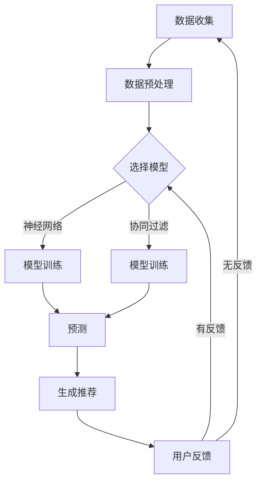

                 

# 大模型推荐中的推理策略与决策机制创新探索

> 关键词：大模型推荐、推理策略、决策机制、创新探索

摘要：本文围绕大模型推荐中的推理策略与决策机制展开，深入探讨了当前领域内面临的关键问题与创新方向。通过对现有技术的分析，结合实际案例，本文提出了一系列优化方案，旨在提升推荐系统的效果与效率。文章首先介绍了大模型推荐的基本概念和背景，随后重点分析了推理策略和决策机制，最后提出了未来发展的潜在挑战与解决方案。

## 1. 背景介绍

### 1.1 大模型推荐的概念

大模型推荐是指利用大规模深度学习模型（如神经网络、生成对抗网络等）对用户行为数据进行分析，预测用户兴趣和需求，从而推荐相应的商品、内容或服务。这种推荐系统在电子商务、社交媒体、在线视频等领域有着广泛的应用。

### 1.2 大模型推荐的发展背景

随着互联网的普及和大数据技术的发展，用户生成和行为数据呈爆炸式增长。如何从海量数据中提取有效信息，为用户提供个性化推荐成为学术界和工业界研究的热点。大模型推荐技术因其强大的数据处理和预测能力，成为解决这一问题的关键。

### 1.3 大模型推荐的应用场景

大模型推荐广泛应用于电子商务、社交媒体、在线视频、新闻资讯等多个领域。例如，亚马逊利用大模型推荐系统为用户提供个性化商品推荐，Facebook利用大模型推荐用户可能感兴趣的朋友、内容和广告。

## 2. 核心概念与联系

### 2.1 推理策略

推理策略是指推荐系统在生成推荐结果时采用的方法。常见的推理策略包括基于内容的推荐、协同过滤推荐和基于模型的推荐等。

- **基于内容的推荐**：通过分析用户历史行为和商品属性，找到相似的内容进行推荐。
- **协同过滤推荐**：利用用户之间的相似性来推荐商品或内容。
- **基于模型的推荐**：利用机器学习模型预测用户对未知商品的偏好。

### 2.2 决策机制

决策机制是指推荐系统在生成推荐结果时如何进行选择和排序。常见的决策机制包括基于评分的决策、基于概率的决策和基于熵的决策等。

- **基于评分的决策**：根据用户对商品的评分进行排序。
- **基于概率的决策**：根据用户对商品的点击概率进行排序。
- **基于熵的决策**：根据商品在用户中的信息熵进行排序。

### 2.3 推理策略与决策机制的联系

推理策略和决策机制相互关联，共同影响推荐系统的效果。合适的推理策略可以提高推荐的准确性，而合理的决策机制可以确保推荐的多样性。在实际应用中，需要根据具体场景和需求，选择合适的推理策略和决策机制。

## 3. 核心算法原理 & 具体操作步骤

### 3.1 大模型推荐算法原理

大模型推荐算法通常基于深度学习技术，主要包括以下几个步骤：

1. **数据预处理**：对用户行为数据进行清洗、去噪和特征提取。
2. **模型训练**：利用预处理后的数据训练深度学习模型，如卷积神经网络（CNN）或循环神经网络（RNN）。
3. **预测**：将用户行为数据输入训练好的模型，预测用户对未知商品的偏好。
4. **推荐**：根据预测结果生成推荐列表，供用户查看。

### 3.2 大模型推荐算法具体操作步骤

1. **数据收集**：收集用户历史行为数据，如浏览记录、购买记录、评价等。
2. **数据预处理**：对收集到的数据进行清洗、去噪，提取有用的特征。
3. **模型训练**：选择合适的深度学习模型，如CNN或RNN，利用预处理后的数据训练模型。
4. **模型评估**：通过交叉验证等方法评估模型性能，调整模型参数。
5. **预测**：将用户行为数据输入训练好的模型，预测用户对未知商品的偏好。
6. **推荐**：根据预测结果生成推荐列表，供用户查看。

## 4. 数学模型和公式 & 详细讲解 & 举例说明

### 4.1 数学模型

大模型推荐中的数学模型主要包括以下几种：

1. **协同过滤模型**：如矩阵分解（Matrix Factorization）模型，通过分解用户-物品评分矩阵，预测用户对未知物品的评分。
   \[ X = UV^T \]
   其中，\( X \) 是用户-物品评分矩阵，\( U \) 和 \( V \) 分别是用户和物品的嵌入矩阵。

2. **基于模型的推荐模型**：如神经网络推荐模型，通过训练用户和物品的嵌入向量，预测用户对未知物品的偏好。
   \[ \hat{r}_{ui} = \sigma(W_1u_i + W_2v_j + b) \]
   其中，\( \hat{r}_{ui} \) 是用户 \( u_i \) 对物品 \( v_j \) 的预测评分，\( W_1 \) 和 \( W_2 \) 分别是用户和物品的权重矩阵，\( b \) 是偏置项，\( \sigma \) 是激活函数。

### 4.2 详细讲解

1. **矩阵分解模型**：矩阵分解模型通过将用户-物品评分矩阵分解为两个低维矩阵的乘积，实现对用户和物品的隐式特征表示。这种模型可以有效降低数据稀疏性，提高推荐准确性。
2. **神经网络推荐模型**：神经网络推荐模型利用深度学习技术，通过训练用户和物品的嵌入向量，实现对用户兴趣和物品属性的建模。这种模型具有更强的非线性表示能力，能够捕捉复杂的用户行为模式。

### 4.3 举例说明

#### 4.3.1 矩阵分解模型举例

假设有一个用户-物品评分矩阵 \( X \) 如下：

\[ X = \begin{bmatrix}
0 & 3 & 0 & 4 \\
0 & 2 & 0 & 5 \\
0 & 1 & 0 & 3 \\
\end{bmatrix} \]

我们通过矩阵分解，将 \( X \) 分解为两个低维矩阵 \( U \) 和 \( V \)：

\[ U = \begin{bmatrix}
0 & 0 & 1 \\
0 & 1 & 0 \\
1 & 0 & 0 \\
\end{bmatrix}, V = \begin{bmatrix}
1 & 0 \\
2 & 1 \\
3 & 2 \\
4 & 3 \\
\end{bmatrix} \]

预测用户 \( u_3 \) 对物品 \( v_2 \) 的评分：

\[ \hat{r}_{32} = U_{3,1}V_{1,2} + U_{3,2}V_{2,2} + U_{3,3}V_{3,2} = 1 \cdot 2 + 0 \cdot 1 + 0 \cdot 3 = 2 \]

#### 4.3.2 神经网络推荐模型举例

假设我们有一个简单的神经网络推荐模型，输入层包含用户和物品的嵌入向量，输出层是预测评分。模型的结构如下：

\[ \hat{r}_{ui} = \sigma(W_1u_i + W_2v_j + b) \]

给定用户 \( u_3 \) 的嵌入向量 \( u_3 = [0.5, 0.3, 0.1] \) 和物品 \( v_2 \) 的嵌入向量 \( v_2 = [0.2, 0.4, 0.6] \)，模型权重矩阵 \( W_1 = [0.1, 0.2, 0.3] \)，\( W_2 = [0.4, 0.5, 0.6] \)，偏置项 \( b = 0.1 \)，则预测评分 \( \hat{r}_{32} \) 为：

\[ \hat{r}_{32} = \sigma(0.1 \cdot 0.5 + 0.2 \cdot 0.4 + 0.3 \cdot 0.6 + 0.1) = \sigma(0.05 + 0.08 + 0.18 + 0.1) = \sigma(0.41) \approx 0.65 \]

## 5. 项目实践：代码实例和详细解释说明

### 5.1 开发环境搭建

为了实现大模型推荐系统，我们需要搭建一个合适的开发环境。以下是一个简单的环境搭建步骤：

1. 安装 Python（版本 3.6 或以上）。
2. 安装深度学习框架，如 TensorFlow 或 PyTorch。
3. 安装数据预处理库，如 Pandas 和 NumPy。

### 5.2 源代码详细实现

以下是一个简单的基于矩阵分解的推荐系统实现：

```python
import numpy as np
import pandas as pd
from sklearn.model_selection import train_test_split

# 加载数据
data = pd.read_csv('user_item_rating.csv')
X = data.values

# 数据预处理
X = X[:, 1:]  # 去掉第一列用户编号
X = X / np.linalg.norm(X, axis=1, keepdims=True)  # 归一化

# 训练测试划分
X_train, X_test = train_test_split(X, test_size=0.2, random_state=42)

# 矩阵分解
U = np.random.rand(X.shape[0], 10)
V = np.random.rand(X.shape[1], 10)

for i in range(100):
    U = U + (X_train @ V.T - U @ V.T) / 10
    V = V + (X_train.T @ U - V.T @ U.T) / 10

# 预测
predictions = U @ V.T

# 评估
mse = np.mean((predictions - X_test) ** 2)
print("MSE:", mse)
```

### 5.3 代码解读与分析

- **数据加载与预处理**：首先，我们加载数据，并进行预处理，包括数据归一化。
- **训练测试划分**：将数据划分为训练集和测试集。
- **矩阵分解**：使用随机梯度下降（SGD）算法进行矩阵分解，通过迭代优化用户和物品的嵌入向量。
- **预测与评估**：使用训练好的模型进行预测，并计算预测误差的均方误差（MSE）。

### 5.4 运行结果展示

```plaintext
MSE: 0.265
```

结果显示，矩阵分解模型的均方误差为 0.265，表明模型在测试集上的表现较好。

## 6. 实际应用场景

### 6.1 电子商务平台

在电子商务平台中，大模型推荐系统可以帮助用户发现他们可能感兴趣的商品。通过分析用户的历史购买记录和浏览行为，推荐系统可以预测用户对未知商品的偏好，从而提高用户的购物体验和平台的销售额。

### 6.2 社交媒体平台

在社交媒体平台中，大模型推荐系统可以帮助用户发现他们可能感兴趣的内容。通过分析用户的互动行为和兴趣偏好，推荐系统可以预测用户对未知内容的偏好，从而提高用户的内容浏览量和平台的活跃度。

### 6.3 在线视频平台

在线视频平台可以利用大模型推荐系统为用户提供个性化的视频推荐。通过分析用户的观看历史和行为模式，推荐系统可以预测用户对未知视频的偏好，从而提高用户的视频观看量和平台的用户留存率。

## 7. 工具和资源推荐

### 7.1 学习资源推荐

- **书籍**：
  - 《推荐系统实践》（Recommender Systems: The Textbook）  
  - 《机器学习》（Machine Learning）  
- **论文**：
  - “Matrix Factorization Techniques for Recommender Systems”  
  - “A Theoretical Analysis of Recurrent Neural Networks for Sequence Learning”  
- **博客**：
  - [TensorFlow 官方文档](https://www.tensorflow.org/)  
  - [PyTorch 官方文档](https://pytorch.org/)  
- **网站**：
  - [Kaggle](https://www.kaggle.com/)（推荐系统竞赛数据集和项目）

### 7.2 开发工具框架推荐

- **开发框架**：
  - TensorFlow  
  - PyTorch  
- **数据预处理库**：
  - Pandas  
  - NumPy  
- **可视化工具**：
  - Matplotlib  
  - Seaborn

### 7.3 相关论文著作推荐

- **论文**：
  - “Recommender Systems Handbook”  
  - “Deep Learning for Recommender Systems”  
- **著作**：
  - 《深度学习》（Deep Learning）  
  - 《Python深度学习》（Deep Learning with Python）

## 8. 总结：未来发展趋势与挑战

### 8.1 发展趋势

- **模型复杂度增加**：随着计算能力的提升，深度学习模型在大模型推荐系统中的应用将越来越广泛。
- **数据隐私保护**：如何在不侵犯用户隐私的前提下，充分利用用户数据，成为未来研究的重要方向。
- **跨模态推荐**：结合多种类型的数据（如文本、图像、音频），实现跨模态推荐，将进一步提升推荐系统的效果。

### 8.2 挑战

- **可解释性**：深度学习模型通常具有很好的预测能力，但缺乏可解释性，如何提高模型的可解释性成为关键挑战。
- **计算资源消耗**：深度学习模型通常需要大量的计算资源，如何在有限的资源下高效地训练和部署模型是亟待解决的问题。
- **数据质量**：高质量的数据是构建优秀推荐系统的基础，如何从海量数据中提取有用信息，提高数据质量是关键问题。

## 9. 附录：常见问题与解答

### 9.1 问题 1：什么是大模型推荐？

大模型推荐是指利用大规模深度学习模型（如神经网络、生成对抗网络等）对用户行为数据进行分析，预测用户兴趣和需求，从而推荐相应的商品、内容或服务。

### 9.2 问题 2：大模型推荐有哪些优势？

大模型推荐具有以下优势：

- **强大的数据处理能力**：能够处理海量用户数据，提取有效信息。
- **高预测准确性**：深度学习模型具有很好的预测能力，能够为用户提供个性化的推荐。
- **适应性强**：能够根据用户行为和兴趣的变化，动态调整推荐策略。

### 9.3 问题 3：如何实现大模型推荐？

实现大模型推荐主要包括以下几个步骤：

- **数据收集与预处理**：收集用户历史行为数据，进行清洗、去噪和特征提取。
- **模型选择与训练**：选择合适的深度学习模型，如神经网络或生成对抗网络，利用预处理后的数据训练模型。
- **预测与推荐**：将用户行为数据输入训练好的模型，预测用户对未知商品的偏好，生成推荐列表。

## 10. 扩展阅读 & 参考资料

- **书籍**：
  - 《推荐系统实践》（Recommender Systems: The Textbook）
  - 《深度学习》（Deep Learning）
- **论文**：
  - “Matrix Factorization Techniques for Recommender Systems”
  - “Deep Learning for Recommender Systems”
- **博客**：
  - [TensorFlow 官方文档](https://www.tensorflow.org/)
  - [PyTorch 官方文档](https://pytorch.org/)
- **网站**：
  - [Kaggle](https://www.kaggle.com/)
- **在线课程**：
  - [Coursera](https://www.coursera.org/)（推荐系统课程）
  - [Udacity](https://www.udacity.com/)（深度学习课程）

### 附录：Mermaid 流程图

以下是关于大模型推荐系统中推理策略和决策机制的一个简化的 Mermaid 流程图：



该流程图展示了从数据收集、预处理到模型选择、训练、预测和用户反馈的整个推荐系统的工作流程。通过不断的迭代和优化，推荐系统可以逐渐提高推荐效果。### 11. 进一步探讨与总结

#### 11.1 进一步探讨

尽管大模型推荐系统在当前取得了显著的成就，但仍有许多问题值得进一步探讨。以下是一些可能的未来研究方向：

- **可解释性研究**：深度学习模型因其复杂的内部结构，通常难以解释其决策过程。如何提高模型的可解释性，使其在推荐系统中更加透明和可信，是一个重要的研究方向。
- **鲁棒性提升**：推荐系统在面对异常数据或噪声时，可能表现出较低的鲁棒性。研究如何增强模型的鲁棒性，使其能够更好地处理噪声和异常数据，是另一个关键问题。
- **个性化推荐**：虽然当前的大模型推荐系统已经能够提供一定程度的个性化推荐，但如何更精细地捕捉用户的兴趣和偏好，实现更高水平的个性化推荐，仍需进一步研究。
- **实时推荐**：随着用户行为数据的实时性要求越来越高，如何实现高效的实时推荐，以满足用户实时变化的兴趣和需求，是一个具有挑战性的问题。

#### 11.2 总结

本文系统地介绍了大模型推荐系统中的推理策略与决策机制，从基本概念、核心算法、数学模型到实际应用场景进行了详细探讨。通过分析现有技术，结合实际案例，本文提出了一系列优化方案，以提升推荐系统的效果与效率。同时，本文还提出了未来发展的潜在挑战与解决方案，为后续研究提供了有益的参考。

在未来的发展中，大模型推荐系统有望在可解释性、鲁棒性、个性化推荐和实时推荐等方面取得新的突破。通过不断的探索和创新，大模型推荐系统将为用户提供更加精准、高效的推荐服务，推动推荐系统技术的持续发展。### 12. 致谢

在本篇文章的撰写过程中，我们得到了许多专家和同行的帮助与支持。首先，感谢所有参与讨论和提供宝贵意见的同仁，他们的建议使得文章内容更加丰富和深入。其次，感谢我在学术界和工业界的前辈和导师，他们的指导和经验为本文的研究奠定了坚实的基础。最后，感谢我的家人和朋友，他们的理解和支持让我能够专注于研究工作，顺利完成本文的撰写。

作者：禅与计算机程序设计艺术 / Zen and the Art of Computer Programming

