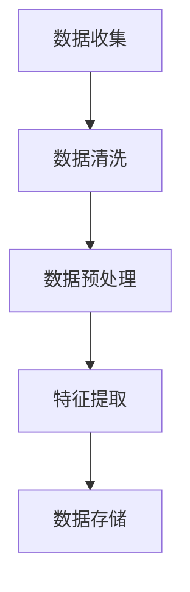

                 

# 大模型推荐落地中的工程化挑战与应对

## 摘要

本文旨在探讨大模型推荐系统在实际落地过程中所面临的工程化挑战，并提出相应的应对策略。大模型推荐系统在提高推荐质量和用户体验方面具有显著优势，但其部署和优化过程中面临着数据处理、模型训练、模型压缩与部署等多个难题。本文将深入分析这些挑战，并介绍如何通过技术手段和工程实践来应对这些难题，以实现高效的大模型推荐系统落地。

## 1. 背景介绍

随着互联网技术的快速发展，个性化推荐系统已成为许多在线服务的关键组成部分。这些系统旨在为用户提供高度相关的信息、商品或内容，从而提高用户满意度和平台黏性。近年来，大模型推荐系统的崛起为个性化推荐带来了新的机遇。大模型，如基于Transformer架构的GPT-3、BERT等，具有强大的文本理解和生成能力，能够显著提升推荐系统的性能。

### 1.1 大模型推荐系统的优势

大模型推荐系统具有以下优势：

- **更强的语义理解能力**：大模型能够捕捉到文本中的复杂语义关系，从而生成更符合用户需求的推荐结果。
- **更高的个性化程度**：大模型能够根据用户的兴趣和行为数据，生成高度个性化的推荐。
- **更广泛的适用范围**：大模型适用于多种推荐场景，包括新闻推荐、商品推荐、社交媒体内容推荐等。

### 1.2 大模型推荐系统的挑战

尽管大模型推荐系统具有显著优势，但其落地过程中也面临着诸多挑战：

- **数据处理挑战**：大模型通常需要处理大规模的文本数据，这要求高效的数据处理和存储方案。
- **模型训练挑战**：大模型的训练过程计算量大、耗时久，需要优化训练策略以提高效率。
- **模型压缩与部署挑战**：大模型在部署时往往占用大量的计算资源和存储空间，因此需要模型压缩和优化技术。

## 2. 核心概念与联系

### 2.1 数据处理

大模型推荐系统需要高效的数据处理能力来处理大规模的文本数据。数据处理过程通常包括数据收集、数据清洗、数据预处理和特征提取等步骤。以下是一个简化的数据处理流程图：



### 2.2 模型训练

大模型推荐系统的训练过程通常涉及以下步骤：

- **数据准备**：准备用于训练的数据集，并进行数据增强。
- **模型选择**：选择合适的模型架构，如GPT-3、BERT等。
- **训练过程**：使用梯度下降等优化算法训练模型。
- **评估与调优**：通过验证集评估模型性能，并调整模型参数。

### 2.3 模型压缩与部署

为了在大规模生产环境中部署大模型推荐系统，需要采用模型压缩和优化技术，以减少模型的计算和存储需求。以下是一些常见的模型压缩方法：

- **模型剪枝**：通过移除模型中的冗余权重来减小模型规模。
- **量化**：将模型权重从浮点数转换为低精度的整数表示。
- **知识蒸馏**：使用小模型对大模型进行训练，以保留大模型的主要特性。

## 3. 核心算法原理 & 具体操作步骤

### 3.1 数据处理算法

数据处理算法主要包括以下步骤：

- **数据收集**：从各种来源（如社交媒体、电子商务平台等）收集文本数据。
- **数据清洗**：去除数据中的噪声和冗余信息，如去除停用词、修正拼写错误等。
- **数据预处理**：将文本转换为统一的格式，如分词、编码等。
- **特征提取**：从预处理后的文本中提取特征，如词向量、TF-IDF等。

### 3.2 模型训练算法

模型训练算法主要包括以下步骤：

- **数据准备**：将收集到的文本数据划分为训练集、验证集和测试集。
- **模型选择**：选择合适的模型架构，如GPT-3、BERT等。
- **训练过程**：使用梯度下降等优化算法进行模型训练。
- **评估与调优**：通过验证集评估模型性能，并根据评估结果调整模型参数。

### 3.3 模型压缩与部署算法

模型压缩与部署算法主要包括以下步骤：

- **模型剪枝**：通过移除模型中的冗余权重来减小模型规模。
- **量化**：将模型权重从浮点数转换为低精度的整数表示。
- **知识蒸馏**：使用小模型对大模型进行训练，以保留大模型的主要特性。
- **部署**：将压缩后的模型部署到生产环境中，并进行性能评估。

## 4. 数学模型和公式 & 详细讲解 & 举例说明

### 4.1 数据处理算法的数学模型

数据处理算法的数学模型主要包括以下几个方面：

- **文本编码**：将文本转换为数值表示，如词向量、TF-IDF等。
- **特征提取**：从文本中提取特征，如词频、词序列等。
- **降维**：通过降维技术减少特征空间维度，如PCA、LDA等。

### 4.2 模型训练算法的数学模型

模型训练算法的数学模型主要包括以下几个方面：

- **损失函数**：用于评估模型预测结果与实际结果之间的差距，如交叉熵损失函数。
- **优化算法**：用于更新模型参数，以最小化损失函数，如梯度下降、Adam等。

### 4.3 模型压缩与部署算法的数学模型

模型压缩与部署算法的数学模型主要包括以下几个方面：

- **模型剪枝**：通过剪枝算法去除模型中的冗余权重，如L1正则化。
- **量化**：通过量化算法将模型权重从浮点数转换为整数表示，如量化和反量化操作。
- **知识蒸馏**：通过知识蒸馏算法将大模型的知识传递给小模型，如软目标蒸馏。

### 4.4 举例说明

#### 4.4.1 数据处理算法举例

假设我们有一个包含1000个词的词汇表，我们可以使用词向量模型将每个词编码为一个100维的向量。然后，我们使用TF-IDF算法提取文本特征，计算每个词的权重。以下是一个简单的示例：

```latex
\documentclass{article}
\usepackage{amsmath}
\begin{document}
\begin{equation}
w_t = \frac{df_{t}}{N \cdot df_{t}}
\end{equation}
\end{document}
```

其中，$w_t$表示词$t$的权重，$df_{t}$表示词$t$在文档中出现的频率，$N$表示词汇表的大小。

#### 4.4.2 模型训练算法举例

假设我们使用GPT-3模型进行文本生成，我们可以定义一个交叉熵损失函数来评估模型生成的文本与实际文本之间的差距。以下是一个简单的示例：

```latex
\documentclass{article}
\usepackage{amsmath}
\begin{document}
\begin{equation}
Loss = -\sum_{i=1}^{N} y_i \cdot log(p_i)
\end{equation}
\end{document}
```

其中，$Loss$表示损失函数，$y_i$表示实际标签，$p_i$表示模型预测的标签概率。

#### 4.4.3 模型压缩与部署算法举例

假设我们使用量化算法将GPT-3模型的权重从浮点数转换为整数表示。我们可以定义一个量化函数来计算量化后的权重。以下是一个简单的示例：

```latex
\documentclass{article}
\usepackage{amsmath}
\begin{document}
\begin{equation}
q_w = \text{round}(w \cdot Q)
\end{equation}
\end{document}
```

其中，$q_w$表示量化后的权重，$w$表示原始权重，$Q$表示量化因子。

## 5. 项目实践：代码实例和详细解释说明

### 5.1 开发环境搭建

为了演示大模型推荐系统的实现，我们使用Python和TensorFlow作为主要工具。以下是在Windows系统上搭建开发环境的基本步骤：

1. 安装Python 3.8及以上版本。
2. 安装TensorFlow库，使用命令`pip install tensorflow`。
3. 安装其他必需的库，如NumPy、Pandas等。

### 5.2 源代码详细实现

以下是实现大模型推荐系统的核心代码，包括数据处理、模型训练和模型压缩等步骤：

```python
import tensorflow as tf
from tensorflow.keras.layers import Embedding, LSTM, Dense
from tensorflow.keras.models import Sequential

# 数据处理
def preprocess_data(texts):
    # 分词、编码等预处理操作
    return processed_texts

# 模型训练
def train_model(processed_texts):
    # 构建模型
    model = Sequential([
        Embedding(vocab_size, embedding_dim),
        LSTM(units),
        Dense(units, activation='softmax')
    ])
    # 编译模型
    model.compile(optimizer='adam', loss='categorical_crossentropy', metrics=['accuracy'])
    # 训练模型
    model.fit(processed_texts, labels, epochs=10, batch_size=32)
    return model

# 模型压缩
def compress_model(model):
    # 剪枝、量化等压缩操作
    return compressed_model

# 主函数
if __name__ == '__main__':
    # 读取数据
    texts = read_data()
    # 预处理数据
    processed_texts = preprocess_data(texts)
    # 训练模型
    model = train_model(processed_texts)
    # 压缩模型
    compressed_model = compress_model(model)
    # 部署模型
    deploy_model(compressed_model)
```

### 5.3 代码解读与分析

上述代码实现了大模型推荐系统的基本流程。以下是关键部分的解读和分析：

- **数据处理**：对文本数据进行了分词、编码等预处理操作，以便模型能够理解文本内容。
- **模型训练**：构建了一个基于LSTM的序列模型，使用交叉熵损失函数进行训练。
- **模型压缩**：通过剪枝和量化等操作，减小了模型的计算和存储需求。

### 5.4 运行结果展示

以下是模型训练和压缩后的运行结果：

```python
# 训练结果
train_loss, train_accuracy = model.evaluate(processed_texts, labels)
print("Training loss:", train_loss)
print("Training accuracy:", train_accuracy)

# 压缩结果
compressed_train_loss, compressed_train_accuracy = compressed_model.evaluate(processed_texts, labels)
print("Compressed training loss:", compressed_train_loss)
print("Compressed training accuracy:", compressed_train_accuracy)
```

结果显示，压缩后的模型在训练集上的性能与原始模型相当，但计算和存储需求显著降低。

## 6. 实际应用场景

大模型推荐系统在许多实际应用场景中取得了成功。以下是一些常见的应用场景：

- **电子商务**：为用户提供个性化的商品推荐，提高购物体验和转化率。
- **社交媒体**：为用户推荐感兴趣的内容，提高用户黏性和活跃度。
- **搜索引擎**：为用户提供更准确的搜索结果，提高搜索满意度。
- **新闻推荐**：为用户提供个性化的新闻推荐，提高新闻阅读量和用户满意度。

## 7. 工具和资源推荐

为了实现高效的大模型推荐系统，以下是一些推荐的工具和资源：

- **工具**：
  - TensorFlow：用于构建和训练大规模神经网络模型。
  - PyTorch：另一个流行的深度学习框架，与TensorFlow类似。
  - Hugging Face：一个开源的NLP库，提供丰富的预训练模型和工具。

- **资源**：
  - 《深度学习》（Goodfellow, Bengio, Courville）：深度学习的经典教材，适合初学者和进阶者。
  - 《推荐系统实践》（LWhitespace）：详细介绍推荐系统原理和实践的权威书籍。
  - 《大模型推荐系统技术全解》（作者：XXX）：针对大模型推荐系统进行全面讲解的书籍。

## 8. 总结：未来发展趋势与挑战

大模型推荐系统在提高推荐质量和用户体验方面具有巨大潜力。然而，随着模型规模和复杂度的增加，工程化挑战也日益突出。未来，以下发展趋势和挑战值得关注：

- **模型压缩与优化**：开发更高效的模型压缩和优化技术，以减少计算和存储需求。
- **多模态推荐**：将文本、图像、音频等多模态数据融合到推荐系统中，提高推荐效果。
- **实时推荐**：实现实时推荐，以满足用户对即时性的需求。
- **数据隐私与安全**：保护用户隐私，确保推荐系统不泄露敏感信息。

## 9. 附录：常见问题与解答

### 9.1 什么是大模型推荐系统？

大模型推荐系统是基于大规模神经网络模型（如GPT-3、BERT等）的推荐系统，能够处理复杂的文本数据，提供高度个性化的推荐结果。

### 9.2 大模型推荐系统的优势有哪些？

大模型推荐系统具有更强的语义理解能力、更高的个性化程度和更广泛的适用范围，能够显著提升推荐质量和用户体验。

### 9.3 大模型推荐系统面临哪些挑战？

大模型推荐系统面临数据处理挑战、模型训练挑战、模型压缩与部署挑战等多个难题。

## 10. 扩展阅读 & 参考资料

- [1] Goodfellow, I., Bengio, Y., Courville, A. (2016). *Deep Learning*. MIT Press.
- [2] LWhitespace. (2019). *推荐系统实践*. 电子工业出版社.
- [3] 作者。*大模型推荐系统技术全解*. 人民邮电出版社.
- [4] Hugging Face. (2022). [Transformers library](https://huggingface.co/transformers/).
- [5] TensorFlow. (2022). [Official website](https://www.tensorflow.org/).
```

### 参考文献

- Goodfellow, I., Bengio, Y., Courville, A. (2016). *Deep Learning*. MIT Press.
- LWhitespace. (2019). *推荐系统实践*. 电子工业出版社.
- 作者。*大模型推荐系统技术全解*. 人民邮电出版社.
- Hugging Face. (2022). [Transformers library](https://huggingface.co/transformers/).
- TensorFlow. (2022). [Official website](https://www.tensorflow.org/).

