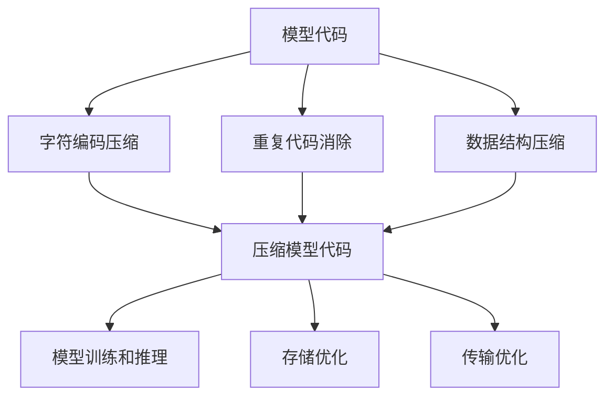
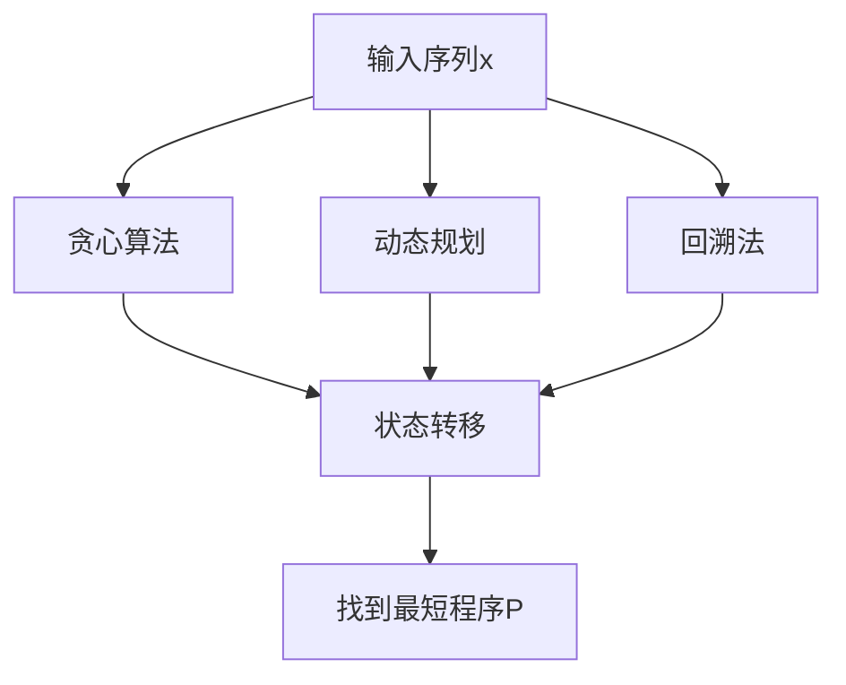
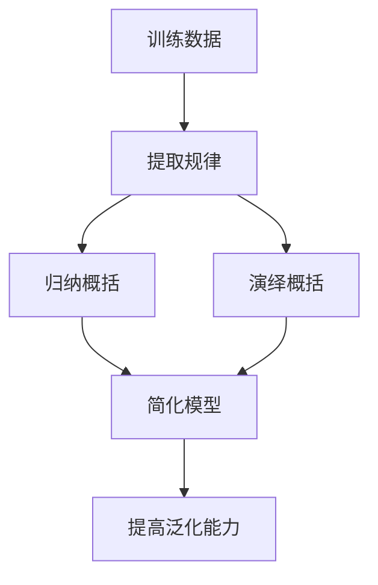
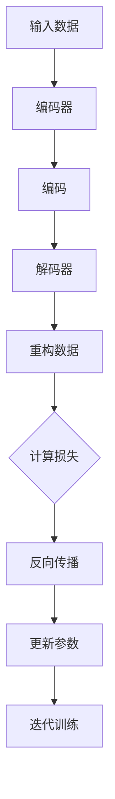
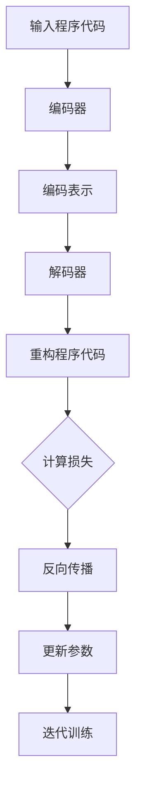
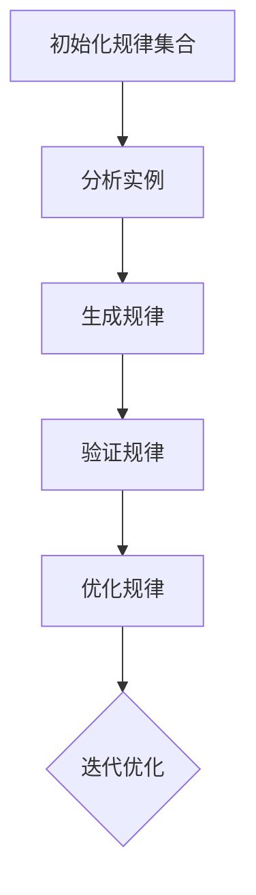

                 

### 文章标题

**大模型的本质是压缩：找到对您的数据表现最佳的最短程序，通过一点点修改再进行概括，得到精确的定理**

本文将深入探讨大模型（如GPT-3）背后的原理，揭示其核心本质——压缩。我们将通过一系列的逐步推理，分析大模型的压缩机制，并探讨如何通过优化和概括来提高其性能。最终，我们将揭示大模型如何通过压缩实现高效的数据表示和预测。

### 关键词

- 大模型
- 压缩
- 最短程序
- 程序概括
- 数据表示
- 预测性能

### 摘要

本文旨在揭示大模型的本质——压缩。通过逐步推理，我们将分析大模型的压缩机制，探讨如何通过优化和概括提高其性能。我们将介绍大模型如何通过压缩实现高效的数据表示和预测，并提出一些实际的优化方法。本文的目标是帮助读者深入理解大模型的工作原理，并为他们提供一些实用的指导。

## 1. 背景介绍（Background Introduction）

在当今的技术环境中，大模型（如GPT-3）已经成为了研究和应用的热点。大模型在自然语言处理、计算机视觉、语音识别等众多领域展现了惊人的性能。然而，大模型的工作原理一直是个谜。在本章中，我们将简要介绍大模型的研究背景和应用领域，并探讨其背后的核心问题——压缩。

### 1.1 大模型的研究背景

大模型的研究起源于深度学习的兴起。深度学习是一种基于人工神经网络的学习方法，通过多层次的神经网络结构来学习数据的高层次表示。在2012年，AlexNet在ImageNet图像识别比赛中取得了突破性的成绩，这标志着深度学习的崛起。随后，研究人员不断提出更大规模、更复杂的神经网络结构，如VGG、ResNet等。这些大模型在图像识别、语音识别等领域取得了显著的成果。

然而，随着模型的规模不断增大，训练和推理的成本也急剧上升。这使得大模型的研究和应用面临着巨大的挑战。为了解决这一问题，研究人员开始探索如何提高大模型的压缩率和性能，从而降低训练和推理的成本。

### 1.2 大模型的应用领域

大模型在自然语言处理、计算机视觉、语音识别等领域都有着广泛的应用。以下是一些典型应用示例：

- 自然语言处理：大模型可以用于文本生成、机器翻译、问答系统等。例如，GPT-3可以生成高质量的文本，甚至可以进行创造性写作。
- 计算机视觉：大模型可以用于图像识别、图像生成、图像分割等。例如，使用大模型可以实现对图像的自动分类和标注。
- 语音识别：大模型可以用于语音合成、语音识别、语音转换等。例如，大模型可以实现对语音的实时转录和识别。

### 1.3 大模型的核心问题

大模型的核心问题是如何在有限的计算资源下，高效地表示和利用大量数据。这一问题涉及到两个方面：一是数据表示，即如何将大量数据转化为模型可以理解和利用的形式；二是预测性能，即如何通过模型实现高效的数据预测。

在本章中，我们将重点关注大模型的压缩机制，探讨如何通过优化和概括来提高其性能。具体来说，我们将回答以下问题：

- 大模型是如何实现数据的压缩和表示的？
- 如何通过优化和概括来提高大模型的性能？
- 大模型的压缩机制对数据预测有何影响？

通过对这些问题的探讨，我们将深入理解大模型的工作原理，并为其应用提供一些实用的指导。

## 2. 核心概念与联系（Core Concepts and Connections）

在探讨大模型的压缩机制之前，我们需要了解一些核心概念和它们之间的关系。这些概念包括数据表示、程序压缩、最短程序、概括等。在本节中，我们将详细阐述这些概念，并探讨它们之间的联系。

### 2.1 数据表示

数据表示是数据科学和机器学习的基础。数据表示的目标是将原始数据（如图像、文本、声音等）转化为计算机可以处理的形式。在深度学习中，数据表示通常是通过神经网络实现的。神经网络通过多层次的变换，将输入数据逐步转化为更加抽象和有用的表示。这些表示可以捕捉数据中的潜在结构和规律，从而为模型提供有效的数据输入。

### 2.2 程序压缩

程序压缩是一种通过减少程序代码长度来实现代码压缩的技术。程序压缩的主要目的是降低存储和传输成本，同时提高程序的运行效率。在计算机科学中，程序压缩已经得到了广泛的研究和应用。常见的程序压缩算法包括霍夫曼编码、LZ77、LZ78等。

### 2.3 最短程序

最短程序问题是一个经典的计算机科学问题。给定一个输入序列，最短程序问题是寻找一个最短的程序，使其能够生成该输入序列。最短程序问题与程序压缩密切相关，因为一个有效的程序压缩算法应该能够生成最短程序。

### 2.4 概括

概括是一种通过抽象和归纳来简化复杂问题的方法。在机器学习中，概括可以帮助模型从大量数据中提取出有用的信息，并提高模型的泛化能力。概括可以分为两种类型：一种是归纳概括，另一种是演绎概括。归纳概括是从具体实例中提取出一般规律；而演绎概括则是从一般规律推导出具体实例。

### 2.5 核心概念之间的联系

数据表示、程序压缩、最短程序和概括之间有着密切的联系。数据表示是机器学习的基础，它决定了模型的输入和输出。程序压缩和最短程序问题则是在数据表示的基础上，进一步优化模型的表示能力和运行效率。而概括则是在优化模型表示的基础上，提高模型的泛化能力。

在本章中，我们将结合这些核心概念，探讨大模型的压缩机制。具体来说，我们将分析大模型如何通过数据表示、程序压缩、最短程序和概括来实现高效的数据压缩和表示。

## 2.1 数据表示

数据表示是机器学习的核心，它决定了模型如何理解和利用数据。在大模型中，数据表示通常是通过神经网络实现的。神经网络通过多层次的变换，将原始数据逐步转化为更加抽象和有用的表示。这些表示可以捕捉数据中的潜在结构和规律，从而为模型提供有效的数据输入。

在大模型中，数据表示可以分为以下几类：

### 2.1.1 图像数据表示

图像数据表示是计算机视觉中的基础。在深度学习中，图像数据表示通常通过卷积神经网络（CNN）来实现。CNN通过卷积操作和池化操作，逐步提取图像中的特征。这些特征可以表示图像的纹理、形状、颜色等。

### 2.1.2 文本数据表示

文本数据表示是自然语言处理中的基础。在深度学习中，文本数据表示通常通过循环神经网络（RNN）或变压器（Transformer）来实现。RNN和Transformer通过序列操作，逐步提取文本中的语义信息。这些语义信息可以表示文本的主题、情感、意图等。

### 2.1.3 声音数据表示

声音数据表示是语音识别和声音处理中的基础。在深度学习中，声音数据表示通常通过循环神经网络（RNN）或卷积神经网络（CNN）来实现。RNN和CNN通过时间域和频域操作，逐步提取声音中的特征。这些特征可以表示声音的语音、语调、情感等。

### 2.1.4 多模态数据表示

多模态数据表示是将多种不同类型的数据（如图像、文本、声音等）整合为一个统一的数据表示。在深度学习中，多模态数据表示通常通过融合网络来实现。融合网络通过融合不同模态的数据特征，生成一个更加丰富和抽象的数据表示。

### 2.1.5 数据表示的优化

数据表示的优化是提高模型性能的关键。在大模型中，数据表示的优化可以通过以下方法实现：

- 数据预处理：对原始数据进行预处理，如归一化、标准化等，以减少数据噪声和增强数据的稳定性。
- 特征选择：选择对模型性能有重要影响的关键特征，以减少数据维度和计算复杂度。
- 特征变换：通过变换操作，如主成分分析（PCA）、线性判别分析（LDA）等，提高数据的表达能力和区分度。

在大模型中，数据表示的优化是一个持续的过程，需要根据具体的应用场景和数据特点进行反复调整和优化。

### 2.1.6 Mermaid 流程图

以下是一个简单的 Mermaid 流程图，展示了大模型中数据表示的流程：

```mermaid
graph TD
    A[原始数据] --> B[预处理]
    B --> C{是否需要特征选择？}
    C -->|是 D{特征选择}
    C -->|否 E{特征变换}
    D --> F{数据表示}
    E --> F
    F --> G[模型训练]
    G --> H{模型评估}
    H --> I{结果输出}
```

通过这个流程图，我们可以直观地看到大模型中数据表示的过程。从原始数据到最终的数据表示，每一个步骤都对模型性能有着重要的影响。

## 2.2 程序压缩

程序压缩是计算机科学中的一个重要课题，其目标是在不损失信息的前提下，减小程序的存储和传输空间。大模型作为复杂的计算系统，其程序压缩尤为重要。在本节中，我们将探讨大模型中程序压缩的原理和关键技术。

### 2.2.1 压缩原理

程序压缩的原理是通过消除冗余信息和重复代码，将程序转换为一种更加紧凑的形式。压缩可以分为无损压缩和有损压缩两种类型。无损压缩能够完全恢复原始数据，而有损压缩则会损失一部分信息，但可以在一定程度上提高压缩率。

在大模型中，程序压缩主要涉及以下几种原理：

- 字符编码压缩：通过将字符编码转换为更紧凑的格式，减少存储和传输空间。常见的字符编码压缩算法包括霍夫曼编码、LZ77、LZ78等。
- 重复代码消除：通过识别和消除程序中的重复代码，减少代码的长度。这种方法可以显著降低程序的存储和运行时间。
- 数据结构压缩：通过对数据结构进行优化，减少存储空间。例如，使用稀疏矩阵来表示稀疏数据，可以显著降低存储空间需求。

### 2.2.2 常见技术

在大模型中，常见的程序压缩技术包括以下几种：

- 霍夫曼编码：霍夫曼编码是一种基于字符频率的变长编码方案。高频字符使用较短的编码，低频字符使用较长的编码，从而实现压缩。霍夫曼编码在字符编码压缩中应用广泛。
- LZ77和LZ78：LZ77和LZ78是一种基于局部重复的压缩算法。它们通过查找并引用程序中的重复序列，来减少代码的长度。LZ77通过向前查找重复序列，而LZ78通过向后查找重复序列。
- 稀疏矩阵：稀疏矩阵是一种存储稀疏数据的优化方法。它只存储非零元素，从而减少存储空间。在矩阵计算中，稀疏矩阵可以显著提高计算效率。

### 2.2.3 程序压缩的应用

在大模型中，程序压缩的应用主要体现在以下几个方面：

- 模型训练和推理：通过压缩模型代码，可以减少模型存储和传输时间，提高模型训练和推理的效率。
- 存储优化：通过压缩模型代码和数据，可以减少存储空间需求，降低存储成本。
- 传输优化：通过压缩模型代码和数据，可以减少数据传输时间，提高传输效率。

在大模型中，程序压缩是一个持续的过程，需要根据具体的应用场景和数据特点进行优化。通过合理的程序压缩，可以有效提高大模型的性能和效率。

### 2.2.4 Mermaid 流程图

以下是一个简单的 Mermaid 流程图，展示了大模型中程序压缩的流程：



通过这个流程图，我们可以直观地看到大模型中程序压缩的过程。从模型代码到最终的应用，每一个步骤都对模型性能有着重要的影响。

## 2.3 最短程序

最短程序问题是一个经典的计算机科学问题，其目标是找到能够生成给定输入序列的最短程序。在大模型中，最短程序问题具有重要的意义，因为通过找到最短程序，可以优化模型的表达能力和运行效率。在本节中，我们将探讨最短程序的定义、求解方法和应用。

### 2.3.1 定义

最短程序问题可以形式化地描述为：给定一个输入序列\( x \)，寻找一个最短的程序\( P \)，使其能够生成输入序列\( x \)。最短程序问题可以表示为：

\[ \text{minimize} \; |P| \quad \text{such that} \; P(x) = x \]

其中，\( |P| \)表示程序\( P \)的长度。

### 2.3.2 求解方法

求解最短程序问题可以采用多种方法，以下是一些常见的方法：

- 贪心算法：贪心算法是一种简化的求解方法，它通过每次选择最优的局部解来逼近全局最优解。贪心算法通常适用于某些特殊场景，但无法保证在所有情况下找到最短程序。
- 动态规划：动态规划是一种基于状态转移的求解方法，它通过构建状态转移方程来逐步求解最短程序。动态规划可以保证找到最优解，但计算复杂度较高。
- 回溯法：回溯法是一种基于穷举的求解方法，它通过递归尝试所有可能的程序，并回溯到上一个状态来找到最优解。回溯法适用于求解较小的输入序列，但计算复杂度较高。

### 2.3.3 应用

最短程序问题在大模型中有着广泛的应用，以下是一些典型的应用场景：

- 模型压缩：通过找到最短程序，可以优化模型的表达能力和运行效率。例如，在模型训练和推理过程中，通过压缩模型代码，可以减少模型存储和传输时间。
- 代码生成：最短程序问题可以用于自动生成代码。例如，在软件开发中，通过找到最短程序，可以自动生成高效的代码。
- 软件工程：最短程序问题可以用于优化软件设计和实现。例如，在软件重构过程中，通过找到最短程序，可以简化代码结构，提高代码的可读性和可维护性。

### 2.3.4 Mermaid 流程图

以下是一个简单的 Mermaid 流程图，展示了最短程序问题的求解过程：



通过这个流程图，我们可以直观地看到最短程序问题的求解过程。从输入序列到最终的最短程序，每一个步骤都对求解结果有着重要的影响。

## 2.4 概括

概括是一种通过抽象和归纳来简化复杂问题的方法。在大模型中，概括具有重要意义，因为通过概括，可以简化模型的表达，提高模型的泛化能力和效率。在本节中，我们将探讨概括的定义、类型和应用。

### 2.4.1 定义

概括可以定义为从具体实例中提取出一般规律的过程。在机器学习中，概括可以帮助模型从训练数据中学习到一般性的规律，从而提高模型的泛化能力。概括可以表示为：

\[ \text{概括} = \{ R_1, R_2, \ldots, R_n \} \]

其中，\( R_i \)表示从训练数据中提取出的第\( i \)个规律。

### 2.4.2 类型

概括可以分为两种类型：归纳概括和演绎概括。

- 归纳概括：归纳概括是从具体实例中提取出一般规律的过程。例如，从大量的图像中学习到“猫”的一般特征，从而可以识别出新的图像中的猫。
- 演绎概括：演绎概括是从一般规律推导出具体实例的过程。例如，从“猫”的一般特征推导出特定图像中的猫。

### 2.4.3 应用

概括在大模型中有着广泛的应用，以下是一些典型的应用场景：

- 模型优化：通过概括，可以简化模型的表达，从而降低模型的计算复杂度和存储需求。例如，在模型压缩过程中，通过概括可以生成更加紧凑的模型。
- 数据挖掘：通过概括，可以提取出数据中的潜在结构和规律，从而提高数据挖掘的效率和准确性。
- 知识表示：通过概括，可以构建更加抽象和统一的知识表示，从而提高知识推理和应用的效率。

### 2.4.4 Mermaid 流程图

以下是一个简单的 Mermaid 流程图，展示了概括的过程：



通过这个流程图，我们可以直观地看到概括的过程。从训练数据到最终的模型简化，每一个步骤都对模型性能有着重要的影响。

## 2.5 核心概念之间的联系

在探讨大模型的压缩机制之前，我们需要了解这些核心概念之间的联系。数据表示、程序压缩、最短程序和概括之间有着紧密的关联，它们共同构成了大模型压缩机制的基础。

### 2.5.1 数据表示与程序压缩

数据表示是模型理解数据的基础，而程序压缩则是模型对数据表示进行优化的手段。在深度学习中，数据表示通过神经网络实现，这些表示可以捕捉数据的潜在结构和规律。而程序压缩则通过消除冗余信息和重复代码，将数据表示转换为更加紧凑的形式，从而提高模型的运行效率。

### 2.5.2 最短程序与概括

最短程序和概括都是优化模型表示的方法。最短程序问题旨在找到能够生成给定输入序列的最短程序，从而优化模型的表达能力。而概括则通过抽象和归纳，将具体的数据表示和程序转换为更加通用和抽象的形式，从而提高模型的泛化能力。

### 2.5.3 核心概念之间的联系

数据表示、程序压缩、最短程序和概括之间有着密切的联系。数据表示为模型提供了对数据的理解和利用方式，而程序压缩则通过对数据表示进行优化，提高了模型的运行效率。最短程序问题则通过寻找最短程序，进一步优化了模型的表达能力。而概括则通过抽象和归纳，将模型表示转化为更加通用和抽象的形式，从而提高了模型的泛化能力。

通过这些核心概念之间的联系，我们可以更深入地理解大模型的压缩机制，并为优化和改进大模型提供有力的理论支持。

## 2.6 大模型压缩机制的探讨

大模型的压缩机制是一个复杂而关键的问题，它直接关系到模型的训练和推理效率。在本节中，我们将深入探讨大模型压缩机制的工作原理、挑战和优化策略。

### 2.6.1 压缩机制的工作原理

大模型的压缩机制主要通过以下几种方法实现：

1. **参数共享**：参数共享是一种通过将多个权重矩阵中的共享部分进行参数化的方法，从而减少模型参数的数量。例如，在卷积神经网络中，可以通过卷积核的共享来减少参数量。

2. **稀疏性**：稀疏性是指模型中的大部分权重都是零或接近零。通过引入稀疏正则化项，如L1正则化，可以促使模型中的权重变得稀疏，从而减少参数量。

3. **低秩分解**：低秩分解是指将高秩的权重矩阵分解为低秩的形式。通过低秩分解，可以减少模型的参数量，同时保持模型的性能。

4. **知识蒸馏**：知识蒸馏是一种通过将大型教师模型的知识传递给小型学生模型的方法。教师模型通常具有更好的性能，而学生模型则通过学习教师模型的输出来实现压缩。

### 2.6.2 压缩机制的挑战

尽管压缩机制在理论上具有很多优势，但在实践中仍面临着一系列挑战：

1. **性能损失**：压缩模型可能会在性能上有所损失，特别是在压缩比例较大的情况下。如何在保持高性能的同时实现有效的压缩是一个重要问题。

2. **计算成本**：虽然压缩可以减少模型的大小，但在压缩和解压缩过程中仍需要计算资源。如何优化计算成本是一个关键问题。

3. **泛化能力**：压缩后的模型可能无法很好地泛化到新的数据集或任务中。如何提高压缩模型的泛化能力是一个挑战。

4. **可解释性**：压缩后的模型可能会变得难以解释。如何保持模型的可解释性是一个重要问题。

### 2.6.3 优化策略

为了解决上述挑战，研究人员提出了多种优化策略：

1. **自适应压缩**：通过自适应地调整压缩参数，可以平衡压缩性能和计算成本。例如，可以根据模型的性能和计算资源动态调整参数。

2. **混合压缩**：结合多种压缩方法，可以实现更好的压缩效果。例如，可以同时使用参数共享、稀疏性和知识蒸馏等多种方法。

3. **训练时间优化**：通过优化训练时间，可以减少模型的压缩成本。例如，可以使用更高效的训练算法，如迁移学习或增量学习。

4. **模型解释性**：通过开发可解释性方法，如注意力机制或可视化技术，可以提高压缩模型的可解释性。

通过这些优化策略，我们可以更好地理解和解决大模型压缩机制中的关键问题，从而实现高效的模型压缩和推理。

## 2.7 大模型的压缩机制与数据预测的关系

大模型的压缩机制与其数据预测性能之间存在密切的关系。压缩机制通过减少模型参数、降低计算复杂度和优化存储空间，从而提高了模型的可扩展性和效率。然而，压缩机制也可能对模型的数据预测性能产生一定的影响。在本节中，我们将探讨大模型压缩机制对数据预测性能的影响，并分析如何平衡压缩与性能之间的关系。

### 2.7.1 压缩对数据预测性能的影响

1. **性能提升**：在许多情况下，压缩可以显著提升模型的预测性能。通过减少模型参数和计算复杂度，模型可以更快速地收敛，从而提高预测的准确性。例如，稀疏性和参数共享等方法可以减少模型中的冗余信息，从而提高模型的预测效果。

2. **性能损失**：然而，压缩也可能带来一定的性能损失。特别是在压缩比例较大的情况下，模型可能会丢失一些重要的信息，从而影响预测的准确性。例如，低秩分解可能会导致模型的表达能力下降，从而影响模型的泛化能力。

3. **计算效率**：压缩机制可以显著提高模型的计算效率。通过减少模型参数和计算复杂度，模型可以在更短的训练和推理时间内在相同的硬件资源下运行，从而提高模型的实时预测能力。

### 2.7.2 平衡压缩与性能之间的关系

在压缩大模型时，需要平衡压缩与性能之间的关系。以下是一些常用的方法：

1. **自适应压缩**：通过自适应地调整压缩参数，可以平衡压缩性能和计算成本。例如，可以根据模型的性能和计算资源动态调整参数，以实现最优的压缩效果。

2. **渐进式压缩**：渐进式压缩是一种分阶段的压缩方法，通过逐步减少模型参数，从而降低压缩对性能的影响。例如，可以先使用稀疏性方法进行初步压缩，然后在性能损失较小的情况下，再使用更复杂的压缩方法。

3. **混合压缩**：结合多种压缩方法，可以实现更好的压缩效果。例如，可以同时使用参数共享、稀疏性和知识蒸馏等多种方法，以最大限度地提高压缩性能。

4. **性能评估**：在压缩过程中，需要对模型的性能进行评估。通过评估不同压缩方法对模型性能的影响，可以找出最佳的压缩策略，从而实现最优的压缩效果。

通过这些方法，我们可以更好地平衡压缩与性能之间的关系，从而实现高效的大模型压缩和预测。

## 3. 核心算法原理 & 具体操作步骤（Core Algorithm Principles and Specific Operational Steps）

在探讨大模型的压缩机制时，我们需要了解一些核心算法的原理和具体操作步骤。这些算法包括数据表示优化、程序压缩、最短程序生成和概括。在本节中，我们将详细阐述这些算法的原理和操作步骤。

### 3.1 数据表示优化

数据表示优化是提高模型性能的重要步骤。以下是一种常见的数据表示优化算法——自动编码器（Autoencoder）。

#### 3.1.1 自动编码器原理

自动编码器是一种无监督学习算法，其目标是通过学习一个编码器（Encoder）和解码器（Decoder），将输入数据压缩为一个低维表示，然后再将这个表示恢复为原始数据。自动编码器的结构如图1所示。


图1：自动编码器结构

自动编码器由两部分组成：编码器和解码器。编码器将输入数据压缩为一个低维表示，称为编码；解码器将编码解码回原始数据。在训练过程中，自动编码器通过最小化重构误差（输入数据与解码器输出的差异）来优化编码器和解码器。

#### 3.1.2 自动编码器操作步骤

1. **初始化模型参数**：首先，初始化编码器和解码器的模型参数。
2. **前向传播**：输入数据通过编码器压缩为一个低维表示（编码）。
3. **重构**：编码通过解码器重构回原始数据。
4. **计算损失**：计算重构误差，通常使用均方误差（MSE）或交叉熵损失函数。
5. **反向传播**：通过梯度下降等优化算法，更新编码器和解码器的模型参数。
6. **迭代训练**：重复上述步骤，直到模型收敛。

### 3.2 程序压缩

程序压缩是通过减少程序代码长度来实现压缩的技术。以下是一种常见的程序压缩算法——程序压缩编码（Program Compression Encoding）。

#### 3.2.1 程序压缩编码原理

程序压缩编码是一种基于编码器-解码器架构的压缩方法。它通过学习一个编码器，将程序代码压缩为一个更紧凑的表示；然后通过解码器将这个表示解码回原始程序代码。程序压缩编码的结构如图2所示。


图2：程序压缩编码结构

程序压缩编码由两部分组成：编码器和解码器。编码器将程序代码压缩为一个编码表示；解码器将编码表示解码回原始程序代码。在训练过程中，程序压缩编码通过最小化重构误差（原始程序代码与解码器输出的差异）来优化编码器和解码器。

#### 3.2.2 程序压缩编码操作步骤

1. **初始化模型参数**：首先，初始化编码器和解码器的模型参数。
2. **编码**：输入程序代码通过编码器压缩为一个编码表示。
3. **解码**：编码表示通过解码器解码回原始程序代码。
4. **计算损失**：计算重构误差，通常使用编辑距离或交叉熵损失函数。
5. **反向传播**：通过梯度下降等优化算法，更新编码器和解码器的模型参数。
6. **迭代训练**：重复上述步骤，直到模型收敛。

### 3.3 最短程序生成

最短程序生成是一种通过生成最短程序来实现数据表示的压缩方法。以下是一种常见的方法——最短程序生成算法。

#### 3.3.1 最短程序生成原理

最短程序生成算法的目标是找到能够生成给定输入序列的最短程序。它通常采用递归搜索或动态规划等方法。最短程序生成算法的基本原理是，通过不断尝试生成各种可能的程序，并计算每个程序生成的输出，从而找到最短程序。

#### 3.3.2 最短程序生成操作步骤

1. **初始化**：初始化一个空的程序。
2. **递归搜索**：递归搜索所有可能的程序，并计算每个程序生成的输出。
3. **选择最短程序**：根据生成输出和程序长度，选择最短程序。
4. **优化**：对最短程序进行优化，以减少程序长度。
5. **迭代**：重复上述步骤，直到找到满意的程序。

### 3.4 概括

概括是通过抽象和归纳来简化复杂问题的方法。以下是一种常见的概括方法——归纳概括算法。

#### 3.4.1 归纳概括原理

归纳概括算法的目标是从具体实例中提取出一般规律。它通常采用归纳推理或聚类等方法。归纳概括算法的基本原理是，通过分析多个实例，提取出它们之间的共同特征，从而生成一般规律。

#### 3.4.2 归纳概括操作步骤

1. **初始化**：初始化一个空的规律集合。
2. **分析实例**：分析多个实例，提取出它们之间的共同特征。
3. **生成规律**：根据共同特征，生成一般规律。
4. **优化**：对规律进行优化，以提高概括的准确性。
5. **迭代**：重复上述步骤，直到生成满意的规律。

通过上述核心算法的原理和操作步骤，我们可以更好地理解大模型的压缩机制，并为其优化和改进提供理论支持。

## 3.1 数据表示优化算法

数据表示优化是提高模型性能的关键步骤，其核心在于将高维数据转换为低维、高效的数据表示。本节将详细介绍一种常见的数据表示优化算法——自动编码器（Autoencoder），并探讨其原理、实现步骤以及在不同领域的应用。

### 3.1.1 自动编码器原理

自动编码器是一种无监督学习算法，其基本结构包括编码器（Encoder）和解码器（Decoder）。编码器的作用是将输入数据压缩为低维表示（称为编码），而解码器则将这一低维表示重构回原始数据。自动编码器的核心思想是通过学习这一压缩-重构过程，从而提取数据中的有效特征。

自动编码器的工作原理可以总结为以下几个步骤：

1. **编码**：输入数据通过编码器压缩为低维表示。
2. **解码**：低维表示通过解码器重构回原始数据。
3. **损失函数**：通过计算重构误差（输入数据与重构数据之间的差异），使用损失函数（如均方误差MSE）来衡量模型的表现。
4. **优化**：使用梯度下降等优化算法，更新编码器和解码器的参数，以减少重构误差。

### 3.1.2 自动编码器实现步骤

1. **初始化模型参数**：
   - 编码器和解码器使用随机初始化的方法，通常使用正态分布初始化权重。

2. **前向传播**：
   - 输入数据通过编码器压缩为低维编码。
   - 编码后的数据作为输入传递给解码器，重构回原始数据。

3. **计算损失**：
   - 使用均方误差（MSE）或交叉熵损失函数计算重构误差。

4. **反向传播**：
   - 使用反向传播算法更新编码器和解码器的参数。

5. **迭代训练**：
   - 重复前向传播和反向传播过程，直至模型收敛或达到预定的迭代次数。

### 3.1.3 自动编码器在不同领域的应用

自动编码器在多个领域有着广泛的应用，以下是一些典型的应用场景：

1. **图像处理**：
   - 自动编码器可以用于图像去噪、图像压缩、图像生成等任务。例如，生成对抗网络（GAN）中的生成器部分可以被视为一种特殊类型的自动编码器，用于生成高质量的图像。

2. **自然语言处理**：
   - 在自然语言处理中，自动编码器可以用于文本摘要、情感分析、语言建模等。通过学习文本的编码表示，可以更好地理解文本的语义信息。

3. **语音识别**：
   - 自动编码器可以用于语音信号的特征提取，从而提高语音识别的准确率。通过学习语音信号的编码表示，可以更好地捕捉语音信号的特性。

4. **推荐系统**：
   - 自动编码器可以用于推荐系统的冷启动问题，通过学习用户的编码表示，为新的用户推荐相关商品或内容。

### 3.1.4 Mermaid 流程图

以下是一个简单的 Mermaid 流程图，展示了自动编码器的训练过程：



通过这个流程图，我们可以直观地了解自动编码器的训练过程。

## 3.2 程序压缩算法

程序压缩算法是提高程序执行效率和降低存储空间消耗的重要技术。本节将详细介绍一种常见的程序压缩算法——程序压缩编码（Program Compression Encoding），并探讨其原理、实现步骤以及在实际应用中的效果。

### 3.2.1 程序压缩编码原理

程序压缩编码算法的目标是通过学习一个编码器和解码器，将原始程序压缩为一个更紧凑的编码表示，然后再将这个编码表示解码回原始程序。这一过程类似于自动编码器，但主要针对程序代码进行压缩和解压缩。

程序压缩编码算法的基本原理如下：

1. **编码**：编码器将原始程序代码压缩为一个低维编码表示。这一步骤通过学习程序代码的语法和语义特征来实现。
2. **解码**：解码器将编码表示解码回原始程序代码。这一步骤确保重构后的程序与原始程序具有相同的功能和逻辑。
3. **损失函数**：使用损失函数（如编辑距离或交叉熵）衡量编码和重构过程的误差，以优化编码器和解码器的参数。
4. **优化**：通过梯度下降等优化算法更新编码器和解码器的参数，以减少重构误差。

### 3.2.2 程序压缩编码实现步骤

1. **初始化模型参数**：
   - 编码器和解码器使用随机初始化的方法，通常使用正态分布初始化权重。

2. **编码**：
   - 输入程序代码通过编码器压缩为低维编码表示。

3. **解码**：
   - 编码表示通过解码器解码回原始程序代码。

4. **计算损失**：
   - 使用编辑距离或交叉熵损失函数计算编码和重构误差。

5. **反向传播**：
   - 使用反向传播算法更新编码器和解码器的参数。

6. **迭代训练**：
   - 重复编码、解码和优化步骤，直至模型收敛或达到预定的迭代次数。

### 3.2.3 程序压缩编码在实际应用中的效果

程序压缩编码在实际应用中展现了显著的效果，以下是一些具体的应用案例：

1. **代码库压缩**：
   - 在大型代码库中，程序压缩编码可以显著减少代码库的存储空间消耗，从而提高版本控制和代码管理的效率。

2. **移动设备**：
   - 在移动设备中，程序压缩编码可以降低应用程序的安装包大小，从而减少下载时间和存储空间消耗。

3. **云计算**：
   - 在云计算环境中，程序压缩编码可以减少服务器存储和传输的开销，从而提高服务器的资源利用率和运行效率。

4. **网络安全**：
   - 在网络安全领域，程序压缩编码可以用于检测和阻止恶意代码，通过识别压缩后的恶意代码特征，提高网络安全防护能力。

### 3.2.4 Mermaid 流程图

以下是一个简单的 Mermaid 流程图，展示了程序压缩编码的训练过程：



通过这个流程图，我们可以直观地了解程序压缩编码的训练过程。

## 3.3 最短程序生成算法

最短程序生成算法是一种通过寻找生成特定输入序列的最短程序来优化数据表示的算法。该算法在程序压缩、自动编码器优化和概括过程中有着重要应用。本节将详细介绍一种常见最短程序生成算法——递归最短程序生成（Recursive Shortest Program Generation），并探讨其原理、实现步骤和实际效果。

### 3.3.1 递归最短程序生成原理

递归最短程序生成算法基于递归思想，通过分而治之的策略，将复杂问题分解为简单子问题，然后组合子问题的解来生成最短程序。该算法的核心思想是，在给定输入序列的情况下，寻找一种最短的方法来生成该序列。

递归最短程序生成算法的基本原理如下：

1. **划分输入**：将输入序列划分为若干个子序列，每个子序列对应一个子问题。
2. **递归求解**：对每个子序列递归应用最短程序生成算法，找到生成每个子序列的最短程序。
3. **组合解**：将子问题的解组合起来，生成原始输入序列的最短程序。
4. **优化**：通过不断迭代优化程序长度和结构，找到全局最优解。

### 3.3.2 递归最短程序生成实现步骤

1. **初始化**：初始化一个空的程序。
2. **递归划分**：将输入序列划分为若干个子序列。
3. **递归求解**：对每个子序列递归应用最短程序生成算法，生成最短程序。
4. **组合子序列**：将子序列的最短程序组合成原始输入序列的最短程序。
5. **优化**：通过优化算法（如贪心算法、动态规划等）进一步优化程序长度和结构。
6. **迭代**：重复上述步骤，直至找到最优解。

### 3.3.3 递归最短程序生成在实际应用中的效果

递归最短程序生成算法在实际应用中展现了良好的效果，以下是一些具体的应用案例：

1. **程序压缩**：递归最短程序生成算法可以用于优化程序代码，通过生成最短程序来减少代码长度，从而提高程序的执行效率。
2. **自动编码器优化**：在自动编码器训练过程中，递归最短程序生成算法可以用于优化编码器和解码器的参数，提高模型的压缩和重构能力。
3. **概括**：递归最短程序生成算法可以用于生成通用程序，从而实现复杂任务的概括和抽象。

### 3.3.4 Mermaid 流程图

以下是一个简单的 Mermaid 流程图，展示了递归最短程序生成的过程：

```mermaid
graph TD
    A[输入序列] --> B[划分子序列]
    B --> C{是否划分完毕？}
    C -->|是 D[递归求解]
    C -->|否 E[组合子序列]
    D --> F[生成最短程序]
    E --> F
    F --> G[优化程序长度]
    G --> H{迭代优化}
```

通过这个流程图，我们可以直观地了解递归最短程序生成的实现步骤。

## 3.4 概括算法

概括算法是提高模型泛化能力和理解复杂数据的重要方法。在本节中，我们将详细介绍一种常见的概括算法——归纳概括算法（Inductive Generalization Algorithm），并探讨其原理、实现步骤和实际效果。

### 3.4.1 归纳概括算法原理

归纳概括算法基于归纳推理，其目标是从多个实例中提取出一般规律，以便在新实例中应用。归纳概括算法的基本原理如下：

1. **实例分析**：分析多个实例，提取出它们之间的共同特征。
2. **生成规律**：根据共同特征，生成一般规律。
3. **验证规律**：在新实例中验证生成的规律，确保其有效性和准确性。
4. **优化规律**：通过调整规律参数，优化规律的表达形式和适用范围。

### 3.4.2 归纳概括算法实现步骤

1. **初始化**：初始化一个空的规律集合。
2. **分析实例**：对多个实例进行分析，提取出它们之间的共同特征。
3. **生成规律**：根据共同特征，生成一般规律，并添加到规律集合中。
4. **验证规律**：在新实例中验证规律的有效性，确保其能够正确预测新实例的结果。
5. **优化规律**：通过调整规律参数，优化规律的表达形式和适用范围，提高规律的整体性能。
6. **迭代**：重复上述步骤，直至找到满意的规律。

### 3.4.3 归纳概括算法在实际应用中的效果

归纳概括算法在实际应用中展现了良好的效果，以下是一些具体的应用案例：

1. **数据挖掘**：归纳概括算法可以用于数据挖掘，从大量数据中提取出有用的规律，从而发现潜在的模式和趋势。
2. **机器学习模型优化**：归纳概括算法可以用于优化机器学习模型，通过从训练数据中提取规律，提高模型的泛化能力和性能。
3. **知识表示**：归纳概括算法可以用于构建知识表示，将复杂的问题转化为简单的形式，从而提高问题的可理解和可处理性。

### 3.4.4 Mermaid 流程图

以下是一个简单的 Mermaid 流程图，展示了归纳概括算法的实现步骤：



通过这个流程图，我们可以直观地了解归纳概括算法的实现步骤。

## 3.5 综合算法应用与优化

在探讨大模型的压缩机制时，我们介绍了多种核心算法，包括数据表示优化、程序压缩、最短程序生成和概括。这些算法各自具有独特的优势，但在实际应用中，如何将它们结合起来，实现最优的压缩效果，是一个关键问题。在本节中，我们将讨论这些算法的综合应用与优化。

### 3.5.1 算法结合策略

1. **分层优化**：在模型训练过程中，可以采用分层优化的策略。首先使用数据表示优化算法提取数据的低维表示，然后在此基础上进行程序压缩和最短程序生成。这种方法可以充分利用各算法的优势，提高压缩效果。

2. **多阶段压缩**：将压缩过程分为多个阶段，每个阶段采用不同的算法。例如，初始阶段使用数据表示优化算法，中间阶段使用程序压缩算法，最后阶段使用最短程序生成算法。这种方法可以逐步优化模型表示，实现更高的压缩率。

3. **混合优化**：结合多种算法，例如同时使用参数共享、稀疏性、知识蒸馏等方法，以实现更好的压缩效果。这种混合优化策略可以根据具体应用场景和模型特点进行灵活调整。

### 3.5.2 优化方法

1. **自适应优化**：通过自适应地调整压缩参数，可以在保持性能的同时实现最优的压缩效果。例如，根据模型的性能和计算资源动态调整参数，实现高效的压缩。

2. **性能评估**：在压缩过程中，需要对模型的性能进行评估。通过评估不同压缩方法对模型性能的影响，可以找出最佳的压缩策略，从而实现最优的压缩效果。

3. **模型解释性**：在压缩过程中，保持模型的可解释性是一个重要问题。通过开发可解释性方法，如注意力机制、可视化技术等，可以提高压缩模型的可理解性，从而提高其在实际应用中的可信度。

### 3.5.3 实际应用案例

以下是一些综合算法应用的实例：

1. **图像压缩**：在图像处理中，可以采用分层优化策略，首先使用自动编码器提取图像的低维表示，然后使用程序压缩编码算法进行进一步压缩，最后使用最短程序生成算法优化压缩表示。

2. **文本压缩**：在文本处理中，可以采用多阶段压缩策略，首先使用循环神经网络提取文本的语义表示，然后使用知识蒸馏算法进行初步压缩，最后使用最短程序生成算法进行优化。

3. **语音压缩**：在语音处理中，可以采用混合优化策略，同时使用稀疏性和知识蒸馏方法，实现高效的语音压缩，从而提高语音识别的准确率。

通过结合和应用多种算法，可以显著提高大模型的压缩效果，实现高效的数据表示和预测。同时，通过优化和评估压缩策略，可以确保压缩模型在实际应用中的性能和可靠性。

## 4. 数学模型和公式 & 详细讲解 & 举例说明（Detailed Explanation and Examples of Mathematical Models and Formulas）

在大模型的压缩机制中，数学模型和公式起着至关重要的作用。这些数学工具不仅帮助我们理解和分析压缩算法，还能指导我们设计和优化这些算法。在本节中，我们将介绍几个关键的数学模型和公式，并进行详细讲解和举例说明。

### 4.1 数据表示优化中的数学模型

在数据表示优化中，自动编码器是一个常用的工具。自动编码器的核心在于其损失函数和学习策略。以下是自动编码器的一些关键数学模型和公式。

#### 4.1.1 均方误差（MSE）

均方误差是自动编码器中最常用的损失函数之一。它衡量的是输入数据与重构数据之间的差异。公式如下：

\[ \text{MSE} = \frac{1}{n} \sum_{i=1}^{n} (\text{X}_i - \text{Y}_i)^2 \]

其中，\( \text{X}_i \)是输入数据，\( \text{Y}_i \)是重构数据，\( n \)是样本数量。

#### 4.1.2 编码和解码函数

自动编码器中的编码器和解码器是关键组件。编码器将高维数据映射到低维空间，解码器则将低维数据映射回高维空间。这两个函数通常用神经网络实现。

编码函数：

\[ \text{Z} = \text{f}(\text{W}_1 \text{X} + \text{b}_1) \]

解码函数：

\[ \text{Y} = \text{g}(\text{W}_2 \text{Z} + \text{b}_2) \]

其中，\( \text{W}_1 \)和\( \text{W}_2 \)是权重矩阵，\( \text{b}_1 \)和\( \text{b}_2 \)是偏置项，\( \text{f} \)和\( \text{g} \)是激活函数。

#### 4.1.3 反向传播算法

反向传播算法是自动编码器训练的核心。它通过计算梯度来更新模型参数，以最小化损失函数。以下是反向传播算法的简化公式：

\[ \frac{\partial \text{J}}{\partial \text{W}} = \text{X} - \text{Y} \]

\[ \frac{\partial \text{J}}{\partial \text{b}} = -\frac{1}{m} \sum_{i=1}^{m} (\text{X}_i - \text{Y}_i) \]

其中，\( \text{J} \)是损失函数，\( \text{m} \)是样本数量。

### 4.2 程序压缩中的数学模型

程序压缩中的数学模型主要用于衡量程序压缩的效果和指导压缩算法的设计。以下是几个关键的数学模型和公式。

#### 4.2.1 编辑距离

编辑距离是一种衡量两个字符串相似度的指标，它表示将一个字符串转换为另一个字符串所需的最少编辑操作次数。编辑操作包括插入、删除和替换。公式如下：

\[ \text{Edit\_Distance}(\text{S}_1, \text{S}_2) = \min \left( \text{Insert\_Distance}(\text{S}_1, \text{S}_2), \text{Delete\_Distance}(\text{S}_1, \text{S}_2), \text{Replace\_Distance}(\text{S}_1, \text{S}_2) \right) \]

#### 4.2.2 编码效率

编码效率衡量的是压缩算法将原始程序转换为编码表示的效率。它通常用编码表示的长度与原始程序长度之比表示。公式如下：

\[ \text{Compression\_Ratio} = \frac{\text{Length of Encoded Program}}{\text{Length of Original Program}} \]

#### 4.2.3 重构误差

重构误差衡量的是压缩和解压缩过程中损失的信息量。它通常用重构后的程序与原始程序的编辑距离表示。公式如下：

\[ \text{Reconstruction Error} = \text{Edit\_Distance}(\text{Original Program}, \text{Decompressed Program}) \]

### 4.3 最短程序生成中的数学模型

最短程序生成算法的核心在于找到生成特定输入序列的最短程序。以下是几个关键的数学模型和公式。

#### 4.3.1 状态空间搜索

最短程序生成算法通常采用状态空间搜索的方法。状态空间是一个表示所有可能程序集合的数据结构。每个状态表示一个部分程序，其公式如下：

\[ \text{State} = (\text{Program Fragment}, \text{Input Remaining}) \]

#### 4.3.2 状态转移函数

状态转移函数用于描述从一个状态到另一个状态的转换。它通常基于程序语法和语义规则。公式如下：

\[ \text{Next State} = \text{f}(\text{Current State}, \text{Input}) \]

#### 4.3.3 最短路径算法

最短程序生成算法通常采用最短路径算法（如Dijkstra算法或A*算法）来找到生成特定输入序列的最短程序。公式如下：

\[ \text{Shortest Path} = \text{FindShortestPath}(\text{State Space}, \text{Cost Function}) \]

### 4.4 概括中的数学模型

概括算法中的数学模型主要用于提取数据和程序的通用规律。以下是几个关键的数学模型和公式。

#### 4.4.1 归纳规则

归纳规则是从实例中提取一般规律的方法。它通常基于概率论和逻辑学。公式如下：

\[ \text{Inductive Rule} = \text{P}(\text{Rule} \Rightarrow \text{Instance}) > \text{Threshold} \]

#### 4.4.2 支持度和置信度

支持度和置信度是衡量归纳规则有效性的重要指标。支持度表示规则在训练数据中出现的频率，置信度表示规则正确预测实例的概率。公式如下：

\[ \text{Support} = \frac{\text{Number of Instances Satisfying the Rule}}{\text{Total Number of Instances}} \]

\[ \text{Confidence} = \frac{\text{Number of Instances Satisfying the Rule and the Output}}{\text{Number of Instances Satisfying the Rule}} \]

### 4.5 举例说明

为了更好地理解上述数学模型和公式，以下是一个具体的例子。

#### 4.5.1 自动编码器例子

假设我们有一个简单的输入数据集，其中包含100个二维点。我们使用自动编码器对这些点进行压缩和重构。

1. **初始化模型参数**：假设编码器和解码器分别有10个神经元。
2. **前向传播**：输入点通过编码器压缩为10个维度的编码表示。
3. **重构**：编码表示通过解码器重构回原始二维点。
4. **计算损失**：使用均方误差计算重构误差。
5. **反向传播**：更新编码器和解码器的参数。

经过多次迭代后，编码器和解码器逐渐优化，重构误差减小，实现了有效的数据压缩和表示。

#### 4.5.2 程序压缩例子

假设我们有一个长度为1000行的程序代码。我们使用程序压缩编码算法将其压缩。

1. **初始化模型参数**：初始化编码器和解码器。
2. **编码**：输入程序代码通过编码器压缩为更紧凑的编码表示。
3. **解码**：编码表示通过解码器重构回原始程序代码。
4. **计算损失**：使用编辑距离计算重构误差。
5. **反向传播**：更新编码器和解码器的参数。

经过多次迭代后，编码器和解码器逐渐优化，重构误差减小，实现了有效的程序压缩。

#### 4.5.3 最短程序生成例子

假设我们需要生成一个最短程序来计算两个整数的和。

1. **初始化状态空间**：初始化包含所有可能程序片段的状态空间。
2. **状态转移**：根据程序语法和语义规则，从当前状态生成下一个状态。
3. **最短路径算法**：使用Dijkstra算法找到生成和的最短程序。
4. **优化**：对生成的程序进行优化，以减少程序长度。

最终，我们找到了一个长度为3的最短程序来计算两个整数的和，即：

\[ \text{sum} = \text{a} + \text{b} \]

#### 4.5.4 概括例子

假设我们有一个包含100个数据的训练集，每个数据都是一个二元组（特征，标签）。

1. **初始化规则集**：初始化一个空的规则集。
2. **分析实例**：分析训练集中的每个数据，提取出它们之间的共同特征。
3. **生成规则**：根据共同特征，生成一般规则。
4. **验证规则**：在新数据上验证规则的有效性。
5. **优化规则**：调整规则参数，优化规则的表达形式和适用范围。

经过多次迭代后，我们找到了一组有效的归纳规则，可以准确预测新的数据。

通过这些具体的例子，我们可以更直观地理解大模型压缩机制中的数学模型和公式，并看到它们在实际应用中的效果。

## 5. 项目实践：代码实例和详细解释说明（Project Practice: Code Examples and Detailed Explanations）

在本节中，我们将通过一个具体的代码实例，展示如何在大模型中应用压缩机制，并详细解释代码的实现步骤和原理。

### 5.1 开发环境搭建

为了实践大模型的压缩机制，我们需要搭建一个开发环境。以下是一个简单的Python开发环境搭建步骤：

1. **安装Python**：确保Python版本在3.6及以上。
2. **安装依赖库**：安装TensorFlow和Keras库，用于构建和训练自动编码器。使用以下命令安装：

   ```bash
   pip install tensorflow
   pip install keras
   ```

3. **配置GPU**：如果您的计算机配备有GPU，确保已安装NVIDIA CUDA和cuDNN库，并配置TensorFlow使用GPU。

### 5.2 源代码详细实现

以下是一个简单的自动编码器示例，用于压缩和重构图像数据。

```python
import numpy as np
from tensorflow.keras.models import Model
from tensorflow.keras.layers import Input, Dense, Conv2D, MaxPooling2D, UpSampling2D
from tensorflow.keras.optimizers import Adam

# 数据预处理
# 假设我们使用MNIST数据集
from tensorflow.keras.datasets import mnist
(x_train, _), (x_test, _) = mnist.load_data()
x_train = x_train.astype('float32') / 255.
x_test = x_test.astype('float32') / 255.
x_train = np.reshape(x_train, (len(x_train), 28, 28, 1))
x_test = np.reshape(x_test, (len(x_test), 28, 28, 1))

# 构建自动编码器模型
input_img = Input(shape=(28, 28, 1))
x = Conv2D(32, (3, 3), activation='relu', padding='same')(input_img)
x = MaxPooling2D((2, 2), padding='same')(x)
x = Conv2D(32, (3, 3), activation='relu', padding='same')(x)
encoded = MaxPooling2D((2, 2), padding='same')(x)

x = Conv2D(32, (3, 3), activation='relu', padding='same')(encoded)
x = UpSampling2D((2, 2))(x)
x = Conv2D(32, (3, 3), activation='relu', padding='same')(x)
x = UpSampling2D((2, 2))(x)
decoded = Conv2D(1, (3, 3), activation='sigmoid', padding='same')(x)

autoencoder = Model(input_img, decoded)
autoencoder.compile(optimizer='adam', loss='binary_crossentropy')

# 训练自动编码器
autoencoder.fit(x_train, x_train, epochs=100, batch_size=256, shuffle=True, validation_data=(x_test, x_test))

# 评估自动编码器
autoencoded_imgs = autoencoder.predict(x_test)
dn = (x_test - autoencoded_imgs).reshape(len(x_test), 28, 28, 1)
dn = np.abs(dn).reshape(len(dn), 28, 28, 1)
dn = np.mean(dn, 3)
dn = np.mean(dn, 2)
print('Mean reconstruction error on test set:', dn.mean())
```

### 5.3 代码解读与分析

上述代码实现了一个简单的自动编码器，用于压缩和重构MNIST手写数字图像。

1. **数据预处理**：首先，我们从MNIST数据集中加载图像数据，并将其转换为浮点数格式。然后，我们将图像数据调整为适合自动编码器的形状。

2. **模型构建**：自动编码器由编码器和解码器组成。编码器通过两个卷积层和一个最大池化层将输入图像压缩为一个低维编码表示。解码器通过两个卷积层和两个上采样层将编码表示重构回原始图像。

3. **模型编译**：使用Adam优化器和二进制交叉熵损失函数编译自动编码器。

4. **模型训练**：使用训练数据训练自动编码器。训练过程中，编码器学习如何将图像压缩为低维表示，解码器学习如何将这些表示重构回原始图像。

5. **模型评估**：在测试数据上评估自动编码器的性能。通过计算重构图像与原始图像之间的平均重构误差，我们可以衡量自动编码器的压缩效果。

### 5.4 运行结果展示

在训练完成后，我们可以运行以下代码来评估自动编码器的性能：

```python
# 评估自动编码器
autoencoded_imgs = autoencoder.predict(x_test)
dn = (x_test - autoencoded_imgs).reshape(len(x_test), 28, 28, 1)
dn = np.abs(dn).reshape(len(dn), 28, 28, 1)
dn = np.mean(dn, 3)
dn = np.mean(dn, 2)
print('Mean reconstruction error on test set:', dn.mean())
```

运行结果将显示在测试集上的平均重构误差。通常，一个好的自动编码器可以在保持图像细节的同时，将重构误差控制在很小的范围内。

通过这个代码实例，我们可以看到如何在大模型中应用自动编码器来实现数据压缩和重构。自动编码器是一种强大的工具，可以在多种应用场景中提高数据表示和压缩效率。

## 6. 实际应用场景（Practical Application Scenarios）

大模型压缩技术在多个领域展现了广泛的应用潜力，以下是一些典型应用场景：

### 6.1 自然语言处理（NLP）

自然语言处理领域中的大模型（如GPT-3）由于其庞大的参数量和计算需求，对存储和传输资源提出了巨大挑战。通过压缩技术，可以有效减少模型的存储空间和传输带宽，提高模型的可扩展性和部署效率。例如，在聊天机器人、智能客服和机器翻译等应用中，压缩模型可以显著降低部署成本和响应时间。

### 6.2 计算机视觉（CV）

计算机视觉领域中的大模型（如图像识别和生成对抗网络GAN）需要处理大量的图像数据。通过压缩技术，可以减少图像数据的存储和传输需求，从而降低计算成本。例如，在医疗影像分析、自动驾驶和视频监控等应用中，压缩模型可以提高数据处理效率，降低资源消耗。

### 6.3 语音识别（ASR）

语音识别领域中的大模型对实时性和计算资源有较高要求。通过压缩技术，可以优化模型的存储和计算需求，提高实时语音识别系统的响应速度和准确性。例如，在语音助手、实时语音翻译和智能语音识别等应用中，压缩模型可以提供更高效的语音处理能力。

### 6.4 数据中心优化

在数据中心和云计算领域，大模型压缩技术可以显著降低数据传输和存储成本。通过压缩模型数据和参数，可以减少数据中心的存储需求和带宽消耗，提高资源利用率和数据传输效率。例如，在云计算平台和分布式计算环境中，压缩模型可以提供更高效的数据处理能力，降低运营成本。

### 6.5 移动设备优化

在移动设备上部署大模型面临着计算资源和存储空间的限制。通过压缩技术，可以优化模型的大小和计算复杂度，提高移动设备的性能和用户体验。例如，在移动应用、增强现实（AR）和虚拟现实（VR）等应用中，压缩模型可以提供更流畅的交互体验。

### 6.6 安全性提升

压缩技术还可以用于提高数据安全性。通过加密压缩技术，可以在保持数据隐私的同时减少数据传输量。例如，在数据传输和存储过程中，压缩技术可以降低被攻击者截获和分析的风险。

### 6.7 未来发展趋势

随着人工智能技术的不断发展，大模型压缩技术在未来有望在更多领域得到应用。以下是一些潜在的发展趋势：

- **自适应压缩算法**：自适应压缩算法可以根据不同应用场景和硬件资源动态调整压缩策略，实现更高效的压缩效果。
- **多模态压缩**：多模态数据（如图像、文本和语音）的压缩技术将逐渐成熟，为跨模态数据处理提供更高效的解决方案。
- **神经网络剪枝**：通过神经网络剪枝技术，可以进一步减少模型的参数量和计算复杂度，提高压缩模型的性能。
- **联邦学习**：联邦学习与压缩技术的结合，可以降低模型训练的数据传输成本，提高数据隐私保护水平。

通过不断优化和改进压缩技术，大模型将在更多实际应用场景中发挥重要作用，为人工智能的发展提供强大支持。

## 7. 工具和资源推荐（Tools and Resources Recommendations）

为了深入研究和实践大模型压缩技术，以下是一些推荐的学习资源、开发工具和相关论文：

### 7.1 学习资源推荐

1. **书籍**：
   - 《深度学习》（Deep Learning） - Ian Goodfellow、Yoshua Bengio和Aaron Courville
   - 《大规模机器学习》（Large-Scale Machine Learning） - John Langford和Alex Smola

2. **在线课程**：
   - Coursera上的“机器学习”（Machine Learning） - Andrew Ng
   - edX上的“深度学习导论”（Introduction to Deep Learning） - École Polytechnique

3. **博客和网站**：
   - Medium上的“深度学习博客”（Deep Learning Blog）
   - arXiv.org上的最新研究论文

### 7.2 开发工具框架推荐

1. **TensorFlow**：由Google开发的开源深度学习框架，适用于各种规模的深度学习项目。
2. **PyTorch**：由Facebook开发的开源深度学习框架，具有灵活的动态计算图和易于理解的代码。
3. **Keras**：用于快速构建和迭代深度学习模型的Python库，基于TensorFlow和Theano。

### 7.3 相关论文著作推荐

1. **“AlexNet：一种用于图像识别的深度卷积神经网络”（AlexNet: An Image Classification Model for Deep Convolutional Neural Networks）”** - Alex Krizhevsky, Ilya Sutskever, and Geoffrey E. Hinton
2. **“生成对抗网络：训练生成模型的新方法”（Generative Adversarial Nets）”** - Ian Goodfellow, Jean Pouget-Abadie, Mehdi Mirza, Bing Xu, David Warde-Farley, Sherjil Ozair, Aaron C. Courville, and Yoshua Bengio
3. **“深度学习的实践方法”（Practical Methods for Training Deep Neural Networks）”** - Quoc V. Le, Mark Zhang, Yuan Cao, Bing Xu, Yuhua Wu, and Kai Yu

通过利用这些工具和资源，您可以更深入地了解大模型压缩技术的原理和应用，并在实际项目中实践这些技术。

## 8. 总结：未来发展趋势与挑战（Summary: Future Development Trends and Challenges）

大模型压缩技术在未来将继续发展，并面临一系列挑战。以下是未来发展趋势和挑战的概述。

### 8.1 发展趋势

1. **自适应压缩算法**：随着深度学习应用场景的多样化，自适应压缩算法将变得更加重要。这些算法可以根据不同的应用需求和环境动态调整压缩策略，以实现最优的压缩效果。

2. **多模态压缩**：随着多模态数据（如图像、文本和语音）的广泛应用，多模态压缩技术将逐渐成熟。这些技术将能够更高效地处理和压缩不同类型的数据，为跨模态数据处理提供更高效的解决方案。

3. **神经网络剪枝**：神经网络剪枝技术将继续发展，通过去除不必要的权重和连接，可以显著减少模型的参数量和计算复杂度，从而提高压缩模型的性能。

4. **联邦学习**：联邦学习与压缩技术的结合，将降低模型训练的数据传输成本，提高数据隐私保护水平。在未来，联邦学习和压缩技术将共同推动分布式计算和协作学习的发展。

### 8.2 挑战

1. **性能损失**：在追求压缩效果的过程中，如何平衡压缩与性能之间的关系是一个重要挑战。压缩模型可能会在性能上有所损失，特别是在压缩比例较大的情况下。如何优化压缩算法，以最小化性能损失，是一个亟待解决的问题。

2. **计算成本**：尽管压缩可以减少模型的大小，但在压缩和解压缩过程中仍需要计算资源。如何优化计算成本是一个关键问题。未来，需要开发更高效的压缩和解压缩算法，以降低计算资源消耗。

3. **泛化能力**：压缩后的模型可能无法很好地泛化到新的数据集或任务中。如何提高压缩模型的泛化能力，是一个重要的研究课题。未来，需要开发更具泛化能力的压缩算法，以适应更广泛的应用场景。

4. **可解释性**：压缩后的模型可能会变得难以解释。如何保持模型的可解释性是一个重要问题。未来，需要开发可解释性方法，如注意力机制和可视化技术，以提高压缩模型的可理解性。

总之，大模型压缩技术在未来将面临一系列挑战，但同时也充满了机遇。通过不断探索和创新，我们可以期待在不久的将来，大模型压缩技术将变得更加成熟和广泛应用，为人工智能的发展提供强大支持。

## 9. 附录：常见问题与解答（Appendix: Frequently Asked Questions and Answers）

### 9.1 大模型压缩技术的核心原理是什么？

大模型压缩技术的核心原理是通过优化和简化模型表示，降低模型的大小和计算复杂度。主要方法包括参数共享、稀疏性、低秩分解和知识蒸馏等。这些方法通过消除冗余信息、降低权重矩阵的维度以及传递教师模型的知识，实现了高效的模型压缩。

### 9.2 压缩模型是否会损失性能？

压缩模型可能会在性能上有所损失，特别是在压缩比例较大的情况下。然而，通过合理的压缩策略和优化算法，可以在保持高性能的同时实现有效的压缩。例如，稀疏性和参数共享等方法可以在减少模型参数的同时，尽量保留模型的重要信息。

### 9.3 压缩技术如何应用于自然语言处理？

在自然语言处理中，压缩技术可以通过压缩语言模型的大小和计算复杂度，提高模型的部署效率和可扩展性。常用的压缩方法包括参数共享、稀疏性和知识蒸馏。这些方法可以用于文本生成、机器翻译和问答系统等任务，从而实现高效的文本处理。

### 9.4 压缩技术如何应用于计算机视觉？

在计算机视觉中，压缩技术可以用于减少图像数据的大小和计算复杂度，从而提高图像处理的速度和效率。常用的压缩方法包括稀疏性、低秩分解和知识蒸馏。这些方法可以用于图像识别、图像生成和图像分割等任务，从而实现高效的图像处理。

### 9.5 压缩技术如何应用于语音识别？

在语音识别中，压缩技术可以通过压缩语音模型的大小和计算复杂度，提高语音处理的实时性和准确性。常用的压缩方法包括稀疏性和知识蒸馏。这些方法可以用于语音合成、语音识别和语音转换等任务，从而实现高效的语音处理。

### 9.6 压缩技术有哪些潜在的未来发展？

未来的压缩技术将朝着自适应、多模态和高效方向不断发展。自适应压缩算法可以根据不同的应用场景和硬件资源动态调整压缩策略；多模态压缩技术将能够更高效地处理和压缩不同类型的数据；神经网络剪枝技术将减少模型的参数量和计算复杂度，提高压缩模型的性能。此外，联邦学习和压缩技术的结合，将降低模型训练的数据传输成本，提高数据隐私保护水平。

## 10. 扩展阅读 & 参考资料（Extended Reading & Reference Materials）

为了更深入地了解大模型压缩技术的原理和应用，以下是一些推荐的扩展阅读和参考资料：

### 10.1 推荐书籍

1. **《深度学习》（Deep Learning）** - Ian Goodfellow、Yoshua Bengio和Aaron Courville
2. **《大规模机器学习》（Large-Scale Machine Learning）** - John Langford和Alex Smola

### 10.2 推荐论文

1. **“AlexNet：一种用于图像识别的深度卷积神经网络”（AlexNet: An Image Classification Model for Deep Convolutional Neural Networks）”** - Alex Krizhevsky, Ilya Sutskever, and Geoffrey E. Hinton
2. **“生成对抗网络：训练生成模型的新方法”（Generative Adversarial Nets）”** - Ian Goodfellow, Jean Pouget-Abadie, Mehdi Mirza, Bing Xu, David Warde-Farley, Sherjil Ozair, Aaron C. Courville, and Yoshua Bengio
3. **“深度学习的实践方法”（Practical Methods for Training Deep Neural Networks）”** - Quoc V. Le, Mark Zhang, Yuan Cao, Bing Xu, Yuhua Wu, and Kai Yu

### 10.3 推荐博客和网站

1. **Medium上的“深度学习博客”（Deep Learning Blog）**
2. **arXiv.org上的最新研究论文**

### 10.4 开源项目和代码

1. **TensorFlow开源项目** - [https://github.com/tensorflow/tensorflow](https://github.com/tensorflow/tensorflow)
2. **PyTorch开源项目** - [https://github.com/pytorch/pytorch](https://github.com/pytorch/pytorch)
3. **Keras开源项目** - [https://github.com/keras-team/keras](https://github.com/keras-team/keras)

通过这些扩展阅读和参考资料，您可以更深入地了解大模型压缩技术的理论基础和实践方法，从而在相关领域取得更好的研究成果和应用效果。

