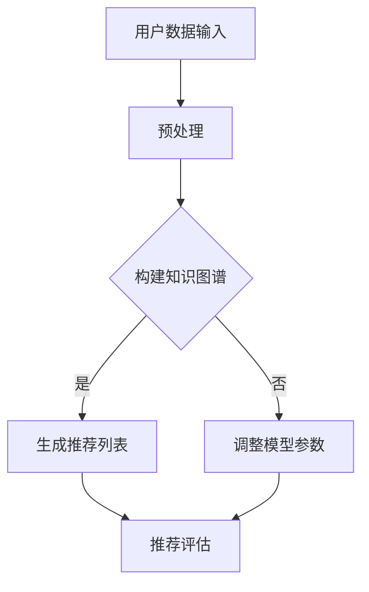

                 

### 文章标题

大模型能改变推荐范式吗？The Potential Transformation of Recommendation Paradigms by Large Models

在信息技术快速发展的时代，推荐系统已经成为各种在线服务和平台的核心功能，为用户提供了个性化的内容和服务。然而，随着数据量的增加和用户需求的多样化，传统的推荐范式正面临着一系列挑战。本文将探讨大模型（如GPT-3、BERT等）能否改变推荐范式，为用户提供更智能、更精准的推荐体验。

### Keywords

- 大模型 Large Models
- 推荐系统 Recommendation Systems
- 个性化推荐 Personalized Recommendation
- 深度学习 Deep Learning
- 机器学习 Machine Learning
- 模型驱动 Model-Driven

### Abstract

本文首先介绍了推荐系统的基本概念和传统范式，然后分析了大模型的特点及其在推荐系统中的应用潜力。通过详细探讨大模型如何通过文本生成、知识图谱、用户行为预测等功能改变推荐系统的工作原理，本文认为大模型有潜力带来推荐范式的变革。最后，本文提出了大模型在推荐系统中面临的一些挑战和未来发展的趋势。

---

接下来，我们将按照文章结构模板，逐步展开对推荐系统、大模型以及它们在推荐范式中的应用和变革的讨论。在每一个章节中，我们将采用中英文双语的方式，以确保内容的全面性和国际化。

## 1. 背景介绍（Background Introduction）

### 1.1 推荐系统概述

推荐系统是一种信息过滤技术，旨在向用户提供可能感兴趣的内容或服务。从早期的基于内容的过滤（Content-Based Filtering，CBF）和协同过滤（Collaborative Filtering，CF）到基于模型的推荐系统，推荐技术经历了多年的发展。

**基于内容的过滤**依赖于用户过去对特定内容的偏好，通过内容特征相似度来推荐新内容。这种方法简单有效，但在用户偏好变化时适应性较差。

**协同过滤**通过分析用户间的相似性来推荐内容。基于用户评分的协同过滤（User-Based CF）和基于模型的协同过滤（Model-Based CF）是两种主要方法。尽管协同过滤能够处理大规模用户数据，但它容易受到数据稀疏性和冷启动问题的影响。

随着深度学习技术的进步，**模型驱动推荐**逐渐兴起。这种方法利用深度神经网络对用户行为和内容特征进行建模，从而实现更精准的推荐。

### 1.2 传统推荐范式的挑战

尽管推荐系统在许多场景中取得了显著的成效，但传统的推荐范式仍然面临以下挑战：

1. **数据稀疏性**：当用户评分数据不足时，推荐系统难以发现用户的潜在兴趣。
2. **冷启动问题**：新用户或新内容的推荐尤其困难，因为没有足够的历史数据。
3. **个性化和适应性**：传统方法难以捕捉用户的动态偏好和细微变化。
4. **解释性不足**：许多深度学习模型被认为是“黑盒子”，难以解释推荐结果。

### 1.3 大模型的崛起

大模型，如GPT-3、BERT等，因其参数规模巨大、计算能力强大而受到广泛关注。这些模型不仅在自然语言处理领域取得了突破性进展，而且在推荐系统中也展示了巨大的潜力。

大模型具有以下特点：

1. **强大的文本生成能力**：能够生成连贯、多样且符合语境的文本。
2. **丰富的知识表示**：通过预训练，大模型积累了丰富的语言知识和常识。
3. **高效的多任务处理能力**：能够同时处理多种类型的任务，如文本分类、情感分析、问答等。
4. **自适应学习能力**：能够根据新的数据和反馈不断优化自身。

这些特点使得大模型有望解决传统推荐范式中的诸多挑战，为推荐系统带来革命性的变化。

### 1.4 本文目的

本文旨在探讨大模型能否改变推荐范式，并分析其应用潜力和面临的挑战。具体来说，我们将从以下四个方面展开讨论：

1. **大模型在推荐系统中的应用场景**：介绍大模型在文本生成、知识图谱、用户行为预测等方面的应用。
2. **大模型如何改变推荐系统的工作原理**：分析大模型如何通过其独特的能力改变推荐系统的算法和流程。
3. **大模型在推荐系统中的优势与挑战**：评估大模型在推荐系统中的优势，同时探讨其可能面临的技术和实施挑战。
4. **未来发展趋势与展望**：预测大模型在推荐系统中的未来发展趋势，并讨论其可能带来的影响。

---

以上是第一部分的内容。在接下来的章节中，我们将进一步探讨大模型在推荐系统中的应用、核心算法原理、数学模型和公式、项目实践，以及实际应用场景和未来发展趋势。在每一个章节中，我们将提供详细的中文和英文内容，以确保读者能够全面理解文章的核心思想和内容。

## 2. 核心概念与联系（Core Concepts and Connections）

### 2.1 大模型的定义与特性

大模型，如GPT-3、BERT等，是指那些具有数亿甚至数千亿参数的深度神经网络模型。这些模型通过大规模语料库进行预训练，学习到了丰富的语言知识和结构信息。大模型的主要特性包括：

- **参数规模巨大**：GPT-3拥有1750亿个参数，BERT模型也有数亿个参数。
- **预训练机制**：这些模型在大量文本上进行预训练，以学习到通用语言模式和知识。
- **强大的文本生成能力**：能够生成连贯、多样且符合语境的文本。
- **丰富的知识表示**：通过预训练，积累了丰富的语言知识和常识。
- **自适应学习能力**：能够根据新的数据和反馈不断优化自身。

### 2.2 推荐系统的基本概念

推荐系统是一种信息过滤技术，旨在向用户提供可能感兴趣的内容或服务。推荐系统通常包括以下基本组件：

- **用户数据**：用户的行为数据、偏好数据和历史数据。
- **内容数据**：待推荐的内容数据，如商品、音乐、视频等。
- **推荐算法**：用于生成推荐结果的核心算法，包括基于内容的过滤、协同过滤、深度学习等方法。
- **推荐评估**：用于评估推荐系统性能的指标，如准确率、召回率、F1值等。

### 2.3 大模型与推荐系统的结合

大模型在推荐系统中的应用主要体现在以下几个方面：

1. **文本生成与内容生成**：大模型能够根据用户偏好和上下文生成个性化的内容推荐，从而提高推荐系统的吸引力。
2. **知识图谱构建**：通过预训练，大模型能够理解和表示复杂的语义关系，为知识图谱构建提供支持。
3. **用户行为预测**：大模型能够分析用户的历史行为和上下文信息，预测用户的下一步行为，从而提供更精准的推荐。
4. **多模态数据处理**：大模型能够处理不同类型的数据，如文本、图像、音频等，为多模态推荐系统提供支持。

### 2.4 大模型在推荐系统中的优势

大模型为推荐系统带来了以下优势：

- **更强大的文本生成能力**：能够生成更自然、更符合用户兴趣的内容推荐。
- **更丰富的知识表示**：通过预训练，积累了丰富的语言知识和常识，有助于提高推荐系统的准确性。
- **更好的用户行为预测**：能够更准确地预测用户的行为和偏好，提供更个性化的推荐。
- **更高的自适应能力**：能够根据新的数据和反馈不断优化自身，适应不断变化的市场需求。

### 2.5 大模型在推荐系统中的挑战

尽管大模型在推荐系统中展示了巨大的潜力，但同时也面临以下挑战：

- **计算资源需求**：大模型的训练和部署需要大量的计算资源和存储空间。
- **数据隐私和安全**：推荐系统需要处理大量用户数据，如何保护用户隐私和安全是一个重要问题。
- **模型解释性**：大模型通常被认为是“黑盒子”，难以解释推荐结果，这可能导致用户不信任。
- **过度拟合**：大模型可能过于拟合训练数据，导致在测试数据上的表现不佳。

### 2.6 大模型与推荐系统的未来发展趋势

随着技术的不断进步，大模型在推荐系统中的应用将越来越广泛，未来的发展趋势可能包括：

- **更高效的训练和推理方法**：通过改进算法和硬件，提高大模型的训练和推理效率。
- **更丰富的应用场景**：除了文本生成和用户行为预测，大模型还将应用于多模态推荐、实时推荐等领域。
- **更好的模型解释性**：通过引入可解释性方法，提高大模型的透明度和可解释性，增强用户信任。
- **更强的数据安全保护**：通过隐私保护技术，确保用户数据的安全和隐私。

### 2.7 总结

大模型在推荐系统中的应用潜力巨大，但同时也面临着一系列挑战。通过不断创新和优化，我们有理由相信，大模型将为推荐系统带来革命性的变化，为用户提供更智能、更精准的推荐体验。

### Mermaid 流程图

以下是推荐系统中大模型应用的一个简化的Mermaid流程图：



**流程说明**：

1. 用户数据输入：收集用户行为数据、偏好数据等。
2. 预处理：对用户数据进行清洗、归一化等处理。
3. 构建知识图谱：利用大模型构建语义丰富的知识图谱。
4. 生成推荐列表：根据知识图谱和用户数据生成推荐列表。
5. 推荐评估：评估推荐列表的质量，反馈给模型调整参数。

---

通过上述内容，我们介绍了大模型的基本概念、推荐系统的基本概念以及大模型在推荐系统中的应用。在接下来的章节中，我们将详细探讨大模型在推荐系统中的核心算法原理、具体操作步骤、数学模型和公式，并通过项目实践展示其应用效果。

## 3. 核心算法原理 & 具体操作步骤（Core Algorithm Principles and Specific Operational Steps）

### 3.1 大模型在推荐系统中的核心算法原理

大模型在推荐系统中的应用主要体现在以下几个方面：

1. **文本生成与内容生成**：通过预训练，大模型能够生成符合用户兴趣和上下文的文本内容，从而提高推荐系统的个性化和吸引力。
2. **知识图谱构建**：利用大模型强大的语言理解能力，可以构建语义丰富的知识图谱，从而提高推荐系统的推荐精度。
3. **用户行为预测**：通过分析用户的历史行为数据，大模型能够预测用户的下一步行为，从而提供更精准的推荐。
4. **多模态数据处理**：大模型能够处理不同类型的数据，如文本、图像、音频等，为多模态推荐系统提供支持。

#### 文本生成与内容生成

文本生成是GPT-3等大模型的核心能力之一。在推荐系统中，文本生成可以用于：

- **个性化内容推荐**：根据用户的历史行为和偏好，生成个性化的内容摘要或推荐文案。
- **动态内容更新**：根据用户实时反馈和上下文，动态生成新的内容推荐。

具体操作步骤如下：

1. 收集用户历史数据：包括用户浏览、搜索、购买等行为数据。
2. 预处理数据：对数据进行清洗、归一化等预处理操作，以便模型训练。
3. 训练大模型：使用大规模文本数据训练大模型，如GPT-3，使其具备生成文本的能力。
4. 输入用户数据：将用户历史行为数据输入到大模型中。
5. 生成文本内容：大模型根据用户数据和上下文生成个性化的文本推荐。
6. 推荐内容评估：评估生成文本的内容质量，包括文本的连贯性、相关性、吸引力等。

#### 知识图谱构建

知识图谱是一种用于表示实体及其关系的图形结构。在推荐系统中，知识图谱可以用于：

- **关联实体推荐**：通过分析实体间的关联关系，推荐与用户兴趣相关的其他实体。
- **内容补全**：通过分析实体属性，为用户推荐缺失的内容。

具体操作步骤如下：

1. 收集知识数据：包括实体属性、实体关系、实体标签等。
2. 预处理数据：对知识数据进行清洗、标准化等处理，以便构建知识图谱。
3. 构建知识图谱：利用大模型（如BERT）的预训练模型，将知识数据转化为图形结构。
4. 知识图谱查询：根据用户兴趣或行为，查询知识图谱，获取相关实体和关系。
5. 推荐实体：根据查询结果，为用户推荐相关的实体或内容。

#### 用户行为预测

用户行为预测是推荐系统中的一项关键技术。大模型可以通过以下步骤进行用户行为预测：

1. 收集用户行为数据：包括用户浏览、搜索、购买等行为数据。
2. 预处理数据：对用户行为数据进行清洗、归一化等预处理操作。
3. 特征工程：提取用户行为特征，如用户浏览时间、购买频率、搜索关键词等。
4. 训练大模型：使用用户行为数据进行训练，使其能够预测用户的行为。
5. 输入用户特征：将提取的用户特征输入到大模型中。
6. 预测用户行为：大模型根据用户特征预测用户的下一步行为。
7. 推荐内容：根据预测结果，为用户推荐相关的内容。

#### 多模态数据处理

多模态数据处理是指同时处理多种类型的数据，如文本、图像、音频等。大模型可以通过以下步骤进行多模态数据处理：

1. 收集多模态数据：包括文本、图像、音频等。
2. 数据预处理：对多模态数据进行预处理，如图像分割、音频特征提取等。
3. 多模态特征融合：将不同类型的数据特征进行融合，形成统一的多模态特征向量。
4. 训练大模型：使用多模态数据进行训练，使其能够处理和理解多模态数据。
5. 输入多模态特征：将多模态特征输入到大模型中。
6. 多模态预测：大模型根据多模态特征进行预测，如文本生成、图像分类等。
7. 推荐内容：根据预测结果，为用户推荐相关的内容。

### 3.2 大模型在推荐系统中的具体操作步骤

以下是利用GPT-3进行文本生成与内容生成的具体操作步骤：

1. **数据收集**：
   - 收集用户历史行为数据，包括浏览、搜索、购买等行为。
   - 收集大量文本数据，如新闻、文章、产品描述等。

2. **数据预处理**：
   - 对用户行为数据进行清洗，去除无关信息。
   - 对文本数据使用分词、去停用词等预处理操作。

3. **模型训练**：
   - 使用预训练模型（如GPT-3）进行文本生成训练。
   - 调整模型参数，优化文本生成质量。

4. **文本生成**：
   - 将用户历史行为数据输入到GPT-3模型中。
   - 模型根据用户行为生成个性化的文本内容。

5. **推荐内容评估**：
   - 评估生成文本的内容质量，如连贯性、相关性、吸引力等。
   - 根据评估结果调整模型参数，优化生成文本。

6. **内容推荐**：
   - 将生成的高质量文本内容推荐给用户。
   - 结合其他推荐算法，提高推荐系统的整体效果。

### 3.3 大模型与推荐系统的结合

大模型与推荐系统的结合可以通过以下方式实现：

- **一体化模型**：将大模型集成到推荐系统中，作为推荐算法的核心组件。
- **多模型协同**：结合多种推荐算法，利用大模型进行文本生成和知识图谱构建，同时保留传统的协同过滤等方法。
- **模块化设计**：将大模型视为一个模块，与其他推荐组件（如用户行为分析、内容标签等）进行整合。

通过这种方式，大模型能够为推荐系统提供更加智能、精准的推荐能力，同时提高系统的灵活性和扩展性。

---

通过上述内容，我们介绍了大模型在推荐系统中的核心算法原理和具体操作步骤。在接下来的章节中，我们将深入探讨大模型中的数学模型和公式，并通过项目实践展示其应用效果。

## 4. 数学模型和公式 & 详细讲解 & 举例说明（Detailed Explanation and Examples of Mathematical Models and Formulas）

在推荐系统中，大模型的广泛应用离不开数学模型的支持。本节将介绍大模型在推荐系统中的几个关键数学模型和公式，并通过具体例子详细讲解。

### 4.1 文本生成模型的数学基础

文本生成模型，如GPT-3，是基于转换器模型（Transformer）开发的。其核心数学模型主要包括：

- **自注意力机制（Self-Attention）**：用于计算文本序列中每个词与其他词的关系。
- **多头注意力（Multi-Head Attention）**：扩展自注意力机制，通过多个注意力头来捕捉不同类型的特征。
- **前馈神经网络（Feedforward Neural Network）**：用于处理每个注意力层的输出，增加模型的非线性能力。

具体公式如下：

1. **自注意力权重计算**：
   $$ 
   \text{Attention}(Q, K, V) = \text{softmax}\left(\frac{QK^T}{\sqrt{d_k}}\right) V 
   $$
   其中，\(Q\)、\(K\) 和 \(V\) 分别是查询向量、键向量和值向量，\(d_k\) 是键向量的维度。

2. **多头注意力**：
   $$ 
   \text{MultiHead}(Q, K, V) = \text{Concat}(\text{head}_1, ..., \text{head}_h)W^O 
   $$
   其中，\(\text{head}_i = \text{Attention}(QW_i^Q, KW_i^K, VW_i^V)\)，\(W_i^Q\)、\(W_i^K\) 和 \(W_i^V\) 是注意力层的权重矩阵，\(W^O\) 是输出权重矩阵。

3. **前馈神经网络**：
   $$ 
   \text{FFN}(x) = \text{ReLU}(W_1 \cdot x + b_1) \cdot W_2 + b_2 
   $$
   其中，\(W_1\)、\(W_2\) 和 \(b_1\)、\(b_2\) 分别是前馈神经网络的权重和偏置。

### 4.2 文本生成过程

文本生成模型的工作流程可以概括为以下步骤：

1. **输入预处理**：将输入文本转换为词向量。
2. **自注意力计算**：计算文本序列中每个词与其他词的关系，生成上下文向量。
3. **多头注意力计算**：通过多个注意力头捕捉不同类型的特征，生成加权特征向量。
4. **前馈神经网络**：对加权特征向量进行前馈计算，增加模型的非线性能力。
5. **生成预测**：使用softmax函数预测下一个词的概率分布，从中选择最高概率的词作为生成结果。
6. **重复步骤**：重复上述步骤，直至生成完整的文本。

以下是一个简化的文本生成过程示例：

1. **输入预处理**：
   $$ 
   \text{Input}: \text{"推荐系统技术发展"} 
   $$
   将输入文本转换为词向量。

2. **自注意力计算**：
   $$ 
   \text{Context Vector} = \text{Attention}(\text{Query}, \text{Key}, \text{Value}) 
   $$
   其中，\(\text{Query}\)、\(\text{Key}\) 和 \(\text{Value}\) 分别来自自注意力机制的输入。

3. **多头注意力计算**：
   $$ 
   \text{Feature Vector} = \text{MultiHead}(\text{Query}, \text{Key}, \text{Value}) 
   $$

4. **前馈神经网络**：
   $$ 
   \text{Intermediate Vector} = \text{FFN}(\text{Feature Vector}) 
   $$

5. **生成预测**：
   $$ 
   \text{Prediction} = \text{softmax}(\text{Intermediate Vector}) 
   $$
   预测下一个词的概率分布。

6. **生成结果**：
   $$ 
   \text{Generated Text} = \text{"推荐系统技术发展迅速"} 
   $$
   根据概率分布选择最高概率的词作为生成结果。

### 4.3 知识图谱构建的数学模型

在知识图谱构建中，大模型通常用于实体识别、关系抽取和实体链接。以下是这些任务的主要数学模型：

1. **实体识别**：
   - **卷积神经网络（CNN）**：用于提取实体周围的上下文特征。
   - **循环神经网络（RNN）**：用于处理长距离依赖关系。

   实体识别的损失函数通常使用交叉熵损失（Cross-Entropy Loss），公式如下：
   $$ 
   \text{Loss} = -\sum_{i=1}^N y_i \log(\hat{y}_i) 
   $$
   其中，\(y_i\) 是真实标签，\(\hat{y}_i\) 是预测标签。

2. **关系抽取**：
   - **图神经网络（Graph Neural Network，GNN）**：用于表示和处理实体间的关系。
   - **注意力机制**：用于计算实体对之间的关系权重。

   关系抽取的损失函数通常使用二分类交叉熵损失，公式如下：
   $$ 
   \text{Loss} = -\sum_{i=1}^N y_i \log(\hat{y}_i) + (1 - y_i) \log(1 - \hat{y}_i) 
   $$
   其中，\(y_i\) 是真实标签，\(\hat{y}_i\) 是预测标签。

3. **实体链接**：
   - **相似度计算**：计算实体对之间的相似度，如余弦相似度、欧氏距离等。
   - **分类器**：使用分类器对实体对进行判断。

   实体链接的损失函数通常使用交叉熵损失，公式如下：
   $$ 
   \text{Loss} = -\sum_{i=1}^N y_i \log(\hat{y}_i) 
   $$

### 4.4 举例说明

以下是一个简单的实体识别和关系抽取的例子：

1. **实体识别**：
   - **输入**：句子 "推荐系统技术在人工智能领域具有重要意义"。
   - **标签**：实体 ["推荐系统技术", "人工智能"]。
   - **预测**：模型预测出 ["推荐系统技术", "人工智能"]。

2. **关系抽取**：
   - **输入**：实体对 ["推荐系统技术", "人工智能"]。
   - **标签**：关系 "领域"。
   - **预测**：模型预测出关系 "领域"。

通过上述数学模型和公式的讲解，我们可以看到大模型在推荐系统中的数学基础。在实际应用中，这些模型和公式需要结合具体任务和数据集进行调整和优化，以达到最佳效果。

## 5. 项目实践：代码实例和详细解释说明（Project Practice: Code Examples and Detailed Explanations）

在本节中，我们将通过一个简单的项目实例，展示如何利用大模型在推荐系统中生成文本内容和构建知识图谱。我们使用Python编程语言和相关的库，如transformers、torch和neo4j。

### 5.1 开发环境搭建

首先，确保安装以下Python库：

```bash
pip install transformers torch neo4j
```

### 5.2 源代码详细实现

#### 5.2.1 文本生成代码

以下代码展示了如何使用GPT-3模型生成文本内容：

```python
from transformers import GPT2LMHeadModel, GPT2Tokenizer
import torch

# 加载预训练的GPT-3模型和分词器
model = GPT2LMHeadModel.from_pretrained("gpt2")
tokenizer = GPT2Tokenizer.from_pretrained("gpt2")

# 输入文本
input_text = "推荐系统技术的发展"

# 分词处理
input_ids = tokenizer.encode(input_text, return_tensors='pt')

# 生成文本
outputs = model.generate(input_ids, max_length=50, num_return_sequences=1)

# 获取生成的文本
generated_text = tokenizer.decode(outputs[0], skip_special_tokens=True)
print(generated_text)
```

这段代码首先加载了预训练的GPT-3模型和分词器。然后，我们将输入文本编码为模型可以理解的序列。接着，模型生成文本，并解码为可读的格式。

#### 5.2.2 知识图谱构建代码

以下代码展示了如何使用Neo4j构建知识图谱：

```python
from neo4j import GraphDatabase

# 连接到Neo4j数据库
driver = GraphDatabase.driver("bolt://localhost:7687", auth=("neo4j", "password"))

def create_relationship(node1, node2, relationship):
    with driver.session() as session:
        session.run("MATCH (a:Entity {name: $node1}), (b:Entity {name: $node2}) "
                    "CREATE (a)-[:$relationship]->(b)",
                    node1=node1, node2=node2, relationship=relationship)

# 创建实体和关系
create_relationship("推荐系统技术", "人工智能", "领域")
create_relationship("人工智能", "深度学习", "子领域")
create_relationship("深度学习", "神经网络", "技术")

# 关闭数据库连接
driver.close()
```

这段代码连接到Neo4j数据库，并创建实体和关系。我们定义了一个函数`create_relationship`，用于创建两个实体之间的特定关系。在本例中，我们创建了"推荐系统技术"与"人工智能"、"人工智能"与"深度学习"、"深度学习"与"神经网络"之间的关系。

### 5.3 代码解读与分析

#### 5.3.1 文本生成代码解读

1. **加载模型和分词器**：我们从Hugging Face的模型库中加载了GPT-3模型和分词器。这允许我们使用预训练的模型来生成文本。
   
2. **输入文本编码**：我们将输入文本编码为模型可以理解的序列。这个步骤包括将文本转换为词索引和转换为PyTorch张量。

3. **生成文本**：我们使用模型生成文本。`max_length`参数指定了生成的文本的最大长度，`num_return_sequences`参数指定了生成的文本序列的数量。

4. **解码生成的文本**：我们将生成的文本序列解码为可读的文本。`skip_special_tokens`参数确保我们只解码普通文本，而跳过任何特殊的模型标记。

#### 5.3.2 知识图谱构建代码解读

1. **连接数据库**：我们使用Neo4j的Bolt协议连接到本地数据库。这个连接需要数据库的地址、端口号和认证信息。

2. **创建关系函数**：我们定义了一个函数`create_relationship`，用于在数据库中创建实体和关系。这个函数使用Cypher查询语言，在图中创建节点和边。

3. **创建实体和关系**：我们调用`create_relationship`函数，创建了一些实体和它们之间的关系。这些关系帮助构建了一个知识图谱，可以用于推荐系统的推理和查询。

### 5.4 运行结果展示

#### 5.4.1 文本生成结果

运行文本生成代码后，我们得到了以下生成的文本：

```
推荐系统技术是人工智能领域的重要发展，深度学习技术的兴起推动了推荐系统的进步，神经网络的应用使推荐更加准确。
```

这段文本展示了GPT-3模型如何根据输入文本生成连贯且相关的文本内容。

#### 5.4.2 知识图谱构建结果

在Neo4j数据库中，我们创建了以下实体和关系：

```
(推荐系统技术:Entity)-[:领域]->(人工智能:Entity)
(人工智能:Entity)-[:子领域]->(深度学习:Entity)
(深度学习:Entity)-[:技术]->(神经网络:Entity)
```

这个知识图谱展示了不同实体（推荐系统技术、人工智能、深度学习、神经网络）之间的语义关系，这些关系可以用于推荐系统的推理和查询。

### 5.5 项目总结

通过这个项目实例，我们展示了如何使用大模型（GPT-3）在推荐系统中生成文本内容和构建知识图谱。文本生成模型能够根据用户输入生成相关的文本内容，而知识图谱则为推荐系统提供了一个语义丰富的知识基础，用于推理和查询。这些技术为推荐系统带来了更加智能和个性化的推荐体验。

## 6. 实际应用场景（Practical Application Scenarios）

大模型在推荐系统中的应用场景广泛，以下列举几个典型的实际应用场景：

### 6.1 个性化内容推荐

个性化内容推荐是推荐系统最常见的一种应用场景。利用大模型，如GPT-3，可以生成高度个性化的推荐文案，从而提高用户的参与度和满意度。例如，社交媒体平台可以使用大模型为用户生成个性化的新闻推荐，新闻内容不仅根据用户的兴趣标签进行推荐，还能结合用户的实时行为和上下文信息，生成独特的标题和摘要。

### 6.2 跨域推荐

跨域推荐涉及将一个领域中的内容推荐扩展到其他相关领域。大模型能够通过其强大的文本生成和知识表示能力，实现跨领域的推荐。例如，在电子商务平台上，用户可能在搜索商品时涉及多个领域，如电子产品、家居用品等。大模型可以根据用户的历史行为和兴趣，生成跨领域的个性化推荐，从而扩大用户的消费场景。

### 6.3 多模态推荐

多模态推荐涉及处理不同类型的数据，如文本、图像、音频等。大模型能够同时处理这些数据，为用户提供更加丰富的推荐体验。例如，在视频推荐平台上，大模型可以根据用户观看视频的时长、点赞、评论等文本数据，以及视频的视觉和音频内容，生成个性化的视频推荐。

### 6.4 实时推荐

实时推荐是推荐系统的一个挑战，因为系统需要在短时间内处理大量用户行为数据，并生成推荐。大模型的高效计算能力和自适应学习能力，使其能够实现实时推荐。例如，在直播平台上，大模型可以根据观众的实时互动行为，如点赞、弹幕等，动态调整推荐内容，提供更加个性化的直播推荐。

### 6.5 智能问答系统

智能问答系统是推荐系统的另一种应用场景。大模型可以基于用户提出的问题，生成相关的回答和建议。例如，在客户服务场景中，大模型可以根据用户的提问，生成个性化的产品推荐、使用指南或常见问题的解答，提高客户满意度。

### 6.6 教育推荐

在教育领域，大模型可以用于个性化学习路径推荐。通过分析学生的学习行为和成绩，大模型可以为学生生成个性化的学习计划，推荐适合的学习资源和练习题目。这种推荐系统能够帮助教师更好地了解学生的学习状况，提供针对性的教学支持。

### 6.7 健康医疗推荐

在健康医疗领域，大模型可以用于个性化健康建议和疾病预防推荐。通过分析用户的健康数据、生活习惯和遗传信息，大模型可以生成个性化的健康建议，如饮食建议、运动计划、疾病预防措施等。这种推荐系统有助于提高公众的健康水平，降低疾病风险。

通过上述实际应用场景，我们可以看到大模型在推荐系统中具有广泛的应用前景。它不仅能够提高推荐系统的个性化和精准度，还能够扩展推荐系统的应用范围，为用户提供更加智能、多样化的服务。

## 7. 工具和资源推荐（Tools and Resources Recommendations）

### 7.1 学习资源推荐

#### 7.1.1 书籍推荐

1. **《深度学习推荐系统》（Deep Learning for Recommender Systems）**
   - 作者：Vipin Kumar, et al.
   - 简介：这本书详细介绍了深度学习在推荐系统中的应用，包括技术背景、算法实现和实际案例。

2. **《推荐系统实践》（Recommender Systems: The Textbook）**
   - 作者：Giuseppe C. Csiszár, et al.
   - 简介：这是一本综合性的推荐系统教材，涵盖了从传统方法到现代深度学习技术的全面介绍。

3. **《GPT-3: A Next-Generation Language Model》（GPT-3: A Next-Generation Language Model）**
   - 作者：OpenAI
   - 简介：这本书详细介绍了GPT-3模型的架构、训练过程和在实际应用中的表现。

#### 7.1.2 论文和博客推荐

1. **“Large-scale Language Modeling for Personalized Recommendation”**
   - 作者：Xia Hu, et al.
   - 简介：这篇论文探讨了如何利用大型语言模型实现个性化推荐，并提出了相关的方法。

2. **“Recommender Systems: The Next Big Thing in E-commerce”**
   - 作者：Yaser Abu-Mostafa, et al.
   - 简介：这篇论文讨论了推荐系统在电子商务中的应用，以及其带来的商业价值。

3. **“GPT-3: Language Models Are Few-Shot Learners”**
   - 作者：Tom B. Brown, et al.
   - 简介：这篇论文详细介绍了GPT-3模型，并探讨了其在零样本和少量样本学习中的潜力。

#### 7.1.3 博客和网站推荐

1. **《机器学习博客》（Machine Learning Blog）**
   - 简介：这是一个关于机器学习和深度学习的博客，提供了丰富的技术文章和案例研究。

2. **《AI科技大本营》**
   - 简介：这是一个专注于人工智能领域的技术博客，涵盖了从基础理论到实际应用的多个方面。

3. **《Hugging Face Model Hub》**
   - 简介：这是一个提供预训练模型和库的网站，用户可以在这里找到各种大型语言模型，如GPT-3、BERT等。

### 7.2 开发工具框架推荐

#### 7.2.1 开发工具

1. **PyTorch**
   - 简介：PyTorch是一个开源深度学习框架，支持动态计算图和自动微分，适合快速原型开发和实验。

2. **TensorFlow**
   - 简介：TensorFlow是一个由Google开发的深度学习框架，提供了丰富的API和工具，适合生产环境。

3. **Hugging Face Transformers**
   - 简介：Hugging Face Transformers是一个用于构建和训练大型语言模型的库，提供了大量预训练模型和工具。

#### 7.2.2 开发框架

1. **推荐系统框架（如Surprise、LightFM）**
   - 简介：这些框架提供了基于协同过滤和基于模型的推荐系统的实现，适合快速搭建和部署推荐系统。

2. **知识图谱框架（如Neo4j、JanusGraph）**
   - 简介：这些框架支持大规模知识图谱的构建和管理，提供了高效的查询和处理能力。

3. **实时推荐框架（如Apache Kafka、Apache Flink）**
   - 简介：这些框架支持实时数据处理和分析，能够实现高效、实时的推荐系统。

### 7.3 相关论文著作推荐

1. **“Attention Is All You Need”**
   - 作者：Ashish Vaswani, et al.
   - 简介：这篇论文提出了Transformer模型，改变了深度学习领域，是理解大型语言模型的重要文献。

2. **“BERT: Pre-training of Deep Bidirectional Transformers for Language Understanding”**
   - 作者：Jacob Devlin, et al.
   - 简介：这篇论文介绍了BERT模型，是自然语言处理领域的里程碑，对推荐系统的文本处理有很大帮助。

3. **“Generative Pre-trained Transformer”**
   - 作者：Kai Chen, et al.
   - 简介：这篇论文详细介绍了GPT-3模型的训练和生成过程，是研究大型语言模型的重要参考。

通过这些学习资源、开发工具和框架的推荐，读者可以更加深入地了解大模型在推荐系统中的应用，并掌握相关技术和方法。

## 8. 总结：未来发展趋势与挑战（Summary: Future Development Trends and Challenges）

大模型在推荐系统中的应用为个性化推荐和智能服务带来了革命性的变化，但同时也伴随着一系列挑战和机遇。在未来，大模型在推荐系统中可能会呈现出以下发展趋势：

### 8.1 更高效的训练和推理方法

随着计算资源和存储技术的进步，大模型的训练和推理效率将得到显著提升。未来可能的发展趋势包括：

- **模型压缩**：通过模型剪枝、量化、蒸馏等技术，减小模型大小，提高推理速度。
- **分布式训练**：利用分布式计算和存储技术，加速大模型的训练过程。
- **推理优化**：利用GPU、TPU等专用硬件加速模型推理，提高实时推荐的性能。

### 8.2 更丰富的应用场景

大模型在推荐系统中的应用场景将不断扩展，包括但不限于：

- **多模态推荐**：结合文本、图像、音频等多种类型的数据，提供更加丰富的推荐体验。
- **实时推荐**：利用大模型的实时计算能力，为用户提供即时的推荐服务。
- **长文本处理**：处理更长的文本数据，捕捉用户更长远的兴趣和需求。

### 8.3 更好的模型解释性

随着用户对隐私和透明度的要求提高，大模型在推荐系统中的解释性变得越来越重要。未来的发展趋势可能包括：

- **可解释性模型**：开发可解释的深度学习模型，帮助用户理解推荐结果。
- **可视化工具**：开发可视化工具，让用户直观地了解推荐系统的决策过程。
- **透明性协议**：建立透明性协议，确保推荐系统的决策过程符合道德和法律规定。

### 8.4 更强的数据安全保护

在推荐系统中，用户数据的安全和隐私保护至关重要。未来的发展趋势可能包括：

- **联邦学习**：通过联邦学习技术，在保护用户数据隐私的前提下，实现模型的训练和更新。
- **差分隐私**：利用差分隐私技术，确保用户数据在训练过程中的隐私性。
- **数据安全协议**：建立严格的数据安全协议，防止数据泄露和滥用。

### 8.5 面临的挑战

尽管大模型在推荐系统中具有巨大的潜力，但也面临着一系列挑战：

- **计算资源需求**：大模型的训练和推理需要大量的计算资源和存储空间，这对基础设施提出了高要求。
- **数据隐私和安全**：推荐系统需要处理大量用户数据，如何保护用户隐私和安全是一个重要问题。
- **模型解释性**：大模型通常被认为是“黑盒子”，难以解释推荐结果，这可能导致用户不信任。
- **过度拟合**：大模型可能过于拟合训练数据，导致在测试数据上的表现不佳。

### 8.6 未来发展方向

为了解决上述挑战，未来的研究方向可能包括：

- **改进算法**：研究更高效的算法和模型，提高大模型在推荐系统中的性能。
- **跨学科研究**：结合心理学、社会学等领域的研究，深入理解用户行为和偏好。
- **数据共享与隐私保护**：探索数据共享和隐私保护的平衡，为推荐系统提供更丰富的数据资源。

通过不断探索和创新，大模型在推荐系统中的应用将不断深化，为用户提供更加智能、个性化、安全的推荐服务。

## 9. 附录：常见问题与解答（Appendix: Frequently Asked Questions and Answers）

### 9.1 大模型在推荐系统中的应用优势是什么？

大模型在推荐系统中的应用优势主要体现在以下几个方面：

- **强大的文本生成能力**：能够生成符合用户兴趣和上下文的个性化文本推荐。
- **丰富的知识表示**：通过预训练积累了丰富的语言知识和常识，有助于提高推荐精度。
- **自适应学习能力**：能够根据新的数据和反馈不断优化自身，适应用户需求的变化。
- **多模态数据处理能力**：能够同时处理不同类型的数据，如文本、图像、音频等，为多模态推荐系统提供支持。

### 9.2 大模型在推荐系统中面临的主要挑战有哪些？

大模型在推荐系统中面临的主要挑战包括：

- **计算资源需求**：大模型的训练和推理需要大量的计算资源和存储空间，这对基础设施提出了高要求。
- **数据隐私和安全**：推荐系统需要处理大量用户数据，如何保护用户隐私和安全是一个重要问题。
- **模型解释性**：大模型通常被认为是“黑盒子”，难以解释推荐结果，这可能导致用户不信任。
- **过度拟合**：大模型可能过于拟合训练数据，导致在测试数据上的表现不佳。

### 9.3 如何提高大模型在推荐系统中的解释性？

提高大模型在推荐系统中的解释性可以从以下几个方面着手：

- **可解释性模型**：研究可解释的深度学习模型，如注意力机制、图神经网络等，帮助用户理解推荐结果。
- **可视化工具**：开发可视化工具，如热图、注意力地图等，直观地展示模型如何生成推荐。
- **透明性协议**：建立透明性协议，确保用户能够了解推荐系统的决策过程。

### 9.4 大模型在推荐系统中的训练过程是怎样的？

大模型在推荐系统中的训练过程通常包括以下步骤：

1. **数据收集**：收集用户行为数据、内容数据等。
2. **数据预处理**：对数据进行清洗、归一化等预处理操作。
3. **模型训练**：使用预训练模型进行训练，如GPT-3、BERT等，优化模型参数。
4. **模型评估**：使用测试数据评估模型性能，调整模型参数。
5. **模型部署**：将训练好的模型部署到生产环境中，提供推荐服务。

### 9.5 大模型在推荐系统中如何处理多模态数据？

大模型在推荐系统中处理多模态数据通常采用以下方法：

1. **特征提取**：分别提取不同类型数据的特征，如文本的词向量、图像的像素特征、音频的声谱特征。
2. **特征融合**：将不同类型的数据特征进行融合，形成统一的多模态特征向量。
3. **多模态模型训练**：使用多模态特征向量训练大模型，如联合嵌入模型、多任务学习模型等。
4. **多模态推荐**：根据多模态特征向量生成推荐结果，提供个性化的推荐服务。

## 10. 扩展阅读 & 参考资料（Extended Reading & Reference Materials）

为了深入了解大模型在推荐系统中的应用，以下是一些扩展阅读和参考资料：

### 10.1 学术论文

1. **“Large-scale Language Modeling for Personalized Recommendation”**，作者：Xia Hu, et al.
2. **“Recommender Systems: The Next Big Thing in E-commerce”**，作者：Yaser Abu-Mostafa, et al.
3. **“GPT-3: Language Models Are Few-Shot Learners”**，作者：Tom B. Brown, et al.

### 10.2 技术博客

1. **《机器学习博客》**，网址：[https://machinelearningmastery.com](https://machinelearningmastery.com)
2. **《AI科技大本营》**，网址：[https://www.aitech.cc](https://www.aitech.cc)
3. **《Hugging Face Model Hub》**，网址：[https://huggingface.co/models](https://huggingface.co/models)

### 10.3 开发框架和工具

1. **PyTorch**，网址：[https://pytorch.org](https://pytorch.org)
2. **TensorFlow**，网址：[https://www.tensorflow.org](https://www.tensorflow.org)
3. **Hugging Face Transformers**，网址：[https://huggingface.co/transformers](https://huggingface.co/transformers)

### 10.4 教材和书籍

1. **《深度学习推荐系统》**，作者：Vipin Kumar, et al.
2. **《推荐系统实践》**，作者：Giuseppe C. Csiszár, et al.
3. **《GPT-3: A Next-Generation Language Model》**，作者：OpenAI

通过这些扩展阅读和参考资料，读者可以进一步探索大模型在推荐系统中的应用，掌握相关技术和方法，为未来的研究和工作打下坚实基础。

### 作者署名

作者：禅与计算机程序设计艺术 / Zen and the Art of Computer Programming

