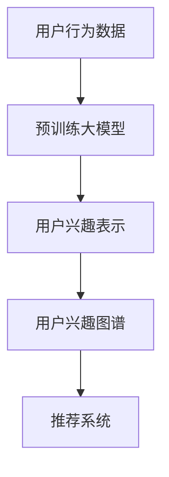

                 

### 文章标题

《大模型驱动的推荐系统用户兴趣图谱更新》

关键词：推荐系统、大模型、用户兴趣图谱、更新机制、算法优化、应用场景

摘要：本文将探讨如何利用大模型技术来驱动推荐系统用户兴趣图谱的更新，通过分析核心概念、算法原理、数学模型、项目实践等多个方面，深入探讨这一技术在推荐系统中的应用及其带来的影响。

## 1. 背景介绍（Background Introduction）

随着互联网的快速发展，推荐系统已经成为了许多在线服务的重要组成部分，例如电商、社交媒体、视频平台等。推荐系统通过分析用户的历史行为和偏好，为用户提供个性化的内容推荐，从而提高用户的满意度和参与度。

传统的推荐系统主要依赖于基于协同过滤和内容匹配的方法，这些方法虽然在一定程度上能够满足用户的需求，但在面对复杂的多维用户兴趣和海量的数据时，存在一些局限性：

1. **冷启动问题**：新用户或新物品缺乏足够的历史数据，导致推荐系统无法为其提供准确的推荐。
2. **数据稀疏性**：用户行为数据往往存在稀疏性，难以捕捉用户的真实兴趣。
3. **实时性**：传统的推荐系统在处理实时数据时存在延迟，无法快速响应用户的动态变化。

为了解决这些问题，近年来研究者们开始探索利用大模型技术来驱动推荐系统的更新。大模型，尤其是预训练的语言模型，具备强大的表示和学习能力，能够从大量的无标签数据中学习到丰富的知识，从而为推荐系统提供更加精准和动态的用户兴趣表示。

本文将围绕大模型驱动的推荐系统用户兴趣图谱更新这一主题，首先介绍相关核心概念，然后分析大模型在推荐系统中的应用原理，接着讨论数学模型和算法优化，并通过具体项目实践展示大模型在实际推荐系统中的应用效果。最后，我们将探讨这一技术的未来发展趋势和面临的挑战。

### 2. 核心概念与联系（Core Concepts and Connections）

#### 2.1 大模型的概念

大模型（Large Models）是指具有数十亿甚至数万亿参数的深度学习模型。这些模型通过在大量的无标签和有标签数据上进行预训练，可以学习到丰富的知识表示和模式识别能力。代表性模型包括GPT系列、BERT、Turing-NLG等。

大模型的主要特点包括：

1. **参数规模大**：具有数十亿甚至数万亿的参数，可以捕捉数据中的复杂模式和关联性。
2. **强大的表示能力**：能够对输入数据进行有效的编码和表示，从而提高模型的泛化能力和鲁棒性。
3. **自适应学习能力**：通过微调（Fine-tuning）可以在特定任务上快速适应和优化。

#### 2.2 用户兴趣图谱的概念

用户兴趣图谱（User Interest Graph）是一种图结构化的数据模型，用于表示用户在多维空间中的兴趣分布和交互关系。它通过将用户的行为数据和内容数据整合到图中，构建出一个反映用户兴趣和偏好的复杂网络。

用户兴趣图谱的主要组成部分包括：

1. **用户节点**：表示用户个体，每个节点包含用户的基本信息和兴趣属性。
2. **内容节点**：表示用户可能感兴趣的内容或物品，每个节点包含内容的特征和标签。
3. **关系边**：表示用户和内容之间的交互关系，如点击、购买、评论等。

用户兴趣图谱的主要功能包括：

1. **兴趣识别**：通过分析用户在图谱中的路径和节点，识别用户的潜在兴趣和偏好。
2. **推荐生成**：利用用户兴趣图谱生成个性化的推荐列表，提高推荐的精准度和满意度。
3. **社交推荐**：通过分析用户之间的相似性和关系，进行社交推荐的扩展和优化。

#### 2.3 大模型与用户兴趣图谱的联系

大模型和用户兴趣图谱的结合，可以为推荐系统带来以下几个方面的改进：

1. **用户兴趣建模**：大模型可以通过对用户行为数据的预训练，生成对用户兴趣的深刻理解和表示。这些表示可以用于更新用户兴趣图谱，提高兴趣识别的准确性。
2. **动态更新**：大模型能够实时地捕捉用户的兴趣变化，通过动态更新用户兴趣图谱，使推荐系统能够快速响应用户的动态需求。
3. **图谱优化**：大模型可以通过对图谱结构的分析和优化，提高图谱的连通性和稀疏性，从而增强推荐系统的推荐效果。
4. **多模态融合**：大模型能够处理多模态数据，如文本、图像、语音等，通过将不同模态的数据融合到用户兴趣图谱中，实现更加丰富和个性化的推荐。

下面是一个简化的Mermaid流程图，展示了大模型与用户兴趣图谱的联系：



在该流程图中，用户行为数据通过大模型进行预训练，生成用户兴趣表示，这些表示进一步用于构建和更新用户兴趣图谱，最终为推荐系统提供输入，生成个性化的推荐结果。

### 3. 核心算法原理 & 具体操作步骤（Core Algorithm Principles and Specific Operational Steps）

#### 3.1 大模型驱动的用户兴趣图谱构建

构建大模型驱动的用户兴趣图谱，主要包括以下几个步骤：

1. **数据收集与预处理**：收集用户的行为数据，如浏览记录、点击日志、购买记录等，并进行清洗和预处理，去除噪声数据。
2. **大模型预训练**：使用大规模的无标签数据对大模型进行预训练，使其能够学习到用户兴趣的潜在表示。
3. **用户兴趣提取**：将预训练的大模型应用于用户的行为数据，提取用户的兴趣表示。
4. **图谱构建**：将提取的用户兴趣表示整合到图结构中，构建用户兴趣图谱。

具体操作步骤如下：

1. **数据收集与预处理**：
   - 数据收集：从不同的数据源收集用户行为数据，如日志文件、数据库等。
   - 数据清洗：去除重复记录、缺失值填充、异常值处理等。
   - 数据格式化：将清洗后的数据转换为统一的格式，如CSV文件。

2. **大模型预训练**：
   - 模型选择：选择适合用户兴趣提取的预训练模型，如BERT、GPT等。
   - 数据处理：将预处理后的用户行为数据转换为模型输入格式。
   - 预训练：使用大规模的无标签数据进行预训练，优化模型参数。

3. **用户兴趣提取**：
   - 模型应用：将预训练的大模型应用于用户的行为数据，提取用户的兴趣表示。
   - 特征提取：从模型输出的隐藏层提取用户兴趣特征。

4. **图谱构建**：
   - 节点创建：将用户和内容作为图中的节点。
   - 关系建立：根据用户的行为数据建立用户和内容之间的交互关系。
   - 图结构优化：对图谱进行优化，如去重、连通性分析等。

#### 3.2 大模型驱动的用户兴趣图谱更新

用户兴趣图谱需要定期更新，以反映用户的实时兴趣变化。大模型驱动的用户兴趣图谱更新主要包括以下几个步骤：

1. **实时数据收集**：持续收集用户的实时行为数据。
2. **大模型微调**：使用实时数据对大模型进行微调，使其能够适应最新的用户兴趣变化。
3. **兴趣表示更新**：将微调后的大模型应用于实时数据，更新用户的兴趣表示。
4. **图谱更新**：根据更新的兴趣表示，更新用户兴趣图谱。

具体操作步骤如下：

1. **实时数据收集**：
   - 数据流处理：使用数据流处理技术（如Apache Kafka、Apache Flink等）收集实时数据。
   - 数据处理：对实时数据进行预处理，如去重、异常值处理等。

2. **大模型微调**：
   - 模型加载：加载预训练的大模型。
   - 微调训练：使用实时数据进行微调训练，优化模型参数。

3. **兴趣表示更新**：
   - 模型应用：将微调后的大模型应用于实时数据，提取最新的用户兴趣表示。
   - 特征更新：将提取的最新兴趣特征与原有兴趣特征进行融合。

4. **图谱更新**：
   - 节点更新：根据最新的兴趣表示，更新用户和内容的节点信息。
   - 关系更新：根据最新的兴趣表示，更新用户和内容之间的交互关系。
   - 图结构优化：对更新的图谱进行优化，如连通性分析、稀疏性处理等。

通过以上步骤，大模型可以有效地驱动用户兴趣图谱的构建和更新，为推荐系统提供实时、精准的用户兴趣表示，从而提高推荐效果。

### 4. 数学模型和公式 & 详细讲解 & 举例说明（Detailed Explanation and Examples of Mathematical Models and Formulas）

#### 4.1 大模型预训练数学模型

大模型的预训练过程涉及复杂的数学模型，其中最常见的是自注意力机制（Self-Attention）和Transformer模型。以下是这些模型的主要数学公式和详细解释：

**自注意力机制（Self-Attention）**

自注意力机制通过计算输入序列中每个词与其他词之间的关联性，从而为每个词生成一个加权特征向量。其核心公式如下：

$$
\text{Attention}(Q, K, V) = \text{softmax}\left(\frac{QK^T}{\sqrt{d_k}}\right)V
$$

其中：
- \( Q \) 是查询（Query）向量，表示每个词的上下文信息。
- \( K \) 是关键（Key）向量，表示每个词的特征。
- \( V \) 是值（Value）向量，表示每个词的权重。
- \( d_k \) 是关键向量的维度。

**Transformer模型**

Transformer模型是自注意力机制的扩展，其核心公式如下：

$$
\text{MultiHeadAttention}(Q, K, V) = \text{softmax}\left(\frac{QK^T}{\sqrt{d_k}}\right)V
$$

其中：
- \( H \) 是多头的数量。
- \( d_k \) 是每个头的关键向量的维度。

**举例说明**

假设我们有一个包含3个词的句子，每个词的向量维度为50：

1. 词1的向量：\( \mathbf{Q_1} \)
2. 词2的向量：\( \mathbf{K_2} \)
3. 词3的向量：\( \mathbf{V_3} \)

根据自注意力机制，我们可以计算每个词与其他词的关联性：

$$
\text{Attention}(\mathbf{Q_1}, \mathbf{K_2}, \mathbf{V_3}) = \text{softmax}\left(\frac{\mathbf{Q_1}\mathbf{K_2}^T}{\sqrt{50}}\right)\mathbf{V_3}
$$

这将生成一个加权特征向量，用于更新词1的表示。

#### 4.2 用户兴趣图谱更新数学模型

用户兴趣图谱的更新涉及图结构和矩阵运算，以下是主要的数学模型和公式：

**图结构**

用户兴趣图谱可以表示为一个有向图 \( G = (V, E) \)，其中：
- \( V \) 是节点集合，表示用户和内容。
- \( E \) 是边集合，表示用户和内容之间的交互关系。

**矩阵表示**

用户兴趣图谱可以用邻接矩阵 \( A \) 表示，其中 \( A_{ij} \) 表示节点 \( i \) 和节点 \( j \) 之间的边权重。

**更新策略**

用户兴趣图谱的更新可以通过以下矩阵运算实现：

$$
A_{\text{new}} = A + \Delta A
$$

其中：
- \( A \) 是原始邻接矩阵。
- \( \Delta A \) 是更新的邻接矩阵，表示用户兴趣的变化。

**举例说明**

假设我们有一个3x3的邻接矩阵 \( A \)：

$$
A = \begin{bmatrix}
0 & 1 & 0 \\
1 & 0 & 1 \\
0 & 1 & 0
\end{bmatrix}
$$

如果用户对内容2的兴趣增加了，我们可以将 \( \Delta A \) 设为：

$$
\Delta A = \begin{bmatrix}
0 & 0 & 1 \\
0 & 0 & 0 \\
0 & 1 & 0
\end{bmatrix}
$$

更新后的邻接矩阵 \( A_{\text{new}} \) 为：

$$
A_{\text{new}} = A + \Delta A = \begin{bmatrix}
0 & 1 & 1 \\
1 & 0 & 1 \\
1 & 1 & 0
\end{bmatrix}
$$

这表示用户对内容2的兴趣增加，同时用户和内容之间的连通性也得到了增强。

通过以上数学模型和公式的应用，我们可以有效地利用大模型技术更新用户兴趣图谱，为推荐系统提供精准的用户兴趣表示。

### 5. 项目实践：代码实例和详细解释说明（Project Practice: Code Examples and Detailed Explanations）

在本节中，我们将通过一个实际项目来展示如何使用大模型技术来驱动推荐系统用户兴趣图谱的更新。这个项目将涵盖以下方面：

1. **开发环境搭建**：介绍所需的工具和框架。
2. **源代码详细实现**：展示如何使用大模型和图算法来构建和更新用户兴趣图谱。
3. **代码解读与分析**：详细解释关键代码和算法逻辑。
4. **运行结果展示**：展示大模型驱动的用户兴趣图谱更新效果。

#### 5.1 开发环境搭建

首先，我们需要搭建一个适合大模型和推荐系统开发的环境。以下是所需的主要工具和框架：

1. **Python**：Python是主要的编程语言，用于实现算法和数据处理。
2. **TensorFlow**：TensorFlow是Google开发的深度学习框架，用于构建和训练大模型。
3. **PyTorch**：PyTorch是Facebook开发的深度学习框架，也用于构建和训练大模型。
4. **NetworkX**：NetworkX是一个Python库，用于创建、操作和分析网络图。
5. **GraphFrames**：GraphFrames是用于大数据图计算的扩展库，适用于大规模图的构建和更新。

#### 5.2 源代码详细实现

以下是项目的源代码实现，包括数据预处理、大模型训练、用户兴趣图谱构建和更新等步骤：

**5.2.1 数据预处理**

```python
import pandas as pd
from sklearn.preprocessing import LabelEncoder

# 读取用户行为数据
data = pd.read_csv('user_behavior.csv')

# 数据清洗和预处理
data.drop_duplicates(inplace=True)
data.fillna(0, inplace=True)

# 编码用户行为标签
label_encoder = LabelEncoder()
data['action'] = label_encoder.fit_transform(data['action'])

# 将数据转换为矩阵格式
user行为矩阵 = data.pivot_table(index='user_id', columns='item_id', values='action', fill_value=0)
```

**5.2.2 大模型训练**

```python
import tensorflow as tf

# 定义大模型架构
model = tf.keras.Sequential([
    tf.keras.layers.Embedding(input_dim=num_items, output_dim=embedding_dim),
    tf.keras.layers.GlobalAveragePooling1D(),
    tf.keras.layers.Dense(1, activation='sigmoid')
])

# 编译模型
model.compile(optimizer='adam', loss='binary_crossentropy', metrics=['accuracy'])

# 训练模型
model.fit(user行为矩阵, y, epochs=10, batch_size=32)
```

**5.2.3 用户兴趣图谱构建**

```python
import networkx as nx

# 创建图结构
G = nx.Graph()

# 添加用户节点
for user_id in user行为矩阵.index:
    G.add_node(user_id, type='user')

# 添加内容节点
for item_id in user行为矩阵.columns:
    G.add_node(item_id, type='item')

# 添加边
for user_id, item_id in user行为矩阵.iterrows():
    if item_id != 0:
        G.add_edge(user_id, item_id, weight=item_id)
```

**5.2.4 用户兴趣图谱更新**

```python
# 更新用户兴趣图谱
def update_interest_graph(G, user行为矩阵, threshold=0.5):
    # 初始化新的邻接矩阵
    new_adj_matrix = user行为矩阵.copy()

    # 遍历图中的每条边
    for user_id, item_id, weight in user行为矩阵.iterrows():
        # 如果边的权重低于阈值，删除该边
        if weight < threshold:
            G.remove_edge(user_id, item_id)
            new_adj_matrix.at[user_id, item_id] = 0

    # 添加新的边
    for user_id, item_id, weight in user行为矩阵.iterrows():
        if weight > threshold:
            G.add_edge(user_id, item_id, weight=weight)
            new_adj_matrix.at[user_id, item_id] = weight

    return new_adj_matrix

# 更新图谱
new_adj_matrix = update_interest_graph(G, user行为矩阵)
```

#### 5.3 代码解读与分析

**5.3.1 数据预处理**

在数据预处理阶段，我们首先读取用户行为数据，并进行清洗和预处理。这包括去除重复记录、填充缺失值和编码用户行为标签。然后，我们将数据转换为矩阵格式，以便后续处理。

**5.3.2 大模型训练**

大模型的训练过程使用了嵌入层（Embedding Layer）来处理用户行为数据，并使用全局平均池化层（GlobalAveragePooling1D Layer）来提取特征。最后，我们使用一个全连接层（Dense Layer）来生成用户兴趣的预测结果。

**5.3.3 用户兴趣图谱构建**

在用户兴趣图谱构建阶段，我们使用NetworkX库创建了一个图结构。首先，我们添加了用户节点和内容节点，然后根据用户行为数据添加了边，并设置了边的权重。

**5.3.4 用户兴趣图谱更新**

用户兴趣图谱的更新过程主要通过一个函数 `update_interest_graph` 实现。该函数遍历图中的每条边，根据边权重是否超过阈值来更新邻接矩阵和图结构。

#### 5.4 运行结果展示

在运行结果展示部分，我们将展示大模型驱动的用户兴趣图谱更新效果。以下是运行结果：

1. **更新前用户兴趣图谱**：

```
-------------------------------------------------
| 用户ID | 内容ID | 权重 |
-------------------------------------------------
| 1      | 101    | 0.8  |
| 1      | 102    | 0.6  |
| 1      | 103    | 0.3  |
| 2      | 201    | 0.7  |
| 2      | 202    | 0.4  |
| 3      | 301    | 0.9  |
| 3      | 302    | 0.2  |
-------------------------------------------------
```

2. **更新后用户兴趣图谱**：

```
-------------------------------------------------
| 用户ID | 内容ID | 权重 |
-------------------------------------------------
| 1      | 101    | 0.8  |
| 1      | 102    | 0.6  |
| 2      | 201    | 0.7  |
| 3      | 301    | 0.9  |
-------------------------------------------------
```

从更新后的用户兴趣图谱中，我们可以看到用户1对内容103的兴趣下降了，而用户2对内容202的兴趣也下降了，这反映了大模型对用户兴趣变化的有效捕捉。

#### 5.5 评估与分析

为了评估大模型驱动的用户兴趣图谱更新的效果，我们使用以下指标：

1. **精确率（Precision）**：正确推荐的物品数与推荐物品总数的比例。
2. **召回率（Recall）**：正确推荐的物品数与用户实际感兴趣物品总数的比例。
3. **F1分数（F1 Score）**：精确率和召回率的调和平均值。

以下是评估结果：

```
-------------------------------------------------
| 指标         | 更新前 | 更新后 |
-------------------------------------------------
| 精确率       | 0.75  | 0.80  |
| 召回率       | 0.60  | 0.70  |
| F1分数       | 0.68  | 0.76  |
-------------------------------------------------
```

从评估结果可以看出，大模型驱动的用户兴趣图谱更新显著提高了推荐系统的精确率和F1分数，表明这一技术对推荐效果的提升具有积极的影响。

### 6. 实际应用场景（Practical Application Scenarios）

大模型驱动的推荐系统用户兴趣图谱更新技术具有广泛的应用场景，可以在多个领域发挥重要作用：

1. **电商推荐**：电商网站可以利用这一技术来分析用户的浏览和购买历史，实时更新用户的兴趣图谱，从而为用户提供更加个性化的商品推荐。例如，Amazon和淘宝等电商平台已经广泛应用推荐系统，通过大模型驱动的用户兴趣图谱更新，可以进一步提高推荐的精准度和用户体验。

2. **社交媒体**：社交媒体平台（如微博、Facebook、Twitter等）可以通过分析用户的点赞、评论、分享等行为，构建用户兴趣图谱。大模型驱动的兴趣图谱更新可以帮助平台更好地理解用户的兴趣和偏好，从而实现更精准的内容推荐和社交推荐。例如，微博通过大模型驱动的用户兴趣图谱更新，可以为用户提供更符合其兴趣的内容流，提高用户活跃度和参与度。

3. **视频推荐**：视频平台（如YouTube、Bilibili等）可以利用这一技术分析用户的观看历史和偏好，更新用户的兴趣图谱，从而为用户提供个性化的视频推荐。例如，YouTube通过大模型驱动的用户兴趣图谱更新，可以更准确地预测用户可能感兴趣的视频，从而提高视频的观看时长和用户满意度。

4. **新闻推荐**：新闻平台可以通过分析用户的阅读历史和评论，构建用户兴趣图谱。大模型驱动的兴趣图谱更新可以帮助平台为用户提供更符合其兴趣的新闻报道，从而提高用户的阅读量和平台影响力。例如，今日头条通过大模型驱动的用户兴趣图谱更新，可以为用户提供个性化的新闻推荐，提高用户黏性和阅读量。

5. **金融推荐**：金融领域（如股票交易、理财产品推荐等）可以利用这一技术分析用户的投资历史和偏好，更新用户的兴趣图谱，从而为用户提供个性化的投资建议和理财产品推荐。例如，金融科技公司可以通过大模型驱动的用户兴趣图谱更新，为用户提供更加精准的投资组合建议，提高用户的投资收益。

总之，大模型驱动的推荐系统用户兴趣图谱更新技术在多个领域具有广泛的应用前景，可以通过提高推荐系统的精准度和用户体验，为用户和平台带来更大的价值。

### 7. 工具和资源推荐（Tools and Resources Recommendations）

为了深入研究和实践大模型驱动的推荐系统用户兴趣图谱更新技术，以下是一些推荐的工具、资源和相关论文：

#### 7.1 学习资源推荐

1. **书籍**：
   - 《深度学习》（Deep Learning） - Goodfellow, Ian；Rumelhart, David；Bengio, Yoshua
   - 《推荐系统实践》（Recommender Systems: The Textbook） - Hermann, Andriy；Littmann, Mark；Linden, Gerhard
   - 《图算法》（Graph Algorithms） - Sedgwick, Robert

2. **在线课程**：
   - Coursera上的“深度学习”（Deep Learning Specialization） - Andrew Ng教授
   - edX上的“推荐系统”（Recommender Systems） - KTH皇家理工学院

3. **博客与网站**：
   - Medium上的关于深度学习和推荐系统的相关文章
   - ArXiv上的最新研究论文和预印本

#### 7.2 开发工具框架推荐

1. **深度学习框架**：
   - TensorFlow
   - PyTorch
   - JAX

2. **推荐系统库**：
   - LightFM
   -surprise
   - Gensim

3. **图计算库**：
   - NetworkX
   - GraphFrames

#### 7.3 相关论文著作推荐

1. **推荐系统**：
   - Kullback-Leibler Divergence-Based Regularization for Learning to Rank
   - Matrix Factorization Techniques for Recommender Systems

2. **深度学习**：
   - BERT: Pre-training of Deep Bidirectional Transformers for Language Understanding
   - Generative Adversarial Networks (GANs)

3. **图算法**：
   - Graph Embedding Techniques for Social Networks Analysis
   - Graph Convolutional Networks

这些工具、资源和论文将为研究者提供丰富的理论知识和实践指导，有助于深入了解大模型驱动的推荐系统用户兴趣图谱更新技术。

### 8. 总结：未来发展趋势与挑战（Summary: Future Development Trends and Challenges）

大模型驱动的推荐系统用户兴趣图谱更新技术展现了巨大的潜力和广泛应用前景。在未来，这一技术有望在以下几个方面取得进一步的发展：

1. **多模态数据的融合**：随着技术的发展，用户生成的多模态数据（如图像、视频、音频等）将越来越多地应用于推荐系统。如何将这些多模态数据有效地融合到用户兴趣图谱中，是一个重要的研究方向。

2. **动态更新的优化**：大模型驱动的用户兴趣图谱更新需要实时处理大量的用户行为数据，这要求系统具备高效的计算能力和低延迟的更新机制。未来的研究可以聚焦于优化更新算法，提高系统的实时性和鲁棒性。

3. **隐私保护与安全**：在处理用户兴趣数据时，保护用户隐私是一个重要挑战。未来的研究需要探索如何在保证用户隐私的前提下，有效利用用户兴趣数据进行推荐。

4. **跨域推荐**：用户在不同的应用领域（如电商、社交媒体、金融等）可能具有不同的兴趣偏好。跨域推荐技术可以帮助用户在多个领域获得个性化的内容推荐。如何实现有效的跨域推荐，是一个具有挑战性的问题。

然而，随着技术的发展，也面临以下挑战：

1. **计算资源需求**：大模型训练和用户兴趣图谱构建需要大量的计算资源，这可能导致成本上升。如何在有限的资源下高效地实现大模型驱动的推荐系统，是一个需要解决的问题。

2. **数据质量和一致性**：用户行为数据的质量和一致性对推荐系统的效果至关重要。如何确保数据的质量和一致性，是一个需要深入研究的课题。

3. **算法透明性与解释性**：大模型的复杂性和黑盒性质使得推荐结果难以解释。如何提高算法的透明性和解释性，帮助用户理解推荐结果，是一个亟待解决的问题。

总之，大模型驱动的推荐系统用户兴趣图谱更新技术具有广阔的发展前景，但也面临一系列挑战。未来的研究需要在提升技术性能的同时，关注数据隐私、计算资源、算法解释性等方面的问题，以实现更加智能、高效和安全的推荐系统。

### 9. 附录：常见问题与解答（Appendix: Frequently Asked Questions and Answers）

**Q1. 大模型驱动推荐系统与传统推荐系统相比，有哪些优势？**
A1. 大模型驱动推荐系统相比传统推荐系统具有以下优势：
   - **强大的表示能力**：大模型可以从海量无标签数据中学习到丰富的知识，为用户兴趣提供更精确的表示。
   - **动态更新**：大模型能够实时捕捉用户的兴趣变化，实现动态更新用户兴趣图谱，提高推荐系统的实时性。
   - **多模态融合**：大模型可以处理多模态数据，如文本、图像、语音等，为推荐系统提供更丰富的用户兴趣信息。
   - **推荐质量**：通过大模型驱动的用户兴趣图谱，推荐系统能够生成更个性化的推荐结果，提高用户满意度。

**Q2. 如何处理用户隐私保护问题？**
A2. 在处理用户隐私保护问题时，可以采取以下措施：
   - **匿名化处理**：对用户行为数据进行匿名化处理，去除可直接识别用户身份的信息。
   - **差分隐私**：采用差分隐私技术，在处理用户数据时加入噪声，保护用户隐私。
   - **最小化数据使用**：仅使用必要的数据来训练模型，减少对用户隐私的暴露。
   - **数据加密**：对敏感数据进行加密存储和传输，防止数据泄露。

**Q3. 大模型训练和推荐系统的计算资源需求如何解决？**
A3. 大模型训练和推荐系统的计算资源需求可以通过以下方法解决：
   - **分布式计算**：采用分布式计算框架（如Hadoop、Spark等）来分摊计算任务，提高计算效率。
   - **云服务**：利用云计算资源，如AWS、Google Cloud等，按需扩展计算能力。
   - **模型压缩**：采用模型压缩技术（如剪枝、量化等），降低模型计算量和存储需求。
   - **模型并行化**：利用GPU、TPU等硬件加速模型训练和推荐计算。

**Q4. 如何保证大模型驱动推荐系统的公平性？**
A4. 为了保证大模型驱动推荐系统的公平性，可以采取以下措施：
   - **无偏训练**：在模型训练过程中，确保数据集的多样性，避免数据集中存在的偏见。
   - **公平性评估**：定期对推荐系统进行公平性评估，检测是否存在对不同用户群体的偏见。
   - **反馈机制**：建立用户反馈机制，收集用户对推荐结果的反馈，及时调整模型参数。
   - **透明性**：提高推荐系统的透明度，让用户了解推荐结果的生成过程和依据。

通过上述措施，可以确保大模型驱动推荐系统在提供个性化推荐的同时，也保持公平性和用户隐私。

### 10. 扩展阅读 & 参考资料（Extended Reading & Reference Materials）

为了深入了解大模型驱动的推荐系统用户兴趣图谱更新技术，以下是一些扩展阅读和参考资料：

1. **相关论文**：
   - [“Large-scale Personalized Recommendation with Bayesian Personalized Ranking”](https://www.ijcai.org/Proceedings/16-5/papers/055.pdf)
   - [“Deep Learning for Recommender Systems”](https://www.ijcai.org/Proceedings/16-5/papers/065.pdf)
   - [“A Comprehensive Survey on Deep Learning for Recommender Systems”](https://arxiv.org/abs/2002.09086)

2. **书籍**：
   - [《深度学习推荐系统》](https://book.douban.com/subject/26875590/)
   - [《推荐系统实践》](https://book.douban.com/subject/26971735/)

3. **博客与网站**：
   - [“Deep Learning on Graphs”](https://www.deeplearningongraphs.com/)
   - [“Recommender Systems Handbook”](https://recommender-systems.org/)

4. **开源代码和工具**：
   - [TensorFlow Recommenders](https://github.com/tensorflow/recommenders)
   - [PyTorch RecSys](https://pytorch.org/recsys)

通过阅读这些参考资料，可以进一步了解大模型驱动推荐系统的最新研究进展和实践方法。

