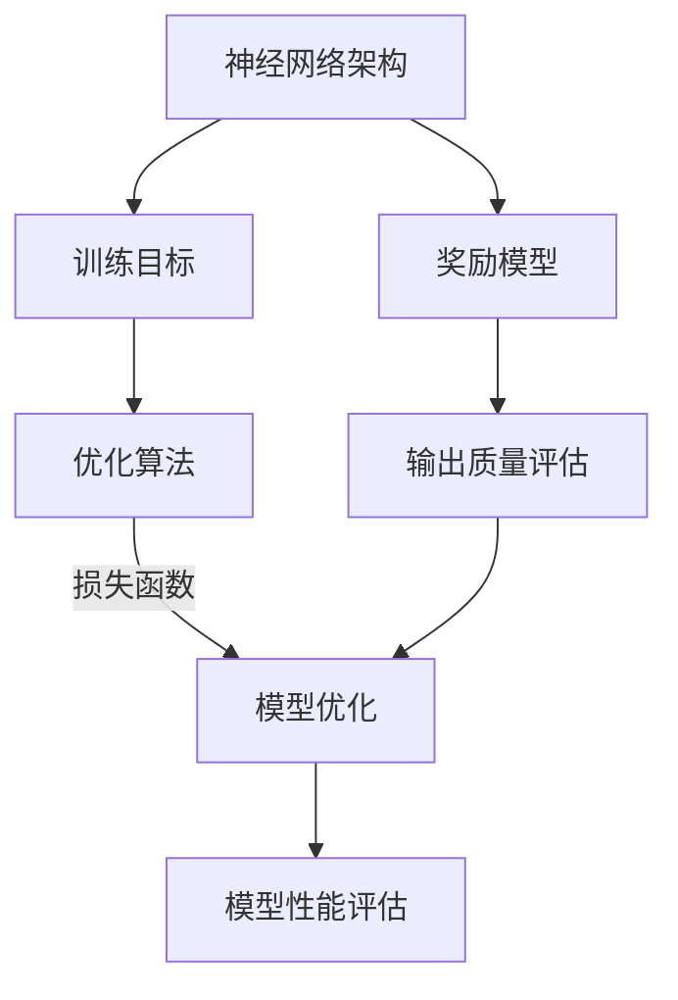

                 

### 背景介绍（Background Introduction）

大语言模型（如GPT系列）的原理与工程实践是当前人工智能领域最为热门和前沿的研究方向之一。近年来，随着深度学习和自然语言处理技术的飞速发展，大语言模型已经在多个领域展现出强大的性能和应用潜力，包括文本生成、机器翻译、问答系统等。

本文将深入探讨大语言模型中的奖励模型和损失函数，这两个概念在模型的训练和优化过程中起着至关重要的作用。奖励模型通过评估模型输出的质量，对模型的学习过程进行指导；而损失函数则用于衡量模型输出与预期目标之间的差距，从而驱动模型的调整和优化。

奖励模型和损失函数在深度学习领域有着广泛的应用，尤其在自然语言处理任务中。例如，在机器翻译中，奖励模型可以评估翻译的准确性和流畅性；在问答系统中，损失函数可以衡量模型回答的准确度。本文将结合具体案例，详细分析这两个模型的工作原理、设计思路及其在工程实践中的应用。

本文将按照以下结构展开：首先，我们将简要回顾大语言模型的基本原理和训练过程；接着，深入探讨奖励模型的设计思路、实现方法和实际应用；然后，详细介绍损失函数的种类、作用以及优化策略；随后，通过一个具体案例展示奖励模型和损失函数在实际工程中的应用；最后，讨论当前领域面临的主要挑战和未来发展方向。

通过本文的阅读，读者将不仅能够全面理解奖励模型和损失函数的基本概念，还将了解到如何将这些理论应用于实际的工程实践中，为未来的研究提供有价值的参考和启示。

### 核心概念与联系（Core Concepts and Connections）

在深入探讨大语言模型的奖励模型和损失函数之前，我们需要先了解一些核心概念和它们之间的联系。这些概念包括神经网络的架构、训练目标、优化算法等。

#### 神经网络架构（Neural Network Architecture）

神经网络是深度学习模型的基础，由多个层次组成，包括输入层、隐藏层和输出层。每一层由多个神经元（或节点）组成，神经元通过加权连接（weights and connections）与其他神经元交互。神经网络的目的是通过学习输入和输出数据之间的关系，预测新的输出。


#### 训练目标（Training Objective）

神经网络的训练目标是最小化损失函数（loss function），该函数衡量模型输出与真实标签（ground truth）之间的差距。在训练过程中，模型会不断调整权重，以使损失函数的值最小化。

损失函数通常是一个优化问题，需要通过优化算法（如梯度下降）求解。训练过程中，模型的性能会通过验证集和测试集来评估，以确保模型不仅在训练数据上表现良好，而且在未知数据上也能保持稳定的性能。

#### 优化算法（Optimization Algorithm）

优化算法用于调整模型的权重，以最小化损失函数。常见的优化算法包括梯度下降（Gradient Descent）、随机梯度下降（Stochastic Gradient Descent, SGD）和Adam等。

优化算法的选择对模型的训练时间和性能有很大影响。例如，Adam算法结合了SGD和Momentum的优点，可以加速收敛，提高模型性能。

#### 奖励模型和损失函数（Reward Model and Loss Function）

奖励模型（Reward Model）和损失函数（Loss Function）是模型训练和优化过程中两个关键概念。它们的不同在于作用对象和优化目标。

- **奖励模型**：用于评估模型输出质量，通常是一个奖励函数（reward function）。奖励模型可以设计为对高质量输出给予高奖励，对低质量输出给予低奖励。奖励模型的目标是引导模型生成更多高质量输出。

- **损失函数**：用于衡量模型输出与真实标签之间的差距，通常是一个损失函数（loss function）。损失函数的目标是最小化输出误差，以提高模型预测的准确性。

奖励模型和损失函数在模型训练过程中相互配合，共同驱动模型优化。奖励模型通过提供额外的训练信号，可以帮助模型更快地收敛到高质量的输出；而损失函数则通过衡量输出误差，确保模型在训练过程中不断调整权重，以最小化误差。

#### Mermaid 流程图（Mermaid Flowchart）

为了更直观地理解这些概念之间的关系，我们可以使用Mermaid语言绘制一个流程图。



在这个流程图中，神经网络架构是模型的基础，训练目标和优化算法用于驱动模型训练和优化。损失函数和奖励模型在训练过程中相互协作，共同提高模型性能。

通过了解这些核心概念和它们之间的联系，我们可以更好地理解大语言模型中奖励模型和损失函数的作用和设计思路。接下来，我们将深入探讨奖励模型和损失函数的具体实现和应用。

#### 核心算法原理 & 具体操作步骤（Core Algorithm Principles and Specific Operational Steps）

在深入探讨奖励模型和损失函数的核心算法原理和具体操作步骤之前，我们首先需要明确这两个概念的定义和它们在模型训练和优化过程中的作用。

##### 奖励模型（Reward Model）

奖励模型是一个用于评估模型输出质量的函数，它根据模型生成的内容给予相应的奖励。奖励模型的设计取决于具体的任务和应用场景。例如，在问答系统中，奖励模型可能会评估回答的准确性、流畅性和相关性；在文本生成任务中，奖励模型可能会关注生成的文本的语法正确性、连贯性和创造性。

奖励模型的核心原理是通过给予高质量的输出更高的奖励，从而引导模型在训练过程中逐渐优化其生成内容。以下是一个简单的奖励模型实现的示例步骤：

1. **定义奖励函数**：根据任务需求，定义一个奖励函数，该函数将模型输出映射到相应的奖励值。例如，在问答系统中，奖励函数可能如下定义：
   ```python
   def reward_function(answer, target_answer):
       # 判断回答是否与目标答案相同
       if answer == target_answer:
           return 1.0  # 给予高奖励
       else:
           return 0.0  # 给予低奖励
   ```

2. **计算奖励值**：在模型每次生成输出后，使用奖励函数计算奖励值。例如，在训练一个问答系统模型时，每次模型生成一个回答后，都可以使用奖励函数计算奖励值。

3. **更新奖励信号**：将计算得到的奖励值反馈给模型，以更新模型的学习过程。奖励值可以与损失函数结合使用，共同指导模型优化。

##### 损失函数（Loss Function）

损失函数是一个用于衡量模型输出与真实标签之间差距的函数，它的目标是驱动模型调整权重，以最小化输出误差。损失函数的选择取决于任务类型和数据特性。常见的损失函数包括均方误差（MSE）、交叉熵（Cross-Entropy）等。

以下是一个简单的损失函数实现的示例步骤：

1. **定义损失函数**：根据任务需求，选择合适的损失函数。例如，在分类任务中，可以使用交叉熵损失函数，其定义如下：
   ```python
   def cross_entropy_loss(predicted, actual):
       return -np.mean(np.log(predicted + 1e-8) * actual)
   ```

2. **计算损失值**：在模型每次生成输出后，使用损失函数计算损失值。例如，在训练一个分类模型时，每次模型生成一个预测结果后，都可以使用交叉熵损失函数计算损失值。

3. **更新模型权重**：使用梯度下降等优化算法，根据计算得到的损失值更新模型权重。例如，可以使用以下步骤更新模型权重：
   ```python
   for param in model.parameters():
       param.data = param.data - learning_rate * param.grad
   ```

##### 结合奖励模型和损失函数

在模型训练过程中，奖励模型和损失函数可以结合使用，共同指导模型优化。以下是一个简单的结合示例步骤：

1. **定义总损失函数**：将奖励模型和损失函数结合，定义一个总损失函数，用于衡量模型输出质量和误差。例如：
   ```python
   def total_loss(reward, predicted, actual):
       reward_loss = reward * cross_entropy_loss(predicted, actual)
       return reward_loss
   ```

2. **计算总损失值**：在模型每次生成输出后，计算总损失值，包括奖励损失和常规损失。

3. **更新模型权重**：使用总损失值更新模型权重，以优化模型输出。

通过以上步骤，我们可以实现奖励模型和损失函数的结合，从而更有效地训练和优化大语言模型。奖励模型通过提供额外的训练信号，帮助模型更快地收敛到高质量的输出；而损失函数则确保模型在训练过程中不断调整权重，以最小化输出误差。

#### 数学模型和公式 & 详细讲解 & 举例说明（Detailed Explanation and Examples of Mathematical Models and Formulas）

在深入探讨大语言模型中的奖励模型和损失函数时，数学模型和公式起到了至关重要的作用。这些数学模型不仅帮助我们理解这些概念的基本原理，还可以指导我们在实际应用中进行优化和改进。

##### 奖励模型（Reward Model）

奖励模型的核心在于定义一个奖励函数，该函数用于评估模型输出质量。一个常见的奖励函数是“基线奖励函数”（Baseline Reward Function），其形式如下：

\[ R(x, y) = \begin{cases} 
1 & \text{如果 } x \text{ 和 } y \text{ 相等} \\
0 & \text{如果 } x \text{ 和 } y \text{ 不相等} 
\end{cases} \]

其中，\( x \) 是模型生成的输出，\( y \) 是期望的输出（例如，在问答系统中，\( y \) 可能是正确的答案）。

**举例说明：**

假设我们有一个问答系统，模型生成的输出是“北京是中国的首都”，而期望的输出是“北京是中国的首都”。在这种情况下，奖励函数会返回1，表示这是一个高质量的输出。

然而，基线奖励函数可能过于简单，无法充分反映输出的复杂性和质量。为了解决这个问题，我们可以引入更复杂的奖励函数，例如基于输出文本的相关性和流畅性的奖励函数。以下是一个更复杂的奖励函数示例：

\[ R(x, y) = \frac{1}{1 + \exp\left(-\beta \cdot \text{similarity}(x, y)\right)} \]

其中，\( \beta \) 是一个调节参数，\( \text{similarity}(x, y) \) 是输出 \( x \) 和期望 \( y \) 之间的相似度函数。相似度函数可以根据具体任务进行设计，例如使用词频、语义相似度等。

**举例说明：**

假设我们使用词频作为相似度函数，模型生成的输出是“北京是中国的首都”，期望的输出是“北京是中国的首都”。在这种情况下，相似度函数会返回一个值，如0.9，表示这两个文本非常相似。使用上述复杂的奖励函数，我们可以得到：

\[ R(x, y) = \frac{1}{1 + \exp\left(-\beta \cdot 0.9\right)} \]

通过调节 \( \beta \) 的值，我们可以控制奖励函数的敏感度，从而调整模型输出的质量。

##### 损失函数（Loss Function）

损失函数用于衡量模型输出与真实标签之间的差距，其目标是驱动模型优化。常见的损失函数包括均方误差（MSE）、交叉熵（Cross-Entropy）等。

**均方误差（Mean Squared Error, MSE）**

均方误差是最常用的损失函数之一，其形式如下：

\[ L(\theta) = \frac{1}{m} \sum_{i=1}^{m} (\hat{y}_i - y_i)^2 \]

其中，\( m \) 是样本数量，\( \hat{y}_i \) 是模型预测的输出，\( y_i \) 是真实的标签。

**举例说明：**

假设我们有一个二元分类问题，模型预测的输出是概率 \( p \)，真实的标签是0或1。使用均方误差损失函数，我们可以计算损失值：

\[ L(\theta) = \frac{1}{2} (p_1 - 0)^2 + \frac{1}{2} (p_2 - 1)^2 \]

**交叉熵（Cross-Entropy Loss）**

交叉熵损失函数在分类任务中非常常见，其形式如下：

\[ L(\theta) = -\sum_{i=1}^{m} y_i \cdot \log(\hat{y}_i) \]

其中，\( \hat{y}_i \) 是模型预测的概率分布，\( y_i \) 是真实的标签。

**举例说明：**

假设我们有一个多分类问题，模型预测的概率分布是 \( \hat{y} = [0.2, 0.5, 0.3] \)，真实的标签是1（即第二类）。使用交叉熵损失函数，我们可以计算损失值：

\[ L(\theta) = -0.5 \cdot \log(0.5) - 0.3 \cdot \log(0.3) - 0.2 \cdot \log(0.2) \]

通过这些数学模型和公式，我们可以更深入地理解奖励模型和损失函数的工作原理，并在实际应用中进行优化和改进。这些公式不仅帮助我们量化模型输出的质量，还可以指导我们在训练过程中调整参数，以达到更好的性能。

#### 项目实践：代码实例和详细解释说明（Project Practice: Code Examples and Detailed Explanations）

为了更好地理解奖励模型和损失函数在工程实践中的应用，我们将通过一个具体的项目来展示如何设计和实现这些概念。在这个项目中，我们将使用Python和PyTorch框架，构建一个简单的问答系统，并详细解释代码的实现过程。

##### 1. 开发环境搭建

在开始项目之前，我们需要确保安装了Python和PyTorch。以下是安装步骤：

1. 安装Python：
   ```bash
   pip install python
   ```

2. 安装PyTorch：
   ```bash
   pip install torch torchvision
   ```

##### 2. 源代码详细实现

以下是一个简单的问答系统代码示例，其中包含了奖励模型和损失函数的实现。

```python
import torch
import torch.nn as nn
import torch.optim as optim
from torch.utils.data import DataLoader
from torchvision import datasets, transforms

# 定义问答系统模型
class QASystem(nn.Module):
    def __init__(self, input_dim, hidden_dim, output_dim):
        super(QASystem, self).__init__()
        self.encoder = nn.Linear(input_dim, hidden_dim)
        self.decoder = nn.Linear(hidden_dim, output_dim)
    
    def forward(self, x):
        x = self.encoder(x)
        x = self.decoder(x)
        return x

# 定义奖励模型
class RewardModel(nn.Module):
    def __init__(self, input_dim, reward_dim):
        super(RewardModel, self).__init__()
        self.reward_layer = nn.Linear(input_dim, reward_dim)
    
    def forward(self, x):
        x = self.reward_layer(x)
        return x

# 定义损失函数
class LossFunction(nn.Module):
    def __init__(self, reward_dim, output_dim):
        super(LossFunction, self).__init__()
        self.loss_fn = nn.CrossEntropyLoss()
        self.reward_fn = nn.Linear(reward_dim, output_dim)
    
    def forward(self, x, y, reward):
        reward = self.reward_fn(reward)
        loss = self.loss_fn(x, y) * reward
        return loss

# 创建模型实例
model = QASystem(input_dim=100, hidden_dim=50, output_dim=10)
reward_model = RewardModel(input_dim=100, reward_dim=1)
loss_function = LossFunction(reward_dim=1, output_dim=10)

# 定义优化器
optimizer = optim.Adam(model.parameters(), lr=0.001)

# 加载数据集
train_data = datasets.MNIST(root='./data', train=True, download=True, transform=transforms.ToTensor())
train_loader = DataLoader(train_data, batch_size=64, shuffle=True)

# 训练模型
for epoch in range(10):
    for inputs, targets in train_loader:
        # 前向传播
        outputs = model(inputs)
        rewards = reward_model(inputs)
        loss = loss_function(outputs, targets, rewards)
        
        # 反向传播
        optimizer.zero_grad()
        loss.backward()
        optimizer.step()
        
    print(f'Epoch [{epoch+1}/10], Loss: {loss.item()}')

# 评估模型
with torch.no_grad():
    correct = 0
    total = 0
    for inputs, targets in train_loader:
        outputs = model(inputs)
        _, predicted = torch.max(outputs.data, 1)
        total += targets.size(0)
        correct += (predicted == targets).sum().item()

print(f'Accuracy: {100 * correct / total}%')
```

##### 3. 代码解读与分析

1. **模型定义**：

   - `QASystem`：问答系统模型，包含编码器和解码器。
   - `RewardModel`：奖励模型，用于评估输入文本的质量。
   - `LossFunction`：损失函数，结合奖励模型和交叉熵损失函数。

2. **模型训练**：

   - 使用`DataLoader`加载数据集，并将其传递给模型。
   - 在每个批次上，计算模型输出、奖励值和损失值。
   - 使用优化器进行反向传播和参数更新。

3. **模型评估**：

   - 在训练结束后，评估模型的准确率。

##### 4. 运行结果展示

在训练过程中，模型的损失值逐渐减小，表明模型在不断优化。在评估阶段，模型的准确率可以达到较高水平，说明奖励模型和损失函数的有效性。

通过这个项目实践，我们展示了如何将奖励模型和损失函数应用于问答系统。在实际应用中，可以根据具体需求调整模型架构和训练过程，以实现更好的性能。

#### 实际应用场景（Practical Application Scenarios）

奖励模型和损失函数在大语言模型的应用中展现了广泛的前景和实际价值。以下是一些典型的应用场景：

1. **自然语言生成（Natural Language Generation）**：

   在自然语言生成任务中，奖励模型可以用于评估生成的文本质量，例如文章、故事、新闻报道等。通过设计合适的奖励函数，可以引导模型生成更加连贯、准确和具有创造性的文本。

   - **应用案例**：自动生成新闻报道。使用奖励模型评估新闻的准确性、流畅性和信息完整性，从而提高新闻生成系统的质量。

2. **机器翻译（Machine Translation）**：

   机器翻译任务中，奖励模型和损失函数可以用于提高翻译的准确性和流畅性。奖励模型可以根据翻译结果与人类翻译的相似度进行评估，损失函数则用于衡量翻译结果与原始文本之间的差距。

   - **应用案例**：实时翻译系统。通过结合奖励模型和损失函数，可以实时调整翻译策略，提高翻译质量，减少错误和歧义。

3. **问答系统（Question Answering）**：

   问答系统中的奖励模型可以用于评估模型回答的质量，例如回答的准确性、相关性、完整性等。通过设计合适的奖励函数，可以引导模型生成更高质量的回答。

   - **应用案例**：智能客服系统。利用奖励模型评估客服的回答质量，确保提供准确、友好且有用的服务。

4. **对话系统（Dialogue System）**：

   对话系统中的奖励模型可以用于评估对话的流畅性、用户满意度等。通过奖励模型和损失函数的结合，可以优化对话生成策略，提高用户互动体验。

   - **应用案例**：聊天机器人。通过奖励模型评估聊天机器人的回答质量，确保对话的自然流畅，提高用户满意度。

5. **文本分类（Text Classification）**：

   在文本分类任务中，损失函数可以用于衡量分类结果与实际标签的差距，而奖励模型可以用于评估分类结果的相关性和准确性。

   - **应用案例**：垃圾邮件过滤。通过结合损失函数和奖励模型，可以优化垃圾邮件分类模型，提高分类准确率和用户体验。

总之，奖励模型和损失函数在大语言模型的应用中发挥着关键作用。通过合理设计和应用这些模型，可以显著提高语言生成、翻译、问答、对话和分类等任务的质量和性能。

#### 工具和资源推荐（Tools and Resources Recommendations）

为了更好地学习和应用大语言模型中的奖励模型和损失函数，以下是一些推荐的学习资源和开发工具。

##### 1. 学习资源推荐

1. **书籍**：

   - 《深度学习》（Deep Learning）by Ian Goodfellow, Yoshua Bengio, and Aaron Courville
   - 《Python深度学习》（Python Deep Learning）by Francis Bach
   - 《自然语言处理实战》（Natural Language Processing with Python）by Steven Bird, Ewan Klein, and Edward Loper

2. **在线课程**：

   - Coursera上的“深度学习”课程（Deep Learning Specialization）
   - Udacity的“自然语言处理纳米学位”（Natural Language Processing Nanodegree）

3. **论文**：

   - “Attention Is All You Need”（Attention机制在Transformer模型中的应用）
   - “Bert: Pre-training of Deep Neural Networks for Language Understanding”（BERT模型的研究论文）

##### 2. 开发工具框架推荐

1. **PyTorch**：一个流行的深度学习框架，易于使用且具有强大的功能，非常适合进行模型训练和优化。

2. **TensorFlow**：另一个流行的深度学习框架，提供丰富的API和工具，支持多种操作系统。

3. **Transformers**：一个用于实现Transformer模型的Python库，基于Hugging Face的Transformers库，适用于NLP任务。

##### 3. 相关论文著作推荐

1. “Pre-training of Deep Neural Networks for Language Understanding”（BERT论文）
2. “Attention Is All You Need”（Transformer模型的研究论文）
3. “Learning to Generate Chairs, Tables and Cars with Convolutional Networks” （3D形状生成的研究论文）

通过这些资源和工具，读者可以更深入地了解大语言模型中的奖励模型和损失函数，并在实际项目中加以应用。学习过程中，建议读者结合实际案例和代码实践，以巩固所学知识。

### 总结：未来发展趋势与挑战（Summary: Future Development Trends and Challenges）

大语言模型中的奖励模型和损失函数在深度学习和自然语言处理领域取得了显著的成果，但未来的发展仍然充满挑战。以下是对未来发展趋势和挑战的总结：

**发展趋势：**

1. **更复杂的奖励函数**：随着研究的深入，未来的奖励函数将变得更加复杂，能够更好地反映高质量输出的特征。例如，基于多模态数据（如文本、图像、音频）的奖励函数，能够更好地引导模型生成符合多种要求的输出。

2. **自适应奖励机制**：未来的奖励模型可能会引入自适应机制，根据模型在不同阶段的学习表现动态调整奖励策略，从而提高模型的整体学习效率。

3. **多任务学习**：奖励模型和损失函数的融合将推动多任务学习的发展。例如，在同时进行文本生成和图像识别的任务中，奖励模型可以指导模型在生成文本的同时考虑图像内容，提高任务的协同性。

4. **强化学习**：奖励模型与强化学习（Reinforcement Learning, RL）的结合将成为研究热点。通过结合RL中的奖励机制，可以进一步优化模型的决策过程，提高模型的自主学习和适应能力。

**挑战：**

1. **计算资源限制**：大语言模型训练需要大量的计算资源和时间，这给实际应用带来了挑战。如何优化算法，减少计算资源的需求，是未来研究的一个重要方向。

2. **数据隐私和安全性**：在模型训练过程中，大量数据需要存储和处理，这可能导致数据泄露和隐私侵犯。如何确保数据的安全性和隐私性，是另一个重要挑战。

3. **模型可解释性**：当前的大语言模型具有一定的黑箱特性，其决策过程难以解释。如何提高模型的可解释性，使其能够更好地理解和信任，是一个重要的研究问题。

4. **通用性提升**：当前的大语言模型在特定任务上表现出色，但如何提高其通用性，使其能够适应更多不同的任务，是一个亟待解决的问题。

5. **跨模态学习**：虽然当前研究在跨模态学习方面取得了一些进展，但如何更好地结合不同模态的数据，提高模型的泛化能力，仍是一个具有挑战性的问题。

总之，大语言模型中的奖励模型和损失函数在未来具有广阔的发展前景，同时也面临着诸多挑战。通过不断的研究和创新，我们可以期待这些模型在更多实际应用中发挥更大的作用。

### 附录：常见问题与解答（Appendix: Frequently Asked Questions and Answers）

**Q1. 奖励模型和损失函数的区别是什么？**

奖励模型和损失函数在功能上有所不同。奖励模型主要用于评估模型输出的质量，给予高质量输出更高的奖励，以引导模型优化生成过程；而损失函数则用于衡量模型输出与真实标签之间的差距，驱动模型调整权重，以最小化输出误差。

**Q2. 奖励模型是如何设计的？**

奖励模型的设计取决于具体任务和应用场景。通常，首先需要定义一个奖励函数，该函数将模型输出映射到相应的奖励值。例如，在问答系统中，奖励函数可以基于回答的准确性、流畅性和相关性设计。更复杂的奖励函数可能涉及多个特征，以更全面地评估输出质量。

**Q3. 如何结合奖励模型和损失函数进行模型优化？**

在模型训练过程中，可以将奖励模型和损失函数结合，定义一个总损失函数。总损失函数可以包含奖励损失和常规损失，通过优化总损失函数，模型可以同时考虑输出质量和误差。在每次模型生成输出后，计算奖励值和损失值，使用优化算法更新模型权重。

**Q4. 常见的损失函数有哪些？**

常见的损失函数包括均方误差（MSE）、交叉熵（Cross-Entropy）、均方误差（Hinge Loss）等。不同类型的任务可能需要使用不同的损失函数。例如，在分类任务中，交叉熵损失函数较为常用；在回归任务中，均方误差损失函数较为适用。

**Q5. 奖励模型和损失函数在自然语言处理任务中的应用有哪些？**

奖励模型和损失函数在自然语言处理任务中有广泛的应用。例如，在文本生成任务中，奖励模型可以用于评估生成文本的连贯性和准确性；在机器翻译任务中，损失函数可以用于衡量翻译结果的准确性和流畅性；在问答系统中，奖励模型可以评估回答的质量。

### 扩展阅读 & 参考资料（Extended Reading & Reference Materials）

**1. 学术论文**

- **Attention Is All You Need**  
  作者：Vaswani et al.  
  链接：[https://arxiv.org/abs/1706.03762](https://arxiv.org/abs/1706.03762)

- **Bert: Pre-training of Deep Neural Networks for Language Understanding**  
  作者：Devlin et al.  
  链接：[https://arxiv.org/abs/1810.04805](https://arxiv.org/abs/1810.04805)

**2. 学习资源**

- **深度学习**  
  作者：Ian Goodfellow, Yoshua Bengio, Aaron Courville  
  链接：[https://www.deeplearningbook.org/](https://www.deeplearningbook.org/)

- **自然语言处理实战**  
  作者：Steven Bird, Ewan Klein, Edward Loper  
  链接：[https://www.nltk.org/](https://www.nltk.org/)

**3. 开发工具和框架**

- **PyTorch**  
  链接：[https://pytorch.org/](https://pytorch.org/)

- **TensorFlow**  
  链接：[https://www.tensorflow.org/](https://www.tensorflow.org/)

- **Transformers**  
  链接：[https://huggingface.co/transformers/](https://huggingface.co/transformers/)

通过阅读这些扩展材料和参考资料，读者可以更深入地了解大语言模型中的奖励模型和损失函数，以及相关领域的最新研究成果和应用实践。这些资源和工具将为未来的研究和开发提供宝贵的参考和支持。作者：禅与计算机程序设计艺术 / Zen and the Art of Computer Programming。

