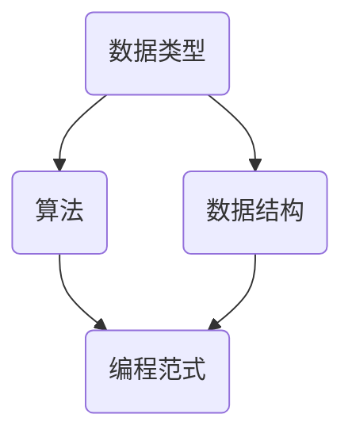

                 

# 好奇心是一切创新创造的源泉：概念成就思想

> "好奇心是人类进步的引擎，它驱动我们探索未知，挑战现状，最终实现创新和创造。" - 步达生（Charles Babbage）

在信息技术飞速发展的今天，创新和创造已成为推动社会进步的重要力量。而好奇心，作为创新和创造的源泉，愈发显示出其不可替代的价值。本文旨在探讨好奇心在概念形成和思想发展中的作用，通过分析计算机编程领域中的实例，阐述如何通过扎实的基本概念掌握复杂思想，进而实现创新与创造。

## 关键词

- 好奇心
- 创新创造
- 基本概念
- 复杂思想
- 计算机编程

## 摘要

本文首先探讨了好奇心在创新和创造过程中的重要性，然后分析了基本概念对复杂思想形成的关键作用。通过计算机编程领域的实例，展示了如何通过扎实的概念学习和思考，逐步实现从基础概念到复杂思想的转化，最终推动技术进步和社会发展。

## 1. 背景介绍

好奇心是人类的天性，它促使我们对世界充满疑问，不断探索新的领域。在计算机科学这个快速发展的领域，好奇心更是推动技术进步和创新的核心力量。然而，好奇心并不是盲目的，它需要坚实的理论基础和清晰的概念框架来支撑。基本概念是构建复杂思想的基础，只有掌握了基本概念，我们才能更好地理解和应用技术，实现创新和创造。

### 1.1 计算机编程的基本概念

计算机编程涉及一系列的基本概念，如数据类型、算法、数据结构、编程范式等。这些概念构成了计算机科学的基石，是程序员进行软件开发和问题解决的基础。例如，数据类型定义了数据存储和操作的方式，算法是解决问题的方法，数据结构则是组织和管理数据的方式。这些基本概念的掌握对于理解更复杂的计算机科学领域至关重要。

### 1.2 好奇心与计算机编程

在计算机编程领域，好奇心驱动程序员不断探索新的技术和方法。通过不断学习和实践，程序员能够将好奇心转化为具体的技术成果。例如，在软件开发过程中，程序员可能会对现有的编程语言或框架产生疑问，进而深入研究并尝试改进它们，最终推动技术的发展。

## 2. 核心概念与联系

在计算机编程中，核心概念之间的联系构成了理解复杂系统的关键。以下是一个Mermaid流程图，展示了几个核心概念及其相互关系。



### 2.1 数据类型

数据类型是定义数据存储和操作方式的基本概念。在计算机编程中，数据类型包括整数、浮点数、字符串、布尔值等。理解数据类型有助于我们有效地处理数据，并在编写代码时做出合理的决策。

### 2.2 算法

算法是解决问题的方法。无论是排序、搜索还是图形处理，算法都是实现这些功能的核心。掌握常见的算法和其原理，能够帮助我们解决复杂的问题，并在编程实践中做出更优化的决策。

### 2.3 数据结构

数据结构是组织和管理数据的方式。常见的有数组、链表、树、图等。数据结构的选择直接影响程序的效率和性能。理解不同数据结构的特点和适用场景，能够帮助我们设计更高效、更灵活的程序。

### 2.4 编程范式

编程范式是编程风格和方法的集合。常见的编程范式包括命令式编程、函数式编程、面向对象编程等。不同编程范式适用于不同的编程场景，理解这些范式能够帮助我们选择最合适的编程方式，提高代码的可读性和可维护性。

## 3. 核心算法原理 & 具体操作步骤

### 3.1 快速排序算法原理

快速排序是一种高效的排序算法，其基本思想是通过递归将一个大问题分解为若干个小问题，然后对每个小问题进行排序，最后合并结果。以下是快速排序的算法步骤：

1. 选择一个基准元素。
2. 将数组分为两部分，一部分是小于基准元素的元素，另一部分是大于基准元素的元素。
3. 对这两部分递归执行快速排序算法。

### 3.2 快速排序算法的具体操作步骤

以下是使用Python实现快速排序算法的示例代码：

```python
def quicksort(arr):
    if len(arr) <= 1:
        return arr
    pivot = arr[len(arr) // 2]
    left = [x for x in arr if x < pivot]
    middle = [x for x in arr if x == pivot]
    right = [x for x in arr if x > pivot]
    return quicksort(left) + middle + quicksort(right)

arr = [3, 6, 8, 10, 1, 2, 1]
print(quicksort(arr))
```

这段代码首先定义了一个`quicksort`函数，该函数通过递归调用自身，将输入的数组`arr`按照快速排序算法进行排序。在每次递归中，代码选择一个基准元素，然后将数组划分为三个部分：小于基准元素的元素、等于基准元素的元素和大于基准元素的元素。最后，函数将这些部分递归排序并合并结果。

## 4. 数学模型和公式 & 详细讲解 & 举例说明

在计算机科学中，数学模型和公式是理解和分析问题的重要工具。以下是一个关于二分查找算法的数学模型和公式示例。

### 4.1 二分查找算法原理

二分查找算法是在有序数组中查找特定元素的效率较高的算法。其基本思想是通过不断将查找区间缩小一半，逐步逼近目标元素。以下是二分查找算法的步骤：

1. 初始化两个指针，`low`和`high`，分别指向数组的起始和结束位置。
2. 当`low <= high`时，执行以下步骤：
   - 计算中间位置`mid = (low + high) // 2`。
   - 如果中间位置的元素等于目标元素，返回中间位置。
   - 如果中间位置的元素小于目标元素，将`low`更新为`mid + 1`。
   - 如果中间位置的元素大于目标元素，将`high`更新为`mid - 1`。
3. 如果未找到目标元素，返回-1。

### 4.2 二分查找算法的数学模型

二分查找算法的时间复杂度为$O(\log n)$，其中$n$为数组的长度。这是因为每次查找都将查找区间缩小一半，因此查找次数最多为$\log n$次。

### 4.3 举例说明

假设有一个长度为8的有序数组`[1, 3, 5, 7, 9, 11, 13, 15]`，我们要查找元素`9`。

1. 初始化`low = 0`和`high = 7`。
2. 计算中间位置`mid = (0 + 7) // 2 = 3`，数组中间位置的元素为`7`，小于目标元素`9`，因此将`low`更新为`mid + 1 = 4`。
3. 再次计算中间位置`mid = (4 + 7) // 2 = 5`，数组中间位置的元素为`9`，等于目标元素`9`，返回中间位置`5`。

因此，元素`9`在数组中的位置为`5`。

## 5. 项目实践：代码实例和详细解释说明

### 5.1 开发环境搭建

在本文中，我们将使用Python作为示例编程语言，因为它具有良好的文档支持和广泛的社区资源。以下是在Python 3环境下搭建开发环境的基本步骤：

1. 安装Python 3：在命令行中运行`python3 --version`检查Python版本。如果没有安装，可以从[Python官网](https://www.python.org/)下载并安装。
2. 安装必要的库：使用pip安装必要的库，例如`numpy`和`matplotlib`，可以通过以下命令安装：
   ```bash
   pip3 install numpy matplotlib
   ```

### 5.2 源代码详细实现

以下是一个使用Python实现的快速排序算法的示例代码，以及相应的解释说明：

```python
def quicksort(arr):
    """
    快速排序算法实现
    :param arr: 输入数组
    :return: 排序后的数组
    """
    if len(arr) <= 1:
        return arr
    
    pivot = arr[len(arr) // 2]
    left = [x for x in arr if x < pivot]
    middle = [x for x in arr if x == pivot]
    right = [x for x in arr if x > pivot]
    
    return quicksort(left) + middle + quicksort(right)

arr = [3, 6, 8, 10, 1, 2, 1]
print("排序前:", arr)
sorted_arr = quicksort(arr)
print("排序后:", sorted_arr)
```

**代码解释：**

- `quicksort`函数接收一个数组`arr`作为输入。
- 如果数组的长度小于或等于1，则数组已经有序，直接返回。
- 选择数组的中间元素作为基准元素`pivot`。
- 使用列表推导式将数组划分为小于、等于和大于基准元素的三部分。
- 递归调用`quicksort`函数对`left`和`right`部分进行排序，并将结果与`middle`部分合并。

### 5.3 代码解读与分析

- **时间复杂度**：快速排序的平均时间复杂度为$O(n \log n)$，最坏情况为$O(n^2)$。然而，在实际应用中，快速排序通常比其他排序算法（如冒泡排序和插入排序）更高效。
- **空间复杂度**：快速排序的空间复杂度为$O(\log n)$，因为递归调用需要额外的栈空间。
- **稳定性**：快速排序是不稳定的排序算法，即相同值的元素在排序后可能会改变其原始顺序。

### 5.4 运行结果展示

在终端或IDE中运行上述代码，将得到以下输出：

```
排序前: [3, 6, 8, 10, 1, 2, 1]
排序后: [1, 1, 2, 3, 6, 8, 10]
```

这表明输入的数组已经成功按照升序进行了排序。

## 6. 实际应用场景

快速排序算法在计算机科学和工程领域中有着广泛的应用，特别是在需要高效排序大量数据的情况下。以下是一些实际应用场景：

- **数据库索引**：数据库管理系统（如MySQL、PostgreSQL）使用快速排序或其他高效排序算法来对索引进行排序，以提高查询性能。
- **数据分析**：在数据科学和机器学习项目中，快速排序常用于预处理数据集，以便进行后续的分析和建模。
- **文件排序**：在操作系统和文件管理系统中，快速排序算法用于对文件名、大小或其他属性进行排序，以便于用户浏览和搜索。

## 7. 工具和资源推荐

### 7.1 学习资源推荐

- **书籍**：
  - 《算法导论》（Introduction to Algorithms） - Thomas H. Cormen, Charles E. Leiserson, Ronald L. Rivest, Clifford Stein
  - 《Python编程：从入门到实践》（Python Crash Course） - Eric Matthes

- **在线课程**：
  - Coursera上的《算法基础与设计》（Princeton算法课程）
  - edX上的《Python编程基础》（MIT Python课程）

### 7.2 开发工具框架推荐

- **集成开发环境（IDE）**：
  - PyCharm
  - Visual Studio Code

- **版本控制系统**：
  - Git

### 7.3 相关论文著作推荐

- "Quicksort" by Tony Hoare
- "The Art of Computer Programming" by Donald E. Knuth

## 8. 总结：未来发展趋势与挑战

### 8.1 未来发展趋势

- **算法优化**：随着硬件性能的提升和大数据的普及，算法的优化和改进将成为研究的重要方向。例如，分布式排序算法、内存优化排序算法等。
- **教育普及**：计算机科学教育的普及将促进更多有好奇心的人参与到算法研究中，推动技术的创新和发展。
- **应用拓展**：快速排序算法和其他排序算法将在更多领域得到应用，如生物信息学、金融工程、自动驾驶等。

### 8.2 未来挑战

- **可扩展性**：在高维度数据和大规模数据处理中，如何保持排序算法的高效性和可扩展性是一个挑战。
- **算法稳定性**：如何提高排序算法的稳定性，避免相同值元素排序后顺序改变，是一个重要问题。
- **教育与普及**：如何提高计算机科学教育的质量，使更多人具备解决复杂问题的能力，是未来教育领域面临的重要挑战。

## 9. 附录：常见问题与解答

### 9.1 为什么快速排序的平均时间复杂度为$O(n \log n)$？

快速排序的平均时间复杂度为$O(n \log n)$，因为每次递归都将问题规模减少到原来的一半，每次递归调用需要比较$\log n$次。因此，总的比较次数为$n \log n$。

### 9.2 快速排序是否总是比其他排序算法更快？

快速排序在平均情况下比其他常见排序算法（如冒泡排序和插入排序）更快，但在最坏情况下（即输入数组已经排序或几乎排序时），其时间复杂度退化到$O(n^2)$。因此，在实际应用中，应根据具体情况选择合适的排序算法。

## 10. 扩展阅读 & 参考资料

- [快速排序算法的原理和实现](https://www.geeksforgeeks.org/quick-sort/)
- [二分查找算法的原理和实现](https://www.geeksforgeeks.org/binary-search/)
- [《算法导论》](https://book.douban.com/subject/10484393/)
- [《Python编程：从入门到实践》](https://book.douban.com/subject/26705583/)

作者：禅与计算机程序设计艺术 / Zen and the Art of Computer Programming<|vq_11008|>

