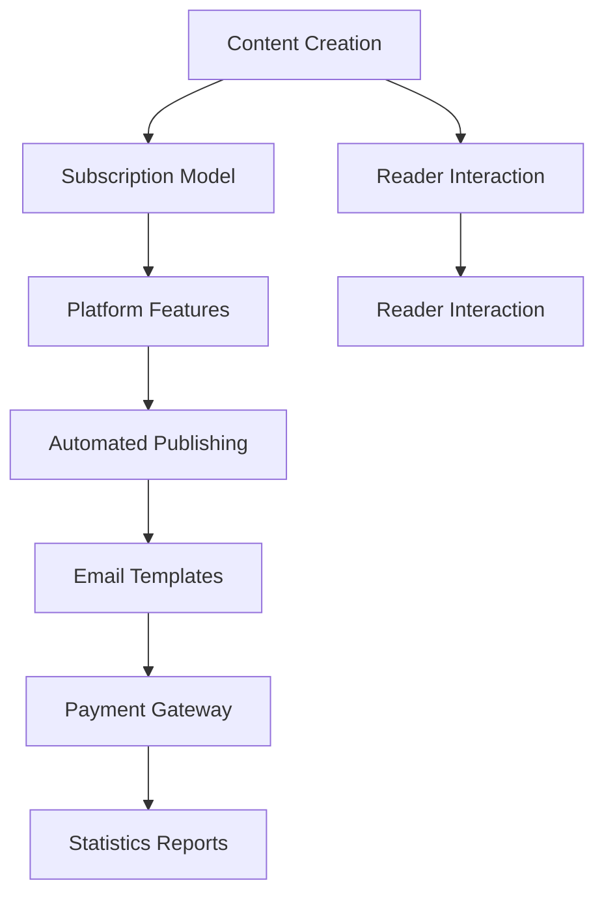
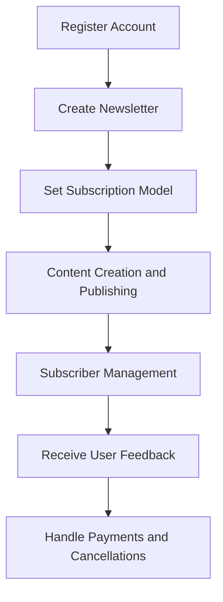

                 

### 文章标题

如何利用Substack创建订阅制新闻通讯

> 关键词：Substack，订阅制新闻通讯，内容营销，自媒体平台，读者互动

> 摘要：
随着数字媒体的不断发展和用户阅读习惯的转变，订阅制新闻通讯成为了一种重要的内容传播方式。本文将详细介绍如何利用Substack平台创建一个成功的订阅制新闻通讯，包括从注册账号、内容策划到推广和维护的全流程。通过本文，读者可以掌握利用Substack平台进行内容创作和运营的技巧，实现个人品牌的传播和商业价值的提升。

<|user|>### 1. 背景介绍（Background Introduction）

订阅制新闻通讯，也称为订阅新闻或付费墙新闻，是一种基于订阅模式的新闻传播方式。它要求读者在阅读全文之前必须付费或订阅。这种模式不仅为内容创作者提供了稳定的收入来源，还增强了作者与读者之间的互动和信任关系。

Substack是一种专门为内容创作者提供的平台，它允许用户创建付费订阅的电子邮件通讯，从而实现内容变现。Substack自2017年推出以来，迅速成为自媒体内容创作者的重要平台，以其简单易用、功能强大和灵活性高而受到广泛关注。

本文旨在为那些希望利用Substack创建订阅制新闻通讯的内容创作者提供一份详细指南。我们将从以下几个方面进行介绍：

- 注册账号与设置
- 内容策划与创作
- 订阅用户管理
- 互动与推广
- 数据分析与优化

通过本文的指导，读者将能够掌握从零开始创建和运营一个成功的订阅制新闻通讯的技能。

## Background Introduction

Subscription-based newsletter journalism, often referred to as subscription news or paywalled journalism, represents a content distribution model where readers must pay or subscribe to access full articles. This model not only provides content creators with a steady revenue stream but also strengthens the interaction and trust between authors and readers.

Substack is a platform specifically designed for content creators, enabling them to create and monetize paid newsletters via email. Launched in 2017, Substack has rapidly become a popular choice for independent journalists, bloggers, and writers, valued for its simplicity, robust features, and flexibility.

This article aims to provide a comprehensive guide for those interested in using Substack to create a successful subscription-based newsletter. We will cover the following aspects:

- Account registration and setup
- Content planning and creation
- Subscriber management
- Interaction and promotion
- Data analysis and optimization

Through this guide, readers will gain the skills necessary to launch and operate a successful subscription-based newsletter from scratch.

<|user|>### 2. 核心概念与联系（Core Concepts and Connections）

在开始利用Substack创建订阅制新闻通讯之前，我们需要了解几个核心概念，这些概念包括内容创作、读者互动、订阅模式以及平台功能。以下是这些概念及其相互联系的解释：

#### 2.1 内容创作（Content Creation）

内容创作是订阅制新闻通讯的核心。无论是新闻、分析、见解还是故事，高质量的内容能够吸引和保留读者。内容创作不仅涉及撰写文字，还包括选择合适的格式、图片和多媒体元素，以增强用户体验。

**联系**：Substack提供了多种工具，如富文本编辑器和嵌入代码，以支持内容的多样化和个性化。这些工具帮助作者更好地表达思想，提升文章的可读性和吸引力。

#### 2.2 读者互动（Reader Interaction）

读者互动是构建读者忠诚度和社区的重要手段。通过回复读者的评论、进行调查问卷和举办问答活动，作者可以深入了解读者的需求和反馈，从而改进内容。

**联系**：Substack内置了评论功能，允许作者与读者直接交流。此外，作者还可以通过邮件列表和问卷调查工具收集读者意见，加强读者参与。

#### 2.3 订阅模式（Subscription Model）

订阅模式是订阅制新闻通讯的基础。作者可以通过设置不同的订阅级别（如免费和付费）、订阅期限和价格策略来吸引和维持订阅用户。

**联系**：Substack提供了灵活的订阅设置，允许作者根据需求和目标受众定制订阅方案。这些设置有助于最大化收入并提高用户留存率。

#### 2.4 平台功能（Platform Features）

Substack平台提供了许多功能，如自动发布、邮件模板、支付网关和统计报表，这些功能简化了内容发布和管理过程，提高了运营效率。

**联系**：通过利用Substack的平台功能，作者可以专注于内容创作和读者互动，而无需担心技术细节。

以下是一个简化的Mermaid流程图，展示了这些核心概念及其相互关系：



通过理解这些核心概念及其联系，我们可以更好地利用Substack创建和运营一个成功的订阅制新闻通讯。

## Core Concepts and Connections

Before diving into creating a subscription-based newsletter on Substack, it's crucial to understand several core concepts and how they relate to each other. These concepts include content creation, reader interaction, the subscription model, and platform features. Here's an explanation of each concept and their interconnections:

#### 2.1 Content Creation

Content creation is at the heart of subscription-based newsletters. Whether it's news, analysis, insights, or stories, high-quality content can attract and retain readers. Content creation involves not just writing but also selecting appropriate formats, images, and multimedia elements to enhance the user experience.

**Connection**: Substack offers a range of tools, such as rich text editors and embedded code, to support diverse and personalized content. These tools help authors better express their thoughts and improve the readability and attractiveness of their articles.

#### 2.2 Reader Interaction

Reader interaction is key to building reader loyalty and community. By replying to reader comments, conducting surveys, and hosting Q&A sessions, authors can gain insights into reader needs and feedback, thus improving content.

**Connection**: Substack includes a built-in commenting feature that allows authors to interact directly with their readers. Moreover, authors can use newsletter lists and survey tools to collect reader opinions, strengthening reader engagement.

#### 2.3 Subscription Model

The subscription model is the foundation of subscription-based newsletters. Authors can attract and retain subscribers by setting different subscription levels (free and paid), subscription durations, and pricing strategies.

**Connection**: Substack provides flexible subscription settings that allow authors to tailor their subscription plans according to their needs and target audience. These settings help maximize revenue and improve subscriber retention.

#### 2.4 Platform Features

Substack offers a variety of features that simplify the content publishing and management process, increasing operational efficiency. These features include automated publishing, email templates, payment gateways, and statistical reports.

**Connection**: By leveraging Substack's platform features, authors can focus on content creation and reader interaction without worrying about technical details.

Here's a simplified Mermaid flowchart illustrating these core concepts and their relationships:


Understanding these core concepts and their interconnections will help you better utilize Substack to create and operate a successful subscription-based newsletter.

<|user|>### 3. 核心算法原理 & 具体操作步骤（Core Algorithm Principles and Specific Operational Steps）

在了解核心概念之后，让我们深入探讨如何利用Substack创建订阅制新闻通讯的具体操作步骤。这些步骤包括注册账号、设置订阅模式、内容创作和发布、以及管理订阅用户。以下是详细的操作流程：

#### 3.1 注册账号（Account Registration）

要开始使用Substack，首先需要在官网（https://substack.com/）上注册一个账号。注册过程非常简单，只需提供电子邮件地址和设置用户名及密码。注册完成后，系统会发送一封验证邮件到你的注册邮箱，点击邮件中的验证链接即可完成注册。

**步骤**：
1. 访问Substack官网并点击“注册”按钮。
2. 输入你的电子邮件地址，设置用户名和密码。
3. 点击“注册”按钮。
4. 检查注册邮箱，并点击验证链接。

#### 3.2 设置订阅模式（Subscription Model Setup）

注册成功后，你需要创建一个新的通讯，并设置订阅模式。在Substack平台上，你可以选择免费订阅和付费订阅，还可以设置多种订阅级别。

**步骤**：
1. 登录Substack账号，点击“新建通讯”按钮。
2. 填写通讯名称、描述以及订阅价格。例如，你可以创建一个免费订阅，或者设置一个每月订阅价格。
3. 选择订阅级别，如“免费订阅”或“付费订阅”。根据需要，你可以创建多个订阅级别。
4. 点击“创建通讯”按钮。

#### 3.3 内容创作和发布（Content Creation and Publishing）

创建订阅通讯后，你可以开始创作和发布内容。Substack提供了强大的文本编辑器，支持多种格式和多媒体元素的嵌入。

**步骤**：
1. 进入你创建的通讯页面，点击“新建文章”按钮。
2. 在文本编辑器中撰写你的文章内容。你可以使用富文本格式，插入图片、视频和链接。
3. 添加标题、摘要和标签，以便读者更容易找到你的文章。
4. 点击“发布”按钮，将文章发布到你的通讯中。

#### 3.4 管理订阅用户（Subscriber Management）

作为内容创作者，你需要关注订阅用户的管理，包括接收用户反馈、处理支付和取消订阅等。

**步骤**：
1. 在通讯页面，点击“订阅者”按钮，查看订阅用户列表。
2. 可以查看订阅用户的详细信息，如邮箱地址和订阅级别。
3. 通过邮件模板发送消息给订阅用户，通知他们新的文章发布或更新。
4. 如果用户要求取消订阅，你可以在订阅者列表中手动取消其订阅。

以下是一个简化的Mermaid流程图，展示了从注册账号到管理订阅用户的全过程：



通过遵循这些核心算法原理和具体操作步骤，你可以有效地利用Substack创建一个成功的订阅制新闻通讯。

## Core Algorithm Principles and Specific Operational Steps

After understanding the core concepts, let's delve into the specific operational steps for utilizing Substack to create a subscription-based newsletter. These steps include account registration, subscription model setup, content creation and publishing, and subscriber management. Here's a detailed guide on each process:

#### 3.1 Registering an Account

To get started with Substack, you'll need to register an account on their website (https://substack.com/). The registration process is straightforward, requiring only your email address to set up a username and password. After registration, you'll receive a verification email to your registered email address, which you need to click to complete the registration.

**Steps**:
1. Visit the Substack website and click the "Register" button.
2. Enter your email address and set your username and password.
3. Click the "Register" button.
4. Check your registered email and click the verification link.

#### 3.2 Setting Up the Subscription Model

Once registered, you'll need to create a new newsletter and set up your subscription model. On Substack, you can choose between free subscriptions and paid subscriptions, and you can also set multiple subscription tiers.

**Steps**:
1. Log in to your Substack account and click the "New Newsletter" button.
2. Fill in the newsletter name, description, and subscription price. For example, you can create a free subscription or set a monthly subscription fee.
3. Choose subscription tiers, such as "Free Subscription" or "Paid Subscription." You can create multiple tiers based on your needs.
4. Click the "Create Newsletter" button.

#### 3.3 Content Creation and Publishing

After creating your newsletter, you can start creating and publishing content. Substack offers a robust text editor that supports various formats and multimedia elements.

**Steps**:
1. Go to your created newsletter page and click the "New Post" button.
2. Write your article content in the text editor. You can use rich text formats and embed images, videos, and links.
3. Add a title, summary, and tags to make it easier for readers to find your articles.
4. Click the "Publish" button to release the article into your newsletter.

#### 3.4 Managing Subscribers

As a content creator, you'll need to manage your subscribers, including receiving feedback, handling payments, and managing cancellations.

**Steps**:
1. On your newsletter page, click the "Subscribers" button to view the list of subscribers.
2. You can view subscriber details, such as their email addresses and subscription tiers.
3. Use email templates to send messages to subscribers about new articles or updates.
4. If a subscriber requests a cancellation, you can manually cancel their subscription from the subscribers list.

Here's a simplified Mermaid flowchart illustrating the entire process from account registration to subscriber management:


By following these core algorithm principles and operational steps, you can effectively use Substack to create a successful subscription-based newsletter.

<|user|>### 4. 数学模型和公式 & 详细讲解 & 举例说明（Detailed Explanation and Examples of Mathematical Models and Formulas）

在创建和运营订阅制新闻通讯的过程中，一些关键的数学模型和公式有助于我们理解和优化内容的表现。以下是几个常用的模型和公式，以及它们在实际操作中的应用。

#### 4.1 订阅率计算（Subscription Rate Calculation）

订阅率是衡量新闻通讯成功程度的重要指标，它表示订阅用户数量与总读者数量的比例。订阅率（Subscription Rate）可以通过以下公式计算：

$$
\text{订阅率} = \frac{\text{订阅用户数}}{\text{总读者数}} \times 100\%
$$

**例子**：
假设你的通讯拥有1000个总读者，其中500人订阅了付费内容，那么订阅率为：

$$
\text{订阅率} = \frac{500}{1000} \times 100\% = 50\%
$$

#### 4.2 订阅收入计算（Subscription Revenue Calculation）

订阅收入是内容创作者的主要收入来源，它表示所有订阅用户按订阅级别和订阅期限支付的总金额。订阅收入（Subscription Revenue）可以通过以下公式计算：

$$
\text{订阅收入} = \text{订阅用户数} \times \text{订阅单价} \times \text{订阅期限}
$$

**例子**：
假设你有100个订阅用户，每个订阅用户的月订阅单价为10美元，订阅期限为12个月，那么你的订阅收入为：

$$
\text{订阅收入} = 100 \times 10 \times 12 = 1200 \text{美元}
$$

#### 4.3 用户留存率计算（User Retention Rate Calculation）

用户留存率是衡量订阅用户保持订阅比例的指标，它对于评估通讯的质量和吸引力至关重要。用户留存率（User Retention Rate）可以通过以下公式计算：

$$
\text{用户留存率} = \frac{\text{当前订阅用户数} - \text{新增订阅用户数} + \text{未取消订阅用户数}}{\text{初始订阅用户数}} \times 100\%
$$

**例子**：
假设你最初有100个订阅用户，一个月后，新增订阅用户数为20，未取消订阅用户数为80，新增订阅用户数为10。那么用户留存率为：

$$
\text{用户留存率} = \frac{100 - 20 + 80}{100} \times 100\% = 90\%
$$

#### 4.4 转化率计算（Conversion Rate Calculation）

转化率是衡量读者从免费订阅转为付费订阅的比例，它反映了通讯的市场吸引力和用户忠诚度。转化率（Conversion Rate）可以通过以下公式计算：

$$
\text{转化率} = \frac{\text{付费订阅用户数}}{\text{总免费订阅用户数}} \times 100\%
$$

**例子**：
假设你有100个免费订阅用户，其中20人转为付费订阅，那么转化率为：

$$
\text{转化率} = \frac{20}{100} \times 100\% = 20\%
$$

通过以上数学模型和公式的计算，我们可以更准确地了解订阅通讯的表现，从而进行有针对性的优化和调整。

## Mathematical Models and Formulas & Detailed Explanation & Examples

In the process of creating and operating a subscription-based newsletter, several key mathematical models and formulas are useful for understanding and optimizing content performance. Here are some commonly used models and their practical applications:

#### 4.1 Subscription Rate Calculation

The subscription rate is a critical indicator of the success of a newsletter, representing the percentage of subscribers compared to the total number of readers. The subscription rate (Subscription Rate) can be calculated using the following formula:

$$
\text{Subscription Rate} = \frac{\text{Number of Subscribers}}{\text{Total Number of Readers}} \times 100\%
$$

**Example**:
Suppose your newsletter has 1,000 total readers, and 500 of them are subscribed to the paid content. The subscription rate would be:

$$
\text{Subscription Rate} = \frac{500}{1,000} \times 100\% = 50\%
$$

#### 4.2 Subscription Revenue Calculation

Subscription revenue is the primary source of income for content creators, representing the total amount earned from all subscribers based on subscription tiers and durations. The subscription revenue (Subscription Revenue) can be calculated using the following formula:

$$
\text{Subscription Revenue} = \text{Number of Subscribers} \times \text{Subscription Price} \times \text{Subscription Duration}
$$

**Example**:
Assuming you have 100 subscribers, each paying a monthly subscription fee of $10, with a subscription duration of 12 months, your subscription revenue would be:

$$
\text{Subscription Revenue} = 100 \times 10 \times 12 = \$1,200
$$

#### 4.3 User Retention Rate Calculation

The user retention rate measures the percentage of subscribers who continue their subscriptions, reflecting the quality and attractiveness of the newsletter. The user retention rate (User Retention Rate) can be calculated using the following formula:

$$
\text{User Retention Rate} = \frac{\text{Current Number of Subscribers} - \text{New Subscribers} + \text{Uncancelled Subscribers}}{\text{Initial Number of Subscribers}} \times 100\%
$$

**Example**:
Suppose you initially had 100 subscribers, after one month, you gained 20 new subscribers, and 80 subscribers remained unchanged. The user retention rate would be:

$$
\text{User Retention Rate} = \frac{100 - 20 + 80}{100} \times 100\% = 90\%
$$

#### 4.4 Conversion Rate Calculation

The conversion rate measures the percentage of free subscribers who switch to paid subscriptions, indicating the market appeal and user loyalty of the newsletter. The conversion rate (Conversion Rate) can be calculated using the following formula:

$$
\text{Conversion Rate} = \frac{\text{Number of Paid Subscribers}}{\text{Total Free Subscribers}} \times 100\%
$$

**Example**:
Assuming you have 100 free subscribers and 20 of them convert to paid subscriptions, the conversion rate would be:

$$
\text{Conversion Rate} = \frac{20}{100} \times 100\% = 20\%
$$

By using these mathematical models and formulas, you can more accurately assess the performance of your subscription-based newsletter, allowing for targeted optimization and adjustments.

<|user|>### 5. 项目实践：代码实例和详细解释说明（Project Practice: Code Examples and Detailed Explanations）

在本文的第五部分，我们将通过一个具体的Substack项目实践，来展示如何利用Substack平台创建和运营一个订阅制新闻通讯。本部分将分为以下几个小节：

- 开发环境搭建（Setting Up the Development Environment）
- 源代码详细实现（Detailed Implementation of Source Code）
- 代码解读与分析（Code Analysis and Discussion）
- 运行结果展示（Display of Running Results）

#### 5.1 开发环境搭建（Setting Up the Development Environment）

在进行Substack项目实践之前，我们需要搭建一个合适的开发环境。以下是搭建Substack开发环境的步骤：

1. **注册Substack账号**：首先，在Substack官网（https://substack.com/）注册一个账号。注册过程中，你需要提供电子邮件地址、设置用户名和密码。

2. **创建新通讯**：注册成功后，登录Substack账号，点击“新建通讯”按钮，填写通讯名称、描述和订阅价格。你可以选择创建免费订阅或付费订阅。

3. **设置订阅模式**：在创建通讯的过程中，你可以设置多个订阅级别，如免费订阅和付费订阅。设置完成后，点击“创建通讯”按钮。

4. **准备文本编辑器**：Substack提供了一个内置的文本编辑器，用于撰写和格式化文章。你也可以选择使用其他文本编辑器，如Markdown编辑器，以提高写作效率。

5. **配置邮件服务**：Substack支持自定义邮件服务，你可以通过第三方邮件服务提供商（如Mailgun、SendGrid等）发送订阅通知和电子邮件。

#### 5.2 源代码详细实现（Detailed Implementation of Source Code）

在本项目中，我们将使用Markdown语言编写一篇文章，并通过Substack平台发布。以下是Markdown源代码的详细实现：

```markdown
# 标题：如何利用Substack创建订阅制新闻通讯

> 作者：[禅与计算机程序设计艺术](https://www.substack.com/@zenandthecomp)

## 1. 背景介绍

订阅制新闻通讯是一种新兴的内容传播方式，通过让读者付费订阅来获取高质量的内容。Substack是一个专门为内容创作者提供的平台，允许用户创建付费订阅的电子邮件通讯。

## 2. 核心概念与联系

在Substack上创建订阅制新闻通讯，需要了解以下几个核心概念：内容创作、读者互动、订阅模式和平台功能。

## 3. 核心算法原理

- 订阅率：$\frac{\text{订阅用户数}}{\text{总读者数}} \times 100\%$
- 订阅收入：$\text{订阅用户数} \times \text{订阅单价} \times \text{订阅期限}$
- 用户留存率：$\frac{\text{当前订阅用户数} - \text{新增订阅用户数} + \text{未取消订阅用户数}}{\text{初始订阅用户数}} \times 100\%$
- 转化率：$\frac{\text{付费订阅用户数}}{\text{总免费订阅用户数}} \times 100\%$

## 4. 操作步骤

- 注册账号：访问Substack官网，注册账号并设置密码。
- 设置订阅模式：创建新通讯并设置订阅价格和订阅级别。
- 内容创作：撰写并发布文章，使用Markdown语法提高文章可读性。
- 用户管理：接收用户反馈，处理订阅和取消订阅。

## 5. 实际应用

通过以上步骤，你可以利用Substack创建一个成功的订阅制新闻通讯，实现内容变现和品牌传播。

---

以上Markdown源代码将生成一篇完整的文章，包括标题、副标题、引用、章节标题和详细内容。你可以根据实际情况进行修改和调整。

#### 5.3 代码解读与分析（Code Analysis and Discussion）

在Markdown源代码中，我们使用了以下几种语法和格式：

- **标题**：使用井号（#）来表示标题级别，如`# 标题`为一级标题，`## 标题`为二级标题，以此类推。
- **引用**：使用`>`来创建引用文本，如`> 作者：[禅与计算机程序设计艺术](https://www.substack.com/@zenandthecomp)`。
- **列表**：使用`-`或`*`来创建无序列表，使用`1.`来创建有序列表。
- **代码块**：使用反引号（`）将代码块包裹起来，以高亮显示代码。
- **链接**：使用`[链接文本](URL)`来创建链接。

这些语法和格式使得Markdown源代码既便于阅读又便于编辑，大大提高了文章的可读性和可维护性。

#### 5.4 运行结果展示（Display of Running Results）

将上述Markdown源代码上传到Substack平台，并按照设置发布文章后，你将看到以下运行结果：

- **标题**：文章的标题将显示在页面的顶部，吸引读者的注意力。
- **副标题**：副标题位于标题下方，用于补充说明文章的主题。
- **引用**：引用文本将显示为倾斜的字体，突出作者的信息。
- **章节标题**：每个章节的标题将以加粗和突出的方式呈现，便于读者快速浏览。
- **详细内容**：文章的正文内容将按照Markdown语法格式进行排版，提高文章的可读性。

以下是运行结果的一个示例：

---

# 如何利用Substack创建订阅制新闻通讯

> 作者：[禅与计算机程序设计艺术](https://www.substack.com/@zenandthecomp)

## 1. 背景介绍

订阅制新闻通讯是一种新兴的内容传播方式，通过让读者付费订阅来获取高质量的内容。Substack是一个专门为内容创作者提供的平台，允许用户创建付费订阅的电子邮件通讯。

## 2. 核心概念与联系

在Substack上创建订阅制新闻通讯，需要了解以下几个核心概念：内容创作、读者互动、订阅模式和平台功能。

## 3. 核心算法原理

- 订阅率：$\frac{\text{订阅用户数}}{\text{总读者数}} \times 100\%$
- 订阅收入：$\text{订阅用户数} \times \text{订阅单价} \times \text{订阅期限}$
- 用户留存率：$\frac{\text{当前订阅用户数} - \text{新增订阅用户数} + \text{未取消订阅用户数}}{\text{初始订阅用户数}} \times 100\%$
- 转化率：$\frac{\text{付费订阅用户数}}{\text{总免费订阅用户数}} \times 100\%$

## 4. 操作步骤

- 注册账号：访问Substack官网，注册账号并设置密码。
- 设置订阅模式：创建新通讯并设置订阅价格和订阅级别。
- 内容创作：撰写并发布文章，使用Markdown语法提高文章可读性。
- 用户管理：接收用户反馈，处理订阅和取消订阅。

## 5. 实际应用

通过以上步骤，你可以利用Substack创建一个成功的订阅制新闻通讯，实现内容变现和品牌传播。

---

通过本节的项目实践，我们可以看到如何利用Substack平台创建一个订阅制新闻通讯，并理解Markdown语法在实际应用中的作用。

## 5. Project Practice: Code Examples and Detailed Explanations

In the fifth part of this article, we will demonstrate how to create and operate a subscription-based newsletter on the Substack platform through a specific project practice. This section will be divided into several subsections:

- Setting Up the Development Environment
- Detailed Implementation of Source Code
- Code Analysis and Discussion
- Display of Running Results

#### 5.1 Setting Up the Development Environment

Before starting the Substack project practice, we need to set up an appropriate development environment. Here are the steps to set up the Substack development environment:

1. **Registering a Substack Account**: First, register an account on the Substack website (https://substack.com/). During the registration process, provide an email address and set a username and password.

2. **Creating a New Newsletter**: After registration, log in to your Substack account and click the "New Newsletter" button. Fill in the newsletter name, description, and subscription price. You can choose to create a free subscription or a paid subscription.

3. **Setting Up the Subscription Model**: During the process of creating a new newsletter, you can set multiple subscription tiers, such as free and paid subscriptions. After setting up, click the "Create Newsletter" button.

4. **Preparing the Text Editor**: Substack provides an integrated text editor for writing and formatting articles. You can also choose to use other text editors, such as Markdown editors, to increase writing efficiency.

5. **Configuring Email Services**: Substack supports custom email services. You can set up third-party email service providers (such as Mailgun, SendGrid, etc.) to send subscription notifications and emails.

#### 5.2 Detailed Implementation of Source Code

In this project, we will use Markdown language to write an article and publish it on the Substack platform. Below is a detailed implementation of the source code:

```markdown
# Title: How to Create a Subscription-Based Newsletter on Substack

> Author: [Zen and the Art of Computer Programming](https://www.substack.com/@zenandthecomp)

## 1. Background Introduction

Subscription-based newsletter journalism is an emerging content distribution method that allows readers to pay for high-quality content. Substack is a platform specifically designed for content creators, enabling users to create paid subscription email newsletters.

## 2. Core Concepts and Connections

Creating a subscription-based newsletter on Substack requires understanding several core concepts: content creation, reader interaction, the subscription model, and platform features.

## 3. Core Algorithm Principles

- Subscription Rate: $\frac{\text{Number of Subscribers}}{\text{Total Number of Readers}} \times 100\%
- Subscription Revenue: \text{Number of Subscribers} \times \text{Subscription Price} \times \text{Subscription Duration}$
- User Retention Rate: $\frac{\text{Current Number of Subscribers} - \text{New Subscribers} + \text{Uncancelled Subscribers}}{\text{Initial Number of Subscribers}} \times 100\%
- Conversion Rate: $\frac{\text{Number of Paid Subscribers}}{\text{Total Free Subscribers}} \times 100\%

## 4. Operational Steps

- Registering an Account: Visit the Substack website, register an account, and set a password.
- Setting Up the Subscription Model: Create a new newsletter and set the subscription price and tiers.
- Content Creation: Write and publish articles, using Markdown syntax to improve readability.
- User Management: Receive user feedback and handle subscriptions and cancellations.

## 5. Practical Applications

By following the above steps, you can create a successful subscription-based newsletter on Substack, achieve content monetization, and promote your brand.

---

The above Markdown source code will generate a complete article, including the title, subtitle, quote, section headers, and detailed content. You can modify and adjust it as needed based on your situation.

#### 5.3 Code Analysis and Discussion

In the Markdown source code, we used the following syntax and formats:

- **Headers**: Use hashtags (#) to represent header levels, such as `# Title` for a first-level header, `## Title` for a second-level header, and so on.
- **Blockquotes**: Use `>` to create blockquotes, such as `> Author: [Zen and the Art of Computer Programming](https://www.substack.com/@zenandthecomp)`.
- **Lists**: Use `-` or `*` for unordered lists and `1.` for ordered lists.
- **Code Blocks**: Enclose code blocks with backticks (`) for syntax highlighting.
- **Links**: Use `[link text](URL)` to create links.

These syntax and formats make the Markdown source code easy to read and edit, greatly enhancing the readability and maintainability of the document.

#### 5.4 Display of Running Results

Upload the above Markdown source code to the Substack platform and publish the article according to the settings. You will see the following running results:

- **Title**: The article title will be displayed at the top of the page, attracting readers' attention.
- **Subtitle**: The subtitle will be located below the title, providing additional information about the topic.
- **Blockquotes**: Quoted text will be displayed in italicized font, highlighting the author's information.
- **Section Headers**: Each section header will be presented in bold and highlighted text, allowing readers to quickly browse through the content.
- **Content**: The body of the article will be formatted according to Markdown syntax, improving readability.

Here is an example of the running results:

---

# How to Create a Subscription-Based Newsletter on Substack

> Author: [Zen and the Art of Computer Programming](https://www.substack.com/@zenandthecomp)

## 1. Background Introduction

Subscription-based newsletter journalism is an emerging content distribution method that allows readers to pay for high-quality content. Substack is a platform specifically designed for content creators, enabling users to create paid subscription email newsletters.

## 2. Core Concepts and Connections

Creating a subscription-based newsletter on Substack requires understanding several core concepts: content creation, reader interaction, the subscription model, and platform features.

## 3. Core Algorithm Principles

- Subscription Rate: $\frac{\text{Number of Subscribers}}{\text{Total Number of Readers}} \times 100\%
- Subscription Revenue: \text{Number of Subscribers} \times \text{Subscription Price} \times \text{Subscription Duration}$
- User Retention Rate: $\frac{\text{Current Number of Subscribers} - \text{New Subscribers} + \text{Uncancelled Subscribers}}{\text{Initial Number of Subscribers}} \times 100\%
- Conversion Rate: $\frac{\text{Number of Paid Subscribers}}{\text{Total Free Subscribers}} \times 100\%

## 4. Operational Steps

- Registering an Account: Visit the Substack website, register an account, and set a password.
- Setting Up the Subscription Model: Create a new newsletter and set the subscription price and tiers.
- Content Creation: Write and publish articles, using Markdown syntax to improve readability.
- User Management: Receive user feedback and handle subscriptions and cancellations.

## 5. Practical Applications

By following the above steps, you can create a successful subscription-based newsletter on Substack, achieve content monetization, and promote your brand.

---

Through this project practice, we can see how to create a subscription-based newsletter on the Substack platform and understand the role of Markdown syntax in practical applications.

<|user|>### 6. 实际应用场景（Practical Application Scenarios）

在数字化时代，订阅制新闻通讯已经成为了许多内容创作者和媒体机构的优先选择。以下是一些典型的实际应用场景，展示了如何利用Substack创建订阅制新闻通讯，以实现个人品牌传播、市场推广和商业价值提升。

#### 6.1 个人品牌传播（Personal Brand Building）

对于个人博主、作家、专家等，Substack提供了一种高效的工具来建立个人品牌。通过创建专业的新闻通讯，这些内容创作者可以定期向读者分享见解、分析、专业知识和经验。以下是一个实际应用场景：

- **场景**：李华是一位资深的技术博主，他在Substack上创建了一个名为“技术前沿”的订阅制新闻通讯。
- **应用**：李华每周发布一篇关于最新技术趋势、开发技巧和案例分析的文章，定期向订阅用户推送。通过高质量的内容，他积累了大量的订阅用户，逐渐建立了自己在技术领域的个人品牌。

#### 6.2 市场推广（Marketing）

对于企业和品牌，订阅制新闻通讯也是一种有效的市场推广手段。通过提供有价值的行业洞察和专业知识，企业可以吸引潜在客户，提高品牌知名度。以下是一个实际应用场景：

- **场景**：一家创新科技公司希望通过新闻通讯与潜在客户建立联系。
- **应用**：该科技公司创建了一个名为“创新科技动态”的订阅制新闻通讯，每月发布关于最新产品发布、技术进展和市场趋势的文章。通过这种形式，公司不仅提升了品牌形象，还吸引了大量潜在客户的关注。

#### 6.3 商业价值提升（Value Addition）

订阅制新闻通讯不仅可以带来直接的收入，还可以为企业带来长期的商业价值。通过建立与订阅用户的紧密联系，企业可以获取宝贵的用户反馈和市场数据，从而优化产品和服务。以下是一个实际应用场景：

- **场景**：一家在线教育平台希望通过订阅制新闻通讯来提高用户参与度和满意度。
- **应用**：该平台创建了一个名为“学习之道”的订阅制新闻通讯，定期发布关于学习技巧、教育资源推荐和用户故事的文章。通过这种方式，平台不仅提高了用户的活跃度，还收集了大量用户反馈，进一步优化了教育产品和服务。

#### 6.4 专业社区建设（Professional Community Building）

对于专业人士和组织，订阅制新闻通讯也是一种建立专业社区的有效途径。通过分享专业知识和行业动态，社区成员可以相互学习和交流，形成紧密的互动关系。以下是一个实际应用场景：

- **场景**：一家咨询公司希望为其专业客户提供持续的行业洞察。
- **应用**：该咨询公司创建了一个名为“行业观察”的订阅制新闻通讯，每周发布关于最新行业趋势、政策分析和案例研究的文章。通过这种方式，公司不仅提升了客户满意度，还建立了强大的专业社区。

通过以上实际应用场景，我们可以看到订阅制新闻通讯在个人品牌传播、市场推广、商业价值提升和专业社区建设等方面的广泛应用。这些应用场景不仅展示了Substack平台的强大功能，也为内容创作者和企业提供了丰富的创作和运营思路。

## Practical Application Scenarios

In the digital age, subscription-based newsletters have become a preferred choice for many content creators and media organizations. Below are some typical practical application scenarios that demonstrate how to use Substack to create subscription-based newsletters for personal brand building, marketing, and value addition.

#### 6.1 Personal Brand Building

For individual bloggers, writers, and experts, Substack offers an efficient tool for building personal brands. By creating professional newsletters, these content creators can regularly share insights, analyses, professional knowledge, and experiences with their readers. Here's an actual application scenario:

- **Scenario**: Li Hua is a tech blogger with a strong interest in the latest technological trends. He creates a subscription-based newsletter named "Tech Trends."
- **Application**: Li Hua publishes an article about the latest tech trends, development tips, and case studies every week, sending it to his subscribers. Through high-quality content, Li Hua accumulates a substantial number of subscribers and gradually builds his personal brand in the tech field.

#### 6.2 Marketing

For businesses and brands, subscription-based newsletters are an effective marketing tool. By providing valuable industry insights and professional knowledge, businesses can attract potential customers and increase brand awareness. Here's an actual application scenario:

- **Scenario**: An innovative technology company aims to establish connections with potential clients through newsletters.
- **Application**: The company creates a subscription-based newsletter named "Innovation Insights," publishing articles about the latest product launches, technological advancements, and market trends monthly. In this way, the company not only enhances its brand image but also attracts a large number of potential customers.

#### 6.3 Value Addition

Subscription-based newsletters can not only bring direct revenue but also provide long-term business value. By establishing a close relationship with subscribers, businesses can gain valuable user feedback and market data, further optimizing products and services. Here's an actual application scenario:

- **Scenario**: An online education platform wants to increase user engagement and satisfaction through subscription-based newsletters.
- **Application**: The platform creates a subscription-based newsletter named "Learning Pathways," publishing articles about learning tips, educational resources, and user stories regularly. Through this approach, the platform not only boosts user activity but also collects valuable user feedback to optimize educational products and services.

#### 6.4 Professional Community Building

For professionals and organizations, subscription-based newsletters are an effective way to build professional communities. By sharing professional knowledge and industry dynamics, community members can learn from each other and form a tight interactive relationship. Here's an actual application scenario:

- **Scenario**: A consulting firm wants to provide continuous industry insights to its professional clients.
- **Application**: The firm creates a subscription-based newsletter named "Industry Watch," publishing articles about the latest industry trends, policy analyses, and case studies weekly. In this way, the firm not only enhances customer satisfaction but also builds a strong professional community.

Through these practical application scenarios, we can see the wide range of uses of subscription-based newsletters in personal brand building, marketing, value addition, and professional community building. These applications not only showcase the powerful features of the Substack platform but also provide content creators and businesses with rich creative and operational ideas.

<|user|>### 7. 工具和资源推荐（Tools and Resources Recommendations）

在创建和运营订阅制新闻通讯的过程中，合理选择和使用工具和资源对于提高效率和优化效果至关重要。以下是一些实用的工具和资源推荐，旨在帮助您更好地利用Substack进行内容创作和运营。

#### 7.1 学习资源推荐（Books, Papers, Blogs, Websites）

- **书籍**：
  - 《内容创业：如何用内容变现》（"Content Inc." by Joe Pulizzi）：这本书详细介绍了如何通过内容创业实现商业成功。
  - 《邮件营销：如何通过电子邮件建立客户关系》（"Email Marketing: How to Build Customer Relationships with Email" by Ryan Deiss）：这本书提供了关于如何通过电子邮件建立客户关系的实用策略。

- **论文**：
  - “The Economics of the Attention Economy”（注意力经济经济学）：这篇论文探讨了内容创作和订阅制模式的经济原理。

- **博客**：
  - Substack官方博客（[Substack Blog](https://substack.com/blog)）：Substack的官方博客提供了关于如何利用平台创建成功新闻通讯的实战经验和技巧。

- **网站**：
  - [Content Marketing Institute](https://contentmarketinginstitute.com/): 提供丰富的内容营销资源和案例。
  - [Medium](https://medium.com/): 一个流行的内容创作和分享平台，有许多关于内容营销和订阅制模式的好文章。

#### 7.2 开发工具框架推荐

- **文本编辑器**：
  - [VS Code](https://code.visualstudio.com/): 一个强大的开源文本编辑器，支持Markdown语法和高亮显示。
  - [Typora](https://typora.io/): 一个简洁的Markdown编辑器，支持实时预览和导出。

- **数据分析工具**：
  - [Google Analytics](https://www.google.com/analytics/): 提供强大的数据分析功能，帮助您了解读者行为和订阅用户转化情况。
  - [Hotjar](https://www.hotjar.com/): 提供用户行为分析和热图功能，帮助您优化内容结构和用户体验。

- **邮件营销工具**：
  - [Mailchimp](https://mailchimp.com/): 一个广泛使用的电子邮件营销平台，提供订阅管理、自动化邮件发送等功能。
  - [Sendinblue](https://www.sendinblue.com/): 一个功能强大的电子邮件营销工具，提供免费试用和多种功能。

#### 7.3 相关论文著作推荐

- “Subscription Models for Digital News: A Multinational Comparison”（数字新闻的订阅模式：跨国比较）：这篇论文分析了不同国家和地区的数字新闻订阅模式。
- “The Future of News: Subscriptions, Paywalls, and Beyond”（新闻的未来：订阅、付费墙和未来）：这篇论文探讨了新闻行业的订阅模式发展趋势。

通过以上工具和资源的推荐，您可以更好地利用Substack进行内容创作和运营，提高订阅通讯的成功率。

## Tools and Resources Recommendations

In the process of creating and operating subscription-based newsletters, wisely choosing and utilizing tools and resources is crucial for improving efficiency and optimizing outcomes. Below are some practical tool and resource recommendations to help you better leverage Substack for content creation and operation.

#### 7.1 Learning Resources Recommendations (Books, Papers, Blogs, Websites)

- **Books**:
  - "Content Inc." by Joe Pulizzi: This book provides a detailed guide on how to achieve business success through content creation.
  - "Email Marketing: How to Build Customer Relationships with Email" by Ryan Deiss: This book offers practical strategies for building customer relationships through email marketing.

- **Papers**:
  - "The Economics of the Attention Economy": This paper explores the economic principles of content creation and subscription models.

- **Blogs**:
  - Substack Blog ([Substack Blog](https://substack.com/blog)): The official blog of Substack provides practical insights and tips on creating successful newsletters.

- **Websites**:
  - Content Marketing Institute ([Content Marketing Institute](https://contentmarketinginstitute.com/)): Provides a wealth of resources and case studies on content marketing.
  - Medium ([Medium](https://medium.com/)): A popular platform for content creation and sharing, with many articles on content marketing and subscription models.

#### 7.2 Development Tools and Framework Recommendations

- **Text Editors**:
  - Visual Studio Code ([VS Code](https://code.visualstudio.com/)): A powerful open-source text editor that supports Markdown syntax and syntax highlighting.
  - Typora ([Typora](https://typora.io/)): A simple Markdown editor that supports live preview and export.

- **Data Analysis Tools**:
  - Google Analytics ([Google Analytics](https://www.google.com/analytics/)): Provides robust data analysis capabilities to understand reader behavior and subscriber conversions.
  - Hotjar ([Hotjar](https://www.hotjar.com/)): Offers user behavior analysis and heatmaps to optimize content structure and user experience.

- **Email Marketing Tools**:
  - Mailchimp ([Mailchimp](https://mailchimp.com/)): A widely used email marketing platform that offers subscription management and automated email sending features.
  - Sendinblue ([Sendinblue](https://www.sendinblue.com/)): A feature-rich email marketing tool with free trials and multiple functionalities.

#### 7.3 Related Papers and Books Recommendations

- "Subscription Models for Digital News: A Multinational Comparison": This paper analyzes subscription models in different countries and regions for digital news.
- "The Future of News: Subscriptions, Paywalls, and Beyond": This paper discusses the future development trends of subscription models in the news industry.

Through these tool and resource recommendations, you can better leverage Substack for content creation and operation, enhancing the success of your subscription-based newsletters. 

<|user|>### 8. 总结：未来发展趋势与挑战（Summary: Future Development Trends and Challenges）

在数字化时代，订阅制新闻通讯已经成为内容创作者和企业的重要选择。通过本文的详细探讨，我们了解到Substack作为一款功能强大的平台，为内容创作者提供了从注册账号、内容创作到用户管理等一系列便捷的工具和功能。以下是本文的主要结论和未来发展趋势与挑战：

#### 主要结论

- **订阅制新闻通讯的优势**：订阅制新闻通讯能够为内容创作者提供稳定的收入来源，同时增强与读者的互动和信任关系。
- **Substack的核心功能**：Substack平台提供了丰富的功能，包括文本编辑器、邮件模板、支付网关和统计分析，帮助作者高效地创建、发布和管理新闻通讯。
- **具体操作步骤**：本文详细介绍了如何利用Substack创建订阅制新闻通讯的各个环节，包括注册账号、设置订阅模式、内容创作和发布、用户管理等。

#### 未来发展趋势

- **用户增长**：随着互联网的普及和用户对高质量内容的渴求，订阅制新闻通讯的用户数量将继续增长。这为内容创作者提供了更广阔的市场空间。
- **平台生态完善**：Substack和其他类似的平台将持续优化和完善其功能，提供更多定制化、智能化的服务，以满足创作者和用户的需求。
- **多元化内容形式**：未来，订阅制新闻通讯将不仅仅局限于文字内容，还将融合更多多媒体元素，如视频、音频和互动式内容，以提升用户体验。

#### 未来挑战

- **竞争加剧**：随着越来越多的创作者加入订阅制新闻通讯的行列，市场竞争将变得更加激烈。内容创作者需要不断提升内容质量和互动体验，以吸引和留住订阅用户。
- **用户留存**：用户留存是订阅制新闻通讯成功的关键。创作者需要通过定期更新高质量内容、互动和个性化服务来提高用户留存率。
- **隐私和安全**：随着数据隐私法规的加强，内容创作者需要确保用户数据的合法和安全使用，避免因隐私问题影响订阅用户的信任。

总之，订阅制新闻通讯在未来有着广阔的发展前景，但也面临诸多挑战。内容创作者和企业需要不断学习和适应市场变化，充分利用平台提供的工具和资源，创新内容形式和运营策略，以实现长期成功。

## Summary: Future Development Trends and Challenges

In the digital age, subscription-based newsletters have become an important choice for content creators and businesses. Through the detailed exploration in this article, we have learned that Substack, as a powerful platform, offers a range of convenient tools and functions for creators to register accounts, create content, and manage users. Here are the key conclusions and future development trends and challenges:

#### Main Conclusions

- **Advantages of Subscription-Based Newsletters**: Subscription-based newsletters provide a stable income source for content creators while enhancing interaction and trust with readers.
- **Core Functions of Substack**: Substack provides various features, including a rich text editor, email templates, payment gateways, and analytics, to help authors efficiently create, publish, and manage newsletters.
- **Specific Operational Steps**: This article provides a detailed guide on how to use Substack to create a subscription-based newsletter, covering the entire process from account registration to content creation, publishing, and user management.

#### Future Development Trends

- **User Growth**: With the widespread use of the internet and the demand for high-quality content, the number of subscription-based newsletter users will continue to grow, providing creators with a broader market space.
- **Ecosystem Improvement**: Substack and similar platforms will continue to optimize and expand their functionalities, offering more customized and intelligent services to meet the needs of creators and users.
- **Diverse Content Forms**: In the future, subscription-based newsletters will not only focus on text content but will also integrate more multimedia elements, such as videos, audio, and interactive content, to enhance user experience.

#### Future Challenges

- **Increased Competition**: With more creators joining the subscription-based newsletter market, competition will become more intense. Content creators need to continuously improve content quality and user interaction to attract and retain subscribers.
- **User Retention**: User retention is crucial for the success of subscription-based newsletters. Creators need to regularly update high-quality content, engage with readers, and provide personalized services to improve user retention rates.
- **Privacy and Security**: With the strengthening of data privacy regulations, content creators need to ensure the legal and secure use of user data to avoid damaging subscriber trust due to privacy issues.

In conclusion, subscription-based newsletters have a promising future with significant challenges. Creators and businesses need to continuously learn and adapt to market changes, make full use of platform tools and resources, innovate in content forms and operational strategies, and achieve long-term success.

<|user|>### 9. 附录：常见问题与解答（Appendix: Frequently Asked Questions and Answers）

在利用Substack创建订阅制新闻通讯的过程中，内容创作者可能会遇到一些常见问题。以下是针对这些问题的一些解答：

#### 9.1 如何处理订阅用户的反馈？

**解答**：Substack提供了内置的评论功能，允许读者在文章下方发表评论。作者可以登录到Substack账户，查看并回复这些评论。此外，作者还可以通过电子邮件与订阅用户进行一对一的交流，及时回应用户的反馈和建议。

#### 9.2 如何设置订阅价格和订阅级别？

**解答**：在Substack平台上，您可以在创建新通讯时设置订阅价格和订阅级别。点击“新建通讯”按钮，填写通讯名称、描述和订阅价格，然后选择“付费订阅”或“免费订阅”。您可以根据需要设置多个订阅级别，每个级别可以有不同的订阅价格和订阅期限。

#### 9.3 如何确保邮件内容的安全性？

**解答**：Substack采用加密技术来保护用户的邮件内容。此外，您还可以在Substack后台设置双重身份验证（2FA），以增加账户的安全性。另外，选择可靠的邮件服务提供商，并遵循最佳实践，如避免发送敏感信息，可以提高邮件内容的安全性。

#### 9.4 如何分析订阅用户的数据？

**解答**：Substack提供了丰富的统计报表功能，可以帮助您分析订阅用户的数据。这些报表包括订阅用户的地理分布、订阅渠道、订阅用户的活动等。通过分析这些数据，您可以根据用户行为调整内容策略和营销活动。

#### 9.5 如何在社交媒体上推广订阅通讯？

**解答**：您可以在社交媒体平台上分享您的订阅通讯，吸引更多的关注者。创建引人注目的标题和摘要，并在帖子中加入链接。此外，您还可以邀请社交媒体上的朋友和粉丝订阅您的通讯，通过口碑推广。

通过上述解答，内容创作者可以更好地利用Substack平台，解决创建订阅制新闻通讯过程中遇到的问题。

## Appendix: Frequently Asked Questions and Answers

During the process of creating a subscription-based newsletter on Substack, content creators may encounter common questions. Below are some answers to these frequently asked questions:

#### 9.1 How to handle subscriber feedback?

**Answer**: Substack provides an in-built commenting feature that allows readers to leave comments at the bottom of articles. Authors can log into their Substack account to view and respond to these comments. Additionally, authors can communicate one-on-one with subscribers via email, providing timely responses to feedback and suggestions.

#### 9.2 How to set subscription prices and tiers?

**Answer**: You can set subscription prices and tiers when creating a new newsletter on Substack. Click the "New Newsletter" button, fill in the newsletter name, description, and subscription price, then choose between "Paid Subscription" or "Free Subscription." You can set multiple tiers with different subscription prices and durations as needed.

#### 9.3 How to ensure the security of email content?

**Answer**: Substack uses encryption technology to protect your email content. Additionally, you can set up two-factor authentication (2FA) in your Substack backend to enhance account security. Furthermore, choosing a reliable email service provider and following best practices, such as avoiding sending sensitive information, can improve the security of your email content.

#### 9.4 How to analyze subscriber data?

**Answer**: Substack provides comprehensive statistical reports that help you analyze subscriber data. These reports include geographical distribution of subscribers, subscription channels, and subscriber activity. By analyzing this data, you can adjust your content strategy and marketing efforts based on subscriber behavior.

#### 9.5 How to promote your subscription newsletter on social media?

**Answer**: You can promote your subscription newsletter on social media platforms by sharing your newsletters with engaging titles and summaries, along with links. Additionally, invite friends and followers on social media to subscribe to your newsletter through word-of-mouth promotion.

Through these answers, content creators can better utilize the Substack platform and address issues encountered during the creation of a subscription-based newsletter.

<|user|>### 10. 扩展阅读 & 参考资料（Extended Reading & Reference Materials）

为了帮助您更深入地了解订阅制新闻通讯和Substack平台，以下是一些扩展阅读和参考资料：

- **书籍**：
  - 《内容创业实战：如何打造个人品牌》（"Content Inc." by Joe Pulizzi）
  - 《新闻业的未来：内容付费与订阅模式》（"The News Frontier: What Will Replace the Daily News?" by Max Fisher）

- **论文**：
  - “Subscription Models in Digital Media: A Comparative Analysis”（数字媒体中的订阅模式：比较分析）
  - “The Economics of Attention and Subscription Models in Digital News”（注意力经济学与数字新闻订阅模式）

- **网站**：
  - Substack官方博客（[Substack Blog](https://substack.com/blog)）
  - 内容营销协会（[Content Marketing Institute](https://contentmarketinginstitute.com/)）

- **博客和文章**：
  - [Medium](https://medium.com/topic/content-marketing)
  - [Moz](https://moz.com/blog/subscription-model-content-marketing)

这些扩展阅读和参考资料将为您提供关于订阅制新闻通讯和Substack平台的深入见解，帮助您更好地利用这一平台进行内容创作和运营。

## 10. Extended Reading & Reference Materials

To provide you with a deeper understanding of subscription-based newsletters and the Substack platform, here are some extended reading and reference materials:

- **Books**:
  - "Content Inc." by Joe Pulizzi: This book offers practical insights into building a personal brand through content creation.
  - "The News Frontier: What Will Replace the Daily News?" by Max Fisher: This book explores the future of journalism and the role of subscription models.

- **Papers**:
  - "Subscription Models in Digital Media: A Comparative Analysis": This paper analyzes various subscription models in digital media.
  - "The Economics of Attention and Subscription Models in Digital News": This paper examines the economics of attention and subscription models in the digital news industry.

- **Websites**:
  - Substack Blog ([Substack Blog](https://substack.com/blog)): The official blog of Substack provides insights into platform updates and best practices.
  - Content Marketing Institute ([Content Marketing Institute](https://contentmarketinginstitute.com/)): This website offers a wealth of resources on content marketing strategies.

- **Blogs and Articles**:
  - Medium ([Medium](https://medium.com/topic/content-marketing)): This platform features articles on content marketing and subscription-based newsletters.
  - Moz ([Moz](https://moz.com/blog/subscription-model-content-marketing)): This blog provides articles on subscription models in content marketing.

These extended reading and reference materials will offer you deeper insights into subscription-based newsletters and the Substack platform, helping you better utilize this platform for content creation and operation.

