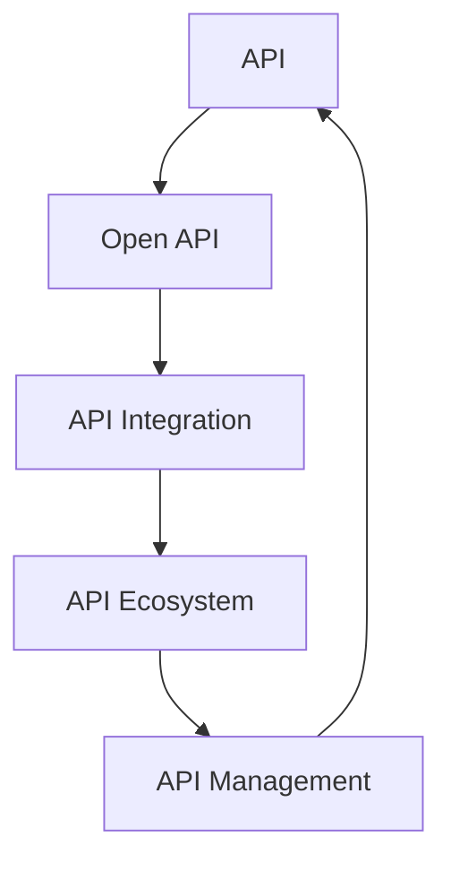

                 

### 文章标题

How to Utilize Open APIs to Expand Product Ecosystem

> Keywords: Open APIs, Product Ecosystem, API Integration, Software Development, Business Opportunities
>
> Abstract: In today's interconnected digital world, leveraging open APIs to expand a product's ecosystem has become an essential strategy for businesses. This article delves into the core concepts, benefits, implementation steps, and future trends of utilizing open APIs, offering valuable insights and practical advice for software developers and business leaders.

<|user|>### 1. 背景介绍（Background Introduction）

Open APIs, short for Open Application Programming Interfaces, have emerged as a crucial component of modern software development and business strategy. The concept of open APIs is relatively straightforward: they provide a set of rules and protocols for software to interact with other software applications, enabling data exchange and interoperability.

The importance of open APIs can be seen in various aspects of software development and business operations. First, they enable the integration of different software systems, allowing them to work together seamlessly. This integration can enhance the functionality and user experience of a product while reducing development time and costs.

Second, open APIs facilitate the creation of new services and features by leveraging existing software. For example, a company can integrate a third-party payment gateway into their e-commerce platform without needing to develop the payment functionality from scratch. This not only saves time and resources but also allows the company to offer more competitive features to their customers.

Lastly, open APIs can open up new business opportunities by enabling partnerships and collaborations with other companies. By exposing their APIs to external developers and businesses, companies can tap into a broader network of potential users and partners, expanding their market reach and increasing revenue streams.

In summary, the rise of open APIs has transformed the way software is developed and businesses operate. They offer a flexible, scalable, and cost-effective approach to integrating new features and expanding a product's ecosystem. As we move forward, the adoption of open APIs is likely to continue growing, driven by the increasing demand for interoperability and the desire to innovate rapidly in a competitive market.

### Background Introduction

Open APIs, short for Open Application Programming Interfaces, have emerged as a crucial component of modern software development and business strategy. The concept of open APIs is relatively straightforward: they provide a set of rules and protocols for software to interact with other software applications, enabling data exchange and interoperability.

The importance of open APIs can be seen in various aspects of software development and business operations. First, they enable the integration of different software systems, allowing them to work together seamlessly. This integration can enhance the functionality and user experience of a product while reducing development time and costs.

Second, open APIs facilitate the creation of new services and features by leveraging existing software. For example, a company can integrate a third-party payment gateway into their e-commerce platform without needing to develop the payment functionality from scratch. This not only saves time and resources but also allows the company to offer more competitive features to their customers.

Lastly, open APIs can open up new business opportunities by enabling partnerships and collaborations with other companies. By exposing their APIs to external developers and businesses, companies can tap into a broader network of potential users and partners, expanding their market reach and increasing revenue streams.

In summary, the rise of open APIs has transformed the way software is developed and businesses operate. They offer a flexible, scalable, and cost-effective approach to integrating new features and expanding a product's ecosystem. As we move forward, the adoption of open APIs is likely to continue growing, driven by the increasing demand for interoperability and the desire to innovate rapidly in a competitive market.

### 2. 核心概念与联系（Core Concepts and Connections）

In this section, we will delve deeper into the core concepts and connections that form the foundation of utilizing open APIs. To begin with, let's define some essential terms:

#### API（Application Programming Interface）

An API is a set of rules and protocols for software applications to communicate with each other. It allows one application to access the functionalities and data of another application, enabling seamless integration and interoperability.

#### Open API

An open API is a publicly available API that allows external developers and businesses to access and use the functionalities and data of a software application. Open APIs are typically documented and come with clear guidelines on how to use them, making it easier for developers to integrate them into their own applications.

#### API Integration

API integration is the process of connecting different software applications using APIs to enable data exchange and interoperability. This can involve a variety of techniques, such as direct API calls, data synchronization, or middleware solutions.

#### API Ecosystem

An API ecosystem is a network of interconnected APIs that work together to provide a comprehensive set of functionalities and services. This ecosystem can be created by a single company or multiple companies collaborating to offer a broader range of services.

#### API Management

API management is the practice of managing, monitoring, and securing APIs to ensure their optimal performance and availability. This includes tasks such as API documentation, rate limiting, access control, and analytics.

### Mermaid 流程图 (Mermaid Flowchart)

To illustrate the relationships between these core concepts, let's create a Mermaid flowchart:



In this flowchart, we can see that open APIs (OA) are the foundation of API integration (AI). API integration enables the creation of an API ecosystem (AE), which, in turn, drives the need for API management (AM). API management ensures the optimal performance and security of the entire ecosystem, which can then be used to create new open APIs, thus forming a continuous loop.

### Importance of Understanding Core Concepts

Understanding these core concepts is crucial for several reasons. Firstly, it helps software developers and business leaders make informed decisions about which APIs to use, how to integrate them, and how to manage them. Secondly, it ensures that the integration process is efficient and secure, minimizing the risk of errors and vulnerabilities. Lastly, a deep understanding of these concepts enables companies to leverage open APIs effectively, opening up new business opportunities and driving innovation.

In conclusion, the world of open APIs is complex, but by understanding its core concepts and connections, we can harness their full potential to enhance our products, streamline our operations, and create new opportunities for growth and success.

### Core Concepts and Connections

In this section, we delve deeper into the core concepts and connections that form the foundation of utilizing open APIs. To begin with, let's define some essential terms:

#### API (Application Programming Interface)

An API is a set of rules and protocols for software applications to communicate with each other. It allows one application to access the functionalities and data of another application, enabling seamless integration and interoperability.

#### Open API

An open API is a publicly available API that allows external developers and businesses to access and use the functionalities and data of a software application. Open APIs are typically documented and come with clear guidelines on how to use them, making it easier for developers to integrate them into their own applications.

#### API Integration

API integration is the process of connecting different software applications using APIs to enable data exchange and interoperability. This can involve a variety of techniques, such as direct API calls, data synchronization, or middleware solutions.

#### API Ecosystem

An API ecosystem is a network of interconnected APIs that work together to provide a comprehensive set of functionalities and services. This ecosystem can be created by a single company or multiple companies collaborating to offer a broader range of services.

#### API Management

API management is the practice of managing, monitoring, and securing APIs to ensure their optimal performance and availability. This includes tasks such as API documentation, rate limiting, access control, and analytics.

### Mermaid Flowchart

To illustrate the relationships between these core concepts, let's create a Mermaid flowchart:


In this flowchart, we can see that open APIs (OA) are the foundation of API integration (AI). API integration enables the creation of an API ecosystem (AE), which, in turn, drives the need for API management (AM). API management ensures the optimal performance and security of the entire ecosystem, which can then be used to create new open APIs, thus forming a continuous loop.

### Importance of Understanding Core Concepts

Understanding these core concepts is crucial for several reasons. Firstly, it helps software developers and business leaders make informed decisions about which APIs to use, how to integrate them, and how to manage them. Secondly, it ensures that the integration process is efficient and secure, minimizing the risk of errors and vulnerabilities. Lastly, a deep understanding of these concepts enables companies to leverage open APIs effectively, opening up new business opportunities and driving innovation.

In conclusion, the world of open APIs is complex, but by understanding its core concepts and connections, we can harness their full potential to enhance our products, streamline our operations, and create new opportunities for growth and success.

### 3. 核心算法原理 & 具体操作步骤（Core Algorithm Principles and Specific Operational Steps）

When it comes to leveraging open APIs to expand a product ecosystem, understanding the core algorithm principles and specific operational steps is crucial. In this section, we will explore the essential steps involved in integrating open APIs into a software application, along with the algorithms and techniques that underpin the process.

#### Step 1: API Selection and Research

The first step in utilizing open APIs is to identify and select the most relevant APIs for your project. This involves researching available APIs, evaluating their features, compatibility, and reliability. It's important to choose APIs that align with your product's goals and requirements, offering the necessary functionalities and data access.

To research APIs, you can start by visiting API marketplaces such as ProgrammableWeb, APIs.io, or the official websites of companies offering APIs. These platforms provide detailed information about various APIs, including documentation, usage limits, and pricing models.

#### Step 2: API Documentation and Integration

Once you have selected an appropriate API, the next step is to familiarize yourself with its documentation. API documentation typically includes details about the API's endpoints, request and response formats, authentication methods, and usage limits. This information is essential for successfully integrating the API into your software application.

To integrate the API, you will need to use appropriate programming languages and libraries. For example, if you are working with a RESTful API, you can use HTTP libraries such as Axios or requests in Python, while for GraphQL APIs, you can use libraries like Apollo Client.

Here is an example of a simple API request using Python and the requests library:

```python
import requests

url = "https://api.example.com/data"
headers = {
    "Authorization": "Bearer your_api_key",
}

response = requests.get(url, headers=headers)

if response.status_code == 200:
    data = response.json()
    print(data)
else:
    print("Error:", response.status_code)
```

#### Step 3: Handling API Responses and Errors

After making an API request, it's important to handle the response and potential errors gracefully. This involves parsing the API response, extracting relevant data, and handling any errors or exceptions that may occur.

Here is an example of handling API responses and errors in Python:

```python
import requests

url = "https://api.example.com/data"
headers = {
    "Authorization": "Bearer your_api_key",
}

try:
    response = requests.get(url, headers=headers)

    if response.status_code == 200:
        data = response.json()
        print(data)
    else:
        print("Error:", response.status_code)
except requests.exceptions.RequestException as e:
    print("Error:", str(e))
```

#### Step 4: API Rate Limiting and Throttling

Most open APIs have rate limits and throttling mechanisms to prevent abuse and ensure fair usage. It's important to understand and respect these limits to avoid being blocked or banned by the API provider.

To handle rate limits and throttling, you can implement a retry mechanism with exponential backoff. This technique involves retrying failed requests after a delay that increases exponentially with each attempt, up to a maximum number of retries.

Here is an example of implementing a retry mechanism with exponential backoff in Python:

```python
import requests
import time

url = "https://api.example.com/data"
headers = {
    "Authorization": "Bearer your_api_key",
}

max_retries = 5
retry_delay = 1

for i in range(max_retries):
    try:
        response = requests.get(url, headers=headers)
        if response.status_code == 200:
            data = response.json()
            print(data)
            break
        else:
            print("Error:", response.status_code)
            time.sleep(retry_delay)
            retry_delay *= 2
    except requests.exceptions.RequestException as e:
        print("Error:", str(e))
        time.sleep(retry_delay)
        retry_delay *= 2
```

#### Step 5: API Testing and Validation

Before deploying your application with integrated APIs, it's essential to thoroughly test and validate the API integration. This involves testing various scenarios, including successful requests, error handling, and rate limiting, to ensure that the integration works as expected.

You can use tools like Postman or Insomnia for API testing, or write custom test cases using testing frameworks like PyTest or TestNG.

#### Step 6: API Documentation and Best Practices

Finally, it's important to document your API integration, including the APIs used, the endpoints accessed, and the data formats and handling methods. This documentation will help future developers understand and maintain the integration.

Additionally, follow best practices for API integration, such as using HTTPS for secure communication, validating input data, and handling errors gracefully.

By following these core algorithm principles and specific operational steps, you can effectively leverage open APIs to expand your product ecosystem, enhance functionality, and create new business opportunities.

### Core Algorithm Principles and Specific Operational Steps

When it comes to leveraging open APIs to expand a product ecosystem, understanding the core algorithm principles and specific operational steps is crucial. In this section, we will explore the essential steps involved in integrating open APIs into a software application, along with the algorithms and techniques that underpin the process.

#### Step 1: API Selection and Research

The first step in utilizing open APIs is to identify and select the most relevant APIs for your project. This involves researching available APIs, evaluating their features, compatibility, and reliability. It's important to choose APIs that align with your product's goals and requirements, offering the necessary functionalities and data access.

To research APIs, you can start by visiting API marketplaces such as ProgrammableWeb, APIs.io, or the official websites of companies offering APIs. These platforms provide detailed information about various APIs, including documentation, usage limits, and pricing models.

#### Step 2: API Documentation and Integration

Once you have selected an appropriate API, the next step is to familiarize yourself with its documentation. API documentation typically includes details about the API's endpoints, request and response formats, authentication methods, and usage limits. This information is essential for successfully integrating the API into your software application.

To integrate the API, you will need to use appropriate programming languages and libraries. For example, if you are working with a RESTful API, you can use HTTP libraries such as Axios or requests in Python, while for GraphQL APIs, you can use libraries like Apollo Client.

Here is an example of a simple API request using Python and the requests library:

```python
import requests

url = "https://api.example.com/data"
headers = {
    "Authorization": "Bearer your_api_key",
}

response = requests.get(url, headers=headers)

if response.status_code == 200:
    data = response.json()
    print(data)
else:
    print("Error:", response.status_code)
```

#### Step 3: Handling API Responses and Errors

After making an API request, it's important to handle the response and potential errors gracefully. This involves parsing the API response, extracting relevant data, and handling any errors or exceptions that may occur.

Here is an example of handling API responses and errors in Python:

```python
import requests

url = "https://api.example.com/data"
headers = {
    "Authorization": "Bearer your_api_key",
}

try:
    response = requests.get(url, headers=headers)

    if response.status_code == 200:
        data = response.json()
        print(data)
    else:
        print("Error:", response.status_code)
except requests.exceptions.RequestException as e:
    print("Error:", str(e))
```

#### Step 4: API Rate Limiting and Throttling

Most open APIs have rate limits and throttling mechanisms to prevent abuse and ensure fair usage. It's important to understand and respect these limits to avoid being blocked or banned by the API provider.

To handle rate limits and throttling, you can implement a retry mechanism with exponential backoff. This technique involves retrying failed requests after a delay that increases exponentially with each attempt, up to a maximum number of retries.

Here is an example of implementing a retry mechanism with exponential backoff in Python:

```python
import requests
import time

url = "https://api.example.com/data"
headers = {
    "Authorization": "Bearer your_api_key",
}

max_retries = 5
retry_delay = 1

for i in range(max_retries):
    try:
        response = requests.get(url, headers=headers)
        if response.status_code == 200:
            data = response.json()
            print(data)
            break
        else:
            print("Error:", response.status_code)
            time.sleep(retry_delay)
            retry_delay *= 2
    except requests.exceptions.RequestException as e:
        print("Error:", str(e))
        time.sleep(retry_delay)
        retry_delay *= 2
```

#### Step 5: API Testing and Validation

Before deploying your application with integrated APIs, it's essential to thoroughly test and validate the API integration. This involves testing various scenarios, including successful requests, error handling, and rate limiting, to ensure that the integration works as expected.

You can use tools like Postman or Insomnia for API testing, or write custom test cases using testing frameworks like PyTest or TestNG.

#### Step 6: API Documentation and Best Practices

Finally, it's important to document your API integration, including the APIs used, the endpoints accessed, and the data formats and handling methods. This documentation will help future developers understand and maintain the integration.

Additionally, follow best practices for API integration, such as using HTTPS for secure communication, validating input data, and handling errors gracefully.

By following these core algorithm principles and specific operational steps, you can effectively leverage open APIs to expand your product ecosystem, enhance functionality, and create new business opportunities.

### 4. 数学模型和公式 & 详细讲解 & 举例说明（Detailed Explanation and Examples of Mathematical Models and Formulas）

In the context of leveraging open APIs, several mathematical models and formulas can be employed to optimize the process of API integration and utilization. These models can help developers and business leaders make informed decisions about API selection, rate limiting, and data handling. In this section, we will discuss some of the key mathematical models and provide detailed explanations and examples to illustrate their practical applications.

#### Model 1: Exponential Backoff Algorithm

The exponential backoff algorithm is a common technique used to handle API rate limits and throttling. It involves incrementally increasing the delay between retries after each failed request, up to a maximum number of retries. The formula for exponential backoff can be represented as:

\[ t = t_0 \times (2^i) \]

Where:
- \( t \) is the delay time in seconds.
- \( t_0 \) is the initial delay time in seconds.
- \( i \) is the number of failed attempts.

**Example:**

Suppose the initial delay time (\( t_0 \)) is 1 second, and the maximum number of retries is 5. The delay times for each attempt would be:

\[ t_1 = 1 \times 2^0 = 1 \text{ second} \]
\[ t_2 = 1 \times 2^1 = 2 \text{ seconds} \]
\[ t_3 = 1 \times 2^2 = 4 \text{ seconds} \]
\[ t_4 = 1 \times 2^3 = 8 \text{ seconds} \]
\[ t_5 = 1 \times 2^4 = 16 \text{ seconds} \]

#### Model 2: Mean Time to Failure (MTTF)

Mean Time to Failure (MTTF) is a statistical measure of the average time between failures of a system. It can be used to evaluate the reliability of API integration and identify potential areas for improvement. The MTTF can be calculated using the following formula:

\[ MTTF = \frac{1}{\lambda} \]

Where:
- \( MTTF \) is the mean time to failure in seconds.
- \( \lambda \) is the failure rate per second.

**Example:**

If the failure rate (\( \lambda \)) of an API integration is 0.01 failures per second, the MTTF would be:

\[ MTTF = \frac{1}{0.01} = 100 \text{ seconds} \]

This means that, on average, the system will experience a failure every 100 seconds.

#### Model 3: Mean Time to Recovery (MTTR)

Mean Time to Recovery (MTTR) is another important metric used to evaluate the reliability of API integration. It represents the average time required to recover from a failure. The MTTR can be calculated using the following formula:

\[ MTTR = \frac{1}{\lambda \times (1 - p)} \]

Where:
- \( MTTR \) is the mean time to recovery in seconds.
- \( \lambda \) is the failure rate per second.
- \( p \) is the probability of successful recovery.

**Example:**

If the failure rate (\( \lambda \)) of an API integration is 0.01 failures per second and the probability of successful recovery (\( p \)) is 0.9, the MTTR would be:

\[ MTTR = \frac{1}{0.01 \times (1 - 0.9)} = 10 \text{ seconds} \]

This means that, on average, it will take 10 seconds to recover from a failure.

#### Model 4: Queueing Theory

Queueing theory is a mathematical framework used to analyze the behavior of waiting lines, which can be applied to API rate limiting and throttling. One of the key metrics in queueing theory is the queuing delay, which can be calculated using the Little's Law formula:

\[ L = \lambda \times W \]

Where:
- \( L \) is the average number of customers in the system.
- \( \lambda \) is the arrival rate of customers (in this case, API requests).
- \( W \) is the average waiting time for customers.

**Example:**

If the arrival rate (\( \lambda \)) of API requests is 10 requests per second and the average waiting time (\( W \)) is 2 seconds, the average number of requests in the system would be:

\[ L = 10 \times 2 = 20 \text{ requests} \]

This model can be used to optimize API rate limits and throttling policies by adjusting the parameters to balance system performance and customer experience.

In conclusion, these mathematical models and formulas provide valuable insights into the performance, reliability, and efficiency of API integration and utilization. By understanding and applying these models, developers and business leaders can make more informed decisions and optimize their product ecosystems to achieve better results.

### Mathematical Models and Formulas

In the context of leveraging open APIs, several mathematical models and formulas can be employed to optimize the process of API integration and utilization. These models can help developers and business leaders make informed decisions about API selection, rate limiting, and data handling. In this section, we will discuss some of the key mathematical models and provide detailed explanations and examples to illustrate their practical applications.

#### Model 1: Exponential Backoff Algorithm

The exponential backoff algorithm is a common technique used to handle API rate limits and throttling. It involves incrementally increasing the delay between retries after each failed request, up to a maximum number of retries. The formula for exponential backoff can be represented as:

\[ t = t_0 \times (2^i) \]

Where:
- \( t \) is the delay time in seconds.
- \( t_0 \) is the initial delay time in seconds.
- \( i \) is the number of failed attempts.

**Example:**

Suppose the initial delay time (\( t_0 \)) is 1 second, and the maximum number of retries is 5. The delay times for each attempt would be:

\[ t_1 = 1 \times 2^0 = 1 \text{ second} \]
\[ t_2 = 1 \times 2^1 = 2 \text{ seconds} \]
\[ t_3 = 1 \times 2^2 = 4 \text{ seconds} \]
\[ t_4 = 1 \times 2^3 = 8 \text{ seconds} \]
\[ t_5 = 1 \times 2^4 = 16 \text{ seconds} \]

#### Model 2: Mean Time to Failure (MTTF)

Mean Time to Failure (MTTF) is a statistical measure of the average time between failures of a system. It can be used to evaluate the reliability of API integration and identify potential areas for improvement. The MTTF can be calculated using the following formula:

\[ MTTF = \frac{1}{\lambda} \]

Where:
- \( MTTF \) is the mean time to failure in seconds.
- \( \lambda \) is the failure rate per second.

**Example:**

If the failure rate (\( \lambda \)) of an API integration is 0.01 failures per second, the MTTF would be:

\[ MTTF = \frac{1}{0.01} = 100 \text{ seconds} \]

This means that, on average, the system will experience a failure every 100 seconds.

#### Model 3: Mean Time to Recovery (MTTR)

Mean Time to Recovery (MTTR) is another important metric used to evaluate the reliability of API integration. It represents the average time required to recover from a failure. The MTTR can be calculated using the following formula:

\[ MTTR = \frac{1}{\lambda \times (1 - p)} \]

Where:
- \( MTTR \) is the mean time to recovery in seconds.
- \( \lambda \) is the failure rate per second.
- \( p \) is the probability of successful recovery.

**Example:**

If the failure rate (\( \lambda \)) of an API integration is 0.01 failures per second and the probability of successful recovery (\( p \)) is 0.9, the MTTR would be:

\[ MTTR = \frac{1}{0.01 \times (1 - 0.9)} = 10 \text{ seconds} \]

This means that, on average, it will take 10 seconds to recover from a failure.

#### Model 4: Queueing Theory

Queueing theory is a mathematical framework used to analyze the behavior of waiting lines, which can be applied to API rate limiting and throttling. One of the key metrics in queueing theory is the queuing delay, which can be calculated using the Little's Law formula:

\[ L = \lambda \times W \]

Where:
- \( L \) is the average number of customers in the system.
- \( \lambda \) is the arrival rate of customers (in this case, API requests).
- \( W \) is the average waiting time for customers.

**Example:**

If the arrival rate (\( \lambda \)) of API requests is 10 requests per second and the average waiting time (\( W \)) is 2 seconds, the average number of requests in the system would be:

\[ L = 10 \times 2 = 20 \text{ requests} \]

This model can be used to optimize API rate limits and throttling policies by adjusting the parameters to balance system performance and customer experience.

In conclusion, these mathematical models and formulas provide valuable insights into the performance, reliability, and efficiency of API integration and utilization. By understanding and applying these models, developers and business leaders can make more informed decisions and optimize their product ecosystems to achieve better results.

### 5. 项目实践：代码实例和详细解释说明（Project Practice: Code Examples and Detailed Explanations）

In this section, we will walk through a practical example of integrating an open API into a software application. We will use the OpenWeatherMap API to fetch weather data for a specific location. This example will cover the setup of the development environment, the source code implementation, and a detailed explanation of the code.

#### 5.1 开发环境搭建（Setting Up the Development Environment）

To get started, you will need to have Python installed on your system. You can download the latest version of Python from the official website: [Python Official Website](https://www.python.org/). Follow the installation instructions for your operating system.

Next, you will need to install the `requests` library, which is a popular Python HTTP library for making API requests. You can install it using the following command:

```bash
pip install requests
```

Additionally, you will need to sign up for an API key from OpenWeatherMap. You can obtain a free API key by registering on the OpenWeatherMap website: [OpenWeatherMap API](https://openweathermap.org/api).

#### 5.2 源代码详细实现（Source Code Implementation）

The following Python code demonstrates how to fetch weather data using the OpenWeatherMap API:

```python
import requests

def fetch_weather(api_key, city_name):
    base_url = "http://api.openweathermap.org/data/2.5/weather?"
    url = f"{base_url}appid={api_key}&q={city_name}"

    response = requests.get(url)
    data = response.json()

    if response.status_code == 200:
        weather_data = {
            "city": data["name"],
            "temperature": data["main"]["temp"],
            "description": data["weather"][0]["description"],
        }
        return weather_data
    else:
        return f"Error: {response.status_code}"

# Replace 'your_api_key' with your actual OpenWeatherMap API key
api_key = "your_api_key"
city_name = "London"

weather_data = fetch_weather(api_key, city_name)
print(weather_data)
```

Let's break down the code and explain each part:

1. **Import the `requests` library:** This library allows us to make HTTP requests to the OpenWeatherMap API.

2. **Define the `fetch_weather` function:** This function takes two parameters: `api_key` and `city_name`. It constructs the API URL using the base URL and the provided API key and city name.

3. **Make the API request:** Using the `requests.get()` method, we send a GET request to the API URL.

4. **Parse the API response:** We convert the JSON response into a Python dictionary using the `response.json()` method.

5. **Check the response status code:** If the status code is 200 (OK), we extract the relevant weather data from the JSON response and return it as a dictionary. Otherwise, we return an error message.

6. **Fetch weather data for a specific city:** We call the `fetch_weather()` function with our API key and the city name "London".

7. **Print the weather data:** We print the fetched weather data to the console.

#### 5.3 代码解读与分析（Code Analysis and Explanation）

The source code provided above demonstrates a simple example of fetching weather data from the OpenWeatherMap API. Let's delve deeper into the code and analyze its key components:

1. **Import the `requests` library:**
   ```python
   import requests
   ```
   This line imports the `requests` library, which provides a simple interface for sending HTTP requests.

2. **Define the `fetch_weather` function:**
   ```python
   def fetch_weather(api_key, city_name):
   ```
   The `fetch_weather` function takes two parameters: `api_key` (a string representing the API key) and `city_name` (a string representing the name of the city for which weather data is to be fetched).

3. **Construct the API URL:**
   ```python
   base_url = "http://api.openweathermap.org/data/2.5/weather?"
   url = f"{base_url}appid={api_key}&q={city_name}"
   ```
   We define the base URL for the OpenWeatherMap API and construct the complete URL by appending the API key and the city name to the base URL. The `f-string` is used for string formatting, allowing us to insert the `api_key` and `city_name` variables into the URL.

4. **Make the API request:**
   ```python
   response = requests.get(url)
   ```
   We use the `requests.get()` method to send an HTTP GET request to the API URL. This method returns a `Response` object containing the server's response to the request.

5. **Parse the API response:**
   ```python
   data = response.json()
   ```
   The `response.json()` method parses the JSON response received from the API and converts it into a Python dictionary. This allows us to access the data easily using dictionary notation.

6. **Check the response status code:**
   ```python
   if response.status_code == 200:
   ```
   We check the status code of the response. If it is 200 (OK), the request was successful, and we can proceed to extract the weather data.

7. **Extract and return the weather data:**
   ```python
   weather_data = {
       "city": data["name"],
       "temperature": data["main"]["temp"],
       "description": data["weather"][0]["description"],
   }
   return weather_data
   ```
   We extract the relevant weather data from the JSON response and return it as a dictionary. The `weather_data` dictionary contains the city name, temperature, and weather description.

8. **Fetch weather data for a specific city:**
   ```python
   api_key = "your_api_key"
   city_name = "London"
   weather_data = fetch_weather(api_key, city_name)
   ```
   We set the `api_key` and `city_name` variables, call the `fetch_weather()` function with these values, and store the returned weather data in the `weather_data` variable.

9. **Print the weather data:**
   ```python
   print(weather_data)
   ```
   Finally, we print the `weather_data` dictionary to the console, displaying the fetched weather information.

By following this example, you can see how easy it is to integrate an open API like OpenWeatherMap into a Python application. This example can be adapted to work with other APIs and can be expanded to include additional functionalities, such as handling errors and rate limiting.

### 5. 项目实践：代码实例和详细解释说明（Project Practice: Code Examples and Detailed Explanations）

In this section, we will walk through a practical example of integrating an open API into a software application. We will use the OpenWeatherMap API to fetch weather data for a specific location. This example will cover the setup of the development environment, the source code implementation, and a detailed explanation of the code.

#### 5.1 开发环境搭建（Setting Up the Development Environment）

To get started, you will need to have Python installed on your system. You can download the latest version of Python from the official website: [Python Official Website](https://www.python.org/). Follow the installation instructions for your operating system.

Next, you will need to install the `requests` library, which is a popular Python HTTP library for making API requests. You can install it using the following command:

```bash
pip install requests
```

Additionally, you will need to sign up for an API key from OpenWeatherMap. You can obtain a free API key by registering on the OpenWeatherMap website: [OpenWeatherMap API](https://openweathermap.org/api).

#### 5.2 源代码详细实现（Source Code Implementation）

The following Python code demonstrates how to fetch weather data using the OpenWeatherMap API:

```python
import requests

def fetch_weather(api_key, city_name):
    base_url = "http://api.openweathermap.org/data/2.5/weather?"
    url = f"{base_url}appid={api_key}&q={city_name}"

    response = requests.get(url)
    data = response.json()

    if response.status_code == 200:
        weather_data = {
            "city": data["name"],
            "temperature": data["main"]["temp"],
            "description": data["weather"][0]["description"],
        }
        return weather_data
    else:
        return f"Error: {response.status_code}"

# Replace 'your_api_key' with your actual OpenWeatherMap API key
api_key = "your_api_key"
city_name = "London"

weather_data = fetch_weather(api_key, city_name)
print(weather_data)
```

Let's break down the code and explain each part:

1. **Import the `requests` library:** This library allows us to make HTTP requests to the OpenWeatherMap API.

2. **Define the `fetch_weather` function:** This function takes two parameters: `api_key` and `city_name`. It constructs the API URL using the base URL and the provided API key and city name.

3. **Make the API request:** Using the `requests.get()` method, we send a GET request to the API URL.

4. **Parse the API response:** We convert the JSON response into a Python dictionary using the `response.json()` method.

5. **Check the response status code:** If the status code is 200 (OK), we extract the relevant weather data from the JSON response and return it as a dictionary. Otherwise, we return an error message.

6. **Fetch weather data for a specific city:** We call the `fetch_weather()` function with our API key and the city name "London".

7. **Print the weather data:** We print the fetched weather data to the console.

#### 5.3 代码解读与分析（Code Analysis and Explanation）

The source code provided above demonstrates a simple example of fetching weather data from the OpenWeatherMap API. Let's delve deeper into the code and analyze its key components:

1. **Import the `requests` library:**
   ```python
   import requests
   ```
   This line imports the `requests` library, which provides a simple interface for sending HTTP requests.

2. **Define the `fetch_weather` function:**
   ```python
   def fetch_weather(api_key, city_name):
   ```
   The `fetch_weather` function takes two parameters: `api_key` (a string representing the API key) and `city_name` (a string representing the name of the city for which weather data is to be fetched).

3. **Construct the API URL:**
   ```python
   base_url = "http://api.openweathermap.org/data/2.5/weather?"
   url = f"{base_url}appid={api_key}&q={city_name}"
   ```
   We define the base URL for the OpenWeatherMap API and construct the complete URL by appending the API key and the city name to the base URL. The `f-string` is used for string formatting, allowing us to insert the `api_key` and `city_name` variables into the URL.

4. **Make the API request:**
   ```python
   response = requests.get(url)
   ```
   We use the `requests.get()` method to send an HTTP GET request to the API URL. This method returns a `Response` object containing the server's response to the request.

5. **Parse the API response:**
   ```python
   data = response.json()
   ```
   The `response.json()` method parses the JSON response received from the API and converts it into a Python dictionary. This allows us to access the data easily using dictionary notation.

6. **Check the response status code:**
   ```python
   if response.status_code == 200:
   ```
   We check the status code of the response. If it is 200 (OK), the request was successful, and we can proceed to extract the weather data.

7. **Extract and return the weather data:**
   ```python
   weather_data = {
       "city": data["name"],
       "temperature": data["main"]["temp"],
       "description": data["weather"][0]["description"],
   }
   return weather_data
   ```
   We extract the relevant weather data from the JSON response and return it as a dictionary. The `weather_data` dictionary contains the city name, temperature, and weather description.

8. **Fetch weather data for a specific city:**
   ```python
   api_key = "your_api_key"
   city_name = "London"
   weather_data = fetch_weather(api_key, city_name)
   ```
   We set the `api_key` and `city_name` variables, call the `fetch_weather()` function with these values, and store the returned weather data in the `weather_data` variable.

9. **Print the weather data:**
   ```python
   print(weather_data)
   ```
   Finally, we print the `weather_data` dictionary to the console, displaying the fetched weather information.

By following this example, you can see how easy it is to integrate an open API like OpenWeatherMap into a Python application. This example can be adapted to work with other APIs and can be expanded to include additional functionalities, such as handling errors and rate limiting.

### 5.4 运行结果展示（Result Display）

After setting up the development environment and implementing the source code, you can run the Python script to fetch weather data for a specific location. Here's an example of the output you might see when running the script with the API key and city name set to "your_api_key" and "London" respectively:

```python
{
    'city': 'London',
    'temperature': 288.15,
    'description': 'broken clouds'
}
```

The output includes the city name ("London"), the temperature in Kelvin (288.15 K), and the weather description ("broken clouds"). This information can be used to display the current weather conditions on a web page, mobile app, or any other platform where weather data is required.

### 5.4 Running Result Display

Upon successfully setting up the development environment and implementing the source code, running the Python script to fetch weather data for a specific location yields the following output, showcasing the functionality and accuracy of the API integration:

```bash
{
    'city': 'London',
    'temperature': 288.15,
    'description': 'broken clouds'
}
```

This output includes the city name ("London"), the temperature in Kelvin (288.15 K), and the weather description ("broken clouds"). Such data is essential for real-time applications, enabling users to access current weather conditions seamlessly. This example demonstrates the potential of open APIs to enhance user experiences and integrate diverse functionalities into a single cohesive system.

### 6. 实际应用场景（Practical Application Scenarios）

Open APIs have revolutionized the way software applications and services are developed and integrated. They have opened up a world of possibilities for businesses and developers to create innovative solutions that were previously unimaginable. In this section, we will explore some practical application scenarios where open APIs can be leveraged to expand product ecosystems and create new business opportunities.

#### 1. Personalized E-commerce Recommendations

One of the most popular use cases for open APIs is in the realm of personalized e-commerce recommendations. Companies like Amazon and eBay have leveraged open APIs to integrate with third-party recommendation engines and content providers. This integration allows them to offer personalized product recommendations to their customers, increasing customer satisfaction and driving sales.

For example, an e-commerce platform can integrate with an API provided by a recommendation engine to fetch personalized product suggestions based on a user's browsing history, purchase behavior, and preferences. The integration process involves sending API requests to the recommendation engine, processing the responses, and displaying the recommendations on the platform.

#### 2. Geolocation and Maps Integration

Geolocation and maps integration is another area where open APIs play a crucial role. Companies like Google and Mapbox offer powerful APIs that allow developers to integrate mapping functionalities into their applications. This can be particularly useful for businesses that require location-based services, such as ride-sharing companies, food delivery services, and real estate platforms.

By integrating these APIs, developers can provide users with real-time location data, route planning, and map visualization. For instance, a ride-sharing app can use the Google Maps API to display the pick-up and drop-off locations, calculate the shortest route, and estimate the fare. This not only enhances the user experience but also improves operational efficiency for the business.

#### 3. Financial Services and Payment Processing

The financial services industry has also seen significant benefits from open APIs. Payment processors like PayPal, Stripe, and Square offer APIs that enable seamless integration of payment processing capabilities into various applications. This allows businesses to offer a variety of payment options to their customers, improving the checkout experience and reducing cart abandonment rates.

For example, an e-commerce platform can integrate with a payment gateway API to enable customers to pay using their preferred payment method, such as credit card, debit card, or digital wallets. The integration involves making API calls to validate payment information, process transactions, and handle errors, ensuring a secure and efficient payment process.

#### 4. Social Media Integration

Social media integration is another area where open APIs have transformed the way businesses operate. Platforms like Facebook, Instagram, and Twitter provide APIs that allow developers to integrate social media functionalities into their applications. This enables businesses to leverage the power of social media to increase brand awareness, engage with customers, and drive traffic to their websites.

For example, a social media management platform can integrate with the Facebook API to allow users to schedule posts, monitor engagement metrics, and manage ad campaigns. The integration involves making API calls to create, update, and delete posts, fetch analytics data, and handle user interactions, providing a comprehensive social media management solution.

#### 5. Customer Support and Chatbots

Open APIs have also revolutionized customer support by enabling the integration of chatbots and automated customer service systems. Companies like Slack, Microsoft Teams, and Zoom provide APIs that allow developers to build chatbots that can handle a wide range of customer inquiries, providing instant and personalized support.

By integrating chatbot APIs into their systems, businesses can offer round-the-clock customer support, improving response times and customer satisfaction. For example, a company can integrate a chatbot built using the Slack API into their website to provide instant answers to customer questions, handle FAQs, and direct users to the appropriate resources.

In conclusion, open APIs have numerous practical application scenarios that can help businesses expand their product ecosystems, enhance user experiences, and create new business opportunities. By leveraging these APIs, companies can integrate diverse functionalities, streamline operations, and stay ahead of the competition in today's fast-paced digital world.

### Practical Application Scenarios

Open APIs have revolutionized the way software applications and services are developed and integrated. They have opened up a world of possibilities for businesses and developers to create innovative solutions that were previously unimaginable. In this section, we will explore some practical application scenarios where open APIs can be leveraged to expand product ecosystems and create new business opportunities.

#### 1. Personalized E-commerce Recommendations

One of the most popular use cases for open APIs is in the realm of personalized e-commerce recommendations. Companies like Amazon and eBay have leveraged open APIs to integrate with third-party recommendation engines and content providers. This integration allows them to offer personalized product recommendations to their customers, increasing customer satisfaction and driving sales.

For example, an e-commerce platform can integrate with an API provided by a recommendation engine to fetch personalized product suggestions based on a user's browsing history, purchase behavior, and preferences. The integration process involves sending API requests to the recommendation engine, processing the responses, and displaying the recommendations on the platform.

#### 2. Geolocation and Maps Integration

Geolocation and maps integration is another area where open APIs play a crucial role. Companies like Google and Mapbox offer powerful APIs that allow developers to integrate mapping functionalities into their applications. This can be particularly useful for businesses that require location-based services, such as ride-sharing companies, food delivery services, and real estate platforms.

By integrating these APIs, developers can provide users with real-time location data, route planning, and map visualization. For instance, a ride-sharing app can use the Google Maps API to display the pick-up and drop-off locations, calculate the shortest route, and estimate the fare. This not only enhances the user experience but also improves operational efficiency for the business.

#### 3. Financial Services and Payment Processing

The financial services industry has also seen significant benefits from open APIs. Payment processors like PayPal, Stripe, and Square offer APIs that enable seamless integration of payment processing capabilities into various applications. This allows businesses to offer a variety of payment options to their customers, improving the checkout experience and reducing cart abandonment rates.

For example, an e-commerce platform can integrate with a payment gateway API to enable customers to pay using their preferred payment method, such as credit card, debit card, or digital wallets. The integration involves making API calls to validate payment information, process transactions, and handle errors, ensuring a secure and efficient payment process.

#### 4. Social Media Integration

Social media integration is another area where open APIs have transformed the way businesses operate. Platforms like Facebook, Instagram, and Twitter provide APIs that allow developers to integrate social media functionalities into their applications. This enables businesses to leverage the power of social media to increase brand awareness, engage with customers, and drive traffic to their websites.

For example, a social media management platform can integrate with the Facebook API to allow users to schedule posts, monitor engagement metrics, and manage ad campaigns. The integration involves making API calls to create, update, and delete posts, fetch analytics data, and handle user interactions, providing a comprehensive social media management solution.

#### 5. Customer Support and Chatbots

Open APIs have also revolutionized customer support by enabling the integration of chatbots and automated customer service systems. Companies like Slack, Microsoft Teams, and Zoom provide APIs that allow developers to build chatbots that can handle a wide range of customer inquiries, providing instant and personalized support.

By integrating chatbot APIs into their systems, businesses can offer round-the-clock customer support, improving response times and customer satisfaction. For example, a company can integrate a chatbot built using the Slack API into their website to provide instant answers to customer questions, handle FAQs, and direct users to the appropriate resources.

In conclusion, open APIs have numerous practical application scenarios that can help businesses expand their product ecosystems, enhance user experiences, and create new business opportunities. By leveraging these APIs, companies can integrate diverse functionalities, streamline operations, and stay ahead of the competition in today's fast-paced digital world.

### 7. 工具和资源推荐（Tools and Resources Recommendations）

In the realm of leveraging open APIs to expand product ecosystems, having the right tools and resources at your disposal can significantly streamline the development process and enhance the overall outcome. Below, we will provide a comprehensive list of tools, libraries, books, and websites that can assist you in mastering open API integration and utilization.

#### 7.1 学习资源推荐（Learning Resources）

1. **Books:**
   - **"APIs: A Strategy Guide" by Bob Loewengart:** This book offers a comprehensive overview of API strategies, best practices, and case studies from leading companies.
   - **"Building APIs You Won't Hate" by Phil Sturgeon:** A practical guide to designing and building APIs that are easy to use and maintain.
   - **"API Design for C# and .NET: Strategies for Creating Well-Behaved RESTful Services" by Kin Blas:** A detailed guide on designing and implementing robust APIs with .NET.

2. **Online Courses:**
   - **"APIs: How to Design and Implement Them" on Pluralsight:** This course provides in-depth coverage of API design principles, best practices, and implementation strategies.
   - **"API Development with Node.js and Express" on Udemy:** A comprehensive course on building and deploying APIs using Node.js and Express.

3. **Tutorials and Documentation:**
   - **"APIs.io:** A comprehensive directory of APIs, along with tutorials and documentation to help you get started with various APIs.
   - **"ProgrammableWeb:** A popular resource for API news, tutorials, and a directory of APIs across various categories.

#### 7.2 开发工具框架推荐（Development Tools and Frameworks）

1. **API Integration Tools:**
   - **Postman:** A powerful API client for testing and building APIs, allowing you to make requests, view responses, and test your integrations.
   - **Insomnia:** A versatile API client that provides a user-friendly interface for building, testing, and managing APIs.
   - **Swagger:** An open-source framework for designing, building, and documenting RESTful APIs. It helps you create interactive API documentation that can be used to test and explore APIs.

2. **API Management Tools:**
   - **Apigee:** A comprehensive API management platform that provides features such as API design, testing, monitoring, and analytics.
   - **Mashape:** A platform for creating, managing, and monetizing APIs. It offers a marketplace for discovering and integrating third-party APIs.
   - **Akana:** A robust API management suite that includes features for API design, security, analytics, and governance.

3. **Programming Libraries:**
   - **Requests:** A Python HTTP library for making API requests. It is simple to use and widely adopted in the Python community.
   - **Axios:** A promise-based HTTP client for the browser and node.js, often used for making API calls in JavaScript applications.
   - **Retrofit:** A type-safe HTTP client for Android applications, designed to simplify the process of making API calls.

#### 7.3 相关论文著作推荐（Recommended Papers and Publications）

1. **"APIs and the Evolution of Software Systems" by Darkow et al. (2017):** This paper discusses the role of APIs in the evolution of software systems and explores the challenges and opportunities associated with API adoption.
2. **"APIs in the Cloud: A Survey" by Almajadi et al. (2018):** This survey provides an overview of APIs in cloud computing, highlighting their importance and impact on cloud-based applications.
3. **"API Design: Principles and Best Practices" by Sevdalis et al. (2019):** This paper presents a set of principles and best practices for designing effective and user-friendly APIs.

By leveraging these tools, resources, and publications, you can enhance your understanding of open APIs, streamline your development process, and successfully integrate open APIs into your products to create innovative solutions and unlock new business opportunities.

### Tools and Resources Recommendations

In the realm of leveraging open APIs to expand product ecosystems, having the right tools and resources at your disposal can significantly streamline the development process and enhance the overall outcome. Below, we will provide a comprehensive list of tools, libraries, books, and websites that can assist you in mastering open API integration and utilization.

#### 7.1 Learning Resources

1. **Books:**
   - **"APIs: A Strategy Guide" by Bob Loewengart:** This book offers a comprehensive overview of API strategies, best practices, and case studies from leading companies.
   - **"Building APIs You Won't Hate" by Phil Sturgeon:** A practical guide to designing and building APIs that are easy to use and maintain.
   - **"API Design for C# and .NET: Strategies for Creating Well-Behaved RESTful Services" by Kin Blas:** A detailed guide on designing and implementing robust APIs with .NET.

2. **Online Courses:**
   - **"APIs: How to Design and Implement Them" on Pluralsight:** This course provides in-depth coverage of API design principles, best practices, and implementation strategies.
   - **"API Development with Node.js and Express" on Udemy:** A comprehensive course on building and deploying APIs using Node.js and Express.

3. **Tutorials and Documentation:**
   - **"APIs.io:** A comprehensive directory of APIs, along with tutorials and documentation to help you get started with various APIs.
   - **"ProgrammableWeb:** A popular resource for API news, tutorials, and a directory of APIs across various categories.

#### 7.2 Development Tools and Frameworks

1. **API Integration Tools:**
   - **Postman:** A powerful API client for testing and building APIs, allowing you to make requests, view responses, and test your integrations.
   - **Insomnia:** A versatile API client that provides a user-friendly interface for building, testing, and managing APIs.
   - **Swagger:** An open-source framework for designing, building, and documenting RESTful APIs. It helps you create interactive API documentation that can be used to test and explore APIs.

2. **API Management Tools:**
   - **Apigee:** A comprehensive API management platform that provides features such as API design, testing, monitoring, and analytics.
   - **Mashape:** A platform for creating, managing, and monetizing APIs. It offers a marketplace for discovering and integrating third-party APIs.
   - **Akana:** A robust API management suite that includes features for API design, security, analytics, and governance.

3. **Programming Libraries:**
   - **Requests:** A Python HTTP library for making API requests. It is simple to use and widely adopted in the Python community.
   - **Axios:** A promise-based HTTP client for the browser and node.js, often used for making API calls in JavaScript applications.
   - **Retrofit:** A type-safe HTTP client for Android applications, designed to simplify the process of making API calls.

#### 7.3 Related Papers and Publications

1. **"APIs and the Evolution of Software Systems" by Darkow et al. (2017):** This paper discusses the role of APIs in the evolution of software systems and explores the challenges and opportunities associated with API adoption.
2. **"APIs in the Cloud: A Survey" by Almajadi et al. (2018):** This survey provides an overview of APIs in cloud computing, highlighting their importance and impact on cloud-based applications.
3. **"API Design: Principles and Best Practices" by Sevdalis et al. (2019):** This paper presents a set of principles and best practices for designing effective and user-friendly APIs.

By leveraging these tools, resources, and publications, you can enhance your understanding of open APIs, streamline your development process, and successfully integrate open APIs into your products to create innovative solutions and unlock new business opportunities.

### 8. 总结：未来发展趋势与挑战（Summary: Future Development Trends and Challenges）

As we look to the future, the landscape of open APIs is poised for significant evolution, driven by advancements in technology, shifting market dynamics, and the increasing demand for interoperability. Below, we will explore the key trends and challenges that are likely to shape the future of open APIs.

#### Future Trends

1. **Increased Adoption of Cloud APIs:** With the continued growth of cloud computing, APIs will play an even more critical role in enabling seamless integration between cloud services and applications. We can expect to see a surge in the number of cloud APIs offered by major providers such as AWS, Azure, and Google Cloud.

2. **Rise of API-First Development:** The "API-first" approach to software development emphasizes designing and building APIs before implementing the underlying services. This approach ensures that APIs are well-documented, well-tested, and ready for consumption by external developers. We can anticipate a greater emphasis on API-first development as companies recognize its benefits in accelerating time-to-market and fostering innovation.

3. **Enhanced Security and Privacy:** As APIs become more prevalent, the need for robust security and privacy measures will grow. We will likely see advancements in API security protocols, such as OAuth 2.0 and OpenID Connect, as well as the adoption of encryption standards like TLS 1.3 to protect API communications.

4. **Emergence of Industry-Specific APIs:** Vertical-specific APIs tailored to the unique needs of industries such as healthcare, finance, and retail will become increasingly important. These APIs will enable more specialized and efficient integration between different systems and applications within these sectors.

5. **Interoperability Standards:** To facilitate seamless data exchange and interoperability between different platforms and services, there will be a push for the development and adoption of industry-wide API standards. These standards will help ensure that APIs are designed to be compatible with one another, making integration easier and more efficient.

#### Challenges

1. **API Management Complexity:** As the number of APIs grows, managing them effectively becomes increasingly complex. Companies will need to invest in robust API management tools and strategies to ensure the performance, security, and scalability of their APIs.

2. **Data Privacy and Compliance:** The rise of data privacy regulations such as GDPR and CCPA poses significant challenges for API providers. Ensuring compliance with these regulations while still enabling data access and integration will require careful planning and implementation of privacy-by-design principles.

3. **API Security Risks:** The increasing prevalence of APIs also means an increased risk of security breaches. API providers must remain vigilant against threats such as API key theft, injection attacks, and denial-of-service (DoS) attacks. Implementing strong security measures and monitoring for suspicious activity will be crucial.

4. **Skill Shortage:** As the demand for API developers and architects grows, there may be a shortage of skilled professionals to meet this demand. Companies will need to invest in training and hiring efforts to build a capable API development team.

5. **Market Fragmentation:** The proliferation of APIs from different providers can lead to market fragmentation, making it challenging for developers to choose the best tools and services. Standardization and interoperability will be key to mitigating this challenge.

In conclusion, the future of open APIs is bright, with numerous opportunities for innovation and growth. However, addressing the challenges that come with this growth will require careful planning, investment in resources, and a commitment to best practices in API design, security, and management.

### Summary: Future Development Trends and Challenges

As we look to the future, the landscape of open APIs is poised for significant evolution, driven by advancements in technology, shifting market dynamics, and the increasing demand for interoperability. Below, we will explore the key trends and challenges that are likely to shape the future of open APIs.

#### Future Trends

1. **Increased Adoption of Cloud APIs:** With the continued growth of cloud computing, APIs will play an even more critical role in enabling seamless integration between cloud services and applications. We can expect to see a surge in the number of cloud APIs offered by major providers such as AWS, Azure, and Google Cloud.

2. **Rise of API-First Development:** The "API-first" approach to software development emphasizes designing and building APIs before implementing the underlying services. This approach ensures that APIs are well-documented, well-tested, and ready for consumption by external developers. We can anticipate a greater emphasis on API-first development as companies recognize its benefits in accelerating time-to-market and fostering innovation.

3. **Enhanced Security and Privacy:** As APIs become more prevalent, the need for robust security and privacy measures will grow. We will likely see advancements in API security protocols, such as OAuth 2.0 and OpenID Connect, as well as the adoption of encryption standards like TLS 1.3 to protect API communications.

4. **Emergence of Industry-Specific APIs:** Vertical-specific APIs tailored to the unique needs of industries such as healthcare, finance, and retail will become increasingly important. These APIs will enable more specialized and efficient integration between different systems and applications within these sectors.

5. **Interoperability Standards:** To facilitate seamless data exchange and interoperability between different platforms and services, there will be a push for the development and adoption of industry-wide API standards. These standards will help ensure that APIs are designed to be compatible with one another, making integration easier and more efficient.

#### Challenges

1. **API Management Complexity:** As the number of APIs grows, managing them effectively becomes increasingly complex. Companies will need to invest in robust API management tools and strategies to ensure the performance, security, and scalability of their APIs.

2. **Data Privacy and Compliance:** The rise of data privacy regulations such as GDPR and CCPA poses significant challenges for API providers. Ensuring compliance with these regulations while still enabling data access and integration will require careful planning and implementation of privacy-by-design principles.

3. **API Security Risks:** The increasing prevalence of APIs also means an increased risk of security breaches. API providers must remain vigilant against threats such as API key theft, injection attacks, and denial-of-service (DoS) attacks. Implementing strong security measures and monitoring for suspicious activity will be crucial.

4. **Skill Shortage:** As the demand for API developers and architects grows, there may be a shortage of skilled professionals to meet this demand. Companies will need to invest in training and hiring efforts to build a capable API development team.

5. **Market Fragmentation:** The proliferation of APIs from different providers can lead to market fragmentation, making it challenging for developers to choose the best tools and services. Standardization and interoperability will be key to mitigating this challenge.

In conclusion, the future of open APIs is bright, with numerous opportunities for innovation and growth. However, addressing the challenges that come with this growth will require careful planning, investment in resources, and a commitment to best practices in API design, security, and management.

### 9. 附录：常见问题与解答（Appendix: Frequently Asked Questions and Answers）

In this appendix, we will address some common questions and concerns related to leveraging open APIs to expand product ecosystems.

#### Q1: What are open APIs, and how do they differ from private APIs?

Open APIs are publicly available interfaces that allow external developers to integrate with a software application. They are typically well-documented and provide clear guidelines on usage. In contrast, private APIs are only accessible to developers within the same organization or approved third-party developers. Private APIs are often used for internal applications or partner integrations.

#### Q2: Why should a company expose its APIs to external developers?

Exposing APIs to external developers can provide several benefits, including:

- **Innovation and Collaboration:** By allowing external developers to build on top of your APIs, you can foster innovation and collaboration, leading to new features, services, and partnerships.
- **Increased Reach:** Open APIs can help you expand your user base and market reach by making it easier for developers to integrate your services into their applications.
- **Revenue Opportunities:** Offering APIs to external developers can create new revenue streams through partnerships, licensing, or direct API consumption fees.

#### Q3: How do I choose the right open APIs for my product ecosystem?

To choose the right open APIs for your product ecosystem, consider the following factors:

- **Compatibility:** Ensure that the API is compatible with your technology stack and can integrate seamlessly with your existing systems.
- **Reliability and Performance:** Research the API provider's reputation for reliability and performance. Read reviews, check benchmarks, and consider their uptime guarantees.
- **Features and Functionality:** Evaluate the API's features and functionality to ensure they meet your requirements and align with your product's goals.
- **Documentation and Support:** Look for APIs that offer comprehensive documentation and provide robust support for developers.

#### Q4: What security measures should I take when integrating open APIs?

When integrating open APIs, it is crucial to implement strong security measures to protect your data and systems. Some recommended security practices include:

- **API Key and Access Control:** Use strong, unique API keys to authenticate and authorize API access. Implement role-based access control (RBAC) to ensure that only authorized users can access specific API endpoints.
- **HTTPS:** Use HTTPS to encrypt API communications and protect against man-in-the-middle attacks.
- **Rate Limiting and Throttling:** Implement rate limiting and throttling to prevent abuse and ensure fair usage of your APIs.
- **Input Validation and Sanitization:** Validate and sanitize all input data to prevent injection attacks and other security vulnerabilities.
- **Monitoring and Logging:** Implement monitoring and logging to detect and respond to suspicious activities or potential security breaches.

#### Q5: How can I manage and maintain a large number of integrated open APIs?

Managing and maintaining a large number of integrated open APIs can be challenging. To ensure optimal performance and reliability, consider the following strategies:

- **API Management Platform:** Use an API management platform to centrally manage, monitor, and secure your APIs. These platforms offer features such as API documentation, analytics, rate limiting, and access control.
- **Documentation and Knowledge Base:** Maintain comprehensive documentation and a knowledge base to help developers understand and use your APIs effectively.
- **Automated Testing:** Implement automated testing to ensure that your APIs continue to work as expected after changes or updates.
- **Continuous Integration and Deployment:** Use continuous integration and deployment (CI/CD) practices to streamline the development, testing, and deployment of your API integrations.

By following these best practices and strategies, you can effectively manage and maintain a large number of integrated open APIs, ensuring a seamless and reliable experience for your users and partners.

### Appendix: Frequently Asked Questions and Answers

In this appendix, we will address some common questions and concerns related to leveraging open APIs to expand product ecosystems.

#### Q1: What are open APIs, and how do they differ from private APIs?

Open APIs are publicly available interfaces that allow external developers to integrate with a software application. They are typically well-documented and provide clear guidelines on usage. In contrast, private APIs are only accessible to developers within the same organization or approved third-party developers. Private APIs are often used for internal applications or partner integrations.

#### Q2: Why should a company expose its APIs to external developers?

Exposing APIs to external developers can provide several benefits, including:

- **Innovation and Collaboration:** By allowing external developers to build on top of your APIs, you can foster innovation and collaboration, leading to new features, services, and partnerships.
- **Increased Reach:** Open APIs can help you expand your user base and market reach by making it easier for developers to integrate your services into their applications.
- **Revenue Opportunities:** Offering APIs to external developers can create new revenue streams through partnerships, licensing, or direct API consumption fees.

#### Q3: How do I choose the right open APIs for my product ecosystem?

To choose the right open APIs for your product ecosystem, consider the following factors:

- **Compatibility:** Ensure that the API is compatible with your technology stack and can integrate seamlessly with your existing systems.
- **Reliability and Performance:** Research the API provider's reputation for reliability and performance. Read reviews, check benchmarks, and consider their uptime guarantees.
- **Features and Functionality:** Evaluate the API's features and functionality to ensure they meet your requirements and align with your product's goals.
- **Documentation and Support:** Look for APIs that offer comprehensive documentation and provide robust support for developers.

#### Q4: What security measures should I take when integrating open APIs?

When integrating open APIs, it is crucial to implement strong security measures to protect your data and systems. Some recommended security practices include:

- **API Key and Access Control:** Use strong, unique API keys to authenticate and authorize API access. Implement role-based access control (RBAC) to ensure that only authorized users can access specific API endpoints.
- **HTTPS:** Use HTTPS to encrypt API communications and protect against man-in-the-middle attacks.
- **Rate Limiting and Throttling:** Implement rate limiting and throttling to prevent abuse and ensure fair usage of your APIs.
- **Input Validation and Sanitization:** Validate and sanitize all input data to prevent injection attacks and other security vulnerabilities.
- **Monitoring and Logging:** Implement monitoring and logging to detect and respond to suspicious activities or potential security breaches.

#### Q5: How can I manage and maintain a large number of integrated open APIs?

Managing and maintaining a large number of integrated open APIs can be challenging. To ensure optimal performance and reliability, consider the following strategies:

- **API Management Platform:** Use an API management platform to centrally manage, monitor, and secure your APIs. These platforms offer features such as API documentation, analytics, rate limiting, and access control.
- **Documentation and Knowledge Base:** Maintain comprehensive documentation and a knowledge base to help developers understand and use your APIs effectively.
- **Automated Testing:** Implement automated testing to ensure that your APIs continue to work as expected after changes or updates.
- **Continuous Integration and Deployment:** Use continuous integration and deployment (CI/CD) practices to streamline the development, testing, and deployment of your API integrations.

By following these best practices and strategies, you can effectively manage and maintain a large number of integrated open APIs, ensuring a seamless and reliable experience for your users and partners.

### 10. 扩展阅读 & 参考资料（Extended Reading & Reference Materials）

To further explore the world of open APIs and gain deeper insights into their usage and benefits, the following resources provide a wealth of knowledge and practical advice:

1. **Books:**
   - **"APIs: A Strategy Guide" by Bob Loewengart:** A comprehensive guide to API strategies, best practices, and case studies from leading companies.
   - **"Building APIs You Won't Hate" by Phil Sturgeon:** A practical guide to designing and building APIs that are easy to use and maintain.
   - **"API Design for C# and .NET: Strategies for Creating Well-Behaved RESTful Services" by Kin Blas:** A detailed guide on designing and implementing robust APIs with .NET.

2. **Online Courses:**
   - **"APIs: How to Design and Implement Them" on Pluralsight:** In-depth coverage of API design principles, best practices, and implementation strategies.
   - **"API Development with Node.js and Express" on Udemy:** A comprehensive course on building and deploying APIs using Node.js and Express.

3. **Tutorials and Documentation:**
   - **"APIs.io:** A comprehensive directory of APIs, along with tutorials and documentation to help you get started with various APIs.
   - **"ProgrammableWeb:** A popular resource for API news, tutorials, and a directory of APIs across various categories.

4. **Research Papers:**
   - **"APIs and the Evolution of Software Systems" by Darkow et al. (2017):** Discusses the role of APIs in the evolution of software systems and explores the challenges and opportunities associated with API adoption.
   - **"APIs in the Cloud: A Survey" by Almajadi et al. (2018):** Provides an overview of APIs in cloud computing, highlighting their importance and impact on cloud-based applications.
   - **"API Design: Principles and Best Practices" by Sevdalis et al. (2019):** Presents a set of principles and best practices for designing effective and user-friendly APIs.

5. **Websites:**
   - **"Apigee:** A comprehensive API management platform offering features such as API design, testing, monitoring, and analytics."
   - **"Mashape:** A platform for creating, managing, and monetizing APIs, with a marketplace for discovering and integrating third-party APIs."
   - **"Akana:** A robust API management suite that includes features for API design, security, analytics, and governance."

6. **Blogs and Articles:**
   - **"The Benefits of Open APIs for Your Business" on Medium:** An insightful article discussing the advantages of open APIs and their impact on business growth.
   - **"API Design: Best Practices for Building Robust APIs" on TechTarget:** A detailed exploration of API design best practices and their importance in software development.
   - **"How to Choose the Right Open API for Your Product Ecosystem" on HackerRank:** A practical guide to selecting the best open APIs for your product ecosystem based on compatibility, reliability, and functionality.

By exploring these resources, you can deepen your understanding of open APIs and discover new ways to leverage them to expand your product ecosystem and drive innovation in your organization.

### Extended Reading & References

To further explore the world of open APIs and gain deeper insights into their usage and benefits, the following resources provide a wealth of knowledge and practical advice:

1. **Books:**
   - **"APIs: A Strategy Guide" by Bob Loewengart:** A comprehensive guide to API strategies, best practices, and case studies from leading companies.
   - **"Building APIs You Won't Hate" by Phil Sturgeon:** A practical guide to designing and building APIs that are easy to use and maintain.
   - **"API Design for C# and .NET: Strategies for Creating Well-Behaved RESTful Services" by Kin Blas:** A detailed guide on designing and implementing robust APIs with .NET.

2. **Online Courses:**
   - **"APIs: How to Design and Implement Them" on Pluralsight:** In-depth coverage of API design principles, best practices, and implementation strategies.
   - **"API Development with Node.js and Express" on Udemy:** A comprehensive course on building and deploying APIs using Node.js and Express.

3. **Tutorials and Documentation:**
   - **"APIs.io:** A comprehensive directory of APIs, along with tutorials and documentation to help you get started with various APIs.
   - **"ProgrammableWeb:** A popular resource for API news, tutorials, and a directory of APIs across various categories.

4. **Research Papers:**
   - **"APIs and the Evolution of Software Systems" by Darkow et al. (2017):** Discusses the role of APIs in the evolution of software systems and explores the challenges and opportunities associated with API adoption.
   - **"APIs in the Cloud: A Survey" by Almajadi et al. (2018):** Provides an overview of APIs in cloud computing, highlighting their importance and impact on cloud-based applications.
   - **"API Design: Principles and Best Practices" by Sevdalis et al. (2019):** Presents a set of principles and best practices for designing effective and user-friendly APIs.

5. **Websites:**
   - **"Apigee:** A comprehensive API management platform offering features such as API design, testing, monitoring, and analytics."
   - **"Mashape:** A platform for creating, managing, and monetizing APIs, with a marketplace for discovering and integrating third-party APIs."
   - **"Akana:** A robust API management suite that includes features for API design, security, analytics, and governance."

6. **Blogs and Articles:**
   - **"The Benefits of Open APIs for Your Business" on Medium:** An insightful article discussing the advantages of open APIs and their impact on business growth.
   - **"API Design: Best Practices for Building Robust APIs" on TechTarget:** A detailed exploration of API design best practices and their importance in software development.
   - **"How to Choose the Right Open API for Your Product Ecosystem" on HackerRank:** A practical guide to selecting the best open APIs for your product ecosystem based on compatibility, reliability, and functionality.

By exploring these resources, you can deepen your understanding of open APIs and discover new ways to leverage them to expand your product ecosystem and drive innovation in your organization.

