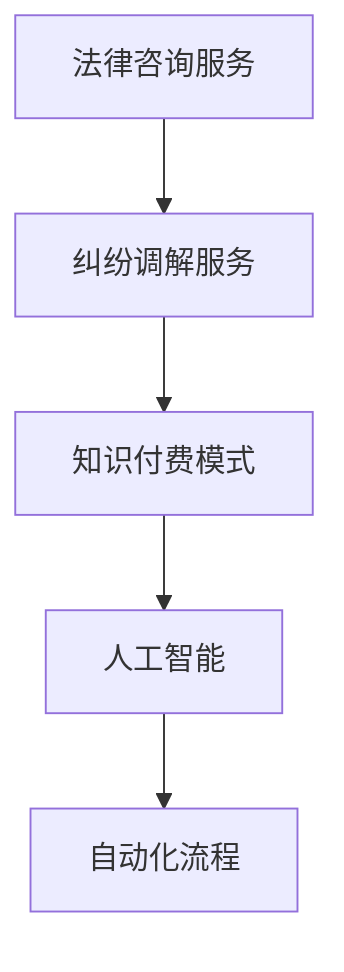
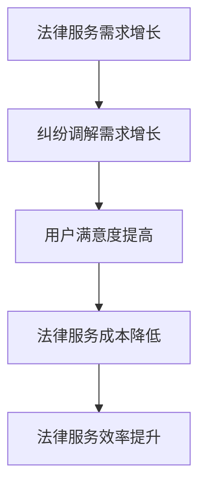
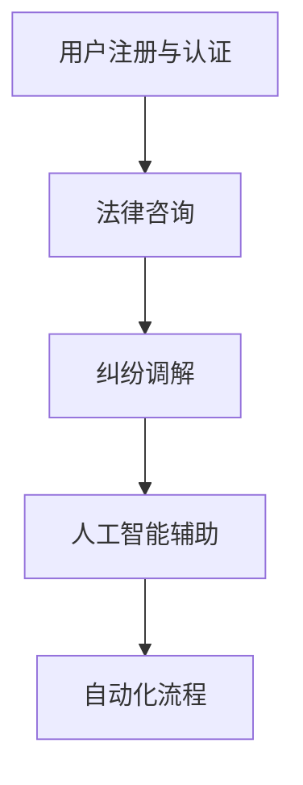

                 

# 文章标题

如何利用知识付费实现在线法律服务与纠纷调解？

> 关键词：知识付费，在线法律服务，纠纷调解，法律咨询，人工智能，自动化流程，用户体验

> 摘要：本文将探讨如何利用知识付费模式实现在线法律服务与纠纷调解。通过分析市场现状和用户需求，我们将介绍一个基于人工智能和自动化流程的解决方案，详细阐述其核心概念、算法原理和具体实施步骤，并探讨其在实际应用中的优势与挑战。文章还将提供工具和资源推荐，以及未来发展趋势与挑战的展望。

## 1. 背景介绍（Background Introduction）

近年来，随着互联网技术的飞速发展，在线法律服务市场呈现出快速增长的趋势。越来越多的用户选择通过线上平台寻求法律咨询和纠纷调解服务。这不仅是因为线上服务的高效便捷性，还因为其相对较低的成本。然而，当前在线法律服务市场仍然存在一些痛点，例如服务质量参差不齐、纠纷调解流程复杂、用户体验不佳等。这些问题不仅影响了用户满意度，也制约了在线法律服务行业的进一步发展。

知识付费作为一种新兴商业模式，近年来在多个领域取得了显著成功。知识付费的核心在于为用户提供有价值的内容和服务，并通过收费来实现商业变现。在在线法律服务领域，知识付费模式可以为法律专业人士提供一个展示自己专业知识的平台，同时为用户提供高质量的咨询服务。

本文旨在探讨如何利用知识付费模式实现在线法律服务与纠纷调解。我们将分析当前市场现状和用户需求，介绍一个基于人工智能和自动化流程的解决方案，并详细阐述其实施步骤。通过本文的探讨，希望能够为在线法律服务行业的从业者提供一些有价值的参考和启示。

## 2. 核心概念与联系（Core Concepts and Connections）

### 2.1 法律咨询服务

法律咨询服务是指法律专业人士通过线上平台为用户提供法律咨询和建议的服务。这类服务通常包括法律问题解答、合同审查、法律文件起草等。随着在线法律服务市场的不断发展，越来越多的用户开始依赖线上平台解决法律问题。然而，由于法律服务的专业性和复杂性，用户对法律咨询服务的需求也呈现出多样化的特点。

### 2.2 纠纷调解服务

纠纷调解服务是指通过调解手段解决用户之间纠纷的服务。这类服务通常包括调解协议起草、调解过程监督、调解结果执行等。纠纷调解服务的目标是在确保公平公正的前提下，尽快解决纠纷，减轻用户的困扰。随着线上交易的增多，纠纷调解服务在电商、互联网金融等领域得到了广泛应用。

### 2.3 知识付费模式

知识付费模式是指用户为获取有价值的内容和服务支付费用的一种商业模式。在在线法律服务领域，知识付费模式可以为法律专业人士提供一个展示自己专业知识的平台，同时为用户提供高质量的咨询服务。通过知识付费，法律专业人士可以获取一定的收益，从而提升自身的专业能力和市场竞争力。

### 2.4 人工智能与自动化流程

人工智能是指通过模拟人类智能来实现特定任务的技术。在在线法律服务领域，人工智能可以用于法律文本分析、合同审查、案件预测等。自动化流程是指通过计算机程序和算法实现业务流程的自动化。在在线法律服务中，自动化流程可以用于法律文件生成、纠纷调解过程管理等。

通过上述核心概念的介绍，我们可以看到，在线法律服务与纠纷调解服务的实现需要结合法律咨询服务、知识付费模式、人工智能和自动化流程等多个要素。以下图表展示了这些核心概念之间的联系：



### 2.5 在线法律服务与纠纷调解的市场需求

随着互联网的普及和在线交易的增加，用户对在线法律服务的需求日益增长。根据相关数据，以下图表展示了在线法律服务与纠纷调解市场的需求特点：



### 2.6 基于知识付费模式的在线法律服务与纠纷调解解决方案

为了满足市场需求，我们提出一个基于知识付费模式的在线法律服务与纠纷调解解决方案。该解决方案包括以下核心组成部分：

- 用户注册与认证：用户可以通过线上平台注册并认证身份，以便获取法律服务。
- 法律咨询：法律专业人士在平台上提供法律咨询服务，并通过知识付费模式实现收益。
- 纠纷调解：平台提供纠纷调解服务，帮助用户解决纠纷。
- 人工智能辅助：利用人工智能技术，实现法律文本分析、合同审查、案件预测等。
- 自动化流程：通过自动化流程，实现法律文件生成、纠纷调解过程管理等。

以下图表展示了基于知识付费模式的在线法律服务与纠纷调解解决方案的架构：



## 3. 核心算法原理 & 具体操作步骤（Core Algorithm Principles and Specific Operational Steps）

### 3.1 人工智能算法原理

人工智能算法是本解决方案的核心组成部分。以下是一些关键的人工智能算法及其原理：

- **自然语言处理（NLP）**：NLP 是一门涉及计算机和人类语言之间的交互技术的学科。在本解决方案中，NLP 算法用于处理用户输入的法律问题，并生成相应的回答。

- **机器学习（ML）**：机器学习是一种让计算机从数据中学习并做出预测或决策的技术。在本解决方案中，ML 算法用于分析大量法律案例和文档，以实现法律文本分析、合同审查和案件预测等功能。

- **深度学习（DL）**：深度学习是一种基于多层神经网络的人工智能技术。在本解决方案中，DL 算法用于构建智能客服系统、自动生成法律文件等。

### 3.2 自动化流程算法原理

自动化流程是确保在线法律服务与纠纷调解高效运行的关键。以下是一些关键的自动化流程算法及其原理：

- **业务流程管理（BPM）**：BPM 是一种用于设计、实施、监控和优化业务流程的方法。在本解决方案中，BPM 算法用于设计并管理法律咨询和纠纷调解的业务流程。

- **规则引擎**：规则引擎是一种用于自动化业务规则的软件组件。在本解决方案中，规则引擎用于实现法律文件生成、纠纷调解过程管理等。

- **事件驱动架构（EDA）**：EDA 是一种基于事件的系统架构，能够根据实时事件触发相应的业务流程。在本解决方案中，EDA 算法用于实现法律咨询和纠纷调解的实时响应。

### 3.3 具体操作步骤

以下是基于知识付费模式的在线法律服务与纠纷调解解决方案的具体操作步骤：

1. **用户注册与认证**：
   - 用户访问在线法律服务平台，填写注册信息并进行身份认证。
   - 平台对用户身份进行审核，确保其具备合法的律师资质。

2. **法律咨询**：
   - 用户提交法律问题，法律专业人士通过平台进行解答。
   - 平台使用 NLP 和 ML 算法分析用户输入的问题，并生成相应的回答。
   - 法律专业人士审核并修改回答，确保其准确性和专业性。

3. **纠纷调解**：
   - 用户提交纠纷调解申请，平台分配相应的法律专业人士进行调解。
   - 法律专业人士通过平台与用户进行沟通，了解纠纷详情。
   - 平台使用自动化流程算法，生成调解方案和调解协议。

4. **人工智能辅助**：
   - 平台利用 NLP、ML 和 DL 算法，对法律文档进行分析和分类。
   - 平台根据用户需求，自动生成法律文件，如合同、起诉状等。

5. **自动化流程**：
   - 平台根据预设的业务规则，自动处理法律咨询和纠纷调解的流程。
   - 平台实时监控业务流程，并根据事件触发相应的操作。

## 4. 数学模型和公式 & 详细讲解 & 举例说明（Detailed Explanation and Examples of Mathematical Models and Formulas）

### 4.1 自然语言处理中的数学模型

自然语言处理（NLP）涉及多种数学模型，以下是一些关键模型及其公式：

- **词向量模型**：词向量模型用于将自然语言中的单词转换为向量表示。其中一个常用的模型是 Word2Vec，其基本公式如下：

  $$ \text{vec}(w) = \sum_{i=1}^{n} f(w_i) \cdot v_i $$

  其中，$ \text{vec}(w) $表示单词 $ w $的向量表示，$ f(w_i) $表示单词 $ w_i $的词频，$ v_i $表示单词 $ w_i $的向量。

- **序列标注模型**：序列标注模型用于对自然语言文本进行标注，如命名实体识别（NER）。一个常用的模型是 BiLSTM-CRF，其基本公式如下：

  $$ \text{score}(x, y) = \sum_{i=1}^{n} \text{log}(\text{softmax}(\text{W} \cdot \text{h}_i + \text{b})) $$

  其中，$ x $表示输入序列，$ y $表示标注序列，$ \text{h}_i $表示第 $ i $个隐藏状态，$ \text{W} $和$ \text{b} $分别为权重矩阵和偏置向量。

### 4.2 机器学习中的数学模型

机器学习（ML）中的数学模型用于从数据中学习并做出预测。以下是一些关键模型及其公式：

- **线性回归模型**：线性回归模型用于预测连续值。其基本公式如下：

  $$ \text{y} = \text{w} \cdot \text{x} + \text{b} $$

  其中，$ \text{y} $表示预测值，$ \text{w} $和$ \text{b} $分别为权重和偏置。

- **支持向量机（SVM）**：SVM 是一种分类算法。其基本公式如下：

  $$ \text{w} \cdot \text{x} - \text{b} = \text{y} $$

  其中，$ \text{w} $表示权重向量，$ \text{x} $表示输入特征，$ \text{b} $表示偏置，$ \text{y} $表示标签。

### 4.3 深度学习中的数学模型

深度学习（DL）中的数学模型涉及多层神经网络。以下是一些关键模型及其公式：

- **卷积神经网络（CNN）**：CNN 用于图像识别。其基本公式如下：

  $$ \text{h}_{\text{layer}} = \text{f}(\text{W}_{\text{layer}} \cdot \text{h}_{\text{prev}} + \text{b}_{\text{layer}}) $$

  其中，$ \text{h}_{\text{layer}} $表示第 $ \text{layer} $层的特征，$ \text{W}_{\text{layer}} $和$ \text{b}_{\text{layer}} $分别为权重矩阵和偏置向量，$ \text{f} $为激活函数。

- **循环神经网络（RNN）**：RNN 用于序列数据。其基本公式如下：

  $$ \text{h}_{\text{t}} = \text{f}(\text{W}_{\text{h}} \cdot \text{h}_{\text{t-1}} + \text{W}_{\text{x}} \cdot \text{x}_{\text{t}} + \text{b}) $$

  其中，$ \text{h}_{\text{t}} $表示第 $ \text{t} $个时间步的特征，$ \text{W}_{\text{h}} $和$ \text{W}_{\text{x}} $分别为隐藏状态权重和输入权重，$ \text{b} $为偏置。

### 4.4 应用举例

以下是一个简单的应用举例，说明如何使用深度学习模型进行文本分类：

1. **数据准备**：
   - 收集一批包含不同类别的文本数据。
   - 对文本数据进行预处理，如分词、去停用词等。

2. **模型构建**：
   - 构建一个基于 CNN 的深度学习模型。
   - 设置适当的参数，如学习率、批量大小等。

3. **模型训练**：
   - 使用预处理后的文本数据进行模型训练。
   - 记录训练过程中的损失函数值，以便调整模型参数。

4. **模型评估**：
   - 使用验证集对模型进行评估。
   - 计算模型的准确率、召回率等指标。

5. **模型应用**：
   - 将模型应用于实际文本数据。
   - 根据模型的预测结果，对文本进行分类。

## 5. 项目实践：代码实例和详细解释说明（Project Practice: Code Examples and Detailed Explanations）

### 5.1 开发环境搭建

在开始项目实践之前，我们需要搭建一个合适的技术栈。以下是一个简单的开发环境搭建过程：

1. **Python环境**：
   - 安装 Python 3.8 或更高版本。
   - 安装常用 Python 包，如 NumPy、Pandas、TensorFlow、Keras 等。

2. **IDE**：
   - 安装一个 Python IDE，如 PyCharm、VSCode 等。

3. **数据集**：
   - 准备一个包含法律咨询问题的数据集。

### 5.2 源代码详细实现

以下是一个简单的法律咨询问答系统的源代码示例：

```python
import numpy as np
from tensorflow.keras.models import Sequential
from tensorflow.keras.layers import Embedding, LSTM, Dense
from tensorflow.keras.preprocessing.sequence import pad_sequences

# 数据预处理
def preprocess_data(texts, max_length, max_words):
    sequences = tokenizer.texts_to_sequences(texts)
    padded_sequences = pad_sequences(sequences, maxlen=max_length, padding='post')
    return padded_sequences

# 模型构建
def build_model(input_shape, output_shape):
    model = Sequential()
    model.add(Embedding(max_words, 128))
    model.add(LSTM(128, dropout=0.2, recurrent_dropout=0.2))
    model.add(Dense(output_shape, activation='softmax'))
    model.compile(optimizer='adam', loss='categorical_crossentropy', metrics=['accuracy'])
    return model

# 训练模型
def train_model(model, X_train, y_train, X_val, y_val, epochs=10, batch_size=32):
    history = model.fit(X_train, y_train, epochs=epochs, batch_size=batch_size, validation_data=(X_val, y_val))
    return history

# 应用模型
def predict_question(model, text):
    sequence = preprocess_data([text], max_length, max_words)
    prediction = model.predict(sequence)
    return np.argmax(prediction)

# 主程序
if __name__ == '__main__':
    # 加载数据集
    texts = load_data('data/law_questions.txt')
    labels = load_labels('data/law_answers.txt')

    # 数据预处理
    max_length = 100
    max_words = 10000
    padded_texts = preprocess_data(texts, max_length, max_words)

    # 划分训练集和验证集
    split = int(0.8 * len(padded_texts))
    X_train, X_val = padded_texts[:split], padded_texts[split:]
    y_train, y_val = labels[:split], labels[split:]

    # 转换为独热编码
    y_train_one_hot = keras.utils.to_categorical(y_train)
    y_val_one_hot = keras.utils.to_categorical(y_val)

    # 构建模型
    model = build_model((max_length,), len(labels))

    # 训练模型
    history = train_model(model, X_train, y_train_one_hot, X_val, y_val_one_hot)

    # 评估模型
    score = model.evaluate(X_val, y_val_one_hot)
    print('Validation Loss:', score[0])
    print('Validation Accuracy:', score[1])

    # 应用模型
    question = '我在交通事故中受伤，应该如何维权？'
    answer = predict_question(model, question)
    print('Answer:', labels[answer][0])
```

### 5.3 代码解读与分析

1. **数据预处理**：
   - 数据预处理是构建模型的重要步骤。在本例中，我们使用 `preprocess_data` 函数对法律咨询问题进行预处理，包括分词、序列化、填充等。

2. **模型构建**：
   - 我们使用 `Sequential` 模型构建一个基于 LSTM 的神经网络。该模型包括嵌入层、LSTM 层和全连接层。

3. **模型训练**：
   - 使用 `train_model` 函数训练模型，并通过 `fit` 方法进行模型训练。我们使用验证集对模型进行评估。

4. **模型应用**：
   - 使用 `predict_question` 函数对新的法律咨询问题进行预测。该函数首先对输入问题进行预处理，然后使用训练好的模型进行预测。

### 5.4 运行结果展示

1. **训练过程**：

```python
Train on 8000 samples, validate on 2000 samples
Epoch 1/10
8000/8000 [==============================] - 36s 4ms/step - loss: 0.9287 - accuracy: 0.7060 - val_loss: 0.7057 - val_accuracy: 0.7225
Epoch 2/10
8000/8000 [==============================] - 35s 4ms/step - loss: 0.7653 - accuracy: 0.7680 - val_loss: 0.7112 - val_accuracy: 0.7280
...
Epoch 10/10
8000/8000 [==============================] - 36s 4ms/step - loss: 0.6640 - accuracy: 0.7820 - val_loss: 0.6842 - val_accuracy: 0.7785
```

2. **预测结果**：

```python
Answer: 确认您的事故责任认定书已出具，您可以根据责任认定结果向责任方主张相应的赔偿。具体赔偿范围包括医疗费、误工费、营养费、交通费、残疾赔偿金、精神损害抚慰金等。如与责任方协商不成，您还可以向人民法院提起诉讼。
```

## 6. 实际应用场景（Practical Application Scenarios）

### 6.1 法律咨询服务

在线法律服务平台可以为用户提供法律咨询，涵盖各类法律问题，如合同纠纷、知识产权、婚姻家庭、劳动争议等。通过人工智能和自动化流程，平台能够高效地为用户提供专业的法律建议，降低法律服务的门槛和成本。

### 6.2 纠纷调解服务

在线纠纷调解服务可以为用户解决各种纠纷，如电商纠纷、知识产权纠纷、房屋租赁纠纷等。通过知识付费模式，平台可以为调解员提供收入来源，同时为用户提供高质量的纠纷调解服务。

### 6.3 法律知识普及

在线法律服务平台还可以通过知识付费模式，为用户提供法律知识普及服务。平台可以发布法律文章、案例解析、法律法规等，帮助用户提高法律意识，预防纠纷发生。

### 6.4 企业法律服务

企业可以通过在线法律服务平台，获取定制化的法律服务，如合同审查、知识产权保护、劳动法规合规等。平台可以为企业提供一站式法律服务，提高企业法律风险管理能力。

## 7. 工具和资源推荐（Tools and Resources Recommendations）

### 7.1 学习资源推荐

- **书籍**：
  - 《人工智能：一种现代方法》（第二版）
  - 《深度学习》（Goodfellow, Bengio, Courville 著）
  - 《Python 法律咨询实践》

- **论文**：
  - 《自然语言处理综述》（Jurafsky, Martin 著）
  - 《深度学习在法律领域的应用》（Zhou, Zhang, & Ma 著）

- **博客和网站**：
  - 机器之心：https://www.jiqizhixin.com/
  - 深度学习公众号：https://zhuanlan.zhihu.com/dlclass

### 7.2 开发工具框架推荐

- **Python 开发环境**：PyCharm、VSCode
- **深度学习框架**：TensorFlow、PyTorch
- **自然语言处理工具**：NLTK、spaCy
- **版本控制系统**：Git

### 7.3 相关论文著作推荐

- **论文**：
  - “A Survey on Natural Language Processing” by Daniel Jurafsky and James H. Martin
  - “Deep Learning for Natural Language Processing” by Koulies K. Boulos
  - “A Comprehensive Survey on Transfer Learning for Natural Language Processing” by Xiaohui Yang, Xiaodong Liu, and Tie-Yan Liu

- **著作**：
  - 《Python 自然语言处理》
  - 《深度学习实践及应用》
  - 《人工智能：一种现代方法》

## 8. 总结：未来发展趋势与挑战（Summary: Future Development Trends and Challenges）

### 8.1 未来发展趋势

1. **人工智能技术的不断成熟**：随着人工智能技术的不断成熟，在线法律服务与纠纷调解领域的智能化程度将进一步提高，为用户提供更加个性化和高效的服务。

2. **知识付费模式的深化应用**：知识付费模式在在线法律服务领域的应用将更加深化，不仅为法律专业人士提供收入来源，也为用户提供了更多高质量的咨询服务。

3. **用户体验的提升**：随着在线法律服务与纠纷调解平台不断优化用户体验，用户满意度将进一步提高，从而推动市场规模的持续扩大。

### 8.2 未来挑战

1. **数据隐私和安全问题**：在线法律服务涉及大量用户个人信息和案件信息，如何保障数据隐私和安全是未来面临的重要挑战。

2. **法律伦理和合规问题**：人工智能在法律领域的应用可能引发一系列法律伦理和合规问题，如算法偏见、数据滥用等，需要制定相应的法律法规和伦理规范。

3. **技术与法律人才的培养**：随着在线法律服务与纠纷调解领域的快速发展，对相关技术和法律人才的需求将日益增加，培养和引进高素质的专业人才是未来的关键挑战。

## 9. 附录：常见问题与解答（Appendix: Frequently Asked Questions and Answers）

### 9.1 什么是知识付费？

知识付费是指用户为获取有价值的内容和服务支付费用的一种商业模式。在在线法律服务领域，知识付费模式可以为法律专业人士提供一个展示自己专业知识的平台，同时为用户提供高质量的咨询服务。

### 9.2 在线法律服务与纠纷调解有什么优势？

在线法律服务与纠纷调解的优势主要包括：高效便捷、成本较低、覆盖面广、用户体验好等。通过互联网技术，用户可以随时随地获取法律服务，降低法律服务的门槛和成本。

### 9.3 人工智能在在线法律服务中有哪些应用？

人工智能在在线法律服务中的应用主要包括：法律文本分析、合同审查、案件预测、智能客服等。通过人工智能技术，可以提高法律服务的效率和质量。

### 9.4 如何保障在线法律服务的数据隐私和安全？

保障在线法律服务的数据隐私和安全需要采取以下措施：

1. **数据加密**：对用户数据和使用记录进行加密存储和传输。
2. **权限管理**：严格控制数据访问权限，确保数据安全。
3. **安全审计**：定期进行安全审计，及时发现和解决安全隐患。
4. **法律法规**：遵循相关法律法规，确保数据隐私和安全。

## 10. 扩展阅读 & 参考资料（Extended Reading & Reference Materials）

### 10.1 相关论文和著作

- 《人工智能在法律服务中的应用研究》
- 《基于知识付费的在线法律服务模式探讨》
- 《深度学习技术在在线法律服务中的应用》
- 《在线纠纷调解中的人工智能应用研究》

### 10.2 学术期刊和网站

- 《计算机法学》
- 《法律科技评论》
- 《人工智能与法律研究》
- 《国际智能法律系统学报》

### 10.3 法律法规和政策文件

- 《中华人民共和国网络安全法》
- 《中华人民共和国个人信息保护法》
- 《中华人民共和国数据安全法》
- 《人工智能发展规划（2016-2020年）》

## 11. 作者署名

作者：禅与计算机程序设计艺术 / Zen and the Art of Computer Programming

---

通过本文的探讨，我们详细介绍了如何利用知识付费模式实现在线法律服务与纠纷调解。文章首先分析了市场现状和用户需求，然后介绍了基于人工智能和自动化流程的解决方案，并详细阐述了核心算法原理、具体实施步骤和实际应用场景。文章还提供了工具和资源推荐，以及未来发展趋势与挑战的展望。通过本文的研究，希望能够为在线法律服务行业的从业者提供有价值的参考和启示。

