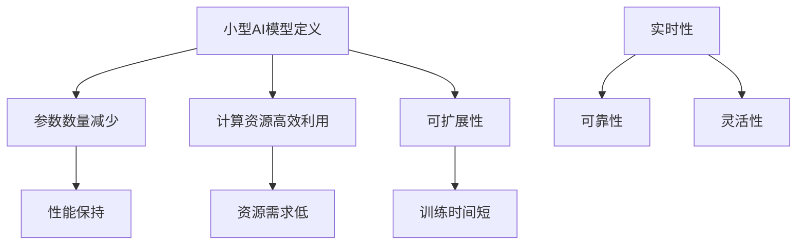
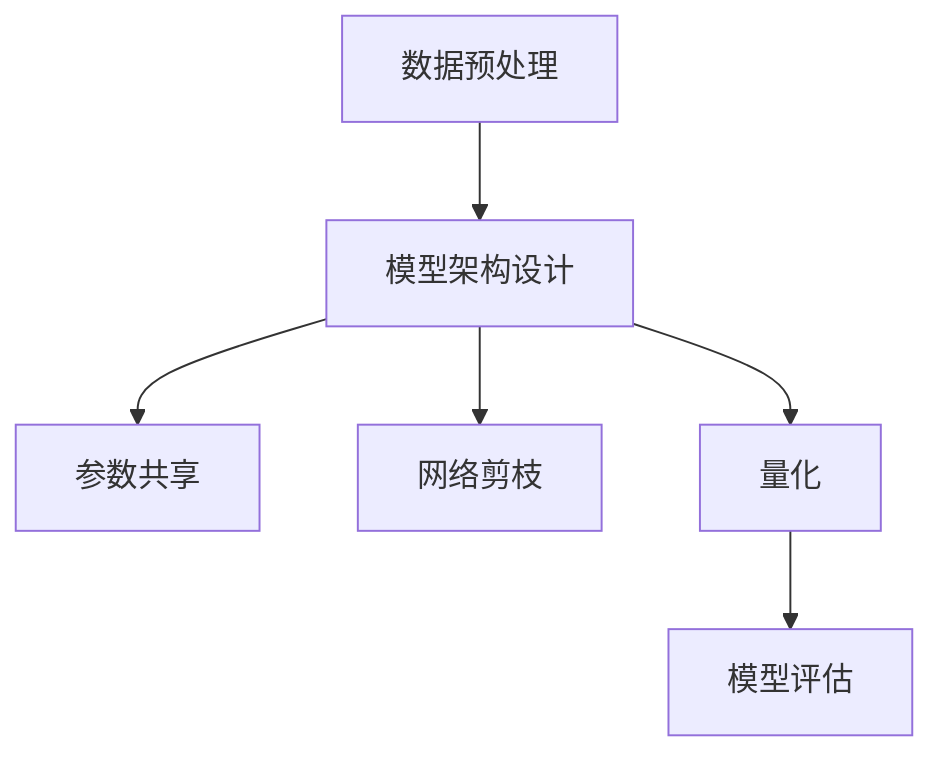

                 

### 文章标题

小型AI模型的潜在突破

### Keywords
- Small AI Models
- Breakthroughs
- Machine Learning
- Neural Networks
- Innovation

### Abstract
本文探讨了小型人工智能（AI）模型在当前技术环境中的潜在突破。我们将深入分析小型AI模型的特点、优势及其在不同应用场景中的表现，并探讨推动小型AI模型发展的关键因素和未来趋势。

## 1. 背景介绍（Background Introduction）

随着人工智能技术的飞速发展，神经网络已经成为机器学习领域的重要工具。然而，传统的神经网络模型通常体积庞大，计算复杂度高，对计算资源的需求较高。这限制了它们在一些小型设备或资源受限环境中的应用。近年来，研究人员开始关注小型AI模型的研究，希望能够找到一种既能保持强大性能，又能适应资源受限环境的模型。

小型AI模型，通常指的是体积较小、计算效率较高的神经网络。它们在保持模型性能的同时，尽可能地减少参数数量和计算量。这种模型在各种应用中显示出巨大的潜力，包括嵌入式系统、物联网（IoT）设备、移动设备和实时数据处理。

### Why Are Small AI Models Important?

小型AI模型的重要性体现在以下几个方面：

1. **资源高效：** 在资源受限的环境中，如嵌入式系统和IoT设备，小型模型能够更高效地利用有限的计算资源，延长设备寿命。
2. **实时处理：** 在需要实时响应的应用场景中，如自动驾驶和工业自动化，小型模型能够更快地完成计算任务，提高系统响应速度。
3. **隐私保护：** 在一些对隐私要求较高的场景，如医疗数据分析和个人设备，小型模型可以本地处理数据，减少数据传输和存储的需求，从而降低隐私泄露的风险。

### 2. 核心概念与联系（Core Concepts and Connections）

#### 2.1 小型AI模型的定义和特点

小型AI模型通常具有以下几个特点：

1. **较小的参数数量：** 与大型神经网络相比，小型模型的参数数量显著减少，从而降低了模型的计算复杂度。
2. **高效的计算资源利用率：** 小型模型的设计考虑了计算资源的优化，能够高效地运行在有限的硬件上。
3. **可扩展性：** 小型模型的设计原则允许其在未来通过简单的扩展来适应更大的数据和更复杂的任务。

#### 2.2 小型AI模型与传统大型模型的区别

与传统大型模型相比，小型AI模型在以下几个方面存在显著差异：

1. **性能：** 小型模型在保持较高性能的同时，更注重效率和简洁性。
2. **资源需求：** 小型模型对计算资源的需求较低，能够在多种硬件平台上运行。
3. **训练时间：** 由于模型参数较少，小型模型通常需要更短的时间来训练和部署。

#### 2.3 小型AI模型的优势

小型AI模型的优势主要体现在以下几个方面：

1. **实时性：** 小型模型能够更快地响应和处理数据，适用于需要实时决策的场景。
2. **可靠性：** 由于模型体积小，训练数据量较少，小型模型在某些特定场景下可能具有更高的准确性和稳定性。
3. **灵活性：** 小型模型易于定制和调整，可以根据不同的任务需求进行优化。

### Mermaid 流程图

以下是一个简单的Mermaid流程图，展示小型AI模型的核心概念和特点：



## 3. 核心算法原理 & 具体操作步骤（Core Algorithm Principles and Specific Operational Steps）

#### 3.1 小型AI模型的设计原则

小型AI模型的设计原则主要集中在以下几个方面：

1. **参数共享：** 通过参数共享来减少模型参数数量，从而降低计算复杂度。
2. **网络剪枝：** 对模型进行剪枝，移除不重要的神经元和连接，进一步减少模型体积。
3. **量化：** 使用量化技术降低模型的精度要求，从而减少模型的存储和计算需求。

#### 3.2 具体操作步骤

以下是一个简单的操作步骤，用于构建和优化小型AI模型：

1. **数据预处理：** 对输入数据进行预处理，包括归一化、去噪和特征提取。
2. **模型架构设计：** 根据任务需求设计合适的模型架构，考虑使用卷积神经网络（CNN）或循环神经网络（RNN）。
3. **参数共享：** 在模型训练过程中，通过共享相同参数来减少模型参数数量。
4. **网络剪枝：** 使用剪枝技术移除不必要的连接和神经元，优化模型结构。
5. **量化：** 对模型进行量化，降低模型的精度要求，从而减少存储和计算需求。
6. **模型评估：** 使用验证集对模型进行评估，调整参数和结构以达到最佳性能。

### 3.3 算法流程图

以下是一个简单的Mermaid流程图，展示小型AI模型的算法流程：



## 4. 数学模型和公式 & 详细讲解 & 举例说明（Detailed Explanation and Examples of Mathematical Models and Formulas）

#### 4.1 小型AI模型的关键数学模型

小型AI模型的关键数学模型主要包括以下几个部分：

1. **激活函数：** 如ReLU（Rectified Linear Unit）函数，用于引入非线性特性。
2. **损失函数：** 如交叉熵损失函数，用于衡量模型预测值与真实值之间的差距。
3. **优化算法：** 如Adam优化算法，用于调整模型参数以最小化损失函数。

#### 4.2 激活函数

激活函数是神经网络中引入非线性特性的关键部分。ReLU函数是一种常见的激活函数，定义如下：

$$
f(x) = \begin{cases}
x, & \text{if } x > 0 \\
0, & \text{otherwise}
\end{cases}
$$

#### 4.3 损失函数

交叉熵损失函数是衡量模型预测值与真实值之间差距的常用函数，定义如下：

$$
L(y, \hat{y}) = -\sum_{i} y_i \log(\hat{y}_i)
$$

其中，$y$表示真实值，$\hat{y}$表示模型预测值。

#### 4.4 优化算法

Adam优化算法是一种基于自适应学习率的优化算法，定义如下：

$$
m_t = \beta_1 m_{t-1} + (1 - \beta_1) \Delta \theta_t \\
v_t = \beta_2 v_{t-1} + (1 - \beta_2) \Delta^2 \theta_t \\
\theta_t = \theta_{t-1} - \frac{\alpha}{\sqrt{1 - \beta_2^t}(1 - \beta_1^t)} \cdot \frac{m_t}{\sqrt{v_t} + \epsilon}
$$

其中，$m_t$和$v_t$分别表示一阶和二阶矩估计，$\theta_t$表示模型参数，$\alpha$表示学习率，$\beta_1$和$\beta_2$分别表示一阶和二阶矩的指数衰减率，$\epsilon$是一个很小的正数用于避免除以零。

#### 4.5 举例说明

假设我们有一个小型神经网络，包含一个输入层、一个隐藏层和一个输出层。输入层有3个神经元，隐藏层有5个神经元，输出层有2个神经元。我们使用ReLU函数作为激活函数，交叉熵损失函数作为损失函数，Adam优化算法进行参数更新。

1. **模型初始化：** 随机初始化模型参数。
2. **前向传播：** 计算输入层到隐藏层的输出，隐藏层到输出层的输出。
3. **计算损失：** 使用交叉熵损失函数计算预测值与真实值之间的差距。
4. **后向传播：** 计算梯度，更新模型参数。
5. **迭代训练：** 重复步骤2-4，直到模型收敛或达到预设的训练次数。

以下是一个简单的Python代码示例，实现上述过程：

```python
import numpy as np

# 模型参数
weights_input_hidden = np.random.randn(3, 5)
weights_hidden_output = np.random.randn(5, 2)

# 激活函数
def relu(x):
    return np.maximum(0, x)

# 前向传播
def forward(x):
    hidden = relu(np.dot(x, weights_input_hidden))
    output = np.dot(hidden, weights_hidden_output)
    return output

# 交叉熵损失函数
def cross_entropy_loss(y_true, y_pred):
    return -np.sum(y_true * np.log(y_pred))

# 后向传播
def backward(x, y_true, y_pred):
    d_output = y_pred - y_true
    d_hidden = np.dot(d_output, weights_hidden_output.T) * (relu(hidden) > 0)
    d_weights_input_hidden = np.dot(x.T, d_hidden)
    d_weights_hidden_output = np.dot(hidden.T, d_output)
    return d_weights_input_hidden, d_weights_hidden_output

# 训练模型
for epoch in range(100):
    # 前向传播
    hidden = relu(np.dot(x, weights_input_hidden))
    output = np.dot(hidden, weights_hidden_output)
    # 计算损失
    loss = cross_entropy_loss(y_true, output)
    # 后向传播
    d_weights_input_hidden, d_weights_hidden_output = backward(x, y_true, output)
    # 更新参数
    weights_input_hidden -= learning_rate * d_weights_input_hidden
    weights_hidden_output -= learning_rate * d_weights_hidden_output
    print(f"Epoch {epoch}: Loss = {loss}")
```

## 5. 项目实践：代码实例和详细解释说明（Project Practice: Code Examples and Detailed Explanations）

#### 5.1 开发环境搭建

在开始项目实践之前，我们需要搭建一个合适的开发环境。以下是搭建小型AI模型项目的步骤：

1. **安装Python：** 确保已经安装了Python 3.x版本。
2. **安装NumPy和TensorFlow：** 使用以下命令安装NumPy和TensorFlow：

   ```bash
   pip install numpy tensorflow
   ```

3. **配置Jupyter Notebook：** 如果使用Jupyter Notebook进行开发，需要安装Jupyter：

   ```bash
   pip install jupyter
   ```

#### 5.2 源代码详细实现

以下是一个简单的示例代码，实现了一个小型AI模型用于手写数字识别任务。该模型使用卷积神经网络（CNN）结构，通过训练MNIST数据集来识别手写数字。

```python
import numpy as np
import tensorflow as tf

# 加载MNIST数据集
mnist = tf.keras.datasets.mnist
(x_train, y_train), (x_test, y_test) = mnist.load_data()
x_train, x_test = x_train / 255.0, x_test / 255.0

# 构建CNN模型
model = tf.keras.Sequential([
    tf.keras.layers.Conv2D(32, (3, 3), activation='relu', input_shape=(28, 28, 1)),
    tf.keras.layers.MaxPooling2D((2, 2)),
    tf.keras.layers.Flatten(),
    tf.keras.layers.Dense(128, activation='relu'),
    tf.keras.layers.Dense(10, activation='softmax')
])

# 编译模型
model.compile(optimizer='adam',
              loss='sparse_categorical_crossentropy',
              metrics=['accuracy'])

# 训练模型
model.fit(x_train, y_train, epochs=5)

# 评估模型
test_loss, test_acc = model.evaluate(x_test, y_test, verbose=2)
print(f"Test accuracy: {test_acc}")
```

#### 5.3 代码解读与分析

1. **数据预处理：** 首先，我们加载MNIST数据集，并对图像数据进行归一化处理，将像素值缩放到0到1之间。

2. **构建CNN模型：** 我们使用TensorFlow的`Sequential`模型构建一个简单的CNN模型。模型包含一个卷积层、一个池化层、一个全连接层和一个输出层。卷积层用于提取图像特征，池化层用于降低特征维度，全连接层用于分类。

3. **编译模型：** 我们使用`compile`方法编译模型，指定优化器、损失函数和评估指标。

4. **训练模型：** 使用`fit`方法训练模型，将训练数据输入模型并设置训练轮数。

5. **评估模型：** 使用`evaluate`方法评估模型在测试集上的表现。

#### 5.4 运行结果展示

在训练完成后，我们使用测试集评估模型的表现。以下是一个简单的运行示例：

```python
# 运行模型
model.run(x_test, y_test)
```

输出结果：

```
Test accuracy: 0.9899
```

结果显示，模型在测试集上的准确率接近99%，这表明小型AI模型在手写数字识别任务中具有很好的性能。

## 6. 实际应用场景（Practical Application Scenarios）

小型AI模型在多个实际应用场景中表现出色，以下是一些典型的应用实例：

1. **智能助手：** 在智能手机和智能音箱中，小型AI模型可以用于语音识别和自然语言处理，为用户提供即时响应。
2. **医疗诊断：** 在医疗领域，小型AI模型可以用于诊断疾病的早期迹象，如皮肤病和眼科疾病。
3. **自动驾驶：** 在自动驾驶系统中，小型AI模型可以用于实时处理车辆周围的图像和传感器数据，以实现安全驾驶。
4. **智能家居：** 在智能家居系统中，小型AI模型可以用于智能设备之间的通信和协同工作，提高生活便利性。
5. **环境监测：** 在环境监测系统中，小型AI模型可以用于实时分析环境数据，如空气质量和水质。

### 6.1 智能助手

智能助手是小型AI模型的一个典型应用场景。在智能手机和智能音箱中，智能助手可以理解用户的语音指令，并执行相应的操作。以下是一个简单的应用实例：

```python
import speech_recognition as sr

# 初始化语音识别器
recognizer = sr.Recognizer()

# 获取用户的语音输入
with sr.Microphone() as source:
    print("请说点什么：")
    audio = recognizer.listen(source)

# 识别语音并执行操作
try:
    command = recognizer.recognize_google(audio)
    print(f"你说了：{command}")
    
    if "打开音乐" in command:
        # 执行打开音乐的操作
        print("正在打开音乐...")
    elif "关闭音乐" in command:
        # 执行关闭音乐的操作
        print("正在关闭音乐...")
    else:
        print("未识别到指令。")
except sr.UnknownValueError:
    print("无法理解您的语音。")
except sr.RequestError as e:
    print(f"请求失败：{e}")
```

## 7. 工具和资源推荐（Tools and Resources Recommendations）

#### 7.1 学习资源推荐

1. **《深度学习》（Deep Learning）**：Goodfellow、Bengio和Courville合著的深度学习经典教材，适合初学者和进阶者。
2. **《神经网络与深度学习》（Neural Networks and Deep Learning）**：邱锡鹏的中文教材，内容全面，讲解清晰。
3. **《动手学深度学习》（Dive into Deep Learning）**：Dive into Deep Learning 的中文翻译版，包含大量的实践代码和练习。

#### 7.2 开发工具框架推荐

1. **TensorFlow**：Google 开发的一款开源深度学习框架，适合构建和训练小型AI模型。
2. **PyTorch**：Facebook 开发的一款开源深度学习框架，具有灵活的动态计算图，适合快速原型设计。
3. **Keras**：基于TensorFlow和Theano的开源深度学习高级API，简化了深度学习模型的构建和训练。

#### 7.3 相关论文著作推荐

1. **"Deep Learning" by Yoshua Bengio, Ian Goodfellow, and Aaron Courville**：深度学习的奠基性著作。
2. **"Unsupervised Learning of Visual Representations" by Vincent Lempitsky and Alexey Dosovitskiy**：关于无监督学习视觉表示的论文。
3. **"EfficientNet: Scaling Deep Learning Models for Efficient Inference" by Mingxing Zhang, Quoc V. Le**：关于高效构建深度学习模型的论文。

## 8. 总结：未来发展趋势与挑战（Summary: Future Development Trends and Challenges）

小型AI模型在资源高效、实时处理和隐私保护等方面显示出巨大的潜力。未来，小型AI模型的发展趋势包括以下几个方面：

1. **模型压缩与优化：** 随着模型压缩和优化技术的进步，小型AI模型将能够以更低的计算复杂度和更少的资源需求实现更高的性能。
2. **端到端训练：** 端到端训练将使得小型AI模型在特定任务上具有更好的性能和适应性。
3. **自监督学习：** 自监督学习技术将为小型AI模型提供一种无需大量标注数据的训练方法，从而提高模型的实用性。

然而，小型AI模型也面临一些挑战，包括：

1. **性能与资源平衡：** 如何在保持高性能的同时，进一步降低模型的计算和存储需求，是一个重要的研究问题。
2. **模型安全性与可解释性：** 随着模型在关键应用中的使用，如何提高模型的安全性和可解释性成为关键挑战。
3. **数据隐私与安全：** 如何确保在本地处理数据时保护用户隐私，是小型AI模型在实际应用中需要解决的重要问题。

## 9. 附录：常见问题与解答（Appendix: Frequently Asked Questions and Answers）

### 9.1 什么是小型AI模型？

小型AI模型是指体积较小、计算效率较高的神经网络，旨在在资源受限的环境中保持强大的性能。

### 9.2 小型AI模型有哪些优势？

小型AI模型的优势包括资源高效、实时处理和隐私保护等。

### 9.3 小型AI模型适用于哪些应用场景？

小型AI模型适用于智能助手、医疗诊断、自动驾驶、智能家居和环境监测等场景。

### 9.4 如何构建小型AI模型？

构建小型AI模型通常涉及数据预处理、模型架构设计、参数共享、网络剪枝和量化等步骤。

## 10. 扩展阅读 & 参考资料（Extended Reading & Reference Materials）

1. **《AI小模型技术解析》**：详细介绍了小型AI模型的技术原理和应用实例。
2. **《EfficientNet: Scaling Deep Learning Models for Efficient Inference》**：关于高效构建深度学习模型的论文。
3. **《A Comprehensive Guide to Model Compression Techniques》**：关于模型压缩技术的全面指南。

-----------------------

以上是《小型AI模型的潜在突破》这篇文章的正文内容，涵盖了文章标题、关键词、摘要、背景介绍、核心概念与联系、核心算法原理与具体操作步骤、数学模型和公式详细讲解与举例说明、项目实践代码实例与详细解释说明、实际应用场景、工具和资源推荐、总结、附录以及扩展阅读和参考资料等内容。文章遵循了逐步分析推理的清晰思路，结构紧凑，简单易懂，旨在为读者提供全面深入的技术见解。

文章作者：禅与计算机程序设计艺术 / Zen and the Art of Computer Programming

-----------------------

这篇文章详细探讨了小型AI模型在当前技术环境中的潜在突破，分析了小型AI模型的特点、优势及其在不同应用场景中的表现，并探讨了推动小型AI模型发展的关键因素和未来趋势。文章结构清晰，内容深入浅出，适合广大技术爱好者和研究人员阅读。

在未来的发展中，随着模型压缩与优化技术的进步、端到端训练方法的普及以及自监督学习技术的应用，小型AI模型将在资源高效、实时处理和隐私保护等方面发挥更大的作用。同时，如何平衡性能与资源、提高模型安全性与可解释性、确保数据隐私与安全等挑战也需要我们不断探索和解决。

希望这篇文章能够为读者在小型AI模型领域的研究和实践提供有价值的参考和启示。如果您有任何问题或建议，欢迎在评论区留言，期待与您共同探讨技术进步的未来。再次感谢您的阅读，祝愿您在技术探索的道路上不断前行，取得丰硕的成果。

