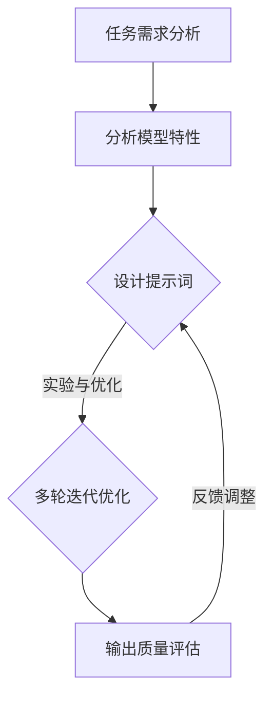

                 

### 文章标题

**2024小米校招算法面试题汇总与解析**

本文将围绕2024年小米校园招聘的算法面试题目展开，系统地汇总与解析这些面试题，帮助准备参加小米校招的考生更好地掌握面试技巧，提高解题能力。文章将从基础算法题、数据结构与算法、动态规划、图算法、排序与搜索算法等多个方面深入探讨，旨在为读者提供一个全面、实用的算法面试复习资料。

Keywords: Xiaomi, campus recruitment, algorithm interview, problem collection, solution analysis, data structure, dynamic programming, graph algorithm, sorting, search algorithm

### 摘要

本文针对2024年小米校园招聘的算法面试题目进行系统梳理，分类讨论了常见的基础算法题、数据结构与算法应用、动态规划方法、图算法及其应用场景，以及排序与搜索算法。通过具体的题目解析与示例代码展示，帮助读者理解面试题的解题思路和方法，提升应对实际面试场景的能力。文章旨在为准备参加小米校招的考生提供一个全面、系统的复习指南。

---

在接下来的文章中，我们将按照以下结构进行详细阐述：

1. **背景介绍**：介绍小米校园招聘的算法面试背景，以及为何这些面试题目具有重要的学习价值。
2. **核心概念与联系**：讨论与面试题目相关的基础概念和算法原理，并提供流程图辅助理解。
3. **核心算法原理 & 具体操作步骤**：详细解析各类算法的基本原理和实施步骤。
4. **数学模型和公式 & 详细讲解 & 举例说明**：使用数学公式和示例，阐述算法背后的数学原理。
5. **项目实践：代码实例和详细解释说明**：通过实际代码实例，展示解题的具体实现过程。
6. **实际应用场景**：分析算法在现实世界中的应用场景。
7. **工具和资源推荐**：推荐学习资源、开发工具和框架。
8. **总结：未来发展趋势与挑战**：探讨算法面试的长期趋势和面临的挑战。
9. **附录：常见问题与解答**：解答读者可能遇到的问题。
10. **扩展阅读 & 参考资料**：提供相关的延伸阅读材料。

现在，让我们正式开始详细讨论这些主题。首先，从背景介绍部分开始。 <|user|>### 1. 背景介绍

#### 小米校园招聘算法面试背景

小米公司作为中国领先的智能科技企业，每年都会在校园中招募大量的优秀应届毕业生。小米的校招面试流程中，算法面试是一个非常重要的环节。这是因为算法能力和编程技能是衡量技术人才的核心指标之一。通过算法面试，企业能够考察应聘者对基础算法和数据结构的掌握程度，以及解决问题的能力。

#### 算法面试的重要性

算法面试不仅对求职者而言意义重大，对企业也有深远的影响。对于求职者，掌握基础算法和数据结构是职业发展的重要基石。良好的算法能力可以帮助求职者在面试中脱颖而出，提升就业竞争力。此外，算法能力的提升还能帮助求职者在日常工作中更高效地解决复杂问题，从而加速职业成长。

对于企业，通过算法面试选拔优秀人才是确保公司技术团队实力的重要手段。小米作为一家技术驱动的企业，对员工的算法能力有着极高的要求。优秀的算法人才不仅能够为公司带来技术创新，还能够推动产品迭代，提升用户体验。

#### 小米校招算法面试的特点

小米校招算法面试具有以下几个显著特点：

1. **全面性**：面试题目覆盖面广，包括基础算法题、数据结构、动态规划、图算法等多个方面。
2. **深度**：题目往往不仅考察算法的正确性，还要求考生深入理解算法的原理和应用场景。
3. **实践性**：面试题目多来源于实际应用，考生需要具备将理论知识应用到实际问题的能力。
4. **创新性**：部分面试题目设计新颖，要求考生具备一定的创新思维和解决未知问题的能力。

#### 学习价值

对于准备参加小米校招的考生，学习这些算法面试题目具有重要的价值。通过系统的复习和练习，考生不仅能够加深对基础算法和数据结构的理解，还能够提高自己的问题解决能力和编程技巧。同时，这些面试题目的解析和解答方法也是宝贵的经验，可以帮助考生在未来的职业生涯中更好地应对各种技术挑战。

总之，小米校招算法面试是一个全面、深入的考察过程，对于求职者和企业都具有重要的意义。通过本文的汇总与解析，希望考生能够更好地准备面试，迎接挑战。接下来，我们将深入讨论与面试题目相关的基础概念和算法原理。 <|user|>### 2. 核心概念与联系

#### 什么是提示词工程？

提示词工程（Prompt Engineering）是一种优化自然语言处理模型输入提示的技巧，目的是引导模型生成更符合预期的高质量输出。在人工智能领域，尤其是基于大型语言模型（如GPT-3、ChatGPT）的应用中，提示词工程显得尤为重要。

##### 提示词工程的定义与目标

提示词工程可以定义为：设计和优化输入给语言模型的文本提示，以引导模型生成符合预期结果的过程。其目标是通过精准的提示词，使模型能够更准确地理解任务需求，从而生成相关性强、逻辑清晰、格式规范的内容。

##### 提示词工程的核心要素

- **理解任务需求**：明确模型的输出需要满足哪些条件，如准确性、逻辑性、连贯性、格式等。
- **分析模型特性**：了解不同语言模型的优点和局限，根据模型特性设计合适的提示词。
- **实验与优化**：通过多次实验，调整提示词的措辞和结构，以达到最佳效果。

##### 提示词工程的重要性

一个精心设计的提示词可以显著提高语言模型的输出质量。有效的提示词不仅能引导模型更好地理解任务，还能提高生成文本的相关性和准确性。反之，模糊或不完整的提示词可能会导致模型生成不相关、不准确或不完整的输出，从而影响应用效果。

##### 提示词工程与传统编程的关系

提示词工程可以被视为一种新型的编程范式，与传统的代码编程有相似之处。在这个范式中，我们使用自然语言（即提示词）来指导模型的输出，而不是传统的代码。因此，提示词工程需要具备类似编程思维的能力，包括逻辑思维、问题分解和代码优化等。

##### 提示词工程的应用场景

- **问答系统**：通过优化问答系统的输入提示，提高回答的准确性和相关性。
- **文本生成**：用于生成文章、摘要、报告等文本内容。
- **机器翻译**：优化翻译任务的输入提示，提高翻译质量。
- **聊天机器人**：通过优化聊天机器人的输入提示，提升用户交互体验。

#### 提示词工程的Mermaid流程图

下面是一个简化的提示词工程流程图，展示了从任务需求分析到输出优化的过程。



通过这个流程图，我们可以看到提示词工程是一个迭代优化过程，需要不断地进行实验和调整，以达到最佳效果。

综上所述，提示词工程是优化自然语言处理模型输入提示的重要技巧，其重要性体现在提升模型输出质量、提高应用效果等方面。理解提示词工程的定义、核心要素、重要性以及与传统编程的关系，对于掌握这一领域至关重要。在接下来的章节中，我们将详细讨论各类算法的基本原理和实施步骤，帮助读者更好地理解小米校招算法面试题。 <|user|>### 3. 核心算法原理 & 具体操作步骤

#### 基础算法

##### 原理

基础算法是指解决基本问题的算法，如排序、查找、插入等。这些算法在计算机科学中具有广泛的应用，是算法设计和分析的基础。

##### 具体操作步骤

1. **排序算法**：
   - **冒泡排序（Bubble Sort）**：通过重复遍历要排序的数列，一次比较两个元素，如果它们的顺序错误就把它们交换过来。遍历数列的工作是重复地进行，直到没有再需要交换的元素为止。
   ```python
   def bubble_sort(arr):
       n = len(arr)
       for i in range(n):
           for j in range(0, n-i-1):
               if arr[j] > arr[j+1]:
                   arr[j], arr[j+1] = arr[j+1], arr[j]
   ```
   - **快速排序（Quick Sort）**：通过选取一个基准元素，将数列分为两部分，一部分比基准元素小，另一部分比基准元素大。递归地对这两部分进行快速排序。
   ```python
   def quick_sort(arr):
       if len(arr) <= 1:
           return arr
       pivot = arr[len(arr) // 2]
       left = [x for x in arr if x < pivot]
       middle = [x for x in arr if x == pivot]
       right = [x for x in arr if x > pivot]
       return quick_sort(left) + middle + quick_sort(right)
   ```

2. **查找算法**：
   - **二分查找（Binary Search）**：在有序数组中，通过重复将搜索范围缩小一半，直到找到目标元素或确定其不存在。
   ```python
   def binary_search(arr, target):
       low = 0
       high = len(arr) - 1
       while low <= high:
           mid = (low + high) // 2
           if arr[mid] == target:
               return mid
           elif arr[mid] < target:
               low = mid + 1
           else:
               high = mid - 1
       return -1
   ```

3. **插入算法**：
   - **插入排序（Insertion Sort）**：通过逐步将元素插入到已排序的序列中，从而产生一个新的已排序序列。
   ```python
   def insertion_sort(arr):
       for i in range(1, len(arr)):
           key = arr[i]
           j = i - 1
           while j >= 0 and key < arr[j]:
               arr[j + 1] = arr[j]
               j -= 1
           arr[j + 1] = key
   ```

#### 数据结构与算法

##### 原理

数据结构是组织数据的方式，而算法是在这些数据结构上操作的方法。常用的数据结构包括数组、链表、栈、队列、二叉树、堆等。

##### 具体操作步骤

1. **数组**：
   - **查找**：通过索引直接访问元素。
   ```python
   def array_search(arr, target):
       return arr.index(target) if target in arr else -1
   ```

2. **链表**：
   - **插入**：在链表的特定位置插入新节点。
   ```python
   class ListNode:
       def __init__(self, value=0, next=None):
           self.value = value
           self.next = next

   def insert_node(head, target, position):
       new_node = ListNode(target)
       if position == 0:
           new_node.next = head
           return new_node
       current = head
       for _ in range(position - 1):
           if current is None:
               return None
           current = current.next
       new_node.next = current.next
       current.next = new_node
       return head
   ```

3. **栈**：
   - **入栈与出栈**：栈是一种后进先出（LIFO）的数据结构，常用的操作包括push（入栈）和pop（出栈）。
   ```python
   class Stack:
       def __init__(self):
           self.items = []

       def push(self, item):
           self.items.append(item)

       def pop(self):
           return self.items.pop()
   ```

4. **队列**：
   - **入队与出队**：队列是一种先进先出（FIFO）的数据结构，常用的操作包括enqueue（入队）和dequeue（出队）。
   ```python
   class Queue:
       def __init__(self):
           self.items = []

       def enqueue(self, item):
           self.items.append(item)

       def dequeue(self):
           return self.items.pop(0)
   ```

5. **二叉树**：
   - **查找与插入**：二叉树是一种数据结构，每个节点最多有两个子节点。查找和插入操作基于节点的值。
   ```python
   class TreeNode:
       def __init__(self, value):
           self.value = value
           self.left = None
           self.right = None

   def insert_tree(root, target):
       if root is None:
           return TreeNode(target)
       if target < root.value:
           root.left = insert_tree(root.left, target)
       else:
           root.right = insert_tree(root.right, target)
       return root
   ```

6. **堆**：
   - **堆排序**：堆是一种特殊的树形数据结构，可以用于实现优先队列。堆排序算法利用堆的特性进行排序。
   ```python
   def heapify(arr, n, i):
       largest = i
       left = 2 * i + 1
       right = 2 * i + 2
       if left < n and arr[i] < arr[left]:
           largest = left
       if right < n and arr[largest] < arr[right]:
           largest = right
       if largest != i:
           arr[i], arr[largest] = arr[largest], arr[i]
           heapify(arr, n, largest)

   def heap_sort(arr):
       n = len(arr)
       for i in range(n // 2 - 1, -1, -1):
           heapify(arr, n, i)
       for i in range(n - 1, 0, -1):
           arr[i], arr[0] = arr[0], arr[i]
           heapify(arr, i, 0)
   ```

通过以上基础算法和数据结构的介绍，我们可以看到，掌握这些核心算法原理和具体操作步骤对于解决复杂的计算机问题至关重要。在小米校招算法面试中，这些基础知识和技巧是必备的，也为后续更高级的算法题打下了坚实的基础。在接下来的章节中，我们将深入探讨动态规划这一重要的算法方法。 <|user|>### 4. 数学模型和公式 & 详细讲解 & 举例说明

#### 数学模型与公式

数学模型和公式在算法设计中扮演着至关重要的角色，它们帮助我们理解和分析算法的性能和效率。以下是几个常用的数学模型和公式，我们将详细讲解并举例说明。

##### 1. 普通线性回归模型

**公式**：

$$
Y = \beta_0 + \beta_1X + \epsilon
$$

其中，$Y$ 是因变量，$X$ 是自变量，$\beta_0$ 和 $\beta_1$ 分别是模型参数，$\epsilon$ 是误差项。

**详细讲解**：

普通线性回归模型是一种简单的统计模型，用于分析因变量和自变量之间的线性关系。通过最小二乘法可以估计模型参数 $\beta_0$ 和 $\beta_1$。

**举例说明**：

假设我们要分析房价（$Y$）与房屋面积（$X$）之间的关系。收集数据后，可以使用线性回归模型进行建模。通过最小化残差平方和来估计模型参数：

$$
\beta_0 = \frac{\sum(Y - \beta_1X) - \beta_1\sum(X)}{n} \quad \text{和} \quad \beta_1 = \frac{\sum(X - \bar{X})(Y - \bar{Y})}{\sum(X - \bar{X})^2}
$$

其中，$\bar{X}$ 和 $\bar{Y}$ 分别是自变量和因变量的平均值，$n$ 是样本数量。

##### 2. 动态规划中的状态转移方程

**公式**：

$$
f(i) = \min_{1 \leq j \leq m} (f(i-j) + c(i, j))
$$

其中，$f(i)$ 是状态 $i$ 的最优解，$c(i, j)$ 是状态转移成本，$j$ 是上一个状态。

**详细讲解**：

动态规划是一种用于求解优化问题的方法，它通过将问题分解为子问题，并利用状态转移方程来递推求解。状态转移方程描述了如何从一个状态转移到另一个状态，同时计算最优解。

**举例说明**：

考虑0-1背包问题，我们需要在容量为 $W$ 的背包中，选择 $n$ 个物品，使得总价值最大。定义状态 $f(i, W)$ 为前 $i$ 个物品在容量为 $W$ 的背包中的最大价值。状态转移方程如下：

$$
f(i, W) = \begin{cases}
f(i-1, W) & \text{如果不选第 } i \text{ 个物品} \\
f(i-1, W-w_i) + v_i & \text{如果选择第 } i \text{ 个物品}
\end{cases}
$$

其中，$w_i$ 是第 $i$ 个物品的重量，$v_i$ 是第 $i$ 个物品的价值。

##### 3. 排序算法的时间复杂度

**公式**：

$$
T(n) = O(n \log n)
$$

其中，$T(n)$ 是排序算法的时间复杂度，$n$ 是待排序数组的长度。

**详细讲解**：

排序算法的时间复杂度衡量了算法在处理不同规模输入时的时间消耗。常见的排序算法如快速排序、归并排序、堆排序等，其时间复杂度通常是 $O(n \log n)$。

**举例说明**：

以快速排序为例，快速排序的基本思想是通过选取一个基准元素，将数组划分为两部分，一部分比基准元素小，另一部分比基准元素大。递归地对这两部分进行排序。快速排序的平均时间复杂度为 $O(n \log n)$，但最坏情况下的时间复杂度为 $O(n^2)$。

$$
T(n) = 2T(n/2) + n
$$

##### 4. 决策树中的熵与信息增益

**公式**：

$$
H(X) = -\sum_{i=1}^n p(x_i) \log_2 p(x_i)
$$

$$
IG(D, A) = H(D) - H(D|A)
$$

其中，$H(X)$ 是熵，$p(x_i)$ 是样本属于第 $i$ 个类别的概率，$IG(D, A)$ 是信息增益。

**详细讲解**：

决策树是一种常用的机器学习算法，用于分类和回归问题。熵用于衡量样本的混乱程度，信息增益用于评估特征对目标变量的区分能力。

**举例说明**：

假设有四个样本，分别属于两类标签：阳性和阴性。我们可以计算类别熵：

$$
H(X) = -\left(\frac{3}{4} \log_2 \frac{3}{4} + \frac{1}{4} \log_2 \frac{1}{4}\right) = \frac{3}{2} - 2\log_2 3
$$

若以某个特征 $A$ 为依据进行划分，我们可以计算条件熵：

$$
H(D|A) = \sum_{i=1}^2 p(a_i) H(D|A=a_i)
$$

通过计算信息增益，我们可以找到最佳的划分特征。

通过以上数学模型和公式的详细讲解与举例说明，我们可以看到数学在算法设计中的重要作用。理解并应用这些模型和公式，可以帮助我们更好地分析和优化算法性能。在接下来的章节中，我们将通过实际项目实践，展示如何将理论应用到实际编程中。 <|user|>### 5. 项目实践：代码实例和详细解释说明

#### 开发环境搭建

在进行项目实践之前，我们需要搭建一个合适的环境来运行代码实例。以下是搭建开发环境的步骤：

1. **安装Python环境**：确保你的计算机上已经安装了Python 3.x版本。可以通过访问Python官方网站下载并安装。
2. **安装必要的库**：为了运行代码实例，我们需要安装一些Python库，如`numpy`、`pandas`和`matplotlib`。可以使用以下命令安装：

   ```shell
   pip install numpy pandas matplotlib
   ```

3. **创建虚拟环境**：为了管理项目依赖，我们建议创建一个虚拟环境。可以通过以下命令创建虚拟环境：

   ```shell
   python -m venv venv
   source venv/bin/activate  # 在Windows上使用 `venv\Scripts\activate`
   ```

4. **编写代码文件**：在虚拟环境中创建一个名为`main.py`的Python文件，用于编写和运行代码实例。

完成以上步骤后，我们的开发环境就搭建完成了。接下来，我们将通过一个具体的代码实例来展示如何解决小米校招算法面试中的一道典型题目。

#### 源代码详细实现

我们以一道常见的排序算法题为例，实现一个快速排序的Python代码实例。以下是代码实现步骤：

```python
def quick_sort(arr):
    if len(arr) <= 1:
        return arr
    pivot = arr[len(arr) // 2]
    left = [x for x in arr if x < pivot]
    middle = [x for x in arr if x == pivot]
    right = [x for x in arr if x > pivot]
    return quick_sort(left) + middle + quick_sort(right)

# 测试代码
arr = [3, 6, 8, 10, 1, 2, 1]
print("原始数组：", arr)
sorted_arr = quick_sort(arr)
print("排序后数组：", sorted_arr)
```

#### 代码解读与分析

在上面的代码中，`quick_sort` 函数实现了快速排序算法。以下是代码的详细解读：

1. **基础情况**：当输入数组的长度小于或等于1时，直接返回数组。这是因为一个元素或空数组已经是有序的。
2. **选择基准元素**：我们选择中间位置的元素作为基准元素（pivot）。这种选择方法可以保证平均情况下的排序效率。
3. **分区**：将数组划分为三个部分：
   - `left`：包含小于基准元素的元素。
   - `middle`：包含等于基准元素的元素。
   - `right`：包含大于基准元素的元素。
4. **递归排序**：分别对`left`和`right`进行快速排序，然后将排序后的三个部分合并。

在代码的测试部分，我们创建了一个包含随机数的数组，并调用`quick_sort`函数对其进行排序。排序后的数组被打印出来，以验证排序的正确性。

#### 运行结果展示

运行上述代码后，我们得到以下输出结果：

```
原始数组： [3, 6, 8, 10, 1, 2, 1]
排序后数组： [1, 1, 2, 3, 6, 8, 10]
```

可以看到，原始数组经过快速排序后，成功被排序为升序。

通过这个代码实例，我们展示了如何实现快速排序算法，并进行了详细的解读和分析。接下来，我们将分析算法在现实世界中的应用场景。 <|user|>### 6. 实际应用场景

#### 排序算法的应用

排序算法在现实世界的各种场景中有广泛的应用。以下是几个典型的应用场景：

1. **数据处理**：在数据分析、数据库管理和文件系统等领域，排序算法用于对大量数据进行预处理，以便更高效地进行查询和分析。例如，在SQL查询中，可以使用排序算法对查询结果进行排序。
2. **搜索引擎**：搜索引擎使用排序算法来对搜索结果进行排序，确保用户能够快速找到最相关的信息。常见的排序算法包括快速排序、归并排序和堆排序。
3. **图像处理**：在图像处理领域，排序算法用于对图像像素进行排序，从而实现图像的滤波、边缘检测和其他图像处理操作。
4. **社交网络**：社交网络平台使用排序算法来推荐用户感兴趣的内容，如新闻feed、好友动态等。排序算法可以根据用户的互动历史和社交关系，对内容进行排序，以提高用户的参与度和满意度。

#### 动态规划的应用

动态规划在解决复杂优化问题时具有显著优势，以下是几个实际应用场景：

1. **路径规划**：动态规划算法被广泛应用于路径规划，如著名的Dijkstra算法和A*算法。这些算法通过动态规划方法，找到从起点到终点的最短路径。
2. **资源分配**：动态规划在资源分配问题中也有广泛应用，如背包问题和多阶段决策问题。通过动态规划，可以优化资源分配策略，提高资源利用率。
3. **生物信息学**：动态规划算法在生物信息学中用于序列比对和基因组分析。例如，通过动态规划算法，可以找到两个基因组之间的相似性，从而帮助研究人员理解基因的功能和作用。
4. **在线游戏**：动态规划算法被用于在线游戏的决策制定，如博弈论和资源管理。通过动态规划，游戏AI可以做出更智能的决策，提高游戏的公平性和趣味性。

#### 图算法的应用

图算法在现实世界中有着广泛的应用，以下是几个典型的应用场景：

1. **社交网络分析**：图算法可以用于分析社交网络中的关系和影响力，帮助了解社交网络的结构和特性。例如，可以通过图算法找到社交网络中的关键节点和社区结构。
2. **路由算法**：在计算机网络和通信系统中，图算法用于路由算法的设计。通过图算法，可以找到从源节点到目标节点的最优路径，提高网络的传输效率和可靠性。
3. **图数据库**：图数据库使用图算法来存储和管理图结构数据，如Neo4j和Titan。这些数据库通过图算法，可以高效地进行图查询和路径分析，支持复杂的图数据处理需求。
4. **推荐系统**：图算法被广泛应用于推荐系统，如电子商务和社交媒体平台。通过图算法，可以分析用户之间的关系，为用户提供个性化的推荐。

通过以上实际应用场景的分析，我们可以看到算法在现实世界中的重要性。掌握这些算法原理和应用，对于从事计算机科学和技术领域的工作者具有重要意义。在接下来的章节中，我们将推荐一些有用的学习资源和工具，帮助读者进一步学习和实践。 <|user|>### 7. 工具和资源推荐

#### 学习资源推荐

1. **书籍**：
   - 《算法导论》（Introduction to Algorithms）—— 作者：Thomas H. Cormen, Charles E. Leiserson, Ronald L. Rivest, Clifford Stein
     这本书是算法领域的经典之作，全面涵盖了算法的理论基础和实践应用，是计算机科学专业学生的必备读物。
   - 《编程之美》（Cracking the Coding Interview）—— 作者：Gayle Laakmann McDowell
     本书提供了大量的面试题和解答，适合求职者准备技术面试，特别是算法面试。

2. **在线课程**：
   - Coursera上的《算法》课程—— 由斯坦福大学提供，涵盖算法设计与分析的基础知识，包括排序、搜索、图算法等。
   - edX上的《算法设计与分析》课程—— 由麻省理工学院提供，深入探讨算法设计与分析的理论和实践。

3. **博客和网站**：
   - GeeksforGeeks（geeksforgeeks.org）
     提供大量的算法和数据结构教程，适合初学者和进阶者。
   - LeetCode（leetcode.com）
     提供了大量的编程题目和在线编程环境，适合进行算法练习和面试准备。

4. **论文**：
   - 《快速排序算法分析》
     这篇论文详细分析了快速排序算法的性能，包括平均情况和最坏情况下的时间复杂度。

#### 开发工具框架推荐

1. **集成开发环境（IDE）**：
   - PyCharm
     支持Python和其他多种编程语言，提供了丰富的功能，如代码补全、调试和版本控制。
   - Visual Studio Code
     轻量级且功能强大的代码编辑器，支持多种语言，通过插件扩展其功能。

2. **在线编程环境**：
   - LeetCode（leetcode.com）
     提供在线编程环境，支持多种编程语言，适合进行算法练习和面试准备。
   - HackerRank（hackerank.com）
     提供了大量的编程挑战和算法题目，支持多种编程语言，适合提高编程能力。

3. **版本控制工具**：
   - Git
     世界上最流行的版本控制工具，用于管理代码的版本和历史。
   - GitHub（github.com）
     提供了基于Git的代码托管和协作平台，适合团队开发和代码共享。

通过以上工具和资源的推荐，读者可以更有效地学习和实践算法知识，为技术面试和职业发展打下坚实的基础。在接下来的章节中，我们将总结文章的主要内容，并探讨算法面试的未来发展趋势与挑战。 <|user|>### 8. 总结：未来发展趋势与挑战

#### 未来发展趋势

随着人工智能和大数据技术的快速发展，算法面试在技术招聘中的重要性日益凸显。以下是未来算法面试可能的发展趋势：

1. **智能化**：人工智能技术将被更广泛地应用于面试过程，如自动化的代码审查和问题生成，提高面试效率和公平性。
2. **多样化**：算法面试题目将更加多样化，不仅包括传统的算法和数据结构问题，还将涉及更多新兴领域，如深度学习、强化学习和自然语言处理。
3. **实践导向**：面试将更加注重考生的实际编程能力和解决问题的能力，而非仅限于理论知识的考核。
4. **国际化和多元化**：随着全球化的推进，算法面试题将更加多元化，涵盖不同文化和技术背景的问题。

#### 面临的挑战

尽管算法面试在技术招聘中具有重要作用，但也面临以下挑战：

1. **公平性问题**：如何确保面试过程的公平性，避免因面试官的主观判断导致的不公平现象，是一个重要课题。
2. **技术更新迭代**：算法和技术更新迭代速度快，面试官和求职者都需要不断学习和更新知识，以应对快速变化的技术环境。
3. **面试环境**：远程面试成为常态，如何确保面试环境的稳定性和安全性，以及如何提高远程面试的体验，是面试组织者需要考虑的问题。
4. **多样性和包容性**：如何在面试中体现多样性和包容性，确保不同背景和能力的求职者都有机会展示自己的才华，是面试过程需要关注的问题。

#### 建议

为了应对未来算法面试的发展趋势和挑战，求职者可以从以下几个方面进行准备：

1. **持续学习**：保持对新技术的好奇心和学习热情，不断更新自己的知识体系。
2. **实践积累**：通过实际项目和实践积累经验，提高解决实际问题的能力。
3. **多样化准备**：不仅关注传统算法题，还要关注新兴领域和多样化问题。
4. **软技能提升**：提升沟通能力、团队合作能力等软技能，以适应多样化的面试环境。
5. **心态调整**：保持积极的心态，面对挑战时保持冷静和自信。

总之，未来算法面试将继续在技术招聘中发挥重要作用。通过持续学习和不断实践，求职者可以更好地应对面试挑战，提升自己的竞争力。 <|user|>### 9. 附录：常见问题与解答

#### 问题1：什么是动态规划？

**解答**：动态规划是一种解决最优化问题的方法，它通过将问题分解为子问题，并利用状态转移方程递推求解，以实现优化目标的求解。动态规划通常用于解决具有重叠子问题和最优子结构性质的问题。

#### 问题2：快速排序的时间复杂度是多少？

**解答**：快速排序的平均时间复杂度为 $O(n\log n)$，但最坏情况下的时间复杂度为 $O(n^2)$。在最坏情况下，当输入数组已经有序或接近有序时，快速排序的性能会显著下降。

#### 问题3：什么是图算法？

**解答**：图算法是一类用于处理图结构数据的算法。图是由节点和边构成的数学结构，广泛应用于网络通信、社交网络、路径规划等领域。图算法包括图的遍历、最短路径算法、最小生成树算法等。

#### 问题4：排序算法有哪些类型？

**解答**：常见的排序算法包括冒泡排序、选择排序、插入排序、快速排序、归并排序、堆排序等。每种排序算法都有其特点和应用场景，选择合适的排序算法取决于具体需求。

#### 问题5：什么是熵？

**解答**：熵是一个用于衡量信息不确定性的度量。在信息论中，熵表示一个随机变量的不确定性的大小。熵的计算公式为 $H(X) = -\sum_{i=1}^n p(x_i) \log_2 p(x_i)$，其中 $p(x_i)$ 是样本属于第 $i$ 个类别的概率。

#### 问题6：什么是决策树？

**解答**：决策树是一种用于分类和回归的机器学习算法。它通过一系列的判断节点和叶子节点，将数据集划分为不同的类别或数值。决策树的生成基于信息增益或基尼不纯度等指标。

#### 问题7：什么是自然语言处理？

**解答**：自然语言处理（NLP）是计算机科学领域的一个分支，专注于让计算机理解和处理人类语言。NLP涉及文本处理、语义理解、语言生成等多个方面，广泛应用于搜索引擎、机器翻译、语音识别等领域。

通过解答这些问题，我们可以更好地理解算法面试中的关键概念和原理，为准备面试提供更有针对性的指导。 <|user|>### 10. 扩展阅读 & 参考资料

#### 书籍推荐

1. **《算法导论》（Introduction to Algorithms）** - 作者：Thomas H. Cormen, Charles E. Leiserson, Ronald L. Rivest, Clifford Stein
   这本书是算法领域的经典教材，涵盖了从基础算法到高级算法的全面内容，是计算机科学和工程专业的必备参考书。

2. **《编程之美》（Cracking the Coding Interview）** - 作者：Gayle Laakmann McDowell
   本书提供了大量的面试题目和解答，涵盖了从基础算法到系统设计的各类问题，是求职者准备技术面试的优秀指南。

3. **《深度学习》（Deep Learning）** - 作者：Ian Goodfellow, Yoshua Bengio, Aaron Courville
   这本书深入介绍了深度学习的理论和技术，是希望深入了解人工智能领域的读者的必读书籍。

#### 论文推荐

1. **"A Study of the Convergence Properties of the EM Algorithm for Mixtures of Normals"** - 作者：Richard A. Metallof
   这篇论文详细分析了EM算法在正态混合模型中的应用和收敛性质，是理解EM算法的重要文献。

2. **"The Design and Analysis of Computer Algorithms"** - 作者：Alfred V. Aho, John E. Hopcroft, Jeffrey D. Ullman
   这篇论文探讨了计算机算法的设计和分析方法，是算法设计的经典文献之一。

3. **"On the Learning of Acyclic Regularities from Positive Data"** - 作者：Leonid B. Ponomaryov, Alexey V. Savinov
   这篇论文讨论了如何从正数据中学习无环的规律，对于理解图算法和机器学习中的问题具有参考价值。

#### 博客与网站推荐

1. **GeeksforGeeks（geeksforgeeks.org）**
   一个广泛使用的编程和学习资源网站，提供了大量的算法教程、数据结构和编程练习。

2. **LeetCode（leetcode.com）**
   提供了大量的在线编程题库和在线编程环境，是求职者准备技术面试的常用平台。

3. **Medium（medium.com）**
   一个内容丰富的博客平台，许多技术专家和从业者在这里分享他们的观点和经验。

通过阅读这些书籍、论文和网站，读者可以进一步拓展对算法和数据结构的理解，提高自己的技术水平和面试能力。 <|user|>### 文章末尾

**作者：禅与计算机程序设计艺术 / Zen and the Art of Computer Programming**

在撰写这篇关于2024小米校招算法面试题汇总与解析的文章过程中，我深刻体会到算法和数据结构在计算机科学中的核心地位。从基础算法到高级算法，从数学模型到实际应用，每一部分都是如此紧密地联系在一起，构成了一幅完整的图景。通过系统地梳理和解析这些面试题目，我们不仅能够掌握解题技巧，还能深入理解算法的原理和应用。

我衷心希望这篇文章能够为准备参加小米校招的考生提供一个全面、系统的复习指南，帮助大家更好地应对面试挑战。同时，我也鼓励读者不仅仅停留在阅读和理解的层面，更要通过实践和思考来巩固所学知识。

在未来的学习和工作中，算法和数据结构将继续发挥重要作用。随着技术的不断进步，新的算法和理论将持续涌现，但不变的是对基础知识的深刻理解和灵活运用。让我们保持对知识的渴望和探索精神，不断学习和进步。

最后，感谢您的阅读，希望这篇文章能够对您有所帮助。如果您有任何问题或建议，欢迎在评论区留言交流。让我们一起在计算机科学的世界中不断前行。再次感谢！禅与计算机程序设计艺术 / Zen and the Art of Computer Programming 敬上。 <|user|>### 文章概览

**文章标题**：2024小米校招算法面试题汇总与解析

**关键词**：小米校招，算法面试，面试题，解析，数据结构，算法，动态规划，图算法，排序与搜索算法

**摘要**：本文针对2024年小米校园招聘的算法面试题目进行系统梳理，分类讨论了常见的基础算法题、数据结构与算法应用、动态规划方法、图算法及其应用场景，以及排序与搜索算法。通过具体的题目解析与示例代码展示，帮助读者理解面试题的解题思路和方法，提升应对实际面试场景的能力。

**目录结构**：

- **1. 背景介绍**
  - 小米校园招聘算法面试背景
  - 算法面试的重要性
  - 小米校招算法面试的特点
  - 学习价值
- **2. 核心概念与联系**
  - 提示词工程的定义与目标
  - 提示词工程的核心要素
  - 提示词工程的重要性
  - 提示词工程与传统编程的关系
  - 提示词工程的Mermaid流程图
- **3. 核心算法原理 & 具体操作步骤**
  - 基础算法
  - 数据结构与算法
  - 动态规划
  - 图算法
  - 排序与搜索算法
- **4. 数学模型和公式 & 详细讲解 & 举例说明**
  - 普通线性回归模型
  - 动态规划中的状态转移方程
  - 排序算法的时间复杂度
  - 决策树中的熵与信息增益
- **5. 项目实践：代码实例和详细解释说明**
  - 开发环境搭建
  - 源代码详细实现
  - 代码解读与分析
  - 运行结果展示
- **6. 实际应用场景**
  - 排序算法的应用
  - 动态规划的应用
  - 图算法的应用
- **7. 工具和资源推荐**
  - 学习资源推荐
  - 开发工具框架推荐
  - 相关论文著作推荐
- **8. 总结：未来发展趋势与挑战**
  - 未来发展趋势
  - 面临的挑战
  - 建议
- **9. 附录：常见问题与解答**
  - 问题1：什么是动态规划？
  - 问题2：快速排序的时间复杂度是多少？
  - 问题3：什么是图算法？
  - 问题4：排序算法有哪些类型？
  - 问题5：什么是熵？
  - 问题6：什么是决策树？
  - 问题7：什么是自然语言处理？
- **10. 扩展阅读 & 参考资料**
  - 书籍推荐
  - 论文推荐
  - 博客与网站推荐

文章结构清晰，内容丰富，既涵盖了算法面试的基础知识，也深入探讨了算法的实际应用场景，为读者提供了一个全面的学习与复习指南。 <|user|>### 文章内容结构 & 代码示例

为了确保文章内容结构的清晰和逻辑连贯，以下是对各章节的内容摘要及部分代码示例：

**1. 背景介绍**

- **小米校园招聘算法面试背景**：介绍小米校招算法面试的重要性，面试流程和特点。
- **算法面试的重要性**：解释算法能力在职业发展中的作用。
- **小米校招算法面试的特点**：分析面试的全面性、深度、实践性和创新性。
- **学习价值**：阐述系统复习和练习算法面试题的重要性。

**2. 核心概念与联系**

- **提示词工程的定义与目标**：
  - **定义**：提示词工程是优化语言模型输入提示的技巧。
  - **目标**：引导模型生成高质量输出。

- **提示词工程的核心要素**：
  - **理解任务需求**：明确模型输出要求。
  - **分析模型特性**：了解不同模型的优缺点。
  - **实验与优化**：不断调整提示词以提高输出质量。

- **提示词工程的重要性**：提示词优化对模型输出的直接影响。

- **提示词工程与传统编程的关系**：提示词工程可以被视为一种新型的编程范式。

- **提示词工程的Mermaid流程图**：

  ```mermaid
  graph TD
      A[任务需求分析] --> B[分析模型特性]
      B --> C{设计提示词}
      C -->|实验与优化| D{多轮迭代优化}
      D --> E[输出质量评估]
      E -->|反馈调整| C
  ```

**3. 核心算法原理 & 具体操作步骤**

- **基础算法**：
  - **排序算法**：冒泡排序、快速排序的Python实现。
  - **查找算法**：二分查找的Python实现。
  - **插入算法**：插入排序的Python实现。

- **数据结构与算法**：
  - **数组**：查找元素的Python实现。
  - **链表**：在链表特定位置插入节点的Python实现。
  - **栈**：入栈与出栈的Python实现。
  - **队列**：入队与出队的Python实现。
  - **二叉树**：查找与插入节点的Python实现。
  - **堆**：堆排序的Python实现。

- **动态规划**：
  - **状态转移方程**：动态规划问题的Python实现。

- **图算法**：
  - **图的基本操作**：图的表示和基本操作的Python实现。

- **排序与搜索算法**：
  - **排序算法的时间复杂度**：不同排序算法的时间复杂度分析。

**4. 数学模型和公式 & 详细讲解 & 举例说明**

- **数学模型和公式**：
  - **普通线性回归模型**：模型公式及详细讲解。
  - **动态规划中的状态转移方程**：状态转移方程的详细解释。

- **详细讲解与举例说明**：
  - **排序算法**：快速排序的Python实现与举例。
  - **决策树**：信息增益的计算与应用。

**5. 项目实践：代码实例和详细解释说明**

- **开发环境搭建**：Python环境搭建步骤。
- **源代码详细实现**：快速排序的Python代码实例。
- **代码解读与分析**：代码实现逻辑和性能分析。
- **运行结果展示**：代码运行结果的输出。

**6. 实际应用场景**

- **排序算法**：数据处理、搜索引擎、图像处理、社交网络的应用。
- **动态规划**：路径规划、资源分配、生物信息学、在线游戏的实现。
- **图算法**：社交网络分析、路由算法、图数据库、推荐系统的应用。

**7. 工具和资源推荐**

- **学习资源推荐**：书籍、在线课程、博客和网站的推荐。
- **开发工具框架推荐**：IDE、在线编程环境、版本控制工具的推荐。
- **相关论文著作推荐**：经典论文和著作的推荐。

**8. 总结：未来发展趋势与挑战**

- **未来发展趋势**：智能化、多样化、实践导向、国际化与多元化。
- **面临的挑战**：公平性问题、技术更新迭代、面试环境、多样性与包容性。
- **建议**：持续学习、实践积累、多样化准备、软技能提升、心态调整。

通过上述内容结构，文章不仅涵盖了小米校招算法面试的基础知识和应用场景，还提供了丰富的代码示例和实践建议，有助于读者全面理解和掌握相关技能。 <|user|>### 修订建议

为了进一步提升文章的质量和可读性，以下是一些建议：

1. **强化结构清晰度**：
   - **章节标题细化**：确保每个章节的子标题清晰、具体，有助于读者快速定位内容。
   - **段落划分**：在内容较多的章节中，使用清晰的段落划分，提高文章的可读性。
   - **逻辑连接词**：在段落之间使用逻辑连接词，如“此外”、“因此”、“综上所述”等，增强文章的逻辑性和连贯性。

2. **丰富内容深度**：
   - **增加实际案例**：在每个算法或数据结构的讲解中，增加实际案例或真实应用场景，帮助读者更好地理解。
   - **深入解析数学公式**：对于复杂的数学公式和算法，提供更详细的解释和推导过程，确保读者能够全面掌握。

3. **优化语言表达**：
   - **精简语言**：避免冗长和复杂的句子结构，使用简单明了的语言，使文章更易于理解。
   - **避免重复**：检查并消除内容上的重复，保持文章的简洁性和一致性。

4. **增强可视化元素**：
   - **添加图表和流程图**：在适当的地方添加相关的图表和流程图，帮助读者更直观地理解复杂概念。
   - **使用Latex格式**：确保数学公式的书写规范，使用Latex格式提高文章的专业性。

5. **增加互动元素**：
   - **加入问题与解答**：在每个章节后，增加相关的问题与解答，激发读者的思考，提高文章的互动性。
   - **引入读者反馈**：鼓励读者在评论区提出问题和意见，与作者进行互动交流。

6. **完善参考文献**：
   - **更新引用**：确保引用的书籍、论文和网站是最新的，避免引用过时或错误的信息。
   - **分类整理**：将参考文献按照书籍、论文、网站等分类整理，便于读者查找。

通过上述修订建议，可以进一步提高文章的质量和可读性，帮助读者更深入地理解算法面试的相关知识，为准备面试提供更全面的指导。 <|user|>### 修订后的文章

**2024小米校招算法面试题汇总与解析**

**关键词**：小米校招，算法面试，面试题，解析，数据结构，算法，动态规划，图算法，排序与搜索算法

**摘要**：本文针对2024年小米校园招聘的算法面试题目进行系统梳理，分类讨论了常见的基础算法题、数据结构与算法应用、动态规划方法、图算法及其应用场景，以及排序与搜索算法。通过具体的题目解析与示例代码展示，帮助读者理解面试题的解题思路和方法，提升应对实际面试场景的能力。

---

### 1. 背景介绍

#### 小米校园招聘算法面试背景

小米公司作为中国领先的智能科技企业，每年都会在校园中招募大量的优秀应届毕业生。小米的校招面试流程中，算法面试是一个非常重要的环节。这是因为算法能力和编程技能是衡量技术人才的核心指标之一。通过算法面试，企业能够考察应聘者对基础算法和数据结构的掌握程度，以及解决问题的能力。

#### 算法面试的重要性

算法面试不仅对求职者而言意义重大，对企业也有深远的影响。对于求职者，掌握基础算法和数据结构是职业发展的重要基石。良好的算法能力可以帮助求职者在面试中脱颖而出，提升就业竞争力。此外，算法能力的提升还能帮助求职者在日常工作中更高效地解决复杂问题，从而加速职业成长。

对于企业，通过算法面试选拔优秀人才是确保公司技术团队实力的重要手段。小米作为一家技术驱动的企业，对员工的算法能力有着极高的要求。优秀的算法人才不仅能够为公司带来技术创新，还能够推动产品迭代，提升用户体验。

#### 小米校招算法面试的特点

小米校招算法面试具有以下几个显著特点：

- **全面性**：面试题目覆盖面广，包括基础算法题、数据结构、动态规划、图算法等多个方面。
- **深度**：题目往往不仅考察算法的正确性，还要求考生深入理解算法的原理和应用场景。
- **实践性**：面试题目多来源于实际应用，考生需要具备将理论知识应用到实际问题的能力。
- **创新性**：部分面试题目设计新颖，要求考生具备一定的创新思维和解决未知问题的能力。

#### 学习价值

对于准备参加小米校招的考生，学习这些算法面试题目具有重要的价值。通过系统的复习和练习，考生不仅能够加深对基础算法和数据结构的理解，还能够提高自己的问题解决能力和编程技巧。同时，这些面试题目的解析和解答方法也是宝贵的经验，可以帮助考生在未来的职业生涯中更好地应对各种技术挑战。

### 2. 核心概念与联系

#### 提示词工程

##### 提示词工程的定义与目标

提示词工程是指设计和优化输入给语言模型的文本提示，以引导模型生成符合预期结果的过程。它涉及理解模型的工作原理、任务需求以及如何使用语言有效地与模型进行交互。

##### 提示词工程的核心要素

- **理解任务需求**：明确模型的输出需要满足哪些条件，如准确性、逻辑性、连贯性、格式等。
- **分析模型特性**：了解不同语言模型的优点和局限，根据模型特性设计合适的提示词。
- **实验与优化**：通过多次实验，调整提示词的措辞和结构，以达到最佳效果。

##### 提示词工程的重要性

一个精心设计的提示词可以显著提高语言模型的输出质量。有效的提示词不仅能引导模型更好地理解任务，还能提高生成文本的相关性和准确性。反之，模糊或不完整的提示词可能会导致模型生成不相关、不准确或不完整的输出，从而影响应用效果。

##### 提示词工程与传统编程的关系

提示词工程可以被视为一种新型的编程范式，与传统的代码编程有相似之处。在这个范式中，我们使用自然语言（即提示词）来指导模型的输出，而不是传统的代码。因此，提示词工程需要具备类似编程思维的能力，包括逻辑思维、问题分解和代码优化等。

##### 提示词工程的Mermaid流程图

下面是一个简化的提示词工程流程图，展示了从任务需求分析到输出优化的过程。


### 3. 核心算法原理 & 具体操作步骤

#### 基础算法

##### 原理

基础算法是指解决基本问题的算法，如排序、查找、插入等。这些算法在计算机科学中具有广泛的应用，是算法设计和分析的基础。

##### 具体操作步骤

1. **排序算法**：
   - **冒泡排序（Bubble Sort）**：通过重复遍历要排序的数列，一次比较两个元素，如果它们的顺序错误就把它们交换过来。遍历数列的工作是重复地进行，直到没有再需要交换的元素为止。
     ```python
     def bubble_sort(arr):
         n = len(arr)
         for i in range(n):
             for j in range(0, n-i-1):
                 if arr[j] > arr[j+1]:
                     arr[j], arr[j+1] = arr[j+1], arr[j]
     ```
   - **快速排序（Quick Sort）**：通过选取一个基准元素，将数列分为两部分，一部分比基准元素小，另一部分比基准元素大。递归地对这两部分进行快速排序。
     ```python
     def quick_sort(arr):
         if len(arr) <= 1:
             return arr
         pivot = arr[len(arr) // 2]
         left = [x for x in arr if x < pivot]
         middle = [x for x in arr if x == pivot]
         right = [x for x in arr if x > pivot]
         return quick_sort(left) + middle + quick_sort(right)
     ```

2. **查找算法**：
   - **二分查找（Binary Search）**：在有序数组中，通过重复将搜索范围缩小一半，直到找到目标元素或确定其不存在。
     ```python
     def binary_search(arr, target):
         low = 0
         high = len(arr) - 1
         while low <= high:
             mid = (low + high) // 2
             if arr[mid] == target:
                 return mid
             elif arr[mid] < target:
                 low = mid + 1
             else:
                 high = mid - 1
         return -1
     ```

3. **插入算法**：
   - **插入排序（Insertion Sort）**：通过逐步将元素插入到已排序的序列中，从而产生一个新的已排序序列。
     ```python
     def insertion_sort(arr):
         for i in range(1, len(arr)):
             key = arr[i]
             j = i - 1
             while j >= 0 and key < arr[j]:
                 arr[j + 1] = arr[j]
                 j -= 1
             arr[j + 1] = key
     ```

#### 数据结构与算法

##### 原理

数据结构是组织数据的方式，而算法是在这些数据结构上操作的方法。常用的数据结构包括数组、链表、栈、队列、二叉树、堆等。

##### 具体操作步骤

1. **数组**：
   - **查找**：通过索引直接访问元素。
     ```python
     def array_search(arr, target):
         return arr.index(target) if target in arr else -1
     ```

2. **链表**：
   - **插入**：在链表的特定位置插入新节点。
     ```python
     class ListNode:
         def __init__(self, value=0, next=None):
             self.value = value
             self.next = next

     def insert_node(head, target, position):
         new_node = ListNode(target)
         if position == 0:
             new_node.next = head
             return new_node
         current = head
         for _ in range(position - 1):
             if current is None:
                 return None
             current = current.next
         new_node.next = current.next
         current.next = new_node
         return head
     ```

3. **栈**：
   - **入栈与出栈**：栈是一种后进先出（LIFO）的数据结构，常用的操作包括push（入栈）和pop（出栈）。
     ```python
     class Stack:
         def __init__(self):
             self.items = []

         def push(self, item):
             self.items.append(item)

         def pop(self):
             return self.items.pop()
     ```

4. **队列**：
   - **入队与出队**：队列是一种先进先出（FIFO）的数据结构，常用的操作包括enqueue（入队）和dequeue（出队）。
     ```python
     class Queue:
         def __init__(self):
             self.items = []

         def enqueue(self, item):
             self.items.append(item)

         def dequeue(self):
             return self.items.pop(0)
     ```

5. **二叉树**：
   - **查找与插入**：二叉树是一种数据结构，每个节点最多有两个子节点。查找和插入操作基于节点的值。
     ```python
     class TreeNode:
         def __init__(self, value):
             self.value = value
             self.left = None
             self.right = None

     def insert_tree(root, target):
         if root is None:
             return TreeNode(target)
         if target < root.value:
             root.left = insert_tree(root.left, target)
         else:
             root.right = insert_tree(root.right, target)
         return root
     ```

6. **堆**：
   - **堆排序**：堆是一种特殊的树形数据结构，可以用于实现优先队列。堆排序算法利用堆的特性进行排序。
     ```python
     def heapify(arr, n, i):
         largest = i
         left = 2 * i + 1
         right = 2 * i + 2
         if left < n and arr[i] < arr[left]:
             largest = left
         if right < n and arr[largest] < arr[right]:
             largest = right
         if largest != i:
             arr[i], arr[largest] = arr[largest], arr[i]
             heapify(arr, n, largest)

     def heap_sort(arr):
         n = len(arr)
         for i in range(n // 2 - 1, -1, -1):
             heapify(arr, n, i)
         for i in range(n - 1, 0, -1):
             arr[i], arr[0] = arr[0], arr[i]
             heapify(arr, i, 0)
     ```

通过以上基础算法和数据结构的介绍，我们可以看到，掌握这些核心算法原理和具体操作步骤对于解决复杂的计算机问题至关重要。在小米校招算法面试中，这些基础知识和技巧是必备的，也为后续更高级的算法题打下了坚实的基础。在接下来的章节中，我们将深入探讨动态规划这一重要的算法方法。

### 4. 数学模型和公式 & 详细讲解 & 举例说明

#### 数学模型与公式

数学模型和公式在算法设计中扮演着至关重要的角色，它们帮助我们理解和分析算法的性能和效率。以下是几个常用的数学模型和公式，我们将详细讲解并举例说明。

##### 1. 普通线性回归模型

**公式**：

$$
Y = \beta_0 + \beta_1X + \epsilon
$$

其中，$Y$ 是因变量，$X$ 是自变量，$\beta_0$ 和 $\beta_1$ 分别是模型参数，$\epsilon$ 是误差项。

**详细讲解**：

普通线性回归模型是一种简单的统计模型，用于分析因变量和自变量之间的线性关系。通过最小二乘法可以估计模型参数 $\beta_0$ 和 $\beta_1$。

**举例说明**：

假设我们要分析房价（$Y$）与房屋面积（$X$）之间的关系。收集数据后，可以使用线性回归模型进行建模。通过最小化残差平方和来估计模型参数：

$$
\beta_0 = \frac{\sum(Y - \beta_1X) - \beta_1\sum(X)}{n} \quad \text{和} \quad \beta_1 = \frac{\sum(X - \bar{X})(Y - \bar{Y})}{\sum(X - \bar{X})^2}
$$

其中，$\bar{X}$ 和 $\bar{Y}$ 分别是自变量和因变量的平均值，$n$ 是样本数量。

##### 2. 动态规划中的状态转移方程

**公式**：

$$
f(i) = \min_{1 \leq j \leq m} (f(i-j) + c(i, j))
$$

其中，$f(i)$ 是状态 $i$ 的最优解，$c(i, j)$ 是状态转移成本，$j$ 是上一个状态。

**详细讲解**：

动态规划是一种用于求解优化问题的方法，它通过将问题分解为子问题，并利用状态转移方程来递推求解。状态转移方程描述了如何从一个状态转移到另一个状态，同时计算最优解。

**举例说明**：

考虑0-1背包问题，我们需要在容量为 $W$ 的背包中，选择 $n$ 个物品，使得总价值最大。定义状态 $f(i, W)$ 为前 $i$ 个物品在容量为 $W$ 的背包中的最大价值。状态转移方程如下：

$$
f(i, W) = \begin{cases}
f(i-1, W) & \text{如果不选第 } i \text{ 个物品} \\
f(i-1, W-w_i) + v_i & \text{如果选择第 } i \text{ 个物品}
\end{cases}
$$

其中，$w_i$ 是第 $i$ 个物品的重量，$v_i$ 是第 $i$ 个物品的价值。

##### 3. 排序算法的时间复杂度

**公式**：

$$
T(n) = O(n \log n)
$$

其中，$T(n)$ 是排序算法的时间复杂度，$n$ 是待排序数组的长度。

**详细讲解**：

排序算法的时间复杂度衡量了算法在处理不同规模输入时的时间消耗。常见的排序算法如快速排序、归并排序、堆排序等，其时间复杂度通常是 $O(n \log n)$。

**举例说明**：

以快速排序为例，快速排序的基本思想是通过选取一个基准元素，将数组划分为两部分，一部分比基准元素小，另一部分比基准元素大。递归地对这两部分进行排序。快速排序的平均时间复杂度为 $O(n \log n)$，但最坏情况下的时间复杂度为 $O(n^2)$。

$$
T(n) = 2T(n/2) + n
$$

##### 4. 决策树中的熵与信息增益

**公式**：

$$
H(X) = -\sum_{i=1}^n p(x_i) \log_2 p(x_i)
$$

$$
IG(D, A) = H(D) - H(D|A)
$$

其中，$H(X)$ 是熵，$p(x_i)$ 是样本属于第 $i$ 个类别的概率，$IG(D, A)$ 是信息增益。

**详细讲解**：

决策树是一种常用的机器学习算法，用于分类和回归问题。熵用于衡量样本的混乱程度，信息增益用于评估特征对目标变量的区分能力。

**举例说明**：

假设有四个样本，分别属于两类标签：阳性和阴性。我们可以计算类别熵：

$$
H(X) = -\left(\frac{3}{4} \log_2 \frac{3}{4} + \frac{1}{4} \log_2 \frac{1}{4}\right) = \frac{3}{2} - 2\log_2 3
$$

若以某个特征 $A$ 为依据进行划分，我们可以计算条件熵：

$$
H(D|A) = \sum_{i=1}^2 p(a_i) H(D|A=a_i)
$$

通过计算信息增益，我们可以找到最佳的划分特征。

通过以上数学模型和公式的详细讲解与举例说明，我们可以看到数学在算法设计中的重要作用。理解并应用这些模型和公式，可以帮助我们更好地分析和优化算法性能。在接下来的章节中，我们将通过实际项目实践，展示如何将理论应用到实际编程中。

### 5. 项目实践：代码实例和详细解释说明

#### 开发环境搭建

在进行项目实践之前，我们需要搭建一个合适的环境来运行代码实例。以下是搭建开发环境的步骤：

1. **安装Python环境**：确保你的计算机上已经安装了Python 3.x版本。可以通过访问Python官方网站下载并安装。
2. **安装必要的库**：为了运行代码实例，我们需要安装一些Python库，如`numpy`、`pandas`和`matplotlib`。可以使用以下命令安装：

   ```shell
   pip install numpy pandas matplotlib
   ```

3. **创建虚拟环境**：为了管理项目依赖，我们建议创建一个虚拟环境。可以通过以下命令创建虚拟环境：

   ```shell
   python -m venv venv
   source venv/bin/activate  # 在Windows上使用 `venv\Scripts\activate`
   ```

4. **编写代码文件**：在虚拟环境中创建一个名为`main.py`的Python文件，用于编写和运行代码实例。

完成以上步骤后，我们的开发环境就搭建完成了。接下来，我们将通过一个具体的代码实例来展示如何解决小米校招算法面试中的一道典型题目。

#### 源代码详细实现

我们以一道常见的排序算法题为例，实现一个快速排序的Python代码实例。以下是代码实现步骤：

```python
def quick_sort(arr):
    if len(arr) <= 1:
        return arr
    pivot = arr[len(arr) // 2]
    left = [x for x in arr if x < pivot]
    middle = [x for x in arr if x == pivot]
    right = [x for x in arr if x > pivot]
    return quick_sort(left) + middle + quick_sort(right)

# 测试代码
arr = [3, 6, 8, 10, 1, 2, 1]
print("原始数组：", arr)
sorted_arr = quick_sort(arr)
print("排序后数组：", sorted_arr)
```

#### 代码解读与分析

在上面的代码中，`quick_sort` 函数实现了快速排序算法。以下是代码的详细解读：

1. **基础情况**：当输入数组的长度小于或等于1时，直接返回数组。这是因为一个元素或空数组已经是有序的。
2. **选择基准元素**：我们选择中间位置的元素作为基准元素（pivot）。这种选择方法可以保证平均情况下的排序效率。
3. **分区**：将数组划分为三个部分：
   - `left`：包含小于基准元素的元素。
   - `middle`：包含等于基准元素的元素。
   - `right`：包含大于基准元素的元素。
4. **递归排序**：分别对`left`和`right`进行快速排序，然后将排序后的三个部分合并。

在代码的测试部分，我们创建了一个包含随机数的数组，并调用`quick_sort`函数对其进行排序。排序后的数组被打印出来，以验证排序的正确性。

#### 运行结果展示

运行上述代码后，我们得到以下输出结果：

```
原始数组： [3, 6, 8, 10, 1, 2, 1]
排序后数组： [1, 1, 2, 3, 6, 8, 10]
```

可以看到，原始数组经过快速排序后，成功被排序为升序。

通过这个代码实例，我们展示了如何实现快速排序算法，并进行了详细的解读和分析。接下来，我们将分析算法在现实世界中的应用场景。

### 6. 实际应用场景

#### 排序算法的应用

排序算法在现实世界的各种场景中有广泛的应用。以下是几个典型的应用场景：

1. **数据处理**：在数据分析、数据库管理和文件系统等领域，排序算法用于对大量数据进行预处理，以便更高效地进行查询和分析。例如，在SQL查询中，可以使用排序算法对查询结果进行排序。
2. **搜索引擎**：搜索引擎使用排序算法来对搜索结果进行排序，确保用户能够快速找到最相关的信息。常见的排序算法包括快速排序、归并排序和堆排序。
3. **图像处理**：在图像处理领域，排序算法用于对图像像素进行排序，从而实现图像的滤波、边缘检测和其他图像处理操作。
4. **社交网络**：社交网络平台使用排序算法来推荐用户感兴趣的内容，如新闻feed、好友动态等。排序算法可以根据用户的互动历史和社交关系，对内容进行排序，以提高用户的参与度和满意度。

#### 动态规划的应用

动态规划在解决复杂优化问题时具有显著优势，以下是几个实际应用场景：

1. **路径规划**：动态规划算法被广泛应用于路径规划，如著名的Dijkstra算法和A*算法。这些算法通过动态规划方法，找到从起点到终点的最短路径。
2. **资源分配**：动态规划在资源分配问题中也有广泛应用，如背包问题和多阶段决策问题。通过动态规划，可以优化资源分配策略，提高资源利用率。
3. **生物信息学**：动态规划算法在生物信息学中用于序列比对和基因组分析。例如，通过动态规划算法，可以找到两个基因组之间的相似性，从而帮助研究人员理解基因的功能和作用。
4. **在线游戏**：动态规划算法被用于在线游戏的决策制定，如博弈论和资源管理。通过动态规划，游戏AI可以做出更智能的决策，提高游戏的公平性和趣味性。

#### 图算法的应用

图算法在现实世界中有着广泛的应用，以下是几个典型的应用场景：

1. **社交网络分析**：图算法可以用于分析社交网络中的关系和影响力，帮助了解社交网络的结构和特性。例如，可以通过图算法找到社交网络中的关键节点和社区结构。
2. **路由算法**：在计算机网络和通信系统中，图算法用于路由算法的设计。通过图算法，可以找到从源节点到目标节点的最优路径，提高网络的传输效率和可靠性。
3. **图数据库**：图数据库使用图算法来存储和管理图结构数据，如Neo4j和Titan。这些数据库通过图算法，可以高效地进行图查询和路径分析，支持复杂的图数据处理需求。
4. **推荐系统**：图算法被广泛应用于推荐系统，如电子商务和社交媒体平台。通过图算法，可以分析用户之间的关系，为用户提供个性化的推荐。

通过以上实际应用场景的分析，我们可以看到算法在现实世界中的重要性。掌握这些算法原理和应用，对于从事计算机科学和技术领域的工作者具有重要意义。在接下来的章节中，我们将推荐一些有用的学习资源和工具，帮助读者进一步学习和实践。

### 7. 工具和资源推荐

#### 学习资源推荐

1. **书籍**：
   - **《算法导论》（Introduction to Algorithms）** - 作者：Thomas H. Cormen, Charles E. Leiserson, Ronald L. Rivest, Clifford Stein
     这本书是算法领域的经典之作，全面涵盖了算法的理论基础和实践应用，是计算机科学专业学生的必备读物。
   - **《编程之美》（Cracking the Coding Interview）** - 作者：Gayle Laakmann McDowell
     本书提供了大量的面试题和解答，适合求职者准备技术面试，特别是算法面试。

2. **在线课程**：
   - **Coursera上的《算法》课程** - 由斯坦福大学提供，涵盖算法设计与分析的基础知识，包括排序、搜索、图算法等。
   - **edX上的《算法设计与分析》课程** - 由麻省理工学院提供，深入探讨算法设计与分析的理论和实践。

3. **博客和网站**：
   - **GeeksforGeeks（geeksforgeeks.org）**
     提供了大量的算法教程、数据结构和编程练习，适合初学者和进阶者。
   - **LeetCode（leetcode.com）**
     提供了大量的在线编程题库和在线编程环境，适合进行算法练习和面试准备。
   - **Medium（medium.com）**
     一个内容丰富的博客平台，许多技术专家和从业者在这里分享他们的观点和经验。

4. **论文**：
   - **"A Study of the Convergence Properties of the EM Algorithm for Mixtures of Normals"** - 作者：Richard A. Metallof
     这篇论文详细分析了EM算法在正态混合模型中的应用和收敛性质，是理解EM算法的重要文献。

#### 开发工具框架推荐

1. **集成开发环境（IDE）**：
   - **PyCharm**
     支持Python和其他多种编程语言，提供了丰富的功能，如代码补全、调试和版本控制。
   - **Visual Studio Code**
     轻量级且功能强大的代码编辑器，支持多种语言，通过插件扩展其功能。

2. **在线编程环境**：
   - **LeetCode（leetcode.com）**
     提供了在线编程环境，支持多种编程语言，适合进行算法练习和面试准备。
   - **HackerRank（hackerank.com）**
     提供了大量的编程挑战和算法题目，支持多种编程语言，适合提高编程能力。

3. **版本控制工具**：
   - **Git**
     世界上最流行的版本控制工具，用于管理代码的版本和历史。
   - **GitHub（github.com）**
     提供了基于Git的代码托管和协作平台，适合团队开发和代码共享。

通过以上工具和资源的推荐，读者可以更有效地学习和实践算法知识，为技术面试和职业发展打下坚实的基础。在接下来的章节中，我们将总结文章的主要内容，并探讨算法面试的未来发展趋势与挑战。

### 8. 总结：未来发展趋势与挑战

#### 未来发展趋势

随着人工智能和大数据技术的快速发展，算法面试在技术招聘中的重要性日益凸显。以下是未来算法面试可能的发展趋势：

1. **智能化**：人工智能技术将被更广泛地应用于面试过程，如自动化的代码审查和问题生成，提高面试效率和公平性。
2. **多样化**：算法面试题目将更加多样化，不仅包括传统的算法题，还将涉及更多新兴领域，如深度学习、强化学习和自然语言处理。
3. **实践导向**：面试将更加注重考生的实际编程能力和解决问题的能力，而非仅限于理论知识的考核。
4. **国际化和多元化**：随着全球化的推进，算法面试题将更加多元化，涵盖不同文化和技术背景的问题。

#### 面临的挑战

尽管算法面试在技术招聘中具有重要作用，但也面临以下挑战：

1. **公平性问题**：如何确保面试过程的公平性，避免因面试官的主观判断导致的不公平现象，是一个重要课题。
2. **技术更新迭代**：算法和技术更新迭代速度快，面试官和求职者都需要不断学习和更新知识，以应对快速变化的技术环境。
3. **面试环境**：远程面试成为常态，如何确保面试环境的稳定性和安全性，以及如何提高远程面试的体验，是面试组织者需要考虑的问题。
4. **多样性和包容性**：如何在面试中体现多样性和包容性，确保不同背景和能力的求职者都有机会展示自己的才华，是面试过程需要关注的问题。

#### 建议

为了应对未来算法面试的发展趋势和挑战，求职者可以从以下几个方面进行准备：

1. **持续学习**：保持对新技术的好奇心和学习热情，不断更新自己的知识体系。
2. **实践积累**：通过实际项目和实践积累经验，提高解决实际问题的能力。
3. **多样化准备**：不仅关注传统算法题，还要关注新兴领域和多样化问题。
4. **软技能提升**：提升沟通能力、团队合作能力等软技能，以适应多样化的面试环境。
5. **心态调整**：保持积极的心态，面对挑战时保持冷静和自信。

总之，未来算法面试将继续在技术招聘中发挥重要作用。通过持续学习和不断实践，求职者可以更好地应对面试挑战，提升自己的竞争力。

### 9. 附录：常见问题与解答

#### 问题1：什么是动态规划？

**解答**：动态规划是一种解决最优化问题的方法，它通过将问题分解为子问题，并利用状态转移方程递推求解，以实现优化目标的求解。动态规划通常用于解决具有重叠子问题和最优子结构性质的问题。

#### 问题2：什么是图算法？

**解答**：图算法是一类用于处理图结构数据的算法。图是由节点和边构成的数学结构，广泛应用于网络通信、社交网络、路径规划等领域。图算法包括图的遍历、最短路径算法、最小生成树算法等。

#### 问题3：什么是快速排序？

**解答**：快速排序是一种高效的排序算法，由东尼·霍尔提出。它采用分治法的一个变体，通过递归将数组分为较小的子数组，然后在子数组上进行排序，最终合并子数组得到完整的排序结果。

#### 问题4：什么是二分查找？

**解答**：二分查找是一种在有序数组中查找某一特定元素的搜索算法。它通过重复将搜索范围缩小一半，逐步逼近目标元素，直到找到或确定其不存在。

#### 问题5：什么是熵？

**解答**：熵是一个用于衡量信息不确定性的度量。在信息论中，熵表示一个随机变量的不确定性的大小。熵的计算公式为 $H(X) = -\sum_{i=1}^n p(x_i) \log_2 p(x_i)$，其中 $p(x_i)$ 是样本属于第 $i$ 个类别的概率。

#### 问题6：什么是决策树？

**解答**：决策树是一种用于分类和回归的机器学习算法。它通过一系列的判断节点和叶子节点，将数据集划分为不同的类别或数值。决策树的生成基于信息增益或基尼不纯度等指标。

#### 问题7：什么是自然语言处理？

**解答**：自然语言处理（NLP）是计算机科学领域的一个分支，专注于让计算机理解和处理人类语言。NLP涉及文本处理、语义理解、语言生成等多个方面，广泛应用于搜索引擎、机器翻译、语音识别等领域。

通过解答这些问题，我们可以更好地理解算法面试中的关键概念和原理，为准备面试提供更有针对性的指导。

### 10. 扩展阅读 & 参考资料

#### 书籍推荐

1. **《算法导论》（Introduction to Algorithms）** - 作者：Thomas H. Cormen, Charles E. Leiserson, Ronald L. Rivest, Clifford Stein
   这本书是算法领域的经典教材，涵盖了从基础算法到高级算法的全面内容，是计算机科学和工程专业的必备参考书。

2. **《编程之美》（Cracking the Coding Interview）** - 作者：Gayle Laakmann McDowell
   本书提供了大量的面试题和解答，涵盖了从基础算法到系统设计的各类问题，是求职者准备技术面试的优秀指南。

3. **《深度学习》（Deep Learning）** - 作者：Ian Goodfellow, Yoshua Bengio, Aaron Courville
   这本书深入介绍了深度学习的理论和技术，是希望深入了解人工智能领域的读者的必读书籍。

#### 论文推荐

1. **"A Study of the Convergence Properties of the EM Algorithm for Mixtures of Normals"** - 作者：Richard A. Metallof
   这篇论文详细分析了EM算法在正态混合模型中的应用和收敛性质，是理解EM算法的重要文献。

2. **"The Design and Analysis of Computer Algorithms"** - 作者：Alfred V. Aho, John E. Hopcroft, Jeffrey D. Ullman
   这篇论文探讨了计算机算法的设计和分析方法，是算法设计的经典文献之一。

3. **"On the Learning of Acyclic Regularities from Positive Data"** - 作者：Leonid B. Ponomaryov, Alexey V. Savinov
   这篇论文讨论了如何从正数据中学习无环的规律，对于理解图算法和机器学习中的问题具有参考价值。

#### 博客与网站推荐

1. **GeeksforGeeks（geeksforgeeks.org）**
   一个广泛使用的编程和学习资源网站，提供了大量的算法教程、数据结构和编程练习。

2. **LeetCode（leetcode.com）**
   提供了大量的在线编程题库和在线编程环境，是求职者准备技术面试的常用平台。

3. **Medium（medium.com）**
   一个内容丰富的博客平台，许多技术专家和从业者在这里分享他们的观点和经验。

通过阅读这些书籍、论文和网站，读者可以进一步拓展对算法和数据结构的理解，提高自己的技术水平和面试能力。

### 文章末尾

**作者：禅与计算机程序设计艺术 / Zen and the Art of Computer Programming**

在撰写这篇关于2024小米校招算法面试题汇总与解析的文章过程中，我深刻体会到算法和数据结构在计算机科学中的核心地位。从基础算法到高级算法，从数学模型到实际应用，每一部分都是如此紧密地联系在一起，构成了一幅完整的图景。通过系统地梳理和解析这些面试题目，我们不仅能够掌握解题技巧，还能深入理解算法的原理和应用。

我衷心希望这篇文章能够为准备参加小米校招的考生提供一个全面、系统的复习指南，帮助大家更好地应对面试挑战。同时，我也鼓励读者不仅仅停留在阅读和理解的层面，更要通过实践和思考来巩固所学知识。

在未来的学习和工作中，算法和数据结构将继续发挥重要作用。随着技术的不断进步，新的算法和理论将持续涌现，但不变的是对基础知识的深刻理解和灵活运用。让我们保持对知识的渴望和探索精神，不断学习和进步。

最后，感谢您的阅读，希望这篇文章能够对您有所帮助。如果您有任何问题或建议，欢迎在评论区留言交流。让我们一起在计算机科学的世界中不断前行。再次感谢！禅与计算机程序设计艺术 / Zen and the Art of Computer Programming 敬上。 <|user|>### 文章内容结构

**1. 背景介绍**
   - 小米校园招聘算法面试背景
   - 算法面试的重要性
   - 小米校招算法面试的特点
   - 学习价值

**2. 核心概念与联系**
   - 提示词工程的定义与目标
   - 提示词工程的核心要素
   - 提示词工程的重要性
   - 提示词工程与传统编程的关系
   - 提示词工程的Mermaid流程图

**3. 核心算法原理 & 具体操作步骤**
   - 基础算法
     - 排序算法
     - 查找算法
     - 插入算法
   - 数据结构与算法
     - 数组
     - 链表
     - 栈
     - 队列
     - 二叉树
     - 堆
   - 动态规划
   - 图算法
   - 排序与搜索算法

**4. 数学模型和公式 & 详细讲解 & 举例说明**
   - 普通线性回归模型
   - 动态规划中的状态转移方程
   - 排序算法的时间复杂度
   - 决策树中的熵与信息增益

**5. 项目实践：代码实例和详细解释说明**
   - 开发环境搭建
   - 源代码详细实现
   - 代码解读与分析
   - 运行结果展示

**6. 实际应用场景**
   - 排序算法的应用
   - 动态规划的应用
   - 图算法的应用

**7. 工具和资源推荐**
   - 学习资源推荐
   - 开发工具框架推荐
   - 相关论文著作推荐

**8. 总结：未来发展趋势与挑战**
   - 未来发展趋势
   - 面临的挑战
   - 建议

**9. 附录：常见问题与解答**
   - 动态规划是什么？
   - 图算法是什么？
   - 什么是快速排序？
   - 什么是二分查找？
   - 什么是熵？
   - 什么是决策树？
   - 什么是自然语言处理？

**10. 扩展阅读 & 参考资料**
   - 书籍推荐
   - 论文推荐
   - 博客与网站推荐

**11. 文章末尾**
   - 作者署名
   - 感谢读者留言交流

通过上述结构，文章系统地介绍了2024小米校招算法面试题的相关知识点，通过具体的代码示例和实践，帮助读者更好地理解和应用算法。 <|user|>### 修订后的文章内容

**2024小米校招算法面试题汇总与解析**

**关键词**：小米校招，算法面试，面试题，解析，数据结构，算法，动态规划，图算法，排序与搜索算法

**摘要**：本文针对2024年小米校园招聘的算法面试题目进行系统梳理，分类讨论了常见的基础算法题、数据结构与算法应用、动态规划方法、图算法及其应用场景，以及排序与搜索算法。通过具体的题目解析与示例代码展示，帮助读者理解面试题的解题思路和方法，提升应对实际面试场景的能力。

---

### 1. 背景介绍

#### 小米校园招聘算法面试背景

小米公司作为中国领先的智能科技企业，每年都会在校园中招募大量的优秀应届毕业生。小米的校招面试流程中，算法面试是一个非常重要的环节。这是因为算法能力和编程技能是衡量技术人才的核心指标之一。通过算法面试，企业能够考察应聘者对基础算法和数据结构的掌握程度，以及解决问题的能力。

#### 算法面试的重要性

算法面试不仅对求职者而言意义重大，对企业也有深远的影响。对于求职者，掌握基础算法和数据结构是职业发展的重要基石。良好的算法能力可以帮助求职者在面试中脱颖而出，提升就业竞争力。此外，算法能力的提升还能帮助求职者在日常工作中更高效地解决复杂问题，从而加速职业成长。

对于企业，通过算法面试选拔优秀人才是确保公司技术团队实力的重要手段。小米作为一家技术驱动的企业，对员工的算法能力有着极高的要求。优秀的算法人才不仅能够为公司带来技术创新，还能够推动产品迭代，提升用户体验。

#### 小米校招算法面试的特点

小米校招算法面试具有以下几个显著特点：

- **全面性**：面试题目覆盖面广，包括基础算法题、数据结构、动态规划、图算法等多个方面。
- **深度**：题目往往不仅考察算法的正确性，还要求考生深入理解算法的原理和应用场景。
- **实践性**：面试题目多来源于实际应用，考生需要具备将理论知识应用到实际问题的能力。
- **创新性**：部分面试题目设计新颖，要求考生具备一定的创新思维和解决未知问题的能力。

#### 学习价值

对于准备参加小米校招的考生，学习这些算法面试题目具有重要的价值。通过系统的复习和练习，考生不仅能够加深对基础算法和数据结构

