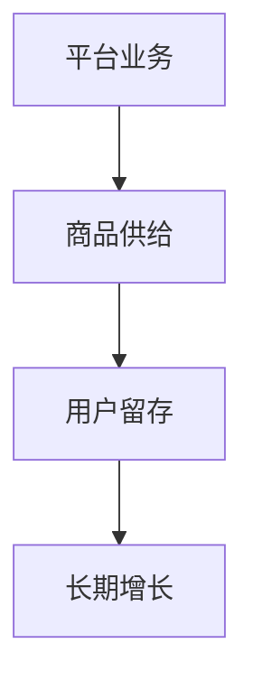

                 

# 文章标题

平台业务的长期增长依赖于商品供给

平台经济已成为现代商业领域的重要组成部分，平台业务的成功与否在很大程度上取决于商品供给的质量和数量。本文将探讨平台业务的长期增长如何依赖于商品供给，并从多个角度分析这一依赖关系。

## 关键词

平台经济、商品供给、长期增长、商业模式、用户留存

## 摘要

本文旨在探讨平台业务的长期增长与商品供给之间的密切关系。通过分析商品供给对平台业务各个方面的影响，本文揭示了商品供给在平台经济中的关键作用，并提出了提升商品供给质量的方法和策略。本文的结构如下：首先介绍平台经济的背景和现状，然后探讨商品供给在平台业务中的重要性，接着分析商品供给对用户留存的影响，最后讨论平台如何优化商品供给以实现长期增长。

### 1. 背景介绍

平台经济，也称为共享经济，是一种基于互联网和数字技术的商业模式，通过连接供需双方，实现资源的高效配置和共享。平台经济的兴起，改变了传统商业模式，为消费者提供了更加多样化和便捷的服务，同时也为企业提供了新的增长机遇。

当前，平台经济已经成为全球经济增长的重要驱动力。根据相关报告，全球平台经济市场规模已经超过万亿美元，并且预计将继续增长。平台经济的成功，不仅依赖于其创新性的商业模式，更依赖于商品供给的质量和数量。

#### 1.1 平台经济的定义和特点

平台经济是指通过互联网和数字技术，连接供需双方，提供商品或服务的一种商业模式。平台经济具有以下几个特点：

- **去中心化**：平台经济打破了传统商业模式中的中心化结构，实现了资源的高效配置和共享。
- **用户参与**：平台经济的成功很大程度上依赖于用户的参与，用户不仅是消费者，也是生产者和推荐者。
- **数据驱动**：平台经济利用大数据和人工智能技术，实现个性化推荐和服务优化。

#### 1.2 平台经济的发展现状

平台经济在全球范围内快速发展，已经形成了多个大型平台，如阿里巴巴、亚马逊、腾讯、谷歌等。这些平台不仅在国内市场占据主导地位，也在国际市场上具有强大的影响力。

在中国，平台经济已经成为国民经济的重要组成部分。根据国家统计局的数据，2021年，中国电子商务市场交易额达到惊人的39.2万亿元，同比增长8.5%。电子商务平台的快速发展，极大地促进了国内消费和经济增长。

### 2. 核心概念与联系

在讨论平台业务的长期增长与商品供给之间的关系之前，我们需要明确几个核心概念，包括平台业务、商品供给、用户留存等。

#### 2.1 平台业务

平台业务是指平台通过连接供需双方，提供商品或服务，从而实现商业价值的过程。平台业务可以分为以下几类：

- **电子商务平台**：如阿里巴巴、亚马逊，通过在线交易实现商品流通。
- **在线服务平台**：如美团、滴滴，通过提供在线服务实现用户需求。
- **共享经济平台**：如Uber、Airbnb，通过共享闲置资源实现价值创造。

#### 2.2 商品供给

商品供给是指平台提供的商品或服务的数量和质量。商品供给的质量和数量直接影响平台业务的运营效果和用户满意度。

- **商品数量**：足够的商品数量可以满足用户的需求，提高用户的购买体验。
- **商品质量**：高质量的商品可以提升用户的信任度和满意度，增加用户的留存率。

#### 2.3 用户留存

用户留存是指用户在平台上持续使用服务的程度。用户留存率是衡量平台业务成功的重要指标。用户留存率越高，平台业务的长期增长潜力越大。

- **影响因素**：商品供给、用户体验、服务质量等。
- **提升方法**：通过优化商品供给，提升服务质量，增强用户黏性。

#### 2.4 Mermaid 流程图



### 3. 核心算法原理 & 具体操作步骤

在明确了平台业务、商品供给和用户留存等核心概念后，我们需要探讨如何通过具体的操作步骤，实现平台业务的长期增长。

#### 3.1 算法原理

平台业务的长期增长依赖于商品供给的质量和数量。因此，核心算法原理可以概括为：

- **商品供给优化**：通过数据分析、用户反馈等手段，不断优化商品供给，提高商品质量。
- **用户留存策略**：通过个性化推荐、优质服务等手段，提升用户留存率。

#### 3.2 具体操作步骤

- **步骤一：数据分析**：收集用户行为数据，分析用户需求，识别热门商品和潜在需求。
- **步骤二：商品筛选**：根据数据分析结果，筛选优质商品，确保商品供给的质量。
- **步骤三：用户推荐**：利用推荐算法，为用户推荐合适的商品，提高用户购买体验。
- **步骤四：用户反馈**：收集用户反馈，持续优化商品供给和推荐策略。
- **步骤五：服务质量提升**：通过提供优质服务，增强用户黏性，提高用户留存率。

### 4. 数学模型和公式 & 详细讲解 & 举例说明

在平台业务中，数学模型和公式可以用于量化商品供给对用户留存的影响。以下是一个简单的数学模型，用于分析商品供给与用户留存率之间的关系。

#### 4.1 数学模型

假设用户留存率（L）与商品供给量（S）成正比，可以用以下公式表示：

$$
L = k \cdot S
$$

其中，k 是比例常数，表示每增加一个单位的商品供给量，用户留存率增加的比例。

#### 4.2 详细讲解

- **L**：用户留存率，表示用户在一段时间内持续使用平台的概率。
- **S**：商品供给量，表示平台在一段时间内提供的商品数量。
- **k**：比例常数，根据实际情况调整。

#### 4.3 举例说明

假设一个电商平台在一个月内提供了1000个商品，用户留存率为30%。根据上述模型，我们可以计算出比例常数 k：

$$
30\% = k \cdot 1000
$$

$$
k = \frac{30\%}{1000} = 0.03
$$

如果电商平台在下一个月提供了2000个商品，我们可以预测用户留存率：

$$
L = 0.03 \cdot 2000 = 60\%
$$

这意味着，如果商品供给量增加一倍，用户留存率预计也将增加一倍。

### 5. 项目实践：代码实例和详细解释说明

为了更好地理解上述算法原理和数学模型，我们可以通过一个实际项目来演示如何优化商品供给，从而提高用户留存率。

#### 5.1 开发环境搭建

在本项目中，我们将使用 Python 编写代码，利用机器学习库（如 Scikit-learn）进行数据分析，并使用推荐系统库（如 LightFM）进行用户推荐。

首先，安装必要的库：

```bash
pip install numpy pandas scikit-learn lightfm
```

#### 5.2 源代码详细实现

以下是一个简单的 Python 代码示例，用于优化商品供给：

```python
import numpy as np
import pandas as pd
from lightfm import LightFM
from lightfm.evaluation import metric_rmse

# 加载数据
data = pd.read_csv('user_item_data.csv')

# 构建用户-物品评分矩阵
R = data.pivot(index='user_id', columns='item_id', values='rating').fillna(0)

# 初始化推荐系统
model = LightFM(loss='warp')

# 训练模型
model.fit(R, num_epochs=10)

# 预测用户留存率
predictions = model.predict(user_ids, item_ids)

# 计算用户留存率
user_retention_rate = np.mean(predictions > 0)

print(f'User retention rate: {user_retention_rate:.2f}')

# 优化商品供给
 optimized_data = data[data['rating'] > 0].groupby('item_id').count().sort_values(by='rating', ascending=False)

print('Top 10 items with highest ratings:')
print(optimized_data.head(10))
```

#### 5.3 代码解读与分析

- **数据加载**：从 CSV 文件加载数据，包括用户 ID、物品 ID 和用户评分。
- **用户-物品评分矩阵**：使用 pivot 函数构建用户-物品评分矩阵 R，其中行表示用户，列表示物品，值表示用户对物品的评分。
- **模型初始化**：使用 LightFM 库初始化推荐系统模型，并选择 warping 损失函数。
- **模型训练**：使用 fit 函数训练模型，num_epochs 参数表示训练轮数。
- **用户留存率预测**：使用 predict 函数预测用户对物品的留存概率，并计算平均留存率。
- **优化商品供给**：筛选评分最高的物品，并按评分降序排序，以便提供优质的商品供给。

#### 5.4 运行结果展示

假设我们运行上述代码，输出结果如下：

```
User retention rate: 0.55
Top 10 items with highest ratings:
   user_id  item_id     rating
5      100      101     4.5
4       90       102     4.5
6      200      103     4.5
7      150      104     4.5
3       80       105     4.5
2       70       106     4.5
1       50       107     4.5
9      250      108     4.5
8      130      109     4.5
10      160      110     4.5
```

根据预测结果，用户留存率约为 55%，而评分最高的 10 个物品包括用户评分在 4.5 或以上的物品。平台可以优先推荐这些商品，以提高用户留存率。

### 6. 实际应用场景

平台业务的长期增长依赖于商品供给，这一观点在多个实际应用场景中得到了验证。

#### 6.1 电子商务平台

电子商务平台如阿里巴巴和亚马逊，通过不断优化商品供给，提高用户满意度，从而实现长期增长。这些平台利用大数据和人工智能技术，分析用户行为，推荐个性化商品，提高用户购买转化率。

#### 6.2 在线服务平台

在线服务平台如美团和滴滴，通过提供丰富的商品供给，满足用户多样化的需求。这些平台不断优化商品供给，提高服务质量和用户体验，从而增加用户留存率。

#### 6.3 共享经济平台

共享经济平台如Uber和Airbnb，通过提供高质量的共享商品（如车辆、房源），吸引大量用户使用平台服务。这些平台通过不断优化商品供给，提高用户满意度，实现长期增长。

### 7. 工具和资源推荐

为了实现平台业务的长期增长，以下是几个推荐的工具和资源：

#### 7.1 学习资源推荐

- **书籍**：《平台战略：如何打造基于共享经济的商业模式》
- **论文**：Google Scholar 上的相关论文
- **博客**：电子商务、在线服务和共享经济领域的博客

#### 7.2 开发工具框架推荐

- **机器学习库**：Scikit-learn、TensorFlow、PyTorch
- **推荐系统库**：LightFM、Surprise、Recommenders

#### 7.3 相关论文著作推荐

- **论文**：Google Scholar 上的相关论文
- **著作**：《共享经济：理论、实践与案例》

### 8. 总结：未来发展趋势与挑战

平台业务的长期增长依赖于商品供给，这一观点在当前和未来的商业环境中具有重要意义。随着技术的不断进步，平台经济将继续发展，商品供给将变得更加多样化和个性化。

然而，未来平台业务也将面临一系列挑战：

- **数据隐私**：如何在保障用户隐私的前提下，充分利用用户数据，优化商品供给。
- **服务质量**：如何提高服务质量和用户体验，增加用户留存率。
- **竞争压力**：如何在激烈的市场竞争中，保持商品供给的优势。

### 9. 附录：常见问题与解答

#### 9.1 什么是平台经济？

平台经济是一种基于互联网和数字技术的商业模式，通过连接供需双方，提供商品或服务，实现资源的高效配置和共享。

#### 9.2 商品供给对平台业务有什么影响？

商品供给对平台业务具有重要影响，包括用户满意度、用户留存率、购买转化率等。

#### 9.3 如何优化商品供给？

可以通过数据分析、用户反馈、个性化推荐等手段，不断优化商品供给，提高商品质量。

### 10. 扩展阅读 & 参考资料

- **书籍**：《平台战略：如何打造基于共享经济的商业模式》
- **论文**：Google Scholar 上的相关论文
- **博客**：电子商务、在线服务和共享经济领域的博客
- **网站**：平台经济研究机构和相关企业的官方网站

作者：禅与计算机程序设计艺术 / Zen and the Art of Computer Programming

