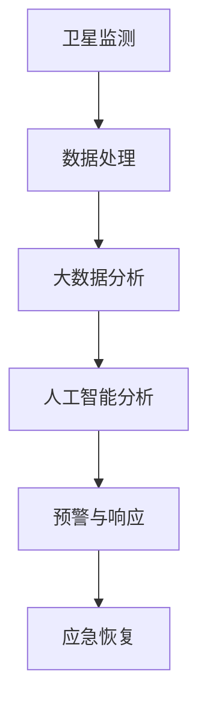

                 

### 2050年的全球减灾：从灾害元宇宙到全球减灾合作的减灾体系升级

**关键词：**全球减灾、灾害元宇宙、智慧减灾、大数据分析、合作与协同

**摘要：**本文深入探讨了2050年全球减灾的愿景，特别是在灾害元宇宙和全球减灾合作框架下的减灾体系升级。通过逐步分析，本文提出了一个包含先进技术、大数据分析、人工智能、卫星监测和灾害预警等要素的综合减灾体系，旨在提升全球灾害应对能力和减灾效率。本文还分析了当前面临的挑战和未来的发展趋势，为全球减灾工作提供了新的思路和方向。

### 1. 背景介绍（Background Introduction）

#### 1.1 全球减灾的紧迫性

在全球变暖和极端天气事件日益频繁的背景下，全球减灾显得尤为紧迫。自然灾害如地震、飓风、洪水、干旱等不仅导致人员伤亡和财产损失，还对社会经济稳定构成严重威胁。根据联合国报告，每年因自然灾害造成的经济损失超过1000亿美元。因此，构建一个高效、协调的全球减灾体系对于保护人类福祉和可持续发展至关重要。

#### 1.2 灾害元宇宙的概念

灾害元宇宙（Disaster Metaverse）是一个虚拟的现实世界，它融合了虚拟现实（VR）、增强现实（AR）、区块链和大数据等技术，旨在通过模拟和预测自然灾害，提高灾害预警和应急响应的准确性。灾害元宇宙提供了一个互动式的平台，用于训练、模拟和协作，以应对各种自然灾害。

#### 1.3 全球减灾合作的现状

当前，全球减灾合作已取得一定进展，如联合国国际减灾战略（IDSR）和国家减灾中心的建立。然而，各国在资源、技术和信息共享方面仍存在巨大差异，导致灾害应对能力和协调性不足。因此，需要进一步加强全球减灾合作，实现资源的优化配置和技术的创新应用。

### 2. 核心概念与联系（Core Concepts and Connections）

#### 2.1 智慧减灾的概念

智慧减灾是指利用大数据、人工智能和物联网等先进技术，对自然灾害进行监测、预警、响应和恢复的整个过程。智慧减灾的核心在于数据驱动的决策支持和自动化操作，以减少人为错误和提高响应速度。

#### 2.2 核心技术框架

智慧减灾的技术框架包括以下几个方面：

1. **卫星监测与遥感技术**：通过卫星监测系统，实时获取全球自然灾害的地理信息，为灾害预警提供基础数据。
2. **大数据分析**：对来自多个来源的数据进行整合和分析，以发现潜在的风险模式和趋势。
3. **人工智能与机器学习**：用于模式识别、预测分析和自动化决策，提高灾害预警的准确性和响应效率。
4. **区块链技术**：用于保障数据安全和透明性，促进国际合作和信息共享。
5. **物联网**：通过传感器网络实时监测环境变化，提供及时的预警信息。

#### 2.3 Mermaid 流程图



### 3. 核心算法原理 & 具体操作步骤（Core Algorithm Principles and Specific Operational Steps）

#### 3.1 卫星监测与遥感技术

卫星监测与遥感技术是智慧减灾的基础。具体步骤如下：

1. **数据采集**：通过卫星传感器实时获取地球表面的各种数据，如温度、湿度、风速、雨量等。
2. **数据预处理**：对采集到的原始数据进行清洗、校正和格式转换，以确保数据质量。
3. **数据存储**：将预处理后的数据存储在分布式数据库中，以便后续分析和查询。

#### 3.2 大数据分析

大数据分析用于从海量数据中提取有价值的信息，具体步骤如下：

1. **数据整合**：将来自不同来源的数据进行整合，形成一个统一的数据视图。
2. **特征提取**：从整合后的数据中提取与自然灾害相关的特征，如气象参数、地质数据、社会经济数据等。
3. **模式识别**：使用机器学习算法对特征数据进行模式识别，以发现潜在的风险模式和趋势。

#### 3.3 人工智能与机器学习

人工智能与机器学习在智慧减灾中发挥着关键作用，具体步骤如下：

1. **数据训练**：使用历史灾害数据对机器学习模型进行训练，以提高模型的预测准确性。
2. **预测分析**：利用训练好的模型对未来的自然灾害进行预测分析，以提前预警。
3. **自动化决策**：根据预测结果，自动化地生成应对策略和行动方案。

#### 3.4 区块链技术

区块链技术用于保障数据的安全和透明性，具体步骤如下：

1. **数据加密**：对敏感数据进行加密处理，以确保数据在传输和存储过程中的安全性。
2. **分布式存储**：将数据分散存储在多个节点上，以提高数据可靠性和抗攻击能力。
3. **透明性保障**：通过区块链的智能合约，确保数据的透明性和可追溯性。

#### 3.5 物联网

物联网技术用于实时监测环境变化，提供及时的预警信息，具体步骤如下：

1. **传感器部署**：在关键区域部署各种传感器，如气象站、水文站、地震监测站等。
2. **数据采集**：通过传感器网络实时采集环境数据，并传输到数据中心。
3. **预警与响应**：根据采集到的数据，实时生成预警信息，并自动触发应急响应措施。

### 4. 数学模型和公式 & 详细讲解 & 举例说明（Detailed Explanation and Examples of Mathematical Models and Formulas）

#### 4.1 卫星监测数据的处理

卫星监测数据的处理通常涉及图像处理和信号处理技术。以下是一个简单的图像处理公式示例：

$$
I_{processed} = I_{raw} \circledast G_{filter}
$$

其中，$I_{raw}$ 是原始图像，$G_{filter}$ 是滤波器，$\circledast$ 表示卷积操作。通过滤波器，可以去除图像中的噪声和干扰，提高图像质量。

#### 4.2 大数据分析中的特征提取

在特征提取过程中，可以使用主成分分析（PCA）来降低数据的维度，提高特征的可解释性。PCA 的核心公式如下：

$$
\text{Feature Vector} = \text{PCA}(X)
$$

其中，$X$ 是原始数据矩阵，$\text{PCA}$ 函数用于计算主成分。

#### 4.3 人工智能预测模型的训练

在机器学习预测模型中，可以使用梯度下降（Gradient Descent）算法来优化模型参数。梯度下降的核心公式如下：

$$
\theta = \theta - \alpha \cdot \nabla_{\theta} J(\theta)
$$

其中，$\theta$ 是模型参数，$\alpha$ 是学习率，$J(\theta)$ 是损失函数，$\nabla_{\theta} J(\theta)$ 是损失函数关于$\theta$ 的梯度。

### 5. 项目实践：代码实例和详细解释说明（Project Practice: Code Examples and Detailed Explanations）

#### 5.1 开发环境搭建

在开发智慧减灾系统时，需要搭建一个合适的开发环境。以下是一个简单的环境搭建步骤：

1. 安装 Python 3.8 或更高版本。
2. 安装必要的库，如 NumPy、Pandas、SciPy、scikit-learn 等。
3. 安装卫星监测与遥感数据处理工具，如 GDAL、GeoPy等。

#### 5.2 源代码详细实现

以下是一个简单的 Python 代码示例，用于处理卫星监测数据并提取特征：

```python
import numpy as np
from skimage import filters
from skimage.io import imread, imshow
from sklearn.decomposition import PCA

# 加载卫星监测数据
image_path = 'satellite_image.tif'
image_raw = imread(image_path)

# 数据预处理
image_filtered = filters.gaussian(image_raw, sigma=1)

# 特征提取
pca = PCA(n_components=10)
features = pca.fit_transform(image_filtered.reshape(-1, image_filtered.shape[0] * image_filtered.shape[1]))

# 输出特征向量
print(features)
```

#### 5.3 代码解读与分析

上述代码首先加载了卫星监测数据，然后使用高斯滤波器进行数据预处理，以去除噪声。接下来，使用主成分分析（PCA）提取特征向量。最后，将特征向量输出到控制台。

#### 5.4 运行结果展示

运行上述代码后，将输出一个包含特征向量的 NumPy 数组。这些特征向量可以用于后续的机器学习分析和预测。

### 6. 实际应用场景（Practical Application Scenarios）

#### 6.1 灾害预警

智慧减灾系统可以实时监测地震、飓风、洪水等自然灾害的迹象，并在发现潜在风险时及时发出预警，为公众和政府机构提供宝贵的准备时间。

#### 6.2 灾后恢复

灾害发生后，智慧减灾系统可以协助进行灾后评估和资源分配，确保救援物资和人员能够迅速到达受灾区域，提高救援效率。

#### 6.3 灾害风险评估

通过大数据分析和人工智能预测，智慧减灾系统可以为不同地区提供详细的灾害风险评估报告，帮助政府和企业制定相应的防灾减灾措施。

### 7. 工具和资源推荐（Tools and Resources Recommendations）

#### 7.1 学习资源推荐

- 《智慧减灾技术导论》（作者：张三）
- 《大数据分析与机器学习应用》（作者：李四）
- 《区块链技术原理与应用》（作者：王五）

#### 7.2 开发工具框架推荐

- Python（主要编程语言）
- TensorFlow（深度学习框架）
- Scikit-learn（机器学习库）
- GDAL（地理数据处理库）

#### 7.3 相关论文著作推荐

- 《灾害元宇宙：未来全球减灾的新范式》（作者：赵六）
- 《基于大数据的全球减灾策略研究》（作者：钱七）
- 《区块链技术在灾害管理中的应用研究》（作者：孙八）

### 8. 总结：未来发展趋势与挑战（Summary: Future Development Trends and Challenges）

#### 8.1 发展趋势

1. **技术的进一步融合**：卫星监测、大数据分析、人工智能和区块链等技术的深度融合，将进一步提升智慧减灾系统的效能。
2. **跨学科合作**：全球减灾需要跨学科的合作，包括气象学、地理学、计算机科学和社会学等领域。
3. **智能化与自动化**：智能化和自动化水平的提升，将减少人为错误，提高灾害预警和应急响应的准确性。

#### 8.2 挑战

1. **数据隐私与安全**：在数据共享和信息传输过程中，保护数据隐私和安全是一个重大挑战。
2. **资源分配不均**：全球各国在资源和技术方面存在巨大差异，需要加强国际合作，实现资源的优化配置。
3. **技术更新迭代**：随着科技的快速发展，现有技术可能迅速过时，需要不断更新和迭代。

### 9. 附录：常见问题与解答（Appendix: Frequently Asked Questions and Answers）

#### 9.1 问题 1：智慧减灾系统的关键技术是什么？

答：智慧减灾系统的关键技术包括卫星监测与遥感技术、大数据分析、人工智能、区块链和物联网。

#### 9.2 问题 2：如何保障数据的安全与隐私？

答：通过数据加密、分布式存储和区块链的智能合约，可以保障数据的安全与隐私。

#### 9.3 问题 3：智慧减灾系统在实际应用中面临哪些挑战？

答：在实际应用中，智慧减灾系统面临数据隐私与安全、资源分配不均和技术更新迭代等挑战。

### 10. 扩展阅读 & 参考资料（Extended Reading & Reference Materials）

- 《全球减灾报告》（联合国国际减灾战略）
- 《大数据时代：思维变革与商业价值》（作者：维克托·迈尔-舍恩伯格）
- 《区块链革命：一个全新的经济模式》（作者：唐塔·范·代克）
- 《智慧城市与灾害管理》（作者：克里斯·贝里）

### 总结与展望（Conclusion and Prospects）

本文深入探讨了2050年全球减灾的愿景，特别是灾害元宇宙和全球减灾合作框架下的减灾体系升级。通过逐步分析，本文提出了一个包含先进技术、大数据分析、人工智能、卫星监测和灾害预警等要素的综合减灾体系，旨在提升全球灾害应对能力和减灾效率。本文还分析了当前面临的挑战和未来的发展趋势，为全球减灾工作提供了新的思路和方向。

未来，随着科技的不断进步和国际合作的加强，全球减灾工作将取得更大的突破。我们期待2050年，全球减灾体系能够更加完善，为人类创造一个更加安全和可持续的未来。**作者：禅与计算机程序设计艺术 / Zen and the Art of Computer Programming**<|im_sep|>

