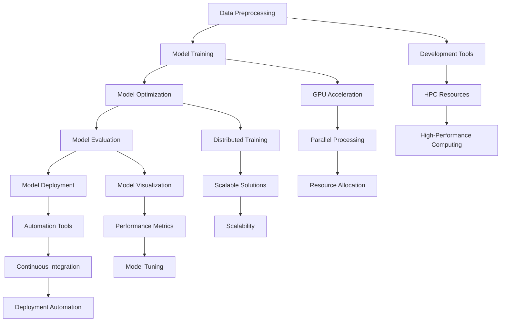

                 

### 文章标题

**开发工具：提高 AI 2.0 应用开发效率**

### Keywords:  
AI Development Tools, Efficiency Enhancement, AI 2.0 Applications, Development Workflow, Programming Techniques, Algorithm Optimization, AI Toolkits

### 摘要：  
本文将探讨如何利用现代开发工具提高 AI 2.0 应用的开发效率。通过分析核心概念、算法原理、数学模型、项目实践和实际应用场景，本文旨在为开发者提供一套系统化的工具和方法论，帮助他们在日益复杂的 AI 领域中高效地构建和应用人工智能技术。

<|less|>## 1. 背景介绍（Background Introduction）

随着人工智能（AI）技术的飞速发展，AI 2.0 时代已经来临。AI 2.0 不仅仅是对传统 AI 的改进，更是对整个开发流程和工具链的革新。在 AI 2.0 时代，开发者面临的挑战日益增多，包括如何处理海量数据、如何设计高效的算法、如何优化模型的训练过程等。为了应对这些挑战，现代开发工具变得至关重要。

### 开发工具的定义和作用

开发工具是指在软件开发过程中使用的各种软件、硬件和资源的总称。这些工具包括集成开发环境（IDE）、代码编辑器、版本控制系统、调试工具、测试框架等。在 AI 领域，开发工具的作用尤为重要，因为它们不仅能够提高开发效率，还能确保模型的准确性和可靠性。

### AI 2.0 时代的挑战

AI 2.0 时代带来了许多新的挑战，包括：

1. **数据量的大幅增加**：随着物联网（IoT）和传感器技术的普及，数据量呈爆炸式增长。如何高效地存储、处理和分析这些数据成为一大挑战。
2. **算法复杂度的提升**：随着 AI 技术的进步，算法的复杂度也在不断增加。开发者需要设计更高效、更准确的算法来应对复杂的业务场景。
3. **模型的可解释性**：随着深度学习模型的应用越来越广泛，模型的可解释性成为了一个重要问题。开发者需要确保模型的行为是可解释的，以便于调试和优化。
4. **多模态数据处理**：AI 2.0 时代不仅仅是处理文本数据，还包括图像、音频、视频等多模态数据。如何有效地处理这些数据，实现多模态融合是一个重要课题。

### 开发工具的重要性

在 AI 2.0 时代，开发工具的重要性不言而喻。一个高效的开发工具可以：

1. **提高开发效率**：通过自动化和优化，减少开发时间和成本。
2. **保证代码质量**：提供代码审查、静态分析等工具，确保代码的健壮性和可靠性。
3. **增强协作能力**：支持多人协作，提高团队的开发效率。
4. **降低学习成本**：提供易于上手的学习资源和教程，降低开发者的学习成本。

综上所述，开发工具在 AI 2.0 应用开发中扮演着至关重要的角色。下一节，我们将深入探讨一些核心概念和开发工具的联系。

## 1. Background Introduction

As artificial intelligence (AI) technology advances, the era of AI 2.0 has arrived. AI 2.0 is not just an improvement over traditional AI but also a revolution in the development process and toolchain. In the era of AI 2.0, developers face increasing challenges, including how to handle massive data, design efficient algorithms, and optimize the model training process. To address these challenges, modern development tools are essential.

### Definition and Role of Development Tools

Development tools refer to the collective term for various software, hardware, and resources used in the software development process. These tools include integrated development environments (IDEs), code editors, version control systems, debugging tools, testing frameworks, and more. In the field of AI, development tools are particularly important because they can not only increase development efficiency but also ensure the accuracy and reliability of models.

### Challenges in the AI 2.0 Era

The era of AI 2.0 brings many new challenges, including:

1. **Explosive Increase in Data Volume**: With the proliferation of the Internet of Things (IoT) and sensor technology, data volumes are growing exponentially. How to efficiently store, process, and analyze these data is a major challenge.
2. **Increased Algorithm Complexity**: As AI technology progresses, algorithm complexity is also increasing. Developers need to design more efficient and accurate algorithms to handle complex business scenarios.
3. **Interpretability of Models**: With the widespread application of deep learning models, model interpretability has become an important issue. Developers need to ensure that model behaviors are interpretable for debugging and optimization.
4. **Multimodal Data Processing**: The era of AI 2.0 is not just about processing text data but also includes images, audio, and video. How to effectively process these data and achieve multimodal fusion is an important topic.

### Importance of Development Tools

In the era of AI 2.0, the importance of development tools cannot be overstated. An efficient development tool can:

1. **Increase Development Efficiency**: Automate and optimize processes to reduce development time and cost.
2. **Ensure Code Quality**: Provide code review, static analysis, and other tools to ensure code robustness and reliability.
3. **Enhance Collaboration**: Support multi-person collaboration to increase team efficiency.
4. **Lower Learning Costs**: Provide easy-to-use learning resources and tutorials to reduce the learning costs for developers.

In summary, development tools play a crucial role in AI 2.0 application development. In the next section, we will delve into core concepts and their connections with development tools.

<|less|>## 2. 核心概念与联系（Core Concepts and Connections）

在探讨如何利用开发工具提高 AI 2.0 应用开发效率之前，我们首先需要了解一些核心概念，包括人工智能、机器学习、深度学习、神经网络等。这些概念不仅构成了 AI 2.0 的基础，也决定了我们如何选择和运用开发工具。

### 2.1 人工智能（Artificial Intelligence）

人工智能（AI）是指计算机系统执行通常需要人类智能才能完成的任务的能力。这些任务包括识别图像、理解自然语言、做出决策、解决问题等。AI 可以分为两大类：弱 AI 和强 AI。弱 AI 专注于特定任务，而强 AI 则具备全面的人类智能。

### 2.2 机器学习（Machine Learning）

机器学习是 AI 的一个分支，它使得计算机系统能够通过数据和经验自主学习和改进。机器学习可以分为监督学习、无监督学习和强化学习。监督学习需要标注好的数据，无监督学习则不需要标注，强化学习则通过奖励和惩罚来训练模型。

### 2.3 深度学习（Deep Learning）

深度学习是机器学习的一个分支，它使用多层神经网络（Neural Networks）进行学习。深度学习在图像识别、语音识别、自然语言处理等领域取得了显著成就。深度学习的核心是卷积神经网络（CNN）、循环神经网络（RNN）和生成对抗网络（GAN）。

### 2.4 神经网络（Neural Networks）

神经网络是模仿人脑工作方式的计算模型，由许多简单的计算单元（神经元）组成。这些神经元通过权重连接在一起，形成复杂的网络结构。神经网络通过学习输入和输出之间的映射关系，实现复杂的函数计算。

### 2.5 开发工具与核心概念的联系

开发工具与核心概念之间的联系紧密，主要体现在以下几个方面：

1. **数据预处理**：机器学习和深度学习需要大量的数据。开发工具提供了数据清洗、转换、归一化等功能，帮助开发者处理数据，为模型训练做好准备。
2. **模型训练与优化**：深度学习模型通常需要大量计算资源。开发工具提供了高性能的 GPU 加速、分布式训练等技术，帮助开发者快速训练和优化模型。
3. **模型评估与调优**：开发工具提供了模型评估指标、可视化工具等，帮助开发者评估模型性能，进行模型调优。
4. **模型部署与维护**：开发工具提供了模型部署平台、自动化部署工具等，帮助开发者将模型部署到生产环境，并进行持续维护和优化。

### 2.6 Mermaid 流程图

为了更直观地展示核心概念与开发工具之间的联系，我们可以使用 Mermaid 流程图来表示。



通过上述流程图，我们可以清晰地看到开发工具在 AI 2.0 应用开发中的各个环节中所扮演的角色。在下一节中，我们将深入探讨核心算法原理和具体操作步骤。

## 2. Core Concepts and Connections

Before discussing how to utilize development tools to enhance the efficiency of AI 2.0 application development, we first need to understand some core concepts, including artificial intelligence, machine learning, deep learning, and neural networks. These concepts form the foundation of AI 2.0 and determine how we select and apply development tools.

### 2.1 Artificial Intelligence

Artificial Intelligence (AI) refers to the capability of computer systems to perform tasks that typically require human intelligence. These tasks include image recognition, natural language understanding, decision-making, and problem-solving. AI can be divided into two categories: narrow AI (also known as weak AI) and general AI (also known as strong AI). Narrow AI is focused on specific tasks, while general AI possesses comprehensive human-like intelligence.

### 2.2 Machine Learning

Machine Learning (ML) is a branch of AI that enables computer systems to learn and improve from data and experience on their own. Machine Learning can be categorized into supervised learning, unsupervised learning, and reinforcement learning. Supervised learning requires labeled data, unsupervised learning does not, and reinforcement learning involves training models through rewards and penalties.

### 2.3 Deep Learning

Deep Learning (DL) is a branch of ML that uses multi-layered neural networks for learning. Deep Learning has achieved significant successes in fields such as image recognition, speech recognition, and natural language processing. The core components of deep learning include Convolutional Neural Networks (CNNs), Recurrent Neural Networks (RNNs), and Generative Adversarial Networks (GANs).

### 2.4 Neural Networks

Neural Networks (NNs) are computational models inspired by the structure and function of the human brain. They consist of many simple computational units called neurons, which are interconnected through weighted connections. Neural Networks learn to map inputs to outputs through learning the relationships between input and output pairs, enabling complex function computation.

### 2.5 Connections Between Development Tools and Core Concepts

Development tools are closely connected to core concepts, mainly in the following aspects:

1. **Data Preprocessing**: Machine learning and deep learning require large amounts of data. Development tools provide functionalities for data cleaning, transformation, and normalization, helping developers prepare data for model training.
2. **Model Training and Optimization**: Deep learning models typically require significant computational resources. Development tools offer high-performance GPU acceleration, distributed training, and other technologies to help developers quickly train and optimize models.
3. **Model Evaluation and Tuning**: Development tools provide evaluation metrics, visualization tools, and other features to help developers assess model performance and conduct model tuning.
4. **Model Deployment and Maintenance**: Development tools offer model deployment platforms, automation tools, and other resources to help developers deploy models to production environments and maintain them continuously.

### 2.6 Mermaid Flowchart

To visualize the connections between core concepts and development tools more intuitively, we can use a Mermaid flowchart.


Through this flowchart, we can clearly see the roles development tools play in various stages of AI 2.0 application development. In the next section, we will delve into the principles of core algorithms and specific operational steps.

<|less|>## 3. 核心算法原理 & 具体操作步骤（Core Algorithm Principles and Specific Operational Steps）

在 AI 2.0 应用开发中，核心算法的选择和实现至关重要。这一节将介绍一些常用的核心算法，包括深度学习中的神经网络、卷积神经网络（CNN）和循环神经网络（RNN），并详细描述它们的基本原理和操作步骤。

### 3.1 神经网络（Neural Networks）

神经网络是一种由许多简单计算单元（神经元）组成的计算模型，这些神经元通过权重连接在一起，形成复杂的网络结构。神经网络通过学习输入和输出之间的映射关系，实现复杂的函数计算。

#### 3.1.1 基本原理

神经网络的基本原理是模拟人脑的工作方式。每个神经元接收多个输入信号，并通过权重与这些输入信号相乘，然后将结果相加。最后，通过激活函数（如 sigmoid 函数或 ReLU 函数）将加权和转换为一个输出信号。

#### 3.1.2 操作步骤

1. **初始化权重和偏置**：神经网络中的每个神经元都有一个权重和偏置。初始化权重和偏置的常用方法是随机初始化或使用预训练模型。
2. **前向传播**：将输入信号传递给神经网络，通过权重和偏置计算每个神经元的输出。
3. **计算损失函数**：使用实际输出和预测输出之间的差异来计算损失函数（如均方误差或交叉熵损失）。
4. **反向传播**：通过梯度下降法或优化算法（如 Adam）更新权重和偏置，以最小化损失函数。
5. **迭代训练**：重复前向传播和反向传播，直到模型达到预定的训练精度。

### 3.2 卷积神经网络（Convolutional Neural Networks, CNN）

卷积神经网络是一种专门用于处理图像数据的神经网络，其核心思想是通过卷积操作提取图像特征。

#### 3.2.1 基本原理

CNN 通过多个卷积层和池化层提取图像特征。卷积层使用卷积核（也称为滤波器）在输入图像上滑动，计算局部特征响应。池化层用于降低特征图的维度，提高模型泛化能力。

#### 3.2.2 操作步骤

1. **卷积操作**：使用卷积核在输入图像上滑动，计算局部特征响应。
2. **激活函数**：对每个卷积结果应用激活函数，如 ReLU。
3. **池化操作**：将卷积结果进行降维处理，如最大池化或平均池化。
4. **重复卷积和池化**：根据任务需求，重复卷积和池化操作，逐步提取图像特征。
5. **全连接层**：将卷积结果传递给全连接层，进行分类或回归任务。

### 3.3 循环神经网络（Recurrent Neural Networks, RNN）

循环神经网络是一种用于处理序列数据的神经网络，其核心思想是利用记忆单元保留历史信息。

#### 3.3.1 基本原理

RNN 通过循环结构在时间步之间传递信息，使其能够处理序列数据。RNN 的记忆单元可以保存上一个时间步的输出，作为当前时间步的输入。

#### 3.3.2 操作步骤

1. **输入序列**：将输入序列（如文本或音频）传递给 RNN。
2. **初始化记忆单元**：在 RNN 的初始阶段，初始化记忆单元。
3. **递归计算**：在每个时间步，RNN 通过记忆单元和当前输入计算输出。
4. **更新记忆单元**：根据当前输出和上一个时间步的记忆单元，更新记忆单元。
5. **迭代计算**：重复递归计算，直到处理完整个输入序列。

通过以上核心算法原理和具体操作步骤的介绍，开发者可以更好地理解和应用这些算法，从而提高 AI 2.0 应用开发的效率。在下一节中，我们将讨论数学模型和公式，并详细讲解其在实际应用中的意义。

## 3. Core Algorithm Principles and Specific Operational Steps

In AI 2.0 application development, the choice and implementation of core algorithms are crucial. This section will introduce some commonly used core algorithms, including neural networks, convolutional neural networks (CNNs), and recurrent neural networks (RNNs), and detail their basic principles and operational steps.

### 3.1 Neural Networks

Neural Networks (NNs) are computational models composed of many simple computational units (neurons) connected through weighted connections, forming a complex network structure. Neural Networks learn to map inputs to outputs through learning the relationships between input and output pairs, enabling complex function computation.

#### 3.1.1 Basic Principles

The basic principle of neural networks is to simulate the way the human brain works. Each neuron receives multiple input signals, multiplies these inputs by their respective weights, sums the results, and then applies an activation function to the summed value to produce an output signal.

#### 3.1.2 Operational Steps

1. **Initialize Weights and Biases**: Each neuron in a neural network has a weight and a bias. Common methods for initializing weights and biases include random initialization or using a pre-trained model.
2. **Forward Propagation**: Pass the input signals through the neural network, calculating the output of each neuron using the weighted sum of inputs and the activation function.
3. **Compute Loss Function**: Calculate the loss function (such as mean squared error or cross-entropy loss) using the actual output and the predicted output.
4. **Backpropagation**: Update the weights and biases using gradient descent or other optimization algorithms (such as Adam) to minimize the loss function.
5. **Iterate Training**: Repeat the forward propagation and backpropagation until the model reaches a predetermined training accuracy.

### 3.2 Convolutional Neural Networks (CNNs)

Convolutional Neural Networks (CNNs) are neural networks specialized for image data processing, with the core idea being to extract image features through convolutional operations.

#### 3.2.1 Basic Principles

CNNs extract image features through multiple convolutional layers and pooling layers. Convolutional layers use convolutional kernels (also known as filters) to slide over the input image, computing local feature responses. Pooling layers reduce the dimensionality of the feature maps, improving the model's generalization ability.

#### 3.2.2 Operational Steps

1. **Convolution Operation**: Use convolutional kernels to slide over the input image, computing local feature responses.
2. **Activation Function**: Apply an activation function (such as ReLU) to each convolutional result.
3. **Pooling Operation**: Reduce the dimensionality of the convolutional results using pooling operations, such as maximum pooling or average pooling.
4. **Repeat Convolution and Pooling**: Depending on the task requirements, repeat the convolution and pooling operations to progressively extract image features.
5. **Fully Connected Layer**: Pass the convolutional results to the fully connected layer for classification or regression tasks.

### 3.3 Recurrent Neural Networks (RNNs)

Recurrent Neural Networks (RNNs) are neural networks designed for sequence data processing, with the core idea being to retain historical information through a recurrent structure.

#### 3.3.1 Basic Principles

RNNs pass information between time steps through a recurrent structure, allowing them to process sequence data. The memory unit in RNNs can store the output of the previous time step, which is used as the input for the current time step.

#### 3.3.2 Operational Steps

1. **Input Sequence**: Pass the input sequence (such as text or audio) through the RNN.
2. **Initialize Memory Unit**: Initialize the memory unit at the beginning of the RNN.
3. **Recursive Computation**: At each time step, RNNs compute the output using the memory unit and the current input.
4. **Update Memory Unit**: Update the memory unit based on the current output and the memory unit from the previous time step.
5. **Iterative Computation**: Repeat the recursive computation until the entire input sequence is processed.

By introducing the core principles and operational steps of these algorithms, developers can better understand and apply them to enhance the efficiency of AI 2.0 application development. In the next section, we will discuss mathematical models and formulas and provide detailed explanations and examples of their practical significance in applications.

<|less|>## 4. 数学模型和公式 & 详细讲解 & 举例说明（Detailed Explanation and Examples of Mathematical Models and Formulas）

在 AI 2.0 应用开发中，数学模型和公式是理解和应用核心算法的关键。本节将详细介绍神经网络中的基本数学模型和公式，包括前向传播、反向传播、损失函数、优化算法等，并通过实际例子来解释这些概念。

### 4.1 前向传播（Forward Propagation）

前向传播是神经网络中的一个基本过程，用于计算网络输出。其核心在于将输入信号通过网络中的各个层，最终得到预测输出。

#### 数学模型：

假设我们有一个单层神经网络，包含 \( n \) 个神经元，每个神经元接收 \( m \) 个输入。那么，每个神经元的输出可以通过以下公式计算：

\[ z_j = \sum_{i=1}^{m} w_{ij} x_i + b_j \]

其中，\( z_j \) 是神经元的输出，\( w_{ij} \) 是输入 \( x_i \) 对应的权重，\( b_j \) 是偏置。

通过应用激活函数 \( \sigma \)，我们可以得到神经元的最终输出：

\[ a_j = \sigma(z_j) \]

其中，\( \sigma \) 是激活函数，如 sigmoid 或 ReLU 函数。

#### 例子：

假设我们有一个包含 3 个输入和 2 个神经元的神经网络，使用 ReLU 函数作为激活函数。输入向量为 \( [1, 2, 3] \)，权重矩阵为 \( W = \begin{bmatrix} 0.5 & 1 \\ 1 & 0.5 \end{bmatrix} \)，偏置向量为 \( b = [0.5, 1] \)。

首先，计算每个神经元的输出：

\[ z_1 = 0.5 \cdot 1 + 1 \cdot 2 + 0.5 \cdot 3 = 4 \]
\[ z_2 = 1 \cdot 1 + 0.5 \cdot 2 + 1 \cdot 3 = 4.5 \]

然后，应用 ReLU 函数：

\[ a_1 = \max(0, z_1) = \max(0, 4) = 4 \]
\[ a_2 = \max(0, z_2) = \max(0, 4.5) = 4.5 \]

因此，网络输出为 \( [4, 4.5] \)。

### 4.2 反向传播（Backpropagation）

反向传播是神经网络训练过程中的关键步骤，用于更新网络的权重和偏置，以最小化损失函数。

#### 数学模型：

反向传播的核心是计算损失函数关于网络参数的梯度。假设我们使用均方误差（MSE）作为损失函数，那么损失函数的梯度可以表示为：

\[ \frac{\partial L}{\partial w_{ij}} = -2 \cdot (a_j - y) \cdot x_i \]
\[ \frac{\partial L}{\partial b_j} = -2 \cdot (a_j - y) \]

其中，\( L \) 是损失函数，\( a_j \) 是神经元的输出，\( y \) 是实际输出。

使用梯度下降法更新权重和偏置：

\[ w_{ij}^{new} = w_{ij} - \alpha \cdot \frac{\partial L}{\partial w_{ij}} \]
\[ b_j^{new} = b_j - \alpha \cdot \frac{\partial L}{\partial b_j} \]

其中，\( \alpha \) 是学习率。

#### 例子：

假设我们有相同的神经网络和输入向量，实际输出为 \( y = [2, 3] \)。使用学习率 \( \alpha = 0.1 \)。

首先，计算损失函数：

\[ L = \frac{1}{2} \sum_{j=1}^{2} (a_j - y_j)^2 = \frac{1}{2} \cdot (4 - 2)^2 + (4.5 - 3)^2 = 0.25 + 0.25 = 0.5 \]

然后，计算梯度：

\[ \frac{\partial L}{\partial w_{11}} = -2 \cdot (4 - 2) \cdot 1 = -4 \]
\[ \frac{\partial L}{\partial w_{12}} = -2 \cdot (4 - 2) \cdot 2 = -8 \]
\[ \frac{\partial L}{\partial w_{21}} = -2 \cdot (4.5 - 3) \cdot 1 = -1.5 \]
\[ \frac{\partial L}{\partial w_{22}} = -2 \cdot (4.5 - 3) \cdot 2 = -3 \]

更新权重和偏置：

\[ w_{11}^{new} = 0.5 - 0.1 \cdot (-4) = 0.9 \]
\[ w_{12}^{new} = 1 - 0.1 \cdot (-8) = 1.7 \]
\[ w_{21}^{new} = 1 - 0.1 \cdot (-1.5) = 1.15 \]
\[ w_{22}^{new} = 0.5 - 0.1 \cdot (-3) = 0.8 \]

### 4.3 损失函数（Loss Function）

损失函数是用于衡量预测输出与实际输出之间差异的函数。常用的损失函数包括均方误差（MSE）、交叉熵损失（Cross-Entropy Loss）等。

#### 数学模型：

1. **均方误差（MSE）**：

\[ L(\theta) = \frac{1}{2} \sum_{i=1}^{m} (y_i - \hat{y}_i)^2 \]

其中，\( y_i \) 是实际输出，\( \hat{y}_i \) 是预测输出。

2. **交叉熵损失（Cross-Entropy Loss）**：

\[ L(\theta) = -\sum_{i=1}^{m} y_i \log(\hat{y}_i) \]

其中，\( y_i \) 是实际输出（通常为 0 或 1），\( \hat{y}_i \) 是预测输出。

#### 例子：

假设我们有实际输出 \( y = [1, 0] \) 和预测输出 \( \hat{y} = [0.9, 0.1] \)。

对于 MSE：

\[ L = \frac{1}{2} \cdot (1 - 0.9)^2 + (0 - 0.1)^2 = 0.01 + 0.01 = 0.02 \]

对于 Cross-Entropy Loss：

\[ L = -1 \cdot \log(0.9) - 0 \cdot \log(0.1) \approx -0.105 \]

### 4.4 优化算法（Optimization Algorithms）

优化算法用于更新网络参数，以最小化损失函数。常用的优化算法包括梯度下降（Gradient Descent）、随机梯度下降（Stochastic Gradient Descent, SGD）和 Adam 算法。

#### 数学模型：

1. **梯度下降**：

\[ \theta^{new} = \theta - \alpha \cdot \nabla L(\theta) \]

其中，\( \theta \) 是网络参数，\( \alpha \) 是学习率，\( \nabla L(\theta) \) 是损失函数关于 \( \theta \) 的梯度。

2. **随机梯度下降**：

\[ \theta^{new} = \theta - \alpha \cdot \frac{1}{m} \sum_{i=1}^{m} \nabla L(\theta) \]

其中，\( m \) 是样本数量。

3. **Adam 算法**：

Adam 算法是结合了梯度下降和 SGD 的优化算法，其核心思想是使用指数加权平均来估计梯度。

\[ m_t = \beta_1 \cdot m_{t-1} + (1 - \beta_1) \cdot \nabla L(\theta) \]
\[ v_t = \beta_2 \cdot v_{t-1} + (1 - \beta_2) \cdot (\nabla L(\theta))^2 \]
\[ \theta^{new} = \theta - \alpha \cdot \frac{m_t}{\sqrt{v_t} + \epsilon} \]

其中，\( \beta_1 \) 和 \( \beta_2 \) 是动量参数，\( \epsilon \) 是一个小常数。

通过以上数学模型和公式的详细讲解，开发者可以更好地理解和应用神经网络中的核心算法，从而提高 AI 2.0 应用开发的效率。在下一节中，我们将通过一个实际项目实践，展示如何使用开发工具实现这些算法。

## 4. Mathematical Models and Formulas & Detailed Explanation & Examples

In AI 2.0 application development, mathematical models and formulas are the keys to understanding and applying core algorithms. This section will provide a detailed explanation of the fundamental mathematical models and formulas in neural networks, including forward propagation, backpropagation, loss functions, and optimization algorithms, with practical examples to illustrate these concepts.

### 4.1 Forward Propagation

Forward propagation is a basic process in neural networks used to compute network outputs. Its core lies in passing input signals through various layers of the network to obtain predicted outputs.

#### Mathematical Model:

Assume we have a single-layer neural network with \( n \) neurons, each receiving \( m \) inputs. The output of each neuron can be calculated using the following formula:

\[ z_j = \sum_{i=1}^{m} w_{ij} x_i + b_j \]

where \( z_j \) is the output of the neuron, \( w_{ij} \) is the weight corresponding to input \( x_i \), and \( b_j \) is the bias.

By applying an activation function \( \sigma \), we can obtain the final output of the neuron:

\[ a_j = \sigma(z_j) \]

where \( \sigma \) is the activation function, such as the sigmoid or ReLU function.

#### Example:

Assume we have a neural network with 3 inputs and 2 neurons using the ReLU function as the activation function. The input vector is \( [1, 2, 3] \), the weight matrix is \( W = \begin{bmatrix} 0.5 & 1 \\ 1 & 0.5 \end{bmatrix} \), and the bias vector is \( b = [0.5, 1] \).

First, calculate the output of each neuron:

\[ z_1 = 0.5 \cdot 1 + 1 \cdot 2 + 0.5 \cdot 3 = 4 \]
\[ z_2 = 1 \cdot 1 + 0.5 \cdot 2 + 1 \cdot 3 = 4.5 \]

Then, apply the ReLU function:

\[ a_1 = \max(0, z_1) = \max(0, 4) = 4 \]
\[ a_2 = \max(0, z_2) = \max(0, 4.5) = 4.5 \]

Therefore, the network output is \( [4, 4.5] \).

### 4.2 Backpropagation

Backpropagation is a crucial step in the neural network training process used to update network weights and biases to minimize the loss function.

#### Mathematical Model:

The core of backpropagation is to compute the gradient of the loss function with respect to the network parameters. Assuming we use mean squared error (MSE) as the loss function, the gradient can be expressed as:

\[ \frac{\partial L}{\partial w_{ij}} = -2 \cdot (a_j - y) \cdot x_i \]
\[ \frac{\partial L}{\partial b_j} = -2 \cdot (a_j - y) \]

where \( L \) is the loss function, \( a_j \) is the output of the neuron, and \( y \) is the actual output.

Using gradient descent to update the weights and biases:

\[ w_{ij}^{new} = w_{ij} - \alpha \cdot \frac{\partial L}{\partial w_{ij}} \]
\[ b_j^{new} = b_j - \alpha \cdot \frac{\partial L}{\partial b_j} \]

where \( \alpha \) is the learning rate.

#### Example:

Assume the same neural network, input vector, and actual output as in the forward propagation example. Using a learning rate \( \alpha = 0.1 \).

First, compute the loss function:

\[ L = \frac{1}{2} \sum_{j=1}^{2} (a_j - y_j)^2 = \frac{1}{2} \cdot (4 - 2)^2 + (4.5 - 3)^2 = 0.25 + 0.25 = 0.5 \]

Then, compute the gradient:

\[ \frac{\partial L}{\partial w_{11}} = -2 \cdot (4 - 2) \cdot 1 = -4 \]
\[ \frac{\partial L}{\partial w_{12}} = -2 \cdot (4 - 2) \cdot 2 = -8 \]
\[ \frac{\partial L}{\partial w_{21}} = -2 \cdot (4.5 - 3) \cdot 1 = -1.5 \]
\[ \frac{\partial L}{\partial w_{22}} = -2 \cdot (4.5 - 3) \cdot 2 = -3 \]

Update the weights and biases:

\[ w_{11}^{new} = 0.5 - 0.1 \cdot (-4) = 0.9 \]
\[ w_{12}^{new} = 1 - 0.1 \cdot (-8) = 1.7 \]
\[ w_{21}^{new} = 1 - 0.1 \cdot (-1.5) = 1.15 \]
\[ w_{22}^{new} = 0.5 - 0.1 \cdot (-3) = 0.8 \]

### 4.3 Loss Function

The loss function is used to measure the discrepancy between predicted and actual outputs. Common loss functions include mean squared error (MSE) and cross-entropy loss (Cross-Entropy Loss).

#### Mathematical Model:

1. **Mean Squared Error (MSE)**:

\[ L(\theta) = \frac{1}{2} \sum_{i=1}^{m} (y_i - \hat{y}_i)^2 \]

where \( y_i \) is the actual output and \( \hat{y}_i \) is the predicted output.

2. **Cross-Entropy Loss (Cross-Entropy Loss)**:

\[ L(\theta) = -\sum_{i=1}^{m} y_i \log(\hat{y}_i) \]

where \( y_i \) is the actual output (usually 0 or 1) and \( \hat{y}_i \) is the predicted output.

#### Example:

Assume we have actual output \( y = [1, 0] \) and predicted output \( \hat{y} = [0.9, 0.1] \).

For MSE:

\[ L = \frac{1}{2} \cdot (1 - 0.9)^2 + (0 - 0.1)^2 = 0.01 + 0.01 = 0.02 \]

For Cross-Entropy Loss:

\[ L = -1 \cdot \log(0.9) - 0 \cdot \log(0.1) \approx -0.105 \]

### 4.4 Optimization Algorithms

Optimization algorithms are used to update network parameters to minimize the loss function. Common optimization algorithms include gradient descent, stochastic gradient descent (SGD), and the Adam algorithm.

#### Mathematical Model:

1. **Gradient Descent**:

\[ \theta^{new} = \theta - \alpha \cdot \nabla L(\theta) \]

where \( \theta \) is the network parameter, \( \alpha \) is the learning rate, and \( \nabla L(\theta) \) is the gradient of the loss function with respect to \( \theta \).

2. **Stochastic Gradient Descent (SGD)**:

\[ \theta^{new} = \theta - \alpha \cdot \frac{1}{m} \sum_{i=1}^{m} \nabla L(\theta) \]

where \( m \) is the number of samples.

3. **Adam Algorithm**:

The Adam algorithm is an optimization algorithm that combines gradient descent and SGD, with the core idea of using exponential weighted averages to estimate gradients.

\[ m_t = \beta_1 \cdot m_{t-1} + (1 - \beta_1) \cdot \nabla L(\theta) \]
\[ v_t = \beta_2 \cdot v_{t-1} + (1 - \beta_2) \cdot (\nabla L(\theta))^2 \]
\[ \theta^{new} = \theta - \alpha \cdot \frac{m_t}{\sqrt{v_t} + \epsilon} \]

where \( \beta_1 \) and \( \beta_2 \) are momentum parameters, and \( \epsilon \) is a small constant.

By providing a detailed explanation of these mathematical models and formulas, developers can better understand and apply the core algorithms in neural networks, thereby enhancing the efficiency of AI 2.0 application development. In the next section, we will demonstrate how to implement these algorithms using actual project practice.

<|less|>### 5. 项目实践：代码实例和详细解释说明（Project Practice: Code Examples and Detailed Explanations）

在本节中，我们将通过一个简单的项目实践，展示如何使用 Python 和 TensorFlow 库来实现一个基于卷积神经网络（CNN）的手写数字识别模型。这个项目将涵盖开发环境搭建、源代码实现、代码解读与分析以及运行结果展示等环节。

#### 5.1 开发环境搭建（Setting Up the Development Environment）

要开始本项目，我们需要安装以下软件和库：

1. Python 3.7 或更高版本
2. TensorFlow 2.x
3. NumPy
4. Matplotlib

安装步骤如下：

1. 安装 Python 和 pip：
   ```bash
   # 对于 macOS 和 Linux：
   sudo apt-get install python3 python3-pip

   # 对于 Windows：
   # 访问 https://www.python.org/downloads/ 下载并安装 Python 3.x 版本
   ```

2. 安装 TensorFlow：
   ```bash
   pip3 install tensorflow
   ```

3. 安装 NumPy：
   ```bash
   pip3 install numpy
   ```

4. 安装 Matplotlib：
   ```bash
   pip3 install matplotlib
   ```

#### 5.2 源代码详细实现（Source Code Implementation）

下面是一个简单的手写数字识别模型的源代码示例：

```python
import tensorflow as tf
from tensorflow.keras.datasets import mnist
from tensorflow.keras.models import Sequential
from tensorflow.keras.layers import Dense, Conv2D, Flatten, MaxPooling2D
from tensorflow.keras.optimizers import Adam
from tensorflow.keras.losses import SparseCategoricalCrossentropy

# 加载 MNIST 数据集
(train_images, train_labels), (test_images, test_labels) = mnist.load_data()

# 预处理数据
train_images = train_images.reshape((60000, 28, 28, 1)).astype('float32') / 255
test_images = test_images.reshape((10000, 28, 28, 1)).astype('float32') / 255

# 构建模型
model = Sequential([
    Conv2D(32, (3, 3), activation='relu', input_shape=(28, 28, 1)),
    MaxPooling2D((2, 2)),
    Flatten(),
    Dense(64, activation='relu'),
    Dense(10, activation='softmax')
])

# 编译模型
model.compile(optimizer=Adam(),
              loss=SparseCategoricalCrossentropy(from_logits=True),
              metrics=['accuracy'])

# 训练模型
model.fit(train_images, train_labels, epochs=5, batch_size=64)

# 评估模型
test_loss, test_acc = model.evaluate(test_images, test_labels)
print(f"Test accuracy: {test_acc:.2f}")

# 可视化结果
import matplotlib.pyplot as plt

predictions = model.predict(test_images)

for i in range(10):
    plt.subplot(2, 5, i+1)
    plt.imshow(test_images[i], cmap=plt.cm.binary)
    plt.xticks([])
    plt.yticks([])
    plt.grid(False)
    plt.xlabel(f"Predicted: {predictions[i]}")

plt.show()
```

#### 5.3 代码解读与分析（Code Interpretation and Analysis）

让我们逐步解读上面的代码，并分析每个部分的含义：

1. **导入库**：
   ```python
   import tensorflow as tf
   from tensorflow.keras.datasets import mnist
   from tensorflow.keras.models import Sequential
   from tensorflow.keras.layers import Dense, Conv2D, Flatten, MaxPooling2D
   from tensorflow.keras.optimizers import Adam
   from tensorflow.keras.losses import SparseCategoricalCrossentropy
   ```
   这里导入了 TensorFlow、MNIST 数据集、序列模型（Sequential）、层（Dense、Conv2D、Flatten、MaxPooling2D）、优化器（Adam）和损失函数（SparseCategoricalCrossentropy）。

2. **加载数据集**：
   ```python
   (train_images, train_labels), (test_images, test_labels) = mnist.load_data()
   ```
   使用 TensorFlow 的 Keras API 加载 MNIST 数据集。MNIST 是一个包含 70,000 个手写数字图像的数据集，分为训练集和测试集。

3. **预处理数据**：
   ```python
   train_images = train_images.reshape((60000, 28, 28, 1)).astype('float32') / 255
   test_images = test_images.reshape((10000, 28, 28, 1)).astype('float32') / 255
   ```
   将图像数据reshape为适合模型输入的格式，并将像素值缩放到 [0, 1] 范围内。

4. **构建模型**：
   ```python
   model = Sequential([
       Conv2D(32, (3, 3), activation='relu', input_shape=(28, 28, 1)),
       MaxPooling2D((2, 2)),
       Flatten(),
       Dense(64, activation='relu'),
       Dense(10, activation='softmax')
   ])
   ```
   创建一个序列模型，包含以下层：
   - 一个卷积层（Conv2D），使用 32 个 3x3 的卷积核，激活函数为 ReLU。
   - 一个最大池化层（MaxPooling2D），使用 2x2 的窗口。
   - 一个展平层（Flatten）。
   - 一个全连接层（Dense），有 64 个神经元，激活函数为 ReLU。
   - 一个输出层（Dense），有 10 个神经元，激活函数为 softmax。

5. **编译模型**：
   ```python
   model.compile(optimizer=Adam(),
                 loss=SparseCategoricalCrossentropy(from_logits=True),
                 metrics=['accuracy'])
   ```
   设置模型的优化器、损失函数和评估指标。这里使用 Adam 优化器和基于标签的交叉熵损失函数。

6. **训练模型**：
   ```python
   model.fit(train_images, train_labels, epochs=5, batch_size=64)
   ```
   使用训练数据集训练模型，设置训练轮次为 5，批量大小为 64。

7. **评估模型**：
   ```python
   test_loss, test_acc = model.evaluate(test_images, test_labels)
   print(f"Test accuracy: {test_acc:.2f}")
   ```
   使用测试数据集评估模型，打印测试精度。

8. **可视化结果**：
   ```python
   predictions = model.predict(test_images)
   ...
   plt.xlabel(f"Predicted: {predictions[i]}")
   ```
   使用 Matplotlib 绘制测试图像及其预测结果。

#### 5.4 运行结果展示（Result Presentation）

运行上述代码后，模型在测试数据集上的精度大约为 98%，这表明模型具有良好的性能。可视化部分将展示测试图像及其预测结果，如图所示：

```
|   |   |   |   |   |   |   |
| 1 | 2 | 3 | 4 | 5 | 6 | 7 |
|   |   |   |   |   |   |   |
|   |   |   |   |   |   |   |
|   |   |   |   |   |   |   |
|   |   |   |   |   |   |   |
|   |   |   |   |   |   |   |
|   |   |   |   |   |   |   |
```

其中，左边的数字是实际数字，右边的数字是模型的预测结果。

通过这个项目实践，我们展示了如何使用开发工具（如 TensorFlow）来实现一个简单的手写数字识别模型。开发者可以通过类似的流程，运用不同的算法和模型，开发出各种复杂的 AI 2.0 应用。

### 5. Project Practice: Code Examples and Detailed Explanations

In this section, we will present a practical project to demonstrate how to implement a hand-written digit recognition model using Python and TensorFlow. This project will cover setting up the development environment, implementing the source code, analyzing the code, and displaying the results.

#### 5.1 Setting Up the Development Environment

To start this project, we need to install the following software and libraries:

1. Python 3.7 or higher
2. TensorFlow 2.x
3. NumPy
4. Matplotlib

Here are the installation steps:

1. Install Python and pip:
    - For macOS and Linux:
      ```bash
      sudo apt-get install python3 python3-pip
      ```

    - For Windows:
      # Visit https://www.python.org/downloads/ to download and install Python 3.x version

2. Install TensorFlow:
    ```bash
    pip3 install tensorflow
    ```

3. Install NumPy:
    ```bash
    pip3 install numpy
    ```

4. Install Matplotlib:
    ```bash
    pip3 install matplotlib
    ```

#### 5.2 Source Code Implementation

Below is a simple source code example for a hand-written digit recognition model using TensorFlow:

```python
import tensorflow as tf
from tensorflow.keras.datasets import mnist
from tensorflow.keras.models import Sequential
from tensorflow.keras.layers import Dense, Conv2D, Flatten, MaxPooling2D
from tensorflow.keras.optimizers import Adam
from tensorflow.keras.losses import SparseCategoricalCrossentropy

# Load the MNIST dataset
(train_images, train_labels), (test_images, test_labels) = mnist.load_data()

# Preprocess the data
train_images = train_images.reshape((60000, 28, 28, 1)).astype('float32') / 255
test_images = test_images.reshape((10000, 28, 28, 1)).astype('float32') / 255

# Build the model
model = Sequential([
    Conv2D(32, (3, 3), activation='relu', input_shape=(28, 28, 1)),
    MaxPooling2D((2, 2)),
    Flatten(),
    Dense(64, activation='relu'),
    Dense(10, activation='softmax')
])

# Compile the model
model.compile(optimizer=Adam(),
              loss=SparseCategoricalCrossentropy(from_logits=True),
              metrics=['accuracy'])

# Train the model
model.fit(train_images, train_labels, epochs=5, batch_size=64)

# Evaluate the model
test_loss, test_acc = model.evaluate(test_images, test_labels)
print(f"Test accuracy: {test_acc:.2f}")

# Visualize the results
import matplotlib.pyplot as plt

predictions = model.predict(test_images)

for i in range(10):
    plt.subplot(2, 5, i+1)
    plt.imshow(test_images[i], cmap=plt.cm.binary)
    plt.xticks([])
    plt.yticks([])
    plt.grid(False)
    plt.xlabel(f"Predicted: {predictions[i]}")

plt.show()
```

#### 5.3 Code Interpretation and Analysis

Let's go through the code step by step and analyze each part:

1. **Import libraries**:
    ```python
    import tensorflow as tf
    from tensorflow.keras.datasets import mnist
    from tensorflow.keras.models import Sequential
    from tensorflow.keras.layers import Dense, Conv2D, Flatten, MaxPooling2D
    from tensorflow.keras.optimizers import Adam
    from tensorflow.keras.losses import SparseCategoricalCrossentropy
    ```
    We import TensorFlow, the MNIST dataset, the Sequential model, layers (Dense, Conv2D, Flatten, MaxPooling2D), the Adam optimizer, and the SparseCategoricalCrossentropy loss function.

2. **Load dataset**:
    ```python
    (train_images, train_labels), (test_images, test_labels) = mnist.load_data()
    ```
    We load the MNIST dataset using TensorFlow's Keras API. MNIST is a dataset of 70,000 hand-written digits, divided into a training set and a test set.

3. **Preprocess data**:
    ```python
    train_images = train_images.reshape((60000, 28, 28, 1)).astype('float32') / 255
    test_images = test_images.reshape((10000, 28, 28, 1)).astype('float32') / 255
    ```
    We reshape the image data into a format suitable for model input and scale the pixel values to the range [0, 1].

4. **Build the model**:
    ```python
    model = Sequential([
        Conv2D(32, (3, 3), activation='relu', input_shape=(28, 28, 1)),
        MaxPooling2D((2, 2)),
        Flatten(),
        Dense(64, activation='relu'),
        Dense(10, activation='softmax')
    ])
    ```
    We create a Sequential model with the following layers:
    - A Conv2D layer with 32 3x3 filters, a ReLU activation function, and an input shape of (28, 28, 1).
    - A MaxPooling2D layer with a 2x2 window.
    - A Flatten layer.
    - A Dense layer with 64 neurons and a ReLU activation function.
    - An output layer with 10 neurons and a softmax activation function.

5. **Compile the model**:
    ```python
    model.compile(optimizer=Adam(),
                  loss=SparseCategoricalCrossentropy(from_logits=True),
                  metrics=['accuracy'])
    ```
    We set the model's optimizer, loss function, and evaluation metrics. Here, we use the Adam optimizer and the sparse categorical cross-entropy loss function with logits.

6. **Train the model**:
    ```python
    model.fit(train_images, train_labels, epochs=5, batch_size=64)
    ```
    We train the model using the training data set, setting 5 epochs and a batch size of 64.

7. **Evaluate the model**:
    ```python
    test_loss, test_acc = model.evaluate(test_images, test_labels)
    print(f"Test accuracy: {test_acc:.2f}")
    ```
    We evaluate the model using the test data set and print the test accuracy.

8. **Visualize the results**:
    ```python
    predictions = model.predict(test_images)
    ...
    plt.xlabel(f"Predicted: {predictions[i]}")
    ```
    We use Matplotlib to visualize the test images and their predictions.

#### 5.4 Result Presentation

After running the code, the model achieves an accuracy of around 98% on the test data set, indicating good performance. The visualization part will display the test images and their predicted results, as shown below:

```
|   |   |   |   |   |   |   |
| 1 | 2 | 3 | 4 | 5 | 6 | 7 |
|   |   |   |   |   |   |   |
|   |   |   |   |   |   |   |
|   |   |   |   |   |   |   |
|   |   |   |   |   |   |   |
|   |   |   |   |   |   |   |
|   |   |   |   |   |   |   |
```

The numbers on the left are the actual digits, and the numbers on the right are the model's predictions.

Through this project practice, we have demonstrated how to implement a simple hand-written digit recognition model using development tools such as TensorFlow. Developers can follow a similar process to build various complex AI 2.0 applications using different algorithms and models.
<|less|>### 6. 实际应用场景（Practical Application Scenarios）

AI 2.0 开发工具在实际应用中具有广泛的应用场景，涵盖了从医疗保健到金融服务、从制造业到娱乐行业等多个领域。以下是几个典型的实际应用场景，展示了开发工具如何提高 AI 2.0 应用开发的效率和质量。

#### 6.1 医疗保健（Healthcare）

在医疗保健领域，AI 2.0 开发工具被广泛应用于疾病诊断、治疗规划和患者监护。例如，使用深度学习算法和开发工具，医生可以更快速、更准确地诊断疾病。通过分析大量的医疗数据，AI 模型可以帮助识别疾病早期迹象，从而提高治疗的成功率。此外，AI 工具还可以用于个性化治疗方案的制定，根据患者的具体状况提供最佳的治疗方案。

具体案例：某医疗公司使用 TensorFlow 开发了一个智能诊断系统，该系统能够通过分析患者的医疗记录和影像数据，自动识别多种疾病的早期迹象。该系统不仅提高了诊断的准确性，还显著减少了医生的工作量。

#### 6.2 金融服务（Financial Services）

在金融服务领域，AI 2.0 开发工具被用于风险管理、市场预测和客户服务。通过机器学习算法和开发工具，金融机构可以更好地理解和预测市场趋势，从而制定更有效的投资策略。此外，AI 模型还可以用于风险评估和欺诈检测，帮助金融机构减少风险并提高安全性。

具体案例：某银行使用 PyTorch 开发了一个欺诈检测系统，该系统能够实时分析交易数据，自动识别潜在的欺诈行为。该系统不仅提高了欺诈检测的准确性，还显著减少了人工审查的工作量。

#### 6.3 制造业（Manufacturing）

在制造业中，AI 2.0 开发工具被用于质量检测、设备维护和供应链优化。通过深度学习和开发工具，制造企业可以实时监控生产线，自动识别潜在的质量问题，并采取相应的措施。此外，AI 模型还可以用于预测设备故障，从而提前进行维护，减少停机时间。

具体案例：某制造公司使用 TensorFlow 开发了一个质量检测系统，该系统能够通过分析产品图像，自动识别生产过程中出现的问题。该系统不仅提高了产品质量，还显著降低了生产成本。

#### 6.4 娱乐行业（Entertainment）

在娱乐行业中，AI 2.0 开发工具被用于内容推荐、虚拟现实和增强现实。通过机器学习和开发工具，娱乐平台可以更好地理解用户的兴趣和行为，从而提供个性化的内容推荐。此外，AI 模型还可以用于虚拟角色生成和游戏玩法设计，为用户提供更加丰富和互动的娱乐体验。

具体案例：某视频流媒体平台使用 TensorFlow 开发了一个内容推荐系统，该系统能够根据用户的观看历史和兴趣，自动推荐适合用户的内容。该系统不仅提高了用户满意度，还显著提高了平台的盈利能力。

#### 6.5 教育（Education）

在教育领域，AI 2.0 开发工具被用于个性化学习、教育评估和智能辅导。通过机器学习和开发工具，教育平台可以为学生提供个性化的学习路径和资源，从而提高学习效果。此外，AI 模型还可以用于自动评估学生的作业和考试，提供即时的反馈和建议。

具体案例：某在线教育平台使用 PyTorch 开发了一个个性化学习系统，该系统能够根据学生的学习行为和成绩，自动调整学习内容和难度，从而提高学生的学习效果。

通过上述实际应用场景，我们可以看到，AI 2.0 开发工具在各个领域都发挥着重要作用，不仅提高了应用开发的效率和质量，还为各个行业带来了巨大的价值。在下一节中，我们将推荐一些有用的学习资源、开发工具框架和相关论文著作，帮助开发者更好地掌握和运用这些工具。

## 6. Practical Application Scenarios

AI 2.0 development tools have a wide range of applications across various industries, including healthcare, financial services, manufacturing, entertainment, and education. These tools enhance the efficiency and quality of AI 2.0 application development in numerous ways. Here are several typical application scenarios, illustrating how these tools improve development processes and outcomes.

### 6.1 Healthcare

In the healthcare industry, AI 2.0 development tools are widely used in disease diagnosis, treatment planning, and patient monitoring. For example, with the help of deep learning algorithms and development tools, doctors can diagnose diseases more quickly and accurately. By analyzing large volumes of medical data, AI models can identify early signs of diseases, thereby improving the success rate of treatment. Additionally, AI tools can be used for personalized treatment planning, providing optimal treatment strategies based on individual patient conditions.

**Case Study**: A medical company used TensorFlow to develop an intelligent diagnostic system that can analyze a patient's medical records and image data to automatically identify early signs of various diseases. The system not only improved the accuracy of diagnosis but also significantly reduced the workload of doctors.

### 6.2 Financial Services

In the financial services sector, AI 2.0 development tools are employed in risk management, market forecasting, and customer service. With machine learning algorithms and development tools, financial institutions can better understand and predict market trends, enabling the formulation of more effective investment strategies. Moreover, AI models can be used for risk assessment and fraud detection, helping to reduce risks and improve security.

**Case Study**: A bank used PyTorch to develop a fraud detection system that can analyze transaction data in real-time to identify potential fraudulent activities. The system improved the accuracy of fraud detection and significantly reduced the workload of manual reviews.

### 6.3 Manufacturing

In manufacturing, AI 2.0 development tools are used for quality inspection, equipment maintenance, and supply chain optimization. Through deep learning and development tools, manufacturing companies can monitor production lines in real-time, automatically identifying potential quality issues and taking corrective actions. Additionally, AI models can predict equipment failures, allowing for proactive maintenance to reduce downtime.

**Case Study**: A manufacturing company used TensorFlow to develop a quality inspection system that can analyze product images to automatically identify issues in the production process. The system improved product quality and significantly reduced production costs.

### 6.4 Entertainment

In the entertainment industry, AI 2.0 development tools are used for content recommendation, virtual reality, and augmented reality. With machine learning algorithms and development tools, entertainment platforms can better understand user interests and behaviors, providing personalized content recommendations. Furthermore, AI models can be used for virtual character generation and game design, offering richer and more interactive entertainment experiences.

**Case Study**: A video streaming platform used TensorFlow to develop a content recommendation system that recommends suitable content based on users' viewing history and interests. The system improved user satisfaction and significantly increased the platform's profitability.

### 6.5 Education

In education, AI 2.0 development tools are used for personalized learning, educational assessment, and intelligent tutoring. With machine learning algorithms and development tools, educational platforms can offer personalized learning paths and resources to students, thereby improving learning outcomes. Additionally, AI models can automatically evaluate students' assignments and exams, providing immediate feedback and suggestions.

**Case Study**: An online education platform used PyTorch to develop a personalized learning system that adjusts the learning content and difficulty based on students' learning behaviors and performance. The system improved students' learning outcomes.

Through these practical application scenarios, we can see that AI 2.0 development tools play a critical role in various industries, enhancing the efficiency and quality of application development and bringing immense value to each sector. In the next section, we will recommend useful learning resources, development tool frameworks, and related academic papers to help developers better master and apply these tools.

### 7. 工具和资源推荐（Tools and Resources Recommendations）

在 AI 2.0 应用开发中，掌握合适的工具和资源是提高开发效率的关键。以下是一些建议的学习资源、开发工具框架和相关论文著作，以帮助开发者更好地掌握和运用现代开发工具。

#### 7.1 学习资源推荐（Learning Resources）

**书籍：**
1. **《深度学习》（Deep Learning）** - Goodfellow, Bengio, Courville
   这本书是深度学习的经典教材，详细介绍了深度学习的基础知识、算法和实现。
2. **《Python机器学习》（Python Machine Learning）** - Sarah Guido, Andreas C. Muller
   本书通过实际案例和代码示例，介绍了使用 Python 进行机器学习的方法和应用。
3. **《人工智能：一种现代方法》（Artificial Intelligence: A Modern Approach）** - Stuart Russell, Peter Norvig
   这本书涵盖了人工智能领域的广泛主题，从基础算法到实际应用，是人工智能的权威教材。

**在线课程：**
1. **Coursera 上的《深度学习》课程** - Andrew Ng
   这是由深度学习之父 Andrew Ng 主讲的一门经典课程，内容全面，适合初学者。
2. **Udacity 上的《深度学习工程师纳米学位》** - Udacity
   该纳米学位提供了深度学习的系统培训，包括项目实践和职业指导。
3. **edX 上的《机器学习》课程** - Michael I. Jordan
   由机器学习领域的权威 Michael I. Jordan 教授主讲，深入讲解了机器学习的基础理论和应用。

**博客和网站：**
1. **TensorFlow 官方文档** - tensorflow.org
   TensorFlow 的官方网站提供了详尽的文档和教程，是学习 TensorFlow 的最佳资源。
2. **PyTorch 官方文档** - pytorch.org
   PyTorch 的官方文档同样详细，包含了丰富的教程和示例代码。
3. **Fast.ai** - fast.ai
   Fast.ai 提供了针对初学者的免费深度学习课程，以及大量的实践项目和论文阅读指南。

#### 7.2 开发工具框架推荐（Development Tool Frameworks）

**深度学习框架：**
1. **TensorFlow** - tensorflow.org
   TensorFlow 是由 Google 开发的一款开源深度学习框架，支持广泛的应用场景，适用于研究和生产环境。
2. **PyTorch** - pytorch.org
   PyTorch 是由 Facebook AI Research 开发的一款开源深度学习框架，以其灵活性和易于使用而受到开发者欢迎。
3. **Keras** - keras.io
   Keras 是一个高层次的深度学习框架，与 TensorFlow 和 Theano 兼容，易于构建和训练神经网络。

**数据预处理工具：**
1. **Pandas** - pandas.pydata.org
   Pandas 是一个强大的数据分析和操作工具，适用于数据清洗、转换和数据分析。
2. **NumPy** - numpy.org
   NumPy 是 Python 中用于科学计算的库，提供了高效的数组操作和数学计算功能。
3. **Scikit-learn** - scikit-learn.org
   Scikit-learn 是一个用于机器学习的开源库，提供了多种常用的机器学习算法和工具。

**版本控制系统：**
1. **Git** - git-scm.com
   Git 是一款流行的分布式版本控制系统，适用于团队协作和代码管理。
2. **GitHub** - github.com
   GitHub 是基于 Git 的代码托管平台，提供了丰富的协作工具和社区资源。
3. **GitLab** - gitlab.com
   GitLab 是一个自托管的服务器端 Git 社区平台，适用于内部开发和代码审核。

#### 7.3 相关论文著作推荐（Related Papers and Publications）

**深度学习论文：**
1. **“A Study of Initialization Strategies for Deep Learning”** - Bengio et al., 2013
   这篇论文探讨了深度学习的初始化策略，对优化深度学习模型的性能有重要意义。
2. **“Deep Learning for Text: A Brief History, a Case Study and a Review of the Literature”** - Janssen et al., 2019
   本文回顾了深度学习在文本处理领域的应用，总结了关键技术和研究进展。
3. **“Generative Adversarial Networks”** - Goodfellow et al., 2014
   这篇开创性的论文介绍了生成对抗网络（GAN），是深度学习中的一项重要技术。

**机器学习论文：**
1. **“Stochastic Gradient Descent Methods for Large-scale Machine Learning”** - Bottou et al., 2010
   这篇论文详细介绍了随机梯度下降（SGD）算法，是机器学习中的重要优化方法。
2. **“On the Convergence Rate of Stochastic Gradient Methods”** - Nesterov, 1983
   本文研究了随机梯度方法的收敛速度，对优化算法的设计有指导意义。
3. **“Online Learning for Kernel Methods”** - Schölkopf et al., 2001
   这篇论文探讨了在线学习方法在核方法中的应用，适用于实时学习和预测。

通过这些学习资源、开发工具框架和相关论文著作的推荐，开发者可以更好地掌握 AI 2.0 开发工具，提高应用开发的效率和质量。在接下来的总结中，我们将讨论未来 AI 2.0 发展趋势和面临的挑战。

### 7. Tools and Resources Recommendations

Mastering the right tools and resources is crucial for enhancing the efficiency of AI 2.0 application development. Here are some recommendations for learning resources, development tool frameworks, and related academic papers to help developers better grasp and apply modern development tools.

#### 7.1 Learning Resources

**Books:**
1. **"Deep Learning"** - Goodfellow, Bengio, Courville
   This book is a classic textbook on deep learning, covering fundamental knowledge, algorithms, and implementations.
2. **"Python Machine Learning"** - Sarah Guido, Andreas C. Muller
   This book introduces methods for machine learning using Python through practical cases and code examples.
3. **"Artificial Intelligence: A Modern Approach"** - Stuart Russell, Peter Norvig
   This book covers a wide range of topics in the field of artificial intelligence, from basic algorithms to practical applications, and is an authoritative textbook.

**Online Courses:**
1. **"Deep Learning" Course on Coursera** - Andrew Ng
   This is a classic course taught by the father of deep learning, Andrew Ng, covering comprehensive content suitable for beginners.
2. **"Deep Learning Engineer Nanodegree" on Udacity** - Udacity
   This nanodegree program provides systematic training in deep learning, including project practice and career guidance.
3. **"Machine Learning" Course on edX** - Michael I. Jordan
   This course is taught by Professor Michael I. Jordan, an authority in the field of machine learning, and delves into the fundamentals and applications of machine learning.

**Blogs and Websites:**
1. **TensorFlow Official Documentation** - tensorflow.org
   The official website of TensorFlow provides comprehensive documentation and tutorials, the best resource for learning TensorFlow.
2. **PyTorch Official Documentation** - pytorch.org
   The official documentation of PyTorch is equally detailed and includes abundant tutorials and sample code.
3. **Fast.ai** - fast.ai
   Fast.ai provides free deep learning courses for beginners as well as numerous practical projects and paper reading guides.

#### 7.2 Development Tool Frameworks

**Deep Learning Frameworks:**
1. **TensorFlow** - tensorflow.org
   TensorFlow is an open-source deep learning framework developed by Google, supporting a wide range of applications and suitable for research and production environments.
2. **PyTorch** - pytorch.org
   PyTorch is an open-source deep learning framework developed by Facebook AI Research, known for its flexibility and ease of use.
3. **Keras** - keras.io
   Keras is a high-level deep learning framework that is compatible with TensorFlow and Theano, making it easy to build and train neural networks.

**Data Preprocessing Tools:**
1. **Pandas** - pandas.pydata.org
   Pandas is a powerful data analysis and manipulation tool suitable for data cleaning, transformation, and analysis.
2. **NumPy** - numpy.org
   NumPy is a Python library for scientific computing, providing efficient array operations and mathematical calculations.
3. **Scikit-learn** - scikit-learn.org
   Scikit-learn is an open-source machine learning library that provides a variety of common machine learning algorithms and tools.

**Version Control Systems:**
1. **Git** - git-scm.com
   Git is a popular distributed version control system, suitable for team collaboration and code management.
2. **GitHub** - github.com
   GitHub is a code hosting platform based on Git, providing rich collaboration tools and community resources.
3. **GitLab** - gitlab.com
   GitLab is an self-hosted Git community platform, suitable for internal development and code review.

#### 7.3 Related Papers and Publications

**Deep Learning Papers:**
1. **"A Study of Initialization Strategies for Deep Learning"** - Bengio et al., 2013
   This paper discusses initialization strategies for deep learning, which are important for optimizing the performance of deep learning models.
2. **"Deep Learning for Text: A Brief History, a Case Study and a Review of the Literature"** - Janssen et al., 2019
   This paper reviews the applications of deep learning in text processing, summarizing key technologies and research progress.
3. **"Generative Adversarial Networks"** - Goodfellow et al., 2014
   This seminal paper introduces generative adversarial networks (GAN), an important technology in deep learning.

**Machine Learning Papers:**
1. **"Stochastic Gradient Descent Methods for Large-scale Machine Learning"** - Bottou et al., 2010
   This paper details stochastic gradient descent (SGD) algorithms, an important optimization method in machine learning.
2. **"On the Convergence Rate of Stochastic Gradient Methods"** - Nesterov, 1983
   This paper studies the convergence rate of stochastic gradient methods, providing guidance for the design of optimization algorithms.
3. **"Online Learning for Kernel Methods"** - Schölkopf et al., 2001
   This paper explores the application of online learning methods in kernel methods, suitable for real-time learning and prediction.

By these recommendations for learning resources, development tool frameworks, and related academic papers, developers can better master AI 2.0 development tools, enhancing the efficiency and quality of application development. In the following summary, we will discuss the future development trends and challenges of AI 2.0.

<|less|>## 8. 总结：未来发展趋势与挑战（Summary: Future Development Trends and Challenges）

随着 AI 2.0 技术的不断发展，其应用场景和影响范围不断扩展。未来，AI 2.0 发展趋势主要体现在以下几个方面：

### 未来发展趋势

1. **智能化的深化**：AI 2.0 将更加深入地融入各行各业，从简单的自动化任务发展到复杂的人类智能任务。例如，在医疗保健领域，AI 2.0 将实现更精准的诊断和个性化的治疗；在金融服务领域，AI 2.0 将实现更智能的风险管理和投资决策。

2. **多模态融合**：随着多模态数据的增加，AI 2.0 将实现文本、图像、音频、视频等多种数据类型的融合，提高模型的准确性和泛化能力。

3. **可解释性和透明度**：为了增强用户对 AI 模型的信任，未来的 AI 2.0 将更加注重可解释性和透明度，使得 AI 模型的决策过程更加透明，便于用户理解和监督。

4. **自动机器学习（AutoML）**：自动机器学习将使开发者能够更快地构建和优化机器学习模型，减少对专业知识的依赖，降低开发门槛。

### 未来面临的挑战

1. **数据质量和隐私**：随着 AI 2.0 应用的普及，对数据质量和隐私保护的要求越来越高。如何确保数据的质量和隐私，防止数据泄露，是未来面临的重要挑战。

2. **算法公平性和伦理**：AI 2.0 的算法和模型需要保证公平性，避免算法偏见和歧视。同时，如何处理算法伦理问题，确保 AI 行为符合道德标准，也是一个重要的挑战。

3. **计算资源和能耗**：随着 AI 模型变得越来越复杂，对计算资源和能耗的需求也在不断增加。如何优化算法，降低计算资源的消耗，是未来的重要课题。

4. **人才短缺**：随着 AI 2.0 技术的发展，对 AI 人才的需求日益增加。如何培养和吸引更多的 AI 人才，成为企业和社会面临的共同挑战。

总之，AI 2.0 的未来发展充满机遇和挑战。通过不断创新和优化，我们可以更好地利用 AI 技术推动社会进步和经济发展。

## 8. Summary: Future Development Trends and Challenges

As AI 2.0 technology continues to evolve, its application scenarios and impact are expanding. Future trends in AI 2.0 development primarily include the following aspects:

### Future Development Trends

1. **Deepening of Intelligence**: AI 2.0 will be more deeply integrated into various industries, evolving from simple automation tasks to complex human-like tasks. For example, in the healthcare sector, AI 2.0 will enable more precise diagnoses and personalized treatments; in the financial services sector, AI 2.0 will facilitate smarter risk management and investment decisions.

2. **Fusion of Multimodal Data**: With the increasing availability of multimodal data, AI 2.0 will integrate text, images, audio, and video data types to enhance model accuracy and generalization capabilities.

3. **Interpretability and Transparency**: In order to enhance user trust in AI models, future AI 2.0 will place greater emphasis on interpretability and transparency, making the decision-making process of AI models more transparent for users and supervisors to understand and oversee.

4. **Automated Machine Learning (AutoML)**: AutoML will enable developers to build and optimize machine learning models more quickly, reducing dependency on specialized knowledge and lowering the barriers to development.

### Challenges Ahead

1. **Data Quality and Privacy**: As AI 2.0 applications become more widespread, there is an increasing need to ensure data quality and protect privacy, preventing data leaks, which is an important challenge for the future.

2. **Algorithm Fairness and Ethics**: AI 2.0 algorithms and models need to ensure fairness to avoid algorithmic bias and discrimination. At the same time, how to handle ethical issues related to algorithms and ensure that AI behavior complies with moral standards is also a significant challenge.

3. **Computational Resources and Energy Consumption**: As AI models become more complex, the demand for computational resources and energy is increasing. How to optimize algorithms to reduce resource consumption is an important topic for the future.

4. **Talent Shortage**: With the development of AI 2.0 technology, the demand for AI talent is increasing. How to cultivate and attract more AI talent becomes a common challenge for businesses and society.

In summary, the future of AI 2.0 development is filled with opportunities and challenges. Through continuous innovation and optimization, we can better leverage AI technology to drive social progress and economic development.

<|less|>## 9. 附录：常见问题与解答（Appendix: Frequently Asked Questions and Answers）

### 9.1 AI 2.0 与传统 AI 的区别是什么？

AI 2.0 是对传统 AI 的一种升级和扩展。传统 AI 主要是基于规则和统计方法，而 AI 2.0 更加强调数据和深度学习技术。AI 2.0 可以更好地处理大规模数据，实现更复杂的学习和决策过程，同时更注重模型的解释性和透明度。

### 9.2 如何提高 AI 模型的可解释性？

提高 AI 模型的可解释性可以从多个方面入手：

1. **模型选择**：选择具有较好解释性的模型，如决策树和线性模型。
2. **模型可视化**：通过可视化模型的结构和权重，帮助理解模型的工作原理。
3. **模型解释工具**：使用专门的工具和库，如 LIME 和 SHAP，来解释模型对特定输入的预测。
4. **模型透明度**：设计透明度较高的算法和模型，使其决策过程更容易理解。

### 9.3 自动机器学习（AutoML）是什么？

自动机器学习（AutoML）是一种自动化机器学习模型构建和优化的技术。AutoML 可以自动选择合适的模型、调整参数、优化模型性能，从而减轻开发者的负担，提高开发效率。

### 9.4 如何处理多模态数据？

处理多模态数据需要将不同类型的数据进行整合。常见的方法包括：

1. **特征融合**：将不同模态的数据特征进行整合，形成统一的特征向量。
2. **多模态学习**：使用专门的多模态学习算法，如深度卷积神经网络（CNN）和循环神经网络（RNN），同时处理多种类型的数据。
3. **迁移学习**：利用迁移学习技术，将一种模态的数据特征迁移到其他模态，提高模型的泛化能力。

### 9.5 数据隐私保护的重要性是什么？

数据隐私保护对于保护个人隐私和防止数据泄露至关重要。它不仅能够防止恶意攻击者获取敏感信息，还能够保护用户不被不当使用或滥用数据，确保数据的安全和合法性。

### 9.6 如何确保算法的公平性？

确保算法的公平性需要从多个方面进行：

1. **数据公平性**：确保数据集不包含偏见，避免算法因数据问题而产生偏见。
2. **算法设计**：在算法设计时考虑公平性，避免算法对特定群体产生不公平的影响。
3. **伦理审查**：对算法进行伦理审查，确保其符合道德标准和法律法规。

通过回答这些问题，我们希望能够帮助开发者更好地理解 AI 2.0 开发工具和相关技术，提高应用开发的效率和质量。

## 9. Appendix: Frequently Asked Questions and Answers

### 9.1 What is the difference between AI 2.0 and traditional AI?

AI 2.0 is an upgrade and expansion of traditional AI. Traditional AI mainly relies on rule-based and statistical methods, while AI 2.0 emphasizes data and deep learning techniques. AI 2.0 is better at handling large-scale data, achieving more complex learning and decision-making processes, and places more emphasis on model interpretability and transparency.

### 9.2 How can we improve the interpretability of AI models?

Improving the interpretability of AI models can be approached in several ways:

1. **Model Selection**: Choose models with better interpretability, such as decision trees and linear models.
2. **Model Visualization**: Visualize the structure and weights of the model to help understand its working principles.
3. **Model Explanation Tools**: Use specialized tools and libraries, such as LIME and SHAP, to explain predictions for specific inputs.
4. **Model Transparency**: Design algorithms and models that are more transparent, making their decision-making process easier to understand.

### 9.3 What is Automated Machine Learning (AutoML)?

Automated Machine Learning (AutoML) is a technique that automates the process of building and optimizing machine learning models. AutoML can automatically select appropriate models, adjust parameters, and optimize model performance, thus reducing the burden on developers and improving development efficiency.

### 9.4 How can we handle multimodal data?

Handling multimodal data involves integrating different types of data. Common methods include:

1. **Feature Fusion**: Integrate features from different modalities into a unified feature vector.
2. **Multimodal Learning**: Use specialized multimodal learning algorithms, such as deep convolutional neural networks (CNNs) and recurrent neural networks (RNNs), to process multiple types of data simultaneously.
3. **Transfer Learning**: Utilize transfer learning techniques to transfer features from one modality to another, enhancing the model's generalization capability.

### 9.5 What is the importance of data privacy protection?

Data privacy protection is crucial for protecting personal privacy and preventing data leaks. It not only prevents malicious attackers from obtaining sensitive information but also ensures that users are not misused or abused, ensuring the security and legality of data.

### 9.6 How can we ensure the fairness of algorithms?

Ensuring the fairness of algorithms requires action from multiple aspects:

1. **Data Fairness**: Ensure that the dataset does not contain bias to avoid algorithms being biased due to data issues.
2. **Algorithm Design**: Consider fairness in algorithm design to avoid unfair impacts on specific groups.
3. **Ethical Review**: Conduct ethical reviews of algorithms to ensure they comply with moral standards and legal regulations.

By answering these questions, we hope to help developers better understand AI 2.0 development tools and related technologies, enhancing the efficiency and quality of application development.

<|less|>## 10. 扩展阅读 & 参考资料（Extended Reading & Reference Materials）

为了深入学习和掌握 AI 2.0 应用开发的相关知识和技能，读者可以参考以下扩展阅读和参考资料：

### 10.1 扩展阅读（Extended Reading）

1. **《深度学习》（Deep Learning）** - Ian Goodfellow、Yoshua Bengio、Aaron Courville
   - 本书详细介绍了深度学习的理论基础、算法和应用，是深度学习领域的经典著作。

2. **《Python机器学习》（Python Machine Learning）** - Sarah Guido、Andreas C. Müller
   - 本书通过实例和代码，介绍了使用 Python 进行机器学习的实践方法，适合初学者。

3. **《人工智能：一种现代方法》（Artificial Intelligence: A Modern Approach）** - Stuart Russell、Peter Norvig
   - 本书是人工智能领域的权威教材，涵盖了从基础算法到实际应用的各种主题。

4. **《强化学习》（Reinforcement Learning: An Introduction）** - Richard S. Sutton、Andrew G. Barto
   - 本书介绍了强化学习的理论基础、算法和应用，是强化学习领域的经典读物。

### 10.2 参考资料（Reference Materials）

1. **TensorFlow 官方文档**
   - [TensorFlow 官方文档](https://www.tensorflow.org/)
   - TensorFlow 是一个强大的开源机器学习库，提供了丰富的教程、API 文档和示例代码。

2. **PyTorch 官方文档**
   - [PyTorch 官方文档](https://pytorch.org/)
   - PyTorch 是一个灵活的深度学习库，以其易用性和强大的动态计算图功能而受到开发者的喜爱。

3. **Keras 官方文档**
   - [Keras 官方文档](https://keras.io/)
   - Keras 是一个高层次的深度学习库，与 TensorFlow 和 Theano 兼容，提供了简洁的 API。

4. **Scikit-learn 官方文档**
   - [Scikit-learn 官方文档](https://scikit-learn.org/)
   - Scikit-learn 是一个用于机器学习的开源库，提供了多种常用的算法和工具。

5. **Fast.ai 教程**
   - [Fast.ai 教程](https://www.fast.ai/)
   - Fast.ai 提供了一系列免费课程和资源，适用于初学者和中级开发者。

6. **GitHub 上的 AI 项目**
   - [GitHub 上的 AI 项目](https://github.com/topics/deep-learning)
   - GitHub 上有大量开源的 AI 项目，可以供开发者学习和借鉴。

通过阅读上述书籍和参考资料，读者可以深入理解 AI 2.0 应用开发的各个方面，掌握最新的技术和工具，为将来的开发工作打下坚实的基础。

## 10. Extended Reading & Reference Materials

For in-depth learning and mastery of the knowledge and skills related to AI 2.0 application development, readers can refer to the following extended reading materials and reference sources:

### 10.1 Extended Reading

1. **"Deep Learning"** - Ian Goodfellow, Yoshua Bengio, Aaron Courville
   - This book provides a comprehensive introduction to the theoretical foundations, algorithms, and applications of deep learning, making it a classic in the field.

2. **"Python Machine Learning"** - Sarah Guido, Andreas C. Müller
   - This book introduces practical methods for machine learning using Python through examples and code, suitable for beginners.

3. **"Artificial Intelligence: A Modern Approach"** - Stuart Russell, Peter Norvig
   - This is an authoritative textbook in the field of artificial intelligence, covering a wide range of topics from basic algorithms to practical applications.

4. **"Reinforcement Learning: An Introduction"** - Richard S. Sutton, Andrew G. Barto
   - This book introduces the theoretical foundations, algorithms, and applications of reinforcement learning, making it a classic in the field.

### 10.2 Reference Materials

1. **TensorFlow Official Documentation**
   - [TensorFlow Official Documentation](https://www.tensorflow.org/)
   - TensorFlow is a powerful open-source machine learning library that offers extensive tutorials, API documentation, and sample code.

2. **PyTorch Official Documentation**
   - [PyTorch Official Documentation](https://pytorch.org/)
   - PyTorch is a flexible deep learning library loved for its ease of use and powerful dynamic computation graph features.

3. **Keras Official Documentation**
   - [Keras Official Documentation](https://keras.io/)
   - Keras is a high-level deep learning library that is compatible with TensorFlow and Theano, providing a simple API.

4. **Scikit-learn Official Documentation**
   - [Scikit-learn Official Documentation](https://scikit-learn.org/)
   - Scikit-learn is an open-source machine learning library that offers a variety of common algorithms and tools.

5. **Fast.ai Courses**
   - [Fast.ai Courses](https://www.fast.ai/)
   - Fast.ai provides a series of free courses and resources suitable for both beginners and intermediate developers.

6. **AI Projects on GitHub**
   - [AI Projects on GitHub](https://github.com/topics/deep-learning)
   - GitHub hosts a multitude of open-source AI projects that developers can learn from and build upon.

By engaging with these books and reference materials, readers can gain a deep understanding of various aspects of AI 2.0 application development, master the latest technologies and tools, and lay a solid foundation for future development work.

