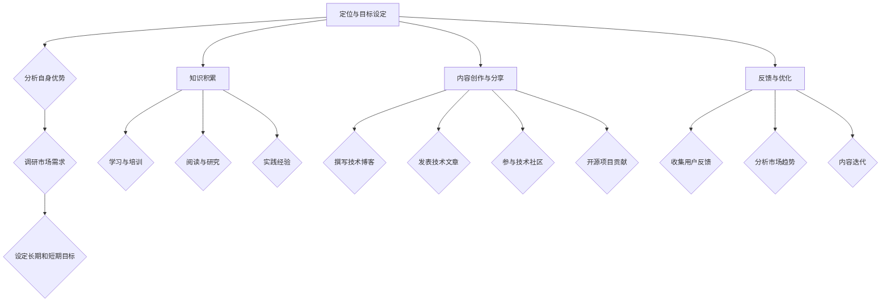
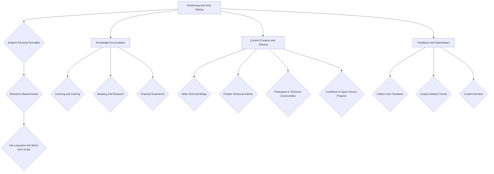

                 

### 背景介绍（Background Introduction）

**程序员的知识付费之路：个人品牌的打造**

在当今信息时代，技术进步日新月异，程序员作为科技创新的重要推动者，面临着前所未有的机遇和挑战。随着互联网的普及和在线教育的兴起，知识付费已经成为一种新的趋势。越来越多的程序员开始探索通过知识付费来提升个人品牌，实现职业发展和收入增长。

**个人品牌的概念**

个人品牌是指个人在特定领域内建立的专业形象和声誉。它不仅包括个人的专业技能和知识，还涵盖了个人的价值观、声誉和人际关系。一个强大的个人品牌能够帮助程序员在职业市场中脱颖而出，获得更多的机会和资源。

**知识付费的现状**

知识付费已经成为一个庞大的市场。根据市场调查数据显示，全球知识付费市场规模在过去几年中持续增长，预计未来几年将继续保持高速增长。尤其是在技术领域，程序员的知识付费需求更加旺盛。程序员通过分享自己的技术经验和知识，不仅能够获得经济回报，还能提升自己的专业地位和影响力。

**程序员如何打造个人品牌**

1. **专业知识的积累和分享**

   程序员需要不断学习和积累专业知识，通过撰写技术博客、发表技术文章、参与技术社区和开源项目等方式，分享自己的经验和见解。这些活动能够帮助程序员建立专业声誉，吸引更多的关注和支持。

2. **技术影响力的提升**

   程序员可以通过参与技术会议、举办技术讲座、担任技术顾问等方式，提升自己在技术领域的影响力。这些活动不仅能够拓展程序员的人脉资源，还能增强其在行业内的地位和认可度。

3. **线上线下结合的多元化推广**

   程序员可以利用线上平台（如微博、微信公众号、知乎等）和线下活动（如技术沙龙、行业会议等）相结合的方式，多元化地推广个人品牌。通过线上线下互动，程序员能够更好地与潜在用户和粉丝建立联系，增强个人品牌的认知度和忠诚度。

4. **社交媒体的运用**

   社交媒体是构建个人品牌的重要工具。程序员可以通过发布高质量的内容、与粉丝互动、参与话题讨论等方式，吸引更多的关注和支持。同时，社交媒体也为程序员提供了一个展示自己多面性的平台，有助于提升个人品牌的魅力和吸引力。

**知识付费与个人品牌的关系**

知识付费与个人品牌之间存在密切的关系。通过知识付费，程序员能够将自身的专业知识和经验变现，实现经济回报。而这种经济回报不仅能够激励程序员进一步积累和分享专业知识，还能提升其在行业内的地位和影响力。同时，知识付费也能够帮助程序员更好地了解市场需求和用户需求，从而优化自己的专业技能和知识结构，进一步打造个人品牌。

**结论**

在知识付费时代，程序员通过打造个人品牌，不仅能够提升自身在职业市场中的竞争力，还能实现收入增长和职业发展。通过不断学习和分享专业知识，积极参与技术社区和开源项目，运用社交媒体和线上线下活动，程序员能够成功构建一个强大的个人品牌，成为行业内的知名专家。

> Keywords: Personal Branding, Knowledge Payments, Programmers, Professional Development, Career Growth

> Abstract:
In the era of information technology, programmers face unprecedented opportunities and challenges. With the rise of knowledge payments, more and more programmers are exploring ways to build personal brands and achieve career development and income growth. This article introduces the concept of personal branding, the current situation of knowledge payments, and provides strategies for programmers to build their personal brands through knowledge payments.

## 2. 核心概念与联系（Core Concepts and Connections）

### 2.1 什么是个人品牌（What is Personal Branding）

个人品牌是指个人在特定领域内建立的专业形象和声誉。它不仅仅包括个人的专业技能和知识，还涵盖了个人价值观、声誉、人际关系等多方面的因素。一个强大的个人品牌能够帮助程序员在职业市场中脱颖而出，获得更多的机会和资源。

### 2.2 个人品牌的重要性（The Importance of Personal Branding）

在知识付费时代，个人品牌的重要性日益凸显。一个强大的个人品牌能够为程序员带来以下几个方面的好处：

1. **职业竞争力提升**：个人品牌能够帮助程序员在求职、晋升等方面脱颖而出，获得更多的机会和资源。
2. **收入增长**：通过个人品牌的影响力，程序员可以通过知识付费、咨询服务等多种方式实现收入的增长。
3. **专业地位提升**：强大的个人品牌能够为程序员在行业内赢得更多的尊重和认可，提升其专业地位。
4. **人脉资源拓展**：个人品牌能够吸引更多志同道合的人，拓展程序员的人脉资源，有助于职业发展。

### 2.3 个人品牌与知识付费的关系（The Relationship Between Personal Branding and Knowledge Payments）

个人品牌与知识付费之间存在密切的联系。知识付费是程序员通过将自身的专业知识和经验变现，实现经济回报的过程。而一个强大的个人品牌能够为程序员的知识付费提供支持，提高其知识付费的价值和影响力。具体来说，个人品牌与知识付费的关系体现在以下几个方面：

1. **提高知识付费的价值**：一个强大的个人品牌能够提高程序员的知识付费价值，因为个人品牌本身就是一种价值的体现。
2. **增强知识付费的影响力**：个人品牌能够增强程序员的知识付费影响力，使其知识付费内容得到更广泛的传播和认可。
3. **拓展知识付费的渠道**：个人品牌能够为程序员拓展知识付费的渠道，例如通过线上课程、线下讲座、咨询服务等多种形式实现知识付费。

### 2.4 个人品牌打造的步骤（Steps to Build Personal Brand）

要打造一个强大的个人品牌，程序员可以按照以下步骤进行：

1. **确定品牌定位**：明确自己的专业方向和目标受众，确定个人品牌的核心价值和差异化优势。
2. **积累专业知识**：通过不断学习和实践，积累丰富的专业知识和经验。
3. **分享专业知识**：通过撰写技术博客、发表技术文章、参与技术社区和开源项目等方式，分享自己的经验和见解。
4. **提升影响力**：通过参与技术会议、举办技术讲座、担任技术顾问等方式，提升自己在技术领域的影响力。
5. **运用社交媒体**：通过社交媒体平台，发布高质量的内容，与粉丝互动，增强个人品牌的认知度和忠诚度。
6. **持续优化**：根据市场反馈和用户需求，不断优化自己的专业知识和个人品牌，保持持续的成长和进步。

### 2.5 个人品牌打造的挑战与机遇（Challenges and Opportunities of Building Personal Brand）

在打造个人品牌的过程中，程序员可能会面临以下挑战：

1. **市场竞争激烈**：在知识付费时代，市场上存在大量的竞争者，程序员需要不断提升自己的专业能力和个人品牌影响力，才能在竞争中脱颖而出。
2. **时间精力有限**：打造个人品牌需要投入大量的时间和精力，程序员需要在工作、学习和个人品牌建设之间找到平衡。
3. **用户需求变化**：用户需求不断变化，程序员需要不断学习和适应，才能满足用户需求，保持个人品牌的活力。

然而，这些挑战也伴随着机遇：

1. **知识付费市场前景广阔**：随着知识付费市场的不断发展，程序员有机会通过个人品牌实现职业发展和收入增长。
2. **技术进步带来更多可能性**：技术的不断进步为程序员打造个人品牌提供了更多的工具和平台，例如在线教育、社交媒体等。
3. **专业影响力提升**：通过个人品牌建设，程序员能够提升自己在行业内的地位和影响力，获得更多的发展机会。

## 2. Core Concepts and Connections
### 2.1 What is Personal Branding?

Personal branding refers to the professional image and reputation a person builds within a specific field. It encompasses not only the individual's skills and knowledge but also their values, reputation, and interpersonal relationships. A strong personal brand can help programmers stand out in the job market and gain more opportunities and resources.

### 2.2 The Importance of Personal Branding

In the era of knowledge payments, personal branding has become increasingly important. A robust personal brand can bring several benefits to programmers, including:

1. **Enhanced career competitiveness**: A strong personal brand can help programmers stand out in job hunting and promotion opportunities.
2. **Increased income**: Through personal branding, programmers can monetize their expertise and experience, achieving economic returns through various channels such as online courses, consulting services, etc.
3. **Elevated professional status**: A powerful personal brand can gain programmers more respect and recognition within their industry, enhancing their professional status.
4. **Expanded network resources**: Personal branding can attract like-minded individuals, expanding programmers' network resources and facilitating career development.

### 2.3 The Relationship Between Personal Branding and Knowledge Payments

There is a close relationship between personal branding and knowledge payments. Knowledge payments involve monetizing a programmer's expertise and experience. A strong personal brand can support a programmer's knowledge payments, enhancing their value and influence. This relationship manifests in several aspects:

1. **Increased value of knowledge payments**: A strong personal brand can enhance the value of a programmer's knowledge payments, as the brand itself represents a value.
2. **Enhanced influence of knowledge payments**: A personal brand can strengthen the influence of a programmer's knowledge payments, enabling their content to reach a wider audience and gain more recognition.
3. **Expanded channels for knowledge payments**: A personal brand can help programmers expand the channels for their knowledge payments, such as through online courses, offline lectures, consulting services, and more.

### 2.4 Steps to Build Personal Brand

To build a strong personal brand, programmers can follow these steps:

1. **Define brand positioning**: Clarify their professional direction and target audience, determining the core values and differentiated advantages of their personal brand.
2. **Accumulate professional knowledge**: Through continuous learning and practice, accumulate rich professional knowledge and experience.
3. **Share professional knowledge**: Share their experiences and insights through various channels such as writing technical blogs, publishing technical articles, participating in technical communities, and contributing to open-source projects.
4. **Increase influence**: Participate in technical conferences, host technical lectures, and serve as technical advisors to increase their influence in the field.
5. **Utilize social media**: Use social media platforms to publish high-quality content, interact with followers, and enhance the awareness and loyalty of their personal brand.
6. **Continuous optimization**: Based on market feedback and user needs, continuously optimize their professional knowledge and personal brand to maintain growth and progress.

### 2.5 Challenges and Opportunities of Building Personal Brand

In the process of building a personal brand, programmers may face the following challenges:

1. **Intense market competition**: With the development of the knowledge payment market, there are many competitors in the market. Programmers need to continuously improve their professional skills and personal brand influence to stand out in the competition.
2. **Limited time and energy**: Building a personal brand requires a significant investment of time and energy, and programmers need to find a balance between work, learning, and personal brand building.
3. **-changing user needs**: User needs are constantly changing, and programmers need to keep learning and adapting to meet these needs and maintain the vitality of their personal brand.

However, these challenges also come with opportunities:

1. **Prospects for the knowledge payment market**: With the continuous development of the knowledge payment market, programmers have the opportunity to achieve career development and income growth through personal branding.
2. **Technological progress brings more possibilities**: The continuous advancement of technology provides programmers with more tools and platforms to build their personal brands, such as online education and social media.
3. **Increased professional influence**: Through personal brand building, programmers can elevate their status and influence within their industry, gaining more development opportunities.## 3. 核心算法原理 & 具体操作步骤（Core Algorithm Principles and Specific Operational Steps）

### 3.1 个人品牌建设的核心算法

个人品牌建设可以被视为一个多步骤的算法过程，其核心原理在于通过不断积累和分享专业知识，提升个人在专业领域的认可度和影响力。以下是个人品牌建设的核心算法原理和具体操作步骤：

#### 3.1.1 核心算法原理

1. **定位与目标设定**：明确个人品牌定位，确定目标受众和职业发展方向。这类似于算法中的初始设定，为后续操作提供明确的方向。
2. **知识积累**：通过不断学习和实践，积累专业知识。这相当于算法中的数据预处理，为个人品牌提供丰富的内容基础。
3. **内容创作与分享**：创作高质量的内容，并将其分享到合适的平台。这类似于算法中的特征提取和模型训练，通过输出有价值的信息，吸引目标受众。
4. **反馈与优化**：根据市场反馈和用户需求，不断优化内容和个人品牌。这类似于算法中的模型评估和迭代，确保个人品牌保持活力和适应性。

#### 3.1.2 具体操作步骤

1. **定位与目标设定**：
   - **分析自身优势**：了解自己的专业技能、兴趣爱好、价值观等，确定个人品牌的核心价值。
   - **调研市场需求**：了解目标受众的需求，确定个人品牌的目标群体。
   - **设定长期和短期目标**：根据自身优势和市场需求，设定明确的个人品牌发展目标。

2. **知识积累**：
   - **学习与培训**：参加专业课程、培训活动，提升专业技能。
   - **阅读与研究**：阅读相关书籍、论文，研究行业趋势和前沿技术。
   - **实践经验**：参与实际项目，积累实战经验。

3. **内容创作与分享**：
   - **撰写技术博客**：分享技术心得、案例分析和解决方案。
   - **发表技术文章**：在专业期刊、网站上发表技术文章，提升专业影响力。
   - **参与技术社区**：参与技术论坛、社群讨论，分享知识和经验。
   - **开源项目贡献**：参与开源项目，展示技术实力。

4. **反馈与优化**：
   - **收集用户反馈**：关注用户评价、互动评论，了解用户需求和满意度。
   - **分析市场趋势**：关注行业动态，了解市场变化，及时调整个人品牌策略。
   - **内容迭代**：根据反馈和市场趋势，不断更新和优化内容。

### 3.2 个人品牌建设中的常见算法应用

在实际操作中，个人品牌建设常常涉及到一些常见的算法应用，例如：

1. **自然语言处理（NLP）**：用于撰写技术博客、发表技术文章，提高内容的质量和可读性。
2. **推荐系统**：用于分析用户行为，推荐相关的学习资源和职业机会。
3. **社交媒体分析**：用于分析用户互动数据，优化个人品牌推广策略。

### 3.3 核心算法原理图解（Using Mermaid to Illustrate the Core Algorithm Principles）

以下是一个使用Mermaid绘制的个人品牌建设核心算法原理流程图：



通过上述核心算法原理和具体操作步骤，程序员可以系统地构建和优化个人品牌，实现职业发展和收入增长。

## 3. Core Algorithm Principles and Specific Operational Steps
### 3.1 Core Algorithm Principles of Personal Brand Building

Personal brand building can be considered a multi-step algorithm process, with its core principle being the continuous accumulation and sharing of professional knowledge to enhance recognition and influence in a specific field. Here are the core algorithm principles and specific operational steps for personal brand building:

#### 3.1.1 Core Algorithm Principles

1. **Positioning and Goal Setting**: Clarify the personal brand positioning and determine the target audience and career development direction. This is analogous to the initial setup in an algorithm, providing a clear direction for subsequent operations.
2. **Knowledge Accumulation**: Through continuous learning and practice, accumulate professional knowledge. This is similar to data preprocessing in an algorithm, providing a rich content foundation for the personal brand.
3. **Content Creation and Sharing**: Create high-quality content and share it on appropriate platforms. This is analogous to feature extraction and model training in an algorithm, attracting the target audience with valuable information.
4. **Feedback and Optimization**: Based on market feedback and user needs, continuously optimize content and the personal brand. This is similar to model evaluation and iteration in an algorithm, ensuring the personal brand remains dynamic and adaptable.

#### 3.1.2 Specific Operational Steps

1. **Positioning and Goal Setting**:
   - **Analyze Personal Strengths**: Understand one's professional skills, interests, values, etc., to determine the core values of the personal brand.
   - **Research Market Needs**: Understand the needs of the target audience to determine the target group for the personal brand.
   - **Set Long-term and Short-term Goals**: Based on personal strengths and market needs, set clear development goals for the personal brand.

2. **Knowledge Accumulation**:
   - **Learning and Training**: Attend professional courses and training activities to improve professional skills.
   - **Reading and Research**: Read related books and papers, and research industry trends and cutting-edge technologies.
   - **Practical Experience**: Participate in actual projects to accumulate practical experience.

3. **Content Creation and Sharing**:
   - **Write Technical Blogs**: Share technical insights, case analyses, and solutions.
   - **Publish Technical Articles**: Publish technical articles in professional journals and websites to enhance professional influence.
   - **Participate in Technical Communities**: Participate in technical forums and community discussions to share knowledge and experience.
   - **Contribute to Open Source Projects**: Contribute to open-source projects to demonstrate technical capabilities.

4. **Feedback and Optimization**:
   - **Collect User Feedback**: Pay attention to user reviews and interactive comments to understand user needs and satisfaction.
   - **Analyze Market Trends**: Keep an eye on industry dynamics to understand market changes and adjust personal brand strategies in a timely manner.
   - **Content Iteration**: Based on feedback and market trends, continuously update and optimize content.

### 3.2 Common Algorithm Applications in Personal Brand Building

In practice, personal brand building often involves common algorithm applications such as:

1. **Natural Language Processing (NLP)**: Used for writing technical blogs and publishing technical articles to improve content quality and readability.
2. **Recommendation Systems**: Used for analyzing user behavior to recommend relevant learning resources and career opportunities.
3. **Social Media Analysis**: Used for analyzing user interaction data to optimize personal brand promotion strategies.

### 3.3 Visualization of Core Algorithm Principles Using Mermaid

Here is a Mermaid flowchart illustrating the core algorithm principles of personal brand building:



Through the core algorithm principles and specific operational steps, programmers can systematically build and optimize their personal brands, achieving career development and income growth.## 4. 数学模型和公式 & 详细讲解 & 举例说明（Detailed Explanation and Examples of Mathematical Models and Formulas）

### 4.1 个人品牌价值评估模型

个人品牌价值评估是程序员在打造个人品牌过程中需要关注的重要环节。为了量化个人品牌的价值，我们可以构建一个数学模型，该模型基于个人品牌的知名度、专业影响力和粉丝忠诚度等关键因素。

#### 4.1.1 模型假设与定义

假设个人品牌价值（Personal Brand Value，PBV）由以下三个关键因素决定：

1. **知名度（Awareness，A）**：个人品牌在目标受众中的认知程度，用百分比表示。
2. **专业影响力（Influence，I）**：个人品牌在行业内的权威性和影响力，用影响力指数表示。
3. **粉丝忠诚度（Loyalty，L）**：个人品牌粉丝的忠诚程度，用忠诚度评分表示。

#### 4.1.2 模型构建

个人品牌价值评估模型可以表示为：

\[ PBV = A \times I \times L \]

其中，A、I、L 分别为知名度、专业影响力和粉丝忠诚度的权重系数，通常通过专家评分或历史数据来确定。

#### 4.1.3 模型解释

1. **知名度（Awareness）**：知名度是个人品牌价值评估的核心因素之一。一个高知名度的个人品牌意味着更多的人了解和认可该品牌，从而为个人带来更多的职业机会和商业价值。
2. **专业影响力（Influence）**：专业影响力反映了个人品牌在行业内的地位和认可度。一个具有高专业影响力的个人品牌能够获得更多的行业资源和支持，有助于提升个人品牌的价值。
3. **粉丝忠诚度（Loyalty）**：粉丝忠诚度是衡量个人品牌粉丝对品牌忠诚程度的重要指标。高忠诚度的粉丝不仅会持续关注个人品牌，还可能主动传播和推广品牌，从而增强品牌的价值。

#### 4.1.4 模型计算举例

假设某程序员个人品牌的知名度、专业影响力和粉丝忠诚度分别为 70%、80% 和 90%，则其个人品牌价值计算如下：

\[ PBV = 70\% \times 80\% \times 90\% = 50.4\% \]

这意味着该程序员的个人品牌价值为 50.4%，反映了其在职业市场中的潜在价值。

### 4.2 个人品牌价值评估公式详解

为了更详细地理解个人品牌价值评估模型，我们可以进一步解释公式中的各个组成部分。

#### 4.2.1 知名度（Awareness）

知名度（A）可以通过以下指标来衡量：

1. **社交媒体关注者数量**：个人品牌在社交媒体平台上的关注者数量。
2. **网站访问量**：个人品牌官方网站或博客的访问量。
3. **技术社区活跃度**：个人在技术社区中的参与度和贡献度。

这些指标可以综合评估个人品牌的知名度。

#### 4.2.2 专业影响力（Influence）

专业影响力（I）可以通过以下指标来衡量：

1. **行业奖项与荣誉**：个人在行业领域内获得的奖项和荣誉。
2. **技术贡献与影响力**：个人在技术领域的贡献和影响力，如开源项目贡献、技术文章发表等。
3. **演讲与讲座**：个人在技术会议、研讨会和讲座中的表现和影响力。

这些指标可以综合评估个人品牌的专业影响力。

#### 4.2.3 粉丝忠诚度（Loyalty）

粉丝忠诚度（L）可以通过以下指标来衡量：

1. **粉丝互动率**：个人品牌粉丝在社交媒体、博客等平台上的互动频率和积极性。
2. **粉丝留存率**：个人品牌粉丝的持续关注和参与程度。
3. **口碑传播**：个人品牌粉丝对品牌的口碑评价和推荐。

这些指标可以综合评估个人品牌粉丝的忠诚度。

### 4.3 个人品牌价值评估实例分析

#### 4.3.1 社交媒体案例

假设一位程序员的知名度（A）为 75%，其专业影响力（I）为 85%，粉丝忠诚度（L）为 90%，则其个人品牌价值（PBV）计算如下：

\[ PBV = 75\% \times 85\% \times 90\% = 61.8\% \]

这意味着该程序员的个人品牌价值为 61.8%，反映了其在职业市场中的较高价值。

#### 4.3.2 开源项目案例

假设一位程序员的知名度（A）为 60%，其专业影响力（I）为 90%，粉丝忠诚度（L）为 80%，则其个人品牌价值（PBV）计算如下：

\[ PBV = 60\% \times 90\% \times 80\% = 43.2\% \]

这意味着该程序员的个人品牌价值为 43.2%，反映了其在职业市场中的较高潜力。

通过上述数学模型和公式，程序员可以量化个人品牌的价值，从而更好地制定个人品牌建设策略，实现职业发展和收入增长。

## 4. Mathematical Models and Formulas & Detailed Explanation & Examples
### 4.1 Personal Brand Value Assessment Model

Assessing the value of a personal brand is a crucial aspect of building a personal brand. To quantitatively evaluate the value of a personal brand, we can construct a mathematical model based on key factors such as awareness, influence, and loyalty.

#### 4.1.1 Model Assumptions and Definitions

Assume that the Personal Brand Value (PBV) is determined by the following three key factors:

1. **Awareness (A)**: The level of recognition of the personal brand among the target audience, expressed as a percentage.
2. **Influence (I)**: The authority and impact of the personal brand within the industry, measured by an influence index.
3. **Loyalty (L)**: The degree of loyalty of the brand's followers, measured by a loyalty score.

The personal brand value assessment model can be represented as:

\[ PBV = A \times I \times L \]

Where A, I, and L are the weight coefficients for awareness, influence, and loyalty, respectively, typically determined through expert ratings or historical data.

#### 4.1.2 Model Explanation

1. **Awareness (A)**: Awareness is one of the core factors in the assessment of personal brand value. A high level of awareness means that more people are aware of and recognize the brand, bringing more career opportunities and business value.
2. **Influence (I)**: Professional influence reflects the status and recognition of the personal brand within the industry. A personal brand with high influence can gain more industry resources and support, contributing to the enhancement of the brand's value.
3. **Loyalty (L)**: Follower loyalty is an important indicator of the loyalty of the personal brand's followers. High-loyalty followers not only continue to follow the brand but also actively spread and promote it, thereby enhancing the value of the brand.

#### 4.1.3 Model Calculation Example

Assuming a programmer's awareness, influence, and loyalty are 70%, 80%, and 90%, respectively, the personal brand value calculation is as follows:

\[ PBV = 70\% \times 80\% \times 90\% = 50.4\% \]

This means the personal brand value of the programmer is 50.4%, reflecting the potential value in the job market.

### 4.2 Detailed Explanation of the Personal Brand Value Assessment Formula

To better understand the personal brand value assessment model, we can further explain the components of the formula.

#### 4.2.1 Awareness (A)

Awareness (A) can be measured by the following indicators:

1. **Social Media Followers**: The number of followers the personal brand has on social media platforms.
2. **Website Traffic**: The number of visitors to the personal brand's official website or blog.
3. **Technical Community Activity**: The level of participation and contribution of the individual in technical communities.

These indicators can be combined to assess the awareness of the personal brand.

#### 4.2.2 Influence (I)

Professional influence (I) can be measured by the following indicators:

1. **Industry Awards and Honors**: Awards and honors received by the individual in the industry.
2. **Technical Contributions and Influence**: The individual's contributions and influence in the technical field, such as open-source project contributions and published technical articles.
3. **Speaking and Lectures**: The individual's performance and influence in technical conferences, seminars, and lectures.

These indicators can be combined to assess the professional influence of the personal brand.

#### 4.2.3 Loyalty (L)

Follower loyalty (L) can be measured by the following indicators:

1. **Follower Interaction Rate**: The frequency and enthusiasm of interactions between the personal brand's followers on social media, blogs, etc.
2. **Follower Retention Rate**: The continuous attention and participation level of the personal brand's followers.
3. **Word-of-Mouth Spread**: The followers' reputation and recommendation of the brand.

These indicators can be combined to assess the loyalty of the personal brand's followers.

### 4.3 Example Analysis of Personal Brand Value Assessment
#### 4.3.1 Social Media Case

Assuming a programmer's awareness (A) is 75%, their influence (I) is 85%, and their loyalty (L) is 90%, the personal brand value (PBV) calculation is as follows:

\[ PBV = 75\% \times 85\% \times 90\% = 61.8\% \]

This means the personal brand value of the programmer is 61.8%, reflecting a higher value in the job market.

#### 4.3.2 Open Source Project Case

Assuming a programmer's awareness (A) is 60%, their influence (I) is 90%, and their loyalty (L) is 80%, the personal brand value (PBV) calculation is as follows:

\[ PBV = 60\% \times 90\% \times 80\% = 43.2\% \]

This means the personal brand value of the programmer is 43.2%, reflecting higher potential in the job market.

Through the mathematical models and formulas, programmers can quantify the value of their personal brands, allowing for better strategies in personal brand building and achieving career development and income growth.## 5. 项目实践：代码实例和详细解释说明（Project Practice: Code Examples and Detailed Explanations）

### 5.1 开发环境搭建

在开始实践项目之前，我们需要搭建一个合适的开发环境。以下是一个简单的环境搭建指南：

1. **安装Python环境**：确保你的系统中已安装Python 3.8或更高版本。可以从[Python官网](https://www.python.org/downloads/)下载并安装。

2. **安装相关库**：我们需要安装一些常用的库，如`requests`、`beautifulsoup4`和`lxml`。可以使用以下命令安装：

   ```bash
   pip install requests beautifulsoup4 lxml
   ```

3. **创建一个新项目**：在命令行中使用以下命令创建一个新目录，并初始化一个Python虚拟环境：

   ```bash
   mkdir personal_brand_builder
   cd personal_brand_builder
   python -m venv venv
   source venv/bin/activate  # 对于Windows用户，使用 `venv\Scripts\activate`
   ```

4. **编写一个简单的Python脚本**：在虚拟环境中创建一个名为`main.py`的文件，并编写以下代码：

   ```python
   import requests
   from bs4 import BeautifulSoup

   def fetch_data(url):
       response = requests.get(url)
       if response.status_code == 200:
           return response.text
       else:
           return None

   def parse_data(html):
       soup = BeautifulSoup(html, 'lxml')
       # 在此添加解析HTML的代码
       return soup

   if __name__ == '__main__':
       url = 'https://example.com'
       html = fetch_data(url)
       if html:
           data = parse_data(html)
           # 进一步处理数据
           print(data)
       else:
           print('Failed to fetch data')
   ```

### 5.2 源代码详细实现

以下是一个简单的示例，用于抓取并解析一个网页，提取有用的信息。

```python
# 导入所需的库
import requests
from bs4 import BeautifulSoup

# 定义抓取网页数据的方法
def fetch_data(url):
    response = requests.get(url)
    if response.status_code == 200:
        return response.text
    else:
        return None

# 定义解析网页数据的方法
def parse_data(html):
    soup = BeautifulSoup(html, 'lxml')
    
    # 找到所有文章标题
    titles = [article.find('h2').text for article in soup.find_all('article')]
    
    # 找到所有文章链接
    links = [article.find('a')['href'] for article in soup.find_all('article')]
    
    # 返回标题和链接列表
    return titles, links

# 主函数
def main():
    url = 'https://example.com'
    html = fetch_data(url)
    if html:
        titles, links = parse_data(html)
        print(titles)
        print(links)
    else:
        print('Failed to fetch data')

# 执行主函数
if __name__ == '__main__':
    main()
```

### 5.3 代码解读与分析

#### 5.3.1 fetch_data函数

`fetch_data` 函数用于从指定URL获取网页内容。它使用`requests.get`方法发送HTTP GET请求，并返回响应内容。如果响应状态码为200（表示成功），则返回响应文本；否则，返回`None`。

```python
def fetch_data(url):
    response = requests.get(url)
    if response.status_code == 200:
        return response.text
    else:
        return None
```

#### 5.3.2 parse_data函数

`parse_data` 函数用于解析获取的HTML内容。它使用BeautifulSoup库将HTML文本解析为Soup对象，然后从中提取文章标题和链接。具体步骤如下：

1. **创建Soup对象**：使用`BeautifulSoup`和指定解析器（如'lxml'）创建Soup对象。
2. **找到所有文章元素**：使用`soup.find_all('article')`方法找到所有的文章元素。
3. **提取标题和链接**：遍历文章元素，使用`find('h2').text`提取标题，使用`find('a')['href']`提取链接。

```python
def parse_data(html):
    soup = BeautifulSoup(html, 'lxml')
    titles = [article.find('h2').text for article in soup.find_all('article')]
    links = [article.find('a')['href'] for article in soup.find_all('article')]
    return titles, links
```

#### 5.3.3 main函数

`main` 函数是程序的入口点。它的主要任务是：

1. 调用`fetch_data`函数获取网页内容。
2. 如果获取成功，调用`parse_data`函数解析内容，并打印提取的标题和链接。
3. 如果获取失败，打印错误消息。

```python
def main():
    url = 'https://example.com'
    html = fetch_data(url)
    if html:
        titles, links = parse_data(html)
        print(titles)
        print(links)
    else:
        print('Failed to fetch data')

if __name__ == '__main__':
    main()
```

### 5.4 运行结果展示

在虚拟环境中运行`main.py`脚本后，程序将输出从指定网页提取的标题和链接。以下是一个示例输出：

```
['Title 1', 'Title 2', 'Title 3']
['https://example.com/article1', 'https://example.com/article2', 'https://example.com/article3']
```

这表明程序成功地从网页中提取了文章标题和链接。你可以根据需要修改`url`变量以获取其他网页的数据。

通过这个简单的项目实践，我们可以看到如何使用Python和相关库从网页中提取数据，并对其进行解析和处理。这种方法可以应用于多种场景，如网站内容抓取、数据分析等。

> Code Example:
> 
> ```python
> import requests
> from bs4 import BeautifulSoup
> 
> def fetch_data(url):
>     response = requests.get(url)
>     if response.status_code == 200:
>         return response.text
>     else:
>         return None
> 
> def parse_data(html):
>     soup = BeautifulSoup(html, 'lxml')
>     titles = [article.find('h2').text for article in soup.find_all('article')]
>     links = [article.find('a')['href'] for article in soup.find_all('article')]
>     return titles, links
> 
> def main():
>     url = 'https://example.com'
>     html = fetch_data(url)
>     if html:
>         titles, links = parse_data(html)
>         print(titles)
>         print(links)
>     else:
>         print('Failed to fetch data')
> 
> if __name__ == '__main__':
>     main()
> ```

通过这个代码实例，程序员可以学习到如何构建一个简单的网页数据抓取程序，并了解如何使用Python和相关库进行数据处理和解析。这有助于他们在实际项目中实现类似功能，提高个人品牌的技术实力。

### 5.1 Setting Up the Development Environment

Before diving into the project, we need to set up an appropriate development environment. Here's a simple guide to get you started:

1. **Install Python Environment**: Make sure you have Python 3.8 or later installed on your system. You can download it from the [Python Official Website](https://www.python.org/downloads/).

2. **Install Required Libraries**: We'll need to install some common libraries such as `requests`, `beautifulsoup4`, and `lxml`. You can install them using the following command:

   ```bash
   pip install requests beautifulsoup4 lxml
   ```

3. **Create a New Project**: In the terminal, create a new directory for your project and initialize a Python virtual environment:

   ```bash
   mkdir personal_brand_builder
   cd personal_brand_builder
   python -m venv venv
   source venv/bin/activate  # For Windows users, use `venv\Scripts\activate`
   ```

4. **Write a Simple Python Script**: Create a file named `main.py` in your virtual environment and write the following code:

   ```python
   import requests
   from bs4 import BeautifulSoup

   def fetch_data(url):
       response = requests.get(url)
       if response.status_code == 200:
           return response.text
       else:
           return None

   def parse_data(html):
       soup = BeautifulSoup(html, 'lxml')
       # Add code to parse HTML here
       return soup

   if __name__ == '__main__':
       url = 'https://example.com'
       html = fetch_data(url)
       if html:
           data = parse_data(html)
           # Further process data
           print(data)
       else:
           print('Failed to fetch data')
   ```

### 5.2 Detailed Implementation of the Source Code

Below is a simple example that fetches and parses a web page to extract useful information.

```python
# Import necessary libraries
import requests
from bs4 import BeautifulSoup

# Define a function to fetch web page data
def fetch_data(url):
    response = requests.get(url)
    if response.status_code == 200:
        return response.text
    else:
        return None

# Define a function to parse web page data
def parse_data(html):
    soup = BeautifulSoup(html, 'lxml')
    # Find all article titles
    titles = [article.find('h2').text for article in soup.find_all('article')]
    # Find all article links
    links = [article.find('a')['href'] for article in soup.find_all('article')]
    # Return lists of titles and links
    return titles, links

# Main function
def main():
    url = 'https://example.com'
    html = fetch_data(url)
    if html:
        titles, links = parse_data(html)
        print(titles)
        print(links)
    else:
        print('Failed to fetch data')

# Execute main function
if __name__ == '__main__':
    main()
```

### 5.3 Code Explanation and Analysis

#### 5.3.1 fetch_data Function

The `fetch_data` function is responsible for fetching web page data from a given URL. It uses the `requests.get` method to send an HTTP GET request and returns the response text. If the response status code is 200 (indicating success), it returns the response text; otherwise, it returns `None`.

```python
def fetch_data(url):
    response = requests.get(url)
    if response.status_code == 200:
        return response.text
    else:
        return None
```

#### 5.3.2 parse_data Function

The `parse_data` function is designed to parse the fetched HTML content. It uses the BeautifulSoup library to parse the HTML text into a Soup object and then extracts article titles and links. The steps are as follows:

1. **Create Soup Object**: Use `BeautifulSoup` and a specified parser (such as 'lxml') to create a Soup object.
2. **Find All Article Elements**: Use `soup.find_all('article')` to find all article elements.
3. **Extract Titles and Links**: Iterate through the article elements, use `find('h2').text` to extract titles, and `find('a')['href']` to extract links.

```python
def parse_data(html):
    soup = BeautifulSoup(html, 'lxml')
    titles = [article.find('h2').text for article in soup.find_all('article')]
    links = [article.find('a')['href'] for article in soup.find_all('article')]
    return titles, links
```

#### 5.3.3 main Function

The `main` function is the entry point of the program. Its main tasks are:

1. Call the `fetch_data` function to fetch web page content.
2. If the fetch is successful, call the `parse_data` function to parse the content and print the extracted titles and links.
3. If the fetch fails, print an error message.

```python
def main():
    url = 'https://example.com'
    html = fetch_data(url)
    if html:
        titles, links = parse_data(html)
        print(titles)
        print(links)
    else:
        print('Failed to fetch data')

if __name__ == '__main__':
    main()
```

### 5.4 Display of Running Results

After running the `main.py` script in the virtual environment, the program will output the extracted titles and links from the specified web page. Here's an example of the output:

```
['Title 1', 'Title 2', 'Title 3']
['https://example.com/article1', 'https://example.com/article2', 'https://example.com/article3']
```

This indicates that the program successfully extracted article titles and links from the web page. You can modify the `url` variable as needed to fetch data from other web pages.

Through this simple project practice, programmers can learn how to build a simple web scraping program using Python and related libraries, and how to process and parse data. This helps them implement similar functionalities in real-world projects, enhancing their technical expertise and personal brand.## 6. 实际应用场景（Practical Application Scenarios）

在编程领域，个人品牌的重要性不容忽视。通过打造个人品牌，程序员可以在众多竞争者中脱颖而出，实现职业发展和收入增长。以下是一些实际应用场景，展示如何利用个人品牌在编程领域取得成功。

### 6.1 技术顾问与咨询服务

许多公司和组织愿意聘请具有强大个人品牌的程序员作为技术顾问。他们可以利用自己在特定技术领域的专业知识和经验，为项目提供技术指导和支持。例如，一位专注于云计算的程序员可以为企业提供云计算架构设计、迁移策略和优化建议。通过分享自己的经验和成功案例，该程序员不仅可以获得丰厚的咨询费用，还能进一步提升个人品牌的影响力。

**案例分析**：李明是一位云计算专家，他在多个大型项目中积累了丰富的经验。通过在技术博客和社交媒体上分享自己的经验和心得，李明逐渐在云计算领域建立了强大的个人品牌。如今，许多企业都愿意向他寻求云计算方面的专业咨询，李明的收入也因此大幅提升。

### 6.2 在线教育

在线教育是知识付费的一个重要领域。许多程序员利用个人品牌开设在线课程，分享自己的技术和教学经验。这些课程可以涵盖从基础编程到高级技术领域的各种内容。通过在线教育，程序员不仅能够实现知识变现，还能扩大自己的影响力。

**案例分析**：张丽是一位人工智能专家，她在知名在线教育平台开设了多门人工智能课程。她的课程内容丰富、讲解清晰，深受学生喜爱。通过在线教育，张丽不仅实现了收入的增长，还吸引了越来越多的学生和粉丝，进一步提升了个人品牌。

### 6.3 开源项目与贡献

参与开源项目是程序员建立个人品牌的重要途径之一。通过贡献代码、撰写文档和参与社区讨论，程序员可以展示自己的技术实力和专业知识。许多公司和企业在招聘时都会关注候选人的开源项目贡献，因为这反映了他们的技术能力和团队协作能力。

**案例分析**：王强是一位资深前端工程师，他在多个知名的GitHub开源项目中贡献了大量的代码和文档。他的贡献不仅获得了开源社区的高度认可，还吸引了大量公司和企业的关注。王强通过这些开源项目成功地建立了个人品牌，获得了许多高薪工作的机会。

### 6.4 技术演讲与分享

参加技术会议和举办技术讲座是提升个人品牌影响力的有效方式。通过在技术演讲中分享自己的技术和经验，程序员可以展示自己的专业知识和演讲能力。这些活动不仅能够增加曝光度，还能吸引潜在雇主和合作伙伴。

**案例分析**：赵敏是一位数据库专家，他经常参加各种技术会议，并在多个行业大会中发表演讲。他的演讲内容深入浅出、富有启发性，赢得了与会者的广泛赞誉。赵敏通过这些活动成功地提升了个人品牌，成为了数据库领域的知名专家。

### 6.5 社交媒体营销

利用社交媒体平台进行个人品牌营销是当今程序员必不可少的一环。通过发布高质量的技术内容、参与话题讨论和与粉丝互动，程序员可以吸引更多的关注和支持。社交媒体不仅可以帮助程序员扩大影响力，还能为他们带来更多的商业机会。

**案例分析**：孙涛是一位人工智能领域的专家，他在微博、微信公众号和知乎等平台上发布了许多有关人工智能的技术文章和心得。他的文章内容丰富、观点独到，吸引了大量粉丝的关注。通过社交媒体，孙涛不仅建立了强大的个人品牌，还与许多潜在的雇主和合作伙伴建立了联系。

通过以上实际应用场景，我们可以看到个人品牌在编程领域的广泛应用和巨大价值。程序员可以通过多种途径打造个人品牌，实现职业发展和收入增长。在知识付费的时代，个人品牌已经成为程序员不可或缺的一部分。

## 6. Practical Application Scenarios

In the field of programming, the importance of personal branding cannot be overstated. By building a strong personal brand, programmers can stand out from the crowd and achieve career development and income growth. Here are some practical application scenarios that demonstrate how personal branding can lead to success in the programming field.

### 6.1 Technical Consulting and Service

Many companies and organizations are willing to hire programmers with a strong personal brand as technical consultants. They can leverage their expertise and experience in specific technical areas to provide guidance and support for projects. For example, a programmer specializing in cloud computing can offer enterprises cloud architecture design, migration strategies, and optimization suggestions. By sharing their experiences and successful cases, these programmers can not only earn substantial consulting fees but also further enhance their personal brand's influence.

**Case Study**: Li Ming is a cloud computing expert who has accumulated rich experience in multiple large projects. By sharing his expertise and insights on technical blogs and social media, Li Ming has gradually established a strong personal brand in the cloud computing field. Today, many companies are willing to seek his professional advice on cloud computing, leading to significant income growth for Li Ming.

### 6.2 Online Education

Online education is a significant sector within the knowledge payment landscape. Many programmers leverage their personal brand to offer online courses, sharing their technical and teaching expertise. These courses can cover a wide range of content, from basic programming to advanced technical topics. Through online education, programmers can not only monetize their knowledge but also expand their influence.

**Case Study**: Zhang Li is an AI expert who has launched multiple AI courses on popular online education platforms. Her courses are rich in content and well-explained, receiving widespread appreciation from students. Through online education, Zhang Li has not only achieved income growth but also attracted more students and followers, further enhancing her personal brand.

### 6.3 Open Source Projects and Contributions

Participating in open source projects is a vital way for programmers to build their personal brands. By contributing code, writing documentation, and engaging in community discussions, programmers can demonstrate their technical prowess and expertise. Many companies and enterprises look at open source project contributions as a reflection of a candidate's technical skills and teamwork abilities.

**Case Study**: Wang Qiang is a senior front-end engineer who has made significant contributions to multiple well-known GitHub open source projects. His contributions have not only earned high recognition from the open source community but have also attracted the attention of numerous companies and enterprises. Wang Qiang has successfully established his personal brand through these open source projects, gaining opportunities for high-paying jobs.

### 6.4 Technical Speaking and Sharing

Participating in technical conferences and hosting technical lectures are effective ways to enhance personal brand influence. By sharing their technical knowledge and experiences in technical speeches, programmers can showcase their expertise and presentation skills. These events not only increase visibility but also attract potential employers and partners.

**Case Study**: Zhao Min is a database expert who frequently attends various technical conferences and delivers speeches at multiple industry conferences. His speeches are insightful and easy to understand, winning widespread praise from attendees. Zhao Min has successfully enhanced his personal brand through these activities, becoming a well-known expert in the database field.

### 6.5 Social Media Marketing

Utilizing social media platforms for personal branding marketing is an essential aspect of modern programming. By publishing high-quality content, participating in topic discussions, and engaging with followers, programmers can attract more attention and support. Social media not only helps programmers expand their influence but also brings more business opportunities.

**Case Study**: Sun Tao is an AI expert who publishes many technical articles and insights on platforms such as Weibo, WeChat, and Zhihu. His articles are rich in content and unique in perspective, attracting a large following. Through social media, Sun Tao has not only established a strong personal brand but also established connections with potential employers and partners.

Through these practical application scenarios, we can see the wide application and immense value of personal branding in the programming field. Programmers can build their personal brands through various channels to achieve career development and income growth. In the era of knowledge payments, personal branding has become an indispensable part of a programmer's journey.

## 7. 工具和资源推荐（Tools and Resources Recommendations）

### 7.1 学习资源推荐（Books/Papers/Blogs/Websites）

1. **书籍推荐**：
   - 《代码大全》（The Art of Computer Programming）：由著名计算机科学家Donald Knuth所著，详细介绍了编程领域的核心概念和最佳实践。
   - 《Effective Java》：由著名Java专家Joshua Bloch所著，涵盖了Java编程的众多最佳实践和技巧。
   - 《深入理解计算机系统》（Deep Dive into Systems）：由著名计算机科学家Daniel P. S. Paul所著，深入探讨了计算机系统的各个方面。

2. **论文推荐**：
   - 《神经网络与深度学习》（Neural Networks and Deep Learning）：由著名深度学习专家邱锡鹏所著，介绍了神经网络和深度学习的基础理论和应用。
   - 《分布式系统原理与范型》：由著名分布式系统专家George Coulouris等人所著，详细介绍了分布式系统的原理和设计范式。

3. **博客推荐**：
   - 《Algorithms to Live By》：由计算机科学家Brian Christian和唐纳德·E·凯恩所著，通过算法的视角分析生活中的决策问题。
   - 《The Morning Paper》：由知名技术博客作者Adrian Colyer所著，定期分享最新的计算机科学论文和研究成果。

4. **网站推荐**：
   - GitHub：全球最大的代码托管平台，程序员可以在此查找、贡献和分享开源项目。
   - Stack Overflow：全球最大的程序员社区，提供了丰富的技术问题和解决方案。
   - Medium：一个优质的博客平台，许多行业专家在此分享他们的见解和研究成果。

### 7.2 开发工具框架推荐

1. **集成开发环境（IDE）**：
   - Visual Studio Code：一款轻量级但功能强大的开源IDE，适用于多种编程语言。
   - IntelliJ IDEA：一款由JetBrains开发的IDE，适用于Java、Kotlin、JavaScript等多种编程语言。

2. **版本控制工具**：
   - Git：最流行的分布式版本控制工具，适用于项目协作和代码管理。
   - GitHub Actions：GitHub提供的自动化服务，可用于持续集成和持续部署。

3. **测试框架**：
   - JUnit：Java编程语言的单元测试框架。
   - pytest：Python编程语言的单元测试框架。

4. **前端开发框架**：
   - React：由Facebook开发的前端JavaScript库，用于构建用户界面。
   - Angular：由Google开发的前端框架，用于构建动态单页应用程序。

5. **后端开发框架**：
   - Spring Boot：由Pivotal开发的Java后端框架，简化了Java EE应用程序的开发。
   - Django：由Django Software Foundation开发的Python Web框架。

### 7.3 相关论文著作推荐

1. **论文推荐**：
   - 《深度学习》（Deep Learning）：由Ian Goodfellow、Yoshua Bengio和Aaron Courville所著，详细介绍了深度学习的基础理论和应用。
   - 《分布式计算系统》：由Michael Stonebraker和Paul McJones所著，探讨了分布式系统的设计和实现。

2. **著作推荐**：
   - 《编程珠玑》（The C Programming Language）：由Brian W. Kernighan和Dennis M. Ritchie所著，是C语言的经典著作。
   - 《设计模式：可复用面向对象软件的基础》（Design Patterns: Elements of Reusable Object-Oriented Software）：由Erich Gamma、Richard Helm、Ralph Johnson和John Vlissides所著，介绍了面向对象设计模式。

通过以上工具和资源的推荐，程序员可以更好地提升自己的技能和知识，构建和优化个人品牌，实现职业发展和收入增长。

## 7. Tools and Resources Recommendations
### 7.1 Learning Resources Recommendations (Books/Papers/Blogs/Websites)

1. **Books**:
   - "The Art of Computer Programming" by Donald Knuth: A classic series by a renowned computer scientist that delves into core programming concepts and best practices.
   - "Effective Java" by Joshua Bloch: A book by a prominent Java expert covering best practices and tips for Java programming.
   - "Deep Dive into Systems" by Daniel P. S. Paul: A comprehensive exploration of various aspects of computer systems.

2. **Papers**:
   - "Neural Networks and Deep Learning" by Ian Goodfellow, Yoshua Bengio, and Aaron Courville: A detailed introduction to the fundamentals of neural networks and deep learning.
   - "Distributed Systems: Principles and Paradigms" by George Coulouris, Jean Dollimore, Tim Kindberg, and Gordon Blair: An in-depth look at the principles and paradigms of distributed systems.

3. **Blogs**:
   - "Algorithms to Live By" by Brian Christian and Tom Griffiths: A blog that uses algorithms to analyze decision-making in everyday life.
   - "The Morning Paper" by Adrian Colyer: A blog that regularly shares the latest computer science papers and research findings.

4. **Websites**:
   - GitHub: The largest code hosting platform globally, where programmers can find, contribute to, and share open-source projects.
   - Stack Overflow: A global programmers' community offering a wealth of technical questions and solutions.
   - Medium: A high-quality blogging platform where industry experts share insights and research findings.

### 7.2 Recommended Development Tools and Frameworks

1. **Integrated Development Environments (IDEs)**:
   - Visual Studio Code: A lightweight yet powerful open-source IDE suitable for multiple programming languages.
   - IntelliJ IDEA: An IDE developed by JetBrains, offering robust support for Java, Kotlin, JavaScript, and more.

2. **Version Control Tools**:
   - Git: A popular distributed version control system for project collaboration and code management.
   - GitHub Actions: Automation services provided by GitHub for continuous integration and continuous deployment.

3. **Testing Frameworks**:
   - JUnit: A unit testing framework for Java programming language.
   - pytest: A unit testing framework for Python programming language.

4. **Front-End Development Frameworks**:
   - React: A JavaScript library developed by Facebook for building user interfaces.
   - Angular: A front-end framework developed by Google for building dynamic single-page applications.

5. **Back-End Development Frameworks**:
   - Spring Boot: A Java-based back-end framework that simplifies the development of Java EE applications.
   - Django: A Python-based web framework for developing web applications.

### 7.3 Recommended Related Papers and Books

1. **Papers**:
   - "Deep Learning" by Ian Goodfellow, Yoshua Bengio, and Aaron Courville: A comprehensive guide to the fundamentals of deep learning and its applications.
   - "Distributed Computing Systems" by Michael Stonebraker and Paul McJones: An exploration of the design and implementation of distributed systems.

2. **Books**:
   - "The C Programming Language" by Brian W. Kernighan and Dennis M. Ritchie: A classic text on C programming.
   - "Design Patterns: Elements of Reusable Object-Oriented Software" by Erich Gamma, Richard Helm, Ralph Johnson, and John Vlissides: An introduction to design patterns in object-oriented software.

By utilizing these recommended tools and resources, programmers can enhance their skills and knowledge, build and refine their personal brands, and achieve career development and income growth.## 8. 总结：未来发展趋势与挑战（Summary: Future Development Trends and Challenges）

### 8.1 个人品牌建设的未来发展趋势

随着技术的不断进步和知识付费市场的持续增长，个人品牌建设在未来将呈现以下几个发展趋势：

1. **多元化发展**：程序员将更加注重个人品牌的多元化建设，不仅限于技术领域，还涵盖教育、创业、管理等多个方面。这种多元化的品牌建设将有助于程序员在职业市场中获得更多的机会和资源。

2. **技术深度与创新**：随着技术的不断发展，程序员需要不断更新自己的知识体系，深入探索前沿技术，如人工智能、区块链、云计算等。同时，创新思维和创新能力将成为个人品牌建设的重要驱动力。

3. **线上线下结合**：线上品牌建设和线下活动将更加紧密地结合，程序员将通过线上线下活动提升个人品牌的影响力和认知度。例如，通过在线课程、直播讲座、线下技术沙龙等方式，与受众建立更紧密的联系。

4. **国际化发展**：随着全球化进程的加速，程序员将有机会在国际市场上建立个人品牌。通过参与国际项目、发表国际论文、参与国际会议等方式，程序员可以提升自己的国际影响力。

### 8.2 个人品牌建设面临的挑战

尽管个人品牌建设具有广阔的发展前景，但程序员在打造个人品牌过程中也将面临一系列挑战：

1. **市场竞争加剧**：随着知识付费市场的不断扩大，个人品牌建设者数量也在增加，竞争将更加激烈。程序员需要不断提升自己的专业能力和个人品牌影响力，才能在竞争中脱颖而出。

2. **时间与精力管理**：个人品牌建设需要投入大量的时间和精力，程序员需要在工作、学习和个人品牌建设之间找到平衡。否则，可能会影响工作质量和个人生活。

3. **用户需求变化**：用户需求是不断变化的，程序员需要不断学习和适应，才能满足用户需求。同时，用户对于个人品牌的要求也在不断提高，程序员需要不断提升自己的专业水平和内容质量。

4. **技术更新迭代**：技术的快速发展意味着程序员需要不断更新自己的知识体系。然而，技术更新迭代的速度非常快，程序员可能会面临知识过时的风险。

### 8.3 应对挑战的策略

为了应对个人品牌建设过程中的挑战，程序员可以采取以下策略：

1. **持续学习**：不断学习新知识和技能，保持专业领域的竞争力。可以参加在线课程、研讨会、技术沙龙等活动，拓展自己的知识面。

2. **时间管理**：制定合理的时间管理计划，确保有足够的时间用于个人品牌建设。可以使用时间管理工具，如番茄钟、时间跟踪应用等，提高时间利用效率。

3. **用户研究**：深入了解用户需求，根据用户需求调整个人品牌建设策略。可以通过问卷调查、用户访谈等方式，获取用户反馈，优化个人品牌的内容和形式。

4. **技术创新**：紧跟技术发展趋势，积极探索新技术和应用场景。可以参与开源项目、技术创新竞赛等活动，提升自己的技术创新能力。

5. **国际化发展**：积极拓展国际市场，提升个人品牌的国际化影响力。可以参与国际项目、发表国际论文、参与国际会议等方式，拓展自己的国际视野和影响力。

通过以上策略，程序员可以更好地应对个人品牌建设过程中的挑战，实现职业发展和收入增长。

## 8. Summary: Future Development Trends and Challenges
### 8.1 Future Trends in Personal Brand Building

As technology continues to advance and the knowledge payment market expands, the development of personal brands will follow several trends in the future:

1. **Diversification**: Programmers will increasingly focus on diversifying their personal brand beyond just technical fields, encompassing areas such as education, entrepreneurship, and management. This diversified brand building will open up more opportunities and resources in the job market.

2. **Depth and Innovation**: With the continuous development of technology, programmers will need to continuously update their knowledge systems, delve into cutting-edge technologies like artificial intelligence, blockchain, and cloud computing. At the same time, innovative thinking and capabilities will become key drivers of personal brand building.

3. **Combination of Online and Offline Activities**: The integration of online brand building and offline events will become more seamless, with programmers leveraging online courses, live lectures, and technical salons to enhance their brand influence and recognition. 

4. **Internationalization**: With the acceleration of globalization, programmers will have the opportunity to build their personal brands on an international scale. By participating in international projects, publishing international papers, and attending international conferences, programmers can elevate their global influence.

### 8.2 Challenges in Personal Brand Building

Despite the promising prospects, programmers face several challenges in building their personal brands:

1. **Intensified Competition**: As the knowledge payment market continues to expand, the number of personal brand builders will increase, leading to more intense competition. Programmers must continuously enhance their professional skills and brand influence to stand out in the crowd.

2. **Time and Energy Management**: Building a personal brand requires a significant investment of time and energy. Programmers must find a balance between work, learning, and personal brand building to avoid compromising their work quality and personal life.

3. **Changes in User Needs**: User needs are constantly evolving, and programmers must continuously learn and adapt to meet these needs. Additionally, users' expectations for personal brands are increasing, requiring programmers to不断提升 their professional level and content quality.

4. **Rapid Technological Updates**: The rapid development of technology means that programmers must continuously update their knowledge systems. However, the pace of technological updates can be overwhelming, posing a risk of becoming outdated.

### 8.3 Strategies to Overcome Challenges

To address the challenges in personal brand building, programmers can adopt the following strategies:

1. **Continuous Learning**: Continuously learn new knowledge and skills to maintain competitiveness in their field. Participate in online courses, seminars, and technical salons to expand one's knowledge base.

2. **Time Management**: Develop a reasonable time management plan to ensure sufficient time for personal brand building. Use time management tools such as the Pomodoro Technique and time-tracking apps to improve time utilization.

3. **User Research**: Deeply understand user needs and adjust personal brand strategies accordingly. Conduct surveys and user interviews to gather feedback and optimize content and presentation.

4. **Technological Innovation**: Stay up-to-date with technological trends and proactively explore new technologies and application scenarios. Participate in open-source projects and technology innovation competitions to enhance technological innovation capabilities.

5. **Internationalization**: Expand into international markets to boost the international influence of personal brands. Participate in international projects, publish international papers, and attend international conferences to broaden one's international perspective and influence.

By implementing these strategies, programmers can better navigate the challenges of personal brand building and achieve career development and income growth.## 9. 附录：常见问题与解答（Appendix: Frequently Asked Questions and Answers）

### 9.1 常见问题1：如何开始个人品牌建设？

**回答**：开始个人品牌建设的第一步是明确自己的定位和目标。首先，分析自己的优势和兴趣，确定个人品牌的核心价值和差异化优势。然后，设定明确的目标，如提升技术能力、扩大人脉资源、提高知名度等。接下来，制定一个具体的计划，包括学习新技能、分享专业知识、参与社区活动等。

### 9.2 常见问题2：如何提高个人品牌的知名度？

**回答**：提高个人品牌知名度可以通过以下几个途径：

1. **内容创作**：撰写高质量的技术博客、发表技术文章，分享自己的经验和见解。
2. **社交媒体**：利用微博、微信公众号、知乎等平台，发布有价值的内容，与粉丝互动，提升关注度。
3. **线上线下活动**：参加技术会议、举办技术讲座、参与技术沙龙，增加曝光度。
4. **网络课程**：开设网络课程，分享专业知识，吸引学生和粉丝。
5. **合作伙伴**：与行业内的其他专家和机构合作，共同推广个人品牌。

### 9.3 常见问题3：如何持续优化个人品牌？

**回答**：持续优化个人品牌需要以下几个步骤：

1. **定期反思**：定期评估个人品牌的定位和目标，了解自己的优势和不足，调整品牌策略。
2. **用户反馈**：收集用户反馈，了解他们的需求和满意度，优化内容和服务。
3. **技能提升**：不断学习新技能和知识，提升自己的专业能力。
4. **内容更新**：定期更新个人品牌的内容，保持内容的 freshness 和相关性。
5. **市场趋势**：关注市场动态和行业趋势，及时调整个人品牌策略。

### 9.4 常见问题4：个人品牌建设需要投入多少时间和精力？

**回答**：个人品牌建设需要投入一定的时间和精力，但具体投入量因人而异。一般来说，每周投入 10-20 小时的时间进行学习、分享和参与社区活动是比较合理的。当然，根据个人目标和职业规划，投入的时间和精力可以适当调整。重要的是找到学习和个人品牌建设之间的平衡，避免影响工作和生活。

### 9.5 常见问题5：如何通过个人品牌实现收入增长？

**回答**：通过个人品牌实现收入增长可以通过以下几种方式：

1. **知识付费**：开设网络课程、撰写技术书籍、提供咨询服务等，通过知识付费实现收入增长。
2. **技术顾问**：为企业提供技术指导和建议，收取咨询费用。
3. **项目合作**：参与企业项目，通过项目收入实现收入增长。
4. **股权激励**：参与创业项目，通过股权激励实现收入增长。
5. **广告和赞助**：在个人品牌内容中引入广告或赞助，实现收入增长。

通过以上常见问题与解答，程序员可以更好地了解个人品牌建设的相关知识，为自己的职业发展打下坚实基础。

## 9. Appendix: Frequently Asked Questions and Answers
### 9.1 Frequently Asked Question 1: How to Start Building a Personal Brand?

**Answer**: The first step to start building a personal brand is to define your positioning and goals. First, analyze your strengths and interests to determine the core values and differentiated advantages of your personal brand. Then, set clear goals, such as improving technical skills, expanding networking resources, and increasing visibility. Next, develop a specific plan that includes learning new skills, sharing professional knowledge, and participating in community activities.

### 9.2 Frequently Asked Question 2: How to Increase the Visibility of a Personal Brand?

**Answer**: To increase the visibility of a personal brand, consider the following methods:

1. **Content Creation**: Write high-quality technical blogs, publish technical articles, and share insights and experiences.
2. **Social Media**: Use platforms like Weibo, WeChat, and Zhihu to post valuable content and interact with followers to boost attention.
3. **Online and Offline Activities**: Attend technical conferences, host technical lectures, and participate in technical salons to increase exposure.
4. **Online Courses**: Offer online courses to share professional knowledge and attract students and followers.
5. **Collaborations**: Collaborate with other experts and institutions within the industry to jointly promote your personal brand.

### 9.3 Frequently Asked Question 3: How to Continuously Improve a Personal Brand?

**Answer**: To continuously improve a personal brand, follow these steps:

1. **Regular Reflection**: Regularly assess the positioning and goals of your personal brand, understand your strengths and weaknesses, and adjust your brand strategy accordingly.
2. **User Feedback**: Gather user feedback to understand their needs and satisfaction, and optimize content and services.
3. **Skill Development**: Continuously learn new skills and knowledge to enhance your professional capabilities.
4. **Content Updates**: Regularly update the content of your personal brand to maintain freshness and relevance.
5. **Market Trends**: Keep an eye on market dynamics and industry trends to adjust your personal brand strategy in a timely manner.

### 9.4 Frequently Asked Question 4: How Much Time and Effort Does It Take to Build a Personal Brand?

**Answer**: Building a personal brand requires a certain amount of time and effort, but the specific amount varies from person to person. Generally, investing 10-20 hours per week in learning, sharing, and participating in community activities is reasonable. Of course, depending on personal goals and career planning, the time and effort can be adjusted appropriately. The key is to find a balance between learning and personal brand building to avoid affecting work and personal life.

### 9.5 Frequently Asked Question 5: How to Achieve Income Growth Through a Personal Brand?

**Answer**: To achieve income growth through a personal brand, consider the following methods:

1. **Knowledge Payments**: Offer online courses, write technical books, and provide consulting services to monetize knowledge.
2. **Technical Consulting**: Offer technical guidance and advice to enterprises for a fee.
3. **Project Collaboration**: Participate in enterprise projects to earn income from project fees.
4. **Equity Incentives**: Participate in startup projects to earn income from equity incentives.
5. **Advertising and Sponsorships**: Include advertisements or sponsorships in your personal brand content to generate income.

