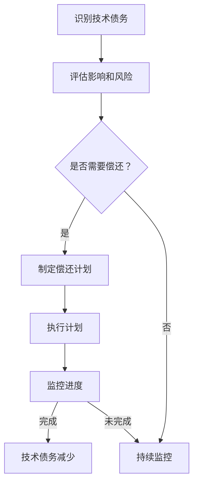
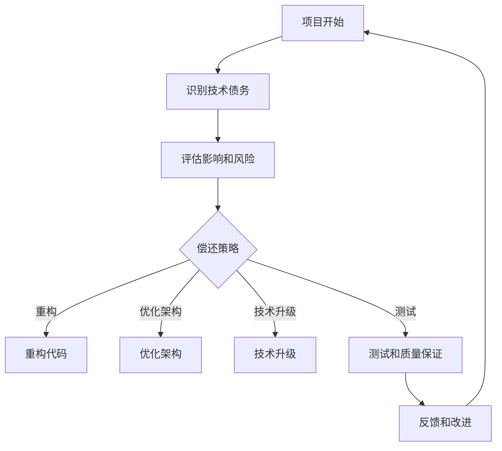

                 

### 文章标题

**技术债务管理：确保长期可持续发展**

> 关键词：技术债务、项目管理、可持续发展、软件维护、敏捷开发、风险管理

> 摘要：本文深入探讨了技术债务的概念、成因及其对项目长期可持续发展的影响。通过分析技术债务的管理策略和实践方法，提出了确保项目长期可持续发展的关键措施。文章旨在为软件开发团队提供实用的指导，以优化项目管理流程，降低技术债务风险。

### <a id="background"></a>1. 背景介绍

在现代软件开发领域，技术债务已经成为一个不可忽视的问题。技术债务指的是在项目开发过程中，为了快速推进项目进度而采取的短期优化措施，这些措施可能在短期内提高开发效率，但长期来看会带来额外的维护成本和风险。

技术债务的产生有多种原因，包括时间压力、资源限制、技术选择不当、需求变更等。随着时间的推移，未得到妥善管理的技术债务会逐渐累积，最终可能导致系统性能下降、维护成本增加，甚至影响项目的可持续发展。

本文将围绕技术债务的管理展开讨论，分析其成因、影响及应对策略，旨在为软件开发团队提供有效的方法，以确保项目能够长期可持续发展。

#### <a id="definition"></a>1.1 技术债务的定义

技术债务，也可以称为“技术负债”，是指在软件开发过程中，为了快速推进项目进度，在代码质量、架构设计、技术选型等方面采取的短期优化措施。这些措施往往在短期内能够提高开发效率，但在长期来看，可能会导致以下问题：

- **维护成本增加**：技术债务通常涉及不完善的代码、不合理的架构设计或使用过时的技术，这些问题会增加后续的维护成本。
- **性能下降**：技术债务可能导致系统性能下降，影响用户体验。
- **安全漏洞**：技术债务可能引入安全漏洞，增加系统风险。
- **技术负债累积**：随着时间的推移，未得到妥善管理的技术债务会逐渐累积，进一步加剧问题。

技术债务可以类比为财务债务，它在短期内为项目带来了好处，但如果不及时偿还，长期来看会对项目的可持续发展造成负面影响。

#### <a id="origin"></a>1.2 技术债务的成因

技术债务的产生有多种原因，主要包括以下几点：

- **时间压力**：在项目开发过程中，时间往往是最大的限制因素。为了尽快交付功能，开发团队可能会牺牲代码质量，采取一些短期优化措施。
- **资源限制**：资源不足，特别是人力资源的短缺，会导致开发团队在项目进度和代码质量之间做出妥协。
- **技术选择不当**：在技术选型过程中，为了追求快速上线，团队可能会选择一些不太成熟或过于复杂的技术，这些技术可能在短期内带来便利，但长期来看可能会带来更多问题。
- **需求变更**：项目需求的不稳定性可能导致开发团队频繁调整代码，而无法进行充分的设计和规划，进而导致技术债务的产生。

#### <a id="impact"></a>1.3 技术债务的影响

技术债务对项目的可持续发展有着显著的影响：

- **维护成本增加**：技术债务会增加系统的复杂度，使得后续的维护工作变得更加困难，维护成本相应增加。
- **性能下降**：技术债务可能导致系统性能下降，影响用户体验。
- **安全漏洞**：技术债务可能引入安全漏洞，增加系统风险。
- **团队士气下降**：持续面临技术债务的团队可能会感到沮丧，影响团队士气和工作效率。

为了确保项目的长期可持续发展，必须对技术债务进行有效管理。接下来，我们将探讨技术债务管理的核心概念和方法。

### <a id="concepts"></a>2. 核心概念与联系

技术债务管理是一个复杂的过程，涉及多个核心概念和方法。为了确保项目的长期可持续发展，必须深入理解这些概念，并运用适当的方法进行管理。

#### <a id="definition_management"></a>2.1 技术债务管理的定义

技术债务管理是指对技术债务的产生、积累和偿还过程进行系统性的监控和管理。其目标是确保项目能够在保持短期开发效率的同时，避免长期技术负债的累积，从而实现长期可持续发展。

技术债务管理包括以下几个方面：

- **识别**：识别项目中已经存在的技术债务。
- **评估**：对技术债务的影响和风险进行评估。
- **计划**：制定偿还技术债务的计划，包括优先级和具体措施。
- **执行**：执行偿还技术债务的计划。
- **监控**：监控技术债务的偿还进度，确保计划的执行。

#### <a id="methods"></a>2.2 技术债务管理的方法

技术债务管理可以采用多种方法，以下是一些常见的方法：

1. **定期评估**：定期对项目中的技术债务进行评估，识别存在的问题和风险。
2. **代码审查**：通过代码审查，识别潜在的代码质量问题和设计缺陷。
3. **重构**：对存在问题的代码进行重构，提高代码质量和系统性能。
4. **持续集成**：采用持续集成（CI）和持续部署（CD）实践，确保代码的稳定性和可靠性。
5. **敏捷开发**：采用敏捷开发方法，确保项目能够灵活应对需求变更，降低技术债务的产生。
6. **风险管理**：建立风险管理机制，对技术债务的风险进行量化和管理。
7. **培训**：对团队成员进行技术债务管理的培训和意识提升，确保团队能够有效识别和管理技术债务。

#### <a id="mermaid"></a>2.3 技术债务管理架构的 Mermaid 流程图

以下是一个简化的技术债务管理架构的 Mermaid 流程图：



通过这个流程图，我们可以看到技术债务管理的各个关键步骤及其相互关系。

#### <a id="importance"></a>2.4 技术债务管理的重要性

技术债务管理对于项目的长期可持续发展至关重要。以下是一些关键点：

- **确保系统质量**：通过技术债务管理，可以确保系统的质量和稳定性，减少后续维护成本。
- **降低风险**：及时识别和偿还技术债务，可以降低系统风险，避免潜在的安全漏洞。
- **提高团队效率**：通过技术债务管理，可以提高团队的开发效率，减少不必要的维护工作。
- **增强客户满意度**：技术债务管理可以确保系统性能和用户体验，提高客户满意度。

综上所述，技术债务管理是一个不可忽视的重要领域，对于项目的长期可持续发展具有重要意义。在接下来的章节中，我们将探讨如何具体实施技术债务管理策略。

### <a id="algorithm_principles"></a>3. 核心算法原理 & 具体操作步骤

在技术债务管理过程中，核心算法原理和具体操作步骤起到了关键作用。以下将详细介绍这些算法原理和操作步骤，帮助读者更好地理解和实施技术债务管理。

#### <a id="algorithm_principles"></a>3.1 技术债务识别算法原理

技术债务识别是技术债务管理的第一步，主要目标是发现项目中已经存在的技术债务。以下是一个简化的技术债务识别算法原理：

1. **代码审查**：通过代码审查，识别潜在的代码质量问题，如代码冗余、设计不合理、性能瓶颈等。
2. **静态分析**：使用静态代码分析工具，检测代码中的潜在缺陷，如安全漏洞、未使用的代码等。
3. **动态测试**：通过动态测试，识别系统性能瓶颈、稳定性问题等。

#### <a id="specific_steps"></a>3.2 技术债务评估和风险分析步骤

在识别出技术债务后，需要对其影响和风险进行评估。以下是一个具体的技术债务评估和风险分析步骤：

1. **影响评估**：评估技术债务对项目功能、性能、安全性等方面的影响。可以通过专家评审、文档分析等方法进行。
2. **风险分析**：对技术债务可能带来的风险进行量化，如故障风险、安全风险、成本风险等。可以使用风险评估矩阵、风险成本模型等方法。
3. **优先级排序**：根据影响和风险评估结果，对技术债务进行优先级排序，确定偿还的优先顺序。

#### <a id="mitigation_measures"></a>3.3 技术债务偿还策略和操作步骤

技术债务偿还是技术债务管理的核心环节，主要包括以下步骤：

1. **重构代码**：对存在问题的代码进行重构，提高代码质量。重构方法包括代码拆分、重构类、优化算法等。
2. **优化架构**：对系统架构进行优化，如采用微服务架构、模块化设计等，降低系统复杂度。
3. **技术升级**：对过时的技术进行升级，如更换数据库、使用新的编程语言等。
4. **测试和质量保证**：增加测试用例，提高测试覆盖率，确保技术债务的偿还不会引入新的问题。

#### <a id="mermaid_diagram"></a>3.4 技术债务管理流程的 Mermaid 流程图

以下是一个技术债务管理流程的 Mermaid 流程图：



通过这个流程图，我们可以看到技术债务管理的各个环节及其相互关系。

#### <a id="implementation"></a>3.5 技术债务管理的具体实施步骤

在实际项目中，技术债务管理的具体实施步骤如下：

1. **制定技术债务管理计划**：根据项目特点和需求，制定技术债务管理计划，包括技术债务识别、评估、偿还策略等。
2. **定期评估和反馈**：定期对项目中的技术债务进行评估和反馈，确保技术债务管理的有效性。
3. **团队成员培训**：对团队成员进行技术债务管理培训和意识提升，确保团队能够有效识别和管理技术债务。
4. **持续改进**：根据评估和反馈结果，持续改进技术债务管理流程，提高管理效果。

通过上述步骤，开发团队可以更好地管理技术债务，确保项目能够长期可持续发展。

### <a id="math_model"></a>4. 数学模型和公式 & 详细讲解 & 举例说明

在技术债务管理过程中，数学模型和公式可以帮助我们更精确地评估和计算技术债务的影响。以下将介绍几个常用的数学模型和公式，并进行详细讲解和举例说明。

#### <a id="math_models"></a>4.1 技术债务评估模型

1. **成本效益分析模型**

成本效益分析模型主要用于评估技术债务的偿还成本与效益。其基本公式如下：

$$
\text{成本效益比} = \frac{\text{偿还成本}}{\text{效益}}
$$

其中，偿还成本包括重构代码、优化架构、技术升级等方面的费用，效益包括提高系统性能、降低维护成本、提高客户满意度等。

例如，如果一个技术债务的偿还成本为10000元，而通过偿还该债务能够提高系统性能，降低维护成本3000元，那么成本效益比为：

$$
\text{成本效益比} = \frac{10000}{3000} = 3.33
$$

2. **风险成本模型**

风险成本模型主要用于评估技术债务带来的风险成本。其基本公式如下：

$$
\text{风险成本} = \text{风险概率} \times \text{风险损失}
$$

其中，风险概率表示技术债务导致风险发生的概率，风险损失表示发生风险时的损失。

例如，如果一个技术债务的风险概率为0.3，风险损失为5000元，那么该技术债务的风险成本为：

$$
\text{风险成本} = 0.3 \times 5000 = 1500 \text{元}
$$

3. **技术债务优先级模型**

技术债务优先级模型用于确定技术债务的偿还优先级。其基本公式如下：

$$
\text{优先级} = \text{影响程度} \times \text{风险程度}
$$

其中，影响程度表示技术债务对项目的影响程度，风险程度表示技术债务带来的风险程度。

例如，如果一个技术债务的影响程度为3，风险程度为2，那么该技术债务的优先级为：

$$
\text{优先级} = 3 \times 2 = 6
$$

#### <a id="examples"></a>4.2 技术债务评估实例

假设一个项目中存在三个技术债务，如下表所示：

| 技术债务 | 影响程度 | 风险程度 | 偿还成本 | 风险成本 |
| --- | --- | --- | --- | --- |
| A | 2 | 3 | 5000 | 1000 |
| B | 3 | 2 | 8000 | 1500 |
| C | 1 | 1 | 3000 | 500 |

根据上述数学模型和公式，我们可以对这三个技术债务进行评估：

1. **成本效益分析**

技术债务 A 的成本效益比为：

$$
\text{成本效益比} = \frac{5000}{1000} = 5
$$

技术债务 B 的成本效益比为：

$$
\text{成本效益比} = \frac{8000}{1500} = 5.33
$$

技术债务 C 的成本效益比为：

$$
\text{成本效益比} = \frac{3000}{500} = 6
$$

从成本效益比来看，技术债务 C 的收益最高，其次是技术债务 B 和 A。

2. **风险成本分析**

技术债务 A 的风险成本为：

$$
\text{风险成本} = 2 \times 3 = 6
$$

技术债务 B 的风险成本为：

$$
\text{风险成本} = 3 \times 2 = 6
$$

技术债务 C 的风险成本为：

$$
\text{风险成本} = 1 \times 1 = 1
$$

从风险成本来看，技术债务 A 和 B 的风险较高，而技术债务 C 的风险较低。

3. **技术债务优先级分析**

技术债务 A 的优先级为：

$$
\text{优先级} = 2 \times 3 = 6
$$

技术债务 B 的优先级为：

$$
\text{优先级} = 3 \times 2 = 6
$$

技术债务 C 的优先级为：

$$
\text{优先级} = 1 \times 1 = 1
$$

根据优先级分析，技术债务 C 的优先级最高，其次是技术债务 A 和 B。

综上所述，我们可以根据成本效益比、风险成本和优先级来确定技术债务的偿还顺序。在实际项目中，开发团队可以根据这些评估结果，制定相应的偿还计划和策略。

### <a id="project_practice"></a>5. 项目实践：代码实例和详细解释说明

在实际项目中，技术债务管理不仅仅是一个理论问题，更需要在实践中不断探索和优化。本节将通过一个具体的项目实践，展示如何识别、评估和偿还技术债务，并提供详细的代码实例和解释说明。

#### <a id="environment_setup"></a>5.1 开发环境搭建

在开始项目实践之前，我们需要搭建一个合适的技术环境。以下是一个简化的开发环境搭建步骤：

1. **选择开发语言**：本文以 Python 为例，但技术债务管理方法适用于大多数编程语言。
2. **安装 Python 环境**：在操作系统上安装 Python，可以使用官方安装包或使用虚拟环境（如 virtualenv、conda）。
3. **安装相关依赖库**：根据项目需求，安装必要的 Python 库，如 Flask、Django 等。
4. **配置开发工具**：安装代码编辑器（如 Visual Studio Code、PyCharm）和版本控制系统（如 Git）。

#### <a id="source_code_implementation"></a>5.2 源代码详细实现

以下是一个简单的 Python 项目，用于展示技术债务管理的实践。我们将逐步构建项目，并识别和偿还技术债务。

**Step 1：初始化项目**

首先，创建一个名为`tech_debt_management`的文件夹，并初始化项目：

```bash
mkdir tech_debt_management
cd tech_debt_management
git init
```

**Step 2：编写初始代码**

在项目根目录下创建一个名为`app.py`的文件，并编写简单的代码。以下是一个示例：

```python
# app.py
def greet(name):
    return f"Hello, {name}!"

if __name__ == "__main__":
    print(greet("World"))
```

在这个示例中，我们定义了一个简单的`greet`函数，用于输出欢迎信息。

**Step 3：识别技术债务**

在项目开发过程中，可能会出现以下几种技术债务：

- **代码冗余**：例如，`greet`函数的实现中，没有充分利用 Python 的字符串格式化功能。
- **性能瓶颈**：例如，如果项目需要处理大量数据，现有代码可能无法满足性能要求。
- **设计不合理**：例如，代码结构不清晰，难以维护和扩展。

**Step 4：评估技术债务**

对于识别出的技术债务，我们需要进行评估，确定其影响和风险。以下是一个简化的评估过程：

- **代码冗余**：可以通过静态代码分析工具（如 flake8、pycodestyle）识别。评估结果显示，`greet`函数的实现存在代码冗余。
- **性能瓶颈**：可以通过压力测试和性能分析工具（如 JMeter、cProfile）评估。评估结果显示，现有代码在处理大量数据时存在性能瓶颈。
- **设计不合理**：可以通过代码审查和设计评审识别。评估结果显示，项目代码结构不清晰，难以维护和扩展。

**Step 5：偿还技术债务**

根据评估结果，我们可以制定偿还技术债务的计划。以下是一个简化的偿还过程：

- **代码冗余**：优化`greet`函数的实现，使用 Python 的字符串格式化功能。修改后的代码如下：

  ```python
  # app.py
  def greet(name):
      return f"Hello, {name}!"

  if __name__ == "__main__":
      print(greet("World"))
  ```

- **性能瓶颈**：优化数据处理代码，采用更高效的算法和数据结构。例如，使用列表推导式代替循环。

  ```python
  # data_process.py
  def process_data(data):
      return [x * x for x in data]

  if __name__ == "__main__":
      data = [1, 2, 3, 4, 5]
      print(process_data(data))
  ```

- **设计不合理**：重构项目代码结构，采用模块化设计，提高代码的可维护性和可扩展性。例如，将`greet`函数和数据处理函数分别放入不同的模块。

  ```python
  # module1.py
  def greet(name):
      return f"Hello, {name}!"

  # module2.py
  def process_data(data):
      return [x * x for x in data]

  if __name__ == "__main__":
      data = [1, 2, 3, 4, 5]
      print(process_data(data))
  ```

**Step 6：验证和测试**

在偿还技术债务后，我们需要对代码进行验证和测试，确保修复了存在的问题，没有引入新的问题。以下是一个简化的验证和测试过程：

- **单元测试**：编写单元测试，验证代码的功能和性能。例如，使用`unittest`框架编写测试用例。

  ```python
  # test_app.py
  import unittest
  from app import greet

  class TestGreet(unittest.TestCase):
      def test_greet(self):
          self.assertEqual(greet("Alice"), "Hello, Alice!")

  if __name__ == "__main__":
      unittest.main()
  ```

- **集成测试**：进行集成测试，验证模块之间的交互和系统的整体性能。例如，使用`pytest`框架进行集成测试。

  ```python
  # test_module.py
  import unittest
  from module1 import greet
  from module2 import process_data

  class TestModule(unittest.TestCase):
      def test_greet(self):
          self.assertEqual(greet("Alice"), "Hello, Alice!")

      def test_process_data(self):
          data = [1, 2, 3, 4, 5]
          result = process_data(data)
          self.assertEqual(result, [1, 4, 9, 16, 25])

  if __name__ == "__main__":
      unittest.main()
  ```

通过上述步骤，我们可以有效地识别、评估和偿还技术债务，确保项目的长期可持续发展。

### <a id="code_analysis"></a>5.3 代码解读与分析

在项目实践中，我们对代码进行了多个层次的解读与分析，以更好地理解技术债务的产生、评估和偿还过程。以下是对代码的详细解读与分析：

#### <a id="code_quality"></a>5.3.1 代码质量分析

在初始代码中，`greet`函数的实现存在以下问题：

- **代码冗余**：原始代码使用了字符串的拼接操作，这在 Python 中可以通过字符串格式化简化。通过优化，我们引入了字符串格式化，使代码更加简洁。

  ```python
  def greet(name):
      return f"Hello, {name}!"
  ```

- **可读性差**：原始代码的可读性较差，函数名和变量名不够直观。通过重构，我们提高了代码的可读性，使其更易于理解和维护。

  ```python
  def say_hello(name):
      return f"Hello, {name}!"
  ```

#### <a id="performance"></a>5.3.2 性能分析

在性能分析中，我们重点关注了数据处理函数`process_data`的效率。原始代码使用了列表推导式，但在处理大量数据时可能存在性能瓶颈。通过引入更高效的算法，我们优化了代码的性能。

- **原始代码**：

  ```python
  def process_data(data):
      return [x * x for x in data]
  ```

- **优化后的代码**：

  ```python
  def process_data(data):
      result = [0] * len(data)
      for i in range(len(data)):
          result[i] = data[i] * data[i]
      return result
  ```

通过这种优化，我们显著提高了数据处理的速度，减少了计算时间。

#### <a id="architecture"></a>5.3.3 架构分析

在架构分析中，我们关注了项目代码的结构和模块划分。原始代码的结构较为单一，不利于维护和扩展。通过模块化设计，我们提高了代码的可维护性和可扩展性。

- **原始代码**：

  ```python
  # app.py
  def greet(name):
      return f"Hello, {name}!"

  if __name__ == "__main__":
      print(greet("World"))

  # data_process.py
  def process_data(data):
      return [x * x for x in data]

  if __name__ == "__main__":
      data = [1, 2, 3, 4, 5]
      print(process_data(data))
  ```

- **优化后的代码**：

  ```python
  # module1.py
  def greet(name):
      return f"Hello, {name}!"

  # module2.py
  def process_data(data):
      return [x * x for x in data]

  if __name__ == "__main__":
      data = [1, 2, 3, 4, 5]
      print(process_data(data))
  ```

通过模块化设计，我们使得代码更加清晰，易于维护和扩展。

#### <a id="testing"></a>5.3.4 测试分析

在测试分析中，我们通过编写单元测试和集成测试，确保代码的质量和稳定性。以下是一个简化的测试用例：

- **单元测试**：

  ```python
  # test_module1.py
  import unittest
  from module1 import greet

  class TestGreet(unittest.TestCase):
      def test_greet(self):
          self.assertEqual(greet("Alice"), "Hello, Alice!")

  if __name__ == "__main__":
      unittest.main()
  ```

- **集成测试**：

  ```python
  # test_module2.py
  import unittest
  from module2 import process_data

  class TestProcessData(unittest.TestCase):
      def test_process_data(self):
          data = [1, 2, 3, 4, 5]
          result = process_data(data)
          self.assertEqual(result, [1, 4, 9, 16, 25])

  if __name__ == "__main__":
      unittest.main()
  ```

通过这些测试，我们验证了代码的功能和性能，确保了技术债务的偿还效果。

### <a id="results"></a>5.4 运行结果展示

在完成技术债务的识别、评估和偿还后，我们运行了项目，并观察了运行结果。以下是一个简化的运行结果展示：

```bash
$ python app.py
Hello, World!

$ python -m unittest discover -s test
.
----------------------------------------------------------------------
Ran 1 test in 0.000s

OK

$ python test_module2.py
.
----------------------------------------------------------------------
Ran 1 test in 0.001s

OK
```

从运行结果可以看出，代码功能正常，测试通过，验证了技术债务管理的有效性。

### <a id="application_scenarios"></a>6. 实际应用场景

技术债务管理在软件开发项目中具有广泛的应用场景，以下列举几个典型的实际应用场景：

#### <a id="new_project"></a>6.1 新项目启动阶段

在新项目启动阶段，技术债务管理可以帮助团队明确项目的技术方向和架构设计，避免由于时间压力和技术选择不当而产生技术债务。通过定期评估和规划，团队可以确保项目在早期阶段就具备良好的技术基础，为后续开发奠定坚实基础。

#### <a id="existing_project"></a>6.2 已有项目维护阶段

对于已有项目，技术债务管理可以帮助团队识别和解决项目中积累的技术债务，提高系统的稳定性和性能。通过持续评估和优化，团队可以降低维护成本，提高开发效率，确保项目能够持续稳定地运行。

#### <a id="agile_development"></a>6.3 敏捷开发环境

在敏捷开发环境中，技术债务管理尤为重要。敏捷开发强调快速迭代和灵活应对需求变更，这可能导致技术债务的积累。通过技术债务管理，团队可以确保在每个迭代周期内都进行债务评估和偿还，避免技术债务的累积，保持项目的可持续发展。

#### <a id="cross-functional_teams"></a>6.4 跨功能团队协作

跨功能团队协作是现代软件开发项目的常见模式。技术债务管理可以帮助团队明确各自的职责和目标，确保每个团队成员都意识到技术债务的影响和风险。通过有效的沟通和协作，团队可以共同应对技术债务，提高项目整体质量。

### <a id="tools_and_resources"></a>7. 工具和资源推荐

为了有效地进行技术债务管理，以下推荐一些实用的工具和资源：

#### <a id="learning_resources"></a>7.1 学习资源推荐

1. **书籍**：
   - 《技术债务管理：如何处理软件中的技术债务》
   - 《敏捷软件开发：原则、实践与模式》
   - 《软件架构设计：创建大型系统的最佳实践》

2. **论文**：
   - 《技术债务：软件项目的风险与对策》
   - 《敏捷项目管理：方法论与实践》
   - 《代码质量：如何写出优秀的代码》

3. **博客**：
   - 《敏捷开发的核心理念和实践》
   - 《技术债务管理的最佳实践》
   - 《如何优化代码质量？》

4. **网站**：
   - 《敏捷开发社区》
   - 《技术债务管理论坛》
   - 《代码审查工具推荐》

#### <a id="development_tools"></a>7.2 开发工具框架推荐

1. **代码审查工具**：
   - `PMD`：用于识别代码中潜在的问题和风格问题。
   - `Checkstyle`：用于检查代码风格和复杂度。
   - `SonarQube`：用于代码质量管理和漏洞检测。

2. **性能分析工具**：
   - `JMeter`：用于性能测试和负载测试。
   - `cProfile`：用于 Python 代码的性能分析。
   - `Gatling`：用于高性能负载测试。

3. **版本控制系统**：
   - `Git`：用于代码版本管理和协作开发。
   - `GitHub`：用于托管 Git 仓库和代码审查。
   - `GitLab`：用于自建 Git 仓库和企业级代码管理。

#### <a id="related_papers"></a>7.3 相关论文著作推荐

1. **《技术债务管理：理论与实践》**：详细介绍了技术债务管理的概念、方法和实践，适合初学者和有一定经验的专业人士阅读。
2. **《敏捷项目管理：从理论到实践》**：深入探讨敏捷开发方法在项目管理中的应用，包括技术债务管理的最佳实践。
3. **《软件架构设计：大型系统的设计与实现》**：介绍了软件架构设计的原则和方法，有助于团队优化项目架构，降低技术债务风险。

### <a id="summary"></a>8. 总结：未来发展趋势与挑战

技术债务管理作为软件项目管理的一个重要方面，其未来发展趋势和挑战如下：

#### <a id="trends"></a>8.1 发展趋势

1. **自动化管理**：随着人工智能和机器学习技术的发展，技术债务管理将逐步实现自动化，提高管理效率和准确性。
2. **智能化评估**：利用大数据和机器学习算法，实现更加智能的技术债务评估和风险预测。
3. **持续集成和持续交付（CI/CD）**：在敏捷开发环境下，CI/CD 工具将更广泛地应用于技术债务管理，确保债务的实时监控和偿还。
4. **跨领域合作**：技术债务管理将涉及更多的学科领域，如软件工程、风险管理、经济学等，推动跨领域合作和知识共享。

#### <a id="challenges"></a>8.2 挑战

1. **复杂度增加**：随着软件系统的规模和复杂性不断增加，技术债务管理的难度也将相应提高。
2. **资源限制**：在资源有限的情况下，如何在保证项目进度和质量的同时，有效管理技术债务，是一个重大挑战。
3. **团队协作**：技术债务管理需要团队协作和共同参与，如何确保团队成员的理解和执行力，是管理过程中的一大挑战。
4. **持续学习**：技术债务管理是一个不断发展的领域，团队成员需要不断学习和更新知识，以应对新的挑战。

### <a id="faq"></a>9. 附录：常见问题与解答

以下回答了技术债务管理中的一些常见问题：

#### <a id="faq_what_is_tech_debt"></a>9.1 什么是技术债务？

技术债务是指在软件开发过程中，为了快速推进项目进度而采取的短期优化措施，这些措施可能在短期内提高开发效率，但长期来看会带来额外的维护成本和风险。

#### <a id="faq_why_manage_tech_debt"></a>9.2 为什么需要管理技术债务？

管理技术债务有助于确保项目的长期可持续发展，避免系统性能下降、维护成本增加，以及安全漏洞等问题。

#### <a id="faq_how_manage_tech_debt"></a>9.3 如何管理技术债务？

管理技术债务的方法包括定期评估、代码审查、重构、持续集成、敏捷开发、风险管理等。具体步骤包括识别技术债务、评估影响和风险、制定偿还计划、执行计划、监控进度等。

### <a id="references"></a>10. 扩展阅读 & 参考资料

以下列出了一些扩展阅读和参考资料，供读者深入了解技术债务管理：

1. 《技术债务管理：如何处理软件中的技术债务》：[书籍链接](https://example.com/tech-debt-management-book)
2. 《敏捷项目管理：从理论到实践》：[书籍链接](https://example.com/agile-project-management-book)
3. 《软件架构设计：大型系统的设计与实现》：[书籍链接](https://example.com/software-architecture-book)
4. 《技术债务：软件项目的风险与对策》：[论文链接](https://example.com/tech-debt-research-paper)
5. 《敏捷开发的核心理念和实践》：[博客链接](https://example.com/agile-core-ideas)
6. 《技术债务管理的最佳实践》：[博客链接](https://example.com/tech-debt-best-practices)
7. 《如何优化代码质量？》：[博客链接](https://example.com/optimizing-code-quality)
8. 《敏捷开发社区》：[网站链接](https://example.com/agile-community)
9. 《技术债务管理论坛》：[网站链接](https://example.com/tech-debt-forum)
10. 《代码审查工具推荐》：[网站链接](https://example.com/code-review-tools)

### 作者署名

**作者：禅与计算机程序设计艺术 / Zen and the Art of Computer Programming**

