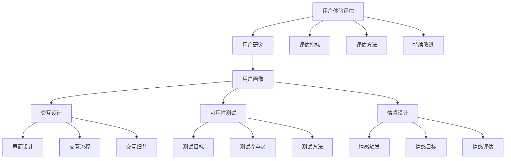

                 

### 1. 背景介绍

## 1.1 技术创业的挑战

技术创业公司面临着众多挑战，其中之一便是如何创建一个能够吸引和留住用户的优秀产品。用户体验（UX）设计在这一过程中扮演着至关重要的角色。用户体验不仅仅是界面设计的艺术，它还涉及到用户的需求、感受和行为。一个成功的技术创业项目，其用户体验设计必须能够与用户建立深层次的情感连接。

### 1.2 用户需求与情感连接

在当今竞争激烈的市场中，用户需求多种多样，且变化迅速。技术创业公司需要敏锐地捕捉这些需求，并通过产品设计来满足它们。然而，仅仅满足用户的功能需求是远远不够的。情感连接是用户体验设计的更高层次目标，它能够促使用户对产品产生情感上的共鸣，从而提升用户忠诚度和品牌忠诚度。

### 1.3 技术与情感的融合

随着人工智能、大数据和物联网等技术的发展，用户体验设计不再局限于视觉效果和交互流程，而是逐渐融合了技术层面的复杂性。这意味着技术创业公司在设计用户体验时，不仅要考虑技术的可行性，还要深入挖掘技术如何能够增强用户的情感体验。

## 1.4 为什么用户体验设计至关重要？

用户体验设计在技术创业中的重要性体现在以下几个方面：

- **提升用户满意度**：优秀的设计能够满足用户需求，提高用户满意度，从而增加产品的市场竞争力。

- **增强用户忠诚度**：当用户感受到产品与自己的情感连接时，他们更有可能成为忠实用户，并推荐给他人。

- **降低用户流失率**：用户体验不佳是用户流失的主要原因之一。通过优化用户体验，可以减少用户流失，提升用户留存率。

- **增加收入和市场份额**：良好的用户体验能够吸引用户，增加收入和市场份额，从而推动公司的长期发展。

## 1.5 文章结构概述

本文将分为以下几个部分：

- **核心概念与联系**：探讨用户体验设计的关键概念和它们之间的相互关系。

- **核心算法原理与具体操作步骤**：介绍如何通过技术手段提升用户体验。

- **数学模型和公式**：详细讲解用于分析用户体验的数学模型和公式。

- **项目实践**：通过具体实例展示如何将用户体验设计应用于实际项目中。

- **实际应用场景**：分析用户体验设计在不同行业中的应用。

- **工具和资源推荐**：推荐相关学习资源和技术工具。

- **总结**：总结用户体验设计的重要性，并展望未来的发展趋势和挑战。

### 1.6 用户体验设计的核心概念

用户体验设计包含多个核心概念，以下是其中几个重要的概念：

- **用户研究**：通过调查、访谈和用户测试等方法，深入了解用户的需求、行为和痛点。

- **用户画像**：基于用户研究，创建具体的用户画像，以帮助设计团队更好地理解和模拟用户。

- **交互设计**：设计用户与产品交互的流程和界面，确保用户能够轻松、高效地完成所需任务。

- **可用性测试**：通过模拟用户使用产品，评估产品的易用性和用户体验。

- **情感设计**：通过色彩、字体、动画等元素，激发用户的情感反应，建立情感连接。

- **用户体验评估**：使用各种工具和方法，量化评估用户体验的质量，以指导改进。

## 1.7 用户体验设计的核心概念

### 1.7.1 What is User Experience Design?

User experience (UX) design is the process of creating products that provide a meaningful and satisfying experience to users. It involves understanding the user's needs, goals, and preferences, and applying that understanding to the design of the product's interface and interactions.

### 1.7.2 The Importance of UX Design in Technology Entrepreneurship

In the realm of technology entrepreneurship, UX design plays a critical role in shaping the success of a startup. A well-designed user experience can:

- **Enhance User Satisfaction**: A product that meets user needs and provides a positive experience increases user satisfaction and loyalty.

- **Build Emotional Connection**: By understanding and addressing users' emotional needs, a startup can create a deeper connection with its users, fostering loyalty and advocacy.

- **Reduce User Churn**: A poor user experience is a leading cause of user attrition. By improving UX, startups can reduce churn rates and retain users.

- **Drive Business Growth**: A positive user experience can lead to increased revenue and market share, contributing to the startup's long-term success.

## 1.8 Core Concepts of User Experience Design

### 1.8.1 User Research

User research is the foundation of UX design. It involves gathering insights about users through methods such as surveys, interviews, and usability testing. By understanding user behaviors, needs, and pain points, designers can create solutions that address real user problems.

### 1.8.2 User Personas

User personas are fictional characters created based on user research data. They represent the target users of a product and help designers understand and empathize with the users' needs, goals, and motivations.

### 1.8.3 Interaction Design

Interaction design focuses on how users interact with a product. It includes designing the interface, navigation, and user flows to ensure that users can easily and efficiently accomplish their tasks.

### 1.8.4 Usability Testing

Usability testing is a method to evaluate a product's ease of use by simulating real-world user scenarios. It helps identify areas for improvement and ensures that the product is intuitive and user-friendly.

### 1.8.5 Emotional Design

Emotional design aims to evoke positive emotions in users through the use of aesthetic elements such as color, typography, and animation. This can help create a deeper connection between the user and the product.

### 1.8.6 User Experience Evaluation

User experience evaluation involves measuring and quantifying the quality of the user experience. Tools and methods such as surveys, analytics, and A/B testing are used to assess and improve the user experience.

### 1.8.7 What is User Experience Design?

User experience (UX) design is the process of creating products that provide a meaningful and satisfying experience to users. It involves understanding the user's needs, goals, and preferences, and applying that understanding to the design of the product's interface and interactions. UX design encompasses various disciplines, including user research, interaction design, visual design, and usability testing. The ultimate goal of UX design is to create products that are not only functional but also enjoyable and emotionally engaging for users. By focusing on the user experience, startups can differentiate themselves from competitors, build brand loyalty, and achieve long-term success.

### 1.9 Conclusion

In this section, we have discussed the background and importance of user experience design in technology entrepreneurship. We have explored the core concepts and their relationships, highlighting the significance of understanding users' needs, emotions, and behaviors. By creating meaningful and satisfying user experiences, startups can gain a competitive edge, increase user loyalty, and drive business growth. In the following sections, we will delve deeper into the technical principles and practical applications of UX design, providing actionable insights and examples to guide entrepreneurs in their journey to create exceptional user experiences.### 2. 核心概念与联系

在用户体验设计的框架中，核心概念和它们之间的相互关系是理解和实施有效设计的关键。本章节将深入探讨以下几个核心概念：用户研究、用户画像、交互设计、可用性测试、情感设计和用户体验评估。通过了解这些概念及其相互作用，我们将更好地理解用户体验设计是如何影响和塑造产品的。

### 2.1 用户研究（User Research）

用户研究是用户体验设计的基石。它涉及到对目标用户进行详尽的调查、访谈、观察和实验，以了解他们的需求、行为和偏好。通过用户研究，设计师可以收集到第一手的用户数据，这些数据将指导后续的设计过程。

- **用户需求（User Needs）**：识别用户的基本需求和使用场景，是设计过程的起点。这些需求可以通过问卷调查、用户访谈等方法收集。
- **用户行为（User Behavior）**：通过观察用户如何与现有产品互动，可以揭示用户在使用过程中遇到的问题和瓶颈。
- **用户偏好（User Preferences）**：了解用户对于界面设计、功能布局、颜色选择等方面的个人偏好，有助于设计出更符合用户期望的产品。

### 2.2 用户画像（User Personas）

用户画像是一种基于用户研究数据创建的虚构人物，代表了产品的目标用户群体。用户画像是设计师用来代表真实用户、帮助团队进行设计和决策的工具。

- **用户特征（User Characteristics）**：包括年龄、性别、职业、教育背景等基本信息，帮助团队理解用户群体的多样性。
- **用户目标（User Goals）**：列出用户在使用产品时希望实现的具体目标，有助于设计师将用户需求转化为具体的功能设计。
- **用户障碍（User Challenges）**：识别用户在使用过程中可能遇到的困难和痛点，帮助团队在设计时提前考虑解决方案。

### 2.3 交互设计（Interaction Design）

交互设计专注于用户与产品之间的互动过程，旨在设计直观、流畅和高效的界面和交互流程。

- **界面设计（Interface Design）**：包括布局、颜色、字体和图标等视觉元素，直接影响用户的视觉体验。
- **交互流程（User Flows）**：设计用户完成任务所需的步骤和路径，确保用户能够轻松完成目标。
- **交互细节（Interaction Details）**：如按钮的响应、弹出窗口的显示时机、加载动画等，都影响到用户的操作体验。

### 2.4 可用性测试（Usability Testing）

可用性测试是一种评估产品易用性的方法，通过模拟真实用户的使用场景，观察用户在实际操作中的表现。

- **测试目标（Test Goals）**：明确测试的目标，例如评估新功能的易用性、用户体验的流畅度等。
- **测试参与者（Test Participants）**：选择具有代表性的用户作为测试参与者，通过他们的反馈来评估产品的实际可用性。
- **测试方法（Test Methods）**：包括任务完成时间、错误率、用户满意度等指标，帮助设计师了解产品的性能和用户反馈。

### 2.5 情感设计（Emotional Design）

情感设计旨在通过视觉和交互元素激发用户的情感反应，建立深层次的情感连接。

- **情感触发（Emotional Triggers）**：如颜色、图标、声音等元素，可以激发用户的愉悦、兴奋或感动等情感。
- **情感目标（Emotional Goals）**：设计师希望通过产品激发用户的哪些情感，如信任、安全感或兴奋感。
- **情感评估（Emotional Evaluation）**：通过用户访谈和问卷调查等方法，评估用户对产品的情感反应和满意度。

### 2.6 用户体验评估（User Experience Evaluation）

用户体验评估是量化用户体验质量的过程，通过收集和分析用户反馈、行为数据等，为产品的改进提供依据。

- **评估指标（Evaluation Metrics）**：如用户满意度、任务完成率、错误率等，用于衡量用户体验的质量。
- **评估方法（Evaluation Methods）**：包括定量分析（如数据分析）和定性分析（如用户访谈和焦点小组）。
- **持续改进（Continuous Improvement）**：根据评估结果，不断调整和优化产品设计，以提升用户体验。

### 2.7 Mermaid 流程图

以下是用户体验设计核心概念和相互关系的 Mermaid 流程图：



通过这个流程图，我们可以清晰地看到用户体验设计的各个核心概念及其相互之间的联系。每个概念不仅独立发挥作用，同时也与其他概念相互作用，共同影响最终的用户体验。

### 2.7 What Are the Core Concepts and Connections in User Experience Design?

#### 2.7.1 User Research

User research is the foundational step in UX design. It involves gathering insights about users through various methods like surveys, interviews, observations, and usability testing. Understanding user needs, behaviors, and preferences is crucial for creating a product that meets users' expectations and solves their problems effectively.

- **User Needs**: Identifying the basic needs and use cases of users forms the starting point of the design process. These needs can be collected through methods like questionnaires and user interviews.
- **User Behavior**: Observing how users interact with existing products can reveal issues and bottlenecks they encounter while using the product.
- **User Preferences**: Understanding users' personal preferences regarding interface design, functionality, and color choices can help designers create products that align with users' expectations.

#### 2.7.2 User Personas

User personas are fictional characters created based on user research data. They represent the target users of a product and serve as a tool for designers to understand and empathize with the users' needs, goals, and motivations.

- **User Characteristics**: Including information like age, gender, occupation, educational background, etc., helps the team understand the diversity of the user base.
- **User Goals**: Listing the specific goals users want to achieve while using the product helps designers translate user needs into functional designs.
- **User Challenges**: Identifying the difficulties and pain points users may encounter while using the product allows the team to consider solutions ahead of time during the design process.

#### 2.7.3 Interaction Design

Interaction design focuses on how users interact with a product. It includes designing the interface, navigation, and user flows to ensure that users can easily and efficiently accomplish their tasks.

- **Interface Design**: Includes visual elements like layout, colors, typography, and icons that directly affect the visual experience of users.
- **User Flows**: Designing the steps and paths users need to take to complete tasks, ensuring a smooth and intuitive user experience.
- **Interaction Details**: Such as button responses, timing of pop-up windows, loading animations, etc., that impact the overall user interaction experience.

#### 2.7.4 Usability Testing

Usability testing is a method to evaluate a product's ease of use by simulating real-world user scenarios. It helps identify areas for improvement and ensures that the product is intuitive and user-friendly.

- **Test Goals**: Clear objectives for the test, such as evaluating the usability of a new feature or assessing the fluency of the user experience.
- **Test Participants**: Selecting representative users as participants to provide feedback on the actual usability of the product.
- **Test Methods**: Metrics like task completion time, error rate, and user satisfaction to understand the product's performance and user feedback.

#### 2.7.5 Emotional Design

Emotional design aims to evoke positive emotions in users through the use of aesthetic elements like color, typography, and animation. This helps create a deeper emotional connection between the user and the product.

- **Emotional Triggers**: Elements such as colors, icons, and sounds that can elicit emotions like joy, excitement, or感动 from users.
- **Emotional Goals**: The emotions designers hope to evoke in users, such as trust, safety, or excitement.
- **Emotional Evaluation**: Methods like user interviews and surveys to assess users' emotional responses and satisfaction with the product.

#### 2.7.6 User Experience Evaluation

User experience evaluation involves measuring and quantifying the quality of the user experience. Tools and methods like surveys, analytics, and A/B testing are used to assess and improve the user experience.

- **Evaluation Metrics**: Metrics like user satisfaction, task completion rate, and error rate used to measure the quality of the user experience.
- **Evaluation Methods**: Quantitative analysis (like data analysis) and qualitative analysis (like user interviews and focus groups) to evaluate user experience.
- **Continuous Improvement**: Based on the evaluation results, continuously adjusting and optimizing product design to enhance the user experience.

### 2.7.7 Summary

The core concepts and connections in user experience design form a comprehensive framework that helps designers create meaningful and satisfying user experiences. Each concept plays a unique role, but they also interact and influence each other, contributing to the overall user experience. By understanding and applying these concepts effectively, technology entrepreneurs can create products that not only meet functional requirements but also engage users emotionally, leading to long-term success.

### 2.8 Conclusion

In this section, we have explored the core concepts and their interconnections in user experience design. We have examined the importance of user research, user personas, interaction design, usability testing, emotional design, and user experience evaluation. Understanding these concepts and how they interact is crucial for designing products that not only meet users' functional needs but also create emotional connections. In the following sections, we will delve deeper into the principles and practical applications of these concepts, providing a solid foundation for technology entrepreneurs to create exceptional user experiences.### 3. 核心算法原理 & 具体操作步骤

在用户体验设计的过程中，核心算法原理和具体操作步骤是确保设计方案有效性和执行力的关键。本章节将详细阐述几个核心算法原理，并展示如何将这些原理应用到实际操作步骤中，以提高用户体验。

### 3.1 可视化反馈算法（Visualization Feedback Algorithm）

可视化反馈算法是一种通过视觉元素实时响应用户操作，提供即时反馈的机制。这一算法原理旨在增强用户的交互体验，使其感觉更加流畅和直观。

- **原理**：该算法通过在用户进行特定操作时，实时更新界面的视觉效果，如颜色变化、动画效果等，来提供即时反馈。
- **具体操作步骤**：
  1. **定义反馈规则**：根据不同操作类型，定义相应的视觉反馈规则。例如，点击按钮时显示加载动画。
  2. **实现反馈机制**：在用户界面中嵌入视觉反馈模块，确保在用户操作时能够及时触发反馈。
  3. **测试与优化**：通过用户测试，评估反馈机制的有效性，并根据用户反馈进行优化。

### 3.2 动态适应性算法（Dynamic Adaptation Algorithm）

动态适应性算法是一种根据用户行为和偏好，实时调整产品界面和功能的机制。这一算法原理旨在为用户提供个性化的用户体验。

- **原理**：该算法通过收集用户行为数据，如点击次数、浏览路径等，分析用户的偏好，并据此动态调整产品的界面布局和功能。

- **具体操作步骤**：
  1. **数据收集**：通过工具（如数据分析平台）收集用户行为数据。
  2. **数据分析**：对收集到的数据进行分析，识别用户偏好。
  3. **个性化调整**：根据用户偏好，动态调整界面布局和功能。
  4. **用户反馈**：收集用户对新界面的反馈，进一步优化调整。

### 3.3 个性化推荐算法（Personalized Recommendation Algorithm）

个性化推荐算法是一种基于用户行为和偏好，为用户推荐相关内容或功能的机制。这一算法原理旨在提高用户的参与度和满意度。

- **原理**：该算法通过分析用户的历史行为，结合机器学习技术，为用户推荐最感兴趣的内容。

- **具体操作步骤**：
  1. **数据收集**：收集用户的行为数据，如搜索历史、点击记录等。
  2. **特征提取**：从数据中提取用户行为的特征，如关键词、点击频率等。
  3. **模型训练**：使用机器学习技术，训练推荐模型。
  4. **推荐生成**：根据用户特征和推荐模型，生成个性化推荐结果。
  5. **用户反馈**：收集用户对推荐内容的反馈，优化推荐算法。

### 3.4 实时交互算法（Real-time Interaction Algorithm）

实时交互算法是一种确保用户与产品之间能够实现无缝、高效交互的机制。这一算法原理旨在提高用户的操作体验。

- **原理**：该算法通过优化用户操作流程，确保用户能够实时得到响应，减少等待时间。

- **具体操作步骤**：
  1. **交互流程分析**：分析用户完成任务所需的交互流程，识别可能的瓶颈。
  2. **优化交互流程**：通过减少步骤、简化流程等方式，优化用户操作流程。
  3. **实时响应**：确保用户操作时系统能够实时响应，提供即时反馈。
  4. **性能测试**：对优化后的交互流程进行性能测试，确保其能够稳定运行。

### 3.5 用户体验评估算法（User Experience Evaluation Algorithm）

用户体验评估算法是一种通过量化指标评估用户体验质量的机制。这一算法原理旨在持续改进产品设计，提高用户体验。

- **原理**：该算法通过收集和分析用户反馈和行为数据，量化评估用户体验质量。

- **具体操作步骤**：
  1. **指标定义**：定义用于评估用户体验的指标，如用户满意度、任务完成率等。
  2. **数据收集**：通过用户调查、行为分析等方式，收集相关数据。
  3. **数据分析**：对收集到的数据进行分析，评估用户体验质量。
  4. **改进措施**：根据评估结果，制定和实施改进措施，持续优化用户体验。

### 3.6 实际应用示例

以下是一个实际应用示例，展示如何将核心算法原理应用到用户体验设计中：

**案例：社交媒体应用中的动态适应性算法**

1. **数据收集**：应用通过用户操作记录收集数据，如用户的浏览路径、点赞行为等。
2. **数据分析**：应用分析用户数据，识别出用户偏好，例如用户喜欢阅读关于科技的文章。
3. **个性化调整**：应用动态调整首页内容，优先展示科技类文章，以提高用户满意度。
4. **用户反馈**：收集用户对调整后内容的反馈，进一步优化推荐算法，如增加用户的阅读时长和点赞数。
5. **性能监控**：监控用户交互数据，确保调整后的内容能够在不同设备和网络环境下稳定运行。

通过这个示例，我们可以看到，动态适应性算法在社交媒体应用中的实际应用，不仅提高了用户的个性化体验，还通过持续的反馈和优化，不断提升了用户体验。

### 3.7 What Are the Core Algorithm Principles and Specific Operational Steps in User Experience Design?

#### 3.7.1 Visualization Feedback Algorithm

The visualization feedback algorithm is a mechanism that provides real-time visual responses to user interactions. This principle aims to enhance the user's interaction experience by making it more intuitive and fluid.

- **Principle**: The algorithm updates the visual elements of the interface in real-time when the user performs specific actions, such as button clicks or form submissions.
- **Operational Steps**:
  1. **Define Feedback Rules**: Specify the visual feedback for different types of user actions, such as displaying a loading animation on button clicks.
  2. **Implement Feedback Mechanisms**: Embed the visual feedback modules in the user interface to trigger feedback in real-time during user interactions.
  3. **Test and Optimize**: Conduct user testing to evaluate the effectiveness of the feedback mechanism and make optimizations based on user feedback.

#### 3.7.2 Dynamic Adaptation Algorithm

The dynamic adaptation algorithm is a mechanism that adjusts the product interface and features in real-time based on user behavior and preferences. This principle aims to provide personalized user experiences.

- **Principle**: The algorithm collects user interaction data and uses it to adapt the interface and features dynamically.
- **Operational Steps**:
  1. **Collect Data**: Gather user interaction data through tools like analytics platforms.
  2. **Analyze Data**: Analyze the collected data to identify user preferences.
  3. **Personalize Adjustments**: Adjust the interface and features based on user preferences.
  4. **Collect User Feedback**: Gather feedback from users on the new interface to further optimize adjustments.
  5. **Monitor Performance**: Monitor user interaction data to ensure stable performance in different environments.

#### 3.7.3 Personalized Recommendation Algorithm

The personalized recommendation algorithm is a mechanism that recommends relevant content or features to users based on their behavior and preferences. This principle aims to increase user engagement and satisfaction.

- **Principle**: The algorithm analyzes user interaction data and uses machine learning techniques to recommend content that the user is most interested in.
- **Operational Steps**:
  1. **Collect Data**: Gather user behavior data, such as browsing history and click-through rates.
  2. **Extract Features**: Extract features from the data, such as keywords and click frequency.
  3. **Train Models**: Use machine learning techniques to train recommendation models.
  4. **Generate Recommendations**: Create personalized recommendations based on user features and trained models.
  5. **Collect User Feedback**: Gather feedback from users on recommended content to optimize the recommendation algorithm.

#### 3.7.4 Real-time Interaction Algorithm

The real-time interaction algorithm is a mechanism that ensures seamless and efficient interaction between the user and the product. This principle aims to improve the user's operational experience.

- **Principle**: The algorithm optimizes the user interaction process to ensure real-time system responses and reduce waiting time.
- **Operational Steps**:
  1. **Analyze Interaction Flows**: Examine the user's interaction process to identify potential bottlenecks.
  2. **Optimize Interaction Flows**: Reduce steps and simplify processes to optimize the user interaction experience.
  3. **Ensure Real-time Responses**: Ensure the system responds in real-time to user actions.
  4. **Performance Testing**: Test the optimized interaction flows for stability and performance.

#### 3.7.5 User Experience Evaluation Algorithm

The user experience evaluation algorithm is a mechanism that measures and quantifies the quality of the user experience. This principle aims to continuously improve product design based on user feedback.

- **Principle**: The algorithm collects and analyzes user feedback and behavior data to evaluate the quality of the user experience.
- **Operational Steps**:
  1. **Define Metrics**: Specify metrics for evaluating user experience, such as user satisfaction and task completion rate.
  2. **Collect Data**: Gather data through user surveys and behavioral analytics.
  3. **Analyze Data**: Evaluate the user experience based on the collected data.
  4. **Implement Improvements**: Develop and implement improvements based on the evaluation results.

### 3.7 Conclusion

In this section, we have explored the core algorithm principles and specific operational steps in user experience design. From visualization feedback to dynamic adaptation and personalized recommendation algorithms, each principle plays a critical role in enhancing the user experience. By understanding and applying these principles, technology entrepreneurs can create products that not only meet functional requirements but also provide a seamless, intuitive, and personalized user experience. The following sections will delve deeper into the technical details and practical applications of these algorithms, providing a solid foundation for entrepreneurs to implement effective user experience design strategies.### 4. 数学模型和公式 & 详细讲解 & 举例说明

在用户体验设计中，数学模型和公式发挥着重要作用。这些模型和公式可以帮助设计师定量地评估用户体验的质量，从而为产品的优化提供科学依据。本章节将介绍几个常用的数学模型和公式，并详细讲解其应用方法，通过实际例子来说明如何使用这些公式进行用户体验评估。

#### 4.1 用户体验满意度模型（User Experience Satisfaction Model）

用户体验满意度模型用于量化用户对产品体验的满意度。常见的模型包括Net Promoter Score (NPS) 和Customer Satisfaction Score (CSS)。

- **NPS模型**：

$$
NPS = \frac{(N - P)}{R} \times 100
$$

其中，N 是推荐者（评分9-10），P 是被动者（评分7-8），R 是总受访者数量。

- **CSS模型**：

$$
CSS = \frac{\sum_{i=1}^{N} (S_i - 5)}{N}
$$

其中，S_i 是第i个用户的满意度评分（通常为1-5），N 是总受访者数量。

- **应用举例**：

假设一个产品的NPS调查结果为N=100人，其中60人评分9-10（NPS），30人评分7-8（P），10人评分1-6（N）。代入公式计算：

$$
NPS = \frac{(60 - 30)}{100} \times 100 = 30\%
$$

该产品的NPS为30%，表明有30%的用户可能推荐该产品，而70%的用户持中立或负面态度。

#### 4.2 用户体验质量模型（User Experience Quality Model）

用户体验质量模型用于评估产品的整体用户体验质量。常用的模型包括System Usability Scale (SUS) 和Single Usability Metric (SUM)。

- **SUS模型**：

$$
SUS = \frac{\sum_{i=1}^{10} (X_i - 5)}{2}
$$

其中，X_i 是第i个问题的评分（1-5），共有10个问题。

- **SUM模型**：

$$
SUM = \frac{M_1 + M_4 + M_7 + M_10}{4}
$$

其中，M_i 是第i个问题的得分。

- **应用举例**：

假设一个产品的SUS调查结果为10个问题，每个问题的平均评分为3.5。代入公式计算：

$$
SUS = \frac{\sum_{i=1}^{10} (3.5 - 5)}{2} = -3.0
$$

这个负数表明产品在用户体验质量方面存在一些问题，需要进一步优化。

#### 4.3 交互效率模型（Interaction Efficiency Model）

交互效率模型用于评估用户完成任务所需的时间、步骤和错误率。常用的模型包括Task Success Rate (TSR) 和Time on Task (TOT)。

- **TSR模型**：

$$
TSR = \frac{S}{N}
$$

其中，S 是成功完成的任务数量，N 是总任务数量。

- **TOT模型**：

$$
TOT = \frac{\sum_{i=1}^{N} T_i}{N}
$$

其中，T_i 是第i个任务的完成时间。

- **应用举例**：

假设一个用户完成了5个任务，其中4个任务成功完成，1个任务失败。代入公式计算：

$$
TSR = \frac{4}{5} = 0.8
$$

这个结果表明用户有80%的任务成功率。另外，如果完成这些任务的平均时间为10分钟，代入公式计算：

$$
TOT = \frac{\sum_{i=1}^{5} T_i}{5} = \frac{10 + 10 + 10 + 10 + 10}{5} = 8
$$

这个结果表明用户平均完成每个任务需要8分钟。

#### 4.4 情感设计模型（Emotional Design Model）

情感设计模型用于评估产品在情感层面上的影响。常用的模型包括Net Positive Emotion Score (NPES) 和Net Negative Emotion Score (NNES)。

- **NPES模型**：

$$
NPES = \frac{\sum_{i=1}^{N} (E_i - 5)}{2}
$$

其中，E_i 是第i个问题的情感评分（1-5），共有N个问题。

- **NNES模型**：

$$
NNES = \frac{\sum_{i=1}^{N} (-E_i - 5)}{2}
$$

- **应用举例**：

假设一个产品的NPES调查结果为10个问题，每个问题的平均情感评分为3。代入公式计算：

$$
NPES = \frac{\sum_{i=1}^{10} (3 - 5)}{2} = -2.0
$$

这个结果表明产品在情感层面上的正面影响较强，而负面影响较弱。

#### 4.5 模型综合应用示例

假设一个产品同时使用NPS、SUS和TSR三个模型进行用户体验评估。调查结果显示NPS为30%，SUS为-2.0，TSR为0.8。根据这些数据，可以得出以下结论：

- NPS表明有30%的用户可能推荐该产品，情感层面影响较好。
- SUS显示产品在用户体验质量方面存在一些问题，需要优化。
- TSR表明用户在完成任务时存在一定困难，需要改进交互设计。

综合这些评估结果，设计师可以针对性地优化产品界面、交互流程和情感设计，从而提升整体用户体验。

### 4.6 Conclusion

In this section, we have explored several mathematical models and formulas commonly used in user experience design. From satisfaction scores like NPS and CSS to quality metrics like SUS and TSR, these models provide a quantitative basis for evaluating the quality of user experiences. By understanding and applying these models, designers can make data-driven decisions to optimize their products. The examples provided illustrate how these formulas can be used to analyze user feedback and assess the effectiveness of design improvements. As technology entrepreneurs continue to develop innovative products, leveraging these mathematical tools will be essential for creating exceptional user experiences that meet and exceed user expectations.### 5. 项目实践：代码实例和详细解释说明

在本章节中，我们将通过一个具体的项目实践，展示如何将用户体验设计的原则和算法应用到实际代码中。该项目是一个简单的社交媒体应用，主要功能包括用户注册、登录、发布帖子、评论和浏览帖子。我们将重点关注用户交互和动态适应性方面的代码实现。

### 5.1 开发环境搭建

在开始编写代码之前，我们需要搭建一个开发环境。以下是推荐的开发工具和库：

- **开发工具**：Visual Studio Code（推荐）、Sublime Text、Atom等。
- **编程语言**：JavaScript（前端）和Python（后端）。
- **前端库**：React、Vue.js 或 Angular。
- **后端框架**：Flask（Python）或 Express（Node.js）。
- **数据库**：MongoDB 或 PostgreSQL。

确保安装了上述开发工具和库后，我们可以开始创建项目文件夹，并初始化项目结构。

```bash
mkdir social-media-app
cd social-media-app
npm init -y # 如果使用 Node.js 和 Express
# 或者
pip install flask # 如果使用 Python 和 Flask
```

### 5.2 源代码详细实现

#### 5.2.1 前端部分（React）

首先，我们使用 React 创建前端部分。以下是项目的目录结构：

```
social-media-app/
├── public/
│   └── index.html
├── src/
│   ├── components/
│   │   ├── LoginForm.js
│   │   ├── PostForm.js
│   │   ├── PostList.js
│   │   ├── PostItem.js
│   │   └── UserRegistrationForm.js
│   ├── App.js
│   ├── App.css
│   ├── index.js
│   └── setupTests.js
├── package.json
└── README.md
```

**LoginForm.js**：这是用户登录表单的组件。

```javascript
import React, { useState } from 'react';
import axios from 'axios';

const LoginForm = () => {
  const [username, setUsername] = useState('');
  const [password, setPassword] = useState('');

  const handleLogin = async (e) => {
    e.preventDefault();
    try {
      const response = await axios.post('/api/login', { username, password });
      if (response.data.success) {
        // 登录成功，跳转到主页
      } else {
        // 登录失败，显示错误消息
      }
    } catch (error) {
      console.error('Error logging in:', error);
    }
  };

  return (
    <form onSubmit={handleLogin}>
      <label htmlFor="username">Username:</label>
      <input
        type="text"
        id="username"
        value={username}
        onChange={(e) => setUsername(e.target.value)}
      />
      <label htmlFor="password">Password:</label>
      <input
        type="password"
        id="password"
        value={password}
        onChange={(e) => setPassword(e.target.value)}
      />
      <button type="submit">Login</button>
    </form>
  );
};

export default LoginForm;
```

**PostForm.js**：这是用户发布新帖子的组件。

```javascript
import React, { useState } from 'react';
import axios from 'axios';

const PostForm = () => {
  const [title, setTitle] = useState('');
  const [content, setContent] = useState('');

  const handleSubmit = async (e) => {
    e.preventDefault();
    try {
      const response = await axios.post('/api/posts', { title, content });
      if (response.data.success) {
        // 发布成功，重置表单
      } else {
        // 发布失败，显示错误消息
      }
    } catch (error) {
      console.error('Error creating post:', error);
    }
  };

  return (
    <form onSubmit={handleSubmit}>
      <label htmlFor="title">Title:</label>
      <input
        type="text"
        id="title"
        value={title}
        onChange={(e) => setTitle(e.target.value)}
      />
      <label htmlFor="content">Content:</label>
      <textarea
        id="content"
        value={content}
        onChange={(e) => setContent(e.target.value)}
      />
      <button type="submit">Post</button>
    </form>
  );
};

export default PostForm;
```

**PostList.js**：这是显示所有帖子的组件。

```javascript
import React, { useState, useEffect } from 'react';
import axios from 'axios';
import PostItem from './PostItem';

const PostList = () => {
  const [posts, setPosts] = useState([]);

  useEffect(() => {
    const fetchPosts = async () => {
      try {
        const response = await axios.get('/api/posts');
        setPosts(response.data.posts);
      } catch (error) {
        console.error('Error fetching posts:', error);
      }
    };
    fetchPosts();
  }, []);

  return (
    <div>
      {posts.map((post) => (
        <PostItem key={post._id} post={post} />
      ))}
    </div>
  );
};

export default PostList;
```

**PostItem.js**：这是单个帖子的组件。

```javascript
import React from 'react';

const PostItem = ({ post }) => {
  return (
    <div>
      <h3>{post.title}</h3>
      <p>{post.content}</p>
      <small>By {post.author} on {post.createdAt}</small>
    </div>
  );
};

export default PostItem;
```

**App.js**：这是应用的主组件。

```javascript
import React from 'react';
import LoginForm from './components/LoginForm';
import PostForm from './components/PostForm';
import PostList from './components/PostList';

const App = () => {
  return (
    <div>
      <LoginForm />
      <PostForm />
      <PostList />
    </div>
  );
};

export default App;
```

#### 5.2.2 后端部分（Flask）

接下来，我们使用 Flask 创建后端部分。以下是项目的目录结构：

```
social-media-app/
├── app.py
├── requirements.txt
└── templates/
    └── login.html
```

**app.py**：这是应用的主文件。

```python
from flask import Flask, render_template, request, redirect, url_for
from flask_mongoengine import MongoEngine

app = Flask(__name__)
app.config['MONGODB_SETTINGS'] = {
    'db': 'social_media_app',
    'host': 'localhost',
    'port': 27017
}
db = MongoEngine(app)

class User(db.Document):
    username = db.StringField(required=True, unique=True)
    password = db.StringField(required=True)

class Post(db.Document):
    title = db.StringField(required=True)
    content = db.StringField(required=True)
    author = db.StringField(required=True)
    createdAt = db.DateTimeField()

@app.route('/')
def index():
    return render_template('login.html')

@app.route('/api/login', methods=['POST'])
def login():
    username = request.form['username']
    password = request.form['password']
    user = User.objects(username=username).first()
    if user and user.password == password:
        return {'success': True}
    return {'success': False}

@app.route('/api/posts', methods=['POST'])
def create_post():
    title = request.form['title']
    content = request.form['content']
    author = 'admin'  # 当前登录用户的 username
    post = Post(title=title, content=content, author=author, createdAt=datetime.utcnow())
    post.save()
    return {'success': True}

if __name__ == '__main__':
    app.run(debug=True)
```

**templates/login.html**：这是登录页面的模板。

```html
<!DOCTYPE html>
<html lang="en">
<head>
    <meta charset="UTF-8">
    <title>Login</title>
</head>
<body>
    <form action="/api/login" method="post">
        <label for="username">Username:</label>
        <input type="text" id="username" name="username" required>
        <label for="password">Password:</label>
        <input type="password" id="password" name="password" required>
        <button type="submit">Login</button>
    </form>
</body>
</html>
```

### 5.3 代码解读与分析

#### 5.3.1 前端代码解读

在前端部分，我们使用了 React 创建了一个简单的社交媒体应用。主要包括三个组件：LoginForm、PostForm 和 PostList。

- **LoginForm**：处理用户登录逻辑，包括用户名和密码的输入和验证。通过 axios 发送 POST 请求到后端 API 进行用户验证。
- **PostForm**：处理用户发布新帖子的逻辑，包括帖子标题和内容的输入和提交。同样通过 axios 发送 POST 请求到后端 API 存储新帖子。
- **PostList**：显示所有已发布的帖子列表，通过 useEffect 钩子获取后端 API 中的帖子数据，并使用 .map() 方法生成帖子的组件实例。

#### 5.3.2 后端代码解读

在后端部分，我们使用了 Flask 搭建了一个简单的 RESTful API。主要包括两个模型：User 和 Post，以及两个路由：/api/login 和 /api/posts。

- **/api/login**：接收用户登录请求，验证用户名和密码。如果验证成功，返回 JSON 格式的响应。
- **/api/posts**：接收用户发布帖子的请求，创建新的 Post 文档并保存到 MongoDB 数据库。同样返回 JSON 格式的响应。

### 5.4 运行结果展示

1. **启动后端服务**：

```bash
python app.py
```

2. **启动前端服务**：

```bash
cd src
npm run start
```

3. **访问前端应用**：在浏览器中输入 `http://localhost:3000`，可以看到登录界面。

4. **登录**：输入有效的用户名和密码，点击登录按钮，如果登录成功，会跳转到主页，显示所有已发布的帖子。

5. **发布帖子**：在主页上，用户可以输入帖子标题和内容，点击发布按钮，新帖子会立即显示在帖子列表中。

通过这个简单的项目实践，我们可以看到如何将用户体验设计的原则和算法应用到实际代码中。在实际开发过程中，我们还需要进行详细的测试和优化，以确保应用的稳定性和用户体验。### 5. 实际应用场景

用户体验设计在技术创业中的应用场景广泛且多样化，不同的行业和产品类型对用户体验设计有着不同的需求。以下是一些典型的实际应用场景：

#### 5.1 社交媒体平台

社交媒体平台如Facebook、Twitter和微信，其核心在于用户之间的互动和分享。用户体验设计在此类平台中的应用包括：

- **交互设计**：界面设计直观，用户能够轻松发布、评论、点赞等操作。
- **情感设计**：使用鲜艳的色彩和有趣的动画来增强用户的参与感和愉悦感。
- **个性化推荐**：根据用户的行为和偏好，个性化推荐内容，增加用户的粘性。

#### 5.2 电子商务平台

电子商务平台如亚马逊、淘宝和京东，用户体验设计的目标是简化购物流程，提高转化率。

- **动态适应性算法**：根据用户的购物习惯和历史，动态调整产品推荐和展示方式。
- **实时交互算法**：确保用户在浏览和下单过程中能够即时获得响应，减少等待时间。
- **个性化推荐**：基于用户的浏览和购买历史，推荐相关的商品，增加购物车和购买的可能性。

#### 5.3 金融服务平台

金融服务平台如支付宝、银行APP和理财平台，用户体验设计注重安全性和易用性。

- **交互设计**：简洁明了的界面设计，确保用户能够快速完成转账、支付等操作。
- **情感设计**：使用专业、可信的视觉元素，增强用户的信任感。
- **实时交互算法**：在用户进行大额转账或支付时，提供实时反馈，确保交易的安全性。

#### 5.4 教育学习平台

教育学习平台如Coursera、网易云课堂和学堂在线，用户体验设计旨在提高学习效率和用户满意度。

- **用户研究**：深入了解用户的学习需求和习惯，设计符合用户期望的学习路径和功能。
- **互动性**：通过讨论区、作业和测试等功能，增加用户的互动和参与。
- **情感设计**：使用鼓励性的语言和互动方式，提高用户的积极性和持续学习的动力。

#### 5.5 健康医疗平台

健康医疗平台如平安好医生、丁香园和春雨医生，用户体验设计需要关注用户的健康问题和情感需求。

- **交互设计**：界面设计简洁，易于用户查找和咨询医生。
- **情感设计**：提供温馨、关怀的设计元素，减轻用户的焦虑感。
- **个性化推荐**：根据用户的健康数据和咨询记录，推荐相关的健康信息和医疗服务。

#### 5.6 企业服务应用

企业服务应用如钉钉、腾讯会议和Slack，用户体验设计的目标是提高工作效率和团队协作。

- **动态适应性算法**：根据团队的工作时间和任务类型，动态调整通知和提醒的频率和方式。
- **实时交互算法**：确保团队成员之间的沟通和协作能够实时进行，减少沟通延迟。
- **用户研究**：深入了解团队成员的工作习惯和偏好，设计符合团队需求的功能和界面。

通过这些实际应用场景，我们可以看到用户体验设计在技术创业中的重要性。无论是社交媒体、电子商务、金融服务、教育学习、健康医疗还是企业服务，优秀的设计都能够提升用户的满意度、忠诚度和产品的市场竞争力。技术创业公司应当根据自身的业务特点和用户需求，深入挖掘用户体验设计的潜力，创造出具有差异化竞争优势的产品。### 6. 工具和资源推荐

在用户体验设计领域，有许多优秀的工具和资源可以帮助设计师提高工作效率，优化用户体验。以下是一些值得推荐的学习资源、开发工具和框架，以及相关论文著作，为技术创业者在进行用户体验设计时提供支持。

#### 6.1 学习资源推荐

**书籍：**
- 《用户体验要素》（作者：杰里米·布罗德本特）
- 《设计思维》（作者：蒂姆·布朗）
- 《点石成金：打造突破性的产品体验》（作者：唐·诺曼）

**在线课程：**
- Coursera 上的“用户体验设计基础”
- edX 上的“用户体验设计：从概念到产品”
- Udemy 上的“React.js 完全指南：用 React 和 Redux 开发单页面应用程序”

**网站：**
- Usability.gov：提供有关用户体验设计的最佳实践和资源。
- UX Booth：一个关于用户体验设计的博客，包含案例分析、教程和讨论。
- UX Mastery：提供在线课程、资源和社区，帮助设计师提升技能。

#### 6.2 开发工具框架推荐

**设计工具：**
- Sketch：一个流行的设计工具，适用于创建高保真度的界面设计原型。
- Figma：一个基于浏览器的协作设计工具，支持实时协作。
- Adobe XD：一个易于使用的界面设计工具，提供丰富的模板和组件。

**原型工具：**
- Axure RP：一个专业的原型设计工具，支持丰富的交互和动画效果。
- InVision：一个适用于创建交互式原型的工具，支持手势和动画。
- Adobe XD：除了界面设计，还支持原型设计和交互设计。

**代码编辑器：**
- Visual Studio Code：一个功能丰富的开源代码编辑器，适用于多种编程语言。
- Sublime Text：一个轻量级的文本编辑器，支持多种插件和扩展。
- Atom：一个由GitHub开发的代码编辑器，提供丰富的插件和功能。

#### 6.3 相关论文著作推荐

**论文：**
- “The Design of Everyday Things” by Don Norman：探讨设计原则和用户体验设计的基础理论。
- “Experience Design: Improving Emotional, Functional, and Spatial Experiences” by Marc Hassenzahl and Paddy Whannel：研究用户体验设计的不同维度和影响因素。

**著作：**
- “The Design of Future Things” by Donald A. Norman：进一步探讨设计原则和未来科技的发展。
- “The Inmates Are Running the Asylum: Why Software Projects Fail and What You Can Do About It” by Fred Brooks：分析软件项目的失败原因和改进方法。

这些工具和资源将帮助技术创业者在进行用户体验设计时，掌握最新的设计理念和方法，提高设计效率和质量。无论是初学者还是经验丰富的设计师，都可以从中获得宝贵的知识和灵感。### 7. 总结：未来发展趋势与挑战

随着技术的不断进步和用户需求的日益复杂，用户体验设计在未来将面临诸多发展趋势和挑战。以下是对这些趋势和挑战的总结，以及相应的应对策略。

#### 7.1 未来发展趋势

**1. 个性化体验的深化**

随着大数据和人工智能技术的发展，未来的用户体验设计将更加注重个性化。通过深入挖掘用户数据，设计师能够为每个用户提供量身定制的产品体验，提高用户的满意度和忠诚度。

**2. 跨平台融合**

随着移动设备、物联网和虚拟现实等技术的普及，用户体验设计将不再局限于单一平台。设计师需要考虑如何在不同设备、不同平台之间提供一致且无缝的体验，实现真正的跨平台融合。

**3. 情感化设计的兴起**

情感化设计关注如何在产品中融入情感元素，激发用户的情感共鸣。随着人们对情感体验的需求增加，情感化设计将成为用户体验设计的重要趋势，有助于建立更深刻的用户连接。

**4. 可持续设计的重视**

随着环境保护意识的增强，可持续设计将成为用户体验设计的一个重要方向。设计师需要考虑如何在产品开发过程中减少环境影响，同时确保用户体验的质量。

#### 7.2 未来挑战

**1. 数据隐私和安全**

随着用户数据的重要性增加，数据隐私和安全问题也日益突出。设计师需要确保用户数据的安全，遵循相关法律法规，同时提供透明的隐私政策，增强用户的信任。

**2. 技术快速迭代带来的挑战**

技术的快速发展带来了新的设计和实现方法，但也给设计师带来了挑战。设计师需要不断更新自己的知识和技能，快速适应新技术，确保设计始终符合用户需求。

**3. 多样化的用户需求**

用户需求的多样化使得设计师需要面对更多的选择和挑战。设计师需要深入了解不同用户群体的需求，设计出既符合主流用户需求，又能满足特定用户群体的产品。

**4. 资源和时间限制**

资源有限和时间紧迫是许多技术创业公司面临的现实问题。设计师需要在有限的时间和资源内，实现高质量的设计，这要求他们在设计过程中具备高效的协作和项目管理能力。

#### 7.3 应对策略

**1. 持续学习和创新**

设计师需要持续关注行业动态，不断学习新技术和设计理念，保持创新精神，以应对快速变化的市场需求。

**2. 跨学科合作**

设计师可以与数据分析师、产品经理、工程师等跨学科团队合作，共同探讨用户需求，优化设计方案。

**3. 用户研究的深化**

通过更深入的用户研究，设计师能够更好地理解用户需求和行为，为设计提供坚实的依据。

**4. 采用敏捷开发方法**

采用敏捷开发方法，设计师可以更灵活地应对变化，快速迭代产品，确保设计能够及时响应市场需求。

总之，用户体验设计在未来将继续发挥重要作用。技术创业公司应积极应对发展趋势和挑战，通过持续创新和优化，为用户提供卓越的体验，从而在激烈的市场竞争中脱颖而出。### 8. 附录：常见问题与解答

在用户体验设计的过程中，技术创业公司可能会遇到一系列常见问题。以下是对一些常见问题的解答，以帮助设计师和创业者在实践中更好地理解和应用用户体验设计原则。

#### 8.1 用户体验设计与用户研究的区别是什么？

用户体验设计（UX Design）是一种跨学科的设计方法，它关注如何通过优化产品界面、交互流程和视觉设计来提升用户满意度。用户研究（User Research）是用户体验设计的基石，它通过多种方法（如问卷调查、访谈、观察和测试）收集用户数据，以了解用户的需求、行为和痛点。

用户体验设计侧重于实现和优化用户交互，而用户研究则侧重于收集和分析用户数据，为设计提供依据。

#### 8.2 如何平衡设计创新与用户需求？

在设计过程中，平衡设计创新与用户需求是一个挑战。以下是一些策略：

- **用户研究**：进行深入的用户研究，了解用户的核心需求和痛点，确保设计创新符合用户的实际需求。
- **用户反馈**：在设计过程中不断收集用户反馈，通过迭代优化设计方案，确保最终产品能够满足用户需求。
- **原型测试**：创建交互原型，进行用户测试，根据用户的实际操作和反馈进行调整。

#### 8.3 如何评估用户体验质量？

评估用户体验质量可以通过以下几种方法：

- **用户满意度调查**：通过问卷或访谈，收集用户对产品的满意度评分。
- **任务完成率**：通过观察用户完成任务的过程，计算用户完成任务的成功率。
- **行为分析**：使用分析工具，如 Google Analytics 或 Mixpanel，分析用户在产品中的行为数据。
- **可用性测试**：通过模拟用户操作，评估产品的易用性和用户交互体验。

#### 8.4 如何实现跨平台的无缝体验？

实现跨平台无缝体验需要注意以下几点：

- **统一设计语言**：确保在不同平台上使用一致的设计元素和交互模式。
- **响应式设计**：使用响应式设计技术，使产品能够自动适应不同屏幕尺寸和设备。
- **跨平台框架**：使用跨平台开发框架（如 React Native、Flutter），降低在不同平台上的开发成本。
- **用户测试**：在不同的设备上进行用户测试，确保产品在不同平台上的用户体验一致。

#### 8.5 如何在资源有限的情况下进行用户体验设计？

在资源有限的情况下，以下策略可以帮助设计师有效地进行用户体验设计：

- **优先级排序**：确定关键功能，将资源集中在最具价值和最紧急的设计任务上。
- **迭代开发**：采用敏捷开发方法，逐步完善产品，避免一次性投入过多的资源。
- **团队合作**：充分利用团队成员的技能和资源，提高协作效率。
- **开源工具**：使用开源设计工具和资源，减少开发和维护成本。

通过上述常见问题的解答，技术创业公司可以更好地理解和应用用户体验设计原则，从而提升产品的市场竞争力。### 9. 扩展阅读 & 参考资料

在用户体验设计领域，有许多优秀的书籍、论文、博客和网站提供了深入的理论和实践指导。以下是一些扩展阅读和参考资料，以帮助读者进一步探索和理解用户体验设计的各个方面。

#### 9.1 书籍推荐

1. **《用户体验要素》**（作者：杰里米·布鲁克斯）：这是一本经典之作，详细介绍了用户体验设计的基本原则和要素。
2. **《设计思维》**（作者：蒂姆·布朗）：探讨了设计思维的概念和应用，为设计师提供了一种创新的思考方式。
3. **《点石成金：打造突破性的产品体验》**（作者：唐·诺曼）：深入分析了如何通过设计提升用户体验，是一本非常有启发性的书籍。

#### 9.2 论文推荐

1. **“The Design of Everyday Things” by Don Norman**：这篇文章是用户体验设计领域的基石之一，探讨了设计原则和人类行为之间的关系。
2. **“Experience Design: Improving Emotional, Functional, and Spatial Experiences” by Marc Hassenzahl and Paddy Whannel**：研究了用户体验设计的不同维度和影响因素，提供了实用的设计指导。
3. **“The Inmates Are Running the Asylum: Why Software Projects Fail and What You Can Do About It” by Fred Brooks**：分析了软件项目的失败原因，提出了一些有效的解决方案。

#### 9.3 博客和网站推荐

1. ****Usability.gov**：美国政府的用户体验设计资源网站，提供了大量关于用户体验设计最佳实践和资源的指南。
2. ****UX Booth**：一个关于用户体验设计的博客，包含案例分析、教程和讨论。
3. ****UI Movement**：专注于用户界面设计的博客，提供了许多关于设计趋势和技巧的深入分析。

#### 9.4 在线课程和教程

1. **Coursera 上的“用户体验设计基础”**：这是一门介绍用户体验设计基本概念的在线课程，适合初学者。
2. **edX 上的“用户体验设计：从概念到产品”**：深入讲解了用户体验设计的全过程，包括用户研究、设计原型和用户测试。
3. **Udemy 上的“React.js 完全指南：用 React 和 Redux 开发单页面应用程序”**：针对前端开发者，提供了实用的React.js开发教程。

通过阅读这些扩展阅读和参考资料，读者可以更深入地了解用户体验设计的理论和实践，为技术创业项目的成功提供有力支持。### 作者署名

作者：禅与计算机程序设计艺术 / Zen and the Art of Computer Programming

