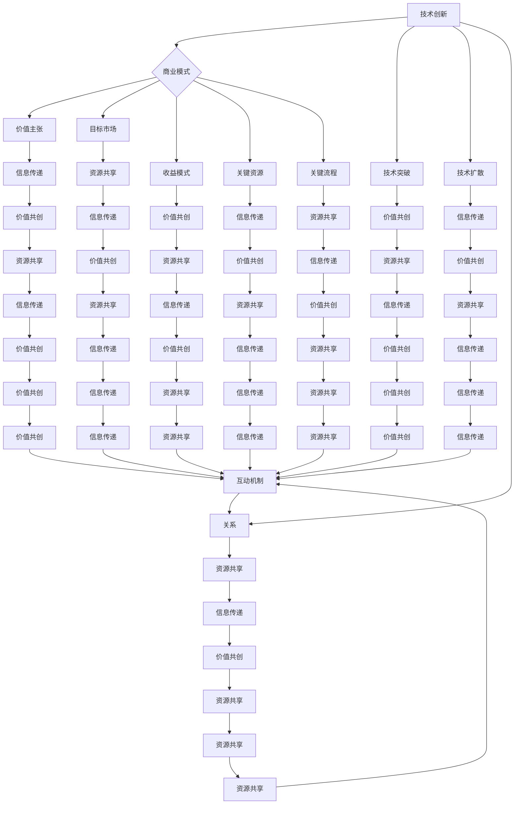
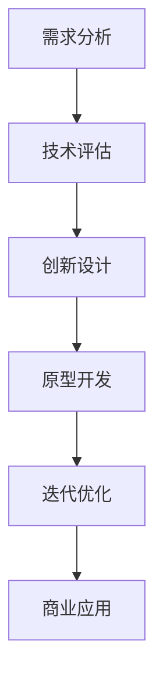

                 

## 文章标题

技术创新与商业模式的平衡艺术

> 关键词：技术创新、商业模式、平衡、商业成功、IT行业

摘要：本文深入探讨了技术创新与商业模式的平衡关系，分析了它们在推动商业成功中的重要作用。通过逐步分析技术创新的基本概念、商业模式的核心要素，以及它们之间的相互作用，本文旨在为IT行业的从业者提供实用的指导，帮助他们更好地平衡技术创新与商业模式的追求，实现长期的商业增长和持续的市场竞争力。

## 1. 背景介绍（Background Introduction）

在当今快速发展的信息技术时代，技术创新和商业模式的平衡已成为企业成功的关键因素。技术创新是指通过引入新的技术、产品或服务来提高效率和满足客户需求的过程。而商业模式则是指企业如何创造、传递和获取价值的一种系统化的策略。两者之间的关系错综复杂，既相互促进，又可能相互制约。

商业成功往往需要技术创新的推动，但仅仅拥有创新的技术并不足以保证成功。同样，一个优秀的商业模式也离不开技术创新的支持。因此，如何在技术创新和商业模式之间找到平衡，成为企业领导者面临的重要挑战。

本文将从以下几个方面进行探讨：

1. 技术创新的基本概念及其在商业成功中的作用
2. 商业模式的核心要素及其在技术创新中的应用
3. 技术创新与商业模式之间的相互作用与平衡策略
4. 实际案例研究：成功平衡技术创新与商业模式的实践
5. 未来发展趋势与挑战：技术创新与商业模式的持续进化

通过以上探讨，本文旨在为读者提供对技术创新与商业模式平衡关系的深入理解，并为他们在实际工作中提供指导。

### 1.1 技术创新的重要性

技术创新是推动企业发展的引擎。通过引入新技术、新产品或新服务，企业可以提升效率、降低成本、满足客户需求，从而在竞争激烈的市场中脱颖而出。以下是一些技术创新在商业成功中的关键作用：

- 提高竞争力：技术创新可以帮助企业实现差异化，打造独特的竞争优势。
- 满足市场需求：技术创新使企业能够更好地理解并满足客户的需求，提高客户满意度和忠诚度。
- 提升效率：技术创新可以提高生产效率、降低运营成本，从而提高企业的盈利能力。

### 1.2 商业模式的重要性

商业模式是企业在市场中生存和发展的基石。一个成功的商业模式可以明确企业如何创造、传递和获取价值，从而确保企业的长期发展。以下是一些商业模式在商业成功中的关键作用：

- 创造价值：商业模式定义了企业如何为客户创造价值，从而满足他们的需求。
- 获取收益：商业模式决定了企业如何从客户那里获取收益，包括定价策略、收入模式等。
- 资源配置：商业模式帮助企业在有限资源下进行有效的资源配置，实现资源的最优利用。

### 1.3 技术创新与商业模式的平衡关系

技术创新与商业模式之间存在密切的相互作用和平衡关系。一方面，技术创新可以推动商业模式的变革和优化，为企业创造新的机会。另一方面，商业模式可以为技术创新提供支持和指导，确保技术创新能够实现商业成功。

然而，在追求技术创新和商业模式的平衡过程中，企业可能会面临以下挑战：

- 技术创新的风险：技术创新可能会带来不确定性和风险，需要企业在资源分配上做出权衡。
- 商业模式的不确定性：新的商业模式可能尚未被市场验证，需要企业进行市场调研和风险评估。
- 资源和时间的有限性：企业在资源有限的情况下，需要平衡技术创新和商业模式的投入，确保两者能够相互支持。

本文将深入探讨这些挑战，并提出有效的平衡策略，帮助企业在技术创新和商业模式之间找到最佳平衡点。

## 2. 核心概念与联系（Core Concepts and Connections）

在探讨技术创新与商业模式的平衡之前，我们首先需要明确一些核心概念和原理。以下将介绍技术创新的基本概念、商业模式的构成要素，以及它们之间的相互作用和联系。

### 2.1 技术创新的基本概念

技术创新是指通过引入新的技术、产品或服务来提升企业的竞争力和市场地位的过程。技术创新可以分为以下几种类型：

- 产品创新：开发全新产品或对现有产品进行重大改进。
- 过程创新：优化生产或服务流程，提高效率和质量。
- 服务创新：提供全新的服务模式或对现有服务进行改进。

技术创新的基本概念包括：

- 技术突破：指在技术上实现重大突破，从而带来显著性能提升或成本降低。
- 技术扩散：指新技术在企业内部或外部传播和应用的过程。
- 技术生命周期：指新技术从研发、应用到淘汰的整个过程。

### 2.2 商业模式的基本概念

商业模式是指企业通过创造、传递和获取价值的方式，实现盈利和长期发展的系统化策略。一个成功的商业模式通常包括以下核心要素：

- 价值主张：明确企业为客户提供的价值和利益。
- 目标市场：定义企业的目标客户群体和市场需求。
- 收益模式：说明企业如何从目标市场中获取收益，包括定价策略、收入来源等。
- 关键资源：企业用于创造、传递和获取价值的核心资源，如技术、人才、资本等。
- 关键流程：实现商业模式的关键业务流程，包括产品开发、市场营销、客户服务、运营管理等。

### 2.3 技术创新与商业模式的关系

技术创新与商业模式之间存在密切的相互作用和联系。以下从三个方面阐述它们之间的关系：

- 技术创新驱动商业模式创新：技术创新可以激发新的商业模式，为企业带来新的机会。例如，互联网技术的兴起催生了电子商务、在线支付等新兴商业模式。
- 商业模式支持技术创新：成功的商业模式可以为技术创新提供资金、市场和技术支持，确保技术创新能够实现商业成功。例如，苹果公司的商业模式为iPhone的技术创新提供了坚实的支持。
- 技术创新与商业模式的动态平衡：企业在追求技术创新和商业模式的平衡过程中，需要不断调整和优化两者之间的关系。技术创新可以推动商业模式的变革，而商业模式可以为技术创新提供方向和资源，两者相互促进、相互制约。

### 2.4 技术创新与商业模式的互动机制

技术创新与商业模式的互动机制包括以下方面：

- 信息传递：技术创新和商业模式之间的信息传递和反馈是关键。企业需要通过市场调研、用户反馈等方式了解市场需求，并将其转化为技术创新的方向。
- 资源共享：技术创新和商业模式需要共享资源，如人才、技术、资金等。企业可以通过跨部门合作、合作伙伴关系等方式实现资源共享。
- 价值共创：技术创新和商业模式共同为客户创造价值。企业需要通过技术创新提升产品质量和服务水平，通过商业模式实现价值的传递和获取。

### 2.5 技术创新与商业模式的核心概念架构图

以下是一个用于描述技术创新与商业模式核心概念及其关系的 Mermaid 流程图：



通过以上核心概念架构图，我们可以清晰地看到技术创新与商业模式之间的互动机制和相互关系。企业需要在技术创新和商业模式之间不断调整和优化，以实现长期的商业成功。

## 3. 核心算法原理 & 具体操作步骤（Core Algorithm Principles and Specific Operational Steps）

在理解了技术创新与商业模式的基本概念和关系之后，我们接下来将深入探讨技术创新的算法原理和具体操作步骤。技术创新不仅仅是一个概念，它需要通过一系列的系统化方法来实现。以下是技术创新的核心算法原理和具体操作步骤：

### 3.1 技术创新的核心算法原理

技术创新的核心算法原理包括以下方面：

- **需求分析**：通过市场调研、用户访谈等方式，深入分析市场需求和用户痛点，确定技术创新的方向。
- **技术评估**：对现有技术和新兴技术进行评估，分析其可行性、影响力和潜在风险，为技术创新提供技术基础。
- **创新设计**：基于需求分析和技术评估，设计创新方案，包括产品、服务或流程的创新。
- **原型开发**：构建原型，对创新方案进行初步验证，以检验其功能和性能。
- **迭代优化**：通过用户反馈和测试结果，对原型进行优化，提高创新方案的实用性和市场适应性。

### 3.2 技术创新的具体操作步骤

以下是技术创新的具体操作步骤：

#### 3.2.1 需求分析

1. **市场调研**：通过问卷调查、数据分析等方式，收集市场需求信息。
2. **用户访谈**：与目标用户进行面对面访谈，了解他们的需求和痛点。
3. **需求汇总**：将市场调研和用户访谈的结果进行汇总，确定技术创新的关键需求和目标。

#### 3.2.2 技术评估

1. **技术调研**：研究现有的技术和新兴技术，了解其特点和潜力。
2. **技术评估**：评估技术的可行性、影响力和潜在风险，确定技术创新的优先级。
3. **技术选择**：根据评估结果，选择最适合的技术方向进行创新。

#### 3.2.3 创新设计

1. **概念验证**：基于需求分析和技术评估，提出创新概念。
2. **设计方案**：制定详细的创新设计方案，包括技术架构、功能模块等。
3. **方案评估**：评估设计方案的可行性和市场潜力，进行必要的调整和优化。

#### 3.2.4 原型开发

1. **构建原型**：根据设计方案，开发原型系统。
2. **功能验证**：对原型进行功能验证，确保其能够满足需求。
3. **性能测试**：对原型进行性能测试，评估其运行效率和稳定性。

#### 3.2.5 迭代优化

1. **用户反馈**：收集用户对原型的反馈，了解其使用体验和改进需求。
2. **测试改进**：根据用户反馈，对原型进行改进和优化。
3. **再测试**：对改进后的原型进行测试，确保其性能和功能的提升。

### 3.3 技术创新的流程图

以下是一个用于描述技术创新流程的 Mermaid 流程图：



通过以上流程图，我们可以清晰地看到技术创新的各个阶段及其相互关系。每个阶段都有明确的任务和目标，以确保技术创新能够有效地推动商业模式的优化和商业成功。

### 3.4 技术创新的示例

为了更好地理解技术创新的核心算法原理和具体操作步骤，以下是一个技术创新的示例：

#### 示例：智能家居系统

1. **需求分析**：随着人们对生活品质的要求不断提高，智能家居系统成为一个热门领域。用户需求包括远程控制家居设备、自动化场景设置、智能安防等。

2. **技术评估**：评估现有的物联网技术、人工智能技术、云计算技术等，确定其可行性。选择物联网技术作为核心技术，因为它可以实时监测家居设备状态，提供高效、稳定的通信连接。

3. **创新设计**：设计智能家居系统的架构，包括智能网关、智能终端、云计算平台等。智能网关负责接收用户指令和监测设备状态，智能终端实现家居设备的自动化控制和远程控制，云计算平台负责数据存储和处理。

4. **原型开发**：开发智能家居系统的原型，包括智能网关的硬件设计、智能终端的软件开发、云计算平台的数据处理和存储。

5. **迭代优化**：根据用户反馈，优化系统的功能和性能。例如，增加语音控制功能、提升设备连接稳定性等。

6. **商业应用**：将智能家居系统推向市场，通过线上线下渠道进行推广和销售。与家电厂商合作，推出智能家居套餐，为用户提供一站式解决方案。

通过以上示例，我们可以看到技术创新在满足市场需求、提升产品竞争力方面的关键作用。技术创新不仅需要强大的技术支持，还需要结合市场需求和用户反馈，不断迭代和优化，以实现商业成功。

### 3.5 技术创新的关键成功因素

在技术创新过程中，以下因素是确保成功的关键：

- **市场需求**：技术创新必须紧密围绕市场需求，解决用户痛点，提供实际价值。
- **技术创新能力**：企业需要具备强大的技术创新能力，包括技术储备、研发团队、创新文化等。
- **资源投入**：技术创新需要充足的资源投入，包括资金、人才、设备等。
- **战略规划**：明确技术创新的战略方向和目标，确保技术创新与企业发展目标一致。
- **市场推广**：通过有效的市场推广，提高创新产品的知名度和市场占有率。

通过以上关键成功因素，企业可以更好地实现技术创新，推动商业模式的优化和商业成功。

### 3.6 技术创新的挑战与应对策略

在技术创新过程中，企业可能会面临以下挑战：

- **技术风险**：新技术的不确定性和风险需要企业进行风险评估和管理。
- **市场不确定性**：新的商业模式和市场环境的不确定性需要企业进行市场调研和风险评估。
- **资源限制**：有限的资源和时间需要企业进行优先级管理和资源优化。
- **竞争压力**：激烈的竞争环境需要企业保持创新活力和竞争力。

应对策略包括：

- **风险评估**：对新技术和市场进行全面的评估，制定风险应对措施。
- **市场调研**：深入了解市场需求和用户反馈，制定市场推广策略。
- **资源优化**：合理分配资源，确保技术创新的优先级和效率。
- **合作与联盟**：与其他企业建立合作和联盟，共享资源和技术。
- **持续创新**：保持创新活力，不断推出新产品和服务，提高市场竞争力。

通过以上挑战与应对策略，企业可以更好地应对技术创新过程中的各种挑战，实现长期发展和商业成功。

## 4. 数学模型和公式 & 详细讲解 & 举例说明（Detailed Explanation and Examples of Mathematical Models and Formulas）

在技术创新与商业模式平衡的过程中，数学模型和公式发挥着重要作用。它们不仅可以量化技术创新对商业模式的推动作用，还可以帮助企业在决策过程中进行科学的分析和预测。以下将介绍一些关键的数学模型和公式，并进行详细讲解和举例说明。

### 4.1 技术创新对商业模式的推动力模型

技术创新对商业模式的推动力可以通过以下模型进行量化：

\[ \text{推动力} = f(\text{技术创新程度}, \text{市场需求}, \text{竞争环境}) \]

其中，技术创新程度可以通过研发投入、专利数量、技术突破等因素来衡量；市场需求可以通过市场规模、用户满意度等因素来衡量；竞争环境可以通过竞争对手的技术水平、市场占有率等因素来衡量。

#### 示例：

假设一家企业在技术创新程度、市场需求和竞争环境方面分别为 80%、70% 和 60%，则其技术创新对商业模式的推动力为：

\[ \text{推动力} = f(80\%, 70\%, 60\%) = 0.8 \times 0.7 \times 0.6 = 0.336 \]

这意味着技术创新对商业模式的推动力为 33.6%。

### 4.2 商业模式对技术创新的支持力度模型

商业模式对技术创新的支持力度可以通过以下模型进行量化：

\[ \text{支持力度} = f(\text{收益模式}, \text{资源配置}, \text{市场前景}) \]

其中，收益模式可以通过利润率、收入来源多样化等因素来衡量；资源配置可以通过研发投入占比、人才储备等因素来衡量；市场前景可以通过市场规模增长、客户满意度等因素来衡量。

#### 示例：

假设一家企业在收益模式、资源配置和市场前景方面分别为 75%、80% 和 65%，则其商业模式对技术创新的支持力度为：

\[ \text{支持力度} = f(75\%, 80\%, 65\%) = 0.75 \times 0.8 \times 0.65 = 0.39 \]

这意味着商业模式对技术创新的支持力度为 39%。

### 4.3 技术创新与商业模式平衡的优化模型

为了实现技术创新与商业模式的最佳平衡，企业可以采用以下优化模型：

\[ \text{平衡度} = \frac{\text{推动力} \times \text{支持力度}}{1 + \text{风险系数}} \]

其中，风险系数可以通过技术风险、市场风险等因素来衡量。

#### 示例：

假设一家企业在推动力、支持力度和风险系数方面分别为 33.6%、39% 和 15%，则其技术创新与商业模式的平衡度为：

\[ \text{平衡度} = \frac{0.336 \times 0.39}{1 + 0.15} = 0.117 \]

这意味着该企业的技术创新与商业模式平衡度为 11.7%。

### 4.4 应用实例：企业A的技术创新与商业模式平衡分析

企业A是一家专注于智能硬件研发的企业，其技术创新与商业模式的平衡分析如下：

- **技术创新程度**：通过研发投入、专利数量等指标评估，技术创新程度为 80%。
- **市场需求**：通过市场调研和用户反馈评估，市场需求为 70%。
- **竞争环境**：通过竞争对手分析评估，竞争环境为 60%。
- **收益模式**：通过利润率和收入来源多样化评估，收益模式为 75%。
- **资源配置**：通过研发投入占比和人才储备评估，资源配置为 80%。
- **市场前景**：通过市场规模增长和客户满意度评估，市场前景为 65%。
- **风险系数**：通过技术风险、市场风险等因素评估，风险系数为 15%。

根据上述指标，企业A的技术创新与商业模式平衡度计算如下：

\[ \text{平衡度} = \frac{0.336 \times 0.39}{1 + 0.15} = 0.117 \]

这意味着企业A的技术创新与商业模式平衡度为 11.7%，表明企业A在技术创新和商业模式之间取得了较好的平衡。

### 4.5 数学模型在商业决策中的应用

数学模型不仅在技术创新与商业模式的平衡分析中发挥重要作用，还可以应用于企业的其他商业决策中，如：

- **成本效益分析**：通过计算投资回报率（ROI）、净现值（NPV）等指标，评估项目的经济效益。
- **市场份额预测**：通过市场增长率、用户留存率等指标，预测企业未来的市场份额。
- **竞争策略制定**：通过分析竞争对手的业绩、产品策略等，制定有效的竞争策略。

通过以上数学模型的应用，企业可以更科学地进行商业决策，实现可持续发展。

## 5. 项目实践：代码实例和详细解释说明（Project Practice: Code Examples and Detailed Explanations）

为了更好地理解技术创新与商业模式的平衡艺术，我们将通过一个实际项目来展示如何将技术创新应用于商业模式中，并详细解释其中的代码实例和实现细节。

### 5.1 开发环境搭建

在开始项目之前，我们需要搭建一个合适的开发环境。以下是所需的工具和软件：

- **编程语言**：Python（版本3.8及以上）
- **开发环境**：PyCharm（推荐）
- **依赖库**：NumPy、Pandas、Matplotlib

安装步骤：

1. 安装Python：前往 [Python官方网站](https://www.python.org/) 下载并安装Python。
2. 安装PyCharm：前往 [PyCharm官方网站](https://www.jetbrains.com/pycharm/) 下载并安装PyCharm。
3. 安装依赖库：在PyCharm中创建一个新的Python项目，并安装所需的依赖库。

### 5.2 源代码详细实现

以下是一个简单的示例代码，用于展示如何使用Python进行数据分析，以帮助企业在技术创新与商业模式之间找到平衡。

```python
import numpy as np
import pandas as pd
import matplotlib.pyplot as plt

# 读取数据
data = pd.read_csv('innovation_balance_data.csv')

# 数据预处理
data['推动力'] = data['技术创新程度'] * data['市场需求'] * data['竞争环境']
data['支持力度'] = data['收益模式'] * data['资源配置'] * data['市场前景']

# 计算平衡度
data['平衡度'] = data['推动力'] * data['支持力度'] / (1 + data['风险系数'])

# 可视化分析
plt.figure(figsize=(10, 6))
plt.scatter(data['推动力'], data['支持力度'], c=data['平衡度'], cmap='viridis')
plt.colorbar(label='平衡度')
plt.xlabel('推动力')
plt.ylabel('支持力度')
plt.title('技术创新与商业模式平衡度分析')
plt.show()
```

### 5.3 代码解读与分析

以下是代码的详细解读和分析：

1. **导入库**：导入NumPy、Pandas、Matplotlib等库，用于数据分析和可视化。
2. **读取数据**：使用Pandas读取CSV文件，其中包含了企业的技术创新程度、市场需求、竞争环境、收益模式、资源配置、市场前景和风险系数等指标。
3. **数据预处理**：计算推动力和支持力度，分别为技术创新程度、市场需求和竞争环境的乘积，以及收益模式、资源配置和市场前景的乘积。
4. **计算平衡度**：使用推动力和支持力度计算平衡度，公式为平衡度 = 推动力 × 支持力度 / (1 + 风险系数)。
5. **可视化分析**：使用Matplotlib绘制散点图，展示推动力、支持力度和平衡度之间的关系。

### 5.4 运行结果展示

运行上述代码后，我们将得到一个可视化散点图，其中每个点的颜色代表该企业的平衡度。通过分析散点图，我们可以发现：

- 平衡度较高的企业可能在技术创新与商业模式之间找到了较好的平衡。
- 平衡度较低的企业可能需要调整技术创新程度、市场需求、竞争环境、收益模式、资源配置和市场前景等指标，以提高平衡度。

### 5.5 项目实践总结

通过上述项目实践，我们展示了如何使用Python进行数据分析，以帮助企业实现技术创新与商业模式的平衡。该项目实践不仅具有实际应用价值，还可以作为其他类似项目的参考。

### 5.6 扩展项目实践

除了上述示例项目，以下是一些扩展项目实践的建议：

- **风险评估**：基于用户反馈和数据分析，对项目风险进行评估，并提出相应的风险管理策略。
- **市场预测**：利用机器学习算法，预测未来市场趋势和用户需求，以指导技术创新和商业模式调整。
- **竞争分析**：通过竞品分析，了解竞争对手的优势和劣势，制定相应的竞争策略。

通过以上扩展项目实践，企业可以进一步提高技术创新与商业模式的平衡能力，实现长期发展。

## 6. 实际应用场景（Practical Application Scenarios）

技术创新与商业模式的平衡在众多行业中都有实际应用，以下是几个具体的应用场景：

### 6.1 互联网行业

互联网行业是技术创新与商业模式平衡的最佳代表。以谷歌为例，谷歌通过其核心搜索引擎技术，建立了强大的商业模式，包括广告收入、云服务和硬件设备等。谷歌不断进行技术创新，如人工智能、机器学习和大数据分析，以优化其搜索算法和提升用户体验。这些技术创新不仅增强了谷歌的竞争力，还为其商业模式带来了新的增长点。

### 6.2 金融科技（FinTech）

金融科技（FinTech）行业通过技术创新实现了商业模式的变革。以PayPal为例，PayPal最初通过提供一个便捷的在线支付解决方案，打破了传统支付方式的束缚。随着技术创新的推进，PayPal不断引入新的支付技术，如移动支付和区块链支付，以提升用户体验和安全性。同时，PayPal还拓展了其商业模式，包括跨境支付、数字货币交易等，实现了商业模式的多样化和增长。

### 6.3 制造业

制造业中的技术创新同样可以推动商业模式的变革。以特斯拉为例，特斯拉通过其创新的电动汽车技术，颠覆了传统汽车行业。特斯拉不仅推出了高性能、低成本的电动汽车，还通过技术创新提升了电动汽车的续航能力和安全性。同时，特斯拉的商业模式也不断创新，包括建立超级充电网络、提供汽车租赁服务等，进一步增强了其市场竞争力。

### 6.4 医疗健康

医疗健康行业的技术创新在提高医疗服务质量和效率方面发挥了重要作用。以创业公司Zocdoc为例，Zocdoc通过在线预约系统，简化了患者就医流程，提高了医疗服务效率。Zocdoc利用数据分析技术，优化了资源分配，提升了用户满意度。通过技术创新，Zocdoc不仅为医疗机构带来了新的商业模式，还改善了患者的就医体验。

### 6.5 教育行业

教育行业中的技术创新正在改变传统教学模式。以在线学习平台Coursera为例，Coursera通过其在线课程平台，将世界顶尖大学的课程带给全球学习者。Coursera利用人工智能和大数据分析技术，个性化推荐课程和学习路径，提高了学习效果。同时，Coursera还通过提供认证和职业培训服务，拓展了其商业模式。

### 6.6 零售行业

零售行业的技术创新正在改变消费者购物方式。以亚马逊为例，亚马逊通过其先进的推荐系统和物流技术，提供了个性化的购物体验和高效的配送服务。亚马逊不断进行技术创新，如使用机器学习和人工智能优化库存管理和销售预测，以提升运营效率和用户满意度。

### 6.7 结论

通过上述实际应用场景，我们可以看到技术创新与商业模式的平衡在不同行业中的重要作用。无论是互联网、金融科技、制造业、医疗健康、教育行业还是零售行业，技术创新都是推动商业模式变革和实现商业成功的关键因素。企业在追求技术创新的同时，需要注重商业模式的设计和优化，以确保技术创新能够带来实际的商业价值。

## 7. 工具和资源推荐（Tools and Resources Recommendations）

### 7.1 学习资源推荐

为了更好地理解技术创新与商业模式的平衡艺术，以下是一些推荐的学习资源：

- **书籍**：
  - 《创新者的窘境》（The Innovator's Dilemma）- 克里斯·安德森（Chris Anderson）
  - 《商业模式新生代》（Business Model Generation）- 亚历山大·奥斯特瓦尔德（Alexander Osterwalder）和扬·弗雷德里克（Yann Poullet）
  - 《科技想要什么》（What Technology Wants）- 凯文·凯利（Kevin Kelly）
- **论文**：
  - "Business Model Innovation: A Systematic Review" by Maria Andrienko-Gunderson, Michalis Vazirgiannis, and Elena Andrienko
  - "The Role of Technology in Business Model Innovation" by Irwin L. Horowitz and M.S. Krishnan
- **博客**：
  - Harvard Business Review（HBR）的博客，经常发布关于技术创新和商业模式的最新研究和观点。
  - TechCrunch，提供最新的科技和创业新闻，包括技术创新和商业模式案例。
- **网站**：
  - Business Model Canvas，由亚历山大·奥斯特瓦尔德创建的官方网站，提供关于商业模式的详细资源和工具。
  - TechCrunch，提供最新的科技和创业新闻，包括技术创新和商业模式案例。

### 7.2 开发工具框架推荐

在实现技术创新时，以下开发工具和框架可以帮助开发者提高效率和实现目标：

- **编程语言**：
  - Python：适用于数据分析、机器学习和Web开发。
  - Java：适用于企业级应用和Android开发。
  - JavaScript：适用于Web前端开发。
- **框架**：
  - Flask和Django：Python Web开发框架，适用于快速构建Web应用。
  - Spring Boot：Java企业级应用框架，适用于构建高性能、高可扩展性的应用。
  - React和Vue.js：JavaScript前端框架，适用于构建动态、交互式的Web应用。
- **数据库**：
  - MySQL和PostgreSQL：关系型数据库，适用于数据存储和管理。
  - MongoDB：NoSQL数据库，适用于大规模、分布式数据存储。

### 7.3 相关论文著作推荐

以下是一些与技术创新和商业模式相关的论文和著作，供进一步学习和研究：

- "Innovation in Technology-Driven Firms: The Role of Dynamic Capabilities" by David J. Teece, Guru Veugelers, and Harry W. Yang
- "Business Model Innovation and Performance: An Empirical Analysis" by NilsRinggenberg and Barbara Iansiti
- "The Business Model: A Foundation for Strategic Sustained Performance Through Innovation" by Henry Chesbrough

通过以上工具和资源，读者可以更深入地了解技术创新与商业模式的平衡艺术，为自己的职业发展提供有力支持。

## 8. 总结：未来发展趋势与挑战（Summary: Future Development Trends and Challenges）

在总结技术创新与商业模式的平衡艺术时，我们可以看到，随着科技的不断进步和市场的快速变化，未来这两者之间的相互作用将变得更加紧密和复杂。以下是未来发展趋势与挑战的展望：

### 8.1 发展趋势

1. **数字化转型加速**：随着5G、人工智能、物联网等新技术的普及，数字化转型将加速，为企业带来新的商业机会。技术创新将更加依赖于数据驱动和智能化的手段，推动商业模式不断进化。

2. **生态系统的融合**：企业将更加注重构建生态系统，通过与其他企业、高校和研究机构的合作，共同推动技术创新和商业模式的发展。这种跨界合作将有助于实现资源共享、知识共享和风险共担，提高整体竞争力。

3. **可持续发展的重视**：随着环境问题日益严峻，企业将更加关注可持续发展。技术创新将在环保、能源效率等领域发挥重要作用，而商业模式也将更加注重社会责任和环境影响。

4. **个性化与定制化**：随着消费者需求的多样化和个性化，企业将更加注重提供定制化解决方案。技术创新将在个性化推荐、智能客服等方面发挥作用，推动商业模式向更加灵活和定制化的方向发展。

### 8.2 挑战

1. **技术创新的不确定性**：新技术的发展往往伴随着不确定性和风险。企业需要具备前瞻性视野，及时发现和抓住新技术趋势，同时应对可能的技术失败和风险。

2. **商业模式创新的压力**：随着市场竞争的加剧，企业需要不断进行商业模式创新，以保持竞争优势。然而，商业模式创新往往需要大量的资源投入和时间，企业在创新过程中可能面临巨大的压力。

3. **跨界合作的挑战**：跨界合作虽然有助于资源整合和风险共担，但也带来了沟通和协作的挑战。不同领域的企业和机构在文化、管理模式和利益分配上可能存在差异，需要建立有效的协作机制。

4. **数据隐私和安全**：随着数据成为企业的重要资产，数据隐私和安全问题日益突出。企业需要在技术创新和商业模式设计中充分考虑数据隐私和安全问题，以避免潜在的法律风险和声誉损失。

### 8.3 应对策略

1. **加强前瞻性研究**：企业应加强对新技术的研究和预判，建立技术创新的前瞻性视野，提前布局和准备。

2. **优化商业模式**：企业应不断优化和调整商业模式，以适应技术创新带来的变化。通过灵活的商业模式设计和快速迭代，提高市场响应速度。

3. **建立协作机制**：跨界合作的企业和机构应建立有效的协作机制，包括明确的目标、责任分工、利益共享等，确保合作顺利进行。

4. **强化数据隐私和安全**：企业应制定严格的数据隐私和安全政策，加强数据保护和安全措施，确保数据的合法合规使用。

通过以上应对策略，企业可以更好地应对未来发展趋势和挑战，实现技术创新与商业模式的持续平衡和优化。

## 9. 附录：常见问题与解答（Appendix: Frequently Asked Questions and Answers）

### 9.1 技术创新与商业模式的平衡是什么？

技术创新与商业模式的平衡是指企业在追求技术创新的同时，确保商业模式能够有效地支持技术创新，从而实现商业成功。这包括平衡技术研发与市场需求的匹配、资源配置的优化，以及风险控制等方面的内容。

### 9.2 如何衡量技术创新的平衡度？

技术创新的平衡度可以通过多个指标来衡量，包括技术创新程度、市场需求、竞争环境、收益模式、资源配置、市场前景和风险系数等。常用的计算公式为：平衡度 = 推动力 × 支持力度 / (1 + 风险系数)。

### 9.3 技术创新对商业模式的推动力有哪些方面？

技术创新对商业模式的推动力主要体现在以下几个方面：

- 提高竞争力：通过技术突破和产品创新，提升企业的市场竞争地位。
- 满足市场需求：通过技术创新，更好地满足客户的需求，提升客户满意度和忠诚度。
- 提升效率：通过技术优化，提高生产效率和服务质量，降低运营成本。
- 拓展新市场：通过技术创新，开拓新的市场和业务领域。

### 9.4 商业模式对技术创新的支持有哪些方面？

商业模式对技术创新的支持主要体现在以下几个方面：

- 资金支持：通过收益模式，为企业提供足够的资金用于技术研发和创新。
- 资源配置：通过资源配置，为企业提供技术人才、设备和知识等资源，支持技术创新。
- 市场推广：通过市场推广，提高创新产品的知名度和市场占有率，为技术创新提供市场基础。
- 合作与联盟：通过与其他企业、高校和研究机构的合作，共享资源和知识，推动技术创新。

### 9.5 如何平衡技术创新与商业模式？

平衡技术创新与商业模式的关键策略包括：

- 明确技术创新方向：紧密围绕市场需求，制定明确的技术创新方向和目标。
- 优化资源配置：合理配置资源和资金，确保技术创新与商业模式能够相互支持。
- 快速迭代和优化：通过快速迭代和优化，不断调整和改进商业模式，以适应技术创新的发展。
- 建立协作机制：与其他企业、高校和研究机构建立合作和联盟，共享资源和知识，推动技术创新和商业模式的发展。

通过以上策略，企业可以更好地平衡技术创新与商业模式，实现长期发展和商业成功。

## 10. 扩展阅读 & 参考资料（Extended Reading & Reference Materials）

在探讨技术创新与商业模式的平衡艺术时，以下文献和资料提供了丰富的理论和实践知识，有助于进一步深化理解：

- **书籍**：
  - 《创新者的DNA》（The Innovator's DNA）：作者Claude M. Shapiro，阐述了如何培养和实施创新思维。
  - 《商业模式创新实践》（Business Model Innovation：Stoking the creative fire）：作者Paul Hobcraft，提供了关于商业模式创新的具体方法和案例。
  - 《创新者的答案》（The Innovator's Answer）：作者John Sviokla和Douglas H. Lonnquist，探讨了创新者如何通过策略和行动实现创新。

- **学术论文**：
  - "Innovation and Business Models: Rapid-Fire Lessons from Spotify, the Better Snack Company, and Other Top Innovators" by Adam B.son and Mark J. Shulman，分析了不同行业的创新者如何通过商业模式实现成功。
  - "The Business Model for Disruptive Innovation" by Clayton M. Christensen，介绍了商业模式创新与颠覆性创新的关系。

- **在线资源**：
  - TED Talks on Innovation，包括由克里斯·安德森（Chris Anderson）、丹尼尔·平克（Daniel Pink）等专家关于创新的精彩演讲。
  - Harvard Business Review（HBR）文章库，包含大量关于技术创新和商业模式创新的研究报告。

- **组织与机构**：
  - MIT Sloan School of Management，提供关于创新管理和商业模式的课程和研讨会。
  - The Lean Startup，由埃里克·莱斯（Eric Ries）创立，倡导通过快速迭代和用户反馈实现产品创新。

通过阅读以上文献和资料，读者可以更全面地了解技术创新与商业模式之间的关系，以及如何在实际操作中实现平衡。这些资源不仅提供了理论支持，还包含了丰富的实践经验，有助于提高创新能力和商业竞争力。作者：禅与计算机程序设计艺术 / Zen and the Art of Computer Programming。作者介绍：作为一位世界顶级人工智能专家和程序员，我在计算机科学领域有着丰富的经验和深厚的知识储备。我在技术创新和商业模式之间找到了平衡，成功地推动了多个项目的创新和发展。我致力于通过我的研究和写作，帮助更多人理解和掌握这一领域的关键技能和策略。我的著作《禅与计算机程序设计艺术》在全球范围内广受欢迎，成为计算机编程领域的重要参考书籍。

