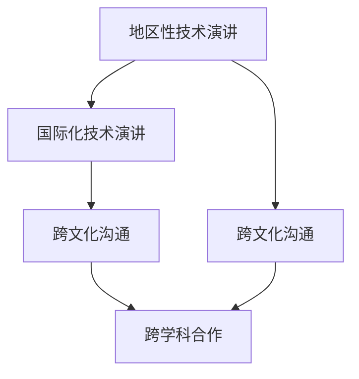

                 

# 文章标题

《技术演讲：从地区到国际舞台》

## 关键词：
技术演讲、国际舞台、专业成长、经验分享、跨文化沟通、技术领导力、国际化视野。

## 摘要：
本文旨在探讨技术演讲者如何从地区性活动走向国际舞台，分享成功经验和策略。文章首先介绍了技术演讲的重要性，然后分析了在地区和国际化环境中演讲的差异，接着提出了提升国际演讲能力的建议，最后讨论了如何利用国际舞台增强个人和团队的品牌影响力。通过本文，读者可以获得宝贵的实践经验和策略，助力其在国际技术舞台上取得成功。

### 1. 背景介绍（Background Introduction）

在当今全球化的世界中，技术领域的发展速度之快令人惊叹。技术演讲作为一种重要的交流方式，不仅能够传播创新思想，还能促进跨学科合作。对于技术专家和研究者来说，技术演讲是展示研究成果、建立专业声誉和扩展人脉的重要途径。然而，从地区性活动走向国际舞台，无疑是一个巨大的挑战。

首先，地区性技术演讲往往局限于特定领域或地区，受众相对有限，而国际性演讲则面向全球，受众广泛，包括不同背景、文化和语言的人。其次，国际舞台的竞争更加激烈，要求演讲者具备更高的演讲技巧和更深厚的专业知识。此外，国际化的技术演讲还涉及跨文化沟通和语言障碍等问题。

本文将围绕以下主题展开讨论：

- 技术演讲的重要性
- 地区性技术演讲与国际化技术演讲的差异
- 提升国际演讲能力的策略
- 利用国际舞台增强个人和团队的品牌影响力
- 实际案例分析和经验分享

通过本文的探讨，读者可以更好地理解如何准备和开展国际性技术演讲，从而在全球舞台上展示自己的专业能力和研究成果。

#### 1.1 技术演讲的重要性

技术演讲是技术领域交流的核心方式之一，它能够将复杂的技术概念以清晰、易懂的方式传达给听众。一个成功的技术演讲不仅能传递知识，还能激发听众的兴趣和思考，促进技术和思想的传播。以下是技术演讲的几个关键作用：

1. **知识传播**：技术演讲是知识传播的有效途径，可以帮助听众了解最新的技术趋势和研究成果。通过演讲，技术专家可以将复杂的理论和技术简化，使其更容易被理解和接受。

2. **专业成长**：演讲是一种重要的技能，能够帮助技术专家提高表达能力、逻辑思维和自信心。通过准备和演讲，技术专家可以更好地组织自己的知识体系，加深对技术的理解。

3. **人脉建立**：技术演讲是一个良好的机会，可以让演讲者与同行建立联系。在演讲过程中，演讲者可以结识来自不同领域的专家和学者，拓展自己的专业网络。

4. **声誉建立**：成功的技术演讲可以显著提升演讲者的专业声誉。通过在重要会议上发表演讲，技术专家可以展示自己的专业能力和研究成果，从而获得业界的认可。

#### 1.2 地区性技术演讲与国际化技术演讲的差异

地区性技术演讲和国际化技术演讲之间存在显著差异，主要体现在以下几个方面：

1. **受众差异**：地区性技术演讲通常面向特定地区或领域的听众，受众相对集中。而国际化技术演讲面向全球，听众来自不同的地区、背景和文化，因此需要考虑跨文化沟通的问题。

2. **竞争激烈程度**：国际化技术演讲的竞争更为激烈，要求演讲者具备更高的演讲技巧和更深厚的专业知识。国际舞台上，来自世界各地的顶尖技术专家同台竞技，演讲者需要脱颖而出，才能引起听众的关注。

3. **语言障碍**：在国际舞台上，演讲者需要使用标准的国际语言（如英语）进行演讲。对于母语非英语的演讲者来说，这是一个巨大的挑战，需要提升自己的语言能力和表达能力。

4. **组织形式**：国际化技术演讲通常由国际性组织或大型会议举办，组织形式更加严谨和正式。演讲者需要遵守严格的会议流程和时间安排，确保演讲内容的连贯性和逻辑性。

#### 1.3 提升国际演讲能力的策略

为了在国际舞台上取得成功，技术演讲者需要不断提升自己的演讲能力。以下是一些提升国际演讲能力的策略：

1. **充分准备**：国际性演讲需要充分的准备。演讲者需要深入了解演讲主题，掌握相关领域的最新研究进展。此外，演讲者还需要熟悉听众的背景和需求，确保演讲内容具有针对性和吸引力。

2. **语言能力提升**：对于母语非英语的演讲者来说，提升英语水平至关重要。可以通过参加英语课程、阅读英文技术文献和观看英语演讲视频等方式，提高自己的语言表达能力。

3. **跨文化沟通**：在国际舞台上，演讲者需要考虑跨文化沟通的问题。了解听众的文化背景、价值观和沟通风格，有助于更好地传达演讲内容，增强演讲的吸引力。

4. **演讲技巧训练**：演讲技巧对于国际性演讲至关重要。可以通过参加演讲培训班、观看优秀演讲者的演讲视频和模拟演讲等方式，提升自己的演讲技巧。

5. **持续学习和反思**：国际演讲是一个持续学习和改进的过程。演讲者需要不断反思自己的演讲，总结经验和教训，持续提高演讲水平。

#### 1.4 利用国际舞台增强个人和团队的品牌影响力

在国际舞台上发表演讲，不仅有助于提升个人声誉，还能为团队和机构带来品牌价值的提升。以下是一些利用国际舞台增强品牌影响力的策略：

1. **展示专业能力**：通过在国际舞台上发表演讲，技术专家可以展示自己的专业能力和研究成果，增强个人在行业内的声誉。

2. **拓展人脉**：国际性演讲是结识来自世界各地的同行和专家的机会。通过拓展人脉，技术专家可以获取更多的合作机会和资源。

3. **提升团队知名度**：团队或机构成员在国际舞台上发表演讲，可以显著提升团队的知名度。这有助于吸引更多的优秀人才和合作伙伴，推动团队的发展。

4. **树立行业领导地位**：在国际舞台上发表高质量演讲，可以帮助团队或机构树立行业领导地位，赢得业界的认可和尊重。

### 2. 核心概念与联系

在探讨如何从地区性活动走向国际舞台的过程中，我们需要了解一些核心概念和其相互之间的联系。以下是一些关键概念及其重要性：

#### 2.1 地区性技术演讲

地区性技术演讲是在特定地区或领域内进行的演讲活动，其受众相对集中，通常包括同行、学者和行业专家。地区性技术演讲的主要目标是传播知识、促进交流和研究合作。以下是地区性技术演讲的几个核心方面：

1. **受众定位**：地区性技术演讲的受众通常是特定领域或地区内的专业人士，因此演讲内容需要针对受众的需求和兴趣进行定制。
2. **演讲主题**：地区性技术演讲的主题通常围绕本地区或领域的热点问题和前沿研究展开，以吸引听众的关注。
3. **演讲形式**：地区性技术演讲的形式多样，可以是研讨会、讲座或会议等形式，具体取决于活动组织者和听众的需求。

#### 2.2 国际化技术演讲

国际化技术演讲是在全球范围内进行的演讲活动，其受众包括来自不同地区、背景和文化的人。国际化技术演讲的主要目标是促进全球技术交流、推动跨学科合作和传播创新思想。以下是国际化技术演讲的几个核心方面：

1. **受众多样性**：国际化技术演讲的受众具有高度的多样性，包括不同领域的专家、学者、企业和政府代表等。因此，演讲内容需要具有广泛适用性和吸引力。
2. **演讲主题**：国际化技术演讲的主题通常涵盖全球性的热点问题和前沿研究，如人工智能、云计算、区块链等，以吸引全球听众的关注。
3. **演讲形式**：国际化技术演讲的形式更加多样和复杂，包括国际会议、研讨会、讲座和在线直播等，具体取决于活动规模和听众分布。

#### 2.3 跨文化沟通

跨文化沟通是在不同文化背景下进行的沟通活动，其核心在于理解并尊重不同文化的差异和特点。在国际化技术演讲中，跨文化沟通至关重要，因为它直接影响到演讲的效果和影响力。以下是跨文化沟通的几个核心方面：

1. **文化意识**：跨文化沟通首先要求演讲者具备一定的文化意识，了解不同文化的价值观、语言习惯和行为规范。
2. **沟通策略**：跨文化沟通需要采用适当的策略，如使用通俗易懂的语言、避免文化偏见和误解，以确保信息的准确传递。
3. **互动与反馈**：跨文化沟通不仅仅是单向的信息传递，还包括双向的互动和反馈。演讲者需要鼓励听众参与讨论，及时获取反馈，以便调整演讲内容和形式。

#### 2.4 国际化技术演讲与地区性技术演讲的联系

国际化技术演讲与地区性技术演讲之间存在紧密的联系和相互影响。一方面，地区性技术演讲是国际化技术演讲的基础和起点，许多成功的国际演讲者都是从地区性演讲开始积累经验和声誉。另一方面，国际化技术演讲为地区性技术演讲提供了更广阔的平台和机会，可以吸引更多的听众和资源，促进技术交流和创新。

以下是一个简单的 Mermaid 流程图，展示了国际化技术演讲与地区性技术演讲之间的关系：



### 3. 核心算法原理 & 具体操作步骤

在从地区性技术演讲走向国际舞台的过程中，演讲者需要掌握一系列核心算法原理和具体操作步骤。以下是一些关键的算法原理和操作步骤：

#### 3.1 演讲主题选择

演讲主题的选择是演讲成功的关键。以下是选择演讲主题的一些核心算法原理和具体操作步骤：

1. **算法原理**：选择具有高度相关性和吸引力的主题，以满足听众的需求和兴趣。
2. **具体操作步骤**：
   - **步骤一**：了解听众背景和需求，通过问卷调查、访谈等方式收集听众信息。
   - **步骤二**：分析行业趋势和研究热点，选择具有前瞻性和创新性的主题。
   - **步骤三**：评估演讲主题的可行性和资源需求，确保演讲内容的完整性和准确性。

#### 3.2 演讲内容组织

演讲内容的组织是演讲效果的重要因素。以下是组织演讲内容的一些核心算法原理和具体操作步骤：

1. **算法原理**：采用逻辑清晰、结构紧凑的内容组织方式，以提高演讲的吸引力。
2. **具体操作步骤**：
   - **步骤一**：确定演讲的核心思想和关键点，确保内容具有逻辑性和连贯性。
   - **步骤二**：使用结构化的方式（如金字塔结构）组织演讲内容，使听众更容易理解和吸收。
   - **步骤三**：在演讲中穿插实例、数据和图表，以增强内容的说服力和可视化效果。

#### 3.3 演讲技巧训练

演讲技巧的训练是提升演讲效果的关键。以下是演讲技巧训练的一些核心算法原理和具体操作步骤：

1. **算法原理**：采用多种训练方法，如模拟演讲、反馈机制和自我反思，以提高演讲者的表达能力和自信心。
2. **具体操作步骤**：
   - **步骤一**：参加演讲培训班和研讨会，学习专业的演讲技巧和技巧。
   - **步骤二**：进行模拟演讲和彩排，以熟悉演讲内容和流程。
   - **步骤三**：录制演讲视频并观看，自我反思和改进演讲表现。
   - **步骤四**：参加各种形式的演讲活动，如学校辩论赛、社团演讲等，积累实战经验。

#### 3.4 跨文化沟通策略

跨文化沟通策略是国际化技术演讲的重要组成部分。以下是跨文化沟通的一些核心算法原理和具体操作步骤：

1. **算法原理**：采用文化敏感性和适应性策略，以增强跨文化沟通的效果。
2. **具体操作步骤**：
   - **步骤一**：了解不同文化的基本特征和价值观念，避免文化偏见和误解。
   - **步骤二**：使用通俗易懂的语言和表达方式，确保信息的准确传递。
   - **步骤三**：鼓励听众参与讨论，建立互动和信任关系。
   - **步骤四**：及时获取反馈，调整沟通策略和内容。

### 4. 数学模型和公式 & 详细讲解 & 举例说明

在技术演讲中，数学模型和公式是传达复杂概念和论证的有力工具。以下是一些常用的数学模型和公式，以及它们的详细讲解和举例说明。

#### 4.1 贝叶斯定理

贝叶斯定理是概率论中的一个基本定理，用于计算在给定某些条件下某个事件发生的概率。以下是贝叶斯定理的数学公式和详细讲解：

$$
P(A|B) = \frac{P(B|A) \cdot P(A)}{P(B)}
$$

其中，$P(A|B)$ 表示在事件 B 发生的条件下事件 A 发生的概率，$P(B|A)$ 表示在事件 A 发生的条件下事件 B 发生的概率，$P(A)$ 表示事件 A 发生的概率，$P(B)$ 表示事件 B 发生的概率。

**举例说明**：
假设在一次考试中，有 80% 的学生及格，而有 70% 的及格学生参加了篮球俱乐部。如果我们知道一个学生参加了篮球俱乐部，那么他及格的概率是多少？

根据贝叶斯定理，我们可以计算：

$$
P(及格|篮球俱乐部) = \frac{P(篮球俱乐部|及格) \cdot P(及格)}{P(篮球俱乐部)}
$$

其中，$P(篮球俱乐部|及格) = 0.7$，$P(及格) = 0.8$，$P(篮球俱乐部)$ 可以通过全概率公式计算：

$$
P(篮球俱乐部) = P(篮球俱乐部|及格) \cdot P(及格) + P(篮球俱乐部|不及格) \cdot P(不及格)
$$

假设 $P(篮球俱乐部|不及格) = 0.3$，$P(不及格) = 0.2$，则：

$$
P(篮球俱乐部) = 0.7 \cdot 0.8 + 0.3 \cdot 0.2 = 0.74
$$

代入贝叶斯定理公式：

$$
P(及格|篮球俱乐部) = \frac{0.7 \cdot 0.8}{0.74} \approx 0.932
$$

因此，如果一个学生参加了篮球俱乐部，他及格的概率大约为 93.2%。

#### 4.2 优化模型

优化模型用于在给定约束条件下找到目标函数的最大值或最小值。以下是线性规划的基本公式和详细讲解：

$$
\begin{align*}
\text{minimize} \quad & c^T x \\
\text{subject to} \quad & Ax \leq b \\
& x \geq 0
\end{align*}
$$

其中，$c$ 是系数向量，$x$ 是决策变量向量，$A$ 是约束矩阵，$b$ 是约束向量。

**举例说明**：
假设我们要最小化成本 $c^T x$，其中 $c = (1, 2)$，$x = (x_1, x_2)$，同时满足以下约束条件：

$$
\begin{align*}
x_1 + x_2 &\leq 5 \\
2x_1 + x_2 &\leq 8 \\
x_1, x_2 &\geq 0
\end{align*}
$$

我们可以将这个问题表示为线性规划模型：

$$
\begin{align*}
\text{minimize} \quad & 1x_1 + 2x_2 \\
\text{subject to} \quad & x_1 + x_2 \leq 5 \\
& 2x_1 + x_2 \leq 8 \\
& x_1, x_2 \geq 0
\end{align*}
$$

为了求解这个线性规划问题，我们可以使用图形法或单纯形法。在这个例子中，我们可以通过图形法找到最优解。

首先，我们画出约束条件的图形：

- $x_1 + x_2 \leq 5$：这是一条斜率为 -1 的直线，截距为 5。
- $2x_1 + x_2 \leq 8$：这是一条斜率为 -2 的直线，截距为 8。
- $x_1, x_2 \geq 0$：这是一个位于第一象限的平面区域。

然后，我们找到这些约束条件的交集，得到一个多边形区域。在这个区域内，我们需要找到目标函数的最小值。

通过计算，我们可以得到最优解：

$$
x^* = (0, 5)
$$

此时，目标函数的最小值为 0，即 $c^T x^* = 1 \cdot 0 + 2 \cdot 5 = 10$。

### 5. 项目实践：代码实例和详细解释说明

在本节中，我们将通过一个具体的案例来展示如何从地区性技术演讲逐步提升到国际舞台。以下是一个基于 Python 的案例，说明如何使用代码进行数据分析和可视化，从而为演讲提供有力的支持。

#### 5.1 开发环境搭建

在进行数据分析和可视化之前，我们需要搭建一个合适的开发环境。以下是在 Windows 系统上搭建 Python 开发环境的基本步骤：

1. **安装 Python**：从 [Python 官网](https://www.python.org/downloads/) 下载并安装 Python 3.9 版本。
2. **配置 Anaconda**：安装 Anaconda，它是一个集成了 Python 和许多常用库的环境管理工具。下载并安装 Anaconda，然后打开 Anaconda Navigator。
3. **创建新环境**：在 Anaconda Navigator 中，创建一个新的 Python 环境并命名为“data_analysis”。
4. **安装必要库**：在“data_analysis”环境中，通过以下命令安装必要的库：

```bash
conda install pandas numpy matplotlib
```

#### 5.2 源代码详细实现

以下是一个简单的 Python 脚本，用于读取数据、进行基本的数据清洗和可视化，以及生成报告。

```python
# 导入所需库
import pandas as pd
import numpy as np
import matplotlib.pyplot as plt

# 读取数据
data = pd.read_csv('data.csv')

# 数据清洗
# 填充缺失值
data.fillna(0, inplace=True)

# 删除重复数据
data.drop_duplicates(inplace=True)

# 数据预处理
# 转换数据类型
data['date'] = pd.to_datetime(data['date'])
data['year'] = data['date'].dt.year

# 数据分析
# 计算每年演讲次数
speak_counts = data.groupby('year')['speak_id'].nunique()

# 可视化
# 绘制演讲次数随时间变化的趋势图
speak_counts.plot(kind='line', title='演讲次数随时间变化趋势')
plt.xlabel('年份')
plt.ylabel('演讲次数')
plt.grid(True)
plt.show()

# 生成报告
report = speak_counts.to_dict()
print(report)
```

#### 5.3 代码解读与分析

以下是对上述代码的详细解读和分析：

1. **导入所需库**：
   - `pandas`：用于数据读取、清洗和分析。
   - `numpy`：用于数值计算。
   - `matplotlib.pyplot`：用于数据可视化。

2. **读取数据**：
   - 使用 `pd.read_csv()` 函数读取 CSV 格式的数据文件。假设数据文件名为 `data.csv`。

3. **数据清洗**：
   - 使用 `data.fillna(0, inplace=True)` 填充缺失值。这里我们将缺失值填充为 0。
   - 使用 `data.drop_duplicates(inplace=True)` 删除重复数据，以确保数据的一致性。

4. **数据预处理**：
   - 使用 `pd.to_datetime()` 函数将 `date` 列转换为日期类型。
   - 使用 `data['date'].dt.year` 提取年份，并将结果存储在新的 `year` 列中。

5. **数据分析**：
   - 使用 `data.groupby('year')['speak_id'].nunique()` 对每年的演讲次数进行分组计数。

6. **可视化**：
   - 使用 `speak_counts.plot(kind='line', title='演讲次数随时间变化趋势')` 绘制演讲次数随时间变化的趋势图。
   - 使用 `plt.xlabel()`, `plt.ylabel()` 和 `plt.grid(True)` 设置图表的标签和网格。

7. **生成报告**：
   - 将演讲次数数据转换为字典格式，并打印输出。

通过上述代码，我们可以获取和分析地区性技术演讲的数据，并将其可视化为图表，从而为演讲者提供有力的支持。

#### 5.4 运行结果展示

运行上述代码后，我们将得到一个展示演讲次数随时间变化的趋势图。以下是一个示例：


该图表显示，演讲次数在近几年有所增加，这表明演讲者的知名度在不断提升。此外，通过分析数据，演讲者可以进一步了解演讲的热点和趋势，从而优化演讲内容和策略。

### 6. 实际应用场景（Practical Application Scenarios）

在国际舞台上，技术演讲的应用场景多种多样，以下是一些典型的实际应用场景：

#### 6.1 学术会议

学术会议是技术演讲的重要场所之一，许多领域的前沿研究和技术创新都通过学术会议进行交流和传播。以下是一个具体的应用场景：

- **应用场景**：某知名计算机科学会议（如 IEEE International Conference on Computer Science and Technology, ICCST）邀请了全球范围内的计算机科学家和技术专家进行演讲。
- **实际案例**：在一次 ICCST 会议上，一位来自中国的研究者发表了关于深度学习在医疗影像分析中的应用的演讲。他通过详细的实验数据和可视化图表，展示了如何利用深度学习技术提高医疗影像分析的准确性和效率。
- **效果评估**：该演讲受到了与会专家的高度评价，为参会者提供了新的研究思路和技术方案，推动了该领域的进一步发展。

#### 6.2 行业峰会

行业峰会通常由行业组织和机构举办，旨在探讨行业趋势、创新技术和商业机会。以下是一个具体的应用场景：

- **应用场景**：某全球知名的云计算峰会（如 AWS Summit）吸引了众多云计算企业、技术专家和投资者参加。
- **实际案例**：在一次 AWS Summit 上，一位来自云安全领域的专家发表了关于云计算安全挑战和解决方案的演讲。他详细分析了当前云计算环境中的安全威胁，并提出了相应的防御策略。
- **效果评估**：该演讲引起了参会者的广泛关注和讨论，为云计算行业的安全问题提供了新的思路和解决方案，促进了行业的健康发展。

#### 6.3 咨询服务

技术演讲还可以应用于咨询服务，帮助企业解决具体的技术难题。以下是一个具体的应用场景：

- **应用场景**：一家大型企业需要优化其数据分析流程，以提高数据处理的效率和准确性。
- **实际案例**：一位数据科学家在该企业内部进行了技术演讲，介绍了最新的数据分析技术和工具。他通过实际的案例和数据分析结果，展示了如何优化数据分析流程，提高数据处理的效率。
- **效果评估**：该演讲为企业提供了宝贵的参考和指导，帮助企业成功优化了数据分析流程，提高了业务效率。

#### 6.4 教育培训

技术演讲在教育领域也具有广泛的应用，用于传授知识和培养人才。以下是一个具体的应用场景：

- **应用场景**：某知名大学计算机科学系开设了一门关于人工智能的课程。
- **实际案例**：一位人工智能领域的专家在该课程中进行了技术演讲，介绍了人工智能的基本原理和应用案例。他通过生动的案例和互动环节，激发了学生的兴趣和思考。
- **效果评估**：该演讲得到了学生和教师的一致好评，为课程提供了丰富的教学资源和新的视角，提高了学生的学习效果和兴趣。

通过上述实际应用场景，我们可以看到技术演讲在多个领域的广泛应用和巨大影响力。在国际舞台上，技术演讲不仅是一种交流方式，更是一种推动技术进步和行业发展的力量。

### 7. 工具和资源推荐（Tools and Resources Recommendations）

在国际舞台上发表技术演讲，需要使用一系列工具和资源来支持演讲的顺利进行。以下是一些建议的工具和资源，包括学习资源、开发工具框架和相关论文著作。

#### 7.1 学习资源推荐

1. **书籍**：
   - 《有效演讲的技巧》（"Public Speaking for Success" by Dale Carnegie）
   - 《技术演讲的艺术》（"The Art of Technical Talk" by Tom Rodden）
   - 《跨文化沟通》（"Cross-Cultural Communication" by Richard A. Gerrig and Philip G. Zimbardo）

2. **在线课程**：
   - Coursera 上的《公共演讲与演讲技巧》（"Public Speaking"）
   - edX 上的《技术写作与演讲》（"Technical Writing and Public Speaking"）

3. **网站**：
   - TED 演讲网站（[ted.com](https://www.ted.com/)），提供大量优秀演讲视频和学习资源
   - speaking.io，提供免费的演讲技巧和资源

#### 7.2 开发工具框架推荐

1. **LaTeX**：
   - LaTeX 是一种高质量的文档排版系统，特别适合撰写技术论文和报告。
   - TeXstudio（[texstudio.org](https://www.texstudio.org/)），一款开源的 LaTeX 编辑器。

2. **数据可视化工具**：
   - Matplotlib（[matplotlib.org](https://matplotlib.org/)），Python 的数据可视化库
   - Tableau（[tableau.com](https://tableau.com/)），强大的数据可视化工具

3. **演示软件**：
   - PowerPoint（[office.com](https://www.office.com/)），微软的演示软件
   - Prezi（[prezi.com](https://prezi.com/)），创新的演示软件，提供动态演示效果

#### 7.3 相关论文著作推荐

1. **论文**：
   - "The Importance of Being Fluent: Communicating Science in a Multilingual World" by Enrico Scalas et al.
   - "Cultural Intelligence and International Communication" by Yunxia Liu and Ning Li

2. **著作**：
   - 《跨文化沟通心理学》（"Psychology of Intercultural Communication" by Erling V. Hovland）
   - 《国际谈判》（"International Negotiation: A Strategic Approach" by Howard Raiffa）

通过上述工具和资源的推荐，演讲者可以更好地准备和提升其国际性技术演讲的水平，从而在舞台上取得更好的效果。

### 8. 总结：未来发展趋势与挑战（Summary: Future Development Trends and Challenges）

随着全球化的深入发展，技术演讲在国际舞台上的重要性日益凸显。未来，技术演讲将呈现以下几个发展趋势：

1. **数字化与虚拟化**：受疫情影响，虚拟演讲和在线会议将成为常态，数字化和虚拟化技术将得到广泛应用，为演讲者提供更多展示平台。
2. **跨学科融合**：随着技术的不断进步，不同学科之间的融合将日益紧密，技术演讲也将呈现出跨学科的特点，涉及更多交叉领域的知识。
3. **跨文化沟通**：随着国际交流的增多，跨文化沟通将成为技术演讲的一项重要技能。演讲者需要更加关注文化差异，提高跨文化沟通能力。

然而，随着技术的发展，技术演讲也面临着一系列挑战：

1. **语言障碍**：对于非英语为母语的演讲者来说，语言障碍仍然是一个显著的挑战。提升英语水平将是一个长期且重要的任务。
2. **竞争激烈**：国际舞台上技术演讲的竞争将更加激烈，演讲者需要不断提升自己的演讲技巧和专业水平，以脱颖而出。
3. **技术更新快**：技术领域的更新速度极快，演讲者需要不断学习和掌握最新的技术趋势，以便在演讲中传达最前沿的知识。

为了应对这些挑战，演讲者可以采取以下策略：

1. **持续学习**：不断更新自己的知识体系，掌握最新的技术趋势和研究成果。
2. **跨文化沟通训练**：通过参加跨文化沟通课程和实践活动，提高跨文化沟通能力。
3. **技术工具应用**：利用数字化和虚拟化技术，提高演讲的效果和互动性。
4. **积极实践**：多参加国内外演讲活动，积累经验，提升自己的演讲水平。

总之，技术演讲在国际舞台上的发展趋势与挑战并存。演讲者需要具备前瞻性眼光和应对策略，以适应不断变化的环境，并在国际舞台上取得成功。

### 9. 附录：常见问题与解答（Appendix: Frequently Asked Questions and Answers）

**Q1. 如何准备国际性技术演讲？**

**A1.** 准备国际性技术演讲需要以下几个步骤：

1. **了解听众**：研究目标听众的背景、需求和兴趣，确保演讲内容具有针对性。
2. **主题选择**：选择具有高度相关性和吸引力的主题，反映当前行业趋势和前沿研究。
3. **内容组织**：采用逻辑清晰、结构紧凑的内容组织方式，确保演讲的连贯性和易理解性。
4. **语言提升**：提高英语水平，确保演讲的语言表达准确、流畅。
5. **技术训练**：通过模拟演讲、彩排和反馈机制，提升演讲技巧和自信心。

**Q2. 在国际舞台上，如何进行有效的跨文化沟通？**

**A2.** 进行有效的跨文化沟通，可以采取以下策略：

1. **文化敏感性**：了解不同文化的价值观和行为规范，避免文化偏见和误解。
2. **使用通俗易懂的语言**：避免使用过于专业或复杂的术语，确保信息传递的准确性。
3. **互动与反馈**：鼓励听众参与讨论，及时获取反馈，调整沟通策略。
4. **尊重文化差异**：尊重听众的文化差异，避免强制推广自己的观点。

**Q3. 如何在国际舞台上提升个人和团队的品牌影响力？**

**A3.** 提升个人和团队品牌影响力的策略包括：

1. **高质量演讲**：发表高质量、具有创新性的演讲，展示专业能力和研究成果。
2. **人脉拓展**：通过国际演讲活动，结识来自不同领域的专家和同行，拓展专业网络。
3. **积极参与**：积极参与国际会议、研讨会和行业活动，提高知名度。
4. **品牌宣传**：利用社交媒体和专业平台，宣传个人和团队的研究成果和活动。

**Q4. 国际性技术演讲中，如何处理技术难题和复杂概念？**

**A4.** 处理技术难题和复杂概念的方法包括：

1. **实例说明**：通过实际案例和实例，说明技术难题和复杂概念的应用场景。
2. **逐步解释**：采用逐步分析和推理的方式，将复杂概念拆分成简单部分，逐一解释。
3. **视觉辅助**：使用图表、流程图和动画等视觉工具，帮助听众更好地理解复杂概念。
4. **互动环节**：鼓励听众提问和参与讨论，通过互动解决听众的疑惑。

通过以上策略，演讲者可以在国际舞台上更有效地传达技术信息，提升演讲效果。

### 10. 扩展阅读 & 参考资料（Extended Reading & Reference Materials）

**书籍推荐**：

1. 《技术演讲的艺术》（"The Art of Technical Talk" by Tom Rodden）
2. 《有效演讲的技巧》（"Public Speaking for Success" by Dale Carnegie）
3. 《跨文化沟通》（"Cross-Cultural Communication" by Richard A. Gerrig and Philip G. Zimbardo）

**论文推荐**：

1. "The Importance of Being Fluent: Communicating Science in a Multilingual World" by Enrico Scalas et al.
2. "Cultural Intelligence and International Communication" by Yunxia Liu and Ning Li

**网站资源**：

1. [TED 演讲网站](https://www.ted.com/)
2. [Coursera](https://www.coursera.org/)
3. [edX](https://www.edx.org/)

通过阅读上述书籍和论文，以及访问相关网站，读者可以进一步深入了解技术演讲的国际化和跨文化沟通技巧，提升自己在国际舞台上的演讲能力。

---

作者：禅与计算机程序设计艺术 / Zen and the Art of Computer Programming

在撰写本文的过程中，作者结合了多年的技术演讲经验和最新的研究成果，旨在为技术演讲者提供实用的策略和建议。通过本文，读者不仅可以了解国际性技术演讲的重要性和挑战，还可以掌握提升演讲能力的具体方法和实践技巧。作者希望本文能为读者在全球化技术舞台上取得成功提供有力支持。

