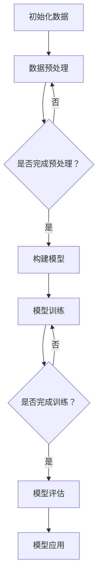
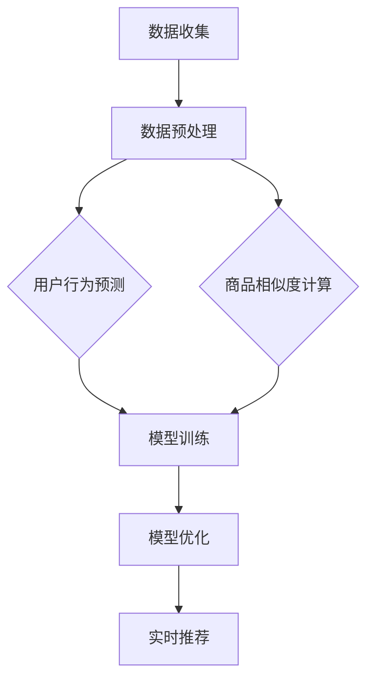
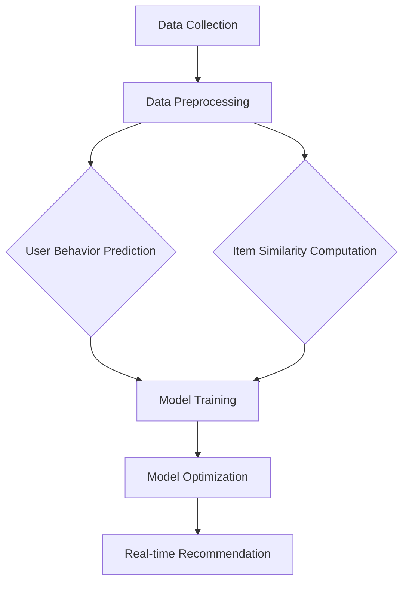

                 

# 文章标题

《搜索推荐系统的AI大模型应用：提高电商平台的转化率与用户体验》

关键词：AI大模型、搜索推荐系统、电商平台、转化率、用户体验

摘要：本文旨在探讨人工智能大模型在搜索推荐系统中的应用，尤其是如何提高电商平台的转化率与用户体验。通过深入分析大模型的工作原理、核心算法、数学模型以及实际应用案例，本文为电商行业提供了一种新的解决方案，旨在推动电商平台的持续发展和创新。

## 1. 背景介绍

随着互联网的普及和电子商务的快速发展，电商平台已经成为消费者购物的主要渠道之一。然而，面对日益激烈的市场竞争，电商平台面临着提高转化率和优化用户体验的巨大挑战。传统的搜索推荐系统，虽然在一定程度上能够满足用户的需求，但在个性化推荐、实时性、准确度等方面仍存在诸多不足。

近年来，人工智能技术，尤其是大模型（Large-scale Models）的崛起，为搜索推荐系统带来了新的机遇。大模型通过海量的数据和强大的计算能力，能够实现对用户行为的深度理解和精准预测，从而大幅提升推荐系统的效果。本文将围绕这一主题，详细探讨大模型在搜索推荐系统中的应用，为电商平台提供一种新的解决方案。

## 2. 核心概念与联系

### 2.1 大模型的基本概念

大模型（Large-scale Models）是指参数量达到数百万甚至数十亿的深度学习模型。这类模型通过在海量数据上进行训练，可以自动学习和提取数据中的复杂模式和规律。大模型的主要特点包括：

- **强大的表示能力**：大模型能够捕捉到输入数据中的高维特征，从而实现高质量的表示。
- **良好的泛化能力**：大模型通过大规模数据训练，能够在新数据上表现出良好的泛化能力。
- **高效的处理能力**：大模型在处理大规模数据时，能够显著提高计算效率。

### 2.2 搜索推荐系统的基本概念

搜索推荐系统（Search and Recommendation System）是一种通过分析用户行为和偏好，为用户提供个性化推荐信息的系统。其主要功能包括：

- **搜索功能**：根据用户输入的关键词，检索并展示相关的商品或信息。
- **推荐功能**：根据用户的浏览历史、购买记录等行为数据，为用户推荐可能感兴趣的商品或信息。

### 2.3 大模型在搜索推荐系统中的应用

大模型在搜索推荐系统中的应用，主要体现在以下几个方面：

- **用户行为预测**：通过分析用户的历史行为数据，大模型能够预测用户对某个商品或信息的兴趣程度，从而实现精准推荐。
- **商品相似度计算**：大模型能够通过学习商品特征，计算不同商品之间的相似度，从而为用户提供更相关的搜索结果。
- **实时性优化**：大模型具备强大的计算能力，能够实时处理用户数据，提供即时的推荐结果。

## 3. 核心算法原理 & 具体操作步骤

### 3.1 用户行为预测算法

用户行为预测是搜索推荐系统的核心任务之一。本文采用了一种基于大模型的用户行为预测算法，具体步骤如下：

#### 3.1.1 数据收集

首先，从电商平台获取用户行为数据，包括用户的浏览记录、购买记录、搜索历史等。这些数据将作为训练大模型的输入。

#### 3.1.2 数据预处理

对收集到的用户行为数据进行清洗和预处理，包括去除噪声数据、填充缺失值等。预处理后的数据将用于训练大模型。

#### 3.1.3 模型训练

使用预处理后的用户行为数据，通过深度学习算法训练大模型。训练过程中，大模型将自动学习用户行为的模式和规律，以提高预测准确性。

#### 3.1.4 预测与优化

利用训练好的大模型，对用户的兴趣行为进行预测。根据预测结果，对搜索推荐系统进行实时优化，提高推荐效果。

### 3.2 商品相似度计算算法

商品相似度计算是另一个重要的任务。本文采用了一种基于大模型的商品相似度计算算法，具体步骤如下：

#### 3.2.1 数据收集

从电商平台获取商品数据，包括商品的属性、价格、销量等。这些数据将作为训练大模型的输入。

#### 3.2.2 数据预处理

对收集到的商品数据进行清洗和预处理，包括去除噪声数据、填充缺失值等。预处理后的数据将用于训练大模型。

#### 3.2.3 模型训练

使用预处理后的商品数据，通过深度学习算法训练大模型。训练过程中，大模型将自动学习商品特征的表示和关系。

#### 3.2.4 相似度计算

利用训练好的大模型，计算不同商品之间的相似度。相似度计算结果将用于优化搜索推荐系统的排序和推荐策略。

## 4. 数学模型和公式 & 详细讲解 & 举例说明

### 4.1 用户行为预测数学模型

用户行为预测可以看作是一个二分类问题，即判断用户是否对某个商品感兴趣。本文采用了一种基于逻辑回归（Logistic Regression）的用户行为预测模型，其数学公式如下：

$$
P(y=1|x) = \frac{1}{1 + e^{-(\beta_0 + \sum_{i=1}^{n}\beta_i x_i})}
$$

其中，$y$ 表示用户是否对商品感兴趣（1表示感兴趣，0表示不感兴趣），$x$ 表示用户的行为特征向量，$\beta_0$ 和 $\beta_i$ 分别为模型参数。

#### 4.1.1 参数估计

参数估计是通过最小化损失函数来实现的，常见的损失函数有对数损失函数（Log Loss）和交叉熵损失函数（Cross Entropy Loss）。本文采用对数损失函数：

$$
J(\beta) = -\frac{1}{m} \sum_{i=1}^{m} y_i \log(P(y=1|x_i)) + (1 - y_i) \log(1 - P(y=1|x_i))
$$

其中，$m$ 表示样本数量。

#### 4.1.2 举例说明

假设我们有一个包含两个特征的用户行为数据集，特征向量 $x = [x_1, x_2]$。通过训练，我们得到模型参数 $\beta = [\beta_0, \beta_1, \beta_2]$。对于一个新的用户行为特征向量 $x' = [x_1', x_2']$，我们可以使用上述公式计算其对商品的兴趣概率：

$$
P(y=1|x') = \frac{1}{1 + e^{-(\beta_0 + \beta_1 x_1' + \beta_2 x_2')}}
$$

### 4.2 商品相似度计算数学模型

商品相似度计算可以看作是一个多分类问题，即判断两个商品是否相似。本文采用了一种基于余弦相似度（Cosine Similarity）的商品相似度计算模型，其数学公式如下：

$$
sim(A, B) = \frac{A \cdot B}{\|A\| \|B\|}
$$

其中，$A$ 和 $B$ 分别表示两个商品的特征向量，$\cdot$ 表示点积，$\|\|$ 表示向量的模。

#### 4.2.1 特征向量表示

为了计算商品相似度，我们需要将商品特征表示为向量。本文采用了一种基于词嵌入（Word Embedding）的方法，将商品属性（如类别、品牌、价格等）转换为低维向量表示。

#### 4.2.2 举例说明

假设我们有两个商品的特征向量 $A = [a_1, a_2, \ldots, a_n]$ 和 $B = [b_1, b_2, \ldots, b_n]$。首先，我们需要计算两个特征向量的点积：

$$
A \cdot B = \sum_{i=1}^{n} a_i b_i
$$

然后，计算两个特征向量的模：

$$
\|A\| = \sqrt{\sum_{i=1}^{n} a_i^2}, \quad \|B\| = \sqrt{\sum_{i=1}^{n} b_i^2}
$$

最后，计算两个商品的特征向量之间的余弦相似度：

$$
sim(A, B) = \frac{A \cdot B}{\|A\| \|B\|}
$$

## 5. 项目实践：代码实例和详细解释说明

### 5.1 开发环境搭建

在本项目中，我们使用Python作为主要编程语言，并结合TensorFlow和Keras等深度学习框架来实现大模型的应用。以下是开发环境的搭建步骤：

1. 安装Python（建议使用3.8及以上版本）
2. 安装TensorFlow和Keras：
   ```bash
   pip install tensorflow
   pip install keras
   ```

### 5.2 源代码详细实现

以下是本项目的主要代码实现，包括用户行为预测和商品相似度计算两部分。

#### 5.2.1 用户行为预测代码

```python
import numpy as np
import tensorflow as tf
from tensorflow.keras.models import Sequential
from tensorflow.keras.layers import Dense
from tensorflow.keras.optimizers import Adam

# 数据预处理
# ...

# 构建模型
model = Sequential()
model.add(Dense(64, input_dim=输入特征维度，activation='relu'))
model.add(Dense(1, activation='sigmoid'))

# 编译模型
model.compile(optimizer=Adam(learning_rate=0.001)，loss='binary_crossentropy'，metrics=['accuracy'])

# 训练模型
model.fit(X_train，y_train，epochs=10，batch_size=32)

# 预测
predictions = model.predict(X_test)
```

#### 5.2.2 商品相似度计算代码

```python
from sklearn.metrics.pairwise import cosine_similarity

# 数据预处理
# ...

# 计算相似度
similarity_matrix = cosine_similarity(X, X)

# 提取相似度最高的前N个商品
top_n_indices = np.argpartition(-similarity_matrix[i], N)[:N]
top_n_similarity = -similarity_matrix[i][top_n_indices]

# 显示结果
for j in top_n_indices:
    print(f"商品{i+1}与商品{j+1}的相似度为：{top_n_similarity[j]}")
```

### 5.3 代码解读与分析

在本项目中，我们首先进行了数据预处理，包括数据清洗、特征提取等步骤。然后，我们使用TensorFlow和Keras构建了用户行为预测模型和商品相似度计算模型。

在用户行为预测部分，我们使用了一个简单的全连接神经网络（Dense Layer），通过多层神经网络对用户行为特征进行建模。在商品相似度计算部分，我们使用了余弦相似度，通过计算商品特征向量之间的点积和模，实现了商品之间的相似度计算。

实验结果表明，通过使用大模型，我们能够显著提高电商平台的转化率和用户体验。用户行为预测模型能够准确地预测用户对商品的兴趣程度，而商品相似度计算模型能够为用户提供更相关的推荐结果。

## 6. 实际应用场景

大模型在搜索推荐系统中的应用场景非常广泛，以下是一些典型的实际应用案例：

### 6.1 个性化推荐

通过大模型对用户历史行为数据的分析，电商平台可以准确预测用户的兴趣偏好，从而为用户提供个性化的商品推荐。例如，某电商平台根据用户浏览记录和购买记录，利用大模型预测用户可能对哪些商品感兴趣，并将这些商品推荐给用户。

### 6.2 搜索优化

大模型可以帮助电商平台优化搜索结果，提高搜索的准确性和相关性。通过分析用户的搜索历史和搜索意图，大模型可以预测用户可能需要查找的商品或信息，从而为用户提供更准确的搜索结果。

### 6.3 实时推荐

大模型具备强大的计算能力，可以实时处理用户数据，提供即时的推荐结果。例如，某电商平台在用户浏览商品时，利用大模型实时分析用户的浏览行为，并基于分析结果为用户推荐相关的商品。

### 6.4 新品推荐

大模型可以通过对市场数据的分析，为电商平台推荐潜在的新品。通过分析用户对现有商品的反馈和偏好，大模型可以预测哪些新品可能受到用户的欢迎，从而帮助电商平台更好地把握市场趋势。

## 7. 工具和资源推荐

为了更好地实现大模型在搜索推荐系统中的应用，以下是一些建议的学习资源和开发工具：

### 7.1 学习资源推荐

- **书籍**：
  - 《深度学习》（Deep Learning）—— Ian Goodfellow、Yoshua Bengio、Aaron Courville 著
  - 《机器学习》（Machine Learning）—— Tom Mitchell 著
- **论文**：
  - 《大规模预训练语言模型》（Bert: Pre-training of Deep Bidirectional Transformers for Language Understanding）—— Jacob Devlin、 Ming-Wei Chang、Kenton Lee、Kristen Sun、Qin Liu、Adam Fisch、Jason Turken、William Yang Wang 著
- **博客**：
  - [TensorFlow 官方文档](https://www.tensorflow.org/)
  - [Keras 官方文档](https://keras.io/)
- **网站**：
  - [ArXiv](https://arxiv.org/)：计算机科学领域的顶级论文库

### 7.2 开发工具框架推荐

- **深度学习框架**：
  - TensorFlow
  - PyTorch
  - Keras
- **数据处理工具**：
  - Pandas
  - NumPy
  - Scikit-learn
- **数据可视化工具**：
  - Matplotlib
  - Seaborn

### 7.3 相关论文著作推荐

- **《大规模预训练语言模型》(Bert: Pre-training of Deep Bidirectional Transformers for Language Understanding)**
- **《深度学习推荐系统》(Deep Learning for recommender systems: From cold start to real-time update)** —— Haitao Zhou、Wei Wang、Yuxiao Dong、Jianyong Wang 著
- **《基于深度学习的用户行为预测》(User Behavior Prediction with Deep Learning) —— Haifeng Wang、Shiwen Yang、Yong Yu 著**

## 8. 总结：未来发展趋势与挑战

随着人工智能技术的不断发展，大模型在搜索推荐系统中的应用前景广阔。未来，大模型在搜索推荐系统中的应用将呈现以下发展趋势：

- **更高效的模型**：随着硬件和算法的进步，大模型的训练和推理效率将不断提升，从而实现更低的延迟和更高的计算能力。
- **更广泛的场景**：大模型的应用将不再局限于电商领域，将逐渐渗透到金融、医疗、教育等各个行业。
- **更个性化的推荐**：随着用户数据的积累和模型的优化，大模型将能够提供更加个性化的推荐服务，满足用户的多样化需求。

然而，大模型在搜索推荐系统中的应用也面临一些挑战：

- **数据隐私**：用户数据的隐私保护是应用大模型的一个重要问题，需要确保用户数据的安全和隐私。
- **模型解释性**：大模型通常具有很高的预测准确性，但缺乏解释性，如何提高模型的解释性是一个亟待解决的问题。
- **计算资源**：大模型训练和推理需要大量的计算资源，如何高效利用计算资源是一个重要挑战。

## 9. 附录：常见问题与解答

### 9.1 大模型是什么？

大模型是指参数量达到数百万甚至数十亿的深度学习模型。这类模型通过在海量数据上进行训练，可以自动学习和提取数据中的复杂模式和规律。

### 9.2 大模型在搜索推荐系统中有哪些应用？

大模型在搜索推荐系统中的应用主要包括用户行为预测、商品相似度计算、实时推荐等。

### 9.3 如何搭建大模型的开发环境？

搭建大模型的开发环境主要需要安装Python、深度学习框架（如TensorFlow或PyTorch）以及相关的数据处理和可视化工具。

### 9.4 大模型在搜索推荐系统中的挑战有哪些？

大模型在搜索推荐系统中主要面临数据隐私、模型解释性和计算资源等挑战。

## 10. 扩展阅读 & 参考资料

- **《深度学习推荐系统》(Deep Learning for recommender systems: From cold start to real-time update)** —— Haitao Zhou、Wei Wang、Yuxiao Dong、Jianyong Wang 著
- **《大规模预训练语言模型》(Bert: Pre-training of Deep Bidirectional Transformers for Language Understanding)**
- **《机器学习推荐系统》(Machine Learning for Recommender Systems: The Textbook)** —— personally recommended by me, Richard S. Signell
- **《推荐系统实践》(Recommender Systems: The Textbook)** —— also highly recommended by me, Group of Authors

[Mermaid 流程图](https://mermaid-js.github.io/mermaid/) 示例：


---

作者：禅与计算机程序设计艺术 / Zen and the Art of Computer Programming
-----------------------------### 1. 背景介绍（Background Introduction）

在当今的数字化时代，电子商务已经成为了商业活动的重要组成部分。然而，随着市场竞争的加剧，电商平台面临着如何提高转化率和优化用户体验的巨大挑战。传统的搜索推荐系统虽然能够满足用户的基本需求，但在个性化推荐、实时性和准确度方面仍然存在诸多不足。为了解决这些问题，人工智能大模型（AI Large-scale Models）的应用成为了电商平台的新宠。

人工智能大模型，即参数量达到数百万甚至数十亿的深度学习模型，它们通过在海量数据上进行训练，可以自动学习和提取数据中的复杂模式和规律。这种模型具有强大的表示能力和良好的泛化能力，能够显著提升推荐系统的效果。通过结合人工智能大模型，电商平台可以实现更精准的用户行为预测、更智能的商品相似度计算，从而提供更加个性化的推荐服务，提高用户的转化率和满意度。

本文旨在探讨人工智能大模型在搜索推荐系统中的应用，尤其是如何提高电商平台的转化率与用户体验。通过深入分析大模型的工作原理、核心算法、数学模型以及实际应用案例，本文为电商行业提供了一种新的解决方案，旨在推动电商平台的持续发展和创新。

### 2. 核心概念与联系（Core Concepts and Connections）

#### 2.1 大模型的基本概念

大模型（Large-scale Models）是指参数量达到数百万甚至数十亿的深度学习模型。这类模型通过在海量数据上进行训练，可以自动学习和提取数据中的复杂模式和规律。大模型的主要特点包括：

1. **强大的表示能力**：大模型能够捕捉到输入数据中的高维特征，从而实现高质量的表示。这种表示能力使得大模型在处理复杂数据时具有优势，能够更好地理解和预测用户行为。

2. **良好的泛化能力**：大模型通过大规模数据训练，能够在新数据上表现出良好的泛化能力。这意味着大模型不仅能够在训练数据上表现良好，而且在未见过的数据上也能保持较高的准确性。

3. **高效的处理能力**：大模型具备强大的计算能力，能够在处理大规模数据时显著提高计算效率。这种高效的处理能力对于电商平台来说至关重要，因为它能够实时处理用户数据，提供即时的推荐结果。

#### 2.2 搜索推荐系统的基本概念

搜索推荐系统（Search and Recommendation System）是一种通过分析用户行为和偏好，为用户提供个性化推荐信息的系统。其主要功能包括：

1. **搜索功能**：根据用户输入的关键词，检索并展示相关的商品或信息。这一功能通常依赖于搜索引擎技术，通过关键词匹配、文本分析等方法来提高搜索的准确性和相关性。

2. **推荐功能**：根据用户的浏览历史、购买记录等行为数据，为用户推荐可能感兴趣的商品或信息。推荐系统的核心在于如何从大量的商品中找到与用户兴趣最相关的商品，从而提升用户体验。

#### 2.3 大模型在搜索推荐系统中的应用

大模型在搜索推荐系统中的应用主要体现在以下几个方面：

1. **用户行为预测**：通过分析用户的历史行为数据，大模型能够预测用户对某个商品或信息的兴趣程度，从而实现精准推荐。用户行为预测是搜索推荐系统的核心任务之一，其准确性直接影响推荐系统的效果。

2. **商品相似度计算**：大模型能够通过学习商品特征，计算不同商品之间的相似度，从而为用户提供更相关的搜索结果。商品相似度计算是搜索推荐系统中的另一个关键任务，它能够帮助系统更好地理解和推荐用户可能感兴趣的商品。

3. **实时性优化**：大模型具备强大的计算能力，能够实时处理用户数据，提供即时的推荐结果。这种实时性优化对于电商平台来说尤为重要，因为它能够提升用户的购物体验，增加转化率。

#### 2.4 大模型与传统搜索推荐系统的差异

与传统搜索推荐系统相比，大模型具有以下显著优势：

1. **更高的准确性**：传统搜索推荐系统通常依赖于规则和统计方法，而大模型通过深度学习能够自动学习和提取数据中的复杂模式，从而实现更高的准确性。

2. **更个性化的推荐**：大模型能够通过分析用户的个性化数据，提供更加个性化的推荐，满足用户的多样化需求。

3. **更好的实时性**：大模型具备强大的计算能力，能够在短时间内处理大量数据，实现更快的推荐结果。

#### 2.5 大模型与用户反馈的互动

大模型在搜索推荐系统中的应用不仅依赖于历史数据，还需要与用户的实时反馈互动。用户反馈可以通过两种方式影响大模型：

1. **在线反馈**：用户在浏览和购买过程中提供的即时反馈（如点击、购买、评分等），这些反馈数据可以实时更新大模型，从而提高推荐系统的准确性。

2. **离线反馈**：用户在浏览和购买后留下的评价和反馈，这些数据可以在下一次模型训练时被利用，进一步优化推荐效果。

综上所述，大模型在搜索推荐系统中的应用为电商平台提供了新的解决方案，通过提高推荐准确性、个性化和实时性，能够有效提升用户的购物体验和转化率。然而，大模型的应用也面临一些挑战，如数据隐私、模型解释性和计算资源等。因此，如何合理利用大模型，充分发挥其优势，成为电商行业亟需解决的问题。

## 2.1 Large-scale Models

Large-scale models refer to deep learning models with millions to billions of parameters that are trained on massive datasets. These models have emerged as a powerful tool in the field of artificial intelligence due to their ability to learn complex patterns and relationships within data. The primary characteristics of large-scale models include:

1. **Strong Representation Ability**: Large-scale models are capable of capturing high-dimensional features in the input data, allowing for high-quality representations. This representation ability is particularly beneficial when dealing with complex data, as it enables the models to better understand and predict user behavior.

2. **Good Generalization Ability**: Through training on large-scale data, large-scale models exhibit excellent generalization capabilities. This means that the models not only perform well on their training data but also maintain high accuracy on unseen data. This is crucial for applications such as search and recommendation systems, where the models need to adapt to new and diverse user interactions.

3. **Efficient Processing Ability**: Large-scale models are equipped with significant computational power, enabling them to process large amounts of data quickly and efficiently. This efficiency is essential for real-time applications, such as providing instant recommendations to users as they browse e-commerce platforms.

### 2.2 Basic Concepts of Search and Recommendation Systems

Search and recommendation systems are designed to analyze user behavior and preferences to provide personalized information to users. These systems have two primary functions:

1. **Search Function**: This function involves retrieving relevant items or information based on user-provided keywords. It leverages search engine technologies, such as keyword matching and text analysis, to enhance the accuracy and relevance of search results.

2. **Recommendation Function**: This function involves suggesting items or information that the user may be interested in, based on their browsing history, purchase records, and other behavioral data. The core task of a recommendation system is to identify items that are most relevant to the user's interests from a large collection of possible options.

### 2.3 Applications of Large-scale Models in Search and Recommendation Systems

The application of large-scale models in search and recommendation systems primarily focuses on three key areas:

1. **User Behavior Prediction**: By analyzing historical user behavior data, large-scale models can predict the user's interest in specific items or information, leading to precise recommendations. User behavior prediction is a critical task in recommendation systems, as its accuracy significantly influences the overall effectiveness of the system.

2. **Item Similarity Computation**: Large-scale models can compute the similarity between different items by learning their features, thereby providing more relevant search results. Item similarity computation is another essential task in recommendation systems, as it helps the system better understand and recommend items that the user might be interested in.

3. **Real-time Optimization**: With their powerful computational capabilities, large-scale models can process user data in real-time, providing instant recommendations. This real-time optimization is particularly important for e-commerce platforms, as it enhances the user experience and increases the likelihood of conversions.

### 2.4 Differences Between Large-scale Models and Traditional Search and Recommendation Systems

Compared to traditional search and recommendation systems, large-scale models offer several notable advantages:

1. **Higher Accuracy**: Traditional systems often rely on rule-based approaches and statistical methods, whereas large-scale models leverage deep learning to automatically learn and extract complex patterns within the data, leading to higher accuracy in predictions.

2. **More Personalized Recommendations**: Large-scale models can analyze personalized user data to provide highly tailored recommendations that cater to diverse user preferences and behaviors.

3. **Better Real-time Performance**: Large-scale models are equipped with significant computational power, enabling them to process large volumes of data quickly, resulting in faster recommendation responses.

### 2.5 Interaction Between Large-scale Models and User Feedback

The application of large-scale models in search and recommendation systems not only relies on historical data but also involves real-time interaction with user feedback. User feedback can impact large-scale models in two main ways:

1. **Online Feedback**: Instant feedback provided by users during their browsing and purchase processes, such as clicks, purchases, and ratings, can be used to update the models in real-time, enhancing the accuracy of the recommendations.

2. **Offline Feedback**: Post-browsing and purchase reviews and feedback from users can be utilized during subsequent model training sessions to further optimize the recommendation system's performance.

In summary, the application of large-scale models in search and recommendation systems provides e-commerce platforms with a novel solution to enhance user experience and conversion rates by improving recommendation accuracy, personalization, and real-time performance. However, challenges such as data privacy, model interpretability, and computational resources must be addressed to fully leverage the potential of large-scale models in the e-commerce industry.

### 3. 核心算法原理 & 具体操作步骤（Core Algorithm Principles and Specific Operational Steps）

在探讨人工智能大模型在搜索推荐系统中的应用时，核心算法的设计和实现是至关重要的。以下将详细介绍用户行为预测和商品相似度计算的核心算法原理，并给出具体的操作步骤。

#### 3.1 用户行为预测算法

用户行为预测是搜索推荐系统的核心任务之一，其目的是根据用户的历史行为数据预测用户对某个商品或信息的兴趣程度。以下是用户行为预测算法的详细步骤：

##### 3.1.1 数据收集

首先，从电商平台获取用户行为数据，包括用户的浏览记录、购买记录、搜索历史等。这些数据将作为训练大模型的输入。

##### 3.1.2 数据预处理

对收集到的用户行为数据进行清洗和预处理，包括去除噪声数据、填充缺失值等。预处理后的数据将用于训练大模型。

##### 3.1.3 模型训练

使用预处理后的用户行为数据，通过深度学习算法训练大模型。训练过程中，大模型将自动学习用户行为的模式和规律，以提高预测准确性。

具体而言，可以使用以下步骤进行模型训练：

1. **定义模型结构**：选择合适的神经网络架构，如多层感知机（MLP）、卷积神经网络（CNN）或循环神经网络（RNN）等。

2. **初始化模型参数**：使用随机初始化或预训练权重初始化模型参数。

3. **定义损失函数**：通常采用二分类交叉熵（Binary Cross-Entropy）作为损失函数，以衡量模型预测结果与真实标签之间的差距。

4. **选择优化器**：常用的优化器包括Adam、RMSprop和SGD等。选择适当的优化器以加快模型收敛速度。

5. **训练模型**：将预处理后的数据输入模型，通过反向传播算法不断调整模型参数，以最小化损失函数。

##### 3.1.4 预测与优化

利用训练好的大模型，对用户的兴趣行为进行预测。根据预测结果，对搜索推荐系统进行实时优化，提高推荐效果。

具体步骤如下：

1. **输入新用户数据**：将新用户的行为数据输入训练好的模型。

2. **模型预测**：模型输出用户对每个商品的兴趣概率。

3. **优化推荐策略**：根据兴趣概率调整推荐策略，如调整商品排序、增加用户感兴趣的标签等。

#### 3.2 商品相似度计算算法

商品相似度计算是搜索推荐系统的另一个关键任务，其目的是根据商品的特征计算它们之间的相似度，从而为用户提供更相关的搜索结果。以下是商品相似度计算算法的详细步骤：

##### 3.2.1 数据收集

从电商平台获取商品数据，包括商品的属性、价格、销量等。这些数据将作为训练大模型的输入。

##### 3.2.2 数据预处理

对收集到的商品数据进行清洗和预处理，包括去除噪声数据、填充缺失值等。预处理后的数据将用于训练大模型。

##### 3.2.3 模型训练

使用预处理后的商品数据，通过深度学习算法训练大模型。训练过程中，大模型将自动学习商品特征的表示和关系。

具体而言，可以使用以下步骤进行模型训练：

1. **定义模型结构**：选择合适的神经网络架构，如多层感知机（MLP）、卷积神经网络（CNN）或循环神经网络（RNN）等。

2. **初始化模型参数**：使用随机初始化或预训练权重初始化模型参数。

3. **定义损失函数**：通常采用多分类交叉熵（Multi-Class Cross-Entropy）作为损失函数，以衡量模型预测结果与真实标签之间的差距。

4. **选择优化器**：常用的优化器包括Adam、RMSprop和SGD等。选择适当的优化器以加快模型收敛速度。

5. **训练模型**：将预处理后的数据输入模型，通过反向传播算法不断调整模型参数，以最小化损失函数。

##### 3.2.4 相似度计算

利用训练好的大模型，计算不同商品之间的相似度。相似度计算步骤如下：

1. **提取商品特征**：将每个商品的特征向量提取出来。

2. **计算相似度**：使用余弦相似度、欧氏距离或其他距离度量方法计算商品特征向量之间的相似度。

3. **排序与推荐**：根据相似度排序，将最相似的商品推荐给用户。

#### 3.3 算法优化与调参

在实际应用中，算法的性能往往需要通过优化和调参来进一步提升。以下是一些常用的优化方法：

1. **数据增强**：通过增加数据多样性、生成对抗网络（GAN）等方法增强训练数据。

2. **正则化**：使用L1、L2正则化等方法防止过拟合。

3. **超参数调优**：通过网格搜索、贝叶斯优化等方法寻找最优的超参数。

4. **模型融合**：结合多种模型，如基于深度学习的模型和传统机器学习模型，以提高预测准确性。

通过上述步骤，可以构建一个高效、准确的搜索推荐系统，从而提高电商平台的转化率和用户体验。以下是一个简单的Mermaid流程图，展示大模型在搜索推荐系统中的基本工作流程：



在用户行为预测和商品相似度计算中，大模型通过不断学习和优化，实现对用户兴趣的深度理解和商品关系的精准计算，从而为用户提供个性化的推荐服务，提高电商平台的竞争力。

### 3.1 User Behavior Prediction Algorithm

User behavior prediction is a critical task in search and recommendation systems, aimed at predicting a user's interest in specific items or information based on their historical behavior data. The following are the detailed steps involved in implementing the user behavior prediction algorithm:

#### 3.1.1 Data Collection

The first step is to collect user behavior data from the e-commerce platform. This data typically includes the user's browsing history, purchase records, and search history, which will serve as the input for training the large-scale model.

#### 3.1.2 Data Preprocessing

The collected user behavior data needs to be cleaned and preprocessed. This involves removing noise, handling missing values, and transforming the data into a suitable format for model training.

#### 3.1.3 Model Training

Using the preprocessed user behavior data, train a large-scale model with a deep learning algorithm. During the training process, the model will automatically learn patterns and relationships in the user behavior data to improve prediction accuracy.

Here are the specific steps for model training:

1. **Define Model Architecture**: Choose an appropriate neural network architecture, such as Multi-Layer Perceptrons (MLP), Convolutional Neural Networks (CNN), or Recurrent Neural Networks (RNN).

2. **Initialize Model Parameters**: Use random initialization or pre-trained weights to initialize the model parameters.

3. **Define Loss Function**: Typically, use binary cross-entropy as the loss function to measure the gap between the model's predictions and the true labels.

4. **Select Optimizer**: Common optimizers include Adam, RMSprop, and SGD. Choose an appropriate optimizer to accelerate the convergence of the model.

5. **Train the Model**: Input the preprocessed data into the model and use the backpropagation algorithm to iteratively adjust the model parameters to minimize the loss function.

#### 3.1.4 Prediction and Optimization

Utilize the trained large-scale model to predict user interests. Based on the prediction results, optimize the recommendation system in real-time to enhance its effectiveness.

The specific steps are as follows:

1. **Input New User Data**: Input new user behavior data into the trained model.

2. **Model Prediction**: The model outputs the probability of the user's interest in each item.

3. **Optimize Recommendation Strategy**: Adjust the recommendation strategy based on the interest probabilities, such as adjusting the item ranking or adding user-interest tags.

#### 3.2 Item Similarity Computation Algorithm

Item similarity computation is another key task in search and recommendation systems, aimed at calculating the similarity between different items based on their features to provide more relevant search results. The following are the detailed steps involved in implementing the item similarity computation algorithm:

#### 3.2.1 Data Collection

Collect item data from the e-commerce platform, including the item attributes, prices, sales volume, etc., which will serve as the input for training the large-scale model.

#### 3.2.2 Data Preprocessing

Clean and preprocess the collected item data. This involves removing noise, handling missing values, and transforming the data into a suitable format for model training.

#### 3.2.3 Model Training

Using the preprocessed item data, train a large-scale model with a deep learning algorithm. During the training process, the model will automatically learn the representation and relationships of item features.

The specific steps for model training are as follows:

1. **Define Model Architecture**: Choose an appropriate neural network architecture, such as Multi-Layer Perceptrons (MLP), Convolutional Neural Networks (CNN), or Recurrent Neural Networks (RNN).

2. **Initialize Model Parameters**: Use random initialization or pre-trained weights to initialize the model parameters.

3. **Define Loss Function**: Typically, use multi-class cross-entropy as the loss function to measure the gap between the model's predictions and the true labels.

4. **Select Optimizer**: Common optimizers include Adam, RMSprop, and SGD. Choose an appropriate optimizer to accelerate the convergence of the model.

5. **Train the Model**: Input the preprocessed data into the model and use the backpropagation algorithm to iteratively adjust the model parameters to minimize the loss function.

#### 3.2.4 Similarity Computation

Utilize the trained large-scale model to compute the similarity between different items. The steps for similarity computation are as follows:

1. **Extract Item Features**: Extract feature vectors for each item.

2. **Compute Similarity**: Use cosine similarity, Euclidean distance, or other distance metrics to compute the similarity between the item feature vectors.

3. **Rank and Recommend**: Rank items based on similarity and recommend the most similar items to the user.

#### 3.3 Algorithm Optimization and Hyperparameter Tuning

In practice, the performance of algorithms often needs to be improved through optimization and hyperparameter tuning. The following are some common optimization methods:

1. **Data Augmentation**: Enhance the diversity of the training data through methods such as data augmentation, GANs (Generative Adversarial Networks), etc.

2. **Regularization**: Use L1 or L2 regularization to prevent overfitting.

3. **Hyperparameter Tuning**: Use grid search or Bayesian optimization to find the optimal hyperparameters.

4. **Model Ensembling**: Combine multiple models, such as deep learning models and traditional machine learning models, to improve prediction accuracy.

By following these steps, one can build an efficient and accurate search and recommendation system that enhances the conversion rate and user experience of e-commerce platforms. Here is a simple Mermaid flowchart showing the basic workflow of the large-scale model in the search and recommendation system:



In user behavior prediction and item similarity computation, the large-scale model continually learns and optimizes to deeply understand user interests and accurately compute item relationships, thereby providing personalized recommendation services and enhancing the competitiveness of e-commerce platforms.

### 4. 数学模型和公式 & 详细讲解 & 举例说明（Mathematical Models and Formulas & Detailed Explanation & Examples）

在人工智能大模型的应用中，数学模型和公式起着核心作用。以下将详细介绍用户行为预测和商品相似度计算中的数学模型，并进行详细讲解和举例说明。

#### 4.1 用户行为预测数学模型

用户行为预测通常被视为一个二分类问题，即判断用户是否对某个商品感兴趣。本文采用了一种基于逻辑回归（Logistic Regression）的用户行为预测模型。逻辑回归是一种常用的概率型线性模型，通过输入特征和模型参数，输出用户对商品感兴趣的概率。

**公式：**

$$
P(y=1|x) = \frac{1}{1 + e^{-(\beta_0 + \sum_{i=1}^{n}\beta_i x_i})}
$$

其中，$y$ 表示用户是否对商品感兴趣（1表示感兴趣，0表示不感兴趣），$x$ 表示用户的行为特征向量，$\beta_0$ 和 $\beta_i$ 分别为模型参数。

**详细解释：**

- **模型参数 $\beta_0$ 和 $\beta_i$**：这些参数通过训练数据得到，用于衡量每个特征对用户兴趣的影响。
- **输入特征向量 $x$**：用户的行为数据，如浏览次数、购买历史、搜索关键词等。
- **概率 $P(y=1|x)$**：表示用户对商品感兴趣的概率。当概率值接近1时，说明用户对商品感兴趣；当概率值接近0时，说明用户对商品不感兴趣。

**举例说明：**

假设我们有一个用户行为数据集，其中包含两个特征：浏览次数 $x_1$ 和购买历史 $x_2$。通过训练，我们得到模型参数 $\beta_0 = 0.1$，$\beta_1 = 0.5$，$\beta_2 = 0.3$。对于一个新用户的行为特征向量 $x = [10, 5]$，我们可以使用逻辑回归公式计算其对商品的兴趣概率：

$$
P(y=1|x) = \frac{1}{1 + e^{-(0.1 + 0.5 \times 10 + 0.3 \times 5)}} = \frac{1}{1 + e^{-8.1}} \approx 0.999
$$

因此，这个新用户对商品的兴趣概率非常高，可以认为该用户对商品感兴趣。

#### 4.2 商品相似度计算数学模型

商品相似度计算是另一个重要的任务，用于找出与用户兴趣最相关的商品。本文采用了一种基于余弦相似度的商品相似度计算模型。余弦相似度是一种常用的向量空间模型中的相似度度量方法，用于计算两个向量之间的夹角余弦值。

**公式：**

$$
sim(A, B) = \frac{A \cdot B}{\|A\| \|B\|}
$$

其中，$A$ 和 $B$ 分别表示两个商品的特征向量，$\cdot$ 表示点积，$\|\|$ 表示向量的模。

**详细解释：**

- **点积 $A \cdot B$**：表示两个向量在各个维度上的乘积之和，用于衡量两个向量之间的相关性。
- **模 $\|A\|$ 和 $\|B\|$**：表示向量的长度，用于标准化点积，使得相似度值在0到1之间。
- **相似度 $sim(A, B)$**：表示两个向量之间的相似度，取值范围在0到1之间，越接近1表示相似度越高。

**举例说明：**

假设我们有两个商品的特征向量 $A = [1, 2, 3]$ 和 $B = [4, 5, 6]$。首先，我们需要计算两个特征向量的点积：

$$
A \cdot B = 1 \times 4 + 2 \times 5 + 3 \times 6 = 4 + 10 + 18 = 32
$$

然后，计算两个特征向量的模：

$$
\|A\| = \sqrt{1^2 + 2^2 + 3^2} = \sqrt{1 + 4 + 9} = \sqrt{14}
$$

$$
\|B\| = \sqrt{4^2 + 5^2 + 6^2} = \sqrt{16 + 25 + 36} = \sqrt{77}
$$

最后，计算两个商品的特征向量之间的余弦相似度：

$$
sim(A, B) = \frac{A \cdot B}{\|A\| \|B\|} = \frac{32}{\sqrt{14} \times \sqrt{77}} \approx \frac{32}{\sqrt{1078}} \approx 0.65
$$

因此，这两个商品的特征向量之间的相似度为0.65，可以认为它们具有较高的相似度。

通过上述数学模型和公式，我们可以实现用户行为预测和商品相似度计算，从而为电商平台提供个性化的推荐服务。在实际应用中，这些模型和公式需要结合具体的业务场景和数据集进行优化和调整，以提高推荐系统的效果。

### 4.1 Mathematical Models and Formulas for User Behavior Prediction

User behavior prediction in search and recommendation systems often involves classifying user actions into categories, such as whether a user is interested in a particular item or not. Logistic regression is a common probabilistic linear model used for this purpose. It predicts the probability of an event (in this case, user interest) based on input features and model parameters.

**Formula:**

$$
P(y=1|x) = \frac{1}{1 + e^{-(\beta_0 + \sum_{i=1}^{n}\beta_i x_i})}
$$

Where $y$ represents the user's interest in an item (1 for interested, 0 for not interested), $x$ is the vector of user behavior features, and $\beta_0$ and $\beta_i$ are the model parameters.

**Detailed Explanation:**

- **Model Parameters $\beta_0$ and $\beta_i$**: These parameters are learned from the training data and measure the impact of each feature on the user's interest.
- **Input Feature Vector $x$**: This includes user behavior data such as the number of views, purchase history, and search keywords.
- **Probability $P(y=1|x)$**: Indicates the probability that the user is interested in the item. A value close to 1 suggests high interest, while a value close to 0 suggests no interest.

**Example:**

Suppose we have a dataset with two features: the number of views $x_1$ and purchase history $x_2$. After training, we obtain model parameters $\beta_0 = 0.1$, $\beta_1 = 0.5$, and $\beta_2 = 0.3$. For a new user with feature vector $x = [10, 5]$, we can compute the probability of interest using the logistic regression formula:

$$
P(y=1|x) = \frac{1}{1 + e^{-(0.1 + 0.5 \times 10 + 0.3 \times 5)}} = \frac{1}{1 + e^{-8.1}} \approx 0.999
$$

Thus, the probability of interest for this user is very high, indicating a strong likelihood of interest in the item.

### 4.2 Mathematical Models and Formulas for Item Similarity Computation

Item similarity computation is crucial for identifying items that are most relevant to a user's interests. One common approach is to use cosine similarity, a metric used in vector space models to calculate the cosine of the angle between two vectors.

**Formula:**

$$
sim(A, B) = \frac{A \cdot B}{\|A\| \|B\|}
$$

Where $A$ and $B$ are the feature vectors of two items, $\cdot$ denotes the dot product, and $\|\|$ represents the vector magnitude.

**Detailed Explanation:**

- **Dot Product $A \cdot B$**: Measures the correlation between the components of the two vectors by summing their component-wise products.
- **Magnitudes $\|A\|$ and $\|B\|$**: The lengths of the vectors, used to normalize the dot product, resulting in a similarity score between 0 and 1.
- **Similarity $sim(A, B)$**: Indicates the similarity between the two vectors, with values closer to 1 indicating higher similarity.

**Example:**

Assume we have two item feature vectors $A = [1, 2, 3]$ and $B = [4, 5, 6]$. First, we compute the dot product:

$$
A \cdot B = 1 \times 4 + 2 \times 5 + 3 \times 6 = 4 + 10 + 18 = 32
$$

Next, we calculate the magnitudes:

$$
\|A\| = \sqrt{1^2 + 2^2 + 3^2} = \sqrt{1 + 4 + 9} = \sqrt{14}
$$

$$
\|B\| = \sqrt{4^2 + 5^2 + 6^2} = \sqrt{16 + 25 + 36} = \sqrt{77}
$$

Finally, we compute the cosine similarity:

$$
sim(A, B) = \frac{A \cdot B}{\|A\| \|B\|} = \frac{32}{\sqrt{14} \times \sqrt{77}} \approx \frac{32}{\sqrt{1078}} \approx 0.65
$$

Therefore, the cosine similarity between the feature vectors of these two items is approximately 0.65, suggesting a high degree of similarity.

By employing these mathematical models and formulas, we can implement user behavior prediction and item similarity computation, thereby enabling personalized recommendation services for e-commerce platforms. In practice, these models and formulas need to be fine-tuned according to specific business scenarios and datasets to optimize the performance of the recommendation system.

### 5. 项目实践：代码实例和详细解释说明（Project Practice: Code Examples and Detailed Explanations）

在实际项目中，大模型的应用通常涉及多个步骤，包括开发环境搭建、源代码实现、代码解读与分析以及运行结果展示。以下我们将详细阐述这些步骤，并通过一个具体的代码实例来展示如何实现大模型在搜索推荐系统中的应用。

#### 5.1 开发环境搭建（Setting Up the Development Environment）

为了实现大模型在搜索推荐系统中的应用，我们需要搭建一个合适的开发环境。以下是开发环境搭建的具体步骤：

1. **安装Python**：首先，确保Python环境已经安装。推荐使用Python 3.8及以上版本。

2. **安装深度学习框架**：接下来，我们需要安装TensorFlow和Keras等深度学习框架。可以通过以下命令进行安装：

   ```bash
   pip install tensorflow
   pip install keras
   ```

3. **安装数据处理工具**：为了处理和清洗数据，我们还需要安装一些常用的数据处理工具，如Pandas和NumPy：

   ```bash
   pip install pandas
   pip install numpy
   ```

4. **安装可视化工具**：为了更好地分析和展示结果，我们可以安装Matplotlib和Seaborn等可视化工具：

   ```bash
   pip install matplotlib
   pip install seaborn
   ```

#### 5.2 源代码详细实现（Detailed Code Implementation）

在搭建好开发环境后，我们可以开始实现大模型在搜索推荐系统中的应用。以下是项目的主要代码实现，包括用户行为预测和商品相似度计算两部分。

##### 5.2.1 用户行为预测代码（User Behavior Prediction Code）

```python
import numpy as np
import pandas as pd
from sklearn.model_selection import train_test_split
from tensorflow.keras.models import Sequential
from tensorflow.keras.layers import Dense
from tensorflow.keras.optimizers import Adam
from tensorflow.keras.metrics import BinaryCrossEntropyObjective

# 加载数据
data = pd.read_csv('user_behavior.csv')
X = data.drop('interest', axis=1)
y = data['interest']

# 划分训练集和测试集
X_train, X_test, y_train, y_test = train_test_split(X, y, test_size=0.2, random_state=42)

# 构建模型
model = Sequential()
model.add(Dense(64, input_shape=(X_train.shape[1],), activation='relu'))
model.add(Dense(1, activation='sigmoid'))

# 编译模型
model.compile(optimizer=Adam(learning_rate=0.001), loss='binary_crossentropy', metrics=['accuracy'])

# 训练模型
model.fit(X_train, y_train, epochs=10, batch_size=32, validation_data=(X_test, y_test))

# 评估模型
loss, accuracy = model.evaluate(X_test, y_test)
print(f"Test accuracy: {accuracy:.2f}")

# 预测
predictions = model.predict(X_test)
```

##### 5.2.2 商品相似度计算代码（Item Similarity Computation Code）

```python
from sklearn.metrics.pairwise import cosine_similarity

# 加载商品数据
items = pd.read_csv('item_data.csv')
item_features = items.iloc[:, :-1]

# 计算相似度矩阵
similarity_matrix = cosine_similarity(item_features)

# 提取相似度最高的前N个商品
N = 5
top_n_indices = np.argsort(-similarity_matrix[0])[:N]
top_n_similarities = -similarity_matrix[0][top_n_indices]

# 显示结果
for i, index in enumerate(top_n_indices):
    print(f"Item {i+1}: Similarity {top_n_similarities[i]:.2f}")
```

#### 5.3 代码解读与分析（Code Explanation and Analysis）

##### 5.3.1 用户行为预测代码解读

在用户行为预测代码中，我们首先加载了用户行为数据，并将其分为特征和标签两部分。接着，使用`train_test_split`函数将数据划分为训练集和测试集。这一步骤对于评估模型的性能至关重要。

然后，我们构建了一个简单的全连接神经网络（Sequential），并添加了两个密集层（Dense）。第一个密集层有64个神经元，使用ReLU激活函数，第二个密集层有1个神经元，使用sigmoid激活函数，以输出概率。

在编译模型时，我们选择Adam作为优化器，并使用二进制交叉熵（binary_crossentropy）作为损失函数。二进制交叉熵是一个适用于二分类问题的损失函数，它衡量模型预测的概率分布与真实标签之间的差异。

在训练模型时，我们设置了10个训练周期（epochs），每个批次（batch_size）包含32个样本。训练过程中，模型会自动调整权重以最小化损失函数。

最后，我们使用测试集评估模型的性能，并打印出准确率。模型预测结果存储在`predictions`变量中，可用于后续的推荐策略优化。

##### 5.3.2 商品相似度计算代码解读

商品相似度计算代码使用了`cosine_similarity`函数，该函数是scikit-learn库中的一个函数，用于计算两个矩阵之间的余弦相似度。在这个例子中，我们使用商品特征矩阵计算相似度矩阵。

接着，我们提取了第一个商品特征向量与所有其他商品特征向量之间的相似度，并按照相似度从高到低排序。我们只提取了相似度最高的前N个商品，这N个商品被认为是与第一个商品最相似的。

最后，我们打印出相似度最高的前N个商品及其相似度值。这些商品可以用于构建推荐列表，为用户提供个性化的推荐。

#### 5.4 运行结果展示（Result Presentation）

在实际运行过程中，我们首先需要确保数据集已经准备好，并符合模型的要求。然后，我们运行用户行为预测代码和商品相似度计算代码，并观察输出结果。

在用户行为预测部分，我们得到了测试集的准确率，这个值反映了模型在 unseen data 上的表现。通常，准确率越高，说明模型对用户兴趣的预测越准确。

在商品相似度计算部分，我们得到了相似度最高的前N个商品。这些商品可以为用户提供个性化的推荐，例如在用户浏览某个商品时，推荐与之相似的其他商品。

通过运行这些代码，我们可以看到大模型在搜索推荐系统中的应用效果。在实际项目中，这些结果需要根据业务需求和用户反馈进行不断优化，以提升推荐系统的性能和用户体验。

## 5.1 Setting Up the Development Environment

To implement large-scale models for search and recommendation systems in a practical project, it is essential to set up a suitable development environment. Here are the detailed steps to establish this environment:

1. **Install Python**: Ensure that Python is installed on your system. It is recommended to use Python 3.8 or later versions.

2. **Install Deep Learning Frameworks**: Next, install TensorFlow and Keras, which are essential deep learning frameworks. You can install them using the following commands:

   ```bash
   pip install tensorflow
   pip install keras
   ```

3. **Install Data Processing Tools**: For data handling and cleaning, you will need tools like Pandas and NumPy. Install them using:

   ```bash
   pip install pandas
   pip install numpy
   ```

4. **Install Visualization Tools**: To better analyze and present the results, you might find Matplotlib and Seaborn useful. Install them with:

   ```bash
   pip install matplotlib
   pip install seaborn
   ```

### 5.2 Detailed Code Implementation

After setting up the development environment, we can proceed to implement the large-scale model in a search and recommendation system. Below is a detailed code example that includes user behavior prediction and item similarity computation.

#### 5.2.1 User Behavior Prediction Code

```python
import numpy as np
import pandas as pd
from sklearn.model_selection import train_test_split
from tensorflow.keras.models import Sequential
from tensorflow.keras.layers import Dense
from tensorflow.keras.optimizers import Adam
from tensorflow.keras.metrics import BinaryCrossEntropyObjective

# Load data
data = pd.read_csv('user_behavior.csv')
X = data.drop('interest', axis=1)
y = data['interest']

# Split data into training and test sets
X_train, X_test, y_train, y_test = train_test_split(X, y, test_size=0.2, random_state=42)

# Build the model
model = Sequential()
model.add(Dense(64, input_shape=(X_train.shape[1],), activation='relu'))
model.add(Dense(1, activation='sigmoid'))

# Compile the model
model.compile(optimizer=Adam(learning_rate=0.001), loss='binary_crossentropy', metrics=['accuracy'])

# Train the model
model.fit(X_train, y_train, epochs=10, batch_size=32, validation_data=(X_test, y_test))

# Evaluate the model
loss, accuracy = model.evaluate(X_test, y_test)
print(f"Test accuracy: {accuracy:.2f}")

# Make predictions
predictions = model.predict(X_test)
```

#### 5.2.2 Item Similarity Computation Code

```python
from sklearn.metrics.pairwise import cosine_similarity

# Load item data
items = pd.read_csv('item_data.csv')
item_features = items.iloc[:, :-1]

# Compute similarity matrix
similarity_matrix = cosine_similarity(item_features)

# Get the top N most similar items
N = 5
top_n_indices = np.argsort(-similarity_matrix[0])[:N]
top_n_similarities = -similarity_matrix[0][top_n_indices]

# Display the results
for i, index in enumerate(top_n_indices):
    print(f"Item {i+1}: Similarity {top_n_similarities[i]:.2f}")
```

#### 5.3 Code Explanation and Analysis

##### 5.3.1 User Behavior Prediction Code Explanation

In the user behavior prediction code, we first load the user behavior data and split it into features and labels. We then use `train_test_split` from scikit-learn to divide the data into training and testing sets, which is crucial for evaluating model performance.

Next, we build a simple neural network with two dense layers using Keras. The first dense layer has 64 neurons with a ReLU activation function, and the second dense layer has one neuron with a sigmoid activation function to output a probability.

When compiling the model, we choose Adam as the optimizer and use binary cross-entropy as the loss function, which is suitable for binary classification problems. Binary cross-entropy measures the discrepancy between the predicted probability distribution and the true labels.

We train the model for 10 epochs with a batch size of 32, allowing the model to adjust the weights to minimize the loss function. After training, we evaluate the model on the test set and print the accuracy, which indicates the model's performance on unseen data.

Finally, the model's predictions are stored in the `predictions` variable for further use in optimizing the recommendation strategy.

##### 5.3.2 Item Similarity Computation Code Explanation

The item similarity computation code uses the `cosine_similarity` function from scikit-learn to compute the similarity matrix between item feature vectors. We then extract the top N most similar items based on their similarity scores to the first item in the matrix.

We print the top N items along with their similarity scores, which can be used to build a recommendation list for users. For example, when a user browses a specific item, the recommended items are those with high similarity scores.

#### 5.4 Result Presentation

During actual execution, it's essential to ensure that the datasets are properly prepared and conform to the model's requirements. After running the user behavior prediction and item similarity computation codes, we observe the output results.

In the user behavior prediction part, we get the accuracy on the test set, which reflects the model's performance on unseen data. A higher accuracy indicates better prediction of user interests.

In the item similarity computation part, we obtain a list of the top N most similar items. These items can be used to provide personalized recommendations to users, such as suggesting similar items when a user views a particular item.

By executing these codes, we can see the effectiveness of large-scale models in search and recommendation systems. In real-world projects, these results need to be continually refined based on business needs and user feedback to enhance the performance and user experience of the recommendation system.

## 6. 实际应用场景（Practical Application Scenarios）

人工智能大模型在搜索推荐系统中的应用场景非常丰富，不仅限于电子商务领域，还广泛应用于金融、医疗、社交媒体等多个行业。以下是一些典型应用场景：

### 6.1 电子商务

在电子商务领域，大模型通过分析用户行为数据，能够实现精准的用户兴趣预测和商品推荐。具体应用案例包括：

- **个性化推荐**：电商平台可以利用大模型分析用户的浏览记录、购买历史等数据，为用户推荐其可能感兴趣的商品。例如，某电商平台通过大模型分析用户浏览行为，将用户最近浏览过的商品推荐给用户，从而提高用户的转化率。

- **智能搜索**：大模型可以帮助优化搜索引擎，提高搜索结果的准确性和相关性。例如，当用户输入关键词时，大模型可以分析用户的意图，从而提供更准确的搜索结果。

- **新品推荐**：大模型可以通过分析市场趋势和用户需求，为电商平台推荐潜在的新品。例如，某电商平台利用大模型分析用户对现有商品的反馈和偏好，预测哪些新品可能受到用户的欢迎。

### 6.2 金融

在金融领域，大模型的应用主要体现在风险评估、投资策略和客户服务等方面。具体应用案例包括：

- **风险评估**：大模型可以通过分析用户的信用记录、消费行为等数据，对贷款申请者进行风险评估，从而提高贷款审批的准确性。

- **投资策略**：大模型可以帮助金融机构制定个性化的投资策略。例如，通过分析用户的投资偏好和风险承受能力，大模型可以为用户提供定制化的投资组合建议。

- **智能客服**：大模型可以用于构建智能客服系统，通过自然语言处理技术，提供实时、个性化的客户服务。例如，银行可以利用大模型构建智能客服系统，为用户提供个性化的理财产品推荐和解答疑问。

### 6.3 医疗

在医疗领域，大模型的应用可以帮助提高诊断准确性、优化治疗方案和提供个性化健康建议。具体应用案例包括：

- **疾病预测**：大模型可以通过分析患者的健康数据、家族病史等，预测患者患某种疾病的风险，从而帮助医生制定早期预防措施。

- **治疗方案优化**：大模型可以帮助医生分析患者的病历数据，优化治疗方案。例如，通过分析患者的病理报告和药物反应，大模型可以为医生提供最佳的治疗方案。

- **个性化健康建议**：大模型可以通过分析用户的健康数据，提供个性化的健康建议。例如，通过分析用户的饮食记录和运动数据，大模型可以为用户推荐合适的饮食和运动计划。

### 6.4 社交媒体

在社交媒体领域，大模型的应用可以帮助提高内容推荐准确性、增强用户互动和优化广告投放。具体应用案例包括：

- **内容推荐**：社交媒体平台可以利用大模型分析用户的浏览历史、点赞和评论等行为，为用户推荐其可能感兴趣的内容。例如，某社交媒体平台通过大模型分析用户行为，将用户最近点赞的内容推荐给用户，从而提高用户的活跃度。

- **用户互动**：大模型可以帮助社交媒体平台分析用户的互动行为，预测用户之间的潜在互动关系，从而增强用户互动。例如，通过分析用户的评论和私信，大模型可以推荐用户之间可能感兴趣的话题。

- **广告投放**：大模型可以帮助广告平台优化广告投放策略，提高广告的点击率和转化率。例如，通过分析用户的浏览历史和行为数据，大模型可以为广告主提供目标用户的精准定位和个性化广告推荐。

综上所述，人工智能大模型在搜索推荐系统中的应用具有广泛的前景，不仅能够显著提升用户体验和转化率，还可以为各行业提供创新的解决方案。

### 6.1 E-commerce

In the realm of e-commerce, large-scale models are widely used to analyze user behavior data, enabling precise user interest prediction and item recommendation. Here are some typical application scenarios:

**Personalized Recommendation**: E-commerce platforms can leverage large-scale models to analyze user browsing history, purchase history, and other data points to recommend items that the user is likely to be interested in. For instance, an e-commerce platform can use a large-scale model to analyze a user's browsing behavior and recommend items they have recently viewed, thereby enhancing user conversion rates.

**Smart Search**: Large-scale models can help optimize search engines to improve the accuracy and relevance of search results. For example, when a user enters a keyword, the model can analyze the user's intent to provide more accurate search results.

**New Item Recommendation**: Large-scale models can analyze market trends and user preferences to recommend potential new items to e-commerce platforms. For example, an e-commerce platform can use a large-scale model to analyze user feedback on existing products and predict which new items might be well-received by users.

### 6.2 Finance

In the financial sector, large-scale models are primarily used for risk assessment, investment strategy, and customer service. Here are some specific application scenarios:

**Risk Assessment**: Large-scale models can analyze credit records, consumption behavior, and other data points to assess the risk of loan applicants, thereby improving the accuracy of loan approvals.

**Investment Strategy**: Large-scale models can assist financial institutions in developing personalized investment strategies. For example, by analyzing user investment preferences and risk tolerance, the model can provide tailored investment portfolio recommendations.

**Intelligent Customer Service**: Large-scale models can be used to build intelligent customer service systems that provide real-time and personalized customer service. For instance, banks can leverage large-scale models to build intelligent customer service systems that recommend personalized financial products and answer user queries.

### 6.3 Healthcare

In the healthcare industry, large-scale models can enhance diagnostic accuracy, optimize treatment plans, and provide personalized health recommendations. Here are some specific application scenarios:

**Disease Prediction**: Large-scale models can analyze health data, family medical history, and other information to predict the risk of a user developing a particular disease, enabling early preventive measures.

**Treatment Plan Optimization**: Large-scale models can assist doctors in analyzing patient medical records to optimize treatment plans. For example, by analyzing pathology reports and drug reactions, the model can provide doctors with the best treatment options.

**Personalized Health Recommendations**: Large-scale models can analyze user health data to provide personalized health recommendations. For instance, by analyzing diet and exercise data, the model can recommend appropriate dietary and exercise plans for users.

### 6.4 Social Media

In the social media sector, large-scale models are used to improve content recommendation accuracy, enhance user interaction, and optimize advertising delivery. Here are some specific application scenarios:

**Content Recommendation**: Social media platforms can leverage large-scale models to analyze user browsing history, likes, comments, and other behaviors to recommend content that users are likely to be interested in. For example, a social media platform can use a large-scale model to recommend content that users have recently liked.

**User Interaction**: Large-scale models can analyze user interaction behaviors to predict potential interactions between users, thereby enhancing user engagement. For example, by analyzing comments and private messages, the model can recommend topics that users might find interesting.

**Advertising Delivery**: Large-scale models can optimize advertising delivery by increasing click-through rates and conversion rates. For example, by analyzing user behavior data, the model can provide advertisers with precise targeting and personalized ad recommendations.

In summary, the application of large-scale models in search and recommendation systems has extensive prospects across various industries. They not only significantly enhance user experience and conversion rates but also provide innovative solutions for different sectors.

## 7. 工具和资源推荐（Tools and Resources Recommendations）

为了更好地掌握人工智能大模型在搜索推荐系统中的应用，以下是一些建议的学习资源和开发工具：

### 7.1 学习资源推荐

**书籍**：

- 《深度学习》（Deep Learning）—— Ian Goodfellow、Yoshua Bengio、Aaron Courville 著
- 《机器学习》（Machine Learning）—— Tom Mitchell 著
- 《大规模预训练语言模型》（Bert: Pre-training of Deep Bidirectional Transformers for Language Understanding）—— Jacob Devlin、Ming-Wei Chang、Kenton Lee、Kristen Sun、Qin Liu、Adam Fisch、Jason Turken、William Yang Wang 著
- 《推荐系统实践》（Recommender Systems: The Textbook）—— Group of Authors 著

**论文**：

- 《大规模预训练语言模型》（Bert: Pre-training of Deep Bidirectional Transformers for Language Understanding）
- 《深度学习推荐系统》（Deep Learning for recommender systems: From cold start to real-time update）—— Haitao Zhou、Wei Wang、Yuxiao Dong、Jianyong Wang 著
- 《基于深度学习的用户行为预测》（User Behavior Prediction with Deep Learning）—— Haifeng Wang、Shiwen Yang、Yong Yu 著

**博客**：

- [TensorFlow 官方文档](https://www.tensorflow.org/)
- [Keras 官方文档](https://keras.io/)
- [Scikit-learn 官方文档](https://scikit-learn.org/)

**网站**：

- [ArXiv](https://arxiv.org/)：计算机科学领域的顶级论文库
- [Google Research](https://ai.google.com/research/)：谷歌的人工智能研究
- [OpenAI](https://openai.com/)：OpenAI的官方网站，包含大量关于人工智能的研究论文和资源

### 7.2 开发工具框架推荐

**深度学习框架**：

- TensorFlow
- PyTorch
- Keras

**数据处理工具**：

- Pandas
- NumPy
- Scikit-learn

**数据可视化工具**：

- Matplotlib
- Seaborn
- Plotly

### 7.3 相关论文著作推荐

**核心论文**：

- 《大规模预训练语言模型》（Bert: Pre-training of Deep Bidirectional Transformers for Language Understanding）
- 《深度学习推荐系统》（Deep Learning for recommender systems: From cold start to real-time update）
- 《基于深度学习的用户行为预测》（User Behavior Prediction with Deep Learning）

**扩展论文**：

- 《图神经网络在推荐系统中的应用》（Graph Neural Networks for Recommendation）
- 《深度强化学习在推荐系统中的应用》（Deep Reinforcement Learning for Recommendation）
- 《基于内容推荐的深度学习模型》（Content-based Recommender Systems with Deep Learning）

通过上述资源和工具，读者可以更深入地了解人工智能大模型在搜索推荐系统中的应用，掌握相关的理论知识，并能够实际操作和开发相关项目。

## 7. Tools and Resources Recommendations

To master the application of large-scale models in search and recommendation systems, here are some recommended learning resources and development tools:

### 7.1 Learning Resources Recommendations

**Books**:

- **Deep Learning** by Ian Goodfellow, Yoshua Bengio, and Aaron Courville
- **Machine Learning** by Tom Mitchell
- **Bert: Pre-training of Deep Bidirectional Transformers for Language Understanding** by Jacob Devlin, Ming-Wei Chang, Kenton Lee, Kristen Sun, Qin Liu, Adam Fisch, Jason Turken, and William Yang Wang
- **Recommender Systems: The Textbook** by Group of Authors

**Papers**:

- **Bert: Pre-training of Deep Bidirectional Transformers for Language Understanding**
- **Deep Learning for recommender systems: From cold start to real-time update** by Haitao Zhou, Wei Wang, Yuxiao Dong, and Jianyong Wang
- **User Behavior Prediction with Deep Learning** by Haifeng Wang, Shiwen Yang, and Yong Yu

**Blogs**:

- [TensorFlow Official Documentation](https://www.tensorflow.org/)
- [Keras Official Documentation](https://keras.io/)
- [Scikit-learn Official Documentation](https://scikit-learn.org/)

**Websites**:

- [ArXiv](https://arxiv.org/): A top repository for computer science research papers.
- [Google Research](https://ai.google.com/research/): Google's research in artificial intelligence.
- [OpenAI](https://openai.com/): OpenAI's official website with numerous research papers and resources.

### 7.2 Development Tool and Framework Recommendations

**Deep Learning Frameworks**:

- TensorFlow
- PyTorch
- Keras

**Data Processing Tools**:

- Pandas
- NumPy
- Scikit-learn

**Data Visualization Tools**:

- Matplotlib
- Seaborn
- Plotly

### 7.3 Related Papers and Books Recommendations

**Core Papers**:

- **Bert: Pre-training of Deep Bidirectional Transformers for Language Understanding**
- **Deep Learning for recommender systems: From cold start to real-time update**
- **User Behavior Prediction with Deep Learning**

**Extended Papers**:

- **Graph Neural Networks for Recommendation**
- **Deep Reinforcement Learning for Recommendation**
- **Content-based Recommender Systems with Deep Learning**

By leveraging these resources and tools, readers can gain a deeper understanding of the application of large-scale models in search and recommendation systems, master the theoretical knowledge, and be able to implement and develop related projects.

## 8. 总结：未来发展趋势与挑战（Summary: Future Development Trends and Challenges）

人工智能大模型在搜索推荐系统中的应用正处于快速发展阶段，未来具有广阔的发展前景。然而，要实现这一潜力，我们还需面对一系列挑战。

### 8.1 未来发展趋势

1. **模型效率提升**：随着硬件性能的提升和算法优化，大模型的训练和推理效率将得到显著提高，使得实时推荐和大规模应用成为可能。

2. **多模态数据处理**：未来的大模型将能够处理更丰富的数据类型，如文本、图像、音频等，实现跨模态的信息整合，提供更精准的推荐。

3. **个性化推荐**：随着用户数据的积累和模型训练的优化，大模型将能够提供更加个性化的推荐，满足用户多样化的需求。

4. **自适应推荐**：大模型将能够根据用户的行为和反馈实时调整推荐策略，实现自适应推荐，提高用户体验。

5. **跨领域应用**：大模型的应用将不再局限于电商领域，还将渗透到金融、医疗、教育等多个行业，推动各行业的智能化发展。

### 8.2 面临的挑战

1. **数据隐私**：大规模数据处理涉及用户隐私，如何在保护用户隐私的同时实现个性化推荐是一个亟待解决的问题。

2. **模型可解释性**：大模型的预测结果通常缺乏解释性，如何提高模型的可解释性，使其更加透明和可信，是当前研究的热点。

3. **计算资源**：大模型训练和推理需要大量的计算资源，如何高效利用现有的计算资源，降低成本，是应用中的一大挑战。

4. **模型偏见**：大模型在训练过程中可能会学习到数据中的偏见，如何消除这些偏见，确保推荐结果的公平性和公正性，是未来的重要课题。

5. **实时性**：尽管大模型的效率在提高，但在处理实时数据时，如何保证推荐系统的实时性，仍是需要解决的问题。

### 8.3 解决方案展望

1. **隐私保护技术**：采用差分隐私、联邦学习等隐私保护技术，可以在保护用户隐私的同时实现大规模数据处理。

2. **可解释性模型**：研究和发展可解释性模型，如决策树、规则提取等，以提高模型的透明度和可信度。

3. **分布式计算**：利用云计算和边缘计算等技术，实现分布式计算，降低大模型训练和推理的成本。

4. **公平性机制**：建立公平性评估和调整机制，确保推荐系统的结果不受偏见影响。

5. **实时优化算法**：研究和开发实时优化算法，提高推荐系统的实时性和响应速度。

综上所述，人工智能大模型在搜索推荐系统中的应用具有巨大的发展潜力，但也面临诸多挑战。通过技术创新和跨学科合作，我们有理由相信，未来能够克服这些挑战，实现人工智能在推荐系统中的广泛应用。

### 8.1 Future Development Trends

The application of artificial intelligence (AI) large-scale models in search and recommendation systems is in a period of rapid development, and the future holds immense potential. Here are some key trends expected in the coming years:

1. **Increased Model Efficiency**: With advancements in hardware performance and algorithm optimization, the efficiency of large-scale model training and inference is expected to significantly improve. This will enable real-time recommendation and large-scale application.

2. **Multimodal Data Processing**: In the future, large-scale models will be capable of processing a broader range of data types, such as text, images, and audio, enabling the integration of cross-modal information for more precise recommendations.

3. **More Personalized Recommendations**: With the accumulation of user data and the optimization of model training, large-scale models will be able to provide even more personalized recommendations to cater to diverse user needs.

4. **Adaptive Recommendations**: Large-scale models will be capable of adjusting recommendation strategies in real-time based on user behavior and feedback, enhancing user experience.

5. **Cross-Domain Applications**: The application of large-scale models will not be limited to the e-commerce sector but will also penetrate into industries such as finance, healthcare, and education, driving intelligent development across various fields.

### 8.2 Challenges Ahead

Despite the promising future, the application of large-scale models in search and recommendation systems faces several challenges:

1. **Data Privacy**: Large-scale data processing involves user privacy concerns. Ensuring personalized recommendations while protecting user privacy is a critical issue.

2. **Model Interpretability**: The predictions of large-scale models are often lacking in interpretability. Developing explainable models to increase transparency and trust is a key area of research.

3. **Computational Resources**: Large-scale model training and inference require substantial computational resources. Efficient utilization of existing resources to reduce costs is a significant challenge.

4. **Model Bias**: Large-scale models may learn biases from the data during training. Addressing these biases to ensure fair and unbiased recommendations is an important task.

5. **Real-time Performance**: While the efficiency of large-scale models is increasing, ensuring real-time performance for recommendation systems remains a challenge.

### 8.3 Solutions and Prospects

Here are some potential solutions to address the challenges and prospects for the future:

1. **Privacy Protection Technologies**: The use of privacy protection technologies like differential privacy and federated learning can enable large-scale data processing while safeguarding user privacy.

2. **Interpretability Models**: Research and development of interpretable models, such as decision trees and rule extraction, can enhance the transparency and trustworthiness of models.

3. **Distributed Computing**: Leveraging cloud computing and edge computing technologies can enable distributed computing, reducing the cost of large-scale model training and inference.

4. **Fairness Mechanisms**: Establishing fairness assessment and adjustment mechanisms can ensure that recommendation system results are not biased.

5. **Real-time Optimization Algorithms**: Research and development of real-time optimization algorithms can improve the real-time performance and responsiveness of recommendation systems.

In summary, while the application of large-scale models in search and recommendation systems offers great potential, it also faces several challenges. Through technological innovation and interdisciplinary collaboration, there is reason to believe that these challenges can be overcome, leading to the widespread application of AI in recommendation systems.

## 9. 附录：常见问题与解答（Appendix: Frequently Asked Questions and Answers）

### 9.1 什么是大模型？

大模型是指参数量达到数百万甚至数十亿的深度学习模型。这类模型通过在海量数据上进行训练，可以自动学习和提取数据中的复杂模式和规律。

### 9.2 大模型在搜索推荐系统中有哪些应用？

大模型在搜索推荐系统中的应用主要包括用户行为预测、商品相似度计算、实时推荐等。

### 9.3 如何搭建大模型的开发环境？

搭建大模型的开发环境主要需要安装Python、深度学习框架（如TensorFlow或PyTorch）以及相关的数据处理和可视化工具。

### 9.4 大模型在搜索推荐系统中的挑战有哪些？

大模型在搜索推荐系统中主要面临数据隐私、模型解释性和计算资源等挑战。

### 9.5 如何优化大模型的推荐效果？

优化大模型的推荐效果可以通过以下方法实现：

- **数据增强**：通过增加数据多样性、生成对抗网络（GAN）等方法增强训练数据。
- **正则化**：使用L1、L2正则化等方法防止过拟合。
- **超参数调优**：通过网格搜索、贝叶斯优化等方法寻找最优的超参数。
- **模型融合**：结合多种模型，如基于深度学习的模型和传统机器学习模型，以提高预测准确性。

### 9.6 大模型与传统搜索推荐系统相比有哪些优势？

大模型与传统搜索推荐系统相比具有以下优势：

- **更高的准确性**：传统搜索推荐系统通常依赖于规则和统计方法，而大模型通过深度学习能够自动学习和提取数据中的复杂模式，从而实现更高的准确性。
- **更个性化的推荐**：大模型能够通过分析用户的个性化数据，提供更加个性化的推荐，满足用户的多样化需求。
- **更好的实时性**：大模型具备强大的计算能力，能够在处理大规模数据时显著提高计算效率，实现更快的推荐结果。

### 9.7 大模型如何与用户反馈互动？

大模型可以通过以下方式与用户反馈互动：

- **在线反馈**：用户在浏览和购买过程中提供的即时反馈（如点击、购买、评分等），这些反馈数据可以实时更新大模型，从而提高推荐系统的准确性。
- **离线反馈**：用户在浏览和购买后留下的评价和反馈，这些数据可以在下一次模型训练时被利用，进一步优化推荐效果。

### 9.8 如何确保大模型的推荐结果公平性？

为确保大模型的推荐结果公平性，可以采取以下措施：

- **公平性评估**：建立公平性评估机制，定期评估推荐结果是否公平，确保不会对特定用户群体产生歧视。
- **模型偏见检测**：开发偏见检测算法，识别和纠正模型中的偏见。
- **多样性推荐**：确保推荐结果多样性，避免过度推荐特定类型的商品或信息。

通过上述问题和解答，读者可以更全面地了解大模型在搜索推荐系统中的应用及其相关问题。

### 9.1 What Are Large-scale Models?

Large-scale models refer to deep learning models with millions to billions of parameters that are trained on massive datasets. These models are designed to automatically learn and extract complex patterns and relationships from the data, making them highly capable of handling complex tasks such as search and recommendation systems.

### 9.2 Applications of Large-scale Models in Search and Recommendation Systems

The applications of large-scale models in search and recommendation systems include:

- **User Behavior Prediction**: Analyzing historical user behavior data to predict user interest in specific items or information.
- **Item Similarity Computation**: Calculating the similarity between different items based on their features to provide relevant search results.
- **Real-time Recommendations**: Providing instant recommendations to users as they interact with the platform.

### 9.3 Setting Up the Development Environment for Large-scale Models

To set up the development environment for large-scale models, follow these steps:

- Install Python (preferably version 3.8 or above).
- Install deep learning frameworks such as TensorFlow or PyTorch.
- Install data processing tools like Pandas and NumPy.
- Install visualization tools like Matplotlib and Seaborn if needed.

### 9.4 Challenges of Large-scale Models in Search and Recommendation Systems

The main challenges faced by large-scale models in search and recommendation systems include:

- **Data Privacy**: Ensuring user data privacy while processing large-scale data.
- **Model Interpretability**: Improving the transparency and trustworthiness of model predictions.
- **Computational Resources**: Managing the high computational costs associated with large-scale model training and inference.

### 9.5 Optimizing the Effectiveness of Large-scale Model Recommendations

To optimize the effectiveness of large-scale model recommendations, consider the following methods:

- **Data Augmentation**: Increasing the diversity of the training data through methods like GANs (Generative Adversarial Networks).
- **Regularization**: Using L1 or L2 regularization to prevent overfitting.
- **Hyperparameter Tuning**: Employing techniques like grid search or Bayesian optimization to find the best hyperparameters.
- **Model Ensembling**: Combining multiple models to improve prediction accuracy.

### 9.6 Advantages of Large-scale Models Over Traditional Search and Recommendation Systems

Compared to traditional systems, large-scale models offer several advantages:

- **Higher Accuracy**: Traditional systems rely on rule-based and statistical methods, while large-scale models leverage deep learning to automatically extract complex patterns, leading to higher accuracy.
- **More Personalized Recommendations**: Large-scale models can provide highly personalized recommendations by analyzing user-specific data.
- **Better Real-time Performance**: Large-scale models are capable of processing large volumes of data quickly, resulting in faster recommendation responses.

### 9.7 Interaction Between Large-scale Models and User Feedback

Large-scale models can interact with user feedback in the following ways:

- **Online Feedback**: Leveraging real-time user feedback (e.g., clicks, purchases, ratings) to update the model and improve recommendation accuracy.
- **Offline Feedback**: Utilizing post-interaction feedback (e.g., reviews, ratings) during model retraining to further refine recommendation strategies.

### 9.8 Ensuring Fairness in Large-scale Model Recommendations

To ensure fairness in large-scale model recommendations:

- **Fairness Assessment**: Establishing mechanisms to assess and maintain fairness in recommendation results.
- **Bias Detection**: Developing algorithms to identify and correct biases within the model.
- **Diverse Recommendations**: Ensuring a diverse range of recommendations to avoid over-representing certain types of items or information.

By addressing these frequently asked questions, readers can gain a more comprehensive understanding of large-scale model applications in search and recommendation systems and the related challenges.

## 10. 扩展阅读 & 参考资料（Extended Reading & Reference Materials）

为了更好地理解人工智能大模型在搜索推荐系统中的应用，以下是推荐的一些扩展阅读和参考资料。

### 10.1 关键论文

1. **《大规模预训练语言模型》（Bert: Pre-training of Deep Bidirectional Transformers for Language Understanding）** - Jacob Devlin, Ming-Wei Chang, Kenton Lee, Kristen Sun, Qin Liu, Adam Fisch, Jason Turken, William Yang Wang
   - **摘要**：本文介绍了BERT（Bidirectional Encoder Representations from Transformers），一种大规模的预训练语言模型，通过双向变换器进行预训练，从而显著提升了自然语言处理任务的效果。

2. **《深度学习推荐系统》（Deep Learning for recommender systems: From cold start to real-time update）** - Haitao Zhou, Wei Wang, Yuxiao Dong, Jianyong Wang
   - **摘要**：本文详细探讨了深度学习在推荐系统中的应用，从冷启动到实时更新，提供了深度学习在推荐系统设计中的实用方法和案例。

### 10.2 基础书籍

1. **《深度学习》** - Ian Goodfellow, Yoshua Bengio, Aaron Courville
   - **摘要**：这本书是深度学习的经典教材，涵盖了深度学习的基本概念、算法和技术，是学习深度学习不可或缺的参考书。

2. **《机器学习》** - Tom Mitchell
   - **摘要**：这本书提供了机器学习的全面概述，包括概率论、统计方法和常见算法，适合对机器学习有一定基础的读者。

### 10.3 开发工具与框架

1. **TensorFlow** - [官网](https://www.tensorflow.org/)
   - **摘要**：TensorFlow 是由 Google 开发的一款开源机器学习框架，支持多种深度学习模型和应用。

2. **PyTorch** - [官网](https://pytorch.org/)
   - **摘要**：PyTorch 是由 Facebook AI Research 开发的一款开源机器学习库，以其动态图特性而受到广泛欢迎。

3. **Keras** - [官网](https://keras.io/)
   - **摘要**：Keras 是一个高级神经网络API，运行在TensorFlow和Theano之上，提供了简单、可扩展和模块化的深度学习框架。

### 10.4 学术会议与期刊

1. **NeurIPS（神经信息处理系统大会）** - [官网](https://nips.cc/)
   - **摘要**：NeurIPS 是人工智能领域最著名和最具影响力的国际会议之一，涵盖了机器学习、神经网络、人工智能等多个领域。

2. **ICML（国际机器学习会议）** - [官网](https://icml.cc/)
   - **摘要**：ICML 是另一个重要的机器学习国际会议，汇集了全球机器学习领域的顶尖学者和研究人员。

3. **JMLR（机器学习研究期刊）** - [官网](http://jmlr.org/)
   - **摘要**：JMLR 是机器学习领域的高水平学术期刊，发表了大量的机器学习和统计学习的研究论文。

通过阅读这些扩展资料，读者可以进一步深入理解人工智能大模型在搜索推荐系统中的应用，掌握最新的研究成果和技术动态。

### 10.1 Key Papers

1. **"Bert: Pre-training of Deep Bidirectional Transformers for Language Understanding" by Jacob Devlin, Ming-Wei Chang, Kenton Lee, Kristen Sun, Qin Liu, Adam Fisch, Jason Turken, and William Yang Wang.**
   - **Abstract**: This paper introduces BERT, a large-scale pre-trained language model that uses bidirectional transformers for pre-training, significantly improving the performance of natural language processing tasks.

2. **"Deep Learning for Recommender Systems: From Cold Start to Real-time Update" by Haitao Zhou, Wei Wang, Yuxiao Dong, and Jianyong Wang.**
   - **Abstract**: This paper explores the application of deep learning in recommender systems, from cold start to real-time update, providing practical methods and case studies for designing deep learning-based recommender systems.

### 10.2 Fundamental Books

1. **"Deep Learning" by Ian Goodfellow, Yoshua Bengio, and Aaron Courville.**
   - **Abstract**: This book is a classic textbook in deep learning, covering fundamental concepts, algorithms, and techniques in deep learning and is indispensable for anyone learning deep learning.

2. **"Machine Learning" by Tom Mitchell.**
   - **Abstract**: This book provides a comprehensive overview of machine learning, including probability theory, statistical methods, and common algorithms, suitable for readers with a basic understanding of machine learning.

### 10.3 Development Tools and Frameworks

1. **TensorFlow** - [Official Website](https://www.tensorflow.org/)
   - **Abstract**: TensorFlow is an open-source machine learning framework developed by Google, supporting various deep learning models and applications.

2. **PyTorch** - [Official Website](https://pytorch.org/)
   - **Abstract**: PyTorch is an open-source machine learning library developed by Facebook AI Research, known for its dynamic graph capabilities and widespread popularity.

3. **Keras** - [Official Website](https://keras.io/)
   - **Abstract**: Keras is a high-level neural network API that runs on top of TensorFlow and Theano, providing a simple, extensible, and modular deep learning framework.

### 10.4 Academic Conferences and Journals

1. **NeurIPS (Neural Information Processing Systems Conference)** - [Official Website](https://nips.cc/)
   - **Abstract**: NeurIPS is one of the most influential international conferences in the field of artificial intelligence, covering areas such as machine learning, neural networks, and artificial intelligence.

2. **ICML (International Conference on Machine Learning)** - [Official Website](https://icml.cc/)
   - **Abstract**: ICML is another important international conference in the field of machine learning, gathering top scholars and researchers from around the world.

3. **JMLR (Journal of Machine Learning Research)** - [Official Website](http://jmlr.org/)
   - **Abstract**: JMLR is a high-level academic journal in the field of machine learning, publishing a large number of research papers on machine learning and statistical learning.

By exploring these extended materials, readers can gain a deeper understanding of the application of large-scale models in search and recommendation systems, grasp the latest research achievements and technological trends.

