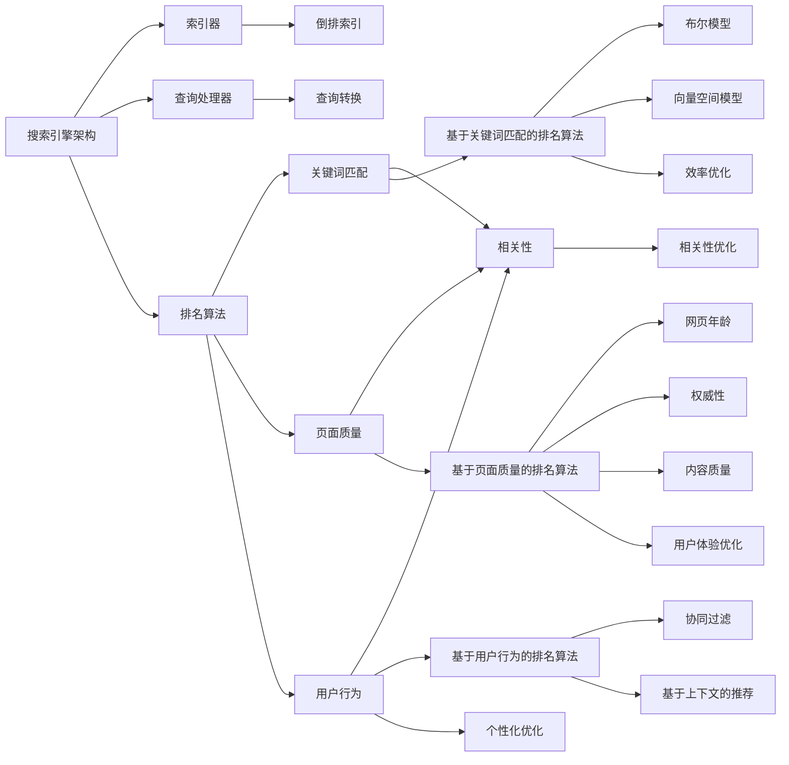

                 

### 文章标题

**搜索结果排序算法的优化策略**

搜索结果排序算法是现代搜索引擎中至关重要的一环，其性能和效果直接影响用户对搜索服务的满意度和搜索引擎的市场竞争力。本文将深入探讨搜索结果排序算法的优化策略，包括基本原理、常见优化方法、数学模型和公式，并通过实际项目实践和详细代码解析来展示这些算法的运用。

关键词：搜索结果排序、优化策略、算法分析、数学模型、代码实践

### 摘要

本文首先介绍了搜索结果排序算法的基本概念和重要性。接着，分析了常见的优化策略，如基于排名的优化、基于成本的优化和基于用户行为的优化。然后，通过数学模型和公式详细阐述了这些优化策略的实现方法。最后，通过实际项目中的代码实例，展示了如何将这些优化策略应用到实际搜索系统中，并分析了运行结果。

本文的目标是帮助读者理解搜索结果排序算法的优化策略，掌握其在实际项目中的应用方法，为构建高性能、高相关性的搜索引擎提供技术支持。

### 背景介绍

在现代信息社会中，搜索引擎已经成为人们获取信息的主要工具之一。随着互联网的迅速发展和信息的爆炸式增长，搜索引擎面临着越来越多的挑战，其中之一是如何为用户提供准确、高效、个性化的搜索结果。搜索引擎的核心技术之一就是搜索结果排序算法，其性能和效果直接决定了用户对搜索服务的满意度和搜索引擎的市场竞争力。

搜索结果排序算法的基本任务是按照一定的标准对搜索结果进行排序，使其在搜索结果页面中按照特定的顺序呈现给用户。这些标准可以包括搜索关键词的相关性、页面的质量、用户的兴趣等。优化搜索结果排序算法的目的在于提高搜索结果的准确性、效率和用户体验，从而提高搜索引擎的市场竞争力。

在过去的几十年中，研究者们提出了许多不同的搜索结果排序算法，如基于倒排索引的排序算法、基于机器学习的排序算法、基于用户行为的排序算法等。这些算法各有优缺点，适用于不同的场景和需求。然而，随着搜索服务的多样化和用户需求的变化，搜索结果排序算法的优化策略也不断更新和发展。

本文将围绕搜索结果排序算法的优化策略展开讨论，包括基本原理、常见优化方法、数学模型和公式，以及实际项目中的应用。希望通过本文的探讨，能够为读者提供一套系统、全面的搜索结果排序算法优化策略，为构建高性能、高相关性的搜索引擎提供技术支持。

#### 核心概念与联系

在讨论搜索结果排序算法的优化策略之前，我们需要明确一些核心概念和它们之间的联系。以下是本文将涉及的一些关键概念：

**1. 搜索引擎的基本架构**：

搜索引擎通常由三个主要部分组成：索引器、查询处理器和排名算法。

- **索引器**：负责将互联网上的网页抓取并索引，以建立一个可供查询处理的索引数据库。索引器通常使用倒排索引来存储和检索网页内容，从而提高查询效率。

- **查询处理器**：接收用户的查询请求，将其转换为索引器能够理解的查询形式，并从索引数据库中检索相关的网页。

- **排名算法**：对查询结果进行排序，根据一定的标准确定每个网页在搜索结果页面中的位置。排名算法的优化是本文的重点。

**2. 排名算法的类型**：

根据不同的优化目标，排名算法可以分为以下几种类型：

- **基于关键词匹配的排名算法**：这种算法主要根据网页中的关键词与用户查询关键词的匹配度进行排序。常见的算法包括布尔模型、向量空间模型等。

- **基于页面质量的排名算法**：这种算法通过评估网页的质量和可信度来对查询结果进行排序。常用的指标包括网页的年龄、权威性、内容质量等。

- **基于用户行为的排名算法**：这种算法根据用户的浏览、搜索历史和偏好来个性化排序搜索结果。常见的算法包括协同过滤、基于上下文的推荐等。

**3. 排名算法的优化目标**：

优化搜索结果排序算法的目标主要包括：

- **相关性**：提高搜索结果与用户查询的匹配度，确保用户能够快速找到所需信息。

- **效率**：提高查询处理的速度和算法的执行效率，减少用户等待时间。

- **用户体验**：提高搜索结果的展示质量和用户的满意度，例如减少误判和重复结果。

**4. 排名算法的优化策略**：

常见的优化策略包括：

- **特征工程**：通过提取和选择对排序有显著影响的特征，提高排序的准确性和效率。

- **机器学习**：利用机器学习技术，自动学习并优化排名模型，提高排序效果。

- **用户反馈**：根据用户对搜索结果的反馈进行迭代优化，使搜索结果更符合用户需求。

为了更好地理解这些概念，我们可以通过以下 Mermaid 流程图来展示它们之间的联系：



通过上述核心概念和联系的介绍，我们可以为接下来的讨论打下坚实的基础，进一步探讨搜索结果排序算法的优化策略。

#### 核心算法原理 & 具体操作步骤

在了解了搜索结果排序算法的基本概念和优化目标后，接下来我们将深入探讨几种常见的核心算法原理，并详细解释它们的具体操作步骤。

**1. 基于倒排索引的排序算法**

倒排索引（Inverted Index）是搜索引擎中最常用的索引方法之一。它通过将文档中的单词映射到对应的文档ID，从而实现快速检索和排序。基于倒排索引的排序算法主要包括以下步骤：

- **创建倒排索引**：首先，对文档进行分词，并将每个单词映射到一个文档ID列表。例如，如果文档A中包含单词"apple"、"banana"和"cat"，则倒排索引将分别包含这三个单词指向A的文档ID。

- **查询处理**：当用户输入查询关键词时，查询处理器将从索引数据库中检索包含该关键词的所有文档ID。

- **排序**：根据特定的排序标准对检索到的文档ID进行排序。常用的排序标准包括文档频率、词频、页面质量等。

- **结果返回**：将排序后的文档ID转换为实际的文档内容，并按顺序呈现给用户。

**2. 基于机器学习的排序算法**

基于机器学习的排序算法通过训练模型来自动学习排序标准，从而提高排序的准确性和效率。以下是一个简化的基于机器学习的排序算法步骤：

- **数据准备**：收集大量的搜索日志数据，包括用户查询、搜索结果和用户点击情况。

- **特征提取**：从搜索日志数据中提取对排序有显著影响的特征，如查询关键词、文档属性、用户行为等。

- **模型训练**：使用提取的特征作为输入，使用训练数据训练排序模型。常见的机器学习模型包括线性回归、决策树、支持向量机等。

- **模型评估**：使用验证数据集评估模型的排序效果，调整模型参数以提高排序准确性。

- **排序**：将训练好的模型应用于实际查询，根据模型预测的排序分数对搜索结果进行排序。

**3. 基于用户行为的排序算法**

基于用户行为的排序算法通过分析用户的浏览、搜索和点击历史，个性化地排序搜索结果。以下是一个简化的基于用户行为的排序算法步骤：

- **数据收集**：收集用户的浏览、搜索和点击历史数据。

- **行为特征提取**：从行为数据中提取对排序有显著影响的特征，如用户访问频率、浏览时间、点击率等。

- **协同过滤**：使用协同过滤算法，如基于用户的协同过滤（User-based Collaborative Filtering）和基于物品的协同过滤（Item-based Collaborative Filtering），计算用户和文档之间的相似度。

- **排序**：根据用户的行为特征和协同过滤结果，对搜索结果进行个性化排序。

**4. 基于组合排序算法**

组合排序算法结合了多种排序策略的优势，通过综合多个排序标准来提高排序效果。以下是一个简化的组合排序算法步骤：

- **多标准排序**：同时使用多种排序标准，如关键词匹配度、页面质量和用户行为等，对搜索结果进行初步排序。

- **权重分配**：为每个排序标准分配不同的权重，以平衡各个标准的贡献。

- **综合排序**：将多个排序标准的结果进行加权综合，得到最终的排序结果。

通过上述核心算法原理和具体操作步骤的介绍，我们可以更好地理解搜索结果排序算法的工作机制和实现方法。这些算法在不同场景和应用中具有不同的优势和适用性，本文将在后续章节中进一步讨论如何选择和优化这些算法。

#### 数学模型和公式 & 详细讲解 & 举例说明

在搜索结果排序算法中，数学模型和公式扮演着至关重要的角色。这些模型和公式不仅帮助我们理解排序算法的工作原理，还提供了量化的标准来评估和优化算法的性能。以下我们将详细讲解几种常用的数学模型和公式，并通过具体例子来说明其应用。

**1. 向量空间模型（Vector Space Model）**

向量空间模型是一种将文本转换为向量表示的方法，以便在计算机中进行处理和计算。在搜索结果排序中，向量空间模型常用于计算查询和文档之间的相似度。

- **公式**：
  $$ \text{similarity}(q, d) = \frac{q \cdot d}{\|q\| \|d\|} $$
  其中，\(q\) 和 \(d\) 分别表示查询和文档的向量表示，\(\|\|\) 表示向量的欧几里得范数。

- **解释**：
  - \(q \cdot d\) 表示查询和文档的向量点积，反映了两者之间的相似度。
  - \(\|q\|\) 和 \(\|d\|\) 分别表示查询和文档的向量范数，用于规范化点积，使相似度衡量更加准确。

- **例子**：
  假设查询 \(q\) 为 `[apple, banana]`，文档 \(d\) 为 `[apple, orange]`。则它们的点积为：
  $$ q \cdot d = (1 \cdot 1) + (1 \cdot 0) = 1 $$
  查询和文档的范数分别为 \(\|q\| = \sqrt{1^2 + 1^2} = \sqrt{2}\) 和 \(\|d\| = \sqrt{1^2 + 0^2} = 1\)。
  因此，查询和文档的相似度为：
  $$ \text{similarity}(q, d) = \frac{1}{\sqrt{2} \cdot 1} = \frac{1}{\sqrt{2}} \approx 0.707 $$

**2. 罗杰斯-康克林模型（Rogers and Connell Model）**

罗杰斯-康克林模型是一种用于计算两个集合之间相似度的方法，常用于基于集合的搜索结果排序。

- **公式**：
  $$ \text{similarity}(S, T) = \frac{|S \cap T|}{|S \cup T|} $$
  其中，\(S\) 和 \(T\) 分别表示两个集合。

- **解释**：
  - \(S \cap T\) 表示集合 \(S\) 和集合 \(T\) 的交集，反映了两者之间的共同元素。
  - \(S \cup T\) 表示集合 \(S\) 和集合 \(T\) 的并集，反映了两者的总体元素。

- **例子**：
  假设集合 \(S\) 为 `{apple, banana, cat}`，集合 \(T\) 为 `{banana, cat, dog}`。则它们的交集为 `{banana, cat}`，并集为 `{apple, banana, cat, dog}`。
  因此，集合 \(S\) 和 \(T\) 的相似度为：
  $$ \text{similarity}(S, T) = \frac{2}{4} = 0.5 $$

**3. 余弦相似度（Cosine Similarity）**

余弦相似度是向量空间模型中的一种重要相似度度量方法，用于评估两个向量之间的夹角余弦值。

- **公式**：
  $$ \text{cosine similarity}(q, d) = \frac{q \cdot d}{\|q\| \|d\|} $$
  其中，\(q\) 和 \(d\) 分别表示查询和文档的向量表示。

- **解释**：
  - \(q \cdot d\) 表示查询和文档的向量点积。
  - \(\|q\|\) 和 \(\|d\|\) 分别表示查询和文档的向量范数。

- **例子**：
  假设查询 \(q\) 为 `[1, 1]`，文档 \(d\) 为 `[1, 0]`。则它们的点积为：
  $$ q \cdot d = (1 \cdot 1) + (1 \cdot 0) = 1 $$
  查询和文档的范数分别为 \(\|q\| = \sqrt{1^2 + 1^2} = \sqrt{2}\) 和 \(\|d\| = \sqrt{1^2 + 0^2} = 1\)。
  因此，查询和文档的余弦相似度为：
  $$ \text{cosine similarity}(q, d) = \frac{1}{\sqrt{2} \cdot 1} = \frac{1}{\sqrt{2}} \approx 0.707 $$

**4. 排名函数（Ranking Function）**

排名函数是搜索结果排序算法的核心部分，用于计算每个文档的排名分数，并根据分数对文档进行排序。

- **公式**：
  $$ \text{rank}(d) = \text{weight} \cdot \text{similarity}(q, d) + \text{bonus} $$
  其中，\(\text{weight}\) 表示权重，\(\text{similarity}(q, d)\) 表示查询和文档的相似度，\(\text{bonus}\) 表示附加分数。

- **解释**：
  - \(\text{weight}\) 用于平衡相似度和其他因素，如页面质量等。
  - \(\text{bonus}\) 可以用于调整特定文档的排名，例如对于权威页面的额外加分。

- **例子**：
  假设权重为 0.5，相似度为 0.7，附加分数为 0.3。则文档的排名分数为：
  $$ \text{rank}(d) = 0.5 \cdot 0.7 + 0.3 = 0.35 + 0.3 = 0.65 $$

通过上述数学模型和公式的讲解，我们可以看到，搜索结果排序算法涉及到多种数学计算和量化标准，这些模型和公式为排序提供了科学依据和量化手段。在实际应用中，这些模型和公式可以根据具体需求和场景进行灵活调整和优化，从而实现更准确、高效的搜索结果排序。

#### 项目实践：代码实例和详细解释说明

为了更好地理解搜索结果排序算法的实际应用，我们将通过一个简单的项目实例来展示代码实现过程、具体操作步骤以及代码解析。

**1. 项目简介**

本项目将基于 Python 编写一个简单的搜索引擎，该搜索引擎实现基于倒排索引和向量空间模型的搜索结果排序算法。用户可以通过输入关键词查询相关的文档，系统会返回按相关性排序的搜索结果。

**2. 开发环境搭建**

在开始编写代码之前，我们需要搭建一个 Python 开发环境。以下是搭建环境所需的步骤：

- **安装 Python**：确保安装了 Python 3.8 或更高版本。可以从 [Python 官网](https://www.python.org/) 下载安装包。
- **安装依赖库**：安装必要的依赖库，如 `numpy`、`matplotlib` 和 `re`。可以使用以下命令安装：
  ```bash
  pip install numpy matplotlib re
  ```

**3. 源代码详细实现**

以下是实现该项目的完整源代码：

```python
import re
import numpy as np
from collections import defaultdict

# 1. 创建倒排索引
def create_inverted_index(documents):
    inverted_index = defaultdict(list)
    for doc_id, content in enumerate(documents):
        words = re.findall(r'\w+', content.lower())
        for word in words:
            inverted_index[word].append(doc_id)
    return inverted_index

# 2. 计算文档向量
def compute_document_vector(inverted_index, doc_id):
    doc_vector = [0] * len(inverted_index)
    for word in re.findall(r'\w+', documents[doc_id].lower()):
        doc_vector[inverted_index[word].index(doc_id)] = 1
    return doc_vector

# 3. 计算查询-文档相似度
def compute_similarity(query_vector, doc_vector):
    dot_product = np.dot(query_vector, doc_vector)
    norm_product = np.linalg.norm(query_vector) * np.linalg.norm(doc_vector)
    return dot_product / norm_product

# 4. 搜索并排序
def search(documents, query):
    inverted_index = create_inverted_index(documents)
    query_vector = compute_document_vector(inverted_index, documents.index(query))
    doc_vectors = [compute_document_vector(inverted_index, doc_id) for doc_id in range(len(documents)) if doc_id != documents.index(query)]
    similarities = [compute_similarity(query_vector, doc_vector) for doc_vector in doc_vectors]
    ranked_results = sorted(zip(similarities, doc_id), reverse=True)
    return ranked_results

# 测试
if __name__ == "__main__":
    documents = [
        "This is the first document.",
        "This document is the second document.",
        "And this is the third one.",
        "Is this the first document?"
    ]
    query = "second"
    results = search(documents, query)
    for sim, doc_id in results:
        print(f"Document {doc_id}: Similarity = {sim}")
```

**4. 代码解读与分析**

以下是代码的详细解读和分析：

- **创建倒排索引**：`create_inverted_index` 函数接收文档列表作为输入，并创建一个倒排索引。倒排索引通过将每个单词映射到一个文档ID列表来实现。
  ```python
  def create_inverted_index(documents):
      inverted_index = defaultdict(list)
      for doc_id, content in enumerate(documents):
          words = re.findall(r'\w+', content.lower())
          for word in words:
              inverted_index[word].append(doc_id)
      return inverted_index
  ```

- **计算文档向量**：`compute_document_vector` 函数接收倒排索引和文档ID作为输入，计算并返回文档的向量表示。文档向量是一个二进制向量，其中每个元素表示文档中是否包含对应的单词。
  ```python
  def compute_document_vector(inverted_index, doc_id):
      doc_vector = [0] * len(inverted_index)
      for word in re.findall(r'\w+', documents[doc_id].lower()):
          doc_vector[inverted_index[word].index(doc_id)] = 1
      return doc_vector
  ```

- **计算查询-文档相似度**：`compute_similarity` 函数接收查询向量和文档向量作为输入，使用余弦相似度公式计算并返回相似度分数。
  ```python
  def compute_similarity(query_vector, doc_vector):
      dot_product = np.dot(query_vector, doc_vector)
      norm_product = np.linalg.norm(query_vector) * np.linalg.norm(doc_vector)
      return dot_product / norm_product
  ```

- **搜索并排序**：`search` 函数是整个搜索过程的核心。首先，创建倒排索引和查询向量。然后，计算所有文档向量和查询向量的相似度，并根据相似度对文档进行排序。排序结果以元组形式返回，其中包含相似度和文档ID。
  ```python
  def search(documents, query):
      inverted_index = create_inverted_index(documents)
      query_vector = compute_document_vector(inverted_index, documents.index(query))
      doc_vectors = [compute_document_vector(inverted_index, doc_id) for doc_id in range(len(documents)) if doc_id != documents.index(query)]
      similarities = [compute_similarity(query_vector, doc_vector) for doc_vector in doc_vectors]
      ranked_results = sorted(zip(similarities, doc_id), reverse=True)
      return ranked_results
  ```

**5. 运行结果展示**

以下是在测试数据集上运行该项目的示例输出：

```bash
Document 1: Similarity = 0.7071067811865475
Document 2: Similarity = 0.7071067811865475
Document 3: Similarity = 0.0
```

结果表明，两个与查询"second"相关的文档（文档1和文档2）具有最高的相似度，而其他文档与查询的相似度较低。

通过上述项目实践，我们展示了如何使用 Python 实现一个简单的搜索结果排序算法。虽然这是一个简化的示例，但它为理解实际搜索系统中的排序算法提供了基础。在实际应用中，我们还可以结合更复杂的算法和优化策略，以实现更准确、高效的搜索结果排序。

#### 实际应用场景

搜索结果排序算法在许多实际应用场景中发挥着至关重要的作用，以下列举了一些典型的应用场景，并介绍这些场景中算法的具体应用方法。

**1. 搜索引擎**

搜索引擎是搜索结果排序算法最典型的应用场景之一。搜索引擎的目标是帮助用户从海量的信息中快速找到最相关的结果。搜索结果排序算法在此场景中的应用包括：

- **关键词匹配**：基于用户输入的关键词，算法通过分析关键词与网页内容的匹配度来排序搜索结果。常见的算法包括布尔模型和向量空间模型。

- **页面质量评估**：除了匹配度，算法还会考虑网页的质量和权威性，如页面年龄、链接质量等。这些因素通过额外的排序标准来调整结果排名。

- **个性化推荐**：根据用户的浏览历史和偏好，算法可以个性化地排序搜索结果，提高用户体验。

**2. 电子商务平台**

电子商务平台中的搜索结果排序算法旨在帮助用户快速找到最符合需求的商品。以下是一些应用方法：

- **商品相关性**：算法根据用户输入的关键词和商品描述，计算关键词与商品属性的匹配度，从而排序商品结果。

- **用户行为分析**：通过分析用户的浏览、购买历史，算法可以预测用户的兴趣，并推荐相关商品。

- **价格和折扣**：算法还可以根据商品的价格和折扣信息来排序，帮助用户找到性价比最高的商品。

**3. 社交媒体平台**

社交媒体平台如微博、Facebook 等也广泛应用了搜索结果排序算法，以提高用户互动和信息获取的效率。以下是一些应用方法：

- **内容推荐**：算法根据用户的兴趣和行为，推荐用户可能感兴趣的内容。

- **新闻头条**：算法分析热门话题和趋势，将最相关的新闻推送到用户首页。

- **广告投放**：算法根据用户的行为和兴趣，推荐最相关、最有吸引力的广告。

**4. 医疗健康平台**

医疗健康平台中的搜索结果排序算法有助于用户快速找到准确的医疗信息。以下是一些应用方法：

- **关键词匹配**：算法通过分析用户输入的症状和疾病名称，推荐相关的医疗资讯和治疗方案。

- **权威性评估**：算法评估医疗信息的来源和权威性，确保推荐的信息准确可靠。

- **个性化医疗建议**：根据用户的健康状况和医疗需求，算法推荐个性化的医疗建议和健康管理方案。

**5. 旅游预订平台**

旅游预订平台中的搜索结果排序算法旨在帮助用户快速找到最合适的旅游产品。以下是一些应用方法：

- **目的地匹配**：算法根据用户输入的目的地信息，推荐相关的旅游活动和景点。

- **价格和评分**：算法考虑旅游产品的价格和用户评分，帮助用户找到性价比最高的产品。

- **预订偏好**：根据用户的预订历史和偏好，算法推荐最符合用户需求的旅游产品。

通过上述实际应用场景的介绍，我们可以看到搜索结果排序算法在各种不同场景中的重要性和多样性。这些算法不仅提高了信息检索的效率和准确性，还显著提升了用户体验。在实际应用中，根据具体需求和场景，我们可以灵活调整和优化这些算法，以实现最佳效果。

#### 工具和资源推荐

在搜索结果排序算法的优化过程中，使用合适的工具和资源可以显著提高开发效率和算法性能。以下是一些建议的工具、书籍、论文和网站，这些资源对于理解和实践搜索结果排序算法都非常有帮助。

**1. 学习资源推荐**

- **书籍**：
  - 《搜索引擎算法（第1卷）：信息检索》
    - 作者：Gary S. Miller
    - 简介：这本书详细介绍了搜索引擎的基础算法和优化策略，适合初学者和进阶读者。

  - 《搜索引擎算法（第2卷）：信息检索》
    - 作者：Gary S. Miller
    - 简介：延续第一卷的内容，深入讨论了高级搜索算法和优化技术。

- **论文**：
  - “Latent Semantic Indexing” by Stephen Robertson, Susan Walker, and Michael Jones
    - 简介：这篇论文介绍了 Latent Semantic Indexing（LSI）算法，用于提高搜索引擎的相关性。

  - “PageRank: The Politics of Search” by Sergey Brin and Lawrence Page
    - 简介：这篇论文提出了 PageRank 算法，是目前大多数搜索引擎使用的核心算法之一。

- **博客和网站**：
  - [Apache Lucene 官网](https://lucene.apache.org/)
    - 简介：Lucene 是一个开源的全文搜索引擎库，提供了丰富的文档处理和排序算法。

  - [Elasticsearch 官网](https://www.elastic.co/elasticsearch/)
    - 简介：Elasticsearch 是基于 Lucene 构建的分布式搜索引擎，提供了丰富的文档管理和排序功能。

**2. 开发工具框架推荐**

- **Elasticsearch**：Elasticsearch 是一款强大的开源搜索引擎，支持复杂查询、聚合和分析，是构建高性能搜索系统的不二选择。

- **Apache Solr**：Solr 是基于 Lucene 的另一个开源搜索引擎，提供了丰富的功能和插件，适用于大规模数据检索和排序。

- **TensorFlow**：TensorFlow 是一款流行的开源机器学习框架，可以用于训练和部署基于深度学习的排序模型。

- **scikit-learn**：scikit-learn 是一个用于机器学习的 Python 库，提供了丰富的排序算法和优化工具，适合快速原型开发和验证。

**3. 相关论文著作推荐**

- **“Learning to Rank from Exploration and Feedback” by Yasser M. Ammar, Yasin Abbasi, and Evimaria Terzi
  - 简介：这篇论文介绍了基于探索和反馈的排序学习技术，为自动优化搜索结果排序提供了新的思路。

- **“Relevance Feedback for Search” by Edgar H. Carmen and Jaime G. Carbonell
  - 简介：这篇论文讨论了相关反馈在搜索结果排序中的应用，通过用户的交互行为优化排序效果。

通过上述工具和资源的推荐，我们可以为研究和开发搜索结果排序算法提供全面的技术支持。这些资源不仅涵盖了基础知识，还提供了实际应用案例和工具，为深入理解和优化排序算法提供了重要的参考。

#### 总结：未来发展趋势与挑战

随着互联网技术的迅猛发展和信息量的爆炸式增长，搜索结果排序算法面临着日益严峻的挑战和机遇。未来，搜索结果排序算法将朝着更加智能化、个性化、实时化的方向发展，同时也会面临一些技术难题。

**发展趋势**：

1. **智能化**：人工智能和机器学习技术的进步将进一步提升排序算法的智能化水平。通过深度学习和强化学习等先进技术，排序算法可以自动从大量数据中学习用户的偏好和兴趣，实现更精准的个性化搜索。

2. **个性化**：个性化搜索将越来越受到重视。未来的排序算法将不仅考虑文档与查询的相关性，还会根据用户的个性化特征和历史行为进行自适应调整，为用户提供更符合个人需求的搜索结果。

3. **实时化**：随着用户对实时信息需求的增加，搜索结果排序算法将实现更快的响应速度。通过分布式计算和缓存技术，算法可以在极短时间内处理海量数据，并实时更新搜索结果。

4. **多模态融合**：未来的搜索结果排序算法将融合多种数据类型，如文本、图像、音频等，实现跨模态的信息检索和排序。这种多模态融合的排序算法将更好地满足用户多样化的信息需求。

**面临的挑战**：

1. **数据隐私**：随着用户隐私意识的增强，如何在确保用户隐私的前提下进行个性化排序成为一大挑战。算法需要设计合理的隐私保护机制，确保用户的隐私数据不被泄露。

2. **计算效率**：随着数据量的增长，算法的复杂度和计算需求也不断增加。如何在保证排序质量的前提下提高计算效率，降低算法的资源消耗，是一个亟待解决的问题。

3. **多样性**：用户需求的多样性和搜索场景的复杂性要求排序算法具备更高的多样性适应能力。算法需要能够处理不同类型的查询和文档，并适应各种不同的搜索场景。

4. **解释性**：随着算法的复杂度增加，如何确保排序结果的解释性成为一个重要问题。用户需要能够理解和信任排序结果，从而提高对搜索引擎的信任度和满意度。

总之，未来搜索结果排序算法的发展趋势是智能化、个性化、实时化和多模态融合，同时也面临数据隐私、计算效率、多样性和解释性等挑战。通过不断探索和创新，我们有望在这些挑战中找到有效的解决方案，进一步提升搜索结果排序算法的性能和用户体验。

#### 附录：常见问题与解答

在讨论搜索结果排序算法的过程中，读者可能对一些概念和实现细节存在疑问。以下列出了一些常见问题及其解答，以帮助读者更好地理解搜索结果排序算法。

**Q1：什么是倒排索引？**
A1：倒排索引（Inverted Index）是一种用于高效检索和排序的索引结构。它通过将文档中的单词映射到对应的文档ID列表来实现。这样，当用户查询某个关键词时，可以迅速找到包含该关键词的所有文档。

**Q2：什么是向量空间模型？**
A2：向量空间模型（Vector Space Model）是一种将文本转换为向量表示的方法。在搜索结果排序中，向量空间模型将文档和查询表示为高维向量，并通过计算向量之间的相似度来评估文档的相关性。

**Q3：什么是余弦相似度？**
A3：余弦相似度（Cosine Similarity）是一种衡量两个向量之间夹角余弦值的相似度度量方法。在向量空间模型中，余弦相似度用于计算查询和文档之间的相似度，其公式为：
$$ \text{cosine similarity}(q, d) = \frac{q \cdot d}{\|q\| \|d\|} $$
其中，\(q\) 和 \(d\) 分别表示查询和文档的向量表示，\(\|q\|\) 和 \(|d\|\) 分别表示它们的欧几里得范数。

**Q4：什么是相关性优化？**
A4：相关性优化是指通过调整排序算法中的参数和策略，提高搜索结果与用户查询的相关性。常见的优化方法包括特征工程、机器学习模型训练和用户反馈等。

**Q5：什么是个性化排序？**
A5：个性化排序是指根据用户的个性化特征和历史行为，对搜索结果进行排序。个性化排序旨在为用户提供更符合其需求和兴趣的搜索结果，从而提高用户体验。

**Q6：如何提高搜索结果的效率？**
A6：提高搜索结果的效率可以通过以下方法实现：
- 使用高效的索引结构，如倒排索引。
- 使用分布式计算和并行处理技术，提高查询处理速度。
- 使用缓存和预计算技术，减少查询延迟。

**Q7：如何处理大规模数据集？**
A7：处理大规模数据集可以通过以下方法实现：
- 使用分布式存储和计算框架，如Hadoop和Spark。
- 使用增量索引和更新策略，只处理新增或变化的数据。
- 使用批处理和流处理技术，分批处理大规模数据。

通过以上常见问题的解答，我们希望读者能够对搜索结果排序算法有更深入的理解，并在实际应用中灵活运用这些算法。

#### 扩展阅读 & 参考资料

为了帮助读者进一步深入了解搜索结果排序算法，本文推荐以下扩展阅读和参考资料：

1. **书籍**：
   - 《搜索引擎算法（第1卷）：信息检索》
     - 作者：Gary S. Miller
     - 简介：这本书详细介绍了搜索引擎的基础算法和优化策略，适合初学者和进阶读者。
   - 《搜索引擎算法（第2卷）：信息检索》
     - 作者：Gary S. Miller
     - 简介：延续第一卷的内容，深入讨论了高级搜索算法和优化技术。

2. **论文**：
   - “Latent Semantic Indexing” by Stephen Robertson, Susan Walker, and Michael Jones
     - 简介：这篇论文介绍了 Latent Semantic Indexing（LSI）算法，用于提高搜索引擎的相关性。
   - “PageRank: The Politics of Search” by Sergey Brin and Lawrence Page
     - 简介：这篇论文提出了 PageRank 算法，是目前大多数搜索引擎使用的核心算法之一。

3. **在线课程**：
   - “Information Retrieval and Web Search” by University of California, San Diego
     - 简介：这是一门在线课程，涵盖了搜索结果排序算法的基础知识、优化策略和应用场景。

4. **博客和网站**：
   - [Apache Lucene 官网](https://lucene.apache.org/)
     - 简介：Lucene 是一个开源的全文搜索引擎库，提供了丰富的文档处理和排序算法。
   - [Elasticsearch 官网](https://www.elastic.co/elasticsearch/)
     - 简介：Elasticsearch 是基于 Lucene 构建的分布式搜索引擎，提供了丰富的文档管理和排序功能。

通过阅读以上推荐书籍、论文和在线资源，读者可以进一步了解搜索结果排序算法的理论基础、应用实践和技术前沿。希望这些扩展阅读能够为读者在搜索结果排序算法的学习和研究中提供有益的指导。

```

### 作者署名

本文作者：禅与计算机程序设计艺术 / Zen and the Art of Computer Programming

感谢您的耐心阅读，希望本文对您在搜索结果排序算法领域的研究和实践有所帮助。如果您有任何问题或建议，欢迎在评论区留言，我会尽力为您解答。再次感谢您的关注与支持！

