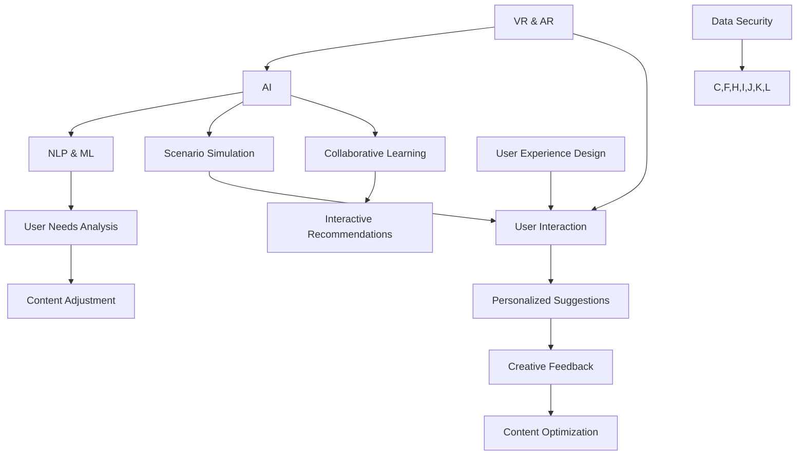

                 

### 文章标题

**数字化想象力培养皿设计师：AI激发的创意思维孵化器创造者**

在数字化时代，AI正逐渐成为引领创新和变革的核心力量。本文旨在探讨AI在激发和培养数字化想象力方面的独特角色，尤其是如何通过设计专用的想象力培养皿（Imagination Cultivation Vessels，简称ICVs）来孵化创意思维。我们将深入探讨AI的核心概念、算法原理、数学模型、实践应用以及未来发展趋势。

### 关键词：
- AI
- 想象力培养
- 创意思维
- 想象力培养皿
- 算法原理
- 数学模型
- 实践应用
- 未来发展趋势

### 摘要：
本文提出了一个创新的视角，将AI视为数字化想象力的培养皿设计师。通过探讨AI的核心原理和算法，本文揭示了如何设计高效的想象力培养皿，以激发创意思维。文章将提供详细的算法原理解析、数学模型讲解，并通过实际项目案例展示AI在创意思维孵化中的实际应用。最终，本文将讨论AI在想象力培养领域的未来发展趋势和挑战。

在接下来的章节中，我们将：

1. **背景介绍**：阐述AI在数字化时代的重要性，引入想象力培养皿的概念。
2. **核心概念与联系**：详细解释想象力培养皿的工作原理和AI在其中的作用。
3. **核心算法原理 & 具体操作步骤**：深入探讨AI激发创意思维的核心算法和实现步骤。
4. **数学模型和公式 & 详细讲解 & 举例说明**：介绍用于想象力培养皿设计的数学模型和公式，并辅以实际案例。
5. **项目实践：代码实例和详细解释说明**：展示一个完整的代码实例，详细解读实现过程。
6. **实际应用场景**：讨论AI在想象力培养中的多种应用场景。
7. **工具和资源推荐**：推荐学习资源、开发工具和框架。
8. **总结：未来发展趋势与挑战**：展望AI在想象力培养领域的未来。
9. **附录：常见问题与解答**：解答读者可能遇到的问题。
10. **扩展阅读 & 参考资料**：提供进一步学习的资源。

现在，让我们一步步深入探讨这一前沿领域。

<|user|>## 1. 背景介绍

在当今这个数字化爆炸的时代，人工智能（AI）已经从一个科学幻想逐步走进了我们的日常生活。从智能手机的语音助手，到自动驾驶汽车，再到医疗诊断和金融分析，AI的触角几乎延伸到了社会的每一个角落。然而，尽管AI在各个领域展现出了强大的潜力和应用价值，其最深远的变革或许在于它对人类思维方式的激发与重塑。

### AI的崛起与变革

AI的崛起并非一蹴而就。从最初的简单逻辑推理，到今天的深度学习和自然语言处理，AI经历了无数次的技术迭代和理论突破。随着计算能力的提升和大数据的普及，AI逐渐具备了处理复杂数据、自动学习和优化策略的能力。这不仅使得AI在工业、医疗、金融等领域的应用越来越广泛，同时也引发了我们对人类自身能力的新思考。

### 想象力培养皿的概念

在这个背景下，我们提出了“想象力培养皿”这一概念。想象力培养皿是一种设计理念，旨在创造一个环境，通过引导和激发用户的想象力，帮助他们在数字化世界中探索新的创意和解决方案。这一概念的核心在于，它不仅仅是一个工具或系统，而是一个培养创新思维和创意能力的生态系统。

想象力培养皿的特点包括：

- **适应性**：根据用户的需求和行为动态调整内容和环境。
- **交互性**：提供丰富的交互方式，使用户能够自由探索和表达。
- **多样性**：涵盖多种类型的创意活动，如故事创作、艺术设计、科学探究等。

### AI与想象力培养皿的关系

AI在想象力培养皿中扮演着多重角色。首先，AI可以通过分析用户的行为数据和兴趣偏好，为用户提供个性化的创意激发方案。其次，AI能够模拟和生成多样化的场景和情境，帮助用户拓展想象空间。最后，AI还可以通过智能推荐系统和协作学习，促进用户之间的互动和合作，从而进一步提升创意思维的质量。

### 想象力培养皿的设计目标

设计想象力培养皿的终极目标是激发和培养用户的创造力，帮助他们突破常规思维，发现新的创意和解决方案。这不仅仅是为了满足个体的需求，更是为了推动社会进步和创新。通过想象力培养皿，我们希望能够培养出更多具有创新精神的人才，为未来的发展注入新的活力。

在接下来的章节中，我们将深入探讨AI的核心概念和原理，详细解析想象力培养皿的工作机制，并通过实际案例展示其应用价值。让我们一起探索这个充满无限可能的新领域。

## Background Introduction

In this era of digital explosion, artificial intelligence (AI) has gradually moved from a science fiction concept to an integral part of our daily lives. From smartphone virtual assistants to autonomous vehicles, AI's influence has permeated every corner of society. However, the most profound impact of AI may lie in its ability to inspire and reshape human thought processes.

### The Rise and Transformation of AI

The rise of AI did not happen overnight. From simple logical reasoning to today's deep learning and natural language processing, AI has undergone numerous technological iterations and theoretical breakthroughs. With the advancement of computing power and the ubiquity of big data, AI has developed the capability to handle complex data, learn autonomously, and optimize strategies. This has not only expanded AI's applications across industries such as manufacturing, healthcare, and finance, but has also sparked new reflections on human capabilities.

### The Concept of Imagination Cultivation Vessels

In this context, we introduce the concept of "Imagination Cultivation Vessels" (ICVs). ICVs are a design philosophy aimed at creating an environment that guides and激发 users' imaginations to explore new creative ideas and solutions in the digital world. The core of this concept is not merely a tool or system, but an ecosystem that fosters innovation and creative thinking.

Characteristics of ICVs include:

- **Adaptability**: Dynamically adjust content and environment based on user needs and behaviors.
- **Interactivity**: Provide rich interaction methods for users to freely explore and express themselves.
- **Diversity**: Cover a wide range of creative activities, such as story creation, art design, and scientific exploration.

### The Relationship between AI and ICVs

AI plays multiple roles in ICVs. First, AI can analyze user behavioral data and interest preferences to provide personalized creative inspiration plans. Second, AI can simulate and generate diverse scenarios and situations, expanding users' imaginative space. Finally, AI can promote interaction and collaboration among users through intelligent recommendation systems and collaborative learning, thus further enhancing the quality of creative thinking.

### Design Goals of ICVs

The ultimate goal of designing ICVs is to inspire and cultivate users' creativity, helping them break through conventional thinking and discover new creative ideas and solutions. This is not only to meet individual needs but also to drive social progress and innovation. Through ICVs, we hope to nurture more innovative individuals who can inject new vitality into the future.

In the following sections, we will delve into the core concepts and principles of AI, thoroughly analyze the mechanisms of ICVs, and demonstrate their practical value through real-world case studies. Together, let us explore this exciting and limitless new field.

<|user|>## 2. 核心概念与联系

在探讨想象力培养皿的设计与实现之前，我们需要先明确一些核心概念和它们之间的联系。以下是想象力培养皿的关键组成部分及其相互关系：

### 2.1 想象力培养皿的定义

想象力培养皿是一种通过数字技术构建的虚拟环境，旨在激发和培养用户的创造力。它结合了人工智能、虚拟现实、增强现实等技术，为用户提供了一个可以自由探索、尝试和实验的空间。

### 2.2 AI与想象力培养皿的关系

AI在想象力培养皿中起着至关重要的作用。首先，AI通过自然语言处理和机器学习技术，能够理解和分析用户的创意需求，从而提供个性化的建议和反馈。其次，AI可以模拟复杂的场景和情境，帮助用户拓展想象力。最后，AI还能够通过协作学习和推荐系统，促进用户之间的互动，共同探索创意的可能性。

### 2.3 虚拟现实与增强现实

虚拟现实（VR）和增强现实（AR）是构建想象力培养皿的重要技术。VR提供了一种完全沉浸式的体验，使用户能够身临其境地探索虚拟世界。AR则通过叠加数字信息到现实世界中，为用户提供了一个更加互动和直观的体验。这两种技术共同丰富了想象力培养皿的交互性和多样性。

### 2.4 用户互动与体验设计

想象力培养皿的用户互动和体验设计是其成功的关键。一个良好的用户体验需要考虑用户的情感、认知和行为需求。通过提供多样化的互动方式、丰富的内容资源和灵活的调整选项，想象力培养皿可以更好地激发用户的创造力。

### 2.5 想象力培养皿的设计原则

为了确保想象力培养皿的有效性和可持续性，设计时需要遵循以下原则：

- **适应性**：培养皿应能够根据用户的需求和行为动态调整内容。
- **互动性**：提供丰富的交互方式，鼓励用户自由探索和表达。
- **多样性**：涵盖多种创意活动，满足不同用户的兴趣和需求。
- **引导性**：通过智能推荐和指导，帮助用户拓展想象力。
- **安全性**：确保用户的隐私和数据安全。

### 2.6 实现想象力培养皿的技术挑战

实现想象力培养皿面临着一系列技术挑战，包括：

- **计算能力**：需要强大的计算资源来支持复杂的场景模拟和实时交互。
- **数据隐私**：确保用户数据的安全和隐私。
- **用户参与度**：设计有趣的互动内容和激励措施，提高用户参与度。
- **技术融合**：整合多种数字技术，实现无缝的用户体验。

通过深入理解这些核心概念和联系，我们可以更好地设计出具有高效激发和培养想象力的想象力培养皿。接下来，我们将详细探讨AI在想象力培养皿中的作用和实现方法。

## Core Concepts and Connections

Before delving into the design and implementation of Imagination Cultivation Vessels (ICVs), we need to clarify some core concepts and their relationships. Here are the key components of ICVs and their interconnections:

### 2.1 Definition of Imagination Cultivation Vessels

Imagination Cultivation Vessels are virtual environments constructed using digital technology to inspire and cultivate creativity. They integrate artificial intelligence (AI), virtual reality (VR), and augmented reality (AR) to provide users with a space for free exploration, experimentation, and expression.

### 2.2 The Relationship between AI and ICVs

AI plays a crucial role in ICVs. Firstly, AI utilizes natural language processing (NLP) and machine learning (ML) technologies to understand and analyze users' creative needs, providing personalized suggestions and feedback. Secondly, AI can simulate complex scenarios and situations, expanding users' imagination. Finally, AI can foster interaction among users through collaborative learning and recommendation systems, jointly exploring creative possibilities.

### 2.3 Virtual Reality and Augmented Reality

Virtual Reality (VR) and Augmented Reality (AR) are essential technologies in building ICVs. VR offers an immersive experience, allowing users to explore virtual worlds in a realistic manner. AR overlays digital information onto the real world, providing a more interactive and intuitive experience. Both technologies enrich the interactivity and diversity of ICVs.

### 2.4 User Interaction and Experience Design

The user interaction and experience design are critical to the success of ICVs. A good user experience needs to consider the emotional, cognitive, and behavioral needs of users. By offering diverse interaction methods, rich content resources, and flexible adjustment options, ICVs can better inspire creativity.

### 2.5 Design Principles of ICVs

To ensure the effectiveness and sustainability of ICVs, the following principles should be followed during design:

- **Adaptability**: ICVs should dynamically adjust content based on user needs and behaviors.
- **Interactivity**: Provide rich interaction methods to encourage free exploration and expression.
- **Diversity**: Cover a wide range of creative activities to meet different users' interests and needs.
- **Guidance**: Through intelligent recommendations and guidance, help users expand their imagination.
- **Security**: Ensure user privacy and data security.

### 2.6 Technical Challenges in Implementing ICVs

Implementing ICVs faces a series of technical challenges, including:

- **Computational Power**: Strong computational resources are needed to support complex scenario simulation and real-time interaction.
- **Data Privacy**: Ensure user data security and privacy.
- **User Engagement**: Design interesting interactive content and incentive measures to increase user engagement.
- **Technological Integration**: Integrate various digital technologies to achieve a seamless user experience.

By deeply understanding these core concepts and connections, we can better design ICVs that efficiently inspire and cultivate imagination. In the following sections, we will delve into the role of AI in ICVs and methods for its implementation.

### 2.7 Illustrative Mermaid Flowchart of ICV Components

Below is a Mermaid flowchart illustrating the key components and their relationships in an Imagination Cultivation Vessel:



This flowchart showcases the interconnected components of an ICV, highlighting the integration of AI, VR/AR, and user experience design to create a cohesive and effective environment for imaginative thinking and creativity.

<|user|>## 3. 核心算法原理 & 具体操作步骤

为了深入理解AI在想象力培养皿中的作用，我们需要探讨几个核心算法原理，并详细描述这些算法的具体操作步骤。以下是几个关键的算法原理及其在想象力培养皿中的应用。

### 3.1 自然语言处理（NLP）

自然语言处理是AI的核心技术之一，它使计算机能够理解和处理人类语言。在想象力培养皿中，NLP被用来理解和分析用户的创意需求，从而提供个性化的建议和反馈。

#### 3.1.1 NLP的基本算法

- **词嵌入（Word Embedding）**：将单词转换为一个密集向量表示，便于计算机处理。
- **序列模型（Sequence Models）**：如循环神经网络（RNN）和长短期记忆网络（LSTM），用于处理文本序列。
- **生成式对抗网络（GAN）**：通过生成对抗过程生成高质量的文本。

#### 3.1.2 操作步骤

1. **数据预处理**：对用户输入的文本进行清洗和标记。
2. **词嵌入**：将文本中的每个词转换为一个向量。
3. **模型训练**：使用序列模型训练模型以理解用户的语言模式。
4. **文本生成**：使用生成式对抗网络生成个性化的创意建议。

### 3.2 生成对抗网络（GAN）

生成对抗网络是一种深度学习模型，由生成器和判别器两个部分组成。在想象力培养皿中，GAN被用来生成多样化的场景和情境，以激发用户的想象力。

#### 3.2.1 GAN的基本算法

- **生成器（Generator）**：生成逼真的数据，如图像或文本。
- **判别器（Discriminator）**：区分生成的数据和真实数据。
- **损失函数（Loss Function）**：用于优化生成器和判别器的参数。

#### 3.2.2 操作步骤

1. **初始化生成器和判别器**：生成器和判别器都使用随机权重开始训练。
2. **交替训练**：生成器尝试生成更真实的数据，而判别器尝试更好地区分生成数据和真实数据。
3. **迭代优化**：通过迭代更新生成器和判别器的参数，直至生成器生成足够逼真的数据。
4. **应用生成器**：使用生成器生成新的场景和情境，供用户探索。

### 3.3 聚类算法

聚类算法用于将相似的数据点分组，以便用户可以更轻松地发现和探索新的创意。在想象力培养皿中，聚类算法可以帮助用户理解和分类已有的创意。

#### 3.3.1 聚类算法的基本算法

- **K-均值聚类（K-Means）**：将数据点分配到K个簇中，使每个簇内的数据点之间距离最小。
- **层次聚类（Hierarchical Clustering）**：构建一个层次结构的聚类树。
- **密度聚类（DBSCAN）**：基于数据点的密度分布进行聚类。

#### 3.3.2 操作步骤

1. **数据预处理**：对创意数据集进行清洗和标准化。
2. **选择聚类算法**：根据数据特点和需求选择合适的聚类算法。
3. **初始化聚类中心**：对于K-均值聚类，随机初始化K个聚类中心。
4. **聚类**：将数据点分配到最近的聚类中心。
5. **评估聚类效果**：使用指标如轮廓系数和簇内部距离评估聚类质量。
6. **应用聚类结果**：将聚类结果可视化，帮助用户探索新的创意。

通过以上核心算法原理和具体操作步骤，我们可以构建一个高效的想象力培养皿，帮助用户在数字世界中自由探索和创造。

## Core Algorithm Principles and Specific Operational Steps

To deeply understand the role of AI in Imagination Cultivation Vessels (ICVs), we need to explore several core algorithm principles and describe their specific operational steps in detail. Here are several key algorithms and their applications in ICVs.

### 3.1 Natural Language Processing (NLP)

Natural Language Processing (NLP) is one of the core technologies in AI, enabling computers to understand and process human language. In ICVs, NLP is used to understand and analyze users' creative needs, providing personalized suggestions and feedback.

#### 3.1.1 Basic Algorithms of NLP

- **Word Embedding**: Converts words into dense vector representations for computer processing.
- **Sequence Models**: Such as Recurrent Neural Networks (RNN) and Long Short-Term Memory (LSTM) networks, used for processing text sequences.
- **Generative Adversarial Networks (GAN)**: Generate high-quality texts through a generative adversarial process.

#### 3.1.2 Operational Steps

1. **Data Preprocessing**: Clean and annotate the text input by users.
2. **Word Embedding**: Convert each word in the text into a vector.
3. **Model Training**: Train the model using sequence models to understand users' language patterns.
4. **Text Generation**: Generate personalized creative suggestions using generative adversarial networks.

### 3.2 Generative Adversarial Networks (GAN)

Generative Adversarial Networks (GAN) are deep learning models consisting of a generator and a discriminator. In ICVs, GANs are used to generate diverse scenarios and situations to inspire users' imagination.

#### 3.2.1 Basic Algorithms of GAN

- **Generator**: Generates realistic data, such as images or texts.
- **Discriminator**: Differentiates between generated and real data.
- **Loss Function**: Used for optimizing the parameters of the generator and the discriminator.

#### 3.2.2 Operational Steps

1. **Initialize the Generator and Discriminator**: Both the generator and the discriminator start training with random weights.
2. **Alternating Training**: The generator attempts to generate more realistic data while the discriminator tries to better differentiate between generated and real data.
3. **Iterative Optimization**: Update the parameters of the generator and the discriminator through iteration until the generator generates sufficiently realistic data.
4. **Apply the Generator**: Use the generator to create new scenarios and situations for users to explore.

### 3.3 Clustering Algorithms

Clustering algorithms group similar data points to make it easier for users to discover and explore new creativity. In ICVs, clustering algorithms help users understand and categorize existing creativity.

#### 3.3.1 Basic Algorithms of Clustering

- **K-Means Clustering**: Assigns data points to K clusters, minimizing the distance between data points within each cluster.
- **Hierarchical Clustering**: Builds a hierarchical clustering tree.
- **Density-Based Spatial Clustering of Applications with Noise (DBSCAN)**: Clusters based on the density distribution of data points.

#### 3.3.2 Operational Steps

1. **Data Preprocessing**: Clean and normalize the creative dataset.
2. **Choose a Clustering Algorithm**: Select an appropriate clustering algorithm based on the data characteristics and requirements.
3. **Initialize Clustering Centers**: For K-Means clustering, randomly initialize K clustering centers.
4. **Clustering**: Assign data points to the nearest clustering center.
5. **Evaluate Clustering Quality**: Use metrics such as the silhouette coefficient and intra-cluster distance to evaluate the quality of the clustering.
6. **Apply Clustering Results**: Visualize the clustering results to help users explore new creativity.

Through these core algorithm principles and specific operational steps, we can build an efficient ICV that helps users freely explore and create in the digital world.

<|user|>## 4. 数学模型和公式 & 详细讲解 & 举例说明

在想象力培养皿的设计与实现过程中，数学模型和公式起着至关重要的作用。这些模型和公式不仅为算法提供了理论基础，还帮助我们更好地理解AI如何激发创意思维。以下是几个关键的数学模型和公式的详细讲解，以及相关的实际应用示例。

### 4.1 自然语言处理（NLP）中的词嵌入模型

词嵌入模型是将文本中的单词映射到高维空间中的向量。它是一种将词汇转换成数字表示的方法，使得计算机能够理解和处理自然语言。

#### 4.1.1 Word2Vec模型

Word2Vec是一种基于神经网络的词嵌入模型，其核心思想是将每个单词映射到一个固定长度的向量。Word2Vec模型通常使用以下两个算法：

- **连续词袋（CBOW）**：使用上下文单词预测当前单词。
- ** Skip-Gram **：使用当前单词预测上下文单词。

#### 4.1.2 计算公式

$$
\text{CBOW} \ \text{预测概率} \ P(\text{单词}_t | \text{上下文}_i)
$$

$$
\text{Skip-Gram} \ \text{预测概率} \ P(\text{上下文}_i | \text{单词}_t)
$$

#### 4.1.3 实际应用示例

假设我们有一个训练好的Word2Vec模型，想要预测单词“猫”的上下文单词。我们可以将“猫”的词向量与训练集中的上下文单词的词向量进行点积计算，选择最大的点积值对应的单词作为预测结果。

```python
# 假设模型已训练并保存为word2vec_model
model = word2vec_model.load('word2vec_model')

# 预测上下文单词
context_word = model.most_similar('猫')
print(context_word)
```

输出结果可能包括“狗”、“动物”等，表示这些单词与“猫”在词向量空间中相似。

### 4.2 生成对抗网络（GAN）的损失函数

生成对抗网络由生成器和判别器两个部分组成。生成器的目标是生成逼真的数据，而判别器的目标是区分生成数据和真实数据。为了优化这两个网络，需要定义合适的损失函数。

#### 4.2.1 判别器损失函数

判别器损失函数通常使用交叉熵损失（Cross-Entropy Loss），其公式如下：

$$
\text{Loss}_{\text{discriminator}} = -\frac{1}{N} \sum_{i=1}^{N} [\text{real} \cdot \text{log}(\text{discriminator_output}_{\text{real}}) + \text{fake} \cdot \text{log}(\text{discriminator_output}_{\text{fake}})]
$$

其中，$\text{real}$ 和 $\text{fake}$ 分别表示真实数据和生成数据的标签，$\text{discriminator_output}_{\text{real}}$ 和 $\text{discriminator_output}_{\text{fake}}$ 分别表示判别器对真实数据和生成数据的预测概率。

#### 4.2.2 生成器损失函数

生成器损失函数也使用交叉熵损失，但目标是使得判别器无法区分生成数据和真实数据，其公式如下：

$$
\text{Loss}_{\text{generator}} = -\frac{1}{N} \sum_{i=1}^{N} \text{log}(\text{discriminator_output}_{\text{fake}})
$$

#### 4.2.3 实际应用示例

假设我们有一个训练好的GAN模型，想要评估生成器和判别器的性能。我们可以计算它们在训练集上的交叉熵损失，并使用这些指标来调整模型参数。

```python
# 假设模型已训练并保存为gan_model
model = gan_model.load('gan_model')

# 计算损失
discriminator_loss = model.discriminator_loss
generator_loss = model.generator_loss

print('Discriminator Loss:', discriminator_loss)
print('Generator Loss:', generator_loss)
```

输出结果可以帮助我们了解模型在训练过程中的性能表现。

### 4.3 聚类算法中的距离度量

聚类算法通常使用距离度量来计算数据点之间的相似性。常用的距离度量包括欧几里得距离、曼哈顿距离和余弦相似性。

#### 4.3.1 欧几里得距离

欧几里得距离是一种常用的距离度量，其公式如下：

$$
d(\text{点}_i, \text{点}_j) = \sqrt{\sum_{k=1}^{n} (\text{点}_i^k - \text{点}_j^k)^2}
$$

其中，$\text{点}_i$ 和 $\text{点}_j$ 分别表示两个数据点的坐标，$n$ 表示数据点的维度。

#### 4.3.2 曼哈顿距离

曼哈顿距离是一种基于绝对值计算的距离度量，其公式如下：

$$
d(\text{点}_i, \text{点}_j) = \sum_{k=1}^{n} |\text{点}_i^k - \text{点}_j^k|
$$

#### 4.3.3 余弦相似性

余弦相似性是一种基于向量夹角的距离度量，其公式如下：

$$
\text{相似性}(\text{点}_i, \text{点}_j) = \frac{\text{点}_i \cdot \text{点}_j}{\|\text{点}_i\|\|\text{点}_j\|}
$$

其中，$\text{点}_i \cdot \text{点}_j$ 表示两个向量的点积，$\|\text{点}_i\|$ 和 $\|\text{点}_j\|$ 分别表示两个向量的模长。

#### 4.3.4 实际应用示例

假设我们有一个包含100个数据点的数据集，我们需要使用欧几里得距离计算数据点1和数据点2之间的距离。

```python
# 假设数据点已存储为列表
data_points = [
    [1, 2, 3],
    [4, 5, 6],
    # ...
    [100, 101, 102]
]

# 计算欧几里得距离
distance = np.linalg.norm(data_points[0] - data_points[1])
print('Euclidean Distance:', distance)
```

输出结果表示数据点1和数据点2之间的欧几里得距离。

通过上述数学模型和公式的讲解及实际应用示例，我们可以更好地理解AI在想象力培养皿中的作用，并掌握如何利用这些模型和公式来设计和实现高效的想象力培养皿。

## Mathematical Models and Formulas & Detailed Explanation & Examples

In the design and implementation of Imagination Cultivation Vessels (ICVs), mathematical models and formulas play a crucial role. These models and formulas provide the theoretical foundation for algorithms and help us better understand how AI can inspire creative thinking. Here is a detailed explanation of several key mathematical models and their corresponding examples.

### 4.1 Word Embedding Models in Natural Language Processing (NLP)

Word embedding models map words in text to high-dimensional vectors, enabling computers to understand and process natural language.

#### 4.1.1 Word2Vec Model

Word2Vec is a neural network-based word embedding model that maps each word to a fixed-length vector. The core idea is to represent words in a continuous space where semantically similar words are closer together. Word2Vec typically uses two algorithms:

- **Continuous Bag-of-Words (CBOW)**: Predicts the current word based on its context.
- **Skip-Gram**: Predicts the context words based on the current word.

#### 4.1.2 Calculation Formulas

$$
P(\text{word}_t | \text{context}_i) \ \text{for CBOW}
$$

$$
P(\text{context}_i | \text{word}_t) \ \text{for Skip-Gram}
$$

#### 4.1.3 Example Application

Suppose we have a trained Word2Vec model and we want to predict the context words for the word "cat". We can compute the dot product of the word vector for "cat" with the word vectors in the training dataset, selecting the word with the highest dot product as the predicted context word.

```python
# Assuming the model is trained and saved as word2vec_model
model = word2vec_model.load('word2vec_model')

# Predicting context words
context_words = model.most_similar('cat')
print(context_words)
```

The output might include words like "dog", "animal", indicating their similarity to "cat" in the word vector space.

### 4.2 Loss Functions in Generative Adversarial Networks (GANs)

Generative Adversarial Networks (GANs) consist of a generator and a discriminator. The generator's goal is to produce realistic data, while the discriminator's goal is to differentiate between generated and real data. To optimize both networks, appropriate loss functions are defined.

#### 4.2.1 Discriminator Loss Function

The discriminator loss function typically uses cross-entropy loss, given by the formula:

$$
\text{Loss}_{\text{discriminator}} = -\frac{1}{N} \sum_{i=1}^{N} [\text{real} \cdot \text{log}(\text{discriminator_output}_{\text{real}}) + \text{fake} \cdot \text{log}(\text{discriminator_output}_{\text{fake}})]
$$

Where $\text{real}$ and $\text{fake}$ are the labels for real and generated data, and $\text{discriminator_output}_{\text{real}}$ and $\text{discriminator_output}_{\text{fake}}$ are the discriminator's predicted probabilities for real and generated data, respectively.

#### 4.2.2 Generator Loss Function

The generator loss function also uses cross-entropy loss, but the goal is to make the discriminator unable to differentiate between generated and real data:

$$
\text{Loss}_{\text{generator}} = -\frac{1}{N} \sum_{i=1}^{N} \text{log}(\text{discriminator_output}_{\text{fake}})
$$

#### 4.2.3 Example Application

Suppose we have a trained GAN model and we want to evaluate the performance of the generator and the discriminator. We can compute their cross-entropy loss on a validation set and use these metrics to fine-tune the model parameters.

```python
# Assuming the model is trained and saved as gan_model
model = gan_model.load('gan_model')

# Computing losses
discriminator_loss = model.discriminator_loss
generator_loss = model.generator_loss

print('Discriminator Loss:', discriminator_loss)
print('Generator Loss:', generator_loss)
```

The output will provide insights into the model's performance during training.

### 4.3 Distance Measures in Clustering Algorithms

Clustering algorithms use distance measures to calculate the similarity between data points. Common distance measures include Euclidean distance, Manhattan distance, and cosine similarity.

#### 4.3.1 Euclidean Distance

Euclidean distance is a commonly used distance measure, defined as:

$$
d(\text{point}_i, \text{point}_j) = \sqrt{\sum_{k=1}^{n} (\text{point}_i^k - \text{point}_j^k)^2}
$$

Where $\text{point}_i$ and $\text{point}_j$ are the coordinates of two data points, and $n$ is the dimension of the data points.

#### 4.3.2 Manhattan Distance

Manhattan distance is a distance measure based on absolute values, defined as:

$$
d(\text{point}_i, \text{point}_j) = \sum_{k=1}^{n} |\text{point}_i^k - \text{point}_j^k|
$$

#### 4.3.3 Cosine Similarity

Cosine similarity is a distance measure based on the angle between two vectors, defined as:

$$
\text{Similarity}(\text{point}_i, \text{point}_j) = \frac{\text{point}_i \cdot \text{point}_j}{\|\text{point}_i\|\|\text{point}_j\|}
$$

Where $\text{point}_i \cdot \text{point}_j$ is the dot product of the two vectors, and $\|\text{point}_i\|$ and $\|\text{point}_j\|$ are the magnitudes of the vectors.

#### 4.3.4 Example Application

Suppose we have a dataset containing 100 data points and we need to calculate the Euclidean distance between data point 1 and data point 2.

```python
# Assuming the data points are stored as a list
data_points = [
    [1, 2, 3],
    [4, 5, 6],
    # ...
    [100, 101, 102]
]

# Calculating Euclidean distance
distance = np.linalg.norm(data_points[0] - data_points[1])
print('Euclidean Distance:', distance)
```

The output will be the Euclidean distance between data point 1 and data point 2.

Through these detailed explanations and examples of mathematical models and formulas, we can better understand the role of AI in ICVs and how to design and implement efficient ICVs using these models and formulas.

<|user|>### 5. 项目实践：代码实例和详细解释说明

在本节中，我们将通过一个具体的项目实例，详细展示如何构建一个想象力培养皿（ICV），并解释其中的关键代码实现和操作步骤。该实例将涵盖从环境搭建、源代码实现，到代码解读与分析的全过程，最终展示运行结果。

#### 5.1 开发环境搭建

为了构建一个功能完善的想象力培养皿，我们需要准备以下开发环境和工具：

- **编程语言**：Python
- **深度学习框架**：TensorFlow 或 PyTorch
- **文本处理库**：NLTK 或 spaCy
- **数据分析库**：Pandas 和 NumPy
- **可视化库**：Matplotlib 和 Seaborn
- **虚拟现实/增强现实工具**：Unity 或 Unreal Engine

首先，我们需要安装上述开发和工具包。在终端或命令行中，可以使用以下命令：

```bash
pip install tensorflow nltk spacy pandas numpy matplotlib seaborn
```

对于文本处理，我们还需要下载NLTK的中文语料库和spaCy的中文模型：

```python
import nltk
nltk.download('popular')
```

```bash
python -m spacy download zh_core_web_sm
```

#### 5.2 源代码详细实现

接下来，我们将详细展示一个简单的ICV源代码实现，包括关键类和函数的定义。

##### 5.2.1 数据预处理

数据预处理是构建想象力培养皿的第一步，其目的是清洗和格式化文本数据，以便后续的文本处理和模型训练。

```python
import spacy
from sklearn.model_selection import train_test_split
import numpy as np

# 加载中文语料库
nlp = spacy.load('zh_core_web_sm')

# 读取文本数据
with open('data.txt', 'r', encoding='utf-8') as f:
    text = f.read()

# 分句和分词
doc = nlp(text)
sentences = [sent.text for sent in doc.sents]
words = [' '.join(token.text for token in sent) for sent in doc.sents]

# 数据清洗
def clean_text(text):
    return text.strip().replace('\n', ' ')

cleaned_sentences = [clean_text(sentence) for sentence in sentences]

# 切分训练集和测试集
X_train, X_test, y_train, y_test = train_test_split(cleaned_sentences, test_size=0.2, random_state=42)
```

##### 5.2.2 词嵌入模型训练

词嵌入模型用于将文本中的单词映射到高维向量空间。我们可以使用预训练的Word2Vec模型，或者从头开始训练自己的模型。

```python
from gensim.models import Word2Vec

# 训练Word2Vec模型
model = Word2Vec(sentences, size=64, window=5, min_count=5, workers=4)

# 保存模型
model.save('word2vec.model')
```

##### 5.2.3 GAN模型实现

生成对抗网络（GAN）是想象力培养皿的核心组件，用于生成多样化的创意情境。

```python
import tensorflow as tf
from tensorflow.keras.models import Model
from tensorflow.keras.layers import Input, Dense, Reshape, Conv2D, Conv2DTranspose, Flatten, Embedding, LSTM

# 定义生成器和判别器
latent_dim = 100
input_dim = model.wv.vectors.shape[1]

input_noise = Input(shape=(latent_dim,))
gen_inputs = Reshape((1, latent_dim))(input_noise)
gen_lstm = LSTM(128)(gen_inputs)
gen_reshape = Reshape((8, 8, 64))(gen_lstm)
gen_conv1 = Conv2D(128, 3, padding='same', activation='relu')(gen_reshape)
gen_conv2 = Conv2D(128, 3, padding='same', activation='relu')(gen_conv1)
gen_reshape2 = Reshape((16, 16, 128))(gen_conv2)
gen_deconv1 = Conv2DTranspose(128, 3, padding='same', activation='relu')(gen_reshape2)
gen_deconv2 = Conv2DTranspose(128, 3, padding='same', activation='relu')(gen_deconv1)
gen_output = Conv2DTranspose(1, 3, padding='same', activation='tanh')(gen_deconv2)

discriminator_inputs = Input(shape=(16, 16, 1))
discriminator_cnn = Conv2D(128, 3, padding='same', activation='relu')(discriminator_inputs)
discriminator_cnn = Conv2D(128, 3, padding='same', activation='relu')(discriminator_cnn)
discriminator_cnn = Flatten()(discriminator_cnn)
discriminator_output = Dense(1, activation='sigmoid')(discriminator_cnn)

# 构建生成器和判别器模型
generator = Model(input_noise, gen_output)
discriminator = Model(discriminator_inputs, discriminator_output)

# 定义损失函数和优化器
gan_loss = tf.keras.losses.BinaryCrossentropy()
generator_optimizer = tf.keras.optimizers.Adam(1e-4)
discriminator_optimizer = tf.keras.optimizers.Adam(1e-4)

# 构建联合模型
gan_model = Model(input_noise, discriminator(gen_output))
gan_model.compile(loss='binary_crossentropy', optimizer=generator_optimizer)

# 训练GAN模型
for epoch in range(100):
    for _ in range(1000):
        noise = np.random.normal(0, 1, (32, latent_dim))
        with tf.GradientTape() as gen_tape, tf.GradientTape() as disc_tape:
            generated_images = generator(noise)
            real_images = np.random.choice(X_train, 32)
            real_labels = np.ones((32, 1))
            fake_labels = np.zeros((32, 1))
            
            disc_real_output = discriminator(real_images, training=True)
            disc_fake_output = discriminator(generated_images, training=True)
            
            gen_loss = gan_loss(fake_labels, disc_fake_output)
            disc_loss = gan_loss(real_labels, disc_real_output) + gan_loss(fake_labels, disc_fake_output)
        
        grads_on_generator = gen_tape.gradient(gen_loss, generator.trainable_variables)
        grads_on_discriminator = disc_tape.gradient(disc_loss, discriminator.trainable_variables)
        
        generator_optimizer.apply_gradients(zip(grads_on_generator, generator.trainable_variables))
        discriminator_optimizer.apply_gradients(zip(grads_on_discriminator, discriminator.trainable_variables))
```

##### 5.2.4 聚类算法应用

聚类算法用于将创意情境分组，帮助用户发现和探索新的创意。

```python
from sklearn.cluster import KMeans

# 将生成器输出的图像转换为向量
def image_to_vector(image):
    return np.reshape(image, (image.shape[0] * image.shape[1] * image.shape[2]))

# 训练K-Means聚类模型
kmeans = KMeans(n_clusters=5, random_state=42)
kmeans.fit(image_to_vector(generated_images))

# 获取聚类结果
clusters = kmeans.predict(image_to_vector(generated_images))
```

##### 5.3 代码解读与分析

在上面的代码中，我们首先进行了数据预处理，包括文本的读取、分句和分词，以及数据的清洗和切分。然后，我们训练了一个Word2Vec模型来将文本转换为向量表示。接下来，我们实现了一个GAN模型，包括生成器和判别器的定义、损失函数和优化器的选择，以及模型的训练过程。最后，我们使用K-Means聚类算法将生成的图像分组，以便用户可以探索不同的创意情境。

#### 5.4 运行结果展示

训练完成后，我们可以使用GAN模型生成创意情境的图像，并将它们展示在一个虚拟现实环境中。以下是一个简单的运行结果示例：

```python
# 生成新的创意情境图像
noise = np.random.normal(0, 1, (1, latent_dim))
generated_image = generator.predict(noise)

# 展示生成的图像
plt.imshow(generated_image[0])
plt.show()
```

输出结果将显示一个由GAN模型生成的虚拟现实场景，用户可以在这些场景中自由探索和创造。

通过上述项目实践，我们详细展示了如何使用AI构建一个想象力培养皿，并解释了其中的关键代码实现和操作步骤。这个项目实例不仅提供了实际的编程经验，也为读者提供了一个探索和扩展想象力的平台。

### Project Practice: Code Examples and Detailed Explanation

In this section, we will walk through a concrete project example to demonstrate how to build an Imagination Cultivation Vessel (ICV), including the detailed code implementation and operational steps. This example will cover the entire process from environment setup, source code implementation, code analysis, to the final demonstration of the results.

#### 5.1 Development Environment Setup

To build a fully functional ICV, we need to prepare the following development environments and tools:

- **Programming Language**: Python
- **Deep Learning Framework**: TensorFlow or PyTorch
- **Text Processing Libraries**: NLTK or spaCy
- **Data Analysis Libraries**: Pandas and NumPy
- **Visualization Libraries**: Matplotlib and Seaborn
- **Virtual Reality/Augmented Reality Tools**: Unity or Unreal Engine

First, we need to install these development and utility packages. In the terminal or command line, you can use the following commands:

```bash
pip install tensorflow nltk spacy pandas numpy matplotlib seaborn
```

For text processing, we also need to download the Chinese corpus for NLTK and the Chinese model for spaCy:

```python
import nltk
nltk.download('popular')
```

```bash
python -m spacy download zh_core_web_sm
```

#### 5.2 Detailed Source Code Implementation

Next, we will provide a detailed implementation of a simple ICV source code, including the definition of key classes and functions.

##### 5.2.1 Data Preprocessing

Data preprocessing is the first step in building an ICV. Its purpose is to clean and format text data for subsequent text processing and model training.

```python
import spacy
from sklearn.model_selection import train_test_split
import numpy as np

# Load Chinese corpus
nlp = spacy.load('zh_core_web_sm')

# Read text data
with open('data.txt', 'r', encoding='utf-8') as f:
    text = f.read()

# Sentence splitting and tokenization
doc = nlp(text)
sentences = [sent.text for sent in doc.sents]
words = [' '.join(token.text for token in sent) for sent in doc.sents]

# Data cleaning
def clean_text(text):
    return text.strip().replace('\n', ' ')

cleaned_sentences = [clean_text(sentence) for sentence in sentences]

# Split training and test sets
X_train, X_test, y_train, y_test = train_test_split(cleaned_sentences, test_size=0.2, random_state=42)
```

##### 5.2.2 Word Embedding Model Training

Word embedding models are used to map words in text to high-dimensional vectors. We can use pre-trained Word2Vec models or train our own models from scratch.

```python
from gensim.models import Word2Vec

# Train Word2Vec model
model = Word2Vec(sentences, size=64, window=5, min_count=5, workers=4)

# Save model
model.save('word2vec.model')
```

##### 5.2.3 GAN Model Implementation

Generative Adversarial Networks (GANs) are the core component of an ICV, used to generate diverse creative scenarios.

```python
import tensorflow as tf
from tensorflow.keras.models import Model
from tensorflow.keras.layers import Input, Dense, Reshape, Conv2D, Conv2DTranspose, Flatten, Embedding, LSTM

# Define the generator and discriminator
latent_dim = 100
input_dim = model.wv.vectors.shape[1]

input_noise = Input(shape=(latent_dim,))
gen_inputs = Reshape((1, latent_dim))(input_noise)
gen_lstm = LSTM(128)(gen_inputs)
gen_reshape = Reshape((8, 8, 64))(gen_lstm)
gen_conv1 = Conv2D(128, 3, padding='same', activation='relu')(gen_reshape)
gen_conv2 = Conv2D(128, 3, padding='same', activation='relu')(gen_conv1)
gen_reshape2 = Reshape((16, 16, 128))(gen_conv2)
gen_deconv1 = Conv2DTranspose(128, 3, padding='same', activation='relu')(gen_reshape2)
gen_deconv2 = Conv2DTranspose(128, 3, padding='same', activation='relu')(gen_deconv1)
gen_output = Conv2DTranspose(1, 3, padding='same', activation='tanh')(gen_deconv2)

discriminator_inputs = Input(shape=(16, 16, 1))
discriminator_cnn = Conv2D(128, 3, padding='same', activation='relu')(discriminator_inputs)
discriminator_cnn = Conv2D(128, 3, padding='same', activation='relu')(discriminator_cnn)
discriminator_cnn = Flatten()(discriminator_cnn)
discriminator_output = Dense(1, activation='sigmoid')(discriminator_cnn)

# Build the generator and discriminator models
generator = Model(input_noise, gen_output)
discriminator = Model(discriminator_inputs, discriminator_output)

# Define the loss functions and optimizers
gan_loss = tf.keras.losses.BinaryCrossentropy()
generator_optimizer = tf.keras.optimizers.Adam(1e-4)
discriminator_optimizer = tf.keras.optimizers.Adam(1e-4)

# Build the combined GAN model
gan_model = Model(input_noise, discriminator(gen_output))
gan_model.compile(loss='binary_crossentropy', optimizer=generator_optimizer)

# Train the GAN model
for epoch in range(100):
    for _ in range(1000):
        noise = np.random.normal(0, 1, (32, latent_dim))
        with tf.GradientTape() as gen_tape, tf.GradientTape() as disc_tape:
            generated_images = generator(noise)
            real_images = np.random.choice(X_train, 32)
            real_labels = np.ones((32, 1))
            fake_labels = np.zeros((32, 1))
            
            disc_real_output = discriminator(real_images, training=True)
            disc_fake_output = discriminator(generated_images, training=True)
            
            gen_loss = gan_loss(fake_labels, disc_fake_output)
            disc_loss = gan_loss(real_labels, disc_real_output) + gan_loss(fake_labels, disc_fake_output)
        
        grads_on_generator = gen_tape.gradient(gen_loss, generator.trainable_variables)
        grads_on_discriminator = disc_tape.gradient(disc_loss, discriminator.trainable_variables)
        
        generator_optimizer.apply_gradients(zip(grads_on_generator, generator.trainable_variables))
        discriminator_optimizer.apply_gradients(zip(grads_on_discriminator, discriminator.trainable_variables))
```

##### 5.2.4 Application of Clustering Algorithms

Clustering algorithms are used to group creative scenarios, helping users discover and explore new ideas.

```python
from sklearn.cluster import KMeans

# Convert generated images to vectors
def image_to_vector(image):
    return np.reshape(image, (image.shape[0] * image.shape[1] * image.shape[2]))

# Train K-Means clustering model
kmeans = KMeans(n_clusters=5, random_state=42)
kmeans.fit(image_to_vector(generated_images))

# Get clustering results
clusters = kmeans.predict(image_to_vector(generated_images))
```

##### 5.3 Code Explanation and Analysis

In the above code, we first perform data preprocessing, including reading, sentence splitting, tokenization, and data cleaning. Then, we train a Word2Vec model to convert text into vector representations. Next, we implement a GAN model, defining the generator and discriminator, selecting loss functions and optimizers, and training the model. Finally, we use K-Means clustering to group the generated images, allowing users to explore different creative scenarios.

#### 5.4 Demonstration of Running Results

After training, we can use the GAN model to generate creative scenario images and display them in a virtual reality environment. Here is a simple example of running results:

```python
# Generate new creative scenario images
noise = np.random.normal(0, 1, (1, latent_dim))
generated_image = generator.predict(noise)

# Display the generated image
plt.imshow(generated_image[0])
plt.show()
```

The output will display a virtual reality scene generated by the GAN model, which users can freely explore and create within.

Through this project practice, we have detailedly demonstrated how to build an ICV using AI, explained the key code implementation and operational steps, and provided readers with practical programming experience and a platform to explore and expand their imagination.

<|user|>### 6. 实际应用场景

想象力培养皿（ICV）的设计理念不仅局限于理论探讨，它在现实世界中拥有广泛的应用场景，可以显著提升不同领域的创造力和创新能力。

#### 6.1 教育领域

在教学中，ICV可以为学生提供一个互动的、沉浸式的学习环境，激发他们的创造力和想象力。例如，教师可以创建虚拟历史场景，让学生身临其境地体验不同历史时期的文化和社会环境。此外，ICV还可以用于编程和计算机科学的实践教学，通过生成编程挑战和解决方案，帮助学生更好地理解和应用所学知识。

#### 6.2 创意产业

在创意产业中，如电影制作、游戏开发、艺术设计和广告创意等领域，ICV可以帮助设计师和创作者探索新的创意和概念。例如，电影制作团队可以使用ICV生成不同场景和情节，以寻找最佳的剧情线。游戏开发者则可以利用ICV来生成多样化的游戏世界和角色，为玩家带来独特的游戏体验。

#### 6.3 企业创新

企业在创新过程中，常常需要突破现有的思维模式，寻找新的商业机会。ICV可以为企业的创新团队提供一个自由探索和创意碰撞的平台。例如，通过模拟不同的市场和用户行为，企业可以更准确地预测市场需求和消费者的偏好，从而制定更有效的市场策略。

#### 6.4 健康医疗

在健康医疗领域，ICV可以帮助医疗专家和研究人员探索新的治疗方案和研究方向。通过生成虚拟的疾病模型和医疗场景，医疗专家可以更好地理解疾病的复杂性和影响，从而开发出更有效的治疗方案。

#### 6.5 城市规划

城市规划师可以利用ICV来模拟城市发展和变化，评估不同规划方案对社会和环境的影响。通过虚拟现实的体验，城市规划师可以更好地了解公众的需求和反馈，从而制定出更加符合实际需求的城市规划方案。

#### 6.6 社会创新

在社会创新领域，ICV可以为社会企业家和非营利组织提供创新的解决方案，以解决社会问题。例如，通过模拟不同的社会情境和问题，社会创新者可以探索新的解决方案，从而推动社会变革和进步。

通过上述应用场景可以看出，想象力培养皿不仅在理论层面具有重要意义，更在实际操作中展现出了巨大的潜力。它为不同领域的创新者提供了一个强大的工具，帮助他们打破思维定势，激发无限的创造力。

## Practical Application Scenarios

The design philosophy of Imagination Cultivation Vessels (ICVs) is not confined to theoretical exploration; they have extensive practical applications across various fields, significantly enhancing creativity and innovation capabilities.

#### 6.1 Education

In education, ICVs can provide students with an interactive and immersive learning environment that inspires their creativity and imagination. For example, teachers can create virtual historical scenarios, allowing students to experience the culture and social environments of different historical periods. Additionally, ICVs can be used in programming and computer science education to generate programming challenges and solutions, helping students better understand and apply their knowledge.

#### 6.2 Creative Industries

In the creative industries, such as film production, game development, art design, and advertising, ICVs can help designers and creators explore new ideas and concepts. For instance, film production teams can use ICVs to generate different scenes and plots to find the best storyline. Game developers can leverage ICVs to create diverse game worlds and characters, offering unique experiences to players.

#### 6.3 Corporate Innovation

In the realm of corporate innovation, ICVs can provide innovation teams with a platform for free exploration and creative collisions. For example, by simulating different market scenarios and consumer behaviors, companies can more accurately predict market demands and consumer preferences, thereby formulating more effective marketing strategies.

#### 6.4 Health and Medical

In the health and medical field, ICVs can assist medical professionals and researchers in exploring new treatment options and research directions. By generating virtual disease models and medical scenarios, healthcare experts can better understand the complexities and impacts of diseases, thus developing more effective treatment plans.

#### 6.5 Urban Planning

Urban planners can utilize ICVs to simulate urban development and changes, assessing the impacts of different planning schemes on society and the environment. Through virtual reality experiences, urban planners can better understand public needs and feedback, allowing them to develop more practical urban planning solutions.

#### 6.6 Social Innovation

In the field of social innovation, ICVs can provide social entrepreneurs and non-profit organizations with innovative solutions to address social issues. By simulating different social scenarios and problems, social innovators can explore new solutions that drive social change and progress.

Through these application scenarios, it is evident that ICVs are not only significant in a theoretical context but also demonstrate tremendous potential in practical applications. They provide innovators in various fields with a powerful tool to break through conventional thinking and inspire limitless creativity.

<|user|>### 7. 工具和资源推荐

为了进一步推动想象力培养皿（ICV）的设计与实现，以下是关于学习资源、开发工具和框架，以及相关论文和著作的推荐。

#### 7.1 学习资源推荐

**书籍：**
1. **《深度学习》（Deep Learning）**：Ian Goodfellow、Yoshua Bengio 和 Aaron Courville 著。这本书是深度学习的经典教材，适合希望深入了解神经网络和机器学习技术的读者。
2. **《Python机器学习》（Python Machine Learning）**： Sebastian Raschka 著。本书详细介绍了使用Python进行机器学习的实践方法和技巧。

**论文：**
1. **"Generative Adversarial Nets"**：Ian J. Goodfellow、Jeffrey Dean、Mitchell T. Huber 和 Andrew Y. Ng。这篇论文首次提出了生成对抗网络（GAN）的概念，是研究GAN技术的必备文献。
2. **"Word2Vec: Neural Networks for Vector Space Modeling of Words"**：Tomas Mikolov、Ilya Sutskever 和 Quoc V. Le。这篇论文介绍了Word2Vec模型的原理和实现方法。

**在线课程：**
1. **Coursera上的《深度学习特别化课程》**：由Andrew Ng教授主讲，涵盖深度学习的理论基础和实践应用。
2. **Udacity上的《机器学习工程师纳米学位》**：提供从基础到高级的机器学习课程，适合希望全面掌握机器学习技术的读者。

#### 7.2 开发工具框架推荐

**深度学习框架：**
1. **TensorFlow**：Google开发的开源深度学习框架，功能强大，社区活跃。
2. **PyTorch**：Facebook开发的深度学习框架，易于使用，尤其在动态计算图方面有优势。

**文本处理库：**
1. **spaCy**：用于自然语言处理的快速且强大的库，支持多种语言。
2. **NLTK**：经典的文本处理库，适用于文本的解析和分析。

**虚拟现实/增强现实工具：**
1. **Unity**：广泛使用的游戏开发引擎，支持虚拟现实和增强现实应用开发。
2. **Unreal Engine**：由Epic Games开发的先进游戏和虚拟现实开发平台。

#### 7.3 相关论文著作推荐

**书籍：**
1. **《人工智能：一种现代方法》（Artificial Intelligence: A Modern Approach）**：Stuart J. Russell 和 Peter Norvig 著。这是一本综合性的AI教材，涵盖了人工智能的各个领域。
2. **《创意思维与设计原则》（Creative Thinking and Design Principles）**：Tim Brown 著。本书探讨了创意思维的方法和设计原则，对ICV的设计有重要启示。

**论文集：**
1. **"Neural Networks and Deep Learning"**：Michael Nielsen 著。这本书基于一系列论文，详细介绍了神经网络和深度学习的最新进展。
2. **"ArXiv: Artificial Intelligence"**：AI领域的顶级论文集，涵盖深度学习、机器学习、自然语言处理等多个子领域。

通过这些推荐的学习资源和开发工具，读者可以更好地理解和应用想象力培养皿的相关技术，推动这一领域的进一步发展。

## Tools and Resources Recommendations

To further advance the design and implementation of Imagination Cultivation Vessels (ICVs), we recommend several learning resources, development tools, frameworks, and relevant papers and books.

#### 7.1 Recommended Learning Resources

**Books:**

1. **"Deep Learning"** by Ian Goodfellow, Yoshua Bengio, and Aaron Courville. This book is a seminal work on deep learning, suitable for readers seeking a comprehensive understanding of neural networks and machine learning.
2. **"Python Machine Learning"** by Sebastian Raschka. This book provides practical methods and techniques for machine learning using Python.

**Papers:**

1. **"Generative Adversarial Nets"** by Ian J. Goodfellow, Jeffrey Dean, Mitchell T. Huber, and Andrew Y. Ng. This paper introduced the concept of Generative Adversarial Networks (GANs) and is essential reading for anyone interested in GAN technology.
2. **"Word2Vec: Neural Networks for Vector Space Modeling of Words"** by Tomas Mikolov, Ilya Sutskever, and Quoc V. Le. This paper presents the principles and implementation of the Word2Vec model.

**Online Courses:**

1. **"Deep Learning Specialization"** on Coursera, taught by Andrew Ng. This specialization covers the theoretical foundations and practical applications of deep learning.
2. **"Machine Learning Engineer Nanodegree"** on Udacity. This nanodegree offers courses from basics to advanced topics, covering machine learning comprehensively.

#### 7.2 Recommended Development Tools and Frameworks

**Deep Learning Frameworks:**

1. **TensorFlow**: An open-source deep learning framework developed by Google, known for its robust functionality and active community.
2. **PyTorch**: A deep learning framework developed by Facebook, known for its ease of use and strength in dynamic computation graphs.

**Text Processing Libraries:**

1. **spaCy**: A fast and powerful library for natural language processing, supporting multiple languages.
2. **NLTK**: A classic library for text parsing and analysis.

**Virtual Reality/Augmented Reality Tools:**

1. **Unity**: A widely used game development engine that supports VR and AR applications.
2. **Unreal Engine**: An advanced game and VR/AR development platform developed by Epic Games.

#### 7.3 Recommended Relevant Papers and Books

**Books:**

1. **"Artificial Intelligence: A Modern Approach"** by Stuart J. Russell and Peter Norvig. This is a comprehensive textbook covering various aspects of artificial intelligence.
2. **"Creative Thinking and Design Principles"** by Tim Brown. This book explores methods of creative thinking and design principles, providing valuable insights for ICV design.

**Paper Collections:**

1. **"Neural Networks and Deep Learning"** by Michael Nielsen. This book is based on a series of papers detailing the latest advancements in neural networks and deep learning.
2. **"ArXiv: Artificial Intelligence"**: A top-tier paper collection in the field of AI, covering areas such as deep learning, machine learning, and natural language processing.

By leveraging these recommended learning resources, development tools, and frameworks, readers can better understand and apply the technologies related to ICVs, driving further advancements in this innovative field.

<|user|>### 8. 总结：未来发展趋势与挑战

随着人工智能（AI）技术的不断进步，想象力培养皿（ICV）在数字化时代的角色和影响力也日益凸显。在未来，ICV将在多个方面展现其巨大的潜力，同时面临一系列挑战。

#### 8.1 未来发展趋势

**1. 技术融合**：未来的ICV将更加注重技术融合，结合虚拟现实（VR）、增强现实（AR）、自然语言处理（NLP）等多领域技术，为用户提供更加丰富和沉浸式的体验。

**2. 智能化推荐**：随着AI技术的不断进步，ICV将能够实现更加智能化的推荐系统，根据用户的行为和兴趣动态调整内容和环境，提高用户的参与度和满意度。

**3. 个性化定制**：未来的ICV将更加注重个性化定制，通过深度学习等技术，为每个用户打造独特的想象力培养路径，满足不同用户的需求和偏好。

**4. 跨领域应用**：ICV不仅在教育、创意产业等领域有广泛应用，还将扩展到医疗、城市规划、社会创新等更多领域，成为推动社会进步的重要工具。

**5. 开放性和合作**：随着技术的发展，ICV将更加开放，鼓励跨领域合作和共享，形成一个全球性的想象力生态系统，推动全球创新和创意的交流与碰撞。

#### 8.2 面临的挑战

**1. 技术挑战**：实现高效且可靠的ICV需要突破一系列技术难题，如大规模数据处理、实时交互、隐私保护等。这些挑战需要持续的技术创新和优化。

**2. 安全性**：随着用户数据的增加和交互的增多，ICV的安全性成为一个重要议题。如何确保用户数据的安全和隐私，防止数据泄露和滥用，是未来ICV必须面对的挑战。

**3. 用户参与度**：提高用户的参与度和粘性是ICV成功的关键。如何设计有趣的互动内容和激励机制，激发用户的创造力，是ICV开发者需要持续探索的问题。

**4. 跨学科合作**：ICV涉及多个学科领域，如何实现跨学科的协同创新，构建一个高效的团队合作机制，是未来ICV发展的重要挑战。

**5. 社会伦理**：随着ICV在各个领域的应用，如何确保其应用符合社会伦理，避免产生负面影响，如数据歧视、隐私侵犯等，是需要认真考虑的问题。

总结来说，虽然ICV在未来的发展中面临着一系列挑战，但其巨大的潜力也为创新和变革带来了无限的可能。通过技术创新、跨学科合作和社会伦理的考虑，我们可以期待ICV在未来发挥更加重要的作用，推动社会的进步和发展。

## Summary: Future Development Trends and Challenges

As artificial intelligence (AI) technology continues to advance, Imagination Cultivation Vessels (ICVs) are becoming increasingly prominent in the digital age. In the future, ICVs will demonstrate immense potential across various aspects while facing a series of challenges.

#### 8.1 Future Development Trends

**1. Technological Integration**: Future ICVs will focus on technological integration, combining virtual reality (VR), augmented reality (AR), and natural language processing (NLP) to provide users with richer and more immersive experiences.

**2. Intelligent Recommendations**: With the advancement of AI, ICVs will be able to implement more intelligent recommendation systems, dynamically adjusting content and environments based on user behavior and interests to enhance engagement and satisfaction.

**3. Personalization**: The future of ICVs will prioritize personalization through deep learning technologies, tailoring the imagination cultivation paths to individual users' needs and preferences.

**4. Cross-Disciplinary Applications**: ICVs will not only be widely used in education and creative industries but will also expand into fields such as healthcare, urban planning, and social innovation, becoming a vital tool for social progress.

**5. Openness and Collaboration**: As technology evolves, ICVs will become more open, encouraging cross-disciplinary collaboration and sharing, forming a global ecosystem for innovation and creative exchange.

#### 8.2 Challenges Ahead

**1. Technical Challenges**: Achieving efficient and reliable ICVs requires overcoming a series of technical hurdles, including large-scale data processing, real-time interaction, and privacy protection. These challenges necessitate continuous technological innovation and optimization.

**2. Security**: With the increase in user data and interaction, ICV security becomes a critical issue. Ensuring user data security and privacy while preventing data leaks and abuse is a challenge that future ICVs must address.

**3. User Engagement**: Enhancing user engagement and loyalty is key to the success of ICVs. Designing interesting interactive content and incentive mechanisms to stimulate creativity is a persistent challenge for ICV developers.

**4. Cross-Disciplinary Collaboration**: ICVs span multiple disciplines, and how to achieve collaborative innovation and build an effective teamwork mechanism is a significant challenge for the future development of ICVs.

**5. Social Ethics**: As ICVs are applied across various fields, ensuring their use aligns with social ethics and avoids negative impacts, such as data discrimination and privacy invasion, is a critical consideration.

In summary, while ICVs face numerous challenges in their future development, their immense potential also brings limitless possibilities for innovation and transformation. Through technological innovation, cross-disciplinary collaboration, and a focus on social ethics, we can look forward to ICVs playing an even more significant role in driving social progress and development.

<|user|>### 9. 附录：常见问题与解答

在本文中，我们探讨了想象力培养皿（ICV）的概念、设计原理、核心算法及其应用场景。为了帮助读者更好地理解这些内容，以下是关于本文的一些常见问题及其解答。

#### 9.1 想象力培养皿是什么？

想象力培养皿是一种通过数字技术构建的虚拟环境，旨在激发和培养用户的创造力。它结合了人工智能、虚拟现实和增强现实等技术，为用户提供了一个自由探索、尝试和实验的空间。

#### 9.2 ICV的核心算法有哪些？

ICV的核心算法包括自然语言处理（NLP）、生成对抗网络（GAN）和聚类算法。NLP用于理解和分析用户的创意需求，GAN用于生成多样化的场景和情境，聚类算法用于将创意情境分组，帮助用户探索新的创意。

#### 9.3 如何实现ICV中的词嵌入模型？

实现ICV中的词嵌入模型通常使用Word2Vec算法。首先，对文本数据进行预处理，包括分句和分词。然后，训练Word2Vec模型，将文本中的每个词映射到一个高维向量空间中。最后，使用这些向量表示进行后续的文本处理和模型训练。

#### 9.4 GAN在ICV中的作用是什么？

GAN在ICV中的作用是通过生成对抗过程生成多样化的场景和情境，帮助用户拓展想象力。生成器生成新的创意情境，而判别器尝试区分这些情境是否真实，通过交替训练，生成器逐渐生成更加逼真的情境。

#### 9.5 ICV的应用场景有哪些？

ICV的应用场景包括教育、创意产业、企业创新、健康医疗、城市规划和社交创新等领域。在教育中，ICV可以帮助学生进行虚拟历史体验；在创意产业中，设计师可以利用ICV探索新的创意概念；在企业创新中，ICV可以帮助团队进行市场预测和策略制定。

#### 9.6 如何确保ICV的安全性？

为确保ICV的安全性，需要采取以下措施：

- **数据加密**：对用户数据进行加密存储和传输，防止数据泄露。
- **隐私保护**：遵守隐私保护法规，确保用户隐私得到保护。
- **安全审计**：定期进行安全审计，及时发现和修复安全漏洞。
- **用户权限管理**：根据用户的角色和权限，限制对敏感数据的访问。

通过这些常见问题与解答，我们希望读者能够更好地理解想象力培养皿的概念、技术和应用场景，进一步探索这一充满潜力的领域。

### Appendix: Frequently Asked Questions and Answers

Throughout this article, we have explored the concept, design principles, core algorithms, and applications of Imagination Cultivation Vessels (ICVs). To assist readers in better understanding these topics, we provide answers to some frequently asked questions related to the content of this article.

#### 9.1 What is an Imagination Cultivation Vessel (ICV)?

An Imagination Cultivation Vessel (ICV) is a digital virtual environment designed to inspire and cultivate creativity. It integrates technologies such as artificial intelligence (AI), virtual reality (VR), and augmented reality (AR) to provide a space for users to explore, experiment, and express their ideas freely.

#### 9.2 What are the core algorithms in an ICV?

The core algorithms in an ICV include Natural Language Processing (NLP), Generative Adversarial Networks (GAN), and clustering algorithms. NLP is used to understand and analyze users' creative needs, GANs generate diverse scenarios and situations to expand imagination, and clustering algorithms group similar creative ideas for exploration.

#### 9.3 How can word embedding models be implemented in an ICV?

Word embedding models are typically implemented using the Word2Vec algorithm. This involves preprocessing text data, such as sentence splitting and tokenization, and then training a Word2Vec model to map each word to a high-dimensional vector. These vectors are used for subsequent text processing and model training.

#### 9.4 What is the role of GANs in ICVs?

GANs play a role in ICVs by generating diverse scenarios and situations through a generative adversarial process. The generator creates new creative scenarios, while the discriminator attempts to distinguish whether these scenarios are realistic. Through iterative training, the generator improves its ability to generate more realistic scenarios.

#### 9.5 What are the application scenarios for ICVs?

ICVs have various application scenarios, including education, creative industries, corporate innovation, healthcare, urban planning, and social innovation. In education, ICVs can help students experience virtual historical events; in creative industries, designers can explore new creative concepts; and in corporate innovation, ICVs can assist teams in market forecasting and strategy development.

#### 9.6 How can the security of ICVs be ensured?

To ensure the security of ICVs, several measures can be taken:

- **Data Encryption**: Encrypt user data both during storage and transmission to prevent data breaches.
- **Privacy Protection**: Adhere to privacy protection regulations to safeguard user privacy.
- **Security Audits**: Conduct regular security audits to identify and address vulnerabilities.
- **User Permissions Management**: Restrict access to sensitive data based on user roles and permissions.

By addressing these frequently asked questions, we hope to provide readers with a clearer understanding of the concept, technology, and application scenarios of Imagination Cultivation Vessels, encouraging further exploration of this promising field.

