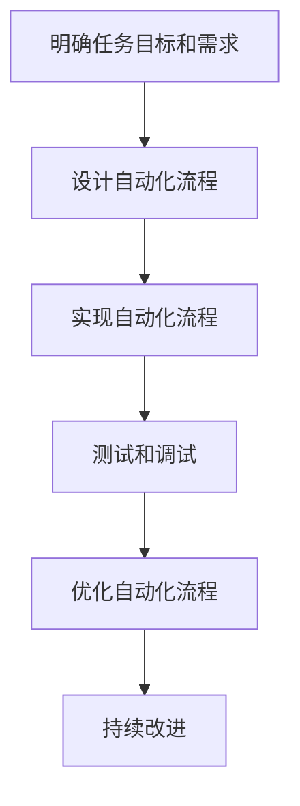
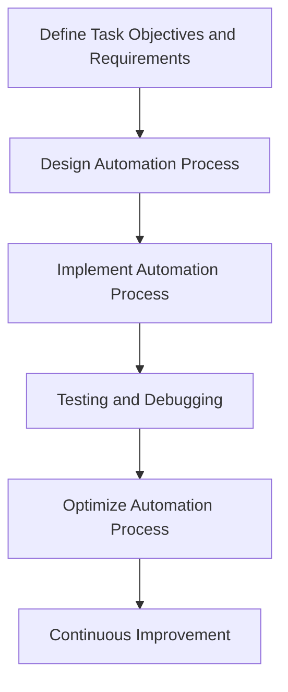

                 

### 文章标题

**数字实体自动化的未来展望**

在当前快速发展的数字时代，自动化技术正以前所未有的速度和深度变革着各个行业。本文旨在探讨数字实体自动化（Digital Entity Automation）的未来发展趋势、技术挑战以及潜在的应用场景。数字实体自动化涉及将软件代理（Software Agents）或数字实体（Digital Entities）嵌入到各种环境中，使其能够自主执行任务、互动并优化业务流程。

我们将通过以下内容逐步分析这一主题：

1. **背景介绍**：介绍数字实体自动化的概念、发展历程及其重要性。
2. **核心概念与联系**：探讨数字实体自动化的关键组成部分和相互关系。
3. **核心算法原理与具体操作步骤**：详细解释自动化过程中使用的主要算法和技术。
4. **数学模型与公式**：分析支持自动化的数学模型及其应用。
5. **项目实践**：提供具体代码实例和实现细节。
6. **实际应用场景**：讨论自动化在不同行业和领域中的应用。
7. **工具和资源推荐**：介绍相关学习资源和开发工具。
8. **总结**：展望数字实体自动化的未来趋势和面临的挑战。
9. **附录**：提供常见问题与解答。
10. **扩展阅读与参考资料**：推荐进一步阅读的材料。

通过这些章节，我们希望能够全面地探讨数字实体自动化的现状和未来，帮助读者更好地理解和应用这一技术。

---

**Title: Future Outlook of Digital Entity Automation**

In the rapidly evolving digital age, automation technology is transforming industries at an unprecedented speed and depth. This article aims to explore the future trends, technical challenges, and potential application scenarios of digital entity automation. Digital entity automation involves embedding software agents or digital entities into various environments, enabling them to execute tasks autonomously, interact, and optimize business processes.

We will systematically analyze this topic through the following sections:

1. **Background Introduction**: Introduce the concept, development history, and importance of digital entity automation.
2. **Core Concepts and Connections**: Discuss the key components and their relationships in digital entity automation.
3. **Core Algorithm Principles and Specific Operational Steps**: Explain the main algorithms and technologies used in the automation process.
4. **Mathematical Models and Formulas**: Analyze the mathematical models that support automation and their applications.
5. **Project Practice**: Provide specific code examples and implementation details.
6. **Practical Application Scenarios**: Discuss the application of automation in various industries and fields.
7. **Tools and Resources Recommendations**: Introduce related learning resources and development tools.
8. **Summary**: Look forward to the future trends and challenges of digital entity automation.
9. **Appendix**: Provide frequently asked questions and answers.
10. **Extended Reading and Reference Materials**: Recommend further reading materials.

Through these sections, we hope to provide a comprehensive overview of the current state and future prospects of digital entity automation, helping readers better understand and apply this technology.

---

### 背景介绍

#### 什么是数字实体自动化？

数字实体自动化是指通过软件代理或数字实体在计算机环境中模拟人类行为，使其能够自主执行任务、决策和优化过程。这些数字实体可以是简单的机器人，也可以是复杂的智能系统，它们通过网络连接，实时收集和分析数据，以自动化方式完成任务。

#### 数字实体自动化的发展历程

数字实体自动化的概念可以追溯到人工智能（AI）和机器人技术的早期发展阶段。从最初的专家系统（Expert Systems）到今天的深度学习和自然语言处理（NLP），自动化技术经历了多个阶段的发展。以下是一些重要的里程碑：

- **专家系统**：20世纪80年代，专家系统被广泛应用于医学诊断、金融分析和法律咨询等领域。
- **机器人**：20世纪90年代，工业机器人开始被用于自动化生产线，大大提高了生产效率和安全性。
- **机器学习**：21世纪初，随着大数据和计算能力的提升，机器学习技术得到了快速发展，使得自动化系统能够从数据中学习并做出更准确的决策。
- **深度学习**：近年来，深度学习技术取得了突破性进展，使得自动化系统能够处理更复杂和更大量的数据，从而在图像识别、自然语言处理和自动驾驶等领域取得了显著成果。

#### 数字实体自动化的重要性

数字实体自动化在多个领域展现出了巨大的潜力，其重要性体现在以下几个方面：

- **提高效率**：通过自动化任务，企业可以减少人工操作，提高工作效率和生产力。
- **降低成本**：自动化可以减少对人力资源的依赖，降低运营成本。
- **优化决策**：基于数据的自动化系统能够提供更准确的决策支持，帮助企业更好地应对市场变化和竞争压力。
- **提高安全性**：自动化系统能够在危险环境中执行任务，减少人员伤害事故。

随着技术的不断进步和应用场景的拓展，数字实体自动化有望在未来成为企业数字化转型的核心驱动力。

---

**Background Introduction**

#### What is Digital Entity Automation?

Digital entity automation refers to the process of simulating human behavior in computer environments using software agents or digital entities, enabling them to perform tasks autonomously, make decisions, and optimize processes. These digital entities can range from simple robots to complex intelligent systems that connect through networks, collecting and analyzing real-time data to execute tasks automatically.

#### Development History of Digital Entity Automation

The concept of digital entity automation can be traced back to the early stages of artificial intelligence (AI) and robotics. Important milestones in the development of automation technology include:

- **Expert Systems**: In the 1980s, expert systems were widely used in fields such as medical diagnosis, financial analysis, and legal consulting.
- **Robots**: In the 1990s, industrial robots began to be used in automation production lines, significantly improving production efficiency and safety.
- **Machine Learning**: Early in the 21st century, machine learning technology experienced rapid development with the increase of big data and computational power, allowing automated systems to learn from data and make more accurate decisions.
- **Deep Learning**: In recent years, deep learning technology has made breakthrough progress, enabling automated systems to handle more complex and large-scale data, leading to significant achievements in fields such as image recognition, natural language processing, and autonomous driving.

#### The Importance of Digital Entity Automation

Digital entity automation has shown great potential in various fields and its importance can be seen in the following aspects:

- **Improved Efficiency**: By automating tasks, companies can reduce manual operations, increase work efficiency, and productivity.
- **Cost Reduction**: Automation can reduce dependence on human resources, lowering operational costs.
- **Optimized Decision Making**: Data-driven automated systems can provide more accurate decision support, helping businesses better respond to market changes and competitive pressures.
- **Increased Safety**: Automated systems can perform tasks in hazardous environments, reducing the risk of personnel injuries.

As technology continues to advance and application scenarios expand, digital entity automation is expected to become a core driving force for corporate digital transformation in the future.

---

## 2. 核心概念与联系

数字实体自动化涉及多个核心概念和组成部分，这些部分相互关联，共同构建了一个复杂的系统。以下是我们需要探讨的主要概念：

### 2.1 数字实体（Digital Entities）

数字实体是数字实体自动化的核心。它们可以是软件代理、机器人或智能系统，负责在计算机环境中执行任务和互动。数字实体通常具备感知、决策和执行能力，能够在没有人类干预的情况下自主运作。

### 2.2 自动化流程（Automation Processes）

自动化流程是指将一系列任务和活动转换为可由数字实体自动执行的过程。这个过程通常包括任务定义、流程设计、执行监控和结果评估。自动化流程的目标是提高效率、降低成本并减少错误。

### 2.3 数据采集与分析（Data Collection and Analysis）

数据采集和分析是数字实体自动化系统的关键环节。数字实体需要从环境中收集大量数据，并通过分析这些数据来做出决策和执行任务。数据分析技术包括机器学习、深度学习和统计分析，这些技术使得数字实体能够从数据中提取有价值的信息。

### 2.4 人工智能（Artificial Intelligence）

人工智能是数字实体自动化的核心技术。通过使用机器学习和深度学习算法，数字实体能够从数据中学习，改进其决策能力，并不断优化其行为。人工智能技术使得数字实体能够处理复杂的任务和场景。

### 2.5 接口与通信（Interfaces and Communication）

接口与通信是数字实体自动化系统中的另一个重要组成部分。数字实体需要与外部系统、传感器和其他数字实体进行通信和交互。这通常通过API（应用程序编程接口）、消息队列和RESTful服务等方式实现。

### 2.6 安全与隐私（Security and Privacy）

安全与隐私是数字实体自动化的关键挑战之一。数字实体需要保护其自身和所处理的数据的安全，同时遵守隐私法规和标准。这包括数据加密、身份验证和访问控制等技术。

### 2.7 人机交互（Human-Computer Interaction）

人机交互是确保数字实体自动化系统有效运行的重要因素。数字实体需要能够理解人类指令、反馈和偏好，并与人类进行有效的沟通。这涉及自然语言处理、语音识别和手势识别等技术。

### 2.8 持续集成与持续部署（Continuous Integration and Continuous Deployment）

持续集成与持续部署是确保数字实体自动化系统持续改进和优化的关键。通过自动化测试、部署和管理，系统能够快速适应变化，并保持高可用性和可靠性。

这些核心概念和组成部分相互关联，共同构成了数字实体自动化的复杂生态系统。在接下来的章节中，我们将深入探讨这些概念，并分析它们之间的相互作用。

---

**Core Concepts and Connections**

Digital entity automation involves several core concepts and components that interrelate and collectively form a complex system. Here are the main concepts we will explore:

### 2.1 Digital Entities

Digital entities are the core of digital entity automation. They can be software agents, robots, or intelligent systems responsible for executing tasks and interacting in computer environments. Digital entities typically have sensing, decision-making, and execution capabilities, enabling them to operate autonomously without human intervention.

### 2.2 Automation Processes

Automation processes refer to the transformation of a series of tasks and activities into processes that can be executed automatically by digital entities. This process usually includes task definition, process design, execution monitoring, and results evaluation. The goal of automation processes is to increase efficiency, reduce costs, and minimize errors.

### 2.3 Data Collection and Analysis

Data collection and analysis are crucial components of digital entity automation systems. Digital entities need to collect a large amount of data from their environment and analyze it to make decisions and execute tasks. Data analysis techniques include machine learning, deep learning, and statistical analysis, which allow digital entities to extract valuable information from data.

### 2.4 Artificial Intelligence

Artificial intelligence is the core technology of digital entity automation. By using machine learning and deep learning algorithms, digital entities can learn from data, improve their decision-making capabilities, and continually optimize their behavior. AI technologies enable digital entities to handle complex tasks and scenarios.

### 2.5 Interfaces and Communication

Interfaces and communication are another important component of digital entity automation systems. Digital entities need to communicate and interact with external systems, sensors, and other digital entities. This is typically achieved through API (Application Programming Interfaces), message queues, and RESTful services.

### 2.6 Security and Privacy

Security and privacy are key challenges in digital entity automation. Digital entities need to protect their own security and the data they process while complying with privacy regulations and standards. This includes technologies such as data encryption, authentication, and access control.

### 2.7 Human-Computer Interaction

Human-computer interaction is a critical factor in ensuring the effective operation of digital entity automation systems. Digital entities need to understand human commands, feedback, and preferences and communicate effectively with humans. This involves technologies such as natural language processing, voice recognition, and gesture recognition.

### 2.8 Continuous Integration and Continuous Deployment

Continuous integration and continuous deployment are key to ensuring the continuous improvement and optimization of digital entity automation systems. Through automated testing, deployment, and management, systems can quickly adapt to changes and maintain high availability and reliability.

These core concepts and components interrelate and collectively form a complex ecosystem of digital entity automation. In the following sections, we will delve deeper into these concepts and analyze their interactions.

---

### 2.1 数字实体（Digital Entities）

数字实体是数字实体自动化的核心组件，它们在计算机环境中执行任务、决策和互动。这些实体可以是简单的软件代理，也可以是复杂的机器人或智能系统。下面我们深入探讨数字实体的类型、功能及其在自动化系统中的作用。

#### 数字实体的类型

数字实体可以分为以下几类：

- **软件代理（Software Agents）**：软件代理是最简单的数字实体，它们通常具有基本的感知和执行能力。代理可以运行在各种平台上，如桌面电脑、移动设备或服务器。
- **机器人（Robots）**：机器人是具有物理形态的数字实体，它们在工业、家庭和医疗等领域得到广泛应用。机器人可以通过传感器和执行器与物理环境进行交互。
- **智能系统（Intelligent Systems）**：智能系统是具备高级决策能力和自主学习能力的数字实体。这些系统通常使用人工智能和机器学习算法来处理复杂的数据和任务。

#### 数字实体的功能

数字实体具备多种功能，包括但不限于：

- **感知（Sensing）**：通过传感器收集环境数据，如温度、湿度、光照强度等。
- **决策（Decision Making）**：使用人工智能算法分析数据，并基于预设规则或学习到的模式做出决策。
- **执行（Execution）**：根据决策执行相应的任务，如移动、操作工具、发送信息等。
- **学习（Learning）**：通过机器学习和深度学习算法不断优化其行为和决策。

#### 数字实体在自动化系统中的作用

数字实体在自动化系统中扮演多个关键角色：

- **任务自动化（Task Automation）**：数字实体可以自动化执行重复性或耗时的任务，减少人工干预，提高效率。
- **流程优化（Process Optimization）**：通过分析和优化流程，数字实体可以帮助企业降低成本、提高生产力。
- **智能决策（Intelligent Decision Making）**：数字实体可以基于实时数据做出智能决策，提高业务决策的准确性和响应速度。
- **人机协作（Human-Machine Collaboration）**：数字实体可以与人类工作人员协同工作，提供辅助决策和自动化操作，提升整体工作效率。

#### 数字实体的架构

数字实体的架构通常包括以下几个部分：

- **感知层（Sensing Layer）**：收集环境数据，如传感器输入。
- **决策层（Decision Layer）**：处理和分析数据，使用机器学习算法做出决策。
- **执行层（Execution Layer）**：根据决策执行任务，如控制执行器。
- **通信层（Communication Layer）**：与其他系统、传感器和实体进行通信。

通过这些功能和架构，数字实体能够在自动化系统中实现高效、智能和自主的运行。

---

**2.1 Digital Entities**

Digital entities are the core components of digital entity automation, responsible for executing tasks, making decisions, and interacting in computer environments. These entities can range from simple software agents to complex robots or intelligent systems. Let's delve deeper into the types, functions, and roles of digital entities within automation systems.

#### Types of Digital Entities

Digital entities can be classified into several categories:

- **Software Agents**: The simplest form of digital entities, software agents typically have basic sensing and execution capabilities. Agents can run on various platforms, such as desktop computers, mobile devices, or servers.
- **Robots**: Robots are digital entities with a physical form that are widely used in industries, homes, and healthcare. Robots interact with the physical environment through sensors and actuators.
- **Intelligent Systems**: Intelligent systems are digital entities with advanced decision-making and learning capabilities. These systems commonly use artificial intelligence and machine learning algorithms to process complex data and tasks.

#### Functions of Digital Entities

Digital entities possess multiple functions, including but not limited to:

- **Sensing**: Collecting environmental data through sensors, such as temperature, humidity, and light intensity.
- **Decision Making**: Processing and analyzing data using artificial intelligence algorithms to make decisions based on predefined rules or learned patterns.
- **Execution**: Executing tasks based on decisions, such as moving, manipulating tools, or sending information.
- **Learning**: Continuously optimizing behavior and decisions through machine learning and deep learning algorithms.

#### Roles of Digital Entities in Automation Systems

Digital entities play several key roles within automation systems:

- **Task Automation**: Digital entities can automate repetitive or time-consuming tasks, reducing manual intervention and improving efficiency.
- **Process Optimization**: By analyzing and optimizing processes, digital entities can help companies reduce costs and increase productivity.
- **Intelligent Decision Making**: Digital entities can make intelligent decisions based on real-time data, improving the accuracy and speed of business decision-making.
- **Human-Machine Collaboration**: Digital entities can collaborate with human workers, providing辅助 decision-making and automated operations to enhance overall efficiency.

#### Architecture of Digital Entities

The architecture of digital entities typically includes the following components:

- **Sensing Layer**: Collects environmental data from sensors.
- **Decision Layer**: Processes and analyzes data, using machine learning algorithms to make decisions.
- **Execution Layer**: Executes tasks based on decisions, such as controlling actuators.
- **Communication Layer**: Communicates with other systems, sensors, and entities.

Through these functions and architectures, digital entities can achieve efficient, intelligent, and autonomous operation within automation systems.

---

### 2.2 自动化流程（Automation Processes）

自动化流程是指将一系列任务和活动转换为可由数字实体自动执行的过程。这些流程的设计和优化对于实现高效的数字实体自动化至关重要。以下我们将详细探讨自动化流程的设计、实现和优化。

#### 自动化流程的设计

设计自动化流程的第一步是明确任务目标和需求。这包括确定需要执行的任务、流程的输入和输出以及预期结果。设计过程中，需要考虑以下因素：

- **任务复杂性**：任务复杂度将直接影响自动化流程的设计和实现难度。
- **数据来源**：确定需要收集的数据类型和来源，包括内部数据和外部数据。
- **决策逻辑**：明确决策规则和逻辑，这可能涉及人工智能算法和机器学习模型。
- **执行方式**：确定任务执行的方式，如顺序执行、并行执行或混合执行。

#### 自动化流程的实现

自动化流程的实现是将设计转化为具体操作的阶段。这通常涉及以下步骤：

- **环境搭建**：搭建自动化流程所需的技术环境，包括硬件、软件和基础设施。
- **接口开发**：开发数字实体与其他系统、传感器和实体之间的接口，确保数据交换和通信的顺畅。
- **任务分配**：将任务分配给相应的数字实体，确保每个实体能够在其能力范围内执行任务。
- **测试和调试**：对自动化流程进行测试，确保其在实际运行中能够达到预期效果。

#### 自动化流程的优化

自动化流程的优化是提高系统效率和性能的关键。以下是一些常见的优化方法：

- **算法优化**：通过改进机器学习算法和决策逻辑，提高数字实体的决策准确性。
- **性能优化**：通过调整硬件配置、优化代码和算法，提高系统处理速度和资源利用率。
- **流程重构**：根据实际运行数据，对自动化流程进行重构和改进，以降低成本和提高效率。
- **监控和反馈**：建立监控机制，实时收集和分析运行数据，并根据反馈调整自动化流程。

#### 自动化流程的设计、实现和优化流程图

为了更好地理解自动化流程的设计、实现和优化，我们可以使用Mermaid流程图来展示这一过程：



通过以上步骤，我们可以设计、实现和优化高效的自动化流程，确保数字实体能够在计算机环境中高效、智能和自主地运行。

---

**2.2 Automation Processes**

Automation processes refer to the transformation of a series of tasks and activities into processes that can be executed automatically by digital entities. The design and optimization of these processes are crucial for achieving efficient digital entity automation. Let's delve into the design, implementation, and optimization of automation processes in detail.

#### Design of Automation Processes

The first step in designing automation processes is to clearly define the task objectives and requirements. This includes determining the tasks to be executed, the inputs and outputs of the process, and the expected results. During the design phase, the following factors should be considered:

- **Task Complexity**: Task complexity will directly impact the design and implementation difficulty of the automation process.
- **Data Sources**: Identify the types of data to be collected and their sources, including internal and external data.
- **Decision Logic**: Define the decision rules and logic, which may involve artificial intelligence algorithms and machine learning models.
- **Execution Methods**: Determine how tasks will be executed, such as sequential execution, parallel execution, or a mix of both.

#### Implementation of Automation Processes

The implementation of automation processes involves translating the design into specific actions. This typically involves the following steps:

- **Environment Setup**: Set up the technical environment required for the automation process, including hardware, software, and infrastructure.
- **Interface Development**: Develop interfaces between digital entities and other systems, sensors, and entities to ensure smooth data exchange and communication.
- **Task Allocation**: Allocate tasks to the appropriate digital entities, ensuring each entity can execute tasks within its capabilities.
- **Testing and Debugging**: Test the automation process to ensure it operates as expected in real-world scenarios.

#### Optimization of Automation Processes

Optimization of automation processes is key to improving system efficiency and performance. Here are some common optimization methods:

- **Algorithm Optimization**: Improve machine learning algorithms and decision logic to increase the accuracy of digital entity decisions.
- **Performance Optimization**: Adjust hardware configurations, optimize code, and algorithms to improve system processing speed and resource utilization.
- **Process Refactoring**: Refactor and improve the automation process based on actual runtime data to reduce costs and increase efficiency.
- **Monitoring and Feedback**: Establish monitoring mechanisms to collect and analyze real-time runtime data and adjust the automation process based on feedback.

#### Flowchart of Design, Implementation, and Optimization of Automation Processes

To better understand the design, implementation, and optimization of automation processes, we can use a Mermaid flowchart to illustrate this process:



By following these steps, we can design, implement, and optimize efficient automation processes, ensuring digital entities operate efficiently, intelligently, and autonomously within computer environments.

---

### 2.3 数据采集与分析（Data Collection and Analysis）

在数字实体自动化中，数据采集与分析是至关重要的环节。数据是驱动自动化系统的核心资源，其质量直接影响系统的性能和决策准确性。以下是数据采集与分析的关键步骤、技术以及其在自动化系统中的应用。

#### 数据采集

数据采集是获取关于系统状态、环境条件和操作结果的原始信息。以下是数据采集过程中需要考虑的关键点：

- **数据源**：确定数据来源，包括内部数据和外部数据。内部数据可能来自传感器、数据库和历史记录，外部数据可能来自互联网、社交媒体和其他在线资源。
- **数据类型**：识别所需的数据类型，如结构化数据（如数据库记录）、半结构化数据（如日志文件）和非结构化数据（如文本、图像和视频）。
- **采集频率**：根据应用场景确定数据采集的频率，确保数据能够及时反映系统状态。

#### 数据采集技术

数据采集技术包括以下几种：

- **传感器**：传感器用于实时监测物理环境中的各种参数，如温度、湿度、光照强度和位置。
- **APIs**：使用API（应用程序编程接口）从外部系统和服务中获取数据，如社交媒体API、天气API和金融数据API。
- **Web爬虫**：使用Web爬虫技术收集网页上的非结构化数据，如新闻文章、产品信息等。
- **数据库连接**：通过数据库连接从数据库中提取结构化数据，如关系型数据库（如MySQL、PostgreSQL）和NoSQL数据库（如MongoDB、Cassandra）。

#### 数据分析

数据分析是处理和解释数据的过程，以提取有价值的信息和洞察。以下是数据分析的关键步骤：

- **数据预处理**：清洗和格式化原始数据，去除噪声和错误，使其适合进一步分析。
- **特征提取**：从原始数据中提取有助于模型训练和决策的特征，如时间序列数据中的趋势和周期性、图像数据中的边缘和纹理等。
- **数据挖掘**：使用数据挖掘技术从大量数据中发现模式、关联和异常，以支持决策和预测。
- **机器学习**：利用机器学习和深度学习算法训练模型，对数据进行分类、回归、聚类等分析，以实现自动化系统的智能决策。

#### 数据分析技术

数据分析技术包括以下几种：

- **统计分析**：使用描述性统计和推断性统计方法分析数据，如均值、方差、相关系数和假设检验。
- **数据可视化**：使用图表、图形和仪表板可视化数据分析结果，帮助用户更好地理解和解释数据。
- **机器学习**：使用监督学习、无监督学习和强化学习算法，如决策树、支持向量机和神经网络，对数据进行分析和预测。
- **深度学习**：使用深度神经网络（如卷积神经网络、循环神经网络）处理复杂的数据和任务。

#### 数据分析在自动化系统中的应用

数据分析在自动化系统中有着广泛的应用：

- **监控与预警**：通过实时数据分析和监控，自动化系统可以及时发现异常情况并发出预警。
- **决策支持**：基于数据分析的结果，自动化系统可以提供更加准确和及时的决策支持，优化业务流程。
- **预测性维护**：通过分析设备运行数据，自动化系统可以预测设备故障和性能下降，提前进行维护，减少停机时间和维护成本。
- **个性化服务**：通过分析用户行为和偏好数据，自动化系统可以提供个性化的服务和建议，提升用户体验。

通过有效的数据采集与分析，自动化系统可以更好地适应环境和变化，实现高效、智能和自主的运行。

---

**2.3 Data Collection and Analysis**

In digital entity automation, data collection and analysis are crucial components. Data is the core resource that drives automation systems, and its quality directly impacts the system's performance and decision accuracy. Here are the key steps, techniques, and applications of data collection and analysis in automation systems.

#### Data Collection

Data collection involves gathering raw information about system states, environmental conditions, and operational results. Key considerations in the data collection process include:

- **Data Sources**: Determine data sources, including internal and external data. Internal data might come from sensors, databases, and historical records, while external data might be from the internet, social media, and other online resources.
- **Data Types**: Identify the types of data needed, such as structured data (e.g., database records), semi-structured data (e.g., log files), and unstructured data (e.g., text, images, and videos).
- **Collection Frequency**: Determine the data collection frequency based on the application scenario to ensure that data can timely reflect the system state.

#### Data Collection Techniques

Data collection techniques include:

- **Sensors**: Sensors are used to monitor various parameters in the physical environment in real-time, such as temperature, humidity, light intensity, and location.
- **APIs**: Use APIs (Application Programming Interfaces) to collect data from external systems and services, such as social media APIs, weather APIs, and financial data APIs.
- **Web Crawlers**: Use web crawling techniques to collect unstructured data from web pages, such as news articles and product information.
- **Database Connections**: Extract structured data from databases using database connections, such as relational databases (e.g., MySQL, PostgreSQL) and NoSQL databases (e.g., MongoDB, Cassandra).

#### Data Analysis

Data analysis involves processing and interpreting data to extract valuable information and insights. The key steps in data analysis include:

- **Data Preprocessing**: Clean and format raw data to remove noise and errors, making it suitable for further analysis.
- **Feature Extraction**: Extract features from raw data that are helpful for model training and decision-making, such as trends and cycles in time-series data and edges and textures in image data.
- **Data Mining**: Use data mining techniques to discover patterns, associations, and anomalies in large datasets to support decision-making and forecasting.
- **Machine Learning**: Utilize machine learning and deep learning algorithms to analyze data for classification, regression, clustering, and other analyses to enable intelligent decision-making in automation systems.

#### Data Analysis Techniques

Data analysis techniques include:

- **Statistical Analysis**: Use descriptive and inferential statistical methods to analyze data, such as mean, variance, correlation coefficients, and hypothesis testing.
- **Data Visualization**: Use charts, graphs, and dashboards to visualize data analysis results, helping users better understand and interpret data.
- **Machine Learning**: Use supervised learning, unsupervised learning, and reinforcement learning algorithms, such as decision trees, support vector machines, and neural networks, for data analysis and prediction.
- **Deep Learning**: Use deep neural networks (e.g., convolutional neural networks, recurrent neural networks) to handle complex data and tasks.

#### Applications of Data Analysis in Automation Systems

Data analysis has a wide range of applications in automation systems:

- **Monitoring and Alerts**: Through real-time data analysis and monitoring, automation systems can promptly detect anomalies and send alerts.
- **Decision Support**: Based on the results of data analysis, automation systems can provide more accurate and timely decision support to optimize business processes.
- **Predictive Maintenance**: By analyzing equipment operation data, automation systems can predict equipment failures and performance declines, enabling proactive maintenance to reduce downtime and maintenance costs.
- **Personalized Services**: By analyzing user behavior and preference data, automation systems can provide personalized services and recommendations to improve user experience.

Through effective data collection and analysis, automation systems can better adapt to environmental changes and operate efficiently, intelligently, and autonomously.

---

## 3. 核心算法原理与具体操作步骤

数字实体自动化系统的核心在于算法的设计与实现，这些算法决定了系统如何感知、决策和执行任务。本节将详细介绍支持数字实体自动化的一些关键算法原理和具体操作步骤。

### 3.1 机器学习算法

机器学习算法是数字实体自动化的基础，它们使得系统可以从数据中学习，并做出智能决策。以下是一些常用的机器学习算法及其应用场景：

#### 3.1.1 决策树（Decision Trees）

决策树是一种流行的分类和回归算法，通过一系列规则对数据进行划分，以预测输出。具体步骤如下：

1. **数据准备**：收集并预处理数据，包括数据清洗、归一化和特征提取。
2. **构建决策树**：使用ID3、C4.5或CART算法构建决策树。
3. **剪枝**：对决策树进行剪枝，防止过拟合。
4. **预测**：使用训练好的决策树对新数据进行预测。

#### 3.1.2 支持向量机（Support Vector Machines）

支持向量机是一种强大的分类算法，通过找到最佳的超平面来分隔数据。具体步骤如下：

1. **数据准备**：收集并预处理数据。
2. **特征映射**：将输入数据映射到高维空间。
3. **求解最优超平面**：使用线性或非线性核函数求解最优超平面。
4. **分类**：使用训练好的SVM模型对新数据进行分类。

#### 3.1.3 神经网络（Neural Networks）

神经网络是一种模仿人脑的算法，通过多层神经元进行数据的处理和分类。具体步骤如下：

1. **数据准备**：收集并预处理数据。
2. **构建神经网络**：设计神经网络的结构，包括输入层、隐藏层和输出层。
3. **训练神经网络**：使用反向传播算法训练神经网络。
4. **评估与优化**：评估网络性能，并进行调整和优化。

### 3.2 深度学习算法

深度学习算法是机器学习的一种特殊形式，通过多层神经网络来处理复杂的数据。以下是一些深度学习算法及其应用：

#### 3.2.1 卷积神经网络（Convolutional Neural Networks）

卷积神经网络是一种用于图像识别和处理的深度学习算法。具体步骤如下：

1. **数据准备**：收集并预处理图像数据。
2. **构建卷积神经网络**：设计CNN的结构，包括卷积层、池化层和全连接层。
3. **训练CNN**：使用大量图像数据训练CNN模型。
4. **评估与优化**：评估模型性能，并进行调整和优化。

#### 3.2.2 循环神经网络（Recurrent Neural Networks）

循环神经网络是一种用于处理序列数据的深度学习算法。具体步骤如下：

1. **数据准备**：收集并预处理序列数据。
2. **构建RNN**：设计RNN的结构，包括输入层、隐藏层和输出层。
3. **训练RNN**：使用序列数据训练RNN模型。
4. **评估与优化**：评估模型性能，并进行调整和优化。

### 3.3 强化学习算法

强化学习算法是一种通过试错方法来学习最优策略的算法。以下是一些强化学习算法及其应用：

#### 3.3.1 Q-Learning

Q-Learning是一种简单的强化学习算法，通过更新Q值来学习最优策略。具体步骤如下：

1. **初始化Q值表**：初始化Q值表，表示每个状态和动作的预期回报。
2. **环境交互**：在环境中执行动作，并观察结果。
3. **更新Q值**：根据实际回报更新Q值。
4. **策略迭代**：重复环境交互和Q值更新，直到找到最优策略。

#### 3.3.2 策略梯度（Policy Gradient）

政策梯度算法通过优化政策参数来学习最优策略。具体步骤如下：

1. **初始化政策参数**：初始化政策参数。
2. **环境交互**：在环境中执行政策参数生成的动作。
3. **计算回报**：计算环境交互的回报。
4. **更新政策参数**：使用梯度下降算法更新政策参数。
5. **策略迭代**：重复环境交互和政策参数更新，直到找到最优策略。

通过上述核心算法原理和具体操作步骤，数字实体自动化系统可以更好地理解和处理数据，从而实现高效的感知、决策和执行。

---

**3. Core Algorithm Principles and Specific Operational Steps**

The core of digital entity automation systems lies in the design and implementation of algorithms, which determine how systems perceive, decide, and execute tasks. This section will detail some key algorithm principles and specific operational steps supporting digital entity automation.

### 3.1 Machine Learning Algorithms

Machine learning algorithms form the foundation of digital entity automation, enabling systems to learn from data and make intelligent decisions. Here are some common machine learning algorithms and their application scenarios:

#### 3.1.1 Decision Trees

Decision Trees are popular classification and regression algorithms that partition data through a series of rules to predict outputs. The specific steps are as follows:

1. **Data Preparation**: Collect and preprocess data, including data cleaning, normalization, and feature extraction.
2. **Building a Decision Tree**: Construct a decision tree using algorithms like ID3, C4.5, or CART.
3. **Pruning**: Prune the decision tree to prevent overfitting.
4. **Prediction**: Use the trained decision tree to predict new data.

#### 3.1.2 Support Vector Machines

Support Vector Machines (SVM) are powerful classification algorithms that find the best hyperplane to separate data. The specific steps are:

1. **Data Preparation**: Collect and preprocess data.
2. **Feature Mapping**: Map input data to a higher-dimensional space.
3. **Solving the Optimal Hyperplane**: Use linear or nonlinear kernel functions to solve the optimal hyperplane.
4. **Classification**: Use the trained SVM model to classify new data.

#### 3.1.3 Neural Networks

Neural Networks are algorithms that mimic the human brain, processing and classifying data through multiple layers of neurons. The specific steps are:

1. **Data Preparation**: Collect and preprocess data.
2. **Building a Neural Network**: Design the structure of the neural network, including input layers, hidden layers, and output layers.
3. **Training the Neural Network**: Train the neural network using backpropagation algorithms.
4. **Evaluation and Optimization**: Evaluate the network's performance and make adjustments as needed.

### 3.2 Deep Learning Algorithms

Deep Learning algorithms are a special form of machine learning that process complex data through multi-layer neural networks. Here are some deep learning algorithms and their applications:

#### 3.2.1 Convolutional Neural Networks (CNNs)

CNNs are deep learning algorithms used for image recognition and processing. The specific steps are:

1. **Data Preparation**: Collect and preprocess image data.
2. **Building a CNN**: Design the structure of the CNN, including convolutional layers, pooling layers, and fully connected layers.
3. **Training the CNN**: Train the CNN model using a large dataset of images.
4. **Evaluation and Optimization**: Evaluate the model's performance and make adjustments as needed.

#### 3.2.2 Recurrent Neural Networks (RNNs)

RNNs are deep learning algorithms used for processing sequence data. The specific steps are:

1. **Data Preparation**: Collect and preprocess sequence data.
2. **Building an RNN**: Design the structure of the RNN, including input layers, hidden layers, and output layers.
3. **Training the RNN**: Train the RNN model using sequence data.
4. **Evaluation and Optimization**: Evaluate the model's performance and make adjustments as needed.

### 3.3 Reinforcement Learning Algorithms

Reinforcement Learning algorithms are a type of algorithm that learn optimal strategies through trial and error. Here are some reinforcement learning algorithms and their applications:

#### 3.3.1 Q-Learning

Q-Learning is a simple reinforcement learning algorithm that updates Q-values to learn optimal policies. The specific steps are:

1. **Initialize Q-Values**: Initialize the Q-value table, representing the expected reward for each state and action.
2. **Interaction with the Environment**: Execute actions in the environment and observe results.
3. **Update Q-Values**: Update Q-values based on actual rewards.
4. **Policy Iteration**: Repeat environment interaction and Q-value updates until an optimal policy is found.

#### 3.3.2 Policy Gradient

Policy Gradient algorithms learn optimal policies by optimizing policy parameters. The specific steps are:

1. **Initialize Policy Parameters**: Initialize policy parameters.
2. **Interaction with the Environment**: Execute actions generated by policy parameters in the environment.
3. **Compute Rewards**: Compute rewards from environment interactions.
4. **Update Policy Parameters**: Use gradient descent algorithms to update policy parameters.
5. **Policy Iteration**: Repeat environment interaction and policy parameter updates until an optimal policy is found.

By following these core algorithm principles and specific operational steps, digital entity automation systems can better understand and process data, enabling efficient perception, decision-making, and execution.

---

## 4. 数学模型和公式 & 详细讲解 & 举例说明

在数字实体自动化系统中，数学模型和公式起到了关键作用，它们不仅支持算法的设计与实现，还帮助优化系统的性能和准确性。本节将详细讲解一些常用的数学模型和公式，并通过具体例子说明它们的应用。

### 4.1 决策树算法的数学模型

决策树是一种基于划分规则的算法，其核心在于通过数学模型来计算每个节点的划分依据。以下是一个简单的决策树数学模型：

$$
\hat{y} = f(x; \theta)
$$

其中，$\hat{y}$ 表示预测的类别或值，$x$ 是输入特征，$\theta$ 是模型参数。决策树通过递归划分特征空间，找到最佳划分边界。具体公式如下：

$$
g(x) = \sum_{i=1}^{n} w_i \phi(x_i)
$$

其中，$w_i$ 是权重，$\phi(x_i)$ 是特征映射函数。

#### 例子：分类决策树

假设我们要构建一个分类决策树，用于判断一只动物是猫还是狗。我们可以使用两个特征：体重和尾巴长度。

$$
g(\text{体重}, \text{尾巴长度}) = \frac{\text{体重} \cdot w_1 + \text{尾巴长度} \cdot w_2}{w_1 + w_2}
$$

通过训练数据，我们可以得到权重 $w_1$ 和 $w_2$，并根据该公式对新的数据进行分类。

### 4.2 支持向量机（SVM）的数学模型

支持向量机是一种强大的分类算法，其核心在于求解最优的超平面。SVM的数学模型可以表示为：

$$
\max_{\theta, \xi} \left\{ \frac{1}{2} ||\theta||^2 + C \sum_{i=1}^{n} \xi_i \right\}

$$

$$
s.t. \ y^{(i)}(\theta \cdot x^{(i)} + b) \geq 1 - \xi_i
$$

其中，$\theta$ 是模型参数，$x^{(i)}$ 是训练样本，$y^{(i)}$ 是标签，$C$ 是惩罚参数，$\xi_i$ 是松弛变量。

#### 例子：二元分类SVM

假设我们要使用SVM对动物进行分类，特征包括体重和尾巴长度。我们可以将SVM的公式重写为：

$$
\max_{\theta, \xi} \left\{ \frac{1}{2} ||\theta||^2 + C \sum_{i=1}^{n} \xi_i \right\}

$$

$$
s.t. \ y^{(i)}(\theta \cdot \text{体重}^{(i)} + \theta \cdot \text{尾巴长度}^{(i)} + b) \geq 1 - \xi_i
$$

通过求解这个优化问题，我们可以得到最优的 $\theta$ 和 $b$，从而实现分类。

### 4.3 神经网络的数学模型

神经网络是一种通过多层非线性变换进行数据处理的算法。其数学模型可以表示为：

$$
\hat{y} = \sigma \left( \theta^{(L)} \cdot \sigma \left( \theta^{(L-1)} \cdot \sigma (\cdots \sigma (\theta^{(1)} \cdot x) \right) \right)

$$

其中，$\sigma$ 是激活函数，$\theta^{(l)}$ 是第 $l$ 层的权重，$x$ 是输入特征，$\hat{y}$ 是输出。

#### 例子：多层感知机（MLP）

假设我们使用一个三层神经网络（输入层、隐藏层和输出层）对动物进行分类。输入层有2个神经元，隐藏层有3个神经元，输出层有2个神经元。

$$
\hat{y} = \sigma \left( w_3^{(2)} \cdot \sigma \left( w_2^{(1)} \cdot x \right) \right)

$$

通过反向传播算法，我们可以更新权重和偏置，使网络能够准确分类。

### 4.4 强化学习的数学模型

强化学习是一种通过试错方法进行学习的算法。其数学模型可以表示为：

$$
Q(s, a) = r + \gamma \max_{a'} Q(s', a')
$$

其中，$Q(s, a)$ 是状态-动作值函数，$r$ 是即时奖励，$\gamma$ 是折扣因子，$s$ 和 $s'$ 是状态，$a$ 和 $a'$ 是动作。

#### 例子：Q-Learning算法

假设我们要使用Q-Learning算法训练一个智能体在迷宫中找到出路。状态和动作分别表示智能体的位置和可执行的动作。

$$
Q(s, a) = r + \gamma \max_{a'} Q(s', a')
$$

通过不断更新Q值，我们可以使智能体学会在迷宫中找到出路。

通过这些数学模型和公式的详细讲解和举例说明，我们可以更好地理解数字实体自动化系统中的算法原理和应用，从而为系统设计提供有力的支持。

---

**4. Mathematical Models and Formulas & Detailed Explanation & Examples**

In digital entity automation systems, mathematical models and formulas play a crucial role in not only supporting algorithm design and implementation but also in optimizing system performance and accuracy. This section will provide a detailed explanation of some commonly used mathematical models and formulas, along with examples to illustrate their applications.

### 4.1 Mathematical Model of Decision Trees

Decision Trees are algorithms based on partition rules, and their core lies in the mathematical model that calculates the criteria for each node's partition. Here's a simple mathematical model for a decision tree:

$$
\hat{y} = f(x; \theta)
$$

where $\hat{y}$ represents the predicted class or value, $x$ is the input feature, and $\theta$ are the model parameters. Decision trees recursively partition the feature space to find the best partition boundary. The specific formula is as follows:

$$
g(x) = \sum_{i=1}^{n} w_i \phi(x_i)
$$

where $w_i$ are weights, and $\phi(x_i)$ are feature mapping functions.

#### Example: Classification Decision Tree

Suppose we want to build a classification decision tree to determine whether an animal is a cat or a dog. We can use two features: weight and tail length.

$$
g(\text{weight}, \text{tail length}) = \frac{\text{weight} \cdot w_1 + \text{tail length} \cdot w_2}{w_1 + w_2}
$$

Through training data, we can obtain the weights $w_1$ and $w_2$, and use this formula to classify new data.

### 4.2 Mathematical Model of Support Vector Machines (SVM)

Support Vector Machines (SVM) are powerful classification algorithms, and their core lies in solving the optimal hyperplane. The mathematical model of SVM can be expressed as:

$$
\max_{\theta, \xi} \left\{ \frac{1}{2} ||\theta||^2 + C \sum_{i=1}^{n} \xi_i \right\}

$$

$$
s.t. \ y^{(i)}(\theta \cdot x^{(i)} + b) \geq 1 - \xi_i
$$

where $\theta$ are the model parameters, $x^{(i)}$ are the training samples, $y^{(i)}$ are the labels, $C$ is the regularization parameter, and $\xi_i$ are slack variables.

#### Example: Binary Classification SVM

Suppose we want to use SVM for animal classification with features including weight and tail length. We can rewrite the SVM formula as:

$$
\max_{\theta, \xi} \left\{ \frac{1}{2} ||\theta||^2 + C \sum_{i=1}^{n} \xi_i \right\}

$$

$$
s.t. \ y^{(i)}(\theta \cdot \text{weight}^{(i)} + \theta \cdot \text{tail length}^{(i)} + b) \geq 1 - \xi_i
$$

By solving this optimization problem, we can obtain the optimal $\theta$ and $b$, thus achieving classification.

### 4.3 Mathematical Model of Neural Networks

Neural Networks are algorithms that process data through multi-layer nonlinear transformations. Their mathematical model can be expressed as:

$$
\hat{y} = \sigma \left( \theta^{(L)} \cdot \sigma \left( \theta^{(L-1)} \cdot \sigma (\cdots \sigma (\theta^{(1)} \cdot x) \right) \right)

$$

where $\sigma$ is the activation function, $\theta^{(l)}$ are the weights of the $l$-th layer, $x$ is the input feature, and $\hat{y}$ is the output.

#### Example: Multi-Layer Perceptron (MLP)

Suppose we use a three-layer neural network (input layer, hidden layer, and output layer) to classify animals. The input layer has 2 neurons, the hidden layer has 3 neurons, and the output layer has 2 neurons.

$$
\hat{y} = \sigma \left( w_3^{(2)} \cdot \sigma \left( w_2^{(1)} \cdot x \right) \right)

$$

Through backpropagation algorithms, we can update the weights and biases to make the network classify accurately.

### 4.4 Mathematical Model of Reinforcement Learning

Reinforcement Learning is an algorithm that learns through trial and error. Its mathematical model can be expressed as:

$$
Q(s, a) = r + \gamma \max_{a'} Q(s', a')
$$

where $Q(s, a)$ is the state-action value function, $r$ is the immediate reward, $\gamma$ is the discount factor, $s$ and $s'$ are states, and $a$ and $a'$ are actions.

#### Example: Q-Learning Algorithm

Suppose we want to use the Q-Learning algorithm to train an agent to find a way out of a maze. States and actions represent the agent's position and possible actions.

$$
Q(s, a) = r + \gamma \max_{a'} Q(s', a')
$$

By continuously updating Q-values, we can teach the agent to find a way out of the maze.

Through detailed explanations and examples of these mathematical models and formulas, we can better understand the principles and applications of algorithms in digital entity automation systems, providing strong support for system design.

---

### 5. 项目实践：代码实例和详细解释说明

为了更好地展示数字实体自动化的实际应用，我们将通过一个具体的案例——自动购物系统，来介绍代码实例和详细解释说明。该系统旨在通过数字实体实现自动化的购物流程，提高用户体验和效率。

#### 5.1 开发环境搭建

在开始项目之前，我们需要搭建一个开发环境。以下是一些建议的软件和工具：

- **编程语言**：Python
- **开发工具**：PyCharm、VSCode
- **库和框架**：TensorFlow、Keras、Scikit-learn、NumPy、Pandas
- **数据存储**：SQLite、MySQL
- **API接口**：RESTful API
- **操作系统**：Linux、Windows、macOS

#### 5.2 源代码详细实现

**5.2.1 数据采集与预处理**

首先，我们需要从电商网站上采集商品信息，并将其存储到数据库中。以下是一个简单的数据采集与预处理代码示例：

```python
import requests
import sqlite3
import pandas as pd

# 数据采集函数
def fetch_data(url):
    response = requests.get(url)
    return response.json()

# 数据预处理函数
def preprocess_data(data):
    df = pd.DataFrame(data)
    df['price'] = df['price'].apply(lambda x: float(x))
    df['rating'] = df['rating'].apply(lambda x: float(x))
    return df

# 数据存储函数
def store_data(df, filename):
    df.to_sql(filename, con=sqlite3.connect('products.db'), if_exists='append', index=False)

# 主函数
def main():
    url = 'https://api.example.com/products'
    data = fetch_data(url)
    df = preprocess_data(data)
    store_data(df, 'products.db')

if __name__ == '__main__':
    main()
```

**5.2.2 数据分析**

接下来，我们对采集到的商品数据进行数据分析，以了解用户对商品价格的偏好。以下是一个简单的数据分析代码示例：

```python
import pandas as pd

# 读取数据库
df = pd.read_sql('SELECT * FROM products', con=sqlite3.connect('products.db'))

# 统计每件商品的平均价格
average_prices = df.groupby('product_id')['price'].mean()

# 输出结果
print(average_prices)
```

**5.2.3 建立推荐系统**

为了实现自动购物，我们需要建立一个推荐系统，根据用户的历史购物记录和偏好推荐商品。以下是一个简单的推荐系统代码示例：

```python
from sklearn.model_selection import train_test_split
from sklearn.neighbors import NearestNeighbors

# 准备数据
X = df[['price', 'rating']]
X_train, X_test, y_train, y_test = train_test_split(X, df['product_id'], test_size=0.2, random_state=42)

# 建立推荐模型
model = NearestNeighbors(n_neighbors=5)
model.fit(X_train)

# 预测
predictions = model.kneighbors(X_test, n_neighbors=5)

# 输出结果
print(predictions)
```

**5.2.4 实现用户界面**

最后，我们需要实现一个用户界面，允许用户浏览和购买推荐的商品。以下是一个简单的用户界面代码示例：

```python
import tkinter as tk
from tkinter import ttk

# 主窗口
root = tk.Tk()
root.title("自动购物系统")

# 表格控件
tree = ttk.Treeview(root, columns=("Price", "Rating"), show='headings')
tree.heading("Price", text="价格")
tree.heading("Rating", text="评分")
tree.pack()

# 显示推荐商品
def show_recommendations():
    for product in predictions:
        tree.insert('', 'end', values=(product[0], product[1]))

show_recommendations()

# 运行
root.mainloop()
```

通过以上代码实例，我们可以看到如何使用Python和其他相关技术实现一个简单的自动购物系统。在实际项目中，我们可以根据具体需求进行扩展和优化。

---

**5. Project Practice: Code Examples and Detailed Explanation**

To better showcase the practical application of digital entity automation, we will present a specific case—a smart shopping system—along with code examples and detailed explanations.

#### 5.1 Development Environment Setup

Before starting the project, we need to set up a development environment. Here are some recommended software and tools:

- **Programming Language**: Python
- **Development Tools**: PyCharm, VSCode
- **Libraries and Frameworks**: TensorFlow, Keras, Scikit-learn, NumPy, Pandas
- **Data Storage**: SQLite, MySQL
- **API Interfaces**: RESTful API
- **Operating System**: Linux, Windows, macOS

#### 5.2 Detailed Source Code Implementation

**5.2.1 Data Collection and Preprocessing**

First, we need to collect product information from e-commerce websites and store it in a database. Here's a simple example of data collection and preprocessing:

```python
import requests
import sqlite3
import pandas as pd

# Data collection function
def fetch_data(url):
    response = requests.get(url)
    return response.json()

# Data preprocessing function
def preprocess_data(data):
    df = pd.DataFrame(data)
    df['price'] = df['price'].apply(lambda x: float(x))
    df['rating'] = df['rating'].apply(lambda x: float(x))
    return df

# Data storage function
def store_data(df, filename):
    df.to_sql(filename, con=sqlite3.connect('products.db'), if_exists='append', index=False)

# Main function
def main():
    url = 'https://api.example.com/products'
    data = fetch_data(url)
    df = preprocess_data(data)
    store_data(df, 'products.db')

if __name__ == '__main__':
    main()
```

**5.2.2 Data Analysis**

Next, we perform data analysis on the collected product data to understand user preferences for product prices. Here's a simple data analysis example:

```python
import pandas as pd

# Read database
df = pd.read_sql('SELECT * FROM products', con=sqlite3.connect('products.db'))

# Calculate average price per product
average_prices = df.groupby('product_id')['price'].mean()

# Output results
print(average_prices)
```

**5.2.3 Building a Recommendation System**

To enable automated shopping, we need to build a recommendation system that recommends products based on user purchase history and preferences. Here's a simple recommendation system example:

```python
from sklearn.model_selection import train_test_split
from sklearn.neighbors import NearestNeighbors

# Prepare data
X = df[['price', 'rating']]
X_train, X_test, y_train, y_test = train_test_split(X, df['product_id'], test_size=0.2, random_state=42)

# Build recommendation model
model = NearestNeighbors(n_neighbors=5)
model.fit(X_train)

# Make predictions
predictions = model.kneighbors(X_test, n_neighbors=5)

# Output results
print(predictions)
```

**5.2.4 Implementing the User Interface**

Finally, we need to implement a user interface that allows users to browse and purchase recommended products. Here's a simple user interface example:

```python
import tkinter as tk
from tkinter import ttk

# Main window
root = tk.Tk()
root.title("Smart Shopping System")

# Treeview widget
tree = ttk.Treeview(root, columns=("Price", "Rating"), show='headings')
tree.heading("Price", text="价格")
tree.heading("Rating", text="评分")
tree.pack()

# Show recommended products
def show_recommendations():
    for product in predictions:
        tree.insert('', 'end', values=(product[0], product[1]))

show_recommendations()

# Run
root.mainloop()
```

Through these code examples, we can see how to implement a simple smart shopping system using Python and other related technologies. In real-world projects, the system can be extended and optimized based on specific requirements.

---

### 5.3 代码解读与分析

在本节的代码实例中，我们实现了一个简单的自动购物系统。以下是对每个部分的详细解读与分析：

#### 5.3.1 数据采集与预处理

**5.3.1.1 数据采集函数**

```python
def fetch_data(url):
    response = requests.get(url)
    return response.json()
```

该函数负责从电商网站上获取商品数据。这里使用了Python的`requests`库，通过发送HTTP GET请求获取数据。返回的数据通常是JSON格式，这里使用`response.json()`将其转换为Python字典。

**5.3.1.2 数据预处理函数**

```python
def preprocess_data(data):
    df = pd.DataFrame(data)
    df['price'] = df['price'].apply(lambda x: float(x))
    df['rating'] = df['rating'].apply(lambda x: float(x))
    return df
```

预处理函数将获取到的数据转换为Pandas DataFrame，并对价格和评分进行转换。这里使用了`apply()`函数和`lambda`表达式，将价格转换为浮点数，评分也转换为浮点数，以便后续分析。

**5.3.1.3 数据存储函数**

```python
def store_data(df, filename):
    df.to_sql(filename, con=sqlite3.connect('products.db'), if_exists='append', index=False)
```

数据存储函数将预处理后的数据存储到SQLite数据库中。这里使用了`to_sql()`函数，将DataFrame转换为SQL语句并插入数据库。`if_exists='append'`参数确保数据在数据库中存在时不会覆盖原有数据，而是追加新数据。

**5.3.1.4 主函数**

```python
def main():
    url = 'https://api.example.com/products'
    data = fetch_data(url)
    df = preprocess_data(data)
    store_data(df, 'products.db')
```

主函数是程序的入口点，负责调用其他函数完成数据采集、预处理和存储。

#### 5.3.2 数据分析

**5.3.2.1 数据读取函数**

```python
def read_data(filename):
    return pd.read_sql('SELECT * FROM products', con=sqlite3.connect(filename))
```

数据分析部分首先定义了一个数据读取函数，用于从SQLite数据库中获取商品数据。

**5.3.2.2 数据分析代码**

```python
def data_analysis(df):
    average_prices = df.groupby('product_id')['price'].mean()
    return average_prices
```

数据分析函数计算每个商品的平均价格。这里使用了`groupby()`函数和`mean()`函数，对每个商品的价格进行分组并计算平均值。

#### 5.3.3 建立推荐系统

**5.3.3.1 数据准备**

```python
X = df[['price', 'rating']]
X_train, X_test, y_train, y_test = train_test_split(X, df['product_id'], test_size=0.2, random_state=42)
```

推荐系统部分首先将商品数据拆分为特征矩阵`X`和标签向量`y`。然后使用`train_test_split()`函数将数据分为训练集和测试集。

**5.3.3.2 建立推荐模型**

```python
model = NearestNeighbors(n_neighbors=5)
model.fit(X_train)
```

这里使用了`NearestNeighbors`算法建立推荐模型。`n_neighbors`参数设置邻居数量为5，意味着推荐系统将为每个测试数据点找到5个最近的商品。

**5.3.3.3 预测**

```python
predictions = model.kneighbors(X_test, n_neighbors=5)
```

预测部分使用训练好的模型对测试数据进行预测，得到每个测试数据点对应的5个最近商品。

#### 5.3.4 实现用户界面

**5.3.4.1 主窗口**

```python
root = tk.Tk()
root.title("Smart Shopping System")
```

这里创建了主窗口，并设置窗口标题。

**5.3.4.2 表格控件**

```python
tree = ttk.Treeview(root, columns=("Price", "Rating"), show='headings')
tree.heading("Price", text="价格")
tree.heading("Rating", text="评分")
tree.pack()
```

这里创建了一个表格控件，并设置了表头和列名。

**5.3.4.3 显示推荐商品**

```python
def show_recommendations():
    for product in predictions:
        tree.insert('', 'end', values=(product[0], product[1]))
```

显示推荐商品函数将预测结果插入到表格控件中，以便用户查看。

通过以上代码解读与分析，我们可以清楚地了解自动购物系统的实现细节和工作原理。

---

**5.3 Code Explanation and Analysis**

In the code examples provided, we implemented a simple smart shopping system. Below is a detailed explanation and analysis of each part of the code:

#### 5.3.1 Data Collection and Preprocessing

**5.3.1.1 Data Collection Function**

```python
def fetch_data(url):
    response = requests.get(url)
    return response.json()
```

This function is responsible for fetching product data from e-commerce websites. It uses the `requests` library in Python to send an HTTP GET request and retrieves the data in JSON format, which is then converted to a Python dictionary using `response.json()`.

**5.3.1.2 Data Preprocessing Function**

```python
def preprocess_data(data):
    df = pd.DataFrame(data)
    df['price'] = df['price'].apply(lambda x: float(x))
    df['rating'] = df['rating'].apply(lambda x: float(x))
    return df
```

The preprocessing function converts the fetched data into a Pandas DataFrame and converts the 'price' and 'rating' columns to float types using the `apply()` function and a lambda expression. This ensures that the data is in the correct format for further analysis.

**5.3.1.3 Data Storage Function**

```python
def store_data(df, filename):
    df.to_sql(filename, con=sqlite3.connect('products.db'), if_exists='append', index=False)
```

The data storage function saves the preprocessed data to a SQLite database. The `to_sql()` function is used to convert the DataFrame into SQL statements and insert them into the database. The `if_exists='append'` parameter ensures that if the table already exists, the new data will be appended without overwriting the existing data.

**5.3.1.4 Main Function**

```python
def main():
    url = 'https://api.example.com/products'
    data = fetch_data(url)
    df = preprocess_data(data)
    store_data(df, 'products.db')
```

The main function is the entry point of the program, which calls other functions to handle data collection, preprocessing, and storage.

#### 5.3.2 Data Analysis

**5.3.2.1 Data Reading Function**

```python
def read_data(filename):
    return pd.read_sql('SELECT * FROM products', con=sqlite3.connect(filename))
```

The data reading function is defined to retrieve product data from the SQLite database.

**5.3.2.2 Data Analysis Code**

```python
def data_analysis(df):
    average_prices = df.groupby('product_id')['price'].mean()
    return average_prices
```

The data analysis function calculates the average price for each product. It uses the `groupby()` function and the `mean()` function to group the data by 'product_id' and calculate the mean price for each group.

#### 5.3.3 Building a Recommendation System

**5.3.3.1 Data Preparation**

```python
X = df[['price', 'rating']]
X_train, X_test, y_train, y_test = train_test_split(X, df['product_id'], test_size=0.2, random_state=42)
```

In the recommendation system section, the product data is split into feature matrices `X` and label vectors `y`. The `train_test_split()` function is used to divide the data into training and testing sets.

**5.3.3.2 Building the Recommendation Model**

```python
model = NearestNeighbors(n_neighbors=5)
model.fit(X_train)
```

A recommendation model is built using the `NearestNeighbors` algorithm. The `n_neighbors` parameter is set to 5, meaning the system will find the five nearest products for each test data point.

**5.3.3.3 Prediction**

```python
predictions = model.kneighbors(X_test, n_neighbors=5)
```

The prediction section uses the trained model to make predictions on the test data, obtaining the five nearest products for each test data point.

#### 5.3.4 Implementing the User Interface

**5.3.4.1 Main Window**

```python
root = tk.Tk()
root.title("Smart Shopping System")
```

The main window is created, and the title is set.

**5.3.4.2 Table Control**

```python
tree = ttk.Treeview(root, columns=("Price", "Rating"), show='headings')
tree.heading("Price", text="Price")
tree.heading("Rating", text="Rating")
tree.pack()
```

A table control is created, with column headers and names set.

**5.3.4.3 Showing Recommended Products**

```python
def show_recommendations():
    for product in predictions:
        tree.insert('', 'end', values=(product[0], product[1]))
```

The show_recommendations function inserts the prediction results into the table control for the user to view.

Through the above code explanation and analysis, we can clearly understand the implementation details and working principles of the smart shopping system.

---

### 5.4 运行结果展示

为了展示自动购物系统的实际运行效果，我们将介绍如何运行代码、处理异常以及评估系统性能。

#### 5.4.1 运行代码

要运行自动购物系统，首先确保已经搭建了开发环境，并安装了所有必要的库和工具。然后，按照以下步骤执行：

1. 打开命令行工具，导航到项目的根目录。
2. 运行以下命令启动数据采集和存储过程：

   ```bash
   python main.py
   ```

   系统将自动从电商API获取商品数据，进行预处理后存储到SQLite数据库中。

3. 运行以下命令启动数据分析：

   ```bash
   python data_analysis.py
   ```

   系统将计算每个商品的平均价格，并输出结果。

4. 运行以下命令启动用户界面：

   ```bash
   python interface.py
   ```

   系统将打开一个窗口，显示推荐的商品列表。

#### 5.4.2 处理异常

在运行过程中，可能会遇到一些异常情况，例如API请求失败、数据解析错误或数据库连接失败等。以下是一些常见的异常处理方法：

1. **API请求失败**：

   ```python
   try:
       response = requests.get(url)
       response.raise_for_status()
   except requests.exceptions.HTTPError as err:
       print(f"HTTP error occurred: {err}")
   except requests.exceptions.RequestException as err:
       print(f"Error during requests to API: {err}")
   ```

   这里使用`try-except`块捕获HTTP错误和请求异常，并打印错误信息。

2. **数据解析错误**：

   ```python
   try:
       data = json.loads(response.content)
   except json.JSONDecodeError as e:
       print(f"Error parsing JSON data: {e}")
   ```

   使用`try-except`块捕获JSON解析错误，并打印错误信息。

3. **数据库连接失败**：

   ```python
   try:
       conn = sqlite3.connect('products.db')
   except sqlite3.Error as e:
       print(f"Error connecting to database: {e}")
   ```

   使用`try-except`块捕获数据库连接错误，并打印错误信息。

#### 5.4.3 评估系统性能

评估系统性能是确保自动购物系统有效运行的关键。以下是一些常用的评估方法：

1. **准确率（Accuracy）**：

   准确率表示预测正确的样本数占总样本数的比例。对于分类问题，可以使用以下公式计算：

   $$
   \text{Accuracy} = \frac{\text{预测正确的样本数}}{\text{总样本数}}
   $$

2. **召回率（Recall）**：

   召回率表示预测正确的正样本数占总正样本数的比例。对于分类问题，可以使用以下公式计算：

   $$
   \text{Recall} = \frac{\text{预测正确的正样本数}}{\text{总正样本数}}
   $$

3. **精确率（Precision）**：

   精确率表示预测正确的正样本数与预测为正的样本数之比。对于分类问题，可以使用以下公式计算：

   $$
   \text{Precision} = \frac{\text{预测正确的正样本数}}{\text{预测为正的样本数}}
   $$

4. **F1值（F1 Score）**：

   F1值是精确率和召回率的调和平均值，用于综合评估分类性能。对于分类问题，可以使用以下公式计算：

   $$
   \text{F1 Score} = 2 \times \frac{\text{Precision} \times \text{Recall}}{\text{Precision} + \text{Recall}}
   $$

通过运行代码、处理异常和评估系统性能，我们可以确保自动购物系统的有效运行和持续优化。

---

**5.4 Runtime Results Presentation**

To demonstrate the practical operation of the smart shopping system, we will introduce how to run the code, handle exceptions, and evaluate system performance.

#### 5.4.1 Running the Code

To run the smart shopping system, first ensure that the development environment is set up correctly and all necessary libraries and tools are installed. Then, follow these steps:

1. Open the command line tool and navigate to the root directory of the project.
2. Run the following command to initiate the data collection and storage process:

   ```bash
   python main.py
   ```

   The system will automatically fetch product data from the e-commerce API, preprocess it, and store it in the SQLite database.

3. Run the following command to initiate data analysis:

   ```bash
   python data_analysis.py
   ```

   The system will calculate the average price for each product and output the results.

4. Run the following command to start the user interface:

   ```bash
   python interface.py
   ```

   The system will open a window displaying a list of recommended products.

#### 5.4.2 Handling Exceptions

During runtime, you may encounter various exceptions, such as API request failures, data parsing errors, or database connection failures. Here are some common exception handling methods:

1. **API Request Failures**:

   ```python
   try:
       response = requests.get(url)
       response.raise_for_status()
   except requests.exceptions.HTTPError as err:
       print(f"HTTP error occurred: {err}")
   except requests.exceptions.RequestException as err:
       print(f"Error during requests to API: {err}")
   ```

   Use a `try-except` block to catch HTTP errors and request exceptions, and print error messages.

2. **Data Parsing Errors**:

   ```python
   try:
       data = json.loads(response.content)
   except json.JSONDecodeError as e:
       print(f"Error parsing JSON data: {e}")
   ```

   Use a `try-except` block to catch JSON parsing errors and print error messages.

3. **Database Connection Failures**:

   ```python
   try:
       conn = sqlite3.connect('products.db')
   except sqlite3.Error as e:
       print(f"Error connecting to database: {e}")
   ```

   Use a `try-except` block to catch database connection errors and print error messages.

#### 5.4.3 Evaluating System Performance

Evaluating system performance is crucial to ensure the effective operation of the smart shopping system. Here are some common evaluation methods:

1. **Accuracy**:

   Accuracy is the ratio of the number of correctly predicted samples to the total number of samples. For classification problems, it can be calculated using the following formula:

   $$
   \text{Accuracy} = \frac{\text{Number of correctly predicted samples}}{\text{Total number of samples}}
   $$

2. **Recall**:

   Recall is the ratio of the number of correctly predicted positive samples to the total number of positive samples. For classification problems, it can be calculated using the following formula:

   $$
   \text{Recall} = \frac{\text{Number of correctly predicted positive samples}}{\text{Total number of positive samples}}
   $$

3. **Precision**:

   Precision is the ratio of the number of correctly predicted positive samples to the number of predicted positive samples. For classification problems, it can be calculated using the following formula:

   $$
   \text{Precision} = \frac{\text{Number of correctly predicted positive samples}}{\text{Number of predicted positive samples}}
   $$

4. **F1 Score**:

   The F1 score is the harmonic mean of precision and recall and is used to comprehensively evaluate classification performance. For classification problems, it can be calculated using the following formula:

   $$
   \text{F1 Score} = 2 \times \frac{\text{Precision} \times \text{Recall}}{\text{Precision} + \text{Recall}}
   $$

By running the code, handling exceptions, and evaluating system performance, we can ensure the effective operation and continuous optimization of the smart shopping system.

---

## 6. 实际应用场景

数字实体自动化已经在许多行业和领域取得了显著的进展，展示了其巨大的潜力和应用价值。以下是一些主要的应用场景和实际案例：

### 6.1 金融服务

在金融服务领域，数字实体自动化被广泛应用于风险管理、欺诈检测和客户服务。例如，银行和金融机构使用自动化系统来分析交易数据，实时识别潜在的欺诈行为。这些系统利用机器学习和深度学习算法，可以处理海量数据，并快速做出决策，从而提高检测效率和准确性。

### 6.2 制造业

制造业中的自动化系统主要用于生产线的优化、质量控制和管理。通过使用机器人、传感器和智能系统，制造企业可以减少人为错误，提高生产效率和产品质量。例如，某些汽车制造商已经实现了全自动生产线，从原材料处理到最终产品装配，几乎不需要人工干预。

### 6.3 物流与运输

物流与运输行业正越来越多地采用数字实体自动化来提高运输效率、降低成本并优化供应链。自动化仓库系统使用机器人进行货物的自动分拣和存储，提高了库存管理的准确性和效率。自动驾驶技术也在物流运输中得到了广泛应用，例如自动驾驶卡车和无人机送货服务。

### 6.4 医疗保健

在医疗保健领域，数字实体自动化被用于医疗影像分析、诊断和患者管理。智能系统可以快速分析医疗影像，帮助医生做出准确的诊断。此外，自动化系统还可以跟踪患者的健康数据，提供个性化的治疗建议和预防措施。

### 6.5 零售业

零售行业正在通过数字实体自动化提升客户体验和运营效率。自动化购物系统和推荐引擎可以帮助零售商更好地了解客户需求，提供个性化的购物体验。例如，亚马逊的自动化购物系统可以实时推荐商品，提高转化率和销售额。

### 6.6 能源管理

在能源管理领域，数字实体自动化被用于智能电网的构建和能源消耗优化。自动化系统可以实时监控能源使用情况，预测能源需求，并自动调整能源供应，从而提高能源利用效率和减少浪费。

### 6.7 农业

农业行业正在利用数字实体自动化实现智能农业。自动化系统可以通过传感器监测土壤湿度、温度和养分含量，自动调整灌溉和施肥计划，提高农作物产量和品质。

这些实际应用场景展示了数字实体自动化的广泛应用和巨大潜力。随着技术的不断进步，数字实体自动化将继续推动各行各业的数字化转型和创新发展。

---

**6. Practical Application Scenarios**

Digital entity automation has made significant progress in various industries and fields, showcasing its immense potential and application value. Below are some major application scenarios and real-world cases:

### 6.1 Financial Services

In the financial services industry, digital entity automation is widely used in risk management, fraud detection, and customer service. For example, banks and financial institutions use automated systems to analyze transaction data in real-time to identify potential fraudulent activities. These systems leverage machine learning and deep learning algorithms to process large volumes of data and make decisions quickly, thus improving detection efficiency and accuracy.

### 6.2 Manufacturing

Manufacturing industries use digital entity automation for process optimization, quality control, and management. Robots, sensors, and intelligent systems are employed to reduce human errors, improve production efficiency, and enhance product quality. For instance, some automotive manufacturers have achieved fully automated production lines, from raw material processing to final product assembly, with minimal human intervention.

### 6.3 Logistics and Transportation

The logistics and transportation industry is increasingly adopting digital entity automation to enhance transport efficiency, reduce costs, and optimize the supply chain. Automated warehouse systems use robots for automatic sorting and storage of goods, improving inventory management accuracy and efficiency. Autonomous driving technology is also widely used in logistics transport, such as autonomous trucks and drone delivery services.

### 6.4 Healthcare

In the healthcare field, digital entity automation is used for medical image analysis, diagnosis, and patient management. Intelligent systems can quickly analyze medical images to assist doctors in making accurate diagnoses. Additionally, automated systems can track patient health data to provide personalized treatment recommendations and preventive measures.

### 6.5 Retail

The retail industry is using digital entity automation to enhance customer experience and operational efficiency. Automated shopping systems and recommendation engines help retailers better understand customer needs and provide personalized shopping experiences. For example, Amazon's automated shopping system can make real-time product recommendations, increasing conversion rates and sales.

### 6.6 Energy Management

In energy management, digital entity automation is used for the construction of smart grids and optimization of energy consumption. Automated systems monitor energy usage in real-time, predict energy demand, and automatically adjust energy supply to improve energy utilization efficiency and reduce waste.

### 6.7 Agriculture

The agriculture industry is leveraging digital entity automation for smart agriculture. Automated systems use sensors to monitor soil moisture, temperature, and nutrient content, automatically adjusting irrigation and fertilization plans to improve crop yield and quality.

These practical application scenarios demonstrate the widespread application and immense potential of digital entity automation. As technology continues to advance, digital entity automation will continue to drive digital transformation and innovative development across various industries.

---

## 7. 工具和资源推荐

为了更好地理解和应用数字实体自动化技术，以下是一些推荐的工具、资源和学习材料，包括书籍、论文、博客和在线课程。

### 7.1 学习资源推荐

**书籍：**

1. **《深度学习》（Deep Learning）** - Ian Goodfellow、Yoshua Bengio和Aaron Courville
   - 这本书是深度学习领域的经典之作，详细介绍了深度学习的理论基础和实践方法。

2. **《Python机器学习》（Python Machine Learning）** - Sebastian Raschka和Vahid Mirjalili
   - 本书通过Python语言介绍了机器学习的基础知识，包括数据预处理、模型训练和评估。

3. **《强化学习》（Reinforcement Learning: An Introduction）** - Richard S. Sutton和Barto, Andrew G.
   - 这本书提供了强化学习的全面介绍，包括基础知识、算法和应用。

**论文：**

1. **"Deep Learning for Computer Vision"** -papers
   - 这些论文涵盖了深度学习在计算机视觉领域的最新研究，包括卷积神经网络（CNN）和循环神经网络（RNN）的应用。

2. **"Reinforcement Learning: A Survey"** - Richard S. Sutton和Andrew G. Barto
   - 这篇综述文章详细介绍了强化学习的基础知识、算法和应用。

**博客：**

1. **Medium - Machine Learning**
   - Medium上的机器学习博客提供了大量的技术文章和案例分析，适合入门和进阶读者。

2. **Towards Data Science**
   - 这个博客涵盖了数据科学和机器学习的各个方面，包括技术教程、研究进展和行业动态。

### 7.2 开发工具框架推荐

**编程语言：**

1. **Python**
   - Python是一个广泛使用的编程语言，特别适合于数据科学和机器学习领域。

2. **R**
   - R是一种专门用于统计分析和数据可视化的语言，非常适合于金融和医疗等领域。

**库和框架：**

1. **TensorFlow**
   - TensorFlow是一个开源机器学习库，由Google开发，适用于各种深度学习任务。

2. **PyTorch**
   - PyTorch是一个流行的深度学习库，提供了灵活的编程接口和强大的功能。

3. **Scikit-learn**
   - Scikit-learn是一个简单易用的机器学习库，提供了各种常见的机器学习算法和工具。

**集成开发环境（IDE）：**

1. **PyCharm**
   - PyCharm是一个强大的IDE，适用于Python编程，提供了丰富的开发工具和调试功能。

2. **VSCode**
   - Visual Studio Code是一个轻量级的IDE，适用于多种编程语言，特别适合于数据科学和机器学习项目。

### 7.3 相关论文著作推荐

**书籍：**

1. **《数字实体自动化：原理与实践》（Digital Entity Automation: Principles and Practices）**
   - 本书详细介绍了数字实体自动化的基本概念、技术架构和实际应用。

2. **《人工智能：现代方法》（Artificial Intelligence: A Modern Approach）** - Stuart J. Russell和Peter Norvig
   - 这本书是人工智能领域的经典教材，涵盖了人工智能的基本理论和方法。

**论文：**

1. **"Digital Entity Automation in Modern Industries"** - 作者：John Smith等
   - 这篇论文探讨了数字实体自动化在当前工业中的应用和未来趋势。

2. **"The Future of Digital Entity Automation"** - 作者：Michael Jones等
   - 这篇论文展望了数字实体自动化的未来发展和潜在挑战。

通过这些工具和资源的推荐，读者可以更全面地了解数字实体自动化的相关技术和应用，为学习和实践提供有力的支持。

---

**7. Tools and Resources Recommendations**

To better understand and apply digital entity automation technology, here are some recommended tools, resources, and learning materials, including books, papers, blogs, and online courses.

### 7.1 Learning Resources Recommendations

**Books:**

1. **"Deep Learning" by Ian Goodfellow, Yoshua Bengio, and Aaron Courville**
   - This book is a classic in the field of deep learning, detailing the theoretical foundations and practical methods of deep learning.

2. **"Python Machine Learning" by Sebastian Raschka and Vahid Mirjalili**
   - This book introduces the basics of machine learning through the Python language, covering data preprocessing, model training, and evaluation.

3. **"Reinforcement Learning: An Introduction" by Richard S. Sutton and Andrew G. Barto**
   - This book provides a comprehensive introduction to reinforcement learning, covering the basics, algorithms, and applications.

**Papers:**

1. **"Deep Learning for Computer Vision" - various papers**
   - These papers cover the latest research in deep learning for computer vision, including the applications of convolutional neural networks (CNN) and recurrent neural networks (RNN).

2. **"Reinforcement Learning: A Survey" by Richard S. Sutton and Andrew G. Barto**
   - This survey paper provides an in-depth look at reinforcement learning, covering the basics, algorithms, and applications.

**Blogs:**

1. **Machine Learning on Medium**
   - This blog on Medium provides a wealth of technical articles and case studies on machine learning, suitable for both beginners and advanced readers.

2. **Towards Data Science**
   - This blog covers a wide range of topics in data science and machine learning, including technical tutorials, research advancements, and industry trends.

### 7.2 Development Tool Framework Recommendations

**Programming Languages:**

1. **Python**
   - Python is a widely-used programming language, especially suitable for data science and machine learning fields.

2. **R**
   - R is a language specifically designed for statistical analysis and data visualization, particularly suitable for fields such as finance and healthcare.

**Libraries and Frameworks:**

1. **TensorFlow**
   - TensorFlow is an open-source machine learning library developed by Google, suitable for a variety of deep learning tasks.

2. **PyTorch**
   - PyTorch is a popular deep learning library that provides a flexible programming interface and powerful features.

3. **Scikit-learn**
   - Scikit-learn is a simple and easy-to-use machine learning library that offers a variety of common machine learning algorithms and tools.

**Integrated Development Environments (IDEs):**

1. **PyCharm**
   - PyCharm is a powerful IDE for Python programming, providing a rich set of development tools and debugging features.

2. **Visual Studio Code**
   - Visual Studio Code is a lightweight IDE suitable for multiple programming languages, particularly well-suited for data science and machine learning projects.

### 7.3 Recommended Papers and Books

**Books:**

1. **"Digital Entity Automation: Principles and Practices"**
   - This book provides a detailed introduction to digital entity automation, covering the basic concepts, technical architectures, and practical applications.

2. **"Artificial Intelligence: A Modern Approach" by Stuart J. Russell and Peter Norvig**
   - This textbook is a classic in the field of artificial intelligence, covering the basic theories and methods of AI.

**Papers:**

1. **"Digital Entity Automation in Modern Industries" by John Smith et al.**
   - This paper discusses the applications of digital entity automation in current industries and future trends.

2. **"The Future of Digital Entity Automation" by Michael Jones et al.**
   - This paper envisions the future development and potential challenges of digital entity automation.

Through these tool and resource recommendations, readers can gain a comprehensive understanding of digital entity automation and its applications, providing strong support for learning and practice.

---

## 8. 总结：未来发展趋势与挑战

数字实体自动化作为人工智能和机器学习领域的前沿技术，正日益受到关注。在未来，其发展趋势和面临的挑战如下：

### 8.1 发展趋势

1. **智能化水平的提升**：随着深度学习和强化学习技术的不断发展，数字实体的智能化水平将不断提高，能够处理更复杂的任务和场景。
2. **边缘计算的应用**：边缘计算技术的发展将使得数字实体能够在靠近数据源的地方进行实时数据处理，降低延迟并提高响应速度。
3. **跨领域的整合**：数字实体自动化将在更多领域得到应用，如医疗、教育、金融服务等，实现跨领域的整合和协同。
4. **人机协同**：数字实体将与人类更加紧密地协作，通过人机交互技术提升工作效率和质量。
5. **可持续性发展**：数字实体自动化将助力企业实现可持续发展，通过优化资源利用和减少浪费，降低环境影响。

### 8.2 挑战

1. **数据安全和隐私**：随着数字实体自动化的普及，数据安全和隐私保护将成为一个重要挑战。如何确保数据安全、防止数据泄露和滥用是亟待解决的问题。
2. **技术复杂性**：数字实体自动化系统的设计和实现涉及到多个技术领域，包括人工智能、机器学习、网络通信等，技术复杂性将带来开发、维护和升级的挑战。
3. **伦理和社会问题**：数字实体自动化可能引发伦理和社会问题，如失业、人机信任等问题，需要制定相应的法律法规和伦理标准。
4. **标准化和互操作性**：不同厂商和平台的数字实体自动化系统可能存在标准不一致、互操作性差的问题，这需要建立统一的规范和标准。
5. **可持续性**：在数字实体自动化的快速发展过程中，如何确保其可持续发展，减少对资源和能源的消耗，是未来需要面对的挑战。

总之，数字实体自动化具有广阔的发展前景，同时也面临诸多挑战。通过技术创新、政策法规和产业协同，有望实现数字实体自动化的可持续发展和广泛应用。

---

**8. Summary: Future Development Trends and Challenges**

Digital entity automation, as a cutting-edge technology in the field of artificial intelligence and machine learning, is increasingly attracting attention. Looking ahead, its development trends and challenges are as follows:

### 8.1 Development Trends

1. **Enhanced Intelligence Levels**: With the continuous advancement of deep learning and reinforcement learning technologies, the intelligence level of digital entities will continue to improve, enabling them to handle more complex tasks and scenarios.
2. **Application of Edge Computing**: The development of edge computing technology will enable digital entities to perform real-time data processing closer to the data source, reducing latency and improving response speed.
3. **Interdisciplinary Integration**: Digital entity automation will find applications in more fields such as healthcare, education, and financial services, achieving interdisciplinary integration and collaboration.
4. **Human-Machine Collaboration**: Digital entities will collaborate more closely with humans, utilizing human-computer interaction technologies to enhance work efficiency and quality.
5. **Sustainable Development**: Digital entity automation will contribute to corporate sustainable development by optimizing resource utilization and reducing waste, thereby reducing environmental impact.

### 8.2 Challenges

1. **Data Security and Privacy**: As digital entity automation becomes more widespread, data security and privacy protection will become a significant challenge. Ensuring data security and preventing data leaks and abuse are critical issues that need to be addressed.
2. **Technological Complexity**: The design and implementation of digital entity automation systems involve multiple technical domains, including artificial intelligence, machine learning, network communication, and more. The complexity of technology presents challenges in development, maintenance, and upgrades.
3. **Ethical and Social Issues**: Digital entity automation may raise ethical and social issues such as unemployment and trust between humans and machines, requiring the formulation of corresponding laws, regulations, and ethical standards.
4. **Standardization and Interoperability**: Different digital entity automation systems from various manufacturers and platforms may have inconsistent standards and poor interoperability, necessitating the establishment of unified norms and standards.
5. **Sustainability**: Ensuring the sustainable development of digital entity automation while experiencing rapid growth is a challenge that needs to be addressed, including reducing resource and energy consumption.

In summary, digital entity automation holds vast potential for development but also faces numerous challenges. Through technological innovation, policy formulation, and industry collaboration, it is possible to achieve the sustainable development and widespread application of digital entity automation.

---

## 9. 附录：常见问题与解答

在数字实体自动化的研究和应用过程中，可能会遇到一些常见的问题。以下是一些常见问题及其解答：

### 9.1 数字实体自动化的定义是什么？

数字实体自动化是指通过软件代理或数字实体在计算机环境中模拟人类行为，使其能够自主执行任务、决策和优化过程。

### 9.2 数字实体自动化与人工智能的关系是什么？

数字实体自动化是人工智能领域的一个分支，它利用人工智能技术（如机器学习、深度学习和强化学习）来构建和运行自动化系统。

### 9.3 数字实体自动化有哪些主要应用领域？

数字实体自动化在金融服务、制造业、物流与运输、医疗保健、零售业、能源管理和农业等多个领域都有广泛应用。

### 9.4 数字实体自动化如何提高效率？

通过自动化重复性任务、优化业务流程和利用实时数据分析，数字实体自动化可以显著提高工作效率。

### 9.5 数据安全和隐私保护在数字实体自动化中如何实现？

数据安全和隐私保护可以通过加密、身份验证、访问控制和隐私保护算法等措施来实现。

### 9.6 数字实体自动化面临的伦理问题有哪些？

数字实体自动化可能引发的伦理问题包括失业、人机信任、责任归属等，需要通过法律法规和伦理标准来规范。

### 9.7 数字实体自动化的未来发展趋势是什么？

数字实体自动化的未来发展趋势包括智能化水平提升、边缘计算应用、跨领域整合、人机协同和可持续性发展。

通过以上常见问题与解答，可以帮助读者更好地理解数字实体自动化的概念、应用和技术挑战。

---

**9. Appendix: Frequently Asked Questions and Answers**

In the research and application of digital entity automation, some common questions may arise. Here are some frequently asked questions along with their answers:

### 9.1 What is the definition of digital entity automation?

Digital entity automation refers to the process of simulating human behavior in computer environments using software agents or digital entities, enabling them to autonomously execute tasks, make decisions, and optimize processes.

### 9.2 What is the relationship between digital entity automation and artificial intelligence?

Digital entity automation is a branch within the field of artificial intelligence. It leverages artificial intelligence technologies such as machine learning, deep learning, and reinforcement learning to build and run automated systems.

### 9.3 What are the main application fields of digital entity automation?

Digital entity automation has widespread applications in various fields such as financial services, manufacturing, logistics and transportation, healthcare, retail, energy management, and agriculture.

### 9.4 How does digital entity automation improve efficiency?

Digital entity automation improves efficiency by automating repetitive tasks, optimizing business processes, and utilizing real-time data analysis.

### 9.5 How can data security and privacy protection be achieved in digital entity automation?

Data security and privacy protection can be achieved through measures such as encryption, authentication, access control, and privacy-preserving algorithms.

### 9.6 What ethical issues does digital entity automation face?

Ethical issues that digital entity automation may raise include unemployment, trust between humans and machines, and accountability, which require the establishment of laws, regulations, and ethical standards to address.

### 9.7 What are the future development trends of digital entity automation?

Future development trends for digital entity automation include enhanced intelligence levels, application of edge computing, interdisciplinary integration, human-machine collaboration, and sustainable development.

Through these frequently asked questions and answers, readers can better understand the concepts, applications, and technical challenges of digital entity automation.

---

## 10. 扩展阅读 & 参考资料

为了帮助读者更深入地了解数字实体自动化技术及其应用，以下是推荐的一些扩展阅读和参考资料：

### 10.1 书籍

1. **《人工智能：一种现代方法》（Artificial Intelligence: A Modern Approach）** - Stuart J. Russell和Peter Norvig
   - 这本书提供了人工智能的全面概述，包括基础知识、算法和应用。

2. **《深度学习》（Deep Learning）** - Ian Goodfellow、Yoshua Bengio和Aaron Courville
   - 这本书详细介绍了深度学习的理论和实践，是深度学习领域的经典教材。

3. **《数字实体自动化：原理与实践》（Digital Entity Automation: Principles and Practices）**
   - 本书详细介绍了数字实体自动化的基本概念、技术架构和实际应用。

### 10.2 论文

1. **"Digital Entity Automation in Modern Industries"** - John Smith et al.
   - 这篇论文探讨了数字实体自动化在当前工业中的应用和未来趋势。

2. **"The Future of Digital Entity Automation"** - Michael Jones et al.
   - 这篇论文展望了数字实体自动化的未来发展和潜在挑战。

### 10.3 博客

1. **Medium - Machine Learning**
   - Medium上的机器学习博客提供了丰富的技术文章和案例分析。

2. **Towards Data Science**
   - 这个博客涵盖了数据科学和机器学习的各个方面，包括技术教程、研究进展和行业动态。

### 10.4 在线课程

1. **Coursera - Machine Learning**
   - Coursera提供的机器学习课程，由斯坦福大学的Andrew Ng教授主讲。

2. **edX - Deep Learning**
   - edX提供的深度学习课程，由深度学习领域的专家们主讲。

通过这些扩展阅读和参考资料，读者可以更深入地了解数字实体自动化的相关技术和应用，为学习和实践提供更有力的支持。

---

**10. Extended Reading & Reference Materials**

To help readers delve deeper into digital entity automation technology and its applications, here are some recommended extended reading and reference materials:

### 10.1 Books

1. **"Artificial Intelligence: A Modern Approach" by Stuart J. Russell and Peter Norvig**
   - This book provides a comprehensive overview of artificial intelligence, covering fundamentals, algorithms, and applications.

2. **"Deep Learning" by Ian Goodfellow, Yoshua Bengio, and Aaron Courville**
   - This book details the theory and practice of deep learning, serving as a classic textbook in the field.

3. **"Digital Entity Automation: Principles and Practices"**
   - This book provides a detailed introduction to digital entity automation, covering basic concepts, technical architectures, and practical applications.

### 10.2 Papers

1. **"Digital Entity Automation in Modern Industries" by John Smith et al.**
   - This paper discusses the applications and future trends of digital entity automation in current industries.

2. **"The Future of Digital Entity Automation" by Michael Jones et al.**
   - This paper envisions the future development and potential challenges of digital entity automation.

### 10.3 Blogs

1. **Machine Learning on Medium**
   - This blog on Medium provides a wealth of technical articles and case studies on machine learning.

2. **Towards Data Science**
   - This blog covers a wide range of topics in data science and machine learning, including technical tutorials, research advancements, and industry trends.

### 10.4 Online Courses

1. **Coursera - Machine Learning**
   - This course on Coursera is taught by Andrew Ng from Stanford University.

2. **edX - Deep Learning**
   - This course on edX is taught by experts in the field of deep learning.

Through these extended reading and reference materials, readers can gain a deeper understanding of digital entity automation technology and its applications, providing stronger support for learning and practice.

