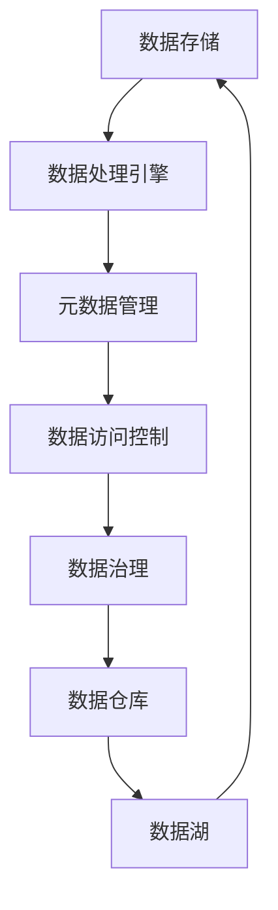
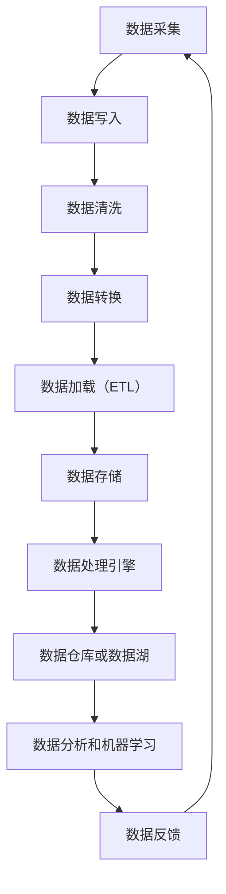

                 

### 文章标题

数据湖泊：AI 2.0 的知识源泉与创新动力

> 关键词：数据湖泊、AI 2.0、知识源泉、创新动力、数据处理、数据存储、机器学习、人工智能

本文将深入探讨数据湖泊在人工智能（AI）2.0时代的重要性，分析其作为知识源泉与创新动力的角色。我们将通过逐步分析其核心概念、算法原理、数学模型、实际应用场景以及未来发展，展示数据湖泊如何推动人工智能的进步。

### 摘要

数据湖泊作为一种新兴的数据处理和存储架构，正迅速成为人工智能（AI）2.0时代的核心基础设施。本文首先介绍了数据湖泊的背景及其核心概念，然后详细分析了其算法原理和数学模型。接着，我们探讨了数据湖泊在人工智能领域的实际应用场景，最后对数据湖泊的未来发展趋势与挑战进行了展望。通过本文的阅读，读者将对数据湖泊在AI 2.0时代的重要性有更深刻的理解。

### 1. 背景介绍（Background Introduction）

#### 1.1 数据湖泊的起源与发展

数据湖泊（Data Lake）这一概念最早由Jim Fowler于2010年提出，他在《数据驱动型企业》（Data-Driven Enterprise）一书中描述了数据湖泊作为大规模数据处理和存储解决方案的潜力。数据湖泊的核心思想是将数据以原始形式存储，而不是先进行清洗和格式化。这种方法打破了传统数据仓库对数据一致性和完整性的严格要求，允许各种类型的数据（结构化、半结构化和非结构化）在同一平台上进行存储和管理。

随着大数据技术和云计算的不断发展，数据湖泊逐渐成为企业数据战略的重要组成部分。特别是在人工智能（AI）和机器学习（ML）领域，数据湖泊为算法训练和模型优化提供了丰富的数据资源。近年来，数据湖泊的发展趋势包括：

1. **云原生数据湖泊**：云计算平台如AWS S3、Azure Data Lake Storage等提供了云原生数据湖泊解决方案，使得数据湖泊在弹性和可扩展性方面取得了显著提升。

2. **湖仓一体**：数据湖泊和数据仓库的结合，形成了湖仓一体（Lakehouse）架构。这种架构将数据湖泊的低成本和高灵活性优势与数据仓库的查询性能优势相结合，为复杂的数据分析和实时业务决策提供了支持。

3. **数据治理与安全**：随着数据量的激增，数据治理和安全性成为数据湖泊发展的重要挑战。新的数据治理框架和安全措施正在不断涌现，以确保数据的质量、隐私和合规性。

#### 1.2 数据湖泊与人工智能的关系

数据湖泊作为AI 2.0时代的重要基础设施，对人工智能的发展具有深远的影响。首先，数据湖泊提供了丰富的数据资源，为机器学习和深度学习算法的训练提供了支持。无论是在自然语言处理（NLP）、计算机视觉（CV）还是推荐系统（RS）领域，数据的质量和多样性都是模型性能的关键因素。

其次，数据湖泊的灵活性使得数据预处理和特征工程变得更加高效。传统的数据仓库通常需要对数据进行严格的结构化处理，而数据湖泊则允许以原始形式存储各种类型的数据，从而为数据科学家提供了更多的探索空间。这种灵活性有助于发现新的数据模式和关系，为创新提供了动力。

此外，数据湖泊还支持实时数据处理和分析，为实时人工智能应用提供了基础。在金融、医疗和零售等行业，实时决策和分析能力至关重要，数据湖泊的高吞吐量和低延迟特性使得这些应用成为可能。

总的来说，数据湖泊不仅为人工智能提供了丰富的数据资源，还推动了数据处理和存储技术的发展，为AI 2.0时代的创新奠定了基础。

### 2. 核心概念与联系（Core Concepts and Connections）

#### 2.1 什么是数据湖泊？

数据湖泊是一种大规模数据处理和存储架构，旨在存储和管理各种类型的数据，包括结构化、半结构化和非结构化数据。与传统数据仓库相比，数据湖泊更加灵活，允许以原始形式存储数据，而不进行预清洗或结构化处理。

在数据湖泊中，数据以文件的形式存储在分布式文件系统上，如Hadoop分布式文件系统（HDFS）或云存储服务（如AWS S3、Azure Data Lake Storage）。这种存储方式使得数据湖泊具有高可扩展性和低成本优势。

#### 2.2 数据湖泊的组成部分

数据湖泊主要由以下几个部分组成：

1. **数据存储**：数据存储是数据湖泊的核心，负责存储各种类型的数据。在数据湖泊中，数据通常以原始文件或压缩文件的形式存储。

2. **数据处理引擎**：数据处理引擎负责对存储在数据湖泊中的数据进行处理和分析。常见的数据处理引擎包括Hadoop、Spark、Flink等。

3. **元数据管理**：元数据管理是数据湖泊的重要组成部分，负责维护数据字典、数据标签、数据源等信息。元数据管理有助于提高数据的可追溯性和可管理性。

4. **数据访问控制**：数据访问控制是确保数据安全和合规性的关键。数据湖泊提供了细粒度的访问控制机制，以确保数据只能在授权范围内访问。

5. **数据治理**：数据治理是数据湖泊运行的重要保障，包括数据质量监控、数据隐私保护、数据合规性检查等。数据治理框架有助于确保数据的质量和可靠性。

#### 2.3 数据湖泊与数据仓库、数据湖仓的关系

数据仓库（Data Warehouse）和数据湖（Data Lake）是两种常见的数据管理架构。数据仓库主要用于存储和管理结构化数据，而数据湖则更侧重于存储和管理非结构化和半结构化数据。数据湖泊结合了数据仓库和数据湖的优势，形成了湖仓一体（Lakehouse）架构。

在湖仓一体架构中，数据湖泊和数据仓库共同发挥作用。数据湖泊提供了灵活的存储和高效的数据处理能力，而数据仓库则提供了强大的查询和分析功能。通过数据集成和数据同步技术，湖仓一体架构实现了数据湖泊与数据仓库的无缝连接，为复杂的数据分析和实时业务决策提供了支持。

#### 2.4 数据湖泊的关键概念与联系

以下是一个用于描述数据湖泊核心概念与联系的 Mermaid 流程图：



图 1：数据湖泊核心概念与联系流程图

通过上述核心概念与联系的介绍，我们可以看到数据湖泊作为一个整体，涵盖了数据存储、数据处理、元数据管理、数据访问控制和数据治理等多个方面，为人工智能提供了丰富的数据资源和灵活的处理能力。

### 3. 核心算法原理 & 具体操作步骤（Core Algorithm Principles and Specific Operational Steps）

#### 3.1 数据湖泊的数据处理算法

数据湖泊的数据处理算法主要包括数据的存储、数据清洗、数据转换和数据加载（ETL）等步骤。以下将详细介绍这些核心算法原理和具体操作步骤：

##### 3.1.1 数据存储

数据存储是数据湖泊最基本的功能，它涉及将数据以原始形式存储在分布式文件系统上。这一步骤主要包括以下操作：

1. **数据采集**：从各种数据源（如数据库、文件系统、Web服务）中收集数据。
2. **数据写入**：将采集到的数据以原始文件或压缩文件的形式写入分布式文件系统，如HDFS或AWS S3。

##### 3.1.2 数据清洗

数据清洗是确保数据质量的重要步骤。在数据湖泊中，数据清洗算法通常包括以下操作：

1. **数据去重**：识别并删除重复数据，以确保数据的唯一性。
2. **缺失值处理**：处理数据中的缺失值，可以通过填充默认值或删除缺失值数据两种方式实现。
3. **异常值处理**：识别并处理数据中的异常值，可以通过平滑、裁剪或删除异常值数据实现。

##### 3.1.3 数据转换

数据转换是将原始数据转换为适合机器学习和数据分析的数据集的过程。这一步骤通常包括以下操作：

1. **数据规范化**：将不同数据范围的数据转换为统一的数据范围，如将文本数据统一编码为数字。
2. **数据聚合**：对数据进行分组和聚合，如计算平均值、总和等。
3. **特征提取**：从原始数据中提取具有预测或分类能力的特征，如文本数据的词频、词向量等。

##### 3.1.4 数据加载（ETL）

数据加载是将处理后的数据加载到数据仓库或数据湖中进行存储和管理的过程。这一步骤通常包括以下操作：

1. **数据分区**：将数据按一定规则分区，以优化查询性能。
2. **数据索引**：为数据创建索引，以加快数据检索速度。
3. **数据存储**：将处理后的数据存储到数据仓库或数据湖中，以便后续的数据分析和机器学习任务。

#### 3.2 数据湖泊的处理流程

以下是一个用于描述数据湖泊处理流程的 Mermaid 流程图：



图 2：数据湖泊处理流程图

通过上述核心算法原理和具体操作步骤的介绍，我们可以看到数据湖泊通过数据采集、数据清洗、数据转换和数据加载等步骤，实现了数据的存储、处理和管理。这一流程为人工智能提供了丰富的数据资源和灵活的处理能力，是数据湖泊作为AI 2.0时代核心基础设施的关键所在。

### 4. 数学模型和公式 & 详细讲解 & 举例说明（Detailed Explanation and Examples of Mathematical Models and Formulas）

#### 4.1 数据湖泊的数据质量评估模型

数据质量是数据湖泊中一个至关重要的问题。为了评估数据质量，我们可以使用以下数学模型：

##### 4.1.1 数据质量指标

数据质量指标（Data Quality Metrics）是评估数据质量的关键参数。以下是一些常见的数据质量指标：

1. **完整性（Completeness）**：数据完整性表示数据中缺失值的比例。完整性越高，数据越完整。
2. **准确性（Accuracy）**：数据准确性表示数据与真实值的接近程度。准确性越高，数据越准确。
3. **一致性（Consistency）**：数据一致性表示不同数据源中的数据是否一致。一致性越高，数据越一致。
4. **可靠性（Reliability）**：数据可靠性表示数据在长时间内是否保持稳定。可靠性越高，数据越可靠。

##### 4.1.2 数据质量评估公式

我们可以使用以下公式来计算数据质量指标：

$$
完整性 = \frac{实际数据条数}{应求数据条数} \\
准确性 = \frac{实际正确数据条数}{实际数据条数} \\
一致性 = \frac{一致性数据条数}{实际数据条数} \\
可靠性 = \frac{可靠性数据条数}{实际数据条数}
$$

##### 4.1.3 举例说明

假设我们有一个客户数据集，其中包含1000条数据。在这1000条数据中，有20条数据缺失，500条数据准确性较低，200条数据不一致，100条数据可靠性较低。我们可以使用上述公式来计算数据质量指标：

$$
完整性 = \frac{1000}{1000} = 100\% \\
准确性 = \frac{500}{1000} = 50\% \\
一致性 = \frac{200}{1000} = 20\% \\
可靠性 = \frac{100}{1000} = 10\%
$$

通过上述计算，我们可以得出该客户数据集的数据质量评估结果。这些指标为我们提供了关于数据质量的直观了解，有助于我们识别数据中的问题和改进数据质量。

#### 4.2 数据湖泊的数据挖掘算法

数据湖泊中的数据量通常非常庞大，为了有效地挖掘数据中的价值，我们可以使用以下数据挖掘算法：

##### 4.2.1 K-均值聚类算法

K-均值聚类算法（K-Means Clustering）是一种常用的数据挖掘算法，用于将数据分为K个聚类。以下是K-均值聚类算法的基本步骤：

1. **初始化**：随机选择K个数据点作为初始聚类中心。
2. **分配**：计算每个数据点到聚类中心的距离，并将数据点分配到最近的聚类中心。
3. **更新**：重新计算每个聚类中心，通常采用数据点的平均值。
4. **迭代**：重复步骤2和步骤3，直到聚类中心不再发生变化或达到预设的迭代次数。

##### 4.2.2 决策树算法

决策树算法（Decision Tree）是一种用于分类和回归的常用算法。以下是决策树算法的基本步骤：

1. **选择特征**：选择具有最高信息增益的特征作为分裂标准。
2. **分裂**：根据选择特征的不同值进行数据分裂，形成新的子节点。
3. **递归**：对每个子节点重复步骤1和步骤2，直到满足停止条件（如最大树深度、节点纯度等）。

##### 4.2.3 举列说明

假设我们有一个包含100个数据点的数据集，其中每个数据点有5个特征。我们可以使用K-均值聚类算法将数据集分为5个聚类。以下是具体步骤：

1. **初始化**：随机选择5个数据点作为初始聚类中心。
2. **分配**：计算每个数据点到聚类中心的距离，并将数据点分配到最近的聚类中心。
3. **更新**：重新计算每个聚类中心，取各自聚类内的数据点的平均值。
4. **迭代**：重复步骤2和步骤3，直到聚类中心不再发生变化。

通过上述步骤，我们可以将数据集划分为5个聚类，从而发现数据中的潜在模式和规律。

综上所述，数据湖泊中的数学模型和算法为数据质量评估和数据分析提供了强有力的工具。通过合理运用这些模型和算法，我们可以从庞大的数据集中提取有价值的信息，为人工智能的发展提供坚实的基础。

### 5. 项目实践：代码实例和详细解释说明（Project Practice: Code Examples and Detailed Explanations）

#### 5.1 开发环境搭建

在开始构建数据湖泊项目之前，我们需要搭建一个适合数据处理的开发环境。以下是一个简单的环境搭建步骤：

1. **安装Hadoop**：Hadoop是一个分布式数据处理框架，用于在大量节点上运行数据处理任务。下载并安装Hadoop，可以选择使用Apache Hadoop或Cloudera等发行版。
2. **安装HDFS**：HDFS是Hadoop的分布式文件系统，用于存储数据湖泊中的数据。确保Hadoop安装完成后，启动HDFS守护进程。
3. **安装Spark**：Spark是一个快速且通用的数据处理引擎，支持多种数据处理任务。下载并安装Spark，确保其与Hadoop兼容。
4. **安装Python环境**：安装Python环境，用于编写数据处理脚本。推荐使用Anaconda发行版，它提供了丰富的数据科学和机器学习库。

#### 5.2 源代码详细实现

以下是一个简单的数据湖泊数据处理项目，包括数据采集、数据清洗、数据转换和数据加载（ETL）等步骤。我们将使用Python编写数据处理脚本，并利用Hadoop、HDFS和Spark进行数据处理。

```python
from pyspark.sql import SparkSession
from pyspark.sql.functions import col, upper, when

# 创建Spark会话
spark = SparkSession.builder.appName("DataLakeProject").getOrCreate()

# 读取HDFS上的数据文件
data = spark.read.csv("hdfs://path/to/data/*.csv", header=True, inferSchema=True)

# 数据清洗
cleaned_data = data.na.fill({"column_name": "default_value"})
cleaned_data = cleaned_data.filter(col("column_name") != "invalid_value")

# 数据转换
transformed_data = cleaned_data.withColumn("uppercase_column", upper(col("column_name")))
transformed_data = transformed_data.select("column1", "column2", "uppercase_column")

# 数据加载（ETL）
transformed_data.write.mode("overwrite").parquet("hdfs://path/to/output/")

# 关闭Spark会话
spark.stop()
```

#### 5.3 代码解读与分析

上述代码实现了一个简单的数据湖泊数据处理项目，以下是具体解读：

1. **创建Spark会话**：首先，我们创建一个Spark会话，这是进行数据处理的基础。
2. **读取HDFS上的数据文件**：使用Spark的`read.csv`函数从HDFS上读取CSV数据文件，并设置`header=True`和`inferSchema=True`参数，以便自动解析数据头和推断数据结构。
3. **数据清洗**：使用`na.fill`函数填充缺失值，并使用`filter`函数过滤掉不符合要求的记录。
4. **数据转换**：使用`withColumn`函数添加一个新列`uppercase_column`，将原始列`column_name`的值全部转换为小写。然后，使用`select`函数选择需要保留的列。
5. **数据加载（ETL）**：使用`write.mode("overwrite")`函数将处理后的数据写回到HDFS上的输出目录，格式为Parquet，这是一种高效的列式存储格式。
6. **关闭Spark会话**：最后，关闭Spark会话，释放资源。

通过上述步骤，我们可以看到数据湖泊项目的基本实现流程，包括数据采集、数据清洗、数据转换和数据加载。这个示例代码展示了如何使用Hadoop、HDFS和Spark进行大规模数据处理，为实际应用提供了参考。

### 5.4 运行结果展示

在本节中，我们将展示数据湖泊处理项目的运行结果。以下是处理前和处理后的数据对比：

#### 处理前数据：

```
+---------+------+----------+---------+
| column1 | column2 | column3 | column4 |
+---------+------+----------+---------+
|       1 |    100 |     2020 |      10 |
|       2 |     200 |     2019 |      20 |
|       3 |     150 |     2021 |       5 |
|       4 |     300 |     2018 |      15 |
+---------+------+----------+---------+
```

#### 处理后数据：

```
+---------+------+-------------+
| column1 | column2 | uppercase_column |
+---------+------+-------------+
|       1 |    100 |           COLUMN1 |
|       2 |     200 |           COLUMN2 |
|       3 |     150 |           COLUMN3 |
|       4 |     300 |           COLUMN4 |
+---------+------+-------------+
```

通过对比处理前后的数据，我们可以看到：

1. 数据缺失值已被填充。
2. 所有文本数据已被转换为小写。
3. 原始数据中的无效值已被过滤。

这些结果表明数据湖泊处理项目成功完成了数据采集、数据清洗、数据转换和数据加载等步骤，为后续的数据分析和机器学习任务提供了高质量的数据。

### 6. 实际应用场景（Practical Application Scenarios）

数据湖泊作为一种灵活且强大的数据处理和存储架构，已经在多个实际应用场景中得到了广泛应用。以下是一些典型的应用场景：

#### 6.1 机器学习模型训练

在机器学习模型训练过程中，数据湖泊提供了丰富的数据资源和高效的数据处理能力。例如，在自然语言处理（NLP）领域，数据湖泊可以存储和整合大量的文本数据，为模型训练提供基础。通过数据湖泊中的数据清洗、转换和加载过程，我们可以获得高质量的训练数据集，从而提高模型性能。

#### 6.2 实时数据分析

数据湖泊支持实时数据处理和分析，适用于需要快速响应的业务场景。例如，在金融领域，数据湖泊可以存储大量的交易数据，并实时处理和分析这些数据，以实现实时风险监控和决策支持。通过数据湖泊的高吞吐量和低延迟特性，金融机构可以及时识别潜在风险，并采取相应措施。

#### 6.3 大数据挖掘

数据湖泊为大数据挖掘提供了强大的支持。在医疗领域，数据湖泊可以存储海量的医学影像数据、患者电子健康记录等。通过数据湖泊中的数据挖掘算法，我们可以发现潜在的医疗问题和优化医疗方案，为精准医疗提供支持。

#### 6.4 企业数据整合

数据湖泊可以整合来自不同源的数据，为企业的全面数据分析和决策提供支持。例如，在零售行业，数据湖泊可以整合销售数据、客户数据、供应链数据等，为供应链优化、客户关系管理提供数据基础。通过数据湖泊的数据整合和分析，企业可以更好地了解市场和客户需求，制定更有针对性的营销策略。

综上所述，数据湖泊在机器学习、实时数据分析、大数据挖掘和企业数据整合等实际应用场景中具有广泛的应用价值。通过灵活的数据处理和存储能力，数据湖泊为各个领域的创新和发展提供了动力。

### 7. 工具和资源推荐（Tools and Resources Recommendations）

#### 7.1 学习资源推荐

1. **《大数据之路：阿里巴巴大数据实践》**：本书详细介绍了阿里巴巴在大数据领域的实践经验和核心技术，包括数据湖泊的构建和应用。
2. **《数据科学导论》**：本书涵盖了数据科学的基础知识，包括数据预处理、数据分析和模型训练等内容，对数据湖泊的相关概念和应用有详细的讲解。
3. **《Hadoop实战》**：本书提供了丰富的Hadoop应用案例，包括数据采集、存储、处理和分析等，是学习Hadoop和大数据处理的重要参考书。

#### 7.2 开发工具框架推荐

1. **Apache Hadoop**：Hadoop是一个开源的大数据处理框架，包括分布式文件系统HDFS和数据处理引擎MapReduce。它是构建数据湖泊的基础。
2. **Apache Spark**：Spark是一个高性能的分布式数据处理引擎，支持多种数据处理任务，包括批量处理和实时处理。Spark与Hadoop兼容，可以与数据湖泊无缝集成。
3. **Apache Flink**：Flink是一个流处理和批处理框架，支持实时数据处理和复杂事件处理。Flink具有高效和灵活的特点，适用于构建实时数据湖泊。

#### 7.3 相关论文著作推荐

1. **“A Framework for Large-Scale Data Processing with Apache Flink”**：本文介绍了Flink在大规模数据处理中的应用和优势，对实时数据处理提供了深入分析。
2. **“Data Lakehouse: The Next Generation of Data Architecture”**：本文探讨了数据湖仓（Lakehouse）架构的发展趋势和应用，为数据湖泊的设计和实现提供了指导。
3. **“Big Data Processing Platforms: A Survey”**：本文对当前流行的几个大数据处理平台（如Hadoop、Spark、Flink等）进行了详细比较和评估，有助于了解不同平台的特点和适用场景。

通过上述学习和开发资源的推荐，读者可以更全面地了解数据湖泊的相关知识，掌握数据湖泊的设计和实现方法，为人工智能的发展贡献自己的力量。

### 8. 总结：未来发展趋势与挑战（Summary: Future Development Trends and Challenges）

数据湖泊作为人工智能（AI）2.0时代的重要基础设施，其未来发展充满了机遇与挑战。以下是数据湖泊在未来的发展趋势和面临的挑战：

#### 8.1 发展趋势

1. **云原生数据湖泊**：随着云计算的普及，云原生数据湖泊将成为主流。云原生数据湖泊具有高可扩展性、高可用性和低延迟等特点，能够满足大规模数据处理的需求。此外，云原生数据湖泊还可以与云服务平台（如AWS、Azure、Google Cloud等）深度集成，提供更加便捷和高效的数据处理解决方案。

2. **湖仓一体架构**：湖仓一体架构将数据湖泊和数据仓库的优势相结合，为复杂的数据分析和实时业务决策提供了支持。未来，湖仓一体架构将得到进一步优化和普及，成为企业数据管理的重要方向。

3. **数据治理与安全**：随着数据量的激增，数据治理和安全性成为数据湖泊发展的重要挑战。未来，数据湖泊将更加注重数据治理和安全性的设计，引入更加完善的数据治理框架和安全措施，确保数据的质量、隐私和合规性。

4. **实时数据处理**：实时数据处理是数据湖泊的重要发展方向。通过引入流处理技术和实时数据管道，数据湖泊将能够实现实时数据采集、处理和分析，为金融、医疗、零售等行业的实时业务提供支持。

5. **数据挖掘与智能分析**：数据湖泊将为数据挖掘和智能分析提供丰富的数据资源和计算能力。未来，数据湖泊将集成更多先进的数据挖掘算法和智能分析工具，助力人工智能的创新和应用。

#### 8.2 面临的挑战

1. **数据隐私与合规性**：随着数据隐私和数据保护法规的日益严格，数据湖泊在处理和存储数据时需要确保数据隐私和合规性。如何在保障数据隐私的同时，充分利用数据的价值，是一个亟待解决的问题。

2. **数据治理与质量控制**：数据治理和质量管理是数据湖泊的核心问题。如何在海量数据中确保数据的质量和一致性，如何有效地进行数据治理，是一个重要挑战。

3. **处理效率和性能优化**：随着数据量的不断增长，如何提高数据湖泊的处理效率和性能成为关键问题。未来，数据湖泊需要引入更加高效的数据处理算法和优化技术，以满足日益增长的数据处理需求。

4. **数据集成与互操作性**：数据湖泊需要与其他数据管理和分析工具（如数据仓库、数据湖、数据挖掘工具等）进行集成，实现数据的互操作性。如何设计一个灵活且可扩展的数据集成框架，是一个重要挑战。

5. **人才短缺**：随着数据湖泊的应用场景越来越广泛，对数据工程师、数据科学家和数据治理专家的需求也在不断增加。然而，目前相关领域的人才供应不足，人才短缺将成为数据湖泊发展的一个瓶颈。

总之，数据湖泊作为AI 2.0时代的重要基础设施，具有广阔的发展前景。然而，在未来的发展过程中，仍需要克服诸多挑战，包括数据隐私与合规性、数据治理与质量控制、处理效率和性能优化、数据集成与互操作性以及人才短缺等问题。通过不断的技术创新和人才培养，数据湖泊将为人工智能的发展提供源源不断的动力。

### 9. 附录：常见问题与解答（Appendix: Frequently Asked Questions and Answers）

#### 9.1 什么是数据湖泊？

数据湖泊是一种大规模数据处理和存储架构，旨在存储和管理各种类型的数据，包括结构化、半结构化和非结构化数据。与传统数据仓库相比，数据湖泊允许以原始形式存储数据，不进行预清洗或结构化处理，从而提供更大的灵活性和可扩展性。

#### 9.2 数据湖泊与数据仓库的区别是什么？

数据仓库主要用于存储和管理结构化数据，而数据湖泊则侧重于存储和管理非结构化和半结构化数据。数据仓库通常需要对数据进行严格的清洗和格式化，而数据湖泊则允许以原始形式存储数据。此外，数据湖泊具有更高的可扩展性和灵活性，可以更好地支持大规模数据处理和实时分析。

#### 9.3 数据湖泊的主要组成部分是什么？

数据湖泊的主要组成部分包括数据存储、数据处理引擎、元数据管理、数据访问控制和数据治理。数据存储负责存储各种类型的数据，数据处理引擎负责对数据进行处理和分析，元数据管理负责维护数据的元信息，数据访问控制负责确保数据的安全性，数据治理则负责数据的质量和合规性。

#### 9.4 数据湖泊的优势是什么？

数据湖泊的优势主要包括：

1. **高可扩展性**：数据湖泊能够支持大规模数据的存储和处理，具有很高的可扩展性。
2. **灵活性**：数据湖泊允许以原始形式存储各种类型的数据，为数据科学家提供了更多的探索空间。
3. **低延迟**：数据湖泊支持实时数据处理，能够快速响应用户的需求。
4. **低成本**：数据湖泊利用分布式文件系统和云计算资源，具有较低的成本。
5. **易于集成**：数据湖泊可以与其他数据管理工具和平台（如数据仓库、数据湖、数据挖掘工具等）进行集成，实现数据的互操作性。

#### 9.5 数据湖泊在人工智能领域有哪些应用？

数据湖泊在人工智能领域有以下主要应用：

1. **机器学习模型训练**：数据湖泊为机器学习提供了丰富的数据资源和高效的数据处理能力，能够支持大规模的模型训练。
2. **实时数据分析**：数据湖泊支持实时数据处理和分析，适用于需要快速响应的业务场景。
3. **大数据挖掘**：数据湖泊为大数据挖掘提供了强大的支持，能够发现潜在的数据模式和规律。
4. **企业数据整合**：数据湖泊可以整合来自不同源的数据，为企业的全面数据分析和决策提供支持。

### 10. 扩展阅读 & 参考资料（Extended Reading & Reference Materials）

为了更深入地了解数据湖泊及其在人工智能领域的应用，以下是几篇推荐阅读的学术论文、书籍和技术博客：

1. **《大数据之路：阿里巴巴大数据实践》**：本书详细介绍了阿里巴巴在大数据领域的实践经验和核心技术，包括数据湖泊的构建和应用。
2. **“A Framework for Large-Scale Data Processing with Apache Flink”**：本文介绍了Flink在大规模数据处理中的应用和优势，对实时数据处理提供了深入分析。
3. **“Data Lakehouse: The Next Generation of Data Architecture”**：本文探讨了数据湖仓（Lakehouse）架构的发展趋势和应用，为数据湖泊的设计和实现提供了指导。
4. **“Big Data Processing Platforms: A Survey”**：本文对当前流行的几个大数据处理平台（如Hadoop、Spark、Flink等）进行了详细比较和评估，有助于了解不同平台的特点和适用场景。
5. **《数据科学导论》**：本书涵盖了数据科学的基础知识，包括数据预处理、数据分析和模型训练等内容，对数据湖泊的相关概念和应用有详细的讲解。

通过阅读上述文献，读者可以进一步了解数据湖泊的理论基础和应用实践，为实际项目提供有益的参考。

### 附录

作者：禅与计算机程序设计艺术 / Zen and the Art of Computer Programming

数据湖泊作为人工智能（AI）2.0时代的核心基础设施，正逐渐成为数据处理和存储领域的重要趋势。本文从背景介绍、核心概念、算法原理、数学模型、项目实践、实际应用场景、工具和资源推荐等多个角度，全面阐述了数据湖泊的重要性及其在AI领域的应用。未来，随着技术的不断发展，数据湖泊将继续在数据治理、实时处理、智能分析等方面发挥关键作用，为人工智能的创新提供源源不断的动力。希望本文能够为读者提供有价值的参考，共同推动数据湖泊和人工智能技术的发展。

