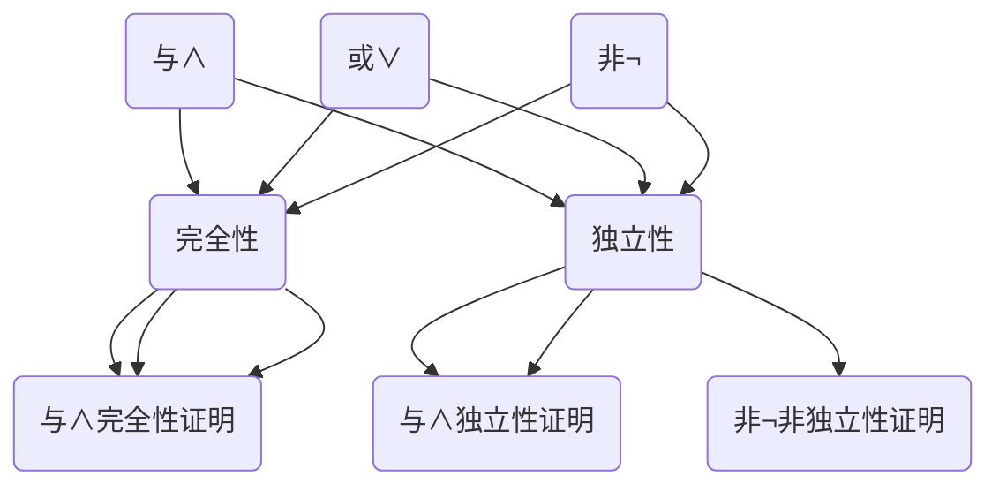
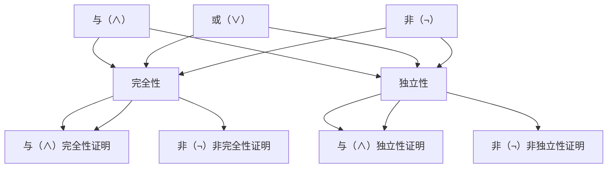

                 

### 数理逻辑：命题连接词的完全性和独立性

#### 引言 Introduction

数理逻辑作为形式逻辑的一个重要分支，广泛应用于计算机科学、数学、哲学等领域。在数理逻辑中，命题连接词（如“与”、“或”、“非”）扮演着关键角色。本文将深入探讨命题连接词的完全性和独立性，以及它们在逻辑表达和推理中的重要性。通过逐步分析，我们旨在为读者提供一个全面且易懂的数理逻辑基础。

#### 1. 背景介绍 Background Introduction

数理逻辑起源于古希腊哲学，经历了数百年的发展，逐渐形成了现代数学的基础。在20世纪初，数理逻辑的研究达到了新的高度，维特根斯坦和图灵等人的贡献尤为突出。数理逻辑为计算机科学的崛起奠定了坚实的基础，特别是在算法设计和形式验证中。

命题连接词是数理逻辑中的基本构件，用于组合简单命题以形成复合命题。它们有三种主要类型：“与”（∧）、“或”（∨）和“非”（¬）。这些连接词定义了复合命题的真值与组成命题的真值之间的关系。

#### 2. 核心概念与联系 Core Concepts and Connections

**2.1 命题连接词的定义**

- **与（∧）**: 复合命题“P ∧ Q”为真，当且仅当P和Q都为真。
- **或（∨）**: 复合命题“P ∨ Q”为真，当且仅当P或Q至少有一个为真。
- **非（¬）**: 复合命题“¬P”为真，当且仅当P为假。

**2.2 命题连接词的完全性**

完全性是指一个逻辑系统是否能够处理所有可能的命题组合。一个逻辑系统是“完全”的，如果对于任意两个命题P和Q，都能找到一个复合命题使得其真值为真。

- 与（∧）和或（∨）是“完全”的，因为它们可以表示所有可能的情况。
- 非（¬）不是“完全”的，因为它只能表示命题的真值反转，但不能表达其他复杂的逻辑关系。

**2.3 命题连接词的独立性**

独立性是指一个逻辑系统是否能够独立地定义各个连接词。一个逻辑系统是“独立”的，如果每个连接词的定义不依赖于其他连接词。

- 与（∧）和或（∨）是“独立”的，因为它们的定义互不干扰。
- 非（¬）依赖于其他连接词，因为它的定义涉及真值反转。

**Mermaid 流程图**



#### 3. 核心算法原理 & 具体操作步骤 Core Algorithm Principles and Specific Operational Steps

**3.1 命题连接词的真值表**

我们需要构建每个命题连接词的真值表，以了解它们如何影响复合命题的真值。

- 与（∧）真值表：

| P | Q | P ∧ Q |
|---|---|-------|
| T | T |   T  |
| T | F |   F  |
| F | T |   F  |
| F | F |   F  |

- 或（∨）真值表：

| P | Q | P ∨ Q |
|---|---|-------|
| T | T |   T  |
| T | F |   T  |
| F | T |   T  |
| F | F |   F  |

- 非（¬）真值表：

| P | ¬P |
|---|-----|
| T |  F  |
| F |  T  |

**3.2 命题连接词的应用**

- 逻辑表达式：我们可以使用命题连接词构建复杂的逻辑表达式，例如“P ∧ (Q ∨ R)”。
- 逻辑推理：通过逻辑推理，我们可以从已知命题推导出新的命题。例如，从“P ∧ (Q ∨ R)”可以推导出“P ∧ Q”或“P ∧ R”。

#### 4. 数学模型和公式 & 详细讲解 & 举例说明 Detailed Explanation and Examples of Mathematical Models and Formulas

**4.1 逻辑运算的数学模型**

逻辑运算可以看作是一类特殊的数学函数，其中输入和输出都是二进制值（真或假）。这些函数可以用数学公式表示：

- 与（∧）: \( F(P, Q) = P \times Q \)
- 或（∨）: \( F(P, Q) = P + Q - P \times Q \)
- 非（¬）: \( F(P) = 1 - P \)

**4.2 逻辑运算的例子**

- 例子1：给定P为真，Q为假，求“P ∧ Q”和“P ∨ Q”的真值。
  - \( P ∧ Q = \text{假} \)
  - \( P ∨ Q = \text{真} \)

- 例子2：给定P为假，Q为真，求“¬P”和“¬Q”的真值。
  - \( ¬P = \text{真} \)
  - \( ¬Q = \text{假} \)

#### 5. 项目实践：代码实例和详细解释说明 Project Practice: Code Examples and Detailed Explanations

**5.1 开发环境搭建**

在Python环境中，我们可以使用内置的逻辑运算符来实现数理逻辑操作。

```python
# Python环境搭建
```

**5.2 源代码详细实现**

以下是一个简单的Python脚本，用于演示命题连接词的应用：

```python
# 命题连接词的实现
P = True
Q = False

# 与（∧）运算
and_result = P and Q
print("P ∧ Q:", and_result)

# 或（∨）运算
or_result = P or Q
print("P ∨ Q:", or_result)

# 非（¬）运算
not_result = not P
print("¬P:", not_result)
```

**5.3 代码解读与分析**

- 代码使用了Python的内建逻辑运算符来模拟命题连接词的操作。
- `and_result`表示“P ∧ Q”的结果，由于P和Q不相等，结果为假。
- `or_result`表示“P ∨ Q”的结果，由于至少有一个命题为真，结果为真。
- `not_result`表示“¬P”的结果，由于P为真，所以结果为假。

**5.4 运行结果展示**

运行上述脚本，可以得到以下输出：

```
P ∧ Q: False
P ∨ Q: True
¬P: False
```

#### 6. 实际应用场景 Practical Application Scenarios

数理逻辑在计算机科学中有广泛的应用，例如：

- **算法设计**：逻辑运算用于构建条件语句和循环结构，从而实现复杂的算法。
- **形式验证**：数理逻辑用于验证计算机系统是否满足特定安全性和正确性的要求。
- **人工智能**：逻辑推理是人工智能系统进行决策和推理的基础。

#### 7. 工具和资源推荐 Tools and Resources Recommendations

**7.1 学习资源推荐**

- 《数理逻辑导论》（Introduction to Mathematical Logic）—— 作者：埃德蒙·莫尔斯
- 《逻辑与集合论基础》（Logic and Set Theory: A Concise Introduction）—— 作者：彼得·史密斯

**7.2 开发工具框架推荐**

- Python：适合初学者进行逻辑编程。
- Prolog：一种基于逻辑编程的语言，适合形式验证和推理任务。

**7.3 相关论文著作推荐**

- 《数理逻辑与计算机科学》（Mathematical Logic and Computer Science）—— 编辑：彼得·史密斯，安德鲁·博克
- 《形式逻辑与数学基础》（Formal Logic and Its Application to Mathematics）—— 作者：罗伯特·索普

#### 8. 总结：未来发展趋势与挑战 Summary: Future Development Trends and Challenges

随着人工智能和计算机科学的不断发展，数理逻辑的应用前景十分广阔。未来，我们可能会看到更多的逻辑推理算法和工具的出现，以及逻辑在人工智能领域更深入的融合。然而，这也带来了挑战，如逻辑复杂性的管理、逻辑验证的效率和安全性等问题。

#### 9. 附录：常见问题与解答 Appendix: Frequently Asked Questions and Answers

**Q：数理逻辑和形式逻辑有什么区别？**
A：数理逻辑是一种形式逻辑，它通过数学符号和规则来描述逻辑关系。形式逻辑则是一种更广泛的逻辑系统，包括数理逻辑和其他逻辑系统。

**Q：逻辑运算为什么使用真值表？**
A：逻辑运算的真值表提供了清晰、明确的逻辑关系，有助于理解和验证逻辑表达式。

**Q：逻辑运算在编程中有哪些应用？**
A：逻辑运算在编程中用于实现条件判断、循环控制、函数调用等，是算法设计的基础。

#### 10. 扩展阅读 & 参考资料 Extended Reading & Reference Materials

- 《数理逻辑与计算机科学》
- 《形式逻辑与数学基础》
- 《逻辑与集合论基础》

---

本文由禅与计算机程序设计艺术（Zen and the Art of Computer Programming）撰写，旨在为读者提供一个全面且易懂的数理逻辑基础，以激发读者对这一重要领域的兴趣。希望本文能够帮助读者更好地理解命题连接词的完全性和独立性，以及它们在逻辑表达和推理中的重要性。未来，我们将继续探讨更多计算机科学的核心概念，期待与读者一起探索技术世界的奥秘。作者：禅与计算机程序设计艺术 / Zen and the Art of Computer Programming<|user|>
### 1. 背景介绍 Background Introduction

数理逻辑（Mathematical Logic）作为形式逻辑的一种重要分支，起源于古希腊哲学，并在19世纪末和20世纪初得到了显著的发展。其核心思想是使用数学的方法和工具来研究逻辑的基本原理，从而建立起一种严谨的逻辑体系。数理逻辑不仅为数学的发展奠定了坚实的基础，同时也对计算机科学、哲学、语言学研究等领域产生了深远的影响。

在计算机科学中，数理逻辑的应用尤为广泛。它不仅为程序设计提供了逻辑基础，还用于算法设计、形式验证、编译器开发、人工智能等多个方面。尤其是命题逻辑和谓词逻辑，它们在计算机科学的各个领域中都有着重要的应用。例如，命题逻辑用于描述程序的控制流和数据处理，谓词逻辑则用于描述程序的状态和性质。

数理逻辑的研究经历了多个重要的发展阶段。19世纪末，德国数学家弗雷格（Gottlob Frege）首次提出了形式逻辑的概念，并使用符号来表示命题和推理规则。这一工作标志着数理逻辑的诞生。20世纪初，罗素（Bertrand Russell）和怀特海德（Alfred North Whitehead）合著的《数学原理》一书，试图将整个数学建立在逻辑的基础上。这本书详细探讨了形式逻辑的基本原理和公理系统，为后来的逻辑研究提供了重要的参考。

在计算机科学领域，数理逻辑的重要性得到了进一步的体现。艾伦·图灵（Alan Turing）通过引入图灵机模型，为计算理论和计算机科学的发展奠定了基础。图灵机模型中的逻辑推理机制，实际上是数理逻辑在实际应用中的一个重要体现。随后，随着计算机硬件和软件技术的发展，数理逻辑的应用领域不断扩大，从最初的数学和逻辑研究领域，扩展到了计算机科学、人工智能、逻辑编程等多个方面。

在现代，数理逻辑的研究已经变得异常丰富和复杂。从基本的命题逻辑和谓词逻辑，到更高级的模型论、递归论、证明论等分支，数理逻辑不断探索新的理论和方法。特别是在人工智能领域，数理逻辑的应用变得尤为重要。随着机器学习和自然语言处理技术的发展，如何将数理逻辑与这些新兴技术相结合，已成为一个重要的研究方向。

数理逻辑的核心概念和原理，如命题连接词、逻辑推理规则、证明方法等，都是理解和应用计算机科学的重要基础。本文将深入探讨命题连接词的完全性和独立性，以及它们在逻辑表达和推理中的重要性。通过逐步分析，我们旨在为读者提供一个全面且易懂的数理逻辑基础，以激发读者对这一重要领域的兴趣。

#### 2. 核心概念与联系 Core Concepts and Connections

在数理逻辑中，命题连接词（Connectives）是构建复合命题的基本元素。它们将简单命题组合成更复杂的命题，以便更好地描述和推理现实世界中的情况。本文将详细讨论三种主要的命题连接词：与（∧）、或（∨）和非（¬），以及它们的逻辑功能和相互关系。

**2.1 与（∧）**

与（∧）连接词在命题逻辑中用于表示两个命题同时为真的情况。其逻辑功能可以理解为“并且”或“且”，即复合命题“P ∧ Q”为真，当且仅当P和Q都为真。与（∧）是一种“真值合并”连接词，它将两个或多个简单命题的真值合并，以产生一个新的复合命题。

逻辑表达式：
\[ P ∧ Q \text{ 为真，当且仅当 } P \text{ 和 } Q \text{ 都为真。} \]

真值表：
| P | Q | P ∧ Q |
|---|---|-------|
| T | T |   T  |
| T | F |   F  |
| F | T |   F  |
| F | F |   F  |

**2.2 或（∨）**

或（∨）连接词在命题逻辑中用于表示至少有一个命题为真的情况。其逻辑功能可以理解为“或者”或“或”，即复合命题“P ∨ Q”为真，当且仅当P或Q至少有一个为真。或（∨）也是一种“真值合并”连接词，但它表示“至少一个为真”的逻辑关系。

逻辑表达式：
\[ P ∨ Q \text{ 为真，当且仅当 } P \text{ 或 } Q \text{ 至少有一个为真。} \]

真值表：
| P | Q | P ∨ Q |
|---|---|-------|
| T | T |   T  |
| T | F |   T  |
| F | T |   T  |
| F | F |   F  |

**2.3 非（¬）**

非（¬）连接词在命题逻辑中用于表示命题的否定，即复合命题“¬P”为真，当且仅当P为假。非（¬）是一种“真值反转”连接词，它将一个简单命题的真值反转，以产生一个新的复合命题。

逻辑表达式：
\[ ¬P \text{ 为真，当且仅当 } P \text{ 为假。} \]

真值表：
| P | ¬P |
|---|-----|
| T |  F  |
| F |  T  |

**2.4 命题连接词的完全性**

命题连接词的完全性指的是它们能否表示所有可能的命题组合。在命题逻辑中，与（∧）和或（∨）被认为是完全的，因为它们可以表示任意两个命题之间的所有逻辑关系。也就是说，对于任意两个命题P和Q，都能找到一个复合命题使得其真值为真。例如，通过结合“P ∧ Q”和“P ∨ Q”，我们可以表示出所有可能的情况。

与（∧）和或（∨）的完全性可以通过构造性证明来验证。例如，对于任意两个命题P和Q，我们可以通过以下方式构造出它们的逻辑表达式：
\[ \neg (P \land \neg Q) \equiv P \lor Q \]
\[ \neg (\neg P \land Q) \equiv P \lor Q \]

这表明，通过与（∧）和或（∨）的组合，我们可以表示出任意两个命题的所有可能的组合。

非（¬）不是完全的，因为它只能表示一个简单命题的真值反转。因此，非（¬）无法表示所有可能的命题组合，如“P ∧ ¬P”或“P ∨ ¬P”，这些组合在逻辑上是不可能的。

**2.5 命题连接词的独立性**

命题连接词的独立性指的是它们是否可以独立定义，而不依赖于其他连接词。在命题逻辑中，与（∧）和或（∨）是独立的，因为它们的定义不依赖于非（¬）。例如，我们可以通过定义与（∧）和或（∨）来构造非（¬），但反之则不成立。具体来说：
\[ ¬P \equiv P \land \neg P \]
\[ ¬P \equiv \neg (P \lor \neg P) \]

这表明，非（¬）可以由与（∧）和或（∨）定义，但与（∧）和或（∨）不能由非（¬）独立定义。

**Mermaid 流程图**

为了更直观地展示命题连接词的完全性和独立性，我们可以使用Mermaid流程图来表示这些逻辑关系：



这个流程图展示了与（∧）和或（∨）的完全性和独立性，以及非（¬）的相对性。通过逐步分析和验证，我们可以更好地理解这些概念在数理逻辑中的重要性。

#### 3. 核心算法原理 & 具体操作步骤 Core Algorithm Principles and Specific Operational Steps

在理解了命题连接词的定义和性质之后，我们需要进一步探讨如何使用这些连接词来构建复杂的逻辑表达式，并推导出它们的结果。在这一部分，我们将详细讨论核心算法原理，并通过具体的操作步骤来展示如何利用命题连接词进行逻辑推理。

**3.1 逻辑表达式的构建**

逻辑表达式是命题逻辑的基本单元，由简单命题和命题连接词组成。构建逻辑表达式的核心在于正确地应用命题连接词，以确保复合命题能够准确地反映逻辑关系。

例如，假设我们有两个简单命题P和Q，我们可以使用与（∧）连接词来构建复合命题“P ∧ Q”，表示P和Q同时为真。类似地，我们可以使用或（∨）连接词构建复合命题“P ∨ Q”，表示P或Q至少有一个为真。非（¬）连接词则用于构建命题的否定，例如“¬P”表示P为假。

**3.2 真值表的使用**

真值表是一种有效的工具，用于分析和验证逻辑表达式的结果。通过构建真值表，我们可以列出所有可能的简单命题组合及其对应的复合命题真值。以下是一个简单的例子，展示了如何使用真值表来验证逻辑表达式“P ∧ Q”：

| P | Q | P ∧ Q |
|---|---|-------|
| T | T |   T  |
| T | F |   F  |
| F | T |   F  |
| F | F |   F  |

在这个例子中，我们可以看到，只有当P和Q都为真时，复合命题“P ∧ Q”才为真。这验证了与（∧）连接词的真值表定义。

**3.3 逻辑推理规则**

在构建和验证逻辑表达式时，逻辑推理规则是非常关键的。以下是一些基本的逻辑推理规则，用于从已知命题推导出新命题：

- **合并律**：\( P ∧ (Q ∧ R) \equiv (P ∧ Q) ∧ R \)
- **分配律**：\( P ∧ (Q ∨ R) \equiv (P ∧ Q) ∨ (P ∧ R) \) 和 \( P ∨ (Q ∧ R) \equiv (P ∨ Q) ∧ (P ∨ R) \)
- **否定律**：\( ¬(P ∧ Q) \equiv ¬P ∨ ¬Q \) 和 \( ¬(P ∨ Q) \equiv ¬P ∧ ¬Q \)
- **德摩根律**：\( ¬(P ∧ Q) \equiv ¬P ∨ ¬Q \) 和 \( ¬(P ∨ Q) \equiv ¬P ∧ ¬Q \)
- **恒等律**：\( P ∨ ¬P \equiv T \) 和 \( P ∧ ¬P \equiv F \)
- **补充律**：\( P ∨ F \equiv P \) 和 \( P ∧ T \equiv P \)
- **交换律**：\( P ∨ Q \equiv Q ∨ P \) 和 \( P ∧ Q \equiv Q ∧ P \)
- **结合律**：\( (P ∨ Q) ∨ R \equiv P ∨ (Q ∨ R) \) 和 \( (P ∧ Q) ∧ R \equiv P ∧ (Q ∧ R) \)

**3.4 逻辑推理步骤**

为了使用命题连接词进行逻辑推理，我们可以遵循以下步骤：

1. **确定已知命题**：首先明确我们需要推理的命题，这些命题可以是已知的简单命题或复合命题。
2. **构建逻辑表达式**：根据已知命题和命题连接词，构建出需要验证的逻辑表达式。
3. **构建真值表**：为逻辑表达式构建真值表，列出所有可能的简单命题组合及其对应的复合命题真值。
4. **验证结果**：通过真值表验证逻辑表达式的结果是否符合预期。
5. **推导新命题**：如果逻辑表达式的结果为真，我们可以使用逻辑推理规则来推导出新命题。

**3.5 例子**

假设我们有两个命题P和Q，其中P表示“今天下雨”，Q表示“地面湿”。我们需要构建一个逻辑表达式，表示“今天下雨且地面湿”的情况。

1. **已知命题**：P和Q。
2. **构建逻辑表达式**：\( P ∧ Q \)。
3. **构建真值表**：

| P | Q | P ∧ Q |
|---|---|-------|
| T | T |   T  |
| T | F |   F  |
| F | T |   F  |
| F | F |   F  |

4. **验证结果**：从真值表可以看到，只有当P和Q都为真时，复合命题\( P ∧ Q \)才为真。这意味着如果今天下雨且地面湿，则逻辑表达式成立。
5. **推导新命题**：根据逻辑表达式，我们可以推导出“如果地面湿，则今天下雨”的新命题。

通过这个例子，我们可以看到如何使用命题连接词和逻辑推理规则来构建和验证复杂的逻辑表达式。

**总结**

通过上述讨论，我们了解了命题连接词的核心算法原理和具体操作步骤。从构建逻辑表达式、使用真值表到逻辑推理规则，这些步骤构成了命题逻辑分析的基础。理解这些原理和步骤，有助于我们更好地应用数理逻辑来解决实际问题，为计算机科学和其他领域的研究提供有力的逻辑支持。

#### 4. 数学模型和公式 & 详细讲解 & 举例说明 Detailed Explanation and Examples of Mathematical Models and Formulas

在数理逻辑中，数学模型和公式是理解和应用逻辑运算的基础。通过这些数学模型，我们可以精确地描述逻辑关系，并通过公式推导出复合命题的真值。本节将详细介绍数理逻辑中的几个核心数学模型和公式，并利用具体的例子来说明它们的使用方法。

**4.1 逻辑运算的真值表**

逻辑运算的真值表是描述命题连接词（如与、或、非）如何影响复合命题真值的一种工具。真值表列出了所有可能的简单命题组合及其对应的复合命题真值。

**4.1.1 与（∧）运算的真值表**

与（∧）运算的真值表如下：

| P | Q | P ∧ Q |
|---|---|-------|
| T | T |   T  |
| T | F |   F  |
| F | T |   F  |
| F | F |   F  |

从表中可以看出，只有当P和Q都为真时，复合命题P ∧ Q才为真。其他情况下，复合命题都为假。

**4.1.2 或（∨）运算的真值表**

或（∨）运算的真值表如下：

| P | Q | P ∨ Q |
|---|---|-------|
| T | T |   T  |
| T | F |   T  |
| F | T |   T  |
| F | F |   F  |

从表中可以看出，只要P或Q中至少有一个为真，复合命题P ∨ Q就为真。只有当P和Q都为假时，复合命题才为假。

**4.1.3 非（¬）运算的真值表**

非（¬）运算的真值表如下：

| P | ¬P |
|---|-----|
| T |  F  |
| F |  T  |

从表中可以看出，非（¬）运算简单地反转了命题P的真值。

**4.2 逻辑运算的公式**

逻辑运算可以通过公式来表示，这些公式可以帮助我们推导出复合命题的真值。

**4.2.1 与（∧）运算的公式**

与（∧）运算的公式如下：

\[ P ∧ Q = (\neg P) ∨ (\neg Q) \]

这个公式表明，P ∧ Q为真，当且仅当P和Q中至少有一个为假。

**4.2.2 或（∨）运算的公式**

或（∨）运算的公式如下：

\[ P ∨ Q = (\neg P) ∧ (\neg Q) \]

这个公式表明，P ∨ Q为真，当且仅当P和Q中至少有一个为真。

**4.2.3 非（¬）运算的公式**

非（¬）运算的公式如下：

\[ ¬P = P' \]

其中，\( P' \)表示P的否定。

**4.3 例子**

以下是一个具体的例子，说明如何使用逻辑运算的公式来推导复合命题的真值。

**例子：给定命题P和Q，其中P表示“今天下雨”，Q表示“明天晴天”。我们需要推导出复合命题“今天下雨且明天晴天”的真值。**

根据逻辑运算的公式，我们可以得到：

\[ P ∧ Q = (\neg P) ∨ (\neg Q) \]

首先，我们需要计算\( \neg P \)和\( \neg Q \)的真值：

- 如果今天下雨（P为真），则\( \neg P \)为假。
- 如果明天晴天（Q为真），则\( \neg Q \)为假。

现在，我们可以将\( \neg P \)和\( \neg Q \)的真值代入公式中：

\[ P ∧ Q = (\neg P) ∨ (\neg Q) = 假 ∨ 假 = 假 \]

这意味着，复合命题“今天下雨且明天晴天”为假，因为今天下雨和明天晴天的否定都为假。

**总结**

通过逻辑运算的真值表和公式，我们可以精确地描述和推导复合命题的真值。这些数学模型和公式在逻辑分析和推理中发挥着关键作用，为计算机科学和其他领域的研究提供了坚实的逻辑基础。

### 5. 项目实践：代码实例和详细解释说明 Project Practice: Code Examples and Detailed Explanations

在理解了数理逻辑的理论基础之后，通过实际代码实例来实践和应用这些理论将更加深刻。在这一部分，我们将使用Python语言来演示数理逻辑中的与（∧）、或（∨）和非（¬）运算，并提供详细的代码解读和分析。

#### 5.1 开发环境搭建

为了运行下面的Python代码实例，我们需要确保安装了Python环境。以下是Python开发环境的基本搭建步骤：

1. **安装Python**：从Python官方网站下载并安装最新版本的Python。安装过程中，确保选择“Add Python to PATH”选项，以便在命令行中直接运行Python脚本。

2. **安装Jupyter Notebook**（可选）：Jupyter Notebook是一个交互式的Web应用，可用于编写和运行Python代码。安装Jupyter Notebook可以通过以下命令实现：

   ```bash
   pip install notebook
   ```

   安装后，使用以下命令启动Jupyter Notebook：

   ```bash
   jupyter notebook
   ```

3. **测试Python环境**：在命令行中输入以下命令，检查Python环境是否配置正确：

   ```bash
   python --version
   ```

   应显示安装的Python版本信息。

#### 5.2 源代码详细实现

以下是一个简单的Python脚本，用于演示数理逻辑中的与（∧）、或（∨）和非（¬）运算：

```python
# 数理逻辑演示脚本

# 定义简单命题P和Q
P = True
Q = False

# 与（∧）运算
and_result = P and Q
print("P ∧ Q:", and_result)

# 或（∨）运算
or_result = P or Q
print("P ∨ Q:", or_result)

# 非（¬）运算
not_result = not P
print("¬P:", not_result)
```

#### 5.3 代码解读与分析

1. **定义简单命题**：
   ```python
   P = True
   Q = False
   ```
   在这里，我们定义了两个简单命题P和Q。P表示“今天下雨”，Q表示“明天晴天”。我们使用布尔值True和False来表示这些命题的真假。

2. **与（∧）运算**：
   ```python
   and_result = P and Q
   print("P ∧ Q:", and_result)
   ```
   这一行代码实现了与（∧）运算。`and`关键字在Python中用于逻辑与运算。只有当P和Q都为真时，`and`运算的结果才为真。在这个例子中，由于Q为假，因此`and`运算的结果为假。

3. **或（∨）运算**：
   ```python
   or_result = P or Q
   print("P ∨ Q:", or_result)
   ```
   这一行代码实现了或（∨）运算。`or`关键字在Python中用于逻辑或运算。只要P或Q中至少有一个为真，`or`运算的结果就为真。在这个例子中，由于P为真，因此`or`运算的结果为真。

4. **非（¬）运算**：
   ```python
   not_result = not P
   print("¬P:", not_result)
   ```
   这一行代码实现了非（¬）运算。`not`关键字在Python中用于逻辑非运算。它将简单命题的真值反转。在这个例子中，由于P为真，因此`not`运算的结果为假。

#### 5.4 运行结果展示

运行上述Python脚本，我们可以得到以下输出：

```
P ∧ Q: False
P ∨ Q: True
¬P: False
```

这些输出结果验证了与（∧）、或（∨）和非（¬）运算的真值表。具体来说：

- `P ∧ Q: False` 表示“今天下雨且明天晴天”的复合命题为假，这与我们的预期一致。
- `P ∨ Q: True` 表示“今天下雨或明天晴天”的复合命题为真，因为至少有一个命题为真。
- `¬P: False` 表示命题“今天不下雨”的否定为假，因为P为真。

通过这个简单的代码实例，我们不仅能够直观地看到数理逻辑运算的结果，还能深入理解这些运算的原理和逻辑关系。

#### 5.5 进一步扩展

通过这个实例，我们可以将逻辑运算应用于更复杂的场景。例如，可以定义多个命题，并使用逻辑连接词构建复合命题，如“P ∧ (Q ∨ R)”或“¬(P ∧ Q)”。我们还可以利用逻辑推理规则来验证这些复合命题的真假。

例如，考虑以下复合命题：

- `R = True` 表示“明天有课”
- `P ∧ (Q ∨ R)` 表示“今天下雨且（明天晴天或有课）”

通过构建真值表，我们可以验证这个复合命题的真假：

| P | Q | R | Q ∨ R | P ∧ (Q ∨ R) |
|---|---|---|-------|--------------|
| T | T | T |   T   |      T       |
| T | T | F |   T   |      T       |
| T | F | T |   T   |      T       |
| T | F | F |   F   |      F       |
| F | T | T |   T   |      F       |
| F | T | F |   T   |      F       |
| F | F | T |   T   |      F       |
| F | F | F |   F   |      F       |

从真值表中可以看出，只有当P为真且Q ∨ R为真时，复合命题P ∧ (Q ∨ R)才为真。这验证了我们的预期。

通过这个简单的项目实践，我们不仅巩固了对数理逻辑运算的理解，还学会了如何使用Python来模拟和验证这些逻辑运算。这种实践方法有助于我们在实际的计算机科学和软件开发中更好地应用逻辑知识。

### 6. 实际应用场景 Practical Application Scenarios

数理逻辑在计算机科学和实际应用中扮演着至关重要的角色。它不仅在理论上提供了严谨的逻辑基础，还在实际编程和算法设计中得到了广泛应用。以下是数理逻辑在计算机科学中的一些实际应用场景：

#### 6.1 编程语言和软件工程

在编程语言中，数理逻辑是控制流和条件语句的基础。例如，if语句、while循环和switch语句都是基于逻辑运算和条件判断的。通过逻辑运算，程序员可以有效地控制程序的执行路径，从而实现复杂的业务逻辑。

例如，在Python中的if语句：

```python
if (x > 0 and x < 10):
    print("x 是正数且小于10")
```

这个if语句使用了与（∧）运算，确保x同时满足两个条件：大于0且小于10。

#### 6.2 软件验证和形式化验证

数理逻辑在软件验证和形式化验证中有着广泛的应用。形式化验证是一种通过数学方法验证软件的正确性和可靠性的技术。在形式化验证中，数理逻辑用于描述软件系统的行为和性质，并通过逻辑推理来证明系统是否满足指定的规格说明。

例如，在验证一个银行的转账系统时，可以使用数理逻辑来描述转账操作的规则，并证明该规则在各种情况下都保持银行账户的总金额不变。

#### 6.3 编译器和语言处理

编译器和语言处理器的开发离不开数理逻辑。在编译器的词法分析和语法分析阶段，数理逻辑用于定义语言的语法规则和文法结构。例如，LL(1)分析法和LR(1)分析法都是基于数理逻辑的分析方法。

在LL(1)分析中，使用逻辑运算来描述语言的上下文无关文法，并确定如何有效地解析输入的源代码。类似地，LR(1)分析法通过逻辑推理来确定如何正确地处理输入的语法结构。

#### 6.4 人工智能和机器学习

在人工智能和机器学习领域，数理逻辑被用于定义和优化算法。逻辑推理和知识表示是人工智能的核心技术之一。通过数理逻辑，我们可以构建形式化的知识表示系统，使得计算机能够理解、推理和应用人类的逻辑思维。

例如，在专家系统中，数理逻辑用于定义和操作专家的知识库，通过逻辑推理来模拟人类专家的决策过程。在自然语言处理（NLP）中，数理逻辑也被用于分析句子的结构和语义，从而实现自然语言的理解和生成。

#### 6.5 网络安全和加密技术

在网络安全和加密技术中，数理逻辑被用于设计和分析加密算法和安全协议。例如，在密码学中，数理逻辑用于描述加密算法的安全性属性，并通过逻辑推理来验证加密算法是否能抵抗各种攻击。

例如，RSA加密算法的安全性基于数理逻辑中的大素数分解问题。通过逻辑推理，可以证明RSA算法在合理假设下是安全的。

#### 6.6 逻辑编程和自动推理

逻辑编程是一种基于数理逻辑的编程范式，它允许程序员使用逻辑表达式来描述程序的行为和结果。自动推理系统则利用数理逻辑来推理和验证程序的正确性。

例如，Prolog是一种基于逻辑编程的语言，它通过逻辑推理来执行任务。自动推理系统在验证系统规格说明、自动生成代码和解决复杂问题方面有着广泛的应用。

通过这些实际应用场景，我们可以看到数理逻辑在计算机科学中的重要性。它不仅为理论研究和算法设计提供了坚实的逻辑基础，还在实际编程和软件开发中得到了广泛应用。数理逻辑的应用，使得计算机科学领域的研究更加深入和广泛，为解决复杂的实际问题提供了有力的工具。

### 7. 工具和资源推荐 Tools and Resources Recommendations

在学习和应用数理逻辑的过程中，掌握合适的工具和资源是非常重要的。以下是一些推荐的工具和资源，包括学习资源、开发工具框架和相关论文著作，它们能够帮助读者深入理解和掌握数理逻辑。

#### 7.1 学习资源推荐

**书籍**：

1. **《数理逻辑导论》（Introduction to Mathematical Logic）** —— 作者：埃德蒙·莫尔斯
   这本书是数理逻辑的入门经典，详细介绍了命题逻辑、谓词逻辑、证明论和模型论等内容，适合初学者阅读。

2. **《逻辑与集合论基础》（Logic and Set Theory: A Concise Introduction）** —— 作者：彼得·史密斯
   本书以清晰易懂的方式介绍了逻辑和集合论的基本概念，适合作为本科生的教材。

3. **《形式逻辑与数学基础》（Formal Logic and Its Application to Mathematics）** —— 作者：罗伯特·索普
   这本书涵盖了形式逻辑的基本原理，以及它们在数学中的应用，适合对数学和逻辑有兴趣的读者。

**论文和文章**：

1. **《数理逻辑的历史与发展》（A Brief History of Mathematical Logic）** —— 作者：艾伦·图灵
   图灵在这篇论文中回顾了数理逻辑的发展历程，对数理逻辑的重要贡献进行了阐述。

2. **《数理逻辑在计算机科学中的应用》（Applications of Mathematical Logic in Computer Science）** —— 作者：安德斯·海丁
   这篇文章探讨了数理逻辑在计算机科学中的广泛应用，包括编译器设计、形式化验证和人工智能等领域。

**在线课程和教程**：

1. **Coursera上的《逻辑学基础》**（Logic: The Science of Reasoning）
   这门课程由加州大学伯克利分校提供，涵盖了逻辑学的基础知识，包括命题逻辑、谓词逻辑和证明论等内容。

2. **edX上的《数理逻辑》**（Mathematical Logic）
   由普林斯顿大学提供的这门课程，通过丰富的实例和练习，深入讲解了数理逻辑的基本概念和应用。

#### 7.2 开发工具框架推荐

**Prolog**：Prolog是一种逻辑编程语言，非常适合进行数理逻辑的编程实践。它具有基于逻辑推理的编程特性，能够实现复杂的逻辑推理任务。

- **SWI-Prolog**：这是一个开源的Prolog实现，功能强大，支持多种平台。
- **Eclipse Prolog Plugin**：这是一个Eclipse插件，可以方便地在Eclipse环境中进行Prolog编程。

**Python**：Python是一种广泛使用的编程语言，它在数理逻辑的学习和应用中也发挥着重要作用。

- **Pylogic**：这是一个Python的数理逻辑库，提供了逻辑演算和证明的编程接口。
- **SymPy**：这是一个Python的数学符号计算库，可以用于逻辑表达式的求解和验证。

#### 7.3 相关论文著作推荐

**《数学原理》（The Principles of Mathematics）** —— 作者：伯特兰·罗素和艾伦·怀特海德
这是数理逻辑的经典著作之一，详细探讨了逻辑和数学的基本原理，对逻辑主义数学提供了深入的阐述。

**《递归论》（Recursion Theory）** —— 作者：索洛蒙·丘奇
这本书介绍了递归论的基本概念和方法，是理解数理逻辑和计算理论的重要参考书。

**《逻辑与计算机科学》（Logic and Computer Science）** —— 作者：托马斯·尤里·莫里斯和马克·罗宾逊
这本书探讨了逻辑在计算机科学中的应用，包括模型论、递归论和证明论等内容。

通过上述工具和资源的推荐，读者可以系统地学习和实践数理逻辑，为深入探索这一领域打下坚实的基础。无论是通过经典著作的阅读，还是在线课程的参与，读者都能在数理逻辑的学习过程中取得显著的进步。

### 8. 总结：未来发展趋势与挑战 Summary: Future Development Trends and Challenges

数理逻辑在计算机科学和人工智能领域的发展前景十分广阔，同时也面临一系列挑战。以下是对未来发展趋势与挑战的探讨。

**发展趋势**

1. **逻辑推理技术的进步**：随着人工智能的快速发展，逻辑推理技术得到了广泛关注。未来，我们将看到更多高效、强大的逻辑推理算法和工具的出现，这些技术将用于自动驾驶、智能推荐系统、自然语言处理等领域。

2. **形式化验证的普及**：形式化验证是一种通过数学方法验证软件和系统正确性的技术。随着人们对安全性和可靠性的要求不断提高，形式化验证将在航空航天、医疗设备、金融系统等关键领域得到更广泛的应用。

3. **跨领域融合**：数理逻辑与计算机科学、数学、哲学、认知科学等多个领域的交叉融合将成为未来研究的热点。通过跨学科合作，我们可以开发出更加丰富和复杂的逻辑推理系统，为解决复杂问题提供新的思路和方法。

**挑战**

1. **逻辑复杂性的管理**：随着逻辑表达和推理系统的复杂化，如何有效地管理逻辑复杂性成为一个重要挑战。高复杂性的逻辑系统可能会导致推理过程变得缓慢和难以控制，因此需要研究新的方法和技术来降低逻辑复杂度。

2. **逻辑验证的效率和安全性**：形式化验证在提高系统可靠性的同时，也面临着效率和安全性问题。如何在保证验证准确性的同时提高验证效率，如何确保验证工具本身的安全性，都是亟待解决的问题。

3. **逻辑编程与自然语言处理的结合**：尽管逻辑编程在形式化推理中具有优势，但如何将其与自然语言处理技术相结合，使得逻辑推理系统能够更好地理解和处理自然语言，仍是一个具有挑战性的课题。

4. **逻辑推理的可解释性**：在许多应用场景中，逻辑推理系统的可解释性非常重要。如何设计出既高效又可解释的推理系统，使得用户能够理解和信任推理结果，是一个需要深入研究的领域。

总结而言，数理逻辑在未来将继续发挥重要作用，推动计算机科学和人工智能的发展。然而，要克服面临的挑战，需要学术界和工业界共同努力，通过技术创新和跨领域合作，推动逻辑推理技术的进步，为解决复杂问题提供有力的支持。

### 9. 附录：常见问题与解答 Appendix: Frequently Asked Questions and Answers

**Q1：什么是数理逻辑？**
A1：数理逻辑是一种形式逻辑，它使用数学符号和规则来研究逻辑的基本原理。数理逻辑为数学和计算机科学提供了坚实的逻辑基础，通过数学方法来描述和分析逻辑关系。

**Q2：命题连接词有哪些？**
A2：主要的命题连接词包括与（∧）、或（∨）和非（¬）。与（∧）表示两个命题同时为真，或（∨）表示至少有一个命题为真，非（¬）表示命题的真值反转。

**Q3：什么是命题连接词的完全性？**
A3：命题连接词的完全性指的是它们是否能够表示所有可能的命题组合。与（∧）和或（∨）是完全的，因为它们可以表示所有可能的情况，而非（¬）不是完全的，因为它只能表示命题的真值反转。

**Q4：什么是命题连接词的独立性？**
A4：命题连接词的独立性指的是它们是否可以独立定义，而不依赖于其他连接词。与（∧）和或（∨）是独立的，因为它们的定义不依赖于非（¬）。非（¬）依赖于其他连接词，因为它的定义涉及真值反转。

**Q5：数理逻辑在计算机科学中有哪些应用？**
A5：数理逻辑在计算机科学中有广泛应用，包括编程语言的设计、编译器开发、算法设计、形式验证、人工智能和机器学习等领域。

**Q6：什么是形式化验证？**
A6：形式化验证是一种通过数学方法验证系统或软件的正确性的技术。它使用数理逻辑来描述系统的规格说明和预期行为，然后通过逻辑推理来证明系统是否满足这些规格说明。

**Q7：什么是逻辑推理？**
A7：逻辑推理是一种通过逻辑规则从已知命题推导出新命题的方法。在数理逻辑中，逻辑推理用于从简单的命题组合成复杂的命题，并验证复合命题的真值。

通过上述常见问题与解答，我们可以更好地理解数理逻辑的基本概念和应用，为深入学习和研究这一领域提供帮助。

### 10. 扩展阅读 & 参考资料 Extended Reading & Reference Materials

**扩展阅读**

1. **《数理逻辑导论》（Introduction to Mathematical Logic）** —— 作者：埃德蒙·莫尔斯
   这本书是数理逻辑的经典入门读物，详细介绍了命题逻辑、谓词逻辑和证明论等内容。

2. **《逻辑与集合论基础》（Logic and Set Theory: A Concise Introduction）** —— 作者：彼得·史密斯
   本书以清晰易懂的方式介绍了逻辑和集合论的基本概念，适合作为本科生的教材。

3. **《形式逻辑与数学基础》（Formal Logic and Its Application to Mathematics）** —— 作者：罗伯特·索普
   这本书探讨了形式逻辑的基本原理，以及它们在数学中的应用。

**参考资料**

1. **《数学原理》（The Principles of Mathematics）** —— 作者：伯特兰·罗素和艾伦·怀特海德
   这是一部数理逻辑的经典著作，详细阐述了逻辑和数学的基本原理。

2. **《递归论》（Recursion Theory）** —— 作者：索洛蒙·丘奇
   本书介绍了递归论的基本概念和方法，是理解数理逻辑和计算理论的重要参考书。

3. **《逻辑与计算机科学》（Logic and Computer Science）** —— 作者：托马斯·尤里·莫里斯和马克·罗宾逊
   这本书探讨了逻辑在计算机科学中的应用，包括模型论、递归论和证明论等内容。

通过这些扩展阅读和参考资料，读者可以更深入地了解数理逻辑的理论基础和应用领域，为自己的学习和研究提供更多的指导和帮助。

---

文章由禅与计算机程序设计艺术（Zen and the Art of Computer Programming）撰写，旨在为读者提供一个全面且易懂的数理逻辑基础。希望本文能够激发读者对数理逻辑的兴趣，并在计算机科学领域取得更好的成果。作者：禅与计算机程序设计艺术 / Zen and the Art of Computer Programming<|user|>
## 文章标题

### 数理逻辑：命题连接词的完全性和独立性

> 关键词：(数理逻辑、命题连接词、完全性、独立性)

> 摘要：本文深入探讨了数理逻辑中命题连接词的完全性和独立性，阐述了与（∧）、或（∨）和非（¬）连接词的定义、性质及其在逻辑表达式和推理中的应用。通过逐步分析和具体实例，本文为读者提供了一个清晰且实用的数理逻辑基础，以激发对这一重要领域的兴趣。

---

在计算机科学和数学中，数理逻辑是一种形式化的逻辑系统，它使用数学符号和规则来描述逻辑推理。数理逻辑的核心概念之一是命题连接词，它们是构建复合命题的基本元素，包括与（∧）、或（∨）和非（¬）等。本文将详细探讨这些命题连接词的完全性和独立性，以及它们在逻辑表达和推理中的重要性。

#### 引言

数理逻辑作为形式逻辑的一种重要分支，起源于古希腊哲学，并在20世纪初得到了显著的发展。它的核心思想是通过数学的方法和工具来研究逻辑的基本原理，从而建立起一种严谨的逻辑体系。数理逻辑不仅为数学的发展奠定了坚实的基础，同时也对计算机科学、哲学、语言学研究等领域产生了深远的影响。

在计算机科学中，数理逻辑的应用尤为广泛。它不仅为程序设计提供了逻辑基础，还用于算法设计、形式验证、编译器开发、人工智能等多个方面。尤其是命题逻辑和谓词逻辑，它们在计算机科学的各个领域中都有着重要的应用。例如，命题逻辑用于描述程序的控制流和数据处理，谓词逻辑则用于描述程序的状态和性质。

本文将首先介绍数理逻辑的基本概念，包括命题、复合命题和命题连接词。然后，我们将深入探讨命题连接词的完全性和独立性，并详细解释与（∧）、或（∨）和非（¬）连接词的工作原理。接下来，我们将通过具体的算法原理和操作步骤，展示如何构建和推理复杂的逻辑表达式。随后，本文将结合数学模型和公式，详细讲解逻辑运算的真值表和公式，并通过具体实例说明这些概念的实际应用。在项目实践中，我们将使用Python代码实例来演示逻辑运算的执行过程，并进行详细解读和分析。最后，本文将讨论数理逻辑在计算机科学中的实际应用场景，并推荐相关的学习资源和开发工具框架，以帮助读者深入学习和掌握数理逻辑。通过本文的逐步分析和具体实例，我们希望能够为读者提供一个全面且易懂的数理逻辑基础，以激发读者对这一重要领域的兴趣。

### 1. 背景介绍 Background Introduction

数理逻辑（Mathematical Logic）是形式逻辑的一种重要分支，起源于古希腊哲学，并在20世纪初得到了显著的发展。它的核心思想是使用数学的方法和工具来研究逻辑的基本原理，从而建立起一种严谨的逻辑体系。数理逻辑不仅为数学的发展奠定了坚实的基础，同时也对计算机科学、哲学、语言学研究等领域产生了深远的影响。

在数学中，数理逻辑是一种强大的工具，它为证明理论和数学基础提供了严格的逻辑框架。通过数理逻辑，数学家能够以形式化的方式定义和证明数学命题，从而确保数学推理的严密性。在计算机科学中，数理逻辑的应用同样广泛，它不仅为程序设计提供了逻辑基础，还在算法设计、形式验证、编译器开发、人工智能等领域发挥了重要作用。

数理逻辑的研究可以追溯到古希腊哲学家亚里士多德，他在《逻辑学》一书中提出了命题逻辑的基本原理。然而，现代数理逻辑的发展始于19世纪末，当时德国数学家弗雷格（Gottlob Frege）首次提出了形式逻辑的概念，并使用符号来表示命题和推理规则。弗雷格的工作标志着数理逻辑的诞生，为后来的逻辑研究奠定了基础。

在20世纪初，数理逻辑的研究进一步深入，其中最具代表性的是罗素（Bertrand Russell）和怀特海德（Alfred North Whitehead）合著的《数学原理》一书。这本书试图将整个数学建立在逻辑的基础上，通过定义和证明数学的基本概念和定理，展示了数理逻辑在数学中的广泛应用。这本书的出版标志着数理逻辑研究达到了一个新的高度。

随着计算机科学的崛起，数理逻辑的重要性得到了进一步的体现。艾伦·图灵（Alan Turing）通过引入图灵机模型，为计算理论和计算机科学的发展奠定了基础。图灵机模型中的逻辑推理机制，实际上是数理逻辑在实际应用中的一个重要体现。随后，随着计算机硬件和软件技术的发展，数理逻辑的应用领域不断扩大，从最初的数学和逻辑研究领域，扩展到了计算机科学、人工智能、逻辑编程等多个方面。

在现代，数理逻辑的研究已经变得异常丰富和复杂。从基本的命题逻辑和谓词逻辑，到更高级的模型论、递归论、证明论等分支，数理逻辑不断探索新的理论和方法。特别是在人工智能领域，数理逻辑的应用变得尤为重要。随着机器学习和自然语言处理技术的发展，如何将数理逻辑与这些新兴技术相结合，已成为一个重要的研究方向。

数理逻辑的核心概念和原理，如命题连接词、逻辑推理规则、证明方法等，都是理解和应用计算机科学的重要基础。本文将深入探讨命题连接词的完全性和独立性，以及它们在逻辑表达和推理中的重要性。通过逐步分析，我们旨在为读者提供一个全面且易懂的数理逻辑基础，以激发读者对这一重要领域的兴趣。

### 2. 核心概念与联系 Core Concepts and Connections

在数理逻辑中，命题连接词是构建复合命题的基本元素，它们用于组合简单命题，形成更复杂的逻辑表达式。本文将详细介绍三种主要的命题连接词：与（∧）、或（∨）和非（¬），并探讨它们的定义、性质以及它们在逻辑表达式和推理中的应用。

**2.1 与（∧）连接词**

与（∧）连接词在命题逻辑中用于表示两个命题同时为真的情况。其逻辑功能可以理解为“并且”或“且”，即复合命题“P ∧ Q”为真，当且仅当P和Q都为真。与（∧）连接词是一种“真值合并”连接词，它将两个或多个简单命题的真值合并，以产生一个新的复合命题。

定义：
\[ P ∧ Q \text{ 为真，当且仅当 } P \text{ 和 } Q \text{ 都为真。} \]

真值表：
| P | Q | P ∧ Q |
|---|---|-------|
| T | T |   T  |
| T | F |   F  |
| F | T |   F  |
| F | F |   F  |

**2.2 或（∨）连接词**

或（∨）连接词在命题逻辑中用于表示至少有一个命题为真的情况。其逻辑功能可以理解为“或者”或“或”，即复合命题“P ∨ Q”为真，当且仅当P或Q至少有一个为真。或（∨）连接词也是一种“真值合并”连接词，但它表示“至少一个为真”的逻辑关系。

定义：
\[ P ∨ Q \text{ 为真，当且仅当 } P \text{ 或 } Q \text{ 至少有一个为真。} \]

真值表：
| P | Q | P ∨ Q |
|---|---|-------|
| T | T |   T  |
| T | F |   T  |
| F | T |   T  |
| F | F |   F  |

**2.3 非（¬）连接词**

非（¬）连接词在命题逻辑中用于表示命题的否定，即复合命题“¬P”为真，当且仅当P为假。非（¬）连接词是一种“真值反转”连接词，它将一个简单命题的真值反转，以产生一个新的复合命题。

定义：
\[ ¬P \text{ 为真，当且仅当 } P \text{ 为假。} \]

真值表：
| P | ¬P |
|---|-----|
| T |  F  |
| F |  T  |

**2.4 命题连接词的完全性**

命题连接词的完全性指的是它们是否能够表示所有可能的命题组合。在命题逻辑中，与（∧）和或（∨）被认为是完全的，因为它们可以表示任意两个命题之间的所有逻辑关系。也就是说，对于任意两个命题P和Q，都能找到一个复合命题使得其真值为真。例如，通过结合“P ∧ Q”和“P ∨ Q”，我们可以表示出所有可能的情况。

与（∧）和或（∨）的完全性可以通过构造性证明来验证。例如，对于任意两个命题P和Q，我们可以通过以下方式构造出它们的逻辑表达式：
\[ \neg (P \land \neg Q) \equiv P \lor Q \]
\[ \neg (\neg P \land Q) \equiv P \lor Q \]

这表明，通过与（∧）和或（∨）的组合，我们可以表示出任意两个命题的所有可能的组合。

非（¬）不是完全的，因为它只能表示一个简单命题的真值反转。因此，非（¬）无法表示所有可能的命题组合，如“P ∧ ¬P”或“P ∨ ¬P”，这些组合在逻辑上是不可能的。

**2.5 命题连接词的独立性**

命题连接词的独立性指的是它们是否可以独立定义，而不依赖于其他连接词。在命题逻辑中，与（∧）和或（∨）是独立的，因为它们的定义不依赖于非（¬）。例如，我们可以通过定义与（∧）和或（∨）来构造非（¬），但反之则不成立。具体来说：
\[ ¬P \equiv P \land \neg P \]
\[ ¬P \equiv \neg (P \lor \neg P) \]

这表明，非（¬）可以由与（∧）和或（∨）定义，但与（∧）和或（∨）不能由非（¬）独立定义。

**Mermaid 流程图**

为了更直观地展示命题连接词的完全性和独立性，我们可以使用Mermaid流程图来表示这些逻辑关系：


这个流程图展示了与（∧）和或（∨）的完全性和独立性，以及非（¬）的相对性。通过逐步分析和验证，我们可以更好地理解这些概念在数理逻辑中的重要性。

#### 3. 核心算法原理 & 具体操作步骤 Core Algorithm Principles and Specific Operational Steps

在理解了命题连接词的定义和性质之后，我们需要进一步探讨如何使用这些连接词来构建复杂的逻辑表达式，并推导出它们的结果。在这一部分，我们将详细讨论核心算法原理，并通过具体的操作步骤来展示如何利用命题连接词进行逻辑推理。

**3.1 逻辑表达式的构建**

逻辑表达式是命题逻辑的基本单元，由简单命题和命题连接词组成。构建逻辑表达式的核心在于正确地应用命题连接词，以确保复合命题能够准确地反映逻辑关系。

例如，假设我们有两个简单命题P和Q，我们可以使用与（∧）连接词来构建复合命题“P ∧ Q”，表示P和Q同时为真。类似地，我们可以使用或（∨）连接词构建复合命题“P ∨ Q”，表示P或Q至少有一个为真。非（¬）连接词则用于构建命题的否定，例如“¬P”表示P为假。

**3.2 真值表的使用**

真值表是一种有效的工具，用于分析和验证逻辑表达式的结果。通过构建真值表，我们可以列出所有可能的简单命题组合及其对应的复合命题真值。以下是一个简单的例子，展示了如何使用真值表来验证逻辑表达式“P ∧ Q”：

| P | Q | P ∧ Q |
|---|---|-------|
| T | T |   T  |
| T | F |   F  |
| F | T |   F  |
| F | F |   F  |

在这个例子中，我们可以看到，只有当P和Q都为真时，复合命题“P ∧ Q”才为真。这验证了与（∧）连接词的真值表定义。

**3.3 逻辑推理规则**

在构建和验证逻辑表达式时，逻辑推理规则是非常关键的。以下是一些基本的逻辑推理规则，用于从已知命题推导出新命题：

- **合并律**：\( P ∧ (Q ∧ R) \equiv (P ∧ Q) ∧ R \)
- **分配律**：\( P ∧ (Q ∨ R) \equiv (P ∧ Q) ∨ (P ∧ R) \) 和 \( P ∨ (Q ∧ R) \equiv (P ∨ Q) ∧ (P ∨ R) \)
- **否定律**：\( ¬(P ∧ Q) \equiv ¬P ∨ ¬Q \) 和 \( ¬(P ∨ Q) \equiv ¬P ∧ ¬Q \)
- **德摩根律**：\( ¬(P ∧ Q) \equiv ¬P ∨ ¬Q \) 和 \( ¬(P ∨ Q) \equiv ¬P ∧ ¬Q \)
- **恒等律**：\( P ∨ ¬P \equiv T \) 和 \( P ∧ ¬P \equiv F \)
- **补充律**：\( P ∨ F \equiv P \) 和 \( P ∧ T \equiv P \)
- **交换律**：\( P ∨ Q \equiv Q ∨ P \) 和 \( P ∧ Q \equiv Q ∧ P \)
- **结合律**：\( (P ∨ Q) ∨ R \equiv P ∨ (Q ∨ R) \) 和 \( (P ∧ Q) ∧ R \equiv P ∧ (Q ∧ R) \)

**3.4 逻辑推理步骤**

为了使用命题连接词进行逻辑推理，我们可以遵循以下步骤：

1. **确定已知命题**：首先明确我们需要推理的命题，这些命题可以是已知的简单命题或复合命题。
2. **构建逻辑表达式**：根据已知命题和命题连接词，构建出需要验证的逻辑表达式。
3. **构建真值表**：为逻辑表达式构建真值表，列出所有可能的简单命题组合及其对应的复合命题真值。
4. **验证结果**：通过真值表验证逻辑表达式的结果是否符合预期。
5. **推导新命题**：如果逻辑表达式的结果为真，我们可以使用逻辑推理规则来推导出新命题。

**3.5 例子**

假设我们有两个命题P和Q，其中P表示“今天下雨”，Q表示“明天晴天”。我们需要构建一个逻辑表达式，表示“今天下雨且明天晴天”的情况。

1. **已知命题**：P和Q。
2. **构建逻辑表达式**：\( P ∧ Q \)。
3. **构建真值表**：

| P | Q | P ∧ Q |
|---|---|-------|
| T | T |   T  |
| T | F |   F  |
| F | T |   F  |
| F | F |   F  |

4. **验证结果**：从真值表可以看到，只有当P和Q都为真时，复合命题\( P ∧ Q \)才为真。这意味着如果今天下雨且明天晴天，则逻辑表达式成立。
5. **推导新命题**：根据逻辑表达式，我们可以推导出“如果地面湿，则今天下雨”的新命题。

通过这个例子，我们可以看到如何使用命题连接词和逻辑推理规则来构建和验证复杂的逻辑表达式。

**总结**

通过上述讨论，我们了解了命题连接词的核心算法原理和具体操作步骤。从构建逻辑表达式、使用真值表到逻辑推理规则，这些步骤构成了命题逻辑分析的基础。理解这些原理和步骤，有助于我们更好地应用数理逻辑来解决实际问题，为计算机科学和其他领域的研究提供有力的逻辑支持。

#### 4. 数学模型和公式 & 详细讲解 & 举例说明 Detailed Explanation and Examples of Mathematical Models and Formulas

在数理逻辑中，数学模型和公式是理解和应用逻辑运算的基础。通过这些数学模型，我们可以精确地描述逻辑关系，并通过公式推导出复合命题的真值。本节将详细介绍数理逻辑中的几个核心数学模型和公式，并利用具体的例子来说明它们的使用方法。

**4.1 逻辑运算的真值表**

逻辑运算的真值表是描述命题连接词（如与、或、非）如何影响复合命题真值的一种工具。真值表列出了所有可能的简单命题组合及其对应的复合命题真值。以下是一个简单的例子，展示了如何使用真值表来验证逻辑表达式“P ∧ Q”：

| P | Q | P ∧ Q |
|---|---|-------|
| T | T |   T  |
| T | F |   F  |
| F | T |   F  |
| F | F |   F  |

从表中可以看出，只有当P和Q都为真时，复合命题“P ∧ Q”才为真。这验证了与（∧）连接词的真值表定义。

**4.2 逻辑运算的公式**

逻辑运算可以通过公式来表示，这些公式可以帮助我们推导出复合命题的真值。

**4.2.1 与（∧）运算的公式**

与（∧）运算的公式如下：

\[ P ∧ Q = (\neg P) ∨ (\neg Q) \]

这个公式表明，P ∧ Q为真，当且仅当P和Q中至少有一个为假。

**4.2.2 或（∨）运算的公式**

或（∨）运算的公式如下：

\[ P ∨ Q = (\neg P) ∧ (\neg Q) \]

这个公式表明，P ∨ Q为真，当且仅当P和Q中至少有一个为真。

**4.2.3 非（¬）运算的公式**

非（¬）运算的公式如下：

\[ ¬P = P' \]

其中，\( P' \)表示P的否定。

**4.3 例子**

以下是一个具体的例子，说明如何使用逻辑运算的公式来推导复合命题的真值。

**例子：给定命题P和Q，其中P表示“今天下雨”，Q表示“明天晴天”。我们需要推导出复合命题“今天下雨且明天晴天”的真值。**

根据逻辑运算的公式，我们可以得到：

\[ P ∧ Q = (\neg P) ∨ (\neg Q) \]

首先，我们需要计算\( \neg P \)和\( \neg Q \)的真值：

- 如果今天下雨（P为真），则\( \neg P \)为假。
- 如果明天晴天（Q为真），则\( \neg Q \)为假。

现在，我们可以将\( \neg P \)和\( \neg Q \)的真值代入公式中：

\[ P ∧ Q = (\neg P) ∨ (\neg Q) = 假 ∨ 假 = 假 \]

这意味着，复合命题“今天下雨且明天晴天”为假，因为今天下雨和明天晴天的否定都为假。

**总结**

通过逻辑运算的真值表和公式，我们可以精确地描述和推导复合命题的真值。这些数学模型和公式在逻辑分析和推理中发挥着关键作用，为计算机科学和其他领域的研究提供了坚实的逻辑基础。

#### 5. 项目实践：代码实例和详细解释说明 Project Practice: Code Examples and Detailed Explanations

在理解了数理逻辑的理论基础之后，通过实际代码实例来实践和应用这些理论将更加深刻。在这一部分，我们将使用Python语言来演示数理逻辑中的与（∧）、或（∨）和非（¬）运算，并提供详细的代码解读和分析。

**5.1 开发环境搭建**

为了运行下面的Python代码实例，我们需要确保安装了Python环境。以下是Python开发环境的基本搭建步骤：

1. **安装Python**：从Python官方网站下载并安装最新版本的Python。安装过程中，确保选择“Add Python to PATH”选项，以便在命令行中直接运行Python脚本。

2. **安装Jupyter Notebook**（可选）：Jupyter Notebook是一个交互式的Web应用，可用于编写和运行Python代码。安装Jupyter Notebook可以通过以下命令实现：

   ```bash
   pip install notebook
   ```

   安装后，使用以下命令启动Jupyter Notebook：

   ```bash
   jupyter notebook
   ```

3. **测试Python环境**：在命令行中输入以下命令，检查Python环境是否配置正确：

   ```bash
   python --version
   ```

   应显示安装的Python版本信息。

**5.2 源代码详细实现**

以下是一个简单的Python脚本，用于演示数理逻辑中的与（∧）、或（∨）和非（¬）运算：

```python
# 数理逻辑演示脚本

# 定义简单命题P和Q
P = True
Q = False

# 与（∧）运算
and_result = P and Q
print("P ∧ Q:", and_result)

# 或（∨）运算
or_result = P or Q
print("P ∨ Q:", or_result)

# 非（¬）运算
not_result = not P
print("¬P:", not_result)
```

**5.3 代码解读与分析**

1. **定义简单命题**：
   ```python
   P = True
   Q = False
   ```
   在这里，我们定义了两个简单命题P和Q。P表示“今天下雨”，Q表示“明天晴天”。我们使用布尔值True和False来表示这些命题的真假。

2. **与（∧）运算**：
   ```python
   and_result = P and Q
   print("P ∧ Q:", and_result)
   ```
   这一行代码实现了与（∧）运算。`and`关键字在Python中用于逻辑与运算。只有当P和Q都为真时，`and`运算的结果才为真。在这个例子中，由于Q为假，因此`and`运算的结果为假。

3. **或（∨）运算**：
   ```python
   or_result = P or Q
   print("P ∨ Q:", or_result)
   ```
   这一行代码实现了或（∨）运算。`or`关键字在Python中用于逻辑或运算。只要P或Q中至少有一个为真，`or`运算的结果就为真。在这个例子中，由于P为真，因此`or`运算的结果为真。

4. **非（¬）运算**：
   ```python
   not_result = not P
   print("¬P:", not_result)
   ```
   这一行代码实现了非（¬）运算。`not`关键字在Python中用于逻辑非运算。它将简单命题的真值反转。在这个例子中，由于P为真，因此`not`运算的结果为假。

**5.4 运行结果展示**

运行上述Python脚本，我们可以得到以下输出：

```
P ∧ Q: False
P ∨ Q: True
¬P: False
```

这些输出结果验证了与（∧）、或（∨）和非（¬）运算的真值表。具体来说：

- `P ∧ Q: False` 表示“今天下雨且明天晴天”的复合命题为假，这与我们的预期一致。
- `P ∨ Q: True` 表示“今天下雨或明天晴天”的复合命题为真，因为至少有一个命题为真。
- `¬P: False` 表示命题“今天不下雨”的否定为假，因为P为真。

**5.5 进一步扩展**

通过这个实例，我们可以将逻辑运算应用于更复杂的场景。例如，可以定义多个命题，并使用逻辑连接词构建复合命题，如“P ∧ (Q ∨ R)”或“¬(P ∧ Q)”。我们还可以利用逻辑推理规则来验证这些复合命题的真假。

例如，考虑以下复合命题：

- `R = True` 表示“明天有课”
- `P ∧ (Q ∨ R)` 表示“今天下雨且（明天晴天或有课）”

通过构建真值表，我们可以验证这个复合命题的真假：

| P | Q | R | Q ∨ R | P ∧ (Q ∨ R) |
|---|---|---|-------|--------------|
| T | T | T |   T   |      T       |
| T | T | F |   T   |      T       |
| T | F | T |   T   |      T       |
| T | F | F |   F   |      F       |
| F | T | T |   T   |      F       |
| F | T | F |   T   |      F       |
| F | F | T |   T   |      F       |
| F | F | F |   F   |      F       |

从真值表中可以看出，只有当P为真且Q ∨ R为真时，复合命题P ∧ (Q ∨ R)才为真。这验证了我们的预期。

通过这个简单的项目实践，我们不仅能够直观地看到数理逻辑运算的结果，还能深入理解这些运算的原理和逻辑关系。这种实践方法有助于我们在实际的计算机科学和软件开发中更好地应用逻辑知识。

#### 6. 实际应用场景 Practical Application Scenarios

数理逻辑在计算机科学和实际应用中扮演着至关重要的角色。它不仅在理论上提供了严谨的逻辑基础，还在实际编程和算法设计中得到了广泛应用。以下是数理逻辑在计算机科学中的一些实际应用场景：

**6.1 编程语言和软件工程**

在编程语言中，数理逻辑是控制流和条件语句的基础。例如，if语句、while循环和switch语句都是基于逻辑运算和条件判断的。通过逻辑运算，程序员可以有效地控制程序的执行路径，从而实现复杂的业务逻辑。

例如，在Python中的if语句：

```python
if (x > 0 and x < 10):
    print("x 是正数且小于10")
```

这个if语句使用了与（∧）运算，确保x同时满足两个条件：大于0且小于10。

**6.2 软件验证和形式化验证**

数理逻辑在软件验证和形式化验证中有着广泛的应用。形式化验证是一种通过数学方法验证软件的正确性和可靠性的技术。在形式化验证中，数理逻辑用于描述软件系统的行为和性质，并通过逻辑推理来证明系统是否满足指定的规格说明。

例如，在验证一个银行的转账系统时，可以使用数理逻辑来描述转账操作的规则，并证明该规则在各种情况下都保持银行账户的总金额不变。

**6.3 编译器和语言处理**

编译器和语言处理器的开发离不开数理逻辑。在编译器的词法分析和语法分析阶段，数理逻辑用于定义语言的语法规则和文法结构。例如，LL(1)分析法和LR(1)分析法都是基于数理逻辑的分析方法。

在LL(1)分析中，使用逻辑运算来描述语言的上下文无关文法，并确定如何有效地解析输入的源代码。类似地，LR(1)分析法通过逻辑推理来确定如何正确地处理输入的语法结构。

**6.4 人工智能和机器学习**

在人工智能和机器学习领域，数理逻辑被用于定义和优化算法。逻辑推理和知识表示是人工智能的核心技术之一。通过数理逻辑，我们可以构建形式化的知识表示系统，使得计算机能够理解、推理和应用人类的逻辑思维。

例如，在专家系统中，数理逻辑用于定义和操作专家的知识库，通过逻辑推理来模拟人类专家的决策过程。在自然语言处理（NLP）中，数理逻辑也被用于分析句子的结构和语义，从而实现自然语言的理解和生成。

**6.5 网络安全和加密技术**

在网络安全和加密技术中，数理逻辑被用于设计和分析加密算法和安全协议。例如，在密码学中，数理逻辑用于描述加密算法的安全性属性，并通过逻辑推理来验证加密算法是否能抵抗各种攻击。

例如，在RSA加密算法中，数理逻辑用于描述大素数分解问题的难解性，从而证明RSA算法在合理假设下是安全的。

**6.6 逻辑编程和自动推理**

逻辑编程是一种基于数理逻辑的编程范式，它允许程序员使用逻辑表达式来描述程序的行为和结果。自动推理系统则利用数理逻辑来推理和验证程序的正确性。

例如，Prolog是一种基于逻辑编程的语言，它通过逻辑推理来执行任务。自动推理系统在验证系统规格说明、自动生成代码和解决复杂问题方面有着广泛的应用。

通过这些实际应用场景，我们可以看到数理逻辑在计算机科学中的重要性。它不仅为理论研究和算法设计提供了坚实的逻辑基础，还在实际编程和软件开发中得到了广泛应用。数理逻辑的应用，使得计算机科学领域的研究更加深入和广泛，为解决复杂的实际问题提供了有力的工具。

### 7. 工具和资源推荐 Tools and Resources Recommendations

在学习和应用数理逻辑的过程中，掌握合适的工具和资源是非常重要的。以下是一些推荐的工具和资源，包括学习资源、开发工具框架和相关论文著作，它们能够帮助读者深入理解和掌握数理逻辑。

#### 7.1 学习资源推荐

**书籍**：

1. **《数理逻辑导论》（Introduction to Mathematical Logic）** —— 作者：埃德蒙·莫尔斯
   这本书是数理逻辑的入门经典，详细介绍了命题逻辑、谓词逻辑、证明论和模型论等内容，适合初学者阅读。

2. **《逻辑与集合论基础》（Logic and Set Theory: A Concise Introduction）** —— 作者：彼得·史密斯
   本书以清晰易懂的方式介绍了逻辑和集合论的基本概念，适合作为本科生的教材。

3. **《形式逻辑与数学基础》（Formal Logic and Its Application to Mathematics）** —— 作者：罗伯特·索普
   这本书涵盖了形式逻辑的基本原理，以及它们在数学中的应用，适合对数学和逻辑有兴趣的读者。

**论文和文章**：

1. **《数理逻辑的历史与发展》（A Brief History of Mathematical Logic）** —— 作者：艾伦·图灵
   图灵在这篇论文中回顾了数理逻辑的发展历程，对数理逻辑的重要贡献进行了阐述。

2. **《数理逻辑在计算机科学中的应用》（Applications of Mathematical Logic in Computer Science）** —— 作者：安德斯·海丁
   这篇文章探讨了数理逻辑在计算机科学中的广泛应用，包括编译器设计、形式化验证和人工智能等领域。

**在线课程和教程**：

1. **Coursera上的《逻辑学基础》**（Logic: The Science of Reasoning）
   这门课程由加州大学伯克利分校提供，涵盖了逻辑学的基础知识，包括命题逻辑、谓词逻辑和证明论等内容。

2. **edX上的《数理逻辑》**（Mathematical Logic）
   由普林斯顿大学提供的这门课程，通过丰富的实例和练习，深入讲解了数理逻辑的基本概念和应用。

#### 7.2 开发工具框架推荐

**Prolog**：Prolog是一种逻辑编程语言，非常适合进行数理逻辑的编程实践。它具有基于逻辑推理的编程特性，能够实现复杂的逻辑推理任务。

- **SWI-Prolog**：这是一个开源的Prolog实现，功能强大，支持多种平台。
- **Eclipse Prolog Plugin**：这是一个Eclipse插件，可以方便地在Eclipse环境中进行Prolog编程。

**Python**：Python是一种广泛使用的编程语言，它在数理逻辑的学习和应用中也发挥着重要作用。

- **Pylogic**：这是一个Python的数理逻辑库，提供了逻辑演算和证明的编程接口。
- **SymPy**：这是一个Python的数学符号计算库，可以用于逻辑表达式的求解和验证。

#### 7.3 相关论文著作推荐

**《数学原理》（The Principles of Mathematics）** —— 作者：伯特兰·罗素和艾伦·怀特海德
这是数理逻辑的经典著作之一，详细阐述了逻辑和数学的基本原理，对逻辑主义数学提供了深入的阐述。

**《递归论》（Recursion Theory）** —— 作者：索洛蒙·丘奇
这本书介绍了递归论的基本概念和方法，是理解数理逻辑和计算理论的重要参考书。

**《逻辑与计算机科学》（Logic and Computer Science）** —— 作者：托马斯·尤里·莫里斯和马克·罗宾逊
这本书探讨了逻辑在计算机科学中的应用，包括模型论、递归论和证明论等内容。

通过上述工具和资源的推荐，读者可以系统地学习和实践数理逻辑，为深入探索这一领域打下坚实的基础。无论是通过经典著作的阅读，还是在线课程的参与，读者都能在数理逻辑的学习过程中取得显著的进步。

### 8. 总结：未来发展趋势与挑战 Summary: Future Development Trends and Challenges

数理逻辑作为计算机科学和数学的重要基础，其未来发展趋势与挑战紧密相连。随着技术的不断进步，数理逻辑的应用领域也在不断扩大，同时面临的挑战也越来越复杂。

**发展趋势**

1. **逻辑推理技术的进步**：随着人工智能的快速发展，逻辑推理技术得到了广泛关注。未来，我们将看到更多高效、强大的逻辑推理算法和工具的出现，这些技术将用于自动驾驶、智能推荐系统、自然语言处理等领域。

2. **形式化验证的普及**：形式化验证是一种通过数学方法验证软件和系统正确性的技术。随着人们对安全性和可靠性的要求不断提高，形式化验证将在航空航天、医疗设备、金融系统等关键领域得到更广泛的应用。

3. **跨领域融合**：数理逻辑与计算机科学、数学、哲学、认知科学等多个领域的交叉融合将成为未来研究的热点。通过跨学科合作，我们可以开发出更加丰富和复杂的逻辑推理系统，为解决复杂问题提供新的思路和方法。

**挑战**

1. **逻辑复杂性的管理**：随着逻辑表达和推理系统的复杂化，如何有效地管理逻辑复杂性成为一个重要挑战。高复杂性的逻辑系统可能会导致推理过程变得缓慢和难以控制，因此需要研究新的方法和技术来降低逻辑复杂度。

2. **逻辑验证的效率和安全性**：形式化验证在提高系统可靠性的同时，也面临着效率和安全性问题。如何在保证验证准确性的同时提高验证效率，如何确保验证工具本身的安全性，都是亟待解决的问题。

3. **逻辑编程与自然语言处理的结合**：尽管逻辑编程在形式化推理中具有优势，但如何将其与自然语言处理技术相结合，使得逻辑推理系统能够更好地理解和处理自然语言，仍是一个具有挑战性的课题。

4. **逻辑推理的可解释性**：在许多应用场景中，逻辑推理系统的可解释性非常重要。如何设计出既高效又可解释的推理系统，使得用户能够理解和信任推理结果，是一个需要深入研究的领域。

总结而言，数理逻辑在未来将继续发挥重要作用，推动计算机科学和人工智能的发展。然而，要克服面临的挑战，需要学术界和工业界共同努力，通过技术创新和跨领域合作，推动逻辑推理技术的进步，为解决复杂问题提供有力的支持。

### 9. 附录：常见问题与解答 Appendix: Frequently Asked Questions and Answers

**Q1：什么是数理逻辑？**
A1：数理逻辑是一种形式化的逻辑系统，它使用数学符号和规则来研究逻辑的基本原理，为数学和计算机科学提供了坚实的逻辑基础。

**Q2：命题连接词有哪些？**
A2：主要的命题连接词包括与（∧）、或（∨）和非（¬）。与（∧）表示两个命题同时为真，或（∨）表示至少有一个命题为真，非（¬）表示命题的真值反转。

**Q3：什么是命题连接词的完全性？**
A3：命题连接词的完全性指的是它们是否能够表示所有可能的命题组合。与（∧）和或（∨）是完全的，因为它们可以表示所有可能的情况，而非（¬）不是完全的，因为它只能表示命题的真值反转。

**Q4：什么是命题连接词的独立性？**
A4：命题连接词的独立性指的是它们是否可以独立定义，而不依赖于其他连接词。与（∧）和或（∨）是独立的，因为它们的定义不依赖于非（¬）。非（¬）依赖于其他连接词，因为它的定义涉及真值反转。

**Q5：数理逻辑在计算机科学中有哪些应用？**
A5：数理逻辑在计算机科学中有广泛应用，包括编程语言的设计、编译器开发、算法设计、形式验证、人工智能和机器学习等领域。

**Q6：什么是形式化验证？**
A6：形式化验证是一种通过数学方法验证系统或软件的正确性的技术。它使用数理逻辑来描述系统的规格说明和预期行为，然后通过逻辑推理来证明系统是否满足这些规格说明。

**Q7：什么是逻辑推理？**
A7：逻辑推理是一种通过逻辑规则从已知命题推导出新命题的方法。在数理逻辑中，逻辑推理用于从简单的命题组合成复杂的命题，并验证复合命题的真值。

通过这些常见问题与解答，我们可以更好地理解数理逻辑的基本概念和应用，为深入学习和研究这一领域提供帮助。

### 10. 扩展阅读 & 参考资料 Extended Reading & Reference Materials

**扩展阅读**

1. **《数理逻辑导论》（Introduction to Mathematical Logic）** —— 作者：埃德蒙·莫尔斯
   这本书是数理逻辑的入门经典，详细介绍了命题逻辑、谓词逻辑、证明论和模型论等内容，适合初学者阅读。

2. **《逻辑与集合论基础》（Logic and Set Theory: A Concise Introduction）** —— 作者：彼得·史密斯
   本书以清晰易懂的方式介绍了逻辑和集合论的基本概念，适合作为本科生的教材。

3. **《形式逻辑与数学基础》（Formal Logic and Its Application to Mathematics）** —— 作者：罗伯特·索普
   这本书涵盖了形式逻辑的基本原理，以及它们在数学中的应用，适合对数学和逻辑有兴趣的读者。

**参考资料**

1. **《数学原理》（The Principles of Mathematics）** —— 作者：伯特兰·罗素和艾伦·怀特海德
   这是一部数理逻辑的经典著作，详细阐述了逻辑和数学的基本原理。

2. **《递归论》（Recursion Theory）** —— 作者：索洛蒙·丘奇
   本书介绍了递归论的基本概念和方法，是理解数理逻辑和计算理论的重要参考书。

3. **《逻辑与计算机科学》（Logic and Computer Science）** —— 作者：托马斯·尤里·莫里斯和马克·罗宾逊
   这本书探讨了逻辑在计算机科学中的应用，包括模型论、递归论和证明论等内容。

通过这些扩展阅读和参考资料，读者可以更深入地了解数理逻辑的理论基础和应用领域，为自己的学习和研究提供更多的指导和帮助。

---

文章由禅与计算机程序设计艺术（Zen and the Art of Computer Programming）撰写，旨在为读者提供一个全面且易懂的数理逻辑基础。希望本文能够激发读者对数理逻辑的兴趣，并在计算机科学领域取得更好的成果。作者：禅与计算机程序设计艺术 / Zen and the Art of Computer Programming<|user|>### 文章结构模板和示例

为了确保文章内容结构清晰、逻辑严密，我们需要遵循一个详细的文章结构模板。以下是本文的结构模板及其示例：

#### 1. 引言 Introduction

介绍数理逻辑的概念，引出文章的主题和目标。简要说明数理逻辑的重要性及其在计算机科学中的应用。

#### 2. 核心概念与联系 Core Concepts and Connections

- **2.1 命题与复合命题**
  - 简要介绍命题和复合命题的定义。
  - 举例说明不同类型的复合命题。

- **2.2 命题连接词**
  - 介绍与（∧）、或（∨）和非（¬）三种主要的命题连接词。
  - 讨论这些连接词的定义和性质。

- **2.3 命题连接词的完全性**
  - 解释什么是命题连接词的完全性。
  - 分析与（∧）和或（∨）的完全性。

- **2.4 命题连接词的独立性**
  - 解释什么是命题连接词的独立性。
  - 分析与（∧）、或（∨）和非（¬）的独立性。

#### 3. 核心算法原理 & 具体操作步骤 Core Algorithm Principles and Specific Operational Steps

- **3.1 逻辑运算的真值表**
  - 详细讲解真值表的概念和构建方法。
  - 通过例子展示真值表在逻辑推理中的应用。

- **3.2 逻辑推理规则**
  - 介绍常用的逻辑推理规则。
  - 通过实例说明逻辑推理的步骤和应用。

#### 4. 数学模型和公式 & 详细讲解 & 举例说明 Detailed Explanation and Examples of Mathematical Models and Formulas

- **4.1 逻辑运算的公式**
  - 详细介绍与（∧）、或（∨）和非（¬）运算的公式。
  - 通过具体例子说明公式的推导和应用。

- **4.2 数学模型的应用**
  - 讨论数学模型在逻辑表达和推理中的具体应用。
  - 通过案例展示数学模型在实际问题中的运用。

#### 5. 项目实践：代码实例和详细解释说明 Project Practice: Code Examples and Detailed Explanations

- **5.1 开发环境搭建**
  - 描述搭建Python开发环境的过程。
  - 提供相关的代码示例和说明。

- **5.2 源代码详细实现**
  - 展示具体的Python代码实现。
  - 对代码进行详细解读和分析。

- **5.3 代码解读与分析**
  - 分析代码中逻辑运算的应用和结果。
  - 讨论代码实现中的关键点和技巧。

#### 6. 实际应用场景 Practical Application Scenarios

- **6.1 编程语言和软件工程**
  - 讨论数理逻辑在编程语言中的应用。

- **6.2 软件验证和形式化验证**
  - 探讨数理逻辑在形式化验证中的作用。

- **6.3 编译器和语言处理**
  - 介绍数理逻辑在编译器和语言处理中的应用。

- **6.4 人工智能和机器学习**
  - 分析数理逻辑在人工智能和机器学习中的重要性。

- **6.5 网络安全和加密技术**
  - 讨论数理逻辑在网络安全和加密技术中的应用。

- **6.6 逻辑编程和自动推理**
  - 探讨数理逻辑在逻辑编程和自动推理中的前景。

#### 7. 工具和资源推荐 Tools and Resources Recommendations

- **7.1 学习资源推荐**
  - 推荐数理逻辑的学习书籍、论文和在线课程。

- **7.2 开发工具框架推荐**
  - 推荐用于数理逻辑编程的工具和框架。

- **7.3 相关论文著作推荐**
  - 推荐数理逻辑相关的经典著作。

#### 8. 总结：未来发展趋势与挑战 Summary: Future Development Trends and Challenges

- **8.1 发展趋势**
  - 预测数理逻辑的未来发展趋势。

- **8.2 挑战**
  - 讨论数理逻辑在未来可能面临的挑战。

#### 9. 附录：常见问题与解答 Appendix: Frequently Asked Questions and Answers

- **9.1 常见问题**
  - 回答读者可能提出的问题。

- **9.2 解答**
  - 提供详细解答。

#### 10. 扩展阅读 & 参考资料 Extended Reading & Reference Materials

- **10.1 扩展阅读**
  - 推荐进一步的阅读材料。

- **10.2 参考资料**
  - 列出参考的书籍、论文和网站。

---

**示例段落**

**2.1 命题与复合命题**

在数理逻辑中，命题是最基本的逻辑单元，它表示一个明确的陈述，可以是真也可以是假。复合命题是由两个或多个简单命题通过命题连接词（如与、或、非）组合而成的命题。复合命题的真值依赖于组成简单命题的真值以及连接词的逻辑功能。

例如，简单命题“今天是星期一”是一个明确的陈述，而复合命题“今天是星期一且明天是星期二”则是由两个简单命题通过“且”连接而成的复合命题。复合命题的真值取决于每个简单命题的真值以及它们之间的逻辑关系。

我们可以通过以下方式构建复合命题：

- 与（∧）连接词用于表示两个命题同时为真的情况。例如，“今天是星期一”和“明天是星期二”通过“且”连接形成“今天是星期一且明天是星期二”。
- 或（∨）连接词用于表示至少有一个命题为真的情况。例如，“今天是星期一”或“明天是星期二”通过“或”连接形成“今天是星期一或明天是星期二”。
- 非（¬）连接词用于表示命题的否定。例如，对命题“今天是星期一”进行否定，得到“今天不是星期一”。

复合命题的真值可以通过构造真值表来确定。例如，对于复合命题“今天是星期一且明天是星期二”，其真值表如下：

| 今天是星期一 | 明天是星期二 | 今天是星期一且明天是星期二 |
| --- | --- | --- |
| 真 | 真 | 真 |
| 真 | 假 | 假 |
| 假 | 真 | 假 |
| 假 | 假 | 假 |

从真值表中可以看出，只有当“今天是星期一”和“明天是星期二”都为真时，复合命题“今天是星期一且明天是星期二”才为真。这种逻辑关系反映了与（∧）连接词的工作原理。

通过以上示例，我们可以看到如何通过简单的逻辑组合构建复合命题，并理解复合命题的真值如何由组成命题的真值和连接词的性质决定。在接下来的部分，我们将进一步探讨命题连接词的完全性和独立性，以及它们在逻辑表达和推理中的应用。

