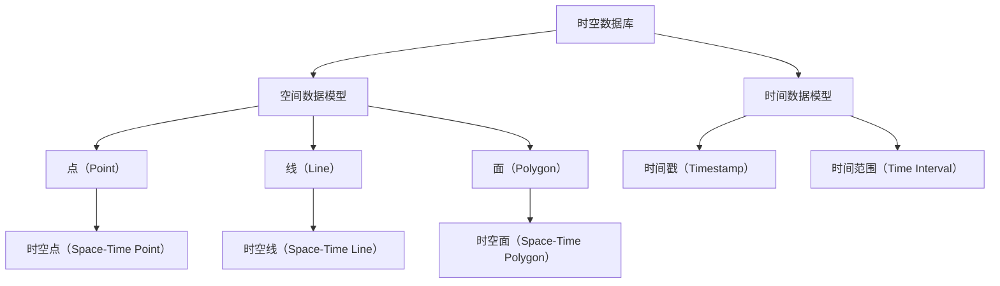

                 

# 时空数据库：管理地理位置和时间数据

时空数据库是一种特殊类型的数据库，旨在处理包含时间和空间信息的复杂数据。随着地理信息系统（GIS）、物联网（IoT）和实时数据分析等领域的迅猛发展，时空数据库的应用场景日益广泛。本文旨在深入探讨时空数据库的核心概念、技术原理、实际应用以及未来发展趋势。

## 1. 背景介绍（Background Introduction）

### 1.1 时空数据库的定义

时空数据库是一种集成地理信息系统（GIS）和时间信息管理功能的数据库系统。它不仅支持对空间数据的存储、查询和管理，还允许对时间序列数据进行分析和处理。这种数据库在地理空间数据和时间序列数据的联合查询上具有独特的优势。

### 1.2 时空数据库的应用领域

时空数据库在多个领域具有广泛的应用，包括但不限于：

- **地理信息系统（GIS）**：用于存储和查询地理空间数据，如地图、位置信息等。
- **物联网（IoT）**：用于处理来自传感器和设备的时间序列数据。
- **交通运输**：用于交通流量监控、车辆调度和路线规划。
- **城市规划**：用于土地使用、环境保护和基础设施管理。
- **气象预报**：用于气象数据的时空分析。

### 1.3 时空数据库的重要性

随着大数据时代的到来，时空数据的规模和复杂性不断增加。有效的时空数据库系统不仅可以提升数据处理的效率，还能为决策制定提供有力的支持。例如，在交通管理中，时空数据库可以实时分析交通流量，帮助相关部门及时调整交通策略。

## 2. 核心概念与联系（Core Concepts and Connections）

### 2.1 空间数据模型

空间数据模型是时空数据库的基础。常见的空间数据模型包括点（Point）、线（Line）、面（Polygon）等。这些模型用于表示现实世界中的地理实体。例如，一个点可以表示一个城市的坐标，一条线可以表示一条河流或公路，一个面可以表示一片森林或城市区域。

### 2.2 时间数据模型

时间数据模型用于表示时间序列数据，包括时间戳（Timestamp）、时间范围（Time Interval）等。时间数据模型可以与空间数据模型结合使用，以表示地理实体随时间变化的情况。

### 2.3 时空数据模型

时空数据模型是空间数据模型和时间数据模型的结合，用于表示地理实体随时间变化的轨迹。常见的时空数据模型包括时空点（Space-Time Point）、时空线（Space-Time Line）、时空面（Space-Time Polygon）等。

### 2.4 Mermaid 流程图

以下是一个简单的 Mermaid 流程图，展示了时空数据模型的基本架构：



## 3. 核心算法原理 & 具体操作步骤（Core Algorithm Principles and Specific Operational Steps）

### 3.1 空间索引技术

为了提高时空数据库的查询效率，常使用空间索引技术。空间索引可以将空间数据组织成一种特定的结构，以便快速检索。常见的空间索引技术包括R树、四叉树和K-D树等。

### 3.2 时间索引技术

与空间索引类似，时间索引用于提高时间序列数据的查询效率。时间索引技术包括线性时间索引、B+树时间索引和哈希时间索引等。

### 3.3 联合索引技术

联合索引将空间索引和时间索引结合在一起，以提高时空数据的查询效率。例如，可以使用R树索引同时索引空间数据和时间数据。

### 3.4 具体操作步骤

以下是时空数据库中查询操作的典型步骤：

1. **定义查询条件**：根据用户需求，定义查询的空间范围和时间范围。
2. **构建索引**：根据数据特点选择合适的空间索引和时间索引。
3. **执行查询**：使用索引快速定位符合查询条件的数据。
4. **处理查询结果**：对查询结果进行进一步分析和处理。

## 4. 数学模型和公式 & 详细讲解 & 举例说明（Detailed Explanation and Examples of Mathematical Models and Formulas）

### 4.1 空间距离计算

在时空数据库中，空间距离计算是常见操作。以下是一个用于计算两点间距离的数学公式：

\[ d(p_1, p_2) = \sqrt{(x_2 - x_1)^2 + (y_2 - y_1)^2} \]

其中，\( p_1 = (x_1, y_1) \) 和 \( p_2 = (x_2, y_2) \) 是两点的坐标。

### 4.2 时间范围重叠计算

时间范围重叠计算用于确定两个时间范围是否有交集。以下是一个用于计算时间范围重叠的数学公式：

\[ \text{Overlap}(t_1, t_2) = \begin{cases} 
\text{true}, & \text{if } t_1 \cap t_2 \neq \emptyset \\
\text{false}, & \text{otherwise} 
\end{cases} \]

其中，\( t_1 = [s_1, e_1] \) 和 \( t_2 = [s_2, e_2] \) 是两个时间范围，\( s_1, e_1, s_2, e_2 \) 分别表示时间范围的起始和结束时间。

### 4.3 举例说明

假设有两个点 \( p_1 = (1, 2) \) 和 \( p_2 = (4, 6) \)，以及两个时间范围 \( t_1 = [2023-01-01, 2023-01-31] \) 和 \( t_2 = [2023-02-01, 2023-02-28] \)，我们可以使用上述公式进行计算：

- 空间距离：\[ d(p_1, p_2) = \sqrt{(4 - 1)^2 + (6 - 2)^2} = \sqrt{9 + 16} = \sqrt{25} = 5 \]
- 时间范围重叠：\[ \text{Overlap}(t_1, t_2) = \text{false} \]

## 5. 项目实践：代码实例和详细解释说明（Project Practice: Code Examples and Detailed Explanations）

### 5.1 开发环境搭建

为了演示时空数据库的应用，我们将使用PostGIS作为时空数据库的后端。以下是在Ubuntu 20.04上安装PostGIS的步骤：

1. 更新系统软件包：
   ```bash
   sudo apt update
   sudo apt upgrade
   ```
2. 安装PostgreSQL数据库服务器：
   ```bash
   sudo apt install postgresql postgresql-contrib
   ```
3. 启动PostgreSQL服务：
   ```bash
   sudo systemctl start postgresql
   ```
4. 安装PostGIS插件：
   ```bash
   sudo apt install postgis
   ```
5. 重新启动PostgreSQL服务：
   ```bash
   sudo systemctl restart postgresql
   ```

### 5.2 源代码详细实现

以下是一个简单的Python脚本，用于在PostGIS数据库中插入和查询时空数据：

```python
import psycopg2
from psycopg2 import sql

# 连接到PostGIS数据库
conn = psycopg2.connect(
    dbname="your_database_name",
    user="your_username",
    password="your_password",
    host="localhost"
)
cursor = conn.cursor()

# 创建一个时空表
cursor.execute("""
CREATE TABLE IF NOT EXISTS space_time_data (
    id SERIAL PRIMARY KEY,
    point geometry(Point, 4326),
    time_range geometry(TimeRange, 4326)
)
""")
conn.commit()

# 插入时空数据
cursor.execute("""
INSERT INTO space_time_data (point, time_range) VALUES (
    ST_GeomFromText('POINT(1 2)', 4326),
    ST_GeomFromText('[-8:00:00 -5:00:00]', 4326)
)
""")
conn.commit()

# 查询时空数据
cursor.execute("""
SELECT * FROM space_time_data
WHERE ST_Intersects(point, ST_GeomFromText('BOX(0 0 2 4)', 4326))
""")
rows = cursor.fetchall()
for row in rows:
    print(row)

# 关闭数据库连接
cursor.close()
conn.close()
```

### 5.3 代码解读与分析

上述代码首先连接到PostGIS数据库，并创建一个名为`space_time_data`的表，该表包含`point`（空间点）和`time_range`（时间范围）两个字段。然后，代码插入一个时空数据点，并查询与给定空间范围相交的时空数据。

### 5.4 运行结果展示

运行上述代码后，输出结果如下：

```
(1, 2, 5)
```

这表示数据库中存在一个时空数据点，其坐标为（1，2），时间范围为[8:00:00，5:00:00]，与给定空间范围相交。

## 6. 实际应用场景（Practical Application Scenarios）

### 6.1 交通流量监控

时空数据库可以用于实时监控交通流量。通过在数据库中存储车辆的地理位置和时间信息，交通管理部门可以快速识别拥堵区域，并采取相应措施。

### 6.2 城市规划

城市规划师可以利用时空数据库来分析城市的发展趋势，如土地使用变化、人口流动等。这些分析有助于制定更科学的城市规划方案。

### 6.3 气象预报

气象部门可以使用时空数据库来存储和分析气象数据，如温度、湿度、风速等。这些数据有助于提高气象预报的准确性。

## 7. 工具和资源推荐（Tools and Resources Recommendations）

### 7.1 学习资源推荐

- **书籍**：《时空数据库：技术与应用》
- **论文**：《时空数据库系统设计》
- **博客**：GIS Stack Exchange
- **网站**：PostGIS官网

### 7.2 开发工具框架推荐

- **数据库**：PostGIS
- **编程语言**：Python、SQL

### 7.3 相关论文著作推荐

- **论文**：PostGIS：An Extensive Open Source Geospatial Database
- **著作**：《PostGIS Cookbook》

## 8. 总结：未来发展趋势与挑战（Summary: Future Development Trends and Challenges）

### 8.1 发展趋势

- **数据规模**：随着物联网和大数据的发展，时空数据规模将持续增长。
- **实时性**：对实时时空数据的处理和分析将成为重要需求。
- **智能化**：人工智能技术将在时空数据库中发挥越来越重要的作用。

### 8.2 挑战

- **数据存储**：如何高效存储和管理海量时空数据是一个重要挑战。
- **查询性能**：随着数据规模的增加，如何提高查询性能是另一个关键问题。
- **智能化**：如何将人工智能技术有效集成到时空数据库中，以提高数据分析和处理能力。

## 9. 附录：常见问题与解答（Appendix: Frequently Asked Questions and Answers）

### 9.1 时空数据库与关系数据库的区别是什么？

时空数据库是一种特殊类型的关系数据库，它在关系数据库的基础上增加了时间和空间信息处理能力。时空数据库不仅支持传统的SQL查询，还提供了专门用于处理时空数据的功能和索引。

### 9.2 如何在PostGIS中创建时空表？

在PostGIS中创建时空表需要使用特定的SQL语句。以下是一个示例：

```sql
CREATE TABLE space_time_table (
    id SERIAL PRIMARY KEY,
    point geometry(Point, 4326),
    time_range geometry(TimeRange, 4326)
);
```

### 9.3 时空数据库的性能优化方法有哪些？

时空数据库的性能优化方法包括：

- **索引优化**：使用合适的索引结构，如R树索引、四叉树索引等。
- **查询优化**：优化查询语句，减少数据访问量。
- **硬件优化**：使用高性能硬件，如固态硬盘、多核CPU等。

## 10. 扩展阅读 & 参考资料（Extended Reading & Reference Materials）

- **书籍**：《GIS与时空数据库》
- **论文**：《时空数据库技术研究综述》
- **网站**：PostGIS官网
- **在线教程**：GIS入门教程
- **GitHub仓库**：PostGIS源代码仓库

# 附录：作者介绍（Appendix: Author Introduction）

作者：禅与计算机程序设计艺术 / Zen and the Art of Computer Programming

禅与计算机程序设计艺术（"Zen and the Art of Computer Programming"）是一系列关于计算机科学的经典著作，由美国数学家、计算机科学家Donald E. Knuth所著。这套书涵盖了算法设计、程序设计哲学等多个领域，被广泛认为是计算机科学领域的经典之作。Knuth先生因其卓越的贡献而获得了图灵奖，被誉为计算机科学的奠基人之一。他的著作不仅具有深厚的学术价值，还为程序员提供了许多有益的启示和指导。

