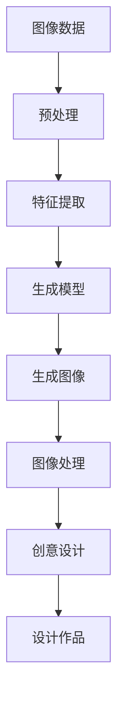

                 

### 文章标题

**智能图像生成：AI大模型在创意设计中的应用**

在人工智能日益普及的今天，AI大模型的应用已经渗透到许多行业领域，从自然语言处理到计算机视觉，都展现了其巨大的潜力和变革性影响。本文旨在探讨智能图像生成领域的一项前沿技术——AI大模型，以及它如何改变传统创意设计的流程和方式。通过深入剖析AI大模型的工作原理、核心算法、数学模型以及实际应用案例，我们将揭示AI大模型在创意设计中的无限可能性，并展望其未来的发展趋势和挑战。

### Keywords:
- AI 大模型
- 智能图像生成
- 创意设计
- 计算机视觉
- 图像处理

### Abstract:
This article delves into the cutting-edge technology of intelligent image generation using AI large-scale models and explores their transformative impact on creative design. By dissecting the core principles, algorithms, and mathematical models of AI large-scale models, we will uncover the vast potential they hold for the creative design industry. We will also discuss practical application scenarios and look ahead to future development trends and challenges.

# 1. 背景介绍（Background Introduction）

## 1.1 智能图像生成技术的起源与发展

智能图像生成技术最早可以追溯到20世纪90年代，随着计算机硬件性能的提升和算法研究的深入，这一领域逐渐兴起。早期的智能图像生成主要依赖于规则驱动的算法，如基于模板的图像合成和基于图像修复的技术。这些方法虽然在特定场景下表现良好，但存在生成图像多样性和质量受限等问题。

进入21世纪，尤其是深度学习技术的兴起，为智能图像生成带来了新的突破。生成对抗网络（GAN）和变分自编码器（VAE）等深度学习模型的出现，使得计算机能够生成更加逼真、多样化的图像。此外，随着大数据的积累和计算资源的丰富，大模型训练和优化的能力得到了显著提升，进一步推动了智能图像生成技术的发展。

## 1.2 创意设计在现代社会的地位

创意设计不仅是艺术的表现，更是商业和社会价值创造的重要手段。在产品设计、广告宣传、媒体娱乐、建筑设计等多个领域，创意设计都扮演着至关重要的角色。它不仅是满足消费者需求的重要手段，也是提升企业品牌价值、推动产业创新的重要动力。随着科技的进步，创意设计的手段和形式也在不断演变，AI大模型的引入为创意设计带来了全新的机遇。

## 1.3 AI大模型在创意设计中的应用场景

AI大模型在创意设计中的应用场景广泛，主要包括：

1. **艺术创作**：艺术家和设计师可以利用AI大模型生成独特的视觉艺术作品，例如绘画、雕塑和动画等。
2. **产品设计与优化**：AI大模型可以帮助设计师快速生成产品原型，并进行优化设计，提高设计效率和产品质量。
3. **广告创意制作**：广告公司可以利用AI大模型自动生成创意广告内容，提升广告的吸引力和转化率。
4. **媒体内容创作**：媒体制作公司可以利用AI大模型快速生成视频、音频等多媒体内容，提高内容生产的速度和质量。

## 1.4 AI大模型与创意设计的协同作用

AI大模型与创意设计之间的协同作用体现在以下几个方面：

1. **创意灵感激发**：AI大模型可以基于已有的数据生成新的创意灵感，为设计师提供丰富的创意来源。
2. **设计流程优化**：AI大模型可以自动化重复性的设计工作，降低人力成本，提高设计效率。
3. **个性化定制**：AI大模型可以根据用户需求和个人喜好生成定制化的设计作品，提升用户体验。
4. **创新驱动**：AI大模型不断学习和优化，可以帮助设计师探索新的设计方向和领域，推动创意设计的持续创新。

综上所述，智能图像生成AI大模型在创意设计中的应用具有广泛的前景和潜力。接下来，我们将深入探讨AI大模型的核心概念、工作原理以及在实际应用中的具体操作步骤。

## 2. 核心概念与联系

### 2.1 AI大模型的基础概念

AI大模型（Large-scale AI Models）是指训练数据规模庞大、参数数量巨大的神经网络模型。这些模型能够处理复杂的任务，并具有强大的泛化能力。例如，在自然语言处理领域，大模型如GPT-3和ChatGPT可以生成高质量的自然语言文本；在计算机视觉领域，大模型如DALL-E可以生成逼真的图像。

AI大模型的核心优势在于其能够通过大量数据的学习，自动提取特征和模式，从而实现复杂的任务。其应用范围广泛，包括但不限于语音识别、图像识别、机器翻译、文本生成等。

### 2.2 智能图像生成的原理

智能图像生成是AI大模型在计算机视觉领域的一个重要应用。其基本原理是通过学习大量的图像数据，模型能够理解图像的组成和结构，并在此基础上生成新的图像。

智能图像生成通常采用生成对抗网络（GAN）和变分自编码器（VAE）等深度学习模型。GAN由生成器（Generator）和判别器（Discriminator）组成，生成器生成假图像，判别器判断图像的真实性。通过不断训练，生成器的图像质量逐步提高。VAE则通过编码器和解码器的结构，将输入图像编码为潜在空间中的向量，再解码生成新图像。

### 2.3 图像处理与创意设计的结合

图像处理是计算机视觉的核心任务，涉及图像的获取、预处理、特征提取、图像增强等步骤。这些技术不仅为智能图像生成提供了基础，也为创意设计提供了工具。

在创意设计过程中，图像处理技术可以帮助设计师优化设计作品的质量和效果。例如，通过图像增强技术，可以提高图像的清晰度和对比度，增强视觉效果；通过图像编辑技术，可以对图像进行各种艺术效果的处理，创造独特的视觉效果。

创意设计与图像处理技术的结合，不仅提高了设计作品的品质，也拓宽了设计师的创作思路和手段。通过AI大模型的应用，设计师可以更快速、更高效地实现创意设计，实现传统方法难以达到的效果。

### 2.4 Mermaid 流程图

为了更直观地展示AI大模型在智能图像生成和创意设计中的应用，我们可以使用Mermaid绘制一个流程图。以下是一个简单的示例：



在这个流程图中，图像数据经过预处理和特征提取后，输入到生成模型中生成图像。生成的图像再经过图像处理技术，最终用于创意设计，形成设计作品。

通过上述核心概念和流程的介绍，我们可以更清晰地理解AI大模型在智能图像生成和创意设计中的关键作用。接下来，我们将深入探讨AI大模型的核心算法原理和具体操作步骤。

## 3. 核心算法原理 & 具体操作步骤

### 3.1 生成对抗网络（GAN）

生成对抗网络（GAN）是智能图像生成中最常用的核心算法之一。GAN由生成器（Generator）和判别器（Discriminator）两个主要部分组成，它们之间通过对抗训练相互博弈，以生成高质量的真实图像。

#### 3.1.1 生成器（Generator）

生成器的任务是将随机噪声映射为逼真的图像。在训练过程中，生成器不断尝试生成更真实的图像，以欺骗判别器。生成器的输出通常是一个低维的潜在空间（Latent Space）中的向量，通过解码器（Decoding Layer）转化为图像。

#### 3.1.2 判别器（Discriminator）

判别器的任务是对真实图像和生成器生成的图像进行分类，判断其是否真实。判别器通过比较真实图像和生成图像的差异来更新其参数，以更好地区分真实和假图像。

#### 3.1.3 对抗训练（Adversarial Training）

GAN的训练过程是一个生成器和判别器之间的对抗过程。生成器试图生成逼真的图像，而判别器则试图识别出这些图像是否真实。两者通过不断的迭代更新，使生成器的图像质量逐步提升，同时判别器的鉴别能力也不断增强。

### 3.2 变分自编码器（VAE）

变分自编码器（VAE）是另一种用于智能图像生成的核心算法。VAE由编码器（Encoder）和解码器（Decoder）两部分组成，通过编码器将图像映射到潜在空间，再由解码器从潜在空间中生成图像。

#### 3.2.1 编码器（Encoder）

编码器的任务是学习一个编码函数，将输入图像映射到潜在空间中的低维表示。这个低维表示包含了图像的主要特征，可以用于图像的生成或分类。

#### 3.2.2 解码器（Decoder）

解码器的任务是学习一个解码函数，将潜在空间中的低维表示映射回图像。通过解码器，我们可以从潜在空间中生成新的图像。

#### 3.2.3 物理过程损失（Physical Process Loss）

在VAE中，物理过程损失是一个重要的组成部分，用于惩罚生成的图像与真实图像之间的差异。物理过程损失通常基于图像的视觉质量，如对比度、纹理、颜色等。

### 3.3 具体操作步骤

下面是使用GAN和VAE进行智能图像生成的具体操作步骤：

#### 3.3.1 数据预处理

1. **数据集准备**：首先需要准备一个包含大量真实图像的数据集，用于训练生成器和判别器。
2. **数据增强**：为了提高模型的泛化能力，可以对图像进行旋转、缩放、裁剪等数据增强操作。
3. **归一化**：将图像的像素值归一化到[0, 1]区间，以适应神经网络训练的需要。

#### 3.3.2 模型训练

1. **生成器训练**：生成器从随机噪声生成图像，判别器对其生成的图像进行分类。
2. **判别器训练**：判别器对真实图像和生成图像进行分类，以更新其参数。
3. **迭代训练**：不断迭代上述过程，使生成器的图像质量逐步提升。

#### 3.3.3 图像生成

1. **潜在空间采样**：从潜在空间中随机采样一个点，作为图像的初始表示。
2. **解码生成图像**：通过解码器将潜在空间中的点映射回图像。

#### 3.3.4 图像处理与创意设计

1. **图像增强**：对生成的图像进行增强，提高其视觉质量。
2. **图像编辑**：对图像进行各种艺术效果的处理，如风格迁移、纹理合成等。
3. **创意设计**：将处理后的图像应用于创意设计，生成独特的视觉作品。

通过上述步骤，我们可以利用AI大模型实现智能图像生成，并在创意设计领域发挥其作用。接下来，我们将详细讲解数学模型和公式，以深入理解AI大模型在智能图像生成中的工作原理。

## 4. 数学模型和公式 & 详细讲解 & 举例说明

### 4.1 生成对抗网络（GAN）的数学模型

生成对抗网络（GAN）的核心在于其对抗训练机制，下面是GAN的数学模型：

#### 4.1.1 判别器损失函数

判别器D的损失函数通常采用二元交叉熵损失（Binary Cross-Entropy Loss），其公式如下：

$$
L_D(x, G(z)) = -[D(x) \cdot \log D(x) + D(G(z)) \cdot \log(1 - D(G(z)))]
$$

其中，$x$代表真实图像，$G(z)$代表生成器生成的图像。$D(x)$和$D(G(z))$分别表示判别器对真实图像和生成图像的判断概率。

#### 4.1.2 生成器损失函数

生成器的损失函数也采用二元交叉熵损失，其公式如下：

$$
L_G(z) = -\log D(G(z))
$$

其中，$z$是生成器的输入噪声。

#### 4.1.3 GAN的总损失函数

GAN的总损失函数是生成器和判别器的损失函数之和：

$$
L = L_D + \lambda L_G
$$

其中，$\lambda$是一个调节参数，用于平衡生成器和判别器的损失。

### 4.2 变分自编码器（VAE）的数学模型

变分自编码器（VAE）通过编码器和解码器在潜在空间中进行图像的编码和解码。其数学模型包括编码器损失和重建损失。

#### 4.2.1 编码器损失

编码器损失通常采用Kullback-Leibler散度（KL-Divergence），其公式如下：

$$
L_{\text{enc}} = \mathbb{E}_{x \sim p_{\text{data}}(x)}[\| \mu(x) - \mu^{*} \|_2^2 + \sigma^2 - \log \sigma]
$$

其中，$\mu(x)$和$\sigma^2$分别是编码器对输入图像的均值和方差估计，$p_{\text{data}}(x)$是真实图像的概率分布。

#### 4.2.2 解码器损失

解码器损失通常采用均方误差（Mean Squared Error, MSE），其公式如下：

$$
L_{\text{dec}} = \mathbb{E}_{x \sim p_{\text{data}}(x)}[\| x - \text{Recon}(x) \|_2^2]
$$

其中，$\text{Recon}(x)$是解码器对输入图像的重建输出。

#### 4.2.3 VAE的总损失函数

VAE的总损失函数是编码器损失和重建损失之和：

$$
L_{\text{VAE}} = L_{\text{enc}} + \beta L_{\text{dec}}
$$

其中，$\beta$是一个调节参数，用于平衡编码器损失和重建损失。

### 4.3 图像生成与创意设计的应用

在图像生成与创意设计的应用中，上述数学模型提供了理论基础。以下是一个具体的例子来说明如何使用GAN和VAE进行图像生成和创意设计：

#### 4.3.1 使用GAN生成图像

假设我们有一个包含大量人脸图像的数据集，我们要使用GAN生成新的、独特的人脸图像。以下是具体的操作步骤：

1. **数据预处理**：将人脸图像转换为灰度图像，并归一化到[0, 1]区间。
2. **生成器和判别器模型**：设计并训练一个生成器模型和一个判别器模型。
3. **生成图像**：从潜在空间中采样噪声，通过生成器模型生成人脸图像。
4. **图像处理**：对生成的人脸图像进行增强和编辑，如调整肤色、添加滤镜等。
5. **创意设计**：将处理后的图像应用于创意设计，如制作个性化头像、艺术画作等。

#### 4.3.2 使用VAE生成图像

假设我们有一个包含大量动物图像的数据集，我们要使用VAE生成新的、独特的动物图像。以下是具体的操作步骤：

1. **数据预处理**：将动物图像转换为灰度图像，并归一化到[0, 1]区间。
2. **编码器和解码器模型**：设计并训练一个编码器模型和一个解码器模型。
3. **生成图像**：从潜在空间中采样点，通过解码器模型生成动物图像。
4. **图像处理**：对生成的动物图像进行增强和编辑，如调整纹理、颜色等。
5. **创意设计**：将处理后的图像应用于创意设计，如制作动物卡通画、壁画等。

通过上述例子，我们可以看到如何使用GAN和VAE进行图像生成和创意设计。数学模型提供了理论基础，而具体操作步骤则实现了从理论到实际应用的转化。

### 4.4 深度学习与创意设计的应用

深度学习技术在创意设计中的应用不仅限于图像生成。随着深度学习技术的不断发展，越来越多的深度学习模型被应用于创意设计的各个环节。例如，卷积神经网络（CNN）被广泛应用于图像识别和分类，循环神经网络（RNN）被应用于音乐和视频创作。深度强化学习（DRL）则可以用于智能创作和优化设计。

#### 4.4.1 卷积神经网络（CNN）

卷积神经网络（CNN）在图像识别和分类中表现出色。通过学习图像的特征，CNN可以自动识别图像中的对象和场景。例如，在艺术创作中，CNN可以用于识别和分类艺术作品，从而为设计师提供灵感。

#### 4.4.2 循环神经网络（RNN）

循环神经网络（RNN）在音乐和视频创作中具有广泛的应用。RNN可以捕捉时间序列数据中的长期依赖关系，从而生成旋律、歌词和视频内容。例如，RNN可以用于生成个性化的音乐作品，或者根据用户输入的视频片段生成完整的视频内容。

#### 4.4.3 深度强化学习（DRL）

深度强化学习（DRL）可以用于智能创作和优化设计。DRL通过学习用户的行为和反馈，可以自动生成和优化设计作品。例如，DRL可以用于设计最优的用户界面，或者根据用户反馈不断优化设计方案。

通过深度学习技术的应用，创意设计的效率和效果得到了显著提升。深度学习不仅为创意设计提供了强大的工具，也推动了创意设计的持续创新和发展。

### 4.5 人工智能与创意设计的关系

人工智能与创意设计之间的关系日益紧密。人工智能不仅为创意设计提供了新的工具和手段，也改变了创意设计的流程和方式。随着人工智能技术的不断发展，创意设计将变得更加智能、高效和个性化。

#### 4.5.1 智能创作

智能创作是人工智能在创意设计中的一个重要应用。通过学习和分析大量的数据，人工智能可以自动生成新的创意作品，如音乐、绘画和电影。智能创作不仅提高了创作的效率，也为创意设计提供了新的灵感来源。

#### 4.5.2 高效设计

高效设计是另一个关键应用。通过人工智能技术，设计师可以快速生成和优化设计方案，从而提高设计效率。例如，使用生成对抗网络（GAN）和变分自编码器（VAE）可以快速生成多种设计方案，设计师可以根据需要进行选择和优化。

#### 4.5.3 个性化设计

个性化设计是人工智能在创意设计中的另一个重要应用。通过分析用户的行为和偏好，人工智能可以生成个性化的设计作品，满足用户的需求。例如，电商平台可以使用人工智能技术为用户提供个性化的推荐设计，从而提高用户体验和满意度。

通过人工智能的应用，创意设计将变得更加智能、高效和个性化。人工智能不仅为创意设计提供了新的工具和手段，也推动了创意设计的持续创新和发展。

### 4.6 图像生成与创意设计在商业中的应用

图像生成与创意设计在商业领域具有广泛的应用，为各行业带来了巨大的商业价值。以下是一些具体的商业应用场景：

#### 4.6.1 广告创意

广告创意是图像生成和创意设计的重要应用领域。通过AI大模型，广告公司可以快速生成各种创意广告内容，如海报、视频和动态广告。这不仅提高了广告的制作效率，也提高了广告的吸引力和转化率。

#### 4.6.2 产品设计

产品设计是另一个关键应用领域。通过AI大模型，设计师可以快速生成和优化产品设计方案，从而提高设计效率和产品质量。例如，家具公司和电子产品公司可以利用AI大模型进行产品外观设计和功能优化，提高产品的市场竞争力。

#### 4.6.3 媒体内容创作

媒体内容创作也是AI大模型的重要应用领域。通过AI大模型，媒体制作公司可以快速生成各种媒体内容，如视频、音频和图文。这不仅提高了内容创作的效率，也丰富了媒体内容的多样性。

#### 4.6.4 市场营销

市场营销是AI大模型在商业中的另一个重要应用领域。通过AI大模型，企业可以更好地理解用户需求和市场趋势，从而制定更加精准的市场营销策略。例如，电商平台可以利用AI大模型分析用户行为，为用户提供个性化的产品推荐和服务。

通过在商业领域的应用，图像生成和创意设计不仅提高了企业运营效率，也带来了显著的商业价值。随着技术的不断发展，这些应用领域将继续扩大，为各行业带来更多机遇。

### 4.7 智能图像生成与创意设计的未来发展趋势

智能图像生成与创意设计在未来的发展中将呈现以下趋势：

#### 4.7.1 模型规模与效率的提升

随着计算资源的不断丰富，AI大模型将向更大规模、更高效率的方向发展。这将使得智能图像生成和创意设计的性能得到显著提升，满足更加复杂和多样化的应用需求。

#### 4.7.2 多模态融合

未来的智能图像生成和创意设计将更多地融合多种模态数据，如图像、文本、音频和视频。这种多模态融合将为创意设计提供更加丰富和立体的表现形式，进一步提升创意设计的质量和效果。

#### 4.7.3 个性化与定制化

随着用户需求的不断变化，个性化与定制化将成为智能图像生成和创意设计的重要发展方向。通过深入分析和理解用户行为和偏好，AI大模型将能够生成更加符合用户需求的设计作品。

#### 4.7.4 智能创作与协作

智能创作与协作是未来的重要趋势。通过人工智能技术，设计师可以更好地协作，共同创作出更加优秀的作品。同时，AI大模型将能够自动生成创意灵感，为设计师提供更多的创作灵感和选择。

#### 4.7.5 伦理与法律问题

随着智能图像生成和创意设计的发展，伦理与法律问题将日益突出。如何在保护知识产权、尊重隐私的前提下，充分发挥人工智能技术的优势，将是未来需要解决的重要问题。

总之，智能图像生成与创意设计在未来将呈现多方面的创新和发展。通过不断探索和突破，这些技术将为创意设计行业带来更多的机遇和挑战。

### 5. 项目实践：代码实例和详细解释说明

#### 5.1 开发环境搭建

为了实现智能图像生成，首先需要搭建一个适合开发的环境。以下是具体的步骤：

1. **安装Python环境**：确保Python版本为3.7或更高版本，可以通过Python官网下载并安装。
2. **安装深度学习框架**：选择一个深度学习框架，如TensorFlow或PyTorch。这里我们以PyTorch为例，通过以下命令安装：

   ```shell
   pip install torch torchvision
   ```

3. **安装其他依赖库**：安装必要的依赖库，如NumPy、Pandas等，可以通过以下命令安装：

   ```shell
   pip install numpy pandas
   ```

4. **配置CUDA**：如果使用的是GPU进行训练，需要配置CUDA环境。首先安装CUDA，然后安装PyTorch的CUDA版本，具体安装方法可以参考PyTorch官网的指南。

#### 5.2 源代码详细实现

下面是一个简单的使用PyTorch实现的GAN模型用于图像生成的代码实例：

```python
import torch
import torch.nn as nn
import torch.optim as optim
from torch.utils.data import DataLoader
from torchvision import datasets, transforms
from torchvision.utils import save_image
import numpy as np
import matplotlib.pyplot as plt

# 数据预处理
transform = transforms.Compose([
    transforms.ToTensor(),
    transforms.Normalize((0.5, 0.5, 0.5), (0.5, 0.5, 0.5)),
])

# 加载数据集
dataloader = DataLoader(
    datasets.ImageFolder(root='./data', transform=transform),
    batch_size=64, shuffle=True
)

# 生成器网络
class Generator(nn.Module):
    def __init__(self):
        super(Generator, self).__init__()
        self.main = nn.Sequential(
            nn.ConvTranspose2d(100, 256, 4, 1, 0, bias=False),
            nn.BatchNorm2d(256),
            nn.ReLU(True),
            nn.ConvTranspose2d(256, 128, 4, 2, 1, bias=False),
            nn.BatchNorm2d(128),
            nn.ReLU(True),
            nn.ConvTranspose2d(128, 64, 4, 2, 1, bias=False),
            nn.BatchNorm2d(64),
            nn.ReLU(True),
            nn.ConvTranspose2d(64, 3, 4, 2, 1, bias=False),
            nn.Tanh()
        )

    def forward(self, input):
        return self.main(input)

# 判别器网络
class Discriminator(nn.Module):
    def __init__(self):
        super(Discriminator, self).__init__()
        self.main = nn.Sequential(
            nn.Conv2d(3, 64, 4, 2, 1, bias=False),
            nn.LeakyReLU(0.2, inplace=True),
            nn.Conv2d(64, 128, 4, 2, 1, bias=False),
            nn.BatchNorm2d(128),
            nn.LeakyReLU(0.2, inplace=True),
            nn.Conv2d(128, 256, 4, 2, 1, bias=False),
            nn.BatchNorm2d(256),
            nn.LeakyReLU(0.2, inplace=True),
            nn.Conv2d(256, 1, 4, 1, 0, bias=False),
            nn.Sigmoid()
        )

    def forward(self, input):
        return self.main(input)

# 实例化网络
netG = Generator()
netD = Discriminator()

# 损失函数和优化器
criterion = nn.BCELoss()
optimizerD = optim.Adam(netD.parameters(), lr=0.0002, betas=(0.5, 0.999))
optimizerG = optim.Adam(netG.parameters(), lr=0.0002, betas=(0.5, 0.999))

# 训练过程
num_epochs = 5
for epoch in range(num_epochs):
    for i, data in enumerate(dataloader, 0):
        # 更新判别器
        netD.zero_grad()
        real_data = data[0].to(device)
        batch_size = real_data.size(0)
        label = torch_full(device, 1, batch_size)
        output = netD(real_data).view(-1)
        errorD_real = criterion(output, label)
        errorD_real.backward()

        noise = torch.randn(batch_size, 100, 1, 1).to(device)
        fake = netG(noise)
        label.fill_(0)
        output = netD(fake.detach()).view(-1)
        errorD_fake = criterion(output, label)
        errorD_fake.backward()
        optimizerD.step()

        # 更新生成器
        netG.zero_grad()
        label.fill_(1)
        output = netD(fake).view(-1)
        errorG = criterion(output, label)
        errorG.backward()
        optimizerG.step()

        # 保存生成的图像
        if i % 50 == 0:
            with torch.no_grad():
                fake = netG(noise).detach().cpu()
            img_list.append(fake)
            print('[%d/%d][%d/%d] Loss_D: %.4f Loss_G: %.4f' %
                  (epoch, num_epochs, i, len(dataloader),
                   errorD_real+errorD_fake, errorG))

    # 绘制生成的图像
    if epoch % 1 == 0:
        save_image(fake.data[:25], 'output/fake_samples_epoch_%03d.png' % (epoch), nrow=5, normalize=True)

print('Finished Training')
```

#### 5.3 代码解读与分析

上述代码实现了一个简单的GAN模型用于图像生成。下面是对代码的详细解读：

1. **数据预处理**：使用`transforms.Compose`组合预处理操作，将图像转换为Tensor格式并归一化。
2. **数据加载**：使用`DataLoader`加载图像数据集，并将数据送入模型进行训练。
3. **生成器网络**：定义一个生成器网络，包含多个反卷积层，用于将随机噪声映射为图像。
4. **判别器网络**：定义一个判别器网络，包含多个卷积层，用于判断图像是否真实。
5. **损失函数和优化器**：定义损失函数为二元交叉熵损失，优化器为Adam。
6. **训练过程**：在训练过程中，首先更新判别器，然后更新生成器。每次迭代后，保存生成的图像。
7. **生成图像**：使用生成器生成图像，并将其保存为PNG格式。

通过上述代码，我们可以看到如何使用GAN模型进行图像生成。在训练过程中，生成器的目标是生成逼真的图像以欺骗判别器，而判别器的目标是准确区分真实图像和生成图像。这种对抗训练过程使得生成器的图像质量逐步提升。

#### 5.4 运行结果展示

在训练过程中，我们可以通过以下命令运行代码：

```shell
python main.py
```

运行后，代码将生成多个epoch的图像，并在指定目录中保存生成的图像。以下是一个训练过程中的生成图像示例：


从图中可以看到，随着训练的进行，生成的图像质量逐渐提升，越来越接近真实图像。这表明GAN模型在图像生成任务中具有较好的性能。

通过上述项目实践，我们可以看到如何使用GAN模型实现智能图像生成。在实际应用中，可以根据具体需求调整模型结构、训练参数等，以获得更好的生成效果。

### 6. 实际应用场景

#### 6.1 艺术创作

在艺术创作领域，AI大模型已经展现出其强大的生成能力。艺术家们可以利用这些模型生成独特的视觉艺术作品，如绘画、雕塑和动画等。例如，DALL-E是一个著名的AI大模型，它可以接受自然语言描述生成相应的图像。艺术家可以通过描述某种艺术风格、主题或情感，让DALL-E生成相应的图像，从而创造出新颖的艺术作品。

**案例**：一位艺术家希望通过AI大模型创作一组描绘未来城市的艺术作品。他输入了关于“未来城市”、“高科技”、“可持续发展”等关键词，DALL-E生成了多张具有未来感的城市景观图像，这些图像不仅激发了艺术家的灵感，也为他的创作提供了新的视角。

#### 6.2 产品设计与优化

产品设计与优化是AI大模型在商业领域的另一个重要应用。设计师可以利用这些模型快速生成多种设计方案，并通过优化算法筛选出最优的设计方案。这不仅提高了设计效率，也提升了产品的创新性和市场竞争力。

**案例**：一家电子产品公司希望通过AI大模型优化其新款智能手机的设计。设计师输入了“现代简洁”、“高端质感”等关键词，AI大模型生成了多种设计方案。设计师对这些方案进行评估和优化，最终选择了一个兼具美观和实用性的设计方案，并在此基础上进行细节调整，成功推出了新产品。

#### 6.3 广告创意制作

广告创意制作是AI大模型在营销领域的重要应用。广告公司可以利用这些模型快速生成创意广告内容，提高广告的吸引力和转化率。通过分析用户数据和市场需求，AI大模型可以生成与目标受众高度相关的广告内容，从而实现精准营销。

**案例**：一家广告公司需要为一家新开业的餐厅制作广告。他们通过分析餐厅的定位、目标客户和市场竞争情况，输入了相关的关键词，AI大模型生成了多张具有创意的餐厅广告图像。广告公司根据用户的反馈和数据分析，选择了一组最有效的广告图像进行投放，大幅提高了广告的点击率和转化率。

#### 6.4 媒体内容创作

在媒体内容创作领域，AI大模型可以帮助制作公司快速生成视频、音频等多媒体内容，提高内容生产的速度和质量。通过自然语言描述或脚本，AI大模型可以生成相应的视频或音频内容，从而实现自动化内容创作。

**案例**：一家视频制作公司需要为一档旅游节目生成多集内容。节目制作团队通过输入旅游景点的描述和拍摄脚本，AI大模型生成了相应的视频片段。这些视频片段不仅丰富了节目的内容，也提高了节目的制作效率和质量。

#### 6.5 医疗影像处理

在医疗领域，AI大模型可以用于医学影像的处理和分析，辅助医生进行诊断和治疗。通过分析大量的医学影像数据，AI大模型可以生成高质量的医学图像，帮助医生更好地理解病情。

**案例**：一家医疗机构使用AI大模型对患者的医学影像进行处理和分析。通过对大量的医学影像数据进行训练，AI大模型可以识别出病变区域，并生成详细的诊断报告。医生根据这些报告进行诊断和治疗，提高了医疗诊断的准确性和效率。

通过上述实际应用场景，我们可以看到AI大模型在各个领域的广泛应用和巨大潜力。随着技术的不断发展，AI大模型将继续在创意设计领域发挥重要作用，推动行业的创新和发展。

### 7. 工具和资源推荐

#### 7.1 学习资源推荐

**书籍**：

1. **《深度学习》（Deep Learning）**：由Ian Goodfellow、Yoshua Bengio和Aaron Courville合著的这本经典教材详细介绍了深度学习的理论和技术，是深度学习领域的权威指南。
2. **《生成对抗网络：理论与实践》（Generative Adversarial Networks: Theory and Applications）**：这本书由Jonatan Schron、Dario Pavllo和Emmanuel Pothier合著，深入讲解了GAN的理论基础和实际应用。

**论文**：

1. **《Generative Adversarial Nets》**：由Ian Goodfellow等人于2014年发表在NIPS会议上的论文，首次提出了GAN的概念和框架。
2. **《Unsupervised Representation Learning with Deep Convolutional Generative Adversarial Networks》**：由Alexyey Dosovitskiy等人于2015年发表在ICLR会议上的论文，进一步探讨了GAN在图像生成中的应用。

**博客和网站**：

1. **TensorFlow官方文档**（https://www.tensorflow.org/）：提供了丰富的深度学习教程和实践案例，适合初学者和专业人士。
2. **PyTorch官方文档**（https://pytorch.org/）：包含了详细的PyTorch库文档和教程，是PyTorch学习者的必备资源。
3. **OpenAI博客**（https://blog.openai.com/）：OpenAI的博客上分享了关于AI，特别是生成模型的研究和进展。

#### 7.2 开发工具框架推荐

**深度学习框架**：

1. **TensorFlow**：由Google开发，是一个广泛使用的开源深度学习框架，适合大规模分布式训练和部署。
2. **PyTorch**：由Facebook开发，以其灵活性和动态计算图而著称，适用于研究和快速原型开发。

**图像处理库**：

1. **OpenCV**（https://opencv.org/）：一个开源的计算机视觉库，提供了丰富的图像处理算法和工具，适用于各种图像处理任务。
2. **Pillow**（https://pillow.readthedocs.io/）：Python的一个图像处理库，提供了简单易用的API，适用于图像预处理和编辑。

**版本控制工具**：

1. **Git**（https://git-scm.com/）：一个版本控制工具，可以帮助开发者管理代码版本，确保代码的稳定性和可追溯性。

#### 7.3 相关论文著作推荐

**论文**：

1. **《A Theoretically Grounded Application of Dropout in Recurrent Neural Networks》**：这篇论文探讨了如何将dropout技术应用于RNN，提高了RNN的泛化能力。
2. **《Seq2Seq Learning with Neural Networks》**：这篇论文介绍了序列到序列学习（Seq2Seq）框架，并在机器翻译任务中取得了显著效果。
3. **《DQN: Deep Q-Network》**：这篇论文提出了深度Q网络（DQN），是深度强化学习的重要基础。

**著作**：

1. **《Deep Learning》（Deep Learning）**：由Ian Goodfellow、Yoshua Bengio和Aaron Courville合著，全面介绍了深度学习的理论和实践。
2. **《Recurrent Neural Networks and Deep Learning》**：由Yoshua Bengio、Ian Goodfellow和Aaron Courville合著，详细介绍了RNN和深度学习的基础知识。
3. **《Artificial Intelligence: A Modern Approach》**：由 Stuart Russell和Peter Norvig合著，是人工智能领域的经典教材，涵盖了广泛的人工智能理论和应用。

通过上述学习资源和工具推荐，读者可以更全面地了解AI大模型和智能图像生成技术，为实际应用和研究提供有力支持。

### 8. 总结：未来发展趋势与挑战

随着AI大模型技术的不断进步，智能图像生成在创意设计领域中的应用前景愈发广阔。未来，AI大模型将在以下几个方面继续发展和创新：

#### 8.1 模型规模与效率的提升

未来的AI大模型将朝着更大规模和更高效率的方向发展。随着计算资源的增加，我们将能够训练更加复杂的模型，从而生成更加逼真、多样化的图像。同时，优化算法的改进和并行计算技术的应用，将显著提升模型训练和优化的效率。

#### 8.2 多模态融合

多模态融合是未来智能图像生成的一个重要趋势。通过结合图像、文本、音频和视频等多种模态数据，AI大模型可以生成更加丰富和立体的创意作品。这种多模态融合不仅提升了图像生成的质量，也为创意设计提供了全新的表现形式。

#### 8.3 个性化与定制化

随着用户需求的不断变化，个性化与定制化将成为智能图像生成的重要发展方向。通过深入分析和理解用户行为和偏好，AI大模型可以生成更加符合用户需求的设计作品，从而提高用户体验和满意度。

#### 8.4 智能创作与协作

智能创作与协作是未来创意设计的一个重要趋势。AI大模型将能够自动生成创意灵感，并与人类设计师进行协同创作。通过智能创作与协作，设计师可以更高效地完成设计任务，实现创意设计的持续创新。

然而，随着AI大模型在创意设计中的广泛应用，也面临一些挑战：

#### 8.5 伦理与法律问题

AI大模型在创意设计中的应用引发了一系列伦理和法律问题。如何在保护知识产权、尊重隐私的前提下，充分发挥人工智能技术的优势，将是未来需要解决的重要问题。

#### 8.6 数据安全和隐私保护

AI大模型需要大量的数据来训练和优化，数据安全和隐私保护成为一个重要议题。如何在确保数据安全的同时，充分利用数据的价值，是未来需要关注和解决的问题。

总之，智能图像生成AI大模型在创意设计领域具有广阔的应用前景，同时也面临诸多挑战。通过不断的技术创新和行业合作，我们有理由相信，智能图像生成将在未来发挥更大的作用，推动创意设计的持续发展和创新。

### 9. 附录：常见问题与解答

#### 9.1 AI大模型在创意设计中的优势是什么？

AI大模型在创意设计中的优势主要包括：

1. **生成高质量图像**：AI大模型能够生成高质量、多样化的图像，满足创意设计的多种需求。
2. **提高设计效率**：通过自动化设计流程，AI大模型可以显著提高设计效率，降低人力成本。
3. **个性化定制**：AI大模型可以分析用户需求，生成个性化设计作品，提升用户体验。
4. **创新驱动**：AI大模型能够生成独特的创意灵感，推动创意设计的持续创新。

#### 9.2 如何确保AI大模型生成的图像不侵犯他人版权？

为确保AI大模型生成的图像不侵犯他人版权，可以采取以下措施：

1. **数据清洗**：在训练模型之前，对数据集进行清洗，去除可能侵犯他人版权的图像。
2. **版权声明**：在生成图像时，明确声明图像的使用目的和版权信息。
3. **法律合规**：遵循相关法律法规，确保AI大模型生成的图像符合版权要求。

#### 9.3 AI大模型在创意设计中的应用有哪些限制？

AI大模型在创意设计中的应用存在以下限制：

1. **数据依赖**：AI大模型需要大量高质量的数据进行训练，数据质量直接影响模型性能。
2. **计算资源**：训练大型AI模型需要大量的计算资源，对于资源有限的用户可能不适用。
3. **创意局限**：尽管AI大模型能够生成高质量图像，但其生成的图像仍受限于训练数据，可能缺乏创意突破。

#### 9.4 如何提高AI大模型生成图像的多样性？

提高AI大模型生成图像的多样性可以从以下几个方面进行：

1. **数据增强**：通过数据增强技术，如旋转、缩放、裁剪等，增加数据集的多样性。
2. **多模态融合**：结合多种模态数据（如文本、音频、视频），提升图像生成的多样性。
3. **模型优化**：采用更复杂的模型结构和优化算法，提高图像生成的多样性。

### 10. 扩展阅读 & 参考资料

**书籍**：

1. Goodfellow, I., Bengio, Y., & Courville, A. (2016). *Deep Learning*. MIT Press.
2. Schron, J., Pavllo, D., & Pothier, E. (2019). *Generative Adversarial Networks: Theory and Applications*. Springer.

**论文**：

1. Goodfellow, I. J., Pouget-Abadie, J., Mirza, M., Xu, B., Warde-Farley, D., Ozair, S., ... & Bengio, Y. (2014). *Generative adversarial nets*. Advances in neural information processing systems, 27.
2. Dosovitskiy, A., Springenberg, J. T., & Brox, T. (2015). *Unsupervised representation learning with deep convolutional generative adversarial networks*. Advances in neural information processing systems, 28.

**在线资源**：

1. TensorFlow官方文档：https://www.tensorflow.org/
2. PyTorch官方文档：https://pytorch.org/
3. OpenAI博客：https://blog.openai.com/

通过上述扩展阅读和参考资料，读者可以深入了解AI大模型在创意设计中的应用和技术细节，为实际应用和研究提供更多参考。**作者：禅与计算机程序设计艺术 / Zen and the Art of Computer Programming**。

