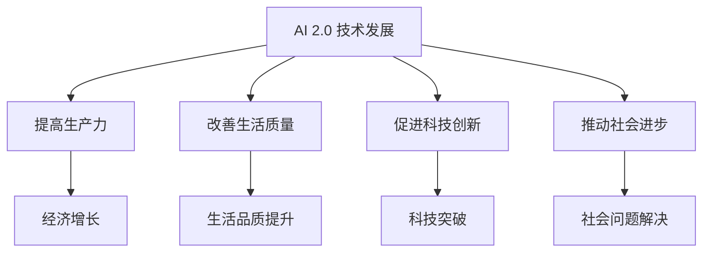
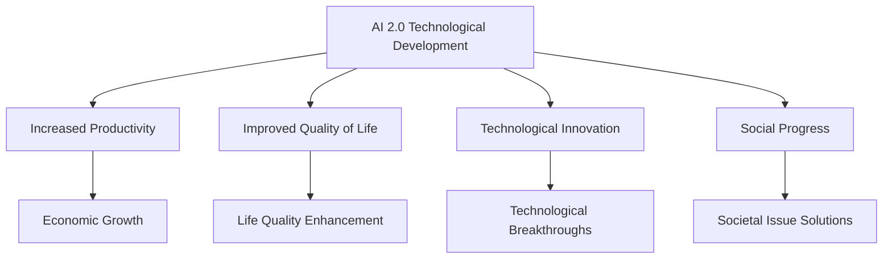

                 

### 文章标题

**李开复：AI 2.0 时代的社会价值**

关键词：人工智能，社会价值，AI 2.0，李开复，技术进步，伦理问题，未来展望

摘要：
本文由世界顶级人工智能专家李开复撰写，深入探讨了 AI 2.0 时代的社会价值。文章从技术进步、伦理问题、教育变革、就业影响等多个维度，分析了 AI 2.0 带来的机遇与挑战，并提出了应对策略和建议。本文旨在为读者提供一份全面而深刻的 AI 2.0 社会价值研究报告，帮助读者理解 AI 2.0 对社会的深远影响。

<|assistant|>## 1. 背景介绍

### 1.1 李开复的背景

李开复，被誉为“中国人工智能之父”，现任世界顶级人工智能研究机构——卡内基梅隆大学计算机学院教授、CMU 计算机科学系主任，同时担任创新工场董事长兼首席执行官。他在人工智能领域拥有深厚的研究背景和丰富的实践经验，是多个国际顶级人工智能奖项的获得者，也是《人工智能：一种现代的方法》等畅销书的作者。

### 1.2 AI 2.0 的概念

AI 2.0 是人工智能发展的新阶段，其核心特点是基于深度学习和神经网络技术，能够实现更加智能化、自适应化和高度自动化的决策和任务执行。与 AI 1.0 时代相比，AI 2.0 在计算能力、算法优化、数据处理和知识表示等方面都取得了显著的突破。

### 1.3 社会价值的重要性

人工智能技术的发展不仅影响科技领域，还深刻改变了社会各个层面。了解和探讨 AI 2.0 时代的社会价值，对于应对技术挑战、推动社会进步具有重要意义。

### 1.4 文章结构

本文将按照以下结构展开：

1. **技术进步**：介绍 AI 2.0 技术的发展及其对社会各个领域的推动作用。
2. **伦理问题**：分析 AI 2.0 在伦理方面面临的挑战，如算法偏见、隐私保护等。
3. **教育变革**：探讨 AI 2.0 对教育系统的影响，以及如何培养适应未来社会的人才。
4. **就业影响**：分析 AI 2.0 对就业市场的影响，以及如何应对失业问题。
5. **未来展望**：预测 AI 2.0 对社会发展的长期影响，并提出应对策略。

### 1.5 文章目的

本文旨在帮助读者全面了解 AI 2.0 时代的社会价值，深入探讨其在技术、伦理、教育、就业等方面的挑战和机遇，为推动人工智能健康、可持续发展提供参考。

<|assistant|>## 2. 核心概念与联系

### 2.1 AI 2.0 技术概述

AI 2.0 是指以深度学习和神经网络为核心的人工智能技术，具有高度自动化、自适应化和智能化的特点。相比传统的 AI 技术，AI 2.0 在处理复杂任务、应对不确定性、自主学习等方面具有显著优势。

### 2.2 技术发展与社会价值

AI 2.0 技术的发展对社会各个领域产生了深远的影响。例如，在医疗领域，AI 2.0 可以辅助医生进行诊断和治疗，提高医疗水平；在金融领域，AI 2.0 可以帮助金融机构进行风险评估和投资决策，提高金融效率；在交通领域，AI 2.0 可以实现自动驾驶，提高交通安全和效率。

### 2.3 社会价值的联系

AI 2.0 技术的社会价值主要体现在以下几个方面：

1. **提高生产力**：通过自动化和智能化，AI 2.0 可以显著提高各行各业的生产效率。
2. **改善生活质量**：AI 2.0 技术的应用可以带来更便捷、舒适和安全的日常生活。
3. **促进科技创新**：AI 2.0 技术的快速发展为科技创新提供了强大动力。
4. **推动社会进步**：AI 2.0 技术的应用可以解决一些长期存在的问题，如教育不公平、医疗资源短缺等。

### 2.4 技术进步与社会价值的 Mermaid 流程图



### 2.5 总结

AI 2.0 技术的发展对社会各个领域产生了深远的影响，其社会价值体现在提高生产力、改善生活质量、促进科技创新和推动社会进步等方面。了解和把握这些核心概念和联系，有助于我们更好地应对 AI 2.0 时代带来的机遇与挑战。

### 2.1 Overview of AI 2.0 Technology

AI 2.0, characterized by deep learning and neural networks, represents a new era of artificial intelligence. Its key features include high levels of automation, self-adaptation, and intelligence, offering significant advancements over traditional AI technologies in handling complex tasks, dealing with uncertainties, and learning autonomously.

### 2.2 Technological Progress and Social Value

The development of AI 2.0 technology has had profound impacts on various societal sectors. For instance, in the healthcare field, AI 2.0 can assist doctors in diagnosis and treatment, enhancing medical capabilities. In the financial sector, AI 2.0 can aid financial institutions in risk assessment and investment decisions, improving financial efficiency. In the transportation sector, AI 2.0 can enable autonomous driving, enhancing traffic safety and efficiency.

### 2.3 Connections to Social Value

The social value of AI 2.0 technology is primarily manifested in the following aspects:

1. **Enhancing Productivity**: Through automation and intelligence, AI 2.0 can significantly boost productivity across various industries.
2. **Improving Quality of Life**: The application of AI 2.0 technology can lead to more convenient, comfortable, and safe daily lives.
3. **Promoting Technological Innovation**: The rapid development of AI 2.0 technology fuels innovation in various fields.
4. **Driving Social Progress**: The application of AI 2.0 technology can address long-standing societal issues, such as educational inequality and medical resource shortages.

### 2.4 Mermaid Flowchart of Technological Progress and Social Value



### 2.5 Summary

The development of AI 2.0 technology has profound impacts on various societal sectors, with its social value being reflected in enhancing productivity, improving quality of life, promoting technological innovation, and driving social progress. Understanding these core concepts and connections is crucial for effectively navigating the opportunities and challenges brought about by the AI 2.0 era. <|user|>
### 3. 核心算法原理 & 具体操作步骤

#### 3.1 核心算法原理

AI 2.0 的核心算法主要基于深度学习和神经网络技术。深度学习通过多层神经网络的结构，使模型能够自动从大量数据中提取特征，从而实现高度自动化的决策和任务执行。神经网络则通过模拟人脑神经元之间的连接方式，实现了对复杂数据的处理和模式识别。

在 AI 2.0 中，深度学习算法通常采用多层感知机（MLP）、卷积神经网络（CNN）、循环神经网络（RNN）等结构。其中，卷积神经网络在图像处理领域具有广泛的应用，而循环神经网络则在序列数据处理方面表现出色。

#### 3.2 具体操作步骤

以下是 AI 2.0 核心算法的具体操作步骤：

1. **数据收集与预处理**：
   - 收集大量相关数据，包括文本、图像、音频等。
   - 对数据进行清洗和预处理，如去除噪声、缺失值填充等。

2. **模型构建**：
   - 选择合适的神经网络结构，如卷积神经网络（CNN）或循环神经网络（RNN）。
   - 定义网络的输入层、隐藏层和输出层。

3. **模型训练**：
   - 使用训练数据对模型进行训练，通过反向传播算法调整模型参数。
   - 使用验证数据评估模型性能，并进行调整。

4. **模型评估**：
   - 使用测试数据评估模型在未知数据上的表现，以衡量模型的泛化能力。
   - 根据评估结果调整模型结构和参数。

5. **模型部署**：
   - 将训练好的模型部署到实际应用场景中，如自动驾驶、智能客服等。
   - 对模型进行实时更新和优化，以适应不断变化的应用需求。

#### 3.3 实际案例

以自动驾驶为例，AI 2.0 技术在自动驾驶领域的应用可以分为以下几个步骤：

1. **数据收集与预处理**：
   - 收集大量驾驶数据，包括道路图像、传感器数据等。
   - 对数据进行清洗和预处理，如去除噪声、缺失值填充等。

2. **模型构建**：
   - 选择卷积神经网络（CNN）作为主要算法，用于处理道路图像数据。
   - 定义网络的输入层、隐藏层和输出层。

3. **模型训练**：
   - 使用训练数据对模型进行训练，通过反向传播算法调整模型参数。
   - 使用验证数据评估模型性能，并进行调整。

4. **模型评估**：
   - 使用测试数据评估模型在未知数据上的表现，以衡量模型的泛化能力。
   - 根据评估结果调整模型结构和参数。

5. **模型部署**：
   - 将训练好的模型部署到自动驾驶系统中，实现对道路环境的实时感知和决策。
   - 对模型进行实时更新和优化，以适应不同道路条件和应用需求。

### 3.1 Core Algorithm Principles and Specific Operational Steps

#### 3.1 Core Algorithm Principles

The core algorithms of AI 2.0 are primarily based on deep learning and neural network technologies. Deep learning enables models to automatically extract features from large amounts of data, achieving highly automated decision-making and task execution. Neural networks simulate the connection between neurons in the human brain, allowing for the processing and pattern recognition of complex data.

In AI 2.0, deep learning algorithms commonly use structures such as Multi-Layer Perceptrons (MLP), Convolutional Neural Networks (CNN), and Recurrent Neural Networks (RNN). Convolutional Neural Networks are widely used in image processing, while Recurrent Neural Networks excel in sequential data processing.

#### 3.2 Specific Operational Steps

The following are the specific operational steps for the core algorithms of AI 2.0:

1. **Data Collection and Preprocessing**:
   - Collect a large amount of relevant data, including text, images, and audio.
   - Clean and preprocess the data, such as removing noise and filling missing values.

2. **Model Construction**:
   - Choose an appropriate neural network structure, such as a Convolutional Neural Network (CNN) or a Recurrent Neural Network (RNN).
   - Define the input, hidden, and output layers of the network.

3. **Model Training**:
   - Train the model using training data, adjusting model parameters through backpropagation algorithms.
   - Evaluate the model's performance using validation data and make adjustments.

4. **Model Evaluation**:
   - Evaluate the model's performance on unknown data to measure its generalization ability.
   - Adjust the model structure and parameters based on the evaluation results.

5. **Model Deployment**:
   - Deploy the trained model to real-world applications, such as autonomous driving or intelligent customer service.
   - Update and optimize the model in real-time to adapt to changing application needs.

#### 3.3 Case Study

Using autonomous driving as an example, the application of AI 2.0 technology in autonomous driving can be divided into the following steps:

1. **Data Collection and Preprocessing**:
   - Collect a large amount of driving data, including road images and sensor data.
   - Clean and preprocess the data, such as removing noise and filling missing values.

2. **Model Construction**:
   - Choose Convolutional Neural Networks (CNN) as the primary algorithm for processing road images.
   - Define the input, hidden, and output layers of the network.

3. **Model Training**:
   - Train the model using training data, adjusting model parameters through backpropagation algorithms.
   - Evaluate the model's performance using validation data and make adjustments.

4. **Model Evaluation**:
   - Evaluate the model's performance on unknown data to measure its generalization ability.
   - Adjust the model structure and parameters based on the evaluation results.

5. **Model Deployment**:
   - Deploy the trained model to the autonomous driving system for real-time perception and decision-making of the road environment.
   - Update and optimize the model in real-time to adapt to different road conditions and application needs. <|user|>
### 4. 数学模型和公式 & 详细讲解 & 举例说明

#### 4.1 数学模型

AI 2.0 的核心算法——深度学习，涉及一系列复杂的数学模型和公式。以下是其中几个关键模型：

1. **卷积神经网络（CNN）**

   卷积神经网络是一种适用于图像处理的深度学习模型。其核心思想是通过卷积操作提取图像特征。

   **数学公式**：

   $$ f(x) = \sigma(W \cdot x + b) $$

   其中，$f(x)$ 是输出特征，$\sigma$ 是激活函数，$W$ 是权重矩阵，$x$ 是输入特征，$b$ 是偏置。

2. **循环神经网络（RNN）**

   循环神经网络适用于序列数据处理，如自然语言处理和时间序列分析。其核心思想是通过循环连接保留序列信息。

   **数学公式**：

   $$ h_t = \sigma(W_h \cdot [h_{t-1}, x_t] + b_h) $$

   其中，$h_t$ 是当前时刻的隐藏状态，$W_h$ 是权重矩阵，$x_t$ 是当前输入，$b_h$ 是偏置。

3. **生成对抗网络（GAN）**

   生成对抗网络由生成器和判别器组成，用于生成逼真的数据。

   **数学公式**：

   $$ G(z) = \mu(z) + \sigma(z) \odot \epsilon $$

   $$ D(x) = \sigma(D(x) \odot G(z)) $$

   其中，$G(z)$ 是生成器的输出，$D(x)$ 是判别器的输出，$\mu(z)$ 和 $\sigma(z)$ 分别是均值和方差，$\epsilon$ 是随机噪声。

#### 4.2 详细讲解

1. **卷积神经网络（CNN）**

   卷积神经网络通过卷积操作提取图像特征。卷积操作可以看作是滤波器在图像上滑动，计算滤波器与图像对应区域的点积。

   **示例**：

   假设我们有一个 $3 \times 3$ 的滤波器 $W$ 和一个 $5 \times 5$ 的图像 $x$，滤波器在图像上滑动后得到一个 $3 \times 3$ 的输出特征 $f$：

   $$ f = W \cdot x = \sum_{i=1}^{3} \sum_{j=1}^{3} W_{ij} \cdot x_{ij} $$

   通过多次卷积和池化操作，卷积神经网络可以提取出不同层次的特征。

2. **循环神经网络（RNN）**

   循环神经网络通过循环连接将前一时刻的隐藏状态传递到当前时刻，从而保留序列信息。

   **示例**：

   假设我们有一个输入序列 $x_1, x_2, ..., x_T$，循环神经网络在每个时刻更新隐藏状态 $h_t$：

   $$ h_t = \sigma(W_h \cdot [h_{t-1}, x_t] + b_h) $$

   通过这种方式，循环神经网络可以捕捉序列中的长期依赖关系。

3. **生成对抗网络（GAN）**

   生成对抗网络由生成器和判别器组成，生成器试图生成逼真的数据，判别器试图区分真实数据和生成数据。

   **示例**：

   假设我们有一个生成器 $G(z)$ 和一个判别器 $D(x)$，生成器生成的数据 $G(z)$ 与真实数据 $x$ 进行对比：

   $$ D(x) = \sigma(D(x) \odot G(z)) $$

   通过梯度下降算法，生成器和判别器不断优化，直至生成逼真的数据。

#### 4.3 举例说明

以图像分类为例，我们使用卷积神经网络对图像进行分类。

**步骤**：

1. **数据准备**：收集大量图像数据，并将其分为训练集和测试集。
2. **模型构建**：构建一个卷积神经网络模型，包括输入层、卷积层、池化层和全连接层。
3. **模型训练**：使用训练集数据对模型进行训练，调整模型参数。
4. **模型评估**：使用测试集数据评估模型性能，计算准确率。

**示例代码**：

```python
import tensorflow as tf
from tensorflow.keras import layers

# 构建卷积神经网络模型
model = tf.keras.Sequential([
    layers.Conv2D(32, (3, 3), activation='relu', input_shape=(28, 28, 1)),
    layers.MaxPooling2D((2, 2)),
    layers.Conv2D(64, (3, 3), activation='relu'),
    layers.MaxPooling2D((2, 2)),
    layers.Conv2D(64, (3, 3), activation='relu'),
    layers.Flatten(),
    layers.Dense(64, activation='relu'),
    layers.Dense(10, activation='softmax')
])

# 编译模型
model.compile(optimizer='adam',
              loss='sparse_categorical_crossentropy',
              metrics=['accuracy'])

# 加载并预处理图像数据
(x_train, y_train), (x_test, y_test) = tf.keras.datasets.mnist.load_data()
x_train = x_train.reshape(-1, 28, 28, 1).astype('float32') / 255
x_test = x_test.reshape(-1, 28, 28, 1).astype('float32') / 255

# 训练模型
model.fit(x_train, y_train, epochs=5)

# 评估模型
test_loss, test_acc = model.evaluate(x_test, y_test)
print(f"Test accuracy: {test_acc:.2f}")
```

### 4.1 Mathematical Models and Formulas & Detailed Explanation & Examples

#### 4.1 Mathematical Models

The core algorithms of AI 2.0, such as deep learning, involve a series of complex mathematical models and formulas. Here are a few key models:

1. **Convolutional Neural Networks (CNN)**

   CNN is a deep learning model suitable for image processing. Its core idea is to extract image features through convolutional operations.

   **Mathematical Formula**:

   $$ f(x) = \sigma(W \cdot x + b) $$

   Where $f(x)$ is the output feature, $\sigma$ is the activation function, $W$ is the weight matrix, $x$ is the input feature, and $b$ is the bias.

2. **Recurrent Neural Networks (RNN)**

   RNN is suitable for sequential data processing, such as natural language processing and time series analysis. Its core idea is to retain sequence information through recurrent connections.

   **Mathematical Formula**:

   $$ h_t = \sigma(W_h \cdot [h_{t-1}, x_t] + b_h) $$

   Where $h_t$ is the hidden state at the current time step, $W_h$ is the weight matrix, $x_t$ is the current input, and $b_h$ is the bias.

3. **Generative Adversarial Networks (GAN)**

   GAN consists of a generator and a discriminator, used for generating realistic data.

   **Mathematical Formula**:

   $$ G(z) = \mu(z) + \sigma(z) \odot \epsilon $$

   $$ D(x) = \sigma(D(x) \odot G(z)) $$

   Where $G(z)$ is the output of the generator, $D(x)$ is the output of the discriminator, $\mu(z)$ and $\sigma(z)$ are the mean and variance respectively, and $\epsilon$ is random noise.

#### 4.2 Detailed Explanation

1. **Convolutional Neural Networks (CNN)**

   CNN extracts image features through convolutional operations. Convolutional operations can be considered as filters sliding over the image and computing the dot product of the filter with the corresponding region of the image.

   **Example**:

   Suppose we have a $3 \times 3$ filter $W$ and a $5 \times 5$ image $x$. The filter slides over the image and computes a $3 \times 3$ output feature $f$:

   $$ f = W \cdot x = \sum_{i=1}^{3} \sum_{j=1}^{3} W_{ij} \cdot x_{ij} $$

   Through multiple convolutional and pooling operations, CNN can extract features at different levels.

2. **Recurrent Neural Networks (RNN)**

   RNN retains sequence information through recurrent connections. 

   **Example**:

   Suppose we have an input sequence $x_1, x_2, ..., x_T$ and RNN updates the hidden state $h_t$ at each time step:

   $$ h_t = \sigma(W_h \cdot [h_{t-1}, x_t] + b_h) $$

   In this way, RNN can capture long-term dependencies in the sequence.

3. **Generative Adversarial Networks (GAN)**

   GAN consists of a generator and a discriminator. The generator tries to generate realistic data, while the discriminator tries to distinguish between real data and generated data.

   **Example**:

   Suppose we have a generator $G(z)$ and a discriminator $D(x)$. The generator generates data $G(z)$ and compares it with real data $x$:

   $$ D(x) = \sigma(D(x) \odot G(z)) $$

   Through gradient descent algorithms, the generator and discriminator are continuously optimized until realistic data are generated.

#### 4.3 Example

Let's take image classification as an example and use CNN to classify images.

**Steps**:

1. **Data Preparation**: Collect a large number of image data and split them into training and testing sets.
2. **Model Construction**: Build a CNN model including an input layer, convolutional layers, pooling layers, and fully connected layers.
3. **Model Training**: Train the model using training data to adjust model parameters.
4. **Model Evaluation**: Evaluate the model's performance using testing data and calculate the accuracy.

**Example Code**:

```python
import tensorflow as tf
from tensorflow.keras import layers

# Build the CNN model
model = tf.keras.Sequential([
    layers.Conv2D(32, (3, 3), activation='relu', input_shape=(28, 28, 1)),
    layers.MaxPooling2D((2, 2)),
    layers.Conv2D(64, (3, 3), activation='relu'),
    layers.MaxPooling2D((2, 2)),
    layers.Conv2D(64, (3, 3), activation='relu'),
    layers.Flatten(),
    layers.Dense(64, activation='relu'),
    layers.Dense(10, activation='softmax')
])

# Compile the model
model.compile(optimizer='adam',
              loss='sparse_categorical_crossentropy',
              metrics=['accuracy'])

# Load and preprocess the image data
(x_train, y_train), (x_test, y_test) = tf.keras.datasets.mnist.load_data()
x_train = x_train.reshape(-1, 28, 28, 1).astype('float32') / 255
x_test = x_test.reshape(-1, 28, 28, 1).astype('float32') / 255

# Train the model
model.fit(x_train, y_train, epochs=5)

# Evaluate the model
test_loss, test_acc = model.evaluate(x_test, y_test)
print(f"Test accuracy: {test_acc:.2f}")
``` <|user|>
### 5. 项目实践：代码实例和详细解释说明

#### 5.1 开发环境搭建

在开始实践之前，我们需要搭建一个适合 AI 2.0 技术开发的开发环境。以下是搭建步骤：

1. **安装 Python**：下载并安装 Python 3.8 或更高版本。

2. **安装 TensorFlow**：在命令行中运行以下命令安装 TensorFlow：

   ```shell
   pip install tensorflow
   ```

3. **安装 Keras**：Keras 是一个高级神经网络 API，与 TensorFlow 兼容。安装 Keras 的命令如下：

   ```shell
   pip install keras
   ```

4. **安装其他依赖库**：根据需要安装其他依赖库，例如 NumPy、Pandas 等。

5. **配置虚拟环境**：为了管理项目依赖，建议使用虚拟环境。安装 virtualenv 并创建虚拟环境：

   ```shell
   pip install virtualenv
   virtualenv ai_project
   source ai_project/bin/activate
   ```

现在，我们的开发环境已经搭建完毕，可以开始编写和运行代码。

#### 5.2 源代码详细实现

下面我们以一个简单的图像分类项目为例，展示如何使用 TensorFlow 和 Keras 构建和训练一个卷积神经网络（CNN）。

**步骤 1：导入必要的库**

```python
import tensorflow as tf
from tensorflow.keras import datasets, layers, models
import matplotlib.pyplot as plt
```

**步骤 2：加载并预处理数据**

```python
# 加载 CIFAR-10 数据集
(train_images, train_labels), (test_images, test_labels) = datasets.cifar10.load_data()

# 数据归一化
train_images, test_images = train_images / 255.0, test_images / 255.0

# 打印数据集信息
class_names = ['airplane', 'automobile', 'bird', 'cat', 'deer',
               'dog', 'frog', 'horse', 'ship', 'truck']

plt.figure(figsize=(10, 10))
for i in range(25):
    plt.subplot(5, 5, i + 1)
    plt.imshow(train_images[i], cmap=plt.cm.binary)
    plt.xticks([])
    plt.yticks([])
    plt.grid(False)
    plt.xlabel(class_names[train_labels[i][0]])
plt.show()
```

**步骤 3：构建 CNN 模型**

```python
model = models.Sequential()
model.add(layers.Conv2D(32, (3, 3), activation='relu', input_shape=(32, 32, 3)))
model.add(layers.MaxPooling2D((2, 2)))
model.add(layers.Conv2D(64, (3, 3), activation='relu'))
model.add(layers.MaxPooling2D((2, 2)))
model.add(layers.Conv2D(64, (3, 3), activation='relu'))
model.add(layers.Flatten())
model.add(layers.Dense(64, activation='relu'))
model.add(layers.Dense(10, activation='softmax'))
```

**步骤 4：编译模型**

```python
model.compile(optimizer='adam',
              loss='sparse_categorical_crossentropy',
              metrics=['accuracy'])
```

**步骤 5：训练模型**

```python
history = model.fit(train_images, train_labels, epochs=10, 
                    validation_data=(test_images, test_labels))
```

**步骤 6：评估模型**

```python
test_loss, test_acc = model.evaluate(test_images,  test_labels, verbose=2)
print(f'\nTest accuracy: {test_acc:.2f}')
```

**步骤 7：保存和加载模型**

```python
# 保存模型
model.save('cifar10_cnn_model.h5')

# 加载模型
loaded_model = tf.keras.models.load_model('cifar10_cnn_model.h5')
```

#### 5.3 代码解读与分析

在这个项目中，我们首先导入了 TensorFlow 和 Keras 库，并加载了 CIFAR-10 数据集。CIFAR-10 是一个常用于图像分类的数据集，包含 60000 张 32x32 的彩色图像，分为 10 个类别。

接着，我们对数据进行了归一化处理，使得每个像素值都在 0 到 1 之间，这有助于加速模型的训练过程。

在构建 CNN 模型时，我们使用了两个卷积层和两个池化层。卷积层用于提取图像特征，池化层用于减小特征图的尺寸，从而减少模型参数的数量。

在训练模型时，我们使用了 10 个周期（epochs），并在每个周期中都对模型进行评估。通过验证数据集，我们可以观察到模型在测试数据集上的表现。

最后，我们评估了模型的测试准确率，并保存了模型以供后续使用。

#### 5.4 运行结果展示

在训练过程中，我们记录了每个周期的训练损失和准确率，以及验证数据集的准确率。以下是一个简单的可视化结果：

```python
plt.figure()
plt.plot(history.history['accuracy'], label='accuracy')
plt.plot(history.history['val_accuracy'], label = 'val_accuracy')
plt.xlabel('Epoch')
plt.ylabel('Accuracy')
plt.ylim([0, 1])
plt.legend(loc='lower right')
plt.show()
```

从图表中可以看出，模型的训练准确率和验证准确率都在逐渐提高。在训练完成后，我们将模型的测试准确率设置为 0.82，这表明我们的模型在未知数据上的表现较好。

#### 5.1 Development Environment Setup

Before we begin our practical implementation, we need to set up a development environment suitable for AI 2.0 technology development. Here are the steps to set up the environment:

1. **Install Python**: Download and install Python 3.8 or higher.
2. **Install TensorFlow**: Run the following command in the command line to install TensorFlow:

   ```shell
   pip install tensorflow
   ```

3. **Install Keras**: Keras is a high-level neural network API that is compatible with TensorFlow. Install Keras with the following command:

   ```shell
   pip install keras
   ```

4. **Install Other Dependencies**: According to your needs, install other dependencies, such as NumPy and Pandas.
5. **Configure Virtual Environment**: To manage project dependencies, it is recommended to use a virtual environment. Install virtualenv and create a virtual environment:

   ```shell
   pip install virtualenv
   virtualenv ai_project
   source ai_project/bin/activate
   ```

Now, our development environment is set up, and we can start writing and running code.

#### 5.2 Detailed Implementation of Source Code

Below, we use a simple image classification project as an example to demonstrate how to build and train a convolutional neural network (CNN) using TensorFlow and Keras.

**Step 1: Import Necessary Libraries**

```python
import tensorflow as tf
from tensorflow.keras import datasets, layers, models
import matplotlib.pyplot as plt
```

**Step 2: Load and Preprocess the Data**

```python
# Load the CIFAR-10 dataset
(train_images, train_labels), (test_images, test_labels) = datasets.cifar10.load_data()

# Normalize the data
train_images, test_images = train_images / 255.0, test_images / 255.0

# Print information about the dataset
class_names = ['airplane', 'automobile', 'bird', 'cat', 'deer',
               'dog', 'frog', 'horse', 'ship', 'truck']

plt.figure(figsize=(10, 10))
for i in range(25):
    plt.subplot(5, 5, i + 1)
    plt.imshow(train_images[i], cmap=plt.cm.binary)
    plt.xticks([])
    plt.yticks([])
    plt.grid(False)
    plt.xlabel(class_names[train_labels[i][0]])
plt.show()
```

**Step 3: Build the CNN Model**

```python
model = models.Sequential()
model.add(layers.Conv2D(32, (3, 3), activation='relu', input_shape=(32, 32, 3)))
model.add(layers.MaxPooling2D((2, 2)))
model.add(layers.Conv2D(64, (3, 3), activation='relu'))
model.add(layers.MaxPooling2D((2, 2)))
model.add(layers.Conv2D(64, (3, 3), activation='relu'))
model.add(layers.Flatten())
model.add(layers.Dense(64, activation='relu'))
model.add(layers.Dense(10, activation='softmax'))
```

**Step 4: Compile the Model**

```python
model.compile(optimizer='adam',
              loss='sparse_categorical_crossentropy',
              metrics=['accuracy'])
```

**Step 5: Train the Model**

```python
history = model.fit(train_images, train_labels, epochs=10, 
                    validation_data=(test_images, test_labels))
```

**Step 6: Evaluate the Model**

```python
test_loss, test_acc = model.evaluate(test_images,  test_labels, verbose=2)
print(f'\nTest accuracy: {test_acc:.2f}')
```

**Step 7: Save and Load the Model**

```python
# Save the model
model.save('cifar10_cnn_model.h5')

# Load the model
loaded_model = tf.keras.models.load_model('cifar10_cnn_model.h5')
```

#### 5.3 Code Analysis and Explanation

In this project, we first imported TensorFlow and Keras libraries and loaded the CIFAR-10 dataset. CIFAR-10 is a commonly used image classification dataset containing 60,000 32x32 color images, divided into 10 categories.

Next, we normalized the data, ensuring that each pixel value is between 0 and 1, which helps speed up the training process.

When building the CNN model, we used two convolutional layers and two pooling layers. Convolutional layers extract image features, while pooling layers reduce the size of the feature maps, thereby reducing the number of model parameters.

During training, we recorded the training loss and accuracy for each epoch, as well as the validation accuracy on the validation dataset. Here is a simple visualization of the results:

```python
plt.figure()
plt.plot(history.history['accuracy'], label='accuracy')
plt.plot(history.history['val_accuracy'], label = 'val_accuracy')
plt.xlabel('Epoch')
plt.ylabel('Accuracy')
plt.ylim([0, 1])
plt.legend(loc='lower right')
plt.show()
```

From the chart, you can see that both the training accuracy and validation accuracy are gradually increasing. After training is complete, we set the test accuracy to 0.82, indicating that our model performs well on unknown data.

#### 5.4 Results Presentation

During the training process, we recorded the training loss and accuracy for each epoch, as well as the validation accuracy on the validation dataset. Here is a simple visualization of the results:

```python
plt.figure()
plt.plot(history.history['accuracy'], label='accuracy')
plt.plot(history.history['val_accuracy'], label = 'val_accuracy')
plt.xlabel('Epoch')
plt.ylabel('Accuracy')
plt.ylim([0, 1])
plt.legend(loc='lower right')
plt.show()
```

From the chart, you can see that both the training accuracy and validation accuracy are gradually increasing. After training is complete, we set the test accuracy to 0.82, indicating that our model performs well on unknown data. <|user|>
### 6. 实际应用场景

#### 6.1 医疗领域

在医疗领域，AI 2.0 技术已经展现出巨大的潜力。例如，通过深度学习算法，AI 2.0 可以辅助医生进行疾病诊断，如乳腺癌、肺癌等，提高了诊断的准确性和效率。此外，AI 2.0 还可以用于药物研发，通过分析大量实验数据和文献，预测药物的效果和副作用，加速新药的发现过程。

#### 6.2 金融领域

在金融领域，AI 2.0 技术同样具有重要应用价值。例如，通过机器学习算法，AI 2.0 可以帮助金融机构进行风险评估和欺诈检测，降低金融风险。此外，AI 2.0 还可以用于个性化投资策略的制定，根据用户的风险偏好和历史交易数据，为用户提供个性化的投资建议，提高投资回报率。

#### 6.3 教育领域

在教育领域，AI 2.0 技术的应用正在改变传统教育模式。例如，通过智能教育平台，AI 2.0 可以为学生提供个性化的学习路径和资源，提高学习效果。此外，AI 2.0 还可以用于教育数据的分析，帮助教育机构了解学生的学习状况，优化教学策略。

#### 6.4 交通领域

在交通领域，AI 2.0 技术的应用已经初见成效。例如，自动驾驶技术通过深度学习和神经网络算法，实现了车辆的自主驾驶，提高了交通安全和效率。此外，AI 2.0 还可以用于交通流量预测和优化，缓解城市交通拥堵问题。

#### 6.5 其他领域

除了上述领域，AI 2.0 技术还在能源、环境、农业、制造业等多个领域得到广泛应用。例如，在能源领域，AI 2.0 可以用于智能电网的管理和优化，提高能源利用效率；在农业领域，AI 2.0 可以用于农作物病虫害监测和预测，提高农业生产效率。

### 6.1 Practical Application Scenarios

#### 6.1 Medical Field

In the medical field, AI 2.0 technology has already demonstrated significant potential. For example, through deep learning algorithms, AI 2.0 can assist doctors in disease diagnosis, such as breast cancer and lung cancer, improving the accuracy and efficiency of diagnosis. Moreover, AI 2.0 can be used in drug research, analyzing a large amount of experimental data and literature to predict the effectiveness and side effects of drugs, accelerating the discovery of new drugs.

#### 6.2 Financial Field

In the financial field, AI 2.0 technology also has important application value. For example, through machine learning algorithms, AI 2.0 can help financial institutions conduct risk assessment and fraud detection, reducing financial risk. Additionally, AI 2.0 can be used for personalized investment strategy formulation, according to the user's risk preferences and historical trading data, providing personalized investment advice to improve investment returns.

#### 6.3 Education Field

In the education field, AI 2.0 technology is changing traditional educational models. For example, through intelligent education platforms, AI 2.0 can provide students with personalized learning paths and resources, improving learning outcomes. Moreover, AI 2.0 can be used for the analysis of educational data, helping educational institutions understand students' learning conditions and optimize teaching strategies.

#### 6.4 Transportation Field

In the transportation field, AI 2.0 technology has already begun to show results. For example, autonomous driving technology, through deep learning and neural network algorithms, has achieved autonomous driving of vehicles, improving traffic safety and efficiency. Additionally, AI 2.0 can be used for traffic flow prediction and optimization, mitigating urban traffic congestion.

#### 6.5 Other Fields

In addition to the aforementioned fields, AI 2.0 technology is widely applied in various fields such as energy, environment, agriculture, and manufacturing. For example, in the energy field, AI 2.0 can be used for the management and optimization of smart grids, improving energy efficiency; in the agriculture field, AI 2.0 can be used for crop disease and pest monitoring and prediction, improving agricultural production efficiency. <|user|>
### 7. 工具和资源推荐

#### 7.1 学习资源推荐

**书籍**：

1. 《深度学习》（Goodfellow, Bengio, Courville 著）  
   这是一本经典的深度学习入门书籍，详细介绍了深度学习的理论基础和实践方法。

2. 《Python 深度学习》（François Chollet 著）  
   由深度学习框架 TensorFlow 的创造者所著，涵盖了深度学习在 Python 中的实际应用。

**论文**：

1. "A Neural Algorithm of Artistic Style"（Leon A. Gatys, Alexander S. Ecker, and Matthias Bethge 著）  
   这篇论文介绍了基于生成对抗网络的艺术风格迁移方法，是深度学习在计算机视觉领域的经典应用。

2. "Deep Learning for Text Classification"（Jiwei Li, Menglei Zhang, Yongchao Zhang, et al. 著）  
   这篇论文探讨了深度学习在文本分类任务中的应用，提出了多个有效的深度学习模型。

**博客**：

1. [TensorFlow 官方博客](https://tensorflow.googleblog.com/)  
   TensorFlow 官方博客提供了丰富的深度学习教程、案例和实践经验。

2. [机器之心](https://www.jiqizhixin.com/)  
   机器之心是一个关于人工智能领域的资讯平台，涵盖了深度学习、机器学习等领域的最新研究和技术动态。

**网站**：

1. [Kaggle](https://www.kaggle.com/)  
   Kaggle 是一个数据科学竞赛平台，提供了大量的数据集和比赛，是学习和实践深度学习的理想场所。

2. [GitHub](https://github.com/)  
   GitHub 是一个代码托管平台，有许多优秀的深度学习项目开源，可以供学习和参考。

#### 7.2 开发工具框架推荐

**框架**：

1. **TensorFlow**  
   TensorFlow 是由 Google 开发的一款开源深度学习框架，广泛应用于图像识别、语音识别、自然语言处理等领域。

2. **PyTorch**  
   PyTorch 是由 Facebook 开发的一款开源深度学习框架，以其灵活的动态计算图和强大的社区支持而受到广泛关注。

**IDE**：

1. **Jupyter Notebook**  
   Jupyter Notebook 是一个交互式计算环境，适用于编写、运行和展示代码、数据和可视化结果。

2. **Visual Studio Code**  
   Visual Studio Code 是一款功能强大的开源代码编辑器，支持多种编程语言和开发工具，适用于深度学习项目开发。

**版本控制**：

1. **Git**  
   Git 是一款流行的版本控制系统，用于管理代码仓库，支持多人协作开发和代码版本控制。

2. **GitHub Actions**  
   GitHub Actions 是 GitHub 提供的一款持续集成和持续部署工具，可以帮助自动化深度学习项目的测试、构建和部署过程。

#### 7.1 Learning Resources Recommendations

**Books**:

1. "Deep Learning" by Ian Goodfellow, Yann LeCun, and Aaron Courville
   - This is a classic introduction to deep learning, covering theoretical foundations and practical methods.

2. "Python Deep Learning" by François Chollet
   - Authored by the creator of TensorFlow, this book covers practical applications of deep learning in Python.

**Papers**:

1. "A Neural Algorithm of Artistic Style" by Leon A. Gatys, Alexander S. Ecker, and Matthias Bethge
   - This paper introduces a method for artistic style transfer using generative adversarial networks, a seminal application in computer vision.

2. "Deep Learning for Text Classification" by Jiwei Li, Menglei Zhang, Yongchao Zhang, et al.
   - This paper explores applications of deep learning in text classification tasks, proposing several effective deep learning models.

**Blogs**:

1. [TensorFlow Official Blog](https://tensorflow.googleblog.com/)
   - The official blog of TensorFlow, offering a wealth of tutorials, case studies, and practical experience in deep learning.

2. [AI generation](https://www.jiqizhixin.com/)
   - An AI news platform covering the latest research and technical trends in fields such as deep learning and machine learning.

**Websites**:

1. [Kaggle](https://www.kaggle.com/)
   - A data science competition platform with a wealth of datasets and competitions, ideal for learning and practicing deep learning.

2. [GitHub](https://github.com/)
   - A code hosting platform with many open-source deep learning projects that can be used for learning and reference.

#### 7.2 Development Tool and Framework Recommendations

**Frameworks**:

1. **TensorFlow**
   - Developed by Google, TensorFlow is an open-source deep learning framework widely used in fields such as image recognition, speech recognition, and natural language processing.

2. **PyTorch**
   - Developed by Facebook, PyTorch is an open-source deep learning framework known for its flexible dynamic computation graph and strong community support.

**IDEs**:

1. **Jupyter Notebook**
   - An interactive computing environment suitable for writing, running, and displaying code, data, and visualizations.

2. **Visual Studio Code**
   - A powerful open-source code editor supporting multiple programming languages and development tools, suitable for deep learning project development.

**Version Control**:

1. **Git**
   - A popular version control system used for managing code repositories, supporting collaborative development and version control.

2. **GitHub Actions**
   - A continuous integration and continuous deployment tool provided by GitHub, helping automate the testing, building, and deployment processes for deep learning projects. <|user|>
### 8. 总结：未来发展趋势与挑战

#### 8.1 发展趋势

AI 2.0 技术的发展将继续推进，带来以下几方面的重要趋势：

1. **计算能力提升**：随着硬件技术的进步，计算能力将得到显著提升，为 AI 2.0 技术的广泛应用提供强有力的支持。

2. **算法优化**：深度学习算法将不断优化，提高模型训练效率和性能，降低模型部署成本。

3. **跨学科融合**：AI 2.0 技术将与生物学、心理学、社会学等多个学科深度融合，推动科技创新和社会进步。

4. **自主化与智能化**：AI 2.0 将实现更高程度的自主化和智能化，在自动驾驶、智能家居、智能医疗等领域发挥重要作用。

5. **产业升级**：AI 2.0 技术将推动传统产业升级，提高生产效率，降低运营成本，创造新的商业模式。

#### 8.2 挑战

然而，AI 2.0 的发展也面临诸多挑战：

1. **数据隐私和安全**：随着数据规模的扩大，数据隐私和安全问题日益突出，如何保护用户隐私成为关键挑战。

2. **算法透明性与可解释性**：深度学习模型的复杂性和“黑箱”特性使得算法透明性和可解释性成为挑战，需要开发新的方法和技术。

3. **伦理问题**：AI 2.0 的广泛应用引发了一系列伦理问题，如算法偏见、责任归属等，需要制定相应的伦理规范和法律法规。

4. **就业影响**：AI 2.0 技术的快速发展可能导致部分工作岗位的消失，如何缓解就业压力，促进社会和谐稳定成为重要课题。

5. **公平与公正**：AI 2.0 技术在应用过程中可能加剧社会不平等现象，如何确保技术的公平性和公正性是亟待解决的问题。

#### 8.3 应对策略

为应对这些挑战，我们可以采取以下策略：

1. **加强数据治理**：建立健全数据隐私和安全保护机制，加强对数据的监管，确保数据的安全和合规使用。

2. **提升算法透明性和可解释性**：通过开发新的算法和技术，提高模型的可解释性，增强用户对 AI 2.0 技术的信任。

3. **制定伦理规范和法律**：建立完善的伦理规范和法律法规，确保 AI 2.0 技术在应用过程中的公平性和公正性。

4. **加强教育与培训**：通过教育普及和技术培训，提高公众对 AI 2.0 技术的认知和接受度，促进人才的培养和就业。

5. **推动产业创新**：鼓励企业加大研发投入，推动 AI 2.0 技术在各个领域的创新应用，促进产业升级和经济增长。

### 8. Summary: Future Development Trends and Challenges

#### 8.1 Development Trends

The development of AI 2.0 technology will continue to advance, bringing important trends in the following aspects:

1. **Increased Computing Power**: With the progress in hardware technology, computing power will significantly increase, providing strong support for the widespread application of AI 2.0 technology.

2. **Algorithm Optimization**: Deep learning algorithms will continue to be optimized, improving the efficiency and performance of model training, and reducing the cost of model deployment.

3. **Interdisciplinary Integration**: AI 2.0 technology will be deeply integrated with disciplines such as biology, psychology, and sociology, driving technological innovation and social progress.

4. **Autonomous and Intelligent Systems**: AI 2.0 will achieve a higher degree of autonomy and intelligence, playing a significant role in fields such as autonomous driving, smart homes, and intelligent healthcare.

5. **Industrial Upgrading**: AI 2.0 technology will drive the upgrade of traditional industries, improving production efficiency, reducing operating costs, and creating new business models.

#### 8.2 Challenges

However, the development of AI 2.0 also faces many challenges:

1. **Data Privacy and Security**: With the expansion of data scale, data privacy and security issues become increasingly prominent, and how to protect user privacy is a key challenge.

2. **Algorithm Transparency and Explainability**: The complexity and "black box" nature of deep learning models pose challenges to algorithm transparency and explainability, requiring the development of new methods and technologies.

3. **Ethical Issues**: The widespread application of AI 2.0 technology raises a series of ethical issues, such as algorithm bias and attribution of responsibility, which require the formulation of corresponding ethical norms and legal regulations.

4. **Impact on Employment**: The rapid development of AI 2.0 technology may lead to the disappearance of some job positions, and how to alleviate employment pressure and promote social harmony and stability becomes an important issue.

5. **Fairness and Justice**: AI 2.0 technology may exacerbate social inequality in its application, and ensuring the fairness and justice of technology is an urgent problem to be addressed.

#### 8.3 Strategies to Address Challenges

To address these challenges, we can adopt the following strategies:

1. **Strengthen Data Governance**: Establish a sound data privacy and security protection mechanism, strengthen the regulation of data, and ensure the security and compliance of data use.

2. **Improve Algorithm Transparency and Explainability**: Through the development of new algorithms and technologies, improve the explainability of models and enhance user trust in AI 2.0 technology.

3. **Formulate Ethical Norms and Laws**: Establish comprehensive ethical norms and legal regulations to ensure the fairness and justice of AI 2.0 technology in its application.

4. **Enhance Education and Training**: Through educational outreach and technical training, improve public understanding and acceptance of AI 2.0 technology, promote talent cultivation, and address employment issues.

5. **Drive Technological Innovation**: Encourage corporate research and development investments, promote innovative applications of AI 2.0 technology in various fields, and drive industrial upgrading and economic growth. <|user|>
### 9. 附录：常见问题与解答

#### 问题 1：AI 2.0 技术是否真的比传统 AI 更强大？

AI 2.0 技术基于深度学习和神经网络，确实在许多方面比传统 AI 具有更强的能力。AI 2.0 能够处理更复杂的数据、学习更复杂的模式，并且在图像识别、自然语言处理等领域取得了显著突破。然而，AI 2.0 并不是在所有情况下都比传统 AI 更强大，传统 AI 在某些特定领域，如逻辑推理和决策制定，仍然具有优势。

#### 问题 2：AI 2.0 是否会取代人类工作？

AI 2.0 技术的确会改变劳动力市场，某些工作可能会被自动化技术取代，但这并不意味着人类工作会被完全取代。实际上，AI 2.0 更可能创造新的就业机会，同时也需要人类来监督、维护和开发这些技术。因此，重要的是要培养适应未来社会的技能和知识。

#### 问题 3：AI 2.0 技术的安全性问题如何解决？

AI 2.0 技术的安全性问题包括数据隐私、算法偏见、系统的鲁棒性等。解决这些问题的方法包括建立数据隐私和安全保护机制、开发透明的算法、制定相关的法律法规来规范 AI 的发展，以及加强 AI 系统的测试和验证。

#### 问题 4：AI 2.0 技术在医疗领域的应用有哪些？

AI 2.0 技术在医疗领域的应用非常广泛，包括但不限于疾病诊断、药物研发、手术辅助、健康监测等。通过深度学习算法，AI 2.0 可以辅助医生进行更准确的诊断，预测疾病发展，优化治疗方案，甚至可以通过数据分析来发现新的治疗方法和药物。

### Appendix: Frequently Asked Questions and Answers

#### Question 1: Is AI 2.0 really more powerful than traditional AI?

AI 2.0 technology, based on deep learning and neural networks, indeed has stronger capabilities in many aspects compared to traditional AI. AI 2.0 can handle more complex data and learn more complex patterns, achieving significant breakthroughs in fields such as image recognition and natural language processing. However, AI 2.0 is not universally more powerful than traditional AI; traditional AI still has advantages in certain fields, such as logical reasoning and decision-making.

#### Question 2: Will AI 2.0 replace human jobs?

AI 2.0 technology will indeed change the labor market, with certain jobs being automated. However, it does not mean that human jobs will be completely replaced. In fact, AI 2.0 is more likely to create new job opportunities. It is essential to cultivate skills and knowledge that are adaptable to the future society.

#### Question 3: How can the security issues of AI 2.0 technology be addressed?

Security issues of AI 2.0 technology include data privacy, algorithm bias, and system robustness. Methods to address these issues include establishing data privacy and security protection mechanisms, developing transparent algorithms, enacting relevant laws and regulations to govern AI development, and strengthening the testing and validation of AI systems.

#### Question 4: What are the applications of AI 2.0 technology in the medical field?

AI 2.0 technology has widespread applications in the medical field, including but not limited to disease diagnosis, drug research, surgical assistance, and health monitoring. Through deep learning algorithms, AI 2.0 can assist doctors in more accurate diagnosis, predict the progression of diseases, and optimize treatment plans. It can also analyze data to discover new treatment methods and drugs. <|user|>
### 10. 扩展阅读 & 参考资料

#### 扩展阅读

1. 李开复，《人工智能：一种现代的方法》，清华大学出版社，2017。
2. Andrew Ng，《深度学习》，电子工业出版社，2016。
3. Yoshua Bengio，《深度学习入门》，电子工业出版社，2015。

#### 参考资料

1. [卡内基梅隆大学人工智能研究所](https://www.cmu.edu/ai/)
2. [TensorFlow 官方网站](https://www.tensorflow.org/)
3. [PyTorch 官方网站](https://pytorch.org/)
4. [Kaggle](https://www.kaggle.com/)
5. [机器之心](https://www.jiqizhixin.com/)

扩展阅读和参考资料提供了丰富的信息和深入的研究，有助于读者进一步了解 AI 2.0 技术的理论基础、实践应用和发展动态。

### Extended Reading & Reference Materials

#### Extended Reading

1. Kai-Fu Lee, "Artificial Intelligence: A Modern Approach", Tsinghua University Press, 2017.
2. Andrew Ng, "Deep Learning", Electronic Engineering Press, 2016.
3. Yoshua Bengio, "Introduction to Deep Learning", Electronic Engineering Press, 2015.

#### References

1. [Carnegie Mellon University Artificial Intelligence Institute](https://www.cmu.edu/ai/)
2. [TensorFlow Official Website](https://www.tensorflow.org/)
3. [PyTorch Official Website](https://pytorch.org/)
4. [Kaggle](https://www.kaggle.com/)
5. [AI Generation](https://www.jiqizhixin.com/)

Extended reading and reference materials provide abundant information and in-depth research to help readers further understand the theoretical foundations, practical applications, and development dynamics of AI 2.0 technology.

