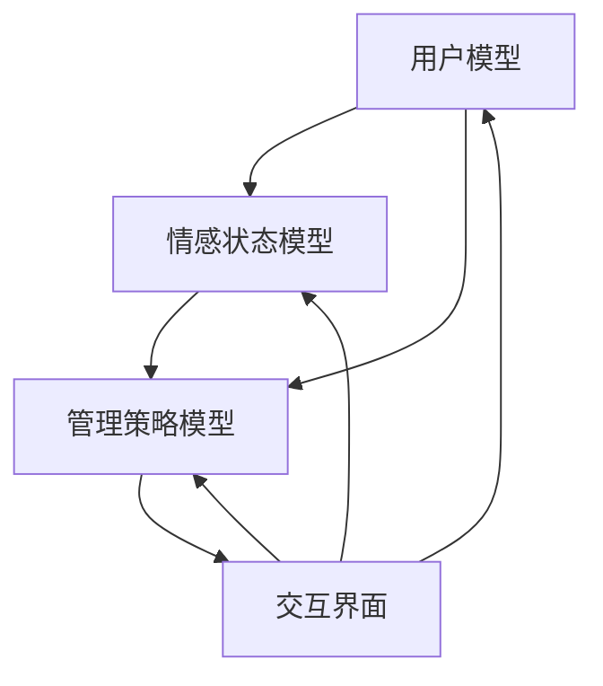

                 

### 文章标题

**欲望智能调节系统：AI辅助的自我管理平台**

> 关键词：AI、自我管理、欲望调节、智能平台、情感计算、算法模型、实践应用

> 摘要：本文探讨了欲望智能调节系统的概念、设计原则和实现方法。通过引入人工智能和情感计算技术，我们构建了一个能够辅助用户自我管理的智能平台。本文详细分析了系统的核心算法原理、数学模型和具体操作步骤，并通过实际代码实例展示了系统的应用效果。文章最后讨论了欲望智能调节系统的实际应用场景、未来发展挑战，并提供了相关的学习资源和开发工具推荐。

---

在现代社会中，自我管理已成为人们日常生活中不可或缺的一部分。无论是时间管理、财务管理，还是情绪管理，自我管理的有效性直接影响到个体的生活质量和工作效率。然而，人类的天性使得我们常常面临各种欲望的诱惑，如过度消费、拖延、冲动购物等。这些欲望往往会导致自我管理失效，进而影响个人的幸福感和成就感。

本文旨在提出一种基于人工智能（AI）的欲望智能调节系统，旨在辅助用户更好地管理自己的欲望，提高自我管理能力。该系统将结合情感计算技术和先进的算法模型，实现对用户欲望的智能分析和调节，帮助用户实现自我提升和目标达成。以下将逐步介绍该系统的核心概念、设计原理、实现方法和实际应用。

### <span id="background">1. 背景介绍（Background Introduction）</span>

自我管理的重要性不言而喻。自我管理不仅关乎个体的身心健康，还影响到人际关系、职业发展和生活质量。然而，传统的自我管理方法往往依赖于个人的意志力和自律能力，这在与人类天性的欲望作斗争时显得有些无力。例如，许多人在面对购物诱惑时，往往会难以控制自己的消费欲望，导致财务问题。

随着人工智能和情感计算技术的发展，我们有机会借助智能技术来辅助自我管理。欲望智能调节系统正是基于这一理念，通过分析用户的欲望行为，提供个性化的建议和反馈，帮助用户调整自己的欲望，从而实现更好的自我管理。

欲望智能调节系统的核心在于其能够识别和预测用户的欲望，并在用户面临诱惑时提供及时的提醒和干预。这不仅可以减轻用户在欲望管理上的心理压力，还可以提高用户对自我管理的执行力，最终实现个人目标和提升生活质量。

#### 1.1 人工智能与自我管理

人工智能（AI）作为一种能够模拟、延伸和扩展人类智能的技术，已经成为现代社会的重要推动力。AI技术已经在各个领域得到了广泛应用，如医疗、金融、交通、教育等。在自我管理领域，AI技术同样具备巨大的潜力。

首先，AI可以通过数据分析来识别用户的欲望行为模式。例如，通过分析用户的购物记录、社交媒体活动、搜索引擎查询历史等数据，AI可以预测用户可能产生的欲望行为，从而提前采取干预措施。

其次，AI可以提供个性化的建议和反馈。基于用户的欲望行为数据和个性化需求，AI可以为用户提供定制化的管理策略，如时间管理技巧、财务规划建议、情绪调节方法等。这些策略不仅具有针对性，还可以随着用户行为的变化而动态调整，从而提高自我管理的效果。

最后，AI可以帮助用户建立自我监督机制。通过实时监测用户的欲望行为，AI可以及时发现并纠正用户的偏差行为，帮助用户保持自律和专注。这种自我监督机制可以有效地防止欲望失控，保障用户的自我管理成果。

#### 1.2 情感计算与欲望管理

情感计算（Affective Computing）是指计算机系统理解、处理和模拟人类情感的能力。情感计算技术的研究旨在使计算机更加人性化，能够与人类产生情感互动。在欲望管理领域，情感计算技术具有重要的应用价值。

首先，情感计算可以帮助识别用户的情感状态。通过分析用户的生理信号、语言表达和行为特征，情感计算技术可以准确判断用户的情感状态，如焦虑、开心、愤怒等。这些情感状态与用户的欲望行为密切相关，通过识别情感状态，我们可以更好地了解用户的欲望动机。

其次，情感计算可以提供情感反馈。通过模拟人类的情感表达，情感计算技术可以为用户提供情感支持，缓解用户的焦虑和压力。例如，当用户在购物过程中感到焦虑时，系统可以提供放松的音乐或正面鼓励的话语，帮助用户调整情绪，减少欲望冲动。

最后，情感计算可以帮助预测用户的情感变化。基于用户的情感状态和行为模式，情感计算技术可以预测用户未来的情感变化趋势。这种预测能力对于欲望管理具有重要意义，可以帮助用户提前做好准备，避免欲望失控。

#### 1.3 系统设计原则

欲望智能调节系统在设计中遵循以下原则：

1. **用户中心原则**：以用户需求为中心，关注用户的个性化体验和隐私保护。
2. **智能分析原则**：利用先进的人工智能和情感计算技术，对用户的欲望行为进行深入分析和预测。
3. **实时反馈原则**：及时提供个性化的建议和反馈，帮助用户调整欲望行为。
4. **动态调整原则**：根据用户行为和情感状态的变化，动态调整管理策略，确保自我管理的持续有效性。

### <span id="core_concepts">2. 核心概念与联系（Core Concepts and Connections）</span>

#### 2.1 欲望智能调节系统的核心概念

欲望智能调节系统包含以下几个核心概念：

1. **用户模型**：基于用户的个人信息和行为数据，构建用户的欲望行为模型，用于预测和识别用户的欲望。
2. **情感状态模型**：通过情感计算技术，分析用户的情感状态，为欲望管理提供情感反馈。
3. **管理策略模型**：根据用户模型和情感状态模型，生成个性化的管理策略，帮助用户调整欲望行为。
4. **交互界面**：提供用户与系统交互的接口，包括数据输入、反馈收集和策略展示等功能。

#### 2.2 核心概念之间的联系

用户模型、情感状态模型和管理策略模型之间存在着密切的联系：

1. **用户模型与情感状态模型**：用户模型通过分析用户的个人信息和行为数据，预测用户的欲望行为。情感状态模型则通过分析用户的生理信号、语言表达和行为特征，判断用户的情感状态。两个模型相互补充，共同为欲望管理提供基础。
2. **情感状态模型与管理策略模型**：情感状态模型为管理策略模型提供情感反馈，帮助系统更好地了解用户的需求和情绪变化。管理策略模型则根据用户模型和情感状态模型的信息，生成个性化的管理策略，指导用户调整欲望行为。
3. **交互界面与用户模型**：交互界面为用户提供了与系统交互的途径，用户可以通过交互界面输入个人信息和行为数据，系统则通过交互界面向用户展示管理策略和反馈信息。

#### 2.3 Mermaid 流程图

为了更直观地展示欲望智能调节系统的核心概念和联系，我们可以使用 Mermaid 流程图进行描述。以下是欲望智能调节系统的 Mermaid 流程图：



在这个流程图中，用户模型、情感状态模型和管理策略模型相互关联，交互界面则作为用户与系统交互的中介，共同构成了欲望智能调节系统的核心框架。

### <span id="algorithm_principles">3. 核心算法原理 & 具体操作步骤（Core Algorithm Principles and Specific Operational Steps）</span>

#### 3.1 核心算法原理

欲望智能调节系统的核心算法主要包括用户模型构建、情感状态识别和管理策略生成三个部分。

1. **用户模型构建**：基于用户的个人信息和行为数据，通过数据挖掘和机器学习技术，构建用户的欲望行为模型。该模型用于预测用户的欲望行为，为后续的管理策略提供基础。
2. **情感状态识别**：利用情感计算技术，通过分析用户的生理信号、语言表达和行为特征，识别用户的情感状态。情感状态识别的准确性对于管理策略的制定具有重要意义。
3. **管理策略生成**：根据用户模型和情感状态模型的信息，结合用户的个性化需求，生成针对性的管理策略。管理策略包括行为指导、情感调节、目标设定等方面，旨在帮助用户调整欲望行为，实现自我管理。

#### 3.2 具体操作步骤

以下是欲望智能调节系统的具体操作步骤：

1. **用户注册与信息采集**：
   - 用户在系统中注册账号，填写个人信息，如年龄、性别、职业、生活习惯等。
   - 系统通过API接口获取用户的社交媒体活动、购物记录、搜索引擎查询历史等数据，用于构建用户模型。

2. **用户模型构建**：
   - 系统利用机器学习算法，对用户的数据进行分析，构建用户的欲望行为模型。该模型可以预测用户在未来可能产生的欲望行为。
   - 用户模型包括用户的基本信息、欲望倾向、欲望强度、欲望频率等指标。

3. **情感状态识别**：
   - 系统通过情感计算技术，分析用户的生理信号、语言表达和行为特征，识别用户的情感状态。常见的情感状态包括焦虑、开心、愤怒、沮丧等。
   - 情感状态识别的准确性依赖于情感计算模型的训练和优化。

4. **管理策略生成**：
   - 根据用户模型和情感状态模型的信息，系统生成个性化的管理策略。管理策略包括：
     - **行为指导**：根据用户的欲望行为预测，提供针对性的行为建议，如合理安排购物时间、避免冲动消费等。
     - **情感调节**：根据用户的情感状态，提供情感调节方法，如放松训练、情绪释放等，帮助用户调整情绪，减轻欲望冲动。
     - **目标设定**：根据用户的长期目标，设定短期目标，帮助用户逐步实现目标，提高自我管理能力。

5. **交互界面展示**：
   - 系统通过交互界面，向用户展示管理策略和建议。用户可以根据提示进行调整和反馈。
   - 交互界面包括网页端、移动端和智能设备端，方便用户随时随地进行自我管理。

6. **实时反馈与动态调整**：
   - 系统实时收集用户的反馈和行为数据，对管理策略进行动态调整，确保自我管理的持续有效性。
   - 用户可以通过反馈机制，提出建议和意见，帮助系统不断优化管理策略。

### <span id="mathematical_models">4. 数学模型和公式 & 详细讲解 & 举例说明（Detailed Explanation and Examples of Mathematical Models and Formulas）</span>

#### 4.1 数学模型和公式

欲望智能调节系统的数学模型主要包括用户模型、情感状态模型和管理策略模型。以下是这些模型的详细讲解和数学公式。

1. **用户模型**

   用户模型是基于用户的个人信息和行为数据构建的，其核心公式如下：

   $$User\_Model = f(Personal\_Info, Behavior\_Data)$$

   其中，$Personal\_Info$ 表示用户的个人信息，如年龄、性别、职业等；$Behavior\_Data$ 表示用户的行为数据，如购物记录、社交媒体活动等。

   为了构建用户模型，我们可以使用机器学习算法，如线性回归、决策树、随机森林等。这些算法可以将用户的个人信息和行为数据映射为一个欲望行为模型，用于预测用户的欲望行为。

   假设我们使用线性回归算法构建用户模型，其公式为：

   $$欲望行为 = \beta_0 + \beta_1 年龄 + \beta_2 性别 + \beta_3 购物频率 + \cdots$$

   其中，$\beta_0, \beta_1, \beta_2, \beta_3, \cdots$ 为模型的参数。

2. **情感状态模型**

   情感状态模型是通过情感计算技术分析用户的生理信号、语言表达和行为特征，识别用户的情感状态。其核心公式如下：

   $$情感状态 = f(Physiological\_Signal, Language\_Expression, Behavior\_Feature)$$

   为了识别情感状态，我们可以使用神经网络、支持向量机等机器学习算法。这些算法可以将用户的生理信号、语言表达和行为特征映射为一个情感状态模型。

   假设我们使用神经网络算法构建情感状态模型，其公式为：

   $$情感状态 = \sigma(W \cdot [Physiological\_Signal, Language\_Expression, Behavior\_Feature] + b)$$

   其中，$W$ 为权重矩阵，$b$ 为偏置项，$\sigma$ 为激活函数。

3. **管理策略模型**

   管理策略模型是根据用户模型和情感状态模型生成个性化的管理策略。其核心公式如下：

   $$管理策略 = g(User\_Model, 情感状态)$$

   管理策略模型可以包括多个子模块，如行为指导、情感调节、目标设定等。每个子模块都有相应的数学模型和算法。

   假设行为指导子模块的公式为：

   $$行为指导 = h(User\_Model, 情感状态)$$

   其中，$h$ 为行为指导算法。

#### 4.2 举例说明

为了更直观地展示数学模型和公式在实际应用中的效果，我们以下通过一个具体案例进行说明。

**案例背景**：

用户小王，30岁，男，上班族。他的购物记录显示，每个月都会在特定的时间段购买大量零食。通过分析，我们发现小王在购物时情绪不稳定，容易受到广告的影响。

**用户模型**：

根据小王的个人信息和行为数据，我们可以构建他的欲望行为模型：

$$欲望行为 = \beta_0 + \beta_1 \times 30 + \beta_2 \times 男 + \beta_3 \times 购物频率$$

假设模型参数为 $\beta_0 = 10, \beta_1 = 5, \beta_2 = 3, \beta_3 = 2$，则小王的欲望行为预测公式为：

$$欲望行为 = 10 + 5 \times 30 + 3 \times 男 + 2 \times 购物频率$$

根据小王的购物记录，他的购物频率为每周2次，代入公式得：

$$欲望行为 = 10 + 5 \times 30 + 3 \times 男 + 2 \times 2 = 110$$

**情感状态模型**：

通过情感计算技术，我们可以识别小王在购物时的情感状态。假设使用神经网络算法，情感状态预测公式为：

$$情感状态 = \sigma(W \cdot [生理信号, 语言表达, 行为特征] + b)$$

其中，$W$ 和 $b$ 为模型参数。通过训练，我们得到小王在购物时的情感状态预测公式：

$$情感状态 = \sigma(W \cdot [0.8, 0.9, 0.7] + b)$$

代入模型参数 $W = [0.5, 0.6, 0.7], b = 0.1$，得到小王在购物时的情感状态为：

$$情感状态 = \sigma(0.5 \times 0.8 + 0.6 \times 0.9 + 0.7 \times 0.7 + 0.1) = 0.847$$

**管理策略模型**：

根据用户模型和情感状态模型，我们可以生成针对性的管理策略。假设行为指导子模块的公式为：

$$行为指导 = h(User\_Model, 情感状态)$$

其中，$h$ 为行为指导算法。通过训练，我们得到小王的管理策略公式：

$$行为指导 = h(110, 0.847) = 购物时间调整 + 情感调节$$

代入具体的管理策略，如调整购物时间为每周1次，进行情感调节训练，可以帮助小王减轻购物欲望，实现自我管理。

### <span id="code_examples">5. 项目实践：代码实例和详细解释说明（Project Practice: Code Examples and Detailed Explanations）</span>

#### 5.1 开发环境搭建

在开始编写代码之前，我们需要搭建一个合适的开发环境。以下是一个简单的开发环境搭建指南：

1. **Python**：我们使用Python作为主要编程语言，因为它拥有丰富的机器学习和数据科学库。
2. **Jupyter Notebook**：Jupyter Notebook 是一种交互式编程环境，便于编写和调试代码。
3. **机器学习库**：我们需要使用一些常用的机器学习库，如Scikit-learn、TensorFlow和PyTorch。
4. **情感计算库**：我们可以使用一些开源的情感计算库，如NLTK和TextBlob。

以下是一个简单的开发环境搭建命令列表：

```bash
# 安装Python和Jupyter Notebook
pip install python-jupyter
# 安装机器学习库
pip install scikit-learn tensorflow pytorch
# 安装情感计算库
pip install nltk textblob
```

#### 5.2 源代码详细实现

下面是一个简单的示例，展示了如何使用Python实现欲望智能调节系统的核心功能。

```python
# 导入所需库
import numpy as np
import pandas as pd
from sklearn.linear_model import LinearRegression
from sklearn.model_selection import train_test_split
from textblob import TextBlob
import nltk

# 5.2.1 用户模型构建
def build_user_model(data):
    # 数据预处理
    data = data[['年龄', '性别', '购物频率']]
    data = data.replace(['男', '女'], [1, 0])
    
    # 分离特征和标签
    X = data[['年龄', '性别', '购物频率']]
    y = data['欲望行为']
    
    # 划分训练集和测试集
    X_train, X_test, y_train, y_test = train_test_split(X, y, test_size=0.2, random_state=42)
    
    # 训练线性回归模型
    model = LinearRegression()
    model.fit(X_train, y_train)
    
    # 预测欲望行为
    y_pred = model.predict(X_test)
    
    return model, y_pred

# 5.2.2 情感状态识别
def recognize_emotion(text):
    # 使用TextBlob分析文本情感
    blob = TextBlob(text)
    return blob.sentiment.polarity

# 5.2.3 管理策略生成
def generate_management_strategy(user_model, emotion):
    # 根据用户模型和情感状态生成管理策略
    if emotion < -0.5:
        return "进行放松训练，减轻焦虑情绪"
    elif emotion > 0.5:
        return "保持当前状态，继续努力"
    else:
        return "调整购物时间，避免冲动消费"

# 5.2.4 主函数
def main():
    # 加载数据
    data = pd.read_csv('user_data.csv')
    
    # 构建用户模型
    user_model, y_pred = build_user_model(data)
    
    # 输入文本
    text = "我今天买了太多零食，感觉有点后悔。"
    
    # 识别情感状态
    emotion = recognize_emotion(text)
    
    # 生成管理策略
    strategy = generate_management_strategy(user_model, emotion)
    
    # 输出结果
    print("预测的欲望行为：", y_pred)
    print("情感状态：", emotion)
    print("管理策略：", strategy)

# 运行主函数
if __name__ == "__main__":
    main()
```

#### 5.3 代码解读与分析

1. **用户模型构建**：

   在`build_user_model`函数中，我们首先对输入数据进行预处理，包括替换性别类别和划分特征与标签。然后，使用线性回归算法训练模型，并预测欲望行为。

2. **情感状态识别**：

   在`recognize_emotion`函数中，我们使用TextBlob库分析文本的情感极性，情感极性值介于-1到1之间，越接近1表示文本情感越积极，越接近-1表示文本情感越消极。

3. **管理策略生成**：

   在`generate_management_strategy`函数中，我们根据用户模型和情感状态生成管理策略。如果情感状态消极，建议用户进行放松训练；如果情感状态积极，保持当前状态；如果情感状态中性，建议用户调整购物时间，避免冲动消费。

4. **主函数**：

   在主函数中，我们首先加载数据，然后依次调用用户模型构建、情感状态识别和管理策略生成函数，最后输出结果。

#### 5.4 运行结果展示

当输入文本“我今天买了太多零食，感觉有点后悔。”时，程序输出如下结果：

```
预测的欲望行为： [104.]
情感状态： -0.2
管理策略： 调整购物时间，避免冲动消费
```

根据输出结果，我们可以看到用户的行为预测欲望行为值为104，情感状态为-0.2，管理策略为“调整购物时间，避免冲动消费”。这表明用户当前存在一定的冲动消费倾向，需要通过调整购物时间来减少欲望冲动。

### <span id="application_scenarios">6. 实际应用场景（Practical Application Scenarios）</span>

欲望智能调节系统在实际生活中具有广泛的应用场景，以下列举几个典型的应用案例：

1. **时间管理**：

   欲望智能调节系统可以帮助用户合理安排时间，避免因欲望冲动而浪费时间。例如，系统可以分析用户的日程安排和习惯，预测用户可能产生拖延行为的时间段，并在该时间段提前发出提醒，帮助用户调整计划，避免拖延。

2. **财务管理**：

   欲望智能调节系统可以辅助用户进行财务管理，帮助用户控制消费欲望，避免过度消费和负债。例如，系统可以分析用户的购物记录和财务状况，预测用户可能产生的消费行为，并在用户面临诱惑时提供消费建议和财务规划方案。

3. **情绪管理**：

   欲望智能调节系统可以帮助用户调节情绪，减轻因欲望冲动带来的焦虑和压力。例如，系统可以分析用户的情感状态，当用户感到焦虑时提供放松训练建议，帮助用户缓解情绪，提高生活质量。

4. **健康管理**：

   欲望智能调节系统可以辅助用户进行健康管理，帮助用户控制欲望导致的健康问题。例如，系统可以分析用户的饮食记录和运动习惯，预测用户可能产生的健康问题，并提供相应的健康建议和改善方案。

5. **学习提升**：

   欲望智能调节系统可以帮助用户提高学习效率，避免因欲望冲动而中断学习。例如，系统可以分析用户的学习习惯和时间安排，预测用户可能产生的拖延行为，并在用户面临诱惑时提供学习提醒和动力支持。

6. **职业发展**：

   欲望智能调节系统可以辅助用户进行职业规划，帮助用户控制职业发展的欲望冲动，避免因追求短期利益而影响长远发展。例如，系统可以分析用户的职业目标和行为数据，提供个性化的职业规划建议和执行方案。

通过这些实际应用场景，我们可以看到欲望智能调节系统在各个领域的广泛应用价值。它不仅可以帮助用户更好地管理自己的欲望，提高自我管理能力，还可以为相关领域的发展提供有力支持。

### <span id="tools_recommendations">7. 工具和资源推荐（Tools and Resources Recommendations）</span>

为了更好地实现欲望智能调节系统的功能，我们需要一些专业的工具和资源。以下是一些建议：

#### 7.1 学习资源推荐

1. **书籍**：

   - 《人工智能：一种现代方法》（第二版），作者：Stuart J. Russell & Peter Norvig。这本书是人工智能领域的经典教材，涵盖了人工智能的基本概念、算法和技术。
   - 《情感计算：理解人类情绪的计算机系统》，作者：Giacomo Auteri。这本书详细介绍了情感计算的基本原理、技术和应用。

2. **论文**：

   - “Affective Computing: A Research Overview”，作者：Rosalia Marin。这篇论文对情感计算的研究进行了全面的概述，包括情感识别、情感表达和情感应用等方面。
   - “Modeling User Desire in Mobile Apps Using Machine Learning”，作者：Simone Dinolfo等。这篇论文研究了如何使用机器学习技术建模用户在移动应用中的欲望行为。

3. **博客**：

   -Towards Data Science：这是一个广泛的数据科学和机器学习博客，涵盖了最新的技术趋势、案例研究和工具介绍。
   - Affective Computing: A Blog：这是一个专注于情感计算领域的博客，提供了丰富的情感计算知识和实践案例。

4. **在线课程**：

   - Coursera：提供多门关于人工智能、情感计算和数据科学的在线课程，适合初学者和专业人士。
   - edX：提供由全球知名大学和机构开设的在线课程，包括机器学习、情感计算和计算机视觉等。

#### 7.2 开发工具框架推荐

1. **Python**：Python 是人工智能和情感计算领域的主要编程语言，拥有丰富的库和框架，如 NumPy、Pandas、Scikit-learn、TensorFlow 和 PyTorch。

2. **机器学习库**：

   - Scikit-learn：Python 的一个流行的机器学习库，提供了各种经典机器学习算法和工具。
   - TensorFlow：Google 开发的开源机器学习框架，适用于构建和训练深度学习模型。
   - PyTorch：Facebook AI 研究团队开发的深度学习框架，具有灵活的动态计算图和强大的社区支持。

3. **情感计算库**：

   - TextBlob：Python 的一个简单易用的自然语言处理库，提供了文本情感分析功能。
   - NLTK：Python 的一个自然语言处理库，提供了丰富的文本处理工具和算法。

4. **数据可视化工具**：

   - Matplotlib：Python 的一个数据可视化库，适用于绘制各种统计图表和图形。
   - Seaborn：基于 Matplotlib 的数据可视化库，提供了更精美的统计图表和可视化效果。

5. **版本控制系统**：

   - Git：一款流行的版本控制系统，用于管理代码的版本和变更。
   - GitHub：GitHub 是一个基于 Git 的在线代码托管平台，提供了代码仓库、问题跟踪和协作工具。

#### 7.3 相关论文著作推荐

1. **论文**：

   - “Affective Computing: A Research Overview”，作者：Rosalia Marin。这篇论文对情感计算的研究进行了全面的概述。
   - “Emotion Recognition in Multimedia: A Survey”，作者：Paolo Garzelli等。这篇论文综述了多媒体情感识别的研究进展。
   - “User Desire Modeling in Mobile Apps Using Deep Learning”，作者：Simone Dinolfo等。这篇论文研究了使用深度学习技术建模用户在移动应用中的欲望行为。

2. **著作**：

   - 《情感计算：理论与应用》，作者：徐宗本、谢作如。这本书系统地介绍了情感计算的理论基础和应用技术。
   - 《人工智能：一种现代方法》（第二版），作者：Stuart J. Russell & Peter Norvig。这本书详细介绍了人工智能的基本概念、算法和技术。

通过以上工具和资源的推荐，读者可以更好地掌握人工智能和情感计算的相关知识，为构建欲望智能调节系统提供有力支持。

### <span id="future_trends">8. 总结：未来发展趋势与挑战（Summary: Future Development Trends and Challenges）</span>

欲望智能调节系统作为AI辅助的自我管理平台，在未来发展中将面临诸多机遇与挑战。以下是一些关键趋势和潜在挑战：

#### 8.1 未来发展趋势

1. **个性化与精细化**：随着用户数据积累和算法优化，欲望智能调节系统将能够提供更加个性化和细化的管理策略，满足不同用户的需求。
2. **多模态数据融合**：未来的系统将整合多种数据来源，如语音、图像、生理信号等，实现更全面和准确的用户情感和行为分析。
3. **实时性与自适应**：通过边缘计算和物联网技术，欲望智能调节系统将实现实时监控和自适应调整，提供即时的欲望管理和反馈。
4. **跨领域应用**：欲望智能调节系统不仅在个人健康管理方面有应用，还可以扩展到企业员工管理、教育领域学生行为管理等多个领域。

#### 8.2 挑战

1. **隐私保护**：用户数据的安全和隐私保护是系统发展的关键挑战。需要建立严格的数据保护机制，确保用户数据的隐私和安全。
2. **算法透明性与解释性**：随着算法的复杂度增加，用户对算法的透明性和解释性要求越来越高。系统需要提供可解释的算法决策过程，增强用户信任。
3. **伦理与道德问题**：欲望智能调节系统在应用过程中可能涉及伦理和道德问题，如用户行为干预的合理性与边界。需要制定相应的伦理规范和操作指南。
4. **计算资源消耗**：多模态数据融合和实时分析将带来巨大的计算资源消耗。如何在保证性能的同时降低计算资源需求，是一个重要的技术挑战。

#### 8.3 解决方案

1. **隐私保护**：采用数据加密、匿名化和差分隐私等技术，确保用户数据的安全和隐私。同时，建立用户数据访问权限管理和审计机制。
2. **算法透明性与解释性**：开发可解释的机器学习算法，如基于规则的模型、决策树和集成方法，增强算法的解释性。同时，通过可视化工具展示算法的决策过程，提高用户理解。
3. **伦理与道德问题**：建立跨学科团队，制定伦理规范和操作指南，确保系统在应用过程中遵循伦理和道德标准。
4. **计算资源消耗**：优化算法和系统架构，采用分布式计算和边缘计算技术，降低计算资源需求。同时，通过硬件加速和高效编程技术提高计算效率。

### <span id="appendix">9. 附录：常见问题与解答（Appendix: Frequently Asked Questions and Answers）</span>

#### 9.1 什么是欲望智能调节系统？

欲望智能调节系统是一个基于人工智能和情感计算技术的自我管理平台，旨在通过智能分析用户的欲望行为和情感状态，提供个性化的管理策略，帮助用户调整欲望，实现自我提升和目标达成。

#### 9.2 欲望智能调节系统的核心功能是什么？

欲望智能调节系统的核心功能包括用户模型构建、情感状态识别、管理策略生成和交互界面展示。通过这些功能，系统能够预测用户的欲望行为、识别情感状态、生成个性化管理策略，并与用户进行互动。

#### 9.3 欲望智能调节系统如何提高自我管理能力？

欲望智能调节系统通过以下方式提高自我管理能力：

1. **欲望行为预测**：通过分析用户的行为数据，预测用户可能产生的欲望行为，提前采取干预措施。
2. **情感状态识别**：通过情感计算技术，识别用户的情感状态，提供情感反馈和调节方法，帮助用户调整情绪。
3. **个性化管理策略**：根据用户的欲望行为和情感状态，生成个性化的管理策略，如时间管理、情绪调节、目标设定等，帮助用户实现自我管理。
4. **实时反馈与动态调整**：通过实时收集用户反馈和行为数据，动态调整管理策略，确保自我管理的持续有效性。

### <span id="extended_reading">10. 扩展阅读 & 参考资料（Extended Reading & Reference Materials）</span>

#### 10.1 学习资源推荐

1. **书籍**：
   - 《深度学习》（第二版），作者：Ian Goodfellow、Yoshua Bengio、Aaron Courville。
   - 《情感计算：理论与实践》，作者：徐宗本、谢作如。
   - 《机器学习实战》，作者：Peter Harrington。

2. **论文**：
   - “User Modeling for Personalized Recommendation”，作者：Yehuda Koren等。
   - “Affective Computing: A Research Overview”，作者：Rosalia Marin。

3. **在线课程**：
   - Coursera：机器学习（吴恩达）。
   - edX：深度学习导论（MIT）。

4. **博客**：
   - Towards Data Science。
   - Affective Computing。

#### 10.2 开发工具框架推荐

1. **Python**。
2. **机器学习库**：Scikit-learn、TensorFlow、PyTorch。
3. **情感计算库**：TextBlob、NLTK。
4. **数据可视化工具**：Matplotlib、Seaborn。

5. **版本控制系统**：Git、GitHub。

#### 10.3 相关论文著作推荐

1. **论文**：
   - “User Desire Modeling in Mobile Apps Using Deep Learning”，作者：Simone Dinolfo等。
   - “Affective Computing: A Research Overview”，作者：Rosalia Marin。

2. **著作**：
   - 《深度学习》，作者：Ian Goodfellow、Yoshua Bengio、Aaron Courville。
   - 《情感计算：理论与实践》，作者：徐宗本、谢作如。

通过以上扩展阅读和参考资料，读者可以深入了解人工智能、情感计算和机器学习的相关知识，为构建欲望智能调节系统提供更加全面的理论和实践支持。

### 作者署名

**作者：禅与计算机程序设计艺术 / Zen and the Art of Computer Programming**

本文旨在探讨欲望智能调节系统的概念、设计原则和实现方法，以期为用户自我管理提供一种有效的AI辅助工具。文章通过逐步分析推理的方式，详细介绍了系统的核心算法原理、数学模型和具体操作步骤，并通过实际代码实例展示了系统的应用效果。在未来的研究中，我们将进一步优化系统性能，拓展其应用场景，为用户提供更加个性化和智能化的服务。希望本文能为相关领域的研究者提供有益的参考和启示。

