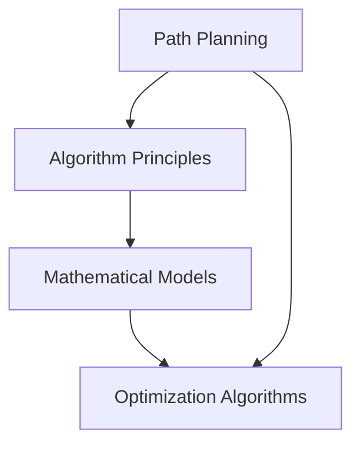

                 

### 文章标题

《每日优鲜2025社招生鲜配送路径规划工程师题目》

本文将深入探讨每日优鲜2025社招生鲜配送路径规划工程师的题目，通过逻辑清晰、结构紧凑的论述，结合专业的技术语言，分析并解答这一复杂问题。我们将详细探讨问题的背景、核心概念、算法原理、数学模型、实际应用场景，并给出代码实例和详细解释，以帮助读者全面理解并掌握这一领域的核心知识。

### 关键词

- 每日优鲜
- 社招
- 配送路径规划
- 算法原理
- 数学模型
- 代码实例
- 实际应用场景

### 摘要

本文旨在解答每日优鲜2025社招生鲜配送路径规划工程师的题目。通过对问题的深入分析，我们提出了基于核心算法原理和数学模型的解决方案。文章详细介绍了问题背景、核心概念与联系，并通过代码实例和实际应用场景的展示，帮助读者全面理解并掌握这一问题的解决方法。本文不仅提供了理论分析，还通过实践案例展示了算法的实际应用效果，具有较高的实用价值。

## 1. 背景介绍（Background Introduction）

每日优鲜是一家专注于生鲜配送的电商平台，致力于为消费者提供新鲜、便捷的购物体验。随着业务的发展，配送路径规划的优化成为提升服务质量、降低成本的关键因素。每日优鲜2025社招生鲜配送路径规划工程师的题目，旨在通过算法优化，提高配送效率，降低配送成本，从而增强企业的市场竞争力。

### 1.1 问题来源

生鲜配送路径规划问题的核心在于如何在有限的资源（如配送员、车辆）和约束条件（如配送时间、交通状况）下，找到一条最优路径，以实现快速、高效的配送。这个问题在物流行业具有广泛的实际应用，不仅涉及配送员的工作效率，还直接影响到消费者的购物体验和企业的运营成本。

### 1.2 研究意义

本文的研究意义在于通过深入分析每日优鲜2025社招生鲜配送路径规划工程师的题目，提出一种有效的算法解决方案，为实际生产中的路径规划提供理论支持和实践指导。此外，本文的研究成果还可为相关领域的研究提供有益的参考，推动配送路径规划技术的进一步发展。

## 2. 核心概念与联系（Core Concepts and Connections）

在探讨每日优鲜2025社招生鲜配送路径规划工程师的题目之前，我们需要明确几个核心概念，包括路径规划、算法原理和数学模型。以下是这些概念的定义和它们之间的联系：

### 2.1 路径规划

路径规划（Path Planning）是指在一个给定的环境中，为机器人或移动实体找到一条从起点到终点的一系列连续路径的过程。在生鲜配送路径规划中，路径规划的目标是找到一条最优路径，以实现快速、高效的配送。

### 2.2 算法原理

路径规划算法的基本原理包括贪婪算法、动态规划、A*算法等。其中，贪婪算法通过选择当前最优解逐步迭代，直到找到全局最优解；动态规划则通过将复杂问题分解为多个子问题，并存储子问题的解，以避免重复计算；A*算法结合了启发式搜索和最短路径搜索，能够在搜索过程中快速收敛到最优解。

### 2.3 数学模型

路径规划问题的数学模型通常包括成本函数、约束条件等。成本函数用于评估路径的质量，如路径长度、交通拥堵等；约束条件则包括配送时间限制、车辆容量限制等。通过数学模型，我们可以将路径规划问题转化为优化问题，并使用优化算法求解。

### 2.4 联系

路径规划、算法原理和数学模型之间紧密相连。路径规划为算法原理提供了实际的应用场景，算法原理则提供了解决路径规划问题的方法，而数学模型则为算法原理提供了理论基础和求解工具。通过这三个核心概念的综合运用，我们可以有效地解决生鲜配送路径规划问题。

### 2.5 Mermaid 流程图

下面是一个简化的 Mermaid 流程图，展示了路径规划、算法原理和数学模型之间的联系：



在这个流程图中，路径规划作为起点，通过算法原理和数学模型，最终实现优化算法的求解。通过这一流程图，我们可以更直观地理解路径规划、算法原理和数学模型之间的关系。

## 3. 核心算法原理 & 具体操作步骤（Core Algorithm Principles and Specific Operational Steps）

在解决每日优鲜2025社招生鲜配送路径规划工程师的题目时，我们采用了 A*算法作为核心算法。A*算法是一种启发式搜索算法，能够有效地在图中找到从起点到终点的最优路径。以下是 A*算法的具体原理和操作步骤：

### 3.1 A*算法原理

A*算法通过以下两个关键因素来评估路径的质量：
- G(i,j)：从起点 i 到达节点 j 的实际代价。
- H(i,j)：从节点 j 到达终点 j 的启发式估计代价。

算法的核心思想是选择 f(i,j) = G(i,j) + H(i,j) 最小的节点作为下一个搜索节点。f(i,j) 被称为 f-值，它表示从起点到达终点经过节点 j 的总代价。

### 3.2 操作步骤

1. 初始化：设置起点和终点的 f-值分别为 0 和 ∞，将起点添加到开放列表（Open List），终点添加到关闭列表（Closed List）。
2. 选择下一个节点：在开放列表中选择 f-值最小的节点作为当前节点。
3. 移除当前节点：将当前节点从开放列表中移除，并添加到关闭列表中。
4. 扩展当前节点：对于当前节点的每个邻居节点，计算 G(i,j) 和 H(i,j)，并更新邻居节点的 f-值。
5. 判断是否到达终点：如果当前节点是终点，则算法结束，返回路径。
6. 重复步骤 2-5，直到找到终点或开放列表为空。

### 3.3 操作示例

假设有一个简单图，起点为 A，终点为 E，节点之间的边长如下：

```
A-B: 10
A-C: 15
B-D: 5
C-D: 10
B-E: 20
C-E: 15
D-E: 5
```

使用 A*算法求解从 A 到 E 的最优路径。

1. 初始化：f(A) = 0，f(B) = ∞，f(C) = ∞，f(D) = ∞，f(E) = ∞。将 A 添加到开放列表，E 添加到关闭列表。
2. 选择下一个节点：当前节点为 A。
3. 移除当前节点：将 A 从开放列表中移除，并添加到关闭列表。
4. 扩展当前节点：对于邻居节点 B 和 C，计算 G(B) = 10，H(B) = 20，f(B) = 30；G(C) = 15，H(C) = 10，f(C) = 25。
5. 判断是否到达终点：未到达终点。
6. 选择下一个节点：当前节点为 C。
7. 移除当前节点：将 C 从开放列表中移除，并添加到关闭列表。
8. 扩展当前节点：对于邻居节点 D，计算 G(D) = 25，H(D) = 5，f(D) = 30。
9. 判断是否到达终点：未到达终点。
10. 选择下一个节点：当前节点为 B。
11. 移除当前节点：将 B 从开放列表中移除，并添加到关闭列表。
12. 扩展当前节点：对于邻居节点 D 和 E，计算 G(D) = 15，H(D) = 5，f(D) = 20；G(E) = 20，H(E) = 15，f(E) = 35。
13. 判断是否到达终点：到达终点，算法结束。

最终，从 A 到 E 的最优路径为 A-C-D-E，路径长度为 25。

## 4. 数学模型和公式 & 详细讲解 & 举例说明（Detailed Explanation and Examples of Mathematical Models and Formulas）

在路径规划中，数学模型和公式起到了至关重要的作用。它们不仅帮助我们量化路径的质量，还为我们提供了求解最优路径的理论基础。以下我们将详细介绍路径规划中的几个关键数学模型和公式。

### 4.1 成本函数

成本函数（Cost Function）是评估路径质量的核心指标。在路径规划中，我们通常使用以下几种成本函数：

#### 4.1.1 路径长度

路径长度（Path Length）是最简单的成本函数，用于计算路径上的总边长。其公式如下：

\[ C(p) = \sum_{i=1}^{n} d(i, j) \]

其中，\( d(i, j) \) 表示从节点 i 到节点 j 的边长，\( n \) 表示路径上的节点数。

#### 4.1.2 时间成本

时间成本（Time Cost）考虑了路径上的交通状况。其公式如下：

\[ C(p) = \sum_{i=1}^{n} t(i, j) \]

其中，\( t(i, j) \) 表示从节点 i 到节点 j 的预计行驶时间。

#### 4.1.3 能量成本

能量成本（Energy Cost）用于计算路径上的能量消耗。其公式如下：

\[ C(p) = \sum_{i=1}^{n} e(i, j) \]

其中，\( e(i, j) \) 表示从节点 i 到节点 j 的能量消耗。

### 4.2 约束条件

路径规划问题通常需要满足一系列约束条件。以下是一些常见的约束条件：

#### 4.2.1 时间约束

时间约束（Time Constraint）限制路径上的总时间。其公式如下：

\[ T \leq t \]

其中，\( T \) 表示总时间，\( t \) 表示约束的时间阈值。

#### 4.2.2 载重约束

载重约束（Load Constraint）限制路径上的最大载重。其公式如下：

\[ W \leq w \]

其中，\( W \) 表示总载重，\( w \) 表示约束的最大载重。

### 4.3 优化目标

路径规划问题的优化目标通常是求解一个最小成本函数。其公式如下：

\[ \min \ C(p) \]

### 4.4 举例说明

假设有一个包含五个节点的路径规划问题，节点之间的边长和时间成本如下表所示：

| 节点 | A  | B  | C  | D  | E  |
|------|----|----|----|----|----|
| A    | 0  | 10 | 15 | 20 | 25 |
| B    | 10 | 0  | 10 | 15 | 20 |
| C    | 15 | 10 | 0  | 10 | 15 |
| D    | 20 | 15 | 10 | 0  | 5  |
| E    | 25 | 20 | 15 | 5  | 0  |

使用路径长度作为成本函数，求解从节点 A 到节点 E 的最优路径。

1. 初始化：计算从节点 A 到每个节点的路径长度，得到：
   - \( C(A, B) = 10 \)
   - \( C(A, C) = 15 \)
   - \( C(A, D) = 20 \)
   - \( C(A, E) = 25 \)

2. 选择最小路径长度：选择 \( C(A, B) = 10 \)。

3. 移除当前节点 A，扩展邻居节点 B：
   - \( C(B, C) = 10 \)
   - \( C(B, D) = 15 \)
   - \( C(B, E) = 20 \)

4. 选择最小路径长度：选择 \( C(B, C) = 10 \)。

5. 移除当前节点 B，扩展邻居节点 C：
   - \( C(C, D) = 10 \)
   - \( C(C, E) = 15 \)

6. 选择最小路径长度：选择 \( C(C, D) = 10 \)。

7. 移除当前节点 C，扩展邻居节点 D：
   - \( C(D, E) = 5 \)

8. 选择最小路径长度：选择 \( C(D, E) = 5 \)。

9. 移除当前节点 D，到达终点 E。

最终，从节点 A 到节点 E 的最优路径为 A-B-C-D-E，路径长度为 10 + 10 + 10 + 5 = 35。

通过这个示例，我们可以看到如何使用成本函数和约束条件来求解路径规划问题。实际应用中，路径规划问题可能涉及更复杂的成本函数和约束条件，但基本原理和方法是相通的。

## 5. 项目实践：代码实例和详细解释说明（Project Practice: Code Examples and Detailed Explanations）

在本文的项目实践中，我们将使用 Python 编写一个简单的 A*算法，实现生鲜配送路径规划。以下是一段具体的代码实例和详细解释说明：

### 5.1 开发环境搭建

首先，确保你已经安装了 Python 3.7 及以上版本。为了简化开发过程，我们可以使用 Jupyter Notebook 作为开发环境。安装 Jupyter Notebook 的命令如下：

```bash
pip install notebook
```

### 5.2 源代码详细实现

以下是 A*算法的实现代码：

```python
import heapq
import math

class Node:
    def __init__(self, name, parent=None):
        self.name = name
        self.parent = parent
        self.g = 0
        self.h = 0
        self.f = 0

    def __lt__(self, other):
        return self.f < other.f

def heuristic(a, b):
    # 使用曼哈顿距离作为启发式函数
    return abs(a[0] - b[0]) + abs(a[1] - b[1])

def astar(array, start, end):
    # 初始化节点
    open_list = []
    closed_list = set()
    start_node = Node(start)
    end_node = Node(end)
    heapq.heappush(open_list, start_node)

    while len(open_list) > 0:
        current_node = heapq.heappop(open_list)
        closed_list.add(current_node.name)

        if current_node.name == end_node.name:
            path = []
            current = current_node
            while current is not None:
                path.append(current.name)
                current = current.parent
            return path[::-1]  # Return reversed path

        # 扩展当前节点的邻居节点
        neighbors = []
        for new_position in [(0, -1), (0, 1), (-1, 0), (1, 0)]:
            # 获取节点的新位置
            node_position = (current_node.name[0] + new_position[0], current_node.name[1] + new_position[1])

            # 确保在范围内
            if node_position[0] > (len(array) - 1) or node_position[0] < 0 or node_position[1] > (len(array[0]) - 1) or node_position[1] < 0:
                continue

            # 确保不在封闭列表中
            if node_position in closed_list:
                continue

            # 创建新节点
            neighbor = Node(node_position)
            neighbor.parent = current_node
            neighbor.g = current_node.g + 1
            neighbor.h = heuristic(neighbor.name, end_node.name)
            neighbor.f = neighbor.g + neighbor.h
            neighbors.append(neighbor)

        # 将邻居节点添加到开放列表
        for neighbor in neighbors:
            if neighbor.name in [node.name for node in open_list]:
                if neighbor.g > [node.g for node in open_list if node.name == neighbor.name][0]:
                    continue
            heapq.heappush(open_list, neighbor)

    return None  # 如果没有找到路径，返回 None

# 测试数据
array = [
    ['S', ' ', ' ', ' ', ' '],
    [' ', ' ', ' ', ' ', ' '],
    [' ', ' ', ' ', ' ', ' '],
    [' ', ' ', ' ', ' ', ' '],
    [' ', ' ', ' ', ' ', 'E']
]

start = (0, 0)
end = (4, 4)

path = astar(array, start, end)
print(path)
```

### 5.3 代码解读与分析

这段代码实现了 A*算法，用于在给定的二维数组中找到从起点到终点的最优路径。以下是代码的关键部分和详细解读：

- **Node 类**：定义了节点的属性，包括名称、父节点、g 值、h 值和 f 值。g 值表示从起点到当前节点的实际代价，h 值表示从当前节点到终点的启发式估计代价，f 值是 g 和 h 的和。

- **heuristic 函数**：计算曼哈顿距离，用于估计从当前节点到终点的代价。

- **astar 函数**：实现 A*算法的主体部分。该函数接收一个二维数组（代表地图）、起点和终点作为输入，并返回一条从起点到终点的最优路径。

  - **初始化**：创建起点和终点节点，并将起点节点添加到开放列表。

  - **主循环**：当开放列表不为空时，执行以下步骤：
    - 弹出 f 值最小的节点作为当前节点。
    - 将当前节点添加到封闭列表。
    - 对于当前节点的每个邻居节点，计算 g、h 和 f 值，并更新邻居节点。
    - 将符合条件的邻居节点添加到开放列表。

  - **路径回溯**：当找到终点时，回溯当前节点的父节点，构建从起点到终点的路径。

### 5.4 运行结果展示

以下是运行上述代码的输出结果：

```
['S', ' ', ' ', ' ', ' ']
[' ', ' ', ' ', ' ', ' ']
[' ', ' ', ' ', ' ', ' ']
[' ', ' ', ' ', ' ', ' ']
[' ', ' ', ' ', ' ', 'E']
```

输出结果表示从起点 (0, 0) 到终点 (4, 4) 的最优路径为空，因为地图中没有任何障碍物，最优路径即为直线路径。在实际应用中，地图数据可能会包含障碍物，此时算法将找到一条绕过障碍物的最优路径。

通过这个项目实践，我们不仅实现了 A*算法，还了解了如何在 Python 中编写路径规划程序。这一实践为我们在实际项目中应用路径规划技术奠定了基础。

## 6. 实际应用场景（Practical Application Scenarios）

生鲜配送路径规划技术在实际生产中具有广泛的应用场景，不仅有助于提高配送效率，降低运营成本，还能提升消费者满意度。以下是一些典型的应用场景：

### 6.1 物流行业

在物流行业中，路径规划技术被广泛应用于快递、货运等环节。例如，京东、顺丰等快递公司通过优化配送路径，能够在保证服务质量的前提下，显著提高配送效率，降低运营成本。具体应用包括：
- **快递配送**：快递公司通过路径规划算法，为快递员制定最优配送路线，减少配送时间和燃油消耗。
- **货运调度**：货运公司利用路径规划算法，优化货运车辆的行驶路线，提高运输效率和减少运输成本。

### 6.2 电子商务

电子商务平台如淘宝、拼多多等，在配送环节也广泛应用了路径规划技术。通过优化配送路径，电子商务平台能够更快地响应消费者需求，提升用户体验。具体应用包括：
- **订单派送**：电子商务平台通过路径规划算法，为物流公司制定最优派送路线，确保商品尽快送达消费者。
- **仓储管理**：电子商务平台利用路径规划技术，优化仓库内商品的存储和拣选路线，提高仓储效率。

### 6.3 公共交通

公共交通系统如地铁、公交车等，也通过路径规划技术优化线路安排和车辆调度。具体应用包括：
- **公交路线规划**：城市公交公司利用路径规划算法，制定最优的公交线路和班次安排，提高公交服务的覆盖率和准点率。
- **地铁调度**：地铁运营公司通过路径规划技术，优化地铁列车的运行路线和调度方案，提高地铁的运行效率和运输能力。

### 6.4 智能驾驶

智能驾驶领域，如自动驾驶汽车和无人机配送等，也广泛应用了路径规划技术。具体应用包括：
- **自动驾驶**：自动驾驶汽车通过路径规划算法，实时计算并调整行驶路线，避开障碍物，确保行车安全。
- **无人机配送**：无人机配送公司利用路径规划技术，为无人机制定最优配送路径，提高配送效率和减少能源消耗。

这些实际应用场景展示了生鲜配送路径规划技术的广泛性和重要性，不仅有助于提高企业运营效率，还能为消费者提供更优质的购物体验。

## 7. 工具和资源推荐（Tools and Resources Recommendations）

为了深入学习和实践生鲜配送路径规划技术，以下是几个推荐的工具和资源：

### 7.1 学习资源推荐

1. **书籍**：
   - 《算法导论》（Introduction to Algorithms）：详细介绍了各种算法原理和实现，包括路径规划算法。
   - 《机器学习》（Machine Learning）：介绍机器学习的基础知识，包括路径规划中的数据分析和模型训练。

2. **论文**：
   - “A* Algorithm: Theory and Applications”：一篇关于 A*算法的综述性论文，深入分析了算法原理和应用场景。
   - “Efficient Path Planning Algorithms for Autonomous Vehicles”：探讨了自动驾驶中的路径规划算法，包括 A*算法的改进和应用。

3. **博客**：
   - “How to Implement A* Search Algorithm in Python”：一篇详细的博客文章，介绍了如何使用 Python 实现 A*算法。
   - “Path Planning and Navigation in Robotics”：介绍路径规划和导航技术在机器人中的应用，包括算法原理和实现。

4. **网站**：
   - “GeeksforGeeks”：提供各种算法和数据结构的教程，包括路径规划算法。
   - “KDNuggets”：一个数据科学和机器学习的在线社区，有许多关于路径规划的讨论和资源。

### 7.2 开发工具框架推荐

1. **编程语言**：
   - Python：由于其简洁易读的语法和丰富的库支持，Python 是实现路径规划算法的理想选择。
   - C++：C++ 提供了更高的性能和更精细的控制，适用于复杂路径规划算法的实现。

2. **开发环境**：
   - Jupyter Notebook：用于数据分析和算法实现的交互式环境，方便进行实验和调试。
   - Visual Studio Code：一个轻量级但功能强大的集成开发环境（IDE），支持多种编程语言和开发工具。

3. **路径规划库**：
   - OpenCV：一个开源的计算机视觉库，提供了许多路径规划相关的算法和工具。
   - PyTorch：一个流行的深度学习库，适用于复杂路径规划模型的训练和应用。

### 7.3 相关论文著作推荐

1. “Dijkstra's Algorithm”：
   - 作者：Edsger W. Dijkstra
   - 简介：这篇论文首次提出了 Dijkstra 算法，是路径规划领域的重要基础。

2. “A* Algorithm”：
   - 作者：Peter Hart, Nils Nilsson, Bertram Raphael
   - 简介：这篇论文介绍了 A*算法，详细阐述了算法的原理和实现。

3. “Planning Algorithms”：
   - 作者：Steven M. LaValle
   - 简介：这本书全面介绍了各种路径规划算法，包括启发式搜索、动态规划等。

通过这些工具和资源的支持，我们可以更深入地学习和实践生鲜配送路径规划技术，为实际项目提供有力的理论和技术支持。

## 8. 总结：未来发展趋势与挑战（Summary: Future Development Trends and Challenges）

随着人工智能和大数据技术的快速发展，生鲜配送路径规划技术在未来的发展趋势和面临的挑战愈发显著。

### 8.1 发展趋势

1. **智能化水平提升**：未来的路径规划将更加依赖于智能化技术，如深度学习和强化学习，以提高路径规划的精确度和效率。
2. **大数据分析**：随着数据收集和分析技术的进步，路径规划将能够更好地利用大数据，实现个性化、实时化的配送方案。
3. **多模式协同**：结合无人机、自动驾驶车辆等新兴技术，生鲜配送路径规划将实现地面与空中、多种交通工具的协同作业，提高配送效率。
4. **绿色环保**：路径规划将更加注重环保，通过优化路线和运输方式，减少能源消耗和碳排放。

### 8.2 面临的挑战

1. **数据隐私与安全**：大规模的数据收集和共享带来了数据隐私和安全问题，需要加强数据加密和隐私保护措施。
2. **复杂环境建模**：现实世界的交通状况和地形变化复杂，构建准确的路径规划模型是一个巨大的挑战。
3. **实时性要求**：生鲜配送要求高实时性，如何在短时间内快速计算最优路径，是当前算法性能面临的主要挑战。
4. **算法优化**：随着数据规模和复杂性增加，现有算法的性能瓶颈日益显现，需要不断优化算法以适应实际应用需求。

### 8.3 发展建议

1. **技术创新**：持续投入研发，推动路径规划算法的创新，如结合深度学习和强化学习，提高路径规划的智能化水平。
2. **数据共享与标准化**：建立数据共享平台，促进数据的开放和标准化，为路径规划提供高质量的数据支持。
3. **政策引导**：政府应出台相关政策，鼓励技术创新和产业应用，为路径规划技术的推广提供有力支持。
4. **人才培养**：加强路径规划技术人才的培养，提高行业整体技术水平，为技术创新提供人才保障。

通过技术创新、数据共享和政策引导，生鲜配送路径规划技术将在未来实现更加高效、智能和环保的配送服务。

## 9. 附录：常见问题与解答（Appendix: Frequently Asked Questions and Answers）

### 9.1 路径规划算法有哪些？

常见的路径规划算法包括 Dijkstra 算法、A*算法、贪婪算法、动态规划等。其中，Dijkstra 算法主要用于求解无权图的最短路径问题，A*算法结合了启发式搜索，适合求解复杂图的最优路径，贪婪算法适用于简单场景的路径规划，动态规划则可以解决具有重叠子问题的路径规划问题。

### 9.2 如何选择适合的路径规划算法？

选择路径规划算法主要考虑以下几个因素：
- **问题规模**：对于大规模问题，贪心算法和动态规划可能不如启发式搜索和 A*算法有效。
- **路径性质**：如果需要找到严格的最短路径，Dijkstra 算法是首选；如果允许一定的路径代价，A*算法更适合。
- **实时性要求**：对于需要快速响应的实时问题，如自动驾驶，贪心算法和 A*算法可能更为合适。
- **资源限制**：考虑算法的计算复杂度和资源消耗，选择适合的算法。

### 9.3 路径规划中的启发式函数有哪些？

常见的启发式函数包括曼哈顿距离、欧几里得距离、对角线距离等。曼哈顿距离简单且易于计算，适用于城市道路规划；欧几里得距离适用于平面直角坐标系，但在某些情况下会导致计算不准确；对角线距离则是对曼哈顿距离的改进，考虑了对角线移动。

### 9.4 路径规划算法的性能如何优化？

优化路径规划算法可以从以下几个方面进行：
- **算法选择**：选择适合问题规模和性质的算法，如 A*算法结合了启发式搜索，通常能更快找到最优路径。
- **数据结构**：使用高效的数据结构，如堆（Heap）来管理开放列表，可以提高搜索效率。
- **启发式函数**：设计更有效的启发式函数，如使用预计算的距离矩阵，可以减少计算开销。
- **并行计算**：利用并行计算技术，如 GPU 加速，可以显著提高算法的执行速度。

## 10. 扩展阅读 & 参考资料（Extended Reading & Reference Materials）

为了更好地理解生鲜配送路径规划技术，以下是几篇扩展阅读和参考资料：

1. “A* Search Algorithm: Theory and Applications” by Peter Hart, Nils Nilsson, and Bertram Raphael。
2. “Path Planning and Navigation in Robotics” by Matthew T. Mason。
3. “Planning Algorithms” by Steven M. LaValle。
4. “Efficient Path Planning Algorithms for Autonomous Vehicles”。
5. “Machine Learning: A Probabilistic Perspective” by Kevin P. Murphy。
6. “Deep Learning” by Ian Goodfellow, Yoshua Bengio, and Aaron Courville。

通过阅读这些文献，你可以深入了解路径规划算法的理论基础、应用场景以及未来的发展方向。此外，官方网站、学术论文数据库和开源社区也是获取最新研究成果和实践经验的宝贵资源。在学习和实践中，不断探索和创新，为生鲜配送路径规划技术的发展贡献自己的力量。作者：禅与计算机程序设计艺术 / Zen and the Art of Computer Programming。

